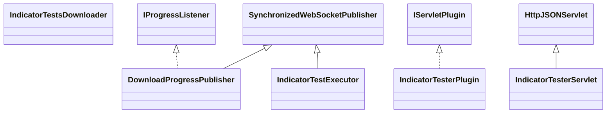

# CodeEditorIndicatorTester.jar

[Group index](README.md) | [All archives](../README.md)

## Scope and provenance

- **Donor:** `SQX_145_REFERENCE_ROOT/internal/plugins/CodeEditorIndicatorTester/CodeEditorIndicatorTester.jar`.
- **SHA-256:** `f4d719de679ce6da796373e0342e3c0de70078273ebc0f69ba43a6fab49e7071`; accessed 2026-10-06; captured `2026-10-06T18:54:51.906614+00:00`.
- **Classes:** 7 raw entries; 7 unique entry names. Duplicate occurrence indices are zero-based.
- **Inspection:** read-only ZIP hashing and class-file structural parsing; signatures/descriptors, modifiers, hierarchy and references only. Bytecode bodies are hashed, not published.
- **Allocation:** proposed `FEAT-AUTHORING-CODE-EDITOR-INDICATOR-TESTER`, P07; [roadmap](../../sqx-full-application-roadmap.md). Domain README registration remains required.
- **Repository:** `01067f00031428613c6394064ca1bcadc1ba00ee`; review state unreviewed. Download label 145-dev1; installed build/activation and runtime equivalence unverified.
- **Limit:** every class/member is inventoried; declaration coverage does not establish consumed calls, defaults, formulas, failure semantics or algorithm parity.
- **Archive/resource index:** [143.json](../../../evidence/sqx145/archives/145/143.json).

## Complete member declarations

Member shards contain exact JVM names/descriptors, access flags, generic signatures, throws types, declared fields/methods, superclass/interfaces and referenced class names. All classes, nested/synthetic members and overloads are retained. Code length/hash is structural evidence, not a normalized algorithm comparison.

- [001.json](../../../evidence/sqx145/members/143/001.json) — SHA-256 `ac7763d755592ef211a4a941c2b3a7da87de1c543f6d04a3fb67f98a6b536ea6`.

## Focused structural diagram

Up to twelve non-nested classes; arrows show declared inheritance/interfaces only. External type names are not evidence of an available body or an executed dependency.

## Class inventory

| Archive entry | Occurrence | Class SHA-256 | Fields | Methods |
| --- | ---: | --- | ---: | ---: |
| `com/strategyquant/plugin/CodeEditor/impl/IndicatorTester/DownloadProgressPublisher.class` | 0 | `d0e0865b917bcde23ba47009da6a015d990c39f0bfbb6d12861661d40043f7d6` | 5 | 13 |
| `com/strategyquant/plugin/CodeEditor/impl/IndicatorTester/IndicatorTestExecutor$1.class` | 0 | `7c2b1839170a8517849dd1adffac218f88b2feae6a861e401bfd1ffedb7071fd` | 1 | 2 |
| `com/strategyquant/plugin/CodeEditor/impl/IndicatorTester/IndicatorTestExecutor.class` | 0 | `6792edc13cef075dbb5a8223ff48aaa8ddb85d04bdd0c9585d198849b498c69d` | 11 | 27 |
| `com/strategyquant/plugin/CodeEditor/impl/IndicatorTester/IndicatorTesterPlugin.class` | 0 | `cf3ef24f543d9dd65fcb0981e64062d9f24524e0aa7a7205244efaa7be7d247d` | 1 | 5 |
| `com/strategyquant/plugin/CodeEditor/impl/IndicatorTester/IndicatorTesterServlet.class` | 0 | `ffe30d136c4e2d44758738cc3edbf58c50de134aabd36f86243dc5cc0aa7c600` | 2 | 13 |
| `com/strategyquant/plugin/CodeEditor/impl/IndicatorTester/IndicatorTestsDownloader$1.class` | 0 | `b72082db81223b49e29d7cf8526c61b3e26163862d51724e11296cf21b5859eb` | 1 | 2 |
| `com/strategyquant/plugin/CodeEditor/impl/IndicatorTester/IndicatorTestsDownloader.class` | 0 | `d6e938a252acf3b9c4cfc6921702f0a8768ada3d20931d082195bf0e0285db44` | 3 | 9 |
