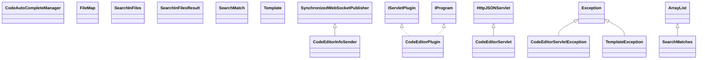

# ServletCodeEditor.jar

[Group index](README.md) | [All archives](../README.md)

## Scope and provenance

- **Donor:** `SQX_145_REFERENCE_ROOT/internal/plugins/ServletCodeEditor/ServletCodeEditor.jar`.
- **SHA-256:** `ad9b7062db2f6bc617a5e865b01b049f03f21d28f2db61b35976c122c0edbef7`; accessed 2026-10-06; captured `2026-10-06T18:54:51.906614+00:00`.
- **Classes:** 13 raw entries; 13 unique entry names. Duplicate occurrence indices are zero-based.
- **Inspection:** read-only ZIP hashing and class-file structural parsing; signatures/descriptors, modifiers, hierarchy and references only. Bytecode bodies are hashed, not published.
- **Allocation:** proposed `FEAT-AUTHORING-SERVLET-CODE-EDITOR`, P07; [roadmap](../../sqx-full-application-roadmap.md). Domain README registration remains required.
- **Repository:** `01067f00031428613c6394064ca1bcadc1ba00ee`; review state unreviewed. Download label 145-dev1; installed build/activation and runtime equivalence unverified.
- **Limit:** every class/member is inventoried; declaration coverage does not establish consumed calls, defaults, formulas, failure semantics or algorithm parity.
- **Archive/resource index:** [230.json](../../../evidence/sqx145/archives/145/230.json).

## Complete member declarations

Member shards contain exact JVM names/descriptors, access flags, generic signatures, throws types, declared fields/methods, superclass/interfaces and referenced class names. All classes, nested/synthetic members and overloads are retained. Code length/hash is structural evidence, not a normalized algorithm comparison.

- [001.json](../../../evidence/sqx145/members/230/001.json) — SHA-256 `d45152218b294434b4c0b7e4571b51fbe38c54083aa9a99da0e286b9f807b6c8`.

## Focused structural diagram

Up to twelve non-nested classes; arrows show declared inheritance/interfaces only. External type names are not evidence of an available body or an executed dependency.

## Class inventory

| Archive entry | Occurrence | Class SHA-256 | Fields | Methods |
| --- | ---: | --- | ---: | ---: |
| `com/strategyquant/plugin/Servlet/impl/CodeEditor/CodeAutoCompleteManager.class` | 0 | `d8bc29255472ab67ce96bb4e8c8de47bc2a4fab91c250b83086504cf988f8b83` | 1 | 12 |
| `com/strategyquant/plugin/Servlet/impl/CodeEditor/CodeEditorInfoSender.class` | 0 | `088b22e09911623cf34be0522bf61b7c1462088116bf2b4783dd4926daad2aef` | 2 | 4 |
| `com/strategyquant/plugin/Servlet/impl/CodeEditor/CodeEditorPlugin.class` | 0 | `f7ea7c9cf15b8f5a9053b6f845d92d2c58a8713af3b3466efe35eecd545c48d0` | 2 | 6 |
| `com/strategyquant/plugin/Servlet/impl/CodeEditor/CodeEditorServlet.class` | 0 | `58915c4d81006824c1a7b69a99cd0a2dd2ecda8c5fc24ecc5758ab41a8da8f11` | 24 | 48 |
| `com/strategyquant/plugin/Servlet/impl/CodeEditor/CodeEditorServletException.class` | 0 | `c0418ea5b3807ac051d3926b4d30af85f076a9ca7ccfb28e59df436d20d4694e` | 0 | 1 |
| `com/strategyquant/plugin/Servlet/impl/CodeEditor/FileMap.class` | 0 | `688d4624d2824b14f7dc0976e38979312d875ad60d878658ba8922afabec0ed6` | 19 | 18 |
| `com/strategyquant/plugin/Servlet/impl/CodeEditor/searchInFiles/SearchInFiles.class` | 0 | `d0d8b3538465af8b3dd500020bbf165f8cbf8e8b099dfa6006824ee15b7be360` | 12 | 12 |
| `com/strategyquant/plugin/Servlet/impl/CodeEditor/searchInFiles/SearchInFilesResult.class` | 0 | `e606b33a896ce40067bb6387d8368cd7d4fe35841691cbd684de5e4823f214a2` | 2 | 3 |
| `com/strategyquant/plugin/Servlet/impl/CodeEditor/searchInFiles/SearchMatch.class` | 0 | `792fe7aaccc47b0586f7069e25f78ce4f9d749a74da22d0b28e2c164d026a477` | 2 | 3 |
| `com/strategyquant/plugin/Servlet/impl/CodeEditor/searchInFiles/SearchMatches.class` | 0 | `d68a7a7c3c7b4e59015c44011975042ddfdde09a547acbb97e40b45e512c3972` | 0 | 1 |
| `com/strategyquant/plugin/Servlet/impl/CodeEditor/templates/Template.class` | 0 | `4e9a62a7d6a6d7230371e0909ed9e5eb3c3a08d5a39b8928132b557ce3f19e06` | 4 | 12 |
| `com/strategyquant/plugin/Servlet/impl/CodeEditor/templates/TemplateException.class` | 0 | `537436dad7026099903794d13872829d100452897bfc3a13828bdbba159c0019` | 0 | 2 |
| `com/strategyquant/plugin/Servlet/impl/CodeEditor/templates/Templates.class` | 0 | `6aa73afbea5e0bdb75f038415a69a5e9cdba80fc4d4d6998b87ae24cc8c19fdd` | 6 | 7 |
