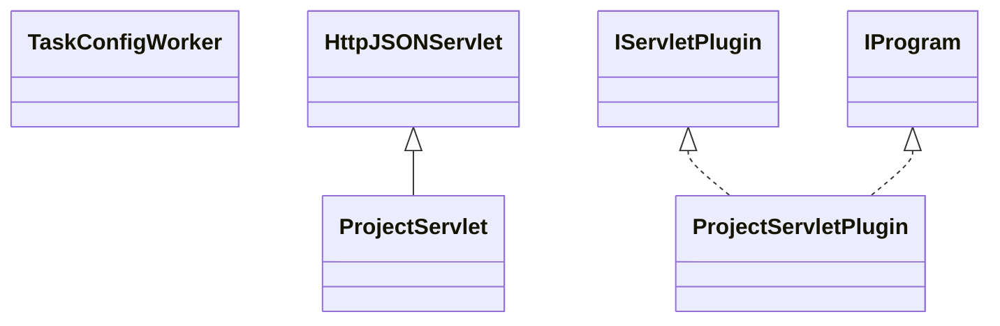

# ServletProject.jar

[Group index](README.md) | [All archives](../README.md)

## Scope and provenance

- **Donor:** `SQX_145_REFERENCE_ROOT/internal/plugins/ServletProject/ServletProject.jar`.
- **SHA-256:** `39cb9a77afca650b62226815fe1a5e43f465da620b291eab0a9f0be98036d7ed`; accessed 2026-10-06; captured `2026-10-06T18:54:51.906614+00:00`.
- **Classes:** 13 raw entries; 13 unique entry names. Duplicate occurrence indices are zero-based.
- **Inspection:** read-only ZIP hashing and class-file structural parsing; signatures/descriptors, modifiers, hierarchy and references only. Bytecode bodies are hashed, not published.
- **Allocation:** proposed `FEAT-PROJECT-SERVLET-PROJECT`, P13; [roadmap](../../sqx-full-application-roadmap.md). Domain README registration remains required.
- **Repository:** `01067f00031428613c6394064ca1bcadc1ba00ee`; review state unreviewed. Download label 145-dev1; installed build/activation and runtime equivalence unverified.
- **Limit:** every class/member is inventoried; declaration coverage does not establish consumed calls, defaults, formulas, failure semantics or algorithm parity.
- **Archive/resource index:** [234.json](../../../evidence/sqx145/archives/145/234.json).

## Complete member declarations

Member shards contain exact JVM names/descriptors, access flags, generic signatures, throws types, declared fields/methods, superclass/interfaces and referenced class names. All classes, nested/synthetic members and overloads are retained. Code length/hash is structural evidence, not a normalized algorithm comparison.

- [001.json](../../../evidence/sqx145/members/234/001.json) — SHA-256 `34905cadd09dbdc1cf173f71d32786797c7d582ad116530214c7999b436557a7`.

## Focused structural diagram

Up to twelve non-nested classes; arrows show declared inheritance/interfaces only. External type names are not evidence of an available body or an executed dependency.

## Class inventory

| Archive entry | Occurrence | Class SHA-256 | Fields | Methods |
| --- | ---: | --- | ---: | ---: |
| `com/strategyquant/plugin/Servlet/impl/Project/ProjectServlet$1.class` | 0 | `839fb5987290d527db691e92345cff37c87f9f8c59ead9fcb4b8b326d833b7a4` | 2 | 4 |
| `com/strategyquant/plugin/Servlet/impl/Project/ProjectServlet$10.class` | 0 | `140d739302e1f72b91e6a89ec3829bb74bef08d2a831ff86bbe3ae737b365c49` | 2 | 2 |
| `com/strategyquant/plugin/Servlet/impl/Project/ProjectServlet$2.class` | 0 | `7a6920f678b75d7beafa2d5ef3d3fd8659c172d2580f9d5e454184b39c6e9cbe` | 3 | 4 |
| `com/strategyquant/plugin/Servlet/impl/Project/ProjectServlet$3.class` | 0 | `4fd069dc53b5353d7f9d1c1183d25208e90ecccee51734ee90a826a89b04e319` | 5 | 2 |
| `com/strategyquant/plugin/Servlet/impl/Project/ProjectServlet$4.class` | 0 | `29e628daea7fc9399d0d4e7feaf9c25af72b879cdf05edf94e81ccdb739e1d0c` | 2 | 2 |
| `com/strategyquant/plugin/Servlet/impl/Project/ProjectServlet$5.class` | 0 | `c7f4086c253d234b66dbfd00da9a84460e21caf54577058b0cbb4032fea4b9ca` | 2 | 2 |
| `com/strategyquant/plugin/Servlet/impl/Project/ProjectServlet$6.class` | 0 | `abe423dd0d917843f824ce980b26910a935fcbe8c630e445b51fb93e45980a0f` | 7 | 2 |
| `com/strategyquant/plugin/Servlet/impl/Project/ProjectServlet$7.class` | 0 | `de18456d0e9296a6599decbea1b59324d88372e072c2f2e393ee275d75b85859` | 7 | 2 |
| `com/strategyquant/plugin/Servlet/impl/Project/ProjectServlet$8.class` | 0 | `4cde001c5674593fefae89da1465ce7bd87eb9ea7427fec28a6e2bdf4457ed61` | 8 | 2 |
| `com/strategyquant/plugin/Servlet/impl/Project/ProjectServlet$9.class` | 0 | `31e9b171ade8b2837da69b0a04f42848b3f3394baaa02d41a54e5bf8a30febfc` | 2 | 4 |
| `com/strategyquant/plugin/Servlet/impl/Project/ProjectServlet.class` | 0 | `86b943c0d1d941dba44a1ad1dd9ebb187c8c0a4f5c1df03253db43d207d052e1` | 4 | 85 |
| `com/strategyquant/plugin/Servlet/impl/Project/ProjectServletPlugin.class` | 0 | `106901a019af07137f971af909fe16d01422d0d4232bb8d809d4d37cffcf8577` | 2 | 6 |
| `com/strategyquant/plugin/Servlet/impl/Project/TaskConfigWorker.class` | 0 | `41777ddaacdcdb74f0f798948b5dbaaeae87f88f525d60989a4c3d9168e832f5` | 1 | 6 |
