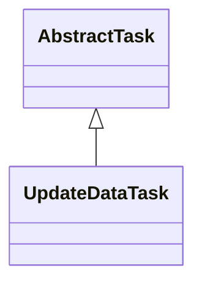

# TaskUpdateData.jar

[Group index](README.md) | [All archives](../README.md)

## Scope and provenance

- **Donor:** `SQX_145_REFERENCE_ROOT/internal/plugins/TaskUpdateData/TaskUpdateData.jar`.
- **SHA-256:** `bfa0bb75056cfc77dac3ae15b19e58fc62fc86178154d9d9a04c6f0dd3d47508`; accessed 2026-10-06; captured `2026-10-06T18:54:51.906614+00:00`.
- **Classes:** 2 raw entries; 2 unique entry names. Duplicate occurrence indices are zero-based.
- **Inspection:** read-only ZIP hashing and class-file structural parsing; signatures/descriptors, modifiers, hierarchy and references only. Bytecode bodies are hashed, not published.
- **Allocation:** proposed `FEAT-PROJECT-TASK-UPDATE-DATA`, P13; [roadmap](../../sqx-full-application-roadmap.md). Domain README registration remains required.
- **Repository:** `01067f00031428613c6394064ca1bcadc1ba00ee`; review state unreviewed. Download label 145-dev1; installed build/activation and runtime equivalence unverified.
- **Limit:** every class/member is inventoried; declaration coverage does not establish consumed calls, defaults, formulas, failure semantics or algorithm parity.
- **Archive/resource index:** [287.json](../../../evidence/sqx145/archives/145/287.json).

## Complete member declarations

Member shards contain exact JVM names/descriptors, access flags, generic signatures, throws types, declared fields/methods, superclass/interfaces and referenced class names. All classes, nested/synthetic members and overloads are retained. Code length/hash is structural evidence, not a normalized algorithm comparison.

- [001.json](../../../evidence/sqx145/members/287/001.json) — SHA-256 `52a14a0cecc489f0e04e58753b1c45d94428b4afa705a4f0f6bbac527eee11c6`.

## Focused structural diagram

Up to twelve non-nested classes; arrows show declared inheritance/interfaces only. External type names are not evidence of an available body or an executed dependency.

## Class inventory

| Archive entry | Occurrence | Class SHA-256 | Fields | Methods |
| --- | ---: | --- | ---: | ---: |
| `com/strategyquant/plugin/Task/impl/UpdateData/UpdateDataTask$1.class` | 0 | `4a45f7bfa70700c756743557f2735188a1b1db0835d178186441168d685409d8` | 1 | 2 |
| `com/strategyquant/plugin/Task/impl/UpdateData/UpdateDataTask.class` | 0 | `ae7dcf47bb8bb400c622cbb39c9e8fd44e58edc1e27320cf3b77b3c4193c5987` | 3 | 21 |
