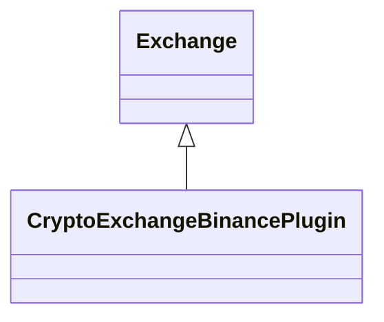

# CryptoExchangeBinance.jar

[Group index](README.md) | [All archives](../README.md)

## Scope and provenance

- **Donor:** `SQX_145_REFERENCE_ROOT/internal/plugins/CryptoExchangeBinance/CryptoExchangeBinance.jar`.
- **SHA-256:** `f61657cfd2d188cba920a733bdf0810138e8aa702fc8e38d47bf55b352646edb`; accessed 2026-10-06; captured `2026-10-06T18:54:51.906614+00:00`.
- **Classes:** 1 raw entries; 1 unique entry names. Duplicate occurrence indices are zero-based.
- **Inspection:** read-only ZIP hashing and class-file structural parsing; signatures/descriptors, modifiers, hierarchy and references only. Bytecode bodies are hashed, not published.
- **Allocation:** proposed `FEAT-DATA-SOURCE-CRYPTO-EXCHANGE-BINANCE`, P04; [roadmap](../../sqx-full-application-roadmap.md). Domain README registration remains required.
- **Repository:** `01067f00031428613c6394064ca1bcadc1ba00ee`; review state unreviewed. Download label 145-dev1; installed build/activation and runtime equivalence unverified.
- **Limit:** every class/member is inventoried; declaration coverage does not establish consumed calls, defaults, formulas, failure semantics or algorithm parity.
- **Archive/resource index:** [156.json](../../../evidence/sqx145/archives/145/156.json).

## Complete member declarations

Member shards contain exact JVM names/descriptors, access flags, generic signatures, throws types, declared fields/methods, superclass/interfaces and referenced class names. All classes, nested/synthetic members and overloads are retained. Code length/hash is structural evidence, not a normalized algorithm comparison.

- [001.json](../../../evidence/sqx145/members/156/001.json) — SHA-256 `0486fb50380f7df48ac0a5e01a576c8b73d91e4752f6695c28584ad2ed2b2782`.

## Focused structural diagram

Up to twelve non-nested classes; arrows show declared inheritance/interfaces only. External type names are not evidence of an available body or an executed dependency.

## Class inventory

| Archive entry | Occurrence | Class SHA-256 | Fields | Methods |
| --- | ---: | --- | ---: | ---: |
| `com/strategyquant/plugin/CryptoExchange/impl/Binance/CryptoExchangeBinancePlugin.class` | 0 | `75cbdd618509b13e57f40f9a050bfc78ba2c8266dab5bfb459f37f10662c5a4f` | 1 | 14 |
