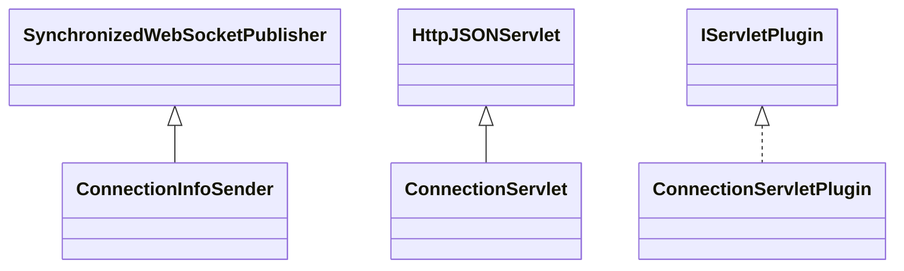

# DataManagerConnections.jar

[Group index](README.md) | [All archives](../README.md)

## Scope and provenance

- **Donor:** `SQX_145_REFERENCE_ROOT/internal/plugins/DataManagerConnections/DataManagerConnections.jar`.
- **SHA-256:** `4272999e7250c713361be4ccce7f02ba7040478a6b1c608e31f9e7b4f965e713`; accessed 2026-10-06; captured `2026-10-06T18:54:51.906614+00:00`.
- **Classes:** 3 raw entries; 3 unique entry names. Duplicate occurrence indices are zero-based.
- **Inspection:** read-only ZIP hashing and class-file structural parsing; signatures/descriptors, modifiers, hierarchy and references only. Bytecode bodies are hashed, not published.
- **Allocation:** proposed `FEAT-CONNECTION-DATA-MANAGER-CONNECTIONS`, P16; [roadmap](../../sqx-full-application-roadmap.md). Domain README registration remains required.
- **Repository:** `01067f00031428613c6394064ca1bcadc1ba00ee`; review state unreviewed. Download label 145-dev1; installed build/activation and runtime equivalence unverified.
- **Limit:** every class/member is inventoried; declaration coverage does not establish consumed calls, defaults, formulas, failure semantics or algorithm parity.
- **Archive/resource index:** [167.json](../../../evidence/sqx145/archives/145/167.json).

## Complete member declarations

Member shards contain exact JVM names/descriptors, access flags, generic signatures, throws types, declared fields/methods, superclass/interfaces and referenced class names. All classes, nested/synthetic members and overloads are retained. Code length/hash is structural evidence, not a normalized algorithm comparison.

- [001.json](../../../evidence/sqx145/members/167/001.json) — SHA-256 `63c5655cd2fe985f5204f0a0615f0bb51006809f448bad590632259facd33494`.

## Focused structural diagram

Up to twelve non-nested classes; arrows show declared inheritance/interfaces only. External type names are not evidence of an available body or an executed dependency.

## Class inventory

| Archive entry | Occurrence | Class SHA-256 | Fields | Methods |
| --- | ---: | --- | ---: | ---: |
| `com/strategyquant/plugin/DataManager/impl/Connections/ConnectionInfoSender.class` | 0 | `99c92568933dee2653113fc0aff04eeae7f5c18f68d12e7ce68314e1df7e1fc5` | 3 | 7 |
| `com/strategyquant/plugin/DataManager/impl/Connections/ConnectionServlet.class` | 0 | `c6b97fcb23750184c14cfa8a1a56abe95fb4e63c7d5674806ff535b37411cda6` | 3 | 10 |
| `com/strategyquant/plugin/DataManager/impl/Connections/ConnectionServletPlugin.class` | 0 | `e03cbdce91c816ac8aba96946af8e380e1e04c634140d50e2b20f6acf6964b34` | 1 | 5 |
