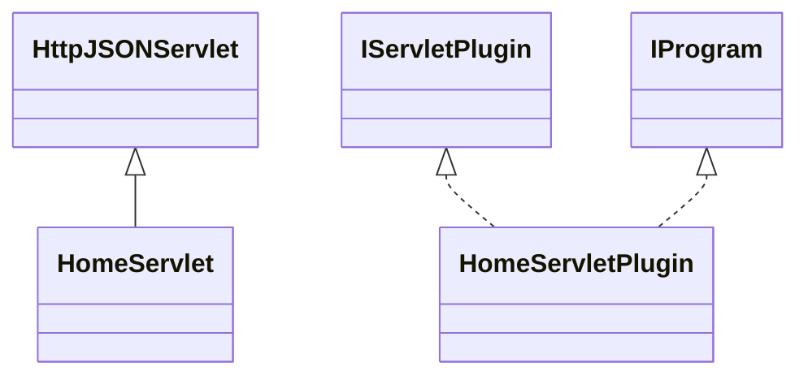

# DataManagerHome.jar

[Group index](README.md) | [All archives](../README.md)

## Scope and provenance

- **Donor:** `SQX_145_REFERENCE_ROOT/internal/plugins/DataManagerHome/DataManagerHome.jar`.
- **SHA-256:** `88e8dae52fec7138bcc9208e067370902d46b895c53c044ab0ff350b17c274bb`; accessed 2026-10-06; captured `2026-10-06T18:54:51.906614+00:00`.
- **Classes:** 2 raw entries; 2 unique entry names. Duplicate occurrence indices are zero-based.
- **Inspection:** read-only ZIP hashing and class-file structural parsing; signatures/descriptors, modifiers, hierarchy and references only. Bytecode bodies are hashed, not published.
- **Allocation:** proposed `FEAT-DATA-DATA-MANAGER-HOME`, P03; [roadmap](../../sqx-full-application-roadmap.md). Domain README registration remains required.
- **Repository:** `01067f00031428613c6394064ca1bcadc1ba00ee`; review state unreviewed. Download label 145-dev1; installed build/activation and runtime equivalence unverified.
- **Limit:** every class/member is inventoried; declaration coverage does not establish consumed calls, defaults, formulas, failure semantics or algorithm parity.
- **Archive/resource index:** [170.json](../../../evidence/sqx145/archives/145/170.json).

## Complete member declarations

Member shards contain exact JVM names/descriptors, access flags, generic signatures, throws types, declared fields/methods, superclass/interfaces and referenced class names. All classes, nested/synthetic members and overloads are retained. Code length/hash is structural evidence, not a normalized algorithm comparison.

- [001.json](../../../evidence/sqx145/members/170/001.json) — SHA-256 `78e502e32e1f92a8558b29a1810f56d3ffc5a516c21d47dfec891d9f5f7e40e6`.

## Focused structural diagram

Up to twelve non-nested classes; arrows show declared inheritance/interfaces only. External type names are not evidence of an available body or an executed dependency.

## Class inventory

| Archive entry | Occurrence | Class SHA-256 | Fields | Methods |
| --- | ---: | --- | ---: | ---: |
| `com/strategyquant/plugin/DataManager/impl/Home/HomeServlet.class` | 0 | `d1478a1207f24358c04f84043184ce8f0babb70aedb0d276ffde144d36a68954` | 2 | 3 |
| `com/strategyquant/plugin/DataManager/impl/Home/HomeServletPlugin.class` | 0 | `c2c5a987afa496dc42e417458cbac08c9344f7b65917702c292aab7fac8afa37` | 2 | 6 |
