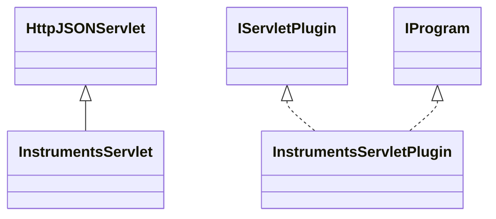

# DataManagerInstruments.jar

[Group index](README.md) | [All archives](../README.md)

## Scope and provenance

- **Donor:** `SQX_145_REFERENCE_ROOT/internal/plugins/DataManagerInstruments/DataManagerInstruments.jar`.
- **SHA-256:** `e820bd7438ff1482c3233b12bb47454b4e57e3dfa3482f3904f1c67e0815a223`; accessed 2026-10-06; captured `2026-10-06T18:54:51.906614+00:00`.
- **Classes:** 3 raw entries; 3 unique entry names. Duplicate occurrence indices are zero-based.
- **Inspection:** read-only ZIP hashing and class-file structural parsing; signatures/descriptors, modifiers, hierarchy and references only. Bytecode bodies are hashed, not published.
- **Allocation:** proposed `FEAT-DATA-DATA-MANAGER-INSTRUMENTS`, P03; [roadmap](../../sqx-full-application-roadmap.md). Domain README registration remains required.
- **Repository:** `01067f00031428613c6394064ca1bcadc1ba00ee`; review state unreviewed. Download label 145-dev1; installed build/activation and runtime equivalence unverified.
- **Limit:** every class/member is inventoried; declaration coverage does not establish consumed calls, defaults, formulas, failure semantics or algorithm parity.
- **Archive/resource index:** [171.json](../../../evidence/sqx145/archives/145/171.json).

## Complete member declarations

Member shards contain exact JVM names/descriptors, access flags, generic signatures, throws types, declared fields/methods, superclass/interfaces and referenced class names. All classes, nested/synthetic members and overloads are retained. Code length/hash is structural evidence, not a normalized algorithm comparison.

- [001.json](../../../evidence/sqx145/members/171/001.json) — SHA-256 `341920b3ce08c51e42e1c2b4e37ed38fe7c21ef2f0643137abb336de2999be27`.

## Focused structural diagram

Up to twelve non-nested classes; arrows show declared inheritance/interfaces only. External type names are not evidence of an available body or an executed dependency.

## Class inventory

| Archive entry | Occurrence | Class SHA-256 | Fields | Methods |
| --- | ---: | --- | ---: | ---: |
| `com/strategyquant/plugin/DataManager/impl/Instruments/InstrumentsServlet$1.class` | 0 | `11a3d4815fb48d37edb8faa215613824e123a68598810383b7d9a20d7967457e` | 3 | 2 |
| `com/strategyquant/plugin/DataManager/impl/Instruments/InstrumentsServlet.class` | 0 | `0474448a1a98d6342249241045b83f265962de872399a46c9bf9f10fb9bf0408` | 1 | 23 |
| `com/strategyquant/plugin/DataManager/impl/Instruments/InstrumentsServletPlugin.class` | 0 | `71b9d4eade97301b0b4d1ac875255106bc38e5ed35bbf1485bd135340f24d880` | 2 | 6 |
