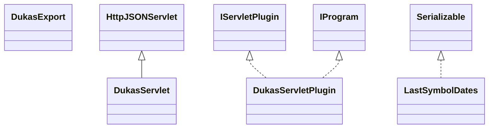

# DataSourceDukascopy.jar

[Group index](README.md) | [All archives](../README.md)

## Scope and provenance

- **Donor:** `SQX_145_REFERENCE_ROOT/internal/plugins/DataSourceDukascopy/DataSourceDukascopy.jar`.
- **SHA-256:** `40b61a3670af7fcf1265fa2d07889d6c75df100b96dd1d73b64c8de793e6913c`; accessed 2026-10-06; captured `2026-10-06T18:54:51.906614+00:00`.
- **Classes:** 6 raw entries; 6 unique entry names. Duplicate occurrence indices are zero-based.
- **Inspection:** read-only ZIP hashing and class-file structural parsing; signatures/descriptors, modifiers, hierarchy and references only. Bytecode bodies are hashed, not published.
- **Allocation:** proposed `FEAT-DATA-SOURCE-DATA-SOURCE-DUKASCOPY`, P04; [roadmap](../../sqx-full-application-roadmap.md). Domain README registration remains required.
- **Repository:** `01067f00031428613c6394064ca1bcadc1ba00ee`; review state unreviewed. Download label 145-dev1; installed build/activation and runtime equivalence unverified.
- **Limit:** every class/member is inventoried; declaration coverage does not establish consumed calls, defaults, formulas, failure semantics or algorithm parity.
- **Archive/resource index:** [175.json](../../../evidence/sqx145/archives/145/175.json).

## Complete member declarations

Member shards contain exact JVM names/descriptors, access flags, generic signatures, throws types, declared fields/methods, superclass/interfaces and referenced class names. All classes, nested/synthetic members and overloads are retained. Code length/hash is structural evidence, not a normalized algorithm comparison.

- [001.json](../../../evidence/sqx145/members/175/001.json) — SHA-256 `e9d553c9fb7c23dc54f774dfd939019243bd04fee9f1fbe39dbaa054a8abf5f6`.

## Focused structural diagram

Up to twelve non-nested classes; arrows show declared inheritance/interfaces only. External type names are not evidence of an available body or an executed dependency.

## Class inventory

| Archive entry | Occurrence | Class SHA-256 | Fields | Methods |
| --- | ---: | --- | ---: | ---: |
| `com/strategyquant/plugin/DataSource/impl/Dukascopy/DukasExport.class` | 0 | `d4b1e76279e8221d556621dc68a4c2bf609c627d2bff50e38826ed80ca34e696` | 5 | 11 |
| `com/strategyquant/plugin/DataSource/impl/Dukascopy/DukasServlet$1.class` | 0 | `6c1ddffc04ad1100bce2bdb7f5ec3d00c96324770bd5ee28359b138a5057d041` | 1 | 2 |
| `com/strategyquant/plugin/DataSource/impl/Dukascopy/DukasServlet$2.class` | 0 | `428219651a4184b12aaa4ff7d59d3290c72185557af9fdb61468199f9b95a02b` | 2 | 2 |
| `com/strategyquant/plugin/DataSource/impl/Dukascopy/DukasServlet.class` | 0 | `0739e3d30655c464f49b5f87e9e73fbe93edc8c59d2e6da50796420996579fb3` | 4 | 20 |
| `com/strategyquant/plugin/DataSource/impl/Dukascopy/DukasServletPlugin.class` | 0 | `afa0ac47340cca2c01534ce9d702203f11c677065fc5edcb47834ac71167e363` | 2 | 6 |
| `com/strategyquant/plugin/DataSource/impl/Dukascopy/LastSymbolDates.class` | 0 | `8538e185f97b7c6951f4135267bf69fce247ed3d8d5de4eb2c2a4ea4b25482e4` | 3 | 1 |
