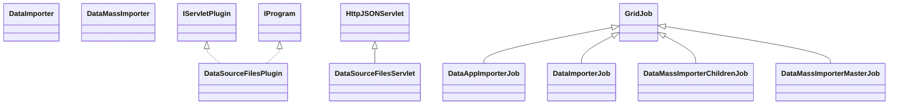

# DataSourceFiles.jar

[Group index](README.md) | [All archives](../README.md)

## Scope and provenance

- **Donor:** `SQX_145_REFERENCE_ROOT/internal/plugins/DataSourceFiles/DataSourceFiles.jar`.
- **SHA-256:** `952be70cb76b5293fd6f110df9679eec6bbf1393139ae77f6f3cc5b0c3621783`; accessed 2026-10-06; captured `2026-10-06T18:54:51.906614+00:00`.
- **Classes:** 10 raw entries; 10 unique entry names. Duplicate occurrence indices are zero-based.
- **Inspection:** read-only ZIP hashing and class-file structural parsing; signatures/descriptors, modifiers, hierarchy and references only. Bytecode bodies are hashed, not published.
- **Allocation:** proposed `FEAT-DATA-SOURCE-DATA-SOURCE-FILES`, P04; [roadmap](../../sqx-full-application-roadmap.md). Domain README registration remains required.
- **Repository:** `01067f00031428613c6394064ca1bcadc1ba00ee`; review state unreviewed. Download label 145-dev1; installed build/activation and runtime equivalence unverified.
- **Limit:** every class/member is inventoried; declaration coverage does not establish consumed calls, defaults, formulas, failure semantics or algorithm parity.
- **Archive/resource index:** [176.json](../../../evidence/sqx145/archives/145/176.json).

## Complete member declarations

Member shards contain exact JVM names/descriptors, access flags, generic signatures, throws types, declared fields/methods, superclass/interfaces and referenced class names. All classes, nested/synthetic members and overloads are retained. Code length/hash is structural evidence, not a normalized algorithm comparison.

- [001.json](../../../evidence/sqx145/members/176/001.json) — SHA-256 `56a3e6a8ec8b7fb44697df16f179631b1d936202a4f196925a86624e3cbbd0be`.

## Focused structural diagram

Up to twelve non-nested classes; arrows show declared inheritance/interfaces only. External type names are not evidence of an available body or an executed dependency.

## Class inventory

| Archive entry | Occurrence | Class SHA-256 | Fields | Methods |
| --- | ---: | --- | ---: | ---: |
| `com/strategyquant/plugin/DataSource/impl/Files/DataSourceFilesPlugin.class` | 0 | `3c9f5b644b4fedcf151134faa2fcc98a6e5741a1d24b728bcb993acd599ba54b` | 2 | 6 |
| `com/strategyquant/plugin/DataSource/impl/Files/DataSourceFilesServlet.class` | 0 | `36ae89a1bbb1c894aef8384367b5d983e00f759ff63cf95fd4c9374b88c620ac` | 2 | 19 |
| `com/strategyquant/plugin/DataSource/impl/Files/job/DataAppImporterJob.class` | 0 | `622c76e8a8b8da0962624ac51a2e89bf42c17515ef05e3faad642ad7a280667e` | 1 | 5 |
| `com/strategyquant/plugin/DataSource/impl/Files/job/DataImporter.class` | 0 | `8c695fc3eb747de94b1857ef915b20f9ee9264ce807df0b558bd34f30ec62b68` | 6 | 15 |
| `com/strategyquant/plugin/DataSource/impl/Files/job/DataImporterJob.class` | 0 | `3ad0910330a847aa6b43172d69c787d0d1dff9483b67402f4e754d8009cc9fdf` | 5 | 5 |
| `com/strategyquant/plugin/DataSource/impl/Files/job/DataMassImporter.class` | 0 | `f7e222790094d086ed6d292d8b44fd04ef514274ad60e82967b83e002c46fd91` | 7 | 9 |
| `com/strategyquant/plugin/DataSource/impl/Files/job/DataMassImporterChildrenJob.class` | 0 | `d334747a2bbe157ec661878deb36cd1580e53669b1cb51b45f279394016fba31` | 4 | 5 |
| `com/strategyquant/plugin/DataSource/impl/Files/job/DataMassImporterMasterJob$1.class` | 0 | `f694b1d9cc6a56332a8a1bf6d328a88ab2843f5e2c101cc80b69a348bf66332a` | 1 | 2 |
| `com/strategyquant/plugin/DataSource/impl/Files/job/DataMassImporterMasterJob$2.class` | 0 | `36766db2a50de7b360dff2fad564c69011042cbe64f601c9ae290b164792afb8` | 1 | 2 |
| `com/strategyquant/plugin/DataSource/impl/Files/job/DataMassImporterMasterJob.class` | 0 | `bcc42ef41aebd18ae5a0e1b828589a97fde90abe89699fee12b5767b84f691c2` | 13 | 17 |
