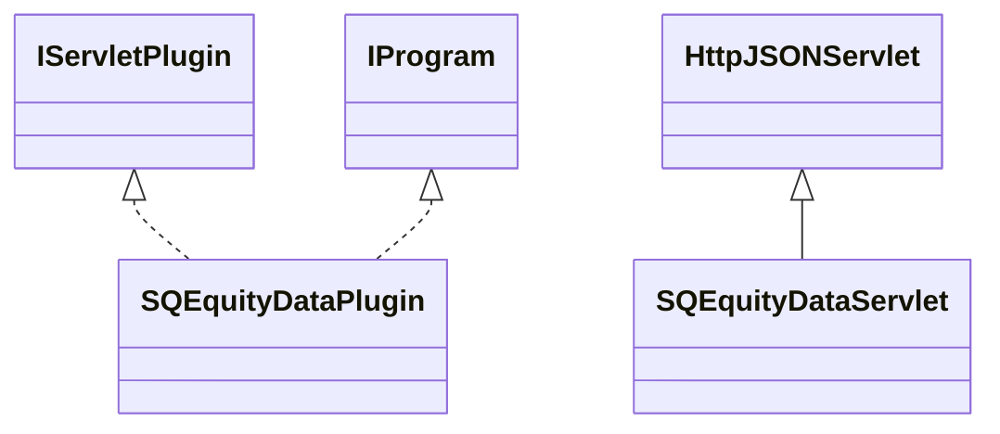

# DataSourceSQEquityData.jar

[Group index](README.md) | [All archives](../README.md)

## Scope and provenance

- **Donor:** `SQX_145_REFERENCE_ROOT/internal/plugins/DataSourceSQEquityData/DataSourceSQEquityData.jar`.
- **SHA-256:** `872584251e604ec4d6dc7a8837a5a674fc30daef5251891090d1fb0b85365e53`; accessed 2026-10-06; captured `2026-10-06T18:54:51.906614+00:00`.
- **Classes:** 5 raw entries; 5 unique entry names. Duplicate occurrence indices are zero-based.
- **Inspection:** read-only ZIP hashing and class-file structural parsing; signatures/descriptors, modifiers, hierarchy and references only. Bytecode bodies are hashed, not published.
- **Allocation:** proposed `FEAT-DATA-SOURCE-DATA-SOURCE-SQ-EQUITY-DATA`, P04; [roadmap](../../sqx-full-application-roadmap.md). Domain README registration remains required.
- **Repository:** `01067f00031428613c6394064ca1bcadc1ba00ee`; review state unreviewed. Download label 145-dev1; installed build/activation and runtime equivalence unverified.
- **Limit:** every class/member is inventoried; declaration coverage does not establish consumed calls, defaults, formulas, failure semantics or algorithm parity.
- **Archive/resource index:** [178.json](../../../evidence/sqx145/archives/145/178.json).

## Complete member declarations

Member shards contain exact JVM names/descriptors, access flags, generic signatures, throws types, declared fields/methods, superclass/interfaces and referenced class names. All classes, nested/synthetic members and overloads are retained. Code length/hash is structural evidence, not a normalized algorithm comparison.

- [001.json](../../../evidence/sqx145/members/178/001.json) — SHA-256 `910602a4d5dcdccbaeee2bbe4735c17614f8624b3f6e142ba03b4541991fae10`.

## Focused structural diagram

Up to twelve non-nested classes; arrows show declared inheritance/interfaces only. External type names are not evidence of an available body or an executed dependency.

## Class inventory

| Archive entry | Occurrence | Class SHA-256 | Fields | Methods |
| --- | ---: | --- | ---: | ---: |
| `com/strategyquant/plugin/DataSource/impl/SQEquityData/SQEquityDataPlugin.class` | 0 | `3a1272edff033bc31cd9711135b4b0dd5734abbcade67627442b8dd1dd983a0b` | 2 | 6 |
| `com/strategyquant/plugin/DataSource/impl/SQEquityData/SQEquityDataServlet$1.class` | 0 | `48b9e0ec28bf83790673a5f77de2832b22f39f59384cf56d60ac3f876ffffe0d` | 2 | 2 |
| `com/strategyquant/plugin/DataSource/impl/SQEquityData/SQEquityDataServlet$2.class` | 0 | `00588885266ceb41e610eacd152c00dc2eee7fc05466e90c854aea42582aac31` | 1 | 8 |
| `com/strategyquant/plugin/DataSource/impl/SQEquityData/SQEquityDataServlet$3.class` | 0 | `a194cdf86fa5f86cc458839946b868cae86bc5355ca7001c321de36d34ab7d25` | 5 | 4 |
| `com/strategyquant/plugin/DataSource/impl/SQEquityData/SQEquityDataServlet.class` | 0 | `04fb97dc645da6db700f788ac06b176e58b254a610292ab893809e6bfb43c3c1` | 4 | 22 |
