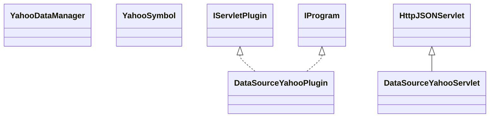

# DataSourceYahoo.jar

[Group index](README.md) | [All archives](../README.md)

## Scope and provenance

- **Donor:** `SQX_145_REFERENCE_ROOT/internal/plugins/DataSourceYahoo/DataSourceYahoo.jar`.
- **SHA-256:** `4a9d64a03e668d1563a14e179c041721779a83b440c7ada56097fb9d28f54a3d`; accessed 2026-10-06; captured `2026-10-06T18:54:51.906614+00:00`.
- **Classes:** 5 raw entries; 5 unique entry names. Duplicate occurrence indices are zero-based.
- **Inspection:** read-only ZIP hashing and class-file structural parsing; signatures/descriptors, modifiers, hierarchy and references only. Bytecode bodies are hashed, not published.
- **Allocation:** proposed `FEAT-DATA-SOURCE-DATA-SOURCE-YAHOO`, P04; [roadmap](../../sqx-full-application-roadmap.md). Domain README registration remains required.
- **Repository:** `01067f00031428613c6394064ca1bcadc1ba00ee`; review state unreviewed. Download label 145-dev1; installed build/activation and runtime equivalence unverified.
- **Limit:** every class/member is inventoried; declaration coverage does not establish consumed calls, defaults, formulas, failure semantics or algorithm parity.
- **Archive/resource index:** [181.json](../../../evidence/sqx145/archives/145/181.json).

## Complete member declarations

Member shards contain exact JVM names/descriptors, access flags, generic signatures, throws types, declared fields/methods, superclass/interfaces and referenced class names. All classes, nested/synthetic members and overloads are retained. Code length/hash is structural evidence, not a normalized algorithm comparison.

- [001.json](../../../evidence/sqx145/members/181/001.json) — SHA-256 `b11c186cbd93f53677e06bd020d8874b96716f1692e9c3574f88ab74d4d765fa`.

## Focused structural diagram

Up to twelve non-nested classes; arrows show declared inheritance/interfaces only. External type names are not evidence of an available body or an executed dependency.

## Class inventory

| Archive entry | Occurrence | Class SHA-256 | Fields | Methods |
| --- | ---: | --- | ---: | ---: |
| `com/strategyquant/plugin/DataSource/impl/Yahoo/DataSourceYahooPlugin.class` | 0 | `9e46208e83301871bd17a66a4fa7f7cd84392601986372b8a7e5fa844a76eea5` | 2 | 6 |
| `com/strategyquant/plugin/DataSource/impl/Yahoo/DataSourceYahooServlet$1.class` | 0 | `4cac10db560d9239cf11215a92cfc7b0a76f1c0427720ed3bff924a023ac9da9` | 3 | 2 |
| `com/strategyquant/plugin/DataSource/impl/Yahoo/DataSourceYahooServlet.class` | 0 | `6eb2edd80e4947fabcb4418e7f42e6c02bdf837fecdda441d2b3271950725765` | 2 | 12 |
| `com/strategyquant/plugin/DataSource/impl/Yahoo/YahooDataManager.class` | 0 | `dfdb6461845e7c406baa63e707b429e8b519cbae0526d26a991a33c00b4272b7` | 2 | 6 |
| `com/strategyquant/plugin/DataSource/impl/Yahoo/YahooSymbol.class` | 0 | `41078c6db0d87abd320df58fb7ee839f0df2593369bdd1f4740428d239e6f3e2` | 3 | 1 |
