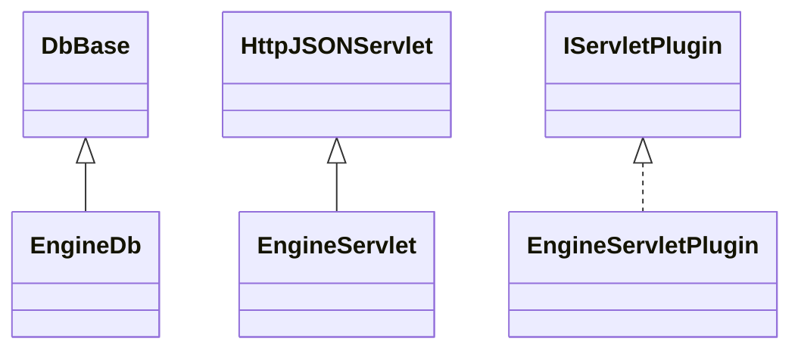

# EnginePanel.jar

[Group index](README.md) | [All archives](../README.md)

## Scope and provenance

- **Donor:** `SQX_145_REFERENCE_ROOT/internal/plugins/EnginePanel/EnginePanel.jar`.
- **SHA-256:** `41c3a4e9037ddde57eefcafb911db5d3fb9626d76c7adead17217bceaa7fdeeb`; accessed 2026-10-06; captured `2026-10-06T18:54:51.906614+00:00`.
- **Classes:** 4 raw entries; 4 unique entry names. Duplicate occurrence indices are zero-based.
- **Inspection:** read-only ZIP hashing and class-file structural parsing; signatures/descriptors, modifiers, hierarchy and references only. Bytecode bodies are hashed, not published.
- **Allocation:** proposed `FEAT-BUILDER-ENGINE-PANEL`, P09; [roadmap](../../sqx-full-application-roadmap.md). Domain README registration remains required.
- **Repository:** `01067f00031428613c6394064ca1bcadc1ba00ee`; review state unreviewed. Download label 145-dev1; installed build/activation and runtime equivalence unverified.
- **Limit:** every class/member is inventoried; declaration coverage does not establish consumed calls, defaults, formulas, failure semantics or algorithm parity.
- **Archive/resource index:** [182.json](../../../evidence/sqx145/archives/145/182.json).

## Complete member declarations

Member shards contain exact JVM names/descriptors, access flags, generic signatures, throws types, declared fields/methods, superclass/interfaces and referenced class names. All classes, nested/synthetic members and overloads are retained. Code length/hash is structural evidence, not a normalized algorithm comparison.

- [001.json](../../../evidence/sqx145/members/182/001.json) — SHA-256 `02c121f21a4c5b6f517c98ad8943a9a2016d34a08627f68e9d716c56e84e295c`.

## Focused structural diagram

Up to twelve non-nested classes; arrows show declared inheritance/interfaces only. External type names are not evidence of an available body or an executed dependency.

## Class inventory

| Archive entry | Occurrence | Class SHA-256 | Fields | Methods |
| --- | ---: | --- | ---: | ---: |
| `com/strategyquant/plugin/Engine/impl/Panel/EngineDb.class` | 0 | `67fc355c40b6f9ceb9bae7b571c3478ffc8da5b7251a5bc17a422c3e33621f80` | 1 | 9 |
| `com/strategyquant/plugin/Engine/impl/Panel/EngineServlet$1.class` | 0 | `b7db48f3fbea8ea72f3a3c68049b718559f482618ae296c2b42fad904b6918c8` | 1 | 2 |
| `com/strategyquant/plugin/Engine/impl/Panel/EngineServlet.class` | 0 | `964d057046d836fcba36b8ca5f761c568683fb3225ea6df7f452221b8d7ddc10` | 1 | 18 |
| `com/strategyquant/plugin/Engine/impl/Panel/EngineServletPlugin.class` | 0 | `fdde13bfe838f0f74a8d820ec3fff52d16ff142030fd7a4b25b11b9644453c45` | 1 | 5 |
