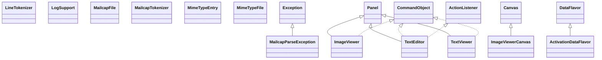

# activation-1.1.1.jar

[Group index](README.md) | [All archives](../README.md)

## Scope and provenance

- **Donor:** `SQX_145_REFERENCE_ROOT/internal/libs/activation-1.1.1.jar`.
- **SHA-256:** `ae475120e9fcd99b4b00b38329bd61cdc5eb754eee03fe66c01f50e137724f99`; accessed 2026-10-06; captured `2026-10-06T18:54:51.906614+00:00`.
- **Classes:** 38 raw entries; 38 unique entry names. Duplicate occurrence indices are zero-based.
- **Inspection:** read-only ZIP hashing and class-file structural parsing; signatures/descriptors, modifiers, hierarchy and references only. Bytecode bodies are hashed, not published.
- **Allocation:** proposed `FEAT-PROJECT-ACTIVATION`, P13; [roadmap](../../sqx-full-application-roadmap.md). Domain README registration remains required.
- **Repository:** `01067f00031428613c6394064ca1bcadc1ba00ee`; review state unreviewed. Download label 145-dev1; installed build/activation and runtime equivalence unverified.
- **Limit:** every class/member is inventoried; declaration coverage does not establish consumed calls, defaults, formulas, failure semantics or algorithm parity.
- **Archive/resource index:** [001.json](../../../evidence/sqx145/archives/145/001.json).

## Complete member declarations

Member shards contain exact JVM names/descriptors, access flags, generic signatures, throws types, declared fields/methods, superclass/interfaces and referenced class names. All classes, nested/synthetic members and overloads are retained. Code length/hash is structural evidence, not a normalized algorithm comparison.

- [001.json](../../../evidence/sqx145/members/001/001.json) — SHA-256 `9434a8790e5805a83f6f8833bacf2df08ca1f2d83bd080312e6433b9462daf6f`.

## Focused structural diagram

Up to twelve non-nested classes; arrows show declared inheritance/interfaces only. External type names are not evidence of an available body or an executed dependency.

## Class inventory

| Archive entry | Occurrence | Class SHA-256 | Fields | Methods |
| --- | ---: | --- | ---: | ---: |
| `com/sun/activation/registries/LineTokenizer.class` | 0 | `8bc05cf99192d7002e4f003523352e091924b66ea90cc07b71c59363156c34b5` | 5 | 5 |
| `com/sun/activation/registries/LogSupport.class` | 0 | `b1503911bfa31b89a0eae58be7484dc7f70354ef055b90833b4ec9263012b66b` | 3 | 5 |
| `com/sun/activation/registries/MailcapFile.class` | 0 | `2a7be6fb9f795542558d71dbce4f7adec60b1d52f46b227e124d6c41b9c797ba` | 4 | 15 |
| `com/sun/activation/registries/MailcapParseException.class` | 0 | `0e6b930d20b92056d56cfa640124900edace398ab19c017ab85bb6c9b88430d7` | 0 | 2 |
| `com/sun/activation/registries/MailcapTokenizer.class` | 0 | `15c9cebe18b30608d29474ff010bf49bc69723db31a9829191a22bc13274158a` | 14 | 13 |
| `com/sun/activation/registries/MimeTypeEntry.class` | 0 | `72b1537846277997cd28a140023b2d436aeb8910eac7b39b9940ac465121b007` | 2 | 4 |
| `com/sun/activation/registries/MimeTypeFile.class` | 0 | `dce4cecdbc7c689cfb761deb9428dc84b0465ee11ce07106bc82abf7ec05d497` | 2 | 8 |
| `com/sun/activation/viewers/ImageViewer.class` | 0 | `c84918127b00b227e95463fad4a1473ce48bcd43ccd00ca2a6cbe676c04cf54a` | 4 | 5 |
| `com/sun/activation/viewers/ImageViewerCanvas.class` | 0 | `6f7261a6072bbcce41b44c19de4fd25ec943d61b00034fe39d787af93542716c` | 1 | 4 |
| `com/sun/activation/viewers/TextEditor.class` | 0 | `40a9f0cefd3735a9e377ca553f3948098e2e2163d920d84730691db229871bc9` | 10 | 8 |
| `com/sun/activation/viewers/TextViewer.class` | 0 | `0cf5dca57ed782d90d5a039e0cdeabd5ccaac839e4d532d589c95b9ad480e652` | 5 | 5 |
| `javax/activation/ActivationDataFlavor.class` | 0 | `13be8cbd37d0e5594c68f159be4259e4c412087f874984dab7ce87a663610209` | 4 | 11 |
| `javax/activation/CommandInfo.class` | 0 | `8e1aecc124cc1e0d34bad702f9924f18e98ca8c1ad7d61d8e3534dcda170d25b` | 2 | 4 |
| `javax/activation/CommandMap.class` | 0 | `91a58a53aaf908e9430c9d89402ba972daafeb74d54e915406bbd6034a881ad6` | 2 | 14 |
| `javax/activation/CommandObject.class` | 0 | `424031852715a2a2abac4d5834fa5582feb1441bf5366e307e831f7755bb8f5e` | 0 | 1 |
| `javax/activation/DataContentHandler.class` | 0 | `7dd9e99167d025b3ff6130021f5baf7319dbed7dbd502bc5eddcdf7db6ae09ec` | 0 | 4 |
| `javax/activation/DataContentHandlerFactory.class` | 0 | `c52adaeb77b3a19e075db53b8c23dbf24cc96e69b66718137ab11adaf99992cd` | 0 | 1 |
| `javax/activation/DataHandler$1.class` | 0 | `f8f0339f4828b7c60fed734598e9a945f1b311514b976acf7615171a7cff464a` | 3 | 2 |
| `javax/activation/DataHandler.class` | 0 | `ed4bd18b3fb348e838ae55d29ecbb49377972e708f4cbe7b6e63989a4b3114ce` | 13 | 26 |
| `javax/activation/DataHandlerDataSource.class` | 0 | `c94d04fc865951ea001cd3903837ae4ade54e88f758b567c033178f04dbd8751` | 1 | 5 |
| `javax/activation/DataSource.class` | 0 | `b82277efa549dab655608a7154582b93ca9434b8291b11cd98d7ffcc950c774f` | 0 | 4 |
| `javax/activation/DataSourceDataContentHandler.class` | 0 | `7ce160862409628be14b4aa9c7249d74260e4eab6beeec65fe4b9d541a019cbf` | 3 | 5 |
| `javax/activation/FileDataSource.class` | 0 | `d188891b5047ffbb0db120824a68b475a3b655b9a2396f72588709413af0dd0d` | 2 | 8 |
| `javax/activation/FileTypeMap.class` | 0 | `a9e656b2bd6c91a83a70be98e6a3eae7e7598fe7f25667f30d3d5788d25949d1` | 2 | 7 |
| `javax/activation/MailcapCommandMap.class` | 0 | `19ad1f18e034a9393498c23c9995b891c03f8c631adf5bdbc8f6a40e703f9af5` | 4 | 19 |
| `javax/activation/MimeType.class` | 0 | `3801744b32f8abd18e62a3659e3503bc04822469619d717d7f26a90c53f3e3b5` | 4 | 20 |
| `javax/activation/MimeTypeParameterList.class` | 0 | `c04f3967ceadab43c94acf19dff5162e9c654cf04f8f8ea976b00182891d3dc3` | 2 | 14 |
| `javax/activation/MimeTypeParseException.class` | 0 | `248a31e4f13b614ad6daefcd37a6e53c7c376ab353121f33e38f2751ba6df4d8` | 0 | 2 |
| `javax/activation/MimetypesFileTypeMap.class` | 0 | `d162f5028f329337abf7ab5bc0c70edc42f045d01f57568f906df39fd0517241` | 5 | 11 |
| `javax/activation/ObjectDataContentHandler.class` | 0 | `e126abff9c1fa67bedcfeb89cfe7b7f36237dba3fc09317892e9d3fab03e9cd5` | 4 | 6 |
| `javax/activation/SecuritySupport$1.class` | 0 | `3ab0a6185d8ae2ef2e9f47f94d1edb4a48c4cab0ed8d7983ca518fe0e334b353` | 0 | 2 |
| `javax/activation/SecuritySupport$2.class` | 0 | `4ef8e871e55b541ae8b6f620bce437b904c7c722e943262bef0123f7ae345186` | 2 | 2 |
| `javax/activation/SecuritySupport$3.class` | 0 | `8800317d9399d13c0ea2ddbec86da061e284b2c335bf5e201c42bbe1cc119e90` | 2 | 2 |
| `javax/activation/SecuritySupport$4.class` | 0 | `c6bdb5409491dcdcf35271ed387018c0f8d929c5f975c9af77fe3b014d380ab2` | 1 | 2 |
| `javax/activation/SecuritySupport$5.class` | 0 | `349eb229801e3ccfcc27b133cc6ac671c3ca8c917791a162357befcb3120d194` | 1 | 2 |
| `javax/activation/SecuritySupport.class` | 0 | `ec2ddcc6813255dfd179c08a4daba216a769830c05cb6d347eaac81804a2647e` | 0 | 6 |
| `javax/activation/URLDataSource.class` | 0 | `15959ba53474fbfd410bddfea42d19e92aba3a8aca0a682b4fd9e182a3048811` | 2 | 6 |
| `javax/activation/UnsupportedDataTypeException.class` | 0 | `f9a0d1a8c59a37ca137dd7a074b72a02fbda1c089ce49168d334aa21291ffd90` | 0 | 2 |
