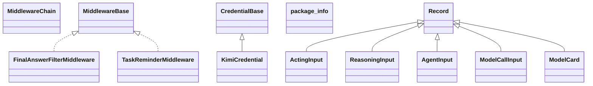

# agentscope-core-2.0.3.jar

[Group index](README.md) | [All archives](../README.md)

## Scope and provenance

- **Donor:** `SQX_145_REFERENCE_ROOT/internal/libs/agentscope-core-2.0.3.jar`.
- **SHA-256:** `7f1ec0f9c5afd1388554275efc78f58cb05692b634453695cf404eb79f7cfda4`; accessed 2026-10-06; captured `2026-10-06T18:54:51.906614+00:00`.
- **Classes:** 441 raw entries; 441 unique entry names. Duplicate occurrence indices are zero-based.
- **Inspection:** read-only ZIP hashing and class-file structural parsing; signatures/descriptors, modifiers, hierarchy and references only. Bytecode bodies are hashed, not published.
- **Allocation:** proposed `FEAT-AGENTIC-AGENTSCOPE-CORE`, P19; [roadmap](../../sqx-full-application-roadmap.md). Domain README registration remains required.
- **Repository:** `01067f00031428613c6394064ca1bcadc1ba00ee`; review state unreviewed. Download label 145-dev1; installed build/activation and runtime equivalence unverified.
- **Limit:** every class/member is inventoried; declaration coverage does not establish consumed calls, defaults, formulas, failure semantics or algorithm parity.
- **Archive/resource index:** [003.json](../../../evidence/sqx145/archives/145/003.json).

## Complete member declarations

Member shards contain exact JVM names/descriptors, access flags, generic signatures, throws types, declared fields/methods, superclass/interfaces and referenced class names. All classes, nested/synthetic members and overloads are retained. Code length/hash is structural evidence, not a normalized algorithm comparison.

- [001.json](../../../evidence/sqx145/members/003/001.json) — SHA-256 `41427c0fe98e4ea0c2d9ad3f1798eb74c40e6eea59104e0ee55b9a76ae5e7972`.
- [002.json](../../../evidence/sqx145/members/003/002.json) — SHA-256 `a705eea40aa94f4f47bc84e0a747ea26005f0f2cffe947b4b022a44c4a0b5829`.
- [003.json](../../../evidence/sqx145/members/003/003.json) — SHA-256 `57e2c16d6a3bf5945f24a0c6f3e76b4d6cdc9e985d4e02c04034df628ed365e1`.
- [004.json](../../../evidence/sqx145/members/003/004.json) — SHA-256 `df218a111b6de2a22aa6af6ba48e7c292b53de974eeac103578c056c543b2b21`.
- [005.json](../../../evidence/sqx145/members/003/005.json) — SHA-256 `226cf390c37bebaeb6600bc6990c74ccdc2936c082076f4c7bc12879151f98b2`.
- [006.json](../../../evidence/sqx145/members/003/006.json) — SHA-256 `2d80a089909b76c8244bc156bbe9b08f98d6815df5b01815f65695b886c77706`.

## Focused structural diagram

Up to twelve non-nested classes; arrows show declared inheritance/interfaces only. External type names are not evidence of an available body or an executed dependency.

## Class inventory

| Archive entry | Occurrence | Class SHA-256 | Fields | Methods |
| --- | ---: | --- | ---: | ---: |
| `io/agentscope/core/middleware/FinalAnswerFilterMiddleware.class` | 0 | `8847d48c193e3bcae5d364dd86a3f63cc3c1f960981780886a8be2aae6e10453` | 0 | 5 |
| `io/agentscope/core/middleware/ActingInput.class` | 0 | `d455e2f5a5d7ffc1c9b32fac7577af3530a1b545c292c8eaf6ea67e3b463405b` | 1 | 5 |
| `io/agentscope/core/middleware/MiddlewareChain.class` | 0 | `aadf3d330b631f9cbfb5930d2e6ca989897c9b19274e4d8e16f4ac810327f87f` | 0 | 3 |
| `io/agentscope/core/middleware/MiddlewareBase.class` | 0 | `dafd20f0d5a757d4ba47f96848df1b064b1ce5f73c703626ea17923f5339806c` | 0 | 6 |
| `io/agentscope/core/middleware/ReasoningInput.class` | 0 | `36cbc119462fb06367b20f41ad5f311cc13e62e5e5c1f608bf4772e7c6b90541` | 3 | 7 |
| `io/agentscope/core/middleware/TaskReminderMiddleware.class` | 0 | `cf88c856face285db57c8c8460a3d13f74272a6e849c0cca9b1407852fa00caa` | 1 | 5 |
| `io/agentscope/core/middleware/MiddlewareChain$MiddlewareMethod.class` | 0 | `f888ece16a3568fb6b72467ecab3e5045b067ef795d517720aecfb1bb63cf71f` | 0 | 1 |
| `io/agentscope/core/middleware/FinalAnswerFilterMiddleware$RoundState.class` | 0 | `2c8a8e766d7e275943da63be1d387275cc0468448b8e4cfff18d66574766d085` | 3 | 5 |
| `io/agentscope/core/middleware/TaskReminderMiddleware$1.class` | 0 | `cd7e5198fa5c41b4ff8275772e0d0cf34e4e8dd20ff050718e1176def8c96557` | 1 | 1 |
| `io/agentscope/core/middleware/AgentInput.class` | 0 | `e192e20a00e1da98a02fc76b55ab8c6c7772db50ac437458ba69b92be9eac903` | 1 | 5 |
| `io/agentscope/core/middleware/ModelCallInput.class` | 0 | `87425280f116bc36e4a9a4c47771b27c94b6ef71b80e0d610673e848fab4b3d1` | 4 | 8 |
| `io/agentscope/core/credential/KimiCredential$Builder.class` | 0 | `a3155af1f637429d1e55e0098fc9f2b93e625329dad9f61ace27c566e2a2c141` | 3 | 5 |
| `io/agentscope/core/credential/KimiCredential.class` | 0 | `72b6e1e336b47dae9f4874f4a8d598fbfde53b509eed1d4e1dbc15fbec86bcb8` | 4 | 8 |
| `io/agentscope/core/credential/CredentialBase.class` | 0 | `db3d4f43af6ccc70d5fa7a5cfd447f8c77b27eb369acb361c9918cb492f72c3e` | 1 | 4 |
| `io/agentscope/core/credential/DeepSeekCredential$Builder.class` | 0 | `6e86221342bd19f8307c64409549697abb5af30edb03a93fd0e40720682088e5` | 3 | 5 |
| `io/agentscope/core/credential/XAICredential$Builder.class` | 0 | `7d6be5fe10a75722c660fc9764427527b949a07bce795bd0dcbce718f5f5568e` | 2 | 4 |
| `io/agentscope/core/credential/ModelCard.class` | 0 | `68d68cbb4e2de5b66deb6c39157bb22dd60a3dc090f276ae328c5705cbd2b2da` | 3 | 7 |
| `io/agentscope/core/credential/package-info.class` | 0 | `ef892991bb4e5808544b7717e5fcc4f675475875861345618467c7d513cb95a7` | 0 | 0 |
| `io/agentscope/core/credential/XAICredential.class` | 0 | `8067a0b7ada738fd4bf0b7636c57746fedd38d6054fd50301a1084ea6cdc9e24` | 2 | 7 |
| `io/agentscope/core/credential/DeepSeekCredential.class` | 0 | `a503365db8c2a42151df4add03ed27d435cc94311912edc1e785183b187ad10b` | 4 | 8 |
| `io/agentscope/core/tracing/TracerRegistry.class` | 0 | `dcd6a2a7772e7f93044bb8ea9763339fddc8769f4f0b308711a33218b6414a90` | 3 | 8 |
| `io/agentscope/core/tracing/NoopTracer.class` | 0 | `5beadbe56f5bf0520cdf329bf7525489e2836f78e49bcae240a0e2deeb9a8d6f` | 0 | 1 |
| `io/agentscope/core/tracing/TracerRegistry$1.class` | 0 | `c516674ed56a61087173aee60e9251042719e464cd2ca8c7d490d314d1067523` | 1 | 9 |
| `io/agentscope/core/tracing/OtelTracingMiddleware.class` | 0 | `39abbaaa798c7189b65badef22cb5d18a9988b808b03a834278764c4541a6efe` | 2 | 25 |
| `io/agentscope/core/tracing/Tracer.class` | 0 | `9df10d150f7f02d282e074cb5aa7a23d9ae81a7776580da35b86a15d056e566f` | 0 | 6 |
| `io/agentscope/core/ReActAgent$CallExecution.class` | 0 | `5c3519c085d0526165b90cb8a5e52b2ab382454e882166c036ab4ac8908359de` | 14 | 142 |
| `io/agentscope/core/memory/StateBackedMemory.class` | 0 | `1c6fa865ab1859c3fa1ea182c4be6a16d527efe27ced98246cd1c883619fd688` | 1 | 7 |
| `io/agentscope/core/memory/InMemoryMemory.class` | 0 | `a26e85fb8c8b93d53da2dadea8643a70360c1cb24e3a519200dbf8fa9d43641c` | 2 | 7 |
| `io/agentscope/core/memory/StaticLongTermMemoryHook.class` | 0 | `5ebe59dd1ef09b23d9d61f8d11dd728f1adf6a58477d24cf7a1558651434b0f6` | 5 | 17 |
| `io/agentscope/core/memory/LongTermMemory.class` | 0 | `fa49275cb9db7108db2b4905a5ce046190169de06f431cf1ac09681e0f507022` | 0 | 2 |
| `io/agentscope/core/memory/Memory.class` | 0 | `4290b03ecfda5d3eea7ef4eceb45bd2a830c9f1b6ccd34768b8c132ad6157af8` | 0 | 6 |
| `io/agentscope/core/memory/AgentStateMemoryView.class` | 0 | `0b03b270efeca6181c3f203803e5bb6115b8ee28c7ab7fa5cf94a80eb03118f4` | 1 | 8 |
| `io/agentscope/core/memory/LongTermMemoryMode.class` | 0 | `39c4344ab9f5d9c1c48306ef41b7cc41f339d221f315da8a49d744bed5cad01b` | 4 | 5 |
| `io/agentscope/core/memory/LongTermMemoryTools.class` | 0 | `6def5bc1aa9147d7524cae09c06fcb7b15dd1ca60b4f2fe6fe1ba551b60ea28d` | 1 | 7 |
| `io/agentscope/core/ReActAgent$CallExecution$PermissionGate.class` | 0 | `522bf052c439fef3986112735a69e1a61ead532196c8cf4a84167046c9668a3b` | 2 | 6 |
| `io/agentscope/core/shutdown/GracefulShutdownMiddleware.class` | 0 | `e6332fb10404c2a8c755b25c2742154dab0f0f30bb5ae7bdffb00dfe42f1a9f1` | 2 | 9 |
| `io/agentscope/core/shutdown/GracefulShutdownConfig.class` | 0 | `88315a82530a7304a44bfb94c53bf3a1c7e99541bd3a8bf8414c7f4d996811f5` | 3 | 7 |
| `io/agentscope/core/shutdown/ShutdownStateSaver.class` | 0 | `5004f12defdaa61dc10dad272b4127d68a287483869172668c510ff4844c4857` | 0 | 1 |
| `io/agentscope/core/shutdown/ShutdownState.class` | 0 | `abafc4f48b933f92f3862864e414c1f7833e21df5f7ba492bb17c7b37092fc22` | 4 | 5 |
| `io/agentscope/core/shutdown/PartialReasoningPolicy.class` | 0 | `5847d6dec1af5d98d22fb7e7f587a98237572d11da5e7e038f7fd1248efe6301` | 3 | 5 |
| `io/agentscope/core/shutdown/GracefulShutdownManager.class` | 0 | `de22d1c8178ecb60f6979cfb0d2ea8bf10521c34f52dd4f4577bbfe444cf0c6b` | 12 | 29 |
| `io/agentscope/core/shutdown/ActiveRequestContext.class` | 0 | `42905f49bee4f83f2fc584c7d09ed49b3b5266f38f323278328167564903c063` | 6 | 7 |
| `io/agentscope/core/shutdown/AgentShuttingDownException.class` | 0 | `13268c4261744354d18f5e883f29287bb96ab00250f4d362cf4c116fe9c0f62d` | 1 | 2 |
| `io/agentscope/core/shutdown/ShutdownSessionBinding.class` | 0 | `75cbcf019e813c4b80238fe29a71c2e0447f3d344f36666b492541a443121714` | 3 | 7 |
| `io/agentscope/core/shutdown/AgentScopeJvmShutdownHook.class` | 0 | `5649bcd987791d2c6cad2863591d54adfc0b91b01252f4e4fe9082817faf57a3` | 3 | 4 |
| `io/agentscope/core/skill/SkillFilter.class` | 0 | `c961d80cc8fa2f0be984d93dfdaf9844a23bde5991639c680538d60cc63d3160` | 2 | 11 |
| `io/agentscope/core/skill/repository/ClasspathSkillRepository.class` | 0 | `2365e52102c777de0d04ce90f50c7da55d759141de9802632d4e3f1cd52c2ca0` | 10 | 22 |
| `io/agentscope/core/skill/repository/ClasspathSkillRepository$SharedFileSystemRef.class` | 0 | `b2c2bd17b8f74531c587d7da6bd64925a6fca4a5e4fa419deef24bf8d5a17797` | 3 | 1 |
| `io/agentscope/core/skill/repository/FileSystemSkillRepository.class` | 0 | `0f3fcb527216e0805d26ac37ffa2959758b10b3da979af99cf92261941b55363` | 7 | 17 |
| `io/agentscope/core/skill/repository/FileSystemSkillRepository$Snapshot.class` | 0 | `6cb699f8c1ded93b9159038d2100c57713587d4fe0b4480dfd90c69d1feb9e00` | 3 | 7 |
| `io/agentscope/core/skill/repository/AgentSkillRepository.class` | 0 | `e436fb15735b322b98600c2e2b5bb40daf1a8172ee647201d9571cbbb53895ca` | 0 | 11 |
| `io/agentscope/core/skill/repository/AgentSkillRepositoryInfo.class` | 0 | `e4297bb908bb5351effd542c945425ea387c7fc0416500995308aecd67e0991f` | 3 | 5 |
| `io/agentscope/core/skill/SkillToolFactory$1.class` | 0 | `7406f7bee6fab167918e7b8006b35fcae59b6dc9f787fef16e80d022a3ff8482` | 1 | 5 |
| `io/agentscope/core/skill/SkillHook.class` | 0 | `3038c419bdc18c076305fdf6b604148dd47b9098a0a017ba7c664eb5aa8ff783` | 2 | 3 |
| `io/agentscope/core/skill/util/SkillUtil.class` | 0 | `4e6bb71b94c42cbaeb659cd13c78ac9a00fcd4e121b3de37e0b7ff1883e5533a` | 2 | 16 |
| `io/agentscope/core/skill/util/SkillFileSystemHelper.class` | 0 | `bc18e95b31da6b283b1a7473bd806ba92ae3629640faa79322629aed32fcdf06` | 2 | 31 |
| `io/agentscope/core/skill/util/MarkdownSkillParser.class` | 0 | `cf254542794894deac052a067f2bf6241f5ccf4dedc24e07707516a2efe4a607` | 6 | 12 |
| `io/agentscope/core/skill/util/MarkdownSkillParser$ParsedMarkdown.class` | 0 | `9005b1b044daf97fed2347418a5183795b7f514f911df79148581d57d456be84` | 2 | 5 |
| `io/agentscope/core/skill/DynamicSkillMiddleware.class` | 0 | `cab09f7f7fc2b694ed815e31cf85998744bdb7aaa0977aa699e0850aee3370af` | 8 | 16 |
| `io/agentscope/core/skill/AgentSkillPromptProvider.class` | 0 | `19dfb6798ebd025d88f92ce80d06a274d56b4ae1af3d44c7759a2a28ada00e7d` | 11 | 17 |
| `io/agentscope/core/skill/SkillBox$SkillRegistration.class` | 0 | `c3f3d885c7c346bdd1a319a49a720de24a00c8c032d61a4e92ed4268354cff2f` | 12 | 13 |
| `io/agentscope/core/skill/SkillBox.class` | 0 | `eaf9f6b577c5a894a7b00dacf2c9ac1f62eb0dcb2b1e4efff065aefdcd5fd751` | 11 | 28 |
| `io/agentscope/core/skill/SkillFilter$1.class` | 0 | `8663762223f37f96d0600d9933f6838de0d64d861585432bd9be7229864090c0` | 2 | 3 |
| `io/agentscope/core/skill/SkillToolFactory.class` | 0 | `fd83f94db630427336a3e930e1e23a8980b4986070e77aab90be7d4af3930000` | 3 | 15 |
| `io/agentscope/core/skill/AgentSkill$Builder.class` | 0 | `a30f9059dacbbb350c5828976962ecd44c7bc2ea30d17dfb04a33b323153c0fb` | 5 | 15 |
| `io/agentscope/core/skill/SkillRegistry.class` | 0 | `01e9db6962c25b93c321a248dd4fbe6c8aa622de51db8c91636b3ded5442d04d` | 2 | 11 |
| `io/agentscope/core/skill/AgentSkill.class` | 0 | `b9552176ebe48cd0e1fc980807ebbb903146b34b85898de48af2e119f3f26bb1` | 5 | 20 |
| `io/agentscope/core/skill/SkillFileFilter.class` | 0 | `7ec043f02f72cc53404f0e1169c36426636633c3b23f6b78f64518c514ea5d78` | 0 | 3 |
| `io/agentscope/core/skill/SkillFilter$Mode.class` | 0 | `3b06b218b6f60e08767419e83df77dc04dd5dcf9b246270b6804d4c0590c6e59` | 7 | 5 |
| `io/agentscope/core/skill/SkillBox$DefaultSkillFileFilter.class` | 0 | `b72ef78143c4bf77d4c683bdfb550a6d32bf90c0d5abad9357805c4c28d49365` | 2 | 2 |
| `io/agentscope/core/skill/RegisteredSkill.class` | 0 | `be79d0beed7b0c673c49add725a33c46a359307de61ccb4ad5acd23f9d7ec599` | 2 | 5 |
| `io/agentscope/core/util/TypeUtils.class` | 0 | `bf5071be51b4f376e404c9f11c3f008da0d33e046c9d46669c70e1908bd729cf` | 0 | 3 |
| `io/agentscope/core/util/JsonSchemaUtils$2.class` | 0 | `f8f534de23909f321ad8477d6e9597754c63c83b73ffb1a60bbd2fe83c2af0c1` | 0 | 1 |
| `io/agentscope/core/util/JsonUtils.class` | 0 | `f327a87d98a463dcc504f3bb05eee96c2ded49d8d8d9f7a7e4e33dbfa8152c04` | 2 | 7 |
| `io/agentscope/core/util/JsonException.class` | 0 | `313045a7fc00058a873948523a72ce4d1fc0ca00b5e0bf0583d0e92b3a6113cb` | 0 | 3 |
| `io/agentscope/core/util/JsonSchemaUtils$1.class` | 0 | `f843b30abb3f4fd509e2f798c8961b46e9a9f020215e6b9404b720298ac25e54` | 0 | 1 |
| `io/agentscope/core/util/JsonSchemaUtils$3.class` | 0 | `a9b7d1bac027761b94000036a4f713dd4d7723f1ad3cac5e31bd085e625130e5` | 0 | 1 |
| `io/agentscope/core/util/ExceptionUtils.class` | 0 | `b343734c1c7b005ce7cb242b4d00393c8db6d477121daa395316fa596b11cc41` | 0 | 3 |
| `io/agentscope/core/util/JsonCodec.class` | 0 | `f151250eb980c03bff03037bcb549b542486ef1017c6d2758dbc6a72ea55b7c4` | 0 | 7 |
| `io/agentscope/core/util/JsonSchemaUtils.class` | 0 | `1807d714a16a35c4cc7aa989f1c3bfdbf0ee7a39aa987c56ff2d2a22fd58f782` | 2 | 6 |
| `io/agentscope/core/util/MessageUtils.class` | 0 | `14619fe7d1d138b480a41024c5737f5b0369d35a2d8d46929197ac7c9168c7b0` | 0 | 2 |
| `io/agentscope/core/util/JacksonJsonCodec.class` | 0 | `98a6c5b33fa62b4106d80d73ce140bc2a634d2d1063655ddeac05a6a9e0af2f8` | 2 | 12 |
| `io/agentscope/core/ReActAgent.class` | 0 | `d157cc61302f13ab5f7bd40720d656321c742f3991815f256f0b1fa5dce208a2` | 29 | 142 |
| `io/agentscope/core/interruption/InterruptControl.class` | 0 | `e816dfc790202b5c2f3d269aa9fa10cc644bda02fa1e84eebc26409a9da8e216` | 3 | 7 |
| `io/agentscope/core/interruption/InterruptContext.class` | 0 | `93a1194dc5f6ad39fdb8b70587f08df4e6ba3d2d2918d0f6907338b2d6503b7f` | 4 | 7 |
| `io/agentscope/core/interruption/InterruptContext$Builder.class` | 0 | `059ed11ffcb03f286775c7e7c04e9097e957372cb0adde9ea6b92123c0e76d7a` | 4 | 6 |
| `io/agentscope/core/interruption/InterruptSource.class` | 0 | `1da1e751e6836427596c7e7eda512e847e8dd2d1059252e144830994b353e611` | 4 | 5 |
| `io/agentscope/core/Version.class` | 0 | `eb559fce05da1d7e86ceb577a7f8b420d810f46b86dd2bf81da1ac0c6696a323` | 1 | 2 |
| `io/agentscope/core/workspace/package-info.class` | 0 | `a3f5a21d8ca155c05e3a4ae8688ad77dcde0d821f124078097ed3c78b718c57e` | 0 | 0 |
| `io/agentscope/core/ReActAgent$Builder.class` | 0 | `fdd9628d0d813b53dafb6f11954076c85ac02807ed812840920726cdd694ba95` | 34 | 52 |
| `io/agentscope/core/ReActAgent$SlotRef.class` | 0 | `a5a68c11e48fe2ecd86830ff45cef4c8f6f590620fde71d80d155fa0e8b37474` | 2 | 7 |
| `io/agentscope/core/message/ThinkingBlock$Builder.class` | 0 | `6014d9d23a12899bd4425d47a6d35b1e64e015532ebc211770fc30b12ebeabfe` | 2 | 4 |
| `io/agentscope/core/message/UserMessage$Builder.class` | 0 | `044ff2798ec6d149cde2d622796dec653df0887e56265657e425b57c896b5058` | 0 | 25 |
| `io/agentscope/core/message/Base64Source$Builder.class` | 0 | `fe8016a98bc15fc526a380b0a78f8f80c0987e2254f56c99a7eb57af6802124e` | 2 | 4 |
| `io/agentscope/core/message/Source.class` | 0 | `f69255af6b7b432d7585b3eeb659249abf179b5f7572428e862a534a311ca6e9` | 0 | 1 |
| `io/agentscope/core/message/VideoBlock.class` | 0 | `f78b01648671db815d3295cf003b38f5b93b959c08f1bcfecffac5234ad4e853` | 6 | 9 |
| `io/agentscope/core/message/ToolUseBlock.class` | 0 | `5d77ee5935cecab265affda03b17135de1e7ecee1764bb6be37edd7192d7511f` | 7 | 12 |
| `io/agentscope/core/message/Msg$1.class` | 0 | `573e240a65090b4276ef47605ffc837d7a058721c164010e3efefe1c82a77be8` | 1 | 1 |
| `io/agentscope/core/message/Msg$Builder.class` | 0 | `9d9af57eb00616186d012786f26d2a9e5f230372d693f7181e292dced4252cbe` | 7 | 14 |
| `io/agentscope/core/message/GenerateReason.class` | 0 | `698fa1af03a5b8773a07575d5f231a7373acc5943aed198edf5bb28aab39571c` | 12 | 5 |
| `io/agentscope/core/message/URLSource$Builder.class` | 0 | `a5f11c2f837b8c83112736035aca4818c21c039be6dfbb706b3c683f2e881446` | 2 | 4 |
| `io/agentscope/core/message/ToolResultState.class` | 0 | `d290dd9c5122b0cc30a4f4b903d0bb3ae8bcd0997f5861f93b40e0bd528f3eb1` | 7 | 6 |
| `io/agentscope/core/message/UserMessage.class` | 0 | `0eecfea8890f16b1480cbda8a0b7686438a773b44ca37f9c0d3613bafbe35e8e` | 0 | 7 |
| `io/agentscope/core/message/SystemMessage.class` | 0 | `75cea0dbfbb95ae30bb4c9d7d6f30c189678527a09d5f8276c2a4134594fede9` | 0 | 7 |
| `io/agentscope/core/message/ToolResultMessage$Builder.class` | 0 | `6650439827a6e73d1199aa92f965480b9f9a3a311be72c30c6e35500d6de55a1` | 0 | 29 |
| `io/agentscope/core/message/MessageMetadataKeys.class` | 0 | `fe66b23ea412c3a9a5b8b42b940ba170274ba426d9c4b4475caa33fd9aa6aa94` | 6 | 1 |
| `io/agentscope/core/message/ToolResultBlock$Builder.class` | 0 | `45ac0211a65a4da7d5bf377abd02336077da96ec6fdb752031a05fe08cc4791b` | 5 | 8 |
| `io/agentscope/core/message/AudioBlock$Builder.class` | 0 | `b471a40e73956ea6caa1cb139689b86352abc11dfeb7ea3183adf7b195a5554c` | 1 | 3 |
| `io/agentscope/core/message/MsgRole.class` | 0 | `22b9b84690ba3dbb75e4e500596b9b40a34c998bee4f025bc5319ce1bd0de0df` | 5 | 5 |
| `io/agentscope/core/message/Msg$2.class` | 0 | `53e7b81876d58410a0cc09ff02f2864855d4b0add02df7932651f8d4ba0db21d` | 1 | 1 |
| `io/agentscope/core/message/ImageBlock$Builder.class` | 0 | `c1d94199b4cafd3191228e4c413ba9ffb43a9368d033c06911a233092953fc7a` | 3 | 5 |
| `io/agentscope/core/message/Msg.class` | 0 | `43844aaa25ec3fcfc5ce54076c1559adb415a91dc8a0217f72ffd02d13c12889` | 14 | 31 |
| `io/agentscope/core/message/DataBlock.class` | 0 | `032a807ff81b3120fcb40c07f262cd5a2e00721cc0609f983943d8315c9439c8` | 3 | 5 |
| `io/agentscope/core/message/VideoBlock$Builder.class` | 0 | `eb07d14f56a2d2094bd567a7386378ad889d2111f7a32a75fe90a089d8019597` | 6 | 8 |
| `io/agentscope/core/message/ToolResultBlock.class` | 0 | `55850df98648ba54030520a2fadd19e9e0ea74e9b50adad0664f28b22c779ad2` | 6 | 26 |
| `io/agentscope/core/message/ToolCallState.class` | 0 | `8cc4d5d76ad0bf13850f288fe80c221edc5b07c5073c1a36d4c39bd81a827bf4` | 7 | 6 |
| `io/agentscope/core/message/AssistantMessage.class` | 0 | `727e7bbee291ea3a2d126b8221b670ac8aa412bc9a646e96c04871a59d422f32` | 0 | 7 |
| `io/agentscope/core/message/ContentBlock.class` | 0 | `75e82a0cb9cda5d21771433311a04469ba17aad37d7328c39aaa73309485f8dd` | 0 | 1 |
| `io/agentscope/core/message/ToolUseBlock$Builder.class` | 0 | `76faf38647a1af7504a96b497e922f390e7d1ac479009a778472f46cedcfbe5f` | 6 | 8 |
| `io/agentscope/core/message/TextBlock$Builder.class` | 0 | `f539792cbc76253fb4492995f15e2bd693e4e47a44a23d26fa8ae1677f40eb29` | 1 | 3 |
| `io/agentscope/core/message/TextBlock.class` | 0 | `c109a96bab6d96f29ed3181af8683a3cc4b8f019ee27cb8fc2db8c5d8124998f` | 1 | 4 |
| `io/agentscope/core/message/ThinkingBlock.class` | 0 | `9e7c82fcfe312696879f08a40f2bec5bcf89052b7d1488e0f25c5faa8c6f4513` | 3 | 4 |
| `io/agentscope/core/message/HintBlock.class` | 0 | `153e97484ec48ea0ed72923eff33fff84238de2f44ce3806451a707975e38227` | 3 | 5 |
| `io/agentscope/core/message/AssistantMessage$Builder.class` | 0 | `cd1eae6f07a4aab9729669c42a1ab4eddf6bf2ff054fb895d06a58da1e08aca1` | 0 | 25 |
| `io/agentscope/core/message/AudioBlock.class` | 0 | `1ca346be4a053d8d9f13924d69a31569c099542cebbf04ff50aabf5b077a03e9` | 1 | 3 |
| `io/agentscope/core/message/Base64Source.class` | 0 | `1908dae93826699ac3217a34084987e2d845c473d25baf5a35e889d6cbf8a68e` | 2 | 4 |
| `io/agentscope/core/message/SystemMessage$Builder.class` | 0 | `d86db69adf86351b5398cee5829365d3400f0c730b6c487421d61c78339dbfea` | 0 | 25 |
| `io/agentscope/core/message/ImageBlock.class` | 0 | `c6b53233759066dfeb88ea109ae162dd1d9b8dfa9af1c5fe0c2d2b801d30216d` | 3 | 6 |
| `io/agentscope/core/message/URLSource.class` | 0 | `86523cbfd04e1afc402f89d55463254ffc0577d7305cee515f2c28f8a2eb3caa` | 2 | 5 |
| `io/agentscope/core/message/ToolResultMessage.class` | 0 | `7e3861a26388a9d2324eafe0d6f284951e396e3e39ef2d8bf28e52db60e1d23c` | 0 | 5 |
| `io/agentscope/core/message/DataBlock$Builder.class` | 0 | `c7e135750c3f6f179fa45a62db1a726da973151db5e652f68fa91ba74a33e92a` | 3 | 5 |
| `io/agentscope/core/agent/AgentBase.class` | 0 | `2a20613a7fd8a18d4d7765d2e49624f3c54baa2b70709182bd4fafd00e07f3e1` | 12 | 93 |
| `io/agentscope/core/agent/StreamOptions$Builder.class` | 0 | `677366731820b78455d28b48f5214dca9e22f7c4d5abec7806e93e183bd62899` | 7 | 9 |
| `io/agentscope/core/agent/Event.class` | 0 | `af67c4ad4d10c4ee064a3a39979de1292cb574b700aa5d4eb79e50dcafa41ece` | 4 | 9 |
| `io/agentscope/core/agent/RuntimeContext$DefaultMutableContextStore.class` | 0 | `263d827200f6267ce45ef1e7660fb01b4fc81a712df23a909857b9193097b5d5` | 1 | 5 |
| `io/agentscope/core/agent/RuntimeContext.class` | 0 | `ea2fadcd304848fa7607fa850fd3307449db150db09a8c902acc969a4af0ce46` | 7 | 23 |
| `io/agentscope/core/agent/EventSource$Builder.class` | 0 | `03b931fc80c46cbe6f47cc03b215614716d1d88dafd0105af0260f0a5edd0ee8` | 8 | 10 |
| `io/agentscope/core/agent/config/ReactConfig.class` | 0 | `de0da7cf36a59a8a8940f47ec1d212f6d85f081e7fdd0c23f299e4ce5c11d7d2` | 4 | 8 |
| `io/agentscope/core/agent/config/package-info.class` | 0 | `a9d28c817d66a7b7bc0d66b3991fed6c9b6f66155e42d2f44d2c90704c99eeea` | 0 | 0 |
| `io/agentscope/core/agent/config/ModelConfig.class` | 0 | `9fe2798e4c0d67076452280c164e7983ff05f0d74c7ca8bbf0756225a8bfe78d` | 3 | 7 |
| `io/agentscope/core/agent/EventType.class` | 0 | `995953052f8d42347b77657e76c0689be6102463bebbde21e2202ce12e2b3e77` | 7 | 5 |
| `io/agentscope/core/agent/StreamOptions.class` | 0 | `792b5a9e3b81435b58b726bd97e0da5fa4c62648e2bc7f4a3c5ea079e8d68b70` | 7 | 13 |
| `io/agentscope/core/agent/user/UserAgent$Builder.class` | 0 | `c9494d90a7d82540d0b1b2639a1d78c00bf1713a2b13cbdc10c8c5dd93aca34a` | 5 | 7 |
| `io/agentscope/core/agent/user/UserInputBase.class` | 0 | `af757b4feabefaad3b8541584c23e07fe50a6b22cb0d7d4560a14057885a72e1` | 0 | 1 |
| `io/agentscope/core/agent/user/StreamUserInput$Builder.class` | 0 | `c3902486d58580d6ed1f3ebcad9aa22f5ea9dde3f913b9a32329d3e3b6ebec22` | 3 | 5 |
| `io/agentscope/core/agent/user/UserInputData.class` | 0 | `e01d24af63fc7fe89b3bb2fee5692c600251b9491818c9da591c5e031292a32f` | 2 | 3 |
| `io/agentscope/core/agent/user/UserAgent.class` | 0 | `747fcdf80c7ce9913db5ef5abe1372a6814832c4a70c3f0ad0d86f6d705a3962` | 2 | 16 |
| `io/agentscope/core/agent/user/StreamUserInput.class` | 0 | `b917e6ab6df3a944efaecd310d328988687f8e34f3d85ce80c1773fca090c564` | 3 | 6 |
| `io/agentscope/core/agent/EventSource.class` | 0 | `bc5b390247e0f0019883010605a48dc8541ff040e26c91ffae2fecb512a7b86e` | 8 | 12 |
| `io/agentscope/core/agent/Agent.class` | 0 | `3ac32ab419c7068d0f7e9080b8e851f774652791b45fe4503b42cd78b912a0e8` | 0 | 7 |
| `io/agentscope/core/agent/RuntimeContext$Builder.class` | 0 | `9e5a12dd41dd9838e675e116686993eea715be9785a8c6d2fcc855571c084bda` | 6 | 12 |
| `io/agentscope/core/agent/accumulator/ReasoningContext.class` | 0 | `f95e0fa699194365246f1505d56a12419ddccf313adb16f7be00b1baec8098f8` | 11 | 11 |
| `io/agentscope/core/agent/accumulator/TextAccumulator.class` | 0 | `112ac2e35231aed1ef2dfc31222d94d6a034394dbd431231bb5e33cc9de8621f` | 1 | 8 |
| `io/agentscope/core/agent/accumulator/ThinkingAccumulator.class` | 0 | `c2b6e2b067c15c738b5b0bb2baf2f41a6e5bb4c737d89430122385ae2cc4d6d7` | 1 | 7 |
| `io/agentscope/core/agent/accumulator/ContentAccumulator.class` | 0 | `8726197e80fa1fd56a4fff39676d62c4b01d6fc0fb5c6aae0696e5883dc8e74f` | 0 | 4 |
| `io/agentscope/core/agent/accumulator/ToolCallsAccumulator$ToolCallBuilder.class` | 0 | `0cfd953604bac84735bb7e7bf9d62268cd790bcafdc965e6f901f3a303a98e33` | 5 | 5 |
| `io/agentscope/core/agent/accumulator/ToolCallsAccumulator.class` | 0 | `485db0d988b96fb1cd21cc5ea31048d6b2307535537dd07d10ee457e928e3e49` | 3 | 13 |
| `io/agentscope/core/agent/SubagentEventBus.class` | 0 | `06dcc657f8a0db1d05630908de6a031c914bf3e463bd1c8e17c5982b2bfd1120` | 1 | 2 |
| `io/agentscope/core/agent/ObservableAgent.class` | 0 | `7108dbb1b081ca0fb31bf1ef885b0b4a64eca1233471aa503daf53bbd7756cf4` | 0 | 2 |
| `io/agentscope/core/agent/CallableAgent.class` | 0 | `eace48641644423ba77382bca783218d669795ea58d5e5cfa20ea41f21e694b9` | 0 | 13 |
| `io/agentscope/core/agent/StreamableAgent.class` | 0 | `1ddb7838a962af2519aebbe6d55dd5dd64a0fc601c084b786360f9ae9f0d1304` | 0 | 12 |
| `io/agentscope/core/agent/StreamingHook.class` | 0 | `3285dab86343c485c8f28de1a7fed9c8f6b2ccd88f8daae9d43c45051d0f40c2` | 3 | 4 |
| `io/agentscope/core/state/ToolContextState.class` | 0 | `baf8ae6303f44735adca27cd16da7979d0dbfd27e19c71d18ea996bfda72faf6` | 5 | 18 |
| `io/agentscope/core/state/InMemoryAgentStateStore$SessionData.class` | 0 | `b9ec144bebc1f6f2f211b829d1364e594db16ee173ee2536054b073e391bddcb` | 2 | 8 |
| `io/agentscope/core/state/JsonFileAgentStateStore.class` | 0 | `3c7bf5e5a0a42e71f7105499e998b3144234622ebe6ff5bfe7b06f1e46cd5aa7` | 3 | 37 |
| `io/agentscope/core/state/AgentState.class` | 0 | `cd1b20c8e43f371d14c3993826e7627ce5ea98dc0eca9a2afa7ebfc7f1b6f90b` | 12 | 27 |
| `io/agentscope/core/state/VersionedState.class` | 0 | `3cdaba4841823072a889aea3aedaea61a43f650b8a020c08beb541368fc9886c` | 2 | 7 |
| `io/agentscope/core/state/TaskContextState.class` | 0 | `e90a213f496566c3ae60ffce4d9ad3f5552e8c2365989bbd9956fde1a22e60cf` | 1 | 7 |
| `io/agentscope/core/state/InMemoryAgentStateStore.class` | 0 | `a8f69885fba8560ff40711e2ec904c0f2a7427f70be4bb560dec313279eb8f9a` | 2 | 20 |
| `io/agentscope/core/state/Task$State.class` | 0 | `3e99b1c7ffa37373bc34f53fbae98ff086af23edeecc15b46ba2837c52a84c26` | 5 | 7 |
| `io/agentscope/core/state/ToolContextState$Builder.class` | 0 | `9efed3d1d38d1d2d6a012b28fb25d6b919b65b4c1a795b85e4926f0db75c01fa` | 4 | 5 |
| `io/agentscope/core/state/legacy/ToolkitState.class` | 0 | `73518b9d1e0215a5435bdeec2f02f51838dc20c8ef5e2edc5ce10457b97ae9de` | 1 | 5 |
| `io/agentscope/core/state/ToolContextState$SpawnEntry.class` | 0 | `2a01f1694c94a70177e8d95d7e0e5fe455c90084ff925073100cd62a4bcd9678` | 5 | 9 |
| `io/agentscope/core/state/State.class` | 0 | `38cf012fe38691b5831cea660d3d8c5711516e2e376f0dac50e2c2750ab20ac9` | 0 | 0 |
| `io/agentscope/core/state/LegacyStateLoader$LegacyLoadResult.class` | 0 | `b45c5f6b8aaffa59d300a1db012c759f921871286b47be4947b46a250e97d0ed` | 2 | 6 |
| `io/agentscope/core/state/SessionInfo.class` | 0 | `b30f5364c4f4aeac068e42df0de5a7f0275e06dddc96cd76b84ac99037ef718e` | 4 | 6 |
| `io/agentscope/core/state/ConcurrentSessionModificationException.class` | 0 | `9b60b0d6dc263577cf021360466ce45f87cdf372a57ffe10ed4e9f6bcbfdff36` | 4 | 5 |
| `io/agentscope/core/state/AgentState$Builder.class` | 0 | `9e8c96e2adf48d4d3b27cd542144aab406056165e8e885160b61d9417369ef84` | 11 | 14 |
| `io/agentscope/core/state/PlanModeContextState.class` | 0 | `0fd407ff790d5c0918415f90d7d15c79e8dea8cb9d5aa032adec149668763821` | 2 | 9 |
| `io/agentscope/core/state/Task.class` | 0 | `444b3f4d6f1b149ed6aa5a48c1aa630ac76c6059f6ab1ff784f4776cd4ccf350` | 9 | 16 |
| `io/agentscope/core/state/Task$Builder.class` | 0 | `eb3822d3f8b835d6e0ae09d9d977a3c62114f1bc03ad6d328dad4fceb6aa03ab` | 9 | 11 |
| `io/agentscope/core/state/ConflictPolicy.class` | 0 | `888f800701c776e98707420b448b9900b893a2768e9fc83b5b129d80074e3227` | 4 | 5 |
| `io/agentscope/core/state/InMemoryAgentStateStore$VersionedEntry.class` | 0 | `d67e634b6407801122da2b1ad83ce9bfe1164561c2469f53658fb0ac15c34afe` | 2 | 6 |
| `io/agentscope/core/state/ListHashUtil.class` | 0 | `d8985567b87ef61705c01208f9d37728363a092a719e0bef744d83179d3ef918` | 2 | 5 |
| `io/agentscope/core/state/LegacyStateLoader.class` | 0 | `33f6c8981eafcef328ffd7f5e794ebf8f3c8b8b240c2770b859e3bd96054ded3` | 0 | 6 |
| `io/agentscope/core/state/AgentStateStore.class` | 0 | `08d6b465c49f676e45b1faef7e88926f597b45ab9c5f75a30a0d3afb58616649` | 1 | 12 |
| `io/agentscope/core/state/ReadCacheEntry.class` | 0 | `4daef93473ddf5aed1dfeed76bff2abfbf0b4baf7bf50eb338cdb8a102167942` | 4 | 8 |
| `io/agentscope/core/ReActAgent$CallExecution$ModelCallBlockLifecycle.class` | 0 | `1f82f06481fdfa195065a0caf09dd5b0020edd977b81eaeb6a304f45ec5f8af0` | 5 | 8 |
| `io/agentscope/core/rag/KnowledgeRetrievalTools.class` | 0 | `1bd4d98d682120b947e770a64087d9b16d808907ad5fab443d5c6e16896fe8cb` | 2 | 6 |
| `io/agentscope/core/rag/Knowledge.class` | 0 | `b0d3e021a4216fb8ba562d1593881847ea08d5c77d324187e573cc5bd9d89432` | 0 | 2 |
| `io/agentscope/core/rag/RAGMode.class` | 0 | `2c2cce8bfbc928a6353019e3287221a64bd32baef087e4ec8ffe564fb7676c9c` | 4 | 5 |
| `io/agentscope/core/rag/model/RetrieveConfig.class` | 0 | `8f3cf5f075134e8d1af3003c833016758356ab8133d37df7faec356efc4e816b` | 4 | 7 |
| `io/agentscope/core/rag/model/DocumentMetadata$Builder.class` | 0 | `4d2d0c206d12ee3c0997834d1efb84277358c6f86475d3793d47b0bdad37e860` | 4 | 7 |
| `io/agentscope/core/rag/model/Document.class` | 0 | `198611db71a2856c1599efa2006e05ff312a56e20b79e5b3b6fceb621fa0d0d6` | 5 | 15 |
| `io/agentscope/core/rag/model/DocumentMetadata.class` | 0 | `33e7a76956ab93da8f4405450fdb7e2289bb9dd38ffc3bdca6d45eaf99aa52cc` | 4 | 10 |
| `io/agentscope/core/rag/model/RetrieveConfig$Builder.class` | 0 | `9255afd54bd291eb27469d36843dd486d5e519f2993a6c96303aa7757f21bc4f` | 4 | 6 |
| `io/agentscope/core/rag/GenericRAGHook.class` | 0 | `65ebb6470847a0ebd0a65a6a474caf2eb553657c5cd4db7e5397906a2238f2f1` | 3 | 13 |
| `io/agentscope/core/ReActAgent$3.class` | 0 | `423879c6562e1bfc2a6efd9b7af8cb3886ca81a65511566933ae539508357bba` | 3 | 1 |
| `io/agentscope/core/formatter/MediaUtils.class` | 0 | `63053047ec2646cc4d9011db2cf070bc76da1692e207392f9d983550b2d2ad1d` | 6 | 20 |
| `io/agentscope/core/formatter/AbstractBaseFormatter.class` | 0 | `4c3335fe5367067965cfbcd05d48c6c17de476e3add97c990a32382800253b77` | 1 | 19 |
| `io/agentscope/core/formatter/AbstractBaseFormatter$1.class` | 0 | `cc48f51b8f9ef552ac4549b0a69cf5cfda6b1994873103ecdf7d871047a5d10e` | 1 | 1 |
| `io/agentscope/core/formatter/ResponseFormat.class` | 0 | `8f59579a536a7e53e2fdb2b9899096067e654849acb6067f0d3c455598c6493b` | 2 | 10 |
| `io/agentscope/core/formatter/JsonSchema.class` | 0 | `8742cb7d04da88cc387de4ac072a9c40b74cc37da417fb347bb5c8b15fd2f60c` | 4 | 10 |
| `io/agentscope/core/formatter/ResponseFormat$Builder.class` | 0 | `af677c77469a04824acf6fb72a875760518e742be6c88ffa028c10011fd0c7e0` | 2 | 4 |
| `io/agentscope/core/formatter/Formatter.class` | 0 | `e6970e3bf76a4734fe7c2013ea2c4e83a4556ddf2e557f95b874981aa0df508c` | 0 | 7 |
| `io/agentscope/core/formatter/FormatterException.class` | 0 | `d925ea72885271f41c9c9d119d84a02ed9de98689ab63cea825fc08ea7fb2e3e` | 0 | 2 |
| `io/agentscope/core/formatter/JsonSchema$Builder.class` | 0 | `ccbff79f4c67c0312c407fda15d6d60bdcb1645a7c46c50ea5a16a310332e4ae` | 1 | 6 |
| `io/agentscope/core/ReActAgent$1.class` | 0 | `634355932f928c5680249aaa7f7adc7b4c69a913f85651ed73f746f651f20cd3` | 2 | 6 |
| `io/agentscope/core/ReActAgent$CallExecution$PermissionVerdict.class` | 0 | `04a963a42402a696cf74de97c4d5ea7c8fee9e85ff27f5badd2be797c88e8b70` | 2 | 6 |
| `io/agentscope/core/model/ChatResponse$Builder.class` | 0 | `84961052528bbe62e47810069174b746577d5bc7f61ce4eff95ef6cbac092fa3` | 5 | 7 |
| `io/agentscope/core/model/ModelRegistry$ProviderEntry.class` | 0 | `4304913a3ef1ddb0efd4af5b98863f30f1f3831f5af5f85d2b3e9c511cc41ded` | 2 | 6 |
| `io/agentscope/core/model/ModelRegistry$ContextModelFactory.class` | 0 | `ca38cac97ce9113f5a32a3eb8a0adb45e411d7ef002012c5c2016898e40cc6e4` | 0 | 1 |
| `io/agentscope/core/model/ModelCreationContext$Builder.class` | 0 | `db504d1b8f99c556f0632da353aaaf5651b2bb883350a2bc0a56f3f5cc8b92fe` | 9 | 13 |
| `io/agentscope/core/model/ToolChoice$Specific.class` | 0 | `0c596a89146f4f5d150e54cc92659e3d06f61bf4bbee9fe172cfce597b30f62f` | 1 | 5 |
| `io/agentscope/core/model/transport/OkHttpTransport$NonProxyHostsSelector.class` | 0 | `d76f4ff5404a5a63d3e487bdf7ef67279d8e5e706f2dfa6d2b0ed1bd63d5df6e` | 2 | 3 |
| `io/agentscope/core/model/transport/ProxyConfig.class` | 0 | `9f3e7fb6d97c69c5cca53dc02fe76e6a14595c60bbcfac4e42db179a87271e3f` | 6 | 21 |
| `io/agentscope/core/model/transport/TransportConstants.class` | 0 | `ec436368bd3644ce219daf7f95a048a28029bb5da8593cf2f8b88f489d8a2a92` | 2 | 1 |
| `io/agentscope/core/model/transport/websocket/WebSocketRequest$Builder.class` | 0 | `124cfb6735c831e4f1d53182bd19e4daa7bb25129fa8e0541568c33f303fdf44` | 3 | 5 |
| `io/agentscope/core/model/transport/websocket/JdkWebSocketTransport.class` | 0 | `63c8ae0fa3c1a3ffc0762854bb72185cd731a288ec3f4e8ca1ff2862bfe4fcc8` | 2 | 11 |
| `io/agentscope/core/model/transport/websocket/JdkWebSocketConnection.class` | 0 | `b75396db4cf4fbf4b1ddc4a2d07641f49cc456e47a0330c2eb06a4a879fe9fb4` | 11 | 17 |
| `io/agentscope/core/model/transport/websocket/OkHttpWebSocketConnection.class` | 0 | `2e2ab93b2968780e6350a6bcb6dc22a1bb4b2b5eaa6b3553974f9751d60fcb12` | 8 | 16 |
| `io/agentscope/core/model/transport/websocket/JdkWebSocketTransport$1.class` | 0 | `fbf4d5b1cf4c89579c8e5e5595ebed335da94fa8b67a900d04387ef50eb9ee68` | 2 | 2 |
| `io/agentscope/core/model/transport/websocket/OkHttpWebSocketTransport$2.class` | 0 | `57875d244680dd1f43af4ec0f51f0164c120d6ee75cf1f43e223efb3167d5c99` | 4 | 7 |
| `io/agentscope/core/model/transport/websocket/WebSocketTransportConfig.class` | 0 | `af7681f3cec885d7445727e0d224186f537208bf981da11bf9b402c62a4ab23b` | 10 | 10 |
| `io/agentscope/core/model/transport/websocket/CloseInfo.class` | 0 | `4f8884667c7b33adecb2602112bed2784b83b49a234da0d2c30d8afb0184914c` | 6 | 9 |
| `io/agentscope/core/model/transport/websocket/OkHttpWebSocketTransport.class` | 0 | `09b9076a20560090916026146a12675e09620cd59439c3b47e0286d8b8bbfd76` | 2 | 12 |
| `io/agentscope/core/model/transport/websocket/JdkWebSocketConnection$1.class` | 0 | `275778778dfa508f981c0f310c0b9552b393bd1ff2fee7d800b11e93bcd6a5a2` | 1 | 6 |
| `io/agentscope/core/model/transport/websocket/WebSocketRequest.class` | 0 | `a31948663d798ee46ae4911888d8b4cae5a5b8564432e0745ff98c2a062cc286` | 3 | 5 |
| `io/agentscope/core/model/transport/websocket/OkHttpWebSocketTransport$1.class` | 0 | `23d086f4a37a6321b84d303cc5e94b0519208c9782732a06a2beed39db1bd140` | 0 | 4 |
| `io/agentscope/core/model/transport/websocket/JdkWebSocketTransport$2.class` | 0 | `8b512d104b315dfcb591f08610e463942b1694f0f40bba82c8bcd55e04ddf7e8` | 0 | 4 |
| `io/agentscope/core/model/transport/websocket/WebSocketTransportConfig$Builder.class` | 0 | `1d9662241b5ff7bc54d685914065e7eeb979204a6478c83a2aa098d89e2ad3cc` | 6 | 8 |
| `io/agentscope/core/model/transport/websocket/JdkWebSocketTransport$NonProxyHostsSelector.class` | 0 | `bd36e1ecf29f7db58c1a9101b92dd7839980d190d3d682529f229fe2977b9e73` | 2 | 3 |
| `io/agentscope/core/model/transport/websocket/WebSocketConnection.class` | 0 | `ca1655d192fba4415dcadca6c0282c8a45b74c4d15ac6d8525553255c1468e90` | 0 | 5 |
| `io/agentscope/core/model/transport/websocket/WebSocketTransportException.class` | 0 | `f661a77b8101a2b8b9a220ea5c8a0ef08c94f78f64e2958b658ce879430b3161` | 3 | 6 |
| `io/agentscope/core/model/transport/websocket/OkHttpWebSocketTransport$NonProxyHostsSelector.class` | 0 | `557d470739819c788f5ca19a6ac2d459ce6df6ec05cd2a3ba1573b51a9eefeee` | 2 | 3 |
| `io/agentscope/core/model/transport/HttpTransport.class` | 0 | `8b27bcf98feb084e32073cbc4644908a84fb1defa7322aacdbac1cfca0b410d2` | 0 | 3 |
| `io/agentscope/core/model/transport/HttpTransportConfig$Builder.class` | 0 | `3b4b4605a2db2701cb9b484ad8bdc2eca3c7f7b28a405a0cf3fa21661e5f5a16` | 10 | 12 |
| `io/agentscope/core/model/transport/HttpRequest$Builder.class` | 0 | `ebfd633cbb80aa770cb79ab8743cf7bc24e3a36b4b7c3b0fa131e1704a8b0332` | 4 | 7 |
| `io/agentscope/core/model/transport/JdkHttpTransport$TrustAllManager.class` | 0 | `839ca76f3f85901ad954465e359546854d3444e165b66394c2d7ed2634e845f3` | 0 | 4 |
| `io/agentscope/core/model/transport/JdkHttpTransport.class` | 0 | `e3a518bb2c6fe341a7206ca9f7ec343b1625249a4cd03f860732a21f9245bc95` | 6 | 46 |
| `io/agentscope/core/model/transport/JdkHttpTransport$1.class` | 0 | `240e56971a2d2c9baab5f7b271d5a9fb8187a29b9faf78a66d84c771781a2f70` | 2 | 2 |
| `io/agentscope/core/model/transport/HttpTransportException.class` | 0 | `15e16046be2469c60a1f32fe5074bd0cc3fd57b97cc0aab280c7ae945839b24a` | 2 | 12 |
| `io/agentscope/core/model/transport/HttpTransportConfig.class` | 0 | `ddc2ef53dd14eab7e03a973302c7e01634ecddf8ba6b2fc32ba7a0302d08bb9c` | 15 | 14 |
| `io/agentscope/core/model/transport/HttpResponse.class` | 0 | `5f0c4d2930a48e8bf516a20d2c35caef7972681dd3682db0958990e621e0c275` | 3 | 6 |
| `io/agentscope/core/model/transport/OkHttpTransport.class` | 0 | `1f335bc25b4c4207d511fb171a275fb12068e9c3d4382b8c28450bb8d0bd2f04` | 6 | 20 |
| `io/agentscope/core/model/transport/OkHttpTransport$1.class` | 0 | `fb9e401f79cb339ebc4910517b9539c3d2df1fa1b203464ebef89c65832c2821` | 0 | 4 |
| `io/agentscope/core/model/transport/HttpRequest.class` | 0 | `c8945834e1466490ed7f83e4f170c55c88639aa564523749f54aa8e91c9c5b35` | 4 | 6 |
| `io/agentscope/core/model/transport/HttpVersion.class` | 0 | `b2345665e2767ca9a3157bf066f27b4510a77982bbe5dfb58875860e832b7948` | 3 | 6 |
| `io/agentscope/core/model/transport/WebSocketTransport.class` | 0 | `eda7178ea5ebdc43a0d13615a029156cc110bcc03b0371cef539d056504ab26f` | 0 | 2 |
| `io/agentscope/core/model/transport/ProxyConfig$Builder.class` | 0 | `b094ca45e3939a515d4adcc4b9f5adf822c8239c198c5ab2c70e4be09a2a0f04` | 6 | 8 |
| `io/agentscope/core/model/transport/JdkHttpTransport$Builder.class` | 0 | `8071e0548ab7a6442b3dc897308503b3600c393b61c10f0d300d56838f9c1b1c` | 2 | 4 |
| `io/agentscope/core/model/transport/OkHttpTransport$Builder.class` | 0 | `0b5472497fb4a9954a2e330b460735c419d460545b8e24a251f7f9034d3a48c0` | 2 | 4 |
| `io/agentscope/core/model/transport/ProxyType.class` | 0 | `a43c95737e9e36a369d862f401ad9d03fec88e045bd6b1718ece7c00374567c2` | 4 | 5 |
| `io/agentscope/core/model/transport/JdkHttpTransport$NonProxyHostsSelector.class` | 0 | `a7f31b9dd8991bfc8967cddda455bcaa9e2902f3c8fd8e9438dffe121b3a7c78` | 2 | 3 |
| `io/agentscope/core/model/transport/HttpResponse$Builder.class` | 0 | `b69d0d0a0046719437df25f8d6a0fb62e986fbb88d3761bc8f44a89642644399` | 3 | 6 |
| `io/agentscope/core/model/transport/ProxyConfig$1.class` | 0 | `cd85020cb31dc510e7a0c68e3905668080d8759505bc2c6a71b6e8d6b1ca1de2` | 1 | 1 |
| `io/agentscope/core/model/transport/HttpTransportFactory.class` | 0 | `f96427dfacb718777592089934a8fa7c6d2e1d8de85749a51c96c87a7617c826` | 4 | 9 |
| `io/agentscope/core/model/ModelRegistry$ModelFactory.class` | 0 | `a09691531ad46c0ecb50fc7357d27c642fad8a85009d31e55e99116364661b36` | 0 | 1 |
| `io/agentscope/core/model/ModelCreationContext.class` | 0 | `34eb48f0c73c96786c135d11d4be9538cbf65e25d3ad5ba9e2d74e71ee48c8a1` | 10 | 20 |
| `io/agentscope/core/model/Model.class` | 0 | `77644de2650f7d0f19489a50cf2a5e4003ac664de8cb861cd856b3968cfa49d6` | 0 | 5 |
| `io/agentscope/core/model/GenerateOptions$Builder.class` | 0 | `247f6541422f0cd13aeee5797e4acfc46684ac5645d49291ef8898663304b8dc` | 23 | 28 |
| `io/agentscope/core/model/ModelRegistry.class` | 0 | `6a33ecc60e24884fa311c7665b86b5d1f29cbcbb4b7e1e8c651b7f65a75c10e9` | 5 | 22 |
| `io/agentscope/core/model/ExecutionConfig.class` | 0 | `e60de24489cd982540c7f1416d6238c7e684fc20c1a085d7cc05fae9debc1077` | 9 | 11 |
| `io/agentscope/core/model/ModelRegistry$ModelCacheKey.class` | 0 | `d332543af8bf1e6389190612d449d11b9be2e11c6d1db428c31c9b52b86a3304` | 2 | 6 |
| `io/agentscope/core/model/ToolChoice$None.class` | 0 | `9a819cafcc22f68d9fdf625f6707d4c5f6f5cabae96dfc9224c9826c1653152e` | 0 | 4 |
| `io/agentscope/core/model/ModelUtils.class` | 0 | `c1a1fd08c777ed59db55e72e2a3afa8901b0413fd0303916b2554fec4db86175` | 1 | 6 |
| `io/agentscope/core/model/ChatModelBase.class` | 0 | `e546f920c00c5a4914a39dccf2769e9de45e4f992130dcdc7086490226d0c4fa` | 3 | 10 |
| `io/agentscope/core/model/ToolSchema$Builder.class` | 0 | `6598a48c9ebad0a6d9c396e654b54d8b1260ab7ba3a867477c41cca6f6415962` | 5 | 7 |
| `io/agentscope/core/model/ToolSchema.class` | 0 | `2c21b486ec93dfd2968ae4f79b0078a3f4f76dc4fdb08a9df6ca79bf120f8b75` | 5 | 7 |
| `io/agentscope/core/model/spi/ModelProvider.class` | 0 | `f15d9685ea560ee746516a64623d8d500cb4ec260a5c7e288ade04782f0a6655` | 0 | 5 |
| `io/agentscope/core/model/StructuredOutputReminder.class` | 0 | `129ba4e702a6156affd5ac6f2c40488f1ae7696f3c9f0d53c53a6c462fb002f6` | 3 | 5 |
| `io/agentscope/core/model/GenerateOptions.class` | 0 | `b3d342d1bbd3517d355039ba9e039d8d1e1041844267b21deba2bf1917aaf3dd` | 23 | 27 |
| `io/agentscope/core/model/ChatUsage$Builder.class` | 0 | `12450767b9b7e7a58492c915f65c96d501670e7a928243bb815f261c358261ac` | 4 | 6 |
| `io/agentscope/core/model/ToolChoice$Required.class` | 0 | `401ce0e7bed2568846be712c5296251653e69c45e5f806619e9a1d8b542be211` | 0 | 4 |
| `io/agentscope/core/model/ModelProviderSupport.class` | 0 | `2fce9f60258e7d62115afe884f7920c08a55f391fa3214f85b2fa88d21862cff` | 0 | 7 |
| `io/agentscope/core/model/ToolChoice$Auto.class` | 0 | `393f687dcbb417204f41b0ff5819c6c6f2c9ab5ab000e21aad8b7c0b2ebb3f1c` | 0 | 4 |
| `io/agentscope/core/model/ModelHttpException.class` | 0 | `0ec97b2dd7c24f90f9a34530fa485b96a00b69cf6a519e15b38441df8451ce34` | 0 | 2 |
| `io/agentscope/core/model/CachePolicy.class` | 0 | `125a68927c9eb63e30bfa2eb0d41eed47a451f21bd222bd9942358fe14981821` | 4 | 5 |
| `io/agentscope/core/model/ToolChoice.class` | 0 | `8feb57211144553d49933a5d7b15e34b5918ef2df83ecaa25a1d2de9155cd8c0` | 0 | 0 |
| `io/agentscope/core/model/ModelContextWindows.class` | 0 | `825cf46d8e72e68531d362f45e9bbc11112c3629946c3c0832f419c2471cb20e` | 8 | 3 |
| `io/agentscope/core/model/ChatUsage.class` | 0 | `41669145294606cd1971cf2242037756e1d0467028c490599ef45814f007a1b9` | 4 | 8 |
| `io/agentscope/core/model/ChatResponse.class` | 0 | `6b069f4630f43baf8da3e40cdd2ed9081c18ec18299d2068297ffb129c945386` | 5 | 8 |
| `io/agentscope/core/model/ModelException.class` | 0 | `c4ba31f4ef8669d45ad96423030671a381b6d2c31beb8fa59504d96ca23cd561` | 2 | 7 |
| `io/agentscope/core/model/ExecutionConfig$Builder.class` | 0 | `1ba60385ee9801c802698a20333733d51968a61df35116770f6fa0de9f635dba` | 6 | 8 |
| `io/agentscope/core/ReActAgent$Builder$1.class` | 0 | `87ca34e9f4af77e091d2a515f8d7c19b58b5b1949abdc93a96f9032154cd9bfe` | 1 | 8 |
| `io/agentscope/core/permission/PermissionRule.class` | 0 | `1e7ab48bf940d4251ae1739dcb86c6abc2cc527bed6fede46c86c2faae1fac8f` | 4 | 8 |
| `io/agentscope/core/permission/PermissionContextState$RuleAdder.class` | 0 | `5c0fe71025aed58e9855e6f191623eb705471a83a8a47d59b129eee984f5095d` | 0 | 1 |
| `io/agentscope/core/permission/PermissionEngine.class` | 0 | `37a099bd02034c39c355c755b3ffb4acda81117a49fd97642e332420ac86e302` | 4 | 24 |
| `io/agentscope/core/permission/PermissionDecision$Builder.class` | 0 | `0acfc68b68c25678f623c017977681b38d1e77dc317075b26668a71952eb944a` | 5 | 7 |
| `io/agentscope/core/permission/PermissionDecision.class` | 0 | `9cd8a95f945d20ab7cc1e43b25bf43ea7946bd218f14ddf7071bc55e1ee48add` | 5 | 16 |
| `io/agentscope/core/permission/PermissionContextState.class` | 0 | `59ca40c44fc5be44f95d22a0a8452a0ca570f00d066db4ac77fb16967a92ca17` | 5 | 18 |
| `io/agentscope/core/permission/package-info.class` | 0 | `f92604200c6c1ec4e8cef7ecafd173c35c1b9bb312ee7f558a55c317c24cb944` | 0 | 0 |
| `io/agentscope/core/permission/PermissionMode.class` | 0 | `014261c939bcc612f368ddb30feee440d1d2d1de432751734e2c89dd696b45c4` | 7 | 7 |
| `io/agentscope/core/permission/AdditionalWorkingDirectory.class` | 0 | `689e462ef344334796d3deb07b66c30e28054ce248a413cac4ac7355f299d68c` | 2 | 6 |
| `io/agentscope/core/permission/PermissionBehavior.class` | 0 | `1b86698aa1dd9286450836e263d1fb90d4b2e9e42bb52f5772eb06df43a7d3a3` | 6 | 7 |
| `io/agentscope/core/permission/PermissionContextState$Builder.class` | 0 | `8886637616bdee5ae880036845a11cab2e2b04c1c7cd66891374a08f9763dd63` | 5 | 9 |
| `io/agentscope/core/permission/PermissionEngine$1.class` | 0 | `9369c964795a72c20ecccd032782e34a1d01e6e3d28bc058fbfe8990f3017336` | 1 | 1 |
| `io/agentscope/core/ReActAgent$2.class` | 0 | `49b0bf330a7c13df53d4d48b048439ca5dd4920dc1addeb67a872b6343f0d6e4` | 3 | 6 |
| `io/agentscope/core/exception/CompositeAgentException.class` | 0 | `ae645840a97f1bfa967b36a17972d122d86558976163789763999ae12b09b289` | 1 | 3 |
| `io/agentscope/core/exception/CompositeAgentException$AgentExceptionInfo.class` | 0 | `51fb04c8e66bd01ac51bbda49d40a9913a040ba59d9d50951b27a4889ee041f7` | 3 | 7 |
| `io/agentscope/core/event/ThinkingBlockDeltaEvent.class` | 0 | `2c8f19fc4e948faa790802dda765bce8d2a34720199dc095a8b5ff3801451bdc` | 3 | 6 |
| `io/agentscope/core/event/RequireExternalExecutionEvent.class` | 0 | `a383d58e287e189aa5c8bc59e8d4cb281ae48c36b9546ce92c5e07764d706063` | 2 | 5 |
| `io/agentscope/core/event/ToolResultStartEvent.class` | 0 | `19d47cae7391d9fa7231258cb29a8b5bf6fc45b65ed853a9412ca38abcc7473a` | 3 | 7 |
| `io/agentscope/core/event/DataBlockDeltaEvent.class` | 0 | `a050cd35dbba814aeb2fc6bd01685285faa8fc5a393bc898f9832293183a79ba` | 3 | 6 |
| `io/agentscope/core/event/ToolResultEndEvent.class` | 0 | `274989b986858be1fb70f8fb16357d4f9d260cbd75e6d5e7133b7533a2bdb1a6` | 4 | 8 |
| `io/agentscope/core/event/AgentEndEvent.class` | 0 | `2bc647cb9b7e7cdaae04628fe0d43a94c93be8e0bc401dd26bd59c7206b5a013` | 1 | 4 |
| `io/agentscope/core/event/DataBlockEndEvent.class` | 0 | `370627fe7995a851ec6b28c7733c9c3a647d6cdbc99467c95e800b02a52c9743` | 2 | 5 |
| `io/agentscope/core/event/ToolCallStartEvent.class` | 0 | `9da44e057de266523b236ffe7bbaeac62a872c0e34a493f81e28ef6a8202f655` | 3 | 6 |
| `io/agentscope/core/event/ThinkingBlockStartEvent.class` | 0 | `b2c2bcea209d732022db5c395b0f199632b3d2bff4d4b4530dfd48103ac2d9f2` | 2 | 5 |
| `io/agentscope/core/event/ConfirmResult.class` | 0 | `5aeea3c9d5888e61febdcbd98d9ca2aedf9bd11badfd4b49c1d51932254f983c` | 3 | 5 |
| `io/agentscope/core/event/TextBlockEndEvent.class` | 0 | `6bbe8b51ef0c33b2ecf18aeda5f5d6cbff0194f9a5dcb8b9cbd04bd341460e7e` | 2 | 5 |
| `io/agentscope/core/event/ToolCallDeltaEvent.class` | 0 | `65007234d6660d6674e4a8c2fd7861f2f298b2c0500e1e2fc4c4efd19f08e29d` | 4 | 7 |
| `io/agentscope/core/event/AgentStartEvent.class` | 0 | `5726448bfd87a73eba69ec6ff410b43535508ce3ed229c5c948561717fa1b081` | 4 | 7 |
| `io/agentscope/core/event/AgentResultEvent.class` | 0 | `d96773b1b1d46bc8f54bc81fedcde7d32b503623bfbe247c403f69673f39e165` | 1 | 4 |
| `io/agentscope/core/event/AgentEvent.class` | 0 | `f2349682c14f9dba40c808962e31838ad93c845dcdfe3f680e2d126e12f2ec13` | 6 | 11 |
| `io/agentscope/core/event/ModelCallStartEvent.class` | 0 | `ff600afb602b63f22ed6820be067933449282bf2e67703a09f6b19021506b524` | 1 | 4 |
| `io/agentscope/core/event/DataBlockStartEvent.class` | 0 | `d545334967d7bfaf75f389a32c0e96e696cdd6b42592e48268c56343f5d880d7` | 2 | 5 |
| `io/agentscope/core/event/ModelCallEndEvent.class` | 0 | `f4acb2ca29e8cbc4e79de8e8584ced2e27b3fef2da8e8b39472e4c44605c1e59` | 2 | 5 |
| `io/agentscope/core/event/RequestStopEvent.class` | 0 | `5c6dd88be1c9ad213c8f4c540169e84f7b967a72ff4596c327470d82a8b9e57e` | 2 | 6 |
| `io/agentscope/core/event/SubagentExposedEvent.class` | 0 | `61cabb6b64e07ee7b1ba4238afca7b739542b8fd60577e3b392c3c6cc04f927f` | 4 | 7 |
| `io/agentscope/core/event/HintBlockEvent.class` | 0 | `4e28819ebe765ef765abd1785b7d406ea17ec1e4a1fb3e53f7a63b757e40df81` | 4 | 7 |
| `io/agentscope/core/event/TextBlockDeltaEvent.class` | 0 | `fe9b8ffa11dbf48633cec931db4bf9e247815ee8b12d9e37504f920b52bd51f8` | 3 | 6 |
| `io/agentscope/core/event/AgentEventType.class` | 0 | `5586ad0dd8b066fef0e7f15f663e23bb0bb8c6e8e19ffb637e78bbab87de2531` | 33 | 7 |
| `io/agentscope/core/event/UserConfirmResultEvent.class` | 0 | `b7e37e7591e5b0a21de7abc43f9b9276d6a931cb97ba2ecb88ef037c96843909` | 2 | 5 |
| `io/agentscope/core/event/ToolResultDataDeltaEvent.class` | 0 | `f194073f0af61b62aa79c8a6a28d39b87ba43a0be72006da79bd3709231995c5` | 4 | 8 |
| `io/agentscope/core/event/AllToolsDeniedEvent.class` | 0 | `027756b73985fa1041365942cb72266c4eda55e13c7d02b0cb14e7914dd2429f` | 1 | 4 |
| `io/agentscope/core/event/ThinkingBlockEndEvent.class` | 0 | `909b6fa6c2fa43e1e46259eb7be2a7756b49e5b409e748e7a9b18703f72f865a` | 2 | 5 |
| `io/agentscope/core/event/AgentEventEmitter.class` | 0 | `0f4bb060bef7d689f4efb839f55042b6a949cf2f27a7b14adc6c8bc2e04a5a77` | 2 | 3 |
| `io/agentscope/core/event/TextBlockStartEvent.class` | 0 | `73f440744b846f5b3d6394f7237b5d10a42681674be5133f81e11bb6259a7118` | 2 | 5 |
| `io/agentscope/core/event/CustomEvent.class` | 0 | `bf90d3f607257dc79d30a1dd7c59ae40cab59f33d3fc49c8b7f3e4b73f3345ce` | 2 | 6 |
| `io/agentscope/core/event/ExceedMaxItersEvent.class` | 0 | `81f66fcff5ea6811911d08795408d0e0a276377c88876b6773f60355889e5160` | 3 | 6 |
| `io/agentscope/core/event/ExternalExecutionResultEvent.class` | 0 | `493e44e52ee872d38489f74523eb9d088e22a9832d345fae5c4ebb7e54ab7570` | 2 | 5 |
| `io/agentscope/core/event/ToolCallEndEvent.class` | 0 | `2d2bba2722186dd5ec7b8205dcd5c863b678167b4fb6de42c50ca59150a18ac3` | 3 | 6 |
| `io/agentscope/core/event/RequireUserConfirmEvent.class` | 0 | `0f22e9f108ab075c8f62602c179048cf6a71b15ab0b92fe3b2651b436c88ce48` | 2 | 5 |
| `io/agentscope/core/event/ToolResultTextDeltaEvent.class` | 0 | `16b26c4932b239972c3a3fde455ce15d7d21867d8aa71e2373a6f4415818a06a` | 4 | 8 |
| `io/agentscope/core/hook/PreActingEvent.class` | 0 | `38478dfce172f803dadfbca509e6ab3f86ffb41e73b52a53d4243607cdd6971d` | 0 | 2 |
| `io/agentscope/core/hook/ReasoningChunkEvent.class` | 0 | `963a9147528a9b5e9c4a4b0a93f801c8cb9b3dace423323b607caeed6a9d7404` | 2 | 3 |
| `io/agentscope/core/hook/ActingChunkEvent.class` | 0 | `f1e81eea80239764a662dcdc9b2e9a91574f676af84367ed5ab8863a0d0143c2` | 1 | 2 |
| `io/agentscope/core/hook/PostReasoningEvent.class` | 0 | `ad2446f8a7a004b9f7c4297d7f45a6062eb31446235cbab4868fab0e1019a0f1` | 3 | 10 |
| `io/agentscope/core/hook/RuntimeContextAware.class` | 0 | `52e2ca9819b7ce52d25a10b768ca8065cab61ca955635719cef2efa81c0d572b` | 0 | 1 |
| `io/agentscope/core/hook/PostSummaryEvent.class` | 0 | `789947ede9f96906707490e8281e3f431dfba3e541c016f971f1148767473023` | 2 | 5 |
| `io/agentscope/core/hook/LegacyHookDispatcher.class` | 0 | `6ec5d9adabc65cb17827450941920affec374aa55644db3f3845e5330dade6d5` | 1 | 15 |
| `io/agentscope/core/hook/PreReasoningEvent.class` | 0 | `389bd823ee325ba793b14ba8dc4da443b4b6376f5a3c2aa8ab2a03a3ec844366` | 2 | 5 |
| `io/agentscope/core/hook/PreSummaryEvent.class` | 0 | `75f8f291fec2beaf76857e2e71a434ee4571bf568358fbd99e18bd9c76c6550c` | 4 | 7 |
| `io/agentscope/core/hook/PreCallEvent.class` | 0 | `9f9a5d48dbefa4500915e384e28700127d767af197e632d0c3d00a71f221137f` | 1 | 3 |
| `io/agentscope/core/hook/ActingEvent.class` | 0 | `eb8d208c4f1be89fd0f19898bd8ac1088cb9eca64348943990401d5c52174025` | 2 | 3 |
| `io/agentscope/core/hook/SummaryEvent.class` | 0 | `d8c74bbd9fa838a5e59d38d683de1512a95f08597a16478d5c264215f9a39214` | 2 | 3 |
| `io/agentscope/core/hook/Hook.class` | 0 | `af42a8028fb80378a5ee3f4fc73e1a1c405f6ae29a2b6f1146347391335e3493` | 0 | 3 |
| `io/agentscope/core/hook/SummaryChunkEvent.class` | 0 | `9583bd3bb53fcb7834e2418c6c7dd0f1d782d86741f9ccf9939ca1eab14ba514` | 2 | 3 |
| `io/agentscope/core/hook/recorder/JsonlTraceExporter$OpenTelemetryIds.class` | 0 | `15cd8ff77aed50248fb3017e0ad0a2b54125ecc4eeac5bc3664a56f565be8e78` | 2 | 2 |
| `io/agentscope/core/hook/recorder/JsonlTraceExporter$Builder.class` | 0 | `35e5d2626388493a6cf2ab85544025854e92b411ca4677ebf4f6e594fa24a86a` | 10 | 12 |
| `io/agentscope/core/hook/recorder/JsonlTraceExporter$RunState.class` | 0 | `ad49fb6354e36751463a2cb17d43978673002a3fab751b5a993736f28d82302a` | 3 | 1 |
| `io/agentscope/core/hook/recorder/JsonlTraceExporter.class` | 0 | `841e7d57c356a423b2993311d9c36db6bd3f785396b336670ada050c4c728e26` | 13 | 18 |
| `io/agentscope/core/hook/recorder/JsonlTraceExporter$OpenTelemetryAccess.class` | 0 | `5d3880560ff6332d9f4c1139827e0a5ec81740224cffd86a44bd9e0b0a64f6a8` | 5 | 4 |
| `io/agentscope/core/hook/PostActingEvent.class` | 0 | `cb8d074dd0ef0180d36ffdb3b949400953d884a5fd99eb892d922cedc7e4f2ea` | 3 | 7 |
| `io/agentscope/core/hook/ReasoningEvent.class` | 0 | `b941c41ff9756cadab181dde6831d03997fd83a88d42699b5d0ed632fc041982` | 2 | 3 |
| `io/agentscope/core/hook/ErrorEvent.class` | 0 | `ccb582cd32d9ddb13b2d1f5515e53a0524216e8959bbd7bf781748c17e8d1441` | 1 | 2 |
| `io/agentscope/core/hook/HookEvent.class` | 0 | `3121f2f545a188dd8441462acb4d69ee28530331fcd2845716688a45628ba29f` | 4 | 9 |
| `io/agentscope/core/hook/PostCallEvent.class` | 0 | `462fa72639323b57a410dcb12fa842d20f9b5fc3ec5378faf1fce97a6de708ed` | 1 | 3 |
| `io/agentscope/core/hook/HookEventType.class` | 0 | `9ff951a65375c3c038d3dad8b13259d9415bfd27e55143f7d9f952e2348e9e44` | 13 | 5 |
| `io/agentscope/core/tool/ToolCallParam$Builder.class` | 0 | `739c64cd4a5d8adab22ca686185c814428775cab2fa3cd10d9e1daef151592fe` | 5 | 9 |
| `io/agentscope/core/tool/SkillToolGroup$Builder.class` | 0 | `fc36e8da802396822971185d978ff06c3ef31596b2de09db5b673ec313a9cccf` | 5 | 7 |
| `io/agentscope/core/tool/ToolDangerousPathConstants.class` | 0 | `bf78081238c449ad41cb2d90690849f9bb48f4194df6ccf9c066a05f80308b13` | 3 | 2 |
| `io/agentscope/core/tool/ToolEmitter.class` | 0 | `5795b6cbcb142c956895d40f8edae92962f44681fc241bec2847746eb3a609bf` | 0 | 1 |
| `io/agentscope/core/tool/ToolkitConfig$Builder.class` | 0 | `fbed1663f0580d01f067e950f36c91746540d058d1c135f229e06085655b99a2` | 5 | 7 |
| `io/agentscope/core/tool/file/FileToolUtils.class` | 0 | `924f79ffef3b696fe1763c6b05f11dfbec7c5a8c06e8d41bad9c79354fbd6826` | 0 | 5 |
| `io/agentscope/core/tool/file/ReadFileTool.class` | 0 | `0295b12f2b535233f8a6ca2b36322fb0c63be7afadcbd70185ac7c14530c3d01` | 2 | 12 |
| `io/agentscope/core/tool/file/ReadFileTool$ReadResult.class` | 0 | `7e1d5073b17ae3afaf4ef070ed096481255b553a1bf7ca76f0d14f56c77ddaff` | 2 | 1 |
| `io/agentscope/core/tool/file/WriteFileTool.class` | 0 | `6a2d190473ccd6a225277041502479d4af25f2858e44edd8a67854189936b9f7` | 2 | 9 |
| `io/agentscope/core/tool/ToolMethodInvoker.class` | 0 | `7166779836799a80338f7a59068fa620a2f0a9980b6bbcfcb1f2b21d1d2e9d31` | 1 | 17 |
| `io/agentscope/core/tool/Toolkit$ToolRegistration.class` | 0 | `ddf3745a77c7f61d71e3a7050e8767729602e8d5d7502a22c81d25e9cfb7e5a3` | 11 | 12 |
| `io/agentscope/core/tool/ToolSuspendException.class` | 0 | `5668b9bd23cb355d46d15ad230b0f3b6c6658fb592247852397e6c9d34eb03c5` | 1 | 3 |
| `io/agentscope/core/tool/ToolExecutionContext.class` | 0 | `8c2534f96220a05f79532fb5e796caf6f1fbff5a2cc7aa27c69dd1e1f336572c` | 1 | 12 |
| `io/agentscope/core/tool/Toolkit.class` | 0 | `0a01fb20504f03e618b036bfb79618a907c347f2e97397cfeedd7e70674d86e2` | 10 | 42 |
| `io/agentscope/core/tool/ToolGroup.class` | 0 | `cd0580069208e9b4aa1a751893ac7a60e97c64c87c5fdde114647ca8d9e0326a` | 5 | 13 |
| `io/agentscope/core/tool/Tool.class` | 0 | `f93860040b86ff99b4b08b8a8e56b45d1af3876f57f0f70aa59a5c22da620f9c` | 0 | 10 |
| `io/agentscope/core/tool/ToolSchemaProvider.class` | 0 | `478977791f55ef6ab7e1a028a9d01978c0cffdadacc70e0fb747f627f26d399e` | 2 | 4 |
| `io/agentscope/core/tool/ToolCallParam.class` | 0 | `ae7fa5f5241fae6ffeddd55c537bd1ceee9284254f4ece75a5f7f53d8e54c3e3` | 5 | 9 |
| `io/agentscope/core/tool/ToolSchemaModule.class` | 0 | `dac053531c77b0b0c45a4d407397c0f5dde0db75ef26c6afe7108a29fe329820` | 1 | 8 |
| `io/agentscope/core/tool/ToolExecutionContext$Builder.class` | 0 | `f685227c919e2e39deed5ab0c7ae07db3fbedf888b2c0c828e1ecdf735176ff1` | 2 | 8 |
| `io/agentscope/core/tool/ReflectiveFunctionTool.class` | 0 | `4bb3d6af39d535bb47affd3b883cface15336e5c19382f40734f629f1304de79` | 5 | 6 |
| `io/agentscope/core/tool/mcp/McpClientBuilder$SseTransportConfig.class` | 0 | `11fed4d5c29c7607b3cf481990f7e2dbabbf429fc199814bfc4464b345eae7c6` | 2 | 5 |
| `io/agentscope/core/tool/mcp/McpAsyncClientWrapper.class` | 0 | `e2315616c53304134a63c5b739c9640b58bbc87d6e24a5b0169df4713880f8f0` | 2 | 16 |
| `io/agentscope/core/tool/mcp/McpTool.class` | 0 | `e65fbed0c31d1e50367b6cb86286d6e82e3c2b44dea76fd22bbb23d7f69622d6` | 4 | 15 |
| `io/agentscope/core/tool/mcp/McpMeta.class` | 0 | `280af451259bfe15bbda83cbe52de74e7a98304722783449272ded46eb489736` | 1 | 7 |
| `io/agentscope/core/tool/mcp/McpContentConverter.class` | 0 | `d6d5a7bd713420563271aedb0509dc3f91122c692df7bc2e731415f2366949dd` | 0 | 10 |
| `io/agentscope/core/tool/mcp/McpSyncClientWrapper.class` | 0 | `cf749e08f0baa7c34a5ba89c4cddfe972782b9402e6fce12201b7e4510e7cd0c` | 2 | 13 |
| `io/agentscope/core/tool/mcp/McpClientBuilder$StreamableHttpTransportConfig.class` | 0 | `288f25821e753b9412af406a57eae707da284063437b7e5600edfba490895a7c` | 2 | 5 |
| `io/agentscope/core/tool/mcp/McpClientBuilder$HttpTransportConfig.class` | 0 | `9da207bc76d1154de94edcafa5461fc61afeb6ef9e97696ff637afd5e71a3fa6` | 4 | 8 |
| `io/agentscope/core/tool/mcp/McpClientBuilder.class` | 0 | `25d3a7dd6a1de9ef6392af5975fecfe0fa717c1f0ed85b7164bdc7a8c0c874f1` | 9 | 23 |
| `io/agentscope/core/tool/mcp/McpClientWrapper.class` | 0 | `9dface2393e00fe536e018279a71a28dd67544a63349c53c922a4f2910895f14` | 3 | 9 |
| `io/agentscope/core/tool/mcp/McpClientBuilder$StdioTransportConfig.class` | 0 | `a197052d87dbe13045265a059fd2d614235b6946f5f1e6b54f3bfd0de2cd8f55` | 3 | 3 |
| `io/agentscope/core/tool/mcp/McpClientBuilder$TransportConfig.class` | 0 | `ec9f8a9957fac44523c12b584c0323b3bcead76d9b1a4ca4a8742150da5797c6` | 0 | 1 |
| `io/agentscope/core/tool/mcp/McpClientBuilder$ProtocolVersionOverrideTransport.class` | 0 | `6eb36d8cd0331e46fc35aa0ef81a2ef6999c0ed30ad8bb2dbaac317f5c94d21c` | 2 | 8 |
| `io/agentscope/core/tool/DefaultToolResultConverter.class` | 0 | `1bbab018ce05fc5ac8acd154afa1a83c4d78300178c5a8a2e021c1548be37f55` | 1 | 6 |
| `io/agentscope/core/tool/ToolGroupManager.class` | 0 | `3197751ddcc9ed804bf7c11811a9aade4a5f5855dcc0f08ddefa8e28ac2ff870` | 4 | 30 |
| `io/agentscope/core/tool/NoOpToolEmitter.class` | 0 | `3c3b839932bc977b65c4fc1b4b5bf8e144a155f3b707b9ef00e33434282cc4de` | 1 | 3 |
| `io/agentscope/core/tool/ContextStore.class` | 0 | `b3ab30be9d037e289a16509ef3a498b5c1e1aa1a421c0846dccefbe455687b4b` | 0 | 4 |
| `io/agentscope/core/tool/DefaultContextStore$Builder.class` | 0 | `4bb0bfa7c02407e70ddce567147f71ce110abbbfc1ed45bd0d0267de2b8963bd` | 1 | 7 |
| `io/agentscope/core/tool/ToolSchemaModule$Option.class` | 0 | `36a184107f41f37373bb4de0201e91c29d061b6ae53f5f59dbeef57253118265` | 2 | 5 |
| `io/agentscope/core/tool/ToolParam.class` | 0 | `303ee0eb1c4d84f0c54d4df19351953c8fefebe64b09e58ea3200d2f21592970` | 0 | 3 |
| `io/agentscope/core/tool/MetaToolFactory.class` | 0 | `96eca3444e5dad854364051edea531d94acfd5d625919fd93b9ce602860e71a5` | 2 | 4 |
| `io/agentscope/core/tool/ToolRegistry.class` | 0 | `247e90a03dcae5c5937397106d76bdcb27a3e0f70d5aa504f49bc7b99284d7bf` | 2 | 10 |
| `io/agentscope/core/tool/ToolSchemaGenerator.class` | 0 | `30ebbcb697537de336cc33de01d1a8de6396c9e209d5cbec368f7b0bfec94f38` | 0 | 4 |
| `io/agentscope/core/tool/ToolBase$Builder.class` | 0 | `c6a14361aded73f38ef8f16abe110ee832a93e6460188aeffc6038f6f05860ca` | 11 | 11 |
| `io/agentscope/core/tool/ToolResultConverter.class` | 0 | `c172acf75c84c63d9baf8a9e8bf3ff3e59e10a6f51bd56ccec002cf7f2dee91a` | 0 | 1 |
| `io/agentscope/core/tool/ToolSchemaGenerator$ParameterInfo.class` | 0 | `62748a54681c093f06cee34ad5bbef84bb2657e3c53f04728f6c30e336b3f16c` | 3 | 1 |
| `io/agentscope/core/tool/ToolValidator.class` | 0 | `a4462af185933c7b77b6f8632a7a4a58ba27a7b2e88f68af0261ebd4da65ffaa` | 2 | 12 |
| `io/agentscope/core/tool/SkillToolGroup.class` | 0 | `7e7e58139960dd9fcb5aa5a0482d4a13e1ce54eaf886fb8b1362302abe0de5f3` | 2 | 5 |
| `io/agentscope/core/tool/ToolExecutionContextProvider.class` | 0 | `4c866e976479d8225092e53283a03c90286447f9d16839e3bcd7db7aefc58e7a` | 0 | 1 |
| `io/agentscope/core/tool/DefaultContextStore.class` | 0 | `0c81dfa925849b08ecbf77180eee432ab47bb02d47a969690fd190f26afd12a0` | 2 | 11 |
| `io/agentscope/core/tool/ExtendedModel.class` | 0 | `7ec5c543c656c4b2b4dc82e722f1109db59d2f5cc32b9e9974983aba76f0bcac` | 0 | 3 |
| `io/agentscope/core/tool/coding/ShellCommandTool.class` | 0 | `32f8f9e16f4c6ff918d7a82b70dc029bd71c2e6481788cb11346cc12582d102d` | 8 | 30 |
| `io/agentscope/core/tool/coding/CommandValidator.class` | 0 | `0e4c4201203915d172d8be3675419c77d55bd4b1fba67e0b4ea7549b3f6ce12d` | 0 | 4 |
| `io/agentscope/core/tool/coding/WindowsCommandValidator.class` | 0 | `fda4eec4c088a191eb6eb1a3fc6bfb9d0935ad4c60e61833c98635fc6e67e38b` | 1 | 8 |
| `io/agentscope/core/tool/coding/ShellCommandTool$1.class` | 0 | `d5c1bb0ce1cef1d45d662f0133e9060f578dc9815eb050f3b8e04949f163708f` | 1 | 2 |
| `io/agentscope/core/tool/coding/ShellCommandTool$StreamReader.class` | 0 | `b59a485f2b14d00bbf75e745f5c816be1cee9557c472d33b5e0f594ba1759b1f` | 3 | 3 |
| `io/agentscope/core/tool/coding/CommandValidator$ValidationResult.class` | 0 | `5621a74fb3599ca7f98a3c4458da55252a6dbbf79636f5270ac245dddd3fa13c` | 3 | 6 |
| `io/agentscope/core/tool/coding/UnixCommandValidator.class` | 0 | `da3b3747f5746fceb91b6d50aeb5f705c0a32bc525e6f1d69d28645fd9b1a12f` | 1 | 6 |
| `io/agentscope/core/tool/ToolkitAware.class` | 0 | `d2423386f63713d2f22138f8eb29728057aada0c1c719222b2b54b62faca70ad` | 0 | 1 |
| `io/agentscope/core/tool/SimpleExtendedModel.class` | 0 | `c901b46eb798a1669e87abb3190c0d21babf516ee339ace5fb42fa459cd3f85a` | 2 | 3 |
| `io/agentscope/core/tool/ToolkitConfig.class` | 0 | `6f6ef73d1f25b14de2f00c6c195c850f07ae8af8162c00fd780d05cbd90c800d` | 5 | 9 |
| `io/agentscope/core/tool/ToolGroup$Builder.class` | 0 | `83161f59a33803f34346362836a293d2f29abd503ba1c148d8c1c3d420b7fb53` | 5 | 7 |
| `io/agentscope/core/tool/McpClientManager$ToolRegistrationCallback.class` | 0 | `ca8e496153fd00a9c1b86d3f52507cff5f2242f054b87a3d5ecf1fa95a2cbd17` | 0 | 1 |
| `io/agentscope/core/tool/AgentTool.class` | 0 | `5ced5ef81f1440e9f26ffba29ce82877b36944b252084b1928ac3e688e814262` | 0 | 7 |
| `io/agentscope/core/tool/builtin/TodoTools.class` | 0 | `24f904245769177d9af111fc5d455a83ed0a0d731faa4370c542f05eb8a19629` | 1 | 8 |
| `io/agentscope/core/tool/builtin/TodoTools$1.class` | 0 | `20875947ed37c747b2ce68f52a5389315ebecf533496680e54f88ce38e9f0e8e` | 1 | 1 |
| `io/agentscope/core/tool/builtin/TodoTools$TodoItem.class` | 0 | `b76c1fd684e0ade01228d2f6d8720d64b70a27f00da1177e9cdb7ee44acab3a9` | 3 | 4 |
| `io/agentscope/core/tool/subagent/SubAgentConfig.class` | 0 | `00a79e3c91caac31eb7f00473c6d213c71d5084f5477b64d3075976c533165e5` | 5 | 8 |
| `io/agentscope/core/tool/subagent/SubAgentProvider.class` | 0 | `a215ad4f105462ce0de3274707098aba1db2cf86b82ea847ff5cd392d917bce1` | 0 | 1 |
| `io/agentscope/core/tool/subagent/SubAgentTool.class` | 0 | `95892492fe4671f713edefe8888be0c39969d9f5a19058dfd70e6f00d96fb11c` | 7 | 34 |
| `io/agentscope/core/tool/subagent/SubAgentConfig$Builder.class` | 0 | `5262869bfb48b10f89ce9fcc3d2a83021a249c165e2db900d45e5b8f08fadbd6` | 5 | 7 |
| `io/agentscope/core/tool/MetaToolFactory$1.class` | 0 | `cd9ac5b139198f9ceed93cb61cbb0afa48f057ea73ab7f18f41ace973489cf92` | 1 | 5 |
| `io/agentscope/core/tool/McpClientManager.class` | 0 | `174c850feec53fcf05579112eae9fee26c6c105de022dfd656cc6db71d4c3f68` | 5 | 19 |
| `io/agentscope/core/tool/ToolGroupScope.class` | 0 | `65c378eff1fbfe2491d7a361731c65b697c7d66353b72f72effc0dacae67953c` | 3 | 5 |
| `io/agentscope/core/tool/ToolBase.class` | 0 | `0086e05d4fe0a62cea8af5288296d718d651c3c3ede87cc3f84797af0d99b5cf` | 11 | 20 |
| `io/agentscope/core/tool/DefaultToolEmitter.class` | 0 | `47f582280e0374be33da18845fb85632c4bed1a8bab261af66ff33adc336e803` | 2 | 2 |
| `io/agentscope/core/tool/SchemaOnlyTool.class` | 0 | `a160bcf0932d151fd3ae4741bf89033b405dd1aabd41ed9f93f25eb588e698c2` | 1 | 5 |
| `io/agentscope/core/tool/ToolExecutor.class` | 0 | `5d76d1c7448915112a008cb79a10a37bbc6631bc50bff68f5eeb87c75ba548aa` | 8 | 28 |
| `io/agentscope/core/tool/ToolResultMessageBuilder.class` | 0 | `09bde22eaace0e66222ec2b70d30a3f23742e25aa64e2277121f6a7a74356591` | 0 | 2 |
| `io/agentscope/core/tool/RegisteredToolFunction.class` | 0 | `2b930d8e1d72fd9337a3abe85d69d8889dab74bae486b0cb097d674bd9ff7584` | 4 | 9 |
