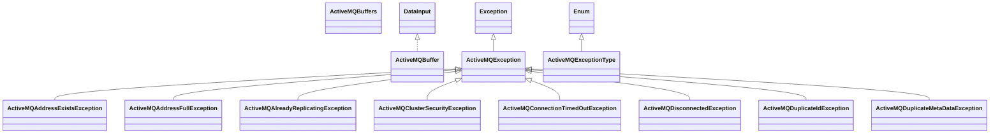

# artemis-commons-1.5.0.jar

[Group index](README.md) | [All archives](../README.md)

## Scope and provenance

- **Donor:** `SQX_145_REFERENCE_ROOT/internal/libs/artemis-commons-1.5.0.jar`.
- **SHA-256:** `9134161c80f5972dece8f7c933075ee33cf557a42e2d24bed7f9f2d1cc249a00`; accessed 2026-10-06; captured `2026-10-06T18:54:51.906614+00:00`.
- **Classes:** 153 raw entries; 153 unique entry names. Duplicate occurrence indices are zero-based.
- **Inspection:** read-only ZIP hashing and class-file structural parsing; signatures/descriptors, modifiers, hierarchy and references only. Bytecode bodies are hashed, not published.
- **Allocation:** proposed `FEAT-COMPUTE-ARTEMIS-COMMONS`, P14; [roadmap](../../sqx-full-application-roadmap.md). Domain README registration remains required.
- **Repository:** `01067f00031428613c6394064ca1bcadc1ba00ee`; review state unreviewed. Download label 145-dev1; installed build/activation and runtime equivalence unverified.
- **Limit:** every class/member is inventoried; declaration coverage does not establish consumed calls, defaults, formulas, failure semantics or algorithm parity.
- **Archive/resource index:** [007.json](../../../evidence/sqx145/archives/145/007.json).

## Complete member declarations

Member shards contain exact JVM names/descriptors, access flags, generic signatures, throws types, declared fields/methods, superclass/interfaces and referenced class names. All classes, nested/synthetic members and overloads are retained. Code length/hash is structural evidence, not a normalized algorithm comparison.

- [001.json](../../../evidence/sqx145/members/007/001.json) — SHA-256 `ff7ba28faf067c5489f37c1bf62fe627906805781d5c3ec3446950369913ffb9`.
- [002.json](../../../evidence/sqx145/members/007/002.json) — SHA-256 `7060c4115fa920a9de1c2e3fa0ff77971174fac13404ab45d6e75cb9d2dec419`.

## Focused structural diagram

Up to twelve non-nested classes; arrows show declared inheritance/interfaces only. External type names are not evidence of an available body or an executed dependency.

## Class inventory

| Archive entry | Occurrence | Class SHA-256 | Fields | Methods |
| --- | ---: | --- | ---: | ---: |
| `org/apache/activemq/artemis/api/core/ActiveMQAddressExistsException.class` | 0 | `15d6fc4c2709b2be3f5c0c0821f22fb0ba605f3459a0ff9ea4cfdaeda7e71448` | 1 | 2 |
| `org/apache/activemq/artemis/api/core/ActiveMQAddressFullException.class` | 0 | `acdba3be02be13735d34ea57f2910695eafc44f8d78dda1aa1b4fa20ba79932e` | 1 | 2 |
| `org/apache/activemq/artemis/api/core/ActiveMQAlreadyReplicatingException.class` | 0 | `1f93e4010215bd34e0f00e76daba6199c8b57c6cb7ec1a2f3a8386f232d01f44` | 1 | 2 |
| `org/apache/activemq/artemis/api/core/ActiveMQBuffer.class` | 0 | `b03da853f253164473e8a8ed9c8ef5c21260beba86f7450bce47602d06afcd16` | 0 | 96 |
| `org/apache/activemq/artemis/api/core/ActiveMQBuffers.class` | 0 | `243c60993df241c35adf7973a478344fc66624a011d6b003f87a092c0b6e2d66` | 0 | 6 |
| `org/apache/activemq/artemis/api/core/ActiveMQClusterSecurityException.class` | 0 | `77460646b79cbbe09b33609ac475c7c3b5b1685a585cc65c136295de9c583162` | 1 | 2 |
| `org/apache/activemq/artemis/api/core/ActiveMQConnectionTimedOutException.class` | 0 | `ec6168876ebbaa98b3b16041b9e7237c2d4c35a14d31c2b3ee425eaf98cfd09b` | 1 | 2 |
| `org/apache/activemq/artemis/api/core/ActiveMQDisconnectedException.class` | 0 | `71e9ffe01fd4e388767610ef3650650ab9561b0448dfc3e6f7c7138f3e02b74d` | 1 | 2 |
| `org/apache/activemq/artemis/api/core/ActiveMQDuplicateIdException.class` | 0 | `7b79aa9188d03ade4d8f3e096d92bbb998e953f3997036ea04c5f5b0c694552d` | 1 | 2 |
| `org/apache/activemq/artemis/api/core/ActiveMQDuplicateMetaDataException.class` | 0 | `9c65de21534dcad5a5f77b789c4fd297c18f58ee9de2dd96fad08c5cc0f5d152` | 1 | 2 |
| `org/apache/activemq/artemis/api/core/ActiveMQException.class` | 0 | `fba4688ff4760266467417cf0ee24d501aabc132d96c79c86ea006b2032d03eb` | 2 | 10 |
| `org/apache/activemq/artemis/api/core/ActiveMQExceptionType$1.class` | 0 | `fee12e0b05d19cf93833cc15dd2e924f4967174c4b08c5aab408a262032c387c` | 0 | 2 |
| `org/apache/activemq/artemis/api/core/ActiveMQExceptionType$10.class` | 0 | `1687cb281fb79970a2faba661b77662286ed9427fb6321264208222f6e7909a3` | 0 | 2 |
| `org/apache/activemq/artemis/api/core/ActiveMQExceptionType$11.class` | 0 | `e0723db9608c54789d4d90ce9260ce52822a7ff7bb9c6115cb3417082912a806` | 0 | 2 |
| `org/apache/activemq/artemis/api/core/ActiveMQExceptionType$12.class` | 0 | `9b4b369b0847c30233311b4e9c677d7e230a3bcfac47be09d558e0669b73398a` | 0 | 2 |
| `org/apache/activemq/artemis/api/core/ActiveMQExceptionType$13.class` | 0 | `f0ce3b610b14a04c208290f92f268974a33a377551dc4657243a74e402d9e150` | 0 | 2 |
| `org/apache/activemq/artemis/api/core/ActiveMQExceptionType$14.class` | 0 | `fd2aeb6c532ab10a6bb07d5d6c4237a3b96d19521bdf14f9384c3c289145482a` | 0 | 2 |
| `org/apache/activemq/artemis/api/core/ActiveMQExceptionType$15.class` | 0 | `787dd01960c84f9893fae8dcb53608c81af2beb5d3f61f82fddeab1a6b32cb59` | 0 | 2 |
| `org/apache/activemq/artemis/api/core/ActiveMQExceptionType$16.class` | 0 | `bbd5913bc07acd91e8305f0ae03f54fbf023cb82b2f72f2ee1f2c9869672e2c8` | 0 | 2 |
| `org/apache/activemq/artemis/api/core/ActiveMQExceptionType$17.class` | 0 | `125f8a7c7d83a63cde2d8a7c2ac3359330b1710f61e0ad982d7c00dd7c24a3b2` | 0 | 2 |
| `org/apache/activemq/artemis/api/core/ActiveMQExceptionType$18.class` | 0 | `c7236d97ed177bc3e60b8c797dc5de9b1eae438956b4c278b1a3dbd7a636ec36` | 0 | 2 |
| `org/apache/activemq/artemis/api/core/ActiveMQExceptionType$19.class` | 0 | `f0ff1523b38c2dc3e14c3b23e8fa81363ac838f53c0b74a09b9db7bbf307a681` | 0 | 2 |
| `org/apache/activemq/artemis/api/core/ActiveMQExceptionType$2.class` | 0 | `e2e892a8c73237842eb8fc9acaf98833b87df5238ea9a57f17f26cba7ce7e2a2` | 0 | 2 |
| `org/apache/activemq/artemis/api/core/ActiveMQExceptionType$20.class` | 0 | `7deb94d73b8617668f2c3b2843800433a15ca76d94c86ffa060dbbe77d184df5` | 0 | 2 |
| `org/apache/activemq/artemis/api/core/ActiveMQExceptionType$21.class` | 0 | `8c25c426ff96d1ee66254a5e488616dbff6f71839dff87fb9010c85ad0a947d0` | 0 | 2 |
| `org/apache/activemq/artemis/api/core/ActiveMQExceptionType$22.class` | 0 | `d927f9c647945588aa57f3b3adbec73081903f6944774287352b3386dc5a8ac6` | 0 | 2 |
| `org/apache/activemq/artemis/api/core/ActiveMQExceptionType$23.class` | 0 | `192fbf4397dacdf619b52bd4810d73621a92a9fb8c43821cd0cc09f749104f8d` | 0 | 2 |
| `org/apache/activemq/artemis/api/core/ActiveMQExceptionType$24.class` | 0 | `22a06e80c094fe13151b04e88c1c98c2a893cb7ee5ce1225d8535a4eae397969` | 0 | 2 |
| `org/apache/activemq/artemis/api/core/ActiveMQExceptionType$25.class` | 0 | `11bcd0dce5813ed3ac6378d58f8f802cde5849702c7f2e97d635390858c0657b` | 0 | 2 |
| `org/apache/activemq/artemis/api/core/ActiveMQExceptionType$26.class` | 0 | `36635d6cbfd2b0f8d2a8951678f0a30ee41be1072f5aa97fb7f3ed30ad2a9412` | 0 | 2 |
| `org/apache/activemq/artemis/api/core/ActiveMQExceptionType$27.class` | 0 | `20641accc14c8ce490ef37bf8111bd5c81c1f31944c20104f56079cd18bc57de` | 0 | 2 |
| `org/apache/activemq/artemis/api/core/ActiveMQExceptionType$28.class` | 0 | `224f00657c5c97a9d1383a006ee6d88b0042aae7e947cb97d1ccd76e26f00ac3` | 0 | 2 |
| `org/apache/activemq/artemis/api/core/ActiveMQExceptionType$29.class` | 0 | `2c260d329570060a3620977c242f4ec08ab90bfbc7759c3db4eaf7c199688fd9` | 0 | 2 |
| `org/apache/activemq/artemis/api/core/ActiveMQExceptionType$3.class` | 0 | `aa6f0b3c32868adfe1cb0bb258c3eb8f11dbdcec6d621e78648eaa4d7638c96b` | 0 | 2 |
| `org/apache/activemq/artemis/api/core/ActiveMQExceptionType$4.class` | 0 | `b8ef9c0c2afe6d7afb525fded87d790648b4b9d22d0e779a4ebc1a171535f053` | 0 | 2 |
| `org/apache/activemq/artemis/api/core/ActiveMQExceptionType$5.class` | 0 | `014409443892c362717e9fffafa3ee37a32afe50f8c2dab7e65b93d494614537` | 0 | 2 |
| `org/apache/activemq/artemis/api/core/ActiveMQExceptionType$6.class` | 0 | `07aa0fa05e2bcb2ef7da7eb523e28bebbfb80b75cfea19262912b158a00f983c` | 0 | 2 |
| `org/apache/activemq/artemis/api/core/ActiveMQExceptionType$7.class` | 0 | `4ac43572cd41b477756f1436c6c01ed5cd89e6fc4bd85025cdcd0595fc1b7cf0` | 0 | 2 |
| `org/apache/activemq/artemis/api/core/ActiveMQExceptionType$8.class` | 0 | `4a25d1110dda05c387646e5664fbea3ca720e8ec342820d21ee0b7d89626be27` | 0 | 2 |
| `org/apache/activemq/artemis/api/core/ActiveMQExceptionType$9.class` | 0 | `b3f630fe6478c1724642f15edb8cd09f2c10a897a15dd250ba250fe5b67162f1` | 0 | 2 |
| `org/apache/activemq/artemis/api/core/ActiveMQExceptionType.class` | 0 | `9b9299b10fb0594cbb67abbdd9d82e48eb6328ad337c67a4308212d811a61672` | 43 | 9 |
| `org/apache/activemq/artemis/api/core/ActiveMQIllegalStateException.class` | 0 | `bd6dbbec6b01c43969d42f19ac887c0e9eaffca725e36a95b602693d1e33e4e9` | 1 | 2 |
| `org/apache/activemq/artemis/api/core/ActiveMQIncompatibleClientServerException.class` | 0 | `05fa1c188a63a479447ae7988cd0bad0c8e2352efcf255a40faf53bab3abd111` | 1 | 2 |
| `org/apache/activemq/artemis/api/core/ActiveMQInterceptorRejectedPacketException.class` | 0 | `30c991cad1ff98793167c1bc8e3ac59443be20cf8a05aac225a794c254867a48` | 1 | 2 |
| `org/apache/activemq/artemis/api/core/ActiveMQInternalErrorException.class` | 0 | `8e698e1df52aa1bcbf0419f0f9976093275437c83f8313561e30e318bacdd6d1` | 1 | 4 |
| `org/apache/activemq/artemis/api/core/ActiveMQInterruptedException.class` | 0 | `f351672b94a5f5c5c5a871676078d6c8b149d49f818a58176b3246401b5de4fc` | 1 | 2 |
| `org/apache/activemq/artemis/api/core/ActiveMQInvalidFilterExpressionException.class` | 0 | `02ef856b7bd1f400b5766f644415b2572faeacecec7d471f1a204d9530468d0f` | 1 | 2 |
| `org/apache/activemq/artemis/api/core/ActiveMQInvalidTransientQueueUseException.class` | 0 | `0dbed0b8688e1b48808defa86f1ba943ea4bfe324c93dd0ed940064ec60274f5` | 1 | 2 |
| `org/apache/activemq/artemis/api/core/ActiveMQIOErrorException.class` | 0 | `edd834df0b393ded8eae8548359d29ececf6f7f56c46edf2b464ba091dd27b92` | 1 | 3 |
| `org/apache/activemq/artemis/api/core/ActiveMQLargeMessageException.class` | 0 | `761d9891083593424e8887ea07f53a13392ea178787cf90de1912134d94fe7d1` | 1 | 2 |
| `org/apache/activemq/artemis/api/core/ActiveMQLargeMessageInterruptedException.class` | 0 | `b97f95510d2df37e2f117346fc51798204e4f20eb78752b53e7dc487e6e6bc5d` | 1 | 2 |
| `org/apache/activemq/artemis/api/core/ActiveMQNativeIOError.class` | 0 | `d8d8a61dcd47b73e8f12cf62aa60df67c237e414231c0c62ec8314c426fc9ee4` | 1 | 3 |
| `org/apache/activemq/artemis/api/core/ActiveMQNonExistentQueueException.class` | 0 | `0aa026762df67ac3efbb0b64aaef54c4f2896bb971a60624c0756b0cd0ae5d11` | 1 | 2 |
| `org/apache/activemq/artemis/api/core/ActiveMQNotConnectedException.class` | 0 | `59df0651bc85c06705b6cfc5a922f4fda2823a816cef6f715fa1ae259f6f164d` | 1 | 2 |
| `org/apache/activemq/artemis/api/core/ActiveMQObjectClosedException.class` | 0 | `fce395e87ed0ad3371739698d8a316d247a95a77dcf1b3e3f110b74704f2453f` | 1 | 2 |
| `org/apache/activemq/artemis/api/core/ActiveMQPropertyConversionException.class` | 0 | `2a96b4a7d9efca0d26ef7dc8f285e4d925dd0ac4eb7373f5a9ddd0372957f191` | 1 | 1 |
| `org/apache/activemq/artemis/api/core/ActiveMQQueueExistsException.class` | 0 | `0fd43c63cd50c8374e291672d7f0a92bc3e51c343d7566b919d35d13b15f0276` | 1 | 2 |
| `org/apache/activemq/artemis/api/core/ActiveMQRemoteDisconnectException.class` | 0 | `449f38dc3923fe93a08441cca529abe65f44ba9b87cda823d58fae72d9c19dc5` | 0 | 2 |
| `org/apache/activemq/artemis/api/core/ActiveMQSecurityException.class` | 0 | `600994379517c2e12af1e2b0b2a3d3b174ff722cd3d8f62a059ee05c1fa4648c` | 1 | 2 |
| `org/apache/activemq/artemis/api/core/ActiveMQSessionCreationException.class` | 0 | `48ecf073637f2dd243e39816f7129b9a26fbf584ddb923a3eda01080e4eb17e6` | 1 | 2 |
| `org/apache/activemq/artemis/api/core/ActiveMQTransactionOutcomeUnknownException.class` | 0 | `d942447eb593ebc6afe965bac0546ab1f5dac1f15b7b08c05c54592684b12b35` | 1 | 2 |
| `org/apache/activemq/artemis/api/core/ActiveMQTransactionRolledBackException.class` | 0 | `334c867cf2d8880d7a00e7e8d444f7bf9d1aad302add6e23eff14a85df437f49` | 1 | 2 |
| `org/apache/activemq/artemis/api/core/ActiveMQTransactionTimeoutException.class` | 0 | `2149f130e4e8505401f872f4fee567ef1fe389b9166ce692d6244f9094b6c697` | 0 | 2 |
| `org/apache/activemq/artemis/api/core/ActiveMQUnBlockedException.class` | 0 | `28e6fec5e8c98949a6a9119b34cad660b6a1e2bf23a5d300f1eb5f82e0bdc1ef` | 1 | 2 |
| `org/apache/activemq/artemis/api/core/ActiveMQUnsupportedPacketException.class` | 0 | `78ea19ca975255e002ffeaad7bd5e0704b6c0ebb9fce29261d87906d1a44369b` | 1 | 2 |
| `org/apache/activemq/artemis/api/core/Pair.class` | 0 | `f97bc5a62047abf4a322c3ba7793d5ada5540c7d225e5b789b3baedb4a105e6d` | 4 | 8 |
| `org/apache/activemq/artemis/api/core/SimpleString.class` | 0 | `bc7ab21eeb0e8a1ca76f0e32aff2d858da7dc46108ab462ae4e59ccb591ed747` | 4 | 22 |
| `org/apache/activemq/artemis/ArtemisConstants.class` | 0 | `a2222e7a89188a132ea4e1d5854f0ad3a6a992df7a0a943c84fb114d80463d75` | 4 | 1 |
| `org/apache/activemq/artemis/core/buffers/impl/ChannelBufferWrapper.class` | 0 | `8375224a7c4dbe7cc790cbbd4e5eeeba6181dab7e765fa879078915e1deb1c20` | 2 | 106 |
| `org/apache/activemq/artemis/core/server/ActiveMQComponent.class` | 0 | `a839ae8d2a04b6b4359822056a3cbf3dc6bcb92f784412639c2ee27dfca08c19` | 0 | 3 |
| `org/apache/activemq/artemis/core/server/ActiveMQScheduledComponent$1.class` | 0 | `a75bd30f3c8926696b84b7bd894f9659f6e9b0f5cfe396a8e84692a1a7d2e6dc` | 1 | 2 |
| `org/apache/activemq/artemis/core/server/ActiveMQScheduledComponent$2.class` | 0 | `68486d2e2a48c6a34bc11dab59339cf4bc336afcaed093cec74e362ee326f8d4` | 1 | 2 |
| `org/apache/activemq/artemis/core/server/ActiveMQScheduledComponent.class` | 0 | `d03e108b44943e1e7e6cc6e1580134ea80877a72e7a9ecb9958a171b674545b3` | 12 | 16 |
| `org/apache/activemq/artemis/logs/ActiveMQUtilBundle.class` | 0 | `7fbf052a48df4dda01b7d55040c371d88e6278d3113ac73451c511eeaa1c41d5` | 1 | 5 |
| `org/apache/activemq/artemis/logs/ActiveMQUtilBundle_$bundle.class` | 0 | `6efcf005735ecddfea74c88db0bccee24e26fbfcd1bb5f724167284dbcade70d` | 6 | 11 |
| `org/apache/activemq/artemis/logs/ActiveMQUtilLogger.class` | 0 | `ade5c7fa1308b42b30620d48bc7bc6ddc3bc52f313eca09014acda08346a5cd2` | 1 | 2 |
| `org/apache/activemq/artemis/logs/ActiveMQUtilLogger_$logger.class` | 0 | `3e4ea8d693de707c5720a7e5ce98985e050485b1bc0981a396685545f3c68dbb` | 3 | 4 |
| `org/apache/activemq/artemis/logs/AssertionLoggerHandler.class` | 0 | `f2013f0057ef9db4a403e7b0d3411ca887213f1be253434d5ad7dfb3fecb30ff` | 2 | 11 |
| `org/apache/activemq/artemis/utils/ActiveMQThreadFactory$1.class` | 0 | `286249f338b85ac4f4031e43d45878b3a06a41477e4c080a826064bb892a5349` | 0 | 0 |
| `org/apache/activemq/artemis/utils/ActiveMQThreadFactory$ThreadCreateAction.class` | 0 | `4b8dfaff53d1d58f72fe458fca92e4467fb0578b6d3c02ee15e7024669752a9c` | 2 | 4 |
| `org/apache/activemq/artemis/utils/ActiveMQThreadFactory.class` | 0 | `d0919bba67f4d263ad83c1492c187f460080521bbe2a7620489854e59b8b000e` | 6 | 5 |
| `org/apache/activemq/artemis/utils/ActiveMQThreadPoolExecutor$1.class` | 0 | `240a65331d1026ab65e0675df9553e80d8503c3ba11a57c8e75d83289fa0e6fb` | 0 | 0 |
| `org/apache/activemq/artemis/utils/ActiveMQThreadPoolExecutor$ThreadPoolQueue.class` | 0 | `6669551f7cacfacbc15ad09a6f1702808ca4c9edab3766ca69c80aee81bea0f2` | 1 | 5 |
| `org/apache/activemq/artemis/utils/ActiveMQThreadPoolExecutor.class` | 0 | `a9fba5cfb26c01b94fa8e469e000cbe583d9daa1adc13ab2ae92e41c7d45b71d` | 2 | 8 |
| `org/apache/activemq/artemis/utils/Base64$InputStream.class` | 0 | `20c4334643d5a4182ef12c35d4d27335f73bf4990efec7d28256a62bd468e0ac` | 10 | 4 |
| `org/apache/activemq/artemis/utils/Base64$OutputStream.class` | 0 | `d13d934e122b3faf2b136a8553c0eb8717799bee03095ac7ebf4a80245ef7862` | 11 | 8 |
| `org/apache/activemq/artemis/utils/Base64.class` | 0 | `6ea254ff10faa2800ac1a489e2ce0533170d80980e1ad1bb44713be9182c09ed` | 19 | 30 |
| `org/apache/activemq/artemis/utils/ByteUtil.class` | 0 | `e52e456bea040abdc075d0df13bb32a10007d9ae1afc8fc2155df81d6a32e10e` | 2 | 13 |
| `org/apache/activemq/artemis/utils/CertificateUtil.class` | 0 | `87db9137ddcbe7aa2a0094bed83b8cdf86f3205218e53eeb4281994fcf8f3da6` | 0 | 2 |
| `org/apache/activemq/artemis/utils/ClassloadingUtil.class` | 0 | `64f8e6ed307cab05ceba66c5038358f993b645f12fc279f5a001accd80f57ba0` | 1 | 4 |
| `org/apache/activemq/artemis/utils/ConcurrentHashSet.class` | 0 | `97697436769ffc80f8e9165ef9a48900d1158823424d163e44ebea21dc402666` | 2 | 10 |
| `org/apache/activemq/artemis/utils/ConcurrentSet.class` | 0 | `2062c9e92d19acd263bdc6935d1cf3d5760f6f456281e8cf68d54fa75105c120` | 0 | 1 |
| `org/apache/activemq/artemis/utils/ConcurrentUtil.class` | 0 | `0f0562e65ce9f162d389b4ac19b12f22e2197ade878349866841c810eb180edb` | 0 | 2 |
| `org/apache/activemq/artemis/utils/DataConstants.class` | 0 | `b903f286457f2d01651558acd9859765ffbe4f6c45fe8910e5e0e459aa197c60` | 22 | 1 |
| `org/apache/activemq/artemis/utils/DefaultSensitiveStringCodec$BlowfishAlgorithm.class` | 0 | `59868a1a7890c3a374c09a548f2d53359d872ef83f42a352c4542a768b7c91c0` | 2 | 4 |
| `org/apache/activemq/artemis/utils/DefaultSensitiveStringCodec$CodecAlgorithm.class` | 0 | `a04f4ceecf9e9cfa42524206ac10d538dc3225b5543e79ff3abb70777cf57fb6` | 2 | 4 |
| `org/apache/activemq/artemis/utils/DefaultSensitiveStringCodec$PBKDF2Algorithm.class` | 0 | `52eeaf819fd4ad9dc4da9ba3797d6c6a3df66b557e633b2fd0f7f829a237ef26` | 8 | 5 |
| `org/apache/activemq/artemis/utils/DefaultSensitiveStringCodec.class` | 0 | `0b435db6f7bc989cbb44902bf4093f4f6565159a58b69772d772d615c6a5a682` | 5 | 8 |
| `org/apache/activemq/artemis/utils/ExecutorFactory.class` | 0 | `ea4454cf770b6d652e13d9d2ab8ad574653ee90ca6ad6bfba459307f1c6abdfe` | 0 | 1 |
| `org/apache/activemq/artemis/utils/FactoryFinder$ObjectFactory.class` | 0 | `f0451bdedd2f0cee301e14b022d22912955da3531851489b95fa10608ca8e968` | 0 | 1 |
| `org/apache/activemq/artemis/utils/FactoryFinder$StandaloneObjectFactory.class` | 0 | `24a7153ab8e11f1a6f2c47326353c6c3d85fcdaab6aa9ecd47a60ce906dd9365` | 1 | 4 |
| `org/apache/activemq/artemis/utils/FactoryFinder.class` | 0 | `8a9ad4178b18eef8abce340b2c999717667599bda1e8a295016ade048f722eb5` | 2 | 5 |
| `org/apache/activemq/artemis/utils/FileUtil.class` | 0 | `ec792d7c7f01d95c7c9d8230069bb7d026f5d7f413cd3db11442b2e518e6f0d5` | 1 | 4 |
| `org/apache/activemq/artemis/utils/HashProcessor.class` | 0 | `beb5b5187100b1b5f862fbe9aebdfeed554eae8b89ed958752963460725fea6e` | 0 | 2 |
| `org/apache/activemq/artemis/utils/IPV6Util.class` | 0 | `f9a10dc5e3f83fc7d96fddc6dbcfdf0ba72240516ae3d0eee4f3643a52c209df` | 0 | 2 |
| `org/apache/activemq/artemis/utils/NoHashProcessor.class` | 0 | `0990f95d2c60815c847e4d6ae64d2fdf07aab8bb15ca4f3a559b3f3a1ee52616` | 0 | 3 |
| `org/apache/activemq/artemis/utils/OrderedExecutorFactory$1.class` | 0 | `5454a81cc34f883d9ebb4d1fefb757abf0d06f19b5862601f4a0b986bc225a6f` | 0 | 0 |
| `org/apache/activemq/artemis/utils/OrderedExecutorFactory$OrderedExecutor$ExecutorTask.class` | 0 | `15646a17c0e453f8fcfdfecd30fd42fc79c9ff51e30156434e362ba22cb0f261` | 1 | 3 |
| `org/apache/activemq/artemis/utils/OrderedExecutorFactory$OrderedExecutor.class` | 0 | `65daebdf4a20ee798df24b4ef6b3c4ddc2a9fbba47bbfd22d5cea7ac92a9e2e5` | 7 | 7 |
| `org/apache/activemq/artemis/utils/OrderedExecutorFactory.class` | 0 | `d516e25de1c39843cd132b7e89ffdfa8bf6faabdb51f540a4a20eb09df72621d` | 2 | 4 |
| `org/apache/activemq/artemis/utils/PasswordMaskingUtil$1.class` | 0 | `7284ca1cd37e45e0946138cc6f4e29be0bea75a2e46b4b7c884519a00a7d3db9` | 1 | 3 |
| `org/apache/activemq/artemis/utils/PasswordMaskingUtil.class` | 0 | `51fbc5f041aa1ccc787b9b195d3efbabc91129a9ed41ce7d87b1445eac0b5c46` | 3 | 9 |
| `org/apache/activemq/artemis/utils/PendingTask.class` | 0 | `9563e34453e0924888376c239fcead8f6bc7e44ad24f2f1c28803db26cc293a6` | 0 | 2 |
| `org/apache/activemq/artemis/utils/RandomUtil.class` | 0 | `46013ec7031051babcb699871b21e288c513e84f830f0c4dd2fa3b02a5ca45b1` | 1 | 21 |
| `org/apache/activemq/artemis/utils/ReferenceCounter.class` | 0 | `cf114b88c78cd78a74f3586ff9a232b3e820c84a053b530d49f930af5d300273` | 0 | 2 |
| `org/apache/activemq/artemis/utils/ReferenceCounterUtil.class` | 0 | `f9fa66b4190eae43a571467e89dfccdd1c97f753a57ffc42d3aebceff9e868c2` | 3 | 4 |
| `org/apache/activemq/artemis/utils/ReusableLatch$1.class` | 0 | `4ab128be70a4cb46277ed18ab906055ecce36132086551c917d88a7d82df977a` | 0 | 0 |
| `org/apache/activemq/artemis/utils/ReusableLatch$CountSync.class` | 0 | `7e08c80ca9cc3f18cf81a84269b3ed53970f3755ce041ec25c54e4d328324b9d` | 0 | 7 |
| `org/apache/activemq/artemis/utils/ReusableLatch.class` | 0 | `9dbe2ccbe93f502934c2c8d6eac09b67f1e22cce3840701f9171ced565025310` | 1 | 10 |
| `org/apache/activemq/artemis/utils/SecureHashProcessor.class` | 0 | `fdb51261759b17d342610e06cdbf416639ea8141f42f9de6f225899f19b7cfaf` | 3 | 3 |
| `org/apache/activemq/artemis/utils/SelectorTranslator.class` | 0 | `592a687e1adde6d744d84e32e463a587d4d9ab09722ca6b0eb942584d8d9d391` | 0 | 3 |
| `org/apache/activemq/artemis/utils/SensitiveDataCodec.class` | 0 | `39ecd7e42dcf514e86674ee34062f9d9a6cc30efc2d591f0e39651994d97e11b` | 0 | 3 |
| `org/apache/activemq/artemis/utils/SimpleFuture.class` | 0 | `69ac0f176350b6e2608a2bb9346ee739e8c56c42c707444c06cca43306670cbc` | 4 | 8 |
| `org/apache/activemq/artemis/utils/StringEscapeUtils.class` | 0 | `170c7eb996410508590fa72090f954fbe889c3e4e72a50107d93f172ae1ad772` | 0 | 3 |
| `org/apache/activemq/artemis/utils/TimeUtils$CheckMethod.class` | 0 | `da4c00f4e1ec251c8de2584b8c27c224edb7b0296468dd4730e23c090bb8a392` | 0 | 1 |
| `org/apache/activemq/artemis/utils/TimeUtils.class` | 0 | `f4ab0392046fa2b4b2085df74568775668fdfac039cee29da8c6d7a69fc951bc` | 0 | 3 |
| `org/apache/activemq/artemis/utils/TypedProperties$1.class` | 0 | `1edb9416caf3591f614b0718f5e86e2f63a7ba89a2767d4eabfdb2d865d74023` | 0 | 0 |
| `org/apache/activemq/artemis/utils/TypedProperties$BooleanValue.class` | 0 | `1e86d966828d0016a30815ac3b9ba156a63a7f044292f8e1d1b43497a44871c9` | 1 | 7 |
| `org/apache/activemq/artemis/utils/TypedProperties$BytesValue.class` | 0 | `86c4fc6a3826b56bdbef7f2de448298c51a2757a43972594d39d744530b9ff3b` | 1 | 7 |
| `org/apache/activemq/artemis/utils/TypedProperties$ByteValue.class` | 0 | `09f3b9c81258d5b1d90c56e1f12522ae1480b8977315c5fd872ad1689cd1b705` | 1 | 7 |
| `org/apache/activemq/artemis/utils/TypedProperties$CharValue.class` | 0 | `a1b9c4fcd54972a3ddea5354ff2b1cdb60e7a95decd6935ee74f59046b87cc10` | 1 | 7 |
| `org/apache/activemq/artemis/utils/TypedProperties$DoubleValue.class` | 0 | `1dfbbc048cd939a8c3ac29de033ea1ca87d98ddb219ed396d39c0140d5e69d0e` | 1 | 7 |
| `org/apache/activemq/artemis/utils/TypedProperties$FloatValue.class` | 0 | `a2227b521691f31b6933339157ed4fc926c79f88a396b714f9b9fa5f1a442186` | 1 | 7 |
| `org/apache/activemq/artemis/utils/TypedProperties$IntValue.class` | 0 | `51661023270062343fac9b3c985ce43b3fe7883425eeb25d990bd7481b37ec01` | 1 | 7 |
| `org/apache/activemq/artemis/utils/TypedProperties$LongValue.class` | 0 | `a1d8d198ae837c647e2ec70b4c63d368a7b5e217bb423677a143c17a73f6371d` | 1 | 7 |
| `org/apache/activemq/artemis/utils/TypedProperties$NullValue.class` | 0 | `4902bf04032af6a3545a103a65717cc22af1591df7713ef0709b12cb28b852df` | 0 | 5 |
| `org/apache/activemq/artemis/utils/TypedProperties$PropertyValue.class` | 0 | `f721f83c1847721e945c148d9e25fefde2c497e18812106e00424cee3f975af7` | 0 | 6 |
| `org/apache/activemq/artemis/utils/TypedProperties$ShortValue.class` | 0 | `3b7e6ca5d67f5fc19890b8062eaf814538a36e441acd49757de53b20fb9c9325` | 1 | 7 |
| `org/apache/activemq/artemis/utils/TypedProperties$StringValue.class` | 0 | `6b38a77558fbe682533b582fc929960c2f568363aa69b185cfd1963f1524d10f` | 1 | 7 |
| `org/apache/activemq/artemis/utils/TypedProperties.class` | 0 | `fac6eeef21f4d6b17219dea12b8addd8d99bd8b6c1f16a6b3dfb375b9f19a5e7` | 4 | 43 |
| `org/apache/activemq/artemis/utils/uri/BeanSupport.class` | 0 | `74bbdf532c7af46a0e81fb749ceb289f53e2dddccf73f2300a99174cf80f0b35` | 1 | 11 |
| `org/apache/activemq/artemis/utils/uri/FluentPropertyBeanIntrospectorWithIgnores.class` | 0 | `4edcd038dea8335ac24785f5fcdf502f0fc8e073606527b8ade9093cb561534a` | 2 | 7 |
| `org/apache/activemq/artemis/utils/uri/SchemaConstants.class` | 0 | `f65f09c1ae8f26d486f1349d1d68dcc2af2ece3d477a544e9b438f33081df671` | 4 | 1 |
| `org/apache/activemq/artemis/utils/uri/URIFactory.class` | 0 | `f23e037a1a12a8212cd7a958edb2370af50a8e85ca4fedf5cbecaf281878662a` | 2 | 12 |
| `org/apache/activemq/artemis/utils/uri/URISchema.class` | 0 | `2a0cf1d5078b4c80db5bc8c00aa8f0c4d4ae6c69ab90240e721cd25fb7dfd455` | 1 | 15 |
| `org/apache/activemq/artemis/utils/uri/URISupport$CompositeData.class` | 0 | `b5f227cdd45a174ecbc7b262c31ce7c18e5f535a6eb179bb26132de2004b0ca2` | 6 | 16 |
| `org/apache/activemq/artemis/utils/uri/URISupport.class` | 0 | `eb66280195c6d4c46a3c6f143772239d49a046bc32d89aaa222f113d4ceab775` | 0 | 20 |
| `org/apache/activemq/artemis/utils/UTF8Util$StringUtilBuffer.class` | 0 | `df15a6c940016c080b1ab50af443b5cad4c4a9fd0c2ae62efba014fb9f5727a0` | 2 | 4 |
| `org/apache/activemq/artemis/utils/UTF8Util.class` | 0 | `63f8745bad29c551625107b3188d6dcbe794b49c0dffab3383465d229ce1d8f6` | 2 | 7 |
| `org/apache/activemq/artemis/utils/UUID.class` | 0 | `92b20bc94af79c1288de592cb2362dad355db2a5d544369208ea40a44c641fc4` | 21 | 7 |
| `org/apache/activemq/artemis/utils/UUIDGenerator$1.class` | 0 | `ed1815942b1778fcc54504f27f91d212d4bca110c2de9687c4fa7053e4af5d50` | 1 | 3 |
| `org/apache/activemq/artemis/utils/UUIDGenerator.class` | 0 | `a21786f0a480e918b45cac51c10c2ee8d117fbaf0aa50fef98ca728f82df896a` | 6 | 17 |
| `org/apache/activemq/artemis/utils/UUIDTimer.class` | 0 | `02a172b3477aff66a256b1180ff6ce5110fe5ddd808879d331eb0a3a0b35f432` | 10 | 4 |
