# commons-beanutils-1.9.2.jar

[Group index](README.md) | [All archives](../README.md)

## Scope and provenance

- **Donor:** `SQX_145_REFERENCE_ROOT/internal/libs/commons-beanutils-1.9.2.jar`.
- **SHA-256:** `23729e3a2677ed5fb164ec999ba3fcdde3f8460e5ed086b6a43d8b5d46998d42`; accessed 2026-10-06; captured `2026-10-06T18:54:51.906614+00:00`.
- **Classes:** 137 raw entries; 137 unique entry names. Duplicate occurrence indices are zero-based.
- **Inspection:** read-only ZIP hashing and class-file structural parsing; signatures/descriptors, modifiers, hierarchy and references only. Bytecode bodies are hashed, not published.
- **Allocation:** proposed `FEAT-HOST-COMMONS-BEANUTILS`, P01; [roadmap](../../sqx-full-application-roadmap.md). Domain README registration remains required.
- **Repository:** `01067f00031428613c6394064ca1bcadc1ba00ee`; review state unreviewed. Download label 145-dev1; installed build/activation and runtime equivalence unverified.
- **Limit:** every class/member is inventoried; declaration coverage does not establish consumed calls, defaults, formulas, failure semantics or algorithm parity.
- **Archive/resource index:** [014.json](../../../evidence/sqx145/archives/145/014.json).

## Complete member declarations

Member shards contain exact JVM names/descriptors, access flags, generic signatures, throws types, declared fields/methods, superclass/interfaces and referenced class names. All classes, nested/synthetic members and overloads are retained. Code length/hash is structural evidence, not a normalized algorithm comparison.

- [001.json](../../../evidence/sqx145/members/014/001.json) — SHA-256 `e52ac10af7ba55cf07416e50861dd7a82be803e028fb85f50a26d52f8d451296`.
- [002.json](../../../evidence/sqx145/members/014/002.json) — SHA-256 `e183839b84ceb7b9c031e2493e0c33cf11a2e854bac9e906f7b184c6ae48822b`.

## Focused structural diagram

Up to twelve non-nested classes; arrows show declared inheritance/interfaces only. External type names are not evidence of an available body or an executed dependency.

```mermaid
classDiagram
    class C0["BaseDynaBeanMapDecorator"]
    class C1["BasicDynaBean"]
    class C2["BasicDynaClass"]
    class C3["BeanAccessLanguageException"]
    class C4["BeanComparator"]
    class C5["BeanIntrospectionData"]
    class C6["BeanIntrospector"]
    class C7["BeanMap"]
    class C8["BeanPredicate"]
    class C9["BeanPropertyValueChangeClosure"]
    class C10["BeanPropertyValueEqualsPredicate"]
    class C11["BeanToPropertyValueTransformer"]
    class E0["Map"]
    E0 <|.. C0
    class E1["DynaBean"]
    E1 <|.. C1
    class E2["Serializable"]
    E2 <|.. C1
    class E3["DynaClass"]
    E3 <|.. C2
    E2 <|.. C2
    class E4["IllegalArgumentException"]
    E4 <|-- C3
    class E5["Comparator"]
    E5 <|.. C4
    E2 <|.. C4
    class E6["AbstractMap"]
    E6 <|-- C7
    class E7["Cloneable"]
    E7 <|.. C7
    class E8["Predicate"]
    E8 <|.. C8
    class E9["Closure"]
    E9 <|.. C9
    E8 <|.. C10
    class E10["Transformer"]
    E10 <|.. C11
```

## Class inventory

| Archive entry | Occurrence | Class SHA-256 | Fields | Methods |
| --- | ---: | --- | ---: | ---: |
| `org/apache/commons/beanutils/BaseDynaBeanMapDecorator$MapEntry.class` | 0 | `56cca2f17997924b6694be4f3d99f1c717dfbb6c3e6ccb905a20ca03ac4858e3` | 2 | 6 |
| `org/apache/commons/beanutils/BaseDynaBeanMapDecorator.class` | 0 | `c4eab2728d32e74315a2a4d54bbc98bbc424b59fc5ff0929e568ea07cb04205f` | 3 | 19 |
| `org/apache/commons/beanutils/BasicDynaBean.class` | 0 | `f93b6af31786955c8ab44a94b8527472cc03ac056973b6b1a5d2d784ab07a28d` | 3 | 13 |
| `org/apache/commons/beanutils/BasicDynaClass.class` | 0 | `9363f7fd3490f09d75721453eec8abfe7a76c4b42c1a976b4457fcd640fd777b` | 7 | 11 |
| `org/apache/commons/beanutils/BeanAccessLanguageException.class` | 0 | `1502cbc0256d1672bf009855e7261cc364d5500e2810ee643f61e1262dbdc72a` | 0 | 2 |
| `org/apache/commons/beanutils/BeanComparator.class` | 0 | `6eed596ce52262770fbc256fb0262097307e43aacf70ded3f31ca3faa24c928b` | 2 | 10 |
| `org/apache/commons/beanutils/BeanIntrospectionData.class` | 0 | `a21960fd3504451f84177f02c810629a5db0a1f8f96a7b8d703e4c02a9927a8a` | 2 | 6 |
| `org/apache/commons/beanutils/BeanIntrospector.class` | 0 | `033a67b48ca46efa34dc361bfe9f98614fbf4b6580094b5ec1ff42abf08956cc` | 0 | 1 |
| `org/apache/commons/beanutils/BeanMap$1.class` | 0 | `4cb0b588ee2052f86261d778c7b2689dcf9d68168c0f39a91e1b4db5e37f1ae6` | 0 | 13 |
| `org/apache/commons/beanutils/BeanMap$10.class` | 0 | `e63e0138b5c96dc3d54c813da25c5cffee53d6c9ef8d74fcb2e47eca2d1774a1` | 1 | 3 |
| `org/apache/commons/beanutils/BeanMap$11.class` | 0 | `019c6ce6820a54f49e3c55077646db4ff3ad3deba743c795a01741027cf45207` | 2 | 4 |
| `org/apache/commons/beanutils/BeanMap$12.class` | 0 | `4c6d4f3be5ad2bea3af1f0cf3598b693462068ca448683ad3b0dcf560bde815a` | 2 | 5 |
| `org/apache/commons/beanutils/BeanMap$2.class` | 0 | `0726a24114a77a58320d19101eb3116b35bcb146154ea9edb1977ddd779b3eb8` | 0 | 2 |
| `org/apache/commons/beanutils/BeanMap$3.class` | 0 | `6844a4002688cae31ff2b7932b8ec898a869e4641def3f130a7fee68b7eba0b8` | 0 | 2 |
| `org/apache/commons/beanutils/BeanMap$4.class` | 0 | `a076f2a466b12b0a36f012891751ceea8a08e50ca9862284b40fc10d78a66b21` | 0 | 2 |
| `org/apache/commons/beanutils/BeanMap$5.class` | 0 | `b118c6252bf0ef77fbfbcaae7939ece7c35d87ceada230729869f6a036a89e38` | 0 | 2 |
| `org/apache/commons/beanutils/BeanMap$6.class` | 0 | `274c7d7e56932971766272d8bcff529ce40a6843b18eb292a8fd394f6b009780` | 0 | 2 |
| `org/apache/commons/beanutils/BeanMap$7.class` | 0 | `21dc055f28734419bcc571dc97c251ba2fa61e826fb42b23cc5b0fc90e76b65f` | 0 | 2 |
| `org/apache/commons/beanutils/BeanMap$8.class` | 0 | `437b971601de824d7bfa5b91fecccd975923756696bb664a99a18cf41edbb372` | 0 | 2 |
| `org/apache/commons/beanutils/BeanMap$9.class` | 0 | `4be5b32a36aaa4d5bbd73ad2e905fd54e163f234689fc5661625a41ec82c9cd9` | 0 | 2 |
| `org/apache/commons/beanutils/BeanMap$Entry.class` | 0 | `c4ff56b45ff689fc84e1b65dd4cec21c617caca0f10360d315f5173ac4b65149` | 1 | 2 |
| `org/apache/commons/beanutils/BeanMap.class` | 0 | `b09672f7a970c44f841fb15f27aa5fb378b1dcd26c297621c650fe750b60c680` | 7 | 36 |
| `org/apache/commons/beanutils/BeanPredicate.class` | 0 | `096b9fd32cfa567ce387e3d9f238f45ced4a988a107a19c3ff273458bfd3382b` | 3 | 6 |
| `org/apache/commons/beanutils/BeanPropertyValueChangeClosure.class` | 0 | `3a8e40d56b40e711ee3c8021c11fb012293faebe9bbd1c9963f291855e9acc25` | 4 | 6 |
| `org/apache/commons/beanutils/BeanPropertyValueEqualsPredicate.class` | 0 | `fdb068c8efbd3e44c7b919b85e0de1b7bbfcabb2a42b7de9284c031c71239312` | 4 | 7 |
| `org/apache/commons/beanutils/BeanToPropertyValueTransformer.class` | 0 | `3856e4a2f5fea1d75ea4fea1047128503abe6a4820a00c84ff187c4f9e407ab3` | 3 | 5 |
| `org/apache/commons/beanutils/BeanUtils.class` | 0 | `22a780d6866ec4d588d1e99d509fddff8956c47ace3730bfdde995a3532b06c1` | 1 | 22 |
| `org/apache/commons/beanutils/BeanUtilsBean$1.class` | 0 | `d130d593d0167c24ad2cde0493c7ca3860b33b512eb266c23664cdb2cb99e3c1` | 0 | 3 |
| `org/apache/commons/beanutils/BeanUtilsBean.class` | 0 | `68e8ae6c4eefbb8d384ea32fd31ef32f2b60436184d307f844c5bc6b8c0f89bb` | 5 | 27 |
| `org/apache/commons/beanutils/BeanUtilsBean2.class` | 0 | `5716f5510ff908aa6995e025c1a9e8a7bb08c2874da47d1f352735e04d3e5bed` | 0 | 2 |
| `org/apache/commons/beanutils/ConstructorUtils.class` | 0 | `a83523cc0164b49a34b3269eadec04bf30836b47dc5b6ddb34915a5262ac4607` | 2 | 13 |
| `org/apache/commons/beanutils/ContextClassLoaderLocal.class` | 0 | `e94501af19ae6c450e519b1dd7727d06de1457fa67a370341cb040bc21a46ec9` | 3 | 6 |
| `org/apache/commons/beanutils/ConversionException.class` | 0 | `b315a152b7de0984fa23694cc3091026313300e670761d596a7aef7c6b2b1fbb` | 1 | 4 |
| `org/apache/commons/beanutils/Converter.class` | 0 | `e2ae12e4c00f32350e17c2386532dcc108f4f5e723142a0120ed2373f58faeed` | 0 | 1 |
| `org/apache/commons/beanutils/converters/AbstractArrayConverter.class` | 0 | `85937d2e00b2bfe31a2e1a02eb03242243cf864a85643362b82b5677c376f2f2` | 4 | 5 |
| `org/apache/commons/beanutils/converters/AbstractConverter.class` | 0 | `7bb96e7f69b1f729eaa6233b6afd69766d9f005c8fb03fcde7a37ecd42f1310a` | 5 | 17 |
| `org/apache/commons/beanutils/converters/ArrayConverter.class` | 0 | `f910dd8621fa0960fe57aecc1dfc34f98e2d45af08eb58ed5d43889057d4e5fa` | 6 | 13 |
| `org/apache/commons/beanutils/converters/BigDecimalConverter.class` | 0 | `ee3ec997ce544ab9ed937b85aa8bd5a256f219ac2c50ccf21f5c59fece76f163` | 0 | 3 |
| `org/apache/commons/beanutils/converters/BigIntegerConverter.class` | 0 | `69a5d62917784f3961d29d01cd1c1bb4da87104b71aaadb1a627d2122b7b62f6` | 0 | 3 |
| `org/apache/commons/beanutils/converters/BooleanArrayConverter.class` | 0 | `14d34604cf496dee910bb5dca76b9b3359188392587ba2c05ff5b2ad50e11c1b` | 3 | 5 |
| `org/apache/commons/beanutils/converters/BooleanConverter.class` | 0 | `5a849ffa2f8dff849e69857050655a736d70a8604b8b5e11f944fc13552c1d62` | 3 | 8 |
| `org/apache/commons/beanutils/converters/ByteArrayConverter.class` | 0 | `cf4214ce8078e2398a127054389949dfd2f481575b4dfb1be0cb894d69333ca5` | 1 | 4 |
| `org/apache/commons/beanutils/converters/ByteConverter.class` | 0 | `24eebeb8a0432e73d85f5e55fda35886c17b1900fd858b47c9c2b2ce86ccc812` | 0 | 3 |
| `org/apache/commons/beanutils/converters/CalendarConverter.class` | 0 | `78d0c0b427b9f995b284dad0ed6e6fd348b0b5719129fb2f83dc3a8ab936f9ee` | 0 | 3 |
| `org/apache/commons/beanutils/converters/CharacterArrayConverter.class` | 0 | `0976e6349f9d6a407e786c2919792f29356c5c7a1702663da387294f02ff683c` | 1 | 4 |
| `org/apache/commons/beanutils/converters/CharacterConverter.class` | 0 | `95c4e63a536fa81076a5666bffa0127c584943bf8710ef999aeabf32ece7755b` | 0 | 5 |
| `org/apache/commons/beanutils/converters/ClassConverter.class` | 0 | `3d4bfea2aedc675ba73d0abc0e470f2632139d84f80f4cf9671ed5ed6ac45f2b` | 0 | 5 |
| `org/apache/commons/beanutils/converters/ConverterFacade.class` | 0 | `38f013a44f4ee0ff4a14447e908450df2bc5811f03f991fdcdd5034a27cd2985` | 1 | 3 |
| `org/apache/commons/beanutils/converters/DateConverter.class` | 0 | `4a963bfded9d095bff5ef5678278b4527cb2d78efca37fa7cbf64bc835a22266` | 0 | 3 |
| `org/apache/commons/beanutils/converters/DateTimeConverter.class` | 0 | `8329475d3a9b9d0b6aaded68402aaa71fc9ccc4c2bba4d6924ad9edbcf38f2ae` | 5 | 20 |
| `org/apache/commons/beanutils/converters/DoubleArrayConverter.class` | 0 | `8c94e924603671fe0c1eadbeb3153c7d654418184081784154b02e0724bd3d5a` | 1 | 4 |
| `org/apache/commons/beanutils/converters/DoubleConverter.class` | 0 | `2f0f1e80de3183537d365de96418f74732be2a7e8b4bd4a45b306b38b1b63cf2` | 0 | 3 |
| `org/apache/commons/beanutils/converters/FileConverter.class` | 0 | `f155925fd3a46976260a037ee4cd7a3e1921a090018bd7cd4322277231f11b5d` | 0 | 4 |
| `org/apache/commons/beanutils/converters/FloatArrayConverter.class` | 0 | `b72a3c9af7ff1222a77040aca8bd038956b0560fb9a53f8f03ddf0a49eeb8a49` | 1 | 4 |
| `org/apache/commons/beanutils/converters/FloatConverter.class` | 0 | `bb96dfdc0cf895c0e304e8ede68b9e14b4c972578a2462452c060e490285b41f` | 0 | 3 |
| `org/apache/commons/beanutils/converters/IntegerArrayConverter.class` | 0 | `e6349fff424af07494cc2be42a3ae4d5e34f9b508183e740a5dfab24c4c03b68` | 1 | 4 |
| `org/apache/commons/beanutils/converters/IntegerConverter.class` | 0 | `11307904cb816e407e55419474120abedc124437d32c83caeb881d13a7dbf3d8` | 0 | 3 |
| `org/apache/commons/beanutils/converters/LongArrayConverter.class` | 0 | `0218c2c1d48af2cce5c5f7e9729b08eba9f38171eea0c8d002400cc29ce1eae1` | 1 | 4 |
| `org/apache/commons/beanutils/converters/LongConverter.class` | 0 | `f0d14a096788332c1adaeb1d4a42d43da6430a0de782c37367c88808e6c0e360` | 0 | 3 |
| `org/apache/commons/beanutils/converters/NumberConverter.class` | 0 | `6f22e5b37f01dbac346ba33e239d348b2183a25d2a7d641fb0b04fb789401ab7` | 6 | 16 |
| `org/apache/commons/beanutils/converters/ShortArrayConverter.class` | 0 | `902bb704b7a861a5f49d228f5814e1f4827ce24b975f7abea2b84a16619617fe` | 1 | 4 |
| `org/apache/commons/beanutils/converters/ShortConverter.class` | 0 | `cc9fc1731197454acc08c3137193712ff10c166664896bccafde2cc7a48e46af` | 0 | 3 |
| `org/apache/commons/beanutils/converters/SqlDateConverter.class` | 0 | `dfa532089a9a8d58e05fe95199ba18e8bdc7514094ed9e4df32dc323d0602d27` | 0 | 3 |
| `org/apache/commons/beanutils/converters/SqlTimeConverter.class` | 0 | `ac2d9c9308a3986fd5cea949784af056a3927c6ad81d0e21784aa60e624217e3` | 0 | 4 |
| `org/apache/commons/beanutils/converters/SqlTimestampConverter.class` | 0 | `e337014d47504783829a852b9eac6ed4ab8035a713f5cb5011e93c19fed63828` | 0 | 4 |
| `org/apache/commons/beanutils/converters/StringArrayConverter.class` | 0 | `697631e1353b6465ef7dc597b985d4275ea3044df7e8db95e2fffe122a346d14` | 2 | 4 |
| `org/apache/commons/beanutils/converters/StringConverter.class` | 0 | `4e46715f9d8bf08df612c4f848e947de741bdc0fdbbeeaec4d71b3e2b7eacd49` | 0 | 4 |
| `org/apache/commons/beanutils/converters/URLConverter.class` | 0 | `047dcf17fcbd4fc87993f21bb28e4ff6d649de3b39570e8a9541e2a7d459d26f` | 0 | 4 |
| `org/apache/commons/beanutils/ConvertingWrapDynaBean.class` | 0 | `33a87d4ac95bce33d4b64f3ac0ff2c51ea282746473aab8aede1bee5988aadf9` | 0 | 2 |
| `org/apache/commons/beanutils/ConvertUtils.class` | 0 | `ed514bb128ac96614c45d876f2e0d76052bb2838aeb2c76a27def7380c8675da` | 0 | 27 |
| `org/apache/commons/beanutils/ConvertUtilsBean.class` | 0 | `ca56fe899014b11bfccd3fea5a4682e475aa04dd8dcd3140c0eff624975cce48` | 12 | 35 |
| `org/apache/commons/beanutils/ConvertUtilsBean2.class` | 0 | `560c1ae87179fb4cad4ff19beb072c4a37d30559935221555ec6c3a4967a403a` | 0 | 4 |
| `org/apache/commons/beanutils/DefaultBeanIntrospector.class` | 0 | `3c50447d2684a44191aa8232be9125e946239be3b48e02798bcfd3b896bfbbd4` | 4 | 4 |
| `org/apache/commons/beanutils/DefaultIntrospectionContext.class` | 0 | `3fea8e9d80b4c63ed79e3ba47137bba083095cf6a94510b4586630fdf5c52a1d` | 3 | 10 |
| `org/apache/commons/beanutils/DynaBean.class` | 0 | `23a0e85cb6674587db5ca03373448eb23f62bd8911fad1eac4d492e0e2a7a00e` | 0 | 9 |
| `org/apache/commons/beanutils/DynaBeanMapDecorator.class` | 0 | `0e8093a6359b8d133b8c892afcff8148a74bb060f7f948a45abb351d344af61a` | 0 | 3 |
| `org/apache/commons/beanutils/DynaBeanPropertyMapDecorator.class` | 0 | `3001f38acbf4f30661887b75de6871281811c364f29e16c00794135b58722e9b` | 0 | 4 |
| `org/apache/commons/beanutils/DynaClass.class` | 0 | `fe8700799b3ca69dca14a38400c347704907ec0b995357e976609a1196457f7b` | 0 | 4 |
| `org/apache/commons/beanutils/DynaProperty.class` | 0 | `e215d7bb604bae7626665085b60051134060508e9b1647443834a47753c30e8d` | 11 | 15 |
| `org/apache/commons/beanutils/expression/DefaultResolver.class` | 0 | `f7996b07a0eed9cdc3abcdc163537f73e911c810d829f49552bf280e00fe7f3f` | 5 | 9 |
| `org/apache/commons/beanutils/expression/Resolver.class` | 0 | `1247152b4be029d2e01749fb7847f5ab9ccf8c07b0c244a5717ebb3017c3d3fa` | 0 | 8 |
| `org/apache/commons/beanutils/FluentPropertyBeanIntrospector.class` | 0 | `d69efcfb521cddbcad6fc1ee05ebcca74c2ab45ff45ed30cb02da19068d67abb` | 3 | 6 |
| `org/apache/commons/beanutils/IntrospectionContext.class` | 0 | `081a27a7f6cee00384354d85cb3762f8e604aec120c5fd5bf74c4d407a2cc008` | 0 | 7 |
| `org/apache/commons/beanutils/JDBCDynaClass.class` | 0 | `4fa63c2dd69db93328fab1bce69e60d81e1ebe045e96d6a55d571501c74bea70` | 5 | 11 |
| `org/apache/commons/beanutils/LazyDynaBean.class` | 0 | `15968a2a2bb948d4412d60147d075fae75d228ff73e08af095a769b403296cc6` | 13 | 29 |
| `org/apache/commons/beanutils/LazyDynaClass.class` | 0 | `3e0718d5aa7250c879ab2030c02460b89f1622c2188455731483d425fc9f6d52` | 2 | 16 |
| `org/apache/commons/beanutils/LazyDynaList.class` | 0 | `7b3eefa6e9cb47f391b39eca85b4b81d852f8e034842c848fdbdec389dbb19bc` | 4 | 21 |
| `org/apache/commons/beanutils/LazyDynaMap.class` | 0 | `1b0efc3c6961b6ec4a368862f2e28293a8aed56b66d60058c5b6d37f3faee098` | 3 | 24 |
| `org/apache/commons/beanutils/locale/BaseLocaleConverter.class` | 0 | `fa9f27ae4ac99f31446240dd5312c425522bf969413c81ac60b53ead7ce7c55b` | 6 | 12 |
| `org/apache/commons/beanutils/locale/converters/BigDecimalLocaleConverter.class` | 0 | `4177f40d5cf33860331831a7a60e06ccc47c89640c1f601583168c5afaa7b4c9` | 0 | 13 |
| `org/apache/commons/beanutils/locale/converters/BigIntegerLocaleConverter.class` | 0 | `6c6ebac73d2561924c315e610e745f641e4f0fbb7807e1a1de17f3981874f573` | 0 | 13 |
| `org/apache/commons/beanutils/locale/converters/ByteLocaleConverter.class` | 0 | `1979ed98ec6f19141d3d44576499db9d9662d2f2ccf05a815142e6c2fed824fd` | 0 | 13 |
| `org/apache/commons/beanutils/locale/converters/DateLocaleConverter.class` | 0 | `6839ddfe004a72ce051bda4d5434f562f20399f3c9b0c38f0d2623f45ccad9e3` | 3 | 19 |
| `org/apache/commons/beanutils/locale/converters/DecimalLocaleConverter.class` | 0 | `60baf5f190f7a77b1acfb48511ab9da8e67cd7eee635ae5bbf19b21f616e3990` | 1 | 13 |
| `org/apache/commons/beanutils/locale/converters/DoubleLocaleConverter.class` | 0 | `3e9558f9e41ceb2018975460904361671a903b0797e5b35944e425eb8dfb8146` | 0 | 13 |
| `org/apache/commons/beanutils/locale/converters/FloatLocaleConverter.class` | 0 | `b44c7587f30cc062ba0192d78419b5a92fe6382d7b002dd3b8b71af836f116d2` | 0 | 13 |
| `org/apache/commons/beanutils/locale/converters/IntegerLocaleConverter.class` | 0 | `5080a46e9c7c87cbf00c28cae495cf2d5caa090e644f5f9f51cfd342559e29ac` | 0 | 13 |
| `org/apache/commons/beanutils/locale/converters/LongLocaleConverter.class` | 0 | `8e50f90002129cd03eaf2042cffdd8b04df2708d7ce2e78f8759dfbf9a1a81e9` | 0 | 13 |
| `org/apache/commons/beanutils/locale/converters/ShortLocaleConverter.class` | 0 | `4ad92929ab32d658434813cfc0e64fd4eb353c3589ca2c54a0cdde2e2378cad9` | 0 | 13 |
| `org/apache/commons/beanutils/locale/converters/SqlDateLocaleConverter.class` | 0 | `6c77c95800e1c1f2b61703068b2398431f67a75b76fe3dcd235c2142ebefaa26` | 0 | 13 |
| `org/apache/commons/beanutils/locale/converters/SqlTimeLocaleConverter.class` | 0 | `18f58c429312dd15bec46395232b5fb20ac1b52c47055a2057704192fba62f06` | 0 | 13 |
| `org/apache/commons/beanutils/locale/converters/SqlTimestampLocaleConverter.class` | 0 | `9ff53e6fa02b12303e6a47cc43eece4ff1b78db03c9d546b4d0598e45c2ae76f` | 0 | 13 |
| `org/apache/commons/beanutils/locale/converters/StringLocaleConverter.class` | 0 | `2d0da68d2b85d6e15799c73107f1ae0fb96fdc6a1acc662ec71e9834bf3b6cee` | 1 | 14 |
| `org/apache/commons/beanutils/locale/LocaleBeanUtils$Descriptor.class` | 0 | `9a95f023e00ed4ed6f5727b6d915ae16b3a269aeb1912e69258f5bf5ab83570d` | 5 | 11 |
| `org/apache/commons/beanutils/locale/LocaleBeanUtils.class` | 0 | `4de40a4d72363f102b01ecc3c61d03fa67eff89e8275d6443f75051493ad99c4` | 0 | 26 |
| `org/apache/commons/beanutils/locale/LocaleBeanUtilsBean$1.class` | 0 | `68c049d249ccf20c4f96a11e9629797611020961718c67aa5bf469e0c1f61487` | 0 | 3 |
| `org/apache/commons/beanutils/locale/LocaleBeanUtilsBean$Descriptor.class` | 0 | `69817ec47121be96ea940d6e0b2ec69d58a961bdda2088020347cd8f85e98171` | 6 | 11 |
| `org/apache/commons/beanutils/locale/LocaleBeanUtilsBean.class` | 0 | `55942ba15d1430a0b2ceaddc70e8135bce1e5df1adffcf186e5f43dc44ab37e6` | 3 | 32 |
| `org/apache/commons/beanutils/locale/LocaleConverter.class` | 0 | `96e20dd47e55bf04643da63f764f5a7e75024dfa300dd8f4a5fbcbcea13acbce` | 0 | 1 |
| `org/apache/commons/beanutils/locale/LocaleConvertUtils.class` | 0 | `29ca15cc79ed3876ed1f27b575f615f55fef4e5c6e9aef28162aa6dfddd13b26` | 0 | 21 |
| `org/apache/commons/beanutils/locale/LocaleConvertUtilsBean$1.class` | 0 | `74d163bfed42f7690d18d02bfa1939fddc1075968f91b23d5b2dd75fa061d860` | 0 | 0 |
| `org/apache/commons/beanutils/locale/LocaleConvertUtilsBean$DelegateFastHashMap.class` | 0 | `807dc893239c2bec402f80548fbe35d700bdba06d0d7084efd27391a9e304d5d` | 1 | 18 |
| `org/apache/commons/beanutils/locale/LocaleConvertUtilsBean.class` | 0 | `11a719035dede0e628e426a5b7b70593541259be00634e910c40a9a8e408006e` | 4 | 22 |
| `org/apache/commons/beanutils/MappedPropertyDescriptor$MappedMethodReference.class` | 0 | `f123385affc4dc6b9c1dd3502a5dc0be1e87735d916ad218c270431a50ed5af7` | 7 | 5 |
| `org/apache/commons/beanutils/MappedPropertyDescriptor.class` | 0 | `304e72f119aadb3c8fb506f2955925c7c92b7fa9512b8ef87f22b247c0776d07` | 4 | 15 |
| `org/apache/commons/beanutils/MethodUtils$MethodDescriptor.class` | 0 | `b0e210da73989ab98308d54a4dfb72039f5a1a1b23a56327895ba11efba3ffb4` | 5 | 3 |
| `org/apache/commons/beanutils/MethodUtils.class` | 0 | `548ce1743f650f01fba31fcfe85e35b710e2ad0ab402927e4807739d308e3b93` | 5 | 34 |
| `org/apache/commons/beanutils/MutableDynaClass.class` | 0 | `c18ab41890ff3127355bf06b02d5f3cd44fed7dae254a0fc34b4ff097d76d963` | 0 | 6 |
| `org/apache/commons/beanutils/NestedNullException.class` | 0 | `f0a1fab66cdef2fd1122d229055fa95fcf1da969d741a8f7fc92360acc4c0e26` | 0 | 2 |
| `org/apache/commons/beanutils/PropertyUtils.class` | 0 | `14225e5a2386f97d51e9a85b24016e4edf0115559ceffe18573c959a3a5250d0` | 6 | 35 |
| `org/apache/commons/beanutils/PropertyUtilsBean.class` | 0 | `d2e762de37d271a6a7a338d4eee7b43b8c0a42b523b1650bdbc9aeb95cd2d5bd` | 6 | 45 |
| `org/apache/commons/beanutils/ResultSetDynaClass.class` | 0 | `ccb2ee403483f5fab35ae3079f4f440b17557e551c8d81dad3e60a013457b1aa` | 1 | 12 |
| `org/apache/commons/beanutils/ResultSetIterator.class` | 0 | `935ce49cb65dbfd9857a03237f6f5913a204fd81e64e757fac3b0213944e878b` | 3 | 15 |
| `org/apache/commons/beanutils/RowSetDynaClass.class` | 0 | `8bacbb378fae41e217431c18936ca3c74f79ff94f0f3eb5b55064ec6554e1032` | 2 | 14 |
| `org/apache/commons/beanutils/SuppressPropertiesBeanIntrospector.class` | 0 | `e401ae839efa0dc1ec235df074a2f6ef1b9912e72bba5b1f06304f85df06b8d9` | 2 | 4 |
| `org/apache/commons/beanutils/WeakFastHashMap$1.class` | 0 | `2398a1504e4a9accd24868c0f3e2de22a66c69fcedc23ecfd13154f7f5653a67` | 0 | 0 |
| `org/apache/commons/beanutils/WeakFastHashMap$CollectionView$CollectionViewIterator.class` | 0 | `8894a97b9fbb8ca3e75882cc5a2dc21696161cff7529aa48620fd6d6161004d0` | 4 | 4 |
| `org/apache/commons/beanutils/WeakFastHashMap$CollectionView.class` | 0 | `e72307904e69eb2e0c5e63d27427b332dbc68c79518b0d52c74fe981c0d3c361` | 1 | 18 |
| `org/apache/commons/beanutils/WeakFastHashMap$EntrySet.class` | 0 | `732a1bf2421f8b2f04ea915e12268e11790820feca0c184484ac08b66bf1bc2a` | 1 | 5 |
| `org/apache/commons/beanutils/WeakFastHashMap$KeySet.class` | 0 | `44a1d1e04b56bd5cab7c61856fe95375cda8133e5bc223081b0308eba9f5bfa2` | 1 | 4 |
| `org/apache/commons/beanutils/WeakFastHashMap$Values.class` | 0 | `03f96f3b6bf079051bc6007d3893333c54bb0eaf3f4c2f68a9a8df81bc1c556b` | 1 | 4 |
| `org/apache/commons/beanutils/WeakFastHashMap.class` | 0 | `287d329f99d14526082de78d6f2f71e36d2e54e40b7c240e7b90246984974dee` | 2 | 29 |
| `org/apache/commons/beanutils/WrapDynaBean.class` | 0 | `f4e46ac5fd75ef5775d0709db4505d044f283e298b7209799e39ae4dd71ea555` | 2 | 14 |
| `org/apache/commons/beanutils/WrapDynaClass$1.class` | 0 | `6d86026a3ec71997c570902065d044e15a78b7f36a684e71276e2070046a7aa3` | 0 | 3 |
| `org/apache/commons/beanutils/WrapDynaClass$2.class` | 0 | `0ee90e3d8c2cb986c965677a8a46dbaa7097550781836e8494eb65e4efdd3db7` | 0 | 15 |
| `org/apache/commons/beanutils/WrapDynaClass$CacheKey.class` | 0 | `2b0e105fc203469893bb9862b002be895a9b53abb4b70a3698fbc573302b21b8` | 2 | 4 |
| `org/apache/commons/beanutils/WrapDynaClass.class` | 0 | `4f9afe13c5eec8b3b28f863f5581acc6dde1adb8942f71ead2c8ff23f31063a2` | 10 | 17 |
