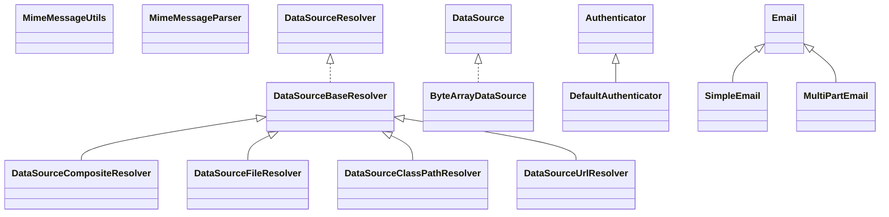

# commons-email-1.4.jar

[Group index](README.md) | [All archives](../README.md)

## Scope and provenance

- **Donor:** `SQX_145_REFERENCE_ROOT/internal/libs/commons-email-1.4.jar`.
- **SHA-256:** `685de61b5987602a7170b1c64969d966ab0616e5aff170b78c4c109638662151`; accessed 2026-10-06; captured `2026-10-06T18:54:51.906614+00:00`.
- **Classes:** 20 raw entries; 20 unique entry names. Duplicate occurrence indices are zero-based.
- **Inspection:** read-only ZIP hashing and class-file structural parsing; signatures/descriptors, modifiers, hierarchy and references only. Bytecode bodies are hashed, not published.
- **Allocation:** proposed `FEAT-PROJECT-COMMONS-EMAIL`, P13; [roadmap](../../sqx-full-application-roadmap.md). Domain README registration remains required.
- **Repository:** `01067f00031428613c6394064ca1bcadc1ba00ee`; review state unreviewed. Download label 145-dev1; installed build/activation and runtime equivalence unverified.
- **Limit:** every class/member is inventoried; declaration coverage does not establish consumed calls, defaults, formulas, failure semantics or algorithm parity.
- **Archive/resource index:** [018.json](../../../evidence/sqx145/archives/145/018.json).

## Complete member declarations

Member shards contain exact JVM names/descriptors, access flags, generic signatures, throws types, declared fields/methods, superclass/interfaces and referenced class names. All classes, nested/synthetic members and overloads are retained. Code length/hash is structural evidence, not a normalized algorithm comparison.

- [001.json](../../../evidence/sqx145/members/018/001.json) — SHA-256 `15376afc0e081da5b2de22696cbb51fc7e5ef9bc3d2584e6af511e35e3508017`.

## Focused structural diagram

Up to twelve non-nested classes; arrows show declared inheritance/interfaces only. External type names are not evidence of an available body or an executed dependency.

## Class inventory

| Archive entry | Occurrence | Class SHA-256 | Fields | Methods |
| --- | ---: | --- | ---: | ---: |
| `org/apache/commons/mail/resolver/DataSourceCompositeResolver.class` | 0 | `be0cc823204808e59d1f4d18a5c4039fd0e94b71f3011eb1b27916a5e01c86c7` | 1 | 5 |
| `org/apache/commons/mail/resolver/DataSourceFileResolver.class` | 0 | `2d08a0125beb064f9cb8ce7a8d54f0414f61357be3ef622d331b1e3332171ad9` | 1 | 6 |
| `org/apache/commons/mail/resolver/DataSourceClassPathResolver.class` | 0 | `db78883ebf6fcbe6a668cd7b4ec533a2e6436edc4a2c5808ad362aba6ce3a045` | 1 | 7 |
| `org/apache/commons/mail/resolver/DataSourceUrlResolver.class` | 0 | `1b68128b87b916414edb8402b88b621c256bb7b304ead38775157015f7403296` | 1 | 6 |
| `org/apache/commons/mail/resolver/DataSourceBaseResolver.class` | 0 | `8f4f2f2246f4caf3f385aa21b5643ee3e4633a2ad80c25f49488e74a9e5a265c` | 1 | 6 |
| `org/apache/commons/mail/ByteArrayDataSource.class` | 0 | `5572dd6b7239b8fdc8f72aa89c16186a60d19431dbec6cef98a8e929980547ec` | 4 | 9 |
| `org/apache/commons/mail/DefaultAuthenticator.class` | 0 | `6a268b056363d5a96aaaefcdc3969db34300ed3664afd61348e347d94f42f9db` | 1 | 2 |
| `org/apache/commons/mail/util/MimeMessageUtils.class` | 0 | `3cc39a075d214aa0c13a952307363d9ae1e59a0532e0c07242b672a62beab49e` | 0 | 6 |
| `org/apache/commons/mail/util/MimeMessageParser.class` | 0 | `49b2e7ae1bf2bb8569a493b48c4eb182d00fb8355eb9e7f4f2b407e06863d97f` | 6 | 26 |
| `org/apache/commons/mail/SimpleEmail.class` | 0 | `9aea5fb97a43c7df6ec3fce819ff022d3742d7a960ad9ad41a8d74be35e6e917` | 0 | 2 |
| `org/apache/commons/mail/MultiPartEmail.class` | 0 | `ca1e9891ad1e2d74948efa12b02c74bec0140e95b8133488dc26c3677f09f972` | 5 | 23 |
| `org/apache/commons/mail/DataSourceResolver.class` | 0 | `b02e08c3331ce8ddc70b1da6808d28aaa0602532c7dee04c674031a9a27e4b4a` | 0 | 2 |
| `org/apache/commons/mail/Email.class` | 0 | `ad0eefc9c5def018687d4fc34af934a9f95521487da5dc0b338999c3dee3834e` | 62 | 81 |
| `org/apache/commons/mail/EmailUtils.class` | 0 | `0ec63f57b86afaa700462549c6ef4c73a1a20db2f5eb20400dd1756dc4fef26e` | 5 | 9 |
| `org/apache/commons/mail/ImageHtmlEmail.class` | 0 | `3eab6b35740fbf711e91a0637d6d4fe09c90878167b82b4feac07284377b5740` | 5 | 6 |
| `org/apache/commons/mail/EmailConstants.class` | 0 | `9ec09311aba9b7d73ecf06decdb66af4235d41e823039fb34c6c805969a3e4ad` | 42 | 1 |
| `org/apache/commons/mail/EmailException.class` | 0 | `38755283cc9b4d5637cf1bc6b52c7543aa4b87f77c34cfd181401a27905d33b1` | 1 | 7 |
| `org/apache/commons/mail/EmailAttachment.class` | 0 | `143404d1fe06814456a054390559771d5ea53af5601e9f31d9c76c3181e087f3` | 7 | 11 |
| `org/apache/commons/mail/HtmlEmail$InlineImage.class` | 0 | `0b62d146727e116052dccb13a594e12ea3905339daa8ccef12684ae3026b7659` | 3 | 6 |
| `org/apache/commons/mail/HtmlEmail.class` | 0 | `5d95869f44549cdfc160577667a118c93b93e686d12f084cc5cf70324778b105` | 7 | 12 |
