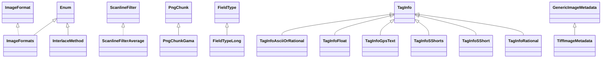

# commons-imaging-1.0-alpha1.jar

[Group index](README.md) | [All archives](../README.md)

## Scope and provenance

- **Donor:** `SQX_145_REFERENCE_ROOT/internal/libs/commons-imaging-1.0-alpha1.jar`.
- **SHA-256:** `afadc2965ce10d1881861969e3b24648faea5e602cf202baa21afcc4c35541b7`; accessed 2026-10-06; captured `2026-10-06T18:54:51.906614+00:00`.
- **Classes:** 429 raw entries; 429 unique entry names. Duplicate occurrence indices are zero-based.
- **Inspection:** read-only ZIP hashing and class-file structural parsing; signatures/descriptors, modifiers, hierarchy and references only. Bytecode bodies are hashed, not published.
- **Allocation:** proposed `FEAT-RESULTS-COMMONS-IMAGING`, P08; [roadmap](../../sqx-full-application-roadmap.md). Domain README registration remains required.
- **Repository:** `01067f00031428613c6394064ca1bcadc1ba00ee`; review state unreviewed. Download label 145-dev1; installed build/activation and runtime equivalence unverified.
- **Limit:** every class/member is inventoried; declaration coverage does not establish consumed calls, defaults, formulas, failure semantics or algorithm parity.
- **Archive/resource index:** [020.json](../../../evidence/sqx145/archives/145/020.json).

## Complete member declarations

Member shards contain exact JVM names/descriptors, access flags, generic signatures, throws types, declared fields/methods, superclass/interfaces and referenced class names. All classes, nested/synthetic members and overloads are retained. Code length/hash is structural evidence, not a normalized algorithm comparison.

- [001.json](../../../evidence/sqx145/members/020/001.json) — SHA-256 `9a2d5d36271035bfb409fe6be5fcaba523a6e141d3e7e6899e55e709b46ec9a9`.
- [002.json](../../../evidence/sqx145/members/020/002.json) — SHA-256 `fc9d3ea19350b12e7fdd16fd72137426df9765739f1535bba203d44d2b923119`.
- [003.json](../../../evidence/sqx145/members/020/003.json) — SHA-256 `81ae41f1fdedcb5bae5fbb0a4a577d1ebc17140f9b69f7ff5681edc5f798256e`.
- [004.json](../../../evidence/sqx145/members/020/004.json) — SHA-256 `7fd0551275de094287daedf53bc42509cb862b18ca45cc6b190326b3f1ea12d2`.
- [005.json](../../../evidence/sqx145/members/020/005.json) — SHA-256 `17539454d449edebb454982663f4e367923f2347a2c9d82a3f195937c5cc7857`.
- [006.json](../../../evidence/sqx145/members/020/006.json) — SHA-256 `e0b3a61a47abea4010f0111f54296175e164b2b869212e397b121b55c2390c2b`.

## Focused structural diagram

Up to twelve non-nested classes; arrows show declared inheritance/interfaces only. External type names are not evidence of an available body or an executed dependency.

## Class inventory

| Archive entry | Occurrence | Class SHA-256 | Fields | Methods |
| --- | ---: | --- | ---: | ---: |
| `org/apache/commons/imaging/ImageFormats.class` | 0 | `b752ac944bb52e7c3c508a1b11d189aee03857ad35f20e66e53357cd8e6d47a5` | 23 | 6 |
| `org/apache/commons/imaging/formats/png/scanlinefilters/ScanlineFilterAverage.class` | 0 | `879ed48ce07f806b8e2e3300db0459defe9b3e03f375fdd3b7586b15014aa892` | 1 | 2 |
| `org/apache/commons/imaging/formats/png/PngText$Ztxt.class` | 0 | `a2fb5fe2f002205341856906f0be6d7c13657304a52dd04cdaa9e4e18a880fcc` | 0 | 1 |
| `org/apache/commons/imaging/formats/png/ScanExpediter$1.class` | 0 | `c8ed4bea6a95c76504545223083bafeaf803f21e1c19aa907b932c095ce708a2` | 2 | 1 |
| `org/apache/commons/imaging/formats/png/InterlaceMethod.class` | 0 | `e6c488c3c6680d1bc61d2f5e83460dd962d304608790e3736d5146846b96605e` | 4 | 5 |
| `org/apache/commons/imaging/formats/png/chunks/PngChunkGama.class` | 0 | `12ae414c8cab9937735a9f83a76b5dcb35d0e99549b4e17e34fe77449a30e028` | 1 | 2 |
| `org/apache/commons/imaging/formats/tiff/fieldtypes/FieldTypeLong.class` | 0 | `8c982173c31b7aa7445be23e6ebbad8e75f0ca7d1fd92d4bbebe2b545cedaa01` | 0 | 3 |
| `org/apache/commons/imaging/formats/tiff/taginfos/TagInfoAsciiOrRational.class` | 0 | `11fea3f84128d0d496e1fa62979b2803607e02eaa8f886f6b8b8b56d2aafeb10` | 0 | 1 |
| `org/apache/commons/imaging/formats/tiff/taginfos/TagInfoFloat.class` | 0 | `843e3ce75d98aec2b7476fbdc35c210e93d8647ed57e5d21ec9b76a71d83e828` | 0 | 3 |
| `org/apache/commons/imaging/formats/tiff/taginfos/TagInfoGpsText.class` | 0 | `9674fc88e65ed39d5bc81ad72aa8e4ddd71fc73adb27e2aa6ed3f7e6d8811d69` | 6 | 6 |
| `org/apache/commons/imaging/formats/tiff/taginfos/TagInfoSShorts.class` | 0 | `7bb5d3c814674a6bcc87bc6558c00a6ca5b1b35ffa47d3039b7ff63dd7f83db8` | 0 | 3 |
| `org/apache/commons/imaging/formats/tiff/taginfos/TagInfoSShort.class` | 0 | `524c959d31cac29cdcc8516df658ca279fce844c0f569ad42258197730e7d0ec` | 0 | 3 |
| `org/apache/commons/imaging/formats/tiff/taginfos/TagInfoRational.class` | 0 | `6aaa56b52a538b46c42b062a792961381dac9a746daff49703644f5d525c318f` | 0 | 3 |
| `org/apache/commons/imaging/formats/tiff/TiffImageMetadata.class` | 0 | `be286926a95f8f8a5f52e15077cd4c141801315d892028ee6d0ae7539d50bbe0` | 1 | 23 |
| `org/apache/commons/imaging/formats/tiff/write/TiffImageWriterLossy.class` | 0 | `8a9e46b082dbfdac1727d592ca207f7b6ca2e1b940fd28246f6b04bae3bc9ae6` | 0 | 5 |
| `org/apache/commons/imaging/formats/tiff/write/TiffImageWriterLossless$2.class` | 0 | `befd1632a54fd233c6a184e828639d74c0e405684f7717b889e45d36cf6a21d6` | 0 | 3 |
| `org/apache/commons/imaging/formats/tiff/write/TiffOutputItem.class` | 0 | `626c30858212bbbb08c78c734c02c0d991b3f6cbc701a7bbfeeac1456a50b476` | 2 | 6 |
| `org/apache/commons/imaging/formats/tiff/write/TiffImageWriterLossless$BufferOutputStream.class` | 0 | `db5fe34839aa6343dd01b9ecbccb74c777a75c83fc39c7bcfe1b65b79bf566ab` | 2 | 3 |
| `org/apache/commons/imaging/formats/pnm/PbmFileInfo.class` | 0 | `dd248fa155e0b04a042abd7608712108bee3311663408a7f4716152e192456ae` | 2 | 11 |
| `org/apache/commons/imaging/formats/pnm/PamFileInfo$GrayscaleTupleReader.class` | 0 | `b373b695765d0d27b144d59d3abfefba7eda51761fad024e3068a11c6d5b0d40` | 2 | 3 |
| `org/apache/commons/imaging/formats/pnm/PgmFileInfo.class` | 0 | `36ec9495b2273924005d6fd45ad7b19ca88ad27dba3196c62351ef7bce5670f7` | 3 | 10 |
| `org/apache/commons/imaging/formats/pnm/PamFileInfo$ColorTupleReader.class` | 0 | `84fb36cf386b908127170d79aacfde47dec14dff874b8f19bd91fb687c70229f` | 1 | 4 |
| `org/apache/commons/imaging/formats/rgbe/InfoHeaderReader.class` | 0 | `aac0385c0ba7d66a2b11db0c2ea1f3e546829f333c6eb3dc9424b4f4ea5fddc6` | 1 | 3 |
| `org/apache/commons/imaging/formats/jpeg/JpegImageParser$5.class` | 0 | `bd440ed15587244d51a85d9712e29ad0d21ecc936d7bf0627560ced6a5d8a92a` | 2 | 4 |
| `org/apache/commons/imaging/formats/jpeg/xmp/JpegRewriter.class` | 0 | `16d47a3b2b703d35714164055cbbb61ad2d7f4098af83d2e866446507fb7efee` | 4 | 13 |
| `org/apache/commons/imaging/formats/jpeg/iptc/IptcConstants.class` | 0 | `0051cecc753f61dbe9076fa3e8cd80310d2d660853ff107053559de4f135ce03` | 68 | 1 |
| `org/apache/commons/imaging/formats/jpeg/iptc/IptcTypeLookup.class` | 0 | `36456c75d0d63eef11eb7de7a75805e1a383610dc7d55ea67e1f09ee0eddeb45` | 1 | 3 |
| `org/apache/commons/imaging/formats/jpeg/segments/SofnSegment$Component.class` | 0 | `53a4fc7dae4ce2020853a73cfd6462961d258cc8ad8545d9f6d3b5ecbc73f3fb` | 4 | 1 |
| `org/apache/commons/imaging/formats/jpeg/segments/SosSegment$Component.class` | 0 | `cbd3bd5c066a00647c8d2f4f9260e44a26442422fd6b84c360218feb04341a4f` | 3 | 1 |
| `org/apache/commons/imaging/formats/jpeg/segments/DqtSegment$QuantizationTable.class` | 0 | `334a74937f4f88976d500de860537c4233d0deba374d2a23b78fd8327650a52f` | 3 | 2 |
| `org/apache/commons/imaging/formats/jpeg/segments/ComSegment.class` | 0 | `83d2d1a8010226564fe3c9be1e5fd64cfa0d168ff91bee2b9c3a97b71419d5fe` | 0 | 4 |
| `org/apache/commons/imaging/formats/jpeg/segments/Segment.class` | 0 | `62be4769b1c37b3992ba707d21ab79fa4567d535f10c611c19dff3ddcb40b493` | 2 | 5 |
| `org/apache/commons/imaging/palette/PaletteFactory.class` | 0 | `8e1ee67e3b18bc61aa028fb1926a1cdcc11afb95eb951eac03376e67b8f95c15` | 2 | 17 |
| `org/apache/commons/imaging/ImagingException.class` | 0 | `65cd8f96396642a708aeb45dd8f5b2b0459c5c8b2574adfc6ebe80a00b7ae317` | 1 | 2 |
| `org/apache/commons/imaging/common/ImageMetadata.class` | 0 | `cffd7cc7b4ffb335fec4d96e1fb2bfc147d1b305601da782884b2759536edf0e` | 0 | 2 |
| `org/apache/commons/imaging/common/BinaryFileParser.class` | 0 | `278144f06266dbd40ae98f34e61fc985c9cf942cddd479e2486b0ea9bffff883` | 2 | 7 |
| `org/apache/commons/imaging/common/bytesource/ByteSourceArray.class` | 0 | `e394af37b15e6f8c4ecc926b4bf778bee1771849acfe6aa7bbfcc4ed1dca1ffb` | 1 | 7 |
| `org/apache/commons/imaging/common/BufferedImageFactory.class` | 0 | `a39b59414e84ca263e9e777e8a698ab2ed8191870a3be566b3ea0ccff827b9dd` | 0 | 2 |
| `org/apache/commons/imaging/common/GenericImageMetadata.class` | 0 | `799903282100f9a424b3288b559f77cbe659a00d5244322584ac7834fbecea45` | 2 | 7 |
| `org/apache/commons/imaging/common/itu_t4/BitArrayOutputStream.class` | 0 | `18d4a07e09e90ba44f3eabe0d7cb92c3dc304898634d8ff5c6792d1262cc73bd` | 4 | 10 |
| `org/apache/commons/imaging/common/FastByteArrayOutputStream.class` | 0 | `ddede01809fb12d3affa4a2778ce53d3935d0f16147950e19b661a6c476c25c8` | 2 | 4 |
| `org/apache/commons/imaging/common/mylzw/MyBitOutputStream.class` | 0 | `e6dd917b1e00020baa85f6008db9428554d5cbf0c2566d18577bc8a617843da0` | 5 | 6 |
| `org/apache/commons/imaging/ImageWriteException.class` | 0 | `c71d48f023bd6f76f9b276f78dabbac873be368565c3f76c2eb2ac326e6c9ad6` | 1 | 4 |
| `org/apache/commons/imaging/formats/png/PngText$Itxt.class` | 0 | `6a688ed8348bc3ea07493cb05d6ee8733e80e749a6f0ef9509064a98183c0dd0` | 2 | 1 |
| `org/apache/commons/imaging/formats/png/transparencyfilters/TransparencyFilter.class` | 0 | `9fc86ef874ec27c0b0c357e7bbdf375a0796214ac02c32a7c67a196899ccad30` | 1 | 4 |
| `org/apache/commons/imaging/formats/png/BitParser.class` | 0 | `09d659d023d24fdb1da1bdcc0d90a5badfe2532adfcfddefa1c270cf841ceaeb` | 3 | 3 |
| `org/apache/commons/imaging/formats/tiff/TiffImageData.class` | 0 | `96104f991994053f85cd1c1c0cf343f9c16963b6baac636c390b16c1e6308faf` | 0 | 4 |
| `org/apache/commons/imaging/formats/tiff/TiffImageMetadata$Directory.class` | 0 | `cb769cf99d9a09f79d67e0d81669f48bb884c6e18d6a3db9dc75a83c432878c7` | 3 | 10 |
| `org/apache/commons/imaging/formats/tiff/write/TiffImageWriterLossless$1.class` | 0 | `3e7cec9f80e6806239b0e1b172fdd927abee9c7303fc014941bef1f74bc9eca6` | 0 | 3 |
| `org/apache/commons/imaging/formats/psd/PsdImageContents.class` | 0 | `a886ff691e4c00f46692641f626ca57ecc0e7ce360cce6c609d63d81eec57089` | 6 | 4 |
| `org/apache/commons/imaging/formats/pnm/PpmWriter.class` | 0 | `95eed3c56912079dcc37ce32980436ffdb5fe094be5b2ccc5c2ffa955f2c7161` | 1 | 2 |
| `org/apache/commons/imaging/formats/pnm/FileInfo.class` | 0 | `17afc046a526918475e7c1b978d7b773754fd680947aaf3b4ef428a4cb1d19e7` | 3 | 14 |
| `org/apache/commons/imaging/formats/pnm/PgmWriter.class` | 0 | `c98a0b1ec84288c0f9a20c95d0657dbd3512f7c4b4da18c7dbc214d8026f1e8f` | 1 | 2 |
| `org/apache/commons/imaging/formats/jpeg/JpegImageParser$4.class` | 0 | `33c646efaa2f1f288dcac8f0b3550f2804881a368435ee3406fc68106bdb4115` | 2 | 4 |
| `org/apache/commons/imaging/formats/jpeg/xmp/JpegRewriter$JFIFPieces.class` | 0 | `9b18b73a9cab1914cd71e0f8c0f196aff8a612f85cea1e8330b34bf9004cd986` | 2 | 1 |
| `org/apache/commons/imaging/formats/jpeg/xmp/JpegXmpParser.class` | 0 | `9b0f2cb661c6a6fc0f65befe50d198dea90462effbcd7cf38605f6d3787d5214` | 0 | 3 |
| `org/apache/commons/imaging/formats/jpeg/xmp/JpegRewriter$1.class` | 0 | `0f83a87dde38b08bd380b1fd51cd9e6f2232b929003b929e919f8c14dcfc0282` | 0 | 2 |
| `org/apache/commons/imaging/formats/jpeg/JpegUtils$1.class` | 0 | `5e90ee629819520ca7c591b138bbb0f37ad39ed36b3a9289acc9b6135fbffabb` | 1 | 4 |
| `org/apache/commons/imaging/formats/jpeg/iptc/IptcType.class` | 0 | `a503438e5ce5ac7ff72f0b032247356bb6c9de5547721135b9d9c9e90322d675` | 0 | 3 |
| `org/apache/commons/imaging/formats/jpeg/iptc/JpegIptcRewriter.class` | 0 | `5c26aa6b19b3b2a52963b27c0184fbf21c5e734598aa3d9154add4ea035b4db9` | 0 | 13 |
| `org/apache/commons/imaging/formats/jpeg/segments/DqtSegment.class` | 0 | `cdf8041821943543ba5f19366756be5c464dbb7173c26ae968970f1388aff1b7` | 1 | 3 |
| `org/apache/commons/imaging/formats/jpeg/segments/DhtSegment.class` | 0 | `9d9a940a93515d2cf134a164371750f504ad6bbbe68e0154fec73de29bda9f37` | 1 | 3 |
| `org/apache/commons/imaging/formats/jpeg/segments/SosSegment.class` | 0 | `9bcd8fbb7ef628b6ac1f3daa02147fd528c3fae88d6b086e9b78e440c7f2e8c2` | 7 | 6 |
| `org/apache/commons/imaging/formats/jpeg/exif/ExifRewriter$JFIFPieceSegmentExif.class` | 0 | `32891e3ffa196ea0c05d3cd2bab8622a5ef7185da695c389d9570657747ea742` | 0 | 1 |
| `org/apache/commons/imaging/formats/jpeg/exif/ExifRewriter$JFIFPiece.class` | 0 | `2f649b316dd6b5c1e72cb260b3252643bb4d632d5c1dfb43bca155ed2f772cc0` | 0 | 3 |
| `org/apache/commons/imaging/formats/jpeg/decoder/Block.class` | 0 | `8ea8317aa6700389e653f938fb1afd53e0cb3ef0266e85c0acc1aac2c3295567` | 3 | 1 |
| `org/apache/commons/imaging/formats/jpeg/decoder/JpegInputStream.class` | 0 | `421d2d15f49ec1f32420f103db875d345c5d1cd6772413f4ea3e80b0ed7ca023` | 3 | 2 |
| `org/apache/commons/imaging/icc/IccProfileParser.class` | 0 | `1553b09cb89c99064e2acd510b84f9fe02f31b31e2d6cfec7186e98a684601b9` | 1 | 12 |
| `org/apache/commons/imaging/icc/IccTagDataType.class` | 0 | `de123d6305209dadfec982f2f4dc3764f5936282f8d7ab1d0042793eb3145ebc` | 0 | 3 |
| `org/apache/commons/imaging/icc/IccTagDataTypes$3.class` | 0 | `8927b2c379f5af26459553bc96ca82841d432a2eafa7e70989acde4e2c90753d` | 0 | 2 |
| `org/apache/commons/imaging/color/ColorConversions.class` | 0 | `ff41d71c252ccee2df9ffe44f50bfb31b943d4578ca3891017c330acd244ae46` | 3 | 41 |
| `org/apache/commons/imaging/palette/ColorGroup.class` | 0 | `351b1fea921aa2655e0ab687ce2f9426e315cd3f48de12b6a4ed1c224c1b059d` | 19 | 4 |
| `org/apache/commons/imaging/palette/MostPopulatedBoxesMedianCut$ColorComparer.class` | 0 | `a885f25e41e621393f1de6563fb00ab66ae39bfaa87eab16ab471857ab82d62c` | 2 | 3 |
| `org/apache/commons/imaging/common/BinaryOutputStream.class` | 0 | `abbdc2cc7df476e9bb531e4d57ff6e24f215526a16312d17940e1b8e24e1193a` | 3 | 13 |
| `org/apache/commons/imaging/common/itu_t4/BitInputStreamFlexible.class` | 0 | `945faf73bacbb0bdd6574b5f0fb22b6b1d3872a211bbaeae6cadeb47108f87b6` | 4 | 5 |
| `org/apache/commons/imaging/common/itu_t4/HuffmanTreeException.class` | 0 | `68884e16ed22eaa60891a1c83906f13e78e8f32a45fdce6c0fd46ac46d3766c9` | 1 | 2 |
| `org/apache/commons/imaging/common/mylzw/MyBitInputStream.class` | 0 | `8ed8c03114f2409266ce725d2e5e07cd7c72ee13e67e5b0a4e381e1fee19abd8` | 6 | 6 |
| `org/apache/commons/imaging/formats/png/PngCrc.class` | 0 | `d461996f95faee046ff6f4bca79a14e8b859bd5b0797acafab987a428c48d58a` | 2 | 7 |
| `org/apache/commons/imaging/formats/png/PngText.class` | 0 | `1dcd8fdc3ac8c8cec0785570dbea8d689bc2c93d3b6dbf0a28eddaa9916de6a1` | 2 | 1 |
| `org/apache/commons/imaging/formats/png/PngWriter$TransparentPalette.class` | 0 | `1538d1cc48cb0861754377e2c66e7678335e52443a73484c67bb3debd4666410` | 1 | 4 |
| `org/apache/commons/imaging/formats/png/PngText$Text.class` | 0 | `3d8f1942ad11f9e799763d49559f91d646a57bd95231b0a805e2dab8f958eb24` | 0 | 1 |
| `org/apache/commons/imaging/formats/png/transparencyfilters/TransparencyFilterIndexedColor.class` | 0 | `82245ebf89f18518c32f9ea38763164d1962d4aa5d82d4f6a96de0a9eba67853` | 0 | 2 |
| `org/apache/commons/imaging/formats/png/PngWriter.class` | 0 | `9b22c336d5cf2d53700400669661e5ceebffa7c1d11f5e95898e470b52c2c9bc` | 0 | 18 |
| `org/apache/commons/imaging/formats/png/chunks/PngChunkText.class` | 0 | `fbec9c02f4ff867e97d84212d4243972c4ae5082fd8f327a29a367e760fb5993` | 3 | 5 |
| `org/apache/commons/imaging/formats/xbm/XbmImageParser$XbmHeader.class` | 0 | `5d56565d6bfcc8efc19a409302f833d759c6433e0c38aee1582ef4b3cd269bcf` | 4 | 2 |
| `org/apache/commons/imaging/formats/tiff/TiffTags.class` | 0 | `1b5ff3ef473649d2a4c937b79931c08ee52693cc902da4609c7d390247c7c0f8` | 3 | 8 |
| `org/apache/commons/imaging/formats/tiff/write/TiffImageWriterLossless.class` | 0 | `bf65b866f28c0f1ef0e9d9bc513109425c349f0399981702d1dda1602cb14f07` | 3 | 7 |
| `org/apache/commons/imaging/formats/psd/PsdImageParser.class` | 0 | `94a55d1e4ac8ea4fd0a6d9f00db7515e5b24c075418f7caf4578226618858fda` | 12 | 24 |
| `org/apache/commons/imaging/formats/jpeg/xmp/JpegRewriter$SegmentFilter.class` | 0 | `46f6899a20e82de519a3df7a1a5be6b4d95d46d910026fa66c03d5b7713ebdff` | 0 | 1 |
| `org/apache/commons/imaging/formats/jpeg/xmp/JpegXmpRewriter.class` | 0 | `0e61293e39b6919e946e880fd6c3da952a6691b950b9f167d94910d4845cc9d8` | 0 | 10 |
| `org/apache/commons/imaging/formats/jpeg/iptc/IptcRecord.class` | 0 | `68eb8c85bf9b921d1e4f6c457bd06b52192773605699d7d76a058d769da97ed9` | 3 | 4 |
| `org/apache/commons/imaging/formats/jpeg/iptc/IptcBlock.class` | 0 | `9ae96ea809c1090ae4a55294218985b1353307961727d7110487f090e9be424b` | 3 | 2 |
| `org/apache/commons/imaging/formats/jpeg/iptc/IptcTypes$1.class` | 0 | `e1d01b5855377bed6e5c640def2871c92b8752878a56caf82596eb2d2dd81113` | 1 | 4 |
| `org/apache/commons/imaging/formats/jpeg/segments/App2Segment.class` | 0 | `e12549bf8957d82c60c17054cdb1998917525db3a2b09749a5cb0a69cb712986` | 3 | 7 |
| `org/apache/commons/imaging/formats/jpeg/segments/DhtSegment$HuffmanTable.class` | 0 | `4d461be1f8ddf7d9e416918f18c058e41876137a5b0f2c4356d5118a19608807` | 8 | 5 |
| `org/apache/commons/imaging/formats/jpeg/segments/SofnSegment.class` | 0 | `7c4482d8039b03ab913d6386d51a5987369344f0bb9abcea208d533dc3d34545` | 6 | 6 |
| `org/apache/commons/imaging/formats/jpeg/exif/ExifRewriter$JFIFPieces.class` | 0 | `bcf5c95a8d1e3d794ec47527930a65de9bfe689a04a0a64a5a226214132dd42f` | 2 | 1 |
| `org/apache/commons/imaging/formats/jpeg/JpegImageParser$1.class` | 0 | `2576143e7ab2884a49be63662439aa7c7284c0f92e0b2496783843a407660e1b` | 6 | 4 |
| `org/apache/commons/imaging/formats/jpeg/decoder/Dct.class` | 0 | `350b1aec9b6058e6af9a92eef707eb99a4024565300d8c4b2a0beaf4e7f5cc0c` | 12 | 10 |
| `org/apache/commons/imaging/icc/IccTagTypes.class` | 0 | `3885698c1fa93b02782a55ee16a076e647e47cd5f31f685f942ab601ff902c62` | 41 | 7 |
| `org/apache/commons/imaging/color/ColorCieLch.class` | 0 | `fabb430d4fbd6927ce3e19f18cf1fcdc4226272d72eefd98d6fc71dc1a7e1769` | 8 | 5 |
| `org/apache/commons/imaging/ImageDump.class` | 0 | `57cf7f093e62de5808d3ffcc12fd41c70e8e4d2893808dacf67e7546db987e01` | 1 | 7 |
| `org/apache/commons/imaging/palette/MedianCutPalette.class` | 0 | `ce024830bb1e938591f318ed2fb73d10b1b235906fead1afa239917ebba48a18` | 1 | 2 |
| `org/apache/commons/imaging/palette/QuantizedPalette.class` | 0 | `c2bf915fd3cecde8fb00f91543d758227b54f92a40524d1979fc19832d187ecd` | 3 | 4 |
| `org/apache/commons/imaging/palette/ColorCount.class` | 0 | `ca54b686cfcf1f87fbe1db1634f33918547ada7d4078d009ca23e36040ed188d` | 6 | 3 |
| `org/apache/commons/imaging/internal/Debug.class` | 0 | `df7be943dcecda68264f7a30408240f4a11471099700703a2e00867d74557bb7` | 3 | 27 |
| `org/apache/commons/imaging/common/bytesource/ByteSource.class` | 0 | `73fcd13081df4a7916568a773dc6ed905c2ba5895250c795eeaa247050970503` | 1 | 9 |
| `org/apache/commons/imaging/common/bytesource/ByteSourceInputStream$CacheBlock.class` | 0 | `b064e084642ca39683bd6bbda765da7166d858543c83ae5a0ecd9b10c45ce891` | 4 | 2 |
| `org/apache/commons/imaging/common/bytesource/ByteSourceFile.class` | 0 | `3e54158fb57e5e947f9f2a90d70c79b8d3a3b343fa8c96efc483f966ff67c13c` | 1 | 6 |
| `org/apache/commons/imaging/common/BinaryConstant.class` | 0 | `a6787dcc3609d966160a1f2418e3e7307a0796a59b6051d9bf18f086a09772d1` | 1 | 11 |
| `org/apache/commons/imaging/common/itu_t4/HuffmanTree.class` | 0 | `808d0d18411d50db8a2dc82e2a39fa7fcfc378a85a01340f73de9d9c653b86ff` | 1 | 4 |
| `org/apache/commons/imaging/common/mylzw/MyLzwCompressor$Listener.class` | 0 | `85b804210eca20d707550e3b7c92ae4e4141716ab26e3439943a9620ffbfcd92` | 0 | 4 |
| `org/apache/commons/imaging/formats/png/scanlinefilters/ScanlineFilterUp.class` | 0 | `8553e35ad156fe85129dc4eb88d3502a6c4c4d3e1d2b4cbbb33c7975bb4cbac2` | 0 | 2 |
| `org/apache/commons/imaging/formats/png/GammaCorrection.class` | 0 | `f69e7cbd73b7573c27e49bf6da733c81f637e599dd4da98989181690ce23a84a` | 2 | 5 |
| `org/apache/commons/imaging/formats/png/PngColorType.class` | 0 | `bf0a104ade1ce0a63a144c0698f9080d4299931edcabf3096036c3062a272675` | 11 | 11 |
| `org/apache/commons/imaging/formats/png/chunks/PngChunkPlte.class` | 0 | `fcce9c38231a871156e9ea4a98ddcf09ef7d9c28f3a26bbbab356fca369f4113` | 1 | 4 |
| `org/apache/commons/imaging/formats/png/chunks/PngChunkIdat.class` | 0 | `01dd6b1f1e6e71935c68b7cf6673361d7dc4bd430ee56a53e74b3a111a83542a` | 0 | 1 |
| `org/apache/commons/imaging/formats/png/chunks/PngChunkIhdr.class` | 0 | `c9b2a2ec21b864adb3dd95b08fa2e93f72135226ad470146de864ce713e3d12b` | 7 | 1 |
| `org/apache/commons/imaging/formats/png/chunks/PngChunkItxt.class` | 0 | `5cd7add1c66b95a9cbd0006625575d6062e2c91c522b1aba034b868d0e9dd2c9` | 4 | 4 |
| `org/apache/commons/imaging/formats/xbm/XbmImageParser.class` | 0 | `c711f9fb62a9943872add54979f26db84e001005f2d3bcaeb3ff5199e3303699` | 2 | 20 |
| `org/apache/commons/imaging/formats/icns/IcnsImageParser$IcnsElement.class` | 0 | `e756f937e55e2da518e0efcf77600b920defe3c2ff91b554be75d24e70892090` | 3 | 2 |
| `org/apache/commons/imaging/formats/icns/IcnsImageParser.class` | 0 | `e8cfc02391a8db54e40342557303df4c0172da842522a135fc363674db781baf` | 3 | 18 |
| `org/apache/commons/imaging/formats/pcx/RleReader.class` | 0 | `266db3ac5f919c13a986d89716de522493b9c5f459ea28b3a3546993cfab6052` | 3 | 2 |
| `org/apache/commons/imaging/formats/pcx/PcxWriter.class` | 0 | `0b5b5895c1e3647645ffb8725cdbb967c83dc942f1913122e1950978da4b50eb` | 5 | 4 |
| `org/apache/commons/imaging/formats/tiff/TiffReader.class` | 0 | `2692dfe90cddd50120b23179ad09797f00b64e6588f74913341f6bb9d0add3ff` | 1 | 13 |
| `org/apache/commons/imaging/formats/tiff/datareaders/DataReaderStrips.class` | 0 | `bd5b19c36779eb7c656dc42b590364b11fb2f52bfc5038865c930cabe50963f9` | 7 | 4 |
| `org/apache/commons/imaging/formats/tiff/TiffField$OversizeValueElement.class` | 0 | `e2d440845bcaf920a50bc52c8c78765024e49ef4f23b61ebad75df538b3b4980` | 1 | 2 |
| `org/apache/commons/imaging/formats/tiff/constants/HylaFaxTagConstants.class` | 0 | `280c60374b867e30d53568be3c38043a66d2dd8ab3794ba2a13a25f819af0fd2` | 5 | 2 |
| `org/apache/commons/imaging/formats/tiff/constants/Rfc2301TagConstants.class` | 0 | `a874107d080267728a37b9a13dca160cb02fa0ab26281296e4c2922a40d0a3b9` | 32 | 2 |
| `org/apache/commons/imaging/formats/tiff/constants/MicrosoftHdPhotoTagConstants.class` | 0 | `dcb5632d911849c7355f68ecb583966be0f85105c9b8e633106cd4f63103f1d9` | 89 | 3 |
| `org/apache/commons/imaging/formats/tiff/constants/TiffDirectoryConstants.class` | 0 | `3a899fd490e6c3614e64efa000722c63f464de44cf58c51d1ad89219cc620168` | 16 | 1 |
| `org/apache/commons/imaging/formats/tiff/constants/TiffEpTagConstants.class` | 0 | `181fc1bf7bb534801e998bbe6f3064c83b0f7611dbada4462b19872d0c3e21a2` | 33 | 2 |
| `org/apache/commons/imaging/formats/tiff/constants/DcfTagConstants.class` | 0 | `d1cb6c0f981b9f253361f6f4cd26bbb46a2894dc79886d3fe3307984cac13719` | 8 | 2 |
| `org/apache/commons/imaging/formats/tiff/constants/GeoTiffTagConstants.class` | 0 | `b3e299ea925b779025f83aec512a5d1d05bd81ef11d40ebc91744dfdfc4773f8` | 8 | 2 |
| `org/apache/commons/imaging/formats/tiff/constants/WangTagConstants.class` | 0 | `252e5f6f0004fa1d1587be3463d11ace6a5c3c589fc3ecf2921f7f275c232ed6` | 2 | 2 |
| `org/apache/commons/imaging/formats/tiff/constants/GpsTagConstants.class` | 0 | `54817f67e9f9c37fb3161d29b1d60b27030419a1edd9f88aec8df2bdead50eb2` | 61 | 3 |
| `org/apache/commons/imaging/formats/tiff/fieldtypes/FieldTypeFloat.class` | 0 | `8d0093355ce9d0e8853dd718c07d890bc827c641a9f3365c24771c4fa50cd515` | 0 | 3 |
| `org/apache/commons/imaging/formats/tiff/fieldtypes/FieldTypeDouble.class` | 0 | `d935398cab5bb0ccdafb2e911986f7e3727b20aa295f76d69c8aad50bd280891` | 0 | 3 |
| `org/apache/commons/imaging/formats/tiff/TiffContents.class` | 0 | `acd56a3187736b7be5fa7bcdb62c8413125dda471ddc531a2e3a55141b674936` | 2 | 4 |
| `org/apache/commons/imaging/formats/tiff/taginfos/TagInfoSByte.class` | 0 | `48a86796e72597ff0795d714687e658e2d4cc3adf6f3d72d208a8ceb859f322f` | 0 | 2 |
| `org/apache/commons/imaging/formats/tiff/taginfos/TagInfoSBytes.class` | 0 | `04453503b5fc1f77658a98923b1fa3758fa8bda78eaec39b87eb000c83eeeb65` | 0 | 2 |
| `org/apache/commons/imaging/formats/tiff/taginfos/TagInfoUnknown.class` | 0 | `5e1937149b8011771c4ae5176f18d5e33b3e8f88859cac85f3b4dc9933d1c210` | 0 | 1 |
| `org/apache/commons/imaging/formats/tiff/taginfos/TagInfoFloats.class` | 0 | `be44ea5e60691ebf988bba70d753a9867b7f1de70e2711ab25e4bf9b975b5995` | 0 | 3 |
| `org/apache/commons/imaging/formats/tiff/taginfos/TagInfoSLong.class` | 0 | `5b84ecd31624bb3919ac4a4b599bfca13d4ee341bdb9f9b016c1e62b6b8be827` | 0 | 3 |
| `org/apache/commons/imaging/formats/tiff/taginfos/TagInfoAscii.class` | 0 | `63ecac8f83d9c0a0c176d18f30636e0ab091e0b752a6a1ce9c6a9bc17e4daa3f` | 0 | 3 |
| `org/apache/commons/imaging/formats/tiff/taginfos/TagInfoGpsText$TextEncoding.class` | 0 | `e10d87d984f21befec606e746f58b47fe56e6d7ba403e91515c78c93cd4e87f7` | 2 | 1 |
| `org/apache/commons/imaging/formats/tiff/taginfos/TagInfoLongs.class` | 0 | `200d2380b08b5133d0f9476e92f929174d8b9fd9704f51ccfbd2d7c0627eaf68` | 0 | 4 |
| `org/apache/commons/imaging/formats/tiff/TiffImageMetadata$GPSInfo.class` | 0 | `ace8ebb4910b793047dac4bba1c07dbcd01c236b034ab084b4acf398b521a104` | 8 | 4 |
| `org/apache/commons/imaging/formats/tiff/TiffImageData$Data.class` | 0 | `a30130b12733f4eedd5a97a036bad74ec3504d07576c40e78ac685f564627607` | 0 | 2 |
| `org/apache/commons/imaging/formats/tiff/TiffImageMetadata$TiffMetadataItem.class` | 0 | `018fe638ddd24f85465f09e7a8d83dd1e0e5e0d7d72ccafdbeb99f0d76ac07fd` | 1 | 2 |
| `org/apache/commons/imaging/formats/tiff/TiffHeader.class` | 0 | `206deb33f13548d3d5e1fedf7819ac6749bb5e3d8270b5c25d707cd217378a8c` | 3 | 2 |
| `org/apache/commons/imaging/formats/tiff/write/TiffOutputDirectory.class` | 0 | `63e26f1c6e49ea29a31756271afd06ed8327b68d8d6cc08164346dbc369e38d3` | 7 | 55 |
| `org/apache/commons/imaging/formats/tiff/photometricinterpreters/PhotometricInterpreterCieLab.class` | 0 | `264f2e6e99ddf4176305a1f6a17ac7509ae2247af1d2a8f7ef750fea2f554bb5` | 0 | 2 |
| `org/apache/commons/imaging/formats/tiff/photometricinterpreters/PhotometricInterpreter.class` | 0 | `55265902ddb6326c5de23ad8d8ff281b8364a97f5d99503f63ff3b11d610b049` | 5 | 3 |
| `org/apache/commons/imaging/formats/tiff/photometricinterpreters/PhotometricInterpreterCmyk.class` | 0 | `95c6d4ae482dc21cc500df146511dc27e0b7d263fd1634f0dab81afbaeb13c5e` | 0 | 2 |
| `org/apache/commons/imaging/formats/tiff/photometricinterpreters/PhotometricInterpreterPalette.class` | 0 | `f4b30f9de2c7accb4a21b84503fc3a143c7e9c2206c63dec623cecf064e673a5` | 1 | 2 |
| `org/apache/commons/imaging/formats/xpm/XpmImageParser$XpmParseResult.class` | 0 | `ef38230f16b24609d29ee942ebc7e9b43920534761ee1e4517b5244055d45851` | 2 | 2 |
| `org/apache/commons/imaging/formats/xpm/XpmImageParser$XpmHeader.class` | 0 | `25459ab76c622c0ddd8c85addc47965d3f2003ac301cfc2e1bcab2df3bb73a2d` | 8 | 2 |
| `org/apache/commons/imaging/formats/xpm/XpmImageParser$PaletteEntry.class` | 0 | `6e64ed6930d0f04edfddf522a4b27476feddc71d865831b773f089322c0f1bff` | 9 | 3 |
| `org/apache/commons/imaging/formats/wbmp/WbmpImageParser$WbmpHeader.class` | 0 | `dce330120b1a24cddb519de4556bfa21565c07d053323dca2fb3008a56ab761d` | 4 | 2 |
| `org/apache/commons/imaging/formats/wbmp/WbmpImageParser.class` | 0 | `08019b450eafa16fac3923b949d281c4a88c2680553f415efc640f671c3366d3` | 2 | 19 |
| `org/apache/commons/imaging/formats/gif/GifImageContents.class` | 0 | `d430c6e82128ddc23cd26b9e292b50712f9d1fa75c37683883483f8d878a03a3` | 3 | 1 |
| `org/apache/commons/imaging/formats/gif/GenericGifBlock.class` | 0 | `3cac356d864c7e839c22dc5a6e882903d92f66a835358d2d778ef6b76ed94433` | 1 | 3 |
| `org/apache/commons/imaging/formats/gif/GifImageParser.class` | 0 | `3da99f2d9373601fe636253cdec37b41e86cfe24e2a85bde36e04ff416d82d8d` | 17 | 31 |
| `org/apache/commons/imaging/formats/bmp/PixelParser.class` | 0 | `8133f821150ac5741b34152413399762566ed919e16310c3bb6060c550a11d68` | 4 | 3 |
| `org/apache/commons/imaging/formats/bmp/BmpWriterPalette.class` | 0 | `5fe0511881f7e57633f74cc79c5f2c61b9657d890bfe00936d65438e51b4e377` | 2 | 5 |
| `org/apache/commons/imaging/formats/psd/datareaders/DataReader.class` | 0 | `8528c84d5dcd16611a9b02af902745a1c9f9e970411d999a2e8cb943932d6235` | 0 | 1 |
| `org/apache/commons/imaging/formats/psd/dataparsers/DataParserRgb.class` | 0 | `4ba9ad71d950e366e7730aad4b228cadb4ae1706f75a437331e2b95bdf20aba9` | 0 | 3 |
| `org/apache/commons/imaging/formats/psd/dataparsers/DataParserIndexed.class` | 0 | `0e280e0804b2f172ae17b53a59d30042f7aa3b8135690c90b6a676996adc78dd` | 1 | 3 |
| `org/apache/commons/imaging/formats/psd/ImageResourceType.class` | 0 | `d2d1c8665131f4f814e1bb33c91382eb26fa56074846d5b378f8767a03e07b4b` | 4 | 4 |
| `org/apache/commons/imaging/formats/pnm/PbmWriter.class` | 0 | `9d097830755305bd8a3d287e2a6bd20c6e0d1b471cdbbfb6bdbcc824abf54adf` | 1 | 2 |
| `org/apache/commons/imaging/formats/pnm/WhiteSpaceReader.class` | 0 | `5bcc574d7f17f9cbd029792e0277b703c50f048d93f3f5921a778bcda6c54c31` | 1 | 5 |
| `org/apache/commons/imaging/formats/rgbe/RgbeImageParser.class` | 0 | `20daa57e81c5f5b7ded6721a651c0d23666fbe3463f32ee0f51c306817a07d2f` | 0 | 11 |
| `org/apache/commons/imaging/formats/jpeg/xmp/JpegRewriter$2.class` | 0 | `95f30d1388bbae4c5ac13ab684a60681249f17ae54b8303aae782319c37e3c08` | 0 | 2 |
| `org/apache/commons/imaging/formats/jpeg/xmp/JpegRewriter$JFIFPieceImageData.class` | 0 | `82348e138bafed95ddf4b7d4934d8b9cead42aba2872e4e65acfc9f7324bd1ca` | 2 | 2 |
| `org/apache/commons/imaging/formats/jpeg/JpegImageParser.class` | 0 | `5b73cf34de3aa3b73236043001331a67f7fb3a0a18ba96259259d5cc46ccb107` | 3 | 28 |
| `org/apache/commons/imaging/formats/jpeg/exif/ExifRewriter$1.class` | 0 | `28b61ed6736ed4fcca1b2e5b0d94d9f30825571e6c238cd3de0b02cea4fdb59d` | 3 | 4 |
| `org/apache/commons/imaging/formats/jpeg/decoder/JpegDecoder.class` | 0 | `daa4ded2e96dfe6a3ac9e6fd2fd95bccc5e4dbbfe647223180163c81df62c794` | 12 | 12 |
| `org/apache/commons/imaging/ImageFormat.class` | 0 | `d808b43cd44ce2249cfc77ec33f661e481487fdda25bbd6e05951c58f6214b84` | 0 | 2 |
| `org/apache/commons/imaging/color/ColorHunterLab.class` | 0 | `7866987e4312491f01707d77ed467bc340d7794547f0d1137e4b3d6a854421b3` | 8 | 5 |
| `org/apache/commons/imaging/color/ColorCmy.class` | 0 | `1d087d1efd0b5b8130152cbd41078657bc5421de9d4bcd0b7d127a2d70e0607b` | 11 | 5 |
| `org/apache/commons/imaging/palette/PaletteFactory$DivisionCandidate.class` | 0 | `e6a41dda82f1302ad1dab4316474bad6e020440722bb78297a4c2e1d84d26a33` | 2 | 3 |
| `org/apache/commons/imaging/palette/MedianCut.class` | 0 | `d307b193ad7878cd2810cd44adeb6ae275106f54bb90808628f35ae25abf9f6f` | 0 | 1 |
| `org/apache/commons/imaging/palette/ColorSpaceSubset$RgbComparator.class` | 0 | `41b8f301cb212e2ff028b77fc715c1d949aeba1e4c3886b28771f83b109ba44f` | 1 | 3 |
| `org/apache/commons/imaging/palette/ColorComponent.class` | 0 | `d464a85e86eca5fdad286a9256012d15103848f5b9fb3103aec0501edc5f9d76` | 6 | 5 |
| `org/apache/commons/imaging/ImageInfo.class` | 0 | `4220807951a42ca4c7d88149f8e417a46f57f63f0b7516189cc8bccf75a7fdc3` | 19 | 23 |
| `org/apache/commons/imaging/ImageReadException.class` | 0 | `73c1b8a700d4ae77e48c958d1b1a18109148c5ad5156d80663be4b73ce57f1cc` | 1 | 2 |
| `org/apache/commons/imaging/ImageParser.class` | 0 | `33d43b74229557e327105173279db63bb1d4fda245e6bd4bd51ff05c0ec03204` | 1 | 47 |
| `org/apache/commons/imaging/common/bytesource/ByteSourceInputStream.class` | 0 | `6243d18fd38c504f6d753ff377a2a9f60c165035a6871a40a23c3463c5c09ccb` | 5 | 10 |
| `org/apache/commons/imaging/common/PackBits.class` | 0 | `edd70c322ff8a9a8a0ee4b5045156a8a0cde8db23e57629e85b1e780e52c2b82` | 0 | 5 |
| `org/apache/commons/imaging/common/GenericImageMetadata$GenericImageMetadataItem.class` | 0 | `b324c32ea4b53021e4e10c902ea7dd9d482299b27d2fa2d0191cf59bb447a554` | 2 | 5 |
| `org/apache/commons/imaging/common/itu_t4/T4AndT6Compression.class` | 0 | `958986f5bc6c7138968016c2524d6152b1bb35f7e0facb6f65b98b8e518ae61f` | 5 | 19 |
| `org/apache/commons/imaging/PixelDensity.class` | 0 | `797dc321165d60e63ca7283505acb51cd8b56786ab54cb31559be14fca12f16d` | 7 | 17 |
| `org/apache/commons/imaging/formats/png/scanlinefilters/ScanlineFilterPaeth.class` | 0 | `66fb3be5399969edb5b32ef13b9e26654ab75cc5bd642686791b698820355dd7` | 1 | 3 |
| `org/apache/commons/imaging/formats/png/ScanExpediter.class` | 0 | `3112c3ec449d492dc49351455789851bc30f17fdfb641ee1dee5fc02d1d1e1bd` | 11 | 9 |
| `org/apache/commons/imaging/formats/png/PngConstants.class` | 0 | `e5853c79485078521d02a12081547588950bcc4f619f815fe6c1a36e0fb13248` | 10 | 2 |
| `org/apache/commons/imaging/formats/png/transparencyfilters/TransparencyFilterGrayscale.class` | 0 | `540581b76c5c27a8ad9279f45d3d238517b310357b05a7dd51da98a302ee4730` | 1 | 2 |
| `org/apache/commons/imaging/formats/png/PngImageParser.class` | 0 | `6633950cd3874c1469d494dab8c66fda5ead1b52e15dc0b560961b8adb208d0b` | 3 | 23 |
| `org/apache/commons/imaging/formats/icns/IcnsDecoder.class` | 0 | `62b86f80e08b5d71905e977dbea991ca6c8eec43ec105194aaaa5c8b0919b934` | 2 | 9 |
| `org/apache/commons/imaging/formats/pcx/PcxImageParser$PcxHeader.class` | 0 | `42d3a865aeefa7105e701a990e3a62a670a574f3937a0c99439eae1c599e46ca` | 21 | 2 |
| `org/apache/commons/imaging/formats/pcx/RleWriter.class` | 0 | `bc00164a34875b3abbeafb1a3b4f4b183bbe1763f3f34a0279a749e6a9b5f74c` | 3 | 3 |
| `org/apache/commons/imaging/formats/tiff/TiffField.class` | 0 | `f42b82a3086c17124658b1972bfd880b5e52ed14e1869b14db2e9afde6ea0d16` | 10 | 30 |
| `org/apache/commons/imaging/formats/tiff/TiffImageData$ByteSourceData.class` | 0 | `81e305e7dcbc7fbc47a2a2f28105d6a84fcb28d231c6316da964686012c48106` | 1 | 3 |
| `org/apache/commons/imaging/formats/tiff/datareaders/DataReaderTiled.class` | 0 | `917703f00e9d85a72a339ac402f062e38f008ba6299626dc32e75c361ce892da` | 6 | 4 |
| `org/apache/commons/imaging/formats/tiff/constants/Tiff4TagConstants.class` | 0 | `2d3091a85272d072e52cef20dc8402f69efc2f8ef75d50a12438da0ff16c6953` | 7 | 2 |
| `org/apache/commons/imaging/formats/tiff/constants/GdalLibraryTagConstants.class` | 0 | `ee6ed3e570144cac3e197c29c6bfc64e36773969a5b31d4ab4e40674a17ef3fe` | 3 | 2 |
| `org/apache/commons/imaging/formats/tiff/constants/MolecularDynamicsGelTagConstants.class` | 0 | `86d98f45511769142a00cf2d2fd7b2b1186eda65f4d5724735e24da59b9dcdca` | 9 | 2 |
| `org/apache/commons/imaging/formats/tiff/constants/TiffConstants.class` | 0 | `7831d47b45108703e0a1b53775ce71f96d851fe836ab8e7d28f26eee9792757b` | 28 | 2 |
| `org/apache/commons/imaging/formats/tiff/constants/MicrosoftTagConstants.class` | 0 | `c67d831fc83e4f1e1d11a1465bf3243cf36bac9692753050be6c7ef897c00e9e` | 8 | 2 |
| `org/apache/commons/imaging/formats/tiff/constants/AliasSketchbookProTagConstants.class` | 0 | `463245734ed39fd5e562efea9881097e23fb89ab33541c4378ec3a5544fbf3cf` | 2 | 2 |
| `org/apache/commons/imaging/formats/tiff/constants/AdobePageMaker6TagConstants.class` | 0 | `cbb094ec4aea6c20acde985c375a76f8421c877a4d6a831a2f1377337efd915d` | 12 | 2 |
| `org/apache/commons/imaging/formats/tiff/constants/DngTagConstants.class` | 0 | `d664c073b9b69946fd899695f9195f701bcf77236384e91f7f69a7c4c7a071f0` | 142 | 2 |
| `org/apache/commons/imaging/formats/tiff/fieldtypes/FieldTypeShort.class` | 0 | `7068061b1abdd35970d85a9fe5f5bedfdacb765881a3f67870637e10883f3d0f` | 0 | 3 |
| `org/apache/commons/imaging/formats/tiff/TiffImageData$Strips.class` | 0 | `25b1f55113760234f2e119f51b7bbdaf75258acf32e60cae5df6a1013937130d` | 2 | 6 |
| `org/apache/commons/imaging/formats/tiff/taginfos/TagInfoShorts.class` | 0 | `dc687350e1e8bad5f12fa7732b35eb182e4ec5f42936f4e775917830b4bfefa7` | 0 | 3 |
| `org/apache/commons/imaging/formats/tiff/taginfos/TagInfoSLongs.class` | 0 | `25b21a7aa48b40d826233d03d8678697dcfd132ea1aeed68edd21e81d695b73e` | 0 | 3 |
| `org/apache/commons/imaging/formats/tiff/taginfos/TagInfoAny.class` | 0 | `eada374373fbe1a0f65db4ce8d03050f552dc6a493644ef1942931ef20910da8` | 0 | 1 |
| `org/apache/commons/imaging/formats/tiff/taginfos/TagInfoShort.class` | 0 | `39852549f7fc653abfbda8898dd78aca7d17b1dd5440aa7faf04df6986662a9c` | 0 | 3 |
| `org/apache/commons/imaging/formats/tiff/taginfos/TagInfoByte.class` | 0 | `49596e81e1ac276e2779217b64e7c77a5bcc3299a97f08c6c8dcf012b6ab0888` | 0 | 4 |
| `org/apache/commons/imaging/formats/tiff/taginfos/TagInfoShortOrRational.class` | 0 | `87b39e98922ef82692dd0c7e7907630cafd8ee59543e006c7be53c3db11713f7` | 0 | 3 |
| `org/apache/commons/imaging/formats/tiff/taginfos/TagInfoAsciiOrByte.class` | 0 | `b465625dc6dbd067242b551a992982b6e912cb2529932973b264f6b26af8d834` | 0 | 1 |
| `org/apache/commons/imaging/formats/tiff/TiffReader$Listener.class` | 0 | `317d68ee7aa6ad30124cd73f0901d84fcf299d1d7ca3651472d44a942a684f60` | 0 | 5 |
| `org/apache/commons/imaging/formats/tiff/TiffElement$1.class` | 0 | `f06c566fa46bcfdacb85f402019b5aa25a63b531759c2cb15fd60384376768c8` | 0 | 3 |
| `org/apache/commons/imaging/formats/tiff/TiffElement$Stub.class` | 0 | `be9483604acefc736c866b191154d202f7900bda928e8525e4998de007616da2` | 0 | 2 |
| `org/apache/commons/imaging/formats/tiff/write/ImageDataOffsets.class` | 0 | `0b06868e62531b75633a1630b65600800614c7386f27d19e984284c2ad59d2f2` | 3 | 1 |
| `org/apache/commons/imaging/formats/tiff/write/TiffImageWriterBase.class` | 0 | `493b678e33ffdf5eea58f83c63ae1c7f23d4b62f8806d0c19bc2cc30d8ab97b2` | 1 | 10 |
| `org/apache/commons/imaging/formats/tiff/photometricinterpreters/PhotometricInterpreterBiLevel.class` | 0 | `74830bb2f119d2ac343380348714957e1c2851e20afef2022911d9d56d5d39a6` | 1 | 2 |
| `org/apache/commons/imaging/formats/tiff/photometricinterpreters/PhotometricInterpreterRgb.class` | 0 | `abf56998ba3971085fb879529aead54b8d61ef071f82812872f788c878af56e9` | 0 | 2 |
| `org/apache/commons/imaging/formats/xpm/XpmImageParser$1.class` | 0 | `8ef9451913c9388262640e3dd85566c58fc3879054a74f5a8e913e83dd57f92b` | 0 | 0 |
| `org/apache/commons/imaging/formats/xpm/XpmImageParser.class` | 0 | `8a2a59540d77e2f2e5d88d8af1e4059f68d575ea510361c6902583de810ce4e2` | 4 | 27 |
| `org/apache/commons/imaging/formats/ico/IcoImageParser$IconData.class` | 0 | `e65f9fe453d176ccf19993cc0fe609c00b72601245133b98c5567ae4ee4c377e` | 1 | 4 |
| `org/apache/commons/imaging/formats/ico/IcoImageParser$ImageContents.class` | 0 | `a72cdabb230388ec3d93072dc634a7bba5a15e97b654c955afc46ea08bb566bf` | 2 | 1 |
| `org/apache/commons/imaging/formats/ico/IcoImageParser$IconInfo.class` | 0 | `707a4b2060bd1476a2910d7c1523ecad8e2d4dcec49bbb4dd5653deaad07f634` | 8 | 2 |
| `org/apache/commons/imaging/formats/ico/IcoImageParser$BitmapHeader.class` | 0 | `6c49e29e0cb6fa26f4d8b8297c382c78c200dda27fdc5ac2aeb3a6782f298727` | 11 | 2 |
| `org/apache/commons/imaging/formats/ico/IcoImageParser$BitmapIconData.class` | 0 | `5a29471e8dec856476cf2391dcb5fa34bc76bac70a9ef53faa511bee2c453d82` | 2 | 3 |
| `org/apache/commons/imaging/formats/ico/IcoImageParser$FileHeader.class` | 0 | `6e89d4a52c3f5c1bda4b4553c7fd32789d3055a9ed74c84f8c2ce7d587385d09` | 3 | 2 |
| `org/apache/commons/imaging/formats/bmp/BmpImageParser.class` | 0 | `8987b1da0a71b96181297589b7378cab4b8f422964be137d5de499530e52d902` | 10 | 21 |
| `org/apache/commons/imaging/formats/psd/dataparsers/DataParserGrayscale.class` | 0 | `b6691c7282448249a853317745b0b21d6f31eec56c8f4e92e18ef36afbae19c7` | 0 | 3 |
| `org/apache/commons/imaging/formats/psd/dataparsers/DataParserCmyk.class` | 0 | `2c79e2c9c2c6d1640ccb5419dc3e351b78fc9d1081e2a944238c0734c3d5e054` | 0 | 3 |
| `org/apache/commons/imaging/palette/LongestAxisMedianCut$2.class` | 0 | `72459c3a5dcc308a962d436ef6448aa84d92e543a17461605eb8f08bdb3771ff` | 2 | 3 |
| `org/apache/commons/imaging/palette/Dithering.class` | 0 | `ba6eaf843384eead99796b0beb2affaec0944ef64332a1910fbfbf68f513b76c` | 0 | 3 |
| `org/apache/commons/imaging/Imaging.class` | 0 | `247ba021ae3c69b1c6657cca018f91a48a6b79cefb6679bf54ef2240f9636d28` | 19 | 71 |
| `org/apache/commons/imaging/common/bytesource/ByteSourceInputStream$CacheReadingInputStream.class` | 0 | `d823926abebc7f91fe0effb0c36011c4c56a674483bc4243048b453a185b0baf` | 4 | 5 |
| `org/apache/commons/imaging/common/bytesource/ByteSourceInputStream$1.class` | 0 | `591140d1a5a1dfbb38c63c4640eac9637769eb43294dc094555f7fd59f91de7f` | 0 | 0 |
| `org/apache/commons/imaging/common/BasicCParser.class` | 0 | `e54038d7a3a2cffb24a97bf080909d78f2fda3be94e4ee9cefa099de4f7d2ce7` | 1 | 5 |
| `org/apache/commons/imaging/common/SimpleBufferedImageFactory.class` | 0 | `7d725e28b48e663adb958fa4a0a020efca52c484222f649163f965f34c18b9af` | 0 | 3 |
| `org/apache/commons/imaging/common/itu_t4/HuffmanTree$Node.class` | 0 | `2ccc7839c1b3dce33280c28b588e2d7ef54baf9ef6ad326aa943ce3f7e440df7` | 2 | 2 |
| `org/apache/commons/imaging/common/RgbBufferedImageFactory.class` | 0 | `04710bab0598ea8f76c50b9d14c019e5f13b44f7c09417048fd726652140a02f` | 0 | 3 |
| `org/apache/commons/imaging/common/mylzw/MyLzwDecompressor$Listener.class` | 0 | `6b5d48150e023f239b30f5d792d60a44a0fdc92b281be125fb45704029e44586` | 0 | 2 |
| `org/apache/commons/imaging/formats/png/scanlinefilters/ScanlineFilterNone.class` | 0 | `53041c2afa5b8146d70aff96f84bab5332adf9c268fe2738c23356a9fd69d012` | 0 | 2 |
| `org/apache/commons/imaging/formats/png/ChunkType.class` | 0 | `111f60d39cb9f29aacf347e247887b04c24da7d46331548a3b028c841eac113a` | 22 | 4 |
| `org/apache/commons/imaging/formats/png/PhysicalScale.class` | 0 | `c627624dce58d1866de8537d8dd678a831b48e353e090d76b7b471539853f620` | 6 | 8 |
| `org/apache/commons/imaging/formats/png/FilterType.class` | 0 | `caa4d85c3628454a1e2ca158b4d6c5e6095a0fefe67569185ebefcf7dd51113f` | 6 | 4 |
| `org/apache/commons/imaging/formats/png/chunks/PngChunkScal.class` | 0 | `84cc2157b6daa284a41e4a20f37f650645067a22aa92b75c60d04e35147212b1` | 3 | 2 |
| `org/apache/commons/imaging/formats/png/chunks/PngChunkZtxt.class` | 0 | `c23f0ee3f45f202bd23625c1800d5b922eb4df596f25b36a1aea162414e7383d` | 2 | 4 |
| `org/apache/commons/imaging/formats/png/chunks/PngTextChunk.class` | 0 | `b99d97f7aa128f7c0a7734b22695842e73cb6f95a6784f928944abe57400050d` | 0 | 4 |
| `org/apache/commons/imaging/formats/png/chunks/PngChunkIccp.class` | 0 | `066e73daf54f49e87c8b6a75a3ec68d8e4dd0c748a7521d6706a00c3fc8f7a0b` | 5 | 3 |
| `org/apache/commons/imaging/formats/xbm/XbmImageParser$XbmParseResult.class` | 0 | `d2a9a420482ec2114272f74fad25d00eba628a185ed6a3ffdac9ec934c02ba8e` | 2 | 2 |
| `org/apache/commons/imaging/formats/xbm/XbmImageParser$1.class` | 0 | `0796e29895410c442baac3590f08efd7a75f625ecd2c4dd596a5b75e24e1beb4` | 0 | 0 |
| `org/apache/commons/imaging/formats/icns/IcnsImageParser$IcnsContents.class` | 0 | `073e689e70b45da1eb65255be830d10d86afdb492cc8566764de6e1599f1e235` | 2 | 1 |
| `org/apache/commons/imaging/formats/icns/Rle24Compression.class` | 0 | `be98b405a11615a6a8d5b4b6b71ff0d0b8a52b10c81257864feba612056d3449` | 0 | 2 |
| `org/apache/commons/imaging/formats/icns/IcnsType.class` | 0 | `1357bbca561ccf426c6d17b0668d4548058805f5810f5fa629bb5f24021e8bcb` | 30 | 16 |
| `org/apache/commons/imaging/formats/icns/IcnsImageParser$IcnsHeader.class` | 0 | `cfb241b07b52b59064ff60cab2daae2e26cd99b3ba49851e822499b62f4e32e2` | 2 | 2 |
| `org/apache/commons/imaging/formats/pcx/PcxConstants.class` | 0 | `2958a2e6977913a1d39fc7e0e289a09827966ce52ffa7df2b7900e5714c3089a` | 5 | 1 |
| `org/apache/commons/imaging/formats/pcx/PcxImageParser.class` | 0 | `b374756bf9583fe084d86a74f8ddfda6a39f70722ebb068a4e23f81da392f6a9` | 2 | 19 |
| `org/apache/commons/imaging/formats/tiff/TiffImageData$Tiles.class` | 0 | `1f78afceb128d792a15897944f58f221a35795e843847e03f4c04004e1543800` | 3 | 6 |
| `org/apache/commons/imaging/formats/tiff/TiffReader$FirstDirectoryCollector.class` | 0 | `6a14f29652df6bb747b96ec4ae11927f93189d1996a048c8b5bba82354b782fb` | 1 | 3 |
| `org/apache/commons/imaging/formats/tiff/datareaders/BitInputStream.class` | 0 | `9cbd30d3aeac08ad63476036290dffbecbf6ae0327b927cd5e13bc7e5b1e3dc7` | 5 | 5 |
| `org/apache/commons/imaging/formats/tiff/datareaders/ImageDataReader.class` | 0 | `526a8c2b4766913c96952f0915396395afe7ffd6a04835b9afcd19e47c48cfe1` | 9 | 8 |
| `org/apache/commons/imaging/formats/tiff/TiffReader$Collector.class` | 0 | `00240e6b1193304a5efd5977f2eea1adb2088f47de71b1d50889da6a153adf4f` | 4 | 8 |
| `org/apache/commons/imaging/formats/tiff/constants/AdobePhotoshopTagConstants.class` | 0 | `aa140221756d8ade8f72e4ff863388ea6dcffcbc9550f9725637347e09614fdc` | 3 | 2 |
| `org/apache/commons/imaging/formats/tiff/constants/TiffDirectoryType.class` | 0 | `b99ae15185ca0896e434f5ed4ff290cb11e24c684750a22a54c34e321e7e9462` | 21 | 6 |
| `org/apache/commons/imaging/formats/tiff/constants/OceScanjobTagConstants.class` | 0 | `c0829c159b6e0e71e8353b5bc34d810eb3b5ff1b3e86f407bb1a5b9333620541` | 5 | 2 |
| `org/apache/commons/imaging/formats/tiff/constants/TiffTagConstants.class` | 0 | `a952e754074fd0e3f3dde53b30c9ed69105557f227f52b43b232a469b391be60` | 169 | 2 |
| `org/apache/commons/imaging/formats/tiff/constants/ExifTagConstants.class` | 0 | `31ea1373542fc13b853f246ab4527484b785e922bc8f61b87ed37be4743038d8` | 241 | 2 |
| `org/apache/commons/imaging/formats/tiff/fieldtypes/FieldTypeByte.class` | 0 | `0d4cbb7d9f93974d14ba092bc7d735a577ee21926d06686706f39f8d6ec6440e` | 0 | 3 |
| `org/apache/commons/imaging/formats/tiff/fieldtypes/FieldType.class` | 0 | `3a8038e97b4ea3ee7b9902540bec20c2f54aa87ead74ec2b2429955579026bee` | 25 | 8 |
| `org/apache/commons/imaging/formats/tiff/taginfos/TagInfoDouble.class` | 0 | `6adff3342d4349e27dabc2948e0092f1df61c401e775b7f0e311416a94e3ade6` | 0 | 3 |
| `org/apache/commons/imaging/formats/tiff/taginfos/TagInfo.class` | 0 | `686feee124cbcff7bd670b400085acbc7c4cf25f1bf07a212671951621099b2a` | 7 | 12 |
| `org/apache/commons/imaging/formats/tiff/taginfos/TagInfoDoubles.class` | 0 | `baa31523dccf6efbe55b704358a3045867c6e42e05a0231b00d3f6ef2d0be89c` | 0 | 3 |
| `org/apache/commons/imaging/formats/tiff/taginfos/TagInfoShortOrLongOrRational.class` | 0 | `370dcb6d235fec9f96342874ea0c1eb392191b6855299c4d19db4893b2d38202` | 0 | 4 |
| `org/apache/commons/imaging/formats/tiff/taginfos/TagInfoByteOrShort.class` | 0 | `70d75bed5648a30fe0ab296ac044b2ba1d064eee3f36c7402ab35ad75ca9ac4a` | 0 | 3 |
| `org/apache/commons/imaging/formats/tiff/taginfos/TagInfoLongOrIFD.class` | 0 | `d4feea4c049fa5baa5d4259a0d4866538d1b293b5759aacd233d1e284e31528d` | 0 | 4 |
| `org/apache/commons/imaging/formats/tiff/TiffDirectory.class` | 0 | `a523becdfd432e7b8a6c94e1fa999a3420abb64ac18144e30387705ff7d1055d` | 5 | 47 |
| `org/apache/commons/imaging/formats/tiff/write/TiffOutputSummary.class` | 0 | `db35943e3a74a8bf69f187086d7c88afa04dfa2b322ee37f8ec7302c4eebfb5c` | 5 | 4 |
| `org/apache/commons/imaging/formats/tiff/write/TiffOutputDirectory$1.class` | 0 | `600a416ef17ffe2a7d063e76d7413af5177c7adff4cf9d0d2fe60c5733480e89` | 0 | 3 |
| `org/apache/commons/imaging/formats/tiff/write/TiffOutputField.class` | 0 | `c0657248b1ae6419b6bbd2f2b9dcb212f0827f24d085acf4e63a8eab2063ac99` | 8 | 13 |
| `org/apache/commons/imaging/formats/tiff/JpegImageData.class` | 0 | `4aa7e88e811fd13616edfbbba9cfba3c0b0106aefe9e76f68b0cf032e1d76a2e` | 0 | 2 |
| `org/apache/commons/imaging/formats/tiff/photometricinterpreters/PhotometricInterpreterLogLuv.class` | 0 | `4b3f6154f1a7da00767c10ed7872b0f488f1693709a016eca6a8a12b9e33c1e7` | 0 | 3 |
| `org/apache/commons/imaging/formats/tiff/photometricinterpreters/PhotometricInterpreterYCbCr.class` | 0 | `0af9b7bccfcb958385e4c64ef1257b298665f8fd845454df495c9df4bf64e5a2` | 0 | 4 |
| `org/apache/commons/imaging/formats/gif/ImageDescriptor.class` | 0 | `c38130a70f77076c0cddf129608c42e1d6c631e364f543fb5bd764063698d2ea` | 11 | 1 |
| `org/apache/commons/imaging/formats/gif/GifBlock.class` | 0 | `964298ba19b310a7786c44f8c7118d1f8742acd54b4ce64dce5c8d4f394a501e` | 1 | 1 |
| `org/apache/commons/imaging/formats/gif/GraphicControlExtension.class` | 0 | `d40b1ee4097716f29fb177a6af509149606d330b810474250ede80b85b87a52f` | 5 | 1 |
| `org/apache/commons/imaging/formats/gif/GifHeaderInfo.class` | 0 | `9c82df9101a91714af7d76bbc525aad3cf92c08ab79b71eba31fd79b17e10e63` | 15 | 1 |
| `org/apache/commons/imaging/formats/ico/IcoImageParser.class` | 0 | `cc3c724c440444deedd5f9bebf2df73119e27531f2e91ef621fa7b786886e4ad` | 2 | 20 |
| `org/apache/commons/imaging/formats/ico/IcoImageParser$PNGIconData.class` | 0 | `17b002e8f88ae08d452a2cc0dc7c75855a55059ea91176d5d884321fcd7a9e19` | 1 | 3 |
| `org/apache/commons/imaging/formats/bmp/PixelParserBitFields.class` | 0 | `f491ade61c44a209f9a991ef168c8861c9e6574f02e882a20da53e5427d75405` | 9 | 4 |
| `org/apache/commons/imaging/formats/bmp/PixelParserRgb.class` | 0 | `716a153ba00b92c8edfbf3bfe5457d3e3fce8b3c098cc99efea77d020c7e8f71` | 3 | 3 |
| `org/apache/commons/imaging/formats/bmp/BmpWriter.class` | 0 | `885edd5472592e561919407f36d4b68bfd3cdde6901235bbc63f544dd8917db0` | 0 | 4 |
| `org/apache/commons/imaging/formats/bmp/BmpHeaderInfo$ColorSpace.class` | 0 | `bc563b4356d60ee8eef755a53d6fb8c2a13cf1d6e0fb63b0a7f0e41792968d27` | 3 | 1 |
| `org/apache/commons/imaging/formats/bmp/BmpHeaderInfo$ColorSpaceCoordinate.class` | 0 | `5827775c9a44b9eb7ee9a2eeb4324575175ccd1961998e33b31f570a2668161b` | 3 | 1 |
| `org/apache/commons/imaging/formats/bmp/BmpImageContents.class` | 0 | `e3ebe7619285764028836d7b9ba6eb8d0dd94755b4272cd64bd0228d05b93551` | 4 | 1 |
| `org/apache/commons/imaging/formats/bmp/BmpWriterRgb.class` | 0 | `3da4ccc15030859e86f90e575e66d262e42e113ccd438a7c4b8d3c682148f9fc` | 0 | 5 |
| `org/apache/commons/imaging/formats/bmp/PixelParserSimple.class` | 0 | `08bff1bbaa7c465a0a0049a49b589b6f48babb58cd24fea7cc43e4ee5ea27133` | 0 | 4 |
| `org/apache/commons/imaging/formats/bmp/PixelParserRle.class` | 0 | `a8240f7fe02634f44e750a1bf69fab5543cfa57916fa4179d6bfbe7d70873db1` | 1 | 6 |
| `org/apache/commons/imaging/formats/bmp/BmpHeaderInfo.class` | 0 | `9cd5e265bf762c87e8406a32ba3f1f22a63cb9c2d2324cec0f6335831122b587` | 29 | 1 |
| `org/apache/commons/imaging/formats/psd/datareaders/CompressedDataReader.class` | 0 | `ddba399059bac28f222087829d770cfafc03cb86dd13f7b6ac0f000253b74ea8` | 1 | 2 |
| `org/apache/commons/imaging/formats/psd/dataparsers/DataParserStub.class` | 0 | `87d4aeea2c5237bbae38f851119d1b45784b779a213394e3d29652da132a3e69` | 0 | 3 |
| `org/apache/commons/imaging/formats/psd/dataparsers/DataParserLab.class` | 0 | `665cf36402dc25779b8924cbe62b3efd46926c322cbf414f9d16dbe21e56e413` | 0 | 3 |
| `org/apache/commons/imaging/formats/psd/PsdHeaderInfo.class` | 0 | `cc7d98483d8abf0d328e16369fc190833b8c5c919c121c122f43298ad2a09fef` | 8 | 5 |
| `org/apache/commons/imaging/formats/pnm/PpmFileInfo.class` | 0 | `fa923d46fa6e077a836f882eb2886fbf40a4805e60815b0a99666296ff0f57a8` | 3 | 10 |
| `org/apache/commons/imaging/formats/pnm/PamFileInfo$TupleReader.class` | 0 | `24932462b897555e88790abea3db9e4d400db83636c871f987445c255f90f156` | 1 | 4 |
| `org/apache/commons/imaging/formats/pnm/PamWriter.class` | 0 | `c7ce6ba23ea5544101e53417d5fd1042f2e201a3b1f15d8f50683ce0c86265bb` | 0 | 2 |
| `org/apache/commons/imaging/formats/rgbe/RgbeInfo.class` | 0 | `fd32e4b0b929ee949f10ec174dc7bbabc23cef94ae1aae554f7aa447da31b3eb` | 7 | 10 |
| `org/apache/commons/imaging/formats/jpeg/xmp/JpegRewriter$4.class` | 0 | `784fcf0323f712b1eb137cd4d3fb0cd5848ed9cc1af307656cfcef765705d17d` | 3 | 4 |
| `org/apache/commons/imaging/formats/jpeg/xmp/JpegRewriter$JFIFPieceSegment.class` | 0 | `218111f60fab100bab9533362e5259a03674648fdcfc137dfa243679f85440f8` | 4 | 10 |
| `org/apache/commons/imaging/formats/jpeg/JpegPhotoshopMetadata.class` | 0 | `5abacc858aeedd1ad73b567bf92b165534148833ff52d593fc8283cd93b014a4` | 1 | 2 |
| `org/apache/commons/imaging/formats/jpeg/iptc/IptcRecord$1.class` | 0 | `a2cacc7b5339124ceec92de17a9de3c65533ea4427325b2a871566b9a1b3fcc6` | 0 | 3 |
| `org/apache/commons/imaging/formats/jpeg/iptc/IptcParser$1.class` | 0 | `ce1aa054dada9d48a8795c1ba56e9e5ab1b9d1901dc7124c7a7a6e4765342beb` | 1 | 3 |
| `org/apache/commons/imaging/formats/jpeg/iptc/IptcParser.class` | 0 | `eb66b7037c52563399281810c7414f87cb2475b9959974221251f058e9b1b983` | 2 | 9 |
| `org/apache/commons/imaging/formats/jpeg/exif/ExifRewriter.class` | 0 | `a122aeb4a6f57e0678c89b1bf93f24b4af64a74446744544c179819a95da7c40` | 0 | 17 |
| `org/apache/commons/imaging/icc/IccTagDataTypes$2.class` | 0 | `0550b35efa11fc85a9da9305470caf18030379949aa2386faaa76505acddca5d` | 0 | 2 |
| `org/apache/commons/imaging/icc/IccTagDataTypes$5.class` | 0 | `f87626011e1e286d035f608f9ba825227a913b77ae08032507ee9d1a175ec759` | 0 | 2 |
| `org/apache/commons/imaging/icc/IccTag.class` | 0 | `d4f387cda3bf97717ab627c8e8c46556a00a0063cfac26b7202e72e44499fd63` | 8 | 6 |
| `org/apache/commons/imaging/ImageInfo$ColorType.class` | 0 | `50fd1b6e9b35d2df28b0a219e3796474700e12641efa45fe4bd62f49dc62fcd7` | 11 | 5 |
| `org/apache/commons/imaging/color/ColorHsv.class` | 0 | `7eb5f7e0c93c82678d260873aad92924aafedb78f42837fc7a01eb026ac7af75` | 8 | 5 |
| `org/apache/commons/imaging/FormatCompliance.class` | 0 | `4cff079b69ac2a5b80d5f96444bed6091e150799de5a263ce6df8dd3c9fc9566` | 4 | 14 |
| `org/apache/commons/imaging/palette/LongestAxisMedianCut.class` | 0 | `68b5494de217d465b7370c643837d77ab52093d34578667b8b24c07e7a2f142a` | 1 | 4 |
| `org/apache/commons/imaging/common/RationalNumber$Option.class` | 0 | `120f0ade1f81c6cf7661b0f1073e5a23370cdd1a622631bc8eaba0b822192ea1` | 2 | 3 |
| `org/apache/commons/imaging/common/ByteConversions.class` | 0 | `234432d3f9f82e1c457531cc430d316263d7cb8d2fd8a060b81320ba8edac5b3` | 0 | 45 |
| `org/apache/commons/imaging/common/mylzw/BitsToByteInputStream.class` | 0 | `8baa0022158751dc8a5779b1a3bb80fcfcbeec7275620453c7c9568725816008` | 2 | 4 |
| `org/apache/commons/imaging/common/mylzw/MyLzwCompressor.class` | 0 | `716cb02090f52e6ab5d211240a5a7c5a7ccb3c42edfb63e2a5695a54381e4446` | 9 | 16 |
| `org/apache/commons/imaging/formats/png/scanlinefilters/ScanlineFilter.class` | 0 | `9338037c4a058a707c783720374676bb0996072a0e967f72e9408d83d2e1e239` | 0 | 1 |
| `org/apache/commons/imaging/formats/png/PngImageParser$1.class` | 0 | `6ca377d1371ab54b266374b6b57b7ff04f70a5531a397efa6c72c79ecdafe08d` | 2 | 1 |
| `org/apache/commons/imaging/formats/png/ScanExpediterSimple.class` | 0 | `f30b3e6ef78ef30233ddbeed7dc39507ee5c4f0b480e6a46b3014ba3000d251a` | 0 | 2 |
| `org/apache/commons/imaging/formats/png/PngImageInfo.class` | 0 | `5a26e32114882dd3db6b40118b750bc9e764a77ba20802366d1fd7e6a488890a` | 2 | 3 |
| `org/apache/commons/imaging/formats/png/chunks/PngChunk.class` | 0 | `ba234fc1bd96e37fab47858208369a6787e64b483e86e038bba81f17d997b968` | 9 | 4 |
| `org/apache/commons/imaging/formats/tiff/fieldtypes/FieldTypeAscii.class` | 0 | `6d8b6db5260d2b4d7ad950aae31a9e3bbcc0bbd188d29098ac515a6b15945301` | 0 | 3 |
| `org/apache/commons/imaging/formats/tiff/taginfos/TagInfoUndefineds.class` | 0 | `9ca797d85aa0906aeefa4de708e4c3c82e6f3aa9d0e83bcdf99a91e28bc688e5` | 0 | 1 |
| `org/apache/commons/imaging/formats/tiff/taginfos/TagInfoDirectory.class` | 0 | `a2a0bc355a1b568736820392f7525464e47d774a44b134e90a7cff857c11a658` | 0 | 1 |
| `org/apache/commons/imaging/formats/tiff/taginfos/TagInfoSRationals.class` | 0 | `b0a457b316f0af3b1932fc57c2264ee758b85570e9069b82cc6154e978cca71f` | 0 | 3 |
| `org/apache/commons/imaging/formats/tiff/taginfos/TagInfoRationals.class` | 0 | `b5f9357c214708245fb26c959061064317acd74a60259aea7bc74ab44d7f98d9` | 0 | 3 |
| `org/apache/commons/imaging/formats/tiff/taginfos/TagInfoXpString.class` | 0 | `55c3fda52cf0c55daaf3c3e7681009de4bc1c8f7dc6230d766e6e1e350273006` | 0 | 4 |
| `org/apache/commons/imaging/formats/tiff/taginfos/TagInfoShortOrLong.class` | 0 | `e4d5d915fb8dc45c96a0c34bfada5fe95a7a67baa7315f82ba64852b97b871dd` | 0 | 4 |
| `org/apache/commons/imaging/formats/tiff/taginfos/TagInfoBytes.class` | 0 | `3742e4b2368610b6aebc774889b9b5afdbcc5f9323f3a6aa33b605337567f409` | 0 | 4 |
| `org/apache/commons/imaging/formats/tiff/TiffElement.class` | 0 | `3b227fa93c81fa1172026cf3b471f96532ad7109c3f81b0504727aed9b17f0b4` | 3 | 3 |
| `org/apache/commons/imaging/formats/tiff/TiffImageParser.class` | 0 | `6073a09cd7f0afc4cb0e518184f06374dd85fadc4861a81250a615a60ef440f2` | 2 | 21 |
| `org/apache/commons/imaging/formats/psd/datareaders/UncompressedDataReader.class` | 0 | `71165efefd3fbb4b3cb6f7e903f0e02c3b3e4efce108d48c70e7f20358ba1f26` | 1 | 2 |
| `org/apache/commons/imaging/formats/psd/dataparsers/DataParser.class` | 0 | `340a6e124212a57942883eb33d452e9681c32ecdbd56b8413c42621e287403c7` | 0 | 4 |
| `org/apache/commons/imaging/formats/psd/dataparsers/DataParserBitmap.class` | 0 | `940fd3a0f9f13fdfe885fef65ec0cf7185a89be0aa2f2a39806d09e5b23ae334` | 0 | 3 |
| `org/apache/commons/imaging/formats/psd/ImageResourceBlock.class` | 0 | `5ef03b8c23a895346434800bf5eb7171cdddb13f00d34c42bc5e63af8c995032` | 3 | 2 |
| `org/apache/commons/imaging/formats/pnm/PamFileInfo$1.class` | 0 | `a96e13ba040f2485b5b2e96800dfba739fcd9e6abc9cfb4141627b994e0f0320` | 0 | 0 |
| `org/apache/commons/imaging/formats/pnm/PnmConstants.class` | 0 | `a55da927b8b2c0e5cfc955ea833ecb8c15e919e2f486a4fd7526f79be9cdf3cd` | 10 | 1 |
| `org/apache/commons/imaging/formats/pnm/PnmWriter.class` | 0 | `5553a65847c880d9d079184e1592f9951c16168f85a29bc43dbe1e60902d1ce2` | 0 | 1 |
| `org/apache/commons/imaging/formats/pnm/PamFileInfo.class` | 0 | `8714164f151142c9885af7b7378b921ef6064b9afb5e7a64cf8afc68badad8f6` | 6 | 14 |
| `org/apache/commons/imaging/formats/jpeg/JpegConstants.class` | 0 | `17c20ee86aef61243570732c64e981eb85036c206d88377831cffcf5b47177a1` | 40 | 2 |
| `org/apache/commons/imaging/formats/jpeg/iptc/IptcTypes.class` | 0 | `9428f0a905e2cab08506983d6fa85699ad5c824c2ea3b26981fe4bd7c668352b` | 60 | 8 |
| `org/apache/commons/imaging/formats/jpeg/segments/JfifSegment.class` | 0 | `dc5c779670f3ebdffab63bca1a9ad336505e193719dbd48d0cb086a16d9c9eab` | 8 | 3 |
| `org/apache/commons/imaging/formats/jpeg/segments/AppnSegment.class` | 0 | `72dc967ff7e4511dbb57d792e39e07cd738e37d778297586f69540c3e4ba1c20` | 0 | 2 |
| `org/apache/commons/imaging/formats/jpeg/segments/GenericSegment.class` | 0 | `7fec500a74b8fc45a504623048700796820ab64d9dd1c6fa0a663a548bd560d6` | 1 | 7 |
| `org/apache/commons/imaging/formats/jpeg/exif/ExifRewriter$JFIFPieceImageData.class` | 0 | `dc1f0a1cb2e4920d169ee9deca9c7aaec2278227a9104622aae510c2657a241e` | 2 | 2 |
| `org/apache/commons/imaging/formats/jpeg/exif/ExifRewriter$ExifOverflowException.class` | 0 | `150f6016fb455996bb3505b885c5f0954c4bb5475245ef3af426f98a18f01a69` | 1 | 1 |
| `org/apache/commons/imaging/formats/jpeg/JpegImageParser$3.class` | 0 | `14d941aca725eb885d283898edcc6348f70d34eb5de652fcaaff0612ca7f2b0b` | 2 | 4 |
| `org/apache/commons/imaging/formats/jpeg/decoder/YCbCrConverter.class` | 0 | `b651d8300e2486d31424d8d7159f1ee241646960ecfb6a14ddac6afc299592a4` | 4 | 4 |
| `org/apache/commons/imaging/formats/dcx/DcxImageParser.class` | 0 | `81b380031c4c15563aa5e858b8c308ee3afc4597dd9987d9e583658936fccde4` | 2 | 16 |
| `org/apache/commons/imaging/icc/IccProfileInfo.class` | 0 | `8732ff89815b0158f2635fa8bef813948263280093a999ad04f71266c148d4ba` | 17 | 10 |
| `org/apache/commons/imaging/icc/IccTagDataTypes$1.class` | 0 | `d1285168256c19111384a30a9a4209c50e245ddeae2334107bab6b5a9cd1cade` | 0 | 2 |
| `org/apache/commons/imaging/color/ColorCieLab.class` | 0 | `113664131ffeabe8edb0a8da3edee973c7b7eb4bf3c8edb1cf6ac59206ef5bde` | 8 | 5 |
| `org/apache/commons/imaging/color/ColorHsl.class` | 0 | `c93bb3466deaa0f7ff57f92ec3f2155b3e0f38b2f84e10dd064e8db2cc4f862d` | 8 | 5 |
| `org/apache/commons/imaging/color/ColorXyz.class` | 0 | `5146e5a91ca8487a0f924bc0378b679b94e41f64073f8acaf09082eef5320769` | 8 | 5 |
| `org/apache/commons/imaging/ImagingConstants.class` | 0 | `b6803d802ea9767431aa9a706dcbc5c31ae92d3776cf57e943f11f211886f32b` | 9 | 1 |
| `org/apache/commons/imaging/palette/MostPopulatedBoxesMedianCut.class` | 0 | `588d06247fb4cb99f9421ef43b7cee04748a75de840565382d41b0d069024429` | 0 | 2 |
| `org/apache/commons/imaging/palette/ColorGroupCut.class` | 0 | `512a52c1682d963e3bfd32badfa5e941c19b2ebce564bf5d05202a0a5448cc82` | 4 | 2 |
| `org/apache/commons/imaging/palette/ColorSpaceSubset.class` | 0 | `f0d039ca95e2ce730636ce35dd67b72a9615d4331ef24178cd38e6bedeacd7af` | 9 | 10 |
| `org/apache/commons/imaging/palette/MedianCutQuantizer.class` | 0 | `828b844865d23210012647db068c9382ed00c9937363ab9300d22684a4d4f634` | 1 | 4 |
| `org/apache/commons/imaging/palette/LongestAxisMedianCut$1.class` | 0 | `f9882347cfff47c289a025e8c6d3969465c4b2aa39b9e5375b79ab48ac783fef` | 0 | 3 |
| `org/apache/commons/imaging/palette/MostPopulatedBoxesMedianCut$1.class` | 0 | `2328cc7d90508bed4f452b568017480bd97c0a3671939ca3e02a506c7955083a` | 1 | 1 |
| `org/apache/commons/imaging/ImageInfo$CompressionAlgorithm.class` | 0 | `f7ec366aeea3047c4622114b70b3ad1336ebd7277f7dd8249d80ceaea3e3c09f` | 14 | 5 |
| `org/apache/commons/imaging/ColorTools.class` | 0 | `b87d34a10fc122e425cb4e07cfd2f92ca1f9d613e064e925ae2d7248110d3737` | 0 | 16 |
| `org/apache/commons/imaging/common/BinaryFunctions.class` | 0 | `24ae16451cbbd1510903144a3c104cea5e3144cba6219ceac3aca50cbab8d244` | 1 | 28 |
| `org/apache/commons/imaging/common/ImageMetadata$ImageMetadataItem.class` | 0 | `4d7d7d114f8f5746c80f0e1867e3ae740225713d40afc4582ee6260abdc538b2` | 0 | 2 |
| `org/apache/commons/imaging/common/ImageBuilder.class` | 0 | `e33b2fc374828687357b01af20a046605fe7f98a18dd4cd94882857e61ae1c5e` | 4 | 8 |
| `org/apache/commons/imaging/common/itu_t4/T4_T6_Tables.class` | 0 | `56374ca62a530920258886d9355c9e92fbfb953ee26ba83d3bbbcb7cc0e7c98e` | 22 | 2 |
| `org/apache/commons/imaging/formats/png/scanlinefilters/ScanlineFilterSub.class` | 0 | `0a30f32d2d0c07c95e1834204152b1029e0cba8c81de5a3eb007cb53385fd449` | 1 | 2 |
| `org/apache/commons/imaging/formats/png/PngWriter$ImageHeader.class` | 0 | `c42714eac1153690ddf201d3ad8c3a7daf973032791fdb0fc5458262be4f1183` | 7 | 1 |
| `org/apache/commons/imaging/formats/png/ScanExpediterInterlaced.class` | 0 | `45eab9884802c6ded215a097acbc39402686f7ec19fefbca39057c77b458d7e1` | 4 | 4 |
| `org/apache/commons/imaging/formats/png/transparencyfilters/TransparencyFilterTrueColor.class` | 0 | `cc9bbf98535bd5348c198569977d94fcf14758206d2e558c2c6fd51d5e328bd7` | 1 | 2 |
| `org/apache/commons/imaging/formats/png/chunks/PngChunkPhys.class` | 0 | `172768506935aaa8dc7314591224f43e2f5c83d9a96bbd8d0142a6c7b1d331e0` | 3 | 1 |
| `org/apache/commons/imaging/formats/tiff/fieldtypes/FieldTypeRational.class` | 0 | `5f46bb02abf8ee5f1c1617e81edcb6a2b02c87dc02d420f46b9aae6faa0a914e` | 0 | 3 |
| `org/apache/commons/imaging/formats/tiff/taginfos/TagInfoSRational.class` | 0 | `a9c56da5e296aa31efddd0e8830b4c0222098fbb2575867a8d7eab7a5e8b1cfa` | 0 | 3 |
| `org/apache/commons/imaging/formats/tiff/taginfos/TagInfoLong.class` | 0 | `d748386f578f0b9a048da059cd849101ca90c5a4a8ec6bb74b2c1b2abf3125a3` | 0 | 4 |
| `org/apache/commons/imaging/formats/tiff/taginfos/TagInfoUnknowns.class` | 0 | `fb8e69e2086b279fea687df6d618f120dd70b174d3515061b43fa008c110b3ac` | 0 | 1 |
| `org/apache/commons/imaging/formats/tiff/taginfos/TagInfoUndefined.class` | 0 | `f3f9bd28016aad9e3f9da969810284c12241bcbb3f1b9bd1d18f5d784751fdcb` | 0 | 1 |
| `org/apache/commons/imaging/formats/tiff/TiffElement$DataElement.class` | 0 | `0fa52e70e039074c738ef6e545f8c194ee6cf0f6c57292c4623f7bde16bd71b3` | 1 | 3 |
| `org/apache/commons/imaging/formats/tiff/TiffDirectory$ImageDataElement.class` | 0 | `1628ac488561adc80554c4382910712e11f3d2616291e513997abf59b029245b` | 0 | 2 |
| `org/apache/commons/imaging/formats/tiff/write/TiffOutputItem$Value.class` | 0 | `a44283db729be94f1e17deaaf7ddd751cea8f2f92092696352da47ede5803b3e` | 2 | 5 |
| `org/apache/commons/imaging/formats/tiff/write/TiffOutputSet.class` | 0 | `527bc11053bfb7d0c55f21041c0a9bdf9afa5350a0e419e187d405eb62c1beca` | 3 | 26 |
| `org/apache/commons/imaging/formats/tiff/write/TiffOutputDirectory$2.class` | 0 | `1bf9f7eda75195a42a4eaca0eea669d922e6fabcd9d2ff1f827a335758fef85f` | 1 | 3 |
| `org/apache/commons/imaging/formats/tiff/write/TiffOutputSummary$OffsetItem.class` | 0 | `3abb624148e1b9adc0221ec04ab37e181670a7c0d90e254b31484df83f2a9d87` | 2 | 1 |
| `org/apache/commons/imaging/formats/pnm/PnmImageParser.class` | 0 | `283c9dd9be1ee9ebc0f600fe26988b1969969f25be343fa67a8e503163673c60` | 5 | 16 |
| `org/apache/commons/imaging/formats/jpeg/JpegImageParser$2.class` | 0 | `0ee5f441dd9031321f423732334ac3420d518b139bd9bfe6e08a07b0c3180849` | 2 | 4 |
| `org/apache/commons/imaging/formats/jpeg/xmp/JpegRewriter$JpegSegmentOverflowException.class` | 0 | `df0489cf2023e029185db1310e7d6b568ed314d0a21363bc80567efb78d9e1fa` | 1 | 1 |
| `org/apache/commons/imaging/formats/jpeg/xmp/JpegRewriter$3.class` | 0 | `c8f7482f94d16d1f819b677ca375c7b7d576c96852f9db5abe4255ef19a51557` | 0 | 2 |
| `org/apache/commons/imaging/formats/jpeg/xmp/JpegRewriter$JFIFPiece.class` | 0 | `7666eeb1b71098d4b3cfe21af61860831fbabc5c07a44b00706977f0113ed6a5` | 0 | 3 |
| `org/apache/commons/imaging/formats/jpeg/JpegImageMetadata.class` | 0 | `a7f0b11c92b6a9d0ade1dc449313913dc62226f3009d0e2aa1b7f89a6d10ca26` | 3 | 14 |
| `org/apache/commons/imaging/formats/jpeg/iptc/PhotoshopApp13Data.class` | 0 | `ad03979f90890d68702e759532a2629a07ff17eb26d8318fbc613a1e547a754f` | 2 | 4 |
| `org/apache/commons/imaging/formats/jpeg/JpegUtils.class` | 0 | `ec32b2cf326bb6184e9f2b8178d92a8988c24e75bee130214b2703e1c1febab3` | 0 | 4 |
| `org/apache/commons/imaging/formats/jpeg/segments/App14Segment.class` | 0 | `fd52f697a24e9dc90c9ea94de2ea19e29e09bf210a1f794413b68c54a1b1eebc` | 4 | 5 |
| `org/apache/commons/imaging/formats/jpeg/segments/App13Segment.class` | 0 | `0fbbc17dfa4f60eee76ccd753fe7005bfe724cc5a025766369200762cc2b9030` | 0 | 4 |
| `org/apache/commons/imaging/formats/jpeg/segments/UnknownSegment.class` | 0 | `1fb507643e940ed93ce41c7c7b28e9e2512c6870892b9492df1d524499ec4cce` | 0 | 3 |
| `org/apache/commons/imaging/formats/jpeg/exif/ExifRewriter$JFIFPieceSegment.class` | 0 | `42246245842f49c25a0ce84d8ecd68b2d4977a286cb013e47dc8121f70bfa9bf` | 4 | 2 |
| `org/apache/commons/imaging/formats/jpeg/JpegUtils$Visitor.class` | 0 | `6e9028a7c55694a9f847d644ae5b24407a46bc31da795b66952f6e4a4c6d0c50` | 0 | 3 |
| `org/apache/commons/imaging/formats/jpeg/decoder/ZigZag.class` | 0 | `09e4ca6a355e25c29f22e70d34da0a62f70f4ce4ec3909d9330bef4b4a56e7db` | 1 | 4 |
| `org/apache/commons/imaging/formats/dcx/DcxImageParser$DcxHeader.class` | 0 | `8538a759140a275be0a133b4cfaf119e15656d9ebb5e1424cd4b962345f7d3f0` | 3 | 2 |
| `org/apache/commons/imaging/icc/CachingInputStream.class` | 0 | `322a923ee9d56a01047d57bfd6b118de6858e7dbfff7cddd3f81362944f9214c` | 2 | 5 |
| `org/apache/commons/imaging/icc/IccTagType.class` | 0 | `3b3aae4ec03b23a9fb8cc4fee428ea12259079e33c653559562c24927c07bf14` | 0 | 3 |
| `org/apache/commons/imaging/icc/IccTagDataTypes$4.class` | 0 | `41e3ff6393bccb7801264eba880e003aa6f2afc7a6ffdff3b3a8aede9fee5f29` | 0 | 2 |
| `org/apache/commons/imaging/icc/IccConstants.class` | 0 | `ec1324434005af34bc134cb74d4533be94792c89cbcb63460a8b488919f1c43d` | 2 | 1 |
| `org/apache/commons/imaging/icc/IccTagDataTypes.class` | 0 | `685fa53586d9ab401e033db1d9c04dbde41c69e67534bd3bc98b3b89e5e13dda` | 9 | 8 |
| `org/apache/commons/imaging/color/ColorCieLuv.class` | 0 | `5eedd419206770cb334c31fe24e3b0bb3c3ab1137b0c428d89a97ff4727f9329` | 8 | 5 |
| `org/apache/commons/imaging/color/ColorCmyk.class` | 0 | `965ba2c24790e8b899c8088ba54da6831c718a060d79aa30a07e1a8dcaead4c5` | 12 | 5 |
| `org/apache/commons/imaging/palette/LongestAxisMedianCut$3.class` | 0 | `f023f544779aa2fcdd136a5728fd0205b8db332f2abe097845b5f57ed51c9986` | 1 | 1 |
| `org/apache/commons/imaging/palette/SimplePalette.class` | 0 | `ea0ac7e5d048730f37ff12db89f8ad7e8f6e4350eac9fa8c004ac3950432809e` | 1 | 4 |
| `org/apache/commons/imaging/palette/Palette.class` | 0 | `434cbc74dfb0344ea363f9cb8a4fe11f77f269fc3d9d653543632648275c5e1c` | 0 | 3 |
| `org/apache/commons/imaging/common/RationalNumber.class` | 0 | `cfe37993eb51bc11168a6bbc4c3bc15bbec8982f35f62254bd9a00687a902caf` | 4 | 11 |
| `org/apache/commons/imaging/common/itu_t4/HuffmanTree$1.class` | 0 | `04b8890951e85049a19cfd1ce04e81e694e764baae9b80faa6ea327ffa879a32` | 0 | 0 |
| `org/apache/commons/imaging/common/itu_t4/T4_T6_Tables$Entry.class` | 0 | `a99984d4ad410b518dccba7b8688727aa248b69ed072649be72753104fe53591` | 2 | 2 |
| `org/apache/commons/imaging/common/mylzw/MyLzwCompressor$ByteArray.class` | 0 | `04605fcf0d75593471c974b77524704c2fb86fd5a4957c94a7cf9ea0a6b72a0c` | 4 | 3 |
| `org/apache/commons/imaging/common/mylzw/MyLzwDecompressor.class` | 0 | `5e1b9d970b9623383b7463782f2f98d19b071cd12c16957c2f52bdf951988e90` | 11 | 15 |
