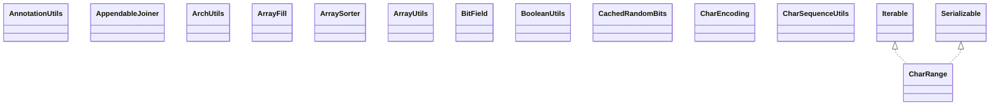

# commons-lang3-3.16.0.jar

[Group index](README.md) | [All archives](../README.md)

## Scope and provenance

- **Donor:** `SQX_145_REFERENCE_ROOT/internal/libs/commons-lang3-3.16.0.jar`.
- **SHA-256:** `08709dd74d602b705ce4017d26544210056a4ba583d5b20c09373406fe7a00f8`; accessed 2026-10-06; captured `2026-10-06T18:54:51.906614+00:00`.
- **Classes:** 396 raw entries; 396 unique entry names. Duplicate occurrence indices are zero-based.
- **Inspection:** read-only ZIP hashing and class-file structural parsing; signatures/descriptors, modifiers, hierarchy and references only. Bytecode bodies are hashed, not published.
- **Allocation:** proposed `FEAT-HOST-COMMONS-LANG3`, P01; [roadmap](../../sqx-full-application-roadmap.md). Domain README registration remains required.
- **Repository:** `01067f00031428613c6394064ca1bcadc1ba00ee`; review state unreviewed. Download label 145-dev1; installed build/activation and runtime equivalence unverified.
- **Limit:** every class/member is inventoried; declaration coverage does not establish consumed calls, defaults, formulas, failure semantics or algorithm parity.
- **Archive/resource index:** [022.json](../../../evidence/sqx145/archives/145/022.json).

## Complete member declarations

Member shards contain exact JVM names/descriptors, access flags, generic signatures, throws types, declared fields/methods, superclass/interfaces and referenced class names. All classes, nested/synthetic members and overloads are retained. Code length/hash is structural evidence, not a normalized algorithm comparison.

- [001.json](../../../evidence/sqx145/members/022/001.json) — SHA-256 `2cba6e04bad1755f71faa0125809936c4aa448622e76d1abab32b8ffbbdae29c`.
- [002.json](../../../evidence/sqx145/members/022/002.json) — SHA-256 `4a34db0ef327e77eb57de798006fbe4264b26936e5c6f3e1ddfb673d03dace7b`.
- [003.json](../../../evidence/sqx145/members/022/003.json) — SHA-256 `e77ea51cbeb5088df3cf5efa3860cfaec53fe667ac5b0feb8b80850545d3027e`.
- [004.json](../../../evidence/sqx145/members/022/004.json) — SHA-256 `a12a2cf12e3b23a907ce480a2eadaee4ac53a9419f4c81eac1f544601750745a`.
- [005.json](../../../evidence/sqx145/members/022/005.json) — SHA-256 `9f2613a4a439d2224af727575c19e6c3e403f48fdf94569eae255a3d411fc205`.

## Focused structural diagram

Up to twelve non-nested classes; arrows show declared inheritance/interfaces only. External type names are not evidence of an available body or an executed dependency.

## Class inventory

| Archive entry | Occurrence | Class SHA-256 | Fields | Methods |
| --- | ---: | --- | ---: | ---: |
| `org/apache/commons/lang3/AnnotationUtils$1.class` | 0 | `fcc4f12e1d8f0ee24cdaaf78b24bfca943bec76c3c1586bcf8eeefbcba176bcc` | 1 | 4 |
| `org/apache/commons/lang3/AnnotationUtils.class` | 0 | `56b703ff7621c1f8862cd77f1b4fc30516b53647187d772b3ea9ed4f38cf05dd` | 1 | 11 |
| `org/apache/commons/lang3/AppendableJoiner$1.class` | 0 | `d01e8d97842cd32d29c2ed7808e94c342291fe99bfc0514b662f080d8c5bbfa8` | 0 | 0 |
| `org/apache/commons/lang3/AppendableJoiner$Builder.class` | 0 | `e288160745c56dff019f2af9393039558018308de89509bdd81a8535bfa9b03d` | 4 | 7 |
| `org/apache/commons/lang3/AppendableJoiner.class` | 0 | `d880972a728685b870cafa54a16102961dc3be81f7334618c343b6d602f00576` | 4 | 14 |
| `org/apache/commons/lang3/ArchUtils.class` | 0 | `1743aa7c0ef05e908230a1e2e41f86335f23c2f1f6a87681cf7985c4a66afe8c` | 1 | 17 |
| `org/apache/commons/lang3/ArrayFill.class` | 0 | `f9a2b51a3d0784c6cb9a516eaef0218c0731fb8a7e02638578c325986a4b167c` | 0 | 9 |
| `org/apache/commons/lang3/ArraySorter.class` | 0 | `2add4fee631995e5ba427ed75a7aaea87ca4b0c886be3119d4fff7f95a180370` | 0 | 10 |
| `org/apache/commons/lang3/ArrayUtils.class` | 0 | `16e77d7a8f5343d54492024b916d993ccc408978a29344fb4750a4e6c6ced53c` | 24 | 394 |
| `org/apache/commons/lang3/BitField.class` | 0 | `bed345ff2ca97f1e15b6b4ac6b04f47cb97c50697ff6715d30ed1c987cda8483` | 2 | 18 |
| `org/apache/commons/lang3/BooleanUtils.class` | 0 | `cd62dddfee1678074526abb1342a646abe24f55588eb60a0a4e9fcfb739ee773` | 7 | 48 |
| `org/apache/commons/lang3/CachedRandomBits.class` | 0 | `94a5f669e9a4a4a157dc432f7d6bc4b196a46c5e67c96a51801df08cd5e0208a` | 4 | 3 |
| `org/apache/commons/lang3/CharEncoding.class` | 0 | `a7921a3255ebe1d02ea9179a94a9a83ec259d43c49ce3d7dcb67793111ac580d` | 6 | 3 |
| `org/apache/commons/lang3/CharRange$1.class` | 0 | `de34934ef2b669f5e2f61942dc07f6ac46da59810874591561668f090377a97b` | 0 | 0 |
| `org/apache/commons/lang3/CharRange$CharacterIterator.class` | 0 | `af8054dc0e3a919b0048aa3d496ea7b8dc14309206e9f430c8f93e0bd476ba96` | 3 | 7 |
| `org/apache/commons/lang3/CharRange.class` | 0 | `040f81eea1652c6e33903f2f86855251302d8a808f3461b2dc862c41cf2049bf` | 6 | 18 |
| `org/apache/commons/lang3/CharSequenceUtils.class` | 0 | `ff8c35f1582d7db6b9357dd3891d4276b5727e4cc591786752bf9343c98134fe` | 2 | 9 |
| `org/apache/commons/lang3/CharSet.class` | 0 | `869951435de55a1bd66b286057078ec372f05563789b7c9fa5232af08f30863e` | 8 | 10 |
| `org/apache/commons/lang3/CharSetUtils.class` | 0 | `b96bf9cb61af66b2ccf4093cb5092e1a10058f49bfcc8523e97bd8c28beadc0a` | 0 | 8 |
| `org/apache/commons/lang3/CharUtils.class` | 0 | `544314321f2da9725e2fca9026ddbc097d03b5cc80632dbf2a4b1c7330c6bbec` | 5 | 26 |
| `org/apache/commons/lang3/Charsets.class` | 0 | `f72a27aacb29bf81cfbc11298285a6249910e3c1d33f44b2f14a492f134a07ac` | 0 | 4 |
| `org/apache/commons/lang3/ClassLoaderUtils.class` | 0 | `6701befa02a3c3a9ebe86f1b7a85fe2e47bba32a5cc6f218d71f5be853f3d3ce` | 1 | 7 |
| `org/apache/commons/lang3/ClassPathUtils.class` | 0 | `a06c79f2487a2d7c7e21739f1407d941fe767ceb82342f50405124acc0f5b4cf` | 0 | 7 |
| `org/apache/commons/lang3/ClassUtils$1.class` | 0 | `0812cf1fa3feb37164678519a9e1f00f6ab70a5d1b818301f2780afce9e6c89c` | 1 | 5 |
| `org/apache/commons/lang3/ClassUtils$2.class` | 0 | `a827dc11e2b23f4b6b42d3671a3fe0c659f4bf80777ef70c98f66156d4bcb6c6` | 3 | 6 |
| `org/apache/commons/lang3/ClassUtils$Interfaces.class` | 0 | `2b667cf2eeae9f3a377d414f82e9daaab43280d13ea051c24917bce78f3f1e3f` | 3 | 5 |
| `org/apache/commons/lang3/ClassUtils.class` | 0 | `e55f1c768a400cad60b26a3117f489c723c7b3d60f5cf9ad1881fe1173d3331e` | 10 | 68 |
| `org/apache/commons/lang3/Conversion.class` | 0 | `84d59badb1d4dd2507a2c5a9fe53d216ff0c6f81e287e30c22ea9130e660fdf9` | 17 | 44 |
| `org/apache/commons/lang3/DoubleRange.class` | 0 | `9cdd4384ce0f77e109dea6f0e41ed3c712a5c95b2601fb5523e4531127e40fcc` | 1 | 3 |
| `org/apache/commons/lang3/EnumUtils.class` | 0 | `0b57f8e7de3c2d915ac3e30f7b143c51f75509e0bf76b1a766f1f716b08576fc` | 4 | 22 |
| `org/apache/commons/lang3/Functions$FailableBiConsumer.class` | 0 | `fad1dfccdcd1d660224bae07bfe6ffcc676af15eb542cc6d2722fe270f36dcb6` | 0 | 1 |
| `org/apache/commons/lang3/Functions$FailableBiFunction.class` | 0 | `19d8352e2ad7fa3defa3e6488f25d98dbab61a583e7cc7255fdbca62ed895fe8` | 0 | 1 |
| `org/apache/commons/lang3/Functions$FailableBiPredicate.class` | 0 | `6962c13a2845e44a803d805d2fbdf08e42c651c4556fe7fff7f7e8967f3fd72e` | 0 | 1 |
| `org/apache/commons/lang3/Functions$FailableCallable.class` | 0 | `5710833a21963c6fc1a0c98c70dfa4e43524ec39e2011227ef2e4d84726ed34c` | 0 | 1 |
| `org/apache/commons/lang3/Functions$FailableConsumer.class` | 0 | `280755362b6ceaddca4703b1215c55f52f9fed7620b54c9eacc00f471ba4840e` | 0 | 1 |
| `org/apache/commons/lang3/Functions$FailableFunction.class` | 0 | `95a1416c5f371e397e52e260d7c34be71d31b3b8b042cbc7be2366429b6b253b` | 0 | 1 |
| `org/apache/commons/lang3/Functions$FailablePredicate.class` | 0 | `992642294427382599b6110b11a67e7ab34bbf2a95a6c05abf506848314e81b3` | 0 | 1 |
| `org/apache/commons/lang3/Functions$FailableRunnable.class` | 0 | `1453761b7efb0e1cb10337634497fc39b7eb481e48e36247ac866cd2243456dd` | 0 | 1 |
| `org/apache/commons/lang3/Functions$FailableSupplier.class` | 0 | `12e4092af7e9fa9bda42373d83c3cc4c40c7043c0669b566b83cbb1eebaf60ab` | 0 | 1 |
| `org/apache/commons/lang3/Functions.class` | 0 | `a5d85ebb1b3d006ad43e506ca32a433706d50905c955355ed819ed744a1160b8` | 0 | 42 |
| `org/apache/commons/lang3/IntegerRange.class` | 0 | `3fda9e24e89860b106e360cc27eb306bfcbb26e9cccd2aee9a0520126c62199f` | 1 | 3 |
| `org/apache/commons/lang3/JavaVersion.class` | 0 | `147caa62b131c9d48720a2ba6b4f2b6ca4cde9a5d5956ce3bfcc7afbcc77bfc3` | 29 | 13 |
| `org/apache/commons/lang3/LocaleUtils$SyncAvoid.class` | 0 | `167db885c13f93b793481c755e7c028af6175b8ac3841f6c3f8415a54f48e89b` | 2 | 4 |
| `org/apache/commons/lang3/LocaleUtils.class` | 0 | `8ea94aafc1add0a0edba7135d1855c8fca817404f732611dad7e38251ee1f32a` | 5 | 21 |
| `org/apache/commons/lang3/LongRange.class` | 0 | `acc8a46f10cacf7bc114db2b37c127f7c46b918ca3fff699707f20d196af2428` | 1 | 3 |
| `org/apache/commons/lang3/NotImplementedException.class` | 0 | `4bb4b7400935144adff496fd1a77078489f0d0ac1baa792038c9762691c6596f` | 2 | 8 |
| `org/apache/commons/lang3/NumberRange.class` | 0 | `b3d9bb98b7716d4c478bd4aabeec06ac590e38db8671d338f8b2a4ed92f684db` | 1 | 1 |
| `org/apache/commons/lang3/ObjectUtils$Null.class` | 0 | `c1637c5c5439e67b60ea0a6bdf1bd00f17d1810a740a1d364c7d8be11ac45591` | 1 | 2 |
| `org/apache/commons/lang3/ObjectUtils.class` | 0 | `a81a71528d27246bf053a1835bfda3646c93e9eb4a28e7eda9bded8d2a68a63f` | 2 | 52 |
| `org/apache/commons/lang3/RandomStringUtils.class` | 0 | `606e5c282e00e35a91d59d21c978597e34669478c51e9540207792e29dbf6c87` | 5 | 45 |
| `org/apache/commons/lang3/RandomUtils.class` | 0 | `033180bc53a7ba6353d82c8433e1f5caff8fba773624cb43ddecb2b0fec35eb9` | 5 | 32 |
| `org/apache/commons/lang3/Range$ComparableComparator.class` | 0 | `b2753cdb11643d0cba9a92c7dc5baffecaed47046c28356a1177f29ef43db075` | 2 | 6 |
| `org/apache/commons/lang3/Range.class` | 0 | `bbbdee1c2d6d81c2363f94621bae2531076640951290791b8f75ac39a1cb19e0` | 6 | 27 |
| `org/apache/commons/lang3/RegExUtils.class` | 0 | `58313917277d6547d774b0a542565053c77b20bd21592089158cc55a975eaed6` | 0 | 13 |
| `org/apache/commons/lang3/RuntimeEnvironment.class` | 0 | `b72a077409baebd9c538fb2e5db1f6285ccf39566a439e9aa44b22b639743715` | 0 | 7 |
| `org/apache/commons/lang3/SerializationException.class` | 0 | `6b1c105377bfd0f7dac7f0e564a8cf300249125eb1d77899aa05fe8f0d98a4fd` | 1 | 4 |
| `org/apache/commons/lang3/SerializationUtils$ClassLoaderAwareObjectInputStream.class` | 0 | `9e6a69f7f62f667fe085836d6759d99bebe8295a3a81fb810c6840aff0b6a3f0` | 1 | 2 |
| `org/apache/commons/lang3/SerializationUtils.class` | 0 | `c3192ce85bcf4d831af6958203e1ad64b04df9fd91d15832b94154dd08e3505b` | 0 | 7 |
| `org/apache/commons/lang3/Streams$ArrayCollector.class` | 0 | `115439219e2293b51eea433fd012507fa272cc992f675c74efecc80ae2cf3235` | 2 | 9 |
| `org/apache/commons/lang3/Streams$FailableStream.class` | 0 | `9bb9f58d63d1c68f59f4e7263f844c5aca6551136d134791a1b2afcbf62a7ab8` | 2 | 12 |
| `org/apache/commons/lang3/Streams.class` | 0 | `f4b4ece75d18523eb7344a555481a67dfa6fc83fb5c442e27e6a99ba4cbf6d60` | 0 | 4 |
| `org/apache/commons/lang3/StringEscapeUtils$CsvEscaper.class` | 0 | `59971bc1ab4645e8ffbdff0e908f7f8756ce8495d7a3af8e215820816bfc7869` | 4 | 3 |
| `org/apache/commons/lang3/StringEscapeUtils$CsvUnescaper.class` | 0 | `701e86912dc4153786b93f8a941085e62688aba94c47da2079cfbc20f6f88bb8` | 4 | 3 |
| `org/apache/commons/lang3/StringEscapeUtils.class` | 0 | `39c20caca5f718e7eaf7732eb03734f5c6af9d339443013f6511e3229cc16706` | 16 | 18 |
| `org/apache/commons/lang3/StringUtils.class` | 0 | `3731e26094c6a825ad4fdb35d8fa06b5a96558c87ee0f9789ef35404a7bef3e1` | 7 | 251 |
| `org/apache/commons/lang3/SystemProperties.class` | 0 | `1bff3ac61fbc6158a98640f32dcd0e3c318c89e8060e77ec7e9ae38c8d018033` | 189 | 200 |
| `org/apache/commons/lang3/SystemUtils.class` | 0 | `9549fe6fd95a62e44375bb06dcc395e38308336117865ba51528a5232c6b068b` | 123 | 21 |
| `org/apache/commons/lang3/ThreadUtils$1.class` | 0 | `f3c656f13252af62fd913713a34b0a72757bad90777f9f4b3f3da86dfbb8523b` | 0 | 0 |
| `org/apache/commons/lang3/ThreadUtils$AlwaysTruePredicate.class` | 0 | `5e5d5ecaa0b6ce0297f2bd2799964ed15f183299e41256ce8363b66caf5c3d6c` | 0 | 4 |
| `org/apache/commons/lang3/ThreadUtils$NamePredicate.class` | 0 | `4a79bd3438dbe5be7566120a264b18375f1d4c3f0179fcb179566e191556db7f` | 1 | 3 |
| `org/apache/commons/lang3/ThreadUtils$ThreadGroupPredicate.class` | 0 | `1f1247746e8c2a468a442d4ed4595a28f6b3f4e3235e104ea4303ec85a5881f6` | 0 | 1 |
| `org/apache/commons/lang3/ThreadUtils$ThreadIdPredicate.class` | 0 | `0bef5290b77612f596a6f0a3a653f83f34eab06c2b058b28b8cf42c3f5d8dc51` | 1 | 2 |
| `org/apache/commons/lang3/ThreadUtils$ThreadPredicate.class` | 0 | `9c081d20d91168167cb84f70c84dff9a8490a75e8613270875eec0a0827e8fa6` | 0 | 1 |
| `org/apache/commons/lang3/ThreadUtils.class` | 0 | `c613c3b58a63be85d634580c959254123207b59dbbe668a951333f2a931b2971` | 2 | 31 |
| `org/apache/commons/lang3/Validate.class` | 0 | `96a29e12f57ab13b0e40fbf6b945379780f85d75b17aac33317cc8fa662671c2` | 20 | 54 |
| `org/apache/commons/lang3/arch/Processor$Arch.class` | 0 | `a96c2444e83ef62f59c0f9e87aaa5ec619c17d6f32c6ac09f39368864a5d5ac2` | 5 | 6 |
| `org/apache/commons/lang3/arch/Processor$Type.class` | 0 | `117c80ee11ba609ca992d8b1728f83b0ed5aea387a4f711c59068260cdaf0d37` | 8 | 6 |
| `org/apache/commons/lang3/arch/Processor.class` | 0 | `075ad8a8803673695e2304a0369f30a5f6632a16d01bd55e01feea9b91607fcb` | 2 | 11 |
| `org/apache/commons/lang3/arch/package-info.class` | 0 | `0d43912b94501227b98bc6ed18dfb8ea7d3274aa8e128a56e7b27c95c2835393` | 0 | 0 |
| `org/apache/commons/lang3/builder/AbstractSupplier.class` | 0 | `410d8e3d7797c524c8e044d897367f53da9e495c5f67d571e0d51299c4d4a465` | 0 | 2 |
| `org/apache/commons/lang3/builder/Builder.class` | 0 | `615c9a432b2052ea2a48f59d757ad78f7bd20ec1ef3b2527181bf968b8196672` | 0 | 1 |
| `org/apache/commons/lang3/builder/CompareToBuilder.class` | 0 | `24cca2619666cc3b023ffbf773bdc221495fb2eb0b41bade4941ae0ddb768cd4` | 1 | 32 |
| `org/apache/commons/lang3/builder/Diff.class` | 0 | `2fa911fa7f5e384963a8c99ff36ddc7441db13a5e9b8a2bb69c48daf7c91695e` | 3 | 6 |
| `org/apache/commons/lang3/builder/DiffBuilder$1.class` | 0 | `ca1207efcaeb6cef3cd38ea56b467b4bff7434b349aeab6d97523642dda36ac4` | 0 | 0 |
| `org/apache/commons/lang3/builder/DiffBuilder$Builder.class` | 0 | `6e26697125cd88c26583231892297f4fa45307588d59a27eecf68eca02054afb` | 5 | 7 |
| `org/apache/commons/lang3/builder/DiffBuilder$SDiff.class` | 0 | `2f5a5a98d1416252f039cb10a6384874bfe387873130f536395eb4cf8c0812b7` | 3 | 4 |
| `org/apache/commons/lang3/builder/DiffBuilder.class` | 0 | `aada4ecc3101aad4b2068400716bd0831073203f5ab5e824c55413d981993e0b` | 7 | 66 |
| `org/apache/commons/lang3/builder/DiffExclude.class` | 0 | `e2cf2c244c47e865d942a71032ffc51a0df24c6a6b7138869035843f13413a3b` | 0 | 0 |
| `org/apache/commons/lang3/builder/DiffResult.class` | 0 | `6ba4a21048fa9e71f4a490ddc7e7e873e6d6fa7b228e73487d83e1f3cb43e178` | 6 | 10 |
| `org/apache/commons/lang3/builder/Diffable.class` | 0 | `87f1427dd49f5997c7626aac8d73a0e075134c3563d52088155ba4ecd02bf0a8` | 0 | 1 |
| `org/apache/commons/lang3/builder/EqualsBuilder.class` | 0 | `909a473b4c6b14f5ae014b251f6373fca61d61bdc2caa13274d7dc6931e4db78` | 7 | 44 |
| `org/apache/commons/lang3/builder/EqualsExclude.class` | 0 | `c1aa4be9b01d7314603c26887461fd79ccb0f47da065f2a7cbe76ad9b0d9e579` | 0 | 0 |
| `org/apache/commons/lang3/builder/HashCodeBuilder.class` | 0 | `3554b302f42f929f5496eac391841ba605fc51262ec68fbfef4412a49aa4e670` | 5 | 39 |
| `org/apache/commons/lang3/builder/HashCodeExclude.class` | 0 | `2b3c4a52e29ee9be1d16eca31549e0f665da3f4c132d7b3c630a524bf8ec52fd` | 0 | 0 |
| `org/apache/commons/lang3/builder/IDKey.class` | 0 | `17d23b9ab2f6c32f7c24f6de8e1bfbabde7a6ea42e41edc8c55eaaae6a229e55` | 2 | 3 |
| `org/apache/commons/lang3/builder/MultilineRecursiveToStringStyle.class` | 0 | `03fa1c0db0949334f85cfc203b87203d8c11ec0213d47b4bb80e8c77c266f306` | 3 | 14 |
| `org/apache/commons/lang3/builder/RecursiveToStringStyle.class` | 0 | `482ac4d4f0051b7dfd98b4c76d2ae97f5c2210f0e294bdd937aefc48e57a1d4d` | 1 | 4 |
| `org/apache/commons/lang3/builder/Reflection.class` | 0 | `9e496a5a8287facf818cd06a82ef8c5800a25343c1ca849a234f3f59933172f3` | 0 | 2 |
| `org/apache/commons/lang3/builder/ReflectionDiffBuilder$1.class` | 0 | `7aa5fbac058baef0172cb6a65c103a2324ebfaac2513c42235d8a12500cf77d6` | 0 | 0 |
| `org/apache/commons/lang3/builder/ReflectionDiffBuilder$Builder.class` | 0 | `a992d6d046666e6d33ee89fc07d70665dc8c844d47ee9929a8b1e19e45bd57f4` | 2 | 4 |
| `org/apache/commons/lang3/builder/ReflectionDiffBuilder.class` | 0 | `0bbc907c11828e8eeec527697ca3c109088f29811dabf6bc2f65bb0b05a3cbb7` | 2 | 15 |
| `org/apache/commons/lang3/builder/ReflectionToStringBuilder.class` | 0 | `b7e199a44c62a5c95374b71248aad35fec36af0be6a30898465d9f2a0d52cf6e` | 6 | 36 |
| `org/apache/commons/lang3/builder/StandardToStringStyle.class` | 0 | `4feddb410611275385db9ddb91330be7f006f13f0caf45313d41248ce42d79ad` | 1 | 41 |
| `org/apache/commons/lang3/builder/ToStringBuilder.class` | 0 | `adb583973b6c014a9bcf3bd18f00f89b719aaa4b9d821ba814a127fc3547235a` | 4 | 65 |
| `org/apache/commons/lang3/builder/ToStringExclude.class` | 0 | `a53ba22933645b3c7d891e0b3a7a1497b084c386e1a7837d2cf4275de4afa4ce` | 0 | 0 |
| `org/apache/commons/lang3/builder/ToStringStyle$DefaultToStringStyle.class` | 0 | `53b472fe2facfda66c52ac25680d918c08aff103c44e7a8c9dea25aa3b90dc7f` | 1 | 2 |
| `org/apache/commons/lang3/builder/ToStringStyle$JsonToStringStyle.class` | 0 | `d4b0eca7eeb477b8e0567d12a129bb9b176ce2423f14189b2f3588e040466ef6` | 2 | 20 |
| `org/apache/commons/lang3/builder/ToStringStyle$MultiLineToStringStyle.class` | 0 | `2f89aac1e289409675e968d068b49aff1d5a53adbaa05f9ab7ba722f4298cd03` | 1 | 2 |
| `org/apache/commons/lang3/builder/ToStringStyle$NoClassNameToStringStyle.class` | 0 | `8e1cf72e9fca3d4d433a0e5cfd22f3502e6d937e27037601d3057de8f76b7885` | 1 | 2 |
| `org/apache/commons/lang3/builder/ToStringStyle$NoFieldNameToStringStyle.class` | 0 | `85c9f2618fb03930610ad5258547b7f568b35bdbe53e9907a246c7cf7d96fe04` | 1 | 2 |
| `org/apache/commons/lang3/builder/ToStringStyle$ShortPrefixToStringStyle.class` | 0 | `37fce7b0fc4aeee82ff2207b14dee2835ff36ccbea31fbbf0f12bda6f2e48ea1` | 1 | 2 |
| `org/apache/commons/lang3/builder/ToStringStyle$SimpleToStringStyle.class` | 0 | `d260ca70514db40e53dee6b1c24e5c89f34fdbce6b6b2fb838c1d7a2af20abe2` | 1 | 2 |
| `org/apache/commons/lang3/builder/ToStringStyle.class` | 0 | `9b8a7b383bfbc9eea7c813ca9a4674df43a55adbab40b2c99e1394f2ffee5887` | 29 | 114 |
| `org/apache/commons/lang3/builder/ToStringSummary.class` | 0 | `be4c43a2db1ae854db9c812576b9aad0ff5487899fbfce5e445a81b5c3e4341b` | 0 | 0 |
| `org/apache/commons/lang3/builder/package-info.class` | 0 | `8382d7abb3061ad3a7553cf994aed6531551a2519ccc94161b28d477ae29a027` | 0 | 0 |
| `org/apache/commons/lang3/compare/ComparableUtils$1.class` | 0 | `05974984bb2a00fc7db8d5d093e0ca97222a29cbf595995826ec76e8850ae2ef` | 0 | 0 |
| `org/apache/commons/lang3/compare/ComparableUtils$ComparableCheckBuilder.class` | 0 | `a898f3afaecf1e6c06b342321e5b1ea40669061d4f6c3557f7f58857e44021f3` | 1 | 11 |
| `org/apache/commons/lang3/compare/ComparableUtils.class` | 0 | `707c99faadcdfd816b97b8affd6775358c717977e29ed87260f090b326d9b919` | 0 | 16 |
| `org/apache/commons/lang3/compare/ObjectToStringComparator.class` | 0 | `46a6b039d4835e3d154ef95c18a07161618e3240bedfee7f48378f5c4f32a3f6` | 2 | 3 |
| `org/apache/commons/lang3/compare/package-info.class` | 0 | `4d2ecb5e58bd97d78020c06cde76cbce99117c9653929bf2886354dff029a8a0` | 0 | 0 |
| `org/apache/commons/lang3/concurrent/AbstractCircuitBreaker$1.class` | 0 | `293bb5d82a00d35f9eb74ad3a02c1fd1ceb35bd8dda201b5c9c816a713269c09` | 0 | 0 |
| `org/apache/commons/lang3/concurrent/AbstractCircuitBreaker$State$1.class` | 0 | `53bbc1ba2ed3953fbbdc696c042317c4099a353d33e121d1ab1adfb6d21e0cef` | 0 | 2 |
| `org/apache/commons/lang3/concurrent/AbstractCircuitBreaker$State$2.class` | 0 | `31299591661ee9e3e658196b1c96eca5cd6973c0d744f6d8adcd86dd716d91f8` | 0 | 2 |
| `org/apache/commons/lang3/concurrent/AbstractCircuitBreaker$State.class` | 0 | `302b94c710aab88df005781f58d472ddc3f11f17fbda19d0e4823ac69dc9eabb` | 3 | 7 |
| `org/apache/commons/lang3/concurrent/AbstractCircuitBreaker.class` | 0 | `86c7a618a20066e308115c06024a211efe3a7003626e74e0195fdbf992c3b2e6` | 3 | 11 |
| `org/apache/commons/lang3/concurrent/AbstractConcurrentInitializer$AbstractBuilder.class` | 0 | `0407d8628c26d4c371c4f93673a7a2005aaefcf5e3fa9c1838943f9084a8cac5` | 2 | 5 |
| `org/apache/commons/lang3/concurrent/AbstractConcurrentInitializer.class` | 0 | `4871ca4cafefc6aeb85a190f06c495e6a63ed28cf0d4281bff5e19f491ed7812` | 2 | 6 |
| `org/apache/commons/lang3/concurrent/AbstractFutureProxy.class` | 0 | `38258b97763b0df055a3f8aad9aa25c63d399600a4d5c2fe2e4cd5a46e14d7dd` | 1 | 7 |
| `org/apache/commons/lang3/concurrent/AtomicInitializer$1.class` | 0 | `44d5faa2d33840db033947e0a6de4207650735ca490a51db69c6a1562a9242ee` | 0 | 0 |
| `org/apache/commons/lang3/concurrent/AtomicInitializer$Builder.class` | 0 | `1d7fe185112c02ff644723529becfba69704545f2c13dbc98a842cf58ea27bc8` | 0 | 3 |
| `org/apache/commons/lang3/concurrent/AtomicInitializer.class` | 0 | `e9eb8604a6391c8cb0d236e399bcc5a2aaa6745f2a822626c29a7d0ef6cfa8e1` | 2 | 10 |
| `org/apache/commons/lang3/concurrent/AtomicSafeInitializer$1.class` | 0 | `42d5e57bf2afdc366e7f5835fd4c8235675298b9b47c7bce92ac5373116bc4fe` | 0 | 0 |
| `org/apache/commons/lang3/concurrent/AtomicSafeInitializer$Builder.class` | 0 | `ee39f759acf5e32ee4cc97f91081fdeb15e19fcfeb0d39e89f6739657ddc4dc2` | 0 | 3 |
| `org/apache/commons/lang3/concurrent/AtomicSafeInitializer.class` | 0 | `3b8f86fe701c99bb0841cbf6c5ede8edcb101e65007f1e07ef467d8495dc9add` | 3 | 10 |
| `org/apache/commons/lang3/concurrent/BackgroundInitializer$1.class` | 0 | `a556086faac9efa63ffc5ec83dbf7af2cc777ef386b2feb432b33d4f6084c4ae` | 0 | 0 |
| `org/apache/commons/lang3/concurrent/BackgroundInitializer$Builder.class` | 0 | `029f1a59145c5752f6c5f70cc1c34679639fc3d3cff7fdce706c38eb30c404d5` | 1 | 4 |
| `org/apache/commons/lang3/concurrent/BackgroundInitializer$InitializationTask.class` | 0 | `e4068079a6cbffcea87fed612e496c0a702cf7bca9ed17b0386515013f34dcc3` | 2 | 2 |
| `org/apache/commons/lang3/concurrent/BackgroundInitializer.class` | 0 | `692afdfad52974e2136be2d3ca5d416607139246e73c13d532116eb33446d6ed` | 3 | 17 |
| `org/apache/commons/lang3/concurrent/BasicThreadFactory$1.class` | 0 | `ddf5fb9feff714894c6b0bc1fa9ccda5a59d4c5ba02daa2d9f17c672c28743ce` | 0 | 0 |
| `org/apache/commons/lang3/concurrent/BasicThreadFactory$Builder.class` | 0 | `96c685f887a17b3374ed3f8646351c4fbeb2ea706757a72c4f375463059a21db` | 5 | 14 |
| `org/apache/commons/lang3/concurrent/BasicThreadFactory.class` | 0 | `12c4fa1959f15f3c60a1adf94be18562a76fbaf969ff2b776cba775fdcbab08b` | 6 | 10 |
| `org/apache/commons/lang3/concurrent/CallableBackgroundInitializer.class` | 0 | `0c046f4d4bc3f96901718e88f94a0f01cabf1987759c369822aeeccb907f6f25` | 1 | 5 |
| `org/apache/commons/lang3/concurrent/CircuitBreaker.class` | 0 | `fbc2443094d131067d555006cfc5c8a8e323a64c027e91d2fd38aa04a411128c` | 0 | 6 |
| `org/apache/commons/lang3/concurrent/CircuitBreakingException.class` | 0 | `2fa6681b691a522018219ec6ba33916167ba06295843a5e20b5668831a599be6` | 1 | 4 |
| `org/apache/commons/lang3/concurrent/Computable.class` | 0 | `98bc244b5718837e22a24279a67b14505beadb2c7ce7c02e3e0098be872f30c8` | 0 | 1 |
| `org/apache/commons/lang3/concurrent/ConcurrentException.class` | 0 | `ca0ca86dbd25d6ba98d9bad2bfcbfdc39f6d273d498edbef1e26c33869306999` | 1 | 3 |
| `org/apache/commons/lang3/concurrent/ConcurrentInitializer.class` | 0 | `27d38865266ef4c979c969a2f39a1606ec34825b6455ee0043c95463471d3366` | 0 | 0 |
| `org/apache/commons/lang3/concurrent/ConcurrentRuntimeException.class` | 0 | `3bc0155aad62c5742a85d00e9d6c8243d1377cf9c9b6b8dcb7ed7993a3d04b10` | 1 | 3 |
| `org/apache/commons/lang3/concurrent/ConcurrentUtils$ConstantFuture.class` | 0 | `a552ecb093b11ccecb48bf2d51dec11056c21dd6a0982eb1b3eed4c342102853` | 1 | 6 |
| `org/apache/commons/lang3/concurrent/ConcurrentUtils.class` | 0 | `339609c45f4c4d7c4a62f4597af89840244d4bd2c10ce809599cc88c3189224d` | 0 | 12 |
| `org/apache/commons/lang3/concurrent/ConstantInitializer.class` | 0 | `776a2522409e7add3ba1a55ab1b51dafda2b83293540f70baaff2a670dd1e91a` | 2 | 7 |
| `org/apache/commons/lang3/concurrent/EventCountCircuitBreaker$1.class` | 0 | `66a53d479a4eadebb946f2916b1c50568e7883866b7bcd5208a8519fa345fb90` | 0 | 0 |
| `org/apache/commons/lang3/concurrent/EventCountCircuitBreaker$CheckIntervalData.class` | 0 | `180a97d2f2e17f970e88064a3be68d10f294fa94ba1a3776d75c92f32ac7df4f` | 2 | 4 |
| `org/apache/commons/lang3/concurrent/EventCountCircuitBreaker$StateStrategy.class` | 0 | `055dbd9219bd19ac2b2d896bc7d8b7ba2742317db4390d44f35b255564b87a8d` | 0 | 5 |
| `org/apache/commons/lang3/concurrent/EventCountCircuitBreaker$StateStrategyClosed.class` | 0 | `8f14b81ff6b4b08f101fa05e03033a919409c29365eb5f02f578141deb161dff` | 0 | 4 |
| `org/apache/commons/lang3/concurrent/EventCountCircuitBreaker$StateStrategyOpen.class` | 0 | `8db60e52e297fa622120c515d3fe5fa5c373bcb7a00c48dbacb15a0a89830107` | 0 | 4 |
| `org/apache/commons/lang3/concurrent/EventCountCircuitBreaker.class` | 0 | `6f8ea3bd58bb6c57520999919f82dd5e0074ed91a4b04899372442da7531559e` | 6 | 21 |
| `org/apache/commons/lang3/concurrent/FutureTasks.class` | 0 | `3187e660991bfb56717423d7564bb9ca341572e5227aa09cbf77ad91dccb9a39` | 0 | 2 |
| `org/apache/commons/lang3/concurrent/LazyInitializer$1.class` | 0 | `f9bd85ff43fec03d763df2020cc092704bce934430070a27d08f4f4ef87667d1` | 0 | 0 |
| `org/apache/commons/lang3/concurrent/LazyInitializer$Builder.class` | 0 | `0bd602d3e97d2561e39cec1aed84c01f564841dd1c4ea7b3e125f57651026570` | 0 | 3 |
| `org/apache/commons/lang3/concurrent/LazyInitializer.class` | 0 | `a6189ea5ce12dfb3ffe5932ee99dc27e1e1e5508362fd9767340c3dedb2b43f5` | 2 | 9 |
| `org/apache/commons/lang3/concurrent/Memoizer.class` | 0 | `aa2c063f54ebc6078353682bb24b21574f741cbd03e04e75cbdc15cb3a4e84f0` | 3 | 10 |
| `org/apache/commons/lang3/concurrent/MultiBackgroundInitializer$1.class` | 0 | `3f7c782803e66683e5a156a8a090ad9a57b0735a47a60d301f85efe84e61bce9` | 0 | 0 |
| `org/apache/commons/lang3/concurrent/MultiBackgroundInitializer$MultiBackgroundInitializerResults.class` | 0 | `c82a3ee158f95150c2d79fba24e30d4833570e16e25402c3fe9db9745d35f467` | 3 | 9 |
| `org/apache/commons/lang3/concurrent/MultiBackgroundInitializer.class` | 0 | `bfc6977c182877caf969d21a84dd03bb3f36925ffcebf013a23ac62006cececd` | 1 | 10 |
| `org/apache/commons/lang3/concurrent/ThresholdCircuitBreaker.class` | 0 | `50e1c565be08641630d6b572464f5f92642fb5e1ab5ca827d375db68ef9363a5` | 3 | 6 |
| `org/apache/commons/lang3/concurrent/TimedSemaphore.class` | 0 | `e9fbd031dbbb5dbfd62a8f8c14cd5334f363f80b17184b213a6ab2b63790c6d6` | 13 | 19 |
| `org/apache/commons/lang3/concurrent/UncheckedExecutionException.class` | 0 | `14f232414eef2da2cd4d5909ed928846023668589e6cb2ab089da85c10199b86` | 1 | 1 |
| `org/apache/commons/lang3/concurrent/UncheckedFuture.class` | 0 | `9faec56ded6c447339b88e2e33a33be63b98359fbfcab074526d060cbafffbc6` | 0 | 5 |
| `org/apache/commons/lang3/concurrent/UncheckedFutureImpl.class` | 0 | `3770805a6a2056293beff18b4584930a73f1e3db029f75e8211ad150b2dbb30e` | 0 | 3 |
| `org/apache/commons/lang3/concurrent/UncheckedTimeoutException.class` | 0 | `66eed49f882c63d6662544cc846c11f35b89e481f2cb55e57a4cbb87759c98fb` | 1 | 1 |
| `org/apache/commons/lang3/concurrent/locks/LockingVisitors$LockVisitor.class` | 0 | `4357b83077eb803e2d7da5f4bf4e0cb9610de0c72aac34870cea8b5196d42620` | 4 | 9 |
| `org/apache/commons/lang3/concurrent/locks/LockingVisitors$ReadWriteLockVisitor.class` | 0 | `78fcd013df1321de9825906e7d327a15e956a1d6efce248edd39102eb111ce43` | 0 | 1 |
| `org/apache/commons/lang3/concurrent/locks/LockingVisitors$StampedLockVisitor.class` | 0 | `4e532d3029d5b2471ae7dac5fc12c7ca69b1c32807d8f8b1a6f6be8a0b71120c` | 0 | 1 |
| `org/apache/commons/lang3/concurrent/locks/LockingVisitors.class` | 0 | `d5a4d540cad1a8bcbd9ccd2cbf5b862f27f760fd4beaa684cb752f42f5321d8d` | 0 | 4 |
| `org/apache/commons/lang3/concurrent/locks/package-info.class` | 0 | `27cc01938670b0f7e801ec482b407e230f1925582173e5c02e6ac865cf954315` | 0 | 0 |
| `org/apache/commons/lang3/concurrent/package-info.class` | 0 | `785c163596f5d1b414ca155d6575a3de24709fe45f82b855102b96e60da2a269` | 0 | 0 |
| `org/apache/commons/lang3/event/EventListenerSupport$ProxyInvocationHandler.class` | 0 | `1147e215eea27c60af79ebd1a5f6f464bdf42c72f79dd66ad39b18b599145f92` | 2 | 4 |
| `org/apache/commons/lang3/event/EventListenerSupport.class` | 0 | `0a564157ed33eb0a52b87fd0e5f509eefe6505d6404a37a026ad8d1c7c60ec2e` | 4 | 16 |
| `org/apache/commons/lang3/event/EventUtils$EventBindingInvocationHandler.class` | 0 | `4b9a486d988b5538b9c99af3c7747d41ca41f388d59dbecf1ef0b95efc87a630` | 3 | 3 |
| `org/apache/commons/lang3/event/EventUtils.class` | 0 | `77ca0e64912d48bf3f5680e46336d301e3c2c37676eda246d0a85ff1c639b0b5` | 0 | 3 |
| `org/apache/commons/lang3/event/package-info.class` | 0 | `e2252670270f48b24e20d8940b542de0c5215eb8f6c4c0f375b1135a3440cc14` | 0 | 0 |
| `org/apache/commons/lang3/exception/CloneFailedException.class` | 0 | `9829e937739d06b11644e35c5ec110b3b4655e27064fd216bd310e0457e6400f` | 1 | 3 |
| `org/apache/commons/lang3/exception/ContextedException.class` | 0 | `a1ba5ef722bd2fe3eaabfbcebd828b434708d90db4fdd80be24329a2297d27e9` | 2 | 16 |
| `org/apache/commons/lang3/exception/ContextedRuntimeException.class` | 0 | `1c790493f016c757478c0cc11e9ebb302998883440e6ec30cab3e50c70f7e54f` | 2 | 16 |
| `org/apache/commons/lang3/exception/DefaultExceptionContext.class` | 0 | `670b9dfee2d7d8db72f3f6306672d15cbfbf90eb02f821a32f75dff5298cb491` | 2 | 14 |
| `org/apache/commons/lang3/exception/ExceptionContext.class` | 0 | `0c03bb5b8ff8ca65bef4d7d0f5de3fa390edd64b6943e9b51d10a5c39207e0b6` | 0 | 7 |
| `org/apache/commons/lang3/exception/ExceptionUtils.class` | 0 | `8413e29ef30512fcd65b312df9b1a79dfee5dafff5cb45dd73c8e56b09df1aba` | 3 | 44 |
| `org/apache/commons/lang3/exception/UncheckedException.class` | 0 | `c517da7205ddefaaa2d8f22d1ba6020e0831dd310e1a12e336dfb5df41b9b138` | 1 | 1 |
| `org/apache/commons/lang3/exception/UncheckedIllegalAccessException.class` | 0 | `cc37d5ff9cff0baf017bf7287e9f4ab89d91eaa31bdcc6887799881550bd88ae` | 1 | 1 |
| `org/apache/commons/lang3/exception/UncheckedInterruptedException.class` | 0 | `9e801d1ff4aa05988c0087068e5087b5a069d1b07fe554a40592d2a02d2ef766` | 1 | 1 |
| `org/apache/commons/lang3/exception/UncheckedReflectiveOperationException.class` | 0 | `47bb394e6cac8c6980cd4d975e27c4d4004100f3837d13fe451c1669e0d1a4d4` | 1 | 1 |
| `org/apache/commons/lang3/exception/package-info.class` | 0 | `f0d46d76213d6145e7679e49df8ba4f986f49c4c1dd7613e7e6907ba194bce92` | 0 | 0 |
| `org/apache/commons/lang3/function/BooleanConsumer.class` | 0 | `2c1a6167f444ed8917acabc922b05f39449e38c6d064b3397e096f8e31160157` | 1 | 6 |
| `org/apache/commons/lang3/function/Consumers.class` | 0 | `531ed7b9bf6e516c4226d1c9556a22259b41c4072c86409aae217c3e5cb58a6f` | 1 | 4 |
| `org/apache/commons/lang3/function/Failable.class` | 0 | `9d2fe220f0bab2237816669441fe6e565342f512f4742e29134b32339dae7384` | 0 | 53 |
| `org/apache/commons/lang3/function/FailableBiConsumer.class` | 0 | `07c1dc7c5a4464b06706831acd74698478bd46bd3dfb9cf90ab443aede37ffc6` | 1 | 6 |
| `org/apache/commons/lang3/function/FailableBiFunction.class` | 0 | `f82002f2848db1d46c79dfcea113fbd40a0f2e99f3c94f27a7179e8b98d8b309` | 1 | 6 |
| `org/apache/commons/lang3/function/FailableBiPredicate.class` | 0 | `949261e698570ae3b4388d42882e5519b8c435aab0611aff5265f74c1e8e2c3e` | 2 | 12 |
| `org/apache/commons/lang3/function/FailableBooleanSupplier.class` | 0 | `92a1b0b2f23fa6a1af016e4ab7a5069359696478ce7b54b69a637ac43f433f32` | 0 | 1 |
| `org/apache/commons/lang3/function/FailableCallable.class` | 0 | `17cbb6a67e8a0277444fef4aaa54ad04cb4f88e428505ce350bffa9acd848c03` | 0 | 1 |
| `org/apache/commons/lang3/function/FailableConsumer.class` | 0 | `a5895195569946eb05f9f66197e523ae8a40e47e55b1cb20646927a8c34e3039` | 1 | 5 |
| `org/apache/commons/lang3/function/FailableDoubleBinaryOperator.class` | 0 | `0c7d40ad370e5cb822c515acbc0e1649aa1952708da1942989a742004f8d900d` | 0 | 1 |
| `org/apache/commons/lang3/function/FailableDoubleConsumer.class` | 0 | `013150c9e133e426a680b779adc3acb79b301191576b968238336ce05b594c25` | 1 | 6 |
| `org/apache/commons/lang3/function/FailableDoubleFunction.class` | 0 | `67652914cab7922fefedb8cd7f780e8407aa820cd559eb62d9058a6259874f83` | 1 | 4 |
| `org/apache/commons/lang3/function/FailableDoublePredicate.class` | 0 | `40c3c3072f11b194edbb5d372408c889a19b54ca200a70e462a1fbf02b94cf48` | 2 | 12 |
| `org/apache/commons/lang3/function/FailableDoubleSupplier.class` | 0 | `684f256e751c0d36b4b153dd257e2aa7c371b1cacc6cd70428984ed191f3f9a7` | 0 | 1 |
| `org/apache/commons/lang3/function/FailableDoubleToIntFunction.class` | 0 | `7d7807b5b95ac240665d1fc3226e029a39a1aa734c87d38447350fefc599502f` | 1 | 4 |
| `org/apache/commons/lang3/function/FailableDoubleToLongFunction.class` | 0 | `a1a99cbc29419c7fbfb952eff600973b1ba910f76aa20dfe84434edad7e59b3c` | 1 | 4 |
| `org/apache/commons/lang3/function/FailableDoubleUnaryOperator.class` | 0 | `6eff14139d8041456a0ef1900ed0b74123d7875aa36a5644bd8e6f2eaf0a1813` | 1 | 10 |
| `org/apache/commons/lang3/function/FailableFunction.class` | 0 | `d6c844c1333c4d3290c88c33002809bd9dac764af45b23318d80ea0e87bb62e0` | 1 | 11 |
| `org/apache/commons/lang3/function/FailableIntBinaryOperator.class` | 0 | `9ba99f21699ef8a9aa9a700f6aa678e86444209dcdb53abba71de950485fcbea` | 0 | 1 |
| `org/apache/commons/lang3/function/FailableIntConsumer.class` | 0 | `a0f03c6eceed9a36cf3cf0639c92f31bd2c07e54bf5471f94003a9655c1343cc` | 1 | 6 |
| `org/apache/commons/lang3/function/FailableIntFunction.class` | 0 | `a98f562c0915b09c77cef48220c00824d38ea91c69043c586bcf610fb1da1326` | 1 | 4 |
| `org/apache/commons/lang3/function/FailableIntPredicate.class` | 0 | `1c86bb8dd08bcb7ffcf664b0154ae49d3e1befa40c8f8d5fe84f6bc90742cbc7` | 2 | 12 |
| `org/apache/commons/lang3/function/FailableIntSupplier.class` | 0 | `1d66d3ac4d5065a92512908aff40813a8c27db38bea1208988c7c6413da27c9b` | 0 | 1 |
| `org/apache/commons/lang3/function/FailableIntToDoubleFunction.class` | 0 | `2ad8d459a0afe773ef00aba3754b44bff74d5fd024039a042a198902af00c36b` | 1 | 4 |
| `org/apache/commons/lang3/function/FailableIntToLongFunction.class` | 0 | `ddb8d34d7e867990962280c53447fe7083ee093493fa83e5faa569c7c7f345be` | 1 | 4 |
| `org/apache/commons/lang3/function/FailableIntUnaryOperator.class` | 0 | `776acca7dbfbac99422390a76e9f489c7cc8afb9836ae4914453f52646932471` | 1 | 10 |
| `org/apache/commons/lang3/function/FailableLongBinaryOperator.class` | 0 | `fb4fdf5006704333d4fc226179631578e2f8862a01b6bac0358c2358c7f74024` | 0 | 1 |
| `org/apache/commons/lang3/function/FailableLongConsumer.class` | 0 | `5d3616ccd1b91d1a2d71be1875b9429897961761265499d01f303c0c33ddcff0` | 1 | 6 |
| `org/apache/commons/lang3/function/FailableLongFunction.class` | 0 | `a51312c677984014154c4f6b8bd79ca0a830f0dfe02b2cd5abb50436fae6e74b` | 1 | 4 |
| `org/apache/commons/lang3/function/FailableLongPredicate.class` | 0 | `9db390908c1a6b3c63734009da0b76960ffb112d0cc81c459f9f0dad1f4ea757` | 2 | 12 |
| `org/apache/commons/lang3/function/FailableLongSupplier.class` | 0 | `593536468877ccc7bfedaf95db0f0a991aefab0ba13d4445bac99e772f914a66` | 0 | 1 |
| `org/apache/commons/lang3/function/FailableLongToDoubleFunction.class` | 0 | `87e827c33c4043db7381b7c831e769bbb3387c3b176e6ac5eb421bc73c852d85` | 1 | 4 |
| `org/apache/commons/lang3/function/FailableLongToIntFunction.class` | 0 | `47252a6c17470e7f2ed1ccfab1a1f4a0e2dd5b56b6c09ea9257b802db7d3fef7` | 1 | 4 |
| `org/apache/commons/lang3/function/FailableLongUnaryOperator.class` | 0 | `3c4772507d4e18cd6a962775381f5ae53e41c63b69b4ac0bec9f764db5de27df` | 1 | 10 |
| `org/apache/commons/lang3/function/FailableObjDoubleConsumer.class` | 0 | `7a4c098435c78d97ba75f9a1b2bafad06ef2027063d8c43736f7ca8a7640d765` | 1 | 4 |
| `org/apache/commons/lang3/function/FailableObjIntConsumer.class` | 0 | `eab5ae2f0f5cc5f25e15ee50600f218be362767a990d448996f1a11f8acae169` | 1 | 4 |
| `org/apache/commons/lang3/function/FailableObjLongConsumer.class` | 0 | `2c698f3c62d8a7d000c4a59c2605399c8d40eda219907f51b1328e379ea1a6a8` | 1 | 4 |
| `org/apache/commons/lang3/function/FailablePredicate.class` | 0 | `1d66a1de799cebf08d798a380bac54e64918f98e7f736c23755455b4bc6566fb` | 2 | 12 |
| `org/apache/commons/lang3/function/FailableRunnable.class` | 0 | `4dda0e35262c75e11dbdeea5c670b8d84b39be2adfbf921c525ecc5aaa2053c3` | 0 | 1 |
| `org/apache/commons/lang3/function/FailableShortSupplier.class` | 0 | `b6a66d20fe2ceda7f42fdf3c00fa847c3e90a8197e3c648c647cb02b4e0726b4` | 0 | 1 |
| `org/apache/commons/lang3/function/FailableSupplier.class` | 0 | `2fd0edc7bf0668af8de1a74052592f0153e0587a7fc8b0c4649cef6afb9b5853` | 1 | 4 |
| `org/apache/commons/lang3/function/FailableToDoubleBiFunction.class` | 0 | `bd54d06bb46280d5c839f58433c905f0f1cc78b8c176a2eca16d8e8429250f9f` | 1 | 4 |
| `org/apache/commons/lang3/function/FailableToDoubleFunction.class` | 0 | `2570afadffadb690cc35e1ddef8b02a29c78e432667ca55ba197fdffbc443698` | 1 | 4 |
| `org/apache/commons/lang3/function/FailableToIntBiFunction.class` | 0 | `8127f0ce25a0f089e24e3d949addd840e3b42661b720e51289c1a1583a2e2e4f` | 1 | 4 |
| `org/apache/commons/lang3/function/FailableToIntFunction.class` | 0 | `f0cd9d54f77796e046309a83cdaedbe80f54bef62fe22ad9e72d192494595131` | 1 | 4 |
| `org/apache/commons/lang3/function/FailableToLongBiFunction.class` | 0 | `21f6de60d826c66b66706ca631731c1c41ab205218566bc57280fce6d8848935` | 1 | 4 |
| `org/apache/commons/lang3/function/FailableToLongFunction.class` | 0 | `008ff7919df4a58feb801af2e4eecfc2505321c977e4c46bc047fbd27de435ef` | 1 | 4 |
| `org/apache/commons/lang3/function/Functions.class` | 0 | `14299469cfc08d241b1d6f3cde1345eb99e5379c7f69c31335f1b5b44bc5ecaf` | 0 | 3 |
| `org/apache/commons/lang3/function/IntToCharFunction.class` | 0 | `76a4d3697f21a722811e32cc28ee36aec9987670824435c498dc32e7c3240b18` | 0 | 1 |
| `org/apache/commons/lang3/function/MethodInvokers.class` | 0 | `fad3c22a690c82004b75f570e3327e5c11024649dd18659f67f31f25bbf1f6c4` | 0 | 13 |
| `org/apache/commons/lang3/function/Suppliers.class` | 0 | `c392c8a88ad5c8518cc2c5fb34b1e066dff2f804330df742ee2b914c0382b4b9` | 1 | 5 |
| `org/apache/commons/lang3/function/ToBooleanBiFunction.class` | 0 | `9ac32ef0ef3e4136e84334c1096da884e0cde90ab318d66438a75f550efd267b` | 0 | 1 |
| `org/apache/commons/lang3/function/TriConsumer.class` | 0 | `dca8f02e59004fa0c4521610596c19d05504e38998a75f2920d9e260ea94a2d8` | 0 | 3 |
| `org/apache/commons/lang3/function/TriFunction.class` | 0 | `02f2e9697cf1f24a2a9f2803e19109615f18fb08e7fea6b328b9674fa021d58f` | 0 | 3 |
| `org/apache/commons/lang3/function/package-info.class` | 0 | `5ac2811d4bcc6506dc858112bb66d04dc97b884e6608ec7135fcf87a6d8b7c8e` | 0 | 0 |
| `org/apache/commons/lang3/math/Fraction.class` | 0 | `e4101d641630f48878b50cd2e7c3482f411298b053cf00d0c2bf387a53620a91` | 18 | 36 |
| `org/apache/commons/lang3/math/IEEE754rUtils.class` | 0 | `fdffed6952f8fe2ee92c44676a75ed9d959382aef852d3ee4697b835b983eb99` | 0 | 13 |
| `org/apache/commons/lang3/math/NumberUtils.class` | 0 | `37fcb09a8f1ef42b9d5ef7878c0003e86beff7b50ac2b81cbaab15fba19f4922` | 21 | 68 |
| `org/apache/commons/lang3/math/package-info.class` | 0 | `e8a4e909d545b558c995416bc54df3e615333aa48b7ac292868c63c89c7488f1` | 0 | 0 |
| `org/apache/commons/lang3/mutable/Mutable.class` | 0 | `0a24b475b6e9bae7a61973479c94eccac1aed470c5eb699f55be785b83c6e2b3` | 0 | 2 |
| `org/apache/commons/lang3/mutable/MutableBoolean.class` | 0 | `e89f847c0532e46dfdf1aff74bccef9b91a9a250e4c05825a8b67471982ac3ff` | 2 | 19 |
| `org/apache/commons/lang3/mutable/MutableByte.class` | 0 | `483927da188a946613cb459a33612e0b25f776f24be9428950273f4a428549c6` | 2 | 34 |
| `org/apache/commons/lang3/mutable/MutableDouble.class` | 0 | `7ae0134363b7f70fa6517eddd568a2166045397b38633e5f18e2497a1171b6ea` | 2 | 35 |
| `org/apache/commons/lang3/mutable/MutableFloat.class` | 0 | `e62474a45b17fbc51d72b0a2c6d27971055153d46ddb9ab7050a892e75af25b5` | 2 | 35 |
| `org/apache/commons/lang3/mutable/MutableInt.class` | 0 | `2835e2faef5ba61c2ad717a880b4a42d1a7de57b10739f6d63d5472a5f98d287` | 2 | 33 |
| `org/apache/commons/lang3/mutable/MutableLong.class` | 0 | `0d8a0b8c52fc15c6b195e072b6a7b431b30dd32ce6c9bc23c2907e78fef29ef7` | 2 | 33 |
| `org/apache/commons/lang3/mutable/MutableObject.class` | 0 | `2e50fa762045162539bd144bcd3ade9ebe6e7fcbc1f471a48ba8a9998e39a766` | 2 | 7 |
| `org/apache/commons/lang3/mutable/MutableShort.class` | 0 | `f62dc9d0adbf5b4f538e223c97ccdf60cf390791a130eab090b4983e56e05b38` | 2 | 34 |
| `org/apache/commons/lang3/mutable/package-info.class` | 0 | `85b13537e310b0e8e5bddf753f2b9464df9d5101dc93765657a155667b92c72d` | 0 | 0 |
| `org/apache/commons/lang3/package-info.class` | 0 | `405ff2d60dc284d3873dedb1cf2176d8773c84595d5eaa78dd10866069f617d3` | 0 | 0 |
| `org/apache/commons/lang3/reflect/ConstructorUtils.class` | 0 | `85e5ce785739025f0c27e728f77e93f175e30bcfd38fe143ad529cd0473817ea` | 0 | 9 |
| `org/apache/commons/lang3/reflect/FieldUtils.class` | 0 | `b3aaaba1c3db67c4f4933d3bd562ebd34ae9ac0c1fba98d20eebe9491d2d2aa1` | 0 | 36 |
| `org/apache/commons/lang3/reflect/InheritanceUtils.class` | 0 | `6b7a6f3efd49d20efc0355182acaeaa95de3fa8472de1d23d36e76a05b62494a` | 0 | 2 |
| `org/apache/commons/lang3/reflect/MemberUtils$Executable.class` | 0 | `f2beaf610763bd0bca9e6ec2adea79f2665834ee4b72957b06f4ed880ddb3d60` | 2 | 8 |
| `org/apache/commons/lang3/reflect/MemberUtils.class` | 0 | `881b446388287fd143b71b91d68020bd5129c9673805925141b6c70814e24a7b` | 2 | 16 |
| `org/apache/commons/lang3/reflect/MethodUtils.class` | 0 | `68f490f227b5f2cb7ba91b3aa5dff9fe7256dce38c5faa7894ee634e97391bf2` | 1 | 42 |
| `org/apache/commons/lang3/reflect/TypeLiteral.class` | 0 | `5db19e0712b52062262a95ab11c303befa8a2e8fb1ae3542ed30a7e30a3df3ec` | 3 | 6 |
| `org/apache/commons/lang3/reflect/TypeUtils$1.class` | 0 | `781655c76c80f1acb92b5e2f8672d5a886c82d5b526fc4640bfdc11177c4de2c` | 0 | 0 |
| `org/apache/commons/lang3/reflect/TypeUtils$GenericArrayTypeImpl.class` | 0 | `d95c065ef563fbd1c341e3804e989c6819c8c3ae72903f1a70aee86a461693c7` | 1 | 6 |
| `org/apache/commons/lang3/reflect/TypeUtils$ParameterizedTypeImpl.class` | 0 | `517070b57ccc955c13c45d397c6adb117cabe998175dfbf86be34e82d5fbe25e` | 3 | 8 |
| `org/apache/commons/lang3/reflect/TypeUtils$WildcardTypeBuilder.class` | 0 | `42295e17545a6b543de8a11ce255e2f0a9a48ba51b4b844efb3a277ac5f44290` | 2 | 6 |
| `org/apache/commons/lang3/reflect/TypeUtils$WildcardTypeImpl.class` | 0 | `2be78376a9619baa4cba25132163e9b370886acd5941ba6c8bf7a2cc47ac9e03` | 2 | 7 |
| `org/apache/commons/lang3/reflect/TypeUtils.class` | 0 | `12324eb587b4addedcb4d7014be9ffe3f54e479c965aa8367a9b1f4f21e01e30` | 4 | 65 |
| `org/apache/commons/lang3/reflect/Typed.class` | 0 | `31984f10f12faac6294e5f353363fe99e60a43a05331085988d2d83f7f313cba` | 0 | 1 |
| `org/apache/commons/lang3/reflect/package-info.class` | 0 | `e3aed53fe1f2589533f9c339b3722703abd13259ec7070202aa6708ecee7bc5e` | 0 | 0 |
| `org/apache/commons/lang3/stream/IntStreams.class` | 0 | `9246d0d4a79f6b670cec19ee6e22bd9ccff5e0476f4f84a8b24e6e6e79100f1d` | 0 | 3 |
| `org/apache/commons/lang3/stream/LangCollectors$1.class` | 0 | `1dbaef986b176088f2cb71b73a2bd23fa5f556718f84f639eb6b54b05f7b17f3` | 0 | 0 |
| `org/apache/commons/lang3/stream/LangCollectors$SimpleCollector.class` | 0 | `0828ceec2f0abd3eee51eeef8fbc58de98785e5d3389f31b6f8ca94dc3cf79ff` | 5 | 7 |
| `org/apache/commons/lang3/stream/LangCollectors.class` | 0 | `9cba513c47c834202d10170019fa69b0831532bb14ac613a99dde9cda83db235` | 1 | 9 |
| `org/apache/commons/lang3/stream/Streams$ArrayCollector.class` | 0 | `450692eb7a3f49d851aaf986de8e0e3b581c2d0d9d86dda6e3db29a3d30a0332` | 2 | 9 |
| `org/apache/commons/lang3/stream/Streams$EnumerationSpliterator.class` | 0 | `e9c31f56e397b8b486e41cb5c0df1eda97c624c4486bec1527a875e9732be856` | 1 | 4 |
| `org/apache/commons/lang3/stream/Streams$FailableStream.class` | 0 | `b7e26869e46235f1872a8a15925da53cf01f17bef3fd670d25c80a660e180099` | 2 | 12 |
| `org/apache/commons/lang3/stream/Streams.class` | 0 | `e609320c2d808bbeb4a509c2270c80cd6916b11201d910abd6e95c95e619cc47` | 0 | 21 |
| `org/apache/commons/lang3/stream/package-info.class` | 0 | `cebc54d5abe8346405d3fc22c649bb80fa9b22bb0767da7a6102fc1030887056` | 0 | 0 |
| `org/apache/commons/lang3/text/CompositeFormat.class` | 0 | `b0aa36415dc75b9abce93cfc1a02e5ca6a16016446f7b2debf1ce9e486c87e5e` | 3 | 6 |
| `org/apache/commons/lang3/text/ExtendedMessageFormat.class` | 0 | `92fda711330d7636afffe3ab21e4c8715a11aef14fceffd0b9b93125a6c9a762` | 10 | 22 |
| `org/apache/commons/lang3/text/FormatFactory.class` | 0 | `c828a858d0705b8d95a978e7ae6102d69502523df291236b27572a12abb7b63a` | 0 | 1 |
| `org/apache/commons/lang3/text/FormattableUtils.class` | 0 | `35f0d6f46dcea82ba17ad161eea1fddfbd7be42414522b5bd533676a625319d6` | 1 | 6 |
| `org/apache/commons/lang3/text/StrBuilder$StrBuilderReader.class` | 0 | `5e98800bc2470de127a34dac3ac8f969682f714d1fc3152f64393dafda6c9832` | 3 | 9 |
| `org/apache/commons/lang3/text/StrBuilder$StrBuilderTokenizer.class` | 0 | `bd95de751df922631c0c626def416a8716a111d303cb13d74cab28acc0b00879` | 1 | 3 |
| `org/apache/commons/lang3/text/StrBuilder$StrBuilderWriter.class` | 0 | `c9cd3c8c381e793d19a4448cc4fe0e72d7e66c657c9b0533f67c819836e9bede` | 1 | 8 |
| `org/apache/commons/lang3/text/StrBuilder.class` | 0 | `9353fc5aab50b0f4d683682986132b37f2ca7dff99145f445d5ba56ea852fcf5` | 6 | 158 |
| `org/apache/commons/lang3/text/StrLookup$1.class` | 0 | `ec978fb89a74677118d9366e78a6edd105c6d7fa1af7b5cb4c5565dec9218e07` | 0 | 0 |
| `org/apache/commons/lang3/text/StrLookup$MapStrLookup.class` | 0 | `1de0542008e5e47c7e0c8807d76eead8137633a2e581853974d9dd13b7349ade` | 1 | 2 |
| `org/apache/commons/lang3/text/StrLookup$SystemPropertiesStrLookup.class` | 0 | `5446fd71031407fc04cbfa247f6d42ef845f0b5e3e36e60b01dd511c07c98603` | 0 | 3 |
| `org/apache/commons/lang3/text/StrLookup.class` | 0 | `1c4dd9a8c919213b727c222602caf21074ad488ce6298e9cac96c7c5c0779224` | 2 | 6 |
| `org/apache/commons/lang3/text/StrMatcher$CharMatcher.class` | 0 | `c6552430c518f0341a2b8a1786b283949766ac2b6d19c860a947c4df88a6a214` | 1 | 2 |
| `org/apache/commons/lang3/text/StrMatcher$CharSetMatcher.class` | 0 | `a7c7ed8078f1973b4ea7ff911da294a1ec70565bfa5c2df89872b44cdffa44ff` | 1 | 2 |
| `org/apache/commons/lang3/text/StrMatcher$NoMatcher.class` | 0 | `1b9cabde15a3e72716aa95d8452bdb44c46fb1dfbed56b240ec8f90b4211346b` | 0 | 2 |
| `org/apache/commons/lang3/text/StrMatcher$StringMatcher.class` | 0 | `8fd869499f47894cc1bb21e5455ecccac75ab0cab40ef266011761b50fa4b804` | 1 | 3 |
| `org/apache/commons/lang3/text/StrMatcher$TrimMatcher.class` | 0 | `234698e7e3ded11f67e5228dec3fe12869f1049121ea6c4727acda2f6669b2d0` | 0 | 2 |
| `org/apache/commons/lang3/text/StrMatcher.class` | 0 | `072f5af6cd7cdb01174d2cc9a58c0adb7ee63b6b6a23d223859f93e47dd58a5d` | 9 | 17 |
| `org/apache/commons/lang3/text/StrSubstitutor.class` | 0 | `d4f2010dbe8bd2b1719a6718a3479588c98fd0bf7115b37e1b840df1314dc5af` | 11 | 56 |
| `org/apache/commons/lang3/text/StrTokenizer.class` | 0 | `71a361a781350085d32cf2d306d628bde24aec36b40ddfd4a7e5308dfeca34fe` | 11 | 69 |
| `org/apache/commons/lang3/text/WordUtils.class` | 0 | `0f7031f4ed9fcbac40ee0d1dcd04a5c70d5694d2a4fc011725383cbcdd6f25c8` | 0 | 15 |
| `org/apache/commons/lang3/text/package-info.class` | 0 | `570f3d586ed40132782dcd1b1bab1ffad97ee9e8d046e6f509c15f66e254359b` | 0 | 0 |
| `org/apache/commons/lang3/text/translate/AggregateTranslator.class` | 0 | `41ef540b52eac1b96d47b70b491eb95f63377bf98c79482fb3cf37cc51583ff6` | 1 | 2 |
| `org/apache/commons/lang3/text/translate/CharSequenceTranslator.class` | 0 | `9d853e9746d9b2f0c9a12c2b81d8cb1403017e36aa0f156dc7bf2da6d9ce1d29` | 1 | 7 |
| `org/apache/commons/lang3/text/translate/CodePointTranslator.class` | 0 | `df5d6cb8c44ef003f4c32bcdd4b1d072dd71ec394f6fa6a1ec849dca1bc43db1` | 0 | 3 |
| `org/apache/commons/lang3/text/translate/EntityArrays.class` | 0 | `99da7abf5fef8fe9c98866e5d62888bdd403fad6c9d6fcab94198f754babe5ab` | 10 | 13 |
| `org/apache/commons/lang3/text/translate/JavaUnicodeEscaper.class` | 0 | `a2d58ed66f2424511230a1410d2fa7c240f16e1b8823f06ab5a90650a09bea8c` | 0 | 6 |
| `org/apache/commons/lang3/text/translate/LookupTranslator.class` | 0 | `8b4538a227db30df89d65ef877ec5cc60f39af934f3df729807529fc1c531aec` | 4 | 2 |
| `org/apache/commons/lang3/text/translate/NumericEntityEscaper.class` | 0 | `eb5f747a577b7c445d4d2b941a35655978f3f24fabdf2f7b47bfe6de329ece0a` | 3 | 7 |
| `org/apache/commons/lang3/text/translate/NumericEntityUnescaper$OPTION.class` | 0 | `40ab058c40903b029a66dc430a46a521f33bb51f1fa580f646df6823ff9a7ebd` | 4 | 5 |
| `org/apache/commons/lang3/text/translate/NumericEntityUnescaper.class` | 0 | `29bd233120c1ffcdcd7581c6cabe4939f64535e36686effb2a4faad3934996e8` | 1 | 3 |
| `org/apache/commons/lang3/text/translate/OctalUnescaper.class` | 0 | `1ea1dc751427d67e42c3e7c42c89cdd0c860a39a4db08ec7837789a09d23cc3c` | 0 | 4 |
| `org/apache/commons/lang3/text/translate/UnicodeEscaper.class` | 0 | `c3aa7f2dc0ff0c3762701a31a950ee176b0003df3410155b02b55aa9421e74d9` | 3 | 8 |
| `org/apache/commons/lang3/text/translate/UnicodeUnescaper.class` | 0 | `30f7d69094ca9a61a7b57303d1a07ce7a7336fa07495f82a99700bcace68fa36` | 0 | 2 |
| `org/apache/commons/lang3/text/translate/UnicodeUnpairedSurrogateRemover.class` | 0 | `8038e8652e8283ee69172fa9d47bde478d35945e3553923d89c27a9f3b46373c` | 0 | 2 |
| `org/apache/commons/lang3/text/translate/package-info.class` | 0 | `95a65d7fbe83c1e4b99858a03f16f129f52e271bc9d34a4e691889f3f7ea25f0` | 0 | 0 |
| `org/apache/commons/lang3/time/AbstractFormatCache$ArrayKey.class` | 0 | `3e908a759b73aae18f28908c765f6f7ef58f3112662cdc462e0d31175c809da8` | 2 | 4 |
| `org/apache/commons/lang3/time/AbstractFormatCache.class` | 0 | `ad24344699a15431d961314b2bed1c089726edc1a90a9f30f6453bf3e6111857` | 3 | 12 |
| `org/apache/commons/lang3/time/CalendarUtils.class` | 0 | `4cc49cef1206b62bae3a99a03824ee7efbf52f1b43705f971e24d8f00a31ad49` | 3 | 13 |
| `org/apache/commons/lang3/time/DateFormatUtils.class` | 0 | `ddf39eab6ea56d84b2fddc8c12fcc0b8acaad4c6512b1cc28a0d4dc8c5379884` | 15 | 19 |
| `org/apache/commons/lang3/time/DateParser.class` | 0 | `5879bd585e8326c4772c87c147d7c93ba64463b1204b6e375f6b09661f906f40` | 0 | 8 |
| `org/apache/commons/lang3/time/DatePrinter.class` | 0 | `561260bb963733dac12ef967efa8a959fa95033152d08d6ed5369d1122e4fc73` | 0 | 13 |
| `org/apache/commons/lang3/time/DateUtils$DateIterator.class` | 0 | `ca7a1dadce185f56aa4dafb1fc89cc23b7e46573e128f7476b9e238590169275` | 2 | 5 |
| `org/apache/commons/lang3/time/DateUtils$ModifyType.class` | 0 | `7e148a5e667d992d36b8f3df7cd8125dcdf267703b849f5127e7ab028ebdaea1` | 4 | 5 |
| `org/apache/commons/lang3/time/DateUtils.class` | 0 | `dfd8a29d3540b3e6f0423d0a11477910a392229225d8dea2a3c2f0735848ea9e` | 12 | 61 |
| `org/apache/commons/lang3/time/DurationFormatUtils$Token.class` | 0 | `a23f1051f6a9cc4238b63a40eb5640f63f35b776041fc5038890d14fb2b6072d` | 4 | 12 |
| `org/apache/commons/lang3/time/DurationFormatUtils.class` | 0 | `324946d94ccaad781e6c58501f7e474eb903c6cfefeb09df9b313a0ff4ed2024` | 11 | 12 |
| `org/apache/commons/lang3/time/DurationUtils$1.class` | 0 | `b90b2c18d91e98fca0e2d93b337fe1b8ebb3568872259f21401be748136ac1e8` | 1 | 1 |
| `org/apache/commons/lang3/time/DurationUtils.class` | 0 | `b109a3cbfa8fe52d50244d176a1509b45c9f1187d0b3819532806f6f5eb88ad3` | 1 | 15 |
| `org/apache/commons/lang3/time/FastDateFormat$1.class` | 0 | `b50980a719f62389dc926ecf964ef01c9cf79e824f2f25b75090288da22702c2` | 0 | 3 |
| `org/apache/commons/lang3/time/FastDateFormat.class` | 0 | `ba43169bf7682963ece4cf5b7ba7f521794c668658a036c3fb34aa3c8648f1a1` | 8 | 42 |
| `org/apache/commons/lang3/time/FastDateParser$1.class` | 0 | `5b30f86e68e6385397e2079800295084b6388dd76c1ffc1bc649b31d8b657951` | 0 | 2 |
| `org/apache/commons/lang3/time/FastDateParser$2.class` | 0 | `bf146a4658c1c53ad902936b4d694b7975e53ab7490c2120d4513f95ffacce0d` | 0 | 2 |
| `org/apache/commons/lang3/time/FastDateParser$3.class` | 0 | `562e84749b2ec137d6e26041e983481b863edccf756a95a605231786cb116e7e` | 0 | 2 |
| `org/apache/commons/lang3/time/FastDateParser$4.class` | 0 | `5022a1867474fbce23f2b3e089fd6531dcc002ff8a77b6e540e714cdbdb09654` | 0 | 2 |
| `org/apache/commons/lang3/time/FastDateParser$5.class` | 0 | `89b75258d5ca95920676cc4d017b20f6f8b7de7fc309efc7682f300828343952` | 0 | 2 |
| `org/apache/commons/lang3/time/FastDateParser$CaseInsensitiveTextStrategy.class` | 0 | `08474116e58a51ac9bd2eb2559597a9a1c94bd5d1c05b312f1762fbab195c136` | 3 | 3 |
| `org/apache/commons/lang3/time/FastDateParser$CopyQuotedStrategy.class` | 0 | `9b7ec902daed02ea56365d5ee6568c0c96bb8df7426991bec7c61cc611e0e92e` | 1 | 4 |
| `org/apache/commons/lang3/time/FastDateParser$ISO8601TimeZoneStrategy.class` | 0 | `36c1bec57aebd947e5f7965cfc381603796d21861d6dad4db45f86c4f5687ba6` | 3 | 5 |
| `org/apache/commons/lang3/time/FastDateParser$NumberStrategy.class` | 0 | `bfbfad80ef2c296162b7d5d05560a11c6925717a985ab7a1db328f813abe8dcc` | 1 | 5 |
| `org/apache/commons/lang3/time/FastDateParser$PatternStrategy.class` | 0 | `40242503386664e25ed16ae7cbfee71e58b791f2f95b4f5ecc654fd58c3ef826` | 1 | 8 |
| `org/apache/commons/lang3/time/FastDateParser$Strategy.class` | 0 | `a0cc9cdd8795f1a31c75918bd813b1b9b99a7c24bdb48591e441b438eef849be` | 0 | 4 |
| `org/apache/commons/lang3/time/FastDateParser$StrategyAndWidth.class` | 0 | `7e8c518799c159c865f70c59f0202448f70440bc27d3a33a09a805ae15a09800` | 2 | 3 |
| `org/apache/commons/lang3/time/FastDateParser$StrategyParser.class` | 0 | `f6045c56f8904a565049d38daead9b3687bd3b43651a304c2e0ccd81938c753e` | 3 | 4 |
| `org/apache/commons/lang3/time/FastDateParser$TimeZoneStrategy$TzInfo.class` | 0 | `41a339bb3e47917a3a3f082cdf11aff3452a9546da13558aee588974e2b2ac67` | 2 | 2 |
| `org/apache/commons/lang3/time/FastDateParser$TimeZoneStrategy.class` | 0 | `26f7b1afaa4c7ea8c455455f1e5db81cbea14f574ff26770e6d88176181e0563` | 5 | 4 |
| `org/apache/commons/lang3/time/FastDateParser.class` | 0 | `a25530ff117a52c286fa3f94b4740c32eebf81f82aeccce4a658aa2365e7f817` | 26 | 34 |
| `org/apache/commons/lang3/time/FastDatePrinter$CharacterLiteral.class` | 0 | `7073ae0a895d11887b499cc8b141bcb22ad24c7452fb45a79fb4bd137f48823b` | 1 | 3 |
| `org/apache/commons/lang3/time/FastDatePrinter$DayInWeekField.class` | 0 | `629d7d86b9562ef9fda71735980c4a7943b5f77c7b7763fd341ea0249636df51` | 1 | 4 |
| `org/apache/commons/lang3/time/FastDatePrinter$Iso8601_Rule.class` | 0 | `e04e9ea114d496a824d3612c7af406bfe30d99785a87aba0748b34d306c5f655` | 4 | 5 |
| `org/apache/commons/lang3/time/FastDatePrinter$NumberRule.class` | 0 | `ed0519d9476db5c48a616817fec57a9cb5b931040555c6dd6120a2e6a7935956` | 0 | 1 |
| `org/apache/commons/lang3/time/FastDatePrinter$PaddedNumberField.class` | 0 | `99beda6d9703a0956672645fdb0e118985601c4e299c8de8220d54b1eacdaf96` | 2 | 4 |
| `org/apache/commons/lang3/time/FastDatePrinter$Rule.class` | 0 | `3ff2223126aec33166c3198a1bebd5e260991043669d244dd1ebb62554a84dc2` | 0 | 2 |
| `org/apache/commons/lang3/time/FastDatePrinter$StringLiteral.class` | 0 | `6b0b18c626003040235cd31e60c2c545bb571140ac454c65fee80206364fbeb3` | 1 | 3 |
| `org/apache/commons/lang3/time/FastDatePrinter$TextField.class` | 0 | `739cfe4344bfc80429c52c74f4c89eb9947d9264490d828bd594222e9ae22067` | 2 | 3 |
| `org/apache/commons/lang3/time/FastDatePrinter$TimeZoneDisplayKey.class` | 0 | `f2490895868e5e82a8c5e2c05e8455aa0c197ee676e28d9d1facc4fece855620` | 3 | 3 |
| `org/apache/commons/lang3/time/FastDatePrinter$TimeZoneNameRule.class` | 0 | `bcc26995195ce84dfe552b141bfd781cae790e10ccd33cd1f9130f2cc79e2fa8` | 4 | 3 |
| `org/apache/commons/lang3/time/FastDatePrinter$TimeZoneNumberRule.class` | 0 | `594369bd3a5f113277ee758cf822e5a3be608d03f88c3726b31679214c7b7777` | 3 | 4 |
| `org/apache/commons/lang3/time/FastDatePrinter$TwelveHourField.class` | 0 | `e07b684f525097fb6a5135be09ae13f534db67178b69a4c09298b6f98b251346` | 1 | 4 |
| `org/apache/commons/lang3/time/FastDatePrinter$TwentyFourHourField.class` | 0 | `6f45d0e4c077aae69cd3cbb3305afbbeaed276c834db18bb0cd3d2341387eee8` | 1 | 4 |
| `org/apache/commons/lang3/time/FastDatePrinter$TwoDigitMonthField.class` | 0 | `5e5698df69d7dee2f6205398c229c902c293c5eaf561cd7dbb09908d27419b4e` | 1 | 5 |
| `org/apache/commons/lang3/time/FastDatePrinter$TwoDigitNumberField.class` | 0 | `292e2865f04e6898c71df192445e2940517b3e0a5cf0ffec33bb04a421d686d5` | 1 | 4 |
| `org/apache/commons/lang3/time/FastDatePrinter$TwoDigitYearField.class` | 0 | `24f06fd50d3e7e342cb2c57bf4995bc4c9c4934617ee2d5f57316dd04ca9079e` | 1 | 5 |
| `org/apache/commons/lang3/time/FastDatePrinter$UnpaddedMonthField.class` | 0 | `70c5d753242e7c13a46acf8d1888df0aefdd809bda12271d49d8fc222f28312e` | 1 | 5 |
| `org/apache/commons/lang3/time/FastDatePrinter$UnpaddedNumberField.class` | 0 | `f7e3b6bccc408e4153d792299fc4a7861cfa7605873ffd5b1eab97b5d9439995` | 1 | 4 |
| `org/apache/commons/lang3/time/FastDatePrinter$WeekYear.class` | 0 | `2b9137fa5cee298576de8e8f751456161af96ecb0ce48b24aca39df1509d6ce3` | 1 | 4 |
| `org/apache/commons/lang3/time/FastDatePrinter.class` | 0 | `5c812d1930d6c73ab394ed7c015ac82a23a2dbbf4085f5d94c159a2cdfd3e858` | 13 | 35 |
| `org/apache/commons/lang3/time/FastTimeZone.class` | 0 | `b5c0f7873f6d95044faf2c36fb949e5de0a39f8a6807be6bba2532721ee6cc84` | 2 | 7 |
| `org/apache/commons/lang3/time/GmtTimeZone.class` | 0 | `d354958b26921d7ab591222f652ea4ce55d54ba167a291daa94e8dbba94007bd` | 6 | 11 |
| `org/apache/commons/lang3/time/StopWatch$1.class` | 0 | `fca182cabd7d2f24710fa91d3d8df5dcc5091f8738018faad2963d339a1e31ee` | 0 | 0 |
| `org/apache/commons/lang3/time/StopWatch$SplitState.class` | 0 | `0d094fb20e5fb1caeb137a48ca3921b5a4a388260597ebf1d561e23eaaac6bae` | 3 | 5 |
| `org/apache/commons/lang3/time/StopWatch$State$1.class` | 0 | `473c60c01946b72f8d9fcaa3760ad3725408889a3f40a43f5cbf7bee01f79310` | 0 | 4 |
| `org/apache/commons/lang3/time/StopWatch$State$2.class` | 0 | `fb2f8a7fe8d1ebe63ced158e8824222bd1f7e73ed4205379a4c3e1a5a7d90abe` | 0 | 4 |
| `org/apache/commons/lang3/time/StopWatch$State$3.class` | 0 | `e69b30ef29869390bf20578b7734f332c06fbb45772e2029fe75e206d184ec8d` | 0 | 4 |
| `org/apache/commons/lang3/time/StopWatch$State$4.class` | 0 | `09d18b451c56f515de2cded78d3acc6bbec1dd49ad1189330c95b40472355c4e` | 0 | 4 |
| `org/apache/commons/lang3/time/StopWatch$State.class` | 0 | `53ac6e1b9e7c2073c431dbaa19e8a99e71c1b161849ef375b6f05df646471a60` | 5 | 9 |
| `org/apache/commons/lang3/time/StopWatch.class` | 0 | `5c769c845f7a6427bb5e0a96744447c7fed02758ff93071a66cea2c8bab0d2f5` | 8 | 31 |
| `org/apache/commons/lang3/time/TimeZones.class` | 0 | `2d2ee9b7885921274bfddffa57d80fe521200e642c95ed4e9630cd373b9ff23e` | 2 | 3 |
| `org/apache/commons/lang3/time/package-info.class` | 0 | `f2431e82b3a89a7d5f79c772125156db834870c17c52c2bab656a7c7f2f4d238` | 0 | 0 |
| `org/apache/commons/lang3/tuple/ImmutablePair.class` | 0 | `036aa4718eff82fefbb635417a5d6cef03b24e13857b25f14926d49a5146453b` | 5 | 12 |
| `org/apache/commons/lang3/tuple/ImmutableTriple.class` | 0 | `7db188df973c039feb623284e4eda214f7ee5019151c3f835fadcd534a05918a` | 6 | 9 |
| `org/apache/commons/lang3/tuple/MutablePair.class` | 0 | `2defa32eec36be397655dbd72f4f238fba4e3a5dd17ea8980bca19c90b7e9b13` | 4 | 12 |
| `org/apache/commons/lang3/tuple/MutableTriple.class` | 0 | `e411fff4fae05b932fd491b0b4b47c1ff78aba56e9917f691fa4b99699c54f36` | 5 | 12 |
| `org/apache/commons/lang3/tuple/Pair.class` | 0 | `25c498bd9716d59bfa660a3fca5d2be9e4256a59c0ebb49615b14af4ab789200` | 2 | 18 |
| `org/apache/commons/lang3/tuple/Triple.class` | 0 | `d8805acd36d3a9e4645fbd918a5d1c6d520927a91f8fd913e712e79ead7ad9bf` | 2 | 14 |
| `org/apache/commons/lang3/tuple/package-info.class` | 0 | `2ecc82ff01a381289580d9d95619b64414569376486736f093431de9a53e7bda` | 0 | 0 |
| `org/apache/commons/lang3/util/FluentBitSet.class` | 0 | `35223f098f521146895084099ab2d070e5d59d4792872adbee50516b8132d840` | 2 | 44 |
| `org/apache/commons/lang3/util/package-info.class` | 0 | `9210e68afccde9c192621d5756c821927110fe686c6408819a3b374be1bca3f0` | 0 | 0 |
| `META-INF/versions/9/module-info.class` | 0 | `4e95beafd3f771c59eaa94b7cca94b8f50e087a1a6760849364009886ff6b0d1` | 0 | 0 |
