# freemarker-2.3.28.jar

[Group index](README.md) | [All archives](../README.md)

## Scope and provenance

- **Donor:** `SQX_145_REFERENCE_ROOT/internal/libs/freemarker-2.3.28.jar`.
- **SHA-256:** `de92d103d3a86c2287307218ff50dc1c941de283f7b9e1fb23e93fc7220838bf`; accessed 2026-10-06; captured `2026-10-06T18:54:51.906614+00:00`.
- **Classes:** 1124 raw entries; 1124 unique entry names. Duplicate occurrence indices are zero-based.
- **Inspection:** read-only ZIP hashing and class-file structural parsing; signatures/descriptors, modifiers, hierarchy and references only. Bytecode bodies are hashed, not published.
- **Allocation:** proposed `FEAT-AUTHORING-FREEMARKER`, P07; [roadmap](../../sqx-full-application-roadmap.md). Domain README registration remains required.
- **Repository:** `01067f00031428613c6394064ca1bcadc1ba00ee`; review state unreviewed. Download label 145-dev1; installed build/activation and runtime equivalence unverified.
- **Limit:** every class/member is inventoried; declaration coverage does not establish consumed calls, defaults, formulas, failure semantics or algorithm parity.
- **Archive/resource index:** [028.json](../../../evidence/sqx145/archives/145/028.json).

## Complete member declarations

Member shards contain exact JVM names/descriptors, access flags, generic signatures, throws types, declared fields/methods, superclass/interfaces and referenced class names. All classes, nested/synthetic members and overloads are retained. Code length/hash is structural evidence, not a normalized algorithm comparison.

- [001.json](../../../evidence/sqx145/members/028/001.json) — SHA-256 `261d3b700cfb7c5cf817c98985dfd7ebfc93010f9830128a96aaf1fa7585ac8d`.
- [002.json](../../../evidence/sqx145/members/028/002.json) — SHA-256 `8a6be9271d54069417c9a89eb8e1d98c862e432d934add392b56ee9705801f06`.
- [003.json](../../../evidence/sqx145/members/028/003.json) — SHA-256 `c29720c069c1af5d144632e172a637a06c551c2de43356ee5d33d3e21f4620c2`.
- [004.json](../../../evidence/sqx145/members/028/004.json) — SHA-256 `e1a28688f1f967b27f18a77a9d3e9c989de7b9024418e7900424452ceb928e83`.
- [005.json](../../../evidence/sqx145/members/028/005.json) — SHA-256 `b8e47dac13135c177cd2995a0ccf085fee15f274e123e769c15b749b66296891`.
- [006.json](../../../evidence/sqx145/members/028/006.json) — SHA-256 `16d35a7ea9eba8ae796fb89fffa62b6760d67e700d31710ff110b207df14e52e`.
- [007.json](../../../evidence/sqx145/members/028/007.json) — SHA-256 `9ec935e0b089df9c9f7e5711ed01a332b5bc3690749cdabaac45ec891e32ddec`.
- [008.json](../../../evidence/sqx145/members/028/008.json) — SHA-256 `472352157146319519863e0009f38b7d668ed6cdd34e75b4de32e6ac4eb816e3`.
- [009.json](../../../evidence/sqx145/members/028/009.json) — SHA-256 `adb7a8e3e6da28fb4b1c707c6a99b43d84b3078936c33854ff0747decaeb4236`.
- [010.json](../../../evidence/sqx145/members/028/010.json) — SHA-256 `085261ec0c6f9db08bd90231758779e9d6cb08e9b0f05963ff6129eb2fa851ca`.
- [011.json](../../../evidence/sqx145/members/028/011.json) — SHA-256 `b50cae97874e550afe47c1ca1309321f6963e15f021b4e885194657715efb400`.
- [012.json](../../../evidence/sqx145/members/028/012.json) — SHA-256 `38e6822f502be4d5a1655d93c5ccea8ebb96619a9528c50ffca984364db9e487`.
- [013.json](../../../evidence/sqx145/members/028/013.json) — SHA-256 `7e776bb652f8626da2e255dff6f107e5b1d766d5adac1eebe29d97c707ee7f60`.
- [014.json](../../../evidence/sqx145/members/028/014.json) — SHA-256 `56b62db213c0f5246086b7bacdd2fc717e20362c42f7070cbbd3724fc028c2c0`.
- [015.json](../../../evidence/sqx145/members/028/015.json) — SHA-256 `699d030e2fcf7ae20e273beeede44318b2ce3da48291d7fbf842ae9ad41a7e32`.

## Focused structural diagram

Up to twelve non-nested classes; arrows show declared inheritance/interfaces only. External type names are not evidence of an available body or an executed dependency.

```mermaid
classDiagram
    class C0["AndMatcher"]
    class C1["ByteArrayTemplateLoader"]
    class C2["CacheStorage"]
    class C3["CacheStorageWithGetSize"]
    class C4["ClassTemplateLoader"]
    class C5["ConcurrentCacheStorage"]
    class C6["ConditionalTemplateConfigurationFactory"]
    class C7["FileExtensionMatcher"]
    class C8["FileNameGlobMatcher"]
    class C9["FileTemplateLoader"]
    class C10["FirstMatchTemplateConfigurationFactory"]
    class C11["MergingTemplateConfigurationFactory"]
    class E0["TemplateSourceMatcher"]
    E0 <|-- C0
    class E1["TemplateLoader"]
    E1 <|.. C1
    C2 <|.. C3
    class E2["URLTemplateLoader"]
    E2 <|-- C4
    C2 <|.. C5
    class E3["TemplateConfigurationFactory"]
    E3 <|-- C6
    E0 <|-- C7
    E0 <|-- C8
    E1 <|.. C9
    E3 <|-- C10
    E3 <|-- C11
```

## Class inventory

| Archive entry | Occurrence | Class SHA-256 | Fields | Methods |
| --- | ---: | --- | ---: | ---: |
| `freemarker/cache/AndMatcher.class` | 0 | `d1523b58e401feae00b941db8e2921b21236ad8bdd5fd28789ac0e5a7b86949e` | 1 | 2 |
| `freemarker/cache/ByteArrayTemplateLoader$ByteArrayTemplateSource.class` | 0 | `49c6d6e828d2567dade5183472e3dccad5d0ac360ad8f45154364318240904ff` | 3 | 5 |
| `freemarker/cache/ByteArrayTemplateLoader.class` | 0 | `cca8f4b699f9b53c646164ac731c93d7ce25ca8ea2a4fb9e264f80e46683728f` | 1 | 9 |
| `freemarker/cache/CacheStorage.class` | 0 | `0a47cb7c52f01eacd7807d2c81ceefc32f47b432b495574d8ad606d7b68f9649` | 0 | 4 |
| `freemarker/cache/CacheStorageWithGetSize.class` | 0 | `f95993ea24033e1777b1b56c526133719aa1e9e5f8e0c8b3f4ac5c858a8bcb4a` | 0 | 1 |
| `freemarker/cache/ClassTemplateLoader.class` | 0 | `4a98980b5b57991cff95744d1d508f5a666ffc1f8f2273b939da601fa7afe3cf` | 3 | 11 |
| `freemarker/cache/ConcurrentCacheStorage.class` | 0 | `9fba673f68933c467fe4a8b8857d72cca130cd748e6a2ca7b56bf12d9798a9ae` | 0 | 1 |
| `freemarker/cache/ConditionalTemplateConfigurationFactory.class` | 0 | `fb1ed073c1dba809bd7fb0b9e397cec6d72f0a529c4f5b91357ceb44ff7f3b3b` | 3 | 4 |
| `freemarker/cache/FileExtensionMatcher.class` | 0 | `7fa28f85b078519ddadc124ceb319a70251bce382a35fca02c4f99e8d2b70bb5` | 2 | 5 |
| `freemarker/cache/FileNameGlobMatcher.class` | 0 | `cee2d3340c53fe75ae65046fc53ffcdd5f9f2b225f27bbdb55886eb02a36c37a` | 3 | 6 |
| `freemarker/cache/FileTemplateLoader$1.class` | 0 | `bdc8bf37b1a21ab3dc7f8780e1309280159b22227b83982d91e342e200a81b97` | 3 | 3 |
| `freemarker/cache/FileTemplateLoader$2.class` | 0 | `c7a4a47febe5dbe021bdb7eb8fb38cdd75a94a14f95947b0aa1ea2e3e5859803` | 2 | 3 |
| `freemarker/cache/FileTemplateLoader$3.class` | 0 | `ade3d3a91190bf242c3c111547eedbf909179be93e066990a46ed1ec23736daa` | 2 | 3 |
| `freemarker/cache/FileTemplateLoader$4.class` | 0 | `d79448a7a33acc5d485e0d19adea1a1430154f2deafdabb0104a4e699094c085` | 3 | 3 |
| `freemarker/cache/FileTemplateLoader.class` | 0 | `06cb413f094e57e8effe427ebfbb93e8a574928e994ad451cb04673cc2358a25` | 10 | 18 |
| `freemarker/cache/FirstMatchTemplateConfigurationFactory.class` | 0 | `c6a3ccb0f058b5d571f41d9e8b6cca3e3d468d46670900e3b99a8e4b6c064b66` | 3 | 9 |
| `freemarker/cache/MergingTemplateConfigurationFactory.class` | 0 | `38c19c9528bdcc91c303ee93b2449eb21bb54fc00257b1985a2ac3cffa0275b4` | 1 | 3 |
| `freemarker/cache/MruCacheStorage$MruEntry.class` | 0 | `c06ce916fff4f5daaf72d155c6dd975c9d0306efd14e9a72aa7aeefc14ed31b1` | 4 | 9 |
| `freemarker/cache/MruCacheStorage$MruReference.class` | 0 | `68b5e8643be57655276c028a890d577acd4d4230ae22fe4003e0602d685197cf` | 1 | 2 |
| `freemarker/cache/MruCacheStorage.class` | 0 | `723d6e86caad71f90adee176b8a91774b5cd87dcaadbbe82868a5f3ee1ef54eb` | 8 | 15 |
| `freemarker/cache/MultiTemplateLoader$MultiSource.class` | 0 | `1ddcb7b85056c7627aa779239943fbf90ca3d9d519e9ccf64ced704817aa49df` | 2 | 8 |
| `freemarker/cache/MultiTemplateLoader.class` | 0 | `49c963f2650d84c66cfa316ef891d0732659c268ef977add77fb5148711d5ad1` | 3 | 11 |
| `freemarker/cache/NotMatcher.class` | 0 | `a30acedd41aa2a085d0480620b28708c9ae0262106b03fb0a312e2c145762895` | 1 | 2 |
| `freemarker/cache/NullCacheStorage.class` | 0 | `2c1434c4a9636716ebd032ca6fcfbed5ee5c5061df3f0a16a48ba21880ad48cb` | 1 | 8 |
| `freemarker/cache/OrMatcher.class` | 0 | `6a05b8de396830eeb750b1fe6dd92f020c856a805b36d212ba4adf8687c266fd` | 1 | 2 |
| `freemarker/cache/PathGlobMatcher.class` | 0 | `8fc4a7d45775a43a891c79901accfae697171fab953c4fef03840c40fbcd84b0` | 3 | 6 |
| `freemarker/cache/PathRegexMatcher.class` | 0 | `82d45ebd37403e083e08f8cdc3b70b1c68afb3db1244316a33a014f4855dffb6` | 1 | 2 |
| `freemarker/cache/SoftCacheStorage$SoftValueReference.class` | 0 | `f609acdc4a34d2030758d8ef81582f4629d0ed0881b87d53b66d612d4d7e2972` | 1 | 2 |
| `freemarker/cache/SoftCacheStorage.class` | 0 | `b4a908ab211e90758c8f187e8eeb40b2172a2612db517c5bd31f2e09aa0d2e95` | 4 | 11 |
| `freemarker/cache/StatefulTemplateLoader.class` | 0 | `f1865c889f7973573518f2f57725ccc41637a3dbe4a852d739dcf989ecd05647` | 0 | 1 |
| `freemarker/cache/StringTemplateLoader$StringTemplateSource.class` | 0 | `e937cc82d3d40945df60ba29a9df64606b9d43ce54e1524a2b4f23e7b80c34c8` | 3 | 6 |
| `freemarker/cache/StringTemplateLoader.class` | 0 | `c2308b28942ec1e81ba7affa54b4bf82dfd9a3f29594ed3b651e3ac4e133f61f` | 1 | 9 |
| `freemarker/cache/StrongCacheStorage.class` | 0 | `445095c79307df42ac01ad76e051c96e64a97d188dd76c06b9b1aad861ed0212` | 1 | 7 |
| `freemarker/cache/TemplateCache$1.class` | 0 | `47ee419d8b638709e1f4e5b322b91294842b25d15d86845ba0f8374d8beac8d6` | 0 | 0 |
| `freemarker/cache/TemplateCache$CachedTemplate.class` | 0 | `2e0546cdfe0b825817c1c1e59f51c41456097094f05a1676ec96d7ca583d0651` | 5 | 3 |
| `freemarker/cache/TemplateCache$MaybeMissingTemplate.class` | 0 | `2eb8221293fbe55a751de02993195ba285c5753cc2a13f8d722daa5ea2f1b5ab` | 4 | 9 |
| `freemarker/cache/TemplateCache$TemplateCacheTemplateLookupContext.class` | 0 | `cab6324ef14fc5f7d3faf43c087a01b15736268061f004deb72898aee78e2b4c` | 1 | 3 |
| `freemarker/cache/TemplateCache$TemplateKey.class` | 0 | `297e6600a496f112ca7a3a43d78ea70837a5667e0e526886b753e4a689c349d7` | 5 | 4 |
| `freemarker/cache/TemplateCache.class` | 0 | `2b51566e2a596114235147ce5018fafbe014d71c74a3d2d66bc2d689854be66d` | 16 | 40 |
| `freemarker/cache/TemplateConfigurationFactory.class` | 0 | `4e81930d48e13a1a09828d024fada03862ee2612f518ff9cdeb6acf702e1461f` | 1 | 5 |
| `freemarker/cache/TemplateConfigurationFactoryException.class` | 0 | `49e10b3888d78fc3519793c23ebec9e1c2abf9aa1872fe30f35346ee1095ff24` | 0 | 2 |
| `freemarker/cache/TemplateLoader.class` | 0 | `046dbec91376409dbca7b776767c58d2268f1e81f979a49577f00c07a5f0b78b` | 0 | 4 |
| `freemarker/cache/TemplateLoaderUtils.class` | 0 | `bfe1a926c8cfcca033d4bfa6f502b524fc1b9c6a57191879fcb55c0e36292c28` | 0 | 2 |
| `freemarker/cache/TemplateLookupContext.class` | 0 | `c46c699820b930b1d07fb708aae351418b846bcc1620bf0f49188a7f2fad5c71` | 3 | 7 |
| `freemarker/cache/TemplateLookupResult$1.class` | 0 | `4d360bf872536bf8badd65e1090cce3dfdb4e07437f916878aae1eb606487339` | 0 | 0 |
| `freemarker/cache/TemplateLookupResult$NegativeTemplateLookupResult.class` | 0 | `8ef2ece843f2de81ac5166e3d78a695525851d59311369e0eff4522c7e013c31` | 1 | 6 |
| `freemarker/cache/TemplateLookupResult$PositiveTemplateLookupResult.class` | 0 | `130076cb082ed8aaeca2d02959081c0e759d988a6c7f1ac7714602f5d5a68c25` | 2 | 5 |
| `freemarker/cache/TemplateLookupResult.class` | 0 | `3c14857c4dc23ec16f4cebc89938c9d579389766bc696fda203a8800c31f5a0a` | 0 | 7 |
| `freemarker/cache/TemplateLookupStrategy$1.class` | 0 | `7692a011513272a0c882f41acef65334ece3b0fede762ddc5c86e6a1df3fbf8b` | 0 | 0 |
| `freemarker/cache/TemplateLookupStrategy$Default020300.class` | 0 | `6cb8624b32606b523c17349a10ff0f91cb6fa015ccf706b284a02d99e804c503` | 0 | 4 |
| `freemarker/cache/TemplateLookupStrategy.class` | 0 | `9c5e98e7d950c581d023247237478ee3f3ee74dbcedb1582504f595ac24f93b1` | 1 | 3 |
| `freemarker/cache/TemplateNameFormat$1.class` | 0 | `3bf2ad40e108a31d592d0700609acb93d20c3e35bd2ad912b95430ff9b4357b5` | 0 | 0 |
| `freemarker/cache/TemplateNameFormat$Default020300.class` | 0 | `bb9bd5c531eea0ab17ef26ba17f34f3200d2ec1b565a3f4735b0eb7baf7efa33` | 0 | 6 |
| `freemarker/cache/TemplateNameFormat$Default020400.class` | 0 | `b3c4ba95c053b69666e8955b97f14e79df75b2f58d9253e1140994cb4d3a9015` | 0 | 11 |
| `freemarker/cache/TemplateNameFormat.class` | 0 | `9861fee051811de871e13880d17b40b2aa16b47a4eaac49796fd7b3737c0a64b` | 2 | 10 |
| `freemarker/cache/TemplateSourceMatcher.class` | 0 | `028109473be85610c60719ff7e5324c23928d5e8c89a78a6790dea25840856dd` | 0 | 2 |
| `freemarker/cache/URLTemplateLoader.class` | 0 | `1f9f6558aa7598493cfd3cdd5ce5c670b949f1bdfc5798bad1d37cdc5944caf9` | 1 | 9 |
| `freemarker/cache/URLTemplateSource.class` | 0 | `2a6f195fd6fc2ae1d48db2632a8a3c9a20dc937c61eac458f1fbcb5aa3c7cb69` | 4 | 9 |
| `freemarker/cache/WebappTemplateLoader.class` | 0 | `4b728f72de686480198368c988e2f043a19402acf09db098b590407a8994f162` | 5 | 13 |
| `freemarker/cache/_CacheAPI.class` | 0 | `bb2a8a099e7bc2c9989058fe4eba687bad82253f27f9336e49e09b3270d12827` | 0 | 4 |
| `freemarker/core/APINotSupportedTemplateException.class` | 0 | `9b019ebd441a47d3c4b461ab63c2f424b6fd958fafe11d9a25d0f259830323ea` | 0 | 2 |
| `freemarker/core/AddConcatExpression$ConcatenatedHash.class` | 0 | `7b24a296a57400362133dd5dffbdb84a8c5c10329e2f375ae6f6563b131e1536` | 2 | 3 |
| `freemarker/core/AddConcatExpression$ConcatenatedHashEx.class` | 0 | `d610c7dde8d0bef3e90fd5d1b3de0c126cee9373180e1c0cce877acd7281c324` | 3 | 7 |
| `freemarker/core/AddConcatExpression$ConcatenatedSequence.class` | 0 | `27f6396c3bf0bb03c987af520ab33f96efeae99580392b84ee6c3769835c0521` | 2 | 3 |
| `freemarker/core/AddConcatExpression.class` | 0 | `83474c711a6a87652521d9666ad9c164118ffaad85ae54dcf0c68aac190b6e80` | 2 | 12 |
| `freemarker/core/AliasTargetTemplateValueFormatException.class` | 0 | `3ee9dfdf776356240cb4b3f6a07bd9d33e1e07774a8e4180779bf963777b0571` | 0 | 2 |
| `freemarker/core/AliasTemplateDateFormatFactory.class` | 0 | `9ea440b40b665dfee46f7e68c8f46294c00e357c6047dc0121dc7e0eb1a1be9b` | 2 | 3 |
| `freemarker/core/AliasTemplateNumberFormatFactory.class` | 0 | `b14853436eeb5478d86b91df0836d8f4113ed89174180bbd09917c554ba57848` | 2 | 3 |
| `freemarker/core/AndExpression.class` | 0 | `01035734c29b67309e82c869b3c6063ba8ee72a8742059b34aa30a1fa171c1ea` | 2 | 9 |
| `freemarker/core/ArithmeticEngine$BigDecimalEngine.class` | 0 | `80d207b0a51e81bcb6d92a0ea6a214d4b83fff9deb678a292ca1492e01587289` | 0 | 9 |
| `freemarker/core/ArithmeticEngine$ConservativeEngine.class` | 0 | `48a70edd15a9e9cd8011b050a8016d85120a3952318ab8dbe2854c33eb5640a0` | 7 | 13 |
| `freemarker/core/ArithmeticEngine.class` | 0 | `c3a3d04aa747533515acd17a086936220140ddd655828108712abeb5e957f8d3` | 5 | 16 |
| `freemarker/core/ArithmeticExpression.class` | 0 | `18a5616840d3f443e253f96de13c734d45549dbe85b574e25e158c04deca0dbc` | 8 | 12 |
| `freemarker/core/Assignment.class` | 0 | `fd232d19612c9a3167c0a64a5ba8b718b51c5419cd168597a7644bf0aedc379d` | 13 | 13 |
| `freemarker/core/AssignmentInstruction.class` | 0 | `4117cde828d78e8f5a6fa30f914f6ffb047974612211b811402d476cbfda8782` | 2 | 10 |
| `freemarker/core/AttemptBlock.class` | 0 | `2dbc66122266026eea1bf028f68db759e609ac81592f6d4889318ecba71abc98` | 2 | 8 |
| `freemarker/core/AutoEscBlock.class` | 0 | `cafe22509bf27c1601ced9cfa4dbc2b5ef1b4bc0b9bcb836951ceddaf26cf00f` | 0 | 9 |
| `freemarker/core/BackwardCompatibleTemplateNumberFormat.class` | 0 | `59325fd4a1d155514087e77d60f7f9c9f8d903b138ca94be0a9ffa8220b53046` | 0 | 2 |
| `freemarker/core/BlockAssignment.class` | 0 | `25b7d6e02e63eaddbaf26b83574fdcbc302bf0c06c8b276bb95ca32f4379cca5` | 4 | 9 |
| `freemarker/core/BodyInstruction$Context.class` | 0 | `032233593509c63e4b22ec81f6e5f68cd8340eb81f0a35186323e5c9311c53d5` | 3 | 3 |
| `freemarker/core/BodyInstruction.class` | 0 | `ac3507053fc98af2a5b18228906b461eb32f378fcd28dfae042710319ff77e91` | 1 | 12 |
| `freemarker/core/BooleanExpression.class` | 0 | `b6601658a2e086bf35ac76b60ab58d34890cfaf130201bf3ee5282da886a0eeb` | 0 | 2 |
| `freemarker/core/BooleanLiteral.class` | 0 | `5a51789fa16d2f983110164f3ca9bb993d42f9cac07a84582af0003ea26d657a` | 1 | 12 |
| `freemarker/core/BoundedRangeModel.class` | 0 | `0605632a37ed595776cfb2e64e37230e5771ff6ae737fd00cad9a409607a63d1` | 4 | 6 |
| `freemarker/core/BreakInstruction.class` | 0 | `c3779441098adef63219f60cae85d841a3af3acc4e001df50613e52d5218848f` | 0 | 8 |
| `freemarker/core/BreakOrContinueException.class` | 0 | `bbc2e8f11ffda98aca48e70c79f092e4af38e2cb18b5769557a8ce68317312e3` | 2 | 2 |
| `freemarker/core/BugException.class` | 0 | `942de1c27722c66587d2859fc21a7810123e32bd0f34edffb6969ad6e42a8d14` | 1 | 5 |
| `freemarker/core/BuiltIn.class` | 0 | `024ad29313be8227ed1b8c0ea5fcd3e5d62e9157067bd776ef2fbc5bbcbeefde` | 6 | 21 |
| `freemarker/core/BuiltInBannedWhenAutoEscaping.class` | 0 | `0cf41c5978b562055f1a04dfe07a5862bc929be8f9d2ff6c3303847d72a6e503` | 0 | 1 |
| `freemarker/core/BuiltInForDate.class` | 0 | `67abbd25dd8444d5fc60ca60e66ed6904b8129a4a1773079f537b3ac3db87525` | 0 | 4 |
| `freemarker/core/BuiltInForHashEx.class` | 0 | `fb3be98a079d3cea109dcfaebc352a840d7cdcb278d319957bf90943449c5d84` | 0 | 4 |
| `freemarker/core/BuiltInForLegacyEscaping.class` | 0 | `c0436d7edf2e47c962762c48f636a1ff4edaa182e49bf7ea965e5fd43a810589` | 0 | 3 |
| `freemarker/core/BuiltInForLoopVariable.class` | 0 | `8adf30cc748feb190d472bad98e28888ab8802a4168dc41710871cdf5c6aca2b` | 1 | 4 |
| `freemarker/core/BuiltInForMarkupOutput.class` | 0 | `a385d237360ecdbe841ad061ccbc2adc5c3dd7a868b328c402534accbcaec308` | 0 | 3 |
| `freemarker/core/BuiltInForNode.class` | 0 | `c47d238d598e2a2b76514c7c7223c11bbe22ed84764644726ddd8c2c77b2a2db` | 0 | 3 |
| `freemarker/core/BuiltInForNodeEx.class` | 0 | `d95ee57667ee934a1ad4c504dca862fd8cc7792f0db094d70e8b16615a37344d` | 0 | 4 |
| `freemarker/core/BuiltInForNumber.class` | 0 | `0dec186c8d2b4e20bfa0fdb0b5ed64cc707df1e90d7e6be9a0bfe7d5c8685577` | 0 | 3 |
| `freemarker/core/BuiltInForSequence.class` | 0 | `f17808c1585f0037f746beb578666719ce0b9e72bed7b5b786cf676652bb982b` | 0 | 3 |
| `freemarker/core/BuiltInForString.class` | 0 | `e4870c5f49de61eb5b429a0ea62867a6e8eca3b9daeaaa1c729d06975ccce605` | 0 | 4 |
| `freemarker/core/BuiltInWithParseTimeParameters.class` | 0 | `ae496a980d433830c4ffcfc4ce85be3fc47fcb44ffc24b7e86550abe2a598f0c` | 0 | 13 |
| `freemarker/core/BuiltInsForDates$AbstractISOBI.class` | 0 | `dcc00d5fe822c8c9591f5843ed3dbca0f1d4cca62a8709ccceca632b00f5d4e5` | 2 | 3 |
| `freemarker/core/BuiltInsForDates$dateType_if_unknownBI.class` | 0 | `ea041acd7217b9d3a7770dd55bf051c2fa9ccaf60ab2b54e10375a3af5017b2d` | 1 | 3 |
| `freemarker/core/BuiltInsForDates$iso_BI$Result.class` | 0 | `beb1adbeaad8b033533cd74d4650fd5d7d49619122c5f7c0aedb6595853b9329` | 4 | 2 |
| `freemarker/core/BuiltInsForDates$iso_BI.class` | 0 | `e4c167f5c8c1bb712b00ece415a44137a5429f09bc7bd073d89fb499c8b4d90b` | 0 | 2 |
| `freemarker/core/BuiltInsForDates$iso_utc_or_local_BI.class` | 0 | `404e391a7ad73f460b74aedd9bb1a9115a222b90ad53aa4e927357792f6695ba` | 1 | 2 |
| `freemarker/core/BuiltInsForDates.class` | 0 | `8cc5a8aa73bdd2016b10c08d749646dde6ea07886f0e36d0fdde31b28c6f674a` | 0 | 1 |
| `freemarker/core/BuiltInsForExistenceHandling$1.class` | 0 | `0321fdc4bf88307328247372980827469bcddb055daef1f2f08fe3cabcd37113` | 0 | 0 |
| `freemarker/core/BuiltInsForExistenceHandling$ExistenceBuiltIn.class` | 0 | `794bb229dca5efd21f713a179a7f026dde909f9b8d14839d712f43ab7bf12f32` | 0 | 3 |
| `freemarker/core/BuiltInsForExistenceHandling$defaultBI$1.class` | 0 | `3ddef367ea517026ca301d057ea3f2f7af8c43fa733f28f0c0175ae0bd3f87b4` | 0 | 2 |
| `freemarker/core/BuiltInsForExistenceHandling$defaultBI$ConstantMethod.class` | 0 | `fa50c6c12ac1cf61ab828326e31ccbf28aa6d45481255e8a0ab37aa92ca00c93` | 1 | 2 |
| `freemarker/core/BuiltInsForExistenceHandling$defaultBI.class` | 0 | `573ead56db47d8ffd0f4206deb96200e144be83c578b6eb3fe3467189597b78e` | 1 | 3 |
| `freemarker/core/BuiltInsForExistenceHandling$existsBI.class` | 0 | `814b0535e059b023562d95f34008aa7c942998fad6eadbf6abee8f097ea82169` | 0 | 3 |
| `freemarker/core/BuiltInsForExistenceHandling$has_contentBI.class` | 0 | `9953091677e0418c0cda34d8227db0b588fa919993dd8961b4eba0e84065fc03` | 0 | 3 |
| `freemarker/core/BuiltInsForExistenceHandling$if_existsBI.class` | 0 | `89318401073cedcc7a47068cde9ab2a38735b035486cf72556609728b82c2e8c` | 0 | 2 |
| `freemarker/core/BuiltInsForExistenceHandling.class` | 0 | `778a07708b4c08bae5cb377dfb51684787e8dc0050c21028859373a38f9643c9` | 0 | 1 |
| `freemarker/core/BuiltInsForHashes$keysBI.class` | 0 | `694782ee5b7a9cf023bc437c4693c21aafb17fcc7f8d7d7bb413d85c1d593cb3` | 0 | 2 |
| `freemarker/core/BuiltInsForHashes$valuesBI.class` | 0 | `63b5df0653b7a29265e46dc54770fb529086facee8784ae6a9cb29f03bf407c8` | 0 | 2 |
| `freemarker/core/BuiltInsForHashes.class` | 0 | `c94f0c9b9f527ffc55b04fc9b9752072bbd9ca3e23e1fcb764268623544ff3e7` | 0 | 1 |
| `freemarker/core/BuiltInsForLoopVariables$1.class` | 0 | `70a6bab8b7b318ce6b3b3a0b56fd7f4683988c3bfeae34d6a35ee92d1f8d852c` | 0 | 0 |
| `freemarker/core/BuiltInsForLoopVariables$BooleanBuiltInForLoopVariable.class` | 0 | `b6a5f889beb923e44111e660c8362f04d754d10bac83527ef6db99bb32e5af4b` | 0 | 3 |
| `freemarker/core/BuiltInsForLoopVariables$counterBI.class` | 0 | `6aa6a646017833d04d186cc55d3310b246eebff7303b1530249eafc7e4096241` | 0 | 2 |
| `freemarker/core/BuiltInsForLoopVariables$has_nextBI.class` | 0 | `7c605a9cf5267163e7280230e9119899734186db2e713f8e2db9ad0cdbc0a524` | 0 | 2 |
| `freemarker/core/BuiltInsForLoopVariables$indexBI.class` | 0 | `9b68ed243c8af3a8b634c86e222dae944c9530b2308cdbbccc97f36ad47b421a` | 0 | 2 |
| `freemarker/core/BuiltInsForLoopVariables$is_even_itemBI.class` | 0 | `c5a8c26d7075dd689cd8a67047d0e24cb5b84835491e44354e311c67ab7ea273` | 0 | 2 |
| `freemarker/core/BuiltInsForLoopVariables$is_firstBI.class` | 0 | `2215bee636eb951721719f3e2d2afa1d9855e32bb8419543977e69c41cab5904` | 0 | 2 |
| `freemarker/core/BuiltInsForLoopVariables$is_lastBI.class` | 0 | `b812476b69da313328ea8e381ecb48245f936f2a8305b4bcbf6ff4c0a04a02e6` | 0 | 2 |
| `freemarker/core/BuiltInsForLoopVariables$is_odd_itemBI.class` | 0 | `cf23906f94233ee529c70873ce953498e1f3f82d20b46de570e2d9efbb110953` | 0 | 2 |
| `freemarker/core/BuiltInsForLoopVariables$item_cycleBI$BIMethod.class` | 0 | `298c8247e25309aac58442a5fe0f2a1043c446d2013f2fe59e74a4bedf356ea0` | 2 | 3 |
| `freemarker/core/BuiltInsForLoopVariables$item_cycleBI.class` | 0 | `583e32c793900fb9732a72a8a86c28058762847aa066465cb50f804505283f04` | 0 | 2 |
| `freemarker/core/BuiltInsForLoopVariables$item_parityBI.class` | 0 | `71449afc64e2485a7c0c924b2140f92ce8d449f59b78ad8ab542e29f042939fa` | 2 | 3 |
| `freemarker/core/BuiltInsForLoopVariables$item_parity_capBI.class` | 0 | `f00c82e10a5376a399e43bdb3d8f2ffd3b29b779b5c63e7e1495e2b811b24bbb` | 2 | 3 |
| `freemarker/core/BuiltInsForLoopVariables.class` | 0 | `763a9ccdce6b9b13fc035c7b225a95b1c35f846837eac5a91ab9e10e17374421` | 0 | 1 |
| `freemarker/core/BuiltInsForMarkupOutputs$markup_stringBI.class` | 0 | `677bc10a7baba4eb7917fc9b67c9eb9df4b5a523f4d5a861a46a9205293c7232` | 0 | 2 |
| `freemarker/core/BuiltInsForMarkupOutputs.class` | 0 | `18064e65bc75b5814d87759c0790044d561002d59e5455c65fc70556f8b064b6` | 0 | 1 |
| `freemarker/core/BuiltInsForMultipleTypes$AbstractCBI.class` | 0 | `2e13acbde4a0ea7f67369a46cb525c2b1f73ca4a26f1dbaae1f3f80aa95049d4` | 0 | 3 |
| `freemarker/core/BuiltInsForMultipleTypes$apiBI.class` | 0 | `6e2f6650b4c05b5e26405d172ebb698a1ad0ef490ff0c812f78f7b2e428260a6` | 0 | 2 |
| `freemarker/core/BuiltInsForMultipleTypes$cBI$BIBeforeICE2d3d21.class` | 0 | `975c50967eaefc33aa1a50ed679cbad844016105725a78f7bbcfc5311dfd755d` | 0 | 2 |
| `freemarker/core/BuiltInsForMultipleTypes$cBI.class` | 0 | `dd51f5576528d67f3b5070d2939e893e7b9b7f122bbd55a91fc7ea299f6b399a` | 1 | 5 |
| `freemarker/core/BuiltInsForMultipleTypes$dateBI$DateParser.class` | 0 | `51ae1259ff84f3e8332f0a8ac8516f297696bde7c583d29b798d99ab3cf7e357` | 5 | 9 |
| `freemarker/core/BuiltInsForMultipleTypes$dateBI.class` | 0 | `9391b3ae47f87fced038581c913c3b52e72cecbb9636a8e7934547d8458d7cc9` | 1 | 3 |
| `freemarker/core/BuiltInsForMultipleTypes$has_apiBI.class` | 0 | `7d82be904edc8cd10fcfd5f3c86f6daae05048107ba5cf382914541d8301d26a` | 0 | 2 |
| `freemarker/core/BuiltInsForMultipleTypes$is_booleanBI.class` | 0 | `d3c2946fcafd3240abedcd49d0f0c847b313567cc805de586a04e6f6405e144f` | 0 | 2 |
| `freemarker/core/BuiltInsForMultipleTypes$is_collectionBI.class` | 0 | `65eb8604cf4ce8f12555288153e967a64bcb88d7a00351e113be4a1967121f85` | 0 | 2 |
| `freemarker/core/BuiltInsForMultipleTypes$is_collection_exBI.class` | 0 | `9faf7bd8c81125b4ca350dc7740c1ac6c8083b914dd2130ad1ce415dd7084101` | 0 | 2 |
| `freemarker/core/BuiltInsForMultipleTypes$is_dateLikeBI.class` | 0 | `40e88bbd3c159a9abdb07def7aa7f494bc0cd34a967d3ac68b2f39332016e78a` | 0 | 2 |
| `freemarker/core/BuiltInsForMultipleTypes$is_dateOfTypeBI.class` | 0 | `54b20915037dc078da740675d34496e1b108f8b93ee72ea395189a78c3f7b5b8` | 1 | 2 |
| `freemarker/core/BuiltInsForMultipleTypes$is_directiveBI.class` | 0 | `97398e69e257c8d8bec5e2904f22fc8525e3f810e9ee4fcc0b45e411c5db06fb` | 0 | 2 |
| `freemarker/core/BuiltInsForMultipleTypes$is_enumerableBI.class` | 0 | `43d5b3a132a6d2dac1f0e559feb1cd343cd0251e9a3769eac58e14777cc2f88b` | 0 | 2 |
| `freemarker/core/BuiltInsForMultipleTypes$is_hashBI.class` | 0 | `b623ba97e31d40e39c8bb47e41fcc858c5386f7e7b0a9ae50f326ea3756022ed` | 0 | 2 |
| `freemarker/core/BuiltInsForMultipleTypes$is_hash_exBI.class` | 0 | `bee99eede043d92e0db8ee3e4558806cce17e0c2928ee381d0ceb1a38b801ae1` | 0 | 2 |
| `freemarker/core/BuiltInsForMultipleTypes$is_indexableBI.class` | 0 | `b2be70139a0b6d47a8fbe6d0465adfdd175c857cb3c8761ea307f80921581729` | 0 | 2 |
| `freemarker/core/BuiltInsForMultipleTypes$is_macroBI.class` | 0 | `ac527bf03b5d9008dc5228e163d3b83b6daa305fb41fc011e522fece6f510299` | 0 | 2 |
| `freemarker/core/BuiltInsForMultipleTypes$is_markup_outputBI.class` | 0 | `71a978529df7e0c13c3d675159a0dbf8798139af390ddbb24168a5464bd3fd11` | 0 | 2 |
| `freemarker/core/BuiltInsForMultipleTypes$is_methodBI.class` | 0 | `bd7eacd64a5a3df651fd62cdca218bd9369ec65c4d15a4962339efcce5920cd1` | 0 | 2 |
| `freemarker/core/BuiltInsForMultipleTypes$is_nodeBI.class` | 0 | `f6ec0c22d808b8e6fc05e87e458b2b9e8aac4e8b87401137c26396967590c517` | 0 | 2 |
| `freemarker/core/BuiltInsForMultipleTypes$is_numberBI.class` | 0 | `3a2bd3b689df432b2a3be0552f8899a9dea1c6b0e3fcba8588782ee231119ef4` | 0 | 2 |
| `freemarker/core/BuiltInsForMultipleTypes$is_sequenceBI.class` | 0 | `2a8c170afda45e8a3a9636da996d6bceba7f814bdf37e8e02368ab0998945cb6` | 0 | 2 |
| `freemarker/core/BuiltInsForMultipleTypes$is_stringBI.class` | 0 | `63bd44741c1fdbe07388aa7651af780571f6ed1e33d6de526723e5b3ffa81cc5` | 0 | 2 |
| `freemarker/core/BuiltInsForMultipleTypes$is_transformBI.class` | 0 | `8571b024ff553c17831d7d3b025369f540645fb44ffab7777b6ee57c33f4be8d` | 0 | 2 |
| `freemarker/core/BuiltInsForMultipleTypes$namespaceBI.class` | 0 | `b7207ede1785e4b07b7344022ddf75a65671badf47d36423fc260af9db5d690f` | 0 | 2 |
| `freemarker/core/BuiltInsForMultipleTypes$sizeBI.class` | 0 | `399e8c8aab485e47a2aa0dd9b42a4f85cc353f6d34d8f770752946d4f36c058a` | 0 | 2 |
| `freemarker/core/BuiltInsForMultipleTypes$stringBI$BooleanFormatter.class` | 0 | `8a3d4effb8f7c97ec1ad9a8ac4d696d8f73c546767a92f601ca186681205aa4a` | 3 | 3 |
| `freemarker/core/BuiltInsForMultipleTypes$stringBI$DateFormatter.class` | 0 | `ca289c9d5f9876ba6365ad2974dd0f3671f642382d11aa0d9878b6c14c0686bc` | 5 | 6 |
| `freemarker/core/BuiltInsForMultipleTypes$stringBI$NumberFormatter.class` | 0 | `3a433e8a2caa106aa4606285142fc40e98a758cfe3c10ac5117ad932f772c176` | 6 | 5 |
| `freemarker/core/BuiltInsForMultipleTypes$stringBI.class` | 0 | `8961a4847c863b88b01e3732e44da53b97d3c6b742e2358d41c090cc60aa72bd` | 0 | 2 |
| `freemarker/core/BuiltInsForMultipleTypes.class` | 0 | `83d6f1459570f918ea7b3bc9e4b5072491e023666055310e27f0a047ace366f5` | 0 | 1 |
| `freemarker/core/BuiltInsForNodes$AncestorSequence.class` | 0 | `aff732b7e515fc55a29608d2d9e8da4e42a77cfc2158ece7ac2d4fbd3c3558ee` | 1 | 2 |
| `freemarker/core/BuiltInsForNodes$ancestorsBI.class` | 0 | `0af2014c11dd1cbeab8e1f6c74df6731c50fe39993184478b3aae61d43794dac` | 0 | 2 |
| `freemarker/core/BuiltInsForNodes$childrenBI.class` | 0 | `fc5ce08ebb7729bc72d09f1cbdebe57750ef5fd3c7f7f17f20fe1dc881744400` | 0 | 2 |
| `freemarker/core/BuiltInsForNodes$nextSiblingBI.class` | 0 | `78d4b765b14dca2ec4305c776a74f52a6f348b1ea35c2444439be2da52688cb8` | 0 | 2 |
| `freemarker/core/BuiltInsForNodes$node_nameBI.class` | 0 | `dd7883c9a10156a2bb93f3dc7fdde5e6051bb0f0c27b1da57c689819ed45cf3c` | 0 | 2 |
| `freemarker/core/BuiltInsForNodes$node_namespaceBI.class` | 0 | `968e84a79ecfe78b8986b283de380ffe1734ec1f1d8af1cffa993211df69c2bd` | 0 | 2 |
| `freemarker/core/BuiltInsForNodes$node_typeBI.class` | 0 | `62a6f36a5899465920a4f5bb6fe3af57a50a3602405627f22ddbc99ceb4a40aa` | 0 | 2 |
| `freemarker/core/BuiltInsForNodes$parentBI.class` | 0 | `4246082d9dd3f7583292b9befb27f3aec8b6304b160f0a91122fce1da02800dc` | 0 | 2 |
| `freemarker/core/BuiltInsForNodes$previousSiblingBI.class` | 0 | `97982ee9ee8b47b7f27b3565d0a6d5f4c0739f9105fbcbd21b8c6fcc2edce23b` | 0 | 2 |
| `freemarker/core/BuiltInsForNodes$rootBI.class` | 0 | `891f904d9de1906a4f23694fe086d7673d0a733ba156206056ccbb8bc76a48d6` | 0 | 2 |
| `freemarker/core/BuiltInsForNodes.class` | 0 | `920769c0266b3d03d87ec88807e2744872022c711521eebbec3ac87be0c8b26a` | 0 | 1 |
| `freemarker/core/BuiltInsForNumbers$1.class` | 0 | `c0249888346e126a0a250d6d378eb1f00daa1a5bdd35564ca2709da10ad0a121` | 0 | 0 |
| `freemarker/core/BuiltInsForNumbers$abcBI.class` | 0 | `04cd9e05d7098f24cb37c1a29d74bf8f89823cd5531c0a8c9347a66d50959dd1` | 0 | 4 |
| `freemarker/core/BuiltInsForNumbers$absBI.class` | 0 | `17c5259133afca2dcbb0f8c691b8dd8dc3d1be15084c3beacd5cd80c1e8aaccb` | 0 | 2 |
| `freemarker/core/BuiltInsForNumbers$byteBI.class` | 0 | `c9aa970b17efffe81de4ff053e10a07a235c7f23b613acef9c9cfed779a67f75` | 0 | 2 |
| `freemarker/core/BuiltInsForNumbers$ceilingBI.class` | 0 | `d5410040359243d08e9a37c141bac92f429a72afe45e3eb75485e7cf694c236e` | 0 | 2 |
| `freemarker/core/BuiltInsForNumbers$doubleBI.class` | 0 | `618998b2243ee3bc2ee6d622f812db335b5200d7ac75ee087e9e3558b41688f3` | 0 | 2 |
| `freemarker/core/BuiltInsForNumbers$floatBI.class` | 0 | `219a1440fa0d2a98f3bf7e23b31126bf309e677536ff609067592bd090b3c393` | 0 | 2 |
| `freemarker/core/BuiltInsForNumbers$floorBI.class` | 0 | `a1c3891144875195914f4e5e99dca94ff689a2c96a1d4e0a355fd17c78463aec` | 0 | 2 |
| `freemarker/core/BuiltInsForNumbers$intBI.class` | 0 | `6f5c60e5d99024494ee2649a413f9a6ee42dcc9c783ab5d329b11fc5f421e073` | 0 | 2 |
| `freemarker/core/BuiltInsForNumbers$is_infiniteBI.class` | 0 | `e92be93081bf49275c93ee52c7baef68bfa80ebc1785057c9f95d2a3a7fa43bc` | 0 | 2 |
| `freemarker/core/BuiltInsForNumbers$is_nanBI.class` | 0 | `e71c77de3b3b3a7c661d80676840034f1624ae569a6e48d9ca3d9f581ae3a490` | 0 | 2 |
| `freemarker/core/BuiltInsForNumbers$longBI.class` | 0 | `299d66a9e98ff24a258fba93a5894faf5ef49b1cd51c4b874eefe087ba4399da` | 0 | 2 |
| `freemarker/core/BuiltInsForNumbers$lower_abcBI.class` | 0 | `9b179d2bee51164cb21fbe999ebf6b7bda4edf0730428ecfc77ddf65053784a3` | 0 | 2 |
| `freemarker/core/BuiltInsForNumbers$number_to_dateBI.class` | 0 | `3ab342553489fe28f9d24a148384c1f52699e5f165f5d5a24d1b41d19f9dcd24` | 1 | 2 |
| `freemarker/core/BuiltInsForNumbers$roundBI.class` | 0 | `a7a8bc218fff6a177745a90dcc2222a4da72636f1a64734c58b344876bbd08ac` | 1 | 3 |
| `freemarker/core/BuiltInsForNumbers$shortBI.class` | 0 | `22cc490191c9f2cb727f1fa915374b4541f7402f8f5b650f53c90cc940f27c05` | 0 | 2 |
| `freemarker/core/BuiltInsForNumbers$upper_abcBI.class` | 0 | `137afbb12d72404247ea3213f0ff2db0b1932270672eea76724dd85165773d2f` | 0 | 2 |
| `freemarker/core/BuiltInsForNumbers.class` | 0 | `2bc2fe46b0c1e1756e3f3567394bd4377c6899cb984c43231e1cc8b6c8f9bb2a` | 5 | 5 |
| `freemarker/core/BuiltInsForOutputFormatRelated$AbstractConverterBI.class` | 0 | `f4db521aa91379d6fd3fb2fbc9a0343561c1a744cdd5dfb3c93f6223c28a1b9a` | 0 | 3 |
| `freemarker/core/BuiltInsForOutputFormatRelated$escBI.class` | 0 | `e7cbf2157f2845082e0fa477041f4b9c5a37a5a20154551d5ffee3fcc4d38047` | 0 | 2 |
| `freemarker/core/BuiltInsForOutputFormatRelated$no_escBI.class` | 0 | `9a6bf02558d90737ac651aeec33d4d06d3c5b78e45026ba35b11d76d6d4c1714` | 0 | 2 |
| `freemarker/core/BuiltInsForOutputFormatRelated.class` | 0 | `4adc9764816754f5cdd19dcc75ee9e1c497a07ca00a91e690a743da90dfba45e` | 0 | 1 |
| `freemarker/core/BuiltInsForSequences$1.class` | 0 | `2b0efd8361c55fee8bd6992400629c4f7a8947567a863075701816567448b01e` | 0 | 0 |
| `freemarker/core/BuiltInsForSequences$MinOrMaxBI.class` | 0 | `320054ac185a86ca3e6d5be4ddc6b78984420324723d3f25914dc13b2f0aac23` | 1 | 4 |
| `freemarker/core/BuiltInsForSequences$chunkBI$BIMethod.class` | 0 | `345d3815666cbb421bec5565016c5b3dd8614d4e22fb524ec9bd2cd865abd508` | 2 | 3 |
| `freemarker/core/BuiltInsForSequences$chunkBI$ChunkedSequence$1.class` | 0 | `9cb9bfd419dddfccb55052d549bc52f06dd63ff0fe0c69f6722d60a2234c3ec1` | 3 | 3 |
| `freemarker/core/BuiltInsForSequences$chunkBI$ChunkedSequence.class` | 0 | `527c01926bc61d3d57c88f17fe38d37886c03e4606ea63c6a491afc44a7bb472` | 4 | 8 |
| `freemarker/core/BuiltInsForSequences$chunkBI.class` | 0 | `c88b0682ae8646ef162e0481a6aa72116e53739ac4f144bb373b0853b6e1da9d` | 0 | 2 |
| `freemarker/core/BuiltInsForSequences$firstBI.class` | 0 | `e220f4b668e70280bf2238dc4951a05d5784a306e77cb41c3a93aef249c8551a` | 0 | 4 |
| `freemarker/core/BuiltInsForSequences$joinBI$BIMethodForCollection.class` | 0 | `38d09d739b8edc67265a1fc34911877c068497ba9d355350024987011bb82e87` | 3 | 3 |
| `freemarker/core/BuiltInsForSequences$joinBI.class` | 0 | `e5697769be0d7945e03b82976c7bdce5348eb88091b2dd4182a838d5572e1266` | 0 | 2 |
| `freemarker/core/BuiltInsForSequences$lastBI.class` | 0 | `b27519a09bcea96a2ca4eb2630d369ed1f03199953d9357e31422e0688cba27e` | 0 | 2 |
| `freemarker/core/BuiltInsForSequences$maxBI.class` | 0 | `77357a7590f532cb69d05b3a395ae92d5489473f493ce8053840fe899e450056` | 0 | 1 |
| `freemarker/core/BuiltInsForSequences$minBI.class` | 0 | `ef61ab5d47c6e0e2c6e5fce796a20d9d7065023a1737926a87c1670a997e2c9a` | 0 | 1 |
| `freemarker/core/BuiltInsForSequences$reverseBI$ReverseSequence.class` | 0 | `7be916718ef1cd203bf92a6f59ea6f9963eef83ffe810f4d9c46de83da2058e0` | 1 | 4 |
| `freemarker/core/BuiltInsForSequences$reverseBI.class` | 0 | `7566a1a3df59785282bb7685fc8a6bbbf0706fa0eccca06d9812fd65d4cfcb9d` | 0 | 2 |
| `freemarker/core/BuiltInsForSequences$seq_containsBI$BIMethodForCollection.class` | 0 | `00ac4300da1b5ae7c1ea264052dde372bb49f4e601ad41a2d4cb8c33a908f558` | 3 | 3 |
| `freemarker/core/BuiltInsForSequences$seq_containsBI$BIMethodForSequence.class` | 0 | `b0e77446142146ec85332c88d31743ab419d7753bf250a3020657bcca662c63e` | 3 | 3 |
| `freemarker/core/BuiltInsForSequences$seq_containsBI.class` | 0 | `d82ff9a0d257c70b1b56a0fad71a8e69e0684b6679faf05c781739fe4dcc6c2f` | 0 | 2 |
| `freemarker/core/BuiltInsForSequences$seq_index_ofBI$BIMethod.class` | 0 | `f80919a63d8c216baac3927ab1109d33f1fcb69e613396dfdbc3dcaf5345087d` | 4 | 9 |
| `freemarker/core/BuiltInsForSequences$seq_index_ofBI.class` | 0 | `b6320b67bbbc4da02b77115c22b843847bf38ce5515913d64dc29adc6110d09b` | 1 | 3 |
| `freemarker/core/BuiltInsForSequences$sequenceBI.class` | 0 | `a558c2fdb968a181c19974a1da53dfd6b0d4e63e1b6923e4c09e369389d174d6` | 0 | 2 |
| `freemarker/core/BuiltInsForSequences$sortBI$BooleanKVPComparator.class` | 0 | `70cd2ebf7cb23505fe4bb4402a42964a3f7f823dade5178a1514cf43f5bc8c3d` | 0 | 3 |
| `freemarker/core/BuiltInsForSequences$sortBI$DateKVPComparator.class` | 0 | `c2caa6da45c2cb86d92d3f89b23db3c3230bd64995fc371e336b2385f9080e51` | 0 | 3 |
| `freemarker/core/BuiltInsForSequences$sortBI$KVP.class` | 0 | `691f8eec18004896c0b9bb8f32f2ce096147242b9d297e52abc09e79a56a777d` | 2 | 4 |
| `freemarker/core/BuiltInsForSequences$sortBI$LexicalKVPComparator.class` | 0 | `f18e99eb9160b8a346dd705fe2fd99000721730d97845b2ce5c771b3ff2564fc` | 1 | 2 |
| `freemarker/core/BuiltInsForSequences$sortBI$NumericalKVPComparator.class` | 0 | `78a456589bf4dca574723af820f0acd2b62466a2f4642b8fadb22c4d01fac153` | 1 | 3 |
| `freemarker/core/BuiltInsForSequences$sortBI.class` | 0 | `5a90878b3d82813a57d6de6f61d09ebd76d3a333b68937e246ca17eaeed045b2` | 5 | 6 |
| `freemarker/core/BuiltInsForSequences$sort_byBI$BIMethod.class` | 0 | `5acdd0ee223d400ed0c60c72465e931eab37b39f417ad9fe3206faba8018d0f4` | 2 | 2 |
| `freemarker/core/BuiltInsForSequences$sort_byBI.class` | 0 | `3a9cad5bc59c5db252d73109de3dfb70a8de5b83bb15300376ea31908137bff9` | 0 | 2 |
| `freemarker/core/BuiltInsForSequences.class` | 0 | `4d37ca236a2ae66bc9d114bf1e96ef73ca44ada56fefad3fd52995b90daabb6a` | 0 | 5 |
| `freemarker/core/BuiltInsForStringsBasic$1.class` | 0 | `0d372a326a4eb2038b14c2505532cc61e1d27e004009d8e6a278433cb2dc38b5` | 0 | 0 |
| `freemarker/core/BuiltInsForStringsBasic$cap_firstBI.class` | 0 | `97c4ffa869c9f020fd4d1fd09b56d94afa91bd3ccb3bf7715dc5d17375a3835b` | 0 | 2 |
| `freemarker/core/BuiltInsForStringsBasic$capitalizeBI.class` | 0 | `d7f3b50d6d807d1bec24fe74d7594904101a3652e5aedd2d506bcffd7d637805` | 0 | 2 |
| `freemarker/core/BuiltInsForStringsBasic$chop_linebreakBI.class` | 0 | `9f1a0b9299e1a46ea3c68145c990082830db97e2a9f33050f225da3a87ab1eb0` | 0 | 2 |
| `freemarker/core/BuiltInsForStringsBasic$containsBI$BIMethod.class` | 0 | `0577eefab0a4de2401796e5cafd0f2673f9b708df3770d090b27d2af6a8b50f7` | 2 | 3 |
| `freemarker/core/BuiltInsForStringsBasic$containsBI.class` | 0 | `a3d38229869e008f2632a6aca246098d84796fa5d0fc989e7a6343913101032a` | 0 | 2 |
| `freemarker/core/BuiltInsForStringsBasic$ends_withBI$BIMethod.class` | 0 | `03b3a10fbf964983d5bedd0e34800f0af4322cdae847e10b16e0f40e7731ba54` | 2 | 3 |
| `freemarker/core/BuiltInsForStringsBasic$ends_withBI.class` | 0 | `af2cdd63261d4f3a42a39e2e69d595946f902b6ec6d7a323a0a6437e783d6c05` | 0 | 2 |
| `freemarker/core/BuiltInsForStringsBasic$ensure_ends_withBI$BIMethod.class` | 0 | `afd1ecec31a2ab809f1ec0772bdc5c18f1f96119f5672a2a345fd92ab92b3727` | 2 | 3 |
| `freemarker/core/BuiltInsForStringsBasic$ensure_ends_withBI.class` | 0 | `c74a651ef1a6af2bc0e284d79eb766e839a1bfb1e9379f16e7a30c4188b02b6c` | 0 | 2 |
| `freemarker/core/BuiltInsForStringsBasic$ensure_starts_withBI$BIMethod.class` | 0 | `fb0c3a7b8a64da75dd60bbfbed71e2e37bb1b6850efbc1014988e1150694aa88` | 2 | 3 |
| `freemarker/core/BuiltInsForStringsBasic$ensure_starts_withBI.class` | 0 | `e06bfd69beebc5b242c614931e4ce7339cae8f85a1fe6fd0753fb6e39645fb04` | 0 | 2 |
| `freemarker/core/BuiltInsForStringsBasic$index_ofBI$BIMethod.class` | 0 | `241f14aa7ba6b538c2cbfaca0b88edc3b3990b3f49a195cc67adde1ea4b05efa` | 2 | 3 |
| `freemarker/core/BuiltInsForStringsBasic$index_ofBI.class` | 0 | `111c46a604419eaec5014e6bc8983e8efd40edf93c8aa3fe2b30e6c2b29df914` | 1 | 3 |
| `freemarker/core/BuiltInsForStringsBasic$keep_afterBI$KeepAfterMethod.class` | 0 | `31ac7dc33e643f42f224c55bbece07f4abc4208efc9ef71d219eca31e4c72d04` | 2 | 2 |
| `freemarker/core/BuiltInsForStringsBasic$keep_afterBI.class` | 0 | `6d21410bb07ca9595ce1460521eabad8e4e1fa3b22c14481cf758888e8209508` | 0 | 2 |
| `freemarker/core/BuiltInsForStringsBasic$keep_after_lastBI$KeepAfterMethod.class` | 0 | `386d31df9e5ebadc7183cc1823318c009497eda34247a98fc78672bc411dfaf2` | 2 | 2 |
| `freemarker/core/BuiltInsForStringsBasic$keep_after_lastBI.class` | 0 | `49f707b8dfd208cbe568779201776f1ff73ba1cf2909c3d7163abf3ff741fb36` | 0 | 2 |
| `freemarker/core/BuiltInsForStringsBasic$keep_beforeBI$KeepUntilMethod.class` | 0 | `0cf1b23f259e7626c626b695bed24495df71b4a3ae9ab5e996ffe9363c88e821` | 2 | 2 |
| `freemarker/core/BuiltInsForStringsBasic$keep_beforeBI.class` | 0 | `f45420ef81566d82b2ab1ff0da157c683ca400dc12e6f89e330f196159c153c2` | 0 | 2 |
| `freemarker/core/BuiltInsForStringsBasic$keep_before_lastBI$KeepUntilMethod.class` | 0 | `3f8aec7634ebd32d58c352d3798592db691f3f89edbb79c6cd2523621662dee5` | 2 | 2 |
| `freemarker/core/BuiltInsForStringsBasic$keep_before_lastBI.class` | 0 | `e8ed28d00de30d2a9868b3f7bffbc5b0321fd928e93399f346e2c8f943aa13d7` | 0 | 2 |
| `freemarker/core/BuiltInsForStringsBasic$lengthBI.class` | 0 | `a37e242a7b48d451a3bd7d45e115abf1340f0f56246217e890e4b64ac6cd27d7` | 0 | 2 |
| `freemarker/core/BuiltInsForStringsBasic$lower_caseBI.class` | 0 | `ffb67265a964d3b3db688faaea7b337e5a121a073e5c56aef287bc0a28cdfcce` | 0 | 2 |
| `freemarker/core/BuiltInsForStringsBasic$padBI$BIMethod.class` | 0 | `661dd5564ec368627dcd89f0e72349f08e63a9b6e9ba52b43eeb1dce89ef1b84` | 2 | 3 |
| `freemarker/core/BuiltInsForStringsBasic$padBI.class` | 0 | `70f2762a55e6651eb8e50c02c7d56cc73a90723d90fa6828a26f4a7639196887` | 1 | 3 |
| `freemarker/core/BuiltInsForStringsBasic$remove_beginningBI$BIMethod.class` | 0 | `ab1b7c710bd6d498b1815ac0335df592eb4e8c717dd6c38626accb20e85508f7` | 2 | 3 |
| `freemarker/core/BuiltInsForStringsBasic$remove_beginningBI.class` | 0 | `9a7aa44bc51bd659fc5511cc9796f7fce9e66716a7880ebfa7ea02c7289adb96` | 0 | 2 |
| `freemarker/core/BuiltInsForStringsBasic$remove_endingBI$BIMethod.class` | 0 | `b18f063013b65dfc0e51a64635d7d9c4396efba5088072ee369e9d081e447f68` | 2 | 3 |
| `freemarker/core/BuiltInsForStringsBasic$remove_endingBI.class` | 0 | `17f60cd6b8bc9caff2b6ad19df827f902833700e81515499b338db04629d077a` | 0 | 2 |
| `freemarker/core/BuiltInsForStringsBasic$split_BI$SplitMethod.class` | 0 | `27f5845b211ff6a5b97ad5b3136d94417dfa34413919cc2bbbad4c1d08a0a507` | 2 | 2 |
| `freemarker/core/BuiltInsForStringsBasic$split_BI.class` | 0 | `e2b36d2032aef5c61a89ff2af61a4ab6c55ee22cb3b8af0abe9422d76a6b589a` | 0 | 2 |
| `freemarker/core/BuiltInsForStringsBasic$starts_withBI$BIMethod.class` | 0 | `47a76b2990b86e9ea0fc3a77ae18e0db8929853b600b8d254af58f88e776f7b4` | 2 | 3 |
| `freemarker/core/BuiltInsForStringsBasic$starts_withBI.class` | 0 | `2af698c7d77453e7a07939943ab7658679578c7cd38b6a91451cfb38a9da3a3b` | 0 | 2 |
| `freemarker/core/BuiltInsForStringsBasic$substringBI$1.class` | 0 | `889253f2fbd6a17ab86ce7e42c71c9c3f483554f20d3aad32fd11786dd0a4205` | 2 | 4 |
| `freemarker/core/BuiltInsForStringsBasic$substringBI.class` | 0 | `01644c7b482ffa673dff0263372a5c17c9930ca93e5b97cb4635bf3c85a3f33a` | 0 | 2 |
| `freemarker/core/BuiltInsForStringsBasic$trimBI.class` | 0 | `8559a0dc975fca7e4a30d98afa3b00f2a189e26f4dc72cd9f7da5ff50cb2020a` | 0 | 2 |
| `freemarker/core/BuiltInsForStringsBasic$uncap_firstBI.class` | 0 | `9b49a559ca5345b5c8a4f47422945dd31b96ab55b91b46be0a4bb1309b3781ce` | 0 | 2 |
| `freemarker/core/BuiltInsForStringsBasic$upper_caseBI.class` | 0 | `7425d497bb9b6236d1d4f85b9deb25c55c7ea26a918021bb3127569c4f0342d8` | 0 | 2 |
| `freemarker/core/BuiltInsForStringsBasic$word_listBI.class` | 0 | `c600d528fe992787860251b23b0630dd77098442398296ace15aa2f17841daea` | 0 | 2 |
| `freemarker/core/BuiltInsForStringsBasic.class` | 0 | `00d1721a33321d5b79cf653bad6ffda97ee528e57dfc7ca81ff410b0e17701e5` | 0 | 1 |
| `freemarker/core/BuiltInsForStringsEncoding$AbstractUrlBIResult.class` | 0 | `00c6d6c9fc3132874279bbeb7b93ec10df1ba0ca3fda9ccab012b5781589dca2` | 4 | 4 |
| `freemarker/core/BuiltInsForStringsEncoding$htmlBI$BIBeforeICI2d3d20.class` | 0 | `0e768e98681cafe3135804fef5ea49bff7b45dfc8afeb696775577874a23de1d` | 0 | 2 |
| `freemarker/core/BuiltInsForStringsEncoding$htmlBI.class` | 0 | `70d0b54c58abbc25a21d4b52933dfac607a7409817a9286b3a271e1631d3e06e` | 1 | 4 |
| `freemarker/core/BuiltInsForStringsEncoding$j_stringBI.class` | 0 | `7244de4181c6501812631f54fd452fb88d63044589066062111126e465246cf3` | 0 | 2 |
| `freemarker/core/BuiltInsForStringsEncoding$js_stringBI.class` | 0 | `1a9848987cfc8d6e3c17fce7a375da6ce498da76e8fb7c2e81c1e088ce5b4789` | 0 | 2 |
| `freemarker/core/BuiltInsForStringsEncoding$json_stringBI.class` | 0 | `a58f4f361c46a75a7dd1029d014b1e94bcb6ad96c34d94e16cda58c904874c68` | 0 | 2 |
| `freemarker/core/BuiltInsForStringsEncoding$rtfBI.class` | 0 | `4a969348e7d68bee22b73229077e6ed998c8cac341e56fee52821006f7911282` | 0 | 2 |
| `freemarker/core/BuiltInsForStringsEncoding$urlBI$UrlBIResult.class` | 0 | `bd878a768cae708b960d56119d4a1ba294de6afa6e1d1fe21868695f541b2f2d` | 0 | 2 |
| `freemarker/core/BuiltInsForStringsEncoding$urlBI.class` | 0 | `aaa18b66fe3d0aae8cbaf8750971d5f59193a37144432aaeccdc952e9dd5afe2` | 0 | 2 |
| `freemarker/core/BuiltInsForStringsEncoding$urlPathBI$UrlPathBIResult.class` | 0 | `73aa8b91b242ac6f55755293da705b87da607fa3c957dfc0d006f9b9828c1ef9` | 0 | 2 |
| `freemarker/core/BuiltInsForStringsEncoding$urlPathBI.class` | 0 | `c14d565a7ef0f25241aec81e1013046b65d7370f60bfdfe923b8b376d9e6aa92` | 0 | 2 |
| `freemarker/core/BuiltInsForStringsEncoding$xhtmlBI.class` | 0 | `0d91d04921ff1541e81e813d3f706e7d0854705db4dbf118dbc6a01314d9931e` | 0 | 2 |
| `freemarker/core/BuiltInsForStringsEncoding$xmlBI.class` | 0 | `2760cbc249e9e4f5c7c9faadc090bdbf64d5e2efbdd4f27eeb0fedb8f217a6c6` | 0 | 2 |
| `freemarker/core/BuiltInsForStringsEncoding.class` | 0 | `af0673b2f4714e1a587192c550e15a08d82b98934126dcd886336d8366764e34` | 0 | 1 |
| `freemarker/core/BuiltInsForStringsMisc$absolute_template_nameBI$AbsoluteTemplateNameResult.class` | 0 | `186e4f027b8d57268d93434736ad5c16f456db4a7af7407ca10c4d52291255fc` | 3 | 4 |
| `freemarker/core/BuiltInsForStringsMisc$absolute_template_nameBI.class` | 0 | `098391cada66828a863b261c1c818a2714c809d2d989f73d3cb0ddffcac67146` | 0 | 2 |
| `freemarker/core/BuiltInsForStringsMisc$booleanBI.class` | 0 | `fd705899a9265fa59371ffdadb662aa4bdcdf633240c184654693a946e6eee6c` | 0 | 2 |
| `freemarker/core/BuiltInsForStringsMisc$evalBI.class` | 0 | `8bc5a92753b81eaa6734f4a22f19d4725778daf04b83f613101c79d2be4647cf` | 0 | 3 |
| `freemarker/core/BuiltInsForStringsMisc$numberBI.class` | 0 | `cea545b1493053679840e97700acf9c842b8775b5774de8b215f07af4043dfc1` | 0 | 2 |
| `freemarker/core/BuiltInsForStringsMisc.class` | 0 | `6791b4ba95e76e794b328210b0f158d6b87fe1e1a1eb83e5664b99a6c3d54b31` | 0 | 1 |
| `freemarker/core/BuiltInsForStringsRegexp$RegexMatchModel$1.class` | 0 | `9e55f5d413d78e7e8382c0a0c2f09c626cccc567c30584a7fa010f315df59852` | 2 | 3 |
| `freemarker/core/BuiltInsForStringsRegexp$RegexMatchModel$2.class` | 0 | `c06021812e9e5a6812651844273a40c9e94c079be35fdba409616736089d9f99` | 4 | 3 |
| `freemarker/core/BuiltInsForStringsRegexp$RegexMatchModel$3.class` | 0 | `400bf952930a7a961a0c506ad942f752eb2bd0d0d6b565a4d3c55e5f66274513` | 3 | 3 |
| `freemarker/core/BuiltInsForStringsRegexp$RegexMatchModel$MatchWithGroups.class` | 0 | `72fef5577c7cc6d54bbe75528286c131a764b7ca13b19fd53679d65343194da4` | 2 | 2 |
| `freemarker/core/BuiltInsForStringsRegexp$RegexMatchModel.class` | 0 | `98a430801744f11b756b4c9793e0cc39977ea22c364e601c6b21ec6097f77e59` | 6 | 9 |
| `freemarker/core/BuiltInsForStringsRegexp$groupsBI.class` | 0 | `02365fd62249594514352855462771b7c01b8f035028e23ac8ecfefe07202961` | 0 | 2 |
| `freemarker/core/BuiltInsForStringsRegexp$matchesBI$MatcherBuilder.class` | 0 | `e6c233f32cd3680f02ee8eb9813210f4b74d3bf42bff990616c0e0a4fcf3e445` | 2 | 2 |
| `freemarker/core/BuiltInsForStringsRegexp$matchesBI.class` | 0 | `9141c50e0e93977d56cc1ff849b40b0199a029eb478131df2609f11bbfec506d` | 0 | 2 |
| `freemarker/core/BuiltInsForStringsRegexp$replace_reBI$ReplaceMethod.class` | 0 | `3e03d391f48f60ab904f35eb2aa5911f9725f7bc7be7676a6e7d6651c66d1a28` | 2 | 2 |
| `freemarker/core/BuiltInsForStringsRegexp$replace_reBI.class` | 0 | `03f84a045cde48a90d89323978596cd79c3f9e7f90e915ccd3044b7403d74024` | 0 | 2 |
| `freemarker/core/BuiltInsForStringsRegexp.class` | 0 | `e100a1d844d4dd080e7ce3fa0f2694ab762bddfcbe26952e600ffe93c1faf214` | 0 | 1 |
| `freemarker/core/BuiltInsWithParseTimeParameters$switch_BI.class` | 0 | `2f8fb9f865400e2db65059f69e691d2d90be787bd500be420aa41df39f391c9c` | 1 | 7 |
| `freemarker/core/BuiltInsWithParseTimeParameters$then_BI.class` | 0 | `feb64a2236783a98a4ec820b22ed3990e76c17c6158f055149d7a298306afc6e` | 2 | 7 |
| `freemarker/core/BuiltInsWithParseTimeParameters.class` | 0 | `aa9123f7e93d181ccb646377bfb9e281f22e23a7671b97621699a09a148b6397` | 0 | 1 |
| `freemarker/core/BuiltinVariable$VarsHash.class` | 0 | `8d9289c424b73ce2423e3557b610e0e1d0fb1a226305a498acc2729f15ffd2f8` | 1 | 3 |
| `freemarker/core/BuiltinVariable.class` | 0 | `ce9f6328d8a125f6179d4999fc7e352983865834820bc77cdafb7db88505f1a5` | 41 | 11 |
| `freemarker/core/CSSOutputFormat.class` | 0 | `98d9097fd01e762c4be294073d7ed4e905d4f35c793562a3c47850cb8b5f6ca4` | 1 | 5 |
| `freemarker/core/CallPlaceCustomDataInitializationException.class` | 0 | `bdfaf59837134fc2bacf4cd32c56078858b4e6c472bcaf7af17b741d506a3174` | 0 | 1 |
| `freemarker/core/Case.class` | 0 | `aa3aec894aadc62c615a0e9875eb8303d3932a7c20149464cfe75452dcabb0a5` | 3 | 8 |
| `freemarker/core/CollectionAndSequence$SequenceIterator.class` | 0 | `66b3cd7680788a43b692ad4d4430a7d4fbf86392bcb886a3e05cbf1d4d141e17` | 3 | 3 |
| `freemarker/core/CollectionAndSequence.class` | 0 | `4a4f5e5a76e49957e7ac8a344b3bc4d70d37fe255c26daa57c2941259ca083f0` | 3 | 6 |
| `freemarker/core/CombinedMarkupOutputFormat.class` | 0 | `792c495f6210763998d817124ece310c4ee5a6a6efaa4c5911637dffb260502d` | 3 | 13 |
| `freemarker/core/CommandLine.class` | 0 | `a628ff321574784dea50a71f9d7d90d57cbda3ffda1042dbab5d54d5c575ef60` | 0 | 2 |
| `freemarker/core/Comment.class` | 0 | `4984a0e1dad10185acca092955160b810dd611b253d939a6f2bfbdb771a83d5e` | 1 | 10 |
| `freemarker/core/CommonMarkupOutputFormat.class` | 0 | `c4ce3b6706a6839f37153df159b2577e442f5445e518929144468f630ece0c7d` | 0 | 19 |
| `freemarker/core/CommonTemplateMarkupOutputModel.class` | 0 | `acbc9c71bde6994bc7ecd89e398b347260de4e950b09ef5a06780c9a3c05ca68` | 2 | 6 |
| `freemarker/core/ComparisonExpression.class` | 0 | `aa70b9de3608ba547214fb6634d88ac7d144ec35ff250006f85cc02a80fa61ea` | 4 | 9 |
| `freemarker/core/CompressedBlock.class` | 0 | `9816efa75242b9f4ef0247ca26fd2a2a229576cc2f61694f85c5033bf71db4ff` | 0 | 9 |
| `freemarker/core/ConditionalBlock.class` | 0 | `08bb981281e10b1b53d1265aac9a18a07a4d895b3e6810a08233de3ec6bf57e6` | 5 | 8 |
| `freemarker/core/Configurable$1.class` | 0 | `f5d6df96307f436ba901151c5d750ddcecd42810c058f0e07111b28ed9927c5e` | 0 | 0 |
| `freemarker/core/Configurable$KeyValuePair.class` | 0 | `558c0c93c8fdb9a793adf06c55fb3b8a9c49a4e11a5d71bb9f7d989848bcc27b` | 2 | 3 |
| `freemarker/core/Configurable$SettingStringParser.class` | 0 | `ea7b75b0521b1e1518634fe5f1dcd2a7166e6ce6aadf9e533846601adb790db3` | 3 | 9 |
| `freemarker/core/Configurable$SettingValueAssignmentException.class` | 0 | `75e838c4e3606a6b751b83ab8ee3adf34bb7cd68b15b79b121dbc18e4f4cc72f` | 0 | 2 |
| `freemarker/core/Configurable$UnknownSettingException.class` | 0 | `c88452614dd4ff817fffdba130da67498065876b0adaa251b1ab8062e19e22cc` | 0 | 2 |
| `freemarker/core/Configurable.class` | 0 | `88f102007f45302bffd0bb22db4cd347014aa9a040f7fecef21793188c934c87` | 132 | 135 |
| `freemarker/core/ContinueInstruction.class` | 0 | `c4c1d7646d21bec9f0d13b10ad1a20538aef7c979b48ca55211abfd79d4f6a64` | 0 | 8 |
| `freemarker/core/CustomAttribute.class` | 0 | `6e918e87473e9314dfd9fc649672b14154479505111f2d4a0dba9a31a40a300f` | 5 | 14 |
| `freemarker/core/DebugBreak.class` | 0 | `a0e84cf3e355cacf61c643a065124f68bb23872eca3a5f6fbbbbb49afa4a458b` | 0 | 8 |
| `freemarker/core/DefaultToExpression$1.class` | 0 | `5aba50e529cbea588ccb4f2017933b7990f5667e97e6cf9b743cec48b73d2c37` | 0 | 0 |
| `freemarker/core/DefaultToExpression$EmptyStringAndSequenceAndHash.class` | 0 | `e91c8efe494f9bc48e0f0e59759406088a3d6cae18034b75bfc56346729b906d` | 0 | 10 |
| `freemarker/core/DefaultToExpression.class` | 0 | `83ee6813f2d37f7025e44a3c505075c79c8104a0e76b03d36c4c17dd855d06c6` | 4 | 11 |
| `freemarker/core/DirectiveCallPlace.class` | 0 | `af2d67cc0c9f9b966865d2adc4c5f36f028317fe103a5b2fa573c9de6f5e073d` | 0 | 7 |
| `freemarker/core/DollarVariable.class` | 0 | `3f293c543a48e94947cd93f20a3909a4aee6a9e297d115098f14de09302ba762` | 5 | 11 |
| `freemarker/core/Dot.class` | 0 | `eb664da035ad32e8933e7a73970f2011936c8d62d6d13a21eb4e3394b890e754` | 2 | 11 |
| `freemarker/core/DynamicKeyName.class` | 0 | `1e6ef9eb3d8a4e62927301a80eb5904b8303ef1ba5b0549b863f977529a92a64` | 3 | 14 |
| `freemarker/core/ElseOfList.class` | 0 | `352019c43ab7572f00b45d1861f05d7b4ef8742e1db321c0e9754a4c3a07bd83` | 0 | 8 |
| `freemarker/core/Environment$1.class` | 0 | `463b92d1829de397cede5f41446f9945c53beb23c932018353320fcf9ba1003a` | 3 | 3 |
| `freemarker/core/Environment$2.class` | 0 | `ed30ea5d5b52230a10d9f194f55ca2b4ab96acef6ed1cc8efd95d5a5d8c77741` | 1 | 6 |
| `freemarker/core/Environment$3.class` | 0 | `6772090c0de6acb2dadcdbe1dcb50b98c2f7acc81cf394d4f521e1cf37c6b448` | 1 | 3 |
| `freemarker/core/Environment$4.class` | 0 | `eec6a0ec2770785b83017b6b3e00eb4b176a7238ca04aa61b4caf310baf76c1e` | 1 | 3 |
| `freemarker/core/Environment$5.class` | 0 | `105350b2913e0f22f3ad36ff8e3256cdca5d1225a6f537781a389c5f74af0c4d` | 0 | 4 |
| `freemarker/core/Environment$InitializationStatus.class` | 0 | `f86063c5e5a495e5937bec73bab317bf79a8cc1dce21f001f44ac283607d4e54` | 5 | 4 |
| `freemarker/core/Environment$LazilyInitializedNamespace.class` | 0 | `21606d215123a50781df5b953d28163d14630bfc5336e022ddbfc16806b45239` | 6 | 21 |
| `freemarker/core/Environment$Namespace.class` | 0 | `cdbaa94c81b8ecaed6f15053b49f575b0c1d5aa91ed496f1a645ab5fd3c44af0` | 2 | 4 |
| `freemarker/core/Environment$NestedElementTemplateDirectiveBody.class` | 0 | `96c5cbd6061646bdeb8663f5bb4009c862f887bcd8f76f8e182fea59f91d7b3f` | 2 | 4 |
| `freemarker/core/Environment.class` | 0 | `460d61efd1c278d8246711d0508bbb9aad31427a1264af0f049012b7f9742fb7` | 45 | 153 |
| `freemarker/core/EscapeBlock.class` | 0 | `fc0aea6ba7cd23057e5cda889b0087c3b600be8c6e7d65ad2befa3014adbf82a` | 3 | 11 |
| `freemarker/core/EvalUtil.class` | 0 | `b1e4559a061d21c488358eea1c4fd2a137f59342a95573f2ad8abdc6a413ff9c` | 7 | 21 |
| `freemarker/core/ExistsExpression.class` | 0 | `47689f1c6b930168a5760d525dd9a398e63644b66d31121de90c51a41d4bbf3b` | 1 | 9 |
| `freemarker/core/Expression$ReplacemenetState.class` | 0 | `a96489b97843716a643ca1b3bd2c1027896a19f39e6dbe478b9a5de8df0caf1b` | 1 | 1 |
| `freemarker/core/Expression.class` | 0 | `96d6c2c643ccea77554212f87d581068231682cf55c9cf38f989d42710467a72` | 1 | 25 |
| `freemarker/core/ExtendedDecimalFormatParser$1.class` | 0 | `b9c9d5d010087f9a13bcf2cc934b2aa53a844027fe5d11417fbb9503e9c80feb` | 0 | 2 |
| `freemarker/core/ExtendedDecimalFormatParser$10.class` | 0 | `f4e2e793a525651cd831dab02b17956c74178b5d9ea09d679547d3a2379e04df` | 0 | 2 |
| `freemarker/core/ExtendedDecimalFormatParser$11.class` | 0 | `77884fd960ec99adfa2c62ea3eb480a53939bf8bfc8ac23e78707bc9843e9f04` | 0 | 2 |
| `freemarker/core/ExtendedDecimalFormatParser$12.class` | 0 | `9d25391d8a62ce5968355f0594eb6e14e5481b9a4765a64b386c701869431dec` | 0 | 2 |
| `freemarker/core/ExtendedDecimalFormatParser$13.class` | 0 | `354d16f5f517ae34521e4c1f80b35e63c403e1266afea0b1b7d9988672008784` | 0 | 2 |
| `freemarker/core/ExtendedDecimalFormatParser$2.class` | 0 | `913795adaaacce05abc8e309c02d600a37d6e1eab6ccf20e3dfb79bba365c835` | 0 | 2 |
| `freemarker/core/ExtendedDecimalFormatParser$3.class` | 0 | `a3ed5be598cdcb7e504f2ae9fcddd54d94b3d681123482b75f6ac51b753e50c4` | 0 | 2 |
| `freemarker/core/ExtendedDecimalFormatParser$4.class` | 0 | `d1f7c0ba5a3b41c38b735cfde47ece837b6776cc5835bbe248246fd37ee83ffb` | 0 | 2 |
| `freemarker/core/ExtendedDecimalFormatParser$5.class` | 0 | `464ba2444ff8ab3bf90c975aace6e7f98f50c5da8fdaf738f54bf145706a8243` | 0 | 2 |
| `freemarker/core/ExtendedDecimalFormatParser$6.class` | 0 | `fca1bbaa9fa152b10d038b31ff20960ba5e21bad345d3e704369e9f75ee5fb77` | 0 | 2 |
| `freemarker/core/ExtendedDecimalFormatParser$7.class` | 0 | `cf7eb30a94531e3d85200aaf8830ad9053316185e51ca111936cee492235d68b` | 0 | 2 |
| `freemarker/core/ExtendedDecimalFormatParser$8.class` | 0 | `17f6a1d97de88a3df7f24bb59533b99ea2e03df04b1ade3ba6c86e6aa44613e5` | 0 | 2 |
| `freemarker/core/ExtendedDecimalFormatParser$9.class` | 0 | `2080e2a0d3b1cb49ab9142a3310218e4803622a881a24d907bfa26f3d078690d` | 0 | 2 |
| `freemarker/core/ExtendedDecimalFormatParser$InvalidParameterValueException.class` | 0 | `d491a423bae0a3457e3e11a0e20d34ad2c5db7404477dc0a9e91ac0aa1d80095` | 1 | 2 |
| `freemarker/core/ExtendedDecimalFormatParser$ParameterHandler.class` | 0 | `638043f52c8f1b06cddd14e29378f7f4d20af82bc9f39ac4e06050fd6355276a` | 0 | 1 |
| `freemarker/core/ExtendedDecimalFormatParser.class` | 0 | `891906fdc4ff3078366c01d7cb468fb75692d5533468e8e628e0c33eedc9b026` | 30 | 18 |
| `freemarker/core/FMParser$1.class` | 0 | `c74b31f6e4e3ddcaf98a14ae08c96c23676ef5c1d8037b659b8765d2fb95e3ce` | 0 | 0 |
| `freemarker/core/FMParser$JJCalls.class` | 0 | `775f26796d0c833089be7dc9553d8ab25f59cbf4ecaa290fc296e4ede3be8984` | 4 | 1 |
| `freemarker/core/FMParser$LookaheadSuccess.class` | 0 | `28fa31fb7772b5cde739f488d71f3533b3915658f0d6575a16c4ed49b9b7a90f` | 0 | 2 |
| `freemarker/core/FMParser$ParserIteratorBlockContext.class` | 0 | `d13fb2b507a50ae6c9c9a8f765010aac18972e6268851e3ec61a2bdf2404fff4` | 4 | 10 |
| `freemarker/core/FMParser.class` | 0 | `5c47ffa83fe157791a1fbd2fb4755d6b2c12e81d44497477637f65098d52a3c2` | 44 | 247 |
| `freemarker/core/FMParserConstants.class` | 0 | `d58a7af0d042624c39bedf0bdb4fdfa7366a585a1239543fce0c667173842578` | 159 | 1 |
| `freemarker/core/FMParserTokenManager.class` | 0 | `679eea9319c816b6f9f3d48a0d070c32f90a94466a6b74aa59decd171b2b5011` | 64 | 88 |
| `freemarker/core/FallbackInstruction.class` | 0 | `6f26671b47dd53ee60e70df45ef38bf5efa77912ef79c511d1435e1560ff1cdd` | 0 | 9 |
| `freemarker/core/FlowControlException.class` | 0 | `9f2e18a51fa7775b14065596a772e1ca0c42abcfbef8913a7265730203577e10` | 0 | 2 |
| `freemarker/core/FlushInstruction.class` | 0 | `fd7a8580b2cd67b274278af9a0e1882cd1eeac0fda5715bfd1f97c00b7a1a6eb` | 0 | 8 |
| `freemarker/core/FreeMarkerTree.class` | 0 | `0b225f7071688ee96d281b288c38d2c2e8796e1c426d6bd14768ffdcabeedd41` | 0 | 3 |
| `freemarker/core/GetOptionalTemplateMethod$1.class` | 0 | `c88148abd8d41f6c4037d2daa46e215d6741cdcb7b4502a6169b945eb1664d39` | 2 | 2 |
| `freemarker/core/GetOptionalTemplateMethod$2.class` | 0 | `5f844361cb7b1bf9c486348ca8c7b3b9b9eb8d0c4131a79a184c656296d55496` | 3 | 2 |
| `freemarker/core/GetOptionalTemplateMethod.class` | 0 | `fd3bde7afa7c4144d164ae6c39219a9a857e26c29cd5e6c2856bba7f5cc08c9d` | 8 | 5 |
| `freemarker/core/HTMLOutputFormat.class` | 0 | `e0a0393e1a07ce98ba58a1b583b8ecef3ca4035344d929d2df7c99798baa303f` | 1 | 9 |
| `freemarker/core/HashLiteral$SequenceHash$1$1.class` | 0 | `677f1c9eca4ad7413318cb8caf519d37d955c0e0c6d00485a760f8f13b65f905` | 3 | 3 |
| `freemarker/core/HashLiteral$SequenceHash$1.class` | 0 | `2e578725daadaf2df8c869db2047346ba47e13ff7f523a0c56527420d9811ec3` | 3 | 5 |
| `freemarker/core/HashLiteral$SequenceHash.class` | 0 | `a779acc9f7b36fe47eb5a25bcaa85b0d33d3ddb1cfb433040dc1623a679d72fc` | 4 | 8 |
| `freemarker/core/HashLiteral.class` | 0 | `a5d3a52c08887646862ba98f50cc4bc28ab4dafc80eb41711eb4c264be46eb03` | 3 | 13 |
| `freemarker/core/ICIChainMember.class` | 0 | `b254e17504dbef631ceb0c1e335e5c4702f82984718dfd9fa1ff67a7397441fa` | 0 | 2 |
| `freemarker/core/ISOLikeTemplateDateFormat.class` | 0 | `daec02bafdc9a3e73dffea68cd182edf22a0cca83ba1000d8876ce0a6ed94627` | 9 | 16 |
| `freemarker/core/ISOLikeTemplateDateFormatFactory.class` | 0 | `6ae25fec3e4352cf88e31eeda7bcf902e65dfb904bc1df3f5c6790ecfa5fa258` | 2 | 4 |
| `freemarker/core/ISOTemplateDateFormat.class` | 0 | `2a1e76f6f18cb3f9518c8739e5fd18ad0e52d0d5c3f87bb57a02faa579613a20` | 0 | 9 |
| `freemarker/core/ISOTemplateDateFormatFactory.class` | 0 | `ad87b15fe7ce5296dc2db123b4fe83dfdd5924962dd55acee9cb1f0ecef78364` | 1 | 3 |
| `freemarker/core/Identifier.class` | 0 | `bd29a70d102f7c6589c0e300d1f62a0de51744f7b36a259adf100edd20b01c6a` | 1 | 10 |
| `freemarker/core/IfBlock.class` | 0 | `3d74eb7b8e044360f55588264ae9a19dea3692fd9bdbd69135f4175b33b9a4e4` | 0 | 10 |
| `freemarker/core/Include.class` | 0 | `8b681a1379210d7ac862b5c454bbb44424f68778aeea625bed38bb60cdab7995` | 7 | 10 |
| `freemarker/core/Interpolation.class` | 0 | `a05927cbc911f0b345bafe0b34dc859a09464d50760cc0c294d5c2d6e300a079` | 0 | 6 |
| `freemarker/core/Interpret$TemplateProcessorModel$1.class` | 0 | `4ad1b3ba6797b33f7807d18639835923d404d28a66938954fb3cefdf7d64b6cd` | 2 | 4 |
| `freemarker/core/Interpret$TemplateProcessorModel.class` | 0 | `2a2fe19484712770faa1eeb16569839db2a9d7279cd385b4d14365dd8a1b8082` | 2 | 2 |
| `freemarker/core/Interpret.class` | 0 | `8d12838b75d88cadbd40f68510082a93e2e997e32100684a135420d9902520a3` | 0 | 2 |
| `freemarker/core/InvalidFormatParametersException.class` | 0 | `84c04dbce0d73e956981b964ff6c21193d52029214eaa53ba1c2283d3a3b02d8` | 0 | 2 |
| `freemarker/core/InvalidFormatStringException.class` | 0 | `55dd36e2d0a1ebe19251324d0c4837826758ede3a54cf0010687ae931c9012aa` | 0 | 2 |
| `freemarker/core/InvalidReferenceException.class` | 0 | `3e9fe3a16f28f57617a4e603fd9ebd5065acd6e9e263b93eea8700af62c1d6d6` | 7 | 7 |
| `freemarker/core/Items.class` | 0 | `f29aaff5d0621c82a32442de0c38a8c962c4a9a14225cceb31b127dc96b99c6c` | 2 | 8 |
| `freemarker/core/IteratorBlock$IterationContext.class` | 0 | `ba2c3d536f051e2d76d8856af79a313d76019f21d56fa17d05a8efa75ffbd2e9` | 13 | 12 |
| `freemarker/core/IteratorBlock.class` | 0 | `6101f324ab1e1d464f03deb958d5226928746f62a719b193fca0fb45718eeb3a` | 5 | 13 |
| `freemarker/core/JSONOutputFormat.class` | 0 | `d6ca5405834bfa1ab0054413b309790401c4d1b20215e8d69c0be51a20085218` | 1 | 5 |
| `freemarker/core/JavaScriptOutputFormat.class` | 0 | `3e436bb55b36b438292a208d4421e3e431b9b95fd9dc28d4f9964e578338eba4` | 1 | 5 |
| `freemarker/core/JavaTemplateDateFormat.class` | 0 | `7762c33f9a73aa2e1d9f6aaf7598fda27a04ba022bfc921e8bdbeff5d6cde5ea` | 1 | 7 |
| `freemarker/core/JavaTemplateDateFormatFactory$CacheKey.class` | 0 | `0ea6252aceee08ab55938b798f382b938a2b2a75bf0e370db19728e26d4502a6` | 4 | 5 |
| `freemarker/core/JavaTemplateDateFormatFactory.class` | 0 | `8d616dd3dcb8a5936c140574fd153ba520248fce05828827aded5dfa840aa77e` | 4 | 5 |
| `freemarker/core/JavaTemplateNumberFormat.class` | 0 | `221050255afb7045e5bb500d03125a14d6f7e19d8b21b6ad8812b82bfd18dca8` | 2 | 6 |
| `freemarker/core/JavaTemplateNumberFormatFactory$CacheKey.class` | 0 | `923bc2d345c49904ef343ffa320886f6779e745373210bc1a9946b46da74f904` | 2 | 3 |
| `freemarker/core/JavaTemplateNumberFormatFactory.class` | 0 | `167931dfb30dec6278cccd7792e0af9697d0947e11b9c09afe746816f5722434` | 4 | 3 |
| `freemarker/core/LegacyConstructorParserConfiguration.class` | 0 | `8f91f34903f4c7a720a8c6836891168c25915929046128b357e0b841a02d8a79` | 11 | 17 |
| `freemarker/core/LibraryLoad.class` | 0 | `fdaf8679f7e635092e0d748160a82e3724d31dc1812f3b311dab5e6128244909` | 2 | 10 |
| `freemarker/core/ListElseContainer.class` | 0 | `c441429713e0b56bc37585e38c33562a4fd39819fcb7b8c26564008e86539641` | 2 | 8 |
| `freemarker/core/ListLiteral.class` | 0 | `631a50829f4e38bc63aae29105c472d0d04a52f6651dbd27cddb3d6d4cc8051d` | 1 | 13 |
| `freemarker/core/ListableRightUnboundedRangeModel$1.class` | 0 | `4f31827f7c32ab661a5936bfea1fbebeb5ff82a07562a7b76df9a0890ae549f8` | 6 | 3 |
| `freemarker/core/ListableRightUnboundedRangeModel.class` | 0 | `550b460dc5da022e9cac42d79a8f9b81f4ebe63485be753126f20758ea0e66ab` | 0 | 3 |
| `freemarker/core/LocalContext.class` | 0 | `10d674f4c379be3b44cb44e6679498db29982a4f2ac143cb82433826c1172b30` | 0 | 2 |
| `freemarker/core/LocalContextStack.class` | 0 | `4e0321f51861b85dee5bba048378cfc416a8f1e3223cda62225ae6a274c549a4` | 2 | 5 |
| `freemarker/core/Macro$Context.class` | 0 | `8d0f4edb5bc60e29603faaa7a0e12b3d24c2ddada79f1f666f9e9b6b55a43864` | 7 | 7 |
| `freemarker/core/Macro.class` | 0 | `54dc834b477d969ed5f9411d3845df0668ae6f27561f78a4100408b24bf400da` | 8 | 18 |
| `freemarker/core/MarkupOutputFormat.class` | 0 | `14d81a4fb9d6fadf44b65432f8af4eff77906b9e74afb32a4644de0a8e9f59e8` | 0 | 12 |
| `freemarker/core/MarkupOutputFormatBoundBuiltIn.class` | 0 | `9144653d1ac71e93a3091cde5122a79ef25bd91cc2f219e31e15624138660a9f` | 1 | 4 |
| `freemarker/core/MethodCall.class` | 0 | `e3538a7387fed821c9a1e41cc40f93198c2b9dbec22a0e0ba5a0f618bc77c2b7` | 2 | 11 |
| `freemarker/core/MiscUtil$1.class` | 0 | `dba57d2760a567784ccc5d02deeec0527c8e54dd7bdf159a6586054e6bf7970d` | 0 | 2 |
| `freemarker/core/MiscUtil.class` | 0 | `a0ab11b1197985a68c91b577d81a30be7520facece94bddb88bc3a95aab171a9` | 2 | 2 |
| `freemarker/core/MixedContent.class` | 0 | `a13138f26d727b8e9c37b9b139528f3ddea82f279a7fd5ea6d34689577717230` | 0 | 13 |
| `freemarker/core/NestedContentNotSupportedException.class` | 0 | `fca903c2674fa01beb613b42e36b7d0b83039c68528d4588cbb91656d92a5f4c` | 0 | 5 |
| `freemarker/core/NewBI$ConstructorFunction.class` | 0 | `8394543f6bb35d01777ea3bd678d5f5a6dbaea9d7aa28b6cd65f19c434f513ab` | 3 | 2 |
| `freemarker/core/NewBI.class` | 0 | `f05b1146eadcc817edf0365aade192bf5af4801d06cef6daacc51ddf9ea48920` | 1 | 3 |
| `freemarker/core/NoAutoEscBlock.class` | 0 | `7298517f43afbd3cbaa49d15aca0af0a864951e7a3d409fab24f84d4cac5c3cc` | 0 | 9 |
| `freemarker/core/NoEscapeBlock.class` | 0 | `418cbc0a17d6826466c5109f43fb36d25d4b09979293c3f17da6a09551b6f8ca` | 0 | 9 |
| `freemarker/core/NonBooleanException.class` | 0 | `73d0fafe595cd355a9f31f06f618133ddbdb2d039671fe437342fd10657fd0ea` | 1 | 7 |
| `freemarker/core/NonDateException.class` | 0 | `9e3f1a588a9afbf9ff5735a4073205e17bc4a65b9b5f48d91ca377739b9e21e0` | 1 | 6 |
| `freemarker/core/NonExtendedHashException.class` | 0 | `7ad40f59b9b4c249ffa4faa627e534b2bfc367d9d141094d939738d33262ac39` | 1 | 7 |
| `freemarker/core/NonExtendedNodeException.class` | 0 | `b88baee17eb87215d0f823b60d200dc17336e7b7ce2cec47277c6116297856da` | 1 | 7 |
| `freemarker/core/NonHashException.class` | 0 | `cd3d0c52cc842092227698963c8c73beac1727eb5a3bb296f5bd9c2f2afa237a` | 1 | 7 |
| `freemarker/core/NonListableRightUnboundedRangeModel.class` | 0 | `df19bfa8af4f5e9a042facb7714ccf8742bea706942cc00e8e48c4bdb9e2b831` | 0 | 2 |
| `freemarker/core/NonMarkupOutputException.class` | 0 | `fe556885625a39dbf722989e501cee7670260cc6ed14908c8a8ac0d4fda68eaa` | 1 | 7 |
| `freemarker/core/NonMethodException.class` | 0 | `3009c0f7ed8138baf02d48a04dfcd09b9532cde463c4b624d1ea2ed8808093e7` | 1 | 7 |
| `freemarker/core/NonNamespaceException.class` | 0 | `28cbf63f4a4d0988962d5bacfc308e16b3f23d4b760d6ea1be53eef8b174d239` | 1 | 7 |
| `freemarker/core/NonNodeException.class` | 0 | `52e9ff7bbc521af0a6e6b5a3a456649bad598aa6851f078022b5fba2118742e7` | 1 | 7 |
| `freemarker/core/NonNumericalException.class` | 0 | `42499cdf3b9e6c0dafc6620c69eb750b0d6d9b2b27698ff27c9bf587f8d6ccf8` | 1 | 9 |
| `freemarker/core/NonSequenceException.class` | 0 | `f07f0b79c44cc3c2db330c4bc8dd5332d02d3fd9769b16743eea1105e9bfd004` | 1 | 7 |
| `freemarker/core/NonSequenceOrCollectionException.class` | 0 | `37af44addd1ef092e732f7018667ba6342fb7c8286bedbe336ea5260e6d305c8` | 2 | 9 |
| `freemarker/core/NonStringException.class` | 0 | `f4c6f334eb734ead1baa3b3e4225afc6637b659423762a493bb326a452901f8c` | 3 | 7 |
| `freemarker/core/NonStringOrTemplateOutputException.class` | 0 | `1e81a2e63edeeaa53858a2df1b7a108536680aed1aaa66ecf00e0fa2e3d3939b` | 3 | 7 |
| `freemarker/core/NonUserDefinedDirectiveLikeException.class` | 0 | `5d56a887cdd5cb094f90a30b2711d4d174defd881a4f84017c769afde663b76b` | 1 | 7 |
| `freemarker/core/NotExpression.class` | 0 | `8ff557f5d4ac984707cc351198b29174aa198448ddcf75a0846deec7cf673da7` | 1 | 9 |
| `freemarker/core/NumberLiteral.class` | 0 | `095d2187db92389dc87dab2f5729e362a66b553ba4e7237f33242d5ccd05618d` | 1 | 12 |
| `freemarker/core/NumericalOutput$FormatHolder.class` | 0 | `96d4915965fe451f57df0ec73706b45e0d678d878c7d1389b07e24d97418cf0f` | 2 | 1 |
| `freemarker/core/NumericalOutput.class` | 0 | `b543a11d489b8c6b08f9f549a0d2f1079ab09b89d902ff3fa549c20823801ba5` | 6 | 13 |
| `freemarker/core/OptInTemplateClassResolver.class` | 0 | `9dc0dc185fbc57036970e2091f1390241dd45e6ed64b46334df59fddde5a5b7a` | 3 | 4 |
| `freemarker/core/OrExpression.class` | 0 | `ac4b5c23bb32969e1646a4d69fd5e27b51e5c1b75ab20130cb9ba9ec8ebb4df9` | 2 | 9 |
| `freemarker/core/OutputFormat.class` | 0 | `e56c460bd62e64461b10826da01f30fd1b5a19d5fc1ac9c5b672651200ad758f` | 0 | 6 |
| `freemarker/core/OutputFormatBlock.class` | 0 | `bb9ce45286d59b1ef41564c8f599f4d9208132ac08bd26bde0e3ddaa6ef10655` | 1 | 9 |
| `freemarker/core/OutputFormatBoundBuiltIn.class` | 0 | `1b8603c8cf1d726e1829bcde1f0ecb7221100a71259f9d3cdb21700e6846b444` | 2 | 4 |
| `freemarker/core/ParameterRole.class` | 0 | `987b7dab0f8b4207667f318d8e2961073db7d601e49438310123df1b1d3db81f` | 38 | 5 |
| `freemarker/core/ParentheticalExpression.class` | 0 | `029243f6c201a253d8c02e75a6b782f7cbc7cc7de372db160eb8c8cad3c25957` | 1 | 11 |
| `freemarker/core/ParseException.class` | 0 | `f0302bb38f6dcc8c648b712bbf21b70581ec5546bda6719779580b37c17a0b9b` | 14 | 27 |
| `freemarker/core/ParserConfiguration.class` | 0 | `833ff4329d860a91c75b68a79a398ef05e96915be8b9f2f090abcf4af88c14e4` | 0 | 11 |
| `freemarker/core/ParsingNotSupportedException.class` | 0 | `fc6ed74d07dad85cb6fa24def1b353b36429a9050f4232e7714d2f4c4a65a7cc` | 0 | 2 |
| `freemarker/core/PlainTextOutputFormat.class` | 0 | `99387b5791e925e26bd406bc63caf091386e7f03e5760b5b8c675afe7b7308cb` | 1 | 5 |
| `freemarker/core/PropertySetting.class` | 0 | `56bc6098c9720e3af17c7867f3edd4dbd761790c01f7c0b7181b7c3bae205167` | 3 | 9 |
| `freemarker/core/RTFOutputFormat.class` | 0 | `92b9d600d57f4241ab88601af32e722c79e1bc89d8afc4d1d63ff9e8541b257b` | 1 | 9 |
| `freemarker/core/Range.class` | 0 | `875f3b41a931420029e9a9cb5d9a83be788ca7a2cb4f9ec567295695af64f4e1` | 7 | 11 |
| `freemarker/core/RangeModel.class` | 0 | `c4e21740c79d666ebde52483dd2af946a73a296fb376b8d3048e7a2a261317e6` | 1 | 7 |
| `freemarker/core/RecoveryBlock.class` | 0 | `5891ecb7f5f01feb74cdf90aadfc36b61da0a3404e79fc3db44f731cd7e42679` | 0 | 8 |
| `freemarker/core/RecurseNode.class` | 0 | `52d60e5209d26f5aab49a659bf2b14303210d9c06d314f6306f6097ebdee930f` | 2 | 9 |
| `freemarker/core/RegexpHelper$PatternCacheKey.class` | 0 | `2b41d423bcad551812b774dbbd308bba685d6c20d65d964558e902b73ab14a5e` | 3 | 3 |
| `freemarker/core/RegexpHelper.class` | 0 | `86d7c47f2e29bc96b473975273fff2c15ee380efee93ee11284a0c1233e0f31c` | 12 | 8 |
| `freemarker/core/ReturnInstruction$Return.class` | 0 | `215004c391042a368eb0e1921515dce8067a114d14fc289760786feabc7b2668` | 1 | 2 |
| `freemarker/core/ReturnInstruction.class` | 0 | `4b5c6067f0f7dc3399eaa76816a68faec2654de5d4f3fda07e6d81b286892c07` | 1 | 8 |
| `freemarker/core/RightUnboundedRangeModel.class` | 0 | `237e8ba6e688741adcde43af2b3803fdae149995cb82d15ecf41db982a8b0e70` | 0 | 5 |
| `freemarker/core/Sep.class` | 0 | `e50ae0296cfbaf936af603e5e7fb1f520c0fe43db5ef467e49b0b59352c1aa6f` | 0 | 8 |
| `freemarker/core/SimpleCharStream.class` | 0 | `94625e159c16575e03d2a959f1e142de14f76de8a6e0d04d66469b61626e4b97` | 17 | 38 |
| `freemarker/core/SpecialBuiltIn.class` | 0 | `40775e1e8b4cf62d5ccbffdb891dc86320faf8060e2e50c302b6aeb5e30bb9a5` | 0 | 1 |
| `freemarker/core/StopException.class` | 0 | `858abe6c38fda169e2808f64f8c01d816fd4cc747a33fc001077d315e7e73798` | 0 | 4 |
| `freemarker/core/StopInstruction.class` | 0 | `e3242ea29313d84873dfc44cdfb873889efb9bb693dd3bbf6286e4873f10925f` | 1 | 8 |
| `freemarker/core/StringArraySequence.class` | 0 | `327cb5f531e876452472e4f09e26d96f8b53ca0b0e193842e1c6d527d6e17751` | 2 | 3 |
| `freemarker/core/StringLiteral.class` | 0 | `a2d56bb3b08d01489b6734acd2c63a70973c1fd7dcbcf66e76f69fa9091ea0b9` | 2 | 13 |
| `freemarker/core/SwitchBlock.class` | 0 | `f39bc6ca864ec8ecd8ba5497dfbd8dfb5506cb67bba3d9ee303e59edd5b25f46` | 3 | 10 |
| `freemarker/core/TemplateClassResolver$1.class` | 0 | `ab52979b7d27375ce5b2a3a7b8525b128b1890aa77639a7c43724302c0d84380` | 0 | 2 |
| `freemarker/core/TemplateClassResolver$2.class` | 0 | `80c359bf7f80a85bd1fbf8bd50d55308bbb3e51ada4754b9cc5d2d348b2de911` | 0 | 2 |
| `freemarker/core/TemplateClassResolver$3.class` | 0 | `4dc596c3d0c6232ef95e3f6809cc873e0c74b94ed032be03c25250acc5d3d637` | 0 | 2 |
| `freemarker/core/TemplateClassResolver.class` | 0 | `34cb6ca5d85b216cd31465895d32f72318143e13e6bdc0cf557555be945432b8` | 3 | 2 |
| `freemarker/core/TemplateCombinedMarkupOutputModel.class` | 0 | `a06f407e2c418d14f4c0b7f47410968f127916f9da74f5e54a7eadd9e435b804` | 1 | 4 |
| `freemarker/core/TemplateConfiguration.class` | 0 | `2e62ada3aca11afce30a008558c433345537997f6abb75dfb127bd3411ad9dc0` | 11 | 43 |
| `freemarker/core/TemplateDateFormat.class` | 0 | `5b25d2d92a82874ba1cd6303cb66b726b068c1fe0d8c37b19fa10df60c0bbafd` | 0 | 6 |
| `freemarker/core/TemplateDateFormatFactory.class` | 0 | `905baf2875dc87b84fb7dfd59ce626f21cc24a32994d6a1fb76fd1c89fc92755` | 0 | 2 |
| `freemarker/core/TemplateElement.class` | 0 | `813f3d58a4205e62291cded8456435017a2dcc4c43f1bb05a369d75a05c4a807` | 5 | 45 |
| `freemarker/core/TemplateElements.class` | 0 | `0985f1fd647079b9f027e3f7a4695ca7307ff9ee289b824b25bba2acf6d2b517` | 3 | 8 |
| `freemarker/core/TemplateElementsToVisit.class` | 0 | `fb2fcf69d3d28cf5fd0e2bffa1aaba03916dea8bfa4ac566d5a9d58458538f00` | 1 | 3 |
| `freemarker/core/TemplateFormatUtil.class` | 0 | `6a8e0a87417abe38cf7612601e6689ea455b88d74fd6e88142da44e9bbbaf9ce` | 0 | 4 |
| `freemarker/core/TemplateHTMLOutputModel.class` | 0 | `4d23f5db990a852335a036707119898c7a5598fe67db87fa482be5943e7ef1d8` | 0 | 4 |
| `freemarker/core/TemplateMarkupOutputModel.class` | 0 | `03e877980de8b01a4490bae5e78166e85f0b31fed4a60aac17b3c7c6c2dde041` | 0 | 1 |
| `freemarker/core/TemplateNumberFormat.class` | 0 | `7c19f67e4f98e36923990b429bb635e264eecdb54e8c16ba1379e33bca606230` | 0 | 5 |
| `freemarker/core/TemplateNumberFormatFactory.class` | 0 | `2e6320c8c49be6c7ec48cd57ae65c95802d4278a8ff1e2e327440da91c084af4` | 0 | 2 |
| `freemarker/core/TemplateObject.class` | 0 | `d047f599f0f79391491c4606c707cb37f3b344ef4e7b9fafe6c4b9d3f3e518ec` | 6 | 25 |
| `freemarker/core/TemplatePostProcessor.class` | 0 | `88155d25bc893297240504a987d95d21b956749b1fc390cf409860f06894c9fb` | 0 | 2 |
| `freemarker/core/TemplatePostProcessorException.class` | 0 | `e0541d8ebdc8de70cbd63b3754af7fdae3106a1473ca6d642d6c6201932bc63e` | 0 | 2 |
| `freemarker/core/TemplateRTFOutputModel.class` | 0 | `ea6e6e8c09a028eaf885eb2f4f5bfd64ed074f02336594f8a192a63ba126f4ad` | 0 | 4 |
| `freemarker/core/TemplateValueFormat.class` | 0 | `856f14bbff0de754b1a10ea5a2433ef1da8f14b5d126ef488847965c3ee636a3` | 0 | 2 |
| `freemarker/core/TemplateValueFormatException.class` | 0 | `ccf2c646cb6e7318d8fccc96edbb8d158839923c2d16a3544ed767c0f600309d` | 0 | 2 |
| `freemarker/core/TemplateValueFormatFactory.class` | 0 | `28440c79260993161248a304968e56c688c15c2d1370a45f6ad2585c7ab5dcbb` | 0 | 1 |
| `freemarker/core/TemplateXHTMLOutputModel.class` | 0 | `255dd584eb1f9dbd62f1a1c08e034d36cb8e99a98c918936c59fc9fac2011cdc` | 0 | 4 |
| `freemarker/core/TemplateXMLOutputModel.class` | 0 | `27fe50acf390c3569934e3ed4ec8f08fafab99cea0275395a4da30f42274ea49` | 0 | 4 |
| `freemarker/core/TextBlock.class` | 0 | `eaf580cf1b50c2b59865476e0d467c52bf8e4fb332df0e1a27d91d71318da012` | 2 | 27 |
| `freemarker/core/ThreadInterruptionSupportTemplatePostProcessor$1.class` | 0 | `cb147de4bbc88b6e2ea36a89c1477a61db980122858ae04f58c4c288bfc672f0` | 0 | 0 |
| `freemarker/core/ThreadInterruptionSupportTemplatePostProcessor$TemplateProcessingThreadInterruptedException.class` | 0 | `404209558b7c528f95f14049c40344e8dbdee633d3e10307030a2a93e27d7511` | 0 | 1 |
| `freemarker/core/ThreadInterruptionSupportTemplatePostProcessor$ThreadInterruptionCheck.class` | 0 | `70e38a095d45f7f9a930532644916f4ae28d43c1063098d3624a4eb9287d44d7` | 0 | 9 |
| `freemarker/core/ThreadInterruptionSupportTemplatePostProcessor.class` | 0 | `525bda1f4ed330f0552ca4ba3612b4c164739c7dc1f110000a06f1da237dd55e` | 0 | 3 |
| `freemarker/core/Token.class` | 0 | `14e9f64d2bd1d5c8c1643aac0301aefdb145ef7ec1ac7294a1c1ebf51db6b05d` | 9 | 7 |
| `freemarker/core/TokenMgrError.class` | 0 | `0cb7e2fb7c03a6f8522f52ad6e73ebf1198b22d67758a1363453d47974fb18da` | 10 | 15 |
| `freemarker/core/TransformBlock.class` | 0 | `6beab78f8d6c790821f2ff53ff1f07ddc7e7486847f789ae05ddebf40a4c55e5` | 3 | 10 |
| `freemarker/core/TrimInstruction.class` | 0 | `d5d72f7f900280ffc73134149089398ae390548865f64060e70402cc480069e2` | 6 | 10 |
| `freemarker/core/UnaryPlusMinusExpression.class` | 0 | `605e7822972294ff191f655719d75cf57be78082d0d94b4d6e787c587ce73d82` | 5 | 10 |
| `freemarker/core/UndefinedCustomFormatException.class` | 0 | `f0b7ba4b8647965c43a80d7586db16a06d481e15bb6bbea16507c777c054df73` | 0 | 2 |
| `freemarker/core/UndefinedOutputFormat.class` | 0 | `39031d6ff36ca1e35ff3e382a40dc90d7fdc1805e8953bc9cc46646ccd574f13` | 1 | 5 |
| `freemarker/core/UnexpectedTypeException.class` | 0 | `cbc70fc7fa63366ba7495c649f0a67b41725559fb2721b09222f0f2fae00f152` | 0 | 8 |
| `freemarker/core/UnformattableValueException.class` | 0 | `f64ac0e7b52d8ab0d0588550a7fd3414125959a376143d60010e4c1000e863e9` | 0 | 2 |
| `freemarker/core/UnifiedCall$CustomDataHolder.class` | 0 | `db8adc289eebf5e0547f7db14fa5155ccba125ad2aa649122ac78bf12800dbbc` | 2 | 3 |
| `freemarker/core/UnifiedCall.class` | 0 | `5c28223017ab0297e09c47e7ea4d26c3aadee260252e23d8da3fbc22baf5609c` | 7 | 14 |
| `freemarker/core/UnknownDateTypeFormattingUnsupportedException.class` | 0 | `a931d0d5d153fd683dfe45c2be170f0b74b7cfb85055724e7d0dcb6f45ae02bf` | 0 | 1 |
| `freemarker/core/UnknownDateTypeParsingUnsupportedException.class` | 0 | `443e1455cacb351dcc0d15f2d9d2528d0a18497276508c33be455789db1a137b` | 0 | 1 |
| `freemarker/core/UnparsableValueException.class` | 0 | `6628cf69c782b630f587e4193d90a620cbe9c3071fee39b62de5b27acd0ba245` | 0 | 2 |
| `freemarker/core/UnregisteredOutputFormatException.class` | 0 | `989f3b92306e7619bdd33d73bb1d7916ae476890df584dfb20a00d30d2bf3035` | 0 | 2 |
| `freemarker/core/VisitNode.class` | 0 | `702384cf613c48598ac5352217930de0924e9af56e30871ffc447f491e7e6ad4` | 2 | 9 |
| `freemarker/core/XHTMLOutputFormat.class` | 0 | `5fa20b0971c9cc95a10dc0dee54dcce769357810ef602d5b8e5a751f3b26d489` | 1 | 9 |
| `freemarker/core/XMLOutputFormat.class` | 0 | `2e2452357d5257e0c9f021d384e3049b6a1409273492591c59b1668ded68f8e2` | 1 | 9 |
| `freemarker/core/XSTemplateDateFormat.class` | 0 | `870ef6dc8f33294ceb7388560657a1c8f9110fce80ef9ed5dc07ad94014af352` | 0 | 9 |
| `freemarker/core/XSTemplateDateFormatFactory.class` | 0 | `95b68157fc7afa0180f55a795f5fe67780418384bc24924f60b45c8ad31638a6` | 1 | 3 |
| `freemarker/core/_ArrayEnumeration.class` | 0 | `cedc60958a188caf012a86e038df550a8319f868bb5c9a8eadf26e05c35c43c1` | 3 | 3 |
| `freemarker/core/_ArrayIterator.class` | 0 | `f9dedb1f61e293fa01752d0b66b30241f4caaa7c4179e25cfef363f028ee356a` | 2 | 4 |
| `freemarker/core/_CoreAPI.class` | 0 | `7a72984811ce1811800d0087bb0b4b3045813986e1e8df27d2291e9d8d3032fa` | 4 | 16 |
| `freemarker/core/_CoreLocaleUtils.class` | 0 | `599a3e5e0320c65530dd7318be4f69511a361d487acbbd39dbccf0b0cc650fef` | 0 | 2 |
| `freemarker/core/_CoreStringUtils.class` | 0 | `9fe09243318235bfe20b02e4c3847c24e26ca204111faa2ec3cf43ecd606a126` | 0 | 8 |
| `freemarker/core/_DelayedAOrAn.class` | 0 | `3a056b836395170eef820a4c4a18350a33ae16efdeea459988755143ef606609` | 0 | 2 |
| `freemarker/core/_DelayedConversionToString.class` | 0 | `98fc0a129c1504681896aa188685454bfaf6cbb055920df09cea48214deabedb` | 3 | 4 |
| `freemarker/core/_DelayedFTLTypeDescription.class` | 0 | `09a8cc62f1fe31071afd7c7baf8f1b227bf6dea7cf97aea6cfb360f8cd5b43f9` | 0 | 2 |
| `freemarker/core/_DelayedGetCanonicalForm.class` | 0 | `a70d57597aa351f45b520b29df0f9fc65e839cf4adf18261297169a6ebbadbe2` | 0 | 2 |
| `freemarker/core/_DelayedGetMessage.class` | 0 | `097349fde03907dfd5eb97fa3e9bfd54701f9d7df8a17e260c37c94ba9330310` | 0 | 2 |
| `freemarker/core/_DelayedGetMessageWithoutStackTop.class` | 0 | `c9e386ff5eea20db99bb77ec80d9041d8a234c7075198d2b3ceb57173b9c2b28` | 0 | 2 |
| `freemarker/core/_DelayedJQuote.class` | 0 | `6df4e31eb9fea8841a66ad4c58a146651f6cf3c3510497b621eca97b294a7190` | 0 | 2 |
| `freemarker/core/_DelayedJoinWithComma.class` | 0 | `2063b4c297be3e2d0d9f15768582f4cf0cb2cdff750c87cbb232e46f965b10c0` | 0 | 2 |
| `freemarker/core/_DelayedOrdinal.class` | 0 | `c786d1836b33041798818f6bb96173527827dba119d9714e6ad91432589e6b5d` | 0 | 2 |
| `freemarker/core/_DelayedShortClassName.class` | 0 | `830dadbcd054d5e559b86b3b2824518cb6523d02886db1700146ae45975f25cc` | 0 | 2 |
| `freemarker/core/_DelayedToString.class` | 0 | `ef140500e064fc4cf25afc33189d2cbb8a92dc2eb9b514b2b93d1439ed6aed99` | 0 | 3 |
| `freemarker/core/_ErrorDescriptionBuilder$1.class` | 0 | `dd179af91dbd7eeb03a9fd059225ff8fc6ac2bd776195fd4f3e3f8feab45bd22` | 0 | 0 |
| `freemarker/core/_ErrorDescriptionBuilder$Blaming.class` | 0 | `8b29816b9b29749ad6accda282127a2a194b4013b551168ef8b180cf8a354ff4` | 2 | 2 |
| `freemarker/core/_ErrorDescriptionBuilder.class` | 0 | `8c822314f2dbe169932e7f3a3668ca4453ef73967a542a0e0bdd77442f7d364f` | 8 | 19 |
| `freemarker/core/_Java6.class` | 0 | `245404884b27e3a6ef3a17fab08ecaf3da3fe81a2d53309b046c47341ca5ba8a` | 0 | 2 |
| `freemarker/core/_Java6Impl.class` | 0 | `c1b78159b6dbd78eff57683169301048e8706c0614ae195b3b5fa3f5a9e89a36` | 1 | 4 |
| `freemarker/core/_Java8.class` | 0 | `67a31073fecf9b8b36ff816e3e93860b4cb67378c80aaae1e0e444bf68d63d46` | 0 | 1 |
| `freemarker/core/_Java8Impl.class` | 0 | `d08c274f129fdd46e51fd42b5f2f8fb4ddbf63ff076b8b1a15bcc6deed1229d3` | 1 | 3 |
| `freemarker/core/_JavaVersions.class` | 0 | `9b3c09866bac6eb38632e90173b9db0254fb7db2a18e9264995db0f5b81a8c61` | 4 | 2 |
| `freemarker/core/_MessageUtil.class` | 0 | `4c607c09aafe0857c2e09896c1ee9018057739ee53ef8fdd80c894e8f41c411a` | 6 | 32 |
| `freemarker/core/_MiscTemplateException.class` | 0 | `f5c6c889f64b8469f4039de7397ba34abdea1d0319ff7973c2fe81853df8f807` | 0 | 19 |
| `freemarker/core/_ObjectBuilderSettingEvaluationException.class` | 0 | `e4d4e13fcca40a561acb5ec43e4a6b46d52b668af4bd43c189d401cffed46d25` | 0 | 3 |
| `freemarker/core/_ObjectBuilderSettingEvaluator$1.class` | 0 | `abee15808ca01bdb2a65039776624a1bed75cd79d5f8ee907fe64278379b5b4e` | 0 | 0 |
| `freemarker/core/_ObjectBuilderSettingEvaluator$BuilderCallExpression.class` | 0 | `19a3c5cff5c2c0d7548076dba40a2d1381a2e1c8d3e6297372911ec244a4cad3` | 4 | 12 |
| `freemarker/core/_ObjectBuilderSettingEvaluator$ExpressionWithParameters.class` | 0 | `23511917b9450437c707370858c11b7ec6cd43e705eee5ed67c7d7b571b172af` | 4 | 3 |
| `freemarker/core/_ObjectBuilderSettingEvaluator$KeyValuePair.class` | 0 | `89023783ec7848361c68c78c4c787de97ab06ace4d69051d4e04ac990460bc3a` | 2 | 3 |
| `freemarker/core/_ObjectBuilderSettingEvaluator$LegacyExceptionWrapperSettingEvaluationExpression.class` | 0 | `c7e11efbe7d9f8e3497221dadad4c6634660911c27a3eedecade9b364be32f61` | 0 | 2 |
| `freemarker/core/_ObjectBuilderSettingEvaluator$ListExpression.class` | 0 | `0319b82429eaf79cd87110c259224aa0a88bd26c4e3b83ea103b5fa828e4def3` | 2 | 5 |
| `freemarker/core/_ObjectBuilderSettingEvaluator$MapExpression.class` | 0 | `bb13ee43e91f3b0c1c93796a0f73d54a18ea8de39952520d29a04aab6b405c4f` | 2 | 5 |
| `freemarker/core/_ObjectBuilderSettingEvaluator$Name.class` | 0 | `e3a31b2c5a492335b93817e84c8a9c2c458f431c68a10ae5119df36d6ff9a950` | 1 | 2 |
| `freemarker/core/_ObjectBuilderSettingEvaluator$PropertyAssignmentsExpression.class` | 0 | `891f56bbeda88add74281c2f2cd09e8512823a0a37e6e39875fd57c92520ee26` | 2 | 3 |
| `freemarker/core/_ObjectBuilderSettingEvaluator$SettingExpression.class` | 0 | `b440ff42c6191c148e3c338b57185abe9f688d7cb08bf4429a0520cf7f83f83e` | 0 | 3 |
| `freemarker/core/_ObjectBuilderSettingEvaluator.class` | 0 | `99c940142c53ecb5cbb192598e65a10c93c0e42fec55dfcb59a9ba0e07665bf4` | 11 | 33 |
| `freemarker/core/_ParserConfigurationWithInheritedFormat.class` | 0 | `cf89824fabf82fab61d218ae9c0a29e9e61e5ed2974cf68cea8c00bd936c41a2` | 3 | 12 |
| `freemarker/core/_SettingEvaluationEnvironment.class` | 0 | `6f6e7d213dcebda5ab013c5c6ffe6db1709daa17458911cf7189b1865e8a8cdc` | 2 | 6 |
| `freemarker/core/_SortedArraySet.class` | 0 | `bf0a48ac78721a0714ea817dd3d7216b906d13847eb5d7818d00a14a0368f956` | 1 | 10 |
| `freemarker/core/_TemplateModelException.class` | 0 | `9f18d5f3fd45fe7ded8b6c2cfeb06e0a244bcd278c7f79eb76b1a0de188b8794` | 0 | 20 |
| `freemarker/core/_TimeZoneBuilder.class` | 0 | `686fc2cda972e227d69bd8f37b6b2b1e2b3a306237052c1cd15ce1d21d7bf464` | 1 | 2 |
| `freemarker/core/_UnexpectedTypeErrorExplainerTemplateModel.class` | 0 | `6a6567f0a1c862e3da6120984b1749ff4f757bddb53948ef09a8437124d92756` | 0 | 1 |
| `freemarker/core/_UnmodifiableCompositeSet$1.class` | 0 | `9f338437418e3cfb1cbafd182b1cf131ffef21d15d3eb1e81bd8573703860b46` | 0 | 0 |
| `freemarker/core/_UnmodifiableCompositeSet$CompositeIterator.class` | 0 | `ae9f2a3461905b876f8cd89ad601560ef5d3f35d9ce2f6dc60b56a6d6f0d541e` | 4 | 5 |
| `freemarker/core/_UnmodifiableCompositeSet.class` | 0 | `bf9f4c40cf28dd985ac49464ff17df2db5069eb0a60d396f2ed5bd29914a4b02` | 2 | 6 |
| `freemarker/core/_UnmodifiableSet.class` | 0 | `4f346075e1277afba32aec1efefcee624abaff36eb0fc878427307dc1cc4af66` | 0 | 4 |
| `freemarker/debug/Breakpoint.class` | 0 | `701fdbba370b4567e9573d38dfc20fc09f5df4abb2f79fd18ff312af3979d10d` | 3 | 7 |
| `freemarker/debug/DebugModel.class` | 0 | `c5f93c5d3d7f4f8b90ef4eb3b0555248b7b2d820b4dd6d0c8260df8a970ae59e` | 14 | 13 |
| `freemarker/debug/DebuggedEnvironment.class` | 0 | `91b479db7ed05f259c8848aacdb5e95a3be1dcfa9ce4753f7d7d05e02758cb56` | 0 | 3 |
| `freemarker/debug/Debugger.class` | 0 | `e2506dd7a3e4aa5a90bc315e8664ebc99b7b579a2338ba9092aa6c0b340d8a35` | 1 | 9 |
| `freemarker/debug/DebuggerClient$LocalDebuggerProxy.class` | 0 | `59275315065b04ca287a4bb622adfc4377b5f3cd5b9817ecf91c0230df6688a4` | 1 | 10 |
| `freemarker/debug/DebuggerClient.class` | 0 | `39a5af138fed29119b5a410e3e041680726a9718f90b6cd3b81f77caa198d18f` | 0 | 2 |
| `freemarker/debug/DebuggerListener.class` | 0 | `ee5c9fe0058628e9e223aa57113517c04b7712648136a0bc86d900d53908f6dc` | 0 | 1 |
| `freemarker/debug/EnvironmentSuspendedEvent.class` | 0 | `b1c4f2e7b9450498b2bacf5bacdae2e94bacb951fb705608a9f2463f4d3022f3` | 4 | 4 |
| `freemarker/debug/impl/DebuggerServer$1.class` | 0 | `caaa8d04b93e48d4db3080546905f151a843cbf8f86c318147cbb3d9ccdf72fc` | 1 | 2 |
| `freemarker/debug/impl/DebuggerServer$DebuggerAuthProtocol.class` | 0 | `dfab5ba84a275861ce3d78311a661c70a23b0d2e4489ab88a85f20db8550d83a` | 2 | 2 |
| `freemarker/debug/impl/DebuggerServer.class` | 0 | `d8342b087d7b4e3df4b0e3876f32c25e03d42345184e8e255005d56b44190bae` | 7 | 10 |
| `freemarker/debug/impl/DebuggerService$1.class` | 0 | `248429e3202f7caee2b471d7872b602531ef5ea6bd8fea69aaf9daae0c34fec8` | 0 | 0 |
| `freemarker/debug/impl/DebuggerService$NoOpDebuggerService.class` | 0 | `bccb114fb3f823155d76501ac88d75e9435a2e1eebf2fa8668567b82b9f80ac3` | 0 | 6 |
| `freemarker/debug/impl/DebuggerService.class` | 0 | `a2a1f93fee244b7b0f994f76a6de90bff27756f578fe8c4f72c5f7d7765723cc` | 1 | 11 |
| `freemarker/debug/impl/RmiDebugModelImpl.class` | 0 | `ca8e8f675c2c7ddf0bdaa096bc47a6db988569fee42a96dcc2bf28f50885704a` | 3 | 16 |
| `freemarker/debug/impl/RmiDebugModelImpl_Stub.class` | 0 | `5b0a2d1b97dbbb91a471099e1a0f0a184cab0dc17bf49c6660e4e4e0783c2053` | 17 | 16 |
| `freemarker/debug/impl/RmiDebuggedEnvironmentImpl$1.class` | 0 | `acc65d8b4588abeed8798d389707256d93356adff1ec630a6aa15a6782f7fff0` | 0 | 0 |
| `freemarker/debug/impl/RmiDebuggedEnvironmentImpl$DebugConfigurableModel.class` | 0 | `6095e6b10934286255567e127741632629f2e965be1816eb0697a3b312ab472a` | 2 | 4 |
| `freemarker/debug/impl/RmiDebuggedEnvironmentImpl$DebugConfigurationModel$1.class` | 0 | `d9846b5cf1f597bcbad6d77a3884cbb04f8407f9ee53e551873d7e94670cbf6d` | 1 | 3 |
| `freemarker/debug/impl/RmiDebuggedEnvironmentImpl$DebugConfigurationModel.class` | 0 | `4b1bbb00376be695949c44ca76f6ca0dda616ad941e29399c8c4e12cd64f2652` | 2 | 4 |
| `freemarker/debug/impl/RmiDebuggedEnvironmentImpl$DebugEnvironmentModel$1.class` | 0 | `81bf56026aa998a57266fd54a42eb79bf714a19e6128c8a7e0594d984e3f7a2a` | 1 | 3 |
| `freemarker/debug/impl/RmiDebuggedEnvironmentImpl$DebugEnvironmentModel.class` | 0 | `5b40e0f5f2ac6ccaa5ddddf2c78cd18eceebd1ebc4f9e50dd74f5db6109d4166` | 2 | 4 |
| `freemarker/debug/impl/RmiDebuggedEnvironmentImpl$DebugMapModel.class` | 0 | `392923beafb296bf1ffd6392ddc60fca2b525e1a28a900d23f4bfabe8487f2f5` | 0 | 8 |
| `freemarker/debug/impl/RmiDebuggedEnvironmentImpl$DebugTemplateModel.class` | 0 | `9a6851b981ef23c1ab37444098087c9d5ab6fad638f514fcdcf63ac325d11689` | 2 | 4 |
| `freemarker/debug/impl/RmiDebuggedEnvironmentImpl.class` | 0 | `f5b539dd833114ba77cf228b3d4f0499c11954153991af9e0d8f54f1076cb1f2` | 7 | 8 |
| `freemarker/debug/impl/RmiDebuggedEnvironmentImpl_Stub.class` | 0 | `1d4002ca74403dc14c63335020975f52cb20000281d5193f7aa634ac975547fa` | 21 | 19 |
| `freemarker/debug/impl/RmiDebuggerImpl.class` | 0 | `f0c6465094ee8d49bc96917855cf6c67b8c785a5eb98c5365ae14c2853d9bd02` | 2 | 10 |
| `freemarker/debug/impl/RmiDebuggerImpl_Stub.class` | 0 | `ffa4a13a6c729803dd2684cb475bef3fe7343c5c5fde542164919dc159e3d2cc` | 15 | 12 |
| `freemarker/debug/impl/RmiDebuggerListenerImpl.class` | 0 | `3bf9abd09730c06bb99651a43dae557764926fe763c68e6c2580ceb196722dcc` | 3 | 4 |
| `freemarker/debug/impl/RmiDebuggerListenerImpl_Stub.class` | 0 | `1b7c70420ff9865e4bc1f4ef5fbdce23dd4577b3142d26c178325830a59889ab` | 4 | 4 |
| `freemarker/debug/impl/RmiDebuggerService$1.class` | 0 | `209807869b87629f27e10dc8db398786ad4b1ae36d4d6e2465a59cf1aa67e477` | 0 | 0 |
| `freemarker/debug/impl/RmiDebuggerService$TemplateDebugInfo.class` | 0 | `921dca4751f7b91d43c382b1c1dc0b223670ac393046183bea9b8411dae49859` | 2 | 3 |
| `freemarker/debug/impl/RmiDebuggerService$TemplateReference.class` | 0 | `8241aa6b451f2ac7c2eddeff4d4f9ff22eb0c52e5d29cf44a624d44a9ef32bc2` | 1 | 2 |
| `freemarker/debug/impl/RmiDebuggerService.class` | 0 | `9ea2397d5fcd63cd06e4ede2b8f53978f6dd9fc29eac74d5c7fd8ae67bed090b` | 6 | 21 |
| `freemarker/ext/ant/FreemarkerXmlTask.class` | 0 | `9fc6330884378312a6ada8aca5453e641947c935aa237f50b04ff3f31c33d2d5` | 25 | 21 |
| `freemarker/ext/ant/JythonAntTask.class` | 0 | `4e1892d136d699c6d42a5f7ed34126d742744d0a194dace5bb79ec9270fa62f6` | 3 | 5 |
| `freemarker/ext/ant/UnlinkedJythonOperations.class` | 0 | `349a429ba2fc22bba8182c0a62412c45e835c171ed5d370688c3ef399b3fec17` | 0 | 2 |
| `freemarker/ext/ant/UnlinkedJythonOperationsImpl.class` | 0 | `e199cfc93dab860fc4f41a4ba236d174bbc8c92bca4675bae5382210aa619fc8` | 0 | 4 |
| `freemarker/ext/beans/APIModel.class` | 0 | `e476c65dea1397c355b7cba3225609f195e24ecf3601eaa2e78f4322d2dc7236` | 0 | 2 |
| `freemarker/ext/beans/ArgumentTypes$Null.class` | 0 | `bdf0fb3f5f05f1afd18984f1235b370cea2b614c92bbd47e9c1050c779e98a7c` | 0 | 1 |
| `freemarker/ext/beans/ArgumentTypes$SpecialConversionCallableMemberDescriptor.class` | 0 | `d64535821eb94b295e27ef3ca319cfd732c7a968eaa6d768e3ef682a0c42f71d` | 1 | 10 |
| `freemarker/ext/beans/ArgumentTypes.class` | 0 | `84e0618819fb8ecb39f1746c32614a3308c23532db62be37c26ff332131a07fc` | 5 | 10 |
| `freemarker/ext/beans/ArrayModel$1.class` | 0 | `f4405139e9c40c6f71a559bbc584f04aebc0d3780e13bfa622c73d7371dc3a8c` | 0 | 2 |
| `freemarker/ext/beans/ArrayModel$Iterator.class` | 0 | `fdaebe443c52ccfa196766f01a968c5f799be7a710c069dd2c4f9a484bf18f4f` | 2 | 6 |
| `freemarker/ext/beans/ArrayModel.class` | 0 | `57df744de92539bbccfade95f8a32c6e7b63bdb013ebcc85cdd28ebc9e04d675` | 2 | 7 |
| `freemarker/ext/beans/BeanModel$1.class` | 0 | `0158cef0b2da61ad3aa17fd04a446b9121a7ba7a5245bcf965b7a796a50c3006` | 0 | 2 |
| `freemarker/ext/beans/BeanModel.class` | 0 | `c13b56082b1e82884b555386a6f4a782ff07cb34acccbefa8d786021968e4952` | 6 | 21 |
| `freemarker/ext/beans/BeansModelCache.class` | 0 | `9cd14e2a0fb5ec4a7ce82b7294b8cd4cf35932d96514a1874064caf632a924fe` | 3 | 3 |
| `freemarker/ext/beans/BeansWrapper$1.class` | 0 | `13fa03f6b9b013c2b2ce405c7f7becee9c3c5a1dbd56c2c6961aa56ee1522941` | 0 | 1 |
| `freemarker/ext/beans/BeansWrapper$2.class` | 0 | `e065b73508a974a9d31305ff5e908e52a160f03f8abe5a230f1dfb24e78c6cab` | 1 | 2 |
| `freemarker/ext/beans/BeansWrapper$3.class` | 0 | `2c4036cff908196dfb6f2d130514086497886c4d471229d45b72fd2777bac203` | 1 | 2 |
| `freemarker/ext/beans/BeansWrapper$4.class` | 0 | `79ee42bea3c1af51e1f2182a02cffdc1fc03fc0b70c5c67ccd96ecdbc18dbc2b` | 0 | 2 |
| `freemarker/ext/beans/BeansWrapper$5.class` | 0 | `d2c2700b583600790374913320d89855c932abb14d6c9af2bc145fcbbf7e37ce` | 0 | 2 |
| `freemarker/ext/beans/BeansWrapper$MethodAppearanceDecision.class` | 0 | `15f7ce1e4a2d192c627db1f983aee70a897e5ba53401c5b347902194751a73e1` | 4 | 10 |
| `freemarker/ext/beans/BeansWrapper$MethodAppearanceDecisionInput.class` | 0 | `c36a4a4ba786e95a0cbe35db678614a0088d28e2e0b693800a726be701ab9ff4` | 2 | 5 |
| `freemarker/ext/beans/BeansWrapper.class` | 0 | `1ed9e2a1054c76eefe10670da17a23c5a3cf9d2a4f63ac55965c97f7a2e49fcb` | 26 | 75 |
| `freemarker/ext/beans/BeansWrapperBuilder$BeansWrapperFactory.class` | 0 | `1ac9d760b1c6c113dca37b197ad810f6ee41faad2af16d81d7ec6db4511afb05` | 1 | 4 |
| `freemarker/ext/beans/BeansWrapperBuilder.class` | 0 | `5c97958da95d9aa2538edec8dac4137006ff8c4103427a693ef1bc27c7ff9b6a` | 2 | 5 |
| `freemarker/ext/beans/BeansWrapperConfiguration.class` | 0 | `fed753c0c697b970adb3e34ab4416383dc9a16100853f19d237bb2e163acc063` | 8 | 29 |
| `freemarker/ext/beans/BeansWrapperSingletonHolder.class` | 0 | `bc3f5e821273af76762513d2e084670ef2217f3acfbff976966b497ad6d5c0d9` | 1 | 2 |
| `freemarker/ext/beans/BooleanModel.class` | 0 | `7919500e73dda8a4359f3f10cc7f6b36f817e90aa94978366b119907f9028289` | 1 | 2 |
| `freemarker/ext/beans/CallableMemberDescriptor.class` | 0 | `de69bc145cae8ec1a57ea937a99f2f036e2e378c7178465751aaae7a128da143` | 0 | 9 |
| `freemarker/ext/beans/CharacterOrString.class` | 0 | `be9ab2428e92ba7fb2e82bfc0793c9dff10ef5ff84806e71f1ab22f116337abd` | 1 | 3 |
| `freemarker/ext/beans/ClassBasedModelFactory.class` | 0 | `623c35d0ca27383609e1cd60c6cdcb8852b5001107bcea273227763263c65e74` | 3 | 8 |
| `freemarker/ext/beans/ClassChangeNotifier.class` | 0 | `83667e65f550a07306ba8ae7aa5053857493e5fde4dc93a5373da7f982c2d5d4` | 0 | 1 |
| `freemarker/ext/beans/ClassIntrospector$MethodSignature.class` | 0 | `492d42811a1366f8b4624439786f70b6fcf26cda71506fc8dbf3da6c5e9cbcd8` | 4 | 7 |
| `freemarker/ext/beans/ClassIntrospector$PropertyReaderMethodPair.class` | 0 | `eef86cd5b6a7cead42341b3aba86e7b6502d423679f5fb83bb3d83168659aabf` | 2 | 8 |
| `freemarker/ext/beans/ClassIntrospector.class` | 0 | `897ac7c400d9c2716f8aa88e0c759241b392531e0fdf2644565aef260cd70a8a` | 23 | 49 |
| `freemarker/ext/beans/ClassIntrospectorBuilder.class` | 0 | `c7ccc866042a65a95140b484f484adf083fd36b3d9c58d7ae6c29dfad90318f1` | 8 | 21 |
| `freemarker/ext/beans/CollectionAdapter$1.class` | 0 | `aa275db3ccf2cedab4815ae98ce3e87bdc527ed8664dfdd1cda37c8ed1208fa8` | 2 | 4 |
| `freemarker/ext/beans/CollectionAdapter.class` | 0 | `4aeeb47f5a1232acccc9c6c5b3d31d0b37761039eed2b08d9d34c43a6e766d27` | 2 | 6 |
| `freemarker/ext/beans/CollectionModel$1.class` | 0 | `d3e51ebdd2e5b2d2839a52793a0aa5d276a4ca945dcfdc4ba77896e242984906` | 0 | 2 |
| `freemarker/ext/beans/CollectionModel.class` | 0 | `82fb2964d21b75cf6e5184924e3ccd372aab9c57d216e8370d33b750e9c2dbd0` | 1 | 6 |
| `freemarker/ext/beans/DateModel$1.class` | 0 | `ad0ef77d363409d2f9a5ca3496ac8664ccac73a610874a39234a8ad8a58094b1` | 0 | 2 |
| `freemarker/ext/beans/DateModel.class` | 0 | `00736fee04319052fd20edf49baa1ff19f799e8a57122bd8549da679a23d5c07` | 2 | 4 |
| `freemarker/ext/beans/EmptyCallableMemberDescriptor.class` | 0 | `38f501788454576d8f7dde5cbdf6c3b7ca907844982e7c63eec40534a9ba38e7` | 2 | 2 |
| `freemarker/ext/beans/EmptyMemberAndArguments.class` | 0 | `5ba45574b9b3ef44029da38db8337e1e165ea4610483fb23e75b8561834cb31c` | 4 | 9 |
| `freemarker/ext/beans/EnumerationModel.class` | 0 | `8e432ee07ba55a56cd64d37de53427995b84b286c441b3c9d7532644a3a38ac7` | 1 | 5 |
| `freemarker/ext/beans/FastPropertyDescriptor.class` | 0 | `0e2fbdb7c78abfc849bf06dbceee5bd266462a5d436e4a9157ad2679bc163f9e` | 2 | 3 |
| `freemarker/ext/beans/HashAdapter$1$1$1.class` | 0 | `86e1487469a77f84c644c82c395129b656c229d5c8b20144396e84261eb0ee4a` | 2 | 6 |
| `freemarker/ext/beans/HashAdapter$1$1.class` | 0 | `1791ec6e7c555b0922f06814541b0bbcb9acb998d4a7f99f4d0f6f619a28f90a` | 2 | 4 |
| `freemarker/ext/beans/HashAdapter$1.class` | 0 | `a555c57d00621d98bc32a43a99b2f276860a389958cf4053c87dc840d871ba12` | 1 | 3 |
| `freemarker/ext/beans/HashAdapter.class` | 0 | `5067d4e7f531ea3d1ee8f2ab84773cb349a936455060ceac33bb80db67e75f63` | 3 | 10 |
| `freemarker/ext/beans/InvalidPropertyException.class` | 0 | `37ce6c38289bc0281a30764f245f5261c410dc85869b27635afd1012e871d5e5` | 0 | 1 |
| `freemarker/ext/beans/IteratorModel.class` | 0 | `7cfc12e8ca334bf9690f95adff085673b19c758d4e45462aaeaa69d60d2b2f34` | 1 | 5 |
| `freemarker/ext/beans/JRebelClassChangeNotifier$ClassIntrospectorCacheInvalidator.class` | 0 | `21288a7d0082d530bbc3c40e3b65b5eca685ad8727ca96b846867815eb2e3591` | 1 | 2 |
| `freemarker/ext/beans/JRebelClassChangeNotifier.class` | 0 | `1a3a4de914bb582615c0e2cae2bca6462e4202ba40b4f84d47426d8f970b858d` | 0 | 3 |
| `freemarker/ext/beans/MapModel$1.class` | 0 | `d3ca63dc82abede57cf727acadef29aaa2c4a46bfb7d28930560395a187b6edd` | 0 | 2 |
| `freemarker/ext/beans/MapModel.class` | 0 | `aa366909a665ce01d39cbef5cbc8a0f702a6a5fc2b81963ddfb510d9eadb36f0` | 1 | 7 |
| `freemarker/ext/beans/MaybeEmptyCallableMemberDescriptor.class` | 0 | `155eab9c055513bfcd2da9493c40318abf43f5a5cb371ee89f1e2eafc0b17ce2` | 0 | 1 |
| `freemarker/ext/beans/MaybeEmptyMemberAndArguments.class` | 0 | `b81534b65d60e0ee77b8d25480cc85c23aef6fb7642379884e0dd443c48e669c` | 0 | 1 |
| `freemarker/ext/beans/MemberAndArguments.class` | 0 | `0e697253c3b47a3d5e69af515920e273047a82e9be5c7853fb5f0086b22a5f20` | 2 | 5 |
| `freemarker/ext/beans/MethodAppearanceFineTuner.class` | 0 | `7e0e32a7ba216d6bc37c200649e634d55c771ea3e92deb916a7caf9741c7a5a6` | 0 | 1 |
| `freemarker/ext/beans/MethodSorter.class` | 0 | `b0d918b82033760d69e76aee242c817d85376825eb3e8817d0c6784fed3f6d7d` | 0 | 1 |
| `freemarker/ext/beans/NonPrimitiveArrayBackedReadOnlyList.class` | 0 | `829c6172dc8decf65cd98f293b857c00aee8ca3bef217c6a786b8b9fee252638` | 1 | 3 |
| `freemarker/ext/beans/NumberModel$1.class` | 0 | `1ac32f95220f7bae0f784da1c004d8e55e7e83fe793a9348d38983b3fd86a458` | 0 | 2 |
| `freemarker/ext/beans/NumberModel.class` | 0 | `b1be699baf699bcdbd1d1d610f5d857677e7a69ac1e05069e3b97300fa278dc6` | 1 | 3 |
| `freemarker/ext/beans/OverloadedFixArgsMethods.class` | 0 | `20caceb33593360d430353355ccadadcf6cbaa8b87597dc5c48343e70ffb8697` | 0 | 4 |
| `freemarker/ext/beans/OverloadedMethods$1.class` | 0 | `efb3287647f3145a807ada462bc371e4871ed9d2cf5974f4a8affbd441814075` | 1 | 2 |
| `freemarker/ext/beans/OverloadedMethods$2.class` | 0 | `9d11c7a7aac89b8013f8828a202eeaa718ba84e27c25ea4ca95d47de21bf2907` | 1 | 2 |
| `freemarker/ext/beans/OverloadedMethods$3.class` | 0 | `e2e04fdda9c0f774893e5f218481ddbafaba2daa237c72e9ddbc0313a6035ad3` | 1 | 2 |
| `freemarker/ext/beans/OverloadedMethods$DelayedCallSignatureToString.class` | 0 | `9add5d5a3783f976021195ef26b27604a84f3be55e3ca63925ea26282dfabdf3` | 1 | 3 |
| `freemarker/ext/beans/OverloadedMethods.class` | 0 | `0889b426b99d7d48423fb697ca700cbe9083250afd878e0ddca13542c9e35105` | 3 | 13 |
| `freemarker/ext/beans/OverloadedMethodsModel.class` | 0 | `a21e1f6211f267e3488ed327cad0adfea9d0a8762f99a98dacfee0ba41866fc7` | 3 | 4 |
| `freemarker/ext/beans/OverloadedMethodsSubset.class` | 0 | `e069f0e9763a49e6c4ea4cbb6318a98f70ca2cf5a52638d01c23156e04cd2d73` | 7 | 13 |
| `freemarker/ext/beans/OverloadedNumberUtil$BigDecimalSource.class` | 0 | `0a4e860ad7b11d135f657d067a2f5703893d71883b7f49413312c88f8f1f1b87` | 0 | 1 |
| `freemarker/ext/beans/OverloadedNumberUtil$BigIntegerOrByte.class` | 0 | `91bdcdb63548348d7a35abe2861f47a43697ca0265ae87113fe1e046db1526b0` | 0 | 1 |
| `freemarker/ext/beans/OverloadedNumberUtil$BigIntegerOrDouble.class` | 0 | `c2d40ceff09b73a207a3c2e5125b392de93bacf32bc5a3b1cd59c6958f28298e` | 0 | 1 |
| `freemarker/ext/beans/OverloadedNumberUtil$BigIntegerOrFPPrimitive.class` | 0 | `bc48647c9020b499e66c67c499357c9cf9747bd27720678742ab1d16a944d9d8` | 0 | 3 |
| `freemarker/ext/beans/OverloadedNumberUtil$BigIntegerOrFloat.class` | 0 | `54b424ab2d5c9a9528b67863636e172f57895b0d16637b4ad398ac1c9aba7c7c` | 0 | 1 |
| `freemarker/ext/beans/OverloadedNumberUtil$BigIntegerOrInteger.class` | 0 | `d7e44a6f113fc216741a452e5c5408f9501eb3ed3e8537f97efd8fac82e671dd` | 0 | 1 |
| `freemarker/ext/beans/OverloadedNumberUtil$BigIntegerOrLong.class` | 0 | `c72e76912237840846d5313faf367326bfc99ec033385a86a75db4295fde91f0` | 0 | 1 |
| `freemarker/ext/beans/OverloadedNumberUtil$BigIntegerOrPrimitive.class` | 0 | `c9f9d9ce9c37ffb845b2fd5a7fa015795f381a6a75b02bf67c80fd1df8069255` | 1 | 2 |
| `freemarker/ext/beans/OverloadedNumberUtil$BigIntegerOrShort.class` | 0 | `ef3a670818fc6744edd61447b9f9aefb681236185486b2bb9229d5269fb3a550` | 0 | 1 |
| `freemarker/ext/beans/OverloadedNumberUtil$BigIntegerSource.class` | 0 | `517348efabc2613d3cae5ca75902e3d55f0a0a2ade700e9e306d6cbe13c55765` | 0 | 1 |
| `freemarker/ext/beans/OverloadedNumberUtil$ByteSource.class` | 0 | `32e6c98388a40077ff220776e5556aeead87e0b9317c23627c5ed0560f4a094a` | 0 | 1 |
| `freemarker/ext/beans/OverloadedNumberUtil$DoubleOrByte.class` | 0 | `b0ea9231dbf5acf306ee49a7f922216de43e192550c330cfad86a0286a4ddb7a` | 1 | 5 |
| `freemarker/ext/beans/OverloadedNumberUtil$DoubleOrFloat.class` | 0 | `249d3f6eaf053ded75415b0fa3eabcb45b258049b960bb69c0821a0fa1777dd5` | 1 | 4 |
| `freemarker/ext/beans/OverloadedNumberUtil$DoubleOrInteger.class` | 0 | `799a99bb22ebba2323be9c73d830dd118570fc0c48b28b13ef490823a538bc82` | 1 | 3 |
| `freemarker/ext/beans/OverloadedNumberUtil$DoubleOrIntegerOrFloat.class` | 0 | `e55e6dcbb8876b4a2d9a8f2e2510f878142ce4b82e550dcdda726ff8da8461da` | 1 | 3 |
| `freemarker/ext/beans/OverloadedNumberUtil$DoubleOrLong.class` | 0 | `7a2e89dc3f3967d3eaf32b5122fdf027f27f5f052f4624ac5aaa0e06ea1cc891` | 1 | 2 |
| `freemarker/ext/beans/OverloadedNumberUtil$DoubleOrShort.class` | 0 | `0b696904e65225a724d40e484e6038599e022fa8bf750bff6f74464b6f1d5ea8` | 1 | 4 |
| `freemarker/ext/beans/OverloadedNumberUtil$DoubleOrWholeNumber.class` | 0 | `9b55cc50f44629c9d1397be60171cf4a603fc05f2a53a0fe45d27b7e005fe0ec` | 1 | 3 |
| `freemarker/ext/beans/OverloadedNumberUtil$DoubleSource.class` | 0 | `b3d1bcbb56ab72680750265bee4742e909d45f50954461a2db259a1cfc4c9bc4` | 0 | 1 |
| `freemarker/ext/beans/OverloadedNumberUtil$FloatOrByte.class` | 0 | `6024f4bb51fd3e2f473a28a0f54d6b5ae9552e5fd71ca9f76ab3ac36b7b60e6d` | 1 | 5 |
| `freemarker/ext/beans/OverloadedNumberUtil$FloatOrInteger.class` | 0 | `6c6a731eaaa74bf6aab9b91d67187f0222a65c1051e2a268ebebcbf066ba2137` | 1 | 3 |
| `freemarker/ext/beans/OverloadedNumberUtil$FloatOrShort.class` | 0 | `19156789ed9c453bc919a5b42b89545edab00d71c37147a11692f6ac619f1ef4` | 1 | 4 |
| `freemarker/ext/beans/OverloadedNumberUtil$FloatOrWholeNumber.class` | 0 | `8284e058fd5d9bd8e21ebc4924a7a6e9c238c193789eb0fc424275b3adbe6497` | 1 | 3 |
| `freemarker/ext/beans/OverloadedNumberUtil$FloatSource.class` | 0 | `f993a51ce3e3db7d5ebbb7981bea0d70d980850618d50e70ee1c22e751186d77` | 0 | 1 |
| `freemarker/ext/beans/OverloadedNumberUtil$IntegerBigDecimal.class` | 0 | `dc5b0ee99aa787e170fb490612f4ce8b904752d5969c51fd955ac98812306bb4` | 1 | 3 |
| `freemarker/ext/beans/OverloadedNumberUtil$IntegerOrByte.class` | 0 | `7d7e46ab73e1c592ec461aaee878d20787e9b431a9ceabcce8bdd703921d5047` | 1 | 2 |
| `freemarker/ext/beans/OverloadedNumberUtil$IntegerOrShort.class` | 0 | `df1dd5ca56a8b2bccdcd1131a1652025d844c917e48d8cb8adccb7e0b7f38b1f` | 1 | 2 |
| `freemarker/ext/beans/OverloadedNumberUtil$IntegerOrSmallerInteger.class` | 0 | `34491ca40809beed6be3b81ae0d9fe7281f44411cbc7842feaac1e5be0130d96` | 1 | 3 |
| `freemarker/ext/beans/OverloadedNumberUtil$IntegerSource.class` | 0 | `d2cb4ffb9c44e0cdc941d5394e9e7c691af7f55523d6ee601c6e82b2182fc197` | 0 | 1 |
| `freemarker/ext/beans/OverloadedNumberUtil$LongOrByte.class` | 0 | `1413ad235ba104a453985b43f34aedf5c226d326157b31c3e17255eabbd775bc` | 1 | 2 |
| `freemarker/ext/beans/OverloadedNumberUtil$LongOrInteger.class` | 0 | `2cbae3c7febc5a9a906e81462ab374a6088ea4efb4d0b05ba566502fcd4de0b1` | 1 | 2 |
| `freemarker/ext/beans/OverloadedNumberUtil$LongOrShort.class` | 0 | `15e32f5d9ecbfabff060bbcdeadf1f0f968dde2e9b7a61c110562e15755e006b` | 1 | 2 |
| `freemarker/ext/beans/OverloadedNumberUtil$LongOrSmallerInteger.class` | 0 | `067625eeaba22800944d864dc15397ce085baefc201a3fb19dcd46e08aad9937` | 1 | 3 |
| `freemarker/ext/beans/OverloadedNumberUtil$LongSource.class` | 0 | `76547da8580f61d4bf19697c509905064dcd50bce468a27c030236124a3f796f` | 0 | 1 |
| `freemarker/ext/beans/OverloadedNumberUtil$NumberWithFallbackType.class` | 0 | `aaca72d7d618cd3d27fb93eee8b655dff4f45c6744a3ae6280444f003a1dd30c` | 0 | 12 |
| `freemarker/ext/beans/OverloadedNumberUtil$ShortOrByte.class` | 0 | `035fa3063b05e61120a78cca873463f225492142abed633ff7d77726c988e7db` | 2 | 4 |
| `freemarker/ext/beans/OverloadedNumberUtil$ShortSource.class` | 0 | `b249dafb2d512de97c4a976f1395c3236b4acfc83a35e948fa9cf46576ec1303` | 0 | 1 |
| `freemarker/ext/beans/OverloadedNumberUtil.class` | 0 | `c9ccf164d59215b8ea4a9d04620a42fcb2aa12b8ca69780e8dab41d30edfe642` | 9 | 4 |
| `freemarker/ext/beans/OverloadedVarArgsMethods.class` | 0 | `867b4df1dbc86c3dabd0a9b7b28c2dfbd5022ddcffe69190ea010e5cca01e6e0` | 0 | 6 |
| `freemarker/ext/beans/PrimtiveArrayBackedReadOnlyList.class` | 0 | `ab07fd45cd4c00b823646f71ee4f4436ec45efa0ef674478bf6540e5823aeaa8` | 1 | 3 |
| `freemarker/ext/beans/ReflectionCallableMemberDescriptor.class` | 0 | `960e0269f72214e7c34bd94acc168225abfeb34ce7e65bd4c32708490c8a2d1b` | 2 | 10 |
| `freemarker/ext/beans/ResourceBundleModel$1.class` | 0 | `11714fda33057630bd885a5b74378a3e4279c0ca0abef4e82773456aa39a132d` | 0 | 2 |
| `freemarker/ext/beans/ResourceBundleModel.class` | 0 | `f566b4b2f64423082a7c66b86ebb9a5dfee37a64e44e9a4cc56a8acc7af8030f` | 2 | 9 |
| `freemarker/ext/beans/SequenceAdapter.class` | 0 | `e7772a9251cda2b949480f66514dd1288737b98ed718b5f0e10db4650f01fe60` | 2 | 5 |
| `freemarker/ext/beans/SetAdapter.class` | 0 | `0518b0007005d97c3fa569d030730daf65446144986186128958153cc5f3a8ff` | 0 | 1 |
| `freemarker/ext/beans/SimpleMapModel$1.class` | 0 | `d70172f0c2edc264c57c2469f31fd1e2eadfadadf59223678f638f0c8fc98461` | 0 | 2 |
| `freemarker/ext/beans/SimpleMapModel.class` | 0 | `9393d2cabaa22fc45d658e12a37313e0266b8ecaf3a3fecc7318a1454863625a` | 2 | 12 |
| `freemarker/ext/beans/SimpleMethod.class` | 0 | `ac3f19f2ec189eced86db0ebf069ed79cccf4d6c25e47c307c7ac5847ec54b6f` | 3 | 6 |
| `freemarker/ext/beans/SimpleMethodModel.class` | 0 | `547140a6680853726ab728ef030463bd290e69df8ea85f81ae4106fb3e56bbc1` | 2 | 6 |
| `freemarker/ext/beans/SingletonCustomizer.class` | 0 | `f93669c9f3408a802a3925a4f5835e279e4490b4e3a4cc6817e68406393dbf14` | 0 | 0 |
| `freemarker/ext/beans/StaticModel.class` | 0 | `bc5a94cd55d964e86ff94e998776174c1f84fbabd733cde4307254492c78b486` | 4 | 8 |
| `freemarker/ext/beans/StaticModels.class` | 0 | `a37cb8693efdcf6648fe8e3aeb00ae9f4767ffa4aba6a9b51731c6df5e220178` | 0 | 2 |
| `freemarker/ext/beans/StringModel$1.class` | 0 | `db545abbb969ec1c4090bf930bfa11dbffdf3dd11a26f7c50718e997727ce57e` | 0 | 2 |
| `freemarker/ext/beans/StringModel.class` | 0 | `86cb0ce26bd66a424c3440e33ab0835739dd146687afc7992b6e6291da942e9a` | 1 | 3 |
| `freemarker/ext/beans/TypeFlags.class` | 0 | `ecaa534336144f3c8bc542c7ae86e1809474ac65d2b09502de3acc5b8f79c777` | 24 | 2 |
| `freemarker/ext/beans/UnsafeMethods.class` | 0 | `2b4c9560eed56650149314e6f14b0492c9f7aec7a40596501168f392fba30f87` | 2 | 6 |
| `freemarker/ext/beans/_BeansAPI$_BeansWrapperSubclassFactory.class` | 0 | `3f2bcf442d4d47df391afff62b28dbc5c8ee0e83addfca9e9dcd7db478636d02` | 0 | 1 |
| `freemarker/ext/beans/_BeansAPI.class` | 0 | `95f5d2a78b69de5cd5bbcc228d773a3c74ba6876869ec74052cd79e53a445b30` | 0 | 9 |
| `freemarker/ext/beans/_EnumModels.class` | 0 | `2de5c8adb18320346314771f4ef9dc703f6cb5d437f99dbe4745ef9087839f07` | 0 | 4 |
| `freemarker/ext/beans/_MethodUtil$1.class` | 0 | `7ad2d49985284f6e8548ba72345942a2085784f9e9105753e20abd107829a1da` | 0 | 2 |
| `freemarker/ext/beans/_MethodUtil.class` | 0 | `5eb486f6e873dbc4648f085721b82cf5b21051d06f9a693d634aecc6da28a6a0` | 0 | 15 |
| `freemarker/ext/dom/AtAtKey.class` | 0 | `9f6d528bce2269aab8f266a7ee84a9ac730e918a2afaeef05915e355c5bbbbe9` | 14 | 6 |
| `freemarker/ext/dom/AttributeNodeModel.class` | 0 | `596c319f2cfe3921cb24481f2d024eb2831d414a992a0e4081cb59c98808f907` | 0 | 5 |
| `freemarker/ext/dom/CharacterDataNodeModel.class` | 0 | `f5d8bd09fc0f8c1ad064b31609bf124f5d9cbf8fa5229db8fb78368ee726bda4` | 0 | 4 |
| `freemarker/ext/dom/DocumentModel.class` | 0 | `4a3644244e41409abe51b326ec9334df1de04450fa9e4a4adce213316f999d34` | 1 | 5 |
| `freemarker/ext/dom/DocumentTypeModel.class` | 0 | `e728cd66902526e76643cf946da74289eb89b5a5d908d5eb083e2e1562f0be5e` | 0 | 6 |
| `freemarker/ext/dom/DomStringUtil.class` | 0 | `a6541f0623d969e81b501d5d94aaa05e4ba68cffe790e7ffb39126c8352ca596` | 0 | 4 |
| `freemarker/ext/dom/ElementModel.class` | 0 | `758ad7dd35ea78a6e2ec8d2911b085606ed2c092d0923312fbb2def3687c78b9` | 0 | 11 |
| `freemarker/ext/dom/JaxenXPathSupport$1.class` | 0 | `70e7cdcaa60ccefdeef2ff98e8bd91b6b9c98d41e0c4ca1e4694534add0ea304` | 0 | 2 |
| `freemarker/ext/dom/JaxenXPathSupport$2.class` | 0 | `0cdd029c140632013faf46de9b7703eb947168e42b32c698a3ca60b0a9feafa5` | 0 | 2 |
| `freemarker/ext/dom/JaxenXPathSupport$3.class` | 0 | `fd0fba223886ab1ef0e593acc97c812aa4a8a38a7418558188bfa71dcb1dcc05` | 0 | 2 |
| `freemarker/ext/dom/JaxenXPathSupport$4.class` | 0 | `452ffc23e3ef8cd2e4935a22b26dea0210912c8e25007ddf29c6c13111040afc` | 0 | 2 |
| `freemarker/ext/dom/JaxenXPathSupport$5.class` | 0 | `cc1d6099cd03398132693f239a264004a795ec9be10a04ffe913918a912f5598` | 0 | 2 |
| `freemarker/ext/dom/JaxenXPathSupport$FmEntityResolver.class` | 0 | `174176163fa6996454c0e4356e30cd0aaeaf3fb270bf60f151ce16949117419f` | 1 | 4 |
| `freemarker/ext/dom/JaxenXPathSupport.class` | 0 | `b0a01c476c91ef5488a6dffe9cde934d5d247d76a7e013930c33c0261e809b91` | 7 | 7 |
| `freemarker/ext/dom/NodeListModel$1.class` | 0 | `50fba2784e8e9ecd88201bac104286044e96843d0f06f9ebb0e6d8e47063ce43` | 0 | 2 |
| `freemarker/ext/dom/NodeListModel.class` | 0 | `4c9b30161839049eebd790309b9045ab352048198ab21e8866a1bfc19ebb33b1` | 3 | 13 |
| `freemarker/ext/dom/NodeModel.class` | 0 | `24221f17b53854feaea38b8295cf57ded931fbf615c93b38982127e6ab5da253` | 10 | 43 |
| `freemarker/ext/dom/NodeOutputter.class` | 0 | `7d94297db3168e180103a2afdd8601c23706ed540f6a923c6748acfc896d9fa2` | 8 | 10 |
| `freemarker/ext/dom/PINodeModel.class` | 0 | `e037bcc824d9a4d104c7d23b2afd1b4018ed97153399e8d6c79dc3e3725335e3` | 0 | 4 |
| `freemarker/ext/dom/SunInternalXalanXPathSupport$1.class` | 0 | `edcc9979cb4c4fade30e2fe73ef68d690babdf13f32c5d07265d07fedced68db` | 0 | 5 |
| `freemarker/ext/dom/SunInternalXalanXPathSupport.class` | 0 | `77437cc7dcd9b66e7d58b8c0dcf027df0fbd5ba4a416d6ce49bd43877cd58251` | 4 | 4 |
| `freemarker/ext/dom/Transform.class` | 0 | `4dd65d44127cdda62f7cdaa3f37e26c16cd4358935f544a6016c8c4887869f85` | 6 | 6 |
| `freemarker/ext/dom/XPathSupport.class` | 0 | `0c0b93ed611c604dec003593c8eaceb9134f9bc27a0497920ee3990519dc6695` | 0 | 1 |
| `freemarker/ext/dom/XalanXPathSupport$1.class` | 0 | `f9eeaba24cbcf00dec2893d9bd0007629237feb786d68147a9c7b9911f749a40` | 0 | 5 |
| `freemarker/ext/dom/XalanXPathSupport.class` | 0 | `5c8e1374dc9faa4c80aa21cca9410f08226736d5910cf9c8e93e8afeb87c8d89` | 3 | 4 |
| `freemarker/ext/dom/_ExtDomApi.class` | 0 | `b6a242b983018e133c7787513234bb169e238172c34d0fce65f9ecdc1931e0df` | 0 | 3 |
| `freemarker/ext/jdom/NodeListModel$1.class` | 0 | `c8ce8e2dae008f3c70136c17d8f47a40980cc165e4bc77a71960d4b751d055ac` | 2 | 3 |
| `freemarker/ext/jdom/NodeListModel$AllAttributesOp.class` | 0 | `a11fbdc2344ffb8141154b1581e7b6a04bdfc57d7fe6b57194540f44e6572c8d` | 0 | 3 |
| `freemarker/ext/jdom/NodeListModel$AllChildrenOp.class` | 0 | `cf60cbc030216fc461a8f26d4da863c5eb2e1f3db76174de89b3a198a8a5c591` | 0 | 3 |
| `freemarker/ext/jdom/NodeListModel$AncestorOp.class` | 0 | `4fa9f2f120d9ad110c00ca46da39b846ff71e263604408496cb9d259816bd2db` | 0 | 3 |
| `freemarker/ext/jdom/NodeListModel$AncestorOrSelfOp.class` | 0 | `37a26f47b61b5da5a3674912962f17e41a37c242c3d294df2400cbfebb2e6cb0` | 0 | 3 |
| `freemarker/ext/jdom/NodeListModel$AttributeXMLOutputter.class` | 0 | `9b597fd654b713fbf71b5bacabe9bb8aa09a6f1307927dbaa326708ea55fc4c4` | 0 | 3 |
| `freemarker/ext/jdom/NodeListModel$CanonicalNameOp.class` | 0 | `e7f1759cb6432cd146232424df2cbd1089c515a1c3f20737866006bd9d17a277` | 0 | 3 |
| `freemarker/ext/jdom/NodeListModel$ContentOp.class` | 0 | `4fa7e3e5f8f9f0531849a64dc306bdaae845ee64eb9c436552c5453eeae5c50f` | 0 | 3 |
| `freemarker/ext/jdom/NodeListModel$DescendantOp.class` | 0 | `6d5106f30362d2c82f17ad3f5271077690c629c45d63b59b4f3a195d3058fdf0` | 0 | 4 |
| `freemarker/ext/jdom/NodeListModel$DescendantOrSelfOp.class` | 0 | `cd18869ad803c8819efd95870bbbba6d768866bfdcf21bdfbfc98350f65b2dfa` | 0 | 3 |
| `freemarker/ext/jdom/NodeListModel$DocTypeOp.class` | 0 | `acafa6c5a7ee8265f4e0fb654486a80bd8efcf5a63b4d768882a5076bb2cf024` | 0 | 3 |
| `freemarker/ext/jdom/NodeListModel$DocumentOp.class` | 0 | `7afd53a18a712d54d7b0defcbf70cd531ba60acf2cbdd5b2fafb15bd3fccecae` | 0 | 3 |
| `freemarker/ext/jdom/NodeListModel$JDOMXPathEx$NamespaceContextImpl.class` | 0 | `185d87d7dc00d986c85e3813e9943292df0a2756e34492a261dddcbfaa3f43ec` | 1 | 2 |
| `freemarker/ext/jdom/NodeListModel$JDOMXPathEx.class` | 0 | `a094802e38b3d1de20e9fdfa2f35aa6a2cbb6fbcb3e335f39627d6c30f67e7b0` | 0 | 2 |
| `freemarker/ext/jdom/NodeListModel$NameFilter.class` | 0 | `18821d9382f7a9a2fe2290121f897b5fd5ac326e222fdfc7f89d04cac5a721ba` | 1 | 4 |
| `freemarker/ext/jdom/NodeListModel$NameOp.class` | 0 | `c84840192dab66186e15ac1cf002821c62126fa5ce9562f50157afba4e6e508f` | 0 | 3 |
| `freemarker/ext/jdom/NodeListModel$NamedAttributeOp.class` | 0 | `6ec193c82285c043530f33e6069d4952fd6e8f4ae17602368be8c3883063fd4e` | 0 | 3 |
| `freemarker/ext/jdom/NodeListModel$NamedChildrenOp.class` | 0 | `d30f1a02766034554554c13a755f950ac4d1a2ea338119666772eca6d9b2c4d3` | 0 | 3 |
| `freemarker/ext/jdom/NodeListModel$NamedNodeOperator.class` | 0 | `3ae249ded1254a8f0f2c54e03f9b0c626a052ccb151b309b88f84bc1d01513e1` | 0 | 1 |
| `freemarker/ext/jdom/NodeListModel$NamespacePrefixOp.class` | 0 | `f2267774d1cb548f76e1a827ae4bcee6552884296c0598d70e943e40d71e5391` | 0 | 3 |
| `freemarker/ext/jdom/NodeListModel$NamespaceUriOp.class` | 0 | `f983f78456682bae93a4d44046bee08e0c0cd9e8ad64c9e522d2dc55be07bac0` | 0 | 3 |
| `freemarker/ext/jdom/NodeListModel$NodeOperator.class` | 0 | `c9b961e6d5dfeb94a850df6400ae09336b76f4aaa7bd1a650f3751d95edba168` | 0 | 1 |
| `freemarker/ext/jdom/NodeListModel$ParentOp.class` | 0 | `0a6299e1ebf04feebef68d84faae22accc9eecf70070079d440ddb8a09ee55f8` | 0 | 3 |
| `freemarker/ext/jdom/NodeListModel$QNameOp.class` | 0 | `cdb911acf37b3486d0576ecd72e4015410c296e1bc0f7741036eefaccc0e99e1` | 0 | 3 |
| `freemarker/ext/jdom/NodeListModel$RegisterNamespace.class` | 0 | `2594b2c40504812cf7d57dfa3021c524c396f7b041555356a3939ea64390a104` | 1 | 4 |
| `freemarker/ext/jdom/NodeListModel$TextOp.class` | 0 | `1e4dbfcc2455c343f8a6b01bcc859090949deea151bd366f409c744e332b2a50` | 0 | 3 |
| `freemarker/ext/jdom/NodeListModel$TypeFilter.class` | 0 | `efb3d5fe72b36d40052ea72af7c4773233c6296f363d19b0d7546dcf8f2381f7` | 1 | 4 |
| `freemarker/ext/jdom/NodeListModel.class` | 0 | `59f09980ff4715a0ba10870aa4b3861604a98381561cdaa512c90f419cb9123f` | 18 | 30 |
| `freemarker/ext/jsp/CustomTagAndELFunctionCombiner$1.class` | 0 | `f6599221637b14bfecc5174092ca5b3adf0fa602a2ad90a9e1e62a02549ff635` | 0 | 0 |
| `freemarker/ext/jsp/CustomTagAndELFunctionCombiner$CombinedTemplateModel.class` | 0 | `f94b94bc4e401de42f5f848c4547d168e722679bee6632d74cfe82fe71378f67` | 0 | 2 |
| `freemarker/ext/jsp/CustomTagAndELFunctionCombiner$TemplateDirectiveModelAndSimpleMethodModel.class` | 0 | `b6274b5e9af2e8433ad7695c552fe79386c84396077d1ebc6d58fbdb98afb89d` | 2 | 6 |
| `freemarker/ext/jsp/CustomTagAndELFunctionCombiner$TemplateDirectiveModelAndTemplateMethodModelEx.class` | 0 | `0eb32bb5ace6da6efb07a6185bacb48e271cd6e9ee0fd4b0657bd9ec3b4e2fe5` | 2 | 3 |
| `freemarker/ext/jsp/CustomTagAndELFunctionCombiner$TemplateTransformModelAndSimpleMethodModel.class` | 0 | `1e2be6477a44ef32395b14818ef2237aba938c60a04375252c5775774e668208` | 2 | 6 |
| `freemarker/ext/jsp/CustomTagAndELFunctionCombiner$TemplateTransformModelAndTemplateMethodModelEx.class` | 0 | `19701541df832d4516edf4d0a279b0e13b9fc4d114a7f3429ba7640c5e5b21f0` | 2 | 3 |
| `freemarker/ext/jsp/CustomTagAndELFunctionCombiner.class` | 0 | `fa34680b850a9d6dd5da5831ea360d3fbede90a45963ff00848ac3796b798a31` | 0 | 4 |
| `freemarker/ext/jsp/EventForwarding.class` | 0 | `0fe9682937aa0a33aaff08039f255b468363ee1d1b0398073cf2a5aec1d7c3cb` | 6 | 16 |
| `freemarker/ext/jsp/FreeMarkerJspApplicationContext$FreeMarkerELContext$1.class` | 0 | `f0f93bf765681901abb14de7e7a34b04af27d0f9a10e015e95d9e76194914f19` | 1 | 3 |
| `freemarker/ext/jsp/FreeMarkerJspApplicationContext$FreeMarkerELContext.class` | 0 | `012b319cf45c719c6ba26df4ec34042a3a20a5dc0d69ad6742af97a95d8d4af5` | 2 | 5 |
| `freemarker/ext/jsp/FreeMarkerJspApplicationContext.class` | 0 | `9f9677002e4d5de1eb67cbe1d60d4497ce28e19cb88968b5fd37a2c25b898ee2` | 5 | 10 |
| `freemarker/ext/jsp/FreeMarkerJspFactory$1.class` | 0 | `17f3ee2c7002c48440cd45441cdad9d23bcf4e7f195aaf1f92be096218aa9444` | 1 | 2 |
| `freemarker/ext/jsp/FreeMarkerJspFactory.class` | 0 | `3bc6284c30fcb6efd355a6a96c775ebd6309db898a7c9bf2c84f7d1f7b2b40b5` | 0 | 5 |
| `freemarker/ext/jsp/FreeMarkerJspFactory2.class` | 0 | `532bc21dceaec4adf15978a5f260c482505d5eb12fc148410ed76ea5ffdb5e7d` | 0 | 2 |
| `freemarker/ext/jsp/FreeMarkerJspFactory21.class` | 0 | `9f60380de44981780a98c0b1c9794fb1eabb149e35dfdb1f0604224e622be1b9` | 1 | 4 |
| `freemarker/ext/jsp/FreeMarkerPageContext$1.class` | 0 | `9067e1b2bc2468f25c953e6a91fc4881f7579ecf6aba8953bb2961968f89cd5d` | 2 | 3 |
| `freemarker/ext/jsp/FreeMarkerPageContext$TemplateHashModelExEnumeration.class` | 0 | `e91b7b30c6c45f15a6575b08ed8c2e166ab0678a34a2c51566f8ee9226617063` | 1 | 4 |
| `freemarker/ext/jsp/FreeMarkerPageContext.class` | 0 | `803433c77e32c432842f28a45cc6b195e60a6a61344b28f4229abf259921e678` | 12 | 36 |
| `freemarker/ext/jsp/FreemarkerTag.class` | 0 | `13b47db8b706cc734c7d05540b1db4d64b3625e81414363a247fe31bfb44377a` | 7 | 13 |
| `freemarker/ext/jsp/JspContextModel.class` | 0 | `03ba522189cde39261d43271d27f4f19b11b7ecedea88184d97500a75b313c52` | 7 | 3 |
| `freemarker/ext/jsp/JspTagModelBase.class` | 0 | `6871f5621a4b06d372e7a45f7d3ab55577f648ca88eb5252135bcd044ea88e41` | 4 | 5 |
| `freemarker/ext/jsp/JspWriterAdapter.class` | 0 | `9f9563f9e1c1d1d9805a61e4968772a0dec6488f99bb1c85a43e8f7e56f14651` | 2 | 30 |
| `freemarker/ext/jsp/PageContextFactory.class` | 0 | `970ee78ccc9ffe52566acc68a9a84967d051006a2d88ce735d6831034af24b16` | 1 | 4 |
| `freemarker/ext/jsp/SimpleTagDirectiveModel$1.class` | 0 | `422c66b81977cf338b2516f92560af02c5eb0d064ee55a1bb424c9b0a964d0db` | 3 | 3 |
| `freemarker/ext/jsp/SimpleTagDirectiveModel$TemplateExceptionWrapperJspException.class` | 0 | `a43c9d40d9a26e88c6cac79c101ae253df45cfa6db2c236a4803d7bf7e3dfb2b` | 0 | 3 |
| `freemarker/ext/jsp/SimpleTagDirectiveModel.class` | 0 | `d9d81212caa764544822b48698a24b1de2d8f54f215dd748614c84c017816b7a` | 0 | 2 |
| `freemarker/ext/jsp/TagTransformModel$BodyContentImpl.class` | 0 | `84f20c2a33d753efce3625a04fb01aa98e769c13c12c538b18c77dca4705f226` | 1 | 32 |
| `freemarker/ext/jsp/TagTransformModel$TagWriter.class` | 0 | `92493e208d3767236f714777d42b3c4f47428a75e3fd4abf528328440c75f4a4` | 6 | 9 |
| `freemarker/ext/jsp/TagTransformModel.class` | 0 | `95fcca926ea2113156b52e0daf819aaaacceb5a30db88dbc78227a181197c6a3` | 4 | 7 |
| `freemarker/ext/jsp/TaglibFactory$1.class` | 0 | `d71e0a4e929b897eebb76d7a7792d43f8d1571e0e4d0481d0564054d53793833` | 1 | 2 |
| `freemarker/ext/jsp/TaglibFactory$2.class` | 0 | `53ebdaa3ea184e5086340cd0e37eb19e2e7e7987f1bff8097faf6e9b10b00f67` | 0 | 2 |
| `freemarker/ext/jsp/TaglibFactory$ClasspathMetaInfTldSource.class` | 0 | `dcc54924157844949594b83d528a656ea9122236b1f3c20a196313dcc478ced0` | 1 | 2 |
| `freemarker/ext/jsp/TaglibFactory$ClasspathTldLocation.class` | 0 | `f948ce6201106a43ca922bf2439aefc930de8ca02782bae886fb7aebe9a07298` | 1 | 4 |
| `freemarker/ext/jsp/TaglibFactory$ClearMetaInfTldSource.class` | 0 | `c34b33f8e502c6fc806946115f754cc1dade667039e12700f69fe985b0bf5c60` | 1 | 2 |
| `freemarker/ext/jsp/TaglibFactory$EmptyContentEntityResolver.class` | 0 | `73926c36035ee76c98e33ef8e2d908853df651e635a50f29fd68314bd54fc59f` | 0 | 3 |
| `freemarker/ext/jsp/TaglibFactory$FileTldLocation.class` | 0 | `7b86423e0793420f012f9395bb2b3d864f432bb4f66c25503c9e95782408b1fc` | 1 | 4 |
| `freemarker/ext/jsp/TaglibFactory$InputStreamFactory.class` | 0 | `f785c769904f10c734ade0d648aa58fb8013c7ae7dd5bb441f9205175195b289` | 0 | 1 |
| `freemarker/ext/jsp/TaglibFactory$JarEntryTldLocation.class` | 0 | `c7e4e2adfd48ea32750ac55455d12d5b5f7b0a964f8f6c1d47069f60e61ab2de` | 4 | 4 |
| `freemarker/ext/jsp/TaglibFactory$JarEntryUrlTldLocation.class` | 0 | `e0c8a388a8be29156d67b262e0df61d641451e92ce1e7be3d8789327f180af00` | 1 | 2 |
| `freemarker/ext/jsp/TaglibFactory$MetaInfTldSource.class` | 0 | `788557e4b593812dbc8b87b10d6b5ee5e8e368de3b715d28c6a5c45fa0a84a33` | 0 | 2 |
| `freemarker/ext/jsp/TaglibFactory$ServletContextJarEntryTldLocation$1.class` | 0 | `cae397587cddf30f731653e801ddb70f6cfc6ede2eed9853428ebb002023762c` | 2 | 3 |
| `freemarker/ext/jsp/TaglibFactory$ServletContextJarEntryTldLocation.class` | 0 | `8378fe430e31c9ad04580fef5dd6e681d6a10ce101f2f8497a21e1663108a285` | 1 | 2 |
| `freemarker/ext/jsp/TaglibFactory$ServletContextTldLocation.class` | 0 | `c59cb067c174f8e29a0113beccb31a1865b9af268b3221bb2d58656e297c46ad` | 2 | 5 |
| `freemarker/ext/jsp/TaglibFactory$Taglib.class` | 0 | `681f6f0c1b703b1a192446114ee9154e9cee943c48f7ecc4df596c77358676c7` | 1 | 4 |
| `freemarker/ext/jsp/TaglibFactory$TaglibGettingException.class` | 0 | `445b9c843eb9b8911d9689b08b8d9d4adc82c3439acee5308179e89fea3f23e0` | 0 | 2 |
| `freemarker/ext/jsp/TaglibFactory$TldLocation.class` | 0 | `9546e140b0c0a6415617c9b623825d29c2ad20a6302fd4d674313caf71db2510` | 0 | 2 |
| `freemarker/ext/jsp/TaglibFactory$TldParserForTaglibBuilding.class` | 0 | `13033b7026da5d1ea154c0dd7b0abc00f259011dcdd7690a19f520e551436914` | 21 | 11 |
| `freemarker/ext/jsp/TaglibFactory$TldParserForTaglibUriExtraction.class` | 0 | `34315e6ca0f489ba6932f6ade9dbfaa6b665c4e5cd4e24ff2e39c7cb855dc817` | 3 | 5 |
| `freemarker/ext/jsp/TaglibFactory$TldParsingSAXException.class` | 0 | `bca96b7e6f8ae048c8adfa5e1e207bf74c47b1254191f479c6638bb0a584a653` | 1 | 4 |
| `freemarker/ext/jsp/TaglibFactory$URLWithExternalForm.class` | 0 | `cac3a1af2bfa09991a851e0d63847ccea16a2b59a971b43af32f9de642c098ac` | 2 | 8 |
| `freemarker/ext/jsp/TaglibFactory$WebInfPerLibJarMetaInfTldSource.class` | 0 | `3c6cf66e5814b8e64c7e1da6e82d14fecd2db841c7c7c6a9f56170374588c306` | 1 | 2 |
| `freemarker/ext/jsp/TaglibFactory$WebXmlParser.class` | 0 | `9c2011b255a739bbaa79391a997ba04432945e07794d030bf82a9d4d967c64a5` | 8 | 6 |
| `freemarker/ext/jsp/TaglibFactory.class` | 0 | `e56b1eb8b7149ccb065edaab4b99581d11d8ff3354f77c9c74ce6543358ec747` | 23 | 55 |
| `freemarker/ext/jsp/TaglibMethodUtil.class` | 0 | `146b920957ba3f9a220876b0f756e535834307ee28f1cc180d81223ab5fc687d` | 2 | 3 |
| `freemarker/ext/jsp/_FreeMarkerPageContext2$1.class` | 0 | `30c9c59f909e724f9eda27ead957a41268844e636ec09e91ef3317cd7c1143c0` | 2 | 2 |
| `freemarker/ext/jsp/_FreeMarkerPageContext2.class` | 0 | `6df6788f0aedb4e30721ed8e006ba408195d494d98a39053d8d96bda13146332` | 1 | 31 |
| `freemarker/ext/jsp/_FreeMarkerPageContext21$1.class` | 0 | `4a6d4f741535c334305082d0394306269bd708a91e34ed8c8d3392b6a4a00ee0` | 1 | 2 |
| `freemarker/ext/jsp/_FreeMarkerPageContext21$2.class` | 0 | `2f5b37b3fe476c932cff62aaa93bfc954d8cc83f3262b5ab78dfba5872dbd4e1` | 2 | 2 |
| `freemarker/ext/jsp/_FreeMarkerPageContext21.class` | 0 | `ca910382758b4e11d7c85416086dbba20326930d3e6b857dde25c2c9b884f65f` | 2 | 32 |
| `freemarker/ext/jython/JythonHashModel$1.class` | 0 | `88ce250ff52f75734f06c449b65a08a4b12ef57631a95fc298e1b32e0ddeaed7` | 0 | 2 |
| `freemarker/ext/jython/JythonHashModel.class` | 0 | `53cde24dc4f60ea1fb8a9552003152702f0026dd8b1bc1be7daff99941b9c34a` | 4 | 5 |
| `freemarker/ext/jython/JythonModel$1.class` | 0 | `dc0a80d42e6d9ff375a1b58e99fc032897efdc2124c3239b30e0bb633b509036` | 0 | 2 |
| `freemarker/ext/jython/JythonModel.class` | 0 | `0853a2e5d1e4bfbec8d137c77eaa0d0ebc6d1e224f6c0ade5c527a228a23d6a0` | 3 | 9 |
| `freemarker/ext/jython/JythonModelCache.class` | 0 | `397a2f17748ea34e819dbdd2290b8e9328685fc0ea49702713d5feab2b9f867f` | 1 | 3 |
| `freemarker/ext/jython/JythonNumberModel$1.class` | 0 | `282c16640dafb591a54061a691546ae70cfaacf3f3174ab911172fe90bd99246` | 0 | 2 |
| `freemarker/ext/jython/JythonNumberModel.class` | 0 | `54203a77e09c2adebc63e9ac9539a4e0c21ef2a2414c2c3c2998e107b3c1d28f` | 1 | 3 |
| `freemarker/ext/jython/JythonSequenceModel$1.class` | 0 | `13dbf234b50e13b9c104e0f61b21d056a2c768afec58337c41bfd29320437c65` | 0 | 2 |
| `freemarker/ext/jython/JythonSequenceModel$2.class` | 0 | `5576b2b65b459d43e6cbca83093b6d7d220ffefcb4d91c7b22cd56d67ffa0497` | 2 | 3 |
| `freemarker/ext/jython/JythonSequenceModel.class` | 0 | `a194e8194c0122da097c40ebcdd5a5f5376b4c91dbb0b7b99426421a5c0eda41` | 1 | 5 |
| `freemarker/ext/jython/JythonVersionAdapter.class` | 0 | `2f49e21c4e03e59084fc7fe613fc94857e54568ef58e6a6ec2e15c09da62d2a6` | 0 | 4 |
| `freemarker/ext/jython/JythonVersionAdapterHolder.class` | 0 | `7b25195ce667086827fec7c9ad170c6bb3add6c2f871594cab3930538dd949c9` | 1 | 3 |
| `freemarker/ext/jython/JythonWrapper$TemplateModelToJythonAdapter.class` | 0 | `ca895c8a15b2a6b0c76824a34664a04d62f812a479a11a48f0e3c9f6d234bd7f` | 2 | 9 |
| `freemarker/ext/jython/JythonWrapper.class` | 0 | `871e43f1ce6a7cf81dc9a77dfca457c1052735330e211001efee92a42895b6b7` | 4 | 7 |
| `freemarker/ext/jython/_Jython20And21VersionAdapter.class` | 0 | `4faae7cccad8f633c6a7e6e8d765800c816ef72de85abe259fe243250f316e0f` | 0 | 4 |
| `freemarker/ext/jython/_Jython22VersionAdapter.class` | 0 | `138490e127b3b8f2d4aa3442da00f20422baffa4de8e1582f0044256c910aee2` | 0 | 4 |
| `freemarker/ext/jython/_Jython25VersionAdapter.class` | 0 | `1ae608a131540d5c9686c71cdd28a3ff70aaa5bdf5043609f4e63c712fea3a29` | 0 | 4 |
| `freemarker/ext/rhino/RhinoFunctionModel.class` | 0 | `9caf8abed31b5a93a7079f0aa0a3454934b513b6234be1bb19324a54dd611b81` | 1 | 2 |
| `freemarker/ext/rhino/RhinoScriptableModel$1.class` | 0 | `429ffd2eb47875bf41f642672ca23e263debfb2adf5d14901002cb0a15d07afc` | 0 | 2 |
| `freemarker/ext/rhino/RhinoScriptableModel.class` | 0 | `f26bf9cd2c463385feb84e3cdffc0b7c57ae310d924132c674e914320856d0bf` | 3 | 14 |
| `freemarker/ext/rhino/RhinoWrapper$1.class` | 0 | `cc1004ef606cc92c941d9312836c997efbffc9e25040ce9936005c6cb99b9266` | 0 | 2 |
| `freemarker/ext/rhino/RhinoWrapper.class` | 0 | `6f1365028defda843ecd4622cb94b642e06a73595b7efef77c1e8590ef3d72a3` | 1 | 4 |
| `freemarker/ext/servlet/AllHttpScopesHashModel.class` | 0 | `fa3256160c6e49491fda4519cc6dfdb0cec2b92fab868d43c70f94c1225c8aaf` | 3 | 3 |
| `freemarker/ext/servlet/FreemarkerServlet$ConflictingInitParamsException.class` | 0 | `b242c9cb964522287489b795fe42911cf03ae6656493b31c4ce749783931e2aa` | 0 | 1 |
| `freemarker/ext/servlet/FreemarkerServlet$ContentType.class` | 0 | `9dcfe10ec11bbd59f3c22fd7370fcf922ee8b931ca34fdc5da3ddb550f77814a` | 2 | 7 |
| `freemarker/ext/servlet/FreemarkerServlet$InitParamValueEnum.class` | 0 | `4ff779ede81c98e16893ddbb09244399f13e28763411ad71e4511a75ac88adcf` | 0 | 1 |
| `freemarker/ext/servlet/FreemarkerServlet$InitParamValueException.class` | 0 | `0d3f7bf0abe4efaaf12267bb4b7d25b67b84ff06d6b7a8227033f2be9b714f57` | 0 | 2 |
| `freemarker/ext/servlet/FreemarkerServlet$MalformedWebXmlException.class` | 0 | `d76f46854b565de119f3df16dbeb5e9c506556dc853587bd977d9d6b13b0caf7` | 0 | 1 |
| `freemarker/ext/servlet/FreemarkerServlet$OverrideResponseContentType.class` | 0 | `6f7f099b8a7091c9529914ded862eb5366bc8dc10da4a9de534f1590639528af` | 5 | 5 |
| `freemarker/ext/servlet/FreemarkerServlet$OverrideResponseLocale.class` | 0 | `332007e904de4fe0c13d403e8d05e00ac88a2762cbdf475e5a8208695b393497` | 4 | 5 |
| `freemarker/ext/servlet/FreemarkerServlet$ResponseCharacterEncoding.class` | 0 | `045644bd6951cd91c2c52bacaaefc85b7cd540c59da7c4c3d515dafc3c0f3809` | 6 | 5 |
| `freemarker/ext/servlet/FreemarkerServlet.class` | 0 | `28446b63b27035a6dfda962ea6aaa9b1d79047136cd7a152bc1596874bc2c609` | 72 | 38 |
| `freemarker/ext/servlet/HttpRequestHashModel.class` | 0 | `e9dae5f2a60c69cbdc962a47e78a561f7c79a15f7ca328d4a22f0c6b5c0f2ec9` | 3 | 10 |
| `freemarker/ext/servlet/HttpRequestParametersHashModel$1.class` | 0 | `37a857b24c8718cfdc6b73cc62ac473c8b9db20f183c85309dd93784ef0b0894` | 2 | 4 |
| `freemarker/ext/servlet/HttpRequestParametersHashModel.class` | 0 | `ed12e8235441583d89e19bec40724c066078311506c6c24585abcfd45885568e` | 2 | 9 |
| `freemarker/ext/servlet/HttpSessionHashModel.class` | 0 | `3d1d958443bc6f929179350e7f3c2814dca55cae4ea45e939f9e1ceede7b6989` | 6 | 6 |
| `freemarker/ext/servlet/IncludePage$1.class` | 0 | `c9bc3100e78cbf5448a47751a8d142f06235ec5ca3a9e118e88e2822559bd16b` | 2 | 2 |
| `freemarker/ext/servlet/IncludePage$CustomParamsRequest.class` | 0 | `25fbb693b33d50a97c4f411761c35541e24ad3e846b4ab9a6afa894af29b462a` | 1 | 6 |
| `freemarker/ext/servlet/IncludePage.class` | 0 | `5c04b1ffd8c0e9928007a6b7ecc4e9dc218b6450d040f841ce5732f2c8a773ce` | 2 | 2 |
| `freemarker/ext/servlet/InitParamParser$TemplatePathParsingException.class` | 0 | `8a4e02ec5b55d134d568c3c9ec0b2164d5378247a9203b2ede67043e55147af5` | 0 | 2 |
| `freemarker/ext/servlet/InitParamParser.class` | 0 | `e952637e3ff56bd7d4e80dd2d779530253ca3d19f5110c99026b0a48702d0a53` | 5 | 8 |
| `freemarker/ext/servlet/ServletContextHashModel.class` | 0 | `5e3c4209de36d94b0e51cb3520f1adf9e5ab97cea62d8be7c9130ba03f9add6c` | 3 | 5 |
| `freemarker/ext/util/IdentityHashMap$1.class` | 0 | `1897cefbc006a089330f8c26586a2edefce3d13ef2b9e2f9ac34f517d6eb4a8c` | 1 | 6 |
| `freemarker/ext/util/IdentityHashMap$2.class` | 0 | `0ff51c6c1c527ae1b35391b04d0d0cf7cdd78a4c9ee44d8c108595f2d3988422` | 1 | 5 |
| `freemarker/ext/util/IdentityHashMap$3.class` | 0 | `75881abfcb29ae139f23b8920cb6fba3ceac8faa5341807a144cff133fd67da4` | 1 | 6 |
| `freemarker/ext/util/IdentityHashMap$EmptyHashIterator.class` | 0 | `ffe91f6bcbd88bcbb333421f94da4baf1960cf9611a4e84185719c66187bc094` | 0 | 4 |
| `freemarker/ext/util/IdentityHashMap$Entry.class` | 0 | `024fdc5d977eddaf5baa8652a48c96d0affde79615b8d4459881981887acfed1` | 4 | 8 |
| `freemarker/ext/util/IdentityHashMap$HashIterator.class` | 0 | `be52482ebc2958635b454c745976f89f5fbc9a26c3571be560bfb537f163011a` | 7 | 4 |
| `freemarker/ext/util/IdentityHashMap.class` | 0 | `305040dfd47cdbace2c969b152091da09b2deef1e5db977fcc6e5b879496f7ad` | 13 | 30 |
| `freemarker/ext/util/ModelCache$ModelReference.class` | 0 | `72c328439abb16ffe61b586f822c1ddd9df16d2ad6edf7756a48896b652b100c` | 1 | 2 |
| `freemarker/ext/util/ModelCache.class` | 0 | `beaefb41ab5615a4b6de155b05b6136bc4a69a876ebc5acd735371e59eedc034` | 3 | 9 |
| `freemarker/ext/util/ModelFactory.class` | 0 | `cd0ddfd8c765d543a9016618e0169a31cd62c645d00674ae47ffa1d761fe3e80` | 0 | 1 |
| `freemarker/ext/util/WrapperTemplateModel.class` | 0 | `252d68eee3a7df7d75c36bfb853d388e2230db587014c7a689dc299c7d6d4acb` | 0 | 1 |
| `freemarker/ext/xml/Namespaces.class` | 0 | `882fbee5d5cd58f8b58099a921abd585d19a2599e61e3468f829adbef77d2f05` | 2 | 7 |
| `freemarker/ext/xml/Navigator$1.class` | 0 | `7129d1fe605c82fd937102a00f6a43085ff7020597906ce4457d0af77cdb828e` | 0 | 0 |
| `freemarker/ext/xml/Navigator$AncestorOp.class` | 0 | `ae63c0c08ab14df03b538cfd6faa2202efc95ef0838411f8e6666b79e6f654a5` | 1 | 3 |
| `freemarker/ext/xml/Navigator$AncestorOrSelfOp.class` | 0 | `f31f020191d17f52a5a5e5e9d525cbf24392f3ccee2c0195ca4367ee516715df` | 1 | 3 |
| `freemarker/ext/xml/Navigator$AttributesOp.class` | 0 | `9328619a72de954250fb0273ee2c88925cb3e30646b529fa113d3124c3c0ba92` | 1 | 3 |
| `freemarker/ext/xml/Navigator$ChildrenOp.class` | 0 | `0a8447c5f79208eadfa352b7f60cbce32d9d8f3859610871727f8be3bd1d37d7` | 1 | 3 |
| `freemarker/ext/xml/Navigator$ContentOp.class` | 0 | `1dca1204f791708575a4445d40d8171f8b7953c6d4afc79350436ef6ee063714` | 1 | 3 |
| `freemarker/ext/xml/Navigator$DescendantOp.class` | 0 | `c60bba1e4985c5b1e78b7c912d93af1164bd83d542c58c3245fad2bb697fba58` | 1 | 3 |
| `freemarker/ext/xml/Navigator$DescendantOrSelfOp.class` | 0 | `2aa5ee4822f41e51aba911d92421a7b1e717a26e02d89f477ef8b9b41aedb5ee` | 1 | 3 |
| `freemarker/ext/xml/Navigator$DocumentOp.class` | 0 | `4e11e6268a75b3d5968d3657d2e4e1e27a298404e2575e284645fea4e271a1c8` | 1 | 3 |
| `freemarker/ext/xml/Navigator$DocumentTypeOp.class` | 0 | `4e90bc99d86aae30768c6be0798ef0ed6c78e6dc361892cedd288be1a16582e2` | 1 | 3 |
| `freemarker/ext/xml/Navigator$LocalNameOp.class` | 0 | `74306edf47fb21ca19a11516d8c5751f6abf0cfd696124594cc2abc22dfb6b7e` | 1 | 3 |
| `freemarker/ext/xml/Navigator$NamespacePrefixOp.class` | 0 | `8e6d0feff20c57593cee6d724ee89328778bc8f81f6c14438f6cbb28d6aa988f` | 1 | 3 |
| `freemarker/ext/xml/Navigator$NamespaceUriOp.class` | 0 | `00506016a1395506bcf4b931dc937f65a281d2225a4b6e0fca01df743024ec78` | 1 | 3 |
| `freemarker/ext/xml/Navigator$ParentOp.class` | 0 | `ceeddbbcac0b4906658f6aa34a9e4d61c2e6128be4d2884ffd50f00887438e6e` | 1 | 3 |
| `freemarker/ext/xml/Navigator$QualifiedNameOp.class` | 0 | `edee7b9a5749da8e9d111f645fb61ee4566e8e21a40698e100bce4b9ae658b77` | 1 | 3 |
| `freemarker/ext/xml/Navigator$TextOp.class` | 0 | `1d87beaf923bc126793710871d10e598b231922758140b0bfe27818720a9f14d` | 1 | 3 |
| `freemarker/ext/xml/Navigator$TypeOp.class` | 0 | `3eee32f2a68811d55ad10db88030235ce59459c394bd78ea566a67f19c4d2e9f` | 1 | 3 |
| `freemarker/ext/xml/Navigator$XPathEx.class` | 0 | `34d035a07578698d7d4669c76153d3278187f488fef5eaf33b3c92f6bf91450d` | 0 | 1 |
| `freemarker/ext/xml/Navigator.class` | 0 | `b878a2f11218854e73913ef80f29a34348c7a7315bb237d170a16d5ca798f3ab` | 4 | 24 |
| `freemarker/ext/xml/NodeListModel$1.class` | 0 | `c76c1952c45ca5c02e37290cf8e479e16c0d7fd671826fff99e4feffc7ca5e96` | 0 | 0 |
| `freemarker/ext/xml/NodeListModel$FilterByType.class` | 0 | `66d37c6427c5b7624ae2941d176f2f1a41b95548e15beb9a94c8d0b6c68b4b1d` | 1 | 3 |
| `freemarker/ext/xml/NodeListModel.class` | 0 | `bf4380e08d9ae8f6ae821e4e702fb7da481b2d965dc54522003a27698c1b35e1` | 10 | 23 |
| `freemarker/ext/xml/NodeOperator.class` | 0 | `6a27b992270eae013d69dec023056dbcdde725ade27adb8ccfd1edf66d2ecde4` | 0 | 1 |
| `freemarker/ext/xml/_Dom4jNavigator$Dom4jXPathEx.class` | 0 | `72eb1c50d520182fa1fdeb9dd9b7051350cf168fdbf6148063422ea0468a9c5b` | 0 | 2 |
| `freemarker/ext/xml/_Dom4jNavigator.class` | 0 | `1d85b3262602d48450b1df027b3424a3b25661f2aa0ed916fc66a3512be10e4f` | 0 | 16 |
| `freemarker/ext/xml/_DomNavigator$DomXPathEx.class` | 0 | `51ce4c5686c9895dbd0e2a92736fba837134ccd8795bb31f80aea8d906fc58d0` | 0 | 2 |
| `freemarker/ext/xml/_DomNavigator.class` | 0 | `0598f92b23412b9316f7444a8356e8d23a7afeb363bc1fa92254892006d90115` | 0 | 19 |
| `freemarker/ext/xml/_JaxenNamespaces.class` | 0 | `02e371957781103ebcb666772efff1e3c8fe075fafd703df6c8a59a9bd8cc3f6` | 0 | 4 |
| `freemarker/ext/xml/_JdomNavigator$JDOMXPathEx.class` | 0 | `1b692144fc322dd76eb92248a662a4606b96574165455b1264fa31fa1ca26482` | 0 | 2 |
| `freemarker/ext/xml/_JdomNavigator.class` | 0 | `1fbe53b712177c851d3d7de736513ad58d4fd06951a33b0ee7493d9c8e267e25` | 1 | 17 |
| `freemarker/log/CommonsLoggingLoggerFactory$CommonsLoggingLogger.class` | 0 | `295b9931ed5869dfe598cb8cdd1bd55bbb2d6ee67a82ee14827038472672659a` | 1 | 14 |
| `freemarker/log/CommonsLoggingLoggerFactory.class` | 0 | `eba6561b6860e7c8c6a3ca4ed131714e623fad5171e71963d7ae7fbd4dbe1036` | 0 | 2 |
| `freemarker/log/Logger$1.class` | 0 | `a21042c120978b578aecd4c01960ed1d47c60f83ba5fce202bef83653bfc564f` | 1 | 2 |
| `freemarker/log/Logger.class` | 0 | `6b9725a992b36fca089dd384550e9ac28a4794cb03fb3e0dd690542562ff713e` | 25 | 31 |
| `freemarker/log/LoggerFactory.class` | 0 | `1b686f21a2af4d21c2889c548ea27f99d7b92ff1b06e0215173b5033953941e1` | 0 | 1 |
| `freemarker/log/SLF4JLoggerFactory$LocationAwareSLF4JLogger.class` | 0 | `a3fa7316ea2b7be0d926cb5a47568627c31f4eec5b96823135b8593fcc4f983a` | 2 | 15 |
| `freemarker/log/SLF4JLoggerFactory$LocationUnawareSLF4JLogger.class` | 0 | `b325b620c29e37c6a8b29d2baa76006c3dc34c8b72644e6be6d858e0e9f6df93` | 1 | 14 |
| `freemarker/log/SLF4JLoggerFactory.class` | 0 | `b30b7e9bb6f865705a9f53e825be7664029f4bdc7fd56a5f80e1f0a67136f4b1` | 0 | 2 |
| `freemarker/log/_AvalonLoggerFactory$AvalonLogger.class` | 0 | `0e21ebcbab50e509769cf46d372d992c0f432e2f18d312d45e3d29265b058e40` | 1 | 14 |
| `freemarker/log/_AvalonLoggerFactory.class` | 0 | `2ba5943332ee2c8e5f74883c1bea8640f1ebdbdde5cd846dab947b9c80d040f2` | 0 | 2 |
| `freemarker/log/_CommonsLoggingLoggerFactory.class` | 0 | `e5cb2ce446abe5806f55ad9d5c8ae72cd3270ad63c3382afdb1ad611f935252e` | 0 | 1 |
| `freemarker/log/_JULLoggerFactory$JULLogger.class` | 0 | `54c1068e08c5d72355a78874b39c6ffa8ddde9384947b500bd07bd2fd383dd2a` | 1 | 14 |
| `freemarker/log/_JULLoggerFactory.class` | 0 | `83561ba07791a2529324a88f96923a8503acca84e83be50fde7c45ca6e80467f` | 0 | 2 |
| `freemarker/log/_Log4jLoggerFactory$Log4jLogger.class` | 0 | `4a0045e974bfa85455187d67aa2b54b607159b0464a35f36cdd32507d181acf3` | 1 | 14 |
| `freemarker/log/_Log4jLoggerFactory.class` | 0 | `6510eb4c4e0c6389cf032d44b80dfbe8a3839725d54677e039e85f12fba1c90d` | 0 | 2 |
| `freemarker/log/_Log4jOverSLF4JTester.class` | 0 | `f802bc42687ba6c6874a047668e7817de3cdb7ca279a1c606ec03d97058be642` | 1 | 3 |
| `freemarker/log/_NullLoggerFactory$1.class` | 0 | `fe23b7b5f0cb0b63f3d1413d7d537ce88622c234cbb4f701f8bdb16884317583` | 0 | 14 |
| `freemarker/log/_NullLoggerFactory.class` | 0 | `7ee8cb8e42f5a31e1f6126919dd34678f43fb125597a171f1fc35ad01efe6835` | 1 | 3 |
| `freemarker/log/_SLF4JLoggerFactory.class` | 0 | `166d4309aedfa3b9fdbecff550517c3984c03862a2e47ce49a98b7b193fe7bca` | 0 | 1 |
| `freemarker/template/AdapterTemplateModel.class` | 0 | `0ec6a42bcbd972ead3c24a2bfb6199d6674c5e6b4117b12ff33364cd01fda10c` | 0 | 1 |
| `freemarker/template/AttemptExceptionReporter.class` | 0 | `9369bb5ab43465e600b112f15f2b38ec4f8904a0bc42c7df9b5fcf5d3c3dc039` | 2 | 2 |
| `freemarker/template/Configuration$1.class` | 0 | `4da74c24a6fc62e76e136cd4674b010287b8b59201230d34c5849abc25c78e52` | 0 | 0 |
| `freemarker/template/Configuration$DefaultSoftCacheStorage.class` | 0 | `e6bc1c9ff5a57cf5f4ef1176ed175f7e339456f437fe71c37c69b2574d1703e9` | 0 | 2 |
| `freemarker/template/Configuration$LegacyDefaultFileTemplateLoader.class` | 0 | `760425a49bcb142ebccc08c100178f811e3150271b1bbc4dd0f2b7c43a8e3c94` | 0 | 1 |
| `freemarker/template/Configuration.class` | 0 | `0c00952dfa39aae74cc255fe77bab497be344dbdf6e0471e2c704bd86e65977a` | 135 | 163 |
| `freemarker/template/DefaultArrayAdapter$1.class` | 0 | `96ba76c761053b06138aba7d9dc909d6aec4ff27e0ff7f198ac2979715a108ce` | 0 | 0 |
| `freemarker/template/DefaultArrayAdapter$BooleanArrayAdapter.class` | 0 | `870233c7a8969491ab0f3e8e15284a9175dec24e9151c531015a1fdf6c1ec89d` | 1 | 5 |
| `freemarker/template/DefaultArrayAdapter$ByteArrayAdapter.class` | 0 | `c7ec2fd6c14056748dcae2d95f06d9fbe24489526c449de7e86834d6ac8dd01b` | 1 | 5 |
| `freemarker/template/DefaultArrayAdapter$CharArrayAdapter.class` | 0 | `0e3488b8255fe554b7ccfb26fa4c01eaaed4be8719cfb6966194f3249627ae48` | 1 | 5 |
| `freemarker/template/DefaultArrayAdapter$DoubleArrayAdapter.class` | 0 | `bc10cee61c370275dedde0be2f0d635f6296afe8cc198576fa137d61b336163d` | 1 | 5 |
| `freemarker/template/DefaultArrayAdapter$FloatArrayAdapter.class` | 0 | `5711c0d5abab8da52b90941c2b020c3bd98754c2f90067591a4dbbdd68340d51` | 1 | 5 |
| `freemarker/template/DefaultArrayAdapter$GenericPrimitiveArrayAdapter.class` | 0 | `c6f35123681294de86368560bbd41a5902ee36e10c5b8017ac8f2e2b92fb9378` | 2 | 5 |
| `freemarker/template/DefaultArrayAdapter$IntArrayAdapter.class` | 0 | `00d71b893d5607d6c827e9821616aca7718f68ee1e0ba4c64b7963c6d089766f` | 1 | 5 |
| `freemarker/template/DefaultArrayAdapter$LongArrayAdapter.class` | 0 | `7be2237d9b80f4e9c4c47c265140c906aafecf53ac86c89ea3d36ce5303d5f8c` | 1 | 5 |
| `freemarker/template/DefaultArrayAdapter$ObjectArrayAdapter.class` | 0 | `047ba1132051d32298cefd2cb5797e4cd96766c069fb72502d9534a14c290ed3` | 1 | 5 |
| `freemarker/template/DefaultArrayAdapter$ShortArrayAdapter.class` | 0 | `6a9f342759a3e269df2cfd2646f7a34d2ea548d2e2241f6c6ab3fe5bdf7295df` | 1 | 5 |
| `freemarker/template/DefaultArrayAdapter.class` | 0 | `dfced744ca24ec5e88aab5681345a30278b2c74e7f5a9098f044a0274440e97d` | 0 | 4 |
| `freemarker/template/DefaultEnumerationAdapter$1.class` | 0 | `d9bb1874cf77c20f8a86cd631c4bfbddd8923a7d2a7528ca9cc5fa8929f65a6c` | 0 | 0 |
| `freemarker/template/DefaultEnumerationAdapter$SimpleTemplateModelIterator.class` | 0 | `7a9817ca5c3839f4dc34e22ab1ee48d2b9279268097b863fc07f2c1bfb2e9a28` | 2 | 5 |
| `freemarker/template/DefaultEnumerationAdapter.class` | 0 | `bfd9fc4652f95f35abdf8b23f54d3f6659a2d4ad884ad264f27cd36277d0d5f5` | 2 | 9 |
| `freemarker/template/DefaultIterableAdapter.class` | 0 | `710d261a33b855863129caead7b1736b7f8cd6309145c93173c02565a29244b2` | 1 | 6 |
| `freemarker/template/DefaultIteratorAdapter$1.class` | 0 | `8a944d0bd3b7251cb04bc8f4b4ceb69160e8ed6bf6762bb247e4d4f6de3946a2` | 0 | 0 |
| `freemarker/template/DefaultIteratorAdapter$SimpleTemplateModelIterator.class` | 0 | `43766c29c1be06213dca204660959901e706c6f9b035475113a309eae9f1dce2` | 2 | 5 |
| `freemarker/template/DefaultIteratorAdapter.class` | 0 | `e3af624f164d60b6b37eb4a05c5f0cad6309a2152fe0b1123187aea002dc20e8` | 2 | 9 |
| `freemarker/template/DefaultListAdapter$1.class` | 0 | `4956fbb9ed26efa0fe1451ff0e3613a02d35fb463d95fdcd741f42014bee7be3` | 0 | 0 |
| `freemarker/template/DefaultListAdapter$DefaultListAdapterWithCollectionSupport.class` | 0 | `11a7642c80f0d4f08d1e7312212ec1d1f2d4a907132f43f4d1141b67eb81f056` | 0 | 3 |
| `freemarker/template/DefaultListAdapter.class` | 0 | `924eaac00927e7480482157d905f714ba0aff80d4da2c75867f0c89f8810d80e` | 1 | 8 |
| `freemarker/template/DefaultMapAdapter.class` | 0 | `7149fd49ab897ed5d5bb9c65c5b5cd0f1e69688c539c87ce0fd79bf17ae575b1` | 1 | 11 |
| `freemarker/template/DefaultNonListCollectionAdapter.class` | 0 | `df0d19d2d4be882f74841861f91c9fef39f03ac5053e82e03929427cde765013` | 1 | 9 |
| `freemarker/template/DefaultObjectWrapper$1.class` | 0 | `2901b7e5c606a0c7784e7c137c70908a07dd53294dc612eb3824b68fc562d4ec` | 0 | 1 |
| `freemarker/template/DefaultObjectWrapper$2.class` | 0 | `71067c9d4a21a6448c98786c27a56fd0beaaa9e5b3034f955d0c812315b7d980` | 1 | 1 |
| `freemarker/template/DefaultObjectWrapper.class` | 0 | `46a842a08166b04d7da1b3774811d1147fb51cc9c12a70c53e5ae7b491ac0c8a` | 7 | 17 |
| `freemarker/template/DefaultObjectWrapperBuilder$DefaultObjectWrapperFactory.class` | 0 | `13b8384bb45ba32addc8daee74e54706b5e8eb3d23b7ae00ad10ce9d9682942c` | 1 | 5 |
| `freemarker/template/DefaultObjectWrapperBuilder.class` | 0 | `bd186d30169f171a1e708f6681791ebcb758e2bce0b54f24ba3f2f48b0e9fde5` | 2 | 4 |
| `freemarker/template/DefaultObjectWrapperConfiguration.class` | 0 | `c112466d2853a9ef906090d85eb95b2d7e0a823e9ef2b763309e8b7da3e5ae5e` | 3 | 9 |
| `freemarker/template/EmptyMap.class` | 0 | `cf72b1754d2e134088303c86d17bc23011a1dfadf89aad23aa0c5781fbbcde90` | 1 | 14 |
| `freemarker/template/FalseTemplateBooleanModel.class` | 0 | `df043780d451cbec470dd7856a3668fb15ffb64c467ef75d88e18ed6d031436e` | 0 | 3 |
| `freemarker/template/GeneralPurposeNothing.class` | 0 | `b01ce45115fba696b109265c27979cb7f8ea68e3eb5eccf99bb73bc43cf31fea` | 1 | 13 |
| `freemarker/template/IteratorToTemplateModelIteratorAdapter.class` | 0 | `07e54f17eb83e093b339dc92fd96391fab934178a347d61b38d831c03d374f47` | 2 | 3 |
| `freemarker/template/LocalizedString.class` | 0 | `fe5b6868cb41872bf6f3de9c4558cb96aae9d39082558307e24f299c31b068b8` | 0 | 3 |
| `freemarker/template/LoggingAttemptExceptionReporter.class` | 0 | `f5531813830e91a695575cbaf14b1f555e4528eeb7f8ff967758a6a20338599e` | 2 | 3 |
| `freemarker/template/MalformedTemplateNameException.class` | 0 | `4b1c38a6a827cdb24a36ff20c1ae3cf757faf33a634904f39718182a40ad914c` | 2 | 3 |
| `freemarker/template/MapKeyValuePairIterator$1.class` | 0 | `ad3f446ab8c0ab21033164bec4aaa2098d71c6bdc4e30a54834bd48ffb06cb2c` | 2 | 3 |
| `freemarker/template/MapKeyValuePairIterator.class` | 0 | `e366dc0ad51ded25b2370058d0074dbca2dc2a6b5acd544b2e83abf8c23674ca` | 2 | 5 |
| `freemarker/template/ObjectWrapper.class` | 0 | `b85de50575f24014cbb6767cbc24f1bbbb17cd3b0d9a833470d174293b589462` | 3 | 2 |
| `freemarker/template/ObjectWrapperAndUnwrapper.class` | 0 | `e0ac4269bfe9216f33a5dd94027a963dca913f09f6ba390d5cc3124652447565` | 1 | 3 |
| `freemarker/template/ResourceBundleLocalizedString.class` | 0 | `dfac4ac8cbb106af3cb190a459cdd70d3fd301df0fa89c98d69624f6d027fd52` | 2 | 2 |
| `freemarker/template/SerializableTemplateBooleanModel.class` | 0 | `248047d4b4477a26c514f2fd7cfce5a83e7a144c5b561d2c296828619f395cba` | 0 | 0 |
| `freemarker/template/SimpleCollection$SimpleTemplateModelIterator.class` | 0 | `feb3bc8eb1ad87a72e7b5b0ce3a621cec2db24819164dfd1e6c1c14b089b6689` | 3 | 4 |
| `freemarker/template/SimpleCollection.class` | 0 | `7eb8dd67cd5fe8dd149abbf2d20b6d842ad0354c1a68d271ad182fed7bc5562f` | 3 | 9 |
| `freemarker/template/SimpleDate.class` | 0 | `273544c685a7753c6922861b27d1273ed4bc7984f0859afa9c3c6faac4a5dbc5` | 2 | 7 |
| `freemarker/template/SimpleHash$1.class` | 0 | `72900a33a72aa633d96df3fd1acbad4490710ff42ad48ad5d9b2dbdd783de817` | 0 | 0 |
| `freemarker/template/SimpleHash$SynchronizedHash.class` | 0 | `35fa48a3295fcbf93f239aeaae6a399dff0023a52914e41ae295510a532136ac` | 1 | 11 |
| `freemarker/template/SimpleHash.class` | 0 | `07f19de3cee45b6f07f99a2e302e198b74af46253c8a87de9eb483f17e261580` | 3 | 19 |
| `freemarker/template/SimpleList.class` | 0 | `c14d79f03a7ec1489f90b77ab38b968a5291e128485cb5904e503acdc7c6a12c` | 0 | 2 |
| `freemarker/template/SimpleNumber.class` | 0 | `15f192fe42037a682d0fab0386f0b011c23566c00984e8b4592f4961611cdcef` | 1 | 9 |
| `freemarker/template/SimpleObjectWrapper.class` | 0 | `4b89fd23d9c4aa572c1d5b95740af1e231aad36b9e17f5bea960f2686f801ebc` | 1 | 5 |
| `freemarker/template/SimpleScalar.class` | 0 | `d2afbf7be6974ff5012e8f49d48c07af82ca45de60c9a174be08a1f0d6165073` | 1 | 4 |
| `freemarker/template/SimpleSequence$1.class` | 0 | `8a534679e064710b5df6fcaa6635c75d5b88a97632eb80148ab5283b59742745` | 0 | 0 |
| `freemarker/template/SimpleSequence$SynchronizedSequence.class` | 0 | `a1023cda1cf89d0213db5e8e18f9618f0c87cb825f212fab19d5d9a572cf0c89` | 1 | 6 |
| `freemarker/template/SimpleSequence.class` | 0 | `89d2f74655fa74ebb5a0f08e1c5c2608e6ecbc06fc4d4a54ab660e75f9e2c55a` | 2 | 14 |
| `freemarker/template/Template$LineTableBuilder.class` | 0 | `80916ca4c97338e6987cc6cfebf5afb73636e9c842f690020b01bdde99ed9eac` | 6 | 8 |
| `freemarker/template/Template$WrongEncodingException.class` | 0 | `f674a2e60517103d000a64913c732bae9faed132731f2dc9fe86594d110b7e36` | 3 | 5 |
| `freemarker/template/Template.class` | 0 | `3eed510f3da390bcb7003d2b27e98b21f4318a901fe2c0d3f3aa6764b863b9d6` | 21 | 50 |
| `freemarker/template/TemplateBooleanModel.class` | 0 | `3aefb2b72c04f50c6c6c929e7139fe15adfbd600c6995a0727c59ae2684181bf` | 2 | 2 |
| `freemarker/template/TemplateCollectionModel.class` | 0 | `484fa561ffe50e7ea276a12fa9720a7da4ca8963fb4449cb4b12b50447f50b3f` | 0 | 1 |
| `freemarker/template/TemplateCollectionModelEx.class` | 0 | `839e410d6b52c838f8c53e28f528977c0abab376f75fff1c7285ed5cad117f42` | 0 | 2 |
| `freemarker/template/TemplateDateModel.class` | 0 | `5e71ea003f98d06a19c6a5b91fbfc75cead3bb4f6c9dbe36034c00832b77f8a1` | 5 | 3 |
| `freemarker/template/TemplateDirectiveBody.class` | 0 | `82b6f6aa9240053b921ddc96b6d3f6f5ae3848bb03b1f19a3a2968c97dead9e1` | 0 | 1 |
| `freemarker/template/TemplateDirectiveModel.class` | 0 | `d2174a01627dacfe4e1470c977aa931ac3911e84cc2e50bb6cae7f8f57981115` | 0 | 1 |
| `freemarker/template/TemplateException$PrintStreamStackTraceWriter.class` | 0 | `f852e058f1cb266da839f60b84e99407d91c4675ee50246a42660b6fd9ceab2e` | 1 | 5 |
| `freemarker/template/TemplateException$PrintWriterStackTraceWriter.class` | 0 | `75acf093328ac00a997a583b95024e8cf4e3bdb203c8c8ad30477106a9fab618` | 1 | 5 |
| `freemarker/template/TemplateException$StackTraceWriter.class` | 0 | `871df24d02e961d51070666c82e9fe2bc52af2564c9124a7f9eb9f7b1d811a8f` | 0 | 4 |
| `freemarker/template/TemplateException.class` | 0 | `a1e00be074dfcc0601a965207cc78763267c37836c6bb3bec351631681c06196` | 21 | 36 |
| `freemarker/template/TemplateExceptionHandler$1.class` | 0 | `aa6439cbf8e93d4ebd821a069dba3b8156a402386cacd6b8c755f5303837fe3e` | 0 | 2 |
| `freemarker/template/TemplateExceptionHandler$2.class` | 0 | `7a2fb52a48fb2d035d3af746946caadca145991d21253543d45a3341337f48d6` | 0 | 2 |
| `freemarker/template/TemplateExceptionHandler$3.class` | 0 | `7644f60aeaf84e2d61e727c52e8913f53ed125fa074bf871ed1625fd2a24ecd1` | 0 | 2 |
| `freemarker/template/TemplateExceptionHandler$4.class` | 0 | `6f7be58aa7215906b90a6f3604d9316c4d6023384719aa894882e4d77f402799` | 1 | 2 |
| `freemarker/template/TemplateExceptionHandler.class` | 0 | `e0f88d7b02d342aaa856bc174b17b6b5e44bcfd2707d1150f6ae89f32b6c4e67` | 4 | 2 |
| `freemarker/template/TemplateHashModel.class` | 0 | `5a6283472a90c97b5036fc26cff1b31a56dc017bc1497fd70f7ae40bfb2ba495` | 0 | 2 |
| `freemarker/template/TemplateHashModelEx.class` | 0 | `184b2dcdeab3ea158fc891e2c372541995d2b6c51fe8f98f0672fa23f500a5f4` | 0 | 3 |
| `freemarker/template/TemplateHashModelEx2$KeyValuePair.class` | 0 | `427cd2c5072ded351babad34d03f14f725062e9e84ef7d11129a4f4729083afe` | 0 | 2 |
| `freemarker/template/TemplateHashModelEx2$KeyValuePairIterator.class` | 0 | `92104984a8333c147748bb0b2de8bd138d146f951cfccc5e0481fcf1c991ed01` | 0 | 2 |
| `freemarker/template/TemplateHashModelEx2.class` | 0 | `3c163ec7399d5f76d42a5734c42220484321d64da9260134116b67748c64ed84` | 0 | 1 |
| `freemarker/template/TemplateMethodModel.class` | 0 | `5bd1058012723e8ecacae38aa2782425a05a42806801a281d3a82420596abf87` | 0 | 1 |
| `freemarker/template/TemplateMethodModelEx.class` | 0 | `136ff9815e08a2a497e84792ba6744e28bb73b55b57432f018b8b839ea7a6394` | 0 | 1 |
| `freemarker/template/TemplateModel.class` | 0 | `5816db48de32de6527d1d8f7def26c5483965e90a593dec1f9fb731c6cac3c02` | 1 | 1 |
| `freemarker/template/TemplateModelAdapter.class` | 0 | `7ef68d73270c4f6b2673fe71482ad1ba8635df8c2b11ba97a258e803697fbb11` | 0 | 1 |
| `freemarker/template/TemplateModelException.class` | 0 | `9f0fab5532249d3123bf6fa92362600b22b94aa0033dc3ecc08d1f40ca52ea0b` | 1 | 10 |
| `freemarker/template/TemplateModelIterator.class` | 0 | `9d6b56b008c18dba534e6d3fd7793f1eb8d8777bf22c9792fd567c69cd140820` | 0 | 2 |
| `freemarker/template/TemplateModelListSequence.class` | 0 | `ed575a9f1020de5aa5f0c1d3186a03fec373cc10ac1d33b68260f1bc4f8ff5eb` | 1 | 4 |
| `freemarker/template/TemplateModelWithAPISupport.class` | 0 | `39432a7b454fb8c1555f5c9099644e53db6760a6033225fdd1d9ae9555b422e8` | 0 | 1 |
| `freemarker/template/TemplateNodeModel.class` | 0 | `055144dfdf597990b271da63d6fbcd86976e33bb82e578d66c1d50a288c9fd18` | 0 | 5 |
| `freemarker/template/TemplateNodeModelEx.class` | 0 | `3cfb2667f33126a17803d7e021176c6dc182ba75715aaed938da36dee404606a` | 0 | 2 |
| `freemarker/template/TemplateNotFoundException.class` | 0 | `7f140b0a6de3c77bb302ebab2fa68f798ceb81ccd27c2d9016e5a0ff776be6b1` | 2 | 3 |
| `freemarker/template/TemplateNumberModel.class` | 0 | `80d3eda49718b9d129844265c098f898acc0594daf86c95ed9ed46d87931b1b5` | 0 | 1 |
| `freemarker/template/TemplateScalarModel.class` | 0 | `57c4d43d17ea628a222741cf1e72ebf5aca9dc0097a690f02b68200c705cdf1d` | 1 | 2 |
| `freemarker/template/TemplateSequenceModel.class` | 0 | `5db1d83c6f53afffaf0b9dc4842eaa72e24f938ab3ffb522fb224f9b751863a5` | 0 | 2 |
| `freemarker/template/TemplateTransformModel.class` | 0 | `284e490fece42fcc9e6f80aa2f8a3d2ebcab0108c11eab3756011315a610ce15` | 0 | 1 |
| `freemarker/template/TransformControl.class` | 0 | `a5a0685efbee0d2c12199d9908a8c798bea1c42d8752bbcc18eafb87e967b363` | 4 | 3 |
| `freemarker/template/TrueTemplateBooleanModel.class` | 0 | `dbde56cb07e6791b42069d63062f1d68838881725f76feb6788cb252bb9f6bbe` | 0 | 3 |
| `freemarker/template/Version.class` | 0 | `a5631e5bf0e90931afd7d99379f6e0c0846797c1c55d6ebbefefe36118304caf` | 10 | 19 |
| `freemarker/template/WrappingTemplateModel.class` | 0 | `c38bb301a53b7be9dd39de6a936b60d2753f773197dd26cda0a2808f78983cfc` | 2 | 8 |
| `freemarker/template/_TemplateAPI.class` | 0 | `3111b29609406f05f25381d4a7cd667f4309a6c4338bc8167b026fb7f161f6e0` | 12 | 25 |
| `freemarker/template/utility/CaptureOutput$1.class` | 0 | `adfbb8b5e1e139d5ea1d9d22c3671004da9c4f88c8603b43332d999c85de5336` | 8 | 4 |
| `freemarker/template/utility/CaptureOutput.class` | 0 | `eb94e7cb6a8d7cfa07145ca29546197fd98d02da66029ce61f4361844f5086f0` | 0 | 2 |
| `freemarker/template/utility/ClassUtil$1.class` | 0 | `62d165909d84bd7072f67d43200d77327a723c931cd72ea97ec714c89d21915e` | 0 | 0 |
| `freemarker/template/utility/ClassUtil$MaybeZipFileClosedException.class` | 0 | `f58352a419df556857f091bf8d74f6679d49cf85b135da88a4b6ab76c9f263b7` | 0 | 2 |
| `freemarker/template/utility/ClassUtil.class` | 0 | `2082d797ba37853015241f7aa1629497210fe091adcedc96fb9655568bb312e1` | 0 | 18 |
| `freemarker/template/utility/CollectionUtils.class` | 0 | `54463e2dd22d6c11fc7c29679cd2e00fd21fa8caabb1604a7650081ee4d2d65b` | 3 | 2 |
| `freemarker/template/utility/Collections12.class` | 0 | `fda4ab928ab08c0b3645da0248af9eccbe1fee371457cbdcbe9fb787b9586ead` | 1 | 4 |
| `freemarker/template/utility/Constants$1.class` | 0 | `0c188967221d380706a2404c7ee14f2ab294cab744d87d08742867906a186e33` | 0 | 0 |
| `freemarker/template/utility/Constants$EmptyCollectionModel.class` | 0 | `547a346cb75dea33e633c9665fd2e65e92c32ddfe10d5ccb7d33ac7aa9f83ac7` | 0 | 3 |
| `freemarker/template/utility/Constants$EmptyHashModel.class` | 0 | `4758f0d7da16dd64a8ff3738a8dcff414707b11cce28bdc557de926658770587` | 0 | 8 |
| `freemarker/template/utility/Constants$EmptyIteratorModel.class` | 0 | `4bf115fdea27b00fe7827d066e801a101950b74ae964f3c6d5fc4facacd6af05` | 0 | 4 |
| `freemarker/template/utility/Constants$EmptyKeyValuePairIterator.class` | 0 | `5ba80f88dbf2335ce0708915460bf87e32555126d632cbcabc1df4f482170650` | 0 | 4 |
| `freemarker/template/utility/Constants$EmptySequenceModel.class` | 0 | `1341b30d1b22b87f0c1be44ee198773caffe908ad876260071a67c7f38299174` | 0 | 4 |
| `freemarker/template/utility/Constants.class` | 0 | `600a095daaed641959ea0aacd381f863f62a3fdda4f38e57c4ce228d728a902d` | 11 | 2 |
| `freemarker/template/utility/DOMNodeModel$AncestorByName.class` | 0 | `cfecd7447de539fa3565f12bf0483a96a19cb24260f15bfb0b25bcd61c8bdc1f` | 1 | 2 |
| `freemarker/template/utility/DOMNodeModel$NodeListTM.class` | 0 | `8432f52d8186cd5bd79e83f24dfc97b9475734ff337c36fe763f30afd4d63caa` | 3 | 4 |
| `freemarker/template/utility/DOMNodeModel.class` | 0 | `819ea31214c30d851439ece262c7e7ca9f24d67958195a3b57a67185e56dd71f` | 3 | 12 |
| `freemarker/template/utility/DateUtil$CalendarFieldsToDateConverter.class` | 0 | `40908b18094903fb180e321e22926875df1d830ac768b0cb83529111ce883a1d` | 0 | 1 |
| `freemarker/template/utility/DateUtil$DateParseException.class` | 0 | `4895b43af0b04cb8d491654236ef43c1e593d1886cfc3bcf4b0372a8d47b5ed8` | 0 | 1 |
| `freemarker/template/utility/DateUtil$DateToISO8601CalendarFactory.class` | 0 | `7a181ad577663223f8568ed61d237a866de93f2a69cea227f293093b2e8efac4` | 0 | 1 |
| `freemarker/template/utility/DateUtil$TrivialCalendarFieldsToDateConverter.class` | 0 | `ba94adc3804753434de1a75c2b1e94ccfd5462e87faad67b5e4cafe91a64d240` | 2 | 2 |
| `freemarker/template/utility/DateUtil$TrivialDateToISO8601CalendarFactory.class` | 0 | `a972e00b4e07dfcd2aa1a996eba99e5ad8e9d75f5edb2b8e61d517215c7a67e5` | 2 | 2 |
| `freemarker/template/utility/DateUtil.class` | 0 | `1d1a2744371f62d8e514c9f22578e09b368f638b4e251cfb04c1206c432ff90c` | 29 | 21 |
| `freemarker/template/utility/DeepUnwrap.class` | 0 | `6f4b91cbe0c0bfcfbb896241bd4ada499b7252d377730bda04ba891028192e90` | 1 | 7 |
| `freemarker/template/utility/Execute.class` | 0 | `d1d20c5c2036c6f90cf6a60ec3cdb3d4d3f0e2a3edd09ab6707dcf80efecc349` | 1 | 2 |
| `freemarker/template/utility/HtmlEscape$1.class` | 0 | `cdba423a39510edee13241d67548be6a867cb4b94106e11bfeffd31d328cce4d` | 2 | 5 |
| `freemarker/template/utility/HtmlEscape.class` | 0 | `b59beb111ccd02bbee09cef9fa221b82497988139dd79caaea884ef51532c356` | 4 | 7 |
| `freemarker/template/utility/JythonRuntime$1.class` | 0 | `011d7a9fe8775ff5955b0c3ca7d91ad8ff861a852339f923a3e53850dac7b0fc` | 4 | 5 |
| `freemarker/template/utility/JythonRuntime.class` | 0 | `89468cc4a5c9ae354c1094e8ff31af719e52059d9ae4da5e56e329aa022817b3` | 0 | 3 |
| `freemarker/template/utility/NormalizeNewlines$1.class` | 0 | `ca76b3a2862244cfbd3c6984586597b19d7ebca143b96aa12c53ee1da1d35065` | 3 | 4 |
| `freemarker/template/utility/NormalizeNewlines.class` | 0 | `72990d52d6b0e39bc33c1b100e2ab0aa64a9e3948f9178079fa9780bb061c307` | 0 | 3 |
| `freemarker/template/utility/NullArgumentException.class` | 0 | `3e9d0df4371e5ea11dc63933c76fb8f72a35ff2387b1161b0db4469b66b1de3f` | 0 | 5 |
| `freemarker/template/utility/NullWriter.class` | 0 | `7d61aa157682c0246532e225195cc9880373e127556490107de1cc79f27dab3e` | 1 | 15 |
| `freemarker/template/utility/NumberUtil.class` | 0 | `f29957ab9426d359376707af28daa2f0d158b01ffe77a0692d2eadf7b3a59e54` | 4 | 9 |
| `freemarker/template/utility/ObjectConstructor.class` | 0 | `5d12db5e118687f521e5b24d9a855e34042da934d39a21fc872022b38e99987e` | 0 | 2 |
| `freemarker/template/utility/ObjectFactory.class` | 0 | `601dd974a5e9332f25b80dd9a1f66c6a7c4e8c889103b63fb8becfc77433af1e` | 0 | 1 |
| `freemarker/template/utility/ObjectWrapperWithAPISupport.class` | 0 | `0fa92563b10b22ce7b22bc5db6850ab57b6083ee91f004b0c5733126242deb54` | 0 | 1 |
| `freemarker/template/utility/OptimizerUtil.class` | 0 | `c0554c46677e6f39f434ad4dcce572e3cac975493359a9072d7e90d657ecb2aa` | 4 | 4 |
| `freemarker/template/utility/RichObjectWrapper.class` | 0 | `982be9cdee75a813449efbd62a4d63da7844ff3b334c483c58f651a3692cbbc4` | 0 | 0 |
| `freemarker/template/utility/SecurityUtilities$1.class` | 0 | `19b52d2f3b1a3a3db45ca46d8062cab3ca6dbe918710e7474395a91b197bed7f` | 1 | 2 |
| `freemarker/template/utility/SecurityUtilities$2.class` | 0 | `0c7781ecf521da8f45fd0d0bbde9a372991c1c7fdfc5e296b9de4cfbb08256ec` | 2 | 2 |
| `freemarker/template/utility/SecurityUtilities$3.class` | 0 | `29723722d2707bcb4cbb96d8e2275aed3ca1ebf34bfd779f56b11ef2292a5dd8` | 2 | 2 |
| `freemarker/template/utility/SecurityUtilities.class` | 0 | `8a8a20057f109df0081b4ba7b0ea1eb0f375c69113dae390775a500b185efdae` | 1 | 5 |
| `freemarker/template/utility/StandardCompress$StandardCompressWriter.class` | 0 | `ed8c3c3d2a1c3adc140aa27a70050186cbb002c5bbba507ab039bbfbf42837e5` | 14 | 8 |
| `freemarker/template/utility/StandardCompress.class` | 0 | `c057f50f6c5120e9d29eae68856eabf5b8ed4577455782b02895d47b5528f036` | 4 | 4 |
| `freemarker/template/utility/StringUtil.class` | 0 | `7587498b7fbbd0f5440e2afbe01d1105a1f05507f1e7cfb81048b01d3d14181d` | 10 | 70 |
| `freemarker/template/utility/TemplateModelUtils$1.class` | 0 | `cd250b9041c06341f9a2d23a70f90c052997ef61c9d0eaa4bad76ddc7725e0fb` | 0 | 0 |
| `freemarker/template/utility/TemplateModelUtils$TemplateHashModelExKeyValuePairIterator$1.class` | 0 | `e1d9a300251d4bd1858c581a1e512f00056ba9705cc697f714633b7c1cba0e67` | 2 | 3 |
| `freemarker/template/utility/TemplateModelUtils$TemplateHashModelExKeyValuePairIterator.class` | 0 | `0fca145f8ea63ec9dd3e99603887f3f1b1c0ab497998fd1c392e9443d7046df6` | 2 | 5 |
| `freemarker/template/utility/TemplateModelUtils.class` | 0 | `0c6aa83cb958af7a19729c6a9d7e29e5ae3bb2f5048a0477c0cac79998308920` | 0 | 2 |
| `freemarker/template/utility/ToCanonical.class` | 0 | `eda705c41efbcd19df79cf47df46e936885da5216883f898400e755c519c9723` | 1 | 5 |
| `freemarker/template/utility/UndeclaredThrowableException.class` | 0 | `90b7f6f5ac789dbb5fd161eaa78facbabf2bc08566e9f61fe9510ea7bcaae7bf` | 0 | 3 |
| `freemarker/template/utility/UnrecognizedTimeZoneException.class` | 0 | `3dd7e84ec063a30e21bc0ee6e5c6d9ea50e44d4fc43eff9c652d93dab07a3dec` | 1 | 2 |
| `freemarker/template/utility/UnsupportedNumberClassException.class` | 0 | `8c939f25918c40c5d6558b531c582ed08c44538acb8f152c5c1cdfde8d4adab5` | 1 | 2 |
| `freemarker/template/utility/WriteProtectable.class` | 0 | `5cca3bfc9963d355e266b0ad33fce065f11e9de3684c5de2467a27b747e83d6d` | 0 | 2 |
| `freemarker/template/utility/XmlEscape$1.class` | 0 | `a417ca5b4e624c0ff88e7b7c2452a4f4f933e3a4fa847b44f72e293ccd27ea67` | 2 | 5 |
| `freemarker/template/utility/XmlEscape.class` | 0 | `d7291a4d55adb396ae4b3fe67be03bd4612167ca3f6fda6c35dc00e54825feb6` | 5 | 8 |
