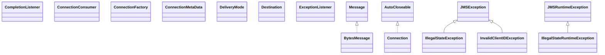

# geronimo-jms_2.0_spec-1.0-alpha-2.jar

[Group index](README.md) | [All archives](../README.md)

## Scope and provenance

- **Donor:** `SQX_145_REFERENCE_ROOT/internal/libs/geronimo-jms_2.0_spec-1.0-alpha-2.jar`.
- **SHA-256:** `62a109edef3de718b0cb600bf040b4be5e32c683a57ee16f9f8a89537bf5da51`; accessed 2026-10-06; captured `2026-10-06T18:54:51.906614+00:00`.
- **Classes:** 81 raw entries; 81 unique entry names. Duplicate occurrence indices are zero-based.
- **Inspection:** read-only ZIP hashing and class-file structural parsing; signatures/descriptors, modifiers, hierarchy and references only. Bytecode bodies are hashed, not published.
- **Allocation:** proposed `FEAT-COMPUTE-GERONIMO-JMS`, P14; [roadmap](../../sqx-full-application-roadmap.md). Domain README registration remains required.
- **Repository:** `01067f00031428613c6394064ca1bcadc1ba00ee`; review state unreviewed. Download label 145-dev1; installed build/activation and runtime equivalence unverified.
- **Limit:** every class/member is inventoried; declaration coverage does not establish consumed calls, defaults, formulas, failure semantics or algorithm parity.
- **Archive/resource index:** [030.json](../../../evidence/sqx145/archives/145/030.json).

## Complete member declarations

Member shards contain exact JVM names/descriptors, access flags, generic signatures, throws types, declared fields/methods, superclass/interfaces and referenced class names. All classes, nested/synthetic members and overloads are retained. Code length/hash is structural evidence, not a normalized algorithm comparison.

- [001.json](../../../evidence/sqx145/members/030/001.json) — SHA-256 `b7e6da74598e47eb5a986cebbc65415e4124308146d7b4d6767908c77f77cb30`.
- [002.json](../../../evidence/sqx145/members/030/002.json) — SHA-256 `8612288bc910f9d628a509ff9bfb5f2920e951d4aceb68aea5afc25022198925`.

## Focused structural diagram

Up to twelve non-nested classes; arrows show declared inheritance/interfaces only. External type names are not evidence of an available body or an executed dependency.

## Class inventory

| Archive entry | Occurrence | Class SHA-256 | Fields | Methods |
| --- | ---: | --- | ---: | ---: |
| `javax/jms/BytesMessage.class` | 0 | `5cfbbb0b27e3a2937770e64771808e11924091981a0a39b7e14b55e0a89f5dbe` | 0 | 27 |
| `javax/jms/CompletionListener.class` | 0 | `a69baad66265756fdf42cde2f65a42f6109b9230428efa8f81382218b33cb488` | 0 | 2 |
| `javax/jms/Connection.class` | 0 | `a8936d2fb19c3606573fb4c0e34ae16d58130ca3156c385d13ecb39620c4263b` | 0 | 15 |
| `javax/jms/ConnectionConsumer.class` | 0 | `91de003b2903ca276d304d38180a08b60f8075910ccd01b9d2abe6105280a743` | 0 | 2 |
| `javax/jms/ConnectionFactory.class` | 0 | `d81d99164a0eb04f05900d0e6c3939ec87016a45e998b8978594fee08a3606fd` | 0 | 6 |
| `javax/jms/ConnectionMetaData.class` | 0 | `292b2391eb6f98bb2ca9bdda56823609214897c1deac460b67e315c9c7c607f3` | 0 | 8 |
| `javax/jms/DeliveryMode.class` | 0 | `9ad14ea52d5e608260cf2ac1412de1333f8347805397893d55e3b62c461938c7` | 2 | 0 |
| `javax/jms/Destination.class` | 0 | `6d1f48ef41a8b0b7784871fcb71c2329f204dbf49b1906aa6895a1fb6e39f99b` | 0 | 0 |
| `javax/jms/ExceptionListener.class` | 0 | `9c41c65ba9b41c4f9a622c4f786238e078d0cf777c591c2a93f4999663daae4a` | 0 | 1 |
| `javax/jms/IllegalStateException.class` | 0 | `63bc66cc16ccede6919979999ed34b6d5325beeb81eb2bd3de56d3bdefeb1893` | 0 | 2 |
| `javax/jms/IllegalStateRuntimeException.class` | 0 | `68fd575c9b16ecbcd428b53269e8baaacd08597b7ba08aeab0fdb920367fd3fc` | 0 | 3 |
| `javax/jms/InvalidClientIDException.class` | 0 | `78029820070881bbc68b0b668913c49ac4a42a8e3fc7e94b1d30125e13ff5e16` | 0 | 2 |
| `javax/jms/InvalidClientIDRuntimeException.class` | 0 | `0dbbc4a3a346d5f14f2d2f56be856373e7cb9622439a4c06aa6800dae745ce2b` | 0 | 3 |
| `javax/jms/InvalidDestinationException.class` | 0 | `6333ea9243c4ec41a47a0a4cbc474c79ae4a3215144b3e95d9720864c650d43b` | 0 | 2 |
| `javax/jms/InvalidDestinationRuntimeException.class` | 0 | `76a1f61e11862a078463588522d5a235d8119066368f6325680050357b3a8450` | 0 | 3 |
| `javax/jms/InvalidSelectorException.class` | 0 | `21107cf816828a5bf1897d3eff58cdbb949903c2422b2aec8aa381274db3c05c` | 0 | 2 |
| `javax/jms/InvalidSelectorRuntimeException.class` | 0 | `02ce79fc981552d3f9698275213c6cf873be7a128b16fd9118c6d7376cc0ca24` | 0 | 3 |
| `javax/jms/JMSConnectionFactory.class` | 0 | `bb2e21798afd876a8f6bbdb5e20f497e2b7bf0633fc61e4457f33a3f062184ac` | 0 | 1 |
| `javax/jms/JMSConnectionFactoryDefinition.class` | 0 | `d05f93f5dab57698eee9c4fa981add5c3d168c8503cb340b2aea1a40dd8eac6e` | 0 | 12 |
| `javax/jms/JMSConnectionFactoryDefinitions.class` | 0 | `9a29bb22df59fef52a30ea73ff8fbe2878942c274340744ac07120639a41740f` | 0 | 1 |
| `javax/jms/JMSConsumer.class` | 0 | `faaed98ad12827b27e986c7317728550833093f27684ff7503daa8dbda2809e8` | 0 | 10 |
| `javax/jms/JMSContext.class` | 0 | `12365ed232d3c237886063b982fe310a6e04f0366e285884bc255703bfa76868` | 4 | 42 |
| `javax/jms/JMSDestinationDefinition.class` | 0 | `9707875a719d8971430a85334184d39dce5ac2faced56b1e482ac02ec6ea5d24` | 0 | 7 |
| `javax/jms/JMSDestinationDefinitions.class` | 0 | `0656c8a2ed58828238905c751aca6abcef81b4a199313468c825513976303f07` | 0 | 1 |
| `javax/jms/JMSException.class` | 0 | `a2c92998fb3822f29b46377ab24e2c72b18d61b33bad5c0766cf26d7ac69ab8a` | 2 | 5 |
| `javax/jms/JMSPasswordCredential.class` | 0 | `156469415943c04ac636a8a5eca677a756ec08082f6e8e4ece1183f82adf53db` | 0 | 2 |
| `javax/jms/JMSProducer.class` | 0 | `ae1913cd0ddccebdda1f6de7df8ccd95fc725991f97f46e43a2c6696193741c2` | 0 | 48 |
| `javax/jms/JMSRuntimeException.class` | 0 | `9c6ce0a57f4b240e9871bad31991b0513814e46f0341bc6fe4183f6756a7d249` | 1 | 4 |
| `javax/jms/JMSSecurityException.class` | 0 | `902e9bae1907db3b0fc229d075f155d362e436cc0ed948c08cd6eaca11b9b586` | 0 | 2 |
| `javax/jms/JMSSecurityRuntimeException.class` | 0 | `f345a3bab48d29085a1e34f8a744b60c5e9334dc7214b0cfe1f62d8a69080316` | 0 | 3 |
| `javax/jms/JMSSessionMode.class` | 0 | `7e9d5ddec8b0a18c85aac3a6776d8e4739944c60d8c63231d80a559f35d4fed5` | 0 | 1 |
| `javax/jms/MapMessage.class` | 0 | `a2f727916894500044f34b21db4b601ece7e547356bbaad65f6aa6d63d092656` | 0 | 25 |
| `javax/jms/Message.class` | 0 | `0f9ada6c6e26b2d638d6cc0d5a33a4e5f85eac59f9ff35ab3498b5ee3ed81af0` | 4 | 49 |
| `javax/jms/MessageConsumer.class` | 0 | `d9e3d53b357d138dc5a5d39a9a87a1eac3efa14994bfe01fbdb261ad56e491b2` | 0 | 7 |
| `javax/jms/MessageEOFException.class` | 0 | `579fe07f321050fb863ea272e329a3b258fe31f2f5356bc1969b50b62e02472a` | 0 | 2 |
| `javax/jms/MessageFormatException.class` | 0 | `6e53c7b947a82515bc2763cd7311d106723ee7e2df4d027fa1d08fde0c3a7348` | 0 | 2 |
| `javax/jms/MessageFormatRuntimeException.class` | 0 | `3c50d5af9ab9e1f21ac601d37b48d4bc0c4ff90c30341b8663e1ea5f19255b89` | 0 | 3 |
| `javax/jms/MessageListener.class` | 0 | `f8264e4ba02805ef5d64b8e385e9f4e6ac62539db69673fdb8fab70b8c0c9862` | 0 | 1 |
| `javax/jms/MessageNotReadableException.class` | 0 | `66a7619da4f62f320b996cf74172fde7361ab92ea4da3a13e9a66e3c18fe0ca3` | 0 | 2 |
| `javax/jms/MessageNotWriteableException.class` | 0 | `064095d7582391c552f924e854ad8a163a65dd3befbf3fbab4220281c3d3978f` | 0 | 2 |
| `javax/jms/MessageNotWriteableRuntimeException.class` | 0 | `78caf5c60260dcefb01ab23072e6c3c22b3e09f4d0ff222f57f3ca66cc7911ae` | 0 | 3 |
| `javax/jms/MessageProducer.class` | 0 | `8e4ea3e7e60a35e1af5e88808938024c3fd2a5129eb0fcf427c6b80ff05f4950` | 0 | 22 |
| `javax/jms/ObjectMessage.class` | 0 | `7a341ed7459c0212f5d5b4e69a7df0e647fcab4434867471e6514de4633c372b` | 0 | 2 |
| `javax/jms/Queue.class` | 0 | `372a559f18ecb81a582901e53328c59e74a9d2d572d85a272bf79d181d19b899` | 0 | 2 |
| `javax/jms/QueueBrowser.class` | 0 | `767be803ed4a26c6d3305632101759854d8ee67ba17744255bab9546f8f1eb4e` | 0 | 4 |
| `javax/jms/QueueConnection.class` | 0 | `c31c4bfd62ddd798191db5b618760455ca2704874c393193a06fabad9da4237d` | 0 | 2 |
| `javax/jms/QueueConnectionFactory.class` | 0 | `862c2a68cb2ff53e9525a7bb76a74a3d37300cffba2de4aa07fc92ff58cb2239` | 0 | 2 |
| `javax/jms/QueueReceiver.class` | 0 | `ef34ae0f231f2d005dd0d5da78886b8aeeb215298ef74e3ed55e5b94e0c77219` | 0 | 1 |
| `javax/jms/QueueRequestor.class` | 0 | `2a510abc562f43135d6bea170ab5ca53cf5a6e7690b1e15e740344a08f5896c2` | 4 | 11 |
| `javax/jms/QueueSender.class` | 0 | `aa349ff599f9ac30a12d5b045d10e63d4bf0444c7b82b8f5b77e6a02672a9ede` | 0 | 5 |
| `javax/jms/QueueSession.class` | 0 | `a00c8ac9c05c56a2ad141c714974631371a57ec29492c525d7ecce5f9af22a89` | 0 | 7 |
| `javax/jms/ResourceAllocationException.class` | 0 | `e356d54181bc7eb475ccd2d856ad01112ac9f7590fa047fb3f960ac60e0f5aa9` | 0 | 2 |
| `javax/jms/ResourceAllocationRuntimeException.class` | 0 | `d656a92faec7953d5993329060aed03632db20e3e22c2b84053bcace62e2e443` | 0 | 3 |
| `javax/jms/ServerSession.class` | 0 | `d7e804c3e6c974c08c168f60000a411f020266643ffd6787f430184aaa939c71` | 0 | 2 |
| `javax/jms/ServerSessionPool.class` | 0 | `d98a0cc4921c0511217a572ee4502a0d2232380aefbd3f5a2139e44acc8b2ac0` | 0 | 1 |
| `javax/jms/Session.class` | 0 | `959afee176a91cd98e4f435a0b3d0a46040d7e3ff1f1d8da2a05f7fbde48a32b` | 4 | 36 |
| `javax/jms/StreamMessage.class` | 0 | `d229793a66cb0372b9c49beeb6fa3f7568525b940e94cfdd708797e24728377c` | 0 | 24 |
| `javax/jms/TemporaryQueue.class` | 0 | `079a3743a5fc35d86956cf4a23d7fc08b003f56786bcc672fad2f9f7e384f5ab` | 0 | 1 |
| `javax/jms/TemporaryTopic.class` | 0 | `c17b761e1a03c250c9f2c298417e7b30d7540220115c6dd4f400e7a5647f039c` | 0 | 1 |
| `javax/jms/TextMessage.class` | 0 | `6c1e9412f2fa887eba8d220d29285810bd6476184dad60aae038b53bf680eb13` | 0 | 2 |
| `javax/jms/Topic.class` | 0 | `00f18ed72fc8ed313c9f4b4a9f005f4c86eae51427606101ba501c0c7e3f8084` | 0 | 2 |
| `javax/jms/TopicConnection.class` | 0 | `6a67e897b066f8cb383f47813a27613bd0854dafb4fe96ac204139088494d577` | 0 | 3 |
| `javax/jms/TopicConnectionFactory.class` | 0 | `8b589aa349e4318359253563b66b10918bd2950bba793a8c5003ec3d3a4a86a3` | 0 | 2 |
| `javax/jms/TopicPublisher.class` | 0 | `1175ba63668e45be41e0e2e6d06fbaa956478455fcaf61b9dec86b9a28ff530a` | 0 | 5 |
| `javax/jms/TopicRequestor.class` | 0 | `40c39a541fec6f2950fb7ca00654ad2ff8fb9679b3997f89b435d52787dcd807` | 5 | 13 |
| `javax/jms/TopicSession.class` | 0 | `ca7d94bde273e63ddcaa81cffd9ee5d5a36b5a4dc08e6a84ef88fc6309d22cb6` | 0 | 8 |
| `javax/jms/TopicSubscriber.class` | 0 | `0a358abc1109f8fa2f57b00a046b0f4f2f217dcb73cc56a1626b45e4f77518bc` | 0 | 2 |
| `javax/jms/TransactionInProgressException.class` | 0 | `abab78f98caf0f792e37efa882647a46938627b52b22e1e0c4ed907571a8ddf7` | 0 | 2 |
| `javax/jms/TransactionInProgressRuntimeException.class` | 0 | `11aeaf405caa2bcb0a56d561b45b84093699586bcdac101b510ba754e9c12a69` | 0 | 3 |
| `javax/jms/TransactionRolledBackException.class` | 0 | `251ef88bb108617a4e2aea80ea04b4984b750e6d78076eec5b1412cf43fbd8d9` | 0 | 2 |
| `javax/jms/TransactionRolledBackRuntimeException.class` | 0 | `af04a057718b47eaac023e3ad16f608d4d0217aa3178dff84d8a08332a939860` | 0 | 3 |
| `javax/jms/XAConnection.class` | 0 | `42a835780ff17abce88ddcb75caef9e521d855ca03fce883b98c30206bd9630b` | 0 | 2 |
| `javax/jms/XAConnectionFactory.class` | 0 | `e99c5c67e3691d2aea57b55e166b84ec8374e28b705e6e9730d9ab62816ec23e` | 0 | 4 |
| `javax/jms/XAJMSContext.class` | 0 | `264309ba4262605608dec9f861e7a58eed18be4eafbcb5c2e278f5f7292c56ab` | 0 | 5 |
| `javax/jms/XAQueueConnection.class` | 0 | `b5f31e84fc20901c907bf215ed71efb02a2134b569925cebfba59547fc6abea4` | 0 | 2 |
| `javax/jms/XAQueueConnectionFactory.class` | 0 | `05bb8034b2910384901b60a0eb52226d043923114fe7bef9521d923feec1ad54` | 0 | 2 |
| `javax/jms/XAQueueSession.class` | 0 | `2517fcda76af31ec109587520bf6f53745094fdff2261b3b0aad25bea97ddaa4` | 0 | 1 |
| `javax/jms/XASession.class` | 0 | `c98761a256eadf373994b3d774d4b5ac35f5a7cd0a1a4c70a8f40cddb3fee9fd` | 0 | 5 |
| `javax/jms/XATopicConnection.class` | 0 | `ded4f4bf957408710a8a9fc0177e06d0be6efe525baa230bdd04393fd3706108` | 0 | 2 |
| `javax/jms/XATopicConnectionFactory.class` | 0 | `8af18d750bef38d56947abd6490988c9d4e4dcad6c1d169e947f66f3abe09c74` | 0 | 2 |
| `javax/jms/XATopicSession.class` | 0 | `1abe6c6662a9917228d7d1ede9847b55e5267a344b40ed8099d8b83cf34f52c5` | 0 | 1 |
