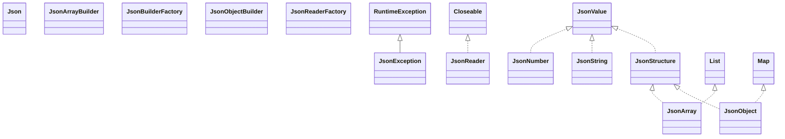

# geronimo-json_1.0_spec-1.0-alpha-1.jar

[Group index](README.md) | [All archives](../README.md)

## Scope and provenance

- **Donor:** `SQX_145_REFERENCE_ROOT/internal/libs/geronimo-json_1.0_spec-1.0-alpha-1.jar`.
- **SHA-256:** `9ad66832295ebfb21e168f29e9411924e13e233ee2ddc61b9a9b09a3f18dc183`; accessed 2026-10-06; captured `2026-10-06T18:54:51.906614+00:00`.
- **Classes:** 29 raw entries; 29 unique entry names. Duplicate occurrence indices are zero-based.
- **Inspection:** read-only ZIP hashing and class-file structural parsing; signatures/descriptors, modifiers, hierarchy and references only. Bytecode bodies are hashed, not published.
- **Allocation:** proposed `FEAT-HOST-GERONIMO-JSON`, P02; [roadmap](../../sqx-full-application-roadmap.md). Domain README registration remains required.
- **Repository:** `01067f00031428613c6394064ca1bcadc1ba00ee`; review state unreviewed. Download label 145-dev1; installed build/activation and runtime equivalence unverified.
- **Limit:** every class/member is inventoried; declaration coverage does not establish consumed calls, defaults, formulas, failure semantics or algorithm parity.
- **Archive/resource index:** [031.json](../../../evidence/sqx145/archives/145/031.json).

## Complete member declarations

Member shards contain exact JVM names/descriptors, access flags, generic signatures, throws types, declared fields/methods, superclass/interfaces and referenced class names. All classes, nested/synthetic members and overloads are retained. Code length/hash is structural evidence, not a normalized algorithm comparison.

- [001.json](../../../evidence/sqx145/members/031/001.json) — SHA-256 `07ba1678d689d35809ad9c786cc8354c2befcd822dbc25a9383236fe8a6951e2`.

## Focused structural diagram

Up to twelve non-nested classes; arrows show declared inheritance/interfaces only. External type names are not evidence of an available body or an executed dependency.

## Class inventory

| Archive entry | Occurrence | Class SHA-256 | Fields | Methods |
| --- | ---: | --- | ---: | ---: |
| `javax/json/Json.class` | 0 | `3f2213831b862e6bff355b52c0ea85bcd47a4b6b3d1b0d3d0a1f9e95155a0cc4` | 0 | 16 |
| `javax/json/JsonArray.class` | 0 | `e72aa6ad17c01d5fd90a27eca10b67d86c6899645a8136e7f11735a3fb90f547` | 0 | 12 |
| `javax/json/JsonArrayBuilder.class` | 0 | `0ac828e957806d443d5a5903cb1419c90d2b316a41f74e2d5a3db5b71f4ad8a1` | 0 | 12 |
| `javax/json/JsonBuilderFactory.class` | 0 | `a6f9866a61969fc924031da9feb70c832a4ab8c63ccde3a081249513fcc5f879` | 0 | 3 |
| `javax/json/JsonException.class` | 0 | `0193b03f899d0a4490d62c39e21726e616d3c58c0ee36e204852dc5c833b30ae` | 0 | 2 |
| `javax/json/JsonNumber.class` | 0 | `d919af773eaf24ef4351ac344aa6209a38b805561dec398acfc46a3302afe3fb` | 0 | 12 |
| `javax/json/JsonObject.class` | 0 | `ff076a3cc8134348843732ad6e559196bbcfebfbf53e7731de7e3a18fcd67b8b` | 0 | 11 |
| `javax/json/JsonObjectBuilder.class` | 0 | `d81230cb3efd3b2840ec25d6574a1d76d1eeefb573f5658486d75184cc45b1b2` | 0 | 12 |
| `javax/json/JsonReader.class` | 0 | `1f8b8cb1cdfc60699e6264b682b785d788b098e35123e45d3e2d112a9ad1ffad` | 0 | 4 |
| `javax/json/JsonReaderFactory.class` | 0 | `f1fe13c65aee37c7bd8c20119e54f792fd8bee427f4e5a286a9de30a13a96b63` | 0 | 4 |
| `javax/json/JsonString.class` | 0 | `a722e66f534e82429585b815fe2306914e877610a25a86e66002706470fee291` | 0 | 4 |
| `javax/json/JsonStructure.class` | 0 | `f358dc5ce66567fde3460399486a77fccf09b1f1467ea4d506515d89820b4014` | 0 | 0 |
| `javax/json/JsonValue$1.class` | 0 | `b9a5b2bd27fb4553fbd2f7f127efc904c4b7a539e763913b5e01cf5ed13cb0b3` | 0 | 5 |
| `javax/json/JsonValue$2.class` | 0 | `95e6596974f027cca31b9664d49607eb40628d25c9d4b52b46830b5558ea7ac6` | 0 | 5 |
| `javax/json/JsonValue$3.class` | 0 | `9798c06cbfb8e730ea9bfb974e49d329fb673552397913f37c1e664b84af55b6` | 0 | 5 |
| `javax/json/JsonValue$ValueType.class` | 0 | `34082c70069c095348233e71760d03272519f5ce8c3a8e9aa85603624d0c517a` | 8 | 4 |
| `javax/json/JsonValue.class` | 0 | `d1eb2a110bf9252689dc32b3db705b3da70fd0de1bc7b1302fbfe30b23e85e24` | 3 | 3 |
| `javax/json/JsonWriter.class` | 0 | `42abfa03c9abb036a4f091f4ea6ec7463343b296b48bfac4317c72bfbacdf0c3` | 0 | 4 |
| `javax/json/JsonWriterFactory.class` | 0 | `b6e568fa4bd1d2a76996bce18e95c9abb65187aaee231ffe4aa2dd410ce46614` | 0 | 4 |
| `javax/json/spi/JsonProvider$1.class` | 0 | `79e19127d45c62459384b5b72d6779453118c97c96056829d3b695f3165db0d8` | 0 | 3 |
| `javax/json/spi/JsonProvider.class` | 0 | `4befbd6cd481b1331e65bd968a7b00a27106e3ddafea85169cc80a4e65da709d` | 1 | 19 |
| `javax/json/stream/JsonGenerationException.class` | 0 | `348a4e56b601a6bc2bf83552677c3dab382a2a5f9ba398bbf3c3980db039ab2c` | 0 | 2 |
| `javax/json/stream/JsonGenerator.class` | 0 | `e982346e1080861037927426e1a4f5b9019c1447a2b2188a5ec00be78abff7fb` | 1 | 25 |
| `javax/json/stream/JsonGeneratorFactory.class` | 0 | `936b1ff37ab29eb7a9d36af98f2db6fbf55a87ab6508f0baa3b16e5402f9c0cd` | 0 | 4 |
| `javax/json/stream/JsonLocation.class` | 0 | `810d50d171765ce4b9ff9fcff06dab26724075d6e252c63874b8600955aebc34` | 0 | 3 |
| `javax/json/stream/JsonParser$Event.class` | 0 | `01207e72603271a3d542bc674001c2fcd56668383fc72504561cdcb05a5e72da` | 11 | 4 |
| `javax/json/stream/JsonParser.class` | 0 | `d09964b4e9f5b3676202cfaf7b6a098aacfc21f5f78e413cfa19e14e038068c2` | 0 | 9 |
| `javax/json/stream/JsonParserFactory.class` | 0 | `2212a853f8c446d3a260f2bb8d26d6fee876ac26eb433b0c6bdbacff2a511635` | 0 | 6 |
| `javax/json/stream/JsonParsingException.class` | 0 | `8c3d3dec92eebc8c758890eacedf907b66a48625200840f32c605ea8421ee9da` | 1 | 3 |
