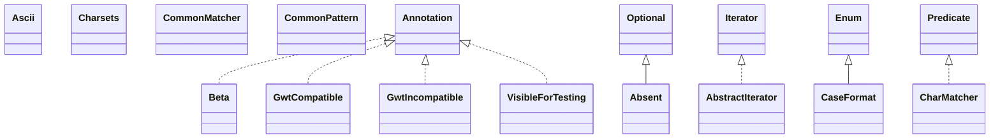

# guava-26.0-jre.jar

[Group index](README.md) | [All archives](../README.md)

## Scope and provenance

- **Donor:** `SQX_145_REFERENCE_ROOT/internal/libs/guava-26.0-jre.jar`.
- **SHA-256:** `a0e9cabad665bc20bcd2b01f108e5fc03f756e13aea80abaadb9f407033bea2c`; accessed 2026-10-06; captured `2026-10-06T18:54:51.906614+00:00`.
- **Classes:** 1951 raw entries; 1951 unique entry names. Duplicate occurrence indices are zero-based.
- **Inspection:** read-only ZIP hashing and class-file structural parsing; signatures/descriptors, modifiers, hierarchy and references only. Bytecode bodies are hashed, not published.
- **Allocation:** proposed `FEAT-HOST-GUAVA`, P01; [roadmap](../../sqx-full-application-roadmap.md). Domain README registration remains required.
- **Repository:** `01067f00031428613c6394064ca1bcadc1ba00ee`; review state unreviewed. Download label 145-dev1; installed build/activation and runtime equivalence unverified.
- **Limit:** every class/member is inventoried; declaration coverage does not establish consumed calls, defaults, formulas, failure semantics or algorithm parity.
- **Archive/resource index:** [032.json](../../../evidence/sqx145/archives/145/032.json).

## Complete member declarations

Member shards contain exact JVM names/descriptors, access flags, generic signatures, throws types, declared fields/methods, superclass/interfaces and referenced class names. All classes, nested/synthetic members and overloads are retained. Code length/hash is structural evidence, not a normalized algorithm comparison.

- [001.json](../../../evidence/sqx145/members/032/001.json) — SHA-256 `9d014c9b52dc19b572cc16bd212166cb8a96dae0697d1e4d3df6a509db590719`.
- [002.json](../../../evidence/sqx145/members/032/002.json) — SHA-256 `5706dfd31c16dbc23da3bd4ab727609999caefa331737bbefac4adfef921f47b`.
- [003.json](../../../evidence/sqx145/members/032/003.json) — SHA-256 `8e12a57cf0a7a5adf7b791369d855281713226940dbfd1852f27308a026867e2`.
- [004.json](../../../evidence/sqx145/members/032/004.json) — SHA-256 `3d71c5e7b40df65dbb0df4b4ab79b7da90808718e419512b8dc1dd5feb7282fb`.
- [005.json](../../../evidence/sqx145/members/032/005.json) — SHA-256 `26b29ffd25d0c7994bf144a7a347cace4c44b4bacfd865d6cfe1f38234502e9d`.
- [006.json](../../../evidence/sqx145/members/032/006.json) — SHA-256 `b1c796791a4bd01cabc7a6e77040fa335a7bb5d50c46d6a955f4670c4ba2649d`.
- [007.json](../../../evidence/sqx145/members/032/007.json) — SHA-256 `ea6e68f6e7f74bc2f91943a639b3dd8e182fb31a001ebbeb1d4959755a99b3c8`.
- [008.json](../../../evidence/sqx145/members/032/008.json) — SHA-256 `340d26bd269ca47b5cce3bba43c03f15b9c94bea5ca928db75c07789e5be72d6`.
- [009.json](../../../evidence/sqx145/members/032/009.json) — SHA-256 `e1891de0a64b725b141ba78f3a9f80ec9450ed4e13fa3ffead98abf1f4334d81`.
- [010.json](../../../evidence/sqx145/members/032/010.json) — SHA-256 `1329968959bcf33f0954a631703ba9826084658dbaf1b6a88b3b1104081d5ae5`.
- [011.json](../../../evidence/sqx145/members/032/011.json) — SHA-256 `e587d8a87f105e64c1e09e91a5c8288c3294919344c94cc77572881299a4ad91`.
- [012.json](../../../evidence/sqx145/members/032/012.json) — SHA-256 `023b29ab9673be2030c2c33bf168fbd0d4e267a9a8b52efdd9b7211fb6218c6d`.
- [013.json](../../../evidence/sqx145/members/032/013.json) — SHA-256 `c1c043013a12aa26d410b8409229b767f6f72812dd6f11a9323537962c660d88`.
- [014.json](../../../evidence/sqx145/members/032/014.json) — SHA-256 `03dfe429a28f00d9544205f3eb668b0cd2ee0e6772679e67c6e27a7b2d632066`.
- [015.json](../../../evidence/sqx145/members/032/015.json) — SHA-256 `a88b88f2d6eaf9f556ee9970658628c66508424ba4bc26f5f62828453a9b2b2d`.
- [016.json](../../../evidence/sqx145/members/032/016.json) — SHA-256 `aeb41a602e786c7eb5345126a968dea3b3ba556ee310889d32e5c8296c8765b5`.
- [017.json](../../../evidence/sqx145/members/032/017.json) — SHA-256 `8b68d6363257fd234270e48cab5b64ed50bc67c4cbae19b3f45a3d513e89228f`.
- [018.json](../../../evidence/sqx145/members/032/018.json) — SHA-256 `36c2215cc57852d23d65e9d6006d043b39c6b922a0a5e2d70aabcce2683123d0`.
- [019.json](../../../evidence/sqx145/members/032/019.json) — SHA-256 `cf036a11d59b26321647dbd7e6a7f7b13fa2b305ca39d1185af5707274ead238`.
- [020.json](../../../evidence/sqx145/members/032/020.json) — SHA-256 `4ba7095536f47a8712b4b42e04df79d117c052eaa10da99dd34875d4a454497d`.
- [021.json](../../../evidence/sqx145/members/032/021.json) — SHA-256 `1ca9a006e55fded9d29205a03fdb80e6a69aea292da20cbe244cc16e96cdcc09`.
- [022.json](../../../evidence/sqx145/members/032/022.json) — SHA-256 `b9471a05694e861213d2a690bd9986a16257603c3de2bd2db82b715fbb1bf585`.
- [023.json](../../../evidence/sqx145/members/032/023.json) — SHA-256 `41267b3a3ad6e3f4bd2925b64eece4e7fffba8015f07b41e9e777d373c817cc6`.
- [024.json](../../../evidence/sqx145/members/032/024.json) — SHA-256 `d564be7313833e5bde769030d488e535959d805263fb1a2e9b135b3907c8d9dd`.
- [025.json](../../../evidence/sqx145/members/032/025.json) — SHA-256 `712520bebc6eaad00deb8f094a7d945c4cce11a929040906095cbafa18115a7b`.

## Focused structural diagram

Up to twelve non-nested classes; arrows show declared inheritance/interfaces only. External type names are not evidence of an available body or an executed dependency.

## Class inventory

| Archive entry | Occurrence | Class SHA-256 | Fields | Methods |
| --- | ---: | --- | ---: | ---: |
| `com/google/common/annotations/Beta.class` | 0 | `f9af3b23355adb9cd64031476f93eaf7c2f4da7f669289734f371a9d445671e9` | 0 | 0 |
| `com/google/common/annotations/GwtCompatible.class` | 0 | `fc31bd53be45345a4910c4d4b94cca7b0fa732e8e81329a0f3e975bf9c80e38c` | 0 | 2 |
| `com/google/common/annotations/GwtIncompatible.class` | 0 | `1d39f39d51809699519bf5aee9b88c7841eaaff3b53e48be2ed692ceb186372b` | 0 | 1 |
| `com/google/common/annotations/VisibleForTesting.class` | 0 | `8bfd0062fe92e5351e8cd99806e644e68b5f553535c608009e244e7c59a13147` | 0 | 0 |
| `com/google/common/base/Absent.class` | 0 | `0675d0a385da428f35b030064abf82e639d8b0222e4d438d0da36a7aa5466f77` | 2 | 15 |
| `com/google/common/base/AbstractIterator$1.class` | 0 | `38b96c890430194745586bff3342d675909fd04103a5f04954c3e7bdb253087a` | 1 | 1 |
| `com/google/common/base/AbstractIterator$State.class` | 0 | `27156ee4ad7ba19e40ae0dfecb4cf885936871f08cfec7fcd18f56c863ec7487` | 5 | 4 |
| `com/google/common/base/AbstractIterator.class` | 0 | `69f2ab79226a58d7d59536505348dc1373c71a1c233669e667f7a83adf856117` | 2 | 7 |
| `com/google/common/base/Ascii.class` | 0 | `f3c3f71eeb3d1bf962e48ae676525ad262b3c21eae448ef93e6d368f67e1779b` | 41 | 12 |
| `com/google/common/base/CaseFormat$1.class` | 0 | `cbf29fc140ba55c90605ef887d08264b120930bec547159c01d54d198108cd92` | 0 | 3 |
| `com/google/common/base/CaseFormat$2.class` | 0 | `d2cf7cc03e605d46cbeb6b858957eec0b89c205e4f50533df564fb2010aa66d6` | 0 | 3 |
| `com/google/common/base/CaseFormat$3.class` | 0 | `3819004c2d6e3ff3e711875397faa52b72d78b8123e0a8f2973d6778dd0f6bb3` | 0 | 2 |
| `com/google/common/base/CaseFormat$4.class` | 0 | `92bc1e3a5bf5460c32e79bd844421ee62c39bc7d0643174d2ba895b21312cf5f` | 0 | 2 |
| `com/google/common/base/CaseFormat$5.class` | 0 | `37a19eba6bd45892272f7911724ed42db7a5737047e2eb3dfcb67939c8e5e829` | 0 | 3 |
| `com/google/common/base/CaseFormat$StringConverter.class` | 0 | `d757ae433f26de420e5443885c308499009bbe5aa1592a428cb661b72ad0093d` | 3 | 8 |
| `com/google/common/base/CaseFormat.class` | 0 | `a682f606ac6a54bf3857d43b595f396171974724f1bdbc5a8202e9f1093c42db` | 8 | 12 |
| `com/google/common/base/CharMatcher$1.class` | 0 | `b5a4f07710200ae8de7496df75ff70f498a6305c2f7851077e6c6c9cbe230d78` | 2 | 2 |
| `com/google/common/base/CharMatcher$And.class` | 0 | `7bdf55700e58f70bdab3e7ed1aec4e0542faf9c18fc8339a1e757f47885477e9` | 2 | 6 |
| `com/google/common/base/CharMatcher$Any.class` | 0 | `06e0b08155cc72c66f2f8c6a1e7a15a27654b8fe65d722b284b92c11d230c094` | 1 | 18 |
| `com/google/common/base/CharMatcher$AnyOf.class` | 0 | `5a92b6156ac4a91ef50803d788a9a634de9db4866beaf917741d486ee663ab72` | 1 | 6 |
| `com/google/common/base/CharMatcher$Ascii.class` | 0 | `e9e99b2225c47fbc4e975c0612772c68c231bf3104ed175c3cc75346d1ccf8d2` | 1 | 3 |
| `com/google/common/base/CharMatcher$BitSetMatcher.class` | 0 | `6ce3c9fb60b9c322426a7488d29e9d99a58b9a105b8bbca0ae63843ccd2dbc39` | 1 | 4 |
| `com/google/common/base/CharMatcher$BreakingWhitespace.class` | 0 | `89f71dbe8903315e7493d0c93b42a03bb231ccecd51afdb72e78d1512f50a8be` | 1 | 6 |
| `com/google/common/base/CharMatcher$Digit.class` | 0 | `e6d658ed79e11e8446c815b0100bf92d6a0cf23b0e5d76de07dd2325d51ae434` | 2 | 4 |
| `com/google/common/base/CharMatcher$FastMatcher.class` | 0 | `0ec0403c9e5ddc3c78a6c3166cecf202c2c6e65664270ed5f5a6dec9009cebc5` | 0 | 5 |
| `com/google/common/base/CharMatcher$ForPredicate.class` | 0 | `61c9a34a8cc1e61824163d05039c4ff437f220f3d4f650f238073ba1db8408e3` | 1 | 6 |
| `com/google/common/base/CharMatcher$InRange.class` | 0 | `c08aa16d7c0d472e2fb7dbcdd8365187cfdc0d9ae4676e38b7a51c644e764e49` | 2 | 4 |
| `com/google/common/base/CharMatcher$Invisible.class` | 0 | `7ad06303af7f24267ebe2c160fdd179b0464fb20f1870960d140245e50c5804e` | 3 | 2 |
| `com/google/common/base/CharMatcher$Is.class` | 0 | `df02286e17a1d7b0f3458f09ede315c34cd1cf0fc1862ff317836568af873645` | 1 | 9 |
| `com/google/common/base/CharMatcher$IsEither.class` | 0 | `2016b1d6b574c2e4c7db7a65817bd6e63926e489fc6bfb8c3bc15bcf9b8a04bc` | 2 | 4 |
| `com/google/common/base/CharMatcher$IsNot.class` | 0 | `a0aa566a20966f4775abb8cdb4ad63608e65f6831b29461c4ecd4424dd5dffe3` | 1 | 8 |
| `com/google/common/base/CharMatcher$JavaDigit.class` | 0 | `5ae4d427a13e4559392675477d8068308a36d81645879d26c3790e267e3e093b` | 1 | 6 |
| `com/google/common/base/CharMatcher$JavaIsoControl.class` | 0 | `46f2d27e5823063bc6e0a53e7458865a38af9cd3fc207c98d7b0a1b98304e6b9` | 1 | 3 |
| `com/google/common/base/CharMatcher$JavaLetter.class` | 0 | `ab477b9af5d0083dd7e0fb1401f8744ea54c32c686774106d6d0acdc9407af92` | 1 | 6 |
| `com/google/common/base/CharMatcher$JavaLetterOrDigit.class` | 0 | `339f07d7ea404260f31a7635a71e41a309d6baa604ce8124cc4cabbb8a314e7f` | 1 | 6 |
| `com/google/common/base/CharMatcher$JavaLowerCase.class` | 0 | `de430cb02341e4c4b4ae9124526fac1d48059b4d4725b4b84b1d0c240317b54a` | 1 | 6 |
| `com/google/common/base/CharMatcher$JavaUpperCase.class` | 0 | `85af0bc4ecc41207e413222f94b97e9f0273d370a2311c5f968bd69da6bf1ed4` | 1 | 6 |
| `com/google/common/base/CharMatcher$NamedFastMatcher.class` | 0 | `412b68597aeea5a18e06bceb781c0329c4b58b98633d547d355c30113c2f851e` | 1 | 2 |
| `com/google/common/base/CharMatcher$Negated.class` | 0 | `46a01ae61a1a665254593e17dc66e6dbb81bf4087387948e8f40e1db895e06b3` | 1 | 10 |
| `com/google/common/base/CharMatcher$NegatedFastMatcher.class` | 0 | `1d2766e5b7a38df29da721da4d923d334dbefe06f78089a56ba78d9dbc383475` | 0 | 2 |
| `com/google/common/base/CharMatcher$None.class` | 0 | `42e8749059307dfa5ede1d92c7ef58b95f3c25d549085e3f589a318a09295a50` | 1 | 20 |
| `com/google/common/base/CharMatcher$Or.class` | 0 | `225fcf916c37e0e9d59d036bfddaba2941169d3a8ad24acf39ee0ea625c29581` | 2 | 6 |
| `com/google/common/base/CharMatcher$RangesMatcher.class` | 0 | `3fc14ba3afe0776d754a98bde553d4cfee787a8f2acdf653de37badcb2ef4191` | 3 | 5 |
| `com/google/common/base/CharMatcher$SingleWidth.class` | 0 | `0a6494eeee174cc255090a0edfc6e17e9108d73a1eb7459109d62b7873c7799a` | 1 | 2 |
| `com/google/common/base/CharMatcher$Whitespace.class` | 0 | `a40834ffdb1e227d004384c0d234413e2ad821e9a3b338b64ce57afb1e5609d7` | 4 | 4 |
| `com/google/common/base/CharMatcher.class` | 0 | `0d8f168cb8ddea5384037ee63c78c68c32ba687d992a855fa42429bad2097f85` | 1 | 54 |
| `com/google/common/base/Charsets.class` | 0 | `76c172359cc7ac19a7fa245fc8cc6cc7cc1f168268fade696f4251819055bddb` | 6 | 2 |
| `com/google/common/base/CommonMatcher.class` | 0 | `dd63acdc28e1fedfd867456147f263348de6b489a9409ab433505adc4dd0c548` | 0 | 7 |
| `com/google/common/base/CommonPattern.class` | 0 | `fec74e9577fccf12a9247a7b3b282e04aa21dd8f04d0200ed4b0b9babdedd84a` | 0 | 7 |
| `com/google/common/base/Converter$1$1.class` | 0 | `2a1a23383c147ee73a66f41bc42180656b04ee5fe4044173becb404ee232e034` | 2 | 4 |
| `com/google/common/base/Converter$1.class` | 0 | `73eabd19ebbbc3ffd4d01b8b951eeba0ed2cb1ecf25cca2f8800a72a2eaa1ac2` | 2 | 2 |
| `com/google/common/base/Converter$ConverterComposition.class` | 0 | `e75ff37c8d67852865581cc00342febf1d64828fb7bc3784c53fae5d3bf4a6e3` | 3 | 8 |
| `com/google/common/base/Converter$FunctionBasedConverter.class` | 0 | `866561d95cf975b9ab56d4256eb4e8610cb9b32806d91ebfad63d8f6e4117be7` | 2 | 7 |
| `com/google/common/base/Converter$IdentityConverter.class` | 0 | `ef896df1ce2f231c767f702b20c1a53dace0c9e2384c269264575fc327900aef` | 2 | 9 |
| `com/google/common/base/Converter$ReverseConverter.class` | 0 | `24f23d1d0ef3d17429cd2e126c99331c328dffd5260074b58cef806d3b19c111` | 2 | 9 |
| `com/google/common/base/Converter.class` | 0 | `bc1ce785cc18e136bbc29194f4aaddcfec3f29ad758b7ca46d71e72338030ad3` | 2 | 15 |
| `com/google/common/base/Defaults.class` | 0 | `b998936b26de2faecce9297d9efe4ba275467042fddb2b5dc50c147a74a387d2` | 2 | 3 |
| `com/google/common/base/Enums$StringConverter.class` | 0 | `5c5dd26a3584716d42f3a74c56b9b44dc5d116b6f87e6815305f5b9d7678b3b3` | 2 | 8 |
| `com/google/common/base/Enums.class` | 0 | `e66ea616a1f03685354bc1beb0a046e1dca706bfd5a534f7e5506816935a4f10` | 1 | 7 |
| `com/google/common/base/Equivalence$1.class` | 0 | `9bdfcc7500b01eaf5e0dbc6df11444a9c4d29dfb4aacd1f0747c58f63302ca4f` | 0 | 0 |
| `com/google/common/base/Equivalence$Equals.class` | 0 | `b19aa97fe8d61b395e6f503669ca242025f305522b679f3573e6b3a832789602` | 2 | 5 |
| `com/google/common/base/Equivalence$EquivalentToPredicate.class` | 0 | `065e3ec6427460fc7c702f237fb1742621e1663c539397dc6779cade946fea8f` | 3 | 5 |
| `com/google/common/base/Equivalence$Identity.class` | 0 | `dd2a7f7136e8646175bb135eadb4e2cb708b4afdbbe69980512f39f19a1508fd` | 2 | 5 |
| `com/google/common/base/Equivalence$Wrapper.class` | 0 | `13529377fe0e83d03217e57912a429b162e8ba4e01e2079ab64a22f2e5aba27e` | 3 | 6 |
| `com/google/common/base/Equivalence.class` | 0 | `d38a19d2013e66d5af23c02ff204d87778eece56d9689954c5b48905ecceda5c` | 0 | 12 |
| `com/google/common/base/ExtraObjectsMethodsForWeb.class` | 0 | `3761e5b29ed15f9d809a0375e554f5ad32fda36ba71c1c97f0c9311820ebc27e` | 0 | 1 |
| `com/google/common/base/FinalizablePhantomReference.class` | 0 | `342120092cab50b2c68647907c81bb0afb1391db4eb176241de0dab4bf9b6d5a` | 0 | 1 |
| `com/google/common/base/FinalizableReference.class` | 0 | `93287ab474736c0f2e6b6c46da94bb7115f074594f48d71c31cc7d41a07fff0f` | 0 | 1 |
| `com/google/common/base/FinalizableReferenceQueue$DecoupledLoader.class` | 0 | `9300ad76b0d17b428e02d4e3f8fe64752f390c051664d487380b7b82d6a519d0` | 1 | 4 |
| `com/google/common/base/FinalizableReferenceQueue$DirectLoader.class` | 0 | `1c3cc8d68c6495e626d84994450c746a0e6d1b6cadf0b68a2d48b64e80490334` | 0 | 2 |
| `com/google/common/base/FinalizableReferenceQueue$FinalizerLoader.class` | 0 | `dbf5712e4762632d4fd89caaafbd16c5ad4579bf00cd88230d61d641c3dd1b62` | 0 | 1 |
| `com/google/common/base/FinalizableReferenceQueue$SystemLoader.class` | 0 | `dc4d172fedb13cb66d3a03852c9f4387cee35438d42e9e85654288a75cca12e4` | 1 | 2 |
| `com/google/common/base/FinalizableReferenceQueue.class` | 0 | `0b02e2486df42ef02582ae5ed068120ddd02c23c053387261982f9a4d126b6be` | 6 | 7 |
| `com/google/common/base/FinalizableSoftReference.class` | 0 | `e1336373d50a7de2667b8602d8700afecd04d4acc20287ddde48cf42ad045b41` | 0 | 1 |
| `com/google/common/base/FinalizableWeakReference.class` | 0 | `e7c735873f4de292acd21742f7e603ae857aaa77c6cbcb7cb0c7440f76749955` | 0 | 1 |
| `com/google/common/base/Function.class` | 0 | `ad34c5847ce585cd3bfde46a40e1a1f412d4e2c000793dcd608713787d0f7f1c` | 0 | 2 |
| `com/google/common/base/FunctionalEquivalence.class` | 0 | `502571f7354e32e9ed278e5872b58b906684cce948bc412a24b10f1afb5da6c7` | 3 | 6 |
| `com/google/common/base/Functions$1.class` | 0 | `24ae885407b18b98ae29bf29c0fc0f8457ca5c9ff4124c93824a7ac0b1101f65` | 0 | 0 |
| `com/google/common/base/Functions$ConstantFunction.class` | 0 | `ce3532e884bfd0125bdcdc717743e48fb9ba4db0b274ce8d1d3f7704c0c0c023` | 2 | 5 |
| `com/google/common/base/Functions$ForMapWithDefault.class` | 0 | `b12e2c9c4f80b8018c87bf6f552eb51bfa78f915daeb159fcddc1c528f2e85ed` | 3 | 5 |
| `com/google/common/base/Functions$FunctionComposition.class` | 0 | `f024b83a07e98a82698cae9d31519a1a297824172a3f89b9e69eaaf1ab087823` | 3 | 5 |
| `com/google/common/base/Functions$FunctionForMapNoDefault.class` | 0 | `a4ad724a9d7e346b7357ebabd1be8f85e305f5cdbb1f6df2807a3168ba28ea8f` | 2 | 5 |
| `com/google/common/base/Functions$IdentityFunction.class` | 0 | `8daa2c7c1f5b16f644b30d26912187098c9c4169de1b25238845a9ab7cf45c7c` | 2 | 6 |
| `com/google/common/base/Functions$PredicateFunction.class` | 0 | `b3a9521a609ea8066802458d32b2aae7f515bc85cb09b516396b383a4d7ae49f` | 2 | 7 |
| `com/google/common/base/Functions$SupplierFunction.class` | 0 | `24e53d567a9a38a0c65f8292ebcc5266322a33c465e4fe2f036b146b5e0ce7d2` | 2 | 6 |
| `com/google/common/base/Functions$ToStringFunction.class` | 0 | `a0cb7a71b0da7c902cdf8beca0c803441342e0d8d804715aa52dd45e2de8f3f3` | 2 | 7 |
| `com/google/common/base/Functions.class` | 0 | `a32c501925baabf00f2e50fda3ffd8dfbae3863618b5138b393d5972e403a853` | 0 | 9 |
| `com/google/common/base/JdkPattern$JdkMatcher.class` | 0 | `92b75163679ef3cddb837c20e03a3a207f0776f7a50c99df96eb41d766cb1f12` | 1 | 7 |
| `com/google/common/base/JdkPattern.class` | 0 | `77278cb445c5a6e108b27e839f6afab31c8e5f34ae4165169c8e118ba9d28dd5` | 2 | 5 |
| `com/google/common/base/Joiner$1.class` | 0 | `33ef5ba9ffd377b277db0aeba441721c5b75820c00dbff2842172113290860ba` | 2 | 4 |
| `com/google/common/base/Joiner$2.class` | 0 | `edd724fd8c9d149909a296ece97da2166ec9966194446007bcc31488351fc6d0` | 1 | 4 |
| `com/google/common/base/Joiner$3.class` | 0 | `53fa97b5dadf41e9cfd2ffde410f27bb8edbc438c4175d9d0f70add00aec7c15` | 3 | 3 |
| `com/google/common/base/Joiner$MapJoiner.class` | 0 | `626a275fde684bb00a30014aeb341d8d9ecc42424533323747f80b7f7fdccb7f` | 2 | 12 |
| `com/google/common/base/Joiner.class` | 0 | `13a9da676ea7424a9e7d88e1925c72bb4101d96f130bacf8b354ad9d273a1996` | 1 | 24 |
| `com/google/common/base/MoreObjects$1.class` | 0 | `e613de528ff8148a58d0111021158dc34543938fd7079c92dffa1807bfb87060` | 0 | 0 |
| `com/google/common/base/MoreObjects$ToStringHelper$ValueHolder.class` | 0 | `5038e50903c218a6ef6945f9ff74a5ee0446814d11015ac9b3370e75dced3216` | 3 | 2 |
| `com/google/common/base/MoreObjects$ToStringHelper.class` | 0 | `3fbe4128db38eb845808fd4e39728acb93c9de2caa24552586cdb2d224eec559` | 4 | 21 |
| `com/google/common/base/MoreObjects.class` | 0 | `7a58431080a6ab2b6445a5a99b888e74d8bd4d15ff52d68d875c2c3d0e27a6e3` | 0 | 5 |
| `com/google/common/base/Objects.class` | 0 | `b2eeb0516c0c5704d9fabac51b0b23785e423da7e87e5540029e4c9aae9db816` | 0 | 3 |
| `com/google/common/base/Optional$1$1.class` | 0 | `d8a14598d98b0621c624183454814c75be26c3b17f1df37e378c8665738508aa` | 2 | 2 |
| `com/google/common/base/Optional$1.class` | 0 | `362b2a450c967dc6ba315523d6a4b664851229eedae130e7bfdb7e9a82263f1b` | 1 | 2 |
| `com/google/common/base/Optional.class` | 0 | `0b1e3930aa706b26320ad0de855421b8839b75bb756a0c0761e22d13a7872257` | 1 | 19 |
| `com/google/common/base/PairwiseEquivalence.class` | 0 | `81c588bb0f92b88484330bfafd738d289a12d7c4ea547cd219c32743dea5965f` | 2 | 8 |
| `com/google/common/base/PatternCompiler.class` | 0 | `5bd9493e0c8e696efb92ff69b733f1880b77266485cc23a443570dd1f4dfd2f3` | 0 | 2 |
| `com/google/common/base/Platform$1.class` | 0 | `c2844192f721f0434af490171e432c0a80521df397353650061f0b87aa6959c9` | 0 | 0 |
| `com/google/common/base/Platform$JdkPatternCompiler.class` | 0 | `e6949d740b5b8cfcff2d6e709382a30f6fe29d2a96183a1ee5a9f8be34f3e094` | 0 | 4 |
| `com/google/common/base/Platform.class` | 0 | `dc795239c40f6ef42ce4154da703317846c1f0096a6ccfd0ecedd40037b508bf` | 2 | 13 |
| `com/google/common/base/Preconditions.class` | 0 | `48a749a7a08281c81bec845ecac82174ba67775e9a9f07e77d0edbeabd16e050` | 0 | 84 |
| `com/google/common/base/Predicate.class` | 0 | `daf9502323610aa4ad7ec04544a3afb48944fdc38d3c0488d05870c0b6410cc8` | 0 | 3 |
| `com/google/common/base/Predicates$1.class` | 0 | `01d45c7670e8f6e507ee2280f5a5557586cfb84df2e0bc906fb7d8ebadab4f2a` | 0 | 0 |
| `com/google/common/base/Predicates$AndPredicate.class` | 0 | `5eb577e95f9ff61f2b3c5fd551e8606a5645e7171e11ce22a84a6329ce224aa9` | 2 | 6 |
| `com/google/common/base/Predicates$CompositionPredicate.class` | 0 | `3e93db0e659ea02b8bda81145428867d5e79c71e4a6a1e02d8bcced6040d7177` | 3 | 6 |
| `com/google/common/base/Predicates$ContainsPatternFromStringPredicate.class` | 0 | `7ba963fbfdc6d7f338bf70501d908e20378b004b435caa89e8c3eb0ef797a56e` | 1 | 2 |
| `com/google/common/base/Predicates$ContainsPatternPredicate.class` | 0 | `342fa778418724a995c534631955e11a61741beabce2fefa62683c6337bed65f` | 2 | 6 |
| `com/google/common/base/Predicates$InPredicate.class` | 0 | `2ac15eecfdcba0f54e79b7b4021826789bd826023f868bc444df99e203d5ec8c` | 2 | 6 |
| `com/google/common/base/Predicates$InstanceOfPredicate.class` | 0 | `c8aa86342957562a75a6528853cd7b0f50a9467d5079ed3842e3a3780b612618` | 2 | 6 |
| `com/google/common/base/Predicates$IsEqualToPredicate.class` | 0 | `d39274fe28ff4d5a799481a6aa1a27b33c104984ccf44d6970c463e78f2df41a` | 2 | 6 |
| `com/google/common/base/Predicates$NotPredicate.class` | 0 | `1ccd09d904c829189dfc5a2368efa1d47801e88b918e3a175db23d10396092d3` | 2 | 5 |
| `com/google/common/base/Predicates$ObjectPredicate$1.class` | 0 | `638b76c2987fe2ed7ea7097ba7cbaf4a2a473dddf221bcd80dc9ad9ae4aefd9e` | 0 | 3 |
| `com/google/common/base/Predicates$ObjectPredicate$2.class` | 0 | `3b42c9704b5be60cbdcfa1d3ad8a27bde59cab29a00da37361ae425bceb745f3` | 0 | 3 |
| `com/google/common/base/Predicates$ObjectPredicate$3.class` | 0 | `893670891cf73259f9d3b3cd4ef3cf24d2319cc1481925049107b111a08ab0df` | 0 | 3 |
| `com/google/common/base/Predicates$ObjectPredicate$4.class` | 0 | `651e1814c27f283630123f020c6fd47e798516563dc358beec85f5013675ac97` | 0 | 3 |
| `com/google/common/base/Predicates$ObjectPredicate.class` | 0 | `20372515605ea123a5a733aa0762ff525b96deb93881fe1f59de1a3f864778cd` | 5 | 6 |
| `com/google/common/base/Predicates$OrPredicate.class` | 0 | `c3d681f7665d8f59fe1dcf5d3bcc25e39edb63a65acbcd5e38726db088eb729e` | 2 | 6 |
| `com/google/common/base/Predicates$SubtypeOfPredicate.class` | 0 | `4bb61e6a4f1929bbf2899eaf5aba8908ec4c32e86dad176b5e5f9e55623ad0e2` | 2 | 7 |
| `com/google/common/base/Predicates.class` | 0 | `7a945c4f4ce33544f6d07a308b191cf78cbafa02f2a080bfadab94170f3714b0` | 0 | 24 |
| `com/google/common/base/Present.class` | 0 | `a6d6a30030927a9f56928b821f8e2ec5826927fadc559532d6413915b82b73be` | 2 | 12 |
| `com/google/common/base/SmallCharMatcher.class` | 0 | `acc9c4a3da6447a8bd2e91526d2b520408ffebcfd14d263205d87d60ed3dc86c` | 7 | 7 |
| `com/google/common/base/Splitter$1$1.class` | 0 | `5f89cd09bc0bc3929e999cb4ffcea9d05f1f77439fd591399b84c42e8e6ea427` | 1 | 3 |
| `com/google/common/base/Splitter$1.class` | 0 | `a989c93782a0c0fd77c4209562cf95a79f652e78892e8bf43f6d2267f2eed024` | 1 | 3 |
| `com/google/common/base/Splitter$2$1.class` | 0 | `3f13a110354925886bd7ed5ed94df1be739d96d4d17d3c27d07dd1705e5615f4` | 1 | 3 |
| `com/google/common/base/Splitter$2.class` | 0 | `d26c53730ae6265d019b203ec09292cf6e24e480f427a1515e1829b425523273` | 1 | 3 |
| `com/google/common/base/Splitter$3$1.class` | 0 | `021dafc66c28965a7d3057594eb7eb6abaf8aaea3b6650dc3ed81dec2de8e516` | 2 | 3 |
| `com/google/common/base/Splitter$3.class` | 0 | `d840ce3c1ce1236e1fe59bd856e6e579b3650c42bfd2b4701b8b7dbc73a2ccf9` | 1 | 3 |
| `com/google/common/base/Splitter$4$1.class` | 0 | `a6ae727dbe158903155e67b15c9a0776793092cc28632141707dc1a0d2c839a8` | 1 | 3 |
| `com/google/common/base/Splitter$4.class` | 0 | `d940aac3d9c631770088c989ac856aff471e7f378e99722675ec2639c011fe1f` | 1 | 3 |
| `com/google/common/base/Splitter$5.class` | 0 | `82a636fd29f3eb35f3e18066e879eaa8d50f1e05e7e1717dc510e9083d6558e7` | 2 | 3 |
| `com/google/common/base/Splitter$MapSplitter.class` | 0 | `ff679192fbb00950350871d00034b98d89fdfdf19867cc66eb0b4533b817da38` | 3 | 3 |
| `com/google/common/base/Splitter$SplittingIterator.class` | 0 | `4a10a4f6df679477f30433e3dac7a9d903fe839cbb69db8b4a910056e2457e99` | 5 | 5 |
| `com/google/common/base/Splitter$Strategy.class` | 0 | `707260312bb6513405f1f1887a4a91a4b36d5b34c4490a32c9c85b9f65f49539` | 0 | 1 |
| `com/google/common/base/Splitter.class` | 0 | `27807cbe7d54449c8c59607913b36dd48593f8904a875d3824c63a944b196446` | 4 | 23 |
| `com/google/common/base/StandardSystemProperty.class` | 0 | `e6b4be47c42aeb0642f8053bd75d9e80d4dfcf33dc93ea301e686a397d863065` | 30 | 7 |
| `com/google/common/base/Stopwatch$1.class` | 0 | `3ba3fc90af468d3bb3cebd28c0830d5a03c104269c30a120644a3993f0711af0` | 1 | 1 |
| `com/google/common/base/Stopwatch.class` | 0 | `21e1b0913bde932df74375af989fe87797387fbc1f7c121bd1a165446d2429ea` | 4 | 16 |
| `com/google/common/base/Strings.class` | 0 | `0c24dce7d066420ea27d1951b01dcf3c564bc87c8bc6d8e7fd4f6bc61cd3bdd8` | 0 | 12 |
| `com/google/common/base/Supplier.class` | 0 | `8a601d8d9535ea956814154e7c41a1ef0029bab29f86b6455ff22ff37b98dbae` | 0 | 1 |
| `com/google/common/base/Suppliers$ExpiringMemoizingSupplier.class` | 0 | `e2d66b0c790c84f15deea92be76dcb64b19b24f867f92f999e685ac2864ca0c1` | 5 | 3 |
| `com/google/common/base/Suppliers$MemoizingSupplier.class` | 0 | `0aa6afa60f48434102296926cea6521468c69ae9be64e40bf56b72366bfdef7a` | 4 | 3 |
| `com/google/common/base/Suppliers$NonSerializableMemoizingSupplier.class` | 0 | `a659f32d0f9078faf85ba8e2e25b81f41085b7f1586d49f32ca35863195cf164` | 3 | 3 |
| `com/google/common/base/Suppliers$SupplierComposition.class` | 0 | `7b003b40a642e6b2ae89681651e1e6dd2e415581549bdb4e0d8502dbe2f1f68e` | 3 | 5 |
| `com/google/common/base/Suppliers$SupplierFunction.class` | 0 | `48f18ae235894189b7d807c98df541c593ce544175edfa740f81df96e2bb910b` | 0 | 0 |
| `com/google/common/base/Suppliers$SupplierFunctionImpl.class` | 0 | `27ddff78f3e3aed73c0c343ef81c463627f6e6a336777cd56dfff407d6e44979` | 2 | 7 |
| `com/google/common/base/Suppliers$SupplierOfInstance.class` | 0 | `1ae3f19014f24c7b6721a35d4cd39d7605e811c5161dff4a15c91fdbbefefa5e` | 2 | 5 |
| `com/google/common/base/Suppliers$ThreadSafeSupplier.class` | 0 | `7b16b213e36f9cae9a19de9e92128e7efe99719536db33d3eb279935fd83149f` | 2 | 3 |
| `com/google/common/base/Suppliers.class` | 0 | `054f079ddadf13211678a100b50a71fe2ebccb4ae14ac042d7b338bf7ace11b8` | 0 | 7 |
| `com/google/common/base/Throwables$1.class` | 0 | `e7c366201167965481f32b67fab350c8a853a41e505278b329e7a60726bb1962` | 1 | 4 |
| `com/google/common/base/Throwables.class` | 0 | `2613c714922681bcd94b81b4387818ed28f78d046ab9755e02652b350453f275` | 5 | 25 |
| `com/google/common/base/Ticker$1.class` | 0 | `1b9125ef9c5108255de2794d27ca783f4d6870a6b039c72d64447b522b8874f5` | 0 | 2 |
| `com/google/common/base/Ticker.class` | 0 | `cd4050254b26b5b2a4775d4f352e68238f9cd830b71e337dd74ff4b6d206c7fe` | 1 | 4 |
| `com/google/common/base/Utf8.class` | 0 | `3e41a83f00801742a3e03bddd4f4d997e52aee638f21cddcc75a577dfd7aec0a` | 0 | 7 |
| `com/google/common/base/Verify.class` | 0 | `789b1f93bdebe03ced440652db21f463832952997684229be2478dcb3c3da222` | 0 | 27 |
| `com/google/common/base/VerifyException.class` | 0 | `819009a46b677bc028903b00deaef675d358bc953aa50c846009c4a0383285e6` | 0 | 4 |
| `com/google/common/base/internal/Finalizer.class` | 0 | `326f523b020744715ba8470c0a68464f4703d632c394227f5084de92a26f3c6c` | 7 | 8 |
| `com/google/common/base/package-info.class` | 0 | `80782e376d874d5d7d59b06927eeba84b244df76d2ce3fed5a518235b35bfb3a` | 0 | 0 |
| `com/google/common/cache/AbstractCache$SimpleStatsCounter.class` | 0 | `fbf234d1f093e087595cad28c175c8343a695466c34c2ac43c6ec8c88e6d9ce1` | 6 | 8 |
| `com/google/common/cache/AbstractCache$StatsCounter.class` | 0 | `032b3e42febdc3e6fb8e67edf712e9f686c21b5451426934ed3464a3641b7bb7` | 0 | 6 |
| `com/google/common/cache/AbstractCache.class` | 0 | `66a87454a51f03133afd6d6574a063bbf5a55e3445a9cb0585ce30df503d105b` | 0 | 12 |
| `com/google/common/cache/AbstractLoadingCache.class` | 0 | `98305d9b9e01b85d2e0413802d0299212cf2fef344198819a87b5b6be3f5f849` | 0 | 5 |
| `com/google/common/cache/Cache.class` | 0 | `46dcee8a707b225478ccdbe1980626a277caa0ec9d420d0513acd6c6d57513f3` | 0 | 12 |
| `com/google/common/cache/CacheBuilder$1.class` | 0 | `f4ba534771f8d14aef75ad86001b2b5fc8cf1cdeedc93926313bb35ba4f0f7fd` | 0 | 7 |
| `com/google/common/cache/CacheBuilder$2.class` | 0 | `fea494c2ddf175f33c6c5c28d756862c557b37a356aa85ebf9f441fee3ef3262` | 0 | 3 |
| `com/google/common/cache/CacheBuilder$3.class` | 0 | `19354e7baab5851149b0283dc3686b0a89bfcb6d906affbcf32835ca2fc5eada` | 0 | 2 |
| `com/google/common/cache/CacheBuilder$NullListener.class` | 0 | `9710516f4c650df1843703be99093d6f2f26baadd890de2293bbeb16ad3c92aa` | 2 | 5 |
| `com/google/common/cache/CacheBuilder$OneWeigher.class` | 0 | `b5acf8e88dac3d1114c7d1d2727f3d15956e87280ab4a484526997c4cbae8e6f` | 2 | 5 |
| `com/google/common/cache/CacheBuilder.class` | 0 | `4a903f076f9ddace36a4e777c889a15fc24ca1acc5d5b9c8ed4a1956236b158b` | 26 | 47 |
| `com/google/common/cache/CacheBuilderSpec$1.class` | 0 | `d7c3bc1c5152d9d2adff2dd6ab3baf25565c4eec8e7d5782dde17d29d1f7efee` | 1 | 1 |
| `com/google/common/cache/CacheBuilderSpec$AccessDurationParser.class` | 0 | `50ce9075682eb07723c2492909e6e957013a3b1ecf844a50f5be891afef0d2f6` | 0 | 2 |
| `com/google/common/cache/CacheBuilderSpec$ConcurrencyLevelParser.class` | 0 | `d4cd22716aa2c95b15067917524eddf83472087c82cd34b05edc779f93378e88` | 0 | 2 |
| `com/google/common/cache/CacheBuilderSpec$DurationParser.class` | 0 | `f6908b23378083ea6d614aff38ee3c58ef368f8041f53397d8028613adc1b373` | 0 | 3 |
| `com/google/common/cache/CacheBuilderSpec$InitialCapacityParser.class` | 0 | `44362b9552c69067a376ed3ba1aa6ff4067f8b9961335cc0e3a0ed3e6c29e143` | 0 | 2 |
| `com/google/common/cache/CacheBuilderSpec$IntegerParser.class` | 0 | `63d206685f9550c3f4a007af33622f2f12f1fe8e3a25968175090f9065d574c3` | 0 | 3 |
| `com/google/common/cache/CacheBuilderSpec$KeyStrengthParser.class` | 0 | `6c44878e7131adb85771a998219047135ebfccc45e0240676edda9200ab28a1e` | 1 | 2 |
| `com/google/common/cache/CacheBuilderSpec$LongParser.class` | 0 | `788ffff00e1411a72faf9fff96489a61a682dea5e30dc46556a3c3e46f7c7a29` | 0 | 3 |
| `com/google/common/cache/CacheBuilderSpec$MaximumSizeParser.class` | 0 | `88d8e247dece769036b22d9b70600609f7b7a9203e7b1c97e58ea94923a694aa` | 0 | 2 |
| `com/google/common/cache/CacheBuilderSpec$MaximumWeightParser.class` | 0 | `fd3980eb1b992cec14094198d16ae2af66bed9ff2e8b3fc7c6720831ac207bc5` | 0 | 2 |
| `com/google/common/cache/CacheBuilderSpec$RecordStatsParser.class` | 0 | `64b888f984c0284c0c8b37ecaeaeca773d3deba03a77b645e740c4a13c05b417` | 0 | 2 |
| `com/google/common/cache/CacheBuilderSpec$RefreshDurationParser.class` | 0 | `8efd0314afba9d9441d6d979f0dd56a4e8a36a28fe43384bbd62066a5c6c8d7a` | 0 | 2 |
| `com/google/common/cache/CacheBuilderSpec$ValueParser.class` | 0 | `e3220376726d45e6eda6ba10180eae69958a2bbc46ca83bdd9e8af95ac9b075e` | 0 | 1 |
| `com/google/common/cache/CacheBuilderSpec$ValueStrengthParser.class` | 0 | `739bf5c99c776740a206a8899b106967cfe7b19c40dee40ef25d522fddafbc63` | 1 | 2 |
| `com/google/common/cache/CacheBuilderSpec$WriteDurationParser.class` | 0 | `4d9f35a0588ef629d024ae22d71f00221951f6526cb24a204a549a5e56807c46` | 0 | 2 |
| `com/google/common/cache/CacheBuilderSpec.class` | 0 | `43dfdf94971ced37a6fa7f35df38cdf0372f22e34049acef44a817a5ad4bf5cc` | 17 | 12 |
| `com/google/common/cache/CacheLoader$1$1.class` | 0 | `9457a8426131b676e3ee23d5390e8de5e92a32d67de830f4c585f3af00e05329` | 3 | 2 |
| `com/google/common/cache/CacheLoader$1.class` | 0 | `e0dd13c68628de289f3ffea7d6e061f3647608357fbac968b5d616d1c23fe1a3` | 2 | 4 |
| `com/google/common/cache/CacheLoader$FunctionToCacheLoader.class` | 0 | `c8c83ff8840ea616a863f2bbfa6dc4c8f6e3c36f3e995f9fa50ac6db0975717f` | 2 | 2 |
| `com/google/common/cache/CacheLoader$InvalidCacheLoadException.class` | 0 | `b3a4803eec447c318e333cac42adc4c1c3599d34cb2441426557633f03a07852` | 0 | 1 |
| `com/google/common/cache/CacheLoader$SupplierToCacheLoader.class` | 0 | `46750f72156c5f2b76e39c551974c3df895cd8a08441f3b9a4bf4de1b8541917` | 2 | 2 |
| `com/google/common/cache/CacheLoader$UnsupportedLoadingOperationException.class` | 0 | `a728cc7346ae86f02753f57ec9d746c9f246cc96d2a741210bf8c4dcfbbd2430` | 0 | 1 |
| `com/google/common/cache/CacheLoader.class` | 0 | `121c26fb9227ab062c3dea23cc3462b02e4b004dc46f4ee828ecc6b1b9a324a3` | 0 | 7 |
| `com/google/common/cache/CacheStats.class` | 0 | `6ef610e24e7f5e6040687bc214eef2448518c3aeb46ca3f15b71558a30f7ad1b` | 6 | 18 |
| `com/google/common/cache/ForwardingCache$SimpleForwardingCache.class` | 0 | `faed5cb9528ea7ce4571bed48a2575fa12d2e285019447de37c7c7843f24f231` | 1 | 3 |
| `com/google/common/cache/ForwardingCache.class` | 0 | `9e245476d7812cd4b6f0f897c35661db81107e67732df32a02d7ee3931963a60` | 0 | 15 |
| `com/google/common/cache/ForwardingLoadingCache$SimpleForwardingLoadingCache.class` | 0 | `a1c7ce0f5c18c13f099511cec440d3ed60164d6993033b747c513733d3fdbb14` | 1 | 4 |
| `com/google/common/cache/ForwardingLoadingCache.class` | 0 | `6bde05d27f2372bcb50c77fa5e7cfb7f1646fea347790b5a3f91c2dcabca893b` | 0 | 9 |
| `com/google/common/cache/LoadingCache.class` | 0 | `fcc96faee8688e0c59483af1754fb0c25f7014146377892dcbe91fda5f611419` | 0 | 6 |
| `com/google/common/cache/LocalCache$1.class` | 0 | `d91c478a7839e1a2b796a3e925468faf7afc0fb3da228563cc51391db40839b6` | 0 | 9 |
| `com/google/common/cache/LocalCache$2.class` | 0 | `40e4ec3a649098b8e4ae62b1c101584ba257328d522aae956ef3c2d3396ee39e` | 0 | 6 |
| `com/google/common/cache/LocalCache$AbstractCacheSet.class` | 0 | `e7c22dae7ba0a384a503cebabeda1c485348a136b3651b252175d599d72241b5` | 2 | 6 |
| `com/google/common/cache/LocalCache$AbstractReferenceEntry.class` | 0 | `867d97cbb859c4d88e5abfce8a7f07ba5de8d415a05f26f29e59db132873cd06` | 0 | 18 |
| `com/google/common/cache/LocalCache$AccessQueue$1.class` | 0 | `e79d23e8c16892e788720ed51385f86e670f36288931bd10b01b2db9a0794532` | 3 | 7 |
| `com/google/common/cache/LocalCache$AccessQueue$2.class` | 0 | `e10265b504aa24919967f61c28dc67552b9242d8ba0338c62a48783953ffa6ab` | 1 | 3 |
| `com/google/common/cache/LocalCache$AccessQueue.class` | 0 | `9296557dcd0bad1be0ae975539df7e065ec079eccbe33e63a490aa0082c85f22` | 1 | 13 |
| `com/google/common/cache/LocalCache$EntryFactory$1.class` | 0 | `c4c0c103e45aaca19925f152fcba1a14e236051ce71ea39794d039ad95291999` | 0 | 2 |
| `com/google/common/cache/LocalCache$EntryFactory$2.class` | 0 | `f0d0d0cdd5c63569b1783615cc55d1fcd81ce6e6af4492343353439debaa91a4` | 0 | 3 |
| `com/google/common/cache/LocalCache$EntryFactory$3.class` | 0 | `b853beb1529319b8c66532999b5368af55cc4e233720091d8d680cde6c7b00ce` | 0 | 3 |
| `com/google/common/cache/LocalCache$EntryFactory$4.class` | 0 | `f3e046819e998c8eb6151b534642c225b9d9ec834bd5d980d50a710bf6c907d7` | 0 | 3 |
| `com/google/common/cache/LocalCache$EntryFactory$5.class` | 0 | `97e1da8aab49cca3b9f3344af01dd68ac7b380f82641bc04a7361429eb20568b` | 0 | 2 |
| `com/google/common/cache/LocalCache$EntryFactory$6.class` | 0 | `365c5edfc61c6e46d09363de73f410fe77abe97a044767479ae1cf31b118753c` | 0 | 3 |
| `com/google/common/cache/LocalCache$EntryFactory$7.class` | 0 | `f4115fe5bec73009eefca5d1b7f64183731446ac511b88380905d844e1639148` | 0 | 3 |
| `com/google/common/cache/LocalCache$EntryFactory$8.class` | 0 | `d626c96f4ce3f8e10473cae6043a1b9f1a898f4de91d3be2d66c82f312ff380b` | 0 | 3 |
| `com/google/common/cache/LocalCache$EntryFactory.class` | 0 | `db8060c556696bc6d2797a3a4d8dcbf8c08c87c1372f3a900dbdaf4ef1e680f2` | 13 | 10 |
| `com/google/common/cache/LocalCache$EntryIterator.class` | 0 | `e87ccbbf10485512bbb6fb6299f74e2e45b54e8169b1c4407bff9f3e342934a9` | 1 | 3 |
| `com/google/common/cache/LocalCache$EntrySet.class` | 0 | `fb9e3f32f87219a07fb434a189b02c098745408a0c561affd1605e4bde815078` | 1 | 6 |
| `com/google/common/cache/LocalCache$HashIterator.class` | 0 | `02f0b44c7d01e91cc243821dc6fa7aac8ef10671a8c66423062ee59a8881f5fc` | 8 | 9 |
| `com/google/common/cache/LocalCache$KeyIterator.class` | 0 | `7d1a39bad823cfd7430551ab5379f393c4cc1f757315faf4ba41f65794716b84` | 1 | 2 |
| `com/google/common/cache/LocalCache$KeySet.class` | 0 | `1f2775d0fc0899cf9d7d8fa78cae7085fd2ab83dc24e6d93db73edf5164c3f8e` | 1 | 4 |
| `com/google/common/cache/LocalCache$LoadingSerializationProxy.class` | 0 | `40d4d0fc82d9a581fb8bc9db02a118dec843fff9287c8b66a7e4311e3815cb42` | 2 | 8 |
| `com/google/common/cache/LocalCache$LoadingValueReference$1.class` | 0 | `6a586268e94cccbf2bec19274ebba50391705efa23da15a404dd0e964b657b23` | 1 | 2 |
| `com/google/common/cache/LocalCache$LoadingValueReference.class` | 0 | `c90b93d4cacc3ca559cebafb39f416b85c136f2e3bf8057c7b29fa04ff0e7b09` | 3 | 17 |
| `com/google/common/cache/LocalCache$LocalLoadingCache.class` | 0 | `2e18028396fc920a160f03a63ebb8e37d45275b8051ef32d4eaf48a9e2ebec48` | 1 | 7 |
| `com/google/common/cache/LocalCache$LocalManualCache$1.class` | 0 | `a7a069fb1c0a785df6d5e5d5d3ee4cd2b724a509979f33ee8eed4d2a52322d18` | 2 | 2 |
| `com/google/common/cache/LocalCache$LocalManualCache.class` | 0 | `e88cb1270fb617a9327ac42cb4720a9313757a3a6177c7d82ab7535329f9ec48` | 2 | 16 |
| `com/google/common/cache/LocalCache$ManualSerializationProxy.class` | 0 | `e6c254c67d78287fa4c3d9da2d440a97b31c5129ff69a6ec3aa54058de3cae24` | 14 | 7 |
| `com/google/common/cache/LocalCache$NullEntry.class` | 0 | `0302cefe4d3c47c1503061be6fc38a6434182b0fe8fa0b2a06480b8f89cc42df` | 2 | 21 |
| `com/google/common/cache/LocalCache$Segment$1.class` | 0 | `df344d4296924ce75f117d34373827101773381a99774e4feac47eb35ce5dea3` | 5 | 2 |
| `com/google/common/cache/LocalCache$Segment.class` | 0 | `cbb07ed7f58ca356a4a51238ad4722ed3cf274e190077fa18a3317e121a0c20b` | 14 | 60 |
| `com/google/common/cache/LocalCache$SoftValueReference.class` | 0 | `9f4f5837bf305484fb5956942743643101233ca02c1cd8dd38dce179d1368ae4` | 1 | 8 |
| `com/google/common/cache/LocalCache$Strength$1.class` | 0 | `dd09e8b87aa6d4ec2b63e58ae19bf2a9098bd47ea3917b9640a373c8bd7acae6` | 0 | 3 |
| `com/google/common/cache/LocalCache$Strength$2.class` | 0 | `042f33c0830269c1c90415057caa5a5b8e4b8882223aa59eaa86467cc42b7fd7` | 0 | 3 |
| `com/google/common/cache/LocalCache$Strength$3.class` | 0 | `8322eddcff6fc2a7dc11dd2310338bb5c549566bafc846b2ae31041609ee8fb1` | 0 | 3 |
| `com/google/common/cache/LocalCache$Strength.class` | 0 | `4ee2ce0a449c4fe48188791fd4d03da5a640527b8398eac940d3095a9a66ef87` | 4 | 7 |
| `com/google/common/cache/LocalCache$StrongAccessEntry.class` | 0 | `5e30263365bc9bf9dec9b9119b5438dec245e4e98fce50fc1d766cf077e6320b` | 3 | 7 |
| `com/google/common/cache/LocalCache$StrongAccessWriteEntry.class` | 0 | `5a13db5239043f8d1cc33df0c61a4d7658f2b3b5c82d3f1a0a864e26940d4b92` | 6 | 13 |
| `com/google/common/cache/LocalCache$StrongEntry.class` | 0 | `c99261a7e8322ede63f176988edd4afc069341dcb29a543777748f990f1bc40f` | 4 | 6 |
| `com/google/common/cache/LocalCache$StrongValueReference.class` | 0 | `c521fe03944cb52735a63491860f34876937e58233131c0cfea7600bcc600db7` | 1 | 9 |
| `com/google/common/cache/LocalCache$StrongWriteEntry.class` | 0 | `922196a80954cf9f9337e3a5d1e64c08cc03d255a9ddab349b7a5700ff49f64d` | 3 | 7 |
| `com/google/common/cache/LocalCache$ValueIterator.class` | 0 | `3f994959bf8179040f6bddf007603cd00f27165791aaa024a01633827c2cef2c` | 1 | 2 |
| `com/google/common/cache/LocalCache$ValueReference.class` | 0 | `0e55899a43cdfcd8efa92610365a43f239371783698af0aa2d1896a94b4ce372` | 0 | 8 |
| `com/google/common/cache/LocalCache$Values.class` | 0 | `2c14799f4f8d9f1fb33495ea66b685d9290352d2ad586020662b457a011d6a27` | 2 | 10 |
| `com/google/common/cache/LocalCache$WeakAccessEntry.class` | 0 | `53fc9b356f1c0785c91d1d2bfd2d07f6379c1935c18c28ba490e95d67e663c04` | 3 | 7 |
| `com/google/common/cache/LocalCache$WeakAccessWriteEntry.class` | 0 | `caa364abe8b6f842a54695e7f91555b10370f49c64d2db3894e0a73f1e02f38a` | 6 | 13 |
| `com/google/common/cache/LocalCache$WeakEntry.class` | 0 | `7beed38faa532a47f206642581ce264854983c653c23f2f91b0e45583aacbfdd` | 3 | 18 |
| `com/google/common/cache/LocalCache$WeakValueReference.class` | 0 | `e40019b023b4293e5c81efc213b43ac48073469ea6c0dce50ff361c34afcd5a5` | 1 | 8 |
| `com/google/common/cache/LocalCache$WeakWriteEntry.class` | 0 | `852960b4ff335b3fcb667866ac0f21bc5bf7fcc1229434b430754dc887ef7c95` | 3 | 7 |
| `com/google/common/cache/LocalCache$WeightedSoftValueReference.class` | 0 | `8690202d10049834c3c97f02f7b2607c0edf3ac67d4bc16156ee149006541834` | 1 | 3 |
| `com/google/common/cache/LocalCache$WeightedStrongValueReference.class` | 0 | `7fe96e6d45aae38100d13c664c893672ac08b3a80e9bcb4462886fdffe48c54c` | 1 | 2 |
| `com/google/common/cache/LocalCache$WeightedWeakValueReference.class` | 0 | `144636412458e429c78be5266fb8e9617c4e9caa7dd72a49fdb1d75ce370a619` | 1 | 3 |
| `com/google/common/cache/LocalCache$WriteQueue$1.class` | 0 | `719ba0a75e0f6808488baa0424ea076fa3e9a079325485df536774f64bd335fb` | 3 | 7 |
| `com/google/common/cache/LocalCache$WriteQueue$2.class` | 0 | `449c20ad47e3b29386989a86a0c04786e1a0ada76f9e03ec743e06da1172cbd8` | 1 | 3 |
| `com/google/common/cache/LocalCache$WriteQueue.class` | 0 | `fceb2bee3104aea262a16f0c09d139d55bbbc3404d00db1e344dc1efa07aae82` | 1 | 13 |
| `com/google/common/cache/LocalCache$WriteThroughEntry.class` | 0 | `628e74392a98f7b573dc751e817c9adb8d5511b8bc276946188d80be7f2c99c6` | 3 | 7 |
| `com/google/common/cache/LocalCache.class` | 0 | `acaa8ca0e0148083b53c4f393fa76e23dd1fed92812bec9aed2f4e18e6ed6249` | 30 | 76 |
| `com/google/common/cache/LongAddable.class` | 0 | `26fd48c8c79ffd5daef90a315936f423f9d40cffba877e31fef54a1f16f26122` | 0 | 3 |
| `com/google/common/cache/LongAddables$1.class` | 0 | `0d00fb3555007d23e6d7a0e7563efc63c4934a34b598124541ccc3a3c44b76c9` | 0 | 3 |
| `com/google/common/cache/LongAddables$2.class` | 0 | `a2c82ef9ab572d0b9bea40059aaafecf8fc8de1b655a89eddf81a5aab4d71cc8` | 0 | 3 |
| `com/google/common/cache/LongAddables$PureJavaLongAddable.class` | 0 | `20f6977d4268819deafc8a133e56f38fd7941970d5374bae52327cc03315daa5` | 0 | 5 |
| `com/google/common/cache/LongAddables.class` | 0 | `9f7736a0560a7237e649e92b052bd2f19e6a190ac4eeed4ee6c523b0c8951c43` | 1 | 3 |
| `com/google/common/cache/LongAdder.class` | 0 | `ded14e239b165a5a65802ba26553b8fdabe224c406ea9c0222cc91201d2ae38f` | 1 | 15 |
| `com/google/common/cache/ReferenceEntry.class` | 0 | `970ea23967c2f2cf09115131fc1cd0a472370a42db490c1a5568d133e4e4117a` | 0 | 17 |
| `com/google/common/cache/RemovalCause$1.class` | 0 | `acde2bc47c9bd23c243bf6e36c3070a16bfff74dd093c58c862fa48e0a3d745b` | 0 | 2 |
| `com/google/common/cache/RemovalCause$2.class` | 0 | `4fed2e0cf60a789e845816b679192c37749235865184d75e0584144d03f6dcc3` | 0 | 2 |
| `com/google/common/cache/RemovalCause$3.class` | 0 | `aaa5a44ca2e9c98dd046b9415736c8904bc52352db011b44ad1d1d5c93962089` | 0 | 2 |
| `com/google/common/cache/RemovalCause$4.class` | 0 | `90d92617c2b682799b4580ecc59534d3ed8d64e3a71d5ab7c64ddc44f7a2d7ed` | 0 | 2 |
| `com/google/common/cache/RemovalCause$5.class` | 0 | `4c6aa7080c41b40f92ef6115e0ebcf95a32b2e9b031e8ec2902d7e00f396e611` | 0 | 2 |
| `com/google/common/cache/RemovalCause.class` | 0 | `36a43d510b291bcd0d69d9149f8b3c67984bee1a7aea5f83e46a9925ff627ca2` | 6 | 6 |
| `com/google/common/cache/RemovalListener.class` | 0 | `16d7e6ea8108970fa9bcafd39c734a36dbcc3512d25cc129e423c2747266b9ec` | 0 | 1 |
| `com/google/common/cache/RemovalListeners$1$1.class` | 0 | `b2bf9117f161ce4838c48099ff5d67f6b3d68d87dcbaeb3bbe0c732a26e42db4` | 2 | 2 |
| `com/google/common/cache/RemovalListeners$1.class` | 0 | `5704cc299bd7124a4131065af1d43f29362793bbb424d9c6013122c73c910e58` | 2 | 2 |
| `com/google/common/cache/RemovalListeners.class` | 0 | `19d83ee54d3d3868e8e65c8c6d4763422a760b287043377eef6da0b741614722` | 0 | 2 |
| `com/google/common/cache/RemovalNotification.class` | 0 | `644590c7b6f5c32b176c2d9999028192e249d4a9a39b2f9b056d759e5b3d710d` | 2 | 4 |
| `com/google/common/cache/Striped64$1.class` | 0 | `95cccd3ed61d7e3aec5536e1982644eae20b278c6aa8a12c9b3f89ea25c11297` | 0 | 3 |
| `com/google/common/cache/Striped64$Cell.class` | 0 | `de4b6b1a69c4ceb8489ec5ab6fa5e0b302654126574db057a4a1ad51fecd2a9c` | 17 | 3 |
| `com/google/common/cache/Striped64.class` | 0 | `5cc3c68bcad4e8a80516b3c521184c29c8b62a34b35cc4349f8062d3bbaf56e3` | 9 | 9 |
| `com/google/common/cache/Weigher.class` | 0 | `cb5a3575e8d718f932ae105ee6d4be2c56646793cbcc1e47ecb4e9505e8c4bdb` | 0 | 1 |
| `com/google/common/cache/package-info.class` | 0 | `b4e32ab36a36491284d615d128e7c7a4519f47a4baaa115d8eb6d6eabe23654c` | 0 | 0 |
| `com/google/common/collect/AbstractBiMap$1.class` | 0 | `8cb8135bb2fc5764af3ff13b336fb71306d37c3535c094cb4d1d645b8233df08` | 3 | 5 |
| `com/google/common/collect/AbstractBiMap$BiMapEntry.class` | 0 | `7944ea722b8c0131e0a3d8e38bfe143f1fd593c4232c5166170128c2205d4666` | 2 | 4 |
| `com/google/common/collect/AbstractBiMap$EntrySet.class` | 0 | `e6c3c5da7ff13de7c75a75bd6faed5457ed18ca3dcc37625fa0674b840f99fc4` | 2 | 14 |
| `com/google/common/collect/AbstractBiMap$Inverse.class` | 0 | `6cf26de533a0ac768cdf75b448ae91475398129d045a72e5c76d5b63e75c959c` | 1 | 8 |
| `com/google/common/collect/AbstractBiMap$KeySet.class` | 0 | `55b8adb6c72bba81f1f9d4eeeb3ddaf96bc78312f74d0ddfa197d19a8a0687b3` | 1 | 10 |
| `com/google/common/collect/AbstractBiMap$ValueSet.class` | 0 | `01e8177fdffaf69c503d1fa8deeb6752add84ac513fabaa3f7a3e6468d8302bf` | 2 | 9 |
| `com/google/common/collect/AbstractBiMap.class` | 0 | `ca6775df7474eac0d4fddc36b3176bcd26ed0bc1e1c9953f19cc18e82c03e554` | 6 | 31 |
| `com/google/common/collect/AbstractIndexedListIterator.class` | 0 | `2bf28e1a75f9abbc930586360fecce437f7de14255b62ed8a7ffef4760dae220` | 2 | 9 |
| `com/google/common/collect/AbstractIterator$1.class` | 0 | `f94fd64a37caa5d2f49933d369fe9bab32c63624074ba7a70e5a616c6b858850` | 1 | 1 |
| `com/google/common/collect/AbstractIterator$State.class` | 0 | `79c68c3a55a54e792ce649f994a694d2a247a74ac4e0797193c8df1610cad306` | 5 | 4 |
| `com/google/common/collect/AbstractIterator.class` | 0 | `3b65730b1e915ecc837f6ebd8d092b7a042a595cd20110289f4942fcfea3ac1f` | 2 | 7 |
| `com/google/common/collect/AbstractListMultimap.class` | 0 | `db71bac61723b00c4faba89680182be7907c490fe92dd4417e41dc80015d8d0f` | 1 | 16 |
| `com/google/common/collect/AbstractMapBasedMultimap$1.class` | 0 | `fd1e0d8deff89de905f1df1baea357478e9dc16e87150828f8910173a0ef4f01` | 1 | 2 |
| `com/google/common/collect/AbstractMapBasedMultimap$2.class` | 0 | `1a07d80d415e0116853463018f566afffc71be175df4ac69c372257616c17f4c` | 1 | 3 |
| `com/google/common/collect/AbstractMapBasedMultimap$AsMap$AsMapEntries.class` | 0 | `f735f0570fa8ab6837c9dbb853e25696101bde5810a3273548f53614f95a57d5` | 1 | 6 |
| `com/google/common/collect/AbstractMapBasedMultimap$AsMap$AsMapIterator.class` | 0 | `832cd1a06a8d3fb7ba6afba9fe5a43331a4f9b2e44bc2a139a37558893c9a70c` | 3 | 5 |
| `com/google/common/collect/AbstractMapBasedMultimap$AsMap.class` | 0 | `067e8609b9075401cf02cc3919a39e3c7778c4cf971b9c830c7f70b5f59cea87` | 2 | 14 |
| `com/google/common/collect/AbstractMapBasedMultimap$Itr.class` | 0 | `7714f98449564a0102ccb350427cf9da8778367b7f461f2424d9f2d549a71bed` | 5 | 5 |
| `com/google/common/collect/AbstractMapBasedMultimap$KeySet$1.class` | 0 | `13961b43e1be5ae03854e03f5a914e439f917bbf5ecb24bd2fb9847774db0405` | 3 | 4 |
| `com/google/common/collect/AbstractMapBasedMultimap$KeySet.class` | 0 | `a0e0deb140f7ddd648473f86af1303be8e75082162ce134daae6cf29a72060f2` | 1 | 8 |
| `com/google/common/collect/AbstractMapBasedMultimap$NavigableAsMap.class` | 0 | `ad812324143901a4b578a8f5ad3a6c0995c47cf4ae59cbff6e621b9529c01e15` | 1 | 34 |
| `com/google/common/collect/AbstractMapBasedMultimap$NavigableKeySet.class` | 0 | `ea941287cb1b2ed1e95eb637338558fa0e2416249db08e14554414c93ea0e153` | 1 | 20 |
| `com/google/common/collect/AbstractMapBasedMultimap$RandomAccessWrappedList.class` | 0 | `4611a7bd08fc77419984a5d8d85cdeeeb155006505c1a3833dd826685420f926` | 1 | 1 |
| `com/google/common/collect/AbstractMapBasedMultimap$SortedAsMap.class` | 0 | `be53d8b0a669a4783b4422c7167184059b88178c0c535a63cfb2bbd08f178b3a` | 2 | 12 |
| `com/google/common/collect/AbstractMapBasedMultimap$SortedKeySet.class` | 0 | `1166d43eb26e7789248387cfd4580337363ae8e33451377a0efb458b9b5a9e99` | 1 | 8 |
| `com/google/common/collect/AbstractMapBasedMultimap$WrappedCollection$WrappedIterator.class` | 0 | `dd38a5b8ccbedf8d05ec9833fd8d9c0a46d170ebbc9e97a9a1c65f262c8e7491` | 3 | 7 |
| `com/google/common/collect/AbstractMapBasedMultimap$WrappedCollection.class` | 0 | `f231031a939fb650ec73bae85b8280e8114b4f1c03b98f1bf8240743d251b120` | 5 | 21 |
| `com/google/common/collect/AbstractMapBasedMultimap$WrappedList$WrappedListIterator.class` | 0 | `bb69a73749f4a1016b96451ed6f13e62ee880b76b959a4b3d5ea2160165b1937` | 1 | 9 |
| `com/google/common/collect/AbstractMapBasedMultimap$WrappedList.class` | 0 | `4293f51611c4e482cdc1679a1073fa2e80a9e0fd2f21c9e49aff70fbf0a1313c` | 1 | 12 |
| `com/google/common/collect/AbstractMapBasedMultimap$WrappedNavigableSet.class` | 0 | `eeda4c3f4d1f78f25d2eb4a2dd35e00e16bed1df9c5a211e3060e5c2ab078030` | 1 | 15 |
| `com/google/common/collect/AbstractMapBasedMultimap$WrappedSet.class` | 0 | `f258c9f67269b9439751b471364e6e5909f3758c44cbc126331683d8f9f6243c` | 1 | 2 |
| `com/google/common/collect/AbstractMapBasedMultimap$WrappedSortedSet.class` | 0 | `100a93204dd1285525311a4759a28190ce958290201ff03de8dd3a458d80a7d3` | 1 | 8 |
| `com/google/common/collect/AbstractMapBasedMultimap.class` | 0 | `cb9a41a0c61bad8def60a784f37043c20eb775f5bd5398b9ea4e6a2c6cbbfa92` | 3 | 44 |
| `com/google/common/collect/AbstractMapBasedMultiset$1.class` | 0 | `5d474d749512caf8c3088a12f8e5a608158f10aa4b0e89f866ab45f2451bb309` | 3 | 4 |
| `com/google/common/collect/AbstractMapBasedMultiset$2$1.class` | 0 | `ad0396484da4f3afac210af5c9e2a3b1dd60852edb197d072c2d440f4786e0ee` | 2 | 3 |
| `com/google/common/collect/AbstractMapBasedMultiset$2.class` | 0 | `c4bb844a98dfb450c6aabf04aa311e104d2c3aa054f1943bbe4c10dfee87d305` | 3 | 5 |
| `com/google/common/collect/AbstractMapBasedMultiset$MapBasedMultisetIterator.class` | 0 | `a6c90872ae2a51f09d57eb3970404cade8aaae9986bfcbd0495e661dfbe66e68` | 5 | 4 |
| `com/google/common/collect/AbstractMapBasedMultiset.class` | 0 | `0d46c6c22d8be86e032e151500c465b3396787a486a79a9087e9d4c7482190bf` | 3 | 21 |
| `com/google/common/collect/AbstractMapEntry.class` | 0 | `b9557620f793b94771936a11a4803b5f7cd8092936cb43ac62be1ea7c0038224` | 0 | 7 |
| `com/google/common/collect/AbstractMultimap$Entries.class` | 0 | `8d476679643e4934d0d1c95103213b083d5ffd525ad1530c072c0d1b30ae142c` | 1 | 4 |
| `com/google/common/collect/AbstractMultimap$EntrySet.class` | 0 | `5ca4ee2d1b00257114accccc17cca96b2f98614254166abff251433692edf62d` | 1 | 3 |
| `com/google/common/collect/AbstractMultimap$Values.class` | 0 | `f83fc9ed1a506d485c01017f25a85659db9add815c9a3d85cb20c54c5537f9c9` | 1 | 6 |
| `com/google/common/collect/AbstractMultimap.class` | 0 | `a3b08c3496aa61ad484fa0ea9edb43e52a090c8d8f11bac3e8a691068d76bc7d` | 5 | 26 |
| `com/google/common/collect/AbstractMultiset$ElementSet.class` | 0 | `f49d3ed23cb8fac55a97d05cfa39af43d5d6578bfc6506d259a2ed664bd403b6` | 1 | 3 |
| `com/google/common/collect/AbstractMultiset$EntrySet.class` | 0 | `a454bb6bd8b0b782117d058c9062669b566a726a1707033bf936d177aa0fe84e` | 1 | 4 |
| `com/google/common/collect/AbstractMultiset.class` | 0 | `bea692b934819b24f3ab5876997e59f17a49a27e5482adb18137aa39a9397ee1` | 2 | 23 |
| `com/google/common/collect/AbstractNavigableMap$1.class` | 0 | `fdfbb8e8ac65ef2be4d8169dd03977b804071f55184d520d973fa744c869873e` | 0 | 0 |
| `com/google/common/collect/AbstractNavigableMap$DescendingMap.class` | 0 | `c9038907ebb5e9e4091d113dd618c7b3806aed682dc112ec5e798fee71eb1e03` | 1 | 4 |
| `com/google/common/collect/AbstractNavigableMap.class` | 0 | `c8b343678edb6ac94171c79d42bdddf2a1d0c3c178eb37665f862cc0b31252d9` | 0 | 24 |
| `com/google/common/collect/AbstractRangeSet.class` | 0 | `ae05dbf5f50d92ef1d4ae752e6de7412bf369e5299343245956e0a06fcf2494f` | 0 | 15 |
| `com/google/common/collect/AbstractSequentialIterator.class` | 0 | `e8c3d523ea7ca355eab5dd48ccd301f537cf3c2bd15aa64ac3932976350bcb8a` | 1 | 4 |
| `com/google/common/collect/AbstractSetMultimap.class` | 0 | `65439002ddf41157692e8866fe9e46e3522b9ac6a79c4518572b9a9c2117c020` | 1 | 18 |
| `com/google/common/collect/AbstractSortedKeySortedSetMultimap.class` | 0 | `8f7cdc3166436874f4397a4c58aadcbc6fd1eb345a0dc0819536d9c0b32d89eb` | 0 | 8 |
| `com/google/common/collect/AbstractSortedMultiset$1DescendingMultisetImpl.class` | 0 | `c1f117b03a5dfb6ba1ae851d17fbb7532a068bd3b662271dc8a03b6d93c32c7e` | 1 | 4 |
| `com/google/common/collect/AbstractSortedMultiset.class` | 0 | `89896b53f52bdcd3380f65cb4ec303be04946357b36ef1e10b3d8ce9c6603ef1` | 2 | 17 |
| `com/google/common/collect/AbstractSortedSetMultimap.class` | 0 | `0357514484c43012126cbb74e80cdaa8f2762a7ad82285277cdc958af84fcdac` | 1 | 21 |
| `com/google/common/collect/AbstractTable$1.class` | 0 | `6d4c06fcceeebf4c2b691590c9bd129e94f8e94d042001d3e52d56c911631530` | 1 | 3 |
| `com/google/common/collect/AbstractTable$CellSet.class` | 0 | `ed00e476e8242d04150dfd7d74c84c9a0f8046beff778a37cf7ae6b1d88f31f6` | 1 | 7 |
| `com/google/common/collect/AbstractTable$Values.class` | 0 | `22ea96a5b9e2316e5f6ea64d2f513bbc14d7a0b848c4f1bf705ad08a236367bb` | 1 | 6 |
| `com/google/common/collect/AbstractTable.class` | 0 | `e204a044cd0c7999cd2f362d3c4f8a08b839688929f6bc0a0b4755800ec22bf0` | 2 | 24 |
| `com/google/common/collect/AllEqualOrdering.class` | 0 | `a7113c7b9e7da7ed42e40e8f7c62e8d1aed57a2d6ac4ca9fc7a29ece35f56380` | 2 | 8 |
| `com/google/common/collect/ArrayListMultimap.class` | 0 | `3c0a41abd24b7b633555379c5096bee8b618c477f88eb2251e64c9882a72de97` | 3 | 33 |
| `com/google/common/collect/ArrayListMultimapGwtSerializationDependencies.class` | 0 | `26427af9ccc0c03c5c8bc320e71aec84777a259cef55dcecc66f8174db81265a` | 0 | 1 |
| `com/google/common/collect/ArrayTable$1.class` | 0 | `c60aa2c00e6afc298a92b62f025bb5dd830980226280c465f9a6d6b0984d535f` | 1 | 3 |
| `com/google/common/collect/ArrayTable$2.class` | 0 | `3330d01c561c1aa5c38123cec8bb7b643fc93a0e2dd67bb9b992341d2282d38b` | 4 | 4 |
| `com/google/common/collect/ArrayTable$3.class` | 0 | `985127ddddbff4484b3e0b1f9a3f1c69d8451692eac5963c6171afccd0f22002` | 1 | 2 |
| `com/google/common/collect/ArrayTable$ArrayMap$1.class` | 0 | `b451b6cf571076b889fb60e610c0da7ec9e0727583337b1d657f4c8eba77201e` | 2 | 4 |
| `com/google/common/collect/ArrayTable$ArrayMap$2.class` | 0 | `39f39252e506f70e61b014541c7c16e2e79e8e3036c9d7175b136de2c43b68c4` | 1 | 3 |
| `com/google/common/collect/ArrayTable$ArrayMap.class` | 0 | `cf7c99ffa56334738dca3ea68ecd9dc4363421ef2be28fb64ca79f2ad010e4bd` | 1 | 17 |
| `com/google/common/collect/ArrayTable$Column.class` | 0 | `8335ce9bf91a62d20ae6b627e63e3ebe987d4c7f05f85908a72f313d1c114b68` | 2 | 4 |
| `com/google/common/collect/ArrayTable$ColumnMap.class` | 0 | `6b415329dec7367a38b4243274dbe20d5fa59d112e4f73727de2a1bb8e9dee63` | 1 | 9 |
| `com/google/common/collect/ArrayTable$Row.class` | 0 | `ef7d4a5b5e7f7f520de587d783ca82e5ebad826b6ffffb7fc75605d9dc166922` | 2 | 4 |
| `com/google/common/collect/ArrayTable$RowMap.class` | 0 | `b3344950d09607ba8e701c9b1ec09192176141932bc08eaf1610a3088a9e58df` | 1 | 9 |
| `com/google/common/collect/ArrayTable.class` | 0 | `1be258a7c3dd95f38446fab615f6d2cbfc3511ab76e798181320c08894f971d5` | 8 | 48 |
| `com/google/common/collect/BaseImmutableMultimap.class` | 0 | `fa9b73f27f33579f92e1bb12ad784d7f2647ce60bfd0a665a7ea3ae245643e34` | 0 | 1 |
| `com/google/common/collect/BiMap.class` | 0 | `7f3b125f62cbf7349abd958e9a287f26e1ef31244b13f11f6cac2896cff20055` | 0 | 6 |
| `com/google/common/collect/BoundType.class` | 0 | `ffeba34663c9e2655999b542c14de006fe993c3c3c67bfd07f07b50063c6349e` | 4 | 6 |
| `com/google/common/collect/ByFunctionOrdering.class` | 0 | `ce7b067bcc0e4bfd657c2651cb0fb49eeed5f229bc691cf1a1da2f32bf0444a1` | 3 | 5 |
| `com/google/common/collect/CartesianList$1.class` | 0 | `592886bc8ad3f26bae5bc40907cea1ce729acb38ddec94d7105d969ca53a68ac` | 2 | 4 |
| `com/google/common/collect/CartesianList.class` | 0 | `bfd2a9c740ede62bc2480a6be23207dc98fb07902a9b6f78659679f3c811e479` | 2 | 10 |
| `com/google/common/collect/ClassToInstanceMap.class` | 0 | `26a89c56357401eb3b7ef30ba043514f7699ef28d6af9f89a992dec5ade043a5` | 0 | 2 |
| `com/google/common/collect/CollectCollectors.class` | 0 | `1f08933597aea8707d574a7c4553401cb7818c08bcb375e660941f09ea9d9480` | 3 | 16 |
| `com/google/common/collect/CollectPreconditions.class` | 0 | `1e45cb08d9eee5f522ea6dd91cc0fcb02c3f0b89dad5fef5bd3f77adcce051d9` | 0 | 6 |
| `com/google/common/collect/CollectSpliterators$1.class` | 0 | `60cb6f4f9a92bb4f520b76c3fdedb5a8540579b531c3422d5a8711db8f85158c` | 2 | 8 |
| `com/google/common/collect/CollectSpliterators$1FlatMapSpliterator.class` | 0 | `f09c57815c7c09c1918265b4ba4f3dbdd1de3d58a0ce0dbcdf0d1a44f79164e0` | 5 | 8 |
| `com/google/common/collect/CollectSpliterators$1Splitr.class` | 0 | `f4329a9dae30d4ffb56e74c92702329519c56292e0b1d6c4bef5cc29aa3ace4a` | 3 | 7 |
| `com/google/common/collect/CollectSpliterators$1WithCharacteristics.class` | 0 | `4c22ac88aaf5a250f3ecd173cae4d836432997b0afe9898184ee11d9ba3687de` | 4 | 9 |
| `com/google/common/collect/CollectSpliterators.class` | 0 | `5e296249cadd8234ae27b410e343a352484b5188064ec4acd1544bfcdb37fcea` | 0 | 6 |
| `com/google/common/collect/Collections2$FilteredCollection.class` | 0 | `74cac773ac052467455a2ee94740e694069a3d062204053ea020a10e84d5bd28` | 2 | 21 |
| `com/google/common/collect/Collections2$OrderedPermutationCollection.class` | 0 | `cb5a9431ef035598029a673731a1d44c5dbb798f83f77be73e6d0225eefde3b1` | 3 | 7 |
| `com/google/common/collect/Collections2$OrderedPermutationIterator.class` | 0 | `cf1420b3415b02960bd7f78ab001bbbf3c7fa56407bca9dac2ef8f8ae05eb91c` | 2 | 6 |
| `com/google/common/collect/Collections2$PermutationCollection.class` | 0 | `6cf63f3aad94ac316f2a99a18671cd57bda01bfbdbbfa1292027c64ce2936b0b` | 1 | 6 |
| `com/google/common/collect/Collections2$PermutationIterator.class` | 0 | `950b967c5070a962eb15ded8e2972c67e663a8ce07ebcf4e0b1deb93e6ab9784` | 4 | 5 |
| `com/google/common/collect/Collections2$TransformedCollection.class` | 0 | `13590d903c85bce8b05519c321f02203c906242ecd505fc1e6d2269ded8e6158` | 2 | 10 |
| `com/google/common/collect/Collections2.class` | 0 | `eb00463dd6c1e71b5e011db16925fdfb257cc38d00524268511dcca9f13a1fa1` | 0 | 14 |
| `com/google/common/collect/CompactHashMap$1.class` | 0 | `9e77423b0d3083afb0e49bbdbbcc50901d359c648ffb752129eb90e2655e47ee` | 1 | 2 |
| `com/google/common/collect/CompactHashMap$2.class` | 0 | `8c681cce0d16049dedea1edeb5f065bdc2aa446d151ff390e2b4f2fb5f2d7ed8` | 1 | 3 |
| `com/google/common/collect/CompactHashMap$3.class` | 0 | `e0d8c54ea2af85a59c1e0992a01dde768ca05cd62b2f041c65351b0002b8ee97` | 1 | 2 |
| `com/google/common/collect/CompactHashMap$EntrySetView.class` | 0 | `ad6cd6e41160a25ade2e2dced6b85c62be301b4bb87c70007b58e7ecb794a694` | 1 | 7 |
| `com/google/common/collect/CompactHashMap$Itr.class` | 0 | `a65064a6d8dbae8010f55365b4b61653a46f0408254414c92ae75964a6afac0c` | 4 | 7 |
| `com/google/common/collect/CompactHashMap$KeySetView.class` | 0 | `99aa117ef0f0b06eb79e233936081c4c9b0ec263f3a48f32de1f382117566786` | 1 | 7 |
| `com/google/common/collect/CompactHashMap$MapEntry.class` | 0 | `df5b042d625576f0d010184a658ecf708671bd5540d6657331a1bd87dddcc14d` | 3 | 5 |
| `com/google/common/collect/CompactHashMap$ValuesView.class` | 0 | `c4073ea1b1f6faaf98b42f28b5a8ef3c7feee90d6ddd03303627fc69cd44e08c` | 1 | 6 |
| `com/google/common/collect/CompactHashMap.class` | 0 | `2f8daca740374c8e9bb25e8284b5cadd0bb21596e1a471637bbc60b8e3cb9342` | 17 | 49 |
| `com/google/common/collect/CompactHashSet$1.class` | 0 | `14b1918cf4b55a6567b5db6d2a478c86466cb94139b682ed4967b61f071e983c` | 4 | 5 |
| `com/google/common/collect/CompactHashSet.class` | 0 | `1f860b0e575efb09ea0e4153cb382dd7bed3f21e583786169dca73479f50332d` | 13 | 39 |
| `com/google/common/collect/CompactLinkedHashMap$1EntrySetImpl.class` | 0 | `45b859490b1cf5d2c75d1dd24a65663e7a161738da581e91d7c70da3d6b61ece` | 1 | 2 |
| `com/google/common/collect/CompactLinkedHashMap$1KeySetImpl.class` | 0 | `2f9fd6df6c5e29e85ca331ae6a6b2fde2b7aad222c71ad58b166770b17ad8091` | 1 | 5 |
| `com/google/common/collect/CompactLinkedHashMap$1ValuesImpl.class` | 0 | `612e4245d03d1e061c0c9bae67408a684035734a257d3d73b9fa341260210fe8` | 1 | 5 |
| `com/google/common/collect/CompactLinkedHashMap.class` | 0 | `bf6ade9671749b169f3c3073fffa30bc5983cf67f1eb65c5100c8ce061f712bf` | 5 | 23 |
| `com/google/common/collect/CompactLinkedHashSet.class` | 0 | `65ad346786c048722e92ecb499aeebc0ad64bedd737b7bf5367c6e95f038051a` | 5 | 19 |
| `com/google/common/collect/ComparatorOrdering.class` | 0 | `30a0af95e3901c66a46066410aecad474353ed87f6b462a2b888a0e9e4d17432` | 2 | 5 |
| `com/google/common/collect/Comparators.class` | 0 | `a32d0380f148452dfb16a75e6dd192a138ea1089b1ef433982efdc5c652700bf` | 0 | 11 |
| `com/google/common/collect/ComparisonChain$1.class` | 0 | `9c57953dc75f984cda0b75c974fc276eaf0a0d015c9d6ab23b4f7b9c27e2fadf` | 0 | 11 |
| `com/google/common/collect/ComparisonChain$InactiveComparisonChain.class` | 0 | `34f05986816f9fcded5056ace3fc9bf803ee6f1fbdc3c14846938d6814cb1eab` | 1 | 10 |
| `com/google/common/collect/ComparisonChain.class` | 0 | `d064c8ace8fd79c62cc2df1e4c29edfdb9cff5341766e388532256026b346a53` | 3 | 17 |
| `com/google/common/collect/CompoundOrdering.class` | 0 | `9e5d7acdb475f1b3208b65a6ac4c105042364ca3c2a6395b14d5bf9d3e74fbf3` | 2 | 6 |
| `com/google/common/collect/ComputationException.class` | 0 | `0c23518d6c0302e2607097e68433384f1b3e74fc8ede6c66dc63d4a00c2315c6` | 1 | 1 |
| `com/google/common/collect/ConcurrentHashMultiset$1.class` | 0 | `6515176e27fa070ea545d8f0818dfd2ef6e5d2b9424ea68507f22282b77f9f10` | 2 | 8 |
| `com/google/common/collect/ConcurrentHashMultiset$2.class` | 0 | `5977787e6d89afad766d7a68bbcbd5b35b3ad52bc1b3f0f9bcec21e07f6c0008` | 2 | 3 |
| `com/google/common/collect/ConcurrentHashMultiset$3.class` | 0 | `d51aae51d5ffffee05aa8e59291bac6523fc26d499b9f3d6cd87e91825a16440` | 3 | 6 |
| `com/google/common/collect/ConcurrentHashMultiset$EntrySet.class` | 0 | `51e54c0c803d2338dd49cdd7df804e8ef0a82d3a5e12dbade88279fcc10bb20d` | 1 | 7 |
| `com/google/common/collect/ConcurrentHashMultiset$FieldSettersHolder.class` | 0 | `773901bef3bed429709f17f699dee387be112eab7671cb00da7aa46126475c44` | 1 | 2 |
| `com/google/common/collect/ConcurrentHashMultiset.class` | 0 | `41538a25e75cf2a7a40669ad7d10332bb4a1e999c1c905e60895cb9e17dd68b2` | 2 | 28 |
| `com/google/common/collect/ConsumingQueueIterator.class` | 0 | `92827fd5358fdfdd3268409babf34ef701003bbfc357b4d65e993232cb9390fc` | 1 | 3 |
| `com/google/common/collect/ContiguousSet.class` | 0 | `6b2a90aced19ae76b7b2601b04819ca6a062a5d8c98f4bfd8fd6c252d55ddce4` | 1 | 36 |
| `com/google/common/collect/Count.class` | 0 | `23238390767b5cb04f7fb042b4d4d8d4f0d334ac014e3b9a57a2f48178398ed9` | 1 | 9 |
| `com/google/common/collect/Cut$1.class` | 0 | `739cb4a7d5646224fd923d02f038098e4bca523d0ee8545dcb6a3749080ed67c` | 1 | 1 |
| `com/google/common/collect/Cut$AboveAll.class` | 0 | `5162992383b66e3a8fd41b9f4edaeb237d4fe0100f5b68bb899ec89127c0ad6a` | 2 | 18 |
| `com/google/common/collect/Cut$AboveValue.class` | 0 | `474e9d359beca90d6dabbcfe2e7c2b50ade507fc0b63b3dbc47e443124234393` | 1 | 14 |
| `com/google/common/collect/Cut$BelowAll.class` | 0 | `a3bff9d398bc3aba35c64241a8dce91da6070a6d6c79421b4038e55d5c59f12a` | 2 | 19 |
| `com/google/common/collect/Cut$BelowValue.class` | 0 | `a44fdbf36c621d30d11e483a0ede29fac3a1fe0635dc611e7fbc4e1ed87bfc80` | 1 | 13 |
| `com/google/common/collect/Cut.class` | 0 | `46e0df09b71086189a047459b9172c5bd006d3b18201fe32d762e015c842cd8a` | 2 | 20 |
| `com/google/common/collect/DenseImmutableTable$1.class` | 0 | `a7306aab8eb41a6ec88e430d034938074975af77da882e675c1d6072937f41f4` | 0 | 0 |
| `com/google/common/collect/DenseImmutableTable$Column.class` | 0 | `0e8ba92ef3a36a579f707ce667662b40bc41589a7711d7859b21a7043053fa96` | 2 | 4 |
| `com/google/common/collect/DenseImmutableTable$ColumnMap.class` | 0 | `f0421dae04d0d62d064be2a1aaf54c23348187ced4eb6291e7b45e69c46a1d48` | 1 | 6 |
| `com/google/common/collect/DenseImmutableTable$ImmutableArrayMap$1.class` | 0 | `142233350f95ded3fcf09704d730cfb3b64581011460b08fa193ba3786323662` | 3 | 3 |
| `com/google/common/collect/DenseImmutableTable$ImmutableArrayMap.class` | 0 | `a64ebfd3be418a04c3c898a4131ece948a73c150761a884138a95891f6bd9ded` | 1 | 9 |
| `com/google/common/collect/DenseImmutableTable$Row.class` | 0 | `349c5d26d1a3cdfaa7c1af527b44d3d8bfff00dec08cb5db139f8fe51709b75f` | 2 | 4 |
| `com/google/common/collect/DenseImmutableTable$RowMap.class` | 0 | `60097fc52737167d3d42f067b73f223e92042f73183cc82308d6a240ac72fb36` | 1 | 6 |
| `com/google/common/collect/DenseImmutableTable.class` | 0 | `d26c1c75a6b667e8d21cd0a437692536f65287690dd45b35b4667968e9923319` | 9 | 15 |
| `com/google/common/collect/DescendingImmutableSortedMultiset.class` | 0 | `b53d8cdcdbe5a42ce2573300df33a6d100420e5dede251068b97bbbe7042501c` | 1 | 18 |
| `com/google/common/collect/DescendingImmutableSortedSet.class` | 0 | `cbdbf0ffe34c0a414fba3288ec5fa60ee8f4f59b57b14d5806d0cb3f7aa27714` | 1 | 19 |
| `com/google/common/collect/DescendingMultiset$1EntrySetImpl.class` | 0 | `2b45ecf755d4181bee392a3a634ca88e3dc03e6bd9c324d7bbacb56dbc473f27` | 1 | 4 |
| `com/google/common/collect/DescendingMultiset.class` | 0 | `d75db77ab0a309a24b273100d918ba2035fa6e7555a67ae29be77091f653b27c` | 3 | 24 |
| `com/google/common/collect/DiscreteDomain$1.class` | 0 | `ad1b4568754f9070f75a89ff2678ce0715ab362198ffeb467d957a43cf992225` | 0 | 0 |
| `com/google/common/collect/DiscreteDomain$BigIntegerDomain.class` | 0 | `7edbb17c35c4609569664e11a5479183a1ee0a02d3b75aef4f5c212aaa9ccd92` | 4 | 13 |
| `com/google/common/collect/DiscreteDomain$IntegerDomain.class` | 0 | `2aaf6b952afb7c0f20f59b6a2db122fb01206568656ebeda7b78d64be05f6a21` | 2 | 17 |
| `com/google/common/collect/DiscreteDomain$LongDomain.class` | 0 | `e5e11467ef47fcaf6a08da354e7b9cf85e70245070afd24ca147253ebe422bfc` | 2 | 17 |
| `com/google/common/collect/DiscreteDomain.class` | 0 | `19ae30674e97672e1842b87833be241f207732ab16435ea8a702b52a16fce8de` | 1 | 12 |
| `com/google/common/collect/EmptyContiguousSet$1.class` | 0 | `5343b1fb627d2fa91031dbb63a745621fd0a2fb0764f3bb4923fc3637b66d2e1` | 0 | 0 |
| `com/google/common/collect/EmptyContiguousSet$SerializedForm.class` | 0 | `b73ce346efd3fc7b19f5e0f5c928a39672df6401de6ae809c870c521a7344551` | 2 | 3 |
| `com/google/common/collect/EmptyContiguousSet.class` | 0 | `a53827eb74c90852e36936daacbce99eff72c9e5b88d9e4298f6a4ea35290841` | 0 | 30 |
| `com/google/common/collect/EmptyImmutableListMultimap.class` | 0 | `adbd75aea5e97142158f510d8f52d8ac8e327a8ccaff4b8bdeef3f1dc4763727` | 2 | 3 |
| `com/google/common/collect/EmptyImmutableSetMultimap.class` | 0 | `a6b119c9765750d8a15bfddc3c4986682f1fe54d31a62d8f17556ad6e5989771` | 2 | 3 |
| `com/google/common/collect/EnumBiMap.class` | 0 | `654f892d80db4ee5c7144d0aac6987b8f1fc96264fd62f1d21782437febc011c` | 3 | 21 |
| `com/google/common/collect/EnumHashBiMap.class` | 0 | `bb0168a94ab4d2d84d6d87ff07babffd7dc13ac7e6baf89065c339e233a931d6` | 2 | 21 |
| `com/google/common/collect/EnumMultiset$1.class` | 0 | `a0a84c7a13759828dd2e21251843d545427743a1d89fa52bafd7c4bef1527a0c` | 1 | 3 |
| `com/google/common/collect/EnumMultiset$2$1.class` | 0 | `0109bd2b4b006a0cf59c298339b5faa5dc4611f9c9c17c38ad26b6aab7f60500` | 2 | 4 |
| `com/google/common/collect/EnumMultiset$2.class` | 0 | `3af906c6594e4988867a0529713bd7551e36cbb31a2108fc7014aa0309a331e9` | 1 | 3 |
| `com/google/common/collect/EnumMultiset$Itr.class` | 0 | `d690b93bda725d27a4f2b7a2cc5309f156d6459c75e6f47785fe8f38645ce538` | 3 | 5 |
| `com/google/common/collect/EnumMultiset.class` | 0 | `3cd3a1282a77e0e65179d9fbe2292e50f9a3fa24d3573c7fa0794346b059e87c` | 6 | 30 |
| `com/google/common/collect/EvictingQueue.class` | 0 | `a47cdd426518d6f81f69c64256ee79affe3d1a1e1c1d28245a2ee0d8e1db25e8` | 3 | 11 |
| `com/google/common/collect/ExplicitOrdering.class` | 0 | `2c9a0ed15746d2e0a54bd3aa489fada4b655a92f1308b7b726601ca20ae0d7ab` | 2 | 7 |
| `com/google/common/collect/FilteredEntryMultimap$AsMap$1EntrySetImpl$1.class` | 0 | `a9290c3248783e1aff66630618fddf0d3b35c0ef6a4ef0fe0a1f1b23e6a88e48` | 2 | 3 |
| `com/google/common/collect/FilteredEntryMultimap$AsMap$1EntrySetImpl.class` | 0 | `cc9c3829fb254b8eb4bbe5451c4fbe265ed8b35ef1df77f0e0aa59d28954476c` | 1 | 6 |
| `com/google/common/collect/FilteredEntryMultimap$AsMap$1KeySetImpl.class` | 0 | `e83774e26996170161fa6ea23f8b06c9b39fe26e51689d9a270b2a329d2cd7d4` | 1 | 4 |
| `com/google/common/collect/FilteredEntryMultimap$AsMap$1ValuesImpl.class` | 0 | `8de78077fa52f6872d7ab95be10b335059fbab7360348314930f30615ade0940` | 1 | 4 |
| `com/google/common/collect/FilteredEntryMultimap$AsMap.class` | 0 | `533c7297fe8b3579d083ae5abf28f6037312e725bd91c2d43c2af7d779584509` | 1 | 10 |
| `com/google/common/collect/FilteredEntryMultimap$Keys$1$1.class` | 0 | `2d507d9901186a5a14258bb4616f717a97f01a862a073da489e4e6eeaee92568` | 2 | 3 |
| `com/google/common/collect/FilteredEntryMultimap$Keys$1.class` | 0 | `727e1fdd89d732458517cd47c10ff20f592aa7f7d328bc7273814fdf5348c498` | 1 | 7 |
| `com/google/common/collect/FilteredEntryMultimap$Keys.class` | 0 | `e3711e4082c44fc40569d4f54076a3755a6c859b72f03fdd33432c2aff0b7aec` | 1 | 3 |
| `com/google/common/collect/FilteredEntryMultimap$ValuePredicate.class` | 0 | `c5d5709d07d14da3b70c71dd7e4d7ed49dd7065d76a54ed93b17791dcd5b0d4a` | 2 | 2 |
| `com/google/common/collect/FilteredEntryMultimap.class` | 0 | `e4bfae88d4a35462326604682931f537a8dc623c0952bd68a6b1a18586b38977` | 2 | 19 |
| `com/google/common/collect/FilteredEntrySetMultimap.class` | 0 | `0f473c39b193019f107c4eac2993901605914bcaa2dacf4cbddd06b112a799e6` | 0 | 13 |
| `com/google/common/collect/FilteredKeyListMultimap.class` | 0 | `815ae62d40e774bf8f550392c50e5e5c540f2b54a147268dc1119bc899248b3a` | 0 | 9 |
| `com/google/common/collect/FilteredKeyMultimap$AddRejectingList.class` | 0 | `97ec69a90f7889c134c8acc0b5ceff2702fc6ad779ff955a293f44666273410f` | 1 | 8 |
| `com/google/common/collect/FilteredKeyMultimap$AddRejectingSet.class` | 0 | `7aeddfbcad98621869aaa53709f2e49c5fad4a709384c8dff382c4f54a4bfac1` | 1 | 6 |
| `com/google/common/collect/FilteredKeyMultimap$Entries.class` | 0 | `f7e09c8a58964883ccd25ad70c0b1115b652cc5f9ce2eff495213a210e88f126` | 1 | 4 |
| `com/google/common/collect/FilteredKeyMultimap.class` | 0 | `f39d9402d7f544a4fff8cd060c25b9890ceaef8808530f2225c1d397cb7d5375` | 2 | 15 |
| `com/google/common/collect/FilteredKeySetMultimap$EntrySet.class` | 0 | `70e66b648293bcb3de686e4681d828f64cfcfc3344ae149f6b7986329f19d024` | 1 | 3 |
| `com/google/common/collect/FilteredKeySetMultimap.class` | 0 | `ea3cfa839e28e4e0147992bb2461a7148aed52822c9ff1ea42fa92bf3265bb2d` | 0 | 13 |
| `com/google/common/collect/FilteredMultimap.class` | 0 | `edbd71fbab51ba78491d5fc22a45aa90c9bcfa7037fdd5e557700944c48de4ab` | 0 | 2 |
| `com/google/common/collect/FilteredMultimapValues.class` | 0 | `fcd64061054091436f6c8d53cbf805e52fa74ea6c8402937718a0e4b8b2e8bce` | 1 | 8 |
| `com/google/common/collect/FilteredSetMultimap.class` | 0 | `e735d73264bfe071b27dcc40e4cc58b7567886941a044ec1e3ab36449e2232d2` | 0 | 2 |
| `com/google/common/collect/FluentIterable$1.class` | 0 | `002e3cf836193fd991ccbaf772c5617a276365692effe8f1fbafaeb1d1b49823` | 1 | 2 |
| `com/google/common/collect/FluentIterable$2.class` | 0 | `85409ae4485b43e4a442c321ffe7912fb41c3fcd45b09d30c35cc15b8c8373b6` | 1 | 2 |
| `com/google/common/collect/FluentIterable$3$1.class` | 0 | `31afcf37c03f083e121737515e5a5ae25b7aefd0132f94cb2b80c95b29696a39` | 1 | 3 |
| `com/google/common/collect/FluentIterable$3.class` | 0 | `c7f0201a91103dec4cfe727b1911a3843f3bb60af36c7efdc5e34a9397d44b59` | 1 | 2 |
| `com/google/common/collect/FluentIterable$FromIterableFunction.class` | 0 | `25c0240c6f652da52aee835259273a75850aa8cce2cf8b43ef7939f9eca39cb1` | 0 | 3 |
| `com/google/common/collect/FluentIterable.class` | 0 | `87a6ba6e93485180b099d7a4b9d62ac0ae5c4cdca1e6e0dd35dda8419bd97422` | 1 | 45 |
| `com/google/common/collect/ForwardingBlockingDeque.class` | 0 | `c3a131729cadbb47faa48df5a12a915952de8e15d864f16dd4df01c581e00e7d` | 0 | 21 |
| `com/google/common/collect/ForwardingCollection.class` | 0 | `30c5e37a9a4376dac7bc04f21c87c3bd97cc251af2d2360646a5781627fc7be6` | 0 | 27 |
| `com/google/common/collect/ForwardingConcurrentMap.class` | 0 | `25106ec529de43934e88731e08230a0c69d25faaefde4d64b27689b1a2dc0755` | 0 | 8 |
| `com/google/common/collect/ForwardingDeque.class` | 0 | `07d08fa02106781b3cc40e76d7f3e6d5f53bc4e6781ae89581b9dbcac7222c1e` | 0 | 22 |
| `com/google/common/collect/ForwardingImmutableCollection.class` | 0 | `0eb4b79d8e0905ae33cd08f8b103e98f169dfdcd7f4dfd6dbf2b3a66b6d42864` | 0 | 1 |
| `com/google/common/collect/ForwardingImmutableList.class` | 0 | `29cd8b7660fff6a5ab7c925955d01b067fa0a68de9c3d543f0d73b15dd546199` | 0 | 1 |
| `com/google/common/collect/ForwardingImmutableMap.class` | 0 | `2fd315f03f39e0ed6f1b754eb1f0f57752b8d9a2deabe460154ea4ddc30d1a5b` | 0 | 1 |
| `com/google/common/collect/ForwardingImmutableSet.class` | 0 | `9135b221741aee10a3ead55110c04af6791820ed6aaceee5f01d1920d9eee802` | 0 | 1 |
| `com/google/common/collect/ForwardingIterator.class` | 0 | `3f3f78347429eeeec09ceb6dacbb0a2d3ef0bdf74305d051a3402be223c233fe` | 0 | 6 |
| `com/google/common/collect/ForwardingList.class` | 0 | `0b06e1b799db9aa7cbf33aff27ec1f613dee870cc882f8ff3d4441227f5eab83` | 0 | 26 |
| `com/google/common/collect/ForwardingListIterator.class` | 0 | `f01efae22b06fef12722ccbd81f0bb66728428f3c142d917547dd9d6cc780537` | 0 | 10 |
| `com/google/common/collect/ForwardingListMultimap.class` | 0 | `2af431e8deeaf4e9c32b0407d17ec6d0a0b8bdb1e9c02917460970492635fefe` | 0 | 10 |
| `com/google/common/collect/ForwardingMap$StandardEntrySet.class` | 0 | `0080651733c8234a9b68ab4cc84a8fd7fba83b9f68d7cb4f2fee0f32cb626da1` | 1 | 2 |
| `com/google/common/collect/ForwardingMap$StandardKeySet.class` | 0 | `23dff49306d33765ea394200913bea37bd9940c37dc1d795dfc1d3429d60ea5d` | 1 | 1 |
| `com/google/common/collect/ForwardingMap$StandardValues.class` | 0 | `a78f4cdf2a0746553be3fddaa58eb35a21b60f57db624e6f3f31480a1152dd01` | 1 | 1 |
| `com/google/common/collect/ForwardingMap.class` | 0 | `a0c4ffebc888c89a346900a6c08fe221a3cf04eb3f9c6e4e659ccde4bab9fe01` | 0 | 26 |
| `com/google/common/collect/ForwardingMapEntry.class` | 0 | `7f96c1457ad3c436ffd60fd9cfebdd6f9c6ad029ee7e52bc1662365dd11847b5` | 0 | 11 |
| `com/google/common/collect/ForwardingMultimap.class` | 0 | `4842cd68dc9d1b8c530f82adfcf190e3ff59356522a7d39ad92549380158162a` | 0 | 23 |
| `com/google/common/collect/ForwardingMultiset$StandardElementSet.class` | 0 | `aa11360c51f3467dbc2a88d0855c1098eafdb4a2ad449f7e32405fb7edd27a19` | 1 | 3 |
| `com/google/common/collect/ForwardingMultiset.class` | 0 | `80c434e49990b461e3bafab445a741d06c2208ce8f05e50746c5ad55033bee25` | 0 | 28 |
| `com/google/common/collect/ForwardingNavigableMap$StandardDescendingMap$1.class` | 0 | `cfdb833abe0dd7c093295e14a7affaa9a6824a42e1fd03038a265d913719f870` | 3 | 5 |
| `com/google/common/collect/ForwardingNavigableMap$StandardDescendingMap.class` | 0 | `a48cd4313984a6317896a466c6de3ffb0730e44bdf3f86efa832be7ce94e3ec7` | 1 | 4 |
| `com/google/common/collect/ForwardingNavigableMap$StandardNavigableKeySet.class` | 0 | `6e459110538925568657e591324a7bb8eae60f8537ae319587767407dc7d644d` | 1 | 1 |
| `com/google/common/collect/ForwardingNavigableMap.class` | 0 | `2e36175607b76f4f3365e52406136482307fa622342ea57b1dce1dfdca6075db` | 0 | 41 |
| `com/google/common/collect/ForwardingNavigableSet$StandardDescendingSet.class` | 0 | `1e3f7b8dea16e1f2e0dc27ae34a1542d78861f14ed7fcb6511d9f808c3faa99f` | 1 | 1 |
| `com/google/common/collect/ForwardingNavigableSet.class` | 0 | `8cb103df763baa05e3b3e089ab2744c9a093606c403bdcc4bad928b4ed3874bd` | 0 | 29 |
| `com/google/common/collect/ForwardingObject.class` | 0 | `5c453a6649a923dc28ed0445a732e854bade67480c3e9502fb43bd36728917f8` | 0 | 3 |
| `com/google/common/collect/ForwardingQueue.class` | 0 | `1dceaed6fdfbf41aef37cab05882eb7738978d179ce77656f7bfb587a7e54354` | 0 | 12 |
| `com/google/common/collect/ForwardingSet.class` | 0 | `dfbf8ed6a33f1100c84f9899e4fde31f21078045823edb6189b7ee2b041798b5` | 0 | 9 |
| `com/google/common/collect/ForwardingSetMultimap.class` | 0 | `d5e044a8d8269b4bac116f26320ae56a34cc59e62841c430e186bef1f0302a18` | 0 | 12 |
| `com/google/common/collect/ForwardingSortedMap$StandardKeySet.class` | 0 | `2198364f5e55318c2e6f26ee3e075c41ce4f5c1468eb31df5cf866d89c31bc3d` | 1 | 1 |
| `com/google/common/collect/ForwardingSortedMap.class` | 0 | `17805d76ddb5a3c00ef9747ed314d6f20727305b681ab5f0f5118e19f80fc3c9` | 0 | 13 |
| `com/google/common/collect/ForwardingSortedMultiset$StandardDescendingMultiset.class` | 0 | `f3a6e70f19f2f31158311172899017f567b0296c29024d9bcb33e94d55f87be4` | 1 | 2 |
| `com/google/common/collect/ForwardingSortedMultiset$StandardElementSet.class` | 0 | `3b3123d252700d434a92252c2fe3ead455b787cf975936a005fd99d177af1ef0` | 1 | 1 |
| `com/google/common/collect/ForwardingSortedMultiset.class` | 0 | `10966e992da2af67f3d624c6f0c50311e5f17c8ad826b0150231b1a3ab50c9a4` | 0 | 22 |
| `com/google/common/collect/ForwardingSortedSet.class` | 0 | `d93af8b30faf2d0dd81a90cb08b84e1e4b0e881e2fbec87abdd93ee138564947` | 0 | 15 |
| `com/google/common/collect/ForwardingSortedSetMultimap.class` | 0 | `708a2587b066e2b77a52582c41659bb9a75560b703fec225b01dca23e08bce6e` | 0 | 15 |
| `com/google/common/collect/ForwardingTable.class` | 0 | `c6bf5e013ccb271e079bf6fb23e1650546d6c1d899ea152f2b4a1bc543df5008` | 0 | 24 |
| `com/google/common/collect/GeneralRange.class` | 0 | `bbecf64881c65cfb45a9cb7f531310f7c272d1757f92a739611225350905d9ca` | 8 | 22 |
| `com/google/common/collect/GwtTransient.class` | 0 | `664ff140fb7e54a6e64b245f5c7c67f1ec39260f1f51d200bd8876e7e0b40e57` | 0 | 0 |
| `com/google/common/collect/HashBasedTable$Factory.class` | 0 | `56154bcd0b929befb43fa54802ae7fc0fb0e3ecb87b86816b04879064d24042b` | 2 | 3 |
| `com/google/common/collect/HashBasedTable.class` | 0 | `0a9ff2182c22d4666ad229688e40d5bdd206afa1327196a0e3a89f7a61a2a42b` | 1 | 26 |
| `com/google/common/collect/HashBiMap$1$MapEntry.class` | 0 | `8ca5caf439c467e3471c7ecadbc3e8e27521876944b086b635fd8dbd8e99e716` | 2 | 4 |
| `com/google/common/collect/HashBiMap$1.class` | 0 | `64d30532dd49de366a7844efe470af4f25a0b8b5f6bda97f8fc67358428c1c10` | 1 | 3 |
| `com/google/common/collect/HashBiMap$BiEntry.class` | 0 | `034375adc745aa7274ba85d051f7ee783a6ce1b7bd26a7e673c2e1ffba725167` | 6 | 1 |
| `com/google/common/collect/HashBiMap$Inverse$1$InverseEntry.class` | 0 | `12b88a89df21771d6cc0aacd3cd9618416610674a6c6fa26ff447551e5088d11` | 2 | 4 |
| `com/google/common/collect/HashBiMap$Inverse$1.class` | 0 | `43f23c12224d7a09b066360797dac0c6361b0c15c358b0e0de4b075c3c1e0223` | 1 | 3 |
| `com/google/common/collect/HashBiMap$Inverse$InverseKeySet$1.class` | 0 | `881e291d37ffc957e797e23c30228e23c5638567d610a234841b1f4107af2b23` | 1 | 2 |
| `com/google/common/collect/HashBiMap$Inverse$InverseKeySet.class` | 0 | `88d6830a514b3c1a0319cb6f5624bdefd0e7f21bfd8a5c39454d98f91ee1c04d` | 1 | 3 |
| `com/google/common/collect/HashBiMap$Inverse.class` | 0 | `3d83bed57a5ce73e26aa16011fe8df8a4cd7942e7871e2b23b8f8863aabff86d` | 1 | 19 |
| `com/google/common/collect/HashBiMap$InverseSerializedForm.class` | 0 | `f99f82613d36c3a7f915f652ca929720e282a90c012a254145a104625012fc8a` | 1 | 2 |
| `com/google/common/collect/HashBiMap$Itr.class` | 0 | `dfd14b87bbc0b4d13faa6477a982c5b6dd81da4ac7a7d8e902d146aee652fc87` | 5 | 5 |
| `com/google/common/collect/HashBiMap$KeySet$1.class` | 0 | `203f5f6d5424e5329716050e067219161dd597b9b099c87af48e2f400fdfdf77` | 1 | 2 |
| `com/google/common/collect/HashBiMap$KeySet.class` | 0 | `2bb5bd8b3d772991a2fa1efceeb3290cf5f457c3f1402283997d5c4c9d75fb68` | 1 | 3 |
| `com/google/common/collect/HashBiMap.class` | 0 | `b8cca00fd1c579064cc48af533d0e8919a134b6a2ff893fb122fe58eca282084` | 10 | 39 |
| `com/google/common/collect/HashMultimap.class` | 0 | `dee1b80870aabc24df6224ebd0e39b44abffa3c8ad24e57bb8d55a3f942a4a60` | 3 | 32 |
| `com/google/common/collect/HashMultimapGwtSerializationDependencies.class` | 0 | `9b5a46e29d8bc878e04efc1c0dac2ebb9907690f97eabc12afc9faad77023afa` | 0 | 1 |
| `com/google/common/collect/HashMultiset.class` | 0 | `51b98ac53849f539262d618a63c5f7d999cfa7f2961a621c633fc8cae68ca91a` | 1 | 20 |
| `com/google/common/collect/Hashing.class` | 0 | `f43c1ba18cfee891380fbda332b9497488be6e382353da69375ac38470a79f88` | 3 | 5 |
| `com/google/common/collect/ImmutableAsList$SerializedForm.class` | 0 | `1e8b54c67b219a6b08d2ba1d5d024d5991a1fa721b119bcd5f973e06eeaddfc4` | 2 | 2 |
| `com/google/common/collect/ImmutableAsList.class` | 0 | `a47747dc8dbfe9be9db0df9ee0dde911640feff1249516e6e2c4e7eb26fb0819` | 0 | 8 |
| `com/google/common/collect/ImmutableBiMap$Builder.class` | 0 | `394a3f132874a5a8e79e816dde720cd09f2349cdc5630c8052aa4b15718b5005` | 0 | 18 |
| `com/google/common/collect/ImmutableBiMap$SerializedForm.class` | 0 | `f38c4ca4a68a15163ef8431503e15dae3ed503cbced666a09465e63d51c06acd` | 1 | 2 |
| `com/google/common/collect/ImmutableBiMap.class` | 0 | `2f63381b70b216edd13ed9992bb9b6da652cbd87d18270274681c42c30439f48` | 0 | 22 |
| `com/google/common/collect/ImmutableBiMapFauxverideShim.class` | 0 | `232ff26da33b0ee18090e732b362a7474f5f487502ff5718dbeae8631c314ac9` | 0 | 3 |
| `com/google/common/collect/ImmutableClassToInstanceMap$1.class` | 0 | `035bbe51f485c23b5a4fe093fbd5d2df9eb534900824496f81a68bf002b33c81` | 0 | 0 |
| `com/google/common/collect/ImmutableClassToInstanceMap$Builder.class` | 0 | `f5283dfb68b624ccf54a7fa80cdbf6d8034480e1b6a57c4520bb5de42844769e` | 1 | 5 |
| `com/google/common/collect/ImmutableClassToInstanceMap.class` | 0 | `99991a4e7900cccd9b15fe6fa18a2e3ffae9271a528cffd56435e1c83d1ee9a0` | 2 | 12 |
| `com/google/common/collect/ImmutableCollection$Builder.class` | 0 | `d74f7b1468d8390f8a746b300a1fa4a9ace6a614b30b6db65ea0210206058f88` | 1 | 7 |
| `com/google/common/collect/ImmutableCollection.class` | 0 | `cf67190f56ff4a2807ead795dd084496865ceea66476bd6366a382f130f8f722` | 2 | 19 |
| `com/google/common/collect/ImmutableEntry.class` | 0 | `69111c00b1f9678020f9cee39b74cbdcc04b13d2ab161cd8a6aefbecc5900085` | 3 | 4 |
| `com/google/common/collect/ImmutableEnumMap$1.class` | 0 | `f282c4e4e90c62ae9cc7762478bbbfe1a6f7ec7e1045548a96a56437b23b7875` | 0 | 0 |
| `com/google/common/collect/ImmutableEnumMap$EnumSerializedForm.class` | 0 | `16ec80b2c75c6dfcf83fac4188890d9a9900fb571330ae0533c4debe910eae80` | 2 | 2 |
| `com/google/common/collect/ImmutableEnumMap.class` | 0 | `9f9bb2823d0e20bbc74f6821e5ea21956acf300d9eae1b98d3856c992dc2fe39` | 1 | 14 |
| `com/google/common/collect/ImmutableEnumSet$1.class` | 0 | `2b0009336f0f888dd858ba0ae127ccc3b37539040f9ec846f8c205e92bf0d3ac` | 0 | 0 |
| `com/google/common/collect/ImmutableEnumSet$EnumSerializedForm.class` | 0 | `38c0db3f0f36582ea0e2c6dc78d9a9c4534a2b6d2263bf78d8216646b86a0e77` | 2 | 2 |
| `com/google/common/collect/ImmutableEnumSet.class` | 0 | `5c7d5b7fca293ca1833e9ce6fe7d7b5429d041ea1ab936fde2f217921625853e` | 2 | 17 |
| `com/google/common/collect/ImmutableList$1.class` | 0 | `d414e08ed031e724f4abe6e839095a0c8da28bd448e7f281363db2f40d67edf6` | 1 | 2 |
| `com/google/common/collect/ImmutableList$Builder.class` | 0 | `52a24bf4f10a2770468ce1b574d115178b265ec944933c9b4158cdf794da6106` | 3 | 15 |
| `com/google/common/collect/ImmutableList$ReverseImmutableList.class` | 0 | `3fa718f26df398827ea9b2ed11703b9529a0a788b2f174f592601761d2074cc1` | 1 | 15 |
| `com/google/common/collect/ImmutableList$SerializedForm.class` | 0 | `365eee16ddd286e1ce7b38569ae284b9294391ef0220ae70f104cc2ff48fc20f` | 2 | 2 |
| `com/google/common/collect/ImmutableList$SubList.class` | 0 | `b7b5a99c5c744cfce50504b24a5e4caf0aec7e15fe655f887a0a34977874dde4` | 3 | 9 |
| `com/google/common/collect/ImmutableList.class` | 0 | `80917dd08bccfa2eece82a04c37da8e63b324e1a398efb089178b58ff330c49a` | 0 | 53 |
| `com/google/common/collect/ImmutableListMultimap$Builder.class` | 0 | `a26cfea19a630c95b4b99f3f08f3e2c6331a5a37b923033eca76b3224e75103f` | 0 | 21 |
| `com/google/common/collect/ImmutableListMultimap.class` | 0 | `57ec94a0b9ba0b3722f94cd3bb2160065779cc89d6559aa530f380fe643586ae` | 2 | 33 |
| `com/google/common/collect/ImmutableMap$1.class` | 0 | `9dfd85665b3580ea1fe5c903ed5d13243983b284497a640eac3fa192b43c8610` | 2 | 3 |
| `com/google/common/collect/ImmutableMap$Builder.class` | 0 | `6d9dbe83e478760feafc48612a5b0810469919ab22f908af14576182a900f3c2` | 4 | 11 |
| `com/google/common/collect/ImmutableMap$IteratorBasedImmutableMap$1EntrySetImpl.class` | 0 | `3e7891a1bf396e65a42e98efbc1c56f5d1864ee5bbb6d323bf543349ea89b6cc` | 1 | 4 |
| `com/google/common/collect/ImmutableMap$IteratorBasedImmutableMap.class` | 0 | `f9250832bd81fe3ba1da77a6ea95d9a58fbc207ff8d91ea6b4a58a99e7259448` | 0 | 9 |
| `com/google/common/collect/ImmutableMap$MapViewOfValuesAsSingletonSets$1$1.class` | 0 | `15e9d1ec256c2e80ec5720f3203d984ce048d1c44b552cd38e0093abe4f11620` | 2 | 4 |
| `com/google/common/collect/ImmutableMap$MapViewOfValuesAsSingletonSets$1.class` | 0 | `738a74e13c331d1ed099109f55598b80a9dc3cc7ff2fa396b468ae2ad0e2b33d` | 2 | 4 |
| `com/google/common/collect/ImmutableMap$MapViewOfValuesAsSingletonSets.class` | 0 | `eace94af005ed615a7452ce767bc795686650e608049207b35a80b2753dada7b` | 1 | 11 |
| `com/google/common/collect/ImmutableMap$SerializedForm.class` | 0 | `9efd25d2e453cd5cf9c3fb5a1d018c53e6e94d77dfc1f2cf0481b6f6560569e3` | 3 | 3 |
| `com/google/common/collect/ImmutableMap.class` | 0 | `148b2745da1ea88a3189d55e9f40c6302b8f4f51de1f1cafcd4d7e88581c8f2c` | 5 | 54 |
| `com/google/common/collect/ImmutableMapEntry$NonTerminalImmutableBiMapEntry.class` | 0 | `dc8eb309b3087f81a602315a1f836c1c8995dcb5c67c9f8e30594b393fbf0a14` | 1 | 2 |
| `com/google/common/collect/ImmutableMapEntry$NonTerminalImmutableMapEntry.class` | 0 | `e69aa32ebfa8b8de66d90923340b39e57f1ce9066f4c3492cd9426abc4996005` | 1 | 3 |
| `com/google/common/collect/ImmutableMapEntry.class` | 0 | `c708f0929586822aa4c9d0193b5d951ac25ab44fa8acb8d7018730f2c626c9ef` | 0 | 6 |
| `com/google/common/collect/ImmutableMapEntrySet$EntrySetSerializedForm.class` | 0 | `76445a6ba916fb5fe08690a55427a6070f62b61125bbe3ce29829269240edf2c` | 2 | 2 |
| `com/google/common/collect/ImmutableMapEntrySet$RegularEntrySet.class` | 0 | `9e5cc5bc1bb678525d2af3e219a4473f6bcc38fea8c6683320e30b24f566a54b` | 2 | 9 |
| `com/google/common/collect/ImmutableMapEntrySet.class` | 0 | `c8968227e1b7c622f3f5c0d06d37ea513f95b15f53bfbbcba93b68aab6d2ebe1` | 0 | 8 |
| `com/google/common/collect/ImmutableMapKeySet$KeySetSerializedForm.class` | 0 | `f6a4cf565040237a488d2ee9452127a8532f2856b889f9b6018e44cb8d73215d` | 2 | 2 |
| `com/google/common/collect/ImmutableMapKeySet.class` | 0 | `47c8d3a936e6b7554617bde67a594ade9aa26ca07247ac9f998e82ac1251c008` | 1 | 11 |
| `com/google/common/collect/ImmutableMapValues$1.class` | 0 | `1a6e0aac848b61ae406a11ddf85c11b2307f3d8fb56f94ec3dad30d359ad6b14` | 2 | 3 |
| `com/google/common/collect/ImmutableMapValues$2.class` | 0 | `08561438d1ac5ed6e7d56ddc8cf4d26b21a8baee366e4cab553fdc94dd61fdad` | 2 | 3 |
| `com/google/common/collect/ImmutableMapValues$SerializedForm.class` | 0 | `e3bc6d4aa94519cf013c92050b4e60b03810d8f3d786d2c95a49a01efe919a2d` | 2 | 2 |
| `com/google/common/collect/ImmutableMapValues.class` | 0 | `ee5e001ef54e45e6294ccc82af4d52ff3af3dff46cf2addaeea3ef7063b13f47` | 1 | 12 |
| `com/google/common/collect/ImmutableMultimap$1.class` | 0 | `455ccd6085d081709e3c6e1833270fdf19f3283d409da8436ef8eaaaf7bf88b6` | 4 | 4 |
| `com/google/common/collect/ImmutableMultimap$2.class` | 0 | `1d47574394db87e657399463a1ca5277bbfd9276943ab1f91e1f88ea057b8944` | 3 | 3 |
| `com/google/common/collect/ImmutableMultimap$Builder.class` | 0 | `5f804f31ccaa6c7b35d96829ab988c034c8d6f99919ceb9bf656b5a74eb004ed` | 3 | 12 |
| `com/google/common/collect/ImmutableMultimap$EntryCollection.class` | 0 | `eb9eec7c2f75c9d72614c34629c8f22b4d3cb06c17c831372ec82403b4ae31d6` | 2 | 6 |
| `com/google/common/collect/ImmutableMultimap$FieldSettersHolder.class` | 0 | `92d67830f12f3a76cc069759e23cfb02d2b1f7e701b2ed0acf301ee7c0f509a4` | 2 | 2 |
| `com/google/common/collect/ImmutableMultimap$Keys.class` | 0 | `f27ba8d1d09e1d4dadf2e9a0c66a34a6765d3cc062ccf24f19cf7828f2863eb0` | 1 | 9 |
| `com/google/common/collect/ImmutableMultimap$KeysSerializedForm.class` | 0 | `0f993db7b268d17cc6629baad47f6fb6ecc82030b1abbebea7d883a4abb1ec75` | 1 | 2 |
| `com/google/common/collect/ImmutableMultimap$Values.class` | 0 | `27833339d9b60ee85a4856f4e37811e6f7ebca754e9de3e61f346d5d47b10395` | 2 | 7 |
| `com/google/common/collect/ImmutableMultimap.class` | 0 | `2aed6267e56a1e7ef6a8e33de9d6edab7b0cf000d3658c21a0864dcac3a0487d` | 3 | 59 |
| `com/google/common/collect/ImmutableMultiset$1.class` | 0 | `43bc2529de4754457d5eb23dcc2a503f592ac886fa4925dc08381f5ee189723a` | 4 | 3 |
| `com/google/common/collect/ImmutableMultiset$Builder.class` | 0 | `1a01c809f502028ee1d8a998da4e11707d8473b41e7364bc5af308c37c61692e` | 1 | 16 |
| `com/google/common/collect/ImmutableMultiset$ElementSet.class` | 0 | `39e56343a3a3c86b63d526cd9caa1172eb59dabe3ae21a321ac0bdd0f1c7e0d3` | 2 | 5 |
| `com/google/common/collect/ImmutableMultiset$EntrySet.class` | 0 | `b5d23a02e34ec6816335d9586234c94426f5b9c5f1b2a4735f0171c0130ca9be` | 2 | 9 |
| `com/google/common/collect/ImmutableMultiset$EntrySetSerializedForm.class` | 0 | `60b78cd0dbde3c473f09fd1f1c5bc32d296cf763f92e7aa2696fc4c30f47f841` | 1 | 2 |
| `com/google/common/collect/ImmutableMultiset$SerializedForm.class` | 0 | `6f96096a20f76a2ba4552f9c4ae5d8eadb17eef9d28882f3a7b4eefb4a1b6eb1` | 3 | 2 |
| `com/google/common/collect/ImmutableMultiset.class` | 0 | `d3f2769c3c4452eaa9dac9c0346961c5ef6f425c16d0e9adb844caf64c838961` | 2 | 39 |
| `com/google/common/collect/ImmutableMultisetGwtSerializationDependencies.class` | 0 | `4840b0a1293c095cf319c0d07a7a7a59796570dc78ba1e3db491df62ebe7165a` | 0 | 1 |
| `com/google/common/collect/ImmutableRangeMap$1.class` | 0 | `c9302d1b88404a9fb4f2106c3dfe9ecf288cc497a91c04d6db7e7629fddda1da` | 4 | 5 |
| `com/google/common/collect/ImmutableRangeMap$2.class` | 0 | `ec1f787ff63917a0cf89463c422e7ac8b8583fb309bef728b584564fa291e3c1` | 3 | 5 |
| `com/google/common/collect/ImmutableRangeMap$Builder.class` | 0 | `9298753dd896366de6b4a75a9e96a1005530ca8dd1f01d2aa579552161e0b0d4` | 1 | 5 |
| `com/google/common/collect/ImmutableRangeMap$SerializedForm.class` | 0 | `28d66f4b139e3214e3452d4415a14c113f5bc9bbfdeee0086170cae39c23d97c` | 2 | 3 |
| `com/google/common/collect/ImmutableRangeMap.class` | 0 | `7c603cd37f80c4af546db5c4fa54fd681b1f0e599b185425d4d3b3063fc5c29e` | 4 | 26 |
| `com/google/common/collect/ImmutableRangeSet$1.class` | 0 | `cb8d70f2b59435551fadcb2e3f4281997a42afc37a5bbc1eb092b37a0efac89b` | 4 | 5 |
| `com/google/common/collect/ImmutableRangeSet$AsSet$1.class` | 0 | `d37879550751576d9b5667c821dfbc81e277d334c37fd56a72a05c08c3d81205` | 3 | 3 |
| `com/google/common/collect/ImmutableRangeSet$AsSet$2.class` | 0 | `ae0aadec64a7db7c299f57cc0f1653216e7700babde4f5219ba84b7406bde5ed` | 3 | 3 |
| `com/google/common/collect/ImmutableRangeSet$AsSet.class` | 0 | `95ee2fe2d64d342be47f93e79b958a5221c1404f3bd47f868e325d8729a45bce` | 3 | 20 |
| `com/google/common/collect/ImmutableRangeSet$AsSetSerializedForm.class` | 0 | `e561645e408687d713e278426952c0766fc08d8c5fbed683d684935e160ff8b4` | 2 | 2 |
| `com/google/common/collect/ImmutableRangeSet$Builder.class` | 0 | `7d61488da2639013e8a81fe11fe476169566aef4746028343f8ebbc032f69c01` | 1 | 6 |
| `com/google/common/collect/ImmutableRangeSet$ComplementRanges.class` | 0 | `3a4305b3d05b95e1614302e1aa74ef56112f4cb32f60760da4cd70d530931b82` | 4 | 5 |
| `com/google/common/collect/ImmutableRangeSet$SerializedForm.class` | 0 | `ae6b299db64e3b9761a4f8858fb6426fdc3084f7405d794e6b0292bc609f30f9` | 1 | 2 |
| `com/google/common/collect/ImmutableRangeSet.class` | 0 | `c4aa68fed5e48978d676061f937e27d48f76838af6bc7533480d806c5460f454` | 4 | 42 |
| `com/google/common/collect/ImmutableSet$Builder.class` | 0 | `6ef56850c9c855d4299c988d67cf8cc6553c3ca24fe61d84385c1a92154adeca` | 2 | 17 |
| `com/google/common/collect/ImmutableSet$Indexed$1.class` | 0 | `d66fd3ab8b696395d358412b61c62a5609c6e741b3eac6d6432ce79b555f14d1` | 1 | 4 |
| `com/google/common/collect/ImmutableSet$Indexed.class` | 0 | `d93f147a603590ad5c2881e3fef7d642c36402e8eec15439449fb336d16aca72` | 0 | 8 |
| `com/google/common/collect/ImmutableSet$JdkBackedSetBuilderImpl.class` | 0 | `0c8afa1b378699d71fc20415ed8c6634e5b5a46fc7a12118de112fcca096ff5b` | 1 | 4 |
| `com/google/common/collect/ImmutableSet$RegularSetBuilderImpl.class` | 0 | `be553cde154e47cbfa7ca2849b42198975867ba2038c231f1be6de2684e65a24` | 4 | 7 |
| `com/google/common/collect/ImmutableSet$SerializedForm.class` | 0 | `7982b3c234e2a8a7f108eaea3ec15b1fae700a41a9743c20a3eabd6275f66e9b` | 2 | 2 |
| `com/google/common/collect/ImmutableSet$SetBuilderImpl.class` | 0 | `89fc627e7b2de6ecede99cd76bd416b2d7db465142b72c252eb2d7cd992114e4` | 2 | 9 |
| `com/google/common/collect/ImmutableSet.class` | 0 | `aa9c3d9895774e62c8200fdf9a2a46fb5f309ca4016dc108b30d86ed56d1cecc` | 7 | 29 |
| `com/google/common/collect/ImmutableSetMultimap$Builder.class` | 0 | `7c9684dd6c4cbdf5c51781f4ce6e9e8a09e2b2906d0fe48401b0857706ab87f8` | 0 | 22 |
| `com/google/common/collect/ImmutableSetMultimap$EntrySet.class` | 0 | `683e79f33974bae6109f8ec5daacc6fe485a9dbf8e8c3f3c1ad3b763e531f2f4` | 1 | 6 |
| `com/google/common/collect/ImmutableSetMultimap$SetFieldSettersHolder.class` | 0 | `17db78ef2969e850721bf7d4195017d48f4a1965a32ebee121080dacaa088665` | 1 | 2 |
| `com/google/common/collect/ImmutableSetMultimap.class` | 0 | `8357bebb72277cafa04aeb5765c1d792de26c7e4b1b10ca747f64503c7d3a3bb` | 4 | 42 |
| `com/google/common/collect/ImmutableSortedAsList.class` | 0 | `3548aadeb7518b6ae99655f3626b8bbac30ac24087aa629af1823682c2308730` | 0 | 9 |
| `com/google/common/collect/ImmutableSortedMap$1.class` | 0 | `af23804ae99fad46539c63e0d16042a5548f53bb2fb5bd018ac62dbd932c0a89` | 1 | 3 |
| `com/google/common/collect/ImmutableSortedMap$1EntrySet$1.class` | 0 | `7592db9e9f0e966119ffdfaf12bdd73a8403fa03fbd712ca3f198e0e2884a020` | 1 | 5 |
| `com/google/common/collect/ImmutableSortedMap$1EntrySet.class` | 0 | `68298cc2da1a44069812562aa1959d2ca1652553cd723dc1fc85e2c4d0d4bb91` | 1 | 7 |
| `com/google/common/collect/ImmutableSortedMap$Builder.class` | 0 | `d768f45ea8691e67f45da35cffa5eaeeaaa45cdaef7d943d3594fa1faef41c77` | 1 | 15 |
| `com/google/common/collect/ImmutableSortedMap$SerializedForm.class` | 0 | `43128655a3810ee8e1c9aa25b1379c81973cfbbad9ebd80e17877cb78034898f` | 2 | 2 |
| `com/google/common/collect/ImmutableSortedMap.class` | 0 | `b0499dd8973e1fe6765d8f594dbc3e4e70487a512f4b22f4ac5fc658f8fe041d` | 6 | 79 |
| `com/google/common/collect/ImmutableSortedMapFauxverideShim.class` | 0 | `4729ab46db697fce1ebc6aaccfdf541683b73bb70cf66b166eb1c579254b7a6a` | 0 | 10 |
| `com/google/common/collect/ImmutableSortedMultiset$Builder.class` | 0 | `ec4e797ba9af993e90bca09adef82295b523ba570c0005984740dd3a5cde1d39` | 0 | 20 |
| `com/google/common/collect/ImmutableSortedMultiset$SerializedForm.class` | 0 | `71f2444b2a1e1bb6045a8e6badd8c11317bc425f01b7437157f244cb11c6624d` | 3 | 2 |
| `com/google/common/collect/ImmutableSortedMultiset.class` | 0 | `c1450db90c644d4c8d027b13bc7f626f865dfcba1edcf314d4bb9752002c1653` | 1 | 43 |
| `com/google/common/collect/ImmutableSortedMultisetFauxverideShim.class` | 0 | `fee39db14f952c1249be24f99925329fda564d8f6e2340e7ce59d5d9c2484e37` | 0 | 11 |
| `com/google/common/collect/ImmutableSortedSet$1.class` | 0 | `8dd722b048034ecce39a08701f5225d79254f6ebe538083dc5d474daaed0a7af` | 2 | 3 |
| `com/google/common/collect/ImmutableSortedSet$Builder.class` | 0 | `f9fb4db10472e3fe7e97b3a136bfb9c65af8cf36f7eda8cd49634f484adc3726` | 3 | 20 |
| `com/google/common/collect/ImmutableSortedSet$SerializedForm.class` | 0 | `f6ef64b224da6210f0fb5b5f56fa22482c5e0ae99ee98f83d65c730f1eec0568` | 3 | 2 |
| `com/google/common/collect/ImmutableSortedSet.class` | 0 | `b810964f39ab4097fdbf357c6c53216f1e734e1236333c1f76f5e5d436876860` | 3 | 59 |
| `com/google/common/collect/ImmutableSortedSetFauxverideShim.class` | 0 | `b348f568aa67a13159e310b470dfb771c25860f2d5c416dba6c1e42bfeea44b0` | 0 | 11 |
| `com/google/common/collect/ImmutableTable$1.class` | 0 | `18ddd8fb6779fd07064b4cb611dca03e5d9cf737f564bfba5ccc1c55e6b1d802` | 0 | 0 |
| `com/google/common/collect/ImmutableTable$Builder.class` | 0 | `cb2790e7a6299edbcb19cf35b70ac9a39aa76fdb6ae69292735064caddd52c68` | 3 | 8 |
| `com/google/common/collect/ImmutableTable$CollectorState.class` | 0 | `04818ff36c2e58e213898338f79783850119aef11dc3f99f8515ce9cd52f3dad` | 2 | 5 |
| `com/google/common/collect/ImmutableTable$MutableCell.class` | 0 | `35e62a4215480802d3c5070da5dd46d6d6a7c7e1ffe8c6ad4a60053e1251c82c` | 3 | 5 |
| `com/google/common/collect/ImmutableTable$SerializedForm.class` | 0 | `b959d370cff014d8f1b1ab4282fa3f264b95e5231ac713d21d6bf0608d86846f` | 6 | 3 |
| `com/google/common/collect/ImmutableTable.class` | 0 | `863a24b7b3f5de276e75b1ac1b12acd285785a966b73895dba09d0e405245416` | 0 | 57 |
| `com/google/common/collect/IndexedImmutableSet$1.class` | 0 | `ffeb52d3510355416e142c58ffb4b0814caf173facf9ee04f3a186b652ed8f34` | 1 | 5 |
| `com/google/common/collect/IndexedImmutableSet.class` | 0 | `a83446fdf883b48ada62307f3617097be397b0b0a400d5ac1625deb1c1ebe617` | 0 | 8 |
| `com/google/common/collect/Interner.class` | 0 | `4ed4006574a97f44e485a23a915a7fa88924fef1082160082b6697afed22b951` | 0 | 1 |
| `com/google/common/collect/Interners$1.class` | 0 | `f4f0ef4ff3266ea46b29a7820343844c19f30fbdf81bbfd500894959e099b0db` | 0 | 0 |
| `com/google/common/collect/Interners$InternerBuilder.class` | 0 | `1e2507625c9d8f942610b333153a084b896823afde38e43f6797caa45bd02cf1` | 2 | 6 |
| `com/google/common/collect/Interners$InternerFunction.class` | 0 | `510c7abfb979b87d5eacfb65ec4f8cc5bbaff428d350eef727dae84618542aee` | 1 | 4 |
| `com/google/common/collect/Interners$InternerImpl.class` | 0 | `8c380cd61d1238f69527d60a6d342c6efa19cdb6a86b8d4544186eae102adda1` | 1 | 3 |
| `com/google/common/collect/Interners.class` | 0 | `c3e87d91e4d4c78258efe66a9d9ce68dc40cdbb2d8e83a8a5ee89367bb2a4326` | 0 | 5 |
| `com/google/common/collect/Iterables$1.class` | 0 | `dd18735886bb395470990a7d2a898d0bb39d2d2788956aba057d1ee9013ef0c9` | 1 | 5 |
| `com/google/common/collect/Iterables$10.class` | 0 | `ac61aa9eeb8f721477cb8ad71c33865e97b7cc1925c457a758b78994d91c4db9` | 0 | 3 |
| `com/google/common/collect/Iterables$2.class` | 0 | `df3fddd4133ce325a698482e70e461adb020fbcbd4b7466ca7d729841f61a5dc` | 2 | 2 |
| `com/google/common/collect/Iterables$3.class` | 0 | `827185e12ca1c6193b815bb4a1737ad6c9b3bd407a80fb33c418310cd00639f4` | 2 | 2 |
| `com/google/common/collect/Iterables$4.class` | 0 | `2a5dff9c0bd2d7204fea0ba1761a7b39a8b3496224985b5296928c2cdce4b6d9` | 2 | 5 |
| `com/google/common/collect/Iterables$5.class` | 0 | `040317ea483893d270cbe2d4f11624b8d7c7413a8bbd47adb077f495dd61d513` | 2 | 5 |
| `com/google/common/collect/Iterables$6$1.class` | 0 | `98fb8f2d50af0997ddaa614993f7b75df6e946b842c8bea91301e78ffd329c7c` | 3 | 4 |
| `com/google/common/collect/Iterables$6.class` | 0 | `19f607e7240b4ce70536e0bc255f4ac190c530bc3f8115ab446ba40cf1ea4bc7` | 2 | 3 |
| `com/google/common/collect/Iterables$7.class` | 0 | `8be352515ace98077920006c84019792c764e70180b8a88c17ea3f7bcc8283a3` | 2 | 3 |
| `com/google/common/collect/Iterables$8.class` | 0 | `8551966b057e418a1ef0145120d57c71737636f591363211b9c89d35cd75858b` | 1 | 3 |
| `com/google/common/collect/Iterables$9.class` | 0 | `f199e5c0cbe55a5ce3706947afe1405a69c7efcac2c87203fb1c80e40d1b50a5` | 2 | 2 |
| `com/google/common/collect/Iterables$UnmodifiableIterable.class` | 0 | `e1443ba94bdd59b88ab30be19d03a5b82f6ee102fdd6befe71cfc3782bed36ed` | 1 | 6 |
| `com/google/common/collect/Iterables.class` | 0 | `b2637d69db862d7c66bb860120e9da1cac70962aa75a5cc7d9ce8b48beb9ded4` | 0 | 49 |
| `com/google/common/collect/Iterators$1.class` | 0 | `0bbf10a48f7281133e3e4f131cb23c57607476252623c1ea3beda77135569e49` | 1 | 3 |
| `com/google/common/collect/Iterators$10.class` | 0 | `37c9f10858f2eafc2d885e366ad266603fd2a04ad2a4e850292ee5fa330afa1f` | 1 | 3 |
| `com/google/common/collect/Iterators$11.class` | 0 | `c89830024ebda65f1a05404fd4e5ab44a8b53ca7b4adac3acb40bdb6fdd4aff3` | 1 | 3 |
| `com/google/common/collect/Iterators$2.class` | 0 | `76bb63256293ffb9e4d081bfff81cd5ba297e2aa3909357419c6a2b573010798` | 2 | 4 |
| `com/google/common/collect/Iterators$3.class` | 0 | `002910a35d2b8f26a3c89ebe6e991ff926966f1df97df08ff3171740434fc3de` | 2 | 3 |
| `com/google/common/collect/Iterators$4.class` | 0 | `106054a1536d34e4f5f588a72bc0baa7b64366838d5ddee5f9a9e8a3ac7de384` | 3 | 4 |
| `com/google/common/collect/Iterators$5.class` | 0 | `50c736baf3041b89c791045d40efecfbd9532a2e86db79d6aad2a28330f423ec` | 2 | 2 |
| `com/google/common/collect/Iterators$6.class` | 0 | `49c2d9266d4f5268b2c401255821fbfc4fb6327ca6180465666b23c18010874c` | 1 | 2 |
| `com/google/common/collect/Iterators$7.class` | 0 | `5fd8b7940e955a4de667b819f063ff7398eaf2114e87e799aae36c769ad902d7` | 3 | 4 |
| `com/google/common/collect/Iterators$8.class` | 0 | `1af589e3a3a51f60c08b75e0995d65713cbb437018b05d6789817bc1f1ab3924` | 1 | 4 |
| `com/google/common/collect/Iterators$9.class` | 0 | `834280e26f604e638273f8d92414d967c6abf70133ecab8bc2316edc601c5ea9` | 2 | 3 |
| `com/google/common/collect/Iterators$ArrayItr.class` | 0 | `a97a49162891a8219696aa57e4f44ad8b31af8a1d83aae6bff3ae75fd11c1ac3` | 3 | 3 |
| `com/google/common/collect/Iterators$ConcatenatedIterator.class` | 0 | `f7851b6551fffb494767b0c62e88e50b3ddc0b0f6c0e1f208ffd846e3b3f7d63` | 4 | 5 |
| `com/google/common/collect/Iterators$EmptyModifiableIterator.class` | 0 | `2428bf0ad79976317b8504bf639d9746b475feaa4184946484d6e02cfbd6a637` | 2 | 7 |
| `com/google/common/collect/Iterators$MergingIterator$1.class` | 0 | `a782a0f1bc536d52c7cf8c7513495cb9f5ae871492c8a8e5a36099db1db0de34` | 2 | 3 |
| `com/google/common/collect/Iterators$MergingIterator.class` | 0 | `4568bb3a7b6dc1a0be4e3088a34cc9bd96e45793120ef60a7940ad5b42ba0e78` | 1 | 3 |
| `com/google/common/collect/Iterators$PeekingImpl.class` | 0 | `d46badf4e4ce1e0b963bec49e091c6ea7e51e5957079dd4f917bad38991ca1ea` | 3 | 5 |
| `com/google/common/collect/Iterators.class` | 0 | `5b144a542aa956220404b73e774f815a5f93ba8f894f05d09fcf038f9125a8bd` | 0 | 59 |
| `com/google/common/collect/JdkBackedImmutableBiMap$1.class` | 0 | `27e8fd659105858b837d1989be5a897d1b160bcbc6fdf8c4e5e6aa4ea9ce985d` | 0 | 0 |
| `com/google/common/collect/JdkBackedImmutableBiMap$InverseEntries.class` | 0 | `1e181d9c9275bad39b4c63456757b30bbec35d75e4771ab5e71c4614002628a4` | 1 | 6 |
| `com/google/common/collect/JdkBackedImmutableBiMap.class` | 0 | `e9de9c60b3e329a032e5b4914797b4994ae76e582b22aa4ad837598f3531d9c1` | 4 | 10 |
| `com/google/common/collect/JdkBackedImmutableMap.class` | 0 | `080885b2f877bc1be5fd47d9329a7e0eaf729afd39151e902106a30453ace4e1` | 2 | 10 |
| `com/google/common/collect/JdkBackedImmutableMultiset.class` | 0 | `29fdc86dbdfe16a3c68adbbc45276a3124cdd211ac9beac09a37935b1f4942f6` | 4 | 8 |
| `com/google/common/collect/JdkBackedImmutableSet.class` | 0 | `e21184e263577c3953c72d5c163774236dd74ce9db0811842a0b73ade9fed4ac` | 2 | 5 |
| `com/google/common/collect/LexicographicalOrdering.class` | 0 | `d88324730048cf7421b87ed7b18467f30c6998274e367fe892fea6e92d9f171e` | 2 | 6 |
| `com/google/common/collect/LinkedHashMultimap$1.class` | 0 | `988fafd8cc798543d3c05bfee7aea05e64264a3aa7497b06961e9988b90be0e2` | 3 | 5 |
| `com/google/common/collect/LinkedHashMultimap$ValueEntry.class` | 0 | `6bebbecebb632be8409fd99b82132e35672180e68a7b692685e406d902624fb6` | 6 | 10 |
| `com/google/common/collect/LinkedHashMultimap$ValueSet$1.class` | 0 | `82574b19f0596595004375b9a4e9aa1434d04c1e5e595ad2e9fe67cb3c04b6ee` | 4 | 5 |
| `com/google/common/collect/LinkedHashMultimap$ValueSet.class` | 0 | `8353c79899794fa35ea64825b86aedc55655efd75d9dd57740c6711992549c37` | 7 | 16 |
| `com/google/common/collect/LinkedHashMultimap$ValueSetLink.class` | 0 | `2280733fd2b058a58c7a3a813e30f0c4126d855f6131bd44c91d01bc77973232` | 0 | 4 |
| `com/google/common/collect/LinkedHashMultimap.class` | 0 | `65e654dd2b290f9a0e158db4437a618946f43b7215cc728a52afbe997ca75716` | 6 | 46 |
| `com/google/common/collect/LinkedHashMultimapGwtSerializationDependencies.class` | 0 | `929551ef1d006c743dc738f5a9dc40fda1a28a40c8ee29c4e1d22b58bfe9b23c` | 0 | 1 |
| `com/google/common/collect/LinkedHashMultiset.class` | 0 | `36cb07d9c22c9973abefe193a9f881e3a6f596ef395d6d41b6baed5a3a0f29d0` | 1 | 20 |
| `com/google/common/collect/LinkedListMultimap$1.class` | 0 | `7864ba4fb227ee12a44fd01e62518e08e140c0f0646e114084b5086b345745c6` | 2 | 3 |
| `com/google/common/collect/LinkedListMultimap$1EntriesImpl.class` | 0 | `b86137834762858d53b972fa18ca773372890a23e3a26744a18a778686cec771` | 1 | 4 |
| `com/google/common/collect/LinkedListMultimap$1KeySetImpl.class` | 0 | `35c8ec0aa7bf56ffc645b4a70fed502ce8d53efa672ac5fa0e38efa73570d5b4` | 1 | 5 |
| `com/google/common/collect/LinkedListMultimap$1ValuesImpl$1.class` | 0 | `f14dc1f835bf2eb997ea23e27d5f4f25978d6ed9685b4311b1b49d59ebf3800d` | 2 | 4 |
| `com/google/common/collect/LinkedListMultimap$1ValuesImpl.class` | 0 | `ac6ccbb1acba499a7121730e9a75204047a86f6cc3688b32babb06f0f00a20a7` | 1 | 3 |
| `com/google/common/collect/LinkedListMultimap$DistinctKeyIterator.class` | 0 | `60c09fc7ec565e26a12b69a88f78743bcb427d3415c039b1c6844d6b74272126` | 5 | 6 |
| `com/google/common/collect/LinkedListMultimap$KeyList.class` | 0 | `aa6a2a56442d3fa2f0138d23eff77f582e232980e35ba64fccdb1ea3144134fa` | 3 | 1 |
| `com/google/common/collect/LinkedListMultimap$Node.class` | 0 | `bc9e9198fd288064f5fb75689f28074f2ec272fb117b1ee0cc401f3b5f3c0508` | 6 | 4 |
| `com/google/common/collect/LinkedListMultimap$NodeIterator.class` | 0 | `286ab0807f2235ad7e117fc0190f1f978618540e42c9d76864ed19ed99a346b6` | 6 | 16 |
| `com/google/common/collect/LinkedListMultimap$ValueForKeyIterator.class` | 0 | `718f3cdaed7f14cbdbb570cb358c9ce44285ef728fabb00c0b4b752262b5eea2` | 6 | 11 |
| `com/google/common/collect/LinkedListMultimap.class` | 0 | `e7ba8d8712770e07cfb2317658f61da3a5829f7d9639061eec63f920571d2e58` | 6 | 56 |
| `com/google/common/collect/ListMultimap.class` | 0 | `3683d1c9a60795dec9e05a033ca39782d1c354321c1cb8e8cbd64db2ab16cc50` | 0 | 8 |
| `com/google/common/collect/Lists$1.class` | 0 | `5acb140a69ff8fb4bb417f8a2ad8983d17c2fd60895f87f9cf93827fd55f1ce4` | 1 | 2 |
| `com/google/common/collect/Lists$2.class` | 0 | `9820bc05f67e88bb4cd88dcfb6716f580776755b82c1f729a48bede8dcb4126f` | 1 | 2 |
| `com/google/common/collect/Lists$AbstractListWrapper.class` | 0 | `4a6c29412a8877dc6605db9f7a61ad2019e266a33e679a54d66b2d5153ec5800` | 1 | 8 |
| `com/google/common/collect/Lists$CharSequenceAsList.class` | 0 | `ba583062daac2dd704fb0b57e7a25c435309e8f6637e07d48996a9c7c76a9b14` | 1 | 4 |
| `com/google/common/collect/Lists$OnePlusArrayList.class` | 0 | `6ea5a5ee962d5d08c7dc19be9579fa5677671cd95f064d1aadbe043f754ef793` | 3 | 3 |
| `com/google/common/collect/Lists$Partition.class` | 0 | `70472f0e0635e46273a4b42477f06a67ea9d2d8329dfc1397e5e1b91d6b8e2fb` | 2 | 5 |
| `com/google/common/collect/Lists$RandomAccessListWrapper.class` | 0 | `7ec92d03b246e0b14a4b7b0be669028e363e65c45b9de35c00c9edca7383e189` | 0 | 1 |
| `com/google/common/collect/Lists$RandomAccessPartition.class` | 0 | `653bc093e41c5c17d3ec1b1714bb3b4367a81501aecb34419df4b03876e1f072` | 0 | 1 |
| `com/google/common/collect/Lists$RandomAccessReverseList.class` | 0 | `ccadd206afd40c9b247e95fc6ce1ccb7af68ebf4d0983ea14d0163e9315b664c` | 0 | 1 |
| `com/google/common/collect/Lists$ReverseList$1.class` | 0 | `69f8188ef4a109de2def803cd039c8d227d143b3dc6185d6dd6a7cacefc4b436` | 3 | 10 |
| `com/google/common/collect/Lists$ReverseList.class` | 0 | `ef7bf6e80a100f8303c454e099689b919436141f2f12601730171828a738c6b0` | 1 | 15 |
| `com/google/common/collect/Lists$StringAsImmutableList.class` | 0 | `c0294c5557660d1091ea16bbd333d29b8499876a211f4bf5d0bc98344890d55b` | 1 | 9 |
| `com/google/common/collect/Lists$TransformingRandomAccessList$1.class` | 0 | `03dc85d197b76ef5717791dc8675c3d8046ca388ab214ca36b5c34b90d9efc5d` | 1 | 2 |
| `com/google/common/collect/Lists$TransformingRandomAccessList.class` | 0 | `c85e7ab4eb1a6e117ffb93edc4177da57de3e6dcd80546bdfbd822762334486e` | 3 | 10 |
| `com/google/common/collect/Lists$TransformingSequentialList$1.class` | 0 | `7971cd9b2e6185ba10a635497e35341ea8f937397ca612ef6ac9b06c43843605` | 1 | 2 |
| `com/google/common/collect/Lists$TransformingSequentialList.class` | 0 | `ce11692850634a82c9935dffb9ef5fb12a6bbf86750b9cddf6674b8ebfa7bea2` | 3 | 6 |
| `com/google/common/collect/Lists$TwoPlusArrayList.class` | 0 | `8683f39505c4ecef1b7a045a34f6c9623720ed5659c92d7b8db8ccef765c5726` | 4 | 3 |
| `com/google/common/collect/Lists.class` | 0 | `892405b64a11712ad3d73053dc83e703f55af6b772de3bedfe83577bf850b16f` | 0 | 31 |
| `com/google/common/collect/MapDifference$ValueDifference.class` | 0 | `48813069b594d531e521aafbe6a97c509768004747fc0b3acb484b4886cd877c` | 0 | 4 |
| `com/google/common/collect/MapDifference.class` | 0 | `a5fa913c37590c5b7486425856ff4d0e3e8e6e41207e769189ed514e25cded23` | 0 | 7 |
| `com/google/common/collect/MapMaker$Dummy.class` | 0 | `0a298244ce465caac2fb7503f50f928b0727f46e27536bd71b9bf8c8d35d8346` | 2 | 4 |
| `com/google/common/collect/MapMaker.class` | 0 | `08e02d2a837acf0f9c75cd5306ab9b43f990cee82df08e8dc3f41ecff885ec64` | 9 | 15 |
| `com/google/common/collect/MapMakerInternalMap$1.class` | 0 | `544c569c6392169bafde7fbae5cce66355e7ed4320fefa5fc03e3136ff8985c8` | 0 | 7 |
| `com/google/common/collect/MapMakerInternalMap$AbstractSerializationProxy.class` | 0 | `dad61ce63dc7b4e5fa114e794e523882f5fdb230089563e115c9fae06e9ea978` | 7 | 7 |
| `com/google/common/collect/MapMakerInternalMap$AbstractStrongKeyEntry.class` | 0 | `9542a6b1ede5df6593c9dc2baf1511251522f09aafb4e38ecba2e751bdf59c34` | 3 | 4 |
| `com/google/common/collect/MapMakerInternalMap$AbstractWeakKeyEntry.class` | 0 | `df9b9b22eb7e14db21934f790be5437e57d44f5515ee08a9b94eab49c3712de9` | 2 | 4 |
| `com/google/common/collect/MapMakerInternalMap$CleanupMapTask.class` | 0 | `47378183b1bf85db00f43063e18e442f201030694e86f1fcd573cd7ce9ba83ac` | 1 | 2 |
| `com/google/common/collect/MapMakerInternalMap$DummyInternalEntry.class` | 0 | `7b1fe392b3c778312cbcd15cd7359ed326fb200042dfa0b5f02a67c500891b95` | 0 | 6 |
| `com/google/common/collect/MapMakerInternalMap$EntryIterator.class` | 0 | `4064c3ae1b4976be4312bb1eebb8ed36a612f8cd8413ad4678632c48e6cff0e3` | 1 | 3 |
| `com/google/common/collect/MapMakerInternalMap$EntrySet.class` | 0 | `2458378275ea54ccf95ac0f74e875c2dd3c2036afd0a0ca45780539e337a5920` | 1 | 7 |
| `com/google/common/collect/MapMakerInternalMap$HashIterator.class` | 0 | `d4d9f06321a0c03a4b1c2b814ff6e56bc557db18b9fedc3692e22596c37869ed` | 8 | 9 |
| `com/google/common/collect/MapMakerInternalMap$InternalEntry.class` | 0 | `897e920fc959deaed2318ceaec85e0cb5a3bdd87abbb84b2a9636ab9be445c0c` | 0 | 4 |
| `com/google/common/collect/MapMakerInternalMap$InternalEntryHelper.class` | 0 | `4c0563715b9e87e374f0f1fc2672feee84b531e00be66aad29aba98a06964591` | 0 | 6 |
| `com/google/common/collect/MapMakerInternalMap$KeyIterator.class` | 0 | `4af1a123ae10d1e8cecea700309796f1e269bbb3556ed03b249642face8d9d63` | 1 | 2 |
| `com/google/common/collect/MapMakerInternalMap$KeySet.class` | 0 | `4816ab3de4722e81f68f65fc231f37df56a0049b26dc490fbbbbeb79c4af7e2e` | 1 | 7 |
| `com/google/common/collect/MapMakerInternalMap$SafeToArraySet.class` | 0 | `1becfadf4001b63714f91223c297280438f358221cb22d04771860872963583b` | 0 | 4 |
| `com/google/common/collect/MapMakerInternalMap$Segment.class` | 0 | `d3789009280385fb69f9fcacd2f154d3d7f17a0acf4d22c9cca1d3eb02bacd49` | 7 | 49 |
| `com/google/common/collect/MapMakerInternalMap$SerializationProxy.class` | 0 | `461e1cbba3dd5a001483c8133a1fe2504f690ccd69dd0332b53af284b68dcf3f` | 1 | 4 |
| `com/google/common/collect/MapMakerInternalMap$Strength$1.class` | 0 | `b915be36bf7d022d26fa562e3370f75383707857ff9c174ab84986f1708fbae5` | 0 | 2 |
| `com/google/common/collect/MapMakerInternalMap$Strength$2.class` | 0 | `30b983989b304644281f303d5f9fe8942bdd876a8b9c08a7c4d237bdfcc8b394` | 0 | 2 |
| `com/google/common/collect/MapMakerInternalMap$Strength.class` | 0 | `8e686318f0128fac76d36779c3df2b15985ca8a62656dea56693c258ba28cfab` | 3 | 6 |
| `com/google/common/collect/MapMakerInternalMap$StrongKeyDummyValueEntry$Helper.class` | 0 | `0c1ee234277095619bcf92d4f5b66c014b243e89bc229174672c3cb19de7c930` | 1 | 13 |
| `com/google/common/collect/MapMakerInternalMap$StrongKeyDummyValueEntry.class` | 0 | `038b0f84805cdc2d786b22f1ecdc487a3a809a6a5c67d2e6c99580856a2917e4` | 0 | 5 |
| `com/google/common/collect/MapMakerInternalMap$StrongKeyDummyValueSegment.class` | 0 | `b351354c3623bab84470f318f52f25ebdd02a76ab1e1c2ca219df95e09bc88fc` | 0 | 5 |
| `com/google/common/collect/MapMakerInternalMap$StrongKeyStrongValueEntry$Helper.class` | 0 | `ca3fc7177f195e4d5a41c7a196691607fd2971a519edc3224584f5fbb24cdf85` | 1 | 13 |
| `com/google/common/collect/MapMakerInternalMap$StrongKeyStrongValueEntry.class` | 0 | `4f331481799d1efa8932bf29078e996c494e037ebed1f05403c25bf2b3c0f90a` | 1 | 4 |
| `com/google/common/collect/MapMakerInternalMap$StrongKeyStrongValueSegment.class` | 0 | `ad4db5269705ee9bbbbd709baa6cd558dd67e2f3887dd23d7bd150dc94ca48a1` | 0 | 5 |
| `com/google/common/collect/MapMakerInternalMap$StrongKeyWeakValueEntry$Helper.class` | 0 | `e50bc67e915364bb93b6b646b8a73a008fee18ac78623b193995cf8d0b143566` | 1 | 13 |
| `com/google/common/collect/MapMakerInternalMap$StrongKeyWeakValueEntry.class` | 0 | `9f6539faa321665e0dc563e8cb2e72ea8161431fe7b718983c7229ccbc047c1c` | 1 | 8 |
| `com/google/common/collect/MapMakerInternalMap$StrongKeyWeakValueSegment.class` | 0 | `7863c25adc7013c8e882bcdb7c1a4cebf3299181a22bcca2b7894d8a4f323826` | 1 | 12 |
| `com/google/common/collect/MapMakerInternalMap$StrongValueEntry.class` | 0 | `c0620817d035f4ed517c94ee6d9a318f4b60d83084914664a97dafe1d9031bc7` | 0 | 0 |
| `com/google/common/collect/MapMakerInternalMap$ValueIterator.class` | 0 | `4e55290aae9c66d12c0dca1c99fc0a4773adcb02c25ea4c8e7ffd0fc58da8428` | 1 | 2 |
| `com/google/common/collect/MapMakerInternalMap$Values.class` | 0 | `54c842717cf55cee2cf7c866e5f5281b05b40562fc30985d1010f50ab1b8a98c` | 1 | 8 |
| `com/google/common/collect/MapMakerInternalMap$WeakKeyDummyValueEntry$Helper.class` | 0 | `3ab9b86cce24e20c95f80e48c56fe0b29db490e9a34f3436c0f4d7ee49ce252f` | 1 | 13 |
| `com/google/common/collect/MapMakerInternalMap$WeakKeyDummyValueEntry.class` | 0 | `bff15078ecddf453f0d54bd2a4e7c0a5b806a41aba03a2f95c4177aed93e2ef0` | 0 | 5 |
| `com/google/common/collect/MapMakerInternalMap$WeakKeyDummyValueSegment.class` | 0 | `1443571c3161b5145c06263e8e36e8bb7d8a74c2a5e7e67934989e0dd264cc26` | 1 | 9 |
| `com/google/common/collect/MapMakerInternalMap$WeakKeyStrongValueEntry$Helper.class` | 0 | `22e93cede81d2012cf4f4968af35dca41d1f14b034e81c4bee5d86d2a5e56599` | 1 | 13 |
| `com/google/common/collect/MapMakerInternalMap$WeakKeyStrongValueEntry.class` | 0 | `e93fe6f03e7ef8f8a332507b8a0de8643a224ea57d2061ec1403e255a2c33216` | 1 | 4 |
| `com/google/common/collect/MapMakerInternalMap$WeakKeyStrongValueSegment.class` | 0 | `be1d2a4880b372ed18bb2f7b9ee47df26f1dcb5eff775b502879ed38242c8470` | 1 | 9 |
| `com/google/common/collect/MapMakerInternalMap$WeakKeyWeakValueEntry$Helper.class` | 0 | `fb332a41e22902e2da7fcec28bf4067371a43945ecee7011a5c2a432cf2db825` | 1 | 13 |
| `com/google/common/collect/MapMakerInternalMap$WeakKeyWeakValueEntry.class` | 0 | `b50b104fde23d1eb67d6713e2ff1b40aabbf8d3727ec37c87b5eb3483c97c6aa` | 1 | 8 |
| `com/google/common/collect/MapMakerInternalMap$WeakKeyWeakValueSegment.class` | 0 | `89a3cc3534ebbf68966ea032665d0a41f7fc7f4fedbc0f601a5ad2ae7bb27376` | 2 | 14 |
| `com/google/common/collect/MapMakerInternalMap$WeakValueEntry.class` | 0 | `324894e6d35d636478ce59592108fd471b8d82880af9b334ebea4f0f2bde2263` | 0 | 2 |
| `com/google/common/collect/MapMakerInternalMap$WeakValueReference.class` | 0 | `f84f0de474337d9eb92142a17761e5ddb75ff619e84e33c9d7b6e1969e938eee` | 0 | 4 |
| `com/google/common/collect/MapMakerInternalMap$WeakValueReferenceImpl.class` | 0 | `eaeb5956c414cdfcf480946f00cf7b3ba318a10523b6f155e2b6f39244d711c4` | 1 | 3 |
| `com/google/common/collect/MapMakerInternalMap$WriteThroughEntry.class` | 0 | `96970d1331988d197f5d83909de0c49bda7be39f68e96bc4cc832906a30e3390` | 3 | 6 |
| `com/google/common/collect/MapMakerInternalMap.class` | 0 | `a3cdd7b02320a0969134258c2c9c0726cbec084dfc1b5fa0275f6b375fe5b205` | 17 | 38 |
| `com/google/common/collect/Maps$1.class` | 0 | `2f38a337a032eb1fa6c11e8ea85272a1966c2c38e1209ac6f03261a4f9c5fee8` | 0 | 3 |
| `com/google/common/collect/Maps$10.class` | 0 | `348502918f682062a723d2a9c94e7e42bb865930fceabfef2b8c87ba14888fcc` | 2 | 2 |
| `com/google/common/collect/Maps$11.class` | 0 | `09d2cc6fa1bb9fc8faed55ad5f6c0f273cf8a2f79a69037c96a0211be406f5b3` | 1 | 3 |
| `com/google/common/collect/Maps$12.class` | 0 | `141931bfd8a6710cbb8e3c37b50a40cae4a91af324dfdbe5eae8689cc49ca737` | 2 | 3 |
| `com/google/common/collect/Maps$13.class` | 0 | `696dc65d210b71418d5726f25c88b843d90e8a9ad18a8f1a3754c86cbab55ec1` | 1 | 3 |
| `com/google/common/collect/Maps$2.class` | 0 | `a25e312e3490c8a00eed9fd9ea0f944fefe0bcfd27eb9307231b850b80bc7926` | 0 | 3 |
| `com/google/common/collect/Maps$3.class` | 0 | `889a1fff30b5640989bc1daf4ef35951be207822c78f6844c1e169dab08781c9` | 1 | 3 |
| `com/google/common/collect/Maps$4.class` | 0 | `5ad2529d3db08cb0725569ff0dd3d4b0047d1f29599a2852131fa8648925c8e8` | 1 | 6 |
| `com/google/common/collect/Maps$5.class` | 0 | `5f49d77fe39a993798c1b51e53e785fdfe638a439890466497a67ad856ac3983` | 1 | 10 |
| `com/google/common/collect/Maps$6.class` | 0 | `cab0c84b465a0e9a3bbea57b86f79302b3743faeb7292fa064c2e6e75bc742c5` | 1 | 15 |
| `com/google/common/collect/Maps$7.class` | 0 | `aa5699a1ac753bb4b0c02583d19850c4d4338bf3926e82f7e63676c4521e1627` | 1 | 3 |
| `com/google/common/collect/Maps$8.class` | 0 | `29f183d93211f329ce51c2ff77e3158c3a2b6db0fc735c13ce2bb96758b4759c` | 1 | 4 |
| `com/google/common/collect/Maps$9.class` | 0 | `39264cc332a1bb9ff29a1eb9e4545e4db8ea9aee79699ec03a0ec4e683e487d5` | 1 | 2 |
| `com/google/common/collect/Maps$AbstractFilteredMap.class` | 0 | `db8f3e2e268d08ea1013562c8d8ab5d91b657331420b5b93f944fa984b3f7a39` | 2 | 9 |
| `com/google/common/collect/Maps$Accumulator.class` | 0 | `e7f0293bd1d7d6f80639e9fae6d0e6e5e2f7f8c1c052fa8802b32d8270e42219` | 2 | 4 |
| `com/google/common/collect/Maps$AsMapView$1EntrySetImpl.class` | 0 | `1d319bed980f2a9337d473d3fc28e6c7c09b6effc07a5bbec2c5bb3c52f23d1b` | 1 | 3 |
| `com/google/common/collect/Maps$AsMapView.class` | 0 | `cdfd77a29c969dab255968ef229f778de4eedfeab49059748a4e642119d3b9c5` | 2 | 13 |
| `com/google/common/collect/Maps$BiMapConverter.class` | 0 | `810e58cca2b43016861bdf7be518515e7e52c5ad51acfdff2abbdedd54316104` | 2 | 7 |
| `com/google/common/collect/Maps$DescendingMap$1EntrySetImpl.class` | 0 | `169ed9ce2b73bfcd767e7ef133ba3c00166af699d41b9db6ad2ba912cb952162` | 1 | 3 |
| `com/google/common/collect/Maps$DescendingMap.class` | 0 | `b80088ad6b182c5521fc364d38d1fbe2e59d6b742921a3b9d0b56b58df500fdb` | 3 | 35 |
| `com/google/common/collect/Maps$EntryFunction$1.class` | 0 | `fb3c05944a8e79b3a62c41b2a5af67fd1df70510eebd88afec8c30d5d8c1e57c` | 0 | 3 |
| `com/google/common/collect/Maps$EntryFunction$2.class` | 0 | `0e08d08e7af58c0ec9dcdf6e776f6e31236dda66e96009a8dd1d835c14b854ef` | 0 | 3 |
| `com/google/common/collect/Maps$EntryFunction.class` | 0 | `73264707602f6bb18d4bd4edc027e349732773f6f30f89848cbe4cbfdea96fc9` | 3 | 5 |
| `com/google/common/collect/Maps$EntrySet.class` | 0 | `f85b19923b585277128345b8714bdd04f38082af0293374757855ca85f37ca4f` | 0 | 9 |
| `com/google/common/collect/Maps$EntryTransformer.class` | 0 | `46acdc667517cbe80a89b9d44338a894bd28a3627e2fc693e5a3ad520d0a5cd8` | 0 | 1 |
| `com/google/common/collect/Maps$FilteredEntryBiMap$1.class` | 0 | `8860e387b82346161a89d6095adf407878fda748dec527fbe53e5cae233a1ac3` | 1 | 3 |
| `com/google/common/collect/Maps$FilteredEntryBiMap.class` | 0 | `06a8792167a5f8e3c7350e921993e52ecdfdff17d980180373a27aed4272d0b6` | 1 | 10 |
| `com/google/common/collect/Maps$FilteredEntryMap$EntrySet$1$1.class` | 0 | `c85b62c69b761254b4ac779bfe3e4f0e64936dee90ea446535d119d622bb4a72` | 2 | 4 |
| `com/google/common/collect/Maps$FilteredEntryMap$EntrySet$1.class` | 0 | `6142ef2669b8a5e9d6fea6a147e98a8b757789d114cc04ac8ecfe3d8a6ea2cd5` | 1 | 3 |
| `com/google/common/collect/Maps$FilteredEntryMap$EntrySet.class` | 0 | `000a1aa123356cf024f83493c7cd2b590a6aec19faf58bd45860e9763dad244e` | 1 | 6 |
| `com/google/common/collect/Maps$FilteredEntryMap$KeySet.class` | 0 | `aa37a06e3631d36015b4c6f6493f9e12ea5defed34492f45d4527218a510046e` | 1 | 6 |
| `com/google/common/collect/Maps$FilteredEntryMap.class` | 0 | `75ed764e9ce470a76245d8b78618ed6c2b82ba1ac3744ae496219d91c4869219` | 1 | 5 |
| `com/google/common/collect/Maps$FilteredEntryNavigableMap$1.class` | 0 | `af0f6333a5c2bf282d9894670c04eadd49584a06e5ea5c1db412ef4ce5973921` | 1 | 3 |
| `com/google/common/collect/Maps$FilteredEntryNavigableMap.class` | 0 | `35f332fbf2fde8714ce6dfbec0ec05e92d00e9c8ee1d8f074d7f019f9a338a51` | 3 | 23 |
| `com/google/common/collect/Maps$FilteredEntrySortedMap$SortedKeySet.class` | 0 | `44e7c45a55c530991fb296203ceaea457c3cd574fe308a6d750d0f93bfd3f5e4` | 1 | 7 |
| `com/google/common/collect/Maps$FilteredEntrySortedMap.class` | 0 | `d3fc7542b9ab530fc0593c5dc1f4d6c24b6d4982fa7bf6d6bc6bf2a395c05605` | 0 | 12 |
| `com/google/common/collect/Maps$FilteredKeyMap.class` | 0 | `64bddfbbb7759c2b1ee48a24c967d3c2c4b71e48b0462b89e2391c97187499cf` | 1 | 4 |
| `com/google/common/collect/Maps$FilteredMapValues.class` | 0 | `89c7501ab73911ec41dd8aa816ec5b331e453157387d29a0f5667e2913057cd5` | 2 | 6 |
| `com/google/common/collect/Maps$IteratorBasedAbstractMap$1.class` | 0 | `ec63601b2b6313ac51a26a84c38ac5638af0fd75246fd7a8865195741a5c534c` | 1 | 5 |
| `com/google/common/collect/Maps$IteratorBasedAbstractMap.class` | 0 | `a6a85a42074646278e3542c67ac12e9f1a504bf14a285107927cc2506efa8902` | 0 | 7 |
| `com/google/common/collect/Maps$KeySet.class` | 0 | `428aaec3acae7754143effd38ae6430c4341d67c5738c1d05f4e65559cc516ef` | 1 | 10 |
| `com/google/common/collect/Maps$MapDifferenceImpl.class` | 0 | `468a3db169ae20ccfc661d54f678e12f881b83cc6a33e8949358471c50dc465f` | 4 | 9 |
| `com/google/common/collect/Maps$NavigableAsMapView.class` | 0 | `a1973adccd619bed0c996528336c869bf516c9bf37ba813f7a35b47cffcc0192` | 2 | 17 |
| `com/google/common/collect/Maps$NavigableKeySet.class` | 0 | `d02a532a6176db06102882b8aeafe52039f5bb79feb7933f710b53d708204745` | 0 | 18 |
| `com/google/common/collect/Maps$SortedAsMapView.class` | 0 | `fc7b4ca7e0dfabf0c4db6b9f56ceed99137ff2b910a4d9d7ba2551083599e8fd` | 0 | 10 |
| `com/google/common/collect/Maps$SortedKeySet.class` | 0 | `f9bac54d6193a2b5977c42ce1c7a3e6a90b7350cd83acbc62cc48c9c55a3a16f` | 0 | 9 |
| `com/google/common/collect/Maps$SortedMapDifferenceImpl.class` | 0 | `0e9580c550c04732df2131e587240f9ed3bd7a5c19057637b59640f89ef190a3` | 0 | 9 |
| `com/google/common/collect/Maps$TransformedEntriesMap.class` | 0 | `846e664410d3ef49e12c30f70d4b7bf524b496a7471c34f74e37d826c8e660ca` | 2 | 13 |
| `com/google/common/collect/Maps$TransformedEntriesNavigableMap.class` | 0 | `7ca4b2595dd9165dcee4a2d2be3ef0d5a9b073be5066916aa9f5d3d722ce696f` | 0 | 28 |
| `com/google/common/collect/Maps$TransformedEntriesSortedMap.class` | 0 | `bae2f31403f4bb78b16244377d894919ef1a2d5a1cf83be72646098e35ce0bfe` | 0 | 8 |
| `com/google/common/collect/Maps$UnmodifiableBiMap.class` | 0 | `a0f8c21e106e064208b24b02330e6229b31409e16439543ef1aa76fd9b5b3099` | 5 | 7 |
| `com/google/common/collect/Maps$UnmodifiableEntries.class` | 0 | `97217f025f97aa311169ded223cf879e382b984799fa9bdb229cfe5f9c980b28` | 1 | 6 |
| `com/google/common/collect/Maps$UnmodifiableEntrySet.class` | 0 | `14636da6ee8d32e4e1449ff2c3a439e5efabc31fc280db3c0d4c81dc9aa9500e` | 0 | 3 |
| `com/google/common/collect/Maps$UnmodifiableNavigableMap.class` | 0 | `8408a79d352e7192a9a148a4a05e7d282e591f5b26697efada0554ad5012dc0a` | 2 | 27 |
| `com/google/common/collect/Maps$ValueDifferenceImpl.class` | 0 | `574eef6a0c8d9b9accc5379704a7e10ac77e0370a20a01f8b4d38606a2ccf603` | 2 | 7 |
| `com/google/common/collect/Maps$Values.class` | 0 | `8cb826892bb291b1f289821a4701bc35f2304d69ae3c40cc5b1d0b3a0343c7fe` | 1 | 12 |
| `com/google/common/collect/Maps$ViewCachingAbstractMap.class` | 0 | `5e00b6df16ee269434b656d364f41ee24a41cd1a460b0001ff023b7a78e54d50` | 3 | 7 |
| `com/google/common/collect/Maps.class` | 0 | `eacdb3188c745cebc91a87db78b54f1fc859d6a49d990a8a8fd011da8652a9f5` | 0 | 103 |
| `com/google/common/collect/MinMaxPriorityQueue$1.class` | 0 | `ebf32b3bb472ed8cbe0d572c8ea153d99999bf0954a1ae3f59964fb39db6e570` | 0 | 0 |
| `com/google/common/collect/MinMaxPriorityQueue$Builder.class` | 0 | `f24db180ba43404ebce6461faa2a52ce33527cc754f53415e7d437db5963f7ac` | 4 | 9 |
| `com/google/common/collect/MinMaxPriorityQueue$Heap.class` | 0 | `6687f22f37533d726fcea08e84c743316a417c165de5ca3179fddf672ad95f61` | 3 | 18 |
| `com/google/common/collect/MinMaxPriorityQueue$MoveDesc.class` | 0 | `010c8a9fefe37f574f21aa96f7704612deebe46349f54b1741e038b77f6809ee` | 2 | 1 |
| `com/google/common/collect/MinMaxPriorityQueue$QueueIterator.class` | 0 | `ff5533e129aad12023d057e335253e6bbc4200f5877e660003dff0d629730557` | 8 | 9 |
| `com/google/common/collect/MinMaxPriorityQueue.class` | 0 | `504d49423bd5b42dcfec6477e41b74475a74ed750c23ff47b9408f88aa81bc6e` | 9 | 39 |
| `com/google/common/collect/MoreCollectors$ToOptionalState.class` | 0 | `574e321bd4b771b3e08d7ff7fd11d05fb7826c0c891237df44ee3d70bf38d942` | 3 | 6 |
| `com/google/common/collect/MoreCollectors.class` | 0 | `e33815e59f507f890cf0fba9b248aa57728f62979f29a77759cf141109c25892` | 3 | 6 |
| `com/google/common/collect/Multimap.class` | 0 | `65c439d2330a575b72c263a08afb1f9053a396f0baf69c6bb88770c6a6244b18` | 0 | 22 |
| `com/google/common/collect/MultimapBuilder$1.class` | 0 | `2876436a37a43e1f37191ee8b2f2cfc586ed33e4ddb2f03c521f32dd9ae75872` | 1 | 2 |
| `com/google/common/collect/MultimapBuilder$2.class` | 0 | `28d7b21cbfb2b5ee5c2dabeff045a91f6a263f5e01730414aa7c66939de56deb` | 1 | 2 |
| `com/google/common/collect/MultimapBuilder$3.class` | 0 | `2eb93d6cf6d7680e596893274d51a681550ff457276effed447a242b0e97f871` | 1 | 2 |
| `com/google/common/collect/MultimapBuilder$4.class` | 0 | `85284745b43cd77295e56de2aba6c5fa17a4e311258990622ac556eff1628ac9` | 1 | 2 |
| `com/google/common/collect/MultimapBuilder$ArrayListSupplier.class` | 0 | `8ba4944d79bb361a4841b9e73fec74d9adce7ab1cd05ec81ec0bf9e560a0daa5` | 1 | 3 |
| `com/google/common/collect/MultimapBuilder$EnumSetSupplier.class` | 0 | `db53e611d9afa5210241e7976fd7e828f855176884ecbab308e646b5d5ec44ae` | 1 | 3 |
| `com/google/common/collect/MultimapBuilder$HashSetSupplier.class` | 0 | `4b8c70e9fa8c1528b8793bb06df9aebbc128c5347d121c65701e108c0d9f68da` | 1 | 3 |
| `com/google/common/collect/MultimapBuilder$LinkedHashSetSupplier.class` | 0 | `454e999e79eaae6cb44f2bf56d246c5fb2855e38d6d3f8209e303bcd61fd1cc1` | 1 | 3 |
| `com/google/common/collect/MultimapBuilder$LinkedListSupplier.class` | 0 | `2158fc64c1f3ed4d15c0d8b97f3678256648e17df67fa3a6fa562ada3ea9b772` | 2 | 7 |
| `com/google/common/collect/MultimapBuilder$ListMultimapBuilder.class` | 0 | `459bf269938ad6e42b5111e6d61c32d34086b8f92a9eddbf5e8389302f8a7ad6` | 0 | 5 |
| `com/google/common/collect/MultimapBuilder$MultimapBuilderWithKeys$1.class` | 0 | `38028605ca367c446a477dbff4da49ca90899b9d577ada9deb29cc610ec163ef` | 2 | 3 |
| `com/google/common/collect/MultimapBuilder$MultimapBuilderWithKeys$2.class` | 0 | `b3171e2e2b017d65a269a95029f1626432eb373fa35eb8ef46734080d3857e1b` | 1 | 3 |
| `com/google/common/collect/MultimapBuilder$MultimapBuilderWithKeys$3.class` | 0 | `d60879646e96a410d033d720d409449c6ca12ec63dabf5602872126d1b7aca37` | 2 | 3 |
| `com/google/common/collect/MultimapBuilder$MultimapBuilderWithKeys$4.class` | 0 | `75d577863de3b1caf91515068e4fd6930b45a4b6d64c8a382a776e21235fc6ff` | 2 | 3 |
| `com/google/common/collect/MultimapBuilder$MultimapBuilderWithKeys$5.class` | 0 | `fb5446643ca748c8ddcd67814b6af3a1920b1e257a170b8258c030e1408162ee` | 2 | 4 |
| `com/google/common/collect/MultimapBuilder$MultimapBuilderWithKeys$6.class` | 0 | `dd27ce002c19ac69e91328e279f6238a9f7f8764d3a5d64d2930a3cd90784c5d` | 2 | 3 |
| `com/google/common/collect/MultimapBuilder$MultimapBuilderWithKeys.class` | 0 | `1437290f6c9b39dfe171cffa866bb3524bc982aa4f53b8a58b86493ed0851558` | 1 | 12 |
| `com/google/common/collect/MultimapBuilder$SetMultimapBuilder.class` | 0 | `1eb67d6d4be9cb4dd3b863155de96a15416444ebbaf4f3bad4f1704fec68ccc5` | 0 | 5 |
| `com/google/common/collect/MultimapBuilder$SortedSetMultimapBuilder.class` | 0 | `c6bc476d69d17d7e48acfdaf807ce7f4cdcdb7c4c4515ed46e7ff8bdaf82059c` | 0 | 7 |
| `com/google/common/collect/MultimapBuilder$TreeSetSupplier.class` | 0 | `61d8c89475acc09d7596bde4bcf7918b20704de044fed0891147869703ad9779` | 1 | 3 |
| `com/google/common/collect/MultimapBuilder.class` | 0 | `8a4d7289bbfeb54ddc71d6a34b2ebd71c62f67890a68eb5375156616b7d19073` | 1 | 11 |
| `com/google/common/collect/Multimaps$AsMap$EntrySet$1.class` | 0 | `58fcb1f6a7e0ee6e8495fc0f0396bce73cac0c474461977c88450b7a92d108e3` | 1 | 3 |
| `com/google/common/collect/Multimaps$AsMap$EntrySet.class` | 0 | `d7823176868a8940ef58fba75aa35430729eab9ebc4ff99048a1850c4ec38694` | 1 | 4 |
| `com/google/common/collect/Multimaps$AsMap.class` | 0 | `aa24eda01397652efb728243e48a2251b20142383c97d72a1e5e5fd55e1ca720` | 1 | 13 |
| `com/google/common/collect/Multimaps$CustomListMultimap.class` | 0 | `074ad9691f8c14d7651bb39f68dd33e7af30a76d36fb5f9ea8d6dc42ad3a2e61` | 2 | 7 |
| `com/google/common/collect/Multimaps$CustomMultimap.class` | 0 | `58b27bbcb661a25e131c7cc5625ce9b4fa06a410842f858dcc4440abd4e41b6d` | 2 | 8 |
| `com/google/common/collect/Multimaps$CustomSetMultimap.class` | 0 | `7069f1e5370a4fe6359079032771cff108e455d6da7e0eaea5fe124b66adce2b` | 2 | 9 |
| `com/google/common/collect/Multimaps$CustomSortedSetMultimap.class` | 0 | `6d8c3df9fc1af95b1d5a510d3bed024f87ed11da41619afded17f7a2f29522e4` | 3 | 9 |
| `com/google/common/collect/Multimaps$Entries.class` | 0 | `7fc886ea7cf12db230000536a3bfebe0de03e2eb7db6a2315a738984814bf286` | 0 | 6 |
| `com/google/common/collect/Multimaps$Keys$1$1.class` | 0 | `f29865931473102c124e78085cbcfd7aec4a9e0538dfeec0a2f79886a2ef39bc` | 2 | 3 |
| `com/google/common/collect/Multimaps$Keys$1.class` | 0 | `46458895741590309a23b9a60058f29bb5e1b17db235f393f603a1b733a7efc7` | 1 | 3 |
| `com/google/common/collect/Multimaps$Keys.class` | 0 | `1773d3f8ba895a34a42297d0f804db8fe9b73f595500665f288b7467677f25da` | 1 | 14 |
| `com/google/common/collect/Multimaps$MapMultimap$1$1.class` | 0 | `09e05373609b50b6c2d06ede62b9c7b759fc96c68aeec43ac4a9a727f047ba7d` | 2 | 4 |
| `com/google/common/collect/Multimaps$MapMultimap$1.class` | 0 | `982c9348003d4f3482c4b383ef1b8fe08e9f38f7c84d244f9de1cf971bda7ad3` | 2 | 3 |
| `com/google/common/collect/Multimaps$MapMultimap.class` | 0 | `a90dd286ec3089698e534010a8a2f501be7285e10ad39a4533490b2bce04e652` | 2 | 25 |
| `com/google/common/collect/Multimaps$TransformedEntriesListMultimap.class` | 0 | `95cdce908d2cd07d377a62fa3b541028d8db6b7d301c34b8e648ce047327dbb5` | 0 | 9 |
| `com/google/common/collect/Multimaps$TransformedEntriesMultimap$1.class` | 0 | `d3814309bba52b14ba2fb99383840ee8732b1afa847f488dc961eb0063da54ca` | 1 | 3 |
| `com/google/common/collect/Multimaps$TransformedEntriesMultimap.class` | 0 | `a73677421f5b24bbbaa818886bda21f1eb37846b37da53d0a243b8ef97f266de` | 2 | 19 |
| `com/google/common/collect/Multimaps$UnmodifiableListMultimap.class` | 0 | `965bd0ae65d57642b249718c88a8dede0f494316661d38909371b90afa6489eb` | 1 | 10 |
| `com/google/common/collect/Multimaps$UnmodifiableMultimap$1.class` | 0 | `8595f2230a356eb8e3182fce7299f1cf4a7f0b2841e1ea92bec216f42b943930` | 1 | 3 |
| `com/google/common/collect/Multimaps$UnmodifiableMultimap.class` | 0 | `d4d2a123d263f3888967055b1e9e6da6cff0368b2e59a844c5338e2f41a7aa8f` | 7 | 16 |
| `com/google/common/collect/Multimaps$UnmodifiableSetMultimap.class` | 0 | `623a8f94429c7782d1118e3fd8d86708a70edee2523b49c9601cc9c7184d1c89` | 1 | 12 |
| `com/google/common/collect/Multimaps$UnmodifiableSortedSetMultimap.class` | 0 | `acf4a1375587b1e5f69e2d5e08d4999052b9b5c5e145690527af46f32af93ee1` | 1 | 15 |
| `com/google/common/collect/Multimaps.class` | 0 | `9f542dd3fa16c9083a7149ae2840c847657aeb7d4cc23a4d1d64bd51135cb61c` | 0 | 48 |
| `com/google/common/collect/Multiset$Entry.class` | 0 | `cac4e292b7d416c408397d6180671a1cfce395bb6a734aa420628f9704ec659c` | 0 | 5 |
| `com/google/common/collect/Multiset.class` | 0 | `3748c47a33e52dc7dded20a94d861e879d9ac43e53962d6248299492bd58dc0a` | 0 | 23 |
| `com/google/common/collect/Multisets$1$1.class` | 0 | `cc9fd60330b15084cdf0c7f17077bfc5efd69e1c6f68e8ab16dfadc5cda1d67f` | 3 | 3 |
| `com/google/common/collect/Multisets$1.class` | 0 | `457a2ff46eb8b04d02d00ade82224ace3fd68adf8314f417c40a9028feb1e870` | 2 | 7 |
| `com/google/common/collect/Multisets$2$1.class` | 0 | `898904ac70e38e59865214cf951523c5dcb7bb846bc72e06e9cfa523ca366916` | 2 | 3 |
| `com/google/common/collect/Multisets$2.class` | 0 | `ab4f8a679dfe53cff2079c73a84e0254a2bfdfa212010e91809f8894f4224755` | 2 | 5 |
| `com/google/common/collect/Multisets$3$1.class` | 0 | `fa086d383661e7e1e2bdc37e0e954338ef329e1e1f9754b3a3013deecea1415e` | 3 | 3 |
| `com/google/common/collect/Multisets$3.class` | 0 | `b9c61efd145973486fd96cbf24940a8e0f722a52d0ec4620a197c079e2918387` | 2 | 8 |
| `com/google/common/collect/Multisets$4$1.class` | 0 | `1b1f7a9304bf28b636fa5c8e96bb21943a85bcd6900fa8375c5f3db09b721d82` | 2 | 2 |
| `com/google/common/collect/Multisets$4$2.class` | 0 | `7e7ba3f771354a2e71f3acb82980cc011df8b0355427616355dd3e50a72764bc` | 2 | 3 |
| `com/google/common/collect/Multisets$4.class` | 0 | `d66d6d7565caa314d012194f73243b7ea4fd9cde2fcc034e24ed639a9cada596` | 2 | 6 |
| `com/google/common/collect/Multisets$5.class` | 0 | `9ea88f0bec500e0fc0623185cb9e27189c30135625d063ef7e04330d691b08e6` | 0 | 3 |
| `com/google/common/collect/Multisets$AbstractEntry.class` | 0 | `62e5a8879b6726456e5abcdbf22eb7be2a73643706cb18efaa47e84dc7f28e6f` | 0 | 4 |
| `com/google/common/collect/Multisets$DecreasingCount.class` | 0 | `cddd2b215ffe1afacf2411794083c572914ad4b6ab52c9e51a1e67ba0ebdc072` | 1 | 4 |
| `com/google/common/collect/Multisets$ElementSet.class` | 0 | `8c492236f64bd56d4580dcdeb3cd9bd402a50e07dccbff679f12b646bd7b2b88` | 0 | 9 |
| `com/google/common/collect/Multisets$EntrySet.class` | 0 | `9ec2ca0ba8e70ead3b6916f7739863fc9285b32aa2f06fcb133279e856717011` | 0 | 5 |
| `com/google/common/collect/Multisets$FilteredMultiset$1.class` | 0 | `f7af83e50c291604cbbf30dc19684ab83734bbba6f00bf74104759a6ee6c776b` | 1 | 3 |
| `com/google/common/collect/Multisets$FilteredMultiset.class` | 0 | `96fa355605e517a93f182af50f989c29109962c9ff8b0aa24418953839fa34bd` | 2 | 10 |
| `com/google/common/collect/Multisets$ImmutableEntry.class` | 0 | `8bea4bf15ea6e6d69b922356957228f4a4bf437bbd89ef39117b1818fbc0dc15` | 3 | 4 |
| `com/google/common/collect/Multisets$MultisetIteratorImpl.class` | 0 | `7e4812b016cd8593837426ae0a937de6fd9a9a9a5843d9ac90bfd47a70d9a314` | 6 | 4 |
| `com/google/common/collect/Multisets$UnmodifiableMultiset.class` | 0 | `b3efdb285c812cf9a38b45224837d4b126b658f9f99b693d81fa6688846a4e36` | 4 | 18 |
| `com/google/common/collect/Multisets$ViewMultiset.class` | 0 | `95deb5aabb84246c6234270c5c00737597b97b1749fcc2e2039ec77adc906ff3` | 0 | 6 |
| `com/google/common/collect/Multisets.class` | 0 | `54a35d9f0d503da8eb18d5cd35ef88431416a6e7e7a5cb3e38fbd45ea30b4efe` | 0 | 33 |
| `com/google/common/collect/MutableClassToInstanceMap$1.class` | 0 | `5fc4b9fd495de5d6aa79461ca07433bfdc468b4228623150293dd5b4384b9509` | 1 | 4 |
| `com/google/common/collect/MutableClassToInstanceMap$2$1.class` | 0 | `763ce7746e3243a2f217fdb1e137cf20e4d5805bc1e43da65942ff1e264b972c` | 1 | 3 |
| `com/google/common/collect/MutableClassToInstanceMap$2.class` | 0 | `c4a55f38e51d09d98323dd39101cc3f35fdf0220adf13769db9bb2637ed83db0` | 1 | 9 |
| `com/google/common/collect/MutableClassToInstanceMap$SerializedForm.class` | 0 | `8e78b79ca58d7e2aabfad130412cf5b1c05ccc888858bf95ba692a2922a2ede6` | 2 | 2 |
| `com/google/common/collect/MutableClassToInstanceMap.class` | 0 | `a7116070489c4deaedb2e084842020e40c55f88ef5cab40884d36a33cb502403` | 1 | 16 |
| `com/google/common/collect/NaturalOrdering.class` | 0 | `e8836b8c9492627f527b5fd2a1732571fd2f47981d1eb15de8269c3145079c6d` | 4 | 9 |
| `com/google/common/collect/NullsFirstOrdering.class` | 0 | `daa22bfa9eea64e3efaca14f4de669e77a60bccac6cf049b24bf446dccc50b80` | 2 | 8 |
| `com/google/common/collect/NullsLastOrdering.class` | 0 | `3cf2b5eeccfc3fcf77b054876f359c35e0945c66f8a2fd436085f6c871ce9893` | 2 | 8 |
| `com/google/common/collect/ObjectArrays.class` | 0 | `00af902353596d9b378cdca7f1031cec70a8950718ffa1ba7e4fd435dec08fa4` | 0 | 15 |
| `com/google/common/collect/Ordering$ArbitraryOrdering.class` | 0 | `45ea7721c74fab89f36b504a28036ada0e541e017a4cec7436bd8e66e00c32e2` | 2 | 5 |
| `com/google/common/collect/Ordering$ArbitraryOrderingHolder.class` | 0 | `4e14c028e2d13b7dc11236d32045e4858440d457db730c80c1980d35538ac156` | 1 | 2 |
| `com/google/common/collect/Ordering$IncomparableValueException.class` | 0 | `7c61af95b280469b717aa0388ae98618785d33430ab6ffb3bfe1cbb902684375` | 2 | 1 |
| `com/google/common/collect/Ordering.class` | 0 | `0ceb7193db95564d6797e632079c7097eb0541f631b0c8c70b73c9bcbb2f8986` | 2 | 35 |
| `com/google/common/collect/PeekingIterator.class` | 0 | `ee6796a5b3f319856f28eaa69e3260869e38c4986c1b8d3c0d91d2d1799f6f61` | 0 | 3 |
| `com/google/common/collect/Platform.class` | 0 | `a559611238caa7e13b49283458ed1229095e0143cb7941fb93a00f994ecec9b5` | 0 | 11 |
| `com/google/common/collect/Queues.class` | 0 | `5f5a4a9b9b4dd85184e9c83555134ea5bcfc5afc81c6cc46ace061447f911891` | 0 | 21 |
| `com/google/common/collect/Range$1.class` | 0 | `ab3bfaa6444fd75971b0d428ff3c986223083b2aa4a12fa9284169aba44914a1` | 1 | 1 |
| `com/google/common/collect/Range$LowerBoundFn.class` | 0 | `b7df14c17bb983c2e19da773cfef6add23726252eb288270331b46e3722c73de` | 1 | 4 |
| `com/google/common/collect/Range$RangeLexOrdering.class` | 0 | `65f8be4772aa7d8ed43a83c579ee5da7cae0490bbce4426b6b5874471cc3b3d6` | 2 | 4 |
| `com/google/common/collect/Range$UpperBoundFn.class` | 0 | `2cc440ea761e96d37f73769e29411bb970ca35ab65f6581fe01f5782779f6508` | 1 | 4 |
| `com/google/common/collect/Range.class` | 0 | `63770339df74ad1a7ee9ddc590cea6d3ce633ecc98b66b66a5af40f23968aa38` | 4 | 43 |
| `com/google/common/collect/RangeGwtSerializationDependencies.class` | 0 | `69c54c0ef34a3e340027b8ff3f91377541217770c3983c75bc613e0d35905112` | 0 | 1 |
| `com/google/common/collect/RangeMap.class` | 0 | `3d0a6e976abcfe16c4dc091e6ce2ca8b58fc5b85665c722f3f2dde10d9dccedc` | 0 | 14 |
| `com/google/common/collect/RangeSet.class` | 0 | `1305caa421840c82702a84e17fea6c51e80e87ca89c8eed94e6c05ce6e802268` | 0 | 22 |
| `com/google/common/collect/RegularContiguousSet$1.class` | 0 | `79a9c91ed8497f605e2fc57a822387408a86c4c5639ef41f060f78cb6be9bdae` | 2 | 3 |
| `com/google/common/collect/RegularContiguousSet$2.class` | 0 | `9d91b720e4a098fa0cd7e6eb08608558ae6e350437e301e091a7ad1813759682` | 2 | 3 |
| `com/google/common/collect/RegularContiguousSet$3.class` | 0 | `cf451b1bb6ee85e8775575c0f05ccec6dd4525f90ecd86781a395bbd03b8240d` | 1 | 5 |
| `com/google/common/collect/RegularContiguousSet$SerializedForm.class` | 0 | `45930de83d82acaf11ea9d250720be1b9cdfa6caeddfc7eba16a4ec162d4ff6e` | 2 | 3 |
| `com/google/common/collect/RegularContiguousSet.class` | 0 | `d770a8f27f586144b615cfc5a5b84d6f9c4e46eece4df41a858292c0e1505f6a` | 2 | 31 |
| `com/google/common/collect/RegularImmutableAsList.class` | 0 | `5f43baea9c8a5e165b3718a5f421d0fb81fe161eba1f1f68f5453e83fedef5f9` | 2 | 9 |
| `com/google/common/collect/RegularImmutableBiMap$1.class` | 0 | `260a848def1110ddb6838fc387ed1ea42e7a78b16b29a304467d7e58680c4bfc` | 0 | 0 |
| `com/google/common/collect/RegularImmutableBiMap$Inverse$InverseEntrySet$1.class` | 0 | `2590b57d4166c0c37dac99af4fa195672ade4570b032ca2b3f64207c3e53171b` | 1 | 4 |
| `com/google/common/collect/RegularImmutableBiMap$Inverse$InverseEntrySet.class` | 0 | `af44075e34b04964d5dead8986d0512da844eeb09dcf174561b4c4fd25f9efa2` | 1 | 8 |
| `com/google/common/collect/RegularImmutableBiMap$Inverse.class` | 0 | `da7ba20fbae2483cc9e1ed953c2bb478e749ba8c59c05188bae7948bdd68909b` | 1 | 12 |
| `com/google/common/collect/RegularImmutableBiMap$InverseSerializedForm.class` | 0 | `c88c909b958132c400fb8e007940c0a45a12e33adf76cde90bb77ca1e27d91d9` | 2 | 2 |
| `com/google/common/collect/RegularImmutableBiMap.class` | 0 | `2d0f331bf7ae14b8ad7b2c8f1da9b06c14a133d7ac3e5d1fecfe5de51f7ce70f` | 8 | 18 |
| `com/google/common/collect/RegularImmutableList.class` | 0 | `809cb94aa065d5b7f1ffe578596bf756736ef63528addfc5ce12d38b72320e06` | 2 | 9 |
| `com/google/common/collect/RegularImmutableMap$KeySet$SerializedForm.class` | 0 | `435a540d824b00d94964fe46f375fb39d63cfbcf41d01375f5511f44ccb85b84` | 2 | 2 |
| `com/google/common/collect/RegularImmutableMap$KeySet.class` | 0 | `31c054d17cf9a5765b68b1d804f76e7cc9121e658de2624eebc04d2ce23cb97b` | 1 | 6 |
| `com/google/common/collect/RegularImmutableMap$Values$SerializedForm.class` | 0 | `9441b624deb62c7101bb81bd2a203ace7c76a188dd4a7ccec1fb2d8e1bdc54f2` | 2 | 2 |
| `com/google/common/collect/RegularImmutableMap$Values.class` | 0 | `f56ab7fffce48f92e9e6951a781d02f4a91a6d8f0a0f367599adda614163f3a0` | 1 | 5 |
| `com/google/common/collect/RegularImmutableMap.class` | 0 | `2f9337f315203059e628aebb592dc93899fe1601fc46b3baa41e9bcf4e49f9c0` | 8 | 15 |
| `com/google/common/collect/RegularImmutableMultiset$NonTerminalEntry.class` | 0 | `f3bfd8ae73e83f03530eece90cdba4e6c2a93a87a3ca21c8b9572f11b12147b0` | 1 | 2 |
| `com/google/common/collect/RegularImmutableMultiset.class` | 0 | `d1c1e1d038699934e57841a5357c615b304b2bd815069ab218417b52ce813219` | 9 | 11 |
| `com/google/common/collect/RegularImmutableSet.class` | 0 | `8b7cab6f559304a64a7265a63d7abf8c96e4f65abb62cf117af13613909a945c` | 5 | 12 |
| `com/google/common/collect/RegularImmutableSortedMultiset.class` | 0 | `e6679400c83a97028288e3dbea1e3cee66c8111d3fcd569a08f4b6b9822b1292` | 6 | 21 |
| `com/google/common/collect/RegularImmutableSortedSet.class` | 0 | `dc8879e23d2bef49edd54cff6cb850a094ee1e4a8e6ad308b04dcf0e00060a49` | 2 | 31 |
| `com/google/common/collect/RegularImmutableTable$1.class` | 0 | `0f746166bd16c490dc499766d37b02904b417321b49da25cb51c5569db59b3ac` | 2 | 3 |
| `com/google/common/collect/RegularImmutableTable$CellSet.class` | 0 | `da4eb102557fec3c0291a51561388c5434f22c174f423642a750608199843a34` | 1 | 7 |
| `com/google/common/collect/RegularImmutableTable$Values.class` | 0 | `1e8ec8be8ba03171c8084fb60e0b9d5ba2e3e35bd9ea18a88037fed3dfe33681` | 1 | 5 |
| `com/google/common/collect/RegularImmutableTable.class` | 0 | `a8a791b31592816a10659dad8aa7c5f1a5f0c3473f3e294238804d6f5c80ffa4` | 0 | 11 |
| `com/google/common/collect/ReverseNaturalOrdering.class` | 0 | `733deff53049c64d0a0d5a7e53de14c45eec4563215dfae9bec138ae05da094b` | 2 | 23 |
| `com/google/common/collect/ReverseOrdering.class` | 0 | `54ac06aadb646cf3f46a93bbf4b130e0f36cb34f58e981fdd3377f31feaa632d` | 2 | 14 |
| `com/google/common/collect/RowSortedTable.class` | 0 | `d2c4e5a1ce00d71666f13e7b52b0071e38672d6232be50920945f292cd73297e` | 0 | 4 |
| `com/google/common/collect/Serialization$1.class` | 0 | `734558fd1c515ebfdb80e79dba546219d1aac64d7c2c793e766a10fa9da3f2dd` | 0 | 0 |
| `com/google/common/collect/Serialization$FieldSetter.class` | 0 | `25cba08dacbccd2c37db27e54db75f95db656976c21918f37046bd31d3129740` | 1 | 4 |
| `com/google/common/collect/Serialization.class` | 0 | `3d8532d4bb58d3bb05d4964605db8ea21dcbba272fae4872bfeb55e24b5d0980` | 0 | 12 |
| `com/google/common/collect/SetMultimap.class` | 0 | `4e5f4d0dedd5a0998473700839be0ad3a764a8596e5d508f21c08e3e9aeb43e3` | 0 | 10 |
| `com/google/common/collect/Sets$1$1.class` | 0 | `2b94154dac8c9b7782d336bc8543b7871555366ac4a5d8163866d9d4bd826eba` | 3 | 2 |
| `com/google/common/collect/Sets$1.class` | 0 | `853acb650fb14bd239a7c9c5171ab93d084e8054361ff05114658ef7e98e9f9f` | 2 | 11 |
| `com/google/common/collect/Sets$2$1.class` | 0 | `c163f24578ad3c87b8027dd1ccf48677f7a3392243922bea42750b14717498b6` | 2 | 2 |
| `com/google/common/collect/Sets$2.class` | 0 | `a59959096996e905131732dc7d0845e4f65c0c63e263831f6d9b6e7b576ec026` | 2 | 9 |
| `com/google/common/collect/Sets$3$1.class` | 0 | `8a561405968b2f5b63145ec94fc307464308969f9488239caa5a7538fec32533` | 2 | 2 |
| `com/google/common/collect/Sets$3.class` | 0 | `8e49fd2db48a283b2a5662434a1f7f8b3fedb0aff2a97e6525cdb283c1f9de1d` | 2 | 10 |
| `com/google/common/collect/Sets$4$1.class` | 0 | `cd9833b40892f2e343bca63dc6c02f6fd07e1e246af3149e1ed2a9c5f799bae2` | 3 | 2 |
| `com/google/common/collect/Sets$4.class` | 0 | `a2776927197bba2715f8e09690d6b2e9634efbf5ea0c8b75491bd145b08d16d1` | 2 | 6 |
| `com/google/common/collect/Sets$5$1$1$1.class` | 0 | `799c3675a01340b25b7a77374eb1e9bd7a7153d41e154bf232fad3e5ba4d1903` | 2 | 2 |
| `com/google/common/collect/Sets$5$1$1.class` | 0 | `be4f3d6361c037703040a1ef1817b48c2e8e3d5cb49d994298684d2107ccd6d3` | 2 | 4 |
| `com/google/common/collect/Sets$5$1.class` | 0 | `62e6e8576214504c8ef780b1a4fe323304958ff21e9943d99e5fcabe5f821853` | 2 | 3 |
| `com/google/common/collect/Sets$5.class` | 0 | `a8df9de007c053fdc33ade84bdbf36b2da8efd752a0b474d699ef5174dd29151` | 2 | 5 |
| `com/google/common/collect/Sets$Accumulator.class` | 0 | `bda921ff28760441c01c9c10cdcf014a8ff1374f1cc2fd9d035c12e8d201925d` | 2 | 5 |
| `com/google/common/collect/Sets$CartesianSet$1.class` | 0 | `8730f1a844622f5cd4e5cdd4c2e74e3c9fe7939b27ed955fa5a7ed8dd120a893` | 1 | 5 |
| `com/google/common/collect/Sets$CartesianSet.class` | 0 | `1ff92a1b49e052a79b14b0a4b934546a2fb9b0252c59d502d06431d4f2295397` | 2 | 6 |
| `com/google/common/collect/Sets$DescendingSet.class` | 0 | `7c47a05a32f6f09196cb709104353a87c3835b8471db8d9078556bebea75a859` | 1 | 28 |
| `com/google/common/collect/Sets$FilteredNavigableSet.class` | 0 | `72c95f79e7ea68105d3b5ca83dec055c203452bd2163c1d323ae1ef9ce840600` | 0 | 14 |
| `com/google/common/collect/Sets$FilteredSet.class` | 0 | `64226cac4192f0cd426f8de1cb9fe8020bc54afae43a6b7ae6fc8cac659dc228` | 0 | 3 |
| `com/google/common/collect/Sets$FilteredSortedSet.class` | 0 | `c1aeb4ff617af5d4394314dacda8d1afbe162ace767c0f506d00408c4047291d` | 0 | 7 |
| `com/google/common/collect/Sets$ImprovedAbstractSet.class` | 0 | `faac90792d66f08bb3e5aad06f55715144d5b572602601ea0e5b802c30211386` | 0 | 3 |
| `com/google/common/collect/Sets$PowerSet$1.class` | 0 | `8bd57123d2b3265e40aa8c8b7da2540b9fd05bc2ab0cbb2b38c0c6172d5eba53` | 1 | 3 |
| `com/google/common/collect/Sets$PowerSet.class` | 0 | `7d04a46402d5dc1e1d8ae72f43b8ba52763caad88735cee94551da39f095f80e` | 1 | 8 |
| `com/google/common/collect/Sets$SetView.class` | 0 | `d9efcc01e1be92ea1e75fd4e1971223c7363d107f76dbf429613e8e8392bfb96` | 0 | 13 |
| `com/google/common/collect/Sets$SubSet$1.class` | 0 | `8c9f72bd717e94f9b145c4bbc95ef98c0ad7e76670f70bb238f4bf4785bc7df4` | 3 | 3 |
| `com/google/common/collect/Sets$SubSet.class` | 0 | `7760fce998e9997bddd70df36689ba54f3be5341eea6938f8a86c837eb5546e2` | 2 | 6 |
| `com/google/common/collect/Sets$UnmodifiableNavigableSet.class` | 0 | `4f6ad2a00cfde2c4106952ef65a715f42755f56ba832d304bc7f6ef7848d4afd` | 4 | 20 |
| `com/google/common/collect/Sets.class` | 0 | `4ab1ac9cc77e8d9ec68e77188539d7262901f0d1ed202ce7d4cd7a8cb7744241` | 0 | 43 |
| `com/google/common/collect/SingletonImmutableBiMap.class` | 0 | `9cbca1daf7c246b7226f1d248f876125401aecdf12c1891dedbcf0cc03c67cad` | 3 | 12 |
| `com/google/common/collect/SingletonImmutableList.class` | 0 | `776b6ec6a483c673ae9a49110546c0901119cb6057fff37c9a4875b3ad20055d` | 1 | 10 |
| `com/google/common/collect/SingletonImmutableSet.class` | 0 | `d368b7a2a45ead516a9037ab4158d5b1d5c019b4fde347a7633304ef8b91a861` | 2 | 12 |
| `com/google/common/collect/SingletonImmutableTable.class` | 0 | `e911b57b7f487db783848177a86ef2c8efc61fc4f59bf83549306a8290bb5ed7` | 3 | 14 |
| `com/google/common/collect/SortedIterable.class` | 0 | `9d48f36e86e7bc8cbe611c14e823e8cc0229198eb056da9c142707ae3d3f0d5e` | 0 | 2 |
| `com/google/common/collect/SortedIterables.class` | 0 | `4f2dc6cbcb06c60d877af0184dcc41eaaebde9bd9361bd09eedc397b2b20cca2` | 0 | 3 |
| `com/google/common/collect/SortedLists$1.class` | 0 | `161eda277dd89507428bcc10584e1bdc49fd2306a3fd3c9d88de590122555c6d` | 0 | 0 |
| `com/google/common/collect/SortedLists$KeyAbsentBehavior$1.class` | 0 | `54331b97c2928c91996f8fe3619845930c5926f1f396d965a77baa12d844dc57` | 0 | 2 |
| `com/google/common/collect/SortedLists$KeyAbsentBehavior$2.class` | 0 | `5150e537d887df95d0b634db3d318f6c0f0c250fb83e9a11da926a6ff6bfb57a` | 0 | 2 |
| `com/google/common/collect/SortedLists$KeyAbsentBehavior$3.class` | 0 | `6f0981de0e930b71d04323ae2e2cccc519155bce5bb5addec227be951a6030a9` | 0 | 2 |
| `com/google/common/collect/SortedLists$KeyAbsentBehavior.class` | 0 | `2fdf784be4436716910c24c1e1a82d15349a423b4fd8a0b6fc1293c2be9991b8` | 4 | 6 |
| `com/google/common/collect/SortedLists$KeyPresentBehavior$1.class` | 0 | `863ea24aadec10d1eb89e58e45681552113778ccc208d1322993a43d3e9806eb` | 0 | 2 |
| `com/google/common/collect/SortedLists$KeyPresentBehavior$2.class` | 0 | `a2d621493603661e28a9f6db1cd124ffba8dbd265033192bfbc6684bf5896139` | 0 | 2 |
| `com/google/common/collect/SortedLists$KeyPresentBehavior$3.class` | 0 | `02b300f499583f8ca4f27d0230b3862523df9662b6a1150b313aea48b6309b39` | 0 | 2 |
| `com/google/common/collect/SortedLists$KeyPresentBehavior$4.class` | 0 | `427b68b369a53a027f925de3f425b50c1ad4c13b6ba1c48c6bf4c1087e058d04` | 0 | 2 |
| `com/google/common/collect/SortedLists$KeyPresentBehavior$5.class` | 0 | `a862e1f6bc632d7c062da05c24f2cec2b56acf574dbee114b6cfb2055615635d` | 0 | 2 |
| `com/google/common/collect/SortedLists$KeyPresentBehavior.class` | 0 | `9948081117773d8d75721f336ebdbb8713150a2dc004ab73007d420a877ccc2e` | 6 | 6 |
| `com/google/common/collect/SortedLists.class` | 0 | `0aaadee282557dba680e247851bfd78984f756ffc672e4e16324407842abe11d` | 0 | 5 |
| `com/google/common/collect/SortedMapDifference.class` | 0 | `33323bd5c2ebc0ef774865378076e236625192db5d9e2724182fc80df1fbc951` | 0 | 8 |
| `com/google/common/collect/SortedMultiset.class` | 0 | `8a3a6b7b11f76bbbc6e06a39726dede7fa758adac9702e0790f0a4408fdec6e4` | 0 | 14 |
| `com/google/common/collect/SortedMultisetBridge.class` | 0 | `2971a303d29c250ec98980aebb5e914e6fbb74b43973d9d416db222787b6b6d2` | 0 | 2 |
| `com/google/common/collect/SortedMultisets$ElementSet.class` | 0 | `f87d0efae114f16225ea7d5dbe17be3a1896f4c3ed8eed23aabde1b3bbe3dcd7` | 1 | 10 |
| `com/google/common/collect/SortedMultisets$NavigableElementSet.class` | 0 | `4d9c4d55295b3bb350338f2413746d34030606165232f840cb82ca7dec274203` | 0 | 12 |
| `com/google/common/collect/SortedMultisets.class` | 0 | `a20429975a46867b0095df78af595df70a22845bcebe91de8c543a81fcf6829d` | 0 | 5 |
| `com/google/common/collect/SortedSetMultimap.class` | 0 | `58769637f799588529f09c9880acffb058bdd32d6c370a6b3a5ad59d29fa6511` | 0 | 11 |
| `com/google/common/collect/SparseImmutableTable.class` | 0 | `9a885d8f981fc827e53c9612e6d1e75aa2f8d85b0c5b070e5cc9a7bf39be5cd7` | 5 | 10 |
| `com/google/common/collect/StandardRowSortedTable$1.class` | 0 | `77afd81241e62f33756c3dbe36ba7d2c52b5f40821339ea3c9ee0c10d5a7a6ef` | 0 | 0 |
| `com/google/common/collect/StandardRowSortedTable$RowSortedMap.class` | 0 | `0c8221ac5b93b80347857eccae4e37e79695a34c69f8fc12591c981917da46a8` | 1 | 12 |
| `com/google/common/collect/StandardRowSortedTable.class` | 0 | `f4f7150ebc872c6ab13c6ccfe844ac4dc11e7b18e96f987fa17aeb5e6c98f649` | 1 | 9 |
| `com/google/common/collect/StandardTable$1.class` | 0 | `c7ec81e440b4d1158f889acca5b8f71a1dfdf50bb441723034802dc9a17e1439` | 0 | 0 |
| `com/google/common/collect/StandardTable$CellIterator.class` | 0 | `5ac3ed5d586f3e72d5f76168fde3ea897072747e0104f444928ed11af4ed918c` | 4 | 6 |
| `com/google/common/collect/StandardTable$Column$EntrySet.class` | 0 | `0fe2d1595a3ae62d4c3ea400d9f00d9e59f63d7228ff500577664872d1e0b00d` | 1 | 9 |
| `com/google/common/collect/StandardTable$Column$EntrySetIterator$1EntryImpl.class` | 0 | `9124f6ce68024440bc864e5290b78b564d785cabfb21fe5a4f48777723932054` | 2 | 4 |
| `com/google/common/collect/StandardTable$Column$EntrySetIterator.class` | 0 | `63cecaabd98c869a8b885305924153c89960127111ba6ba4d9990c758d39e433` | 2 | 4 |
| `com/google/common/collect/StandardTable$Column$KeySet.class` | 0 | `cab064cc3123bd5b9217957b605991e8a71532ee2a8130c4ab20a656d9cc1beb` | 1 | 4 |
| `com/google/common/collect/StandardTable$Column$Values.class` | 0 | `8adad1965e742b3dc3a11cf51c0b56f3965dc179bae48fc5964b805662405c90` | 1 | 4 |
| `com/google/common/collect/StandardTable$Column.class` | 0 | `1d0bc0602d3ce8ebc2b5203af61e2bee175a7cf1b53c79aaab7d66115605229b` | 2 | 9 |
| `com/google/common/collect/StandardTable$ColumnKeyIterator.class` | 0 | `ec819d03c23b8ea4c5939a067d2ef1babe59e28e7cc555808703499c263625cb` | 4 | 3 |
| `com/google/common/collect/StandardTable$ColumnKeySet.class` | 0 | `30d194654f63912bbd3054fc9688f0edc626482ac51bf16cdb0e5a5fce970e2c` | 1 | 8 |
| `com/google/common/collect/StandardTable$ColumnMap$ColumnMapEntrySet$1.class` | 0 | `c9288b587fbe2291c2fb422f8a53b3cf3bd3a868f14b8024d2aba15863511dca` | 1 | 3 |
| `com/google/common/collect/StandardTable$ColumnMap$ColumnMapEntrySet.class` | 0 | `7d96fed29a39607955518549ff157c79ca373605ad07c4984fdf9da0a197fe0a` | 1 | 7 |
| `com/google/common/collect/StandardTable$ColumnMap$ColumnMapValues.class` | 0 | `b13452d5032e2f949bd551d560855b10b2440e0136edc3ee4263f350301430ee` | 1 | 4 |
| `com/google/common/collect/StandardTable$ColumnMap.class` | 0 | `f17e7c0e9088cd6af1accea1e05d337ad54047fd3a9337938918a705a3b8d6b6` | 1 | 10 |
| `com/google/common/collect/StandardTable$Row$1.class` | 0 | `25c519cedc3b1f34b508094003c4a34e654686a3125cd35fa2940ffc9e299aa6` | 2 | 5 |
| `com/google/common/collect/StandardTable$Row$2.class` | 0 | `906dfe9a196c26a8f82f485d2eca8b0cf402e62e5a137fb771253d4e7b1d1c20` | 2 | 5 |
| `com/google/common/collect/StandardTable$Row.class` | 0 | `e7e98796cbe0279414dec11fd31b1f6b0ac364dcce8ffd9694b1753243f8a8c5` | 3 | 13 |
| `com/google/common/collect/StandardTable$RowMap$EntrySet$1.class` | 0 | `8f5f66fc00a968973d1e2d48eb566e50a7b14ce7acc8e7de0975b527645860a2` | 1 | 3 |
| `com/google/common/collect/StandardTable$RowMap$EntrySet.class` | 0 | `6f235f1eba49fdb7b5ef24a0e1db667d6891261a302b2ad96fb519681196b912` | 1 | 5 |
| `com/google/common/collect/StandardTable$RowMap.class` | 0 | `79c4424737e84704f678f1a843e0f5e2db8020957b3abe9c072c7777c0c5dd85` | 1 | 7 |
| `com/google/common/collect/StandardTable$TableSet.class` | 0 | `09a34049ac2cac92173d98c20ad0a186497d7c1434fbf0cb3d4d0208d15d313d` | 1 | 4 |
| `com/google/common/collect/StandardTable.class` | 0 | `964c9532a5aba7563ace39c58a3e57c47ac5874fb3757ab8bf07cd5f2fafc01e` | 6 | 32 |
| `com/google/common/collect/Streams$1.class` | 0 | `6c1c1dc9ba7bde020889f0ca9e862737fbc4bb9a5a7be1d81863f80caa600b02` | 3 | 2 |
| `com/google/common/collect/Streams$1OptionalState.class` | 0 | `d41ff71faf65b3f3d3fef78928c8991d11bb36a34bdc41a8dccadebb84d648f5` | 2 | 3 |
| `com/google/common/collect/Streams$1Splitr.class` | 0 | `24945532734768639c96dc8a944dcc61a3ee8fa6b399cfc3712b13b9697ab605` | 2 | 5 |
| `com/google/common/collect/Streams$2.class` | 0 | `c2510f1cc2181c7be0daa2cab1d61b7136b928a11f64ee13dac15bfdf22ac191` | 3 | 2 |
| `com/google/common/collect/Streams$2Splitr.class` | 0 | `6eafcefc0edd155ccc8f0eaf02d117b3a439b1b86586d9605993dfb58a2b74df` | 2 | 5 |
| `com/google/common/collect/Streams$3.class` | 0 | `0cc44d2471830a8704ea053c55f75271e7e915628ba0b32b161056b7ba665ae1` | 3 | 2 |
| `com/google/common/collect/Streams$3Splitr.class` | 0 | `b43150cbef99497c2a5cf40153443cdbff634f1c88bb0b58dd4fae794ec19700` | 2 | 5 |
| `com/google/common/collect/Streams$4.class` | 0 | `6019dd6e50c61b7fbd03781f039f7e231c4a9e8b5405ddc820d0519812ca5d04` | 3 | 2 |
| `com/google/common/collect/Streams$4Splitr.class` | 0 | `12be5bed85748fa84b3e4074034bc382297aaf4676bd2983367cb3bfcf87664a` | 2 | 5 |
| `com/google/common/collect/Streams$5.class` | 0 | `e973b779b3b5911e1d338d7ca8c63a17c099189ab335d611cef254915812c96e` | 3 | 2 |
| `com/google/common/collect/Streams$DoubleFunctionWithIndex.class` | 0 | `8d3d167b5acb6ec3635f36571d006ea67994d007ad5595ad06a08d83f7487f10` | 0 | 1 |
| `com/google/common/collect/Streams$FunctionWithIndex.class` | 0 | `42af5d9c3b98139b7e7569eeab9e8e76f4420f8c5ec55ecd6dd3c2334408fc6c` | 0 | 1 |
| `com/google/common/collect/Streams$IntFunctionWithIndex.class` | 0 | `efda0b79a0db961a335683b5f582fd481d70c019365c2851796d116391f55145` | 0 | 1 |
| `com/google/common/collect/Streams$LongFunctionWithIndex.class` | 0 | `800b4769ed8892817dddbd7dd3e2485c065e9cfa9e6c4b0b36541db1b0249fd2` | 0 | 1 |
| `com/google/common/collect/Streams$MapWithIndexSpliterator.class` | 0 | `28957870018d5fe70b87764652853efebe9c023c28967ba232f09d1b3a668004` | 2 | 6 |
| `com/google/common/collect/Streams$TemporaryPair.class` | 0 | `09406cfbbea96c3057d9d6805fe55f502ca15a875edf2e6eaaeeac834f3491cd` | 2 | 1 |
| `com/google/common/collect/Streams.class` | 0 | `bac8324276b8b64bcb52ce64c4e62b1f1d1620db3117289942acff86da723afa` | 0 | 29 |
| `com/google/common/collect/Synchronized$1.class` | 0 | `c4d8398e382f39cca7c7303be655a893d2c7600ab075a936a1813030de866208` | 0 | 0 |
| `com/google/common/collect/Synchronized$SynchronizedAsMap.class` | 0 | `ebfbd4da125653cfebef85e012b95deb7b6e56cc8c4d2c24846555e00fe8ea99` | 3 | 6 |
| `com/google/common/collect/Synchronized$SynchronizedAsMapEntries$1$1.class` | 0 | `8fa2458fe1e0e51495a26ec93a1915ccc3eb929252cc785da1b77509d9a11861` | 2 | 5 |
| `com/google/common/collect/Synchronized$SynchronizedAsMapEntries$1.class` | 0 | `3d01e19803ca6132c637a7f9294fc32f672430f4463dda42e5a3658e88883269` | 1 | 3 |
| `com/google/common/collect/Synchronized$SynchronizedAsMapEntries.class` | 0 | `a6ade9c5a1e058cc8c5b5e454d900eac83b939a036dc6dd7412144819eeaf335` | 1 | 10 |
| `com/google/common/collect/Synchronized$SynchronizedAsMapValues$1.class` | 0 | `1f98d4f587d062b137972281eb64313bffc8aaad7b6321171ac91e153468c3c9` | 1 | 3 |
| `com/google/common/collect/Synchronized$SynchronizedAsMapValues.class` | 0 | `2b952c931ba5dc58b99dcac653890b802976b962fe03d1370623450d57413360` | 1 | 2 |
| `com/google/common/collect/Synchronized$SynchronizedBiMap.class` | 0 | `568ee6284bad4a8b7d5911ab43f2ec7e4badfa8a4fc8766465e8746de73c0a5b` | 3 | 9 |
| `com/google/common/collect/Synchronized$SynchronizedCollection.class` | 0 | `c629555e460ab2f1e7aa6da58571157470f9e0bca7dd7694237e10e3e7204041` | 1 | 22 |
| `com/google/common/collect/Synchronized$SynchronizedDeque.class` | 0 | `8917335bf694549781fa2fa81849da8c4599a82ac11122d10951d922860670b0` | 1 | 22 |
| `com/google/common/collect/Synchronized$SynchronizedEntry.class` | 0 | `da48730147303d07713cfda5d91da1a43f11a969ac5f658bf806bb52b7160a06` | 1 | 8 |
| `com/google/common/collect/Synchronized$SynchronizedList.class` | 0 | `66b72109ee2e44011e205a72ab505abe8d9d9ca7c3ab299bababd94512a28915` | 1 | 18 |
| `com/google/common/collect/Synchronized$SynchronizedListMultimap.class` | 0 | `cd13933bab1c8f87083d9bb0e90766862ae82583d6794791e3ef6b61eb6cde30` | 1 | 10 |
| `com/google/common/collect/Synchronized$SynchronizedMap.class` | 0 | `ba83d282f531e51da6005f55c0a39ec7d26bedec7d11346c3e13d9ee23286ee9` | 4 | 28 |
| `com/google/common/collect/Synchronized$SynchronizedMultimap.class` | 0 | `e14ebf9004bbbf56efa5c60c2361caf9d2883d0eef19fc70b5b2827c105d7832` | 6 | 24 |
| `com/google/common/collect/Synchronized$SynchronizedMultiset.class` | 0 | `cc14ad946ad4fb83f756fbac96843bf3c547b6b7a3a6e4a7176ebcebfd34bd79` | 3 | 13 |
| `com/google/common/collect/Synchronized$SynchronizedNavigableMap.class` | 0 | `9f4006d49d0022d04bdaade6adcb464f1f4a9ec0b476aa22b68773b97a0b710b` | 4 | 27 |
| `com/google/common/collect/Synchronized$SynchronizedNavigableSet.class` | 0 | `6e48cd8d19fde57afeac150517f638e02ebb29cf5db14105d216b37d1008c8cd` | 2 | 20 |
| `com/google/common/collect/Synchronized$SynchronizedObject.class` | 0 | `c15d8ac5356127f0039f5ae256989ed236cc7e1e79ce87205d1cda4d2b00c7d0` | 3 | 4 |
| `com/google/common/collect/Synchronized$SynchronizedQueue.class` | 0 | `25ffda46560ac3a22b14056ba0f660e4401087ad6f1b02411c98219d9d913754` | 1 | 9 |
| `com/google/common/collect/Synchronized$SynchronizedRandomAccessList.class` | 0 | `b05d843e41e7c41d6d9eb8e9b034f31833cdcfffd1b771edcd202fdff69823cb` | 1 | 1 |
| `com/google/common/collect/Synchronized$SynchronizedSet.class` | 0 | `60b23471e8f482003fee87c5c87e47346bf8ba224a4ae36fdfdbc56f3d6e3e10` | 1 | 6 |
| `com/google/common/collect/Synchronized$SynchronizedSetMultimap.class` | 0 | `6537138cc729525eade354c6ee86331d5bbd46f1d45c2f644ec570031dcf5f1b` | 2 | 12 |
| `com/google/common/collect/Synchronized$SynchronizedSortedMap.class` | 0 | `20152dcf521d207b10b1d19d80d198ce46120aa81b591a3ee0594fd9c70c1134` | 1 | 10 |
| `com/google/common/collect/Synchronized$SynchronizedSortedSet.class` | 0 | `f7479a62ad84bf5f58b093d402aa76a2c3b5784ecf0bd6a5100e6beba0882019` | 1 | 11 |
| `com/google/common/collect/Synchronized$SynchronizedSortedSetMultimap.class` | 0 | `e6be8fe0872eb0d649cea5eb4f56477ab1aeeb29cbf0a9797b66c91e06fa26ec` | 1 | 15 |
| `com/google/common/collect/Synchronized$SynchronizedTable$1.class` | 0 | `7fd233dcbaa14a87d25d1f883113c36c9744bca932dfebdfb83d7dc76a2f25e6` | 1 | 3 |
| `com/google/common/collect/Synchronized$SynchronizedTable$2.class` | 0 | `d592b0ae12d30895e58607622b1f3fdf13ae682cd1c652af0e887bd925934efa` | 1 | 3 |
| `com/google/common/collect/Synchronized$SynchronizedTable.class` | 0 | `885f20d0ebb946487724afb32fd3bff4c3c57d530cf93bdbcc2231fc8c9797cf` | 0 | 24 |
| `com/google/common/collect/Synchronized.class` | 0 | `6d4c098dcd657a8f7fd5f86f7774812e3ec27931ec153d3f0d5e0aeed2ac4382` | 0 | 29 |
| `com/google/common/collect/Table$Cell.class` | 0 | `137ab59cb405c1eeffe0c5ecdd657b29c6c5716fc4328d0a03b4d832e6d20f93` | 0 | 5 |
| `com/google/common/collect/Table.class` | 0 | `6482d24b1cbbfb857e2d3142dbd236608ebd165d4171e35e43139be1edff3913` | 0 | 21 |
| `com/google/common/collect/Tables$1.class` | 0 | `49bf2ef0f4fea550b616732ddbfc47d96f7df9f18757564b976250d223d5b513` | 0 | 3 |
| `com/google/common/collect/Tables$AbstractCell.class` | 0 | `451f2e9e2f7c3e5fc796f109ad9ea2fa67f2b8abb3eb311de0d7e62fd981866c` | 0 | 4 |
| `com/google/common/collect/Tables$ImmutableCell.class` | 0 | `1c77ce9d328957b22ebb6275bd5870812451126adf070a9404d52a5abed43760` | 4 | 4 |
| `com/google/common/collect/Tables$TransformedTable$1.class` | 0 | `bae4e7421ecd931ddefd87e9ed8175ca504544502e7c4c6888c3f26946fa56cc` | 1 | 3 |
| `com/google/common/collect/Tables$TransformedTable$2.class` | 0 | `8039141f118f46a1040d867c3eb00e8c03ff667dd066794c0b4f4c43e2e6de2d` | 1 | 3 |
| `com/google/common/collect/Tables$TransformedTable$3.class` | 0 | `b4a9e7b680f0bf3907bb49905cb753dc2c157d63564a38cce4e7090eaf476007` | 1 | 3 |
| `com/google/common/collect/Tables$TransformedTable.class` | 0 | `91d98b6731599eced21b8ea154ce5872a155b2cdfbfe7bc55b666d09131742fd` | 2 | 18 |
| `com/google/common/collect/Tables$TransposeTable$1.class` | 0 | `21c895a8b6d2bef9bf066a489c1504019f8909630d17a9d4e6542254b72acfc2` | 0 | 3 |
| `com/google/common/collect/Tables$TransposeTable.class` | 0 | `d665a995bb525f328267b2b7fe263ffab266cd3ac2f4ac01a4cc6f27dee0a5b5` | 2 | 21 |
| `com/google/common/collect/Tables$UnmodifiableRowSortedMap.class` | 0 | `042ce4d3a6c7f32ee60d3fb84c1971042babda030d35b2d2f46c8770747a53fc` | 1 | 8 |
| `com/google/common/collect/Tables$UnmodifiableTable.class` | 0 | `ece415b2a7fc3d679ef2046063d3116363c986256ba3f1d5cc3257cfc0f637fc` | 2 | 15 |
| `com/google/common/collect/Tables.class` | 0 | `0f880794932446f23673284304c2c26af758a006be87e1be52fc43b77d457f63` | 1 | 18 |
| `com/google/common/collect/TopKSelector.class` | 0 | `5400a5a2820e85cd8c820e758e68fc3705d0ce6b22556fd1171845943e8dffd2` | 5 | 13 |
| `com/google/common/collect/TransformedIterator.class` | 0 | `a0ff9a3aa0328604c2f5c3a93059cdb46da47c6b58b8a67b896288034bf4f2ed` | 1 | 5 |
| `com/google/common/collect/TransformedListIterator.class` | 0 | `a28160819a0eb7003fb6b51766723bb5e32b03dd7b4687d89f2a873b78115b1f` | 0 | 8 |
| `com/google/common/collect/TreeBasedTable$1.class` | 0 | `b61452dd9f33aa27e209b424af856675667f14d48bdfbc6dace10d2b27653b34` | 1 | 3 |
| `com/google/common/collect/TreeBasedTable$2.class` | 0 | `1528ec7cd29afd2a117f547cf85f3ed829582e754d7e0e8fba772ef8b90a14c8` | 4 | 2 |
| `com/google/common/collect/TreeBasedTable$Factory.class` | 0 | `ac362414123bc3d5d063d30a1b574ad9e07bf40adf441a037eae9079a62518eb` | 2 | 3 |
| `com/google/common/collect/TreeBasedTable$TreeRow.class` | 0 | `e13ac9c17468a27b03e48349f87aa58552bfa3f3cc397d8972ce598e29c43665` | 4 | 20 |
| `com/google/common/collect/TreeBasedTable.class` | 0 | `f45ec49588e8f20bb92369a2ad38cd7c2d88f568f090d2468d2569c9c95135b3` | 2 | 32 |
| `com/google/common/collect/TreeMultimap.class` | 0 | `18b56fea2ba65ea14d5339f2d2bd1d5dab6619aed770be918a8e9aedba0455ee` | 3 | 43 |
| `com/google/common/collect/TreeMultiset$1.class` | 0 | `e5dd783cc84d8c2d8ee89e215650f154d4155f7e793de37bf1f7794f22c46f8e` | 2 | 3 |
| `com/google/common/collect/TreeMultiset$2.class` | 0 | `c19d88768715f7ec10a49320bcdf84a87128c076f2aa3ce5c114b6db5fa9f352` | 3 | 5 |
| `com/google/common/collect/TreeMultiset$3.class` | 0 | `c0e68011573a921e36997a7b5c8187cde4454bf11b6cabe45ed60e885cf6c1ca` | 3 | 5 |
| `com/google/common/collect/TreeMultiset$4.class` | 0 | `d415b5f9967aa51ac639bedb2646bb79b1b61924500150ddebe862bd73d38441` | 1 | 1 |
| `com/google/common/collect/TreeMultiset$Aggregate$1.class` | 0 | `a7c830baf7d0558b109d4bb6326ab914b97c588e5177e18a66627ed4681e2c17` | 0 | 3 |
| `com/google/common/collect/TreeMultiset$Aggregate$2.class` | 0 | `cc1e3a797a735a43a2a5ef3627e8c06071e0b525e7accf43d2ecb320ad63b0f4` | 0 | 3 |
| `com/google/common/collect/TreeMultiset$Aggregate.class` | 0 | `8810ba85f8f582927df6acf6742b56d1e17fddec25790eb1d9cecc72976ec55f` | 3 | 7 |
| `com/google/common/collect/TreeMultiset$AvlNode.class` | 0 | `6877088569895b9d22db0723cfabf0fa5b897eb53e2078f3408861a75b94693d` | 9 | 40 |
| `com/google/common/collect/TreeMultiset$Reference.class` | 0 | `4981a368962bd1d324a777d08bb8f6af5ffb065611adf72ef00e6a54feeffbcb` | 1 | 5 |
| `com/google/common/collect/TreeMultiset.class` | 0 | `d67e8f2fc55aff840799083d71c45f8329ecda73977b839e9ae3e36b49b5d373` | 4 | 49 |
| `com/google/common/collect/TreeRangeMap$1.class` | 0 | `839b5ee18838a56e9da26142320e5c2972095394439fe74f243435cc98f53bac` | 0 | 12 |
| `com/google/common/collect/TreeRangeMap$AsMapOfRanges.class` | 0 | `5f8b563d4c4080bfdad252be4c624d8b7d27dab733b4978d3c527edbbdb96464` | 2 | 5 |
| `com/google/common/collect/TreeRangeMap$RangeMapEntry.class` | 0 | `57f0876bc9ab6c435f9cc100fbd5ba31626ca19c86a45c7843d241f892c6e58c` | 2 | 8 |
| `com/google/common/collect/TreeRangeMap$SubRangeMap$1$1.class` | 0 | `78f1d740530828f563335c76a4e467814b1795d433797eed57d4cb72780fc122` | 2 | 3 |
| `com/google/common/collect/TreeRangeMap$SubRangeMap$1.class` | 0 | `cfe78891a398bc23bd4c99d75f58e00579bfcfde8578c9782b26922f26a32fdb` | 1 | 2 |
| `com/google/common/collect/TreeRangeMap$SubRangeMap$SubRangeMapAsMap$1.class` | 0 | `ba69d5eb5fa44c3f0bdb4a4aca91207b26bec9a2d51542835824ae876cc4f9d1` | 1 | 3 |
| `com/google/common/collect/TreeRangeMap$SubRangeMap$SubRangeMapAsMap$2.class` | 0 | `595f0ad0b35006275fa14b76aff49a967a68ec555f6e0a0909255c144f58f468` | 1 | 6 |
| `com/google/common/collect/TreeRangeMap$SubRangeMap$SubRangeMapAsMap$3.class` | 0 | `dfc991292b9d3fa5f0ccc10be3dde8cff573b5c29617a866600f4de8efd6625e` | 2 | 3 |
| `com/google/common/collect/TreeRangeMap$SubRangeMap$SubRangeMapAsMap$4.class` | 0 | `e7654a8606194bc69b91ba265b7bb35f43e8826aa040f46b51053f9112b96718` | 1 | 3 |
| `com/google/common/collect/TreeRangeMap$SubRangeMap$SubRangeMapAsMap.class` | 0 | `b193e19e385c6ba403bbaa6c1a938b3eeab782b7fbd9e4170179b215281c6ad7` | 1 | 11 |
| `com/google/common/collect/TreeRangeMap$SubRangeMap.class` | 0 | `e2012e50db83872d1a84a634e5b959535f2630edba3c69e48bf889955c08afeb` | 2 | 16 |
| `com/google/common/collect/TreeRangeMap.class` | 0 | `25b205179f1adbcdb1b6a83c1f6f8802218524c2796f6e14534ab1ea81bdf1b6` | 2 | 24 |
| `com/google/common/collect/TreeRangeSet$1.class` | 0 | `030b32c8a12c71278d8fa1ab27f530f41a9b3ac3a16cbb8e79bf1320c3ba0a7c` | 0 | 0 |
| `com/google/common/collect/TreeRangeSet$AsRanges.class` | 0 | `8995acf56a703ee09e205b7eefa9a3451501fe8a54e4e1df56a6d22b4115d388` | 2 | 5 |
| `com/google/common/collect/TreeRangeSet$Complement.class` | 0 | `0c69d33c0e60dfd7b085fad1bb7d35df4301518bf2bbce7b6112ef96b2c834bb` | 1 | 5 |
| `com/google/common/collect/TreeRangeSet$ComplementRangesByLowerBound$1.class` | 0 | `3d2a593d58ac9f010cad841dd3948e1d0a45a667b58f041ec99161b61d307d05` | 4 | 3 |
| `com/google/common/collect/TreeRangeSet$ComplementRangesByLowerBound$2.class` | 0 | `d5764d1025104aa7b0ffd32d01ad82d8d5e65da823569422bd196903dafbad2e` | 4 | 3 |
| `com/google/common/collect/TreeRangeSet$ComplementRangesByLowerBound.class` | 0 | `60eac53dfb95a7120ce51666069612852f7d082203123a4109a7abfa8740d8a6` | 3 | 17 |
| `com/google/common/collect/TreeRangeSet$RangesByUpperBound$1.class` | 0 | `dfa28f0972de00d6602fa322109839995d9ca849ae612f623acff31309db7ed8` | 2 | 3 |
| `com/google/common/collect/TreeRangeSet$RangesByUpperBound$2.class` | 0 | `1b358002b363d0ce206ebeadad419515d1e55c8a8b09a4dda85a6203dd94abf2` | 2 | 3 |
| `com/google/common/collect/TreeRangeSet$RangesByUpperBound.class` | 0 | `99af8469c9c3b2201004ff6026fbdf8ebf23172f247a630bd864fe06475d7cec` | 2 | 18 |
| `com/google/common/collect/TreeRangeSet$SubRangeSet.class` | 0 | `f97ee4738f81b4aeb71373b891f3e6039bbf4d52fdc06b5741ea402250a6f39a` | 2 | 8 |
| `com/google/common/collect/TreeRangeSet$SubRangeSetRangesByLowerBound$1.class` | 0 | `8494d9734b1b6a8ed0f34ea85fff58d6d369ad959f180ce55fee7dd7af3debb0` | 3 | 3 |
| `com/google/common/collect/TreeRangeSet$SubRangeSetRangesByLowerBound$2.class` | 0 | `3a9fa904764640df0aa6291353e98e1690029c7f0f35e1574e2c2f761528e5aa` | 2 | 3 |
| `com/google/common/collect/TreeRangeSet$SubRangeSetRangesByLowerBound.class` | 0 | `0063301da32e6dbd8d0426cfb2f10ea4bb0da0d3052b5c9b3154f62760507fef` | 4 | 18 |
| `com/google/common/collect/TreeRangeSet.class` | 0 | `087e436a81889fb1060252be2f4b0760bbf78bdb894545e9d1e3f6a35c0b7c8b` | 4 | 25 |
| `com/google/common/collect/TreeTraverser$1.class` | 0 | `42c1b654abf233ba73762b4b78c7bf09dbf2394006bc7b2bfc79c9d5097bcf32` | 1 | 2 |
| `com/google/common/collect/TreeTraverser$2$1.class` | 0 | `0f4cc9820300c4ffa868b6c1d236add351abd19c49e7b322158d3b160f9a518a` | 2 | 2 |
| `com/google/common/collect/TreeTraverser$2.class` | 0 | `41f43f413ea9100a40a4bfea5ffa4f6076d4456531271ed9e19d59e83f1dbdd0` | 2 | 4 |
| `com/google/common/collect/TreeTraverser$3$1.class` | 0 | `5bd4b4f62c2d7c72018299c0194422e3eff84271e053aa3b7240a909459cac5c` | 2 | 2 |
| `com/google/common/collect/TreeTraverser$3.class` | 0 | `2b38359de7e247f503fbff475a8337c63a526461815910337c16a97f530f89ed` | 2 | 4 |
| `com/google/common/collect/TreeTraverser$4.class` | 0 | `2999aa27429e72294d5c194b335aa16db94067a0663f87d3e5afe7081dd0aa18` | 2 | 3 |
| `com/google/common/collect/TreeTraverser$BreadthFirstIterator.class` | 0 | `0bae8c3d4f7db97236d26a49b6145a345e64b6a8e7c2ae06651640be13908c3a` | 2 | 4 |
| `com/google/common/collect/TreeTraverser$PostOrderIterator.class` | 0 | `d0b3fcea5e6ee35c06ae7ccc87c44a265ad05aa5ca4696dcf9ea9753aeaafa0a` | 2 | 3 |
| `com/google/common/collect/TreeTraverser$PostOrderNode.class` | 0 | `a2044f23e08a5bc0ebe7ce42a3039d86482e3a38afd624c8ce97d5c702312f6e` | 2 | 1 |
| `com/google/common/collect/TreeTraverser$PreOrderIterator.class` | 0 | `4a93bc1a6bc0b8d29c88d729d6e0a93d73023b4ff9e159f5dcf5ae7ef452a67d` | 2 | 3 |
| `com/google/common/collect/TreeTraverser.class` | 0 | `fc5a94d7352c1c8b0e01ba49c630a2d5c76267cb7618d0257b10038c7b92c6cc` | 0 | 8 |
| `com/google/common/collect/UnmodifiableIterator.class` | 0 | `262da6485ebb8bb5e5fb0a92b9eb20cace3bb64b8a19e1ad856c04bfd652950c` | 0 | 2 |
| `com/google/common/collect/UnmodifiableListIterator.class` | 0 | `9d7318a2849ebe65a6ef5f68e6b2816898ba439785328291ceaea70db8474819` | 0 | 3 |
| `com/google/common/collect/UnmodifiableSortedMultiset.class` | 0 | `b2df21f7b6842ea28522e053f9a4eea73ac3d157b4fbf524fdf94faf0386195b` | 2 | 19 |
| `com/google/common/collect/UsingToStringOrdering.class` | 0 | `64db8b6265cc66a4047c232795ecf8031230d04c9eb29d12c4709e04dc63d1e0` | 2 | 5 |
| `com/google/common/collect/WellBehavedMap$1.class` | 0 | `e17f91670e042142163a776daef4a9f29f42f9458fafee0bb16dc05dc5826610` | 0 | 0 |
| `com/google/common/collect/WellBehavedMap$EntrySet$1$1.class` | 0 | `fe8fea6ef1cbc744d6295fdda885c13af6a9f8fc9830ed2f33182157664729d2` | 2 | 4 |
| `com/google/common/collect/WellBehavedMap$EntrySet$1.class` | 0 | `d33cada475bad1203ec9b81af5c28d47a1c329f9ed33efbac5fa39fa9a168ef9` | 1 | 3 |
| `com/google/common/collect/WellBehavedMap$EntrySet.class` | 0 | `1da0376694f19875abd10cb33ceaf28fea1bfe7c83598ae344640fe02ad47ba9` | 1 | 4 |
| `com/google/common/collect/WellBehavedMap.class` | 0 | `e7d0108340a8b643fbac07d738adbd54d1e491e12f70e71d093893b06fba09c0` | 2 | 5 |
| `com/google/common/collect/package-info.class` | 0 | `730f30e8d755e54a3af33b25f99fe8c63dd82279992d12cd5aa41f5fbfb247ee` | 0 | 0 |
| `com/google/common/escape/ArrayBasedCharEscaper.class` | 0 | `3d764c92994563a6668b42767fc53aec705fc362b146dce2d949970cd5ffb98d` | 4 | 5 |
| `com/google/common/escape/ArrayBasedEscaperMap.class` | 0 | `8484e3be2023883cfef980c2989d749d1687706d0295092c9705fa95d8c96eb0` | 2 | 5 |
| `com/google/common/escape/ArrayBasedUnicodeEscaper.class` | 0 | `85c928a42dd091af998e7b8f0fa3a6ddd42fec4c6cbc567312c72a352e1ba6c8` | 6 | 6 |
| `com/google/common/escape/CharEscaper.class` | 0 | `236573293f5e9b8b19546b970d956414e77a42bbf6c5e6bb768f0279d29f6f2c` | 1 | 5 |
| `com/google/common/escape/CharEscaperBuilder$CharArrayDecorator.class` | 0 | `8991f030595193c5b53ba24b7cce9d1a91e09a3f02e9b8076a74ccd3ce22fc12` | 2 | 3 |
| `com/google/common/escape/CharEscaperBuilder.class` | 0 | `cc17df293c3f5b2c84ba9a25c5059f1fbc6845c721e9bca3f2992e022fa83db9` | 2 | 5 |
| `com/google/common/escape/Escaper$1.class` | 0 | `3ced8929b2f22105e8e393552f57bc8bda46d18d7e7239e922c0a4727c22c61a` | 1 | 3 |
| `com/google/common/escape/Escaper.class` | 0 | `829aa5228c2c9c0e23f06cffd3a568463341fa7eeea0aff5c2736c4bbd6303e3` | 1 | 3 |
| `com/google/common/escape/Escapers$1.class` | 0 | `60e760f4ba4943100aa5449606074fc7fef69cce6019053f490665582bf1f706` | 0 | 3 |
| `com/google/common/escape/Escapers$2.class` | 0 | `c9ca6a1208842c593f797a091b0d61465eb18059334dd873928ec305728d9f81` | 1 | 2 |
| `com/google/common/escape/Escapers$Builder$1.class` | 0 | `98d6ae26160904a64e54bf3ceb2f1974e9744b3b1473c72fb3b0a5706aa9e178` | 2 | 2 |
| `com/google/common/escape/Escapers$Builder.class` | 0 | `b39facbc53d3deff1893a5ec140dd8efab6b74245d2717f8f63b417fe31cbf76` | 4 | 7 |
| `com/google/common/escape/Escapers.class` | 0 | `ac1f79830c0f6597a0ec6d16f105903ec26343969b12c88852a846888fbeb7b8` | 1 | 9 |
| `com/google/common/escape/Platform$1.class` | 0 | `c25c6f00697ca80bff4a369dd4c2f1063ba733efd49b3c0200a045e2be6968b4` | 0 | 3 |
| `com/google/common/escape/Platform.class` | 0 | `53ed5bb8fc92e30c17d96370d4a5d8b016187e3367a30cdd80f05b5a31178f73` | 1 | 3 |
| `com/google/common/escape/UnicodeEscaper.class` | 0 | `e02132346d8b704607ec0429a940d9967de8cc4eeb1ba31f42d6d63bc646cc7f` | 1 | 7 |
| `com/google/common/escape/package-info.class` | 0 | `d0a664cbb81b4c328eed34974275b5d4456b8f2a81d036759bb139c3e7832b4c` | 0 | 0 |
| `com/google/common/eventbus/AllowConcurrentEvents.class` | 0 | `81ec0aa470fdcc976be2f158e63a789586dc4e6cc860f24c3640e1669ea2d207` | 0 | 0 |
| `com/google/common/eventbus/AsyncEventBus.class` | 0 | `56cd5325922fff93228de4812dc3ea3acf7e7dcfc75afd5bb23316c2474bb4e6` | 0 | 3 |
| `com/google/common/eventbus/DeadEvent.class` | 0 | `9ff3593374b2eeaaecc9ad0f00e52b7d659bec4d7141a0356289873404b51fb0` | 2 | 4 |
| `com/google/common/eventbus/Dispatcher$1.class` | 0 | `e0c6010cefadf3903055fdc7124c6f7ec3cc09ceb9c92b9af21cb29eb03df1ba` | 0 | 0 |
| `com/google/common/eventbus/Dispatcher$ImmediateDispatcher.class` | 0 | `c38ad07437433101953504a547592a131b95b92fafbebb781f1f108aa984aa9e` | 1 | 4 |
| `com/google/common/eventbus/Dispatcher$LegacyAsyncDispatcher$EventWithSubscriber.class` | 0 | `02216fabde4354a416162b670c604db2c61413a1a07ace6d7396e201c716fe4b` | 2 | 4 |
| `com/google/common/eventbus/Dispatcher$LegacyAsyncDispatcher.class` | 0 | `6d5385c9014ad464b0068884d2ce47ccf81e34ce77afb8419768029286e41f1f` | 1 | 3 |
| `com/google/common/eventbus/Dispatcher$PerThreadQueuedDispatcher$1.class` | 0 | `c8dd976173cca82e9a78b1616d831bf0544b6d36757589c83b33b05d04ca4276` | 1 | 3 |
| `com/google/common/eventbus/Dispatcher$PerThreadQueuedDispatcher$2.class` | 0 | `3b6bf309764e1bb7f6784fec595c385cd308bcf8443060655ba37d50a6312a1a` | 1 | 3 |
| `com/google/common/eventbus/Dispatcher$PerThreadQueuedDispatcher$Event.class` | 0 | `941a0a1547b4e06e0094125be190af922b4a496575bcd33f58d2615e5ed2538a` | 2 | 4 |
| `com/google/common/eventbus/Dispatcher$PerThreadQueuedDispatcher.class` | 0 | `b4621cc8fe6b37a7b6ac3fb603c3d900b30b1f7fd62716b7c4e536f9a90ea548` | 2 | 3 |
| `com/google/common/eventbus/Dispatcher.class` | 0 | `74c9d1a086f35556c607d603a803de9319b506a7ecc0eb911d486d99527d8e8a` | 0 | 5 |
| `com/google/common/eventbus/EventBus$LoggingHandler.class` | 0 | `f3b5bd7f2231d4626c5b3b157987133b2b5705386a099ba6236f9ea50b971036` | 1 | 5 |
| `com/google/common/eventbus/EventBus.class` | 0 | `532432af31c93b7f1685850d9a6122572edb03c77ce4f4c300cbf52381f4dfdf` | 6 | 12 |
| `com/google/common/eventbus/Subscribe.class` | 0 | `448790ba4446b3eb2f80da88f984e3c17c934a56dc5d79cdd286636d095c5112` | 0 | 0 |
| `com/google/common/eventbus/Subscriber$1.class` | 0 | `38b9c319218dbd568f23357451232e9448606fd17167534feb59eafe41f5776f` | 2 | 2 |
| `com/google/common/eventbus/Subscriber$SynchronizedSubscriber.class` | 0 | `c7061dff5fea46e4cb6944627a976f37d2b60358983dc351f5df6ddccda4ba83` | 0 | 3 |
| `com/google/common/eventbus/Subscriber.class` | 0 | `c169df62b94412d919c06e35d282bb2eee9375d2a3deae9a69cd171a0e8bb690` | 4 | 11 |
| `com/google/common/eventbus/SubscriberExceptionContext.class` | 0 | `d25aea4d964d95edb1978396a8af6fe440aea7f19ba43c4dfbfa8a692abd9ec9` | 4 | 5 |
| `com/google/common/eventbus/SubscriberExceptionHandler.class` | 0 | `bea5009afaa39f140628ea52facdbe169d1e666342232b9e8dd7d5242ee2c17d` | 0 | 1 |
| `com/google/common/eventbus/SubscriberRegistry$1.class` | 0 | `fa0b72eebec629209c8ff43f41471a1f26814947698a039e29eb2f8637ebbed7` | 0 | 3 |
| `com/google/common/eventbus/SubscriberRegistry$2.class` | 0 | `8fabfed63d434c3123c1f381f6964deb606c62a2301f548975bbd756f5c79cfa` | 0 | 3 |
| `com/google/common/eventbus/SubscriberRegistry$MethodIdentifier.class` | 0 | `3059cdd1b5fc43fb417a17f86163e215ab6192736113bfdd322e59ddb852b404` | 2 | 3 |
| `com/google/common/eventbus/SubscriberRegistry.class` | 0 | `edc022dd967c3b0b2cb074021216918dd28417fa9617e450b3bda110e9c0b146` | 4 | 11 |
| `com/google/common/eventbus/package-info.class` | 0 | `f5e5af98a38fba35a87d7e368ca8db83d85de03e7bb0d99ef3681b6c2aa94296` | 0 | 0 |
| `com/google/common/graph/AbstractBaseGraph$1.class` | 0 | `6eda010e5e96b6f59625fb8fc6d0388dbf047ef17001ccacd5d4b823acedca6a` | 1 | 6 |
| `com/google/common/graph/AbstractBaseGraph$IncidentEdgeSet$Directed$1.class` | 0 | `aa89084f5165105c0faaa3770bb3900021cbad1f934ac8760ce8f000a3436ca6` | 1 | 3 |
| `com/google/common/graph/AbstractBaseGraph$IncidentEdgeSet$Directed$2.class` | 0 | `978bb6655b7b44fa0011dac660345a31ad44a0e55de09199ccd211d60953c19b` | 1 | 3 |
| `com/google/common/graph/AbstractBaseGraph$IncidentEdgeSet$Directed.class` | 0 | `3cd0190c2bc55ddf06567738f93567506974f23f679837d98241759241b9c3f6` | 0 | 6 |
| `com/google/common/graph/AbstractBaseGraph$IncidentEdgeSet$Undirected$1.class` | 0 | `08f8074f6be571c17d57ed2e4eb4101631e5ef56743f6c6a2abcf1ca09e7b799` | 1 | 3 |
| `com/google/common/graph/AbstractBaseGraph$IncidentEdgeSet$Undirected.class` | 0 | `116643c40bd673bea261789df33d70fd6a3cbaa5b2150631a84c1b051b2699e3` | 0 | 6 |
| `com/google/common/graph/AbstractBaseGraph$IncidentEdgeSet.class` | 0 | `41ea2a019f41d8ed57644745e1b425c2b470d38c43c22c2ec849be32fb88a0e2` | 2 | 4 |
| `com/google/common/graph/AbstractBaseGraph.class` | 0 | `e212f059dfddefd95a0f7c587be7698e2ad98a4bf2c12f8f85fbd04ff6ca661b` | 0 | 8 |
| `com/google/common/graph/AbstractDirectedNetworkConnections$1.class` | 0 | `1efdf8a10696139648229e468ec5c77f087a017146e894de39b2d0505e74f498` | 1 | 5 |
| `com/google/common/graph/AbstractDirectedNetworkConnections.class` | 0 | `b594ea8f805018c0a8113dd4e16ae2e7e224914c519175c1ddce4694aa6d5d27` | 3 | 11 |
| `com/google/common/graph/AbstractGraph.class` | 0 | `ce64082618c6f3105e6371f8866235a5142a63460a214424d5895b9eefc06fee` | 0 | 10 |
| `com/google/common/graph/AbstractGraphBuilder.class` | 0 | `a6e76116d2d167e034ccd52876fcf751bd1fe182605c27d2f471adf72718212a` | 4 | 1 |
| `com/google/common/graph/AbstractNetwork$1$1$1.class` | 0 | `ff19ae91a248ba22f561feb4cbbcddd7d1dafbd2df971b01a3547fb167d74fb8` | 1 | 3 |
| `com/google/common/graph/AbstractNetwork$1$1.class` | 0 | `c3ab4edb6b8ab087956f305d64d3c3861b8eb4ececfcb1e737cd689e83ef0445` | 1 | 4 |
| `com/google/common/graph/AbstractNetwork$1.class` | 0 | `403bb33423a89829f6e07603d331560cc54f68b1d234b7867caa3d304188bab5` | 1 | 11 |
| `com/google/common/graph/AbstractNetwork$2.class` | 0 | `48c4bb5b8d66f85b565197fe4c47b5bc1230038097481c0fd49f4db0d0dfdc17` | 3 | 2 |
| `com/google/common/graph/AbstractNetwork$3.class` | 0 | `2cf7d83f31baee2e0fff7d2f652db3d044bff23df7a7b67045814e8eb7d65043` | 1 | 3 |
| `com/google/common/graph/AbstractNetwork.class` | 0 | `1579a4e249641524ac581215260dddc7c7943c48984b795246a14f650f88bfb6` | 0 | 15 |
| `com/google/common/graph/AbstractUndirectedNetworkConnections.class` | 0 | `d9b853f2fb70799be1b7b615d4d7e398d6810423d3087874d6a7e7191d60cb13` | 1 | 11 |
| `com/google/common/graph/AbstractValueGraph$1.class` | 0 | `222ac1b4aafc0b03dbcba60bb4aef6447ad477571fbb918b46583c2d3f9773eb` | 1 | 14 |
| `com/google/common/graph/AbstractValueGraph$2.class` | 0 | `73cabf0a4f153313ee1263dba63c2ff369f82a29b936b018559b42d9a46d0f37` | 1 | 3 |
| `com/google/common/graph/AbstractValueGraph.class` | 0 | `20b1c90d117c5618b5032f488b96916668c6b886dac251ac3a53aba2988841d0` | 0 | 13 |
| `com/google/common/graph/BaseGraph.class` | 0 | `8d3a9342de3d62c3bad247d839615dc1eb280f051812a371c99bbf5d5b1b6bb9` | 0 | 15 |
| `com/google/common/graph/ConfigurableMutableGraph.class` | 0 | `619656625d825efad738ead22930ddfd2f6f8e6c84a4616dbb9784397be32468` | 1 | 6 |
| `com/google/common/graph/ConfigurableMutableNetwork.class` | 0 | `3a584dd36822f8c33a383e89f27ff36a96d1c222c814aea4f6954c2aa2a21fd1` | 0 | 7 |
| `com/google/common/graph/ConfigurableMutableValueGraph.class` | 0 | `feb6add642c3267e66b41e3e33f0993ad2e1040a7ca3b805924fb1be3219bc7f` | 0 | 7 |
| `com/google/common/graph/ConfigurableNetwork.class` | 0 | `982e90fe7748fa6ecb6c86d5f120a2a2111767f407c96fae6378f2a3840b7825` | 7 | 23 |
| `com/google/common/graph/ConfigurableValueGraph.class` | 0 | `9b7b05d1592d52ff8e9acc5c38853f1024f00581508017f5593553c4c83c754c` | 5 | 16 |
| `com/google/common/graph/DirectedGraphConnections$1$1.class` | 0 | `56f565c875df9e21f9edba0c75809b659974d3e740dd689576ad161a74a5bac5` | 2 | 2 |
| `com/google/common/graph/DirectedGraphConnections$1.class` | 0 | `8084420bbef89479970b3dae9b9b8e04bcbe929ed7808fdc66666ebf11ee09b6` | 1 | 5 |
| `com/google/common/graph/DirectedGraphConnections$2$1.class` | 0 | `b7e84c5feefcfbc4bc2e6b7e62cb53ffaae8f632ea12e939c1e1e2a89d2b5cb7` | 2 | 2 |
| `com/google/common/graph/DirectedGraphConnections$2.class` | 0 | `d8dc46f42d62ea144e7a3a2c9fadfd36d56cc9ebfea3961390d79bac8f718bcb` | 1 | 5 |
| `com/google/common/graph/DirectedGraphConnections$PredAndSucc.class` | 0 | `13cdf9b586002b3e835085861e4888e0b2b48a3a65dea1e7748270aca3cc3c47` | 1 | 2 |
| `com/google/common/graph/DirectedGraphConnections.class` | 0 | `a9501bc80e711e75081af5c14a12abc7aff0412c6fb3e05e6a4668edf9f1d7fc` | 4 | 19 |
| `com/google/common/graph/DirectedMultiNetworkConnections$1.class` | 0 | `cfb7b51c3a97b5e06f73bb9520b40d720d709b59bede513d96ea837392660b5a` | 2 | 2 |
| `com/google/common/graph/DirectedMultiNetworkConnections.class` | 0 | `0de4e5264cd54044f286e4a0c59ed00139052d6298031dc4b76c01e33bd49d75` | 2 | 14 |
| `com/google/common/graph/DirectedNetworkConnections.class` | 0 | `4e090265dd9ac3e5909692d6f095994d8ed7c461ebd27907b81ad50d1bff6ea7` | 0 | 6 |
| `com/google/common/graph/EdgesConnecting.class` | 0 | `60ce13d2423c7ae186145abeacf7573e1df77dc41d2fc633b88ff85c8e1ad7b9` | 2 | 6 |
| `com/google/common/graph/ElementOrder$1.class` | 0 | `488fcf1f7176ba7b2168901b08fa87649f7024d4558e2aece38b69edf74ed3ef` | 1 | 1 |
| `com/google/common/graph/ElementOrder$Type.class` | 0 | `b303e75669a19a1935d6d70cd51ab7654430abd78cec62643c4cf8f264025e3a` | 4 | 4 |
| `com/google/common/graph/ElementOrder.class` | 0 | `e0b70aef955e12ba4ea78571ad3194ea90d73328c9b75d2453542118e41bf18e` | 2 | 12 |
| `com/google/common/graph/EndpointPair$1.class` | 0 | `c0d194df345f0175ead7c4425d8f11cc28a34a0ab28508fc497b08b9a0f072c6` | 0 | 0 |
| `com/google/common/graph/EndpointPair$Ordered.class` | 0 | `e2d5dc1c3a7adb763df03d65a7bb9bf25816d84d6f17e37306fd45649998ba5b` | 0 | 9 |
| `com/google/common/graph/EndpointPair$Unordered.class` | 0 | `dd9385e2f1b4007cf8b44d8907a0c30e3346da4a2d368c75bb6e82d771d7bfe5` | 0 | 9 |
| `com/google/common/graph/EndpointPair.class` | 0 | `66a48712ef651920dc542733bc3fdd28189250f55f0363b700ee24771a16fbb0` | 2 | 16 |
| `com/google/common/graph/EndpointPairIterator$1.class` | 0 | `f9bb8e862b24e33946040f568f3005a1325acde578aecc05c326191efff5e4fb` | 0 | 0 |
| `com/google/common/graph/EndpointPairIterator$Directed.class` | 0 | `682f473592a2950f20452615939c0aeb4345e5fce71e818fe2d7eac227a2654b` | 0 | 4 |
| `com/google/common/graph/EndpointPairIterator$Undirected.class` | 0 | `ed86c6dc69ef713c1fcb784338e490b9d070004537c9c46d3d4afd42704a3fe2` | 1 | 4 |
| `com/google/common/graph/EndpointPairIterator.class` | 0 | `015a4338f2395e7f7e4662feac8613a0f0ed7690175653247f4155725f80ec96` | 4 | 4 |
| `com/google/common/graph/ForwardingGraph.class` | 0 | `19f7b1edefb089111bb0207a8c9107538bf6fc26346828c5eaf823602cac62a9` | 0 | 16 |
| `com/google/common/graph/ForwardingNetwork.class` | 0 | `1dfe1478c9b1072f9453f235c8bf279d51936bf1bda7983bef1283c10887ae3c` | 0 | 26 |
| `com/google/common/graph/ForwardingValueGraph.class` | 0 | `673b8dcb0fe9335dfbea9c157f0cb72a5f0f181e619d357196c6cfa57381e8fd` | 0 | 18 |
| `com/google/common/graph/Graph.class` | 0 | `d2f70e72e499c6af0d601da6b86f9c4372a5936de6a37663323553cc884b33ae` | 0 | 17 |
| `com/google/common/graph/GraphBuilder.class` | 0 | `86484a6ed2498a72d90e4c1257ed23b41b8343ac7af5a368437bfa3b0a879626` | 0 | 9 |
| `com/google/common/graph/GraphConnections.class` | 0 | `50723934dc59f0e88e82c179af7032b4f89f6da36fbd12438cdd7464c671b545` | 0 | 8 |
| `com/google/common/graph/GraphConstants$Presence.class` | 0 | `bb409391ad0e40852a6d85ce32e70206bc114e7b67f12bc289226ff934dbe39e` | 2 | 4 |
| `com/google/common/graph/GraphConstants.class` | 0 | `0b1556d45993ef4065fe5c9f3789c2a2be9635037fa170d29eca496795d38f73` | 13 | 1 |
| `com/google/common/graph/Graphs$NodeVisitState.class` | 0 | `a02c3316d7e85c67293375cb6a3d6df3d928af1ad9144b185abfbd68d7a743fa` | 3 | 4 |
| `com/google/common/graph/Graphs$TransposedGraph.class` | 0 | `3ce23bd9378ac89386a7afc5a2c2fc76deb2333e73b7017c5b853a87f8d555a7` | 1 | 11 |
| `com/google/common/graph/Graphs$TransposedNetwork.class` | 0 | `e366a972b245c29a5b3a3ebbae018ca008f87ec7af37455c99cf86d194b36e28` | 1 | 16 |
| `com/google/common/graph/Graphs$TransposedValueGraph.class` | 0 | `2c46365f4ebd366c15130662d6e459e2740d3f2503400f8ebcd9f8e5773c5ade` | 1 | 12 |
| `com/google/common/graph/Graphs.class` | 0 | `6f0eda3f07b73eaa306d55ed9c7e78d70d3bf09d610e208404f0aa49fa8a26ea` | 0 | 20 |
| `com/google/common/graph/ImmutableGraph.class` | 0 | `00b45a09097f97122be5a654ccc1f9a9046b15f419dac35cf13172aa9e8b09a3` | 1 | 17 |
| `com/google/common/graph/ImmutableNetwork$1.class` | 0 | `1e5330d5d6dc7e57f78f48c130c1507949803fc7d6f65ef20f033d0ec0963910` | 1 | 2 |
| `com/google/common/graph/ImmutableNetwork$2.class` | 0 | `ad7e5198a82df1a42b6eef769d986d906d6ed4ee82bdd48c2db30b03e9266b9b` | 1 | 2 |
| `com/google/common/graph/ImmutableNetwork$3.class` | 0 | `0d6b6f313ff4e99533e055666ee9497ae00cf6b85e59aede302d143e806eadd0` | 2 | 2 |
| `com/google/common/graph/ImmutableNetwork.class` | 0 | `f46b3496396871541f2b14cb0c4e1ab246662334266f4fd8b44210610244c973` | 0 | 26 |
| `com/google/common/graph/ImmutableValueGraph$1.class` | 0 | `6d93814430f05412123b05dfa3ab652b481054f632655a669f8f822bb3b1196d` | 2 | 2 |
| `com/google/common/graph/ImmutableValueGraph.class` | 0 | `10a7324cef9fff5506f6943c3ecdec1a0d47ac4dbcce7483feb57eef438b6ee9` | 0 | 16 |
| `com/google/common/graph/MapIteratorCache$1$1.class` | 0 | `59dfbc247b88ceb1a7d86d576afb2e24634672168db59094d4067806d70817f2` | 2 | 3 |
| `com/google/common/graph/MapIteratorCache$1.class` | 0 | `35471555dfc0dc6f1c97f70b2453095549949f06d689aa20de6bdfd4130c74d5` | 1 | 5 |
| `com/google/common/graph/MapIteratorCache.class` | 0 | `6136a75f7c56423aa36e982c6d178744e279a2025a7e4ee302f1a4d81dbb4783` | 2 | 12 |
| `com/google/common/graph/MapRetrievalCache$CacheEntry.class` | 0 | `210de7023e3d898f1b2c17143777dc9fe793ee772602bdafaa020a107acee592` | 2 | 1 |
| `com/google/common/graph/MapRetrievalCache.class` | 0 | `70bff8efc5e4dd2ee6e1bd03440b4410af166182b12421b03ce3de9657f13c40` | 2 | 6 |
| `com/google/common/graph/MultiEdgesConnecting$1.class` | 0 | `77946731a4f3b06ba359f1a4559fd229efc5e013ff6a6ed51c642519535ef271` | 2 | 2 |
| `com/google/common/graph/MultiEdgesConnecting.class` | 0 | `da40cec8efd2f3421c2ad7d9240d48eb48f19830ac036169ee848194839887d8` | 2 | 5 |
| `com/google/common/graph/MutableGraph.class` | 0 | `9a2782c6ba13174d3075a0fe5b82b6ed260e2a57992d7b1d11f0f2c908699394` | 0 | 4 |
| `com/google/common/graph/MutableNetwork.class` | 0 | `05cbd5af0fa93303220c4131d6b96361acee010171f0c623572bec6eb0909ccf` | 0 | 4 |
| `com/google/common/graph/MutableValueGraph.class` | 0 | `3eabb9dbb9f3fb9cfb6e9efb4bb5be82e9a50db50eae911136a3804cce668080` | 0 | 4 |
| `com/google/common/graph/Network.class` | 0 | `44b78451ade9a9023a608442198dce23608834334ad4c3c24ae5ac19eca3148a` | 0 | 27 |
| `com/google/common/graph/NetworkBuilder.class` | 0 | `0fde1b336283dc6e074c68645be0f04e70ecbcdb71f6b158472521776b6936fe` | 3 | 12 |
| `com/google/common/graph/NetworkConnections.class` | 0 | `893248a93bc608c967f60177f2430f25402349ae5ca8fcc2500f76a4fdf4d049` | 0 | 12 |
| `com/google/common/graph/PredecessorsFunction.class` | 0 | `d6ee7dcb3fac5631ff7e0711c304d27d4d5cf76d7f451275b315702178eca596` | 0 | 1 |
| `com/google/common/graph/SuccessorsFunction.class` | 0 | `aafdaf9c1821a87e3472c6c1940857bce949d9686751687c671809303111af91` | 0 | 1 |
| `com/google/common/graph/Traverser$1.class` | 0 | `f453704c8701ac40c8d81da4e75ba05302fdabf2ebf83e3ee63edda7687ff262` | 0 | 0 |
| `com/google/common/graph/Traverser$GraphTraverser$1.class` | 0 | `134883ddb01e0f61ee4abd98ea736c961ce1b3d125eeddac6ba44976f2cedc55` | 2 | 2 |
| `com/google/common/graph/Traverser$GraphTraverser$2.class` | 0 | `c0139a9ab879f9dc04d5d25ee811cd4488336374911fd6e7432119c48b5a2325` | 2 | 2 |
| `com/google/common/graph/Traverser$GraphTraverser$3.class` | 0 | `f932eff8f799a0478824eba2edf62b5ed100c17a876b3c4c320fe393c60184df` | 2 | 2 |
| `com/google/common/graph/Traverser$GraphTraverser$BreadthFirstIterator.class` | 0 | `aa5ba69f329f07ebf2692d98863a2e8be4bd6fda43bbcb47c888b60fe559dbee` | 3 | 3 |
| `com/google/common/graph/Traverser$GraphTraverser$DepthFirstIterator$NodeAndSuccessors.class` | 0 | `7dcc03c47552b24c316d2e630e017ac8011cfec9f9b22dea547db952f3729440` | 3 | 1 |
| `com/google/common/graph/Traverser$GraphTraverser$DepthFirstIterator.class` | 0 | `ea06d196c21dc194f26445b2d1f57df61e2fb834cab3bc1c6bac2af359086de2` | 4 | 3 |
| `com/google/common/graph/Traverser$GraphTraverser.class` | 0 | `47fd33bf95aa9c874851f0f4d2db4f1584e33b0666a61ac96365b3a739e2c322` | 1 | 9 |
| `com/google/common/graph/Traverser$Order.class` | 0 | `290b58178b2ab48a24e2042417fb7c4efe680217bd2a00eb0e5e6841c709c54a` | 3 | 4 |
| `com/google/common/graph/Traverser$TreeTraverser$1.class` | 0 | `eeef30c94890158e45e9fb40cf621c11742bcdd03259413eb8b7824aa4007c33` | 2 | 2 |
| `com/google/common/graph/Traverser$TreeTraverser$2.class` | 0 | `45961b16268e687bd1bf667fe9e518c0bfafe936049b25ab1acb3fba2e524194` | 2 | 2 |
| `com/google/common/graph/Traverser$TreeTraverser$3.class` | 0 | `ae23aa3c911240130e8d76c27ef71ad9dc5c8bfcef88656e9e1c31393a5d5a03` | 2 | 2 |
| `com/google/common/graph/Traverser$TreeTraverser$BreadthFirstIterator.class` | 0 | `c09527510cbcd72cc42fa22890f1934ead3a75b8281e186d62a3bb39242b379b` | 2 | 3 |
| `com/google/common/graph/Traverser$TreeTraverser$DepthFirstPostOrderIterator$NodeAndChildren.class` | 0 | `7d662d2de182b9adb7b2e976efdbfceafe33e8a46c0fa7cf88d57b882fa60413` | 3 | 1 |
| `com/google/common/graph/Traverser$TreeTraverser$DepthFirstPostOrderIterator.class` | 0 | `dcf31e4494f8f3ceec24222b55c95705cc0db07e9e309149826299126680d181` | 2 | 3 |
| `com/google/common/graph/Traverser$TreeTraverser$DepthFirstPreOrderIterator.class` | 0 | `165683e764fce88ee468cff9c2ef725febb48a051b9e179c156e9844857b57f4` | 2 | 3 |
| `com/google/common/graph/Traverser$TreeTraverser.class` | 0 | `80d6edd0ac15e784ba704b4d23ce7d0f7eab85851250856fb730e674c83f1c37` | 1 | 9 |
| `com/google/common/graph/Traverser.class` | 0 | `b155507121c3ed1e50d7bd1facb5cf6510a5666353cd79d6bf8b43995b805736` | 0 | 10 |
| `com/google/common/graph/UndirectedGraphConnections.class` | 0 | `2255f0e534031c9ef97f9c63e2f4db3d69bf693e47a88f9d9df030509da38580` | 1 | 11 |
| `com/google/common/graph/UndirectedMultiNetworkConnections$1.class` | 0 | `f38e80258f12cd136f0f7e6196f1d9143557abee3d307bdc37cc99abab42a60b` | 2 | 2 |
| `com/google/common/graph/UndirectedMultiNetworkConnections.class` | 0 | `5bc80efff33414fd8974494194f264631d656102a11a71c807de2fae7b4fd69b` | 1 | 12 |
| `com/google/common/graph/UndirectedNetworkConnections.class` | 0 | `ea20ddeb0b99f41861a4a44d223cc5ad883ce1c505a1cdd222314e70a615aa85` | 0 | 5 |
| `com/google/common/graph/ValueGraph.class` | 0 | `951152d7c67f386ad0518080560d2f8d7ac28035a43c62261a262a2f3b0ce7e2` | 0 | 20 |
| `com/google/common/graph/ValueGraphBuilder.class` | 0 | `d9a6acfd0b9a2a7813661de6a6871f35fdcb883860744fe750bad3a87eff724c` | 0 | 9 |
| `com/google/common/graph/package-info.class` | 0 | `9011a51074513e9fdf633512f17ab72835cc528d249ff9bbf127dca8e18f98af` | 0 | 0 |
| `com/google/common/hash/AbstractByteHasher.class` | 0 | `cc3df68b80862cccb564b90bc679efae86d7c0d67bf44da2d3c249dad090df2a` | 1 | 22 |
| `com/google/common/hash/AbstractCompositeHashFunction$1.class` | 0 | `2d04ef5750f3ec9754e3c94a2d82abf2f8598be822b35d79bc1f999011f934fb` | 2 | 29 |
| `com/google/common/hash/AbstractCompositeHashFunction.class` | 0 | `715850730476d43c984396ce412a753c0a228eeabd7bee1a5a212bfbfb243291` | 2 | 5 |
| `com/google/common/hash/AbstractHashFunction.class` | 0 | `cb7a0384afb703e203ee5c1626ae421799a6abd4a25eb0beb8c99cf1f4ba5003` | 0 | 10 |
| `com/google/common/hash/AbstractHasher.class` | 0 | `21af2e0f7c3ce732e291b1b865eceed91a085b8a2c94b0f223cb114b25b38404` | 0 | 26 |
| `com/google/common/hash/AbstractNonStreamingHashFunction$BufferingHasher.class` | 0 | `d854cd3622a32a340c939c103a87469eb01ed546e9c9a417b63abdaea22e87a6` | 2 | 8 |
| `com/google/common/hash/AbstractNonStreamingHashFunction$ExposedByteArrayOutputStream.class` | 0 | `b89f54123afd00bf547a8164ee6129d241076d77d80fc1b8e2b159df3cf47bbe` | 0 | 4 |
| `com/google/common/hash/AbstractNonStreamingHashFunction.class` | 0 | `a35583291f6955563256bcfd76eb3d029e9e48d949f4a4a3021a8bd15bdb0332` | 0 | 9 |
| `com/google/common/hash/AbstractStreamingHasher.class` | 0 | `32446a759a01202e6d4bddcaae0e5021881cbccc56084306240a048a0d55b705` | 3 | 23 |
| `com/google/common/hash/BloomFilter$1.class` | 0 | `5104d3188eee5873d288430a09d14271282fb02cbf263172bed2fad65f58b957` | 0 | 0 |
| `com/google/common/hash/BloomFilter$SerialForm.class` | 0 | `d63f438fe4718fab766959fcd13e2b276da3ee537091b2b48039aace19f5b041` | 5 | 2 |
| `com/google/common/hash/BloomFilter$Strategy.class` | 0 | `5f6ee68c8916f040c248ef3b3be1a7204acdf0090ea4efcf50fd66bfa07f15fb` | 0 | 3 |
| `com/google/common/hash/BloomFilter.class` | 0 | `17bc5d8316c119c12fd0557529aa175d8bf22034e4fdc667cfcb5069bd7ff418` | 4 | 31 |
| `com/google/common/hash/BloomFilterStrategies$1.class` | 0 | `f0ce4f22d39d2e3f0c0da1d9361d60fc8f5d6ace052afb9c36532877b26a74ab` | 0 | 3 |
| `com/google/common/hash/BloomFilterStrategies$2.class` | 0 | `010a877cf5c1d465cd2088627cfc0b3f0c021d3fecbba2ef35f0beb1b0485ece` | 0 | 5 |
| `com/google/common/hash/BloomFilterStrategies$LockFreeBitArray.class` | 0 | `7409044e5e08e2ee6551b3e665ad56bcc85818733656875fab5e21418ab0f024` | 3 | 11 |
| `com/google/common/hash/BloomFilterStrategies.class` | 0 | `2c61919af32d6fc1b2ab6d6fd778503d9d591c96bce34629ab185ce3d8d4cf5f` | 3 | 5 |
| `com/google/common/hash/ChecksumHashFunction$1.class` | 0 | `907e65678d723b3f843c22aba25ce5d44e0c1ccd4a6fe38851d2c02d261e6142` | 0 | 0 |
| `com/google/common/hash/ChecksumHashFunction$ChecksumHasher.class` | 0 | `6b021d4027253a6550ea30c24ac7ef13dd2f6e3861f52e640f7ab40c43f216b7` | 2 | 5 |
| `com/google/common/hash/ChecksumHashFunction.class` | 0 | `03e401ea02ea813e394d66331ec5cf76d249cf4d0a6038b55fdc84b5205a043e` | 4 | 5 |
| `com/google/common/hash/Crc32cHashFunction$Crc32cHasher.class` | 0 | `bfbeb6a78d3b80f0afd64269ac2cbb2cb59649e11df5c93de922e439951c8c68` | 2 | 4 |
| `com/google/common/hash/Crc32cHashFunction.class` | 0 | `da373c5eacd98a974fbe58855995225448c536c40d929884eb2fa79502126a52` | 1 | 5 |
| `com/google/common/hash/FarmHashFingerprint64.class` | 0 | `0b6925aa1467ecdc0c04ec450aef7f8812882771ffa48396d2256839b1404095` | 4 | 13 |
| `com/google/common/hash/Funnel.class` | 0 | `cf34b396aa63baf70d4d72bf03e34877dced51596409f1f581de30d039464e52` | 0 | 1 |
| `com/google/common/hash/Funnels$ByteArrayFunnel.class` | 0 | `086d905451ab6068575e7c49fe7bfe507b33827814fa446a2c1793df969b0df3` | 2 | 7 |
| `com/google/common/hash/Funnels$IntegerFunnel.class` | 0 | `fe42051ac5c8b52c05ea2bbdc4f32072abd758ce2abde3c178fee0658d900bca` | 2 | 7 |
| `com/google/common/hash/Funnels$LongFunnel.class` | 0 | `21f80afeee9f47c571be147ca0daa82262b8580ca4ab85b7975ee2e8ad5c6a65` | 2 | 7 |
| `com/google/common/hash/Funnels$SequentialFunnel.class` | 0 | `fa51be691766a6828102726c5494872aa295b9cc23f876722ebb792aaed7c183` | 1 | 6 |
| `com/google/common/hash/Funnels$SinkAsStream.class` | 0 | `1f5ea885a74df0dcafc08c181e34d7b330bf17141d4310f7acccb43bb1800f04` | 1 | 5 |
| `com/google/common/hash/Funnels$StringCharsetFunnel$SerializedForm.class` | 0 | `1cc9846659009668f973823b50ea38a7b53036269421e8ff0dc215d879c24b24` | 2 | 2 |
| `com/google/common/hash/Funnels$StringCharsetFunnel.class` | 0 | `5b4c2d912d8faa0ed8d07b9cd58fa69848942da1558dcd8cf30796c52053f71e` | 1 | 7 |
| `com/google/common/hash/Funnels$UnencodedCharsFunnel.class` | 0 | `c7f3c3737f053b2ec522af2eec722092a356c922f954e4cee56f02c0fb3351d5` | 2 | 7 |
| `com/google/common/hash/Funnels.class` | 0 | `1bce3a1e0f77044ca546ebd6595a65b8dad13142fb29507901d70bb590df0408` | 0 | 8 |
| `com/google/common/hash/HashCode$BytesHashCode.class` | 0 | `a928f93e5f53e10d509b859ad4a8bc308b56b7377466f5eb2d208cf7ebe97395` | 2 | 9 |
| `com/google/common/hash/HashCode$IntHashCode.class` | 0 | `3254aa2f2ab89f079c16849f20427eb456edada5c39c76f5d6478640a52975f9` | 2 | 8 |
| `com/google/common/hash/HashCode$LongHashCode.class` | 0 | `061b26e7c2a7c426acaa4e223483e1015fe8193487e80f1f3cfb77c3c6026041` | 2 | 8 |
| `com/google/common/hash/HashCode.class` | 0 | `38bbc1f58f503a15e708fcc81717187650e1ae88d66b9f0f029b48a454b69481` | 1 | 20 |
| `com/google/common/hash/HashFunction.class` | 0 | `5eb59629101df902528c32e992b7f8f912de27296cc2568af7c1205a9136f711` | 0 | 11 |
| `com/google/common/hash/Hasher.class` | 0 | `6435dfcc5bc3dd9c7883066c2b5899f9ba6f02255fbbc8cac1837d7ec8698b16` | 0 | 29 |
| `com/google/common/hash/Hashing$1.class` | 0 | `fbf494f88c0c61b428767a741ddc6211f6e4f4d8435210a318a754ea84bd72e2` | 0 | 0 |
| `com/google/common/hash/Hashing$ChecksumType$1.class` | 0 | `982e48504ee14a826a90f4eb9e45349a5511c5640911da99198b25440d343914` | 0 | 3 |
| `com/google/common/hash/Hashing$ChecksumType$2.class` | 0 | `c8c2cadedd26ce7a2175364b678cb5479f9d5f5a949ff720a451e8bc7b27493c` | 0 | 3 |
| `com/google/common/hash/Hashing$ChecksumType.class` | 0 | `21c053085e4297ef01b30be7b94db52d691f95c903ca1d7eb4e64527743b743f` | 4 | 5 |
| `com/google/common/hash/Hashing$ConcatenatedHashFunction.class` | 0 | `109c6c075ec3569ebf2ab4ab4ac7af2b9ff0c36073c3eb1e6019fc4641e2286f` | 0 | 6 |
| `com/google/common/hash/Hashing$LinearCongruentialGenerator.class` | 0 | `0f0515b83d8ccde799426ef277b4b06b3fbdc6b1e33960aa54e9948365718c3d` | 1 | 2 |
| `com/google/common/hash/Hashing$Md5Holder.class` | 0 | `0846eafc1f3d8701428fd3d1a7d4a7471c1760caf8bc49cf64c24759109c0d8f` | 1 | 2 |
| `com/google/common/hash/Hashing$Sha1Holder.class` | 0 | `895cdb0b01b8303c327601f3a7dab63279d1697ac82ecc8ac2bf82b714818734` | 1 | 2 |
| `com/google/common/hash/Hashing$Sha256Holder.class` | 0 | `15c52e7486b648b2f4da02fa9ace4c0bde0edb0ce6441e6c4f2366130e55e5d1` | 1 | 2 |
| `com/google/common/hash/Hashing$Sha384Holder.class` | 0 | `e2866831be6798036f72b980c3a51d752a8f1b9958e8dd0dfcd99a31f68bbc57` | 1 | 2 |
| `com/google/common/hash/Hashing$Sha512Holder.class` | 0 | `d79d1077e6d3796e8d81be2b2dd433e96b21b72e78b495bfb4aa98c8ef163fed` | 1 | 2 |
| `com/google/common/hash/Hashing.class` | 0 | `2c946a43db51351e2e29d4ab0138b1071dc784919d9e6bbc95e2d2c30ecd987f` | 1 | 34 |
| `com/google/common/hash/HashingInputStream.class` | 0 | `b5937bb23f9f1904927c7e5254d02814755252e236aa7a429939ebd68c414321` | 1 | 7 |
| `com/google/common/hash/HashingOutputStream.class` | 0 | `7b76c0cd4bfa702f9f83eb32dc604890d34c87071fcbd547d200573bb2527782` | 1 | 5 |
| `com/google/common/hash/ImmutableSupplier.class` | 0 | `edd46f4ec25fd286ad0b2b62d3250f5ff9406d3122814564bee02a64b67fe427` | 0 | 0 |
| `com/google/common/hash/LittleEndianByteArray$1.class` | 0 | `46a9cf4ab7b3021fe18436ed9956dd8563b87b48485e41d046322c095365f2b1` | 0 | 0 |
| `com/google/common/hash/LittleEndianByteArray$JavaLittleEndianBytes$1.class` | 0 | `111289eb3c84a6c88e8326c5016a4ff88b24e698a14a09f4cbbd60f3bb1747d2` | 0 | 3 |
| `com/google/common/hash/LittleEndianByteArray$JavaLittleEndianBytes.class` | 0 | `d0c04cb636fad7cfd6efa58737f3b6a981d0640428701dc06a067c77baa0a6c5` | 2 | 5 |
| `com/google/common/hash/LittleEndianByteArray$LittleEndianBytes.class` | 0 | `b2f8ba431e77bf36002fc4915f2f5f2e9188c64f20aa746a2bd6783c42fe82fc` | 0 | 2 |
| `com/google/common/hash/LittleEndianByteArray$UnsafeByteArray$1.class` | 0 | `310da110801e5b64af5cd65818fc3143ab4d7d8b315c425c4f8ec914be76ed03` | 0 | 3 |
| `com/google/common/hash/LittleEndianByteArray$UnsafeByteArray$2.class` | 0 | `02e234d75b5b6eccaf7ef4248051be41c94eb7747cf9b8132010cdd1952c7ab3` | 0 | 3 |
| `com/google/common/hash/LittleEndianByteArray$UnsafeByteArray$3.class` | 0 | `5dc227a6879c0bedb1a64711dfcb10e6e2a17d0d63845992872500d30f84eceb` | 0 | 3 |
| `com/google/common/hash/LittleEndianByteArray$UnsafeByteArray.class` | 0 | `5bf03dbebe0f1c75deb563202c7c555f0619a0719de65b5094b36d4f9afa40b2` | 5 | 8 |
| `com/google/common/hash/LittleEndianByteArray.class` | 0 | `7719018d676a318ced0b02546a6dfcebe335c5b61a5a09ecce693317143c6e6f` | 2 | 7 |
| `com/google/common/hash/LongAddable.class` | 0 | `ab2ee54ee9ad45763be366f579c8e3385e2f95fc19a6c8a43eb472466cd36217` | 0 | 3 |
| `com/google/common/hash/LongAddables$1.class` | 0 | `d29008e9a1284214ad6f2dd02db06d4f9175fcdaf54df1ad4c94d5093e00bd26` | 0 | 3 |
| `com/google/common/hash/LongAddables$2.class` | 0 | `20ef3b959d081caec8034a42511d6215e3c5c4bc81703de788a149382f5e6f4d` | 0 | 3 |
| `com/google/common/hash/LongAddables$PureJavaLongAddable.class` | 0 | `3bebefceba396a363f4d1a7b77e8bde2202460eb3b46aa8c0a1f7abd13322d4d` | 0 | 5 |
| `com/google/common/hash/LongAddables.class` | 0 | `d761481c8fc57583b92a9dd086cc200b20769574f7e7b586c69a0bcf6aee7af9` | 1 | 3 |
| `com/google/common/hash/LongAdder.class` | 0 | `ce9c76e1a67595d32faf4102e021c6156dc9d309ac395ed23bfe1ade50404e29` | 1 | 15 |
| `com/google/common/hash/MacHashFunction$1.class` | 0 | `1b415c92f575222c089dc808fec7169ab2d30b06d03bab9aebbb07092b37e665` | 0 | 0 |
| `com/google/common/hash/MacHashFunction$MacHasher.class` | 0 | `5fd738e36e57cc6213ce9bec75bd398245cf0c47e0ac08898d6430d6da265448` | 2 | 8 |
| `com/google/common/hash/MacHashFunction.class` | 0 | `4f8f55cd8a55bbafa2ff4b9db33323cbc47551cab5c2d665db8aed14cb46acb2` | 5 | 6 |
| `com/google/common/hash/MessageDigestHashFunction$1.class` | 0 | `46d913ab7c3a43890c02d88050bf9b5762fb265a764ea8a6943616548e4476ce` | 0 | 0 |
| `com/google/common/hash/MessageDigestHashFunction$MessageDigestHasher.class` | 0 | `5bc4d8ee5be82fd6168d263aa2e667ecd4d9c3b455eed7b91c6d633a5a8cea97` | 3 | 7 |
| `com/google/common/hash/MessageDigestHashFunction$SerializedForm.class` | 0 | `fa17142399b176c00cdd976805e6082e08963c2b78e93d1f51db417fc712bfc9` | 4 | 3 |
| `com/google/common/hash/MessageDigestHashFunction.class` | 0 | `1bf2dff7ecc3df6aed8ad4be82275b1d51777861129e121d089219a329b7c46c` | 4 | 8 |
| `com/google/common/hash/Murmur3_128HashFunction$Murmur3_128Hasher.class` | 0 | `c35f3f1fde1c4898ba9089877be6018c6829468ba359481b97d7ef6ddfc399eb` | 6 | 8 |
| `com/google/common/hash/Murmur3_128HashFunction.class` | 0 | `24c799248424a6e9ec7b51fc5504b1c6f16833f9c96716f26fc2cad3b615eec8` | 4 | 7 |
| `com/google/common/hash/Murmur3_32HashFunction$Murmur3_32Hasher.class` | 0 | `041a5b3d83e1d7296d532259e8d756a0c306668056d7cebaf462a4637a9b8dec` | 5 | 17 |
| `com/google/common/hash/Murmur3_32HashFunction.class` | 0 | `00aa6f92372eb1c90faeebeb2f0053f9dbedd16f790754acd0cae8303ad48536` | 7 | 26 |
| `com/google/common/hash/PrimitiveSink.class` | 0 | `80a26965dee7738b658b4052d06a91a49a9da310e2e10b59a8a299ca25e9460e` | 0 | 13 |
| `com/google/common/hash/SipHashFunction$SipHasher.class` | 0 | `db6cce1ef03cb1d5c47779a31f758e557451847009db4cb8cb804becdfbd818c` | 9 | 6 |
| `com/google/common/hash/SipHashFunction.class` | 0 | `8d538be46d1bae0d50cce71ba0ccf3e109265138b10f6c8b500735aab2bed244` | 6 | 7 |
| `com/google/common/hash/Striped64$1.class` | 0 | `a483c11f0f41af35ba7d342fbaead8fa3fe9aa276f0b127029d935c0620bbfba` | 0 | 3 |
| `com/google/common/hash/Striped64$Cell.class` | 0 | `e54d20f107efa8ecdde3b114a7e87ac7940965248f6d3ebadbe04ff2a44863df` | 17 | 3 |
| `com/google/common/hash/Striped64.class` | 0 | `14a05b073dea01e29ff89870509696599ed19ef943ebffa80d9aa9043a880688` | 9 | 9 |
| `com/google/common/hash/package-info.class` | 0 | `8d845957c0721a6be6e7c12e9beaf95ae444e6a6ec4161080da46ad0ab2461ce` | 0 | 0 |
| `com/google/common/html/HtmlEscapers.class` | 0 | `975bde5aedd54c0fc164485537c7b2690b51333c37acd646f7aab5789aabc9a8` | 1 | 3 |
| `com/google/common/html/package-info.class` | 0 | `d36ca3fac7f584dcf4ee7d84455cfff85f75714c90a5e111a10e7ab8fc633a2f` | 0 | 0 |
| `com/google/common/io/AppendableWriter.class` | 0 | `5447bf42f6e66e95272a21317ef52c1a8c2563dff6162052064dba6402d34c01` | 2 | 14 |
| `com/google/common/io/BaseEncoding$1.class` | 0 | `491657b69a2a08a526850763cd8f8ecc98e57ef6e0f4b048ef6508ceed74ad10` | 2 | 2 |
| `com/google/common/io/BaseEncoding$2.class` | 0 | `50991a266d1abea352b2d3d58c0f7c3f8e01f6575a3781bbc4552abba3ba47ad` | 2 | 2 |
| `com/google/common/io/BaseEncoding$3.class` | 0 | `ca2f8d9b006fa6c8dbf406ff6a8784bd95fd9c4966ddf72708942deb6d66a6a9` | 2 | 4 |
| `com/google/common/io/BaseEncoding$4.class` | 0 | `94f69f73cbd336386d650cb140e565a2bcbffba3460b2e286e8ab3eba653be3d` | 4 | 4 |
| `com/google/common/io/BaseEncoding$5.class` | 0 | `40dbb64d55a52ca0505ba88d6a50d3b61365338fc0198fb864764ed67f24d876` | 2 | 5 |
| `com/google/common/io/BaseEncoding$Alphabet.class` | 0 | `b625c86e3759118f5916cc45c49e971d3485e769e9a9432ec43a1b72ea7955f2` | 8 | 14 |
| `com/google/common/io/BaseEncoding$Base16Encoding.class` | 0 | `c5070a14edef7ed74cee9a65f6e9805cf8f13a8d0ef88ca612e6f97c6121bbf4` | 1 | 5 |
| `com/google/common/io/BaseEncoding$Base64Encoding.class` | 0 | `fbee555ebc6d8f07b023544ba3d1bfb0515885f359e644d188c5c8649db7cd27` | 0 | 5 |
| `com/google/common/io/BaseEncoding$DecodingException.class` | 0 | `abcea2d726542ddcfd479416194a22b838cea919ce98287a0cf02a21c21fd4ce` | 0 | 2 |
| `com/google/common/io/BaseEncoding$SeparatedBaseEncoding.class` | 0 | `8a51e8e619730c7731ae93cbb577435832b1a3058f4346e7c9059fb113a03429` | 3 | 15 |
| `com/google/common/io/BaseEncoding$StandardBaseEncoding$1.class` | 0 | `4c6000a65afeec7df1b096512b4725ce3492af9024e4c2ab40646f1ea02eb69d` | 5 | 4 |
| `com/google/common/io/BaseEncoding$StandardBaseEncoding$2.class` | 0 | `c1010bf6204b421a6aa01d121860cd36764abb1e77980e2828b6161d1e94a1c7` | 6 | 3 |
| `com/google/common/io/BaseEncoding$StandardBaseEncoding.class` | 0 | `14c3be3cd95cbc9038b5b33aa3a804288e79953f25fa02cbcd58d0c7c891d74c` | 4 | 20 |
| `com/google/common/io/BaseEncoding.class` | 0 | `4ca7c6780a3f0fde287a50ead1a42b7fd99d39912b2402b91b382b7f99d27212` | 5 | 30 |
| `com/google/common/io/ByteArrayDataInput.class` | 0 | `08087c7ef73261647b8767b1e1e2f6c4a3ea127ffbaeaea7c15a65f5a03c0f1c` | 0 | 15 |
| `com/google/common/io/ByteArrayDataOutput.class` | 0 | `0276115a44b8ebc9b3032f9d4c3681f0b0a57996a5c3fac5acbef13b0cc1553a` | 0 | 15 |
| `com/google/common/io/ByteProcessor.class` | 0 | `d30b5be94819aa581ef272223a5e6e34bc5b52f4837d8daf28a3e887bb5de8c6` | 0 | 2 |
| `com/google/common/io/ByteSink$1.class` | 0 | `829624afd5b628b8d5fe0cd7c86cfa8dcbec530984aba22e5557a555e3c7f6a9` | 0 | 0 |
| `com/google/common/io/ByteSink$AsCharSink.class` | 0 | `d889bb20ad465b8148e95d97f4439e5f2f6e358af0f34441387e1a39a2505de0` | 2 | 4 |
| `com/google/common/io/ByteSink.class` | 0 | `58ab10ec4555cc166f38ad5535b4b27f3394287efc22f59483b2e60a1f950bc7` | 0 | 6 |
| `com/google/common/io/ByteSource$AsCharSource.class` | 0 | `c0f1b966a6f76589e20a8aa4990a264b319a090452a7c50a063896fc8ff690ef` | 2 | 5 |
| `com/google/common/io/ByteSource$ByteArrayByteSource.class` | 0 | `c0550ce5dd8af5a5c7d88a5d8e98c875c64a9ff56503b9a2d46f6ea7a8ae8dc3` | 3 | 13 |
| `com/google/common/io/ByteSource$ConcatenatedByteSource.class` | 0 | `eabd322b30567cc11394b8b453b9b66345e24c88eeb3a5a63ed1fd8fa0e16c71` | 1 | 6 |
| `com/google/common/io/ByteSource$EmptyByteSource.class` | 0 | `6566eacea2725d521ae70969b0aaf7cfcf99130a04f5f6ba9d812c810a1fa4ae` | 1 | 5 |
| `com/google/common/io/ByteSource$SlicedByteSource.class` | 0 | `9f919c733955297941907387ff76e8fa68c1485b0ce8f49d6605558e8e4cf3be` | 3 | 8 |
| `com/google/common/io/ByteSource.class` | 0 | `e7213309878f1c713391df04b1b2aa0a12e6e83334f27cc8bf7bf1765e0a0b3c` | 0 | 20 |
| `com/google/common/io/ByteStreams$1.class` | 0 | `2b0120f267cf25a80f11e8844fa078fed632c0b1c1dbc5fc301cb826623daaf7` | 0 | 5 |
| `com/google/common/io/ByteStreams$ByteArrayDataInputStream.class` | 0 | `4e0aed04996b4813eadd80d8e4a7e5eac56d4bb3068e1ea95c3fc41f747f19d6` | 1 | 16 |
| `com/google/common/io/ByteStreams$ByteArrayDataOutputStream.class` | 0 | `301201fdfe5f191144d9892c1cd68e1013f3771e8490fd2bd9cc0b8f5664927d` | 2 | 16 |
| `com/google/common/io/ByteStreams$LimitedInputStream.class` | 0 | `3a0259fec0e4f02e8d3f7027c42594ba149d435cf3aab1accca24c0607473e06` | 2 | 7 |
| `com/google/common/io/ByteStreams.class` | 0 | `5a2f5932cfcd49b4c62672d594e6d5f95ff32bb5695358cacc648c948c7d746e` | 5 | 25 |
| `com/google/common/io/CharSequenceReader.class` | 0 | `5b953b1d843d09ed6c69a3c86ded46adc347d76e640c928f8daddfeb4b10b75f` | 3 | 13 |
| `com/google/common/io/CharSink.class` | 0 | `6bee55e6d48a3e8a21f9cafae45159fea24ff85c60fa083219284d45912fba5f` | 0 | 10 |
| `com/google/common/io/CharSource$AsByteSource.class` | 0 | `1de6ef454db06e04fd8c78dac6811ca9095df2d45b8cfcbd452771e5c568df4c` | 2 | 4 |
| `com/google/common/io/CharSource$CharSequenceCharSource$1.class` | 0 | `0020d596e14e449b3478c4020107612497dd092cbf221b3c38045a1e0862ec44` | 2 | 3 |
| `com/google/common/io/CharSource$CharSequenceCharSource.class` | 0 | `8e250c9b23197e9c877dd924498de92f3eaa14806fce6c9d3dc724d7ef816c04` | 2 | 14 |
| `com/google/common/io/CharSource$ConcatenatedCharSource.class` | 0 | `055521799edbdd83a58a1084d1115b373e27ed0e781c4959e5e7426f076b5362` | 1 | 6 |
| `com/google/common/io/CharSource$EmptyCharSource.class` | 0 | `a7375eb07f92773e1d00bf1fb3342ff2bc2a7b4b85cdac8fd04c755008979852` | 1 | 4 |
| `com/google/common/io/CharSource$StringCharSource.class` | 0 | `bb95c4aecb65659736bb17b1f85622c9b21e056f9bbc066dbe19a1b554c298bd` | 0 | 4 |
| `com/google/common/io/CharSource.class` | 0 | `1d913f2e57428d69004d78b912ecc9fc41cb4d1f7c23246238646944daf179ea` | 0 | 22 |
| `com/google/common/io/CharStreams$NullWriter.class` | 0 | `1d8eb23ced8020524a5ef0003ab3fe22a0ca19d6cbb64808dc4999ca9def74df` | 1 | 17 |
| `com/google/common/io/CharStreams.class` | 0 | `1dc063c18e51491cde74eb2ec6b3d6c84d8acb8660caf90de94803edaff4a3aa` | 1 | 13 |
| `com/google/common/io/Closeables.class` | 0 | `f2108a350d0491c0acb38140a6d48554a8d6cefa19e7da707811aa787f807ab2` | 1 | 5 |
| `com/google/common/io/Closer$LoggingSuppressor.class` | 0 | `4fd2c817969e6824960b9d8450e783ee5db6120ba1d38e41b27e4ff8a7025920` | 1 | 3 |
| `com/google/common/io/Closer$SuppressingSuppressor.class` | 0 | `d3f7d6803666bf770c19c675912f5eba9fe4b652cb40c9580b0d3417fea2c807` | 2 | 5 |
| `com/google/common/io/Closer$Suppressor.class` | 0 | `8279ce955390675d19ec4acd95689debb53c66ebf195ecc77ff516805b60e369` | 0 | 1 |
| `com/google/common/io/Closer.class` | 0 | `fd6343dbf30624f52aeff98915e46fd261a7de1da660e0d02331876fff183d66` | 4 | 8 |
| `com/google/common/io/CountingInputStream.class` | 0 | `843803d73d289035d8f33d5b86bb176957d7e95c4103537e694273e076846677` | 2 | 7 |
| `com/google/common/io/CountingOutputStream.class` | 0 | `966b89240d6d05c495296d739a7bb65fe86804327dad6a78feead8c67a8c1be6` | 1 | 5 |
| `com/google/common/io/FileBackedOutputStream$1.class` | 0 | `9a7ba3f1f7fb70e12e87f9e9ef6d8de0a4d57eb3b8600cea6aa49da736fa1634` | 1 | 3 |
| `com/google/common/io/FileBackedOutputStream$2.class` | 0 | `affde82d210d0c23ac4aaee0a5d4c4373e3e45df2963844795cc83754b66adff` | 1 | 2 |
| `com/google/common/io/FileBackedOutputStream$MemoryOutput.class` | 0 | `f5b1d70c289780567aef1883dc038f353d6355ddfbdddf294d305bc0131fe325` | 0 | 4 |
| `com/google/common/io/FileBackedOutputStream.class` | 0 | `a53bab91fb73eb291953046f3c0aca6baa4aac2a5f00c5acb9b9fe39be7570b9` | 6 | 13 |
| `com/google/common/io/FileWriteMode.class` | 0 | `113e7c29ecd23e5e89e0e44edc8969091d3d4aef0a136324428c2ef09ca765f4` | 2 | 4 |
| `com/google/common/io/Files$1.class` | 0 | `5f80777143548cc24cf519155eb63388ed004d0ef9ea22a660000967099decd7` | 1 | 4 |
| `com/google/common/io/Files$2.class` | 0 | `532f5ef5c2391a158849abdd4fcf0f103e159757429a93279b6e76a9adf0f5a0` | 0 | 4 |
| `com/google/common/io/Files$3.class` | 0 | `480e7d3688d5faab0e5aed73307f39874f9c83274f48297c103a82679062082b` | 0 | 3 |
| `com/google/common/io/Files$FileByteSink.class` | 0 | `51f3d45e2aadcefc6ea290f451ba691e0ae19e202e4ba96dfc4f5b47c4d5b2bd` | 2 | 5 |
| `com/google/common/io/Files$FileByteSource.class` | 0 | `30923e6b86d3e22d514c0faf387d4645a0c30ce47cba2d719a16f3b8461154ef` | 1 | 8 |
| `com/google/common/io/Files$FilePredicate$1.class` | 0 | `00ce6c2e3081cbcd1612856ab89778b703672381e81e21e4a747cd1e952b1e9a` | 0 | 4 |
| `com/google/common/io/Files$FilePredicate$2.class` | 0 | `61efc3536d6fe3bacd686443c4052abc81cc2affc6bb95b516526dd8c05c3883` | 0 | 4 |
| `com/google/common/io/Files$FilePredicate.class` | 0 | `8d4b17894a2ca3d4d3f3fbbc50c7cf9fe56c87371feee6081dce7c7eaff5b868` | 3 | 5 |
| `com/google/common/io/Files.class` | 0 | `bc485e5bb956b577b7173c505f94a1106badd1a7c84f271587834d64c6a7c354` | 3 | 39 |
| `com/google/common/io/Flushables.class` | 0 | `921be3a416ff9b30a5bb3c615373dcb5081d004ff299464d8e1faa27f3e75ed5` | 1 | 4 |
| `com/google/common/io/InsecureRecursiveDeleteException.class` | 0 | `07bd0aee99b0988ddf13b0affbd521c3f4ac892fda26589e3868a5ddfc5aff21` | 0 | 1 |
| `com/google/common/io/LineBuffer.class` | 0 | `864f5d60c46c23213af11794cb1860bffb75e6c4845f340b35c6f8068a6ed10e` | 2 | 5 |
| `com/google/common/io/LineProcessor.class` | 0 | `205ecddf74f455e825f276ce00abccf9e6b0e1f40f4699e71d98f0cb50816a28` | 0 | 2 |
| `com/google/common/io/LineReader$1.class` | 0 | `70ea684481665f46c2d3becdd68147a56f07fb3aa7681c9a3b3fd6d65ed60ce0` | 1 | 2 |
| `com/google/common/io/LineReader.class` | 0 | `46ddfd1922934cbacda87dd81b9f1007ff6fe6d92fae2460fe3cb280bcd4d102` | 6 | 3 |
| `com/google/common/io/LittleEndianDataInputStream.class` | 0 | `b13332a0855bc58ec922c076842f18bf0a367de12481e03e871ed6dde8023eb4` | 0 | 17 |
| `com/google/common/io/LittleEndianDataOutputStream.class` | 0 | `f157e1596272271ebecd026b2d6f4354aaace02b690fe0e9e70237d43805df09` | 0 | 14 |
| `com/google/common/io/MoreFiles$1.class` | 0 | `87e8a4b4f7ec2df4a30e46553467001b52bba0ea675b9c522e6b4cab7cbdb547` | 0 | 3 |
| `com/google/common/io/MoreFiles$2.class` | 0 | `6728f54c2e7203172b2742419b565cc148750c9fc34992104ae3d03878d04c84` | 1 | 4 |
| `com/google/common/io/MoreFiles$3.class` | 0 | `61d975001384ad4f678c9b8b4e60bc9bb9b457a4274f0fe75cbbb3be0e4607e2` | 1 | 4 |
| `com/google/common/io/MoreFiles$PathByteSink.class` | 0 | `79cccf58010ed09f3a5c73c7a2d440e15a0471af2a28d9e5eb5ba8c781c29bf7` | 2 | 4 |
| `com/google/common/io/MoreFiles$PathByteSource$1.class` | 0 | `ac15f309e8e32f610c1bcc4f95d4f9f9322412594ac148003a3752b179514e12` | 1 | 2 |
| `com/google/common/io/MoreFiles$PathByteSource.class` | 0 | `aae75e32e3bca824c2a141c026e27598813a1b47adbb83a2590651381ddf3d4c` | 4 | 12 |
| `com/google/common/io/MoreFiles.class` | 0 | `05e0a981c362a46c5607cd091a13d02cb276d0c3669136939cc30e18dc991b04` | 1 | 29 |
| `com/google/common/io/MultiInputStream.class` | 0 | `b58cf77e3425ba520246ae6af5659397f936056781cf3535b4c9286d4ddf4af7` | 2 | 8 |
| `com/google/common/io/MultiReader.class` | 0 | `8b5046364bb8afbeb9269dfb2314fc56d2919434fb5b57787e663b92255f98f7` | 2 | 6 |
| `com/google/common/io/PatternFilenameFilter.class` | 0 | `f27436ae64eb8203095409cca74389872deecb67a551a3a6db38d52993d9499a` | 1 | 3 |
| `com/google/common/io/ReaderInputStream.class` | 0 | `d7c02ecb09ae2d3acb95aa637d878c8c5d704e864810aeba5e07832dfacf5cd8` | 8 | 10 |
| `com/google/common/io/RecursiveDeleteOption.class` | 0 | `75299264b3e9ef9aead92b8bc87f836f988d9f59cf63c3ce73f056b1cab0d2fe` | 2 | 4 |
| `com/google/common/io/Resources$1.class` | 0 | `c8429ce5d0211186222261c8b697a8c3e40bdfede7bcc0df047827b92d252c7c` | 1 | 4 |
| `com/google/common/io/Resources$UrlByteSource.class` | 0 | `4b0076740f4b9f24d352ae4c672a04f9b6c8a607fba1c24a0903a1e64ad3d72b` | 1 | 4 |
| `com/google/common/io/Resources.class` | 0 | `cd66a2956a2124a6009af0f9d30bd10eaf66aa7357198eadc9547472e267e3e2` | 0 | 10 |
| `com/google/common/io/package-info.class` | 0 | `b6c5fe2db401fb012b89866eb258e73a2069b52f60c6059f0a4f0c05637d56e0` | 0 | 0 |
| `com/google/common/math/BigIntegerMath$1.class` | 0 | `c4ef36ee4738e1aba1ecac810be4e1cb87ab4087104afd46a7901c565e116196` | 1 | 1 |
| `com/google/common/math/BigIntegerMath.class` | 0 | `9d475cf04562e0150917beeb673c98ad1bdf845ed0a886b1a09671fc93ce0143` | 4 | 16 |
| `com/google/common/math/DoubleMath$1.class` | 0 | `f9218b3f8b729c4b5961c4cace49b5b43e218111c70711ae0b81cfcd30854485` | 1 | 1 |
| `com/google/common/math/DoubleMath.class` | 0 | `5d3137bdfc3b5c076bd949435bc187f001c77f836f8695941fe75bfaadcb3202` | 7 | 19 |
| `com/google/common/math/DoubleUtils.class` | 0 | `e46cb4c1a71179dfae4f13b2e4085ac89100e48723213d5b1c7b377ff03938de` | 7 | 8 |
| `com/google/common/math/IntMath$1.class` | 0 | `7652dcd4f294b3be7060061465228f76384d159ca6d3b874b8bff796abe46d13` | 1 | 1 |
| `com/google/common/math/IntMath.class` | 0 | `c450c1c6839b1b7d9d205fab8a237b53e0092fdd7c1920622a46f8da8f4d9803` | 8 | 27 |
| `com/google/common/math/LinearTransformation$1.class` | 0 | `8c69e290f9c920974516d03dac99d70d78bdbaf4b65497781b0945c6db6cc530` | 0 | 0 |
| `com/google/common/math/LinearTransformation$LinearTransformationBuilder.class` | 0 | `b294cc03f82cb959b6f16f29c2964afd060aeea69a296d9af9490cf91d3d4fd4` | 2 | 4 |
| `com/google/common/math/LinearTransformation$NaNLinearTransformation.class` | 0 | `213f559c5a15abd203c5aa00b1295b86b2089d8d0255077f0fd85c75a95eb1f8` | 1 | 8 |
| `com/google/common/math/LinearTransformation$RegularLinearTransformation.class` | 0 | `ad0af68860ad0cf4f42f40f4e26ef9f715a1bc6b4df09c14b43716140d382ac5` | 3 | 9 |
| `com/google/common/math/LinearTransformation$VerticalLinearTransformation.class` | 0 | `d33c8d1fefe2f989c7afc7ff874827494e69c471f87c6ee2cb2e5c762e6b6b9d` | 2 | 9 |
| `com/google/common/math/LinearTransformation.class` | 0 | `bae3509ba2470614d8c104ee8fd6ab15248082d2d064ee373bef4b21494bdc1e` | 0 | 10 |
| `com/google/common/math/LongMath$1.class` | 0 | `2a06e57fbcf9b89a26afce2ba83b8d72813f9357d1a6591a53cd6d0900457313` | 1 | 1 |
| `com/google/common/math/LongMath$MillerRabinTester$1.class` | 0 | `3b535b86fd66abf9d5190dcc1ac73614df8badcbf2c2c1a3b21951b7aa8cd437` | 0 | 3 |
| `com/google/common/math/LongMath$MillerRabinTester$2.class` | 0 | `a72ba6e3883188e325c8dc714ccd8d980e7f61db6686dada0746d74297c31248` | 0 | 5 |
| `com/google/common/math/LongMath$MillerRabinTester.class` | 0 | `4105f2426456eb5ec4416ce4f8959894654b5868fb4c346f8bb328f3161ba047` | 3 | 10 |
| `com/google/common/math/LongMath.class` | 0 | `121733c67dd70ea836f04cc8d452e1e72f1f685726d5fe2923a580ef0323881c` | 11 | 29 |
| `com/google/common/math/MathPreconditions.class` | 0 | `c60229aa314888ea175092cd1d5174c07b157a7009d8c1030597a714e76d6b53` | 0 | 12 |
| `com/google/common/math/PairedStats.class` | 0 | `97056cc841549df136ca11db45bbeaafe5c550cacfb78392713b4115d3433b93` | 5 | 16 |
| `com/google/common/math/PairedStatsAccumulator.class` | 0 | `387891b88dd50114b6862b973176b8aaa9be6bb4b3c1b4171166477f42e8afd8` | 3 | 13 |
| `com/google/common/math/Quantiles$1.class` | 0 | `1be206619053e2e52bf9c4885ec5d5b105d248b42db55b481e8382babce72ca3` | 0 | 0 |
| `com/google/common/math/Quantiles$Scale.class` | 0 | `538c3e270202ea755b069407f46f334d5f4d28400af9a79573c47b2e780dba48` | 1 | 5 |
| `com/google/common/math/Quantiles$ScaleAndIndex.class` | 0 | `4d9301eb516523e3e5e60112387e1b143d9e762e1c71dc6c0982a68b126c0fd9` | 2 | 7 |
| `com/google/common/math/Quantiles$ScaleAndIndexes.class` | 0 | `51da59165b0642a04b14e125023da6d35e9b76c31d2f2e3ef619f23a19af83cc` | 2 | 7 |
| `com/google/common/math/Quantiles.class` | 0 | `6cef2d1a8d36e243c46aacd2a12b6a8e997fe6510d32d9f119df13968f81f336` | 0 | 23 |
| `com/google/common/math/Stats.class` | 0 | `1a7aa9c8c703e3c525ab627196b4f55e1d369499b53843744e9ee342a1565156` | 7 | 28 |
| `com/google/common/math/StatsAccumulator.class` | 0 | `5b38b16abbc8c4f4f08792155fc7637cf92b3930be2691a34c943bfd4f7e5fc7` | 5 | 20 |
| `com/google/common/math/package-info.class` | 0 | `6233851d261b9c7d87bc8eca822c6b75c2aa70c940c97ac0cdc79b777d6db73e` | 0 | 0 |
| `com/google/common/net/HostAndPort.class` | 0 | `373d467e8976ff50f4c3e9d1b9cc74f73c64d044fda8acc246acc109a8371752` | 5 | 15 |
| `com/google/common/net/HostSpecifier.class` | 0 | `adb1c0b4e094cb2b0eb4a3d15d317b8dd8cb439c547b1ffa2ad86f444e0cf440` | 1 | 7 |
| `com/google/common/net/HttpHeaders$ReferrerPolicyValues.class` | 0 | `b79264df101d1794bf9253424ea830882f058a6f7e8e26da5b80604819c73673` | 8 | 1 |
| `com/google/common/net/HttpHeaders.class` | 0 | `990dfecafbe899653d1ceb12259f323ee19a3bee46197e0b9b9f1f3bbb66e8cd` | 101 | 1 |
| `com/google/common/net/InetAddresses$TeredoInfo.class` | 0 | `4fb676309540ca08020aa87fa98007864f2829dc705d12f1e7451f50ae4cde6c` | 4 | 5 |
| `com/google/common/net/InetAddresses.class` | 0 | `e1d7ddc45bfaf72a3243998960a6518019c86ed04f9662d6f9c0e8cdfdabaaff` | 6 | 39 |
| `com/google/common/net/InternetDomainName.class` | 0 | `1bdb4f86475642b29de8c681f2e1020a414c50cff77a1fadc44d003b8c040ed3` | 13 | 29 |
| `com/google/common/net/MediaType$1.class` | 0 | `b967f936f731919a61d03368eff984b1ea0a1d3d42c7a9bf5250e31e9a6a4f2d` | 1 | 3 |
| `com/google/common/net/MediaType$2.class` | 0 | `a2f2b575799844c1627132544933c89ef9de11b4cd4cb8144fd26be5fcf4a764` | 1 | 3 |
| `com/google/common/net/MediaType$Tokenizer.class` | 0 | `a504d7e4038b5254c67b19d464da0524c06cfb0517273ed32ff112444fc44ffa` | 2 | 7 |
| `com/google/common/net/MediaType.class` | 0 | `bc4bfe1cedd957ee1c4ff4edb056712ba1c250f1787ef644c39570f96558cdae` | 117 | 34 |
| `com/google/common/net/PercentEscaper.class` | 0 | `2e36610ebbbc74d8a8de8bb7c8fc62f806c86337471bca64662d0c1be52b0b0b` | 4 | 6 |
| `com/google/common/net/UrlEscapers.class` | 0 | `3bc0fa5732818e6846a363f0c0d00f5cea48e846fe1af67c0be82b74629ed5d4` | 5 | 5 |
| `com/google/common/net/package-info.class` | 0 | `b4f41b03eac7a24b24ede06de93e5cb1eb1c8d82fdc322b746ba5bdb77bc29db` | 0 | 0 |
| `com/google/common/primitives/Booleans$BooleanArrayAsList.class` | 0 | `6dbfb9f88b76bf8bc10573c620784fb8887e503b2d01d4bafc480eacaf6a1c8a` | 4 | 16 |
| `com/google/common/primitives/Booleans$BooleanComparator.class` | 0 | `ed61c77211c40fefe65e4fcc05d3ab483339cd4a07405c399ad9abe94ca50e46` | 5 | 7 |
| `com/google/common/primitives/Booleans$LexicographicalComparator.class` | 0 | `25d65e856e75d01b6329c6acbbd64370b04d1a73121856af1d5dc39068e9eb5b` | 2 | 7 |
| `com/google/common/primitives/Booleans.class` | 0 | `28994ecedef7151e3a7212888648ce7cf34fe53a2ac94bc0094e7c3d26b87346` | 0 | 22 |
| `com/google/common/primitives/Bytes$ByteArrayAsList.class` | 0 | `56eb046b37da21bc3a100af1150a87f98dd3cc6737bc4fecf09290a790625ff1` | 4 | 16 |
| `com/google/common/primitives/Bytes.class` | 0 | `8173b91c2b753423098fe9738b17f2d260f5844d68559eb71a9fd76f7457cea4` | 0 | 16 |
| `com/google/common/primitives/Chars$CharArrayAsList.class` | 0 | `0e696a6339c70e0efd976a168d2b20fcf7071fc0e664a9c87ad909587a3ddd29` | 4 | 16 |
| `com/google/common/primitives/Chars$LexicographicalComparator.class` | 0 | `4156bd27846bcdf04ecb242395d64d7d403fc4cbf8deb457268d0eef20d9c34f` | 2 | 7 |
| `com/google/common/primitives/Chars.class` | 0 | `464eccc59cc6d20ca9756a537e6da7963e48b24669f923ceb69de3f6dfd85cba` | 1 | 29 |
| `com/google/common/primitives/Doubles$DoubleArrayAsList.class` | 0 | `dced0ccc49fa0e911451e5ee954d5ab988c61d84b16162d2217ea3289ff2476a` | 4 | 18 |
| `com/google/common/primitives/Doubles$DoubleConverter.class` | 0 | `f43a9701b6462f6a8f50273d480337aca05f4b0b4cd1c89c344cf649a7adc291` | 2 | 8 |
| `com/google/common/primitives/Doubles$LexicographicalComparator.class` | 0 | `ad2d576a59ac151152d4e8864b640e81625d81c4053e0bb8cbe55485217516c4` | 2 | 7 |
| `com/google/common/primitives/Doubles.class` | 0 | `b4b2cbfb1383a63fba73bf2bf97ec7b2f8881f2c640d89f03cee02af92872704` | 2 | 29 |
| `com/google/common/primitives/Floats$FloatArrayAsList.class` | 0 | `5786c0479053e2e2d37c5795af6d549399d3cf3abad3e26e6ce22b4b394b1df9` | 4 | 16 |
| `com/google/common/primitives/Floats$FloatConverter.class` | 0 | `ca96963409d8924e49d7e82d61a5fc8e5a5e53a7d1e264861aca8eae5698a442` | 2 | 8 |
| `com/google/common/primitives/Floats$LexicographicalComparator.class` | 0 | `c2e438f58a718492e4b1210dc41b03538570ee375e108e7610b037339a3cc392` | 2 | 7 |
| `com/google/common/primitives/Floats.class` | 0 | `6d0a3c05854f9246bf1877871484e9ef91051864125f0a6d9c8c07ce936a4ca6` | 1 | 27 |
| `com/google/common/primitives/ImmutableDoubleArray$1.class` | 0 | `9dc727e63accea9a76402d166c5fd30627d9cc426eb810ea3f5419c74dc52b89` | 0 | 0 |
| `com/google/common/primitives/ImmutableDoubleArray$AsList.class` | 0 | `29329ed3acd18f848c74e29beeee61c21991e3550672d5baece282985157d2cb` | 1 | 13 |
| `com/google/common/primitives/ImmutableDoubleArray$Builder.class` | 0 | `688d53f26a08a6526bc04cd30f7085e3db347bb253008cc4e5faaf2bed3e1ca5` | 2 | 10 |
| `com/google/common/primitives/ImmutableDoubleArray.class` | 0 | `ba75b67159f9c0040a9271a62bc05698828d8e7c68b6db9e077b63e749a33a0e` | 4 | 43 |
| `com/google/common/primitives/ImmutableIntArray$1.class` | 0 | `357dd9910136592bdc563dc12844805ec08ec456208a9920411326de3854ee56` | 0 | 0 |
| `com/google/common/primitives/ImmutableIntArray$AsList.class` | 0 | `8d5a734b9b1a1d5d038345a1127bbbea80b3affb7aff7f3228b1edb8feb839ae` | 1 | 13 |
| `com/google/common/primitives/ImmutableIntArray$Builder.class` | 0 | `0c59b6f486dc1f6ccb9a1655b92fd2af2d5e6af046984c1d2af133546393137b` | 2 | 10 |
| `com/google/common/primitives/ImmutableIntArray.class` | 0 | `05d47f3ab0d426f2ec528e3d19a9823b57a12d20a1cddc3d6ce11c684fe83f21` | 4 | 41 |
| `com/google/common/primitives/ImmutableLongArray$1.class` | 0 | `c36bb565e1fb139951e01481cf72f6217da87606eae0fa805a5f4f822203c708` | 0 | 0 |
| `com/google/common/primitives/ImmutableLongArray$AsList.class` | 0 | `5584894244314b46472645ddd735f3b7943d1e17b28a6b3dc0937b79739139f5` | 1 | 13 |
| `com/google/common/primitives/ImmutableLongArray$Builder.class` | 0 | `2f9bb60a8a8923bc79809d309f5ec1683c216e22f78f7425751148dcbe44a664` | 2 | 10 |
| `com/google/common/primitives/ImmutableLongArray.class` | 0 | `39044bd11d4c8bf01dfbe3f7ab9a4dbb42886599600bde50780c033c60ba2288` | 4 | 41 |
| `com/google/common/primitives/Ints$IntArrayAsList.class` | 0 | `85d611e98a47c69d07edad37562fa3387e1b131e116b41ae713f55e62085f11c` | 4 | 18 |
| `com/google/common/primitives/Ints$IntConverter.class` | 0 | `027b67a5f9558554e539af0976beaf9b96ee268e2690835c5aacbce9813639f2` | 2 | 8 |
| `com/google/common/primitives/Ints$LexicographicalComparator.class` | 0 | `95479332a113c37998532c7c468c366bec6acd825bc968b279fe2d3eca6ebeda` | 2 | 7 |
| `com/google/common/primitives/Ints.class` | 0 | `2a9d8c12815d0bf3c7fc7b9bd467d67ae42a032ac3f6873a02583b2badbd79cf` | 2 | 32 |
| `com/google/common/primitives/Longs$AsciiDigits.class` | 0 | `39757e38cbd5e2b749637a69093992ebb8fd1f03189de1aef7f3e4b808753089` | 1 | 3 |
| `com/google/common/primitives/Longs$LexicographicalComparator.class` | 0 | `a525f34663006f8de0144a43160b3a646b6b81698185c2c300974387500e08f9` | 2 | 7 |
| `com/google/common/primitives/Longs$LongArrayAsList.class` | 0 | `3612ec5261205ca0e922ab1331adf6ac79383455d6aa347806d96b04ebb9b7e9` | 4 | 18 |
| `com/google/common/primitives/Longs$LongConverter.class` | 0 | `423cfb6119fe57b4f3b01fc57c0b2c6f6876968bf52491c7e3adc2afb2442266` | 2 | 8 |
| `com/google/common/primitives/Longs.class` | 0 | `39f8ff73af0223d3c2bd65ba24c863f9cb8fcc66d0f19e52dda2a706aa4ad5fe` | 2 | 30 |
| `com/google/common/primitives/ParseRequest.class` | 0 | `e789c646d382eaafc797b280f2a0799fc53aebac69c36f7d3eaefa6acb64a931` | 2 | 2 |
| `com/google/common/primitives/Primitives.class` | 0 | `463bc9574c9f8141eff28afc0c9d1c9911d175821c079b8accb84172961f342c` | 2 | 8 |
| `com/google/common/primitives/Shorts$LexicographicalComparator.class` | 0 | `93902f145d4b18b506e45eef43d13c94c6de5d127ae1dc66d3530393280c2e06` | 2 | 7 |
| `com/google/common/primitives/Shorts$ShortArrayAsList.class` | 0 | `9aa18363698187312abdfd60a601c7bfcd4feadccccb468ffae2d115213065ab` | 4 | 16 |
| `com/google/common/primitives/Shorts$ShortConverter.class` | 0 | `95e1b1d3389c9d318e2f0663bcaa56d6d67081f579aebec318cadf94d740f92f` | 2 | 8 |
| `com/google/common/primitives/Shorts.class` | 0 | `0e4a65e2c2326f66f9172da20f1bfa40fa7b5d40b9f8a19c7a882a29fa8cb663` | 2 | 30 |
| `com/google/common/primitives/SignedBytes$LexicographicalComparator.class` | 0 | `d2c547608f14f387e9c503935c3dae443d508bcff276a3b0d8c70e56d6807126` | 2 | 7 |
| `com/google/common/primitives/SignedBytes.class` | 0 | `2f9282d31b26447c776be9ea5d4c8df3200d033a047c312f5c700bcbfe2f0b41` | 1 | 10 |
| `com/google/common/primitives/UnsignedBytes$LexicographicalComparatorHolder$PureJavaComparator.class` | 0 | `3321c0e937300b969deae2975815f6b95f8f03c4fd437ffccf45e039b574de65` | 2 | 7 |
| `com/google/common/primitives/UnsignedBytes$LexicographicalComparatorHolder$UnsafeComparator$1.class` | 0 | `c1c119ba223bc2cfd841b18a9388a7fa0cd55dd9cf87f071c9c1c19cc174a65d` | 0 | 3 |
| `com/google/common/primitives/UnsignedBytes$LexicographicalComparatorHolder$UnsafeComparator.class` | 0 | `373a6dc9c3dd71d90e95e9ecb4dde4aab289a6d7985bb17b856c7b6ee0937154` | 5 | 8 |
| `com/google/common/primitives/UnsignedBytes$LexicographicalComparatorHolder.class` | 0 | `b307b69ff4cfe02b0062491bd965e31597944045a1c510f0b328befc13d838c2` | 2 | 3 |
| `com/google/common/primitives/UnsignedBytes.class` | 0 | `0d2fb606c81b9c9c99d59cbe9cc2bf0470a8b9b230c4be664c96b049a5b55dbe` | 3 | 19 |
| `com/google/common/primitives/UnsignedInteger.class` | 0 | `111ea77004de1a9df1a04e65fe3c3b08155ee1b67c7b3275d70fc24de64e1949` | 4 | 23 |
| `com/google/common/primitives/UnsignedInts$LexicographicalComparator.class` | 0 | `ce938d17cec7cad835d7e509b6c231d22bc2f3a8b73f77411f3ce265e898fcba` | 2 | 7 |
| `com/google/common/primitives/UnsignedInts.class` | 0 | `bf4e748195fc963e9eeae90d9352f78dd1c240b6ca23ee8e64f1d2b9a01e2cca` | 1 | 21 |
| `com/google/common/primitives/UnsignedLong.class` | 0 | `19a41fb0bc26e14f623b7345cb809ce36620c80a075bbef3439fb7e1528b73d7` | 5 | 23 |
| `com/google/common/primitives/UnsignedLongs$LexicographicalComparator.class` | 0 | `0624c994032d81bedecef65a7bd3d5269724156a09b8eec8613e2a79d30b412d` | 2 | 7 |
| `com/google/common/primitives/UnsignedLongs$ParseOverflowDetection.class` | 0 | `83a0d39286242211ddf3f0e606bcd009e0b717ba706e13669ab7c93d96fc7428` | 3 | 3 |
| `com/google/common/primitives/UnsignedLongs.class` | 0 | `d1c6b5ccac7d7c13fd7b73cff61217e6cd44dc68355bc02ce272dc5c8704bf71` | 1 | 18 |
| `com/google/common/primitives/package-info.class` | 0 | `daa229a6f1b636efe7318c182c1d22b823055b47eb67f05c5dbef37850cc8bac` | 0 | 0 |
| `com/google/common/reflect/AbstractInvocationHandler.class` | 0 | `ef8d6877df3a68a07881883c4aa7e8fd81c28cfb161c5dc58d2f5c87fbc2f02b` | 1 | 8 |
| `com/google/common/reflect/ClassPath$1.class` | 0 | `329277ca222814714acca8965abe527a156ca7f85300d1630a016aeee79ba9a7` | 0 | 3 |
| `com/google/common/reflect/ClassPath$ClassInfo.class` | 0 | `c81eadf447a1e78b3adffb25f876c29d02f8d47bfbe5b3cded3aeed97703f332` | 1 | 7 |
| `com/google/common/reflect/ClassPath$DefaultScanner.class` | 0 | `b60e303db66f268651b9231239441941cc0bde94774e371c7fec23cdd288bdcf` | 1 | 5 |
| `com/google/common/reflect/ClassPath$ResourceInfo.class` | 0 | `870787d6f4e02b7bf0c94e3993278892fee6d6665a649c13c6d623da7a2aaa04` | 2 | 9 |
| `com/google/common/reflect/ClassPath$Scanner.class` | 0 | `d1e6cdf189d08cab1c2e05e2103d221986fab91db865773883015a4b3388b3ee` | 1 | 12 |
| `com/google/common/reflect/ClassPath.class` | 0 | `56e8d7c57b2dae4cfdb68e055b779e19919c303d8ce634f20972a721abf615d2` | 5 | 12 |
| `com/google/common/reflect/Element.class` | 0 | `4dbf9d9ad487b49fcdc511ea9331332748ef9fffd13d23d60dea89174aa6f29d` | 2 | 26 |
| `com/google/common/reflect/ImmutableTypeToInstanceMap$1.class` | 0 | `1492aa31a41223eddd422dff986ca40220e6d67d65047422dec5bab6a56514be` | 0 | 0 |
| `com/google/common/reflect/ImmutableTypeToInstanceMap$Builder.class` | 0 | `94f382a760a76cc676f846c7f61a55c79b58d284b13042d49f3a518f43d64f54` | 1 | 5 |
| `com/google/common/reflect/ImmutableTypeToInstanceMap.class` | 0 | `49c3dcf257eccf15894a9baa987fb39ac6d7860b3747eab26481ae1365e6dbfd` | 1 | 14 |
| `com/google/common/reflect/Invokable$ConstructorInvokable.class` | 0 | `e124b057fb963a11c357d0f14bc006c04359e7e5dfc5e0abdbc8f5b706a10e19` | 1 | 12 |
| `com/google/common/reflect/Invokable$MethodInvokable.class` | 0 | `989c82f6587b5221d7c866f09b9313898f2e64a199b6756c2ecd1d6dab257d50` | 1 | 11 |
| `com/google/common/reflect/Invokable.class` | 0 | `10fa5c4181e9874433103af51bfa545df84b59975a55e50a64de9bf2730e1b35` | 0 | 23 |
| `com/google/common/reflect/MutableTypeToInstanceMap$1.class` | 0 | `ad7828d64ee739d5bcab57f173a60de329ec97dfe957ac117e6c930eed5c6e8c` | 0 | 0 |
| `com/google/common/reflect/MutableTypeToInstanceMap$UnmodifiableEntry$1.class` | 0 | `a5f0b574ae465b21ee6e4a1ae0b21d730ccec8f209d25d3e685ce4616142445b` | 1 | 7 |
| `com/google/common/reflect/MutableTypeToInstanceMap$UnmodifiableEntry$2.class` | 0 | `f5a148603ff877b92b72e83015874a2bfe642b8b830fa0616a1cfae5ae3f6bdc` | 0 | 3 |
| `com/google/common/reflect/MutableTypeToInstanceMap$UnmodifiableEntry.class` | 0 | `5be4a6f4a223a343cf519ae04f6d1af09cc40fbe6ec8834c0ac6a180359454c8` | 1 | 8 |
| `com/google/common/reflect/MutableTypeToInstanceMap.class` | 0 | `32b653847912dad33510188d9cbe62c8af92f67cc7e5218ede5d1370f4f7da21` | 1 | 13 |
| `com/google/common/reflect/Parameter.class` | 0 | `4f739d3457c8e0a6df6af5d2f7d4184fcd86563253478a8b9e3bdc110b573859` | 5 | 14 |
| `com/google/common/reflect/Reflection.class` | 0 | `03fc5181ddb6fd98859e43b99726072102afdcae956fe1ed287b1379f862622a` | 0 | 5 |
| `com/google/common/reflect/TypeCapture.class` | 0 | `7d75c56fd3605ba026d19f79ba87a80ca72be93b9b97b617380b7b74988f4e59` | 0 | 2 |
| `com/google/common/reflect/TypeParameter.class` | 0 | `4397c528ebd558c4a5476bbe1df5a3d240fee3a9bceefd752e2e8d6445fe76e9` | 1 | 4 |
| `com/google/common/reflect/TypeResolver$1.class` | 0 | `0a612dbbb797adee399cd45d1c0b87e7cb8b2b0b22220a490164cf54ca215401` | 2 | 6 |
| `com/google/common/reflect/TypeResolver$TypeMappingIntrospector.class` | 0 | `faa5bbdf59793b9c1cd23971e2c9bc56352f2dc56e3e9ab2943400cce3dd29ea` | 1 | 7 |
| `com/google/common/reflect/TypeResolver$TypeTable$1.class` | 0 | `23f645ab9cd59d158ff731fca9312c7860954dc3b27085ff061cb5521f2f3a9d` | 3 | 2 |
| `com/google/common/reflect/TypeResolver$TypeTable.class` | 0 | `5a2bbd6f345b5d5f598af8b93fa7b25daff79c512a939e80299d1a4374b50cde` | 1 | 5 |
| `com/google/common/reflect/TypeResolver$TypeVariableKey.class` | 0 | `e7b8b1b8fc44051364021077c7010f1bae829f4ee5d78b94e7bc740ff0e5ebde` | 1 | 7 |
| `com/google/common/reflect/TypeResolver$WildcardCapturer$1.class` | 0 | `387527385cb929d16e9837b8de1f142f3c207074f89758fc4249613b3c21017e` | 2 | 2 |
| `com/google/common/reflect/TypeResolver$WildcardCapturer.class` | 0 | `1fe23a723e78f449a526a276b3e3a764f874a534317b2fb0b1a1201d5686f158` | 2 | 9 |
| `com/google/common/reflect/TypeResolver.class` | 0 | `0b4d7e45adc49f0301d886264318551e802702557ec9fc248d9fbfa8b3190edb` | 1 | 18 |
| `com/google/common/reflect/TypeToInstanceMap.class` | 0 | `2a713030a100ebf885d90f3e5cf970448d012b7114b290b5ba036c0d801555e8` | 0 | 4 |
| `com/google/common/reflect/TypeToken$1.class` | 0 | `5ed5d962019189f2f91abfff49e4f592225cdf8f960fae67d6607a600b896dce` | 1 | 6 |
| `com/google/common/reflect/TypeToken$2.class` | 0 | `51a815cd190c519b0b331aaffbbd642cef7deb40614813c9bf6ac1fe40db131d` | 1 | 6 |
| `com/google/common/reflect/TypeToken$3.class` | 0 | `2c0dafc03e10b87c47f13fa20d5f329228f1aaa8779f5e7bf80c3f538d85c9b7` | 1 | 5 |
| `com/google/common/reflect/TypeToken$4.class` | 0 | `22b679952a697b679b4deae2ce4f13e71b13a07d745b9ea1e19f9059d05cd40f` | 2 | 6 |
| `com/google/common/reflect/TypeToken$Bounds.class` | 0 | `5ff08e0fa0aa83a8d8084bac1dcffcfe9e211057f5dfaada60ca13b87e859d0e` | 2 | 3 |
| `com/google/common/reflect/TypeToken$ClassSet.class` | 0 | `2bf1746be6a07d176889b5d680dec8985a4b07d2abfa8fd859fc60378a3144eb` | 3 | 9 |
| `com/google/common/reflect/TypeToken$InterfaceSet$1.class` | 0 | `67d73d28aa7ed335def58c9307ed36d9b50efd15087e5e868e6bd3c84650f529` | 1 | 3 |
| `com/google/common/reflect/TypeToken$InterfaceSet.class` | 0 | `a188214b2faf08b8b24a8b180dfa94fae5e25369005061d482cfa27b8d1d7f2c` | 4 | 8 |
| `com/google/common/reflect/TypeToken$SimpleTypeToken.class` | 0 | `176614d3731535ce6e55f621fb9031c429c844173ef8b28c837c962e0dbffea4` | 1 | 1 |
| `com/google/common/reflect/TypeToken$TypeCollector$1.class` | 0 | `1bcc2757f49ba98a5961522ec1d002e06a674a79fca1c0292c02abe8269b6699` | 0 | 7 |
| `com/google/common/reflect/TypeToken$TypeCollector$2.class` | 0 | `18fdffc1155b163287e97b4079c3ed66ff0b26913010013e9d36fa3b60394926` | 0 | 7 |
| `com/google/common/reflect/TypeToken$TypeCollector$3.class` | 0 | `716d6c3d19f27be976ff9e980f97488ccb1551823bb27ce7847a98fc54e31b65` | 1 | 3 |
| `com/google/common/reflect/TypeToken$TypeCollector$4.class` | 0 | `fdc240c5dfdf0aae9dcad262cc311e3d6f1dca04e11fa209ed1f6f6571be7229` | 2 | 2 |
| `com/google/common/reflect/TypeToken$TypeCollector$ForwardingTypeCollector.class` | 0 | `347e806153da33119393c15bca2d0b1999914a67bf4bd45fc60fa031fe8876e3` | 1 | 4 |
| `com/google/common/reflect/TypeToken$TypeCollector.class` | 0 | `17c9a86ea1c2cbdda3a8caa067249ac1b7d7abd367d38063844295622b357b2c` | 2 | 11 |
| `com/google/common/reflect/TypeToken$TypeFilter$1.class` | 0 | `a0bd56c4c0f3e46cbb191c23b7fde7707ebe965df12a6251270ce482cd28b9cb` | 0 | 3 |
| `com/google/common/reflect/TypeToken$TypeFilter$2.class` | 0 | `4d51873844c7f2c12a76805bd0f4bb2b55ded1c72a1a0dacec4a06da8478855b` | 0 | 3 |
| `com/google/common/reflect/TypeToken$TypeFilter.class` | 0 | `bc097f74ebe5e48cc49d5f299aeb3efbe29423a7e963106588eeccf902412299` | 3 | 5 |
| `com/google/common/reflect/TypeToken$TypeSet.class` | 0 | `74190157575a26cf80066a9c4b4a81f97e57d2256939335d128ef76bd375a54b` | 3 | 7 |
| `com/google/common/reflect/TypeToken.class` | 0 | `ffd5979b7b53b6f188f957458cf30203184d37139f6577452ae9902f968481ec` | 4 | 63 |
| `com/google/common/reflect/TypeVisitor.class` | 0 | `3d4067ee51acb811fe6f293725ade38acc105075491a3e78b5140cc5413d4233` | 1 | 7 |
| `com/google/common/reflect/Types$1.class` | 0 | `dde4569f3f94ef9edefea18cf9ab1fd3d4ca624ab12c88b00525fab077f706fb` | 0 | 3 |
| `com/google/common/reflect/Types$2.class` | 0 | `f2cc089038835b9ab2e9d724afebde2583c5e146d3b501e90e5d3967ffcef648` | 1 | 5 |
| `com/google/common/reflect/Types$ClassOwnership$1.class` | 0 | `2ad8b0ad010b117c3d50a5213559c54750563616a037ec7eaec274821344a596` | 0 | 2 |
| `com/google/common/reflect/Types$ClassOwnership$1LocalClass.class` | 0 | `547977c050c3634ece549771ae0cfa6af98a87230645fc208c5bb5d26130a3f5` | 0 | 1 |
| `com/google/common/reflect/Types$ClassOwnership$2.class` | 0 | `b4c58c22d2619e7f29fd8224237092637f651009d7ecb6e41f06970068d125a8` | 0 | 2 |
| `com/google/common/reflect/Types$ClassOwnership$3.class` | 0 | `b85afb497adc431a278bd5830cc3ea4d6a2a56186c2216c901e3b1c3c7d5b95d` | 0 | 1 |
| `com/google/common/reflect/Types$ClassOwnership.class` | 0 | `f58b8aca8904f28bcdf3ea96670664a098988d48a04437790893268da9950491` | 4 | 7 |
| `com/google/common/reflect/Types$GenericArrayTypeImpl.class` | 0 | `270337fac761db3e5f8591d7aa5b52b88c8a0e8c77512d01a3f1bb470007933f` | 2 | 5 |
| `com/google/common/reflect/Types$JavaVersion$1.class` | 0 | `a3a6ad1a03435d83bb42b68f0703ea24354cfec32de10d92d63987c2d1296fd8` | 0 | 4 |
| `com/google/common/reflect/Types$JavaVersion$2.class` | 0 | `5ac09ff4e4a06eeb69c4c42c077c4d801a88ac9eb5d33a1f3dc788cb88352a69` | 0 | 3 |
| `com/google/common/reflect/Types$JavaVersion$3.class` | 0 | `783fb3404dfdc6e1bff05ac57af4ab3b416806501f2541eff278473e593eb914` | 0 | 4 |
| `com/google/common/reflect/Types$JavaVersion$4.class` | 0 | `e43f02b06c7d080120e5d8a521cff03266cf1d06912653093cb5aa1bd6fb79b1` | 0 | 5 |
| `com/google/common/reflect/Types$JavaVersion$5.class` | 0 | `41c406e1ad53df4ab2d000dc0acf450b67b27be9c855c966766095e869c2fa11` | 0 | 1 |
| `com/google/common/reflect/Types$JavaVersion$6.class` | 0 | `63065dabbf21a6426f76f4eb61c2c2b8dc14f5d07ab66b6eab18c46973fe7def` | 0 | 1 |
| `com/google/common/reflect/Types$JavaVersion.class` | 0 | `e7fe85554c8a3e2fe4d6f0acf25be7dc9b5b537ae24e1407df09c2ada8f3eaf9` | 6 | 10 |
| `com/google/common/reflect/Types$NativeTypeVariableEquals.class` | 0 | `46121bd12f4834c12562bc8ce7fbea406d368d1efbe474305306c2a87961b8d3` | 1 | 2 |
| `com/google/common/reflect/Types$ParameterizedTypeImpl.class` | 0 | `34a7ec8424ef5535459b4403674978c700f668ac898907fd8b041f5c0f22588f` | 4 | 7 |
| `com/google/common/reflect/Types$TypeVariableImpl.class` | 0 | `f8b1b7de53e1e7222315d6634ed9115daaa07c96167c7111b565f70bd8d73784` | 3 | 8 |
| `com/google/common/reflect/Types$TypeVariableInvocationHandler.class` | 0 | `4e4d93f8dc56895ef1f67bb9a07cd81897d4544dfd3df40723ee399a14dd8364` | 2 | 4 |
| `com/google/common/reflect/Types$WildcardTypeImpl.class` | 0 | `5d32a6d159024d6bea4986fc1e2c0d18efa480b29bb4943dcf92c0947dd8ad8e` | 3 | 6 |
| `com/google/common/reflect/Types.class` | 0 | `44045dfb7dc0a67067558c4a0ea879fb3f76395a49c7f19e18b4c8bb472d8137` | 2 | 22 |
| `com/google/common/reflect/package-info.class` | 0 | `ce462774de6dd9422e967ed106560e4d9b31b859f8313e049394ec0ed780890e` | 0 | 0 |
| `com/google/common/util/concurrent/AbstractCatchingFuture$AsyncCatchingFuture.class` | 0 | `c3962f4c42d158eff02e69097cfd042f05b20ba4a6b4bdab3c4f43d20b72ba8e` | 0 | 5 |
| `com/google/common/util/concurrent/AbstractCatchingFuture$CatchingFuture.class` | 0 | `2efbfd4862d13127f5b95fa7b7e62edeb22ebfcea40d69a4fa698bd0ecc55ef8` | 0 | 4 |
| `com/google/common/util/concurrent/AbstractCatchingFuture.class` | 0 | `4dc9b19f77856e455e087be2a47ceb42eb2e955c870202c037e4fba918a45b7a` | 3 | 8 |
| `com/google/common/util/concurrent/AbstractCheckedFuture.class` | 0 | `23081b7754c6bb6ba8470b6bb9730f96b30bab7101bd33c5a842049ef62154d8` | 0 | 4 |
| `com/google/common/util/concurrent/AbstractExecutionThreadService$1$1.class` | 0 | `a2e6695d018c68090673545b9fd08c900c30ade5b95eaf17005f03ae4428f552` | 1 | 3 |
| `com/google/common/util/concurrent/AbstractExecutionThreadService$1$2.class` | 0 | `5d0e1a93d7b3c0c92221592140992f51e43fa20dbb4b1e0cd819ca10a7ce9c53` | 1 | 2 |
| `com/google/common/util/concurrent/AbstractExecutionThreadService$1.class` | 0 | `a4814b0ce48f999d6db89398e7d5fd411881f1182a2b98c34436baf472f702a1` | 1 | 4 |
| `com/google/common/util/concurrent/AbstractExecutionThreadService$2.class` | 0 | `f14a08e71294dc1fb8fde561d05ec05577c872eb61315f6b893d95bce5c16adb` | 1 | 2 |
| `com/google/common/util/concurrent/AbstractExecutionThreadService.class` | 0 | `1fc5ecaad11a3adbec4d9ad864545a7682b8ee5dbbbdfdc82795a851ad7f6911` | 2 | 20 |
| `com/google/common/util/concurrent/AbstractFuture$1.class` | 0 | `65bece123bd16bd555e6b474e3f24e08339c5374b2244ca984650c2adf5bc56a` | 0 | 0 |
| `com/google/common/util/concurrent/AbstractFuture$AtomicHelper.class` | 0 | `1a91ddf3be98f7f8c356d7535b440e3767b59b663dedcc4057eeda08fb8a7ef3` | 0 | 7 |
| `com/google/common/util/concurrent/AbstractFuture$Cancellation.class` | 0 | `fb43a727f8f092b42022021fe5df37c94f734326256d4129bf7b3cc78a862e12` | 4 | 2 |
| `com/google/common/util/concurrent/AbstractFuture$Failure$1.class` | 0 | `391fb471a652a33fde4152f92bd98c389343aae150b9f22fe149c5d4844e1db8` | 0 | 2 |
| `com/google/common/util/concurrent/AbstractFuture$Failure.class` | 0 | `c3c4213a43407e3d09a6022e6951121e0e398b720d41a206f9b3ae7982e48f9b` | 2 | 2 |
| `com/google/common/util/concurrent/AbstractFuture$Listener.class` | 0 | `84dbe320ea69dea99069ebacaa4ce2f889ef7e612e60dba9be9c73d42d52c285` | 4 | 2 |
| `com/google/common/util/concurrent/AbstractFuture$SafeAtomicHelper.class` | 0 | `7f58e04f54ccf1677770201c76c3b671e2086abfe61a479a13ce8b7da21defc3` | 5 | 6 |
| `com/google/common/util/concurrent/AbstractFuture$SetFuture.class` | 0 | `6dee8ea96596c9be55f2c2d72bb1db19dde1218ae084a44e9d324fd2c9523c16` | 2 | 2 |
| `com/google/common/util/concurrent/AbstractFuture$SynchronizedHelper.class` | 0 | `62649e34d805b33ad00d3602cd7eda071b5a33d7053432fddd7ec245e9059bb6` | 0 | 7 |
| `com/google/common/util/concurrent/AbstractFuture$TrustedFuture.class` | 0 | `2118a57112097899fab1b0714ded934ca6094a369604dda4d79316b9fb6897b3` | 0 | 7 |
| `com/google/common/util/concurrent/AbstractFuture$UnsafeAtomicHelper$1.class` | 0 | `01036189c37bc4d32d69230e0acbca479c00b5cb654675a637dd0f232082f599` | 0 | 3 |
| `com/google/common/util/concurrent/AbstractFuture$UnsafeAtomicHelper.class` | 0 | `410f126b1784bc778311e537da23d02feee66097a224eee3ff90797ede19ff2c` | 6 | 8 |
| `com/google/common/util/concurrent/AbstractFuture$Waiter.class` | 0 | `4230f1073b0a0c696ee9cb707f12eba198397c147642ceff611ca3c96218f06e` | 3 | 5 |
| `com/google/common/util/concurrent/AbstractFuture.class` | 0 | `e60a3cba082f4b220f693ed237fa38f2de9d31a01d50832df193a122bc09cda9` | 8 | 38 |
| `com/google/common/util/concurrent/AbstractIdleService$1.class` | 0 | `7b04aad5e9f2a42a3b0f35cfe981e74dca89036d25150b20e8dc2c2b25a3333b` | 1 | 2 |
| `com/google/common/util/concurrent/AbstractIdleService$DelegateService$1.class` | 0 | `228bf12d162d83f68ac19d628325437a212f07e33c3bbb70310d77a6f0a0176d` | 1 | 2 |
| `com/google/common/util/concurrent/AbstractIdleService$DelegateService$2.class` | 0 | `d714581237b4468e02a9a6c93aefa6f9d41a96a8acf393cbc61f3d50d2e9527d` | 1 | 2 |
| `com/google/common/util/concurrent/AbstractIdleService$DelegateService.class` | 0 | `05de6098de67cdf575c5a77cc57c8db4546146a613b01ad0fb853caecf3b6838` | 1 | 5 |
| `com/google/common/util/concurrent/AbstractIdleService$ThreadNameSupplier.class` | 0 | `239911e76268e979045c6c98d5e224749536e1de8f249aceb95d1f396f5cfa81` | 1 | 4 |
| `com/google/common/util/concurrent/AbstractIdleService.class` | 0 | `4041be65ce269987825164584bbf836c7348f50a84c8d3ec2626595628db624e` | 2 | 17 |
| `com/google/common/util/concurrent/AbstractListeningExecutorService.class` | 0 | `a2fe775e65e003a1211a4f614c3f5d1f689ced769d8305b4b2fbbd53b1ad557a` | 0 | 9 |
| `com/google/common/util/concurrent/AbstractScheduledService$1.class` | 0 | `efcee9b33efa7877cc7176b546c6c532cac442339ba7d3ceeaea5a4e3b045036` | 2 | 3 |
| `com/google/common/util/concurrent/AbstractScheduledService$1ThreadFactoryImpl.class` | 0 | `ab2775fcfdc1ed1c07848d1c7473b59773a0a260270957b3f9907556dd5f9e42` | 1 | 2 |
| `com/google/common/util/concurrent/AbstractScheduledService$CustomScheduler$ReschedulableCallable.class` | 0 | `b34fb3c6cd2bf89a75017b7faf1287ed27f5ed64589ab1ec04528e04cffd91a1` | 6 | 8 |
| `com/google/common/util/concurrent/AbstractScheduledService$CustomScheduler$Schedule.class` | 0 | `b0c139cdaa1be9c9b1c8c76fb2a2e50cdace889f7ff2972255dc8f13f508a68e` | 2 | 3 |
| `com/google/common/util/concurrent/AbstractScheduledService$CustomScheduler.class` | 0 | `f9647ec0f6d2bc5b82d32a4c2116bf01c0544882ec3f801d678f5acc4896c046` | 0 | 3 |
| `com/google/common/util/concurrent/AbstractScheduledService$Scheduler$1.class` | 0 | `63b4741049407e5e5a646e4078eee3399ca918f211cec1bc3b8fb5993ae15c07` | 3 | 2 |
| `com/google/common/util/concurrent/AbstractScheduledService$Scheduler$2.class` | 0 | `cd00a9b99aa53daaa67f282d254cc4fc6fc4a3466939da5a630b1c8199a222a8` | 3 | 2 |
| `com/google/common/util/concurrent/AbstractScheduledService$Scheduler.class` | 0 | `51bed1d47bd58700e70bbb1a485cf7dccc01356c4a9b15c2b2f42a9f24232e9f` | 0 | 5 |
| `com/google/common/util/concurrent/AbstractScheduledService$ServiceDelegate$1.class` | 0 | `f988295bcde71a591f1b98867b0aa73360707f80d37664662f009cf0c31518c9` | 1 | 3 |
| `com/google/common/util/concurrent/AbstractScheduledService$ServiceDelegate$2.class` | 0 | `a4d43fb55dc5c3534c3712418a5cfda61e7de373a1d162050245010ed4924cd6` | 1 | 2 |
| `com/google/common/util/concurrent/AbstractScheduledService$ServiceDelegate$3.class` | 0 | `e9817f7d8ada90c27e91a4d27820c6a00263e65348b51d5bcfcb3a23fcfbb76a` | 1 | 2 |
| `com/google/common/util/concurrent/AbstractScheduledService$ServiceDelegate$Task.class` | 0 | `d539469a2788f0e09cd0022e9c904c9acab7400979c7291ca06ba1de0312e042` | 1 | 2 |
| `com/google/common/util/concurrent/AbstractScheduledService$ServiceDelegate.class` | 0 | `db73cc541722f342c34004146619dccc3336411f0a98a93a654ab3d0c789bc35` | 5 | 10 |
| `com/google/common/util/concurrent/AbstractScheduledService.class` | 0 | `457e85130b8939100c7638afc2595f011eda9f3fffe2130fe1610e9c302fcda0` | 2 | 21 |
| `com/google/common/util/concurrent/AbstractService$1.class` | 0 | `d17f09bdef389d2f0a3a64580940c84b1d1b72897f786de2facc52124926ad08` | 0 | 4 |
| `com/google/common/util/concurrent/AbstractService$2.class` | 0 | `4b63d919d2c20e72312fecfaea7d2cbc2654aff23ea2817bf9da884b644ed7e4` | 0 | 4 |
| `com/google/common/util/concurrent/AbstractService$3.class` | 0 | `cfa6435c41aa9958530205ea72f84003aee3c9a3a9221796e1dde96a6a4c9074` | 1 | 4 |
| `com/google/common/util/concurrent/AbstractService$4.class` | 0 | `3b087a1266deb2b4ed7fc9e5b93064d06655e7c9c34efee0c068c344bbe713af` | 1 | 4 |
| `com/google/common/util/concurrent/AbstractService$5.class` | 0 | `5b5e9c8f8b9c9cb308eab2f53b42bf41704722717219a28f3c08a7c0b89b07a0` | 3 | 4 |
| `com/google/common/util/concurrent/AbstractService$6.class` | 0 | `f4eea020247fbe781bd040823e3a0a439e39a3978dc8e2f4c60d2b35fc416942` | 1 | 1 |
| `com/google/common/util/concurrent/AbstractService$HasReachedRunningGuard.class` | 0 | `3256f92d210d246211aedd4e6d3ef0485326692fb513c92cd2fd004c86b99c42` | 1 | 2 |
| `com/google/common/util/concurrent/AbstractService$IsStartableGuard.class` | 0 | `e73aec28eba83bf118a1c1aa2fe41ee71e342ffa2206d5fa2ae87e39f7666bd3` | 1 | 2 |
| `com/google/common/util/concurrent/AbstractService$IsStoppableGuard.class` | 0 | `186b60d446a5c14ede08ff56ccdeca758728ca1f8dc2f9ad7cf3774459816c23` | 1 | 2 |
| `com/google/common/util/concurrent/AbstractService$IsStoppedGuard.class` | 0 | `6bdd7465ca6bcbe0b42d75a3afc7b75f69cbef7ea0254aecbd28de7ecd365a05` | 1 | 2 |
| `com/google/common/util/concurrent/AbstractService$StateSnapshot.class` | 0 | `9e7ba414419d8edeb4d04c3608238c6d4d3aff17dac98eeddef353f8af2351b5` | 3 | 4 |
| `com/google/common/util/concurrent/AbstractService.class` | 0 | `f2cca73c4c4a155b8a089b441e24ae0b19fa7cbd5458412540db7db131b3d10d` | 14 | 28 |
| `com/google/common/util/concurrent/AbstractTransformFuture$AsyncTransformFuture.class` | 0 | `406cadcc32d735c3b06baec5cc90798c81a403350728980ab7444ccfa3fa3d3b` | 0 | 5 |
| `com/google/common/util/concurrent/AbstractTransformFuture$TransformFuture.class` | 0 | `43058750f7d145b7bd14d037a2cb15e04345f3da2fe5555f616a98694b593566` | 0 | 4 |
| `com/google/common/util/concurrent/AbstractTransformFuture.class` | 0 | `6ef726a12964aa60e20dff637edbcb79c6465d29a24d6a19480e0829c1cd7185` | 2 | 8 |
| `com/google/common/util/concurrent/AggregateFuture$RunningState$1.class` | 0 | `700166f6c92b3d3f0208205271f93017b485af29470c2257ad3917018dd1bb3d` | 3 | 2 |
| `com/google/common/util/concurrent/AggregateFuture$RunningState.class` | 0 | `a59b8a163712526472f271d2d1db7de18a801e25182552f27bde838a18706598` | 4 | 16 |
| `com/google/common/util/concurrent/AggregateFuture.class` | 0 | `0adb2f69604a57aaa5dd0662d90c2e10bfac6fa1341b280c920b9651642eee0e` | 2 | 9 |
| `com/google/common/util/concurrent/AggregateFutureState$1.class` | 0 | `715293cec6fcafb78b79e1d59d885c4daa4c8bde3499967b9dd5a6650b4b00fb` | 0 | 0 |
| `com/google/common/util/concurrent/AggregateFutureState$AtomicHelper.class` | 0 | `25d5a90e2afb7717089834aefd09b5368cf8102371ca0fe221c2326de836d8fd` | 0 | 4 |
| `com/google/common/util/concurrent/AggregateFutureState$SafeAtomicHelper.class` | 0 | `2587372d7fea961ac821fcc7357c9b688c3a552faab52c0d8c7f8f909a62087a` | 2 | 3 |
| `com/google/common/util/concurrent/AggregateFutureState$SynchronizedAtomicHelper.class` | 0 | `bcf7664118be9c5edca149cd52be730d059b6c9ac8160876c8865fb281d033e8` | 0 | 4 |
| `com/google/common/util/concurrent/AggregateFutureState.class` | 0 | `1f376743afafa88bb8806cfdd7d418673270bf4887ca912bcd22413f83c3dbc0` | 4 | 9 |
| `com/google/common/util/concurrent/AsyncCallable.class` | 0 | `85df082003b2856d32732ef8f61902f297b4525f4cda2e879e235d17a981a358` | 0 | 1 |
| `com/google/common/util/concurrent/AsyncFunction.class` | 0 | `3bb163a6800fbdab7aa892313c322d09351979de2959a5c19972ba0f0fc57432` | 0 | 1 |
| `com/google/common/util/concurrent/AtomicDouble.class` | 0 | `fb39b710130a05293f72184f6955b108610b782ed2564c50330dbbb614c5f666` | 3 | 18 |
| `com/google/common/util/concurrent/AtomicDoubleArray.class` | 0 | `02d7ba9156d22f8175e803e904ad5c5eaddf974a4ac5c7cab9aaa24ca85c6dbe` | 2 | 14 |
| `com/google/common/util/concurrent/AtomicLongMap.class` | 0 | `87ba640e8e04fe0fef484ef4d10a62bd4df5c166be93eee8d541c7f7d7f55897` | 2 | 37 |
| `com/google/common/util/concurrent/Atomics.class` | 0 | `55d6a0196e4e634a8fe10490605b46b9563721202046dc2c0b3a8d0ebd4a4a5f` | 0 | 5 |
| `com/google/common/util/concurrent/Callables$1.class` | 0 | `438725634d596de457b2ac878408934f736f2afbdfdf61b971f8edb014385f4d` | 1 | 2 |
| `com/google/common/util/concurrent/Callables$2.class` | 0 | `628fb481ef41a27a1c80f93cb5f1b360eae90a89a9031ae86db2f7d83895071a` | 2 | 2 |
| `com/google/common/util/concurrent/Callables$3.class` | 0 | `a5273bf8ac737851b1b6d4127954fc8eb36c5a73cfe38d28ffa444a8de697ad1` | 2 | 2 |
| `com/google/common/util/concurrent/Callables$4.class` | 0 | `a25ee93b851f06e9258335f5029c53675c7f5a2733db8149d16aa6173d0d5760` | 2 | 2 |
| `com/google/common/util/concurrent/Callables.class` | 0 | `750ff1970543169e91f30aaf2bd112833fae19019f68e8efdec23926ab15427f` | 0 | 7 |
| `com/google/common/util/concurrent/CheckedFuture.class` | 0 | `d602db545121dd1c4a72a5e22d0935338d681cf41ba55cbe0c7c53402b75e395` | 0 | 2 |
| `com/google/common/util/concurrent/CollectionFuture$CollectionFutureRunningState.class` | 0 | `dec9130a1e93b26d009e639e4019d69d4fb7c3e0cb1d5eb34d8283ede9fb90f1` | 2 | 5 |
| `com/google/common/util/concurrent/CollectionFuture$ListFuture$ListFutureRunningState.class` | 0 | `02dd19c2ff656893c74c296b162f808d73d78d72266c8996196ad684d68b4a08` | 1 | 3 |
| `com/google/common/util/concurrent/CollectionFuture$ListFuture.class` | 0 | `d5d6cc6c0c81faa5a1c478f48a019ba98e792e877a752e51c0e042ac21fb5f67` | 0 | 1 |
| `com/google/common/util/concurrent/CollectionFuture.class` | 0 | `465c7897d445fd05f968613c600c520a5d0403cefc8a26a2000cbc53578a54be` | 0 | 1 |
| `com/google/common/util/concurrent/CombinedFuture$AsyncCallableInterruptibleTask.class` | 0 | `aec7930d41fdb529d4e6eb54dd619a95514b7cbb043447dd8920795b4fdb6803` | 2 | 6 |
| `com/google/common/util/concurrent/CombinedFuture$CallableInterruptibleTask.class` | 0 | `9de899b8bfe61ce14d17f62ce6acae9b24b0649a58943b9ecad320dbd0b1309f` | 2 | 4 |
| `com/google/common/util/concurrent/CombinedFuture$CombinedFutureInterruptibleTask.class` | 0 | `e487feccb0637a14df1820c327deb45bc88d37fd1b0dd33e44bc7dca09727140` | 3 | 5 |
| `com/google/common/util/concurrent/CombinedFuture$CombinedFutureRunningState.class` | 0 | `54c9da608af9f5fdc0c4def60fa038e712eb3f185a1398b97d71e4d32a977f53` | 2 | 5 |
| `com/google/common/util/concurrent/CombinedFuture.class` | 0 | `f92abd3c30f1fd93b93d134c3ced816e9d3e526ac1fc5834de42fdf90217932a` | 0 | 2 |
| `com/google/common/util/concurrent/CycleDetectingLockFactory$1.class` | 0 | `5e60f231605bcb1234e2ec6ec1c99fc39dd984da915e88515671c506e18a7d60` | 0 | 3 |
| `com/google/common/util/concurrent/CycleDetectingLockFactory$CycleDetectingLock.class` | 0 | `c6bf95accb24c1b53549c94f4b3885b4a2e5383315572896751a38b8d9263dfd` | 0 | 2 |
| `com/google/common/util/concurrent/CycleDetectingLockFactory$CycleDetectingReentrantLock.class` | 0 | `f41e7a174fd6f394330fc3cd3056c89f7b7c9bacd5042790373c803e2520dbe2` | 2 | 9 |
| `com/google/common/util/concurrent/CycleDetectingLockFactory$CycleDetectingReentrantReadLock.class` | 0 | `49be8cceee52a449d9ee918d5a787b6080ea2e687f30fdd027a304b2da68ad32` | 2 | 6 |
| `com/google/common/util/concurrent/CycleDetectingLockFactory$CycleDetectingReentrantReadWriteLock.class` | 0 | `7355cdab71cc67fe97037f0229c949dc62ac2dd8e7a8140dd9cf7bae542f8428` | 4 | 8 |
| `com/google/common/util/concurrent/CycleDetectingLockFactory$CycleDetectingReentrantWriteLock.class` | 0 | `5d24a01e51d40522a4b9de848e9181d9ea736129b577b81ef9476542e18573dd` | 2 | 6 |
| `com/google/common/util/concurrent/CycleDetectingLockFactory$ExampleStackTrace.class` | 0 | `de79cd66baebe59519573084e789cc3ee8ab2067e69b9f70995c6ebd845d6d5e` | 2 | 2 |
| `com/google/common/util/concurrent/CycleDetectingLockFactory$LockGraphNode.class` | 0 | `f4932f14fd7499f511f5f9796781c7280e51d0406d6cf0826efb137e931a6c28` | 3 | 5 |
| `com/google/common/util/concurrent/CycleDetectingLockFactory$Policies$1.class` | 0 | `5d6e9328115ae4f5e21cee3d0731ee0762049edebc0ffe60fa46579a9dc72de8` | 0 | 2 |
| `com/google/common/util/concurrent/CycleDetectingLockFactory$Policies$2.class` | 0 | `81a76775fd1ea770feb5f6903f0b05e0146dd2e84a9aaf741d9e69e53404db19` | 0 | 2 |
| `com/google/common/util/concurrent/CycleDetectingLockFactory$Policies$3.class` | 0 | `f2b8088210383d3ba340baee30384cc1f679b951b1fe3609851940284ee70398` | 0 | 2 |
| `com/google/common/util/concurrent/CycleDetectingLockFactory$Policies.class` | 0 | `65f3ff35431f06f89dbaa18732f5283a7f67cb0fc098b763fc3e201aea4f3231` | 4 | 5 |
| `com/google/common/util/concurrent/CycleDetectingLockFactory$Policy.class` | 0 | `d96bd8574bc12d9feea3eb041bae7196761292cad5f76d5e38ccab6fe557a693` | 0 | 1 |
| `com/google/common/util/concurrent/CycleDetectingLockFactory$PotentialDeadlockException.class` | 0 | `1621c0343fe8967fa4020fccc9a7663ceba1933cdc2358e4b004179ce9a35c11` | 1 | 4 |
| `com/google/common/util/concurrent/CycleDetectingLockFactory$WithExplicitOrdering.class` | 0 | `d9ce3e6f16e5ef244d1f2b3c123df9dede140219a87a8f03e40f3ab815965cee` | 1 | 5 |
| `com/google/common/util/concurrent/CycleDetectingLockFactory.class` | 0 | `66b54541f5e8aa57dc80d617aa21e6c0e0ee4afe86b0a9b1f4260b29632a6431` | 4 | 17 |
| `com/google/common/util/concurrent/ExecutionError.class` | 0 | `b3f4de217e8101bdf02cfc54ea691277fa03bfd93bf50664a66883995b4f96ad` | 1 | 4 |
| `com/google/common/util/concurrent/ExecutionList$RunnableExecutorPair.class` | 0 | `7ee8dbcf906a7db3c6e597699ce087c757857032e20a59d67897dffdfdcfde89` | 3 | 1 |
| `com/google/common/util/concurrent/ExecutionList.class` | 0 | `d0ce41f9268ce9c194c6da024eeae27f87a32cc9342f9752be838c585c15778d` | 3 | 5 |
| `com/google/common/util/concurrent/ExecutionSequencer$1.class` | 0 | `033f98e48cbf8425456b91f4b4fad631c970b80cbcdc529ff7d7b5a418f2d45f` | 2 | 2 |
| `com/google/common/util/concurrent/ExecutionSequencer$2.class` | 0 | `ee9b3c7c4e0bda0a6e8e3d3f79d558c2608c7bd3ae5ed74b3e686f44ae3495fb` | 3 | 2 |
| `com/google/common/util/concurrent/ExecutionSequencer$3.class` | 0 | `6b8c5c0d8f842416d8ad4083c4a4ea344b319490545bdd5fb64b70a97b34ec9a` | 3 | 2 |
| `com/google/common/util/concurrent/ExecutionSequencer$4.class` | 0 | `c71d507b3fc72cc32a82bd466902c63198fb766443a90c12f2caaaeb6cb2e8f6` | 6 | 2 |
| `com/google/common/util/concurrent/ExecutionSequencer$RunningState.class` | 0 | `4e900f2fe2b25e4829d50ce995929ee364228f0152edb76e6e0a9c8b47951095` | 4 | 4 |
| `com/google/common/util/concurrent/ExecutionSequencer.class` | 0 | `7aa650a5128d62b5984af695a69cc57aaaa9cd1ae414f0a638c7ce196acdcca3` | 1 | 4 |
| `com/google/common/util/concurrent/FakeTimeLimiter.class` | 0 | `d892ab310b7d6128bd6a53add1f8be3e0a94d0014f33c2439731bff44946fb4b` | 0 | 6 |
| `com/google/common/util/concurrent/FluentFuture.class` | 0 | `be0f8edde87782f1bd1c2ea9957e7872462fad7653d0e783e0d5b60363009950` | 0 | 8 |
| `com/google/common/util/concurrent/ForwardingBlockingDeque.class` | 0 | `4c7fa535968c96ced735feca2eed4cae32dbcd01b8138170117cd16a91d2d2ad` | 0 | 21 |
| `com/google/common/util/concurrent/ForwardingBlockingQueue.class` | 0 | `aae0a36215e63709ce5e0f9b0d0e13abf8da95110fb0c828ec5ad581e148017b` | 0 | 12 |
| `com/google/common/util/concurrent/ForwardingCheckedFuture$SimpleForwardingCheckedFuture.class` | 0 | `fed72ca26905dd3b7e7875439655b48f4bce30ac4854c7853b02450def3d3cca` | 1 | 5 |
| `com/google/common/util/concurrent/ForwardingCheckedFuture.class` | 0 | `ead192e26aa43ea4c8c500b2ba95c4f833e64125552178d22abc97dd213ab365` | 0 | 7 |
| `com/google/common/util/concurrent/ForwardingCondition.class` | 0 | `fb3d85735d11846bebee841bd6ad610c17d4994a3d7bff11774502a76dbc955a` | 0 | 9 |
| `com/google/common/util/concurrent/ForwardingExecutorService.class` | 0 | `084907e49abfc81e2c75460f7ad9bf73964bc31bd9c4e9851683430e20c5a9dd` | 0 | 16 |
| `com/google/common/util/concurrent/ForwardingFluentFuture.class` | 0 | `09f9ac5d43d0fd02ee2f2deabe20c928d7976c1d02788d8a3e354d05203cc600` | 1 | 7 |
| `com/google/common/util/concurrent/ForwardingFuture$SimpleForwardingFuture.class` | 0 | `69f37f7142acb6c2e3cd1be693a5cfaa018f764f72c9192810df39d36015ad20` | 1 | 3 |
| `com/google/common/util/concurrent/ForwardingFuture.class` | 0 | `559dde053f3b60ca8306b2722c32d877b71ca578b21e83e127f788bc922e35b5` | 0 | 8 |
| `com/google/common/util/concurrent/ForwardingListenableFuture$SimpleForwardingListenableFuture.class` | 0 | `f7118f42aed0cf17e137042f780f813e03e9cc4908cee83cba258ec1b66908c6` | 1 | 4 |
| `com/google/common/util/concurrent/ForwardingListenableFuture.class` | 0 | `ebfdc0190288661e2f4efa2463d14f9da56d4e4ae092d8440114f33dad1cf530` | 0 | 5 |
| `com/google/common/util/concurrent/ForwardingListeningExecutorService.class` | 0 | `a297b258c384bbfc95d6c0e4c78aad57cf89a080dee37310636259e33723da18` | 0 | 10 |
| `com/google/common/util/concurrent/ForwardingLock.class` | 0 | `8291a1c256db75b3813a86b3cee2ee22058741c34a230c315dc848763b6276a5` | 0 | 8 |
| `com/google/common/util/concurrent/FutureCallback.class` | 0 | `55efc29346dc128f86a6455ee73f55900214719536aeec7ed313432b22977e68` | 0 | 2 |
| `com/google/common/util/concurrent/Futures$1.class` | 0 | `a882e9464f7d468bc3836b7201137ee315b857566e6d243816791922d84fd05d` | 1 | 2 |
| `com/google/common/util/concurrent/Futures$2.class` | 0 | `968064793947fa624b4c819873bf77e6c067a9b8d1c1b61a0c3fe849c2b609b9` | 2 | 7 |
| `com/google/common/util/concurrent/Futures$3.class` | 0 | `c4986d259557cdf3992de489753e9060acdcc32b346ec90223aa733ce9a6459a` | 3 | 2 |
| `com/google/common/util/concurrent/Futures$CallbackListener.class` | 0 | `4bf874b9547c9422fc5c83960088e538f03d0f55ed509ed5604bcdd66babb70c` | 2 | 3 |
| `com/google/common/util/concurrent/Futures$FutureCombiner$1.class` | 0 | `517670eaaedd6947cb89c1ae315cef148c15598b4bbc49a2d31c91c62a302139` | 2 | 3 |
| `com/google/common/util/concurrent/Futures$FutureCombiner.class` | 0 | `b1f6bd1773cbe491f6a63b1d05a1def510f319c42e0a1f425c96cdbfa5016317` | 2 | 5 |
| `com/google/common/util/concurrent/Futures$InCompletionOrderFuture.class` | 0 | `2b29c7ea41fcdf05e5607b5e1d6b6db687f707074d7367233e5ac40d88e5b212` | 1 | 5 |
| `com/google/common/util/concurrent/Futures$InCompletionOrderState.class` | 0 | `6288553ade20c626b18b8f978b4a1b2768b37119ca2153973280c82e7fff4f59` | 5 | 9 |
| `com/google/common/util/concurrent/Futures$MappingCheckedFuture.class` | 0 | `c46ca060b238f49b72c02f9376081d9272cb10a5cc111adfb44569e55460f6a9` | 1 | 2 |
| `com/google/common/util/concurrent/Futures$NonCancellationPropagatingFuture.class` | 0 | `d19286010d9414f76b9b997ff3e8de67ea7a8c4540e6448a2ba2a5f0f719918c` | 1 | 4 |
| `com/google/common/util/concurrent/Futures.class` | 0 | `b6c48d2027d1b69d3721f4ee2f1e321767c6c93f9dadb367bd18016406cfdcca` | 0 | 31 |
| `com/google/common/util/concurrent/FuturesGetChecked$1.class` | 0 | `5aef8b4f8c605a105f4a1aceef0d56409a28f627b236a80941ff907766339271` | 0 | 3 |
| `com/google/common/util/concurrent/FuturesGetChecked$GetCheckedTypeValidator.class` | 0 | `77ae98f9eedd52073934a0e8a02d481bcf68e1da9bdfef268671d514a4c7307a` | 0 | 1 |
| `com/google/common/util/concurrent/FuturesGetChecked$GetCheckedTypeValidatorHolder$ClassValueValidator$1.class` | 0 | `2b7c99cf2cbcb105d8c7afb9050020a2cb9954489e91ddbd863b90a496b19f8d` | 0 | 3 |
| `com/google/common/util/concurrent/FuturesGetChecked$GetCheckedTypeValidatorHolder$ClassValueValidator.class` | 0 | `ede22d7d3d85224595e8fd4162a2e66beb2160625e0fd7de5acbca1eab318b5e` | 3 | 5 |
| `com/google/common/util/concurrent/FuturesGetChecked$GetCheckedTypeValidatorHolder$WeakSetValidator.class` | 0 | `641890763b29571bb6b9a63b1d8d615880d666220ef9f897bcf2bcf86d40fbc1` | 3 | 5 |
| `com/google/common/util/concurrent/FuturesGetChecked$GetCheckedTypeValidatorHolder.class` | 0 | `e1f5988554c43dfe08944c002b40c960746f63ca3fc453bcd632ace857a14f08` | 2 | 3 |
| `com/google/common/util/concurrent/FuturesGetChecked.class` | 0 | `57f6fe69bdb924406055e795cd075c4c3c76b1885d7d48e3f4bdcd77025e076d` | 1 | 15 |
| `com/google/common/util/concurrent/GwtFluentFutureCatchingSpecialization.class` | 0 | `d3cb62ef1c1ad242c14bdb0186ddc1b140fb0885e96ea339f5d912b84ea78b4a` | 0 | 1 |
| `com/google/common/util/concurrent/GwtFuturesCatchingSpecialization.class` | 0 | `4efb64d7ef907de3ba92a2fc79b1407a7c45908b842af15286617bd4b2a57321` | 0 | 1 |
| `com/google/common/util/concurrent/ImmediateFuture$ImmediateCancelledFuture.class` | 0 | `d44cc159c33e6986cce9ce0536f7eedc2d50aed414b48b97d17c4a5b0758acd3` | 0 | 1 |
| `com/google/common/util/concurrent/ImmediateFuture$ImmediateFailedCheckedFuture.class` | 0 | `9a63e802eb0e4f15be251c0e0704a27706edfb3ad54fbee5ff9b68c7ffc0ca13` | 1 | 5 |
| `com/google/common/util/concurrent/ImmediateFuture$ImmediateFailedFuture.class` | 0 | `d2fded6fffedbb1ce00394a8f817ceff9e4b62e5d065c6afa73e31849cc8a1a7` | 0 | 1 |
| `com/google/common/util/concurrent/ImmediateFuture$ImmediateSuccessfulCheckedFuture.class` | 0 | `21f8e63cf0a5603430da329ba19282ad82f03648d058a7314f56be314889185e` | 1 | 5 |
| `com/google/common/util/concurrent/ImmediateFuture$ImmediateSuccessfulFuture.class` | 0 | `6eaf78cd80869a8cb6c67fb4325c46d966a923e09fac400f1441670649aeb615` | 2 | 4 |
| `com/google/common/util/concurrent/ImmediateFuture.class` | 0 | `8ae761c50beda081960ad2fed694f4719a2031d4d922fe6bce4688bd4bac47f0` | 1 | 8 |
| `com/google/common/util/concurrent/InterruptibleTask$1.class` | 0 | `e6d41220b6420635fdb29b5723ed312dc71ab9dacb81f70c945a96612109ea89` | 0 | 0 |
| `com/google/common/util/concurrent/InterruptibleTask$DoNothingRunnable.class` | 0 | `6d22a68965da781bb82f7e58403f301ef19205a1a01a55447a6f3f0ef2a882f1` | 0 | 3 |
| `com/google/common/util/concurrent/InterruptibleTask.class` | 0 | `9e0e88e9b0e13b471c00cea8d94aa8c660f97ad05d554e43e795669bce9d484e` | 2 | 9 |
| `com/google/common/util/concurrent/JdkFutureAdapters$ListenableFutureAdapter$1.class` | 0 | `9011f26710e071d231d96a14768802f813eec498a89ae08f1a748393ce41b470` | 1 | 2 |
| `com/google/common/util/concurrent/JdkFutureAdapters$ListenableFutureAdapter.class` | 0 | `6094a15293997f366071f6a4d222b9b630db489eb186d4ecc4d061f2717b477d` | 6 | 8 |
| `com/google/common/util/concurrent/JdkFutureAdapters.class` | 0 | `60d93d65d9e92bd97675bee32782683376cfc71dfd5cd5a359fb9116f7d00359` | 0 | 3 |
| `com/google/common/util/concurrent/ListenableFuture.class` | 0 | `31d7f22e555ac0dee46da54ca72a6adeee8ff3a54a7fcbaf1f5055f1fa8a56ae` | 0 | 1 |
| `com/google/common/util/concurrent/ListenableFutureTask.class` | 0 | `dbbe837e3bc8ba1cc67a8686fc8134e20caeb81b1f5feb9cb493c422492354ed` | 1 | 6 |
| `com/google/common/util/concurrent/ListenableScheduledFuture.class` | 0 | `ce89cb9cbe03b68522e61501703b4dfaf51ea0eab73d6065699d2811b1426828` | 0 | 0 |
| `com/google/common/util/concurrent/ListenerCallQueue$Event.class` | 0 | `35c7538baa3d0f7ac708bb02801930faa0173bfc8fc5f8bbf2c7f1f61055beb2` | 0 | 1 |
| `com/google/common/util/concurrent/ListenerCallQueue$PerListenerQueue.class` | 0 | `a9a4dae6359468df694d863cfa50f694990bde9ae85d6de53bb2d0b5e73e13da` | 5 | 4 |
| `com/google/common/util/concurrent/ListenerCallQueue.class` | 0 | `9de212fe6ecba819cefd3e2c6f9165d8e2117d3156aa8c509d78d47d2e5524ce` | 2 | 8 |
| `com/google/common/util/concurrent/ListeningExecutorService.class` | 0 | `e228f7cbb90a6a47f10fe2c8b565dfd8d182f377ff2d114d7803b412736910ba` | 0 | 8 |
| `com/google/common/util/concurrent/ListeningScheduledExecutorService.class` | 0 | `6ef068fe2c5824b8c581ef817cdf893eedbedc9f7ffbe0e19c63837b14efb749` | 0 | 8 |
| `com/google/common/util/concurrent/Monitor$1.class` | 0 | `f1af78df401b1b10f16134243c31a16a46ed5536efdca589d06258b7af55da37` | 2 | 2 |
| `com/google/common/util/concurrent/Monitor$Guard.class` | 0 | `1be3214fb26ad5f48b65f9f07d510a118eb8e310e8d30d5d908a36529091ddcc` | 4 | 2 |
| `com/google/common/util/concurrent/Monitor.class` | 0 | `a3ee97ad8e5feb7dcf7374ae197b477d27fa5ec5874a363177dbf6bcdf30f48c` | 3 | 43 |
| `com/google/common/util/concurrent/MoreExecutors$1.class` | 0 | `956f50895ab5d9372829c544b1305ac179b8ecaa78a74ccca510046f972fc2a8` | 2 | 2 |
| `com/google/common/util/concurrent/MoreExecutors$2.class` | 0 | `e1cb3c0fb7e807ca4b43f4ff7eda797ff561e63ff14e54f0fce91b8f25be6373` | 2 | 2 |
| `com/google/common/util/concurrent/MoreExecutors$3.class` | 0 | `2511af1d7e79660c40916386142bd062c0a8dc2fd5926bc858f9503ce7854804` | 1 | 3 |
| `com/google/common/util/concurrent/MoreExecutors$4.class` | 0 | `43013eff801f3dbfe7bbb9089a6c75b1ebdf09bf2713452ba05e8c8fb71cf2ca` | 1 | 3 |
| `com/google/common/util/concurrent/MoreExecutors$5$1.class` | 0 | `7646c749e21cd899055291859075b642f0010fda66b5ba75d626ebaf7f3466db` | 2 | 2 |
| `com/google/common/util/concurrent/MoreExecutors$5.class` | 0 | `e77be51feedd7f25a99e37c9b1a88ac018298e6234dd8a3889648bcacb2c97a1` | 3 | 2 |
| `com/google/common/util/concurrent/MoreExecutors$Application$1.class` | 0 | `c403d199974dc4619b7be7b0d19de727180cb83945f012d3c6bdcd594427b3e9` | 4 | 2 |
| `com/google/common/util/concurrent/MoreExecutors$Application.class` | 0 | `a024ad050d25203cf5ae60582affed828755c79059fc74516e9a091e4182974e` | 0 | 7 |
| `com/google/common/util/concurrent/MoreExecutors$DirectExecutor.class` | 0 | `42bdf6886c84d0fac726f4151b9ff5cb021384017bb06de3d40367e4b1877688` | 2 | 6 |
| `com/google/common/util/concurrent/MoreExecutors$DirectExecutorService.class` | 0 | `937aaed825ebd35de1fd0c48d31adaa1b4808de4981ce8641287975f7f02fa30` | 3 | 10 |
| `com/google/common/util/concurrent/MoreExecutors$ListeningDecorator.class` | 0 | `2835f880f039d57f7bf90ec22a0148dc198a5699c0ab78fccc118926c8a15fe6` | 1 | 7 |
| `com/google/common/util/concurrent/MoreExecutors$ScheduledListeningDecorator$ListenableScheduledTask.class` | 0 | `797ee72a1bb00d6bb6f76e833930f9cd10da2068a68f88ef7741c2297f78ec45` | 1 | 5 |
| `com/google/common/util/concurrent/MoreExecutors$ScheduledListeningDecorator$NeverSuccessfulListenableFutureTask.class` | 0 | `faa2d778c65569ffaa6babb7e7838db5186c3ceb1a6a734a2e8056fa5353b4bf` | 1 | 2 |
| `com/google/common/util/concurrent/MoreExecutors$ScheduledListeningDecorator.class` | 0 | `39455b2706055cfbe1cc19893e6ace28ef4eb4e572314e71a3305463ee5f29c1` | 1 | 9 |
| `com/google/common/util/concurrent/MoreExecutors.class` | 0 | `2879631da663723ab0f92662afa0fd60840ce04ad1d588e621b9d29e2d1941b6` | 0 | 23 |
| `com/google/common/util/concurrent/Partially$GwtIncompatible.class` | 0 | `08e6b1e1af6648146040ce332eab1d27322993260ce717c6b5d311d391fb2ff7` | 0 | 1 |
| `com/google/common/util/concurrent/Partially.class` | 0 | `ae9ee2df917cb0ecc3dfde12ab8083cd6eea5505948ea318614838a6898db5f2` | 0 | 1 |
| `com/google/common/util/concurrent/Platform.class` | 0 | `adcd595dc6208cce2890f14b4fc7bfef27f352880acd418808978c654323999c` | 0 | 2 |
| `com/google/common/util/concurrent/RateLimiter$SleepingStopwatch$1.class` | 0 | `88bd4a83a8eac6995c6772adca535576ab67290e499132f7d7a7eb85efb368e3` | 1 | 3 |
| `com/google/common/util/concurrent/RateLimiter$SleepingStopwatch.class` | 0 | `7fb1cd5a5e39a7969b20257c7af01cdc6b52212d5d185cb494715f8931b1aa81` | 0 | 4 |
| `com/google/common/util/concurrent/RateLimiter.class` | 0 | `7c788c06247af278173f4f0e7abf6bd4ac8701ed8fc067a18c650b5c7d04564e` | 2 | 23 |
| `com/google/common/util/concurrent/Runnables$1.class` | 0 | `4b2b1bcdda9db734b0f43d089de26c81f17ed20bab7afebb627dd8fd0da664dd` | 0 | 2 |
| `com/google/common/util/concurrent/Runnables.class` | 0 | `47bda2f09820974504658810bfba05fa89bd88a09830b2c9dc4a98e04954a61b` | 1 | 3 |
| `com/google/common/util/concurrent/SequentialExecutor$1.class` | 0 | `df1ceb70b95dd3d506a83e63a1229e9e44ab2634c715447751f8b5ad3ad16cf7` | 2 | 2 |
| `com/google/common/util/concurrent/SequentialExecutor$QueueWorker.class` | 0 | `fb3477c0de930ee839fcf9ac43b8c95f0d339dace2666cefa32529621951ac95` | 1 | 4 |
| `com/google/common/util/concurrent/SequentialExecutor$WorkerRunningState.class` | 0 | `13616aad4d598b8cba296c3ee4a634a29cbb2cae57e4980ce5f0e9e31f36ef9a` | 5 | 4 |
| `com/google/common/util/concurrent/SequentialExecutor.class` | 0 | `455d8bb9413e73ece587c58a91354b7c6f539e7ce103b26c4e90141a8f27f3c5` | 6 | 8 |
| `com/google/common/util/concurrent/Service$1.class` | 0 | `dc9ea1bba501301c5db119f1b94d5e146a719d43d03599ec9bd9ceeb5737e4c6` | 0 | 0 |
| `com/google/common/util/concurrent/Service$Listener.class` | 0 | `dc3c2e40890865e797796223091c580e2d49eb6307af22d3c79c4436fbcbb69c` | 0 | 6 |
| `com/google/common/util/concurrent/Service$State$1.class` | 0 | `f5d4a86440c5ff573fa7264332daca57a6ebfe479f89d263f56076961d5c8844` | 0 | 2 |
| `com/google/common/util/concurrent/Service$State$2.class` | 0 | `4e7f14ab7cb5d2de92d424b899fe4a6b0b9a636f76bbb697675eeb6f72011064` | 0 | 2 |
| `com/google/common/util/concurrent/Service$State$3.class` | 0 | `97ae163a12b321e131b5b91efb6fd0cdbec34937de117dc51d335cbf7e829101` | 0 | 2 |
| `com/google/common/util/concurrent/Service$State$4.class` | 0 | `29bd20ba339d23c80306f0bc8e898af72f678f5e1ff6bb10bbf56be788a3adc3` | 0 | 2 |
| `com/google/common/util/concurrent/Service$State$5.class` | 0 | `1b5a70a69d0aa4b51418e11d8f4664e2263cb7376850ba091b4c135e61d8db10` | 0 | 2 |
| `com/google/common/util/concurrent/Service$State$6.class` | 0 | `6f0d1c060416c2b2257bf4bdafc4faf9c66a1c4a3e21711e7a6cc65b602c4620` | 0 | 2 |
| `com/google/common/util/concurrent/Service$State.class` | 0 | `3dbeba095c87d825e7f196fea7ac4218c0605e79e9dcba12b70ba3a87b95ef7d` | 7 | 6 |
| `com/google/common/util/concurrent/Service.class` | 0 | `ccc7182cfbba7f8d433a24d5f90ed612fc5085245dadff19820c2281de012977` | 0 | 10 |
| `com/google/common/util/concurrent/ServiceManager$1.class` | 0 | `6a24dcb77e627dd826ab74861460d2e6c4625f5ba153b3d96aefb6823e06bc5d` | 0 | 4 |
| `com/google/common/util/concurrent/ServiceManager$2.class` | 0 | `e655161d7479b1de01bdb029876017c343b2c5d2e2518800759655d257286b08` | 0 | 4 |
| `com/google/common/util/concurrent/ServiceManager$EmptyServiceManagerWarning.class` | 0 | `9bfdd8febc2fbdf39defd59845508359a5fe59db9d1781247ce0f1e54063f304` | 0 | 2 |
| `com/google/common/util/concurrent/ServiceManager$FailedService.class` | 0 | `d5753e94bc42575c56ca5bc4e2afebb43b0153c11af3aa58b93572be687fa3a6` | 0 | 1 |
| `com/google/common/util/concurrent/ServiceManager$Listener.class` | 0 | `ac074ad7b942d4d851d0eed46d9178ed2a79f469fec607a3b81963d3f10e11d6` | 0 | 4 |
| `com/google/common/util/concurrent/ServiceManager$NoOpService.class` | 0 | `8563ea13911825e366b2c65e0fbc3d84622671cdc8952e3e869f575badfb488e` | 0 | 4 |
| `com/google/common/util/concurrent/ServiceManager$ServiceListener.class` | 0 | `76478d98c31505e38d7ff27a13cc50d8ca28f4ad5a0c80f3a548481ee899d2eb` | 2 | 6 |
| `com/google/common/util/concurrent/ServiceManager$ServiceManagerState$1.class` | 0 | `5da1029f2e248926c3d69ec0af3879b22d906ccb577c90a814ef67b42a2e9be8` | 1 | 3 |
| `com/google/common/util/concurrent/ServiceManager$ServiceManagerState$2.class` | 0 | `6358264288706a94ea011b06e05458507dda3b998e7cb04b0a217572bffb02ea` | 2 | 4 |
| `com/google/common/util/concurrent/ServiceManager$ServiceManagerState$AwaitHealthGuard.class` | 0 | `e85ed4f5a0a04701fa52dacf1c1d01e5fdc7c4369ef8fc88087c2f2d5966b6e9` | 1 | 2 |
| `com/google/common/util/concurrent/ServiceManager$ServiceManagerState$StoppedGuard.class` | 0 | `af303d60bb663c71fa06784d2e3e2726974e1def2cd11113b03eca0b37a66f27` | 1 | 2 |
| `com/google/common/util/concurrent/ServiceManager$ServiceManagerState.class` | 0 | `10547b8d4749269b41c70ffc1400ad1704b763932534c88746d643e4db7699da` | 10 | 16 |
| `com/google/common/util/concurrent/ServiceManager.class` | 0 | `1f1b15b16a7d5aa9a9d7040e660ba3f3d5451e056830d47ea2d88355fc9add16` | 5 | 17 |
| `com/google/common/util/concurrent/SettableFuture.class` | 0 | `a0002bba7bd27b4e65e89ed3550109a2e206aef13a3395fe930cd9a74369bff7` | 0 | 5 |
| `com/google/common/util/concurrent/SimpleTimeLimiter$1$1.class` | 0 | `023c24cb67982faebcc52a713381ef3223145c2717c730654cf858aa482543d7` | 3 | 2 |
| `com/google/common/util/concurrent/SimpleTimeLimiter$1.class` | 0 | `2213d9507ccbcd7182a8dbd98f55f4bfec55b3f5a006aef6998dc3ea85b19de6` | 5 | 2 |
| `com/google/common/util/concurrent/SimpleTimeLimiter.class` | 0 | `5d0d04fba1a3f48134e0478413e8345f381a3100e30acf566bbe2bd9311ead87` | 1 | 17 |
| `com/google/common/util/concurrent/SmoothRateLimiter$1.class` | 0 | `6db19a1b4263acef68ea00b7009a9eb2406df1d2bc92a953f6d75cc0756c02d0` | 0 | 0 |
| `com/google/common/util/concurrent/SmoothRateLimiter$SmoothBursty.class` | 0 | `92c62e704b4ad289f224a361193fa5f470db03fc145dd1d490f5a2b2a84493ce` | 1 | 4 |
| `com/google/common/util/concurrent/SmoothRateLimiter$SmoothWarmingUp.class` | 0 | `efa160830e34f46cdfabc7c94073bb5904db4b99a0b1a1aa1f5a94fb42922018` | 4 | 5 |
| `com/google/common/util/concurrent/SmoothRateLimiter.class` | 0 | `7e4e6b865c7f036e40022a00e178c786b053772a7c4b665049c2bbc14e9dafd3` | 4 | 10 |
| `com/google/common/util/concurrent/Striped$1.class` | 0 | `1d270ab8b40c2d579ef5a6bf760a3760dcc83df2c9f335e04f5559b0ca6d99db` | 0 | 3 |
| `com/google/common/util/concurrent/Striped$2.class` | 0 | `95466e470103617f21db43c4fe1b1eb419ca09df1f26f48cae66525b04d25d9c` | 0 | 3 |
| `com/google/common/util/concurrent/Striped$3.class` | 0 | `42fc844b6c6104532bf08d36fb2e18be5593977149a27e87ad6e8320cb5ef14b` | 1 | 3 |
| `com/google/common/util/concurrent/Striped$4.class` | 0 | `f7e13110f72dbfa1d2a182dfb4fbafb9f5dbfbd7bd0cb401938157b244724a31` | 1 | 3 |
| `com/google/common/util/concurrent/Striped$5.class` | 0 | `cca6efe48cca0ad0cb6b61c58d28e90f6ff36ee09f1f2057202067b4db8514f4` | 0 | 3 |
| `com/google/common/util/concurrent/Striped$6.class` | 0 | `561027336a33cdf366b65a3c74ea788916ff28b21d23f6f2bfe4329178b75597` | 0 | 3 |
| `com/google/common/util/concurrent/Striped$CompactStriped.class` | 0 | `82b88c21336f17fe0c02c8118c617f2a71534bd1aea4e0e676b846e7aac8c098` | 1 | 4 |
| `com/google/common/util/concurrent/Striped$LargeLazyStriped.class` | 0 | `c62bcb8bbe2ac78fcf00d067c6e81aabb352ba6cc72772c4b9a19065fa30f4be` | 3 | 3 |
| `com/google/common/util/concurrent/Striped$PaddedLock.class` | 0 | `87660139c15d38b7395cad06d37b8e258f4a02a88d0e01263d678194cad28ca0` | 3 | 1 |
| `com/google/common/util/concurrent/Striped$PaddedSemaphore.class` | 0 | `92300670576730f5fa5d06624674ccc0aa61fafd96811bf7e9fcd5b86fa90d92` | 3 | 1 |
| `com/google/common/util/concurrent/Striped$PowerOfTwoStriped.class` | 0 | `ceb65a754db8b39dae4df70e4ab4f83e1f819edfd3773e44b50169743a43b17e` | 1 | 3 |
| `com/google/common/util/concurrent/Striped$SmallLazyStriped$ArrayReference.class` | 0 | `c67834ea90ed9ba788f492b2ae908885433d8f70ddac492f2f2d4b906857d17e` | 1 | 1 |
| `com/google/common/util/concurrent/Striped$SmallLazyStriped.class` | 0 | `f85fccf41950d40746dd88b91d12fe5e70333f869297c1caeff0d82486a5735e` | 4 | 4 |
| `com/google/common/util/concurrent/Striped$WeakSafeCondition.class` | 0 | `5a4a3a65151edeb9509a9c28434531c85c982a5a4392816751b3302232581fea` | 2 | 2 |
| `com/google/common/util/concurrent/Striped$WeakSafeLock.class` | 0 | `8bc3bfc260c72e7bd7f5e5c3e23097efd7f3ef6351c798c6db01a9592bbaaf12` | 2 | 3 |
| `com/google/common/util/concurrent/Striped$WeakSafeReadWriteLock.class` | 0 | `f545d69d211c89aa363acc67c9d357c767971dcacb420b0affb577aa237d2ec7` | 1 | 3 |
| `com/google/common/util/concurrent/Striped.class` | 0 | `9e6ba827f20be4db49486a05910a96866e0560296648cec7570ba95092a0ba41` | 4 | 20 |
| `com/google/common/util/concurrent/ThreadFactoryBuilder$1.class` | 0 | `a3f024340f8e315f0743bdc83f46654c048e7119de40b71722e2236ece4fd4ec` | 6 | 2 |
| `com/google/common/util/concurrent/ThreadFactoryBuilder.class` | 0 | `1a2840586311c5030b9c3005a424b59a598ea8ad55619d9adba5eb6bfd4e8503` | 5 | 10 |
| `com/google/common/util/concurrent/TimeLimiter.class` | 0 | `efca8e0d2a13fb8d8cb4f6b8a5d777a334c55712bcb62eb50646ca064026d52b` | 0 | 5 |
| `com/google/common/util/concurrent/TimeoutFuture$Fire.class` | 0 | `a9830042f8c900ca6864020419ef5f14e52f418b0a8dfe7f17836b90ebad75ba` | 1 | 2 |
| `com/google/common/util/concurrent/TimeoutFuture.class` | 0 | `4409252705877b27d4adfbf8925c6f8071c04ec669f96a24041eea4ab8057431` | 2 | 5 |
| `com/google/common/util/concurrent/TrustedListenableFutureTask$TrustedFutureInterruptibleAsyncTask.class` | 0 | `f240c6b3c99b6a6f1cd3d589ffb89c861d0620d5e6477988afc217639dffabe7` | 2 | 7 |
| `com/google/common/util/concurrent/TrustedListenableFutureTask$TrustedFutureInterruptibleTask.class` | 0 | `9ccfd082f3da9328af2cbcf4ed83634b4901f21a29ada9643677945a206540f1` | 2 | 5 |
| `com/google/common/util/concurrent/TrustedListenableFutureTask.class` | 0 | `a58545da598e5ee3ea8e33ffe67126544f61eff8881f294b41375a19366867dd` | 1 | 8 |
| `com/google/common/util/concurrent/UncaughtExceptionHandlers$Exiter.class` | 0 | `926c851366ac66b5c5472fbc775dc471154c49799fd4b70396863395a3687f78` | 2 | 3 |
| `com/google/common/util/concurrent/UncaughtExceptionHandlers.class` | 0 | `3461edfd5850df94071bf83c6c02e2456763debe3b3086e8a981ca6639361a4d` | 0 | 2 |
| `com/google/common/util/concurrent/UncheckedExecutionException.class` | 0 | `9458f7826b2227c38c1922bd2bb7e57c9541ee68ee2942be466d976cfbade405` | 1 | 4 |
| `com/google/common/util/concurrent/UncheckedTimeoutException.class` | 0 | `40765ccd42e9f63a1762bfeb417e8e13bb553d25f955b8074c37d654d592b6c7` | 1 | 4 |
| `com/google/common/util/concurrent/Uninterruptibles.class` | 0 | `5e2398c49d7daccd17d37e768260c152c3c24f78a681b9fbf157c248877a5156` | 0 | 13 |
| `com/google/common/util/concurrent/WrappingExecutorService$1.class` | 0 | `47b91e5684c4eb7ef42296580b381854c97642852e0b650a563a7908baefccbd` | 2 | 2 |
| `com/google/common/util/concurrent/WrappingExecutorService.class` | 0 | `20fab0d9e169f2c2914ab7c99cb5d30618baa05e647ac45e03ca2fbabbde5a88` | 1 | 17 |
| `com/google/common/util/concurrent/WrappingScheduledExecutorService.class` | 0 | `4b41aea742643a78db338525b0deba43a14de3bdb0d040d6b3b648407953ec4d` | 1 | 5 |
| `com/google/common/util/concurrent/package-info.class` | 0 | `6d42d0339e512b37966c8a55f4243e517113d1abf7834ed6786fcd69b53bd4b9` | 0 | 0 |
| `com/google/common/xml/XmlEscapers.class` | 0 | `38b2d171b3699164cca22e2c43d39393c10927cfb3551f0d9c75d4d5a8ea6e42` | 5 | 4 |
| `com/google/common/xml/package-info.class` | 0 | `427dd5eb1ddd4fc2de005cf33283154b644c2bf460fd7b59d14f9cb83f5ff581` | 0 | 0 |
| `com/google/thirdparty/publicsuffix/PublicSuffixPatterns.class` | 0 | `36b861e103c4a3d81880947f5a0bf8fb704fd6e28f5d9435b88a2c124d63ed58` | 3 | 2 |
| `com/google/thirdparty/publicsuffix/PublicSuffixType.class` | 0 | `1000a66a9530a0e86091547f182e26ee7ca02ad331802779d5fb63452df2a39b` | 5 | 8 |
| `com/google/thirdparty/publicsuffix/TrieParser.class` | 0 | `124609b33532619ff8fe427d6534ddc9781357aee4608640ac6276fe3dd188fa` | 1 | 5 |
