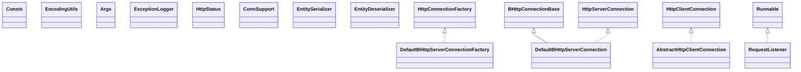

# httpcore-4.4.13.jar

[Group index](README.md) | [All archives](../README.md)

## Scope and provenance

- **Donor:** `SQX_145_REFERENCE_ROOT/internal/libs/httpcore-4.4.13.jar`.
- **SHA-256:** `e06e89d40943245fcfa39ec537cdbfce3762aecde8f9c597780d2b00c2b43424`; accessed 2026-10-06; captured `2026-10-06T18:54:51.906614+00:00`.
- **Classes:** 253 raw entries; 253 unique entry names. Duplicate occurrence indices are zero-based.
- **Inspection:** read-only ZIP hashing and class-file structural parsing; signatures/descriptors, modifiers, hierarchy and references only. Bytecode bodies are hashed, not published.
- **Allocation:** proposed `FEAT-DATA-SOURCE-HTTPCORE`, P04; [roadmap](../../sqx-full-application-roadmap.md). Domain README registration remains required.
- **Repository:** `01067f00031428613c6394064ca1bcadc1ba00ee`; review state unreviewed. Download label 145-dev1; installed build/activation and runtime equivalence unverified.
- **Limit:** every class/member is inventoried; declaration coverage does not establish consumed calls, defaults, formulas, failure semantics or algorithm parity.
- **Archive/resource index:** [037.json](../../../evidence/sqx145/archives/145/037.json).

## Complete member declarations

Member shards contain exact JVM names/descriptors, access flags, generic signatures, throws types, declared fields/methods, superclass/interfaces and referenced class names. All classes, nested/synthetic members and overloads are retained. Code length/hash is structural evidence, not a normalized algorithm comparison.

- [001.json](../../../evidence/sqx145/members/037/001.json) — SHA-256 `e1e43a2b473a2d904196e28df36081c3b1960f753741df16f06897bc34234fc0`.
- [002.json](../../../evidence/sqx145/members/037/002.json) — SHA-256 `5b38403638f9b528078270e6b067b48c656a396166709f70b40a9036495011c3`.
- [003.json](../../../evidence/sqx145/members/037/003.json) — SHA-256 `70510359f11ce6c077714306dd4f64031e543732fcf37f3e19f142edc38c66e3`.
- [004.json](../../../evidence/sqx145/members/037/004.json) — SHA-256 `32a43fbc31bc9091f2f86bfb90bd338a1b2caa8bf4870d4371c32a5356966437`.

## Focused structural diagram

Up to twelve non-nested classes; arrows show declared inheritance/interfaces only. External type names are not evidence of an available body or an executed dependency.

## Class inventory

| Archive entry | Occurrence | Class SHA-256 | Fields | Methods |
| --- | ---: | --- | ---: | ---: |
| `org/apache/http/Consts.class` | 0 | `e99695f3eb9b5027bc32b89e3fd3cb5167c8b0d7eb48fdd70db235afffb4e886` | 7 | 2 |
| `org/apache/http/util/EncodingUtils.class` | 0 | `683704f88425544775ddb7120329b15603ae07644f097a17675536e83ffb23c1` | 0 | 7 |
| `org/apache/http/util/Args.class` | 0 | `e97d06776ff0e3aca7f4ace35e8bbe4a39ec476d455cd7595079afdfbf99071c` | 0 | 13 |
| `org/apache/http/ExceptionLogger.class` | 0 | `a14c8e405a689ef2d67846f2301ce44eb01d337d3c23a5e80f2e543e8c9fc683` | 2 | 2 |
| `org/apache/http/HttpStatus.class` | 0 | `1f2f18e4e354dcdbdf0c1eabff56458b690466990106f176c872139591e69677` | 48 | 0 |
| `org/apache/http/impl/ConnSupport.class` | 0 | `cbbc2795de18e7633eb37984320fa895ff87eecce8b01c6d0b2418e833da0fe2` | 0 | 3 |
| `org/apache/http/impl/entity/EntitySerializer.class` | 0 | `c6d61ad59a0f09bfb39384314dab1bf42ccda4094292c48613ad58523fcec2ad` | 1 | 3 |
| `org/apache/http/impl/entity/EntityDeserializer.class` | 0 | `aee82f0ae988e6666083975f6415339b7f744b47d54e4ae6e0fbd1cf10848154` | 1 | 3 |
| `org/apache/http/impl/DefaultBHttpServerConnectionFactory.class` | 0 | `ce2a237c6a98d11fe135c8b6fcb5af4dc50f4efe2b249e770b23161a1a00a214` | 6 | 7 |
| `org/apache/http/impl/DefaultBHttpServerConnection.class` | 0 | `b45b54093ef8fd993ce3d04956c206d1bf1d4f98d248f71444865016f5dce141` | 2 | 11 |
| `org/apache/http/impl/AbstractHttpClientConnection.class` | 0 | `def035f9ae7fcfe647f8649e6964c588f8de79d007a969efd3a70c8fc678dd0b` | 8 | 19 |
| `org/apache/http/impl/bootstrap/RequestListener.class` | 0 | `38058b2f3030d05e6a34c02179a168081be505a67f987dddcf2e40917a099914` | 7 | 4 |
| `org/apache/http/impl/bootstrap/HttpServer$Status.class` | 0 | `bb9f3a84454045b1023b4c9fed279267b506ac35779fa015a562e87eaca340cf` | 4 | 4 |
| `org/apache/http/impl/BHttpConnectionBase.class` | 0 | `00a8d4771f03d8f23bc7e8957287a9d14326d75f3a4334dbbf14daa6eb019647` | 7 | 29 |
| `org/apache/http/impl/io/IdentityInputStream.class` | 0 | `b04793645ef62283fb772ae268df113061bce87c83e2075bd52e583cb1ea9c0d` | 2 | 5 |
| `org/apache/http/impl/io/HttpTransportMetricsImpl.class` | 0 | `6df71c2311be67ad65acd9b39049692ba2d716a4c8f2411412627e0af419052a` | 1 | 5 |
| `org/apache/http/impl/io/SessionInputBufferImpl.class` | 0 | `9b3fc8e3b4374dc221597a0c0f642f4d5caed34d09c4be089c0489dcd19cb960` | 10 | 22 |
| `org/apache/http/impl/io/HttpResponseWriter.class` | 0 | `104bc2f5960bb32156bcde24ec615c21baba4c0cbc5953279650b370eade50dd` | 0 | 3 |
| `org/apache/http/impl/io/DefaultHttpResponseParser.class` | 0 | `98fa78800476be6db6fa3100e041198c478c6a3bb9fdc82e376fc053881933de` | 2 | 6 |
| `org/apache/http/impl/io/SessionOutputBufferImpl.class` | 0 | `6f20f3a2c6a837ec740f2c0e5c0a76f2b47712a7c860ded17d3ca2138fb809b1` | 7 | 20 |
| `org/apache/http/impl/io/DefaultHttpRequestWriter.class` | 0 | `4bca0f5cd58d56f67cce0650094cf351b5c8f0400a18ac398661b0a648c93fe1` | 0 | 4 |
| `org/apache/http/impl/io/DefaultHttpRequestParserFactory.class` | 0 | `fff7ad28a1909e961fd96c2b15a3ce16ce7b41c72705bd5b7e881b512be2ba20` | 3 | 4 |
| `org/apache/http/impl/io/HttpRequestWriter.class` | 0 | `62306acec915c39840976bb9dcedbca0666424000faa0e379e705e4e71dc01f4` | 0 | 3 |
| `org/apache/http/impl/io/DefaultHttpResponseParserFactory.class` | 0 | `4be899bc4aec29b1ecf634052dc8708851065f3f24b1d0426d00f23717337f74` | 3 | 4 |
| `org/apache/http/impl/DefaultBHttpClientConnection.class` | 0 | `b1bbe828b3cda5369952d8e554d5741bc7f6b5a0f52c305bdfd5d8f54747768d` | 2 | 12 |
| `org/apache/http/annotation/Experimental.class` | 0 | `8df3142168cb00f443ff4b3aed365750cd67382a2ccbaba2b28f2407c0099112` | 0 | 0 |
| `org/apache/http/annotation/ThreadingBehavior.class` | 0 | `33ac35566c669d485055497e63094aaeb7196f44b560241fc5a8f30a8cf126cf` | 6 | 4 |
| `org/apache/http/protocol/BasicHttpProcessor.class` | 0 | `edc1a224fb66bca620c9057829a26af45a568a163d9deed8123ffa0dea78c02e` | 2 | 24 |
| `org/apache/http/protocol/ResponseConnControl.class` | 0 | `70f49a2929f88de740042add4f10d1e8b7a179d6309af2f21019ee9ce0dd04d4` | 0 | 2 |
| `org/apache/http/protocol/HttpService.class` | 0 | `933a2908e4153b92c19c3adcf5f5cc5c76dda3f7ab833dd76dce091c745b0e5d` | 6 | 17 |
| `org/apache/http/protocol/HttpCoreContext.class` | 0 | `9dae162bc8cec9cf22647d348304aaf7234f813b337c77de9069acde76725c00` | 6 | 15 |
| `org/apache/http/protocol/ImmutableHttpProcessor.class` | 0 | `927f34510b2513f50b2abb21e630dc1658a8bda15d50ec91d8d5fa92dda541b7` | 2 | 7 |
| `org/apache/http/protocol/UriPatternMatcher.class` | 0 | `e4cb11709aeed119e78a83419211a18c965d34e96143f9d9afa83b75078da959` | 1 | 10 |
| `org/apache/http/protocol/HttpService$HttpRequestHandlerResolverAdapter.class` | 0 | `036c0ee48b8ee8e9f859b0c2d13bcaffad572a2567581c75031e2e7cf04fb37a` | 1 | 2 |
| `org/apache/http/protocol/ExecutionContext.class` | 0 | `ad5c0751d5b95f5124dbd3b801ea1c10871a7b5269d3877273e55a47bd5cb3d3` | 6 | 0 |
| `org/apache/http/protocol/ChainBuilder.class` | 0 | `94718ba2c995b5e0c2506957f2b01620ef2b8ba87874f990df45ca6360c55ca2` | 2 | 9 |
| `org/apache/http/ReasonPhraseCatalog.class` | 0 | `2b952fab64bd10e99b24939864907ba6723f5205b0f36506a40d2d173dfc2d96` | 0 | 1 |
| `org/apache/http/pool/AbstractConnPool$3.class` | 0 | `e553344280f3133c5973e529763a3e36556e14e6aaffb56a4a0f2b05e39461ac` | 2 | 2 |
| `org/apache/http/pool/AbstractConnPool$2.class` | 0 | `918fad6c3ec7ef105c28f98823480bd7ef6d849cee059793a1f037e272949b54` | 7 | 8 |
| `org/apache/http/message/BasicHttpEntityEnclosingRequest.class` | 0 | `8c34d4c0b2b806ceca349a88c8ee3046fed3780e19270e89ca035dfe50704b10` | 1 | 6 |
| `org/apache/http/ProtocolVersion.class` | 0 | `fb45b412ce241524efcef721470f226a838f3636fd3433ace919187fb06ba843` | 4 | 13 |
| `org/apache/http/util/NetUtils.class` | 0 | `77f997364af14b6445692457ccf1e5be45a9bf53e506609d46bb54f1417fb08c` | 0 | 2 |
| `org/apache/http/util/CharArrayBuffer.class` | 0 | `f21bd2140a76a7c946b708e10b2c5945eeb56151ba8e6d635b9d4fa3cdb02e7b` | 3 | 26 |
| `org/apache/http/ssl/SSLInitializationException.class` | 0 | `4c9dbe0dc014f5bb33ae403642279a740e911ae005f9ba7ce1ba48d43d21b79d` | 1 | 1 |
| `org/apache/http/ssl/SSLContexts.class` | 0 | `8302d18904e9ba2047671ca5a8accdebb6a37f7ab09287921082b1a3cc43da2c` | 0 | 4 |
| `org/apache/http/MessageConstraintException.class` | 0 | `1953a7cc89d152a5296507394bf4f14a481af1380df22560fad289313be98c29` | 2 | 2 |
| `org/apache/http/HttpRequestFactory.class` | 0 | `d480e244a19e0a9a8d63f5b7752e610d29bfc65a307698daa7f8fa7f6a8b8184` | 0 | 2 |
| `org/apache/http/ExceptionLogger$1.class` | 0 | `66c876cba1a699253f5fa6e593040ce21489eb41c91e87c4955604ffb89ae22a` | 0 | 2 |
| `org/apache/http/pool/AbstractConnPool$1.class` | 0 | `394abda6cba4844e38d84b08f982164268bfb468aef1a7a1b5cd2179c543b8f2` | 2 | 2 |
| `org/apache/http/io/SessionInputBuffer.class` | 0 | `1bb790635c714e897dfe1cb554ec3856c5acde72f97f1e1ca1c34454c37b3943` | 0 | 7 |
| `org/apache/http/io/HttpMessageWriterFactory.class` | 0 | `e8118ab3e72f35d8fac8c4b474be06f4b182f517573a0f02ac5ff19d4dd3229e` | 0 | 1 |
| `org/apache/http/io/BufferInfo.class` | 0 | `eae2025ef623ffb8a4918ebd4624e21138c5c26d17d0fc206bf74b73f47c223f` | 0 | 3 |
| `org/apache/http/message/BasicStatusLine.class` | 0 | `6abc6c12f6df6b0ad0f13e5e8a026bc24318b650d9712898a3f9b693e2c182f9` | 4 | 6 |
| `org/apache/http/message/AbstractHttpMessage.class` | 0 | `761288f6e503587e7c3bc5853ff6976870090d91a0c9558493857fcc9570173b` | 2 | 18 |
| `org/apache/http/message/BasicHeader.class` | 0 | `e6bc0abfd27eddf66c7e3c04257bb1f0f1d248c1a2d0984fb10127a0a8e9ee21` | 4 | 7 |
| `org/apache/http/message/BufferedHeader.class` | 0 | `09774a029685946d0978516ac0ce625e14e707abcd870432d58bac97f43cc324` | 4 | 8 |
| `org/apache/http/message/BasicHeaderElementIterator.class` | 0 | `d465896b9de275aa05b53c59ea7722da156b25b22d18e7aabd043ffe69ccf828` | 5 | 8 |
| `org/apache/http/message/ParserCursor.class` | 0 | `ddbd35180da8a78f180b365f1a88f3a1fe236dfd2e5ee2e7a404171defdf3161` | 3 | 7 |
| `org/apache/http/HttpConnectionMetrics.class` | 0 | `72173b80ddc3afaa5fc486c6bdf74a7a6710f9ea7322144bb2247d00d5aec4ae` | 0 | 6 |
| `org/apache/http/util/Asserts.class` | 0 | `46d5f351797a40c21e5546f91e213677bfc3af3d5195a7529e52c42bd6d9b8d5` | 0 | 7 |
| `org/apache/http/util/TextUtils.class` | 0 | `5630cd2788ad91dff2efb6d0e4d517530670ac2bb41f87ca8e6ba2f9df24f936` | 0 | 4 |
| `org/apache/http/pool/ConnPool.class` | 0 | `031f26a5ce8b609857d6b980eaef91059bacea02eae0a615614700160751ff46` | 0 | 2 |
| `org/apache/http/pool/PoolEntryCallback.class` | 0 | `412c3b39379bf2f7de3620dd921ec52c471c66cc7b818ce5376c5755e81b514a` | 0 | 1 |
| `org/apache/http/io/HttpMessageParserFactory.class` | 0 | `3d744b018cef29ad06bf338ca9a5798bb8e312d222da776470f99cc73731d8fd` | 0 | 1 |
| `org/apache/http/message/BasicHeaderElement.class` | 0 | `002cfa5cca1221adcd29a3d024a5103d581b24f8a7b7f924e70618a494f8720a` | 3 | 12 |
| `org/apache/http/message/BasicHttpRequest.class` | 0 | `646e0e0d021826b059ea517c5b0094356c6cf4a196b87b4561932d7cf7e6d94b` | 3 | 6 |
| `org/apache/http/message/BasicListHeaderIterator.class` | 0 | `4eb50ebab54c399e42c5d7631094217f1bb3d3c507dcddba3a814eed31c6e1f0` | 4 | 7 |
| `org/apache/http/message/TokenParser.class` | 0 | `d84a5a02f57f334a922872e200022dc11300db5805229c7d9a1536f5e54ffc9a` | 7 | 10 |
| `org/apache/http/message/BasicTokenIterator.class` | 0 | `db5ced7684b4772ffb8491186ccb3240faba6c9d1f16615eb767869170b2b408` | 5 | 14 |
| `org/apache/http/HttpEntityEnclosingRequest.class` | 0 | `04818087b7fa2a483f1cc091751bb7eb49befee7569b7be66a4257b9dd38b971` | 0 | 3 |
| `org/apache/http/util/ExceptionUtils.class` | 0 | `c8698687d2fcb14fd81eb19a5e77178e03f5168ec2428fc0e88466cf867435b9` | 1 | 4 |
| `org/apache/http/util/ByteArrayBuffer.class` | 0 | `63bae6e67ae8287d02daea0cf3a31b17683a1d6b4b14210c7071852104bd55fe` | 3 | 18 |
| `org/apache/http/HttpRequest.class` | 0 | `d1b37280be674baf3062dc5ead0161f0f61c309c578043606710792116112ee2` | 0 | 1 |
| `org/apache/http/ssl/SSLContextBuilder$TrustManagerDelegate.class` | 0 | `f000592ff7e3dd4d7f8483d5cf1e613b244e10e3b60f6c11b339f0db712d99d5` | 2 | 4 |
| `org/apache/http/ssl/PrivateKeyDetails.class` | 0 | `4ec48c0ef78ad6c0c7179ed5658b52b879f792dfded89b0b4ef54f75f1ef31a3` | 2 | 4 |
| `org/apache/http/ssl/SSLContextBuilder$KeyManagerDelegate.class` | 0 | `3ffbef756ceaca3a280328792478cf4570c7f921899c22c43d444fb97f7eb1d8` | 2 | 11 |
| `org/apache/http/ssl/PrivateKeyStrategy.class` | 0 | `9b06c99387ad36cb88227f319f32868cbe91866a329c5674342df4ca43bff912` | 0 | 1 |
| `org/apache/http/ssl/SSLContextBuilder.class` | 0 | `7d887ca8d3f63b9d7f50d338946f6d1c73c725281f11edab2fed8093a980eae3` | 9 | 26 |
| `org/apache/http/entity/ContentType.class` | 0 | `ed860db6984ca9d468c73414b44d5654272a5c23b9be8a8aca234b939a7ab534` | 27 | 23 |
| `org/apache/http/params/SyncBasicHttpParams.class` | 0 | `bdb8f26a7467279f85d15e4aecfe2b7d2510346dd6818e0ce153cbec5118b123` | 1 | 9 |
| `org/apache/http/HttpInetConnection.class` | 0 | `85e411e9c0f46d31cec633d9a03024a7b655330926d4e30ae57eab0e26477d99` | 0 | 4 |
| `org/apache/http/pool/ConnFactory.class` | 0 | `6c38e2764158407dfdc1a53698a7016e2bf745cd4b59dbdc95767bb4899a91bc` | 0 | 1 |
| `org/apache/http/io/HttpMessageParser.class` | 0 | `8a52700dc24c8e1b1252d83c64d2712046d62875274caaea5935dd2b0e4d910b` | 0 | 1 |
| `org/apache/http/HttpResponseFactory.class` | 0 | `690a840e569ed8fce7927e3477d51590e77ee8f8b3f1a3df2e6c258e28ae15a2` | 0 | 2 |
| `org/apache/http/message/BasicNameValuePair.class` | 0 | `89eb23b3bb6f1042ead8ec2bf0bbbc62dce8166e506dc8cd006fcaa03e968542` | 3 | 7 |
| `org/apache/http/message/BasicRequestLine.class` | 0 | `1394b2ae76bd06bb025ee7806449871de9be04a8565d95612cd62c3e9ca1434e` | 4 | 6 |
| `org/apache/http/message/HeaderGroup.class` | 0 | `5e0abe3380297f1d5b7d6c2a3d96dd1ddd3208698c64dcfb0ece97d3d067744c` | 3 | 18 |
| `org/apache/http/message/LineParser.class` | 0 | `a649004bd783e2c822ec81a32d225f5ad95d8bf8beb3495eb11b22429a906f77` | 0 | 5 |
| `org/apache/http/message/BasicLineParser.class` | 0 | `9906ac374cb3119f704a6f2444df3c60be052350a9ce21892cc83891b2425417` | 3 | 16 |
| `org/apache/http/ExceptionLogger$2.class` | 0 | `f2002d96d41966b2458cab8159bf5b70d91e91a7f03b10a172ec60967766b3ce` | 0 | 2 |
| `org/apache/http/util/LangUtils.class` | 0 | `6c556b78b1692554332eb3f532021b5653128afbd4200735364881e637fae2c1` | 2 | 6 |
| `org/apache/http/entity/ContentProducer.class` | 0 | `dc548d203c2e54a7dee300f2356126d9acf52cdd47a06794933d0ffc38ef6955` | 0 | 1 |
| `org/apache/http/entity/StringEntity.class` | 0 | `b0a1db9217eabd6fa834adabb1a9e0d3f5deda016404197bacaed2407461e146` | 1 | 11 |
| `org/apache/http/entity/InputStreamEntity.class` | 0 | `ade1375349dd9f4b6b247e2bad2e848e1fea1a16f6d9673e51f76115628151f9` | 2 | 9 |
| `org/apache/http/entity/BasicHttpEntity.class` | 0 | `0a9b6b965f07f5bd7c958908b81d8faf1155f3378f9407e20a17e890ac5b1f38` | 2 | 8 |
| `org/apache/http/entity/ByteArrayEntity.class` | 0 | `41afa07b97f6394e6777bb45c8726550beff4f63ee213e6c2132e80340edb28d` | 4 | 10 |
| `org/apache/http/entity/HttpEntityWrapper.class` | 0 | `db41218c6d7537f49c232fa17e95d10a9c2ccd07abacd344c94801f258dc14b9` | 1 | 10 |
| `org/apache/http/params/AbstractHttpParams.class` | 0 | `14986db28143c26d592d64430debaced165ab3335d4485b5d8290f8599987e62` | 0 | 12 |
| `org/apache/http/params/BasicHttpParams.class` | 0 | `7f539d47c5eca49a9b6d26afab41ceb042be86519e63fc08406c9bd20621661c` | 2 | 13 |
| `org/apache/http/params/HttpProtocolParams.class` | 0 | `54c2c468d83ace4094fad7cc640b4419760dd68c02888f4672388857d1968096` | 0 | 15 |
| `org/apache/http/params/DefaultedHttpParams.class` | 0 | `cc269756c9ab2928efb3ec1e93ff03395ab4b79869208a43d1a01baf89d72a86` | 2 | 10 |
| `org/apache/http/params/HttpAbstractParamBean.class` | 0 | `112c106b3dd3ba677ab649c4eea4ef21e4f4c4b84cd54cbc1c0e3911311f5bc8` | 1 | 1 |
| `org/apache/http/NameValuePair.class` | 0 | `a84d55fa9b73d83bb12ff453b38263994b31a7cfa0eabf19abecf91b78d799a2` | 0 | 2 |
| `org/apache/http/RequestLine.class` | 0 | `174bd40720759a9c6dc27e962ebeeef155f1a15cc384db4ce85fe2cdffc17117` | 0 | 3 |
| `org/apache/http/TruncatedChunkException.class` | 0 | `068b9813300e04836e864ad617d47e1b9788ce963f7e4ae03b8c1c4820cc2c42` | 1 | 2 |
| `org/apache/http/MethodNotSupportedException.class` | 0 | `17c8c5e8a7f6c2476914c9fa8a5cc269216c08d30bbdaba7351620d46a38fb75` | 1 | 2 |
| `org/apache/http/config/Lookup.class` | 0 | `a870cee1ac3ab914eb1d55bb432a617cc21f9a52640e1187b94fa746aa8ed634` | 0 | 1 |
| `org/apache/http/HttpException.class` | 0 | `b2e1270d9b7e2b36355751039d35d2144d782f7bb89a592a04283d3d5b6c7859` | 2 | 4 |
| `org/apache/http/pool/ConnPoolControl.class` | 0 | `d27538cd36d38bfd328756f8065e56403fd05fb669a12129b786c8c04abc008b` | 0 | 8 |
| `org/apache/http/io/HttpMessageWriter.class` | 0 | `936e1a4031022186f464d14b577167805082399bc7b7af6477ae492d5460dde0` | 0 | 1 |
| `org/apache/http/io/SessionOutputBuffer.class` | 0 | `7c47937b1ddafa0850192c87d719479e40e1d07f93f194bdb59d240e1d051d0b` | 0 | 7 |
| `org/apache/http/message/BasicHeaderIterator.class` | 0 | `9302e1882ee32874cbf5304738541d3c4cf10869881c3b22cfca1a2e13109e2c` | 3 | 7 |
| `org/apache/http/HttpHost.class` | 0 | `2ab1c46cb790da57f79aaf6d5ffd448fbd918505a035e0cfab96048a9c458df8` | 7 | 19 |
| `org/apache/http/util/CharsetUtils.class` | 0 | `50b13f42e9d0abae70da4141910ae1a0c8b202cf8ae6b19ae555df8569860b58` | 0 | 3 |
| `org/apache/http/HttpRequestInterceptor.class` | 0 | `916d7a348b3622e2533dc1684980e04c40e0811c436f107bb9282c493b10691a` | 0 | 1 |
| `org/apache/http/StatusLine.class` | 0 | `abb01d6dd50a77bff24bfadf1dec3a0a92718bbfc676117b9a5ce631db3cab9f` | 0 | 3 |
| `org/apache/http/Header.class` | 0 | `d4fca9777742c30517e69f4b625ed14e061debf3e5df2d9ec5d007a6f760ae87` | 0 | 1 |
| `org/apache/http/impl/DefaultBHttpClientConnectionFactory.class` | 0 | `6fe20736d1269e4bfe6880253ce2b79e24ee46d7b7f30de320345116022f5853` | 6 | 7 |
| `org/apache/http/impl/entity/LaxContentLengthStrategy.class` | 0 | `26c272d718114c006a640410d66e00145f66724ffa27283cd0423b6589473d78` | 2 | 4 |
| `org/apache/http/impl/entity/DisallowIdentityContentLengthStrategy.class` | 0 | `b148f9ba05068ec9a9ff223bddccd2e60e8d6e596ddf8b0cf87b1b3dc6f9deee` | 2 | 3 |
| `org/apache/http/impl/AbstractHttpServerConnection.class` | 0 | `7a666c4411a7fd5db1ccfbe177dccdcd52353d1dd3edb4449b0cd539cc96fec9` | 8 | 18 |
| `org/apache/http/impl/NoConnectionReuseStrategy.class` | 0 | `1cd91e78d9059883824c9bdedb15c22700a2476b71859fe8f7236b6cbba16938` | 1 | 3 |
| `org/apache/http/impl/SocketHttpClientConnection.class` | 0 | `5cbed59ea2b5ff0cae70743bc3492e4f318523b0643c49f780dc63b864ca8300` | 2 | 18 |
| `org/apache/http/impl/bootstrap/HttpServer.class` | 0 | `32e9551081275f6cdd771d9064eb332a160facff84402997aa1e33518e0b3bb2` | 14 | 7 |
| `org/apache/http/impl/bootstrap/Worker.class` | 0 | `d38f4b03d0bb7b5a9ffc37e9c03b5558b071279c3d56d88c4e9c6b01df9d3a22` | 3 | 3 |
| `org/apache/http/impl/bootstrap/SSLServerSetupHandler.class` | 0 | `c9155309a2cd2e3cba20625535efe8e0410fdc382d4a15b31456da9d70fd3695` | 0 | 1 |
| `org/apache/http/impl/HttpConnectionMetricsImpl.class` | 0 | `58422f8f0c9fe277ca7856233f106450c1c64587cc49c96f87f96d76acfa7390` | 9 | 10 |
| `org/apache/http/impl/pool/BasicConnFactory$1.class` | 0 | `ec6363a09f4661b53f43a366e58decd6b04925c3f9b73141b8579dd90654475c` | 3 | 2 |
| `org/apache/http/impl/pool/BasicConnFactory.class` | 0 | `73383bc57676c596db07f59ba605bc141dd50d865746177069776dd63bb0d4c5` | 5 | 10 |
| `org/apache/http/impl/io/AbstractSessionInputBuffer.class` | 0 | `c1c40f880a640260401412e760bddd5675436ba44760f1e8894183ad598766c8` | 14 | 19 |
| `org/apache/http/impl/io/ContentLengthInputStream.class` | 0 | `596a9096e9e435220a9f1e0c9bf9a84b631f9d0fa853550c06d35c131eea9404` | 5 | 7 |
| `org/apache/http/impl/io/DefaultHttpResponseWriter.class` | 0 | `8f10f642ee717bf5318259fa964c516dca357c507dc79ad8d6aba5d482847454` | 0 | 4 |
| `org/apache/http/impl/io/HttpResponseParser.class` | 0 | `4831b860e7a3d5b9a2179b8920a4fbcdb060abd01acf11c757130c6aa4a6fac6` | 2 | 2 |
| `org/apache/http/impl/io/AbstractSessionOutputBuffer.class` | 0 | `db1f84dcddcbbb29e479cd0af5094844919d99b4466cb13793f61bf696cb4056` | 11 | 18 |
| `org/apache/http/impl/io/ChunkedOutputStream.class` | 0 | `a6d5c10b1e2d7800dab5a86f2aa96b0da5371393563d8d5b0a57994f83805e1d` | 5 | 12 |
| `org/apache/http/impl/io/SocketInputBuffer.class` | 0 | `955e99c5c8701a87a64d54793a7cd93b4b9715254a03528bc155447433957a3b` | 2 | 4 |
| `org/apache/http/impl/EnglishReasonPhraseCatalog.class` | 0 | `1ba1660eca719382e5434446fd07a563c5fde880d48a3d87686e0f4df7617798` | 2 | 4 |
| `org/apache/http/annotation/Obsolete.class` | 0 | `1f4656a00c973ed4802d67e33963b020f38052e248099e63af41dbc407e2866e` | 0 | 0 |
| `org/apache/http/annotation/Contract.class` | 0 | `4af5f5dde57783f931e805220ad06dba956b06b2838e1546dbfe1d4405463c45` | 0 | 1 |
| `org/apache/http/HttpEntity.class` | 0 | `93b6ced2f5fbd6ed9e430142c2b549b4236f8b75a2c85b66fe49b01c59787d4b` | 0 | 9 |
| `org/apache/http/protocol/HttpContext.class` | 0 | `54c9a4aee23aa7df444c66a26137cbd5b9a9d06cd9c7e6e00b05ef0bdfa0bd17` | 1 | 3 |
| `org/apache/http/protocol/RequestTargetHost.class` | 0 | `992e1a145d673d173808476760284d7a6e3a891ec7571769709ccc9ff2d99782` | 0 | 2 |
| `org/apache/http/protocol/HttpProcessorBuilder.class` | 0 | `0a4f74a7dac4ee91c38f95ea2f2f116c96f30cec9dbf735ab3663573f6fb015c` | 2 | 17 |
| `org/apache/http/protocol/HttpRequestInterceptorList.class` | 0 | `db470d825508db6fe7086522edf782af5f885261375fa55764197b165097f93a` | 0 | 7 |
| `org/apache/http/protocol/HttpRequestExecutor.class` | 0 | `7ba12ab4ed7b3a093ee713f2c1472f8add4b92bb72a1482c0309c4efbe343bc1` | 2 | 9 |
| `org/apache/http/protocol/HttpRequestHandler.class` | 0 | `1a42b35d6f31a3509714a2fb8b2aefe0638cea88a44f8ef6287e229c1f16e82c` | 0 | 1 |
| `org/apache/http/protocol/HttpRequestHandlerRegistry.class` | 0 | `b92c3a7f6fda4b6fbd86cb11ac4473599d7cdbae4d9ddfa1cedd49b9418ccbea` | 1 | 6 |
| `org/apache/http/protocol/RequestContent.class` | 0 | `4cd11d5f26ceb6f7f53a4e98f18b8c1ba0f6d8ddccbc99c779ed8eb99d13c97f` | 1 | 3 |
| `org/apache/http/pool/PoolEntry.class` | 0 | `b54478a291838080795941b24bc857e3d583cc6f8d26752c70bb2f9d3b56631e` | 8 | 17 |
| `org/apache/http/pool/RouteSpecificPool.class` | 0 | `639fc30f41cef85a3565b1c7f5760d43b73f93f0158631a52e593de92995b01b` | 4 | 17 |
| `org/apache/http/io/HttpTransportMetrics.class` | 0 | `0d6482c902be817b36a8179c25f01f3c3f1b0df28413f51934a738fdfa787319` | 0 | 2 |
| `org/apache/http/message/BasicLineFormatter.class` | 0 | `c7c8416b0eeb8b62fffc913b19d2238903676874ff4111c5f85679700f67c526` | 2 | 15 |
| `org/apache/http/HttpMessage.class` | 0 | `5c85736fbb8e50a52061f3ea4e6c0c2bafe63ce353e72511991b665dfd975ed7` | 0 | 17 |
| `org/apache/http/entity/FileEntity.class` | 0 | `0eb50ec292623416de8647a4d559055b76a247f5bbc66bb5839c7e7566f0babf` | 1 | 9 |
| `org/apache/http/entity/SerializableEntity.class` | 0 | `41b259aace646b3f4a2abfbee673d16fe7c9a24e1d4f46a58e2da33c64ae1cca` | 2 | 8 |
| `org/apache/http/entity/EntityTemplate.class` | 0 | `557c1e2e2259b04b683c2c32556e42bd5678085ec759ac21e4cb8b53aa489d13` | 1 | 6 |
| `org/apache/http/entity/AbstractHttpEntity.class` | 0 | `293dc37612aa0b164639041ee254e2819980caaf9f6c1da59ce9eaa403398a7d` | 4 | 11 |
| `org/apache/http/entity/BufferedHttpEntity.class` | 0 | `92d2d79076f7c3b492652c0ff6ef947a9733e7f32977573c6aba4e3dbf3fc7ef` | 1 | 7 |
| `org/apache/http/entity/ContentLengthStrategy.class` | 0 | `189998f9e44aaa19f80ba39ff2b19f04ff397ad1c9b179dd0d572feb0a48e974` | 2 | 1 |
| `org/apache/http/params/HttpProtocolParamBean.class` | 0 | `1ffe80e6fa54092c447ceee59db7849c8e329831ca212ae31ab10a2af9528360` | 0 | 6 |
| `org/apache/http/params/HttpParamsNames.class` | 0 | `268364a8ff2ab6f414fe1b5718b4305b47fe07201501cd4b577dc052a117faed` | 0 | 1 |
| `org/apache/http/params/CoreConnectionPNames.class` | 0 | `ce5f930cb6f7687436279d8ca915b248af767846cc298884f507f558d00dda33` | 11 | 0 |
| `org/apache/http/params/CoreProtocolPNames.class` | 0 | `f5d939b4207d73509c34bac31da7b13ab933c3710deebafaf175950ca48e6bc0` | 10 | 0 |
| `org/apache/http/params/HttpParamConfig.class` | 0 | `ce36a66b2b5481f16fe13233d786a50622f20de368eeb6d053508f54b2a34654` | 0 | 4 |
| `org/apache/http/params/HttpConnectionParams.class` | 0 | `f12bb9d345c7436abcc62a97e778ad707c93c9ca2ac064a7f5bfa6c079054512` | 0 | 17 |
| `org/apache/http/params/HttpParams.class` | 0 | `b0da23c8f62a04685ce154a53b3ab9c6447d78d05957e67b4f29a663418087f3` | 0 | 14 |
| `org/apache/http/params/HttpConnectionParamBean.class` | 0 | `13a6a89843321fa76df275d51eacf6b5977688cdf0d7304adbf768e9923d0629` | 0 | 7 |
| `org/apache/http/ContentTooLongException.class` | 0 | `79464e7cdf6b7f720ea83d8adcc70dc692b49f7c8f88b1289be15dcbaef2eb47` | 1 | 2 |
| `org/apache/http/TokenIterator.class` | 0 | `25afe993594c857c6d1d231ccf531485aa88bed07e078e0d64af90b4c10f5b3d` | 0 | 2 |
| `org/apache/http/ConnectionReuseStrategy.class` | 0 | `24171938251395a53a4486c89c26f4ae007bf79394eed6d77a677300a84eb2ec` | 0 | 1 |
| `org/apache/http/config/RegistryBuilder.class` | 0 | `7627e222690616a185d26badd3046ee4325d512c310c70d7339b6604d13987e8` | 1 | 5 |
| `org/apache/http/config/ConnectionConfig$Builder.class` | 0 | `df212656c8cc7340407e548909156aba8674f8ce98ada43656e02a195cb3874f` | 6 | 8 |
| `org/apache/http/config/SocketConfig.class` | 0 | `26a5a2e6e8046538fcafaf50af9d4e4ebae24bc4ae7a3196a3826172fc7164d9` | 9 | 15 |
| `org/apache/http/config/MessageConstraints.class` | 0 | `f195f8d094a139bcaf44a91e085e91ab9d0015a4cee8a968ecee2dba87478aec` | 3 | 10 |
| `org/apache/http/config/MessageConstraints$Builder.class` | 0 | `54ad02cb22033ca99797ddd3fe01d13e23e34b82190f8a088082e6bd47062b38` | 2 | 4 |
| `org/apache/http/config/Registry.class` | 0 | `a3d5b8040ae8d32e88f62450d9ff82d68ba7d4ae97de14b124a4fa4436e2eb99` | 1 | 3 |
| `org/apache/http/config/SocketConfig$Builder.class` | 0 | `29a1c0179ec249421cedf989279f527731ebce7ec521545eb8642600970bf578` | 8 | 10 |
| `org/apache/http/config/ConnectionConfig.class` | 0 | `2b405f0ae6cec9e0c2b9104b73a3701bacdb2c991509a22f67893d20140bfffd` | 7 | 13 |
| `org/apache/http/FormattedHeader.class` | 0 | `614bcab965a6ae80613d9110fa1d2028227327ed3f9dcfd0dd6f73d070af64aa` | 0 | 2 |
| `org/apache/http/HttpResponse.class` | 0 | `16f30667811dc193e8a4151cbb5f08d2fc8ffc186071769617d641e0b423510d` | 0 | 10 |
| `org/apache/http/HeaderIterator.class` | 0 | `3edb6c213d5645d9fd1171b193aca447fe5fe788a19e7635830bb9972b9dc7fc` | 0 | 2 |
| `org/apache/http/ProtocolException.class` | 0 | `dc8ac1e09dc9f1ec1c6dd91345d2073564842455847ff3506f3dd7d32f0249cb` | 1 | 3 |
| `org/apache/http/HttpResponseInterceptor.class` | 0 | `08942dcd173979164583b3173a62a4d9bbb5a022e1d876e5b0a78456bc57bb83` | 0 | 1 |
| `org/apache/http/MalformedChunkCodingException.class` | 0 | `6fdb9bb7d0b8f08f1403b77012650ca2e6c6976be6c994644c8feecbd5e1146d` | 1 | 2 |
| `org/apache/http/ParseException.class` | 0 | `d30998ae3c6c1ea608add572c5f63494b4f937d8554da87e48c3cd9399b9b745` | 1 | 2 |
| `org/apache/http/HttpVersion.class` | 0 | `9e75a6ed36632dc6507e5077f7b9f20d4b81c6ad42e41021c78eb4de55dbd187` | 5 | 3 |
| `org/apache/http/UnsupportedHttpVersionException.class` | 0 | `25bc7cb01fc182fde239f88d3050e564b9faa734a31008f6cf0162528136fdcf` | 1 | 2 |
| `org/apache/http/HttpConnection.class` | 0 | `e685a05ceefcdc2e75960876a268da554fa0d71e1975368941c602527cfdb09e` | 0 | 7 |
| `org/apache/http/HttpHeaders.class` | 0 | `b7601f995c5545e42ff92f1b088e0fa5577f5961c37defef9bb19907c6f8582d` | 55 | 1 |
| `org/apache/http/HttpConnectionFactory.class` | 0 | `50eae65df2a5c64ccb2625765894515741cbfb1296b0599d6bd9cb3335584987` | 0 | 1 |
| `org/apache/http/ConnectionClosedException.class` | 0 | `0095d4edda61cfbf4352a46231de79661feddfe74276a2390da1681e65fe7968` | 1 | 3 |
| `org/apache/http/impl/DefaultHttpResponseFactory.class` | 0 | `0d6ce9699f452eb6425be654117025134c4ab5357690e9c0d475fd20cc9bfe11` | 2 | 6 |
| `org/apache/http/impl/entity/StrictContentLengthStrategy.class` | 0 | `9a3fedd8b91cbb4102425f855658faafcbd4f9719bca65937cd6a0a2d319098c` | 2 | 4 |
| `org/apache/http/impl/SocketHttpServerConnection.class` | 0 | `6edf57577219337b543326c59aa6243123ac84a66d9cc4d5fe246412f786d662` | 2 | 18 |
| `org/apache/http/impl/DefaultConnectionReuseStrategy.class` | 0 | `93928d66fd8be4b6d79ef4a3ae88e6159d9a8ae47d848e1605828c5dd4ab646a` | 1 | 5 |
| `org/apache/http/impl/DefaultHttpServerConnection.class` | 0 | `8908488431d0d79e074124f83edceac3f3f15ae663798ed5ce04319bd4cd5200` | 0 | 2 |
| `org/apache/http/impl/bootstrap/ThreadFactoryImpl.class` | 0 | `c1a39196d4acfabb279a60a7df92821fe3dff328240997579bde27c3f029f5da` | 3 | 3 |
| `org/apache/http/impl/bootstrap/WorkerPoolExecutor.class` | 0 | `cdfb14fc618ba09f04475e75c94c5b586ed482bcaa4328105fbed7aa59027152` | 1 | 4 |
| `org/apache/http/impl/bootstrap/ServerBootstrap.class` | 0 | `0fd3ce069bb244017c427ac63b313c8c10f9317adf954ac28e783730bebe32a0` | 20 | 23 |
| `org/apache/http/impl/DefaultHttpRequestFactory.class` | 0 | `cbafe32af82e9973c1506c323fd70a02120d625279940c7b1554edc4b1153327` | 5 | 5 |
| `org/apache/http/impl/pool/BasicConnPool.class` | 0 | `95cf7a6ef8de3d04469e7382d9fd331bcdf4756a5d3f4f0ce29011c6f67338fa` | 1 | 9 |
| `org/apache/http/impl/pool/BasicPoolEntry.class` | 0 | `3b9d3e8a6132bf715a49e62a0804c5f8a19388fbbf1efd6c9befc3e2a0f48839` | 0 | 3 |
| `org/apache/http/impl/io/ContentLengthOutputStream.class` | 0 | `48027c86534413142ae05a99c9671696d50150cecd3013820fb2f7d32a083a83` | 4 | 6 |
| `org/apache/http/impl/io/ChunkedInputStream.class` | 0 | `43dcc97371c87325828a6aa7758fe8b3b63f96c7887ea8640214ac174815139c` | 14 | 11 |
| `org/apache/http/impl/io/EmptyInputStream.class` | 0 | `628c95314cb74dfc2c8c5768e855c025dbfe6dfff2db89b7e3221e6d9c7ae89b` | 1 | 11 |
| `org/apache/http/impl/io/AbstractMessageWriter.class` | 0 | `5937e597f14cae1c97e3775b994e525a4282c55d850ec8eb634f2cbff295cadb` | 3 | 4 |
| `org/apache/http/impl/io/HttpRequestParser.class` | 0 | `c9f69ab2eb58825111f60969bcb15b8b57e481b52081f3ba1e97c86c9a2c0cb7` | 2 | 2 |
| `org/apache/http/impl/io/SocketOutputBuffer.class` | 0 | `fc43e6a12c11623d818ae44adb51024de7643be7ff586bd8c15eb40b19c207f1` | 0 | 1 |
| `org/apache/http/impl/io/DefaultHttpRequestWriterFactory.class` | 0 | `920f4570d25f0507ab241bd1842b62ffd8f8ec254ff90b3e6d548288412c91be` | 2 | 4 |
| `org/apache/http/impl/io/AbstractMessageParser.class` | 0 | `82128eeba5bf446636ca80b99d93d0975473e9e6639383d2da7798d21896c322` | 8 | 6 |
| `org/apache/http/impl/io/DefaultHttpRequestParser.class` | 0 | `8bd3647c62471e2c15fb282b002ba08cac7fd0875ee076da8eecfb1eb8031d12` | 2 | 6 |
| `org/apache/http/impl/io/IdentityOutputStream.class` | 0 | `5e9c3fe65efdf3fba1a95078b20891a46146584dff8677d7c78406126397134b` | 2 | 6 |
| `org/apache/http/impl/io/DefaultHttpResponseWriterFactory.class` | 0 | `e6740c240e4f43ff4848a06b88954503f26843aca22d4b9500f656e78d916864` | 2 | 4 |
| `org/apache/http/impl/DefaultHttpClientConnection.class` | 0 | `5bef8a515288c5db15ad49d8d936650987a333d7e1cd5cff1ba1d23628a5c135` | 0 | 2 |
| `org/apache/http/HttpClientConnection.class` | 0 | `4155427209921a2cd38f273d44c60a9f111673af05a5d2e2baf1ad97360050c2` | 0 | 6 |
| `org/apache/http/concurrent/FutureCallback.class` | 0 | `91f695405a25810ce56c0c520697f617d628318315479513e1dc493c2ceba688` | 0 | 3 |
| `org/apache/http/concurrent/Cancellable.class` | 0 | `ef3f49a3ddecd41b7beafa7d2c53e507ea48ed281c86e1d06001cb7808b0e1d7` | 0 | 1 |
| `org/apache/http/concurrent/BasicFuture.class` | 0 | `89a53afdf8d58f1abc813b7854c8994002c0dc10856833296c32530445dcef81` | 5 | 10 |
| `org/apache/http/NoHttpResponseException.class` | 0 | `2b40c5197a853d5113aab3713deffae90badd5dd7f5ef6ff5c25e8089620f9fd` | 1 | 1 |
| `org/apache/http/protocol/DefaultedHttpContext.class` | 0 | `3b484c9085b24c04b4a9d8ba01d305b50c2994f7e17c3c2818877d2ff5c0e2ee` | 2 | 6 |
| `org/apache/http/protocol/HttpExpectationVerifier.class` | 0 | `43464e76291c6ada205b145b73d943331e13821083185c042202f4b7b1f305ac` | 0 | 1 |
| `org/apache/http/protocol/HttpRequestHandlerMapper.class` | 0 | `9e62e0a645c2432f6ab82400152efec182fb1548af0d2fd07417c9943bac73b6` | 0 | 1 |
| `org/apache/http/protocol/SyncBasicHttpContext.class` | 0 | `9ca82bce86201d80f2a859bc4996dc344701b362c3719f9ab15ce29f8749b92e` | 0 | 6 |
| `org/apache/http/protocol/HttpProcessor.class` | 0 | `e7ca7f058430d6cec6d52813e45b8e1291769dccc7987729259336c2f3b17612` | 0 | 0 |
| `org/apache/http/protocol/ResponseServer.class` | 0 | `46d904163c9a87eb11518f24948ed17cf5fe3cb647d9805f5941dcbda306315c` | 1 | 3 |
| `org/apache/http/protocol/BasicHttpContext.class` | 0 | `86f67c54f9da7e54b198ef387e1ce53f162f171bbe0c82fe339fee2c6462e610` | 2 | 7 |
| `org/apache/http/protocol/RequestUserAgent.class` | 0 | `cb7184a47dd0147f02a25b246d14c66db055184367fa261409a9209200e3576a` | 1 | 3 |
| `org/apache/http/protocol/RequestExpectContinue.class` | 0 | `b593a830d3062b8e57d391d401c5db9c8d1fafedccbb9b7e1b8192e1d58a88b0` | 1 | 3 |
| `org/apache/http/protocol/RequestDate.class` | 0 | `8f90236ab8157aa8180a1e1e35a8c48a91ab67ea35210dd2bb092060f480995e` | 1 | 3 |
| `org/apache/http/protocol/RequestConnControl.class` | 0 | `956bd18af902fc3834a873abaceb14d3e54152891c4d3f4f9162053f520a9c73` | 0 | 2 |
| `org/apache/http/protocol/ResponseDate.class` | 0 | `c35312ae2f1b449d77fe121e5eea1e7c60716279da93fb99ae41ea9ad38fff4c` | 1 | 3 |
| `org/apache/http/protocol/UriHttpRequestHandlerMapper.class` | 0 | `7592c83acf240bcfa0993d21dcd72cbd46903fce436de6c7f6e2082f567aa10c` | 1 | 6 |
| `org/apache/http/protocol/HTTP.class` | 0 | `f0689debfbe5fc02e2b4722d29cbf18a5a665a6fdc9ae262076e6ab2ac82907b` | 32 | 3 |
| `org/apache/http/protocol/HttpRequestHandlerResolver.class` | 0 | `a7871648adde877e46d615c71cb258c8425c4952fb48c611fc6801717af5b881` | 0 | 1 |
| `org/apache/http/protocol/HttpDateGenerator.class` | 0 | `8559fb717e5ddca7471f5d547ac6b3bfa99b8800fdc673be7201e762236a46e3` | 5 | 3 |
| `org/apache/http/protocol/ResponseContent.class` | 0 | `166df71817b7d58c18a4e43b8982f723dd4c65c4a69bfa31841a635a5e11d776` | 1 | 3 |
| `org/apache/http/protocol/HttpResponseInterceptorList.class` | 0 | `d92e64a8499d16dbe6bf7e6dea4fd3cc9e187b517a25a13e6e87684bd0b71e32` | 0 | 7 |
| `org/apache/http/pool/AbstractConnPool$4.class` | 0 | `072cab00ef8a8faf7f2c9a16cb7d82970a3936455df094a4aab0207590825dfd` | 2 | 2 |
| `org/apache/http/pool/AbstractConnPool.class` | 0 | `096ee40ce53ee5ab70d74d3ce217e2e2797bd474126d0137cfd622faf0ae2280` | 12 | 38 |
| `org/apache/http/message/HeaderValueFormatter.class` | 0 | `5af2a7205ca96334f82c157c032998c011aa4ab8b7fffb1e90b4e9254d54cb7e` | 0 | 4 |
| `org/apache/http/HttpServerConnection.class` | 0 | `b58138458b7ce9bdebbbcbd9e4dfd024ecedba6a9ca33cd256c808489ab53dd4` | 0 | 5 |
| `org/apache/http/util/EntityUtils.class` | 0 | `265573cfc966793afc0d7cd503fa4965b588e7b63fa610579ba6e8625e069cbe` | 1 | 11 |
| `org/apache/http/util/VersionInfo.class` | 0 | `502a6d1c75bdb218dffba4a70633d8ae6cf8244fdb2033af00393311dd78c32a` | 10 | 11 |
| `org/apache/http/ssl/TrustStrategy.class` | 0 | `b7bfb0ab81566801f2ee62fe03d8ecfac58a4b259bdf028cd0b6e0eaf1eb537c` | 0 | 1 |
| `org/apache/http/pool/PoolStats.class` | 0 | `abc721e89f0292d7173d9ebf2093bd7a599521c8eb1c5842e98813c9f7e25164` | 5 | 6 |
| `org/apache/http/HeaderElementIterator.class` | 0 | `08941533646268e9cd72a64cffa8370ae1e4783d5ba6135cbb41db8c5a65fa99` | 0 | 2 |
| `org/apache/http/io/EofSensor.class` | 0 | `64c1f1506d630a80375935d5ab3c1b9854556c0313e1a261954483e37075a785` | 0 | 1 |
| `org/apache/http/HeaderElement.class` | 0 | `a1cc05a199cfdbc47fdf519b47da855c862a1684af77e97ffe56cd48ce8f65e4` | 0 | 6 |
| `org/apache/http/message/LineFormatter.class` | 0 | `501bcbc5111f072557c10359f37f49cb899632919cd8f154573f30c347519c24` | 0 | 4 |
| `org/apache/http/message/BasicHeaderValueFormatter.class` | 0 | `cef8387d608d2f4fec8c8f3e900f4be576c804f263e824393668cd7ffd7691de` | 4 | 17 |
| `org/apache/http/message/HeaderValueParser.class` | 0 | `8b7989f950b8b32037199e9302db8a8c1bca1bdad69d18d974de00c46315b5c8` | 0 | 4 |
| `org/apache/http/message/BasicHttpResponse.class` | 0 | `1af23d7cadf068f306f821be99d44f7e4680f92fc8e750ae408ba4cfbddb7475` | 7 | 16 |
| `org/apache/http/message/BasicHeaderValueParser.class` | 0 | `b48f764ff2bf9419626e681a7dce7da27ec695377d7bd6780f2b146e4b5c5e0d` | 7 | 13 |
