# httpcore-nio-4.4.13.jar

[Group index](README.md) | [All archives](../README.md)

## Scope and provenance

- **Donor:** `SQX_145_REFERENCE_ROOT/internal/libs/httpcore-nio-4.4.13.jar`.
- **SHA-256:** `71fcfbe869002c48563cc5979fc734571c8d0d167ccce42970c932f337981f19`; accessed 2026-10-06; captured `2026-10-06T18:54:51.906614+00:00`.
- **Classes:** 242 raw entries; 242 unique entry names. Duplicate occurrence indices are zero-based.
- **Inspection:** read-only ZIP hashing and class-file structural parsing; signatures/descriptors, modifiers, hierarchy and references only. Bytecode bodies are hashed, not published.
- **Allocation:** proposed `FEAT-DATA-SOURCE-HTTPCORE-NIO`, P04; [roadmap](../../sqx-full-application-roadmap.md). Domain README registration remains required.
- **Repository:** `01067f00031428613c6394064ca1bcadc1ba00ee`; review state unreviewed. Download label 145-dev1; installed build/activation and runtime equivalence unverified.
- **Limit:** every class/member is inventoried; declaration coverage does not establish consumed calls, defaults, formulas, failure semantics or algorithm parity.
- **Archive/resource index:** [038.json](../../../evidence/sqx145/archives/145/038.json).

## Complete member declarations

Member shards contain exact JVM names/descriptors, access flags, generic signatures, throws types, declared fields/methods, superclass/interfaces and referenced class names. All classes, nested/synthetic members and overloads are retained. Code length/hash is structural evidence, not a normalized algorithm comparison.

- [001.json](../../../evidence/sqx145/members/038/001.json) — SHA-256 `0f0b57e8bf74a9c50a9d25d785d06039c66b47a4269023230221c6939b05d703`.
- [002.json](../../../evidence/sqx145/members/038/002.json) — SHA-256 `296e67e293d796012113cbaae7878cbb165896a4744bd2849ba79f8fa64c0c3e`.
- [003.json](../../../evidence/sqx145/members/038/003.json) — SHA-256 `b09d1a6ea96242c753181ea1fcc3df7494e001e07661ae5da97de835b7c7c9e2`.
- [004.json](../../../evidence/sqx145/members/038/004.json) — SHA-256 `c2cc447c06c6e6678ecc843c88880e3a85d8de2d372c63c97fec6d8e5bd9ee7b`.

## Focused structural diagram

Up to twelve non-nested classes; arrows show declared inheritance/interfaces only. External type names are not evidence of an available body or an executed dependency.

```mermaid
classDiagram
    class C0["NHttpServerEventHandlerAdaptor"]
    class C1["SSLSetupHandler"]
    class C2["InterestOpsCallback"]
    class C3["DefaultConnectingIOReactor"]
    class C4["IOSessionImpl"]
    class C5["SessionRequestImpl"]
    class C6["SessionOutputBufferImpl"]
    class C7["HttpResponseWriter"]
    class C8["LengthDelimitedDecoder"]
    class C9["AbstractContentEncoder"]
    class C10["DefaultHttpRequestWriter"]
    class C11["ChunkDecoder"]
    class E0["NHttpServerEventHandler"]
    E0 <|.. C0
    class E1["AbstractMultiworkerIOReactor"]
    E1 <|-- C3
    class E2["ConnectingIOReactor"]
    E2 <|.. C3
    class E3["IOSession"]
    E3 <|.. C4
    class E4["SocketAccessor"]
    E4 <|.. C4
    class E5["SessionRequest"]
    E5 <|.. C5
    class E6["ExpandableBuffer"]
    E6 <|-- C6
    class E7["SessionOutputBuffer"]
    E7 <|.. C6
    class E8["AbstractMessageWriter"]
    E8 <|-- C7
    class E9["AbstractContentDecoder"]
    E9 <|-- C8
    class E10["FileContentDecoder"]
    E10 <|.. C8
    class E11["ContentEncoder"]
    E11 <|.. C9
    E8 <|-- C10
    E9 <|-- C11
```

## Class inventory

| Archive entry | Occurrence | Class SHA-256 | Fields | Methods |
| --- | ---: | --- | ---: | ---: |
| `org/apache/http/impl/nio/NHttpServerEventHandlerAdaptor.class` | 0 | `376f93fece0778b97c1978124d9925ee8a3c72f9ab8aa025838b3743245f814d` | 1 | 10 |
| `org/apache/http/impl/nio/reactor/SSLSetupHandler.class` | 0 | `262fdac6c788c6750f8437cb45dd9e9763152ea63bba12159c18fdf0335905d5` | 0 | 2 |
| `org/apache/http/impl/nio/reactor/InterestOpsCallback.class` | 0 | `78c91a6bdee1a2eb65cd86f38dc23becd9890b7ba1c6a93e2786a6d09e796f7d` | 0 | 1 |
| `org/apache/http/impl/nio/reactor/AbstractIOReactor$2.class` | 0 | `596f04a01862ba78be3f0377947081c7b604288380d5ece15e075837bd9b9a45` | 1 | 2 |
| `org/apache/http/impl/nio/reactor/DefaultConnectingIOReactor.class` | 0 | `a1404b7b2148c29954c08a055cecfc4b73dd1bffa5557ae138c52952c1fa29f1` | 2 | 12 |
| `org/apache/http/impl/nio/reactor/DefaultConnectingIOReactor$1.class` | 0 | `2c8277896205f364922657e4f71405975700b3b005f6eadce57901aab0aee115` | 3 | 3 |
| `org/apache/http/impl/nio/reactor/IOSessionImpl.class` | 0 | `89483adbb19b794d80c6f719c834b21031778183e5f4120fcc16d0d4e94aa24d` | 13 | 31 |
| `org/apache/http/impl/nio/reactor/SessionRequestImpl$SessionRequestState.class` | 0 | `20ba96e3693a0b57943b68c4f7a68dd546c84f2bb4fdb3a8c16bd4a5ad5da75b` | 6 | 4 |
| `org/apache/http/impl/nio/reactor/SessionRequestImpl.class` | 0 | `1382b2750d17755256e8cdb19bca7d4d4178bd2afcf015a6c6a7e0babb7055bf` | 9 | 16 |
| `org/apache/http/impl/nio/reactor/SessionOutputBufferImpl.class` | 0 | `dbfb4a8db26c28c784ef7839a5ce50bb87173852d5f1d2b7b888ff1a7d9c33f7` | 4 | 15 |
| `org/apache/http/impl/nio/reactor/AbstractMultiworkerIOReactor$DefaultThreadFactory.class` | 0 | `17e19f8ba9eb5ed9c9c9724f80600d5a982d1bbf58f167c26d489c7fa7db1124` | 1 | 3 |
| `org/apache/http/impl/nio/codecs/HttpResponseWriter.class` | 0 | `d28cb0b4420b9443db9fd1ce3ad7f6e7c891623b6a84d49dece71f9c4bba7a61` | 0 | 2 |
| `org/apache/http/impl/nio/codecs/LengthDelimitedDecoder.class` | 0 | `70daa07931a8b38822acca36a958abe26e84d58799aec5272edc577ab393c9ff` | 2 | 4 |
| `org/apache/http/impl/nio/codecs/AbstractContentEncoder.class` | 0 | `dd9bea2254421438f6176defe1305c9d3bc72b11382dc2a4f4aca0a9bf2cb42b` | 4 | 10 |
| `org/apache/http/impl/nio/codecs/DefaultHttpRequestWriter.class` | 0 | `ff3c1a360ff636a5f6579f7bf1a05765d54a77bb8de3353a878e09d397ea0713` | 0 | 5 |
| `org/apache/http/impl/nio/codecs/ChunkDecoder.class` | 0 | `883dc0ecd9273dba4806ddf6c9acc942ee82c7495e57ef737b381baed977fb94` | 12 | 8 |
| `org/apache/http/impl/nio/bootstrap/HttpServer.class` | 0 | `5530446ba32523264bb8e4159955a266acd134101039dba17d3e3600364483d7` | 11 | 7 |
| `org/apache/http/impl/nio/DefaultNHttpClientConnectionFactory.class` | 0 | `69453e0cb1c1d78d1a542e010c6a3e3d99efeec927b54eddadae13ecc9ae7183` | 7 | 11 |
| `org/apache/http/impl/nio/NHttpClientEventHandlerAdaptor.class` | 0 | `2beedf8bddcaf346f100eb7a931232bb7c8f019b2cf692ef21843389bd3fc4e9` | 1 | 10 |
| `org/apache/http/nio/util/DirectByteBufferAllocator.class` | 0 | `f2a2ec88bfd182aceff9451e14dbdf159cd11dea023b1736d14a4400d06dad45` | 1 | 3 |
| `org/apache/http/nio/util/SimpleOutputBuffer.class` | 0 | `4aefe326141a7d68955e40f20be1dd1848e0c3ee7c9a42434afd6cf84ddaec6f` | 1 | 10 |
| `org/apache/http/nio/entity/NStringEntity.class` | 0 | `938eee713aacc95c2d74da9cbd9bc753cb3ce1dcbff031d946f2517c98d2fa40` | 4 | 12 |
| `org/apache/http/nio/entity/ConsumingNHttpEntityTemplate.class` | 0 | `0ad0fa0e71dee3714767153131bca829ff144a9a0683bbed709eacb9f3f262bd` | 1 | 7 |
| `org/apache/http/nio/entity/ContentInputStream.class` | 0 | `5756f21916c8c557669057e3e4d217e8f07ad3c90598b2d7a655448525f47995` | 1 | 6 |
| `org/apache/http/nio/params/NIOReactorParams.class` | 0 | `320be431c4150a7a7b94bd77d77a0bad2fed32b016bad482afde0ec31a024b89` | 0 | 9 |
| `org/apache/http/nio/params/NIOReactorPNames.class` | 0 | `ab117c3ee71c864446baa5cad9a438b11511340bee39d9426f8bf12c0d84f0e6` | 4 | 0 |
| `org/apache/http/nio/ContentEncoder.class` | 0 | `f1cbc1e0fa8d93520c24ac3ea9b09c772b06aed389e3608abf352abf47b5dbf1` | 0 | 3 |
| `org/apache/http/nio/FileContentDecoder.class` | 0 | `a808b2ee9c5dc7b6dea0ef60c7ba3d97625e6dd638774746ad91ecfe828b08ab` | 0 | 1 |
| `org/apache/http/nio/reactor/ssl/SSLIOSession$InternalByteChannel.class` | 0 | `6fd315d47c4db4a47052b9f46d300e30b7c5202e2edeb4808675e0f2bf549553` | 1 | 6 |
| `org/apache/http/nio/reactor/ssl/SSLMode.class` | 0 | `37974a67b34bef391dae10819a90538714fb5b05e6d1909c3e8e4fa72bf2161f` | 3 | 4 |
| `org/apache/http/nio/reactor/ssl/ReleasableSSLBufferManagementStrategy$InternalBuffer.class` | 0 | `3524e1d9f4258c0cca9a19fd3124e8eaf86d99aaec66c7bf5248b03205b0a4d8` | 2 | 5 |
| `org/apache/http/nio/reactor/IOSession.class` | 0 | `779313deef6075b6531dab3913f30a325db0e8fca93acee907d40ee51378afdc` | 4 | 19 |
| `org/apache/http/nio/reactor/IOReactorExceptionHandler.class` | 0 | `71b144e290fcbb94d2bb30d6e144af708889abee74ca6f5e599d89b292280be0` | 0 | 2 |
| `org/apache/http/nio/reactor/SessionOutputBuffer.class` | 0 | `bf5b08e19aa1808c762028c01dc803764f3dd9e4725247e7d5fb49f3cb4f241d` | 0 | 7 |
| `org/apache/http/nio/NHttpMessageParserFactory.class` | 0 | `46fa54a0195731f2d363f07b6f570cd3414010909ae58829760466e67db95e7c` | 0 | 1 |
| `org/apache/http/nio/NHttpMessageParser.class` | 0 | `272a254fd7e5623998928bb3cbe536662b9de5c98b36aa72d703d05ef778ec08` | 0 | 3 |
| `org/apache/http/nio/protocol/BufferingHttpServiceHandler$RequestHandlerAdaptor.class` | 0 | `29fa93d08c50e976dd1a16f200a863a4fc0623fd79f6becb09d2efb24989e87d` | 1 | 3 |
| `org/apache/http/nio/protocol/HttpAsyncResponseConsumer.class` | 0 | `0419612f41d606bdc26d09fb4d657771ceb832e7fb7e094b4c04664bf5d78860` | 0 | 7 |
| `org/apache/http/nio/protocol/HttpAsyncRequester$ConnPipelinedRequestCallback.class` | 0 | `95a591240fd29b9508039987a702d7c9c8967f8a4de915d373215b5fa8992fbc` | 6 | 6 |
| `org/apache/http/nio/protocol/NHttpRequestExecutionHandler.class` | 0 | `7112c3e6327ae00b2dc013580aa865d5c26fd6368f9f1f008c91b1afef2943a8` | 0 | 5 |
| `org/apache/http/nio/protocol/HttpAsyncService.class` | 0 | `a41fe5cd3ce506220a9e65ba658afa3d74f67e82f5aea15b12bf64e9bc52ac1e` | 7 | 36 |
| `org/apache/http/nio/protocol/ThrottlingHttpServiceHandler.class` | 0 | `a9266805778c5f46228c4698265c38aab00b64ed618f9d7e97c443c1f08d301f` | 5 | 17 |
| `org/apache/http/nio/protocol/NHttpResponseTrigger.class` | 0 | `a038e61be75958749de50bde6ffaa9d008d5259acadc827ed538c75000dbd130` | 0 | 3 |
| `org/apache/http/nio/protocol/BasicAsyncRequestExecutionHandler.class` | 0 | `ed7b202709f61cb40ab1af707f6a878b39d88b29dc65ccf22b1aa3134a0073e9` | 7 | 22 |
| `org/apache/http/nio/IOControl.class` | 0 | `e26816c0de8b8d6c803f82fb6e38f073924c0241a0851e42f55261d9a82b8661` | 0 | 5 |
| `org/apache/http/nio/pool/NIOConnFactory.class` | 0 | `c42c0d909efbfa3c8f23ee485049fa9b4059edfbf127139bef26d6eba39e5cd3` | 0 | 1 |
| `org/apache/http/nio/pool/AbstractNIOConnPool$InternalSessionRequestCallback.class` | 0 | `131c701e1da59c2a9cdc4881b30d09170e6cfdeae3f25c160ee91b56b6493ea7` | 1 | 5 |
| `org/apache/http/nio/pool/AbstractNIOConnPool$5.class` | 0 | `87560c172e494aa7dbfe9ab3ebca6d57f4bdbcaf4b29b9f767851ec39f4d5399` | 2 | 2 |
| `org/apache/http/nio/pool/RouteSpecificPool.class` | 0 | `6cd0f90f775caa95090fb4ab4214dfc28296d5a898faa527baadcbf4c85f55af` | 4 | 20 |
| `org/apache/http/impl/nio/ssl/SSLClientIOEventDispatch.class` | 0 | `b8925732f365ff21d01df6b19b03ac5243f8dfe33dce99e98fc288bafc675519` | 2 | 8 |
| `org/apache/http/impl/nio/reactor/IOReactorConfig.class` | 0 | `3c66e5d2d2c3e318adecb9603d2fb51cec497bfbdf3c0ad503a8ba949bd75659` | 14 | 33 |
| `org/apache/http/impl/nio/reactor/SSLMode.class` | 0 | `e0e8b9afea23a599b79a4b7a8a30e639f67a05428137b74edd8eb9aa46bda43c` | 3 | 4 |
| `org/apache/http/impl/nio/reactor/SSLIOSessionHandlerAdaptor.class` | 0 | `48b050dde3b8335e67de90d0940e1d0fe9d8b2aaabc45131101d581d83b015bc` | 2 | 4 |
| `org/apache/http/impl/nio/reactor/SessionClosedCallback.class` | 0 | `f2f6fe3985ab303f7d785a9005527608f7fecfd0cb51faf723ca7108001731df` | 0 | 1 |
| `org/apache/http/impl/nio/reactor/SSLIOSession.class` | 0 | `00a06f3ca0e69e79d34034a401fd236954cb235cf136a5dd5efaf0c9d5c170ee` | 0 | 4 |
| `org/apache/http/impl/nio/reactor/ListenerEndpointClosedCallback.class` | 0 | `a24c44d55f4a31b99fbc263c93ea81c85adbcfdff3c206cc6aaf44e891140e67` | 0 | 1 |
| `org/apache/http/impl/nio/codecs/AbstractMessageWriter.class` | 0 | `f51a7ff1338aaa5797fa9dfcd3046122e7885dd9d9a335abf45f4b4d45733cf2` | 3 | 5 |
| `org/apache/http/impl/nio/codecs/AbstractContentDecoder.class` | 0 | `62f6571f87458165220600b20dec0b14c165e75ac193daf0534eee40eabb3e6f` | 4 | 7 |
| `org/apache/http/impl/nio/codecs/DefaultHttpResponseWriter.class` | 0 | `0dcb069329cf65750e98bd6ca9a13221e37a00b0394abb16bac4612bb96f3e85` | 0 | 5 |
| `org/apache/http/impl/nio/codecs/IdentityDecoder.class` | 0 | `e61fc8c6c808db0787c88ed3c60e0268e27629bc3f2250baf1c45be49aec06e9` | 0 | 4 |
| `org/apache/http/impl/nio/codecs/DefaultHttpRequestParserFactory.class` | 0 | `c7ec898cd761e336147bbab61c89969459793b5ec4493ba898386b6f19671800` | 3 | 4 |
| `org/apache/http/impl/nio/codecs/HttpRequestWriter.class` | 0 | `2aa0ad6a81676940073c994117a51d1fa075dd392a3d8346b183463ee41006b5` | 0 | 2 |
| `org/apache/http/impl/nio/codecs/ChunkEncoder.class` | 0 | `ddab0b93e94922d8489969f5ea83cf27f484dbed5c874e9ffc468aec72bbde07` | 3 | 5 |
| `org/apache/http/impl/nio/bootstrap/ThreadFactoryImpl.class` | 0 | `ea36cfbc58f7ef914561e75941295764a138b1a4f4fb0d52c86b026e27dfa30c` | 3 | 3 |
| `org/apache/http/impl/nio/bootstrap/HttpServer$Status.class` | 0 | `3b0d46a585ec2b65b9336455423e0a12061c8ac149d2f7f2add7543a31f65432` | 4 | 4 |
| `org/apache/http/impl/nio/SSLContextUtils.class` | 0 | `fadf74dbb0c3e78623bd0f9aec5e2548fac5ba1566f2563b0135158406965065` | 0 | 2 |
| `org/apache/http/impl/nio/pool/BasicNIOConnPool.class` | 0 | `cd553dc8629f96c0f38c109b127ce4ebefb08d162e69efa45cb09442f579ad3d` | 2 | 21 |
| `org/apache/http/nio/NHttpMessageWriter.class` | 0 | `d6450858186e640fa8f5c2e2009802d883bb731038e9b7969da26e37ae1e48f5` | 0 | 2 |
| `org/apache/http/nio/util/ByteBufferAllocator.class` | 0 | `15ba7a67309905f9ffa69eb07cbde086ebf0bff410fb0906cb0f06a1269d7616` | 0 | 1 |
| `org/apache/http/nio/util/ContentInputBuffer.class` | 0 | `b2e147df30157a27b53e2f5a1ff4c4e871279bd411a43ba202a6bb7cccd0dd50` | 0 | 4 |
| `org/apache/http/nio/util/ContentOutputBuffer.class` | 0 | `da2e0ebe7bad6f39e8719f99eb9a26c6915ab40af87f6253cac207ab5029d148` | 0 | 6 |
| `org/apache/http/nio/entity/ContentListener.class` | 0 | `eedebf9d7b87724b6593f431987d384e08cec3ed84d6f43af32ebd744fdf0eba` | 0 | 2 |
| `org/apache/http/nio/entity/NHttpEntityWrapper.class` | 0 | `97d6a269515d0189f20f25ef08235454f16891765b9a8b37d80ec3cba4f401fe` | 2 | 6 |
| `org/apache/http/nio/entity/BufferingNHttpEntity.class` | 0 | `351862466550f14ba9c816b68a2955f4215397b3a4d34528f38535ef01821460` | 4 | 7 |
| `org/apache/http/nio/entity/ConsumingNHttpEntity.class` | 0 | `b30226b7d2553e375fc07afeed4898131df85fa7c67b7db080d2ab506f0ddde5` | 0 | 2 |
| `org/apache/http/nio/entity/NFileEntity.class` | 0 | `689bd0c2bb9572a4b6b1e44c2f79bcda892673af2908d00a746486a57fef2e93` | 5 | 13 |
| `org/apache/http/nio/NHttpClientConnection.class` | 0 | `ddf2b97652968792ab5bd2081da15846ed62c955d2668d597674eaad72acecb0` | 0 | 4 |
| `org/apache/http/nio/NHttpClientIOTarget.class` | 0 | `d3b37824eecb1c3ef023d393afab513ea28baad209962dff2da0bac5a14d30eb` | 0 | 2 |
| `org/apache/http/nio/reactor/ssl/SSLSetupHandler.class` | 0 | `06b0770253a788a37bbc87ba16bfed4c7071cb1f1ee29679a8aa621a94564adb` | 0 | 2 |
| `org/apache/http/nio/reactor/ssl/SSLBuffer.class` | 0 | `05fb3e85efa1a48ca794c9c51f5af008f1d426d4ba37465abf3757869e74293c` | 0 | 4 |
| `org/apache/http/nio/reactor/ssl/PermanentSSLBufferManagementStrategy.class` | 0 | `4a5480917de8f6f635ed2d57e8dc15c55294bcca54a79d3a6b3880a9fccb6fc6` | 0 | 2 |
| `org/apache/http/nio/reactor/ssl/SSLIOSession.class` | 0 | `748ab295560a345619fb81bb49a643bd466e39a0f6482d9bc47d0632a7f45391` | 16 | 50 |
| `org/apache/http/nio/protocol/HttpAsyncRequestExecutor.class` | 0 | `a366043f7291a55ff0a8f8dc1e4d37e89aa1dc8b56931b45f3e28699ff1a2901` | 5 | 20 |
| `org/apache/http/nio/protocol/BasicAsyncRequestConsumer.class` | 0 | `20c71150cab6589e65c3b42ddf4bf786d828bf1a73a8dae6506c3bad24fddfbc` | 3 | 7 |
| `org/apache/http/nio/protocol/AsyncNHttpClientHandler$ClientConnState.class` | 0 | `bdb1507c3cb23e761e46d6b0e144db5bf5a5aa907bd02b8a6df22ba9ed2cda97` | 15 | 18 |
| `org/apache/http/nio/protocol/NHttpHandlerBase.class` | 0 | `c0bca73fb5ec1003b48c9e88a1245d035fa19392e53b05abd94a5d494abfb9d2` | 6 | 7 |
| `org/apache/http/nio/protocol/HttpAsyncRequestExecutionHandler.class` | 0 | `7fc51038f2e18a2187064fcae024c2f5151fda7191912eca8aa90b1d5e909a2b` | 0 | 3 |
| `org/apache/http/nio/protocol/PipeliningClientExchangeHandler.class` | 0 | `ced732ea536877fd5237061edc9e6a26e241a7c100f3efa495d536ee4df393e0` | 13 | 16 |
| `org/apache/http/nio/protocol/BasicAsyncResponseProducer.class` | 0 | `dc77282cf1f1f82fd2780a0924d6d70b85be7d8da3f649db6f21bc7861bd7313` | 2 | 8 |
| `org/apache/http/nio/protocol/HttpRequestExecutionHandler.class` | 0 | `606dad2d8d82d69c390b9918382fdd7db77a29c76c61222739c095da3c20174e` | 0 | 4 |
| `org/apache/http/nio/protocol/HttpAsyncRequester$RequestExecutionCallback.class` | 0 | `c8d4101510d3f737cd1766d74d8e014d47d8decc3eb61712c270db4192c84957` | 4 | 4 |
| `org/apache/http/nio/protocol/HttpAsyncService$Incoming.class` | 0 | `fec9ad4c057f5bae14f4401203089dc3ab68755235b7714481be2c0fd2cbbfe7` | 4 | 5 |
| `org/apache/http/nio/protocol/AbstractAsyncResponseConsumer.class` | 0 | `3ae4fe480e2129aeea300c302c8a3f341b4f45123166bda589d5b5eb888ba98d` | 3 | 17 |
| `org/apache/http/nio/pool/SocketAddressResolver.class` | 0 | `ec50885b241bcff514c6e30923c902c1dc88c0d622cca5b50e36ddd458481c20` | 0 | 2 |
| `org/apache/http/nio/pool/AbstractNIOConnPool$3.class` | 0 | `3d78f993473b1428e706c691c81f11225e9ec86a9b3d26a4c139b44784e8166f` | 3 | 8 |
| `org/apache/http/nio/pool/LeaseRequest.class` | 0 | `f0f7f8a2692122aa2fde1a305b3887a2ae6add26a9b1e7e3e2041ff142bb736a` | 9 | 14 |
| `org/apache/http/nio/NHttpServiceHandler.class` | 0 | `820e46ce878b8f2e83cb2dc20abda4383500d7fb1cca5a6608a35e39e62f18c2` | 0 | 9 |
| `org/apache/http/impl/nio/ssl/SSLServerIOEventDispatch.class` | 0 | `d3e60fce66c7b583053b0eba7aa82d9365b07dcddf0db14b711f77a6b162a9d4` | 2 | 8 |
| `org/apache/http/impl/nio/reactor/IOReactorConfig$Builder.class` | 0 | `a279714199af6bffa68e27bd9253cee6b6b2bbbdc061fb94d475fcee9d77451a` | 14 | 18 |
| `org/apache/http/impl/nio/reactor/ChannelEntry.class` | 0 | `f421efc70f202fdb05a509a88da7c26a2f522f73be61f7a6db197e833590472e` | 2 | 5 |
| `org/apache/http/impl/nio/reactor/DefaultListeningIOReactor.class` | 0 | `44029d3dae46d54a632ae1e27b891be91f430c47ab0bb5dee766d331d1c0bfc1` | 4 | 15 |
| `org/apache/http/impl/nio/reactor/SSLIOSessionHandler.class` | 0 | `6d171238dae0983845265da7d3011c11bffdf9b3d63f29a4b6581233787486f4` | 0 | 2 |
| `org/apache/http/impl/nio/bootstrap/HttpServer$2.class` | 0 | `bc2aa150030e3afb951e2dc31e59762650ad5cbd11f53a06978a99eb816b0bbb` | 2 | 2 |
| `org/apache/http/impl/nio/bootstrap/HttpServer$1.class` | 0 | `65eb69f1f62194cc1b21956d4c8e90ef028d375e4d6af1c0c9db4414d4ab247d` | 2 | 3 |
| `org/apache/http/impl/nio/SSLServerIOEventDispatch.class` | 0 | `8a1ec58614a8d9ebbd17a12f98bb17bad1fe34335c272b92d8bddae02a2181ff` | 5 | 11 |
| `org/apache/http/impl/nio/pool/BasicNIOPoolEntry.class` | 0 | `f653e91e9b969be2eafb8ac235562124bae67916f5e1107ea00cc76e123e7e99` | 1 | 5 |
| `org/apache/http/nio/NHttpServerConnection.class` | 0 | `0b582ccb876c490207fb4e4c8153fe1f8eb0208e42310938943fe6666740b599` | 0 | 4 |
| `org/apache/http/nio/util/ExpandableBuffer.class` | 0 | `ef27fc786e50647efabec2dcf06922a78f92b397d70728a4e4fa270d3fe9a7c8` | 5 | 13 |
| `org/apache/http/nio/util/BufferInfo.class` | 0 | `05b27c1c596d42d1141fe95714034a3595cd6d2f9abd02def272d0d9c55aa389` | 0 | 3 |
| `org/apache/http/nio/entity/ContentBufferEntity.class` | 0 | `89305883513b48e80034903e0bf1945d4b6fc7f54017a11b606d737a7b970a14` | 1 | 5 |
| `org/apache/http/nio/entity/EntityAsyncContentProducer.class` | 0 | `2141b5a4cc1770175bc5f334e08a5df15d15c6538d04824ff5347165b3bd298f` | 3 | 5 |
| `org/apache/http/nio/entity/ProducingNHttpEntity.class` | 0 | `d15ada5fde700f2db9be61d39263a07ea35adac4eb6a2aaba672c61386ede1af` | 0 | 2 |
| `org/apache/http/nio/entity/NByteArrayEntity.class` | 0 | `2cdbf1014ebb12b9920442931c947ff1e06e128984e58875e7edfa150d499e29` | 6 | 12 |
| `org/apache/http/nio/params/NIOReactorParamBean.class` | 0 | `0a7d53673f94ef12a0e05c3e0631ac093ead27ce33ed7d6c68500d2f8329f8b0` | 0 | 3 |
| `org/apache/http/nio/ContentDecoder.class` | 0 | `a3a14db10a919feee252d7e3770c2ac057c69b973daf3d277411c7226b8faf4b` | 0 | 2 |
| `org/apache/http/nio/ContentEncoderChannel.class` | 0 | `59c72c5e16b335a74a58639275a6f3d23a66dfa477cdffbee599f38bd9239f15` | 1 | 4 |
| `org/apache/http/nio/reactor/ssl/SSLIOSession$1.class` | 0 | `430788278d1135b3e6a1f0e5f8b120d2a882499b8bddfc16ba652ae480c4cefd` | 2 | 1 |
| `org/apache/http/nio/protocol/AsyncNHttpServiceHandler$ResponseTriggerImpl.class` | 0 | `7fb164d0f2e2b53c2ab64321b92bf324e4dcfcc03ca00d1b2a7176c1a59160c5` | 3 | 4 |
| `org/apache/http/nio/protocol/HttpAsyncService$HttpAsyncExchangeImpl.class` | 0 | `a1e15ccde304d84a6f5afbb80d907debb4d9759c9d809e4b251a294269ac803f` | 7 | 9 |
| `org/apache/http/nio/protocol/HttpAsyncExpectationVerifier.class` | 0 | `b0981252966604f967febb243b421025062fb1f2b1f203b5539e98e44dfdb07f` | 0 | 1 |
| `org/apache/http/nio/protocol/HttpAsyncRequester.class` | 0 | `cf340272362498ecf4c8326abb00db1ada7503df5d4d604b5d8e8f05886bc3e2` | 3 | 20 |
| `org/apache/http/nio/protocol/HttpAsyncRequestExecutor$State.class` | 0 | `89e0494c6f1ae56d6d942a6c76faf251e6d6b936d376ba8fb9d8afd5cd6aee66` | 7 | 15 |
| `org/apache/http/nio/protocol/AsyncNHttpClientHandler.class` | 0 | `59f01bfbb46fc386f61aeb673466642dbf1fe8917f361764fbc0c1a685a748cf` | 1 | 15 |
| `org/apache/http/nio/protocol/BasicAsyncRequestHandler.class` | 0 | `a81c76661205d85f3fcb822a416666c8b72db24c94fdaceca41c3dad84e129e1` | 1 | 4 |
| `org/apache/http/nio/protocol/HttpAsyncResponseProducer.class` | 0 | `bf30af7daea7fd6d02506cb91b82fcf2a565003f35345616115f82311a64262a` | 0 | 4 |
| `org/apache/http/nio/protocol/HttpAsyncRequester$ConnRequestCallback.class` | 0 | `066ce7a9a5a33c808854864777f95dfce649c795a4d2777e07fedbf2b5321c24` | 6 | 6 |
| `org/apache/http/nio/pool/AbstractNIOConnPool$2.class` | 0 | `c83883bb05fd2d9bd8e521df07bbf15f5821595c51052adafa16ddcb954dec81` | 1 | 2 |
| `org/apache/http/nio/pool/AbstractNIOConnPool$4.class` | 0 | `0909c48fc6796ce3668feeda3bcd5ca9e8e428223b5fc9cf8f322b686b787ec2` | 2 | 2 |
| `org/apache/http/nio/pool/AbstractNIOConnPool$1.class` | 0 | `08982750a6a6f95a2c488bd51c26b64903bc455566661f31f2b6390c01eb9fe7` | 1 | 3 |
| `org/apache/http/nio/NHttpServerEventHandler.class` | 0 | `418aad451aac4d4afa1149e36f93f3a9ea806dd5f5620a81324bafb1165f5057` | 0 | 9 |
| `org/apache/http/impl/nio/SSLNHttpClientConnectionFactory.class` | 0 | `5118ece688bbbe08be3f0816266521556e92c88c2afe2df98d31b95a05eca95a` | 9 | 14 |
| `org/apache/http/impl/nio/reactor/SSLIOSession$1.class` | 0 | `005b92c815208a400ac36367ec4dd4fadc8d187a8266704fc287744344c98453` | 1 | 1 |
| `org/apache/http/impl/nio/reactor/SSLSetupHandlerAdaptor.class` | 0 | `6b365b9c83b047747f01b92d3dbef28d9bf712424e64479914f6567ca63bba1b` | 2 | 4 |
| `org/apache/http/impl/nio/reactor/SessionRequestHandle.class` | 0 | `41056c8f5f675927b02461b2bbf52c975debd06ab0361ea827d08ca3f2c57d00` | 2 | 3 |
| `org/apache/http/impl/nio/reactor/AbstractIOReactor$1.class` | 0 | `6a32d58ad19113120ee69f0e71e19eb478d2904af1777883fce5164af1aea938` | 1 | 2 |
| `org/apache/http/impl/nio/reactor/ExceptionEvent.class` | 0 | `e3eea6996ce25f8dfb4cbfa4dec48b4e7070056c70a68640dc9104ede6eba889` | 2 | 5 |
| `org/apache/http/impl/nio/reactor/SessionHandle.class` | 0 | `7955b14ad397041ba6923451364be0584bf9628ac952d8e463bf0d5127079ea6` | 5 | 8 |
| `org/apache/http/impl/nio/reactor/AbstractIOReactor.class` | 0 | `08646a0148e0354246db44e2a262d7309706f9dd8fe631a4b4bd3409d2d5f85e` | 9 | 32 |
| `org/apache/http/impl/nio/codecs/HttpRequestParser.class` | 0 | `aaeb63d9fbdce56a3a0615ea667b00c4f934557dd9f50afaba786918be18b955` | 1 | 2 |
| `org/apache/http/impl/nio/codecs/AbstractMessageParser.class` | 0 | `b3f434cf9efcbd6826ff5c567e2b8b73d539aeb4fb5acd43a096efa38231b921` | 11 | 8 |
| `org/apache/http/impl/nio/DefaultClientIOEventDispatch.class` | 0 | `0cd274d8cb5d9a385a3f2b655c190568783ef7ceaf1c41ed66a6d1e326765b2b` | 3 | 17 |
| `org/apache/http/nio/reactor/ssl/SSLBufferManagementStrategy.class` | 0 | `453bd2394c1086c2b9b42e27c4c386b1d7959ac472a34689d6f93e53e9085f82` | 0 | 1 |
| `org/apache/http/nio/reactor/ssl/PermanentSSLBufferManagementStrategy$InternalBuffer.class` | 0 | `a259184993317defb04b4787b80b338ad5910f1b89ec9b8db61e4eb06f817e70` | 1 | 5 |
| `org/apache/http/nio/reactor/SocketAccessor.class` | 0 | `031b73d5bf7e0aa36577d4e568f967bf3637905d71cc5be1f030acab56700929` | 0 | 1 |
| `org/apache/http/nio/reactor/IOReactor.class` | 0 | `fe8ead50c637a1bacc00b465f5c7dab72aa33a1e83375db11548021dd58466ee` | 0 | 4 |
| `org/apache/http/nio/reactor/IOReactorException.class` | 0 | `579767aa7f74c54c67f72940aab241fcec85a2e13d00b8c168cdc040aed57ef8` | 1 | 3 |
| `org/apache/http/nio/reactor/ListenerEndpoint.class` | 0 | `4eaaafebcae15cb774416d0ea8788f02bac8c46cbecbb1fbc7311cf68d0044a4` | 0 | 5 |
| `org/apache/http/nio/NHttpClientEventHandler.class` | 0 | `599bfa2417f218c9ba7a9d5d55ef39e35ec1930aef08be088c355d9212505e7d` | 0 | 9 |
| `org/apache/http/nio/NHttpMessageWriterFactory.class` | 0 | `8eeb0ea467d8011323e87936d1965c46d2515e6cf7a336a48525dbaa320d5bd1` | 0 | 1 |
| `org/apache/http/nio/protocol/BasicAsyncResponseConsumer.class` | 0 | `2c12e98380a56338f84df7fae091a9f199fbff687d4059b25e7fdc2f090a46c8` | 3 | 7 |
| `org/apache/http/nio/protocol/SimpleNHttpRequestHandler.class` | 0 | `de8bc66d9123ce3aa8209fb61166c9ef4b772c356f741b52fb1e4d449ced8720` | 0 | 3 |
| `org/apache/http/nio/protocol/HttpAsyncRequestHandlerResolver.class` | 0 | `1275c0278e4c27edf0e48df296dc65f49677fa09ebad57607249c77d77b2272b` | 0 | 1 |
| `org/apache/http/nio/protocol/BasicAsyncRequestProducer.class` | 0 | `c610ab86970c2133db6aaeb6ecbbeb5b8679d4d4b9e81c1c81a52f17f2149f90` | 3 | 11 |
| `org/apache/http/nio/protocol/HttpAsyncRequestHandlerRegistry.class` | 0 | `eaf9025696396c4b781a97100147e2287a233f29277b33ce587fe36632d59872` | 1 | 6 |
| `org/apache/http/nio/protocol/HttpAsyncService$Outgoing.class` | 0 | `0d944734e284be315c83545f3244faa1a5217ed8e5b02d8f02316a3f47533bad` | 4 | 5 |
| `org/apache/http/impl/nio/DefaultNHttpServerConnection.class` | 0 | `a3fea485f820da25c4f2525e8c3f9faa1ff40b47a8300a74002761cac2a741d6` | 2 | 17 |
| `org/apache/http/impl/nio/reactor/InterestOpEntry.class` | 0 | `a1ac3c788ac65465a9e0272a8daa51ea1a6f27127eb0749e50ebf3bdc82d5eb5` | 2 | 5 |
| `org/apache/http/impl/nio/reactor/AbstractMultiworkerIOReactor.class` | 0 | `0096b43abde73627316e6746ea9864e35a0c5fee6a4f2a8f953e059989ba91c8` | 15 | 20 |
| `org/apache/http/impl/nio/DefaultHttpServerIODispatch.class` | 0 | `6f638c9a0f2a324acc7df82b7316884b1767f9f7fdddd4b71b078e14c83aa28e` | 2 | 26 |
| `org/apache/http/impl/nio/codecs/DefaultHttpResponseParser.class` | 0 | `699539aafba4ae985e814250aad3b69b989e60fec2acd99cd224f61223b453ce` | 1 | 6 |
| `org/apache/http/impl/nio/codecs/DefaultHttpRequestWriterFactory.class` | 0 | `162316534445d6433a1054851d8b8f6ab12504ae3cb7a521b793295f593d47e1` | 2 | 4 |
| `org/apache/http/impl/nio/codecs/LengthDelimitedEncoder.class` | 0 | `5d7ba119253200d215a175db3fad078e263d7925e7002ef2f67b591752b72a49` | 3 | 6 |
| `org/apache/http/impl/nio/codecs/DefaultHttpResponseParserFactory.class` | 0 | `138355f17b77ecf8b74faf55669afaa9ac317a957619f5de1eab5f888b4b8bd0` | 3 | 4 |
| `org/apache/http/impl/nio/DefaultNHttpServerConnectionFactory.class` | 0 | `d9343b146216c38fe1510bfc32199d7036a211d6dcd1b681be304a4dfc2072b5` | 6 | 9 |
| `org/apache/http/impl/nio/SSLNHttpServerConnectionFactory.class` | 0 | `a3a2e7245f7ba2766fd79d3036bc56dbb6d4bf3c820d580468740fc922081417` | 8 | 13 |
| `org/apache/http/impl/nio/pool/BasicNIOConnPool$BasicAddressResolver.class` | 0 | `57a89b80b6adbf5957e424543bdd587f2f4b4682730b51b1b8e43e9884d45a6d` | 0 | 5 |
| `org/apache/http/nio/NHttpConnection.class` | 0 | `4ff2ae4c684bb4fe3b0fdec51f23bad1836c0eb5c6615ae7f11e15dbb790e4e6` | 3 | 4 |
| `org/apache/http/nio/util/SimpleInputBuffer.class` | 0 | `6b0d57604e854ad03c0de4aaae691276055d918efd98fea5120edf2075c95a4e` | 1 | 9 |
| `org/apache/http/nio/util/SharedOutputBuffer.class` | 0 | `9853b5641a15f8689871e33bbb19d443849f050c141ae2aef6d48535e82b7c38` | 5 | 18 |
| `org/apache/http/nio/entity/ContentOutputStream.class` | 0 | `e5027a8fd6655cb9b614102b3ca7bdc2f9e46e51b1cb6bfa88bafffe948ca3a6` | 1 | 6 |
| `org/apache/http/nio/reactor/ssl/ReleasableSSLBufferManagementStrategy.class` | 0 | `669c7a5f2afed23e6f0de7937888d3da567b0b290a44a131130fec1876b62735` | 0 | 2 |
| `org/apache/http/nio/reactor/SessionRequest.class` | 0 | `3f1c1b37420ca258d31387665eb6c9a1f04758ee15ad5b02f544fad7df2781d9` | 0 | 10 |
| `org/apache/http/nio/reactor/SessionRequestCallback.class` | 0 | `2c298c2f456e3f3d4cd9e1ed2da11f8a91a5ae59c7453376f4ae87330d1f699e` | 0 | 4 |
| `org/apache/http/nio/reactor/EventMask.class` | 0 | `96de1e915e7647fa2840c31d642b384226929cef9b295adf569200b96bc80217` | 3 | 0 |
| `org/apache/http/nio/FileContentEncoder.class` | 0 | `9ce69ba1ae169096b3b55990c4c8df6ecdcc94f6dbe5af72ce55ebe582ae3b96` | 0 | 1 |
| `org/apache/http/nio/NHttpConnectionFactory.class` | 0 | `e374b178def3cc209c6b841d7f3205703b939f1064a89bb3fa5694f1eb13bc5b` | 0 | 1 |
| `org/apache/http/nio/NHttpClientHandler.class` | 0 | `0dc3fdb0fd3e95a399bc9b0a64dbee7dbd2a452ea74d4bdabedfa1f5f2e919e2` | 0 | 9 |
| `org/apache/http/nio/protocol/AsyncNHttpServiceHandler$ServerConnState.class` | 0 | `f509389879eeaadbe258859c84f626ca9b3253ec4115cc275da5324a963dc0af` | 8 | 24 |
| `org/apache/http/nio/protocol/BasicAsyncClientExchangeHandler.class` | 0 | `cf97f322b8fa438996102eab8ee0a34217240a28f81ce34e38fd3e900d3c618d` | 10 | 15 |
| `org/apache/http/nio/protocol/NullNHttpEntity.class` | 0 | `0975585d18123cb52d5e9506691183cdd9ba5af207c7bcb7a18ea7bc3a48c1d1` | 1 | 6 |
| `org/apache/http/impl/nio/SSLClientIOEventDispatch.class` | 0 | `f4dfe6aa8828b7caf76a0285518491f1d6fd829fffe40aa19634aa0dafd34abb` | 5 | 11 |
| `org/apache/http/impl/nio/DefaultNHttpClientConnection.class` | 0 | `b7af2d0527c18b7ce6d89ec4a2666ce1515a1d8d988ff7d1c8c07fcf17e60edf` | 2 | 16 |
| `org/apache/http/nio/reactor/IOEventDispatch.class` | 0 | `75e66f9c737d89931d7ea2c5e202b4c268b5689e88ef7a4e7994f5dd06120806` | 1 | 5 |
| `org/apache/http/nio/protocol/NullRequestHandler.class` | 0 | `0344d2ccc3d8245d045f5a4d93325ad1ec11653decc62bd2b3003abb98856ca2` | 1 | 4 |
| `org/apache/http/nio/protocol/BufferingHttpClientHandler$ExecutionHandlerAdaptor.class` | 0 | `e03a05108dd3aca0fc8275361b9617a0554962404b24343fd3a08546e2ffe1d7` | 1 | 6 |
| `org/apache/http/nio/protocol/BufferingHttpServiceHandler$RequestHandlerResolverAdaptor.class` | 0 | `a613807a22d7ee437ca094da27cfc5004bbc746c9b9073e582268117824c239d` | 1 | 2 |
| `org/apache/http/nio/protocol/BufferingHttpClientHandler.class` | 0 | `e9630ba35f3c90910220596b50f066ae85fd342814bee53917c6ed5bb53c5f9b` | 1 | 12 |
| `org/apache/http/nio/protocol/ThrottlingHttpClientHandler$ClientConnState.class` | 0 | `7804c7172b2ee82f70989f553188301dbbf5362367eeeac11a12a46bd2f0b146` | 18 | 19 |
| `org/apache/http/nio/protocol/HttpAsyncService$State.class` | 0 | `22996ee059ee15186408e32e30f165e5e7526fc93995e1a29987ea0f7040db9a` | 7 | 15 |
| `org/apache/http/nio/protocol/BufferingHttpServiceHandler.class` | 0 | `458fcc2958b0213518d87290a49e622404cc3efc5730ef0a07daf159f8f7b2b8` | 2 | 15 |
| `org/apache/http/nio/protocol/HttpAsyncRequestHandler.class` | 0 | `2bf58fb6083fd6b516c7db4c3c7e9a83c854e22e5eb6fa2862fc7b8a2da16d27` | 0 | 2 |
| `org/apache/http/nio/protocol/NullRequestConsumer.class` | 0 | `84208226fdb962585687cbe52beb29e2ae34d08b276a31528f4ffd0456967c82` | 2 | 9 |
| `org/apache/http/nio/protocol/Pipelined.class` | 0 | `0634ff6cddfa754a747ee947ad4c4b4e9ee19889e4601a5b44a02cb3e78895b4` | 0 | 0 |
| `org/apache/http/nio/protocol/EventListener.class` | 0 | `6b11faf2e046a239dd77c8d0d522ecd71f305aebe4430d04c06ddc68d193cba5` | 0 | 5 |
| `org/apache/http/nio/protocol/ThrottlingHttpClientHandler$2.class` | 0 | `11f822dafbdeb14650c9a79766cb34d3bf34000d47a56e090d3d0dd851a96bd9` | 5 | 2 |
| `org/apache/http/nio/protocol/MessageState.class` | 0 | `ac66eb7e471eb51f1d7580f83ff51482a9c0e9cde533dba872044fecad0b8bd7` | 6 | 4 |
| `org/apache/http/nio/protocol/HttpAsyncExchange.class` | 0 | `a25667be01b45d5d6288d811f7140b442204fb1dd2daf901eda4394d1f4bc556` | 0 | 8 |
| `org/apache/http/nio/protocol/AsyncNHttpServiceHandler.class` | 0 | `cacb91e960d6ab9664a8f7557509782042f757c80d4f6e0b8e8545e8fe9646a9` | 3 | 18 |
| `org/apache/http/impl/nio/SessionHttpContext.class` | 0 | `6f8731b8ec1c5195da601005f02da4ecf0799afeda4483b179b558bc80585bee` | 1 | 5 |
| `org/apache/http/impl/nio/DefaultHttpClientIODispatch.class` | 0 | `202fce0f97e793edba27f3f91c74c9a26589994f795b22a426c821a2209289e9` | 2 | 25 |
| `org/apache/http/impl/nio/codecs/IdentityEncoder.class` | 0 | `a7990960a3677ab8a73cfdbb3f34093a964c70a4f359229494fbd2bb191b8555` | 1 | 5 |
| `org/apache/http/impl/nio/codecs/HttpResponseParser.class` | 0 | `3c01e45c85615f390c2fe2c17877b08469421fe6b2e2396b0ecd34b02cfb70de` | 1 | 2 |
| `org/apache/http/impl/nio/codecs/DefaultHttpRequestParser.class` | 0 | `c5e3110fc18b1c9b177913e630110bf0e200faf801f9093550ae0a76e6d757db` | 1 | 6 |
| `org/apache/http/impl/nio/codecs/DefaultHttpResponseWriterFactory.class` | 0 | `d66d53b5fd0e863828bd77c73dd49a2a208b859aa9904d60602e241e1ebafa7a` | 2 | 4 |
| `org/apache/http/impl/nio/DefaultServerIOEventDispatch.class` | 0 | `5b7513cda4928d0024c23a5a49b9ab1a824c20104a36c0c23bc19dd54156d88f` | 3 | 17 |
| `org/apache/http/impl/nio/bootstrap/ServerBootstrap.class` | 0 | `b58fbc24c728fa46ff780c31730db3f7d6f46c81c48f13a8ac3860fbea469f06` | 19 | 22 |
| `org/apache/http/impl/nio/pool/BasicNIOConnFactory.class` | 0 | `00262d5ef6206cac6290f0ab1edd858eb8d586c352f26c8f17d3630c76989efb` | 2 | 10 |
| `org/apache/http/nio/util/HeapByteBufferAllocator.class` | 0 | `1264c1ce437a9b3b303649ec5722dc7ba989b7926a3c08a0d0e3dbeec192850d` | 1 | 3 |
| `org/apache/http/nio/util/SharedInputBuffer.class` | 0 | `09dfa2b46a52e124d0170933ec341a67cc44e6cda59e7ec5172fd577daa53249` | 5 | 18 |
| `org/apache/http/nio/entity/HttpAsyncContentProducer.class` | 0 | `d93d4a7d1e4992dcd71e4159acdc557fea542a1b19f440105f1b25ab5f5aa03f` | 0 | 2 |
| `org/apache/http/nio/entity/SkipContentListener.class` | 0 | `0067789f6336df13dc6c1599a5faa6e6ac06f5d672bf1d6e7e8d6f41617a4ddf` | 1 | 3 |
| `org/apache/http/nio/reactor/ListeningIOReactor.class` | 0 | `1afd6f95a1db0572a4d2342b99467f7569241e0b85d36fae450a9a656eecc384` | 0 | 4 |
| `org/apache/http/nio/reactor/SessionInputBuffer.class` | 0 | `8231d6f839300c25df059f70badea724ed4e58b82fd08d6ad17c188a01c7d146` | 0 | 10 |
| `org/apache/http/nio/reactor/SessionBufferStatus.class` | 0 | `de7c92d7abf97d65b780a86ab52f4b3caad5c85463d32143438ababf9ab65b5c` | 0 | 2 |
| `org/apache/http/nio/reactor/ConnectingIOReactor.class` | 0 | `f9691a8db6e21e877a9480f2da3fe8eb282dd83035eb771e2a98b6e2b7a83ee4` | 0 | 1 |
| `org/apache/http/nio/reactor/IOReactorStatus.class` | 0 | `f3c1931a4d1471b9a1f5581dde8ed5ac8e69b4e628ce2f2d878ea44b4dd886de` | 6 | 4 |
| `org/apache/http/nio/ContentDecoderChannel.class` | 0 | `b9fa5503cb4d1c094847caab5552a0d087bdad251123c3d8eeee795d0bd38a88` | 1 | 4 |
| `org/apache/http/nio/protocol/ErrorResponseProducer.class` | 0 | `baf7393fd77689eef5df2d69984f65cb5d8f39ffcf4e3c720ad414785394f194` | 4 | 6 |
| `org/apache/http/nio/protocol/ThrottlingHttpClientHandler.class` | 0 | `266567131ebe174b834636efbb906cd58055dbaefadd855eb51cf5e76578cb5c` | 3 | 15 |
| `org/apache/http/nio/protocol/HttpAsyncService$HttpAsyncRequestHandlerResolverAdapter.class` | 0 | `8f3e890baa58b43bc66401ad058081140d99928927ce80b3f0b7c794b717f71a` | 1 | 2 |
| `org/apache/http/nio/protocol/HttpAsyncRequestProducer.class` | 0 | `a11c3851a6b8eb36121a827dcc877325c3281add8a0cde5fa1fe6e4953ae85b0` | 0 | 7 |
| `org/apache/http/nio/protocol/NHttpRequestHandler.class` | 0 | `dd316739a6ee8c7add8dfa5fd0bc218a33db439081b4ae60c701e5405198fc0d` | 0 | 2 |
| `org/apache/http/nio/protocol/NHttpRequestHandlerResolver.class` | 0 | `d7fd141b2b60ea47390cda5889ec88d48f9bb3aab4ef7d985fc9d5a55005b6a0` | 0 | 1 |
| `org/apache/http/nio/protocol/HttpAsyncClientExchangeHandler.class` | 0 | `7aa75ce8bfe54eed1b1d7c80e832c8597940ea5a93684c20d23c1a13f840d124` | 0 | 9 |
| `org/apache/http/nio/protocol/HttpAsyncRequestConsumer.class` | 0 | `1c4ced8024e8febbc60bbe6a5ebe4d9495d9142913409f52bfb434320dae3d36` | 0 | 7 |
| `org/apache/http/nio/protocol/ThrottlingHttpServiceHandler$1.class` | 0 | `6ddd0157de99a7e76ab33ae89f551bebf88094488b0b9d497a48ad168f3fc277` | 4 | 2 |
| `org/apache/http/nio/protocol/NHttpRequestHandlerRegistry.class` | 0 | `61762590f765e12c8f3760889c78e109e3c063a2ee77ec717c86b3a16d6d33d8` | 1 | 6 |
| `org/apache/http/nio/protocol/UriHttpAsyncRequestHandlerMapper.class` | 0 | `562b11bbee368c0d30eb36801e71104d9759fd29de2dc63de38bfe4587a5d980` | 1 | 8 |
| `org/apache/http/nio/protocol/AbstractAsyncRequestConsumer.class` | 0 | `514172e878b559fa88d8fe6655d928851caf7a1cc760d99d306ff9f66079ebc9` | 3 | 15 |
| `org/apache/http/nio/protocol/HttpAsyncService$PipelineEntry.class` | 0 | `8074a72ff4e43e41abc35154a647f41a1e3dc7e3781b3795e5996eab6493fa20` | 5 | 6 |
| `org/apache/http/nio/protocol/HttpAsyncRequestHandlerMapper.class` | 0 | `8beb43e1b3df61a3784142b2470ceb4b33e4a1d10a29ad7fe23f886ccb51040d` | 0 | 1 |
| `org/apache/http/nio/protocol/ThrottlingHttpServiceHandler$ServerConnState.class` | 0 | `e61ce6a1348259c2ac94c6b8ffbfda80e8d58dfef6718f9ab383a8bc80e1afeb` | 16 | 17 |
| `org/apache/http/nio/protocol/ThrottlingHttpClientHandler$1.class` | 0 | `ab592085b77502ce1ec98a199e8d0ab184cf027b1533711ddc0156ce8d463f04` | 4 | 2 |
| `org/apache/http/nio/NHttpServerIOTarget.class` | 0 | `7d22f5fedaadb24d26f95af3e0cd09c67191cea9143b5c3af2263d283c02f5e9` | 0 | 2 |
| `org/apache/http/nio/pool/AbstractNIOConnPool.class` | 0 | `b6c2e0b942592a5bb235807d3f93cf21543e04ed23cf188bd570437ee2f66c1b` | 15 | 43 |
| `org/apache/http/impl/nio/NHttpConnectionBase.class` | 0 | `9649a4e3d01c28827117569dfd2e4fbd326a4d4583b9032732b935c4ef9284fc` | 19 | 37 |
| `org/apache/http/impl/nio/reactor/ListenerEndpointImpl.class` | 0 | `818d4c91b9485007fab6a1d8872e03fddee42d5492805fc40c8c2ae444f15a9d` | 6 | 12 |
| `org/apache/http/impl/nio/reactor/SessionInputBufferImpl.class` | 0 | `5b1ba25c57c7ae436552cb8b8eb168c6db1a07ebcc6816413f15e6f60c2cd371` | 4 | 16 |
| `org/apache/http/impl/nio/reactor/DefaultListeningIOReactor$1.class` | 0 | `a3c54b8faba3343164ec0a2f51f7634d77d92a6eb375e7f740b6f68b15cc8b7b` | 1 | 2 |
| `org/apache/http/impl/nio/reactor/AbstractIODispatch.class` | 0 | `b0815a152201594e6f3ca27dc17224387cb3702933f92a4430abdf2b270daf98` | 0 | 14 |
| `org/apache/http/impl/nio/reactor/BaseIOReactor.class` | 0 | `6c499b3345fe376f42b87cadb96e38d00c13f7ba3788dd5bf3ca40f65001081b` | 5 | 13 |
| `org/apache/http/impl/nio/reactor/AbstractMultiworkerIOReactor$Worker.class` | 0 | `09a07a17c70ac270fb6b71c0dc7f066ed1ce58f4b8d1a99c30207835216c323d` | 3 | 3 |
