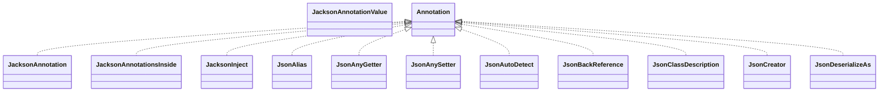

# jackson-annotations-2.21.jar

[Group index](README.md) | [All archives](../README.md)

## Scope and provenance

- **Donor:** `SQX_145_REFERENCE_ROOT/internal/libs/jackson-annotations-2.21.jar`.
- **SHA-256:** `53ca085f4a150f703f49e1aabd935bd03b43e1ea3d55d135438292af22cef56b`; accessed 2026-10-06; captured `2026-10-06T18:54:51.906614+00:00`.
- **Classes:** 76 raw entries; 76 unique entry names. Duplicate occurrence indices are zero-based.
- **Inspection:** read-only ZIP hashing and class-file structural parsing; signatures/descriptors, modifiers, hierarchy and references only. Bytecode bodies are hashed, not published.
- **Allocation:** proposed `FEAT-HOST-JACKSON-ANNOTATIONS`, P02; [roadmap](../../sqx-full-application-roadmap.md). Domain README registration remains required.
- **Repository:** `01067f00031428613c6394064ca1bcadc1ba00ee`; review state unreviewed. Download label 145-dev1; installed build/activation and runtime equivalence unverified.
- **Limit:** every class/member is inventoried; declaration coverage does not establish consumed calls, defaults, formulas, failure semantics or algorithm parity.
- **Archive/resource index:** [042.json](../../../evidence/sqx145/archives/145/042.json).

## Complete member declarations

Member shards contain exact JVM names/descriptors, access flags, generic signatures, throws types, declared fields/methods, superclass/interfaces and referenced class names. All classes, nested/synthetic members and overloads are retained. Code length/hash is structural evidence, not a normalized algorithm comparison.

- [001.json](../../../evidence/sqx145/members/042/001.json) — SHA-256 `eec1e9dd51520f7982f5413eae0d937aa2992f10535b635d5cd0c4b99a99a951`.

## Focused structural diagram

Up to twelve non-nested classes; arrows show declared inheritance/interfaces only. External type names are not evidence of an available body or an executed dependency.

## Class inventory

| Archive entry | Occurrence | Class SHA-256 | Fields | Methods |
| --- | ---: | --- | ---: | ---: |
| `com/fasterxml/jackson/annotation/JacksonAnnotation.class` | 0 | `4e4d8369edcc7c9793f4f5996d78097d532b4afae54e64c57ad26e4581bd5134` | 0 | 0 |
| `com/fasterxml/jackson/annotation/JacksonAnnotationValue.class` | 0 | `ea28022fea5cf687aa3c9185dbb424df79501eb1d181593d71cd0e9914b2d71a` | 0 | 1 |
| `com/fasterxml/jackson/annotation/JacksonAnnotationsInside.class` | 0 | `fcd482b5b1dc58e190cc45ad17eb4206f36138ffd1f2e1caa3474823a71ff7dd` | 0 | 0 |
| `com/fasterxml/jackson/annotation/JacksonInject$Value.class` | 0 | `823a2ff26b670c2f9fa23533f43c8c5a9ed1bd535f5745297011b8b9de549718` | 5 | 20 |
| `com/fasterxml/jackson/annotation/JacksonInject.class` | 0 | `390c84a6321c8c3928514d5c4d6b8e650a94175d4ac8ee186ac847cf61252e03` | 0 | 3 |
| `com/fasterxml/jackson/annotation/JsonAlias.class` | 0 | `f18b178fe6dfa81a15167982f714cf8ab266a9456b85846cd302dec6d5bde23e` | 0 | 1 |
| `com/fasterxml/jackson/annotation/JsonAnyGetter.class` | 0 | `cfb304aeec3a1b7788626996545332913b8ad5d955049d3e95c485298d94fe93` | 0 | 1 |
| `com/fasterxml/jackson/annotation/JsonAnySetter.class` | 0 | `ee0b765ca811b608732fe7db124454f16e71638e59dfda756170137273395027` | 0 | 1 |
| `com/fasterxml/jackson/annotation/JsonAutoDetect$1.class` | 0 | `6fa26be19e7526c11d9f93d900a4182fbfff3446380799b45942a0b31187e4a9` | 2 | 1 |
| `com/fasterxml/jackson/annotation/JsonAutoDetect$Value.class` | 0 | `b9110cdf2a182d5ee7a67ccd263d2a6888607a5257b91e4ee8fb4376e2339d6e` | 10 | 30 |
| `com/fasterxml/jackson/annotation/JsonAutoDetect$Visibility.class` | 0 | `1508c0315366e70886c4f659b797c84074295c19b23abe33fd50b73e59d4a230` | 7 | 5 |
| `com/fasterxml/jackson/annotation/JsonAutoDetect.class` | 0 | `0c313051b670aac10fcf005d70a4599d31947315bd9329466aacb1af96a0c2c4` | 0 | 6 |
| `com/fasterxml/jackson/annotation/JsonBackReference.class` | 0 | `6f064a8467ba6338056b4cd09920cd4d9fd6755a51c92de5f5a04dcf83d3b043` | 0 | 1 |
| `com/fasterxml/jackson/annotation/JsonClassDescription.class` | 0 | `ae5f60a5a8688c3ac87cd1eb4bf6b0157971f9c66789141539f06c2925207d11` | 0 | 1 |
| `com/fasterxml/jackson/annotation/JsonCreator$Mode.class` | 0 | `d2f3b9de89bfebb2fb348065a67000e3352f4715a6bcce253afd9f21328e34da` | 5 | 4 |
| `com/fasterxml/jackson/annotation/JsonCreator.class` | 0 | `da75432e39990a0ef20819c088412d2020507095ed949e361e544c85a005813b` | 0 | 1 |
| `com/fasterxml/jackson/annotation/JsonDeserializeAs.class` | 0 | `f8bd67a197691baf4b65fea70f19ab659dc9db5ca8dddcac9ab9e029960bff7a` | 0 | 3 |
| `com/fasterxml/jackson/annotation/JsonEnumDefaultValue.class` | 0 | `318bc05f02803c6d46727dc94986228c5f488bfc0c4a18293940e4eb8abc849f` | 0 | 0 |
| `com/fasterxml/jackson/annotation/JsonFilter.class` | 0 | `f498c4d0fe7e5c9d06172babc13d80bb9f3c6a3340d94771e3bd77fee3c64b3b` | 0 | 1 |
| `com/fasterxml/jackson/annotation/JsonFormat$Feature.class` | 0 | `5f8f41af2360f2f482a4e470c13017f2f489e4ba1f8932d027ad99d39279c569` | 12 | 4 |
| `com/fasterxml/jackson/annotation/JsonFormat$Features.class` | 0 | `1e0c2353f37ba595adbd17e6dead21c92f8d222dd79565c297a1e71f925e211e` | 4 | 12 |
| `com/fasterxml/jackson/annotation/JsonFormat$Shape.class` | 0 | `374d3db926afcdbc87b9413a8daf499bd9c9df108da4fb66a4e0ba5952b84779` | 13 | 8 |
| `com/fasterxml/jackson/annotation/JsonFormat$Value.class` | 0 | `946b32ee5327e0589256077129a52b92b4c5c4b21f86d0531f0efc7d0426669a` | 10 | 46 |
| `com/fasterxml/jackson/annotation/JsonFormat.class` | 0 | `f9de22f147aaac132492c9dd7b47d5fe08e8e11a2b6e0b7f8bd2fdec916c2e2e` | 3 | 8 |
| `com/fasterxml/jackson/annotation/JsonGetter.class` | 0 | `41395061ee222848c156fa154ffc370349b841a8d34888b20a2110d008a60c79` | 0 | 1 |
| `com/fasterxml/jackson/annotation/JsonIdentityInfo.class` | 0 | `4379525f903cebea1159e20dc8b9d3452c174bb0ef534b555465e7fac9f7f447` | 0 | 4 |
| `com/fasterxml/jackson/annotation/JsonIdentityReference.class` | 0 | `c10fa564eaacf692880ee2dd6b6fa04007895ba82f99c671ba2fcc7d20a064bf` | 0 | 1 |
| `com/fasterxml/jackson/annotation/JsonIgnore.class` | 0 | `060032981b97d5bc1d0e4ca2126a380c24bcd576ff5899876f2eec9f656b620a` | 0 | 1 |
| `com/fasterxml/jackson/annotation/JsonIgnoreProperties$Value.class` | 0 | `930a421d439f14fca28eb42026986df7cb037c2dc3e93c03e42415391d073057` | 7 | 38 |
| `com/fasterxml/jackson/annotation/JsonIgnoreProperties.class` | 0 | `6e82575d0ce41127ca7979d2e8e1e66485b1f3f7498edb676ae5777a7110c89d` | 0 | 4 |
| `com/fasterxml/jackson/annotation/JsonIgnoreType.class` | 0 | `0a9f1605784b464093fd93a909ff83b404205489072a0b002dd7c336ef458c95` | 0 | 1 |
| `com/fasterxml/jackson/annotation/JsonInclude$Include.class` | 0 | `aba8b9b782a20dcd6faa4f9dc71fdd6abccd0d3db1c9af021571028d593018ee` | 8 | 4 |
| `com/fasterxml/jackson/annotation/JsonInclude$Value.class` | 0 | `499abb21a925818702f0e6b41d389f22645c407ab42e19c00e0828bb94ba70a4` | 11 | 23 |
| `com/fasterxml/jackson/annotation/JsonInclude.class` | 0 | `aad4877dbd9cfd8db729516f333c77409a514523c8052832b7770e0bf31a3475` | 0 | 4 |
| `com/fasterxml/jackson/annotation/JsonIncludeProperties$Value.class` | 0 | `4f22e541f559a03ac0e702267ade125bbdbaba5149215d42a90ad1cd30009fd4` | 3 | 11 |
| `com/fasterxml/jackson/annotation/JsonIncludeProperties.class` | 0 | `0939f2af042e9ec3baf962704a2a538da31a5e95d7a12b4c0761f30ff139c070` | 0 | 1 |
| `com/fasterxml/jackson/annotation/JsonKey.class` | 0 | `7a999fdd54a69fc27f7168530ddbd0504885fe7d93b9081f2c9b7bb4a2262997` | 0 | 1 |
| `com/fasterxml/jackson/annotation/JsonManagedReference.class` | 0 | `e0fc2b59ba16fcde3d0f715c439125e24d4f2af40307bec1696f665fbb5f6a77` | 0 | 1 |
| `com/fasterxml/jackson/annotation/JsonMerge.class` | 0 | `6293e8fb59ed90519e1817f634f4c81cffc1b06f5a16f314fa80b95e438f90b1` | 0 | 1 |
| `com/fasterxml/jackson/annotation/JsonProperty$Access.class` | 0 | `5c46927ce71c392f34e86f7355bbf93551d1c1e383a08e10654948c71b0d1553` | 5 | 4 |
| `com/fasterxml/jackson/annotation/JsonProperty.class` | 0 | `0b45fdc2915150f5f302863aec05aeb875139cdf0dfc752fcfa39dc85a032e15` | 2 | 7 |
| `com/fasterxml/jackson/annotation/JsonPropertyDescription.class` | 0 | `f33e5c9264cdf2de3676a62670b9a4c99fe80b8872ffebffcdf53973ab5f3f2e` | 0 | 1 |
| `com/fasterxml/jackson/annotation/JsonPropertyOrder.class` | 0 | `1813742509bf53c732dd212b05ced870bb6698d619b2255bf366f708343a3c52` | 0 | 2 |
| `com/fasterxml/jackson/annotation/JsonRawValue.class` | 0 | `7d9125ed94581a32640f7e4e0816a42c32c2e3ef4ac30e48b1e45edc863eb947` | 0 | 1 |
| `com/fasterxml/jackson/annotation/JsonRootName.class` | 0 | `77e8867283674f1a9cfff6e8f5fa0c145eca336b1002bf009918628eba6b22d9` | 0 | 2 |
| `com/fasterxml/jackson/annotation/JsonSerializeAs.class` | 0 | `351dc9901fa5ae09cf681a570117e4cd607e9bcaaa4fa22b25c258dbfc50cf3c` | 0 | 3 |
| `com/fasterxml/jackson/annotation/JsonSetter$Value.class` | 0 | `b7c701a538c8154934868dc9a894d77f52903bb50657678728d8c73e15566769` | 4 | 23 |
| `com/fasterxml/jackson/annotation/JsonSetter.class` | 0 | `b25689ae3136b8c8d2cdb2db241643338d6da428df05e193199a04d17f9047e1` | 0 | 3 |
| `com/fasterxml/jackson/annotation/JsonSubTypes$Type.class` | 0 | `c2e62f8369dc7cb9ce90b95eef24c6f4e32a1dff896629979b2dfb7e42abf00b` | 0 | 3 |
| `com/fasterxml/jackson/annotation/JsonSubTypes.class` | 0 | `b07d46d508fcd0769f85667496b26cd42b0c80878239172c75cff849bab24917` | 0 | 2 |
| `com/fasterxml/jackson/annotation/JsonTypeId.class` | 0 | `04cd8a3b6c3f98dc7aee1071265cfd2b13468b3006e1c6c77d98a15b4a6d24f0` | 0 | 0 |
| `com/fasterxml/jackson/annotation/JsonTypeInfo$As.class` | 0 | `871e16c968b44fb8cbcb43d06889247487521209c287962ef31806f10c48a952` | 7 | 4 |
| `com/fasterxml/jackson/annotation/JsonTypeInfo$Id.class` | 0 | `14e05bcc38547e8c6f45a6dab845053216246dee1945f79ef81dc50e140f8e17` | 9 | 5 |
| `com/fasterxml/jackson/annotation/JsonTypeInfo$None.class` | 0 | `0f25ae9f3fedf9aaa7cf0ea1ea4a1f78d4c4406b155e64234d43b8da7f36e75f` | 0 | 1 |
| `com/fasterxml/jackson/annotation/JsonTypeInfo$Value.class` | 0 | `6162c3c7d20b001abf7cf9446dbc16c631c2112f391a644ba81ae2672740347e` | 8 | 22 |
| `com/fasterxml/jackson/annotation/JsonTypeInfo.class` | 0 | `ce1edbbed021b6640c4efa9618fd9985cbacb8898b511b36a43597007330d87d` | 0 | 6 |
| `com/fasterxml/jackson/annotation/JsonTypeName.class` | 0 | `0b16a98b4282969ce647c3b0f35ffa620cfd2ed6a27af755778bdbfc8c65d03a` | 0 | 1 |
| `com/fasterxml/jackson/annotation/JsonUnwrapped.class` | 0 | `53ec1d95c200b40bf07398230e403556210e1dd1c06e58ada0acbb5722781379` | 0 | 3 |
| `com/fasterxml/jackson/annotation/JsonValue.class` | 0 | `aea990c2ae47aca8ead5d0b344b71ad297c2bd05354b266415120bbbd9bf74a2` | 0 | 1 |
| `com/fasterxml/jackson/annotation/JsonView.class` | 0 | `b38e34502e1ef9d32c54703071ade56e34598140033b3c5584547358be426e3a` | 0 | 1 |
| `com/fasterxml/jackson/annotation/Nulls.class` | 0 | `8140e97a898c729f4cfc3bdc2c4098fdf7c6a9746afb7cf210dc04c1b990bac8` | 6 | 4 |
| `com/fasterxml/jackson/annotation/ObjectIdGenerator$IdKey.class` | 0 | `12169f48e67f39dbf780a52f162b026db45307611c8d274617d9d7fd99ff4325` | 5 | 4 |
| `com/fasterxml/jackson/annotation/ObjectIdGenerator.class` | 0 | `7123ef2fdced16f02ccb4475a2ec1024e83b88335207e34a58f6eb681ec4a7fb` | 0 | 9 |
| `com/fasterxml/jackson/annotation/ObjectIdGenerators$Base.class` | 0 | `442499f196b99dffd100cbec7a647657e4fe987269cb29378814eace8b2b8948` | 1 | 4 |
| `com/fasterxml/jackson/annotation/ObjectIdGenerators$IntSequenceGenerator.class` | 0 | `bdc8b39809bc37e21a192cf3ddbf51023bcd3bbc176fb2899a56384c88f53573` | 2 | 9 |
| `com/fasterxml/jackson/annotation/ObjectIdGenerators$None.class` | 0 | `62db0fb7933df9298671a84fe25178a1b2818a18e9278eb71ec7b806ea72f092` | 0 | 1 |
| `com/fasterxml/jackson/annotation/ObjectIdGenerators$PropertyGenerator.class` | 0 | `3bf75633f3fe7f64316df08258d2a688f4433611c6a128d2717df09494095840` | 1 | 2 |
| `com/fasterxml/jackson/annotation/ObjectIdGenerators$StringIdGenerator.class` | 0 | `eb1d24bfcba021d315493718270221810dbe02174208952d0b9ea6d06d6fdb3d` | 1 | 8 |
| `com/fasterxml/jackson/annotation/ObjectIdGenerators$UUIDGenerator.class` | 0 | `2c97c8d82c9d7da7d4b54d9742c16c106fb51fb611ad5f355e3414ad8898a611` | 1 | 8 |
| `com/fasterxml/jackson/annotation/ObjectIdGenerators.class` | 0 | `6689bf2e58b589f26daa57903989b2eb2b26294624f625e2bc723fd8796c7aff` | 0 | 1 |
| `com/fasterxml/jackson/annotation/ObjectIdResolver.class` | 0 | `064777f1efcdf670d2ceca13d815c8f5621b500b3e532d2fd49f289ca185dd71` | 0 | 4 |
| `com/fasterxml/jackson/annotation/OptBoolean.class` | 0 | `d9c052503ff5cd7167ebdd34b92c7beff5a77924f29ec731a509cac5b287542c` | 4 | 8 |
| `com/fasterxml/jackson/annotation/PropertyAccessor.class` | 0 | `e0b86dc88a1f11633462455037a6013aa80bd9ae28908956d4be25969f0d962c` | 9 | 10 |
| `com/fasterxml/jackson/annotation/SimpleObjectIdResolver.class` | 0 | `c3a1129a99d74585c7452789ce2b29ae7c200e536ca2113d56c4a728c3b5d5c1` | 1 | 6 |
| `com/fasterxml/jackson/annotation/package-info.class` | 0 | `9443a2ed8691f73fc70f922f12d0bb40d057aaedba2befa7f5a5d0fe5ba8fa3a` | 0 | 0 |
| `module-info.class` | 0 | `bd4027b606814e7613f2cf90c63578ba2015a6a0513350dc82fc834396585ae1` | 0 | 0 |
