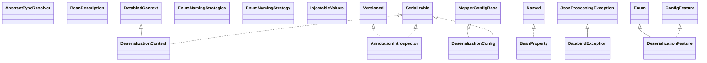

# jackson-databind-2.21.1.jar

[Group index](README.md) | [All archives](../README.md)

## Scope and provenance

- **Donor:** `SQX_145_REFERENCE_ROOT/internal/libs/jackson-databind-2.21.1.jar`.
- **SHA-256:** `b011eb5202d9ec889e27f1dcbdf6c63f06a76e7a16c0a1b30c6048d556c9a28e`; accessed 2026-10-06; captured `2026-10-06T18:54:51.906614+00:00`.
- **Classes:** 813 raw entries; 813 unique entry names. Duplicate occurrence indices are zero-based.
- **Inspection:** read-only ZIP hashing and class-file structural parsing; signatures/descriptors, modifiers, hierarchy and references only. Bytecode bodies are hashed, not published.
- **Allocation:** proposed `FEAT-HOST-JACKSON-DATABIND`, P02; [roadmap](../../sqx-full-application-roadmap.md). Domain README registration remains required.
- **Repository:** `01067f00031428613c6394064ca1bcadc1ba00ee`; review state unreviewed. Download label 145-dev1; installed build/activation and runtime equivalence unverified.
- **Limit:** every class/member is inventoried; declaration coverage does not establish consumed calls, defaults, formulas, failure semantics or algorithm parity.
- **Archive/resource index:** [044.json](../../../evidence/sqx145/archives/145/044.json).

## Complete member declarations

Member shards contain exact JVM names/descriptors, access flags, generic signatures, throws types, declared fields/methods, superclass/interfaces and referenced class names. All classes, nested/synthetic members and overloads are retained. Code length/hash is structural evidence, not a normalized algorithm comparison.

- [001.json](../../../evidence/sqx145/members/044/001.json) — SHA-256 `4727055e3b58eebe6c57eeee7b9ac2557a29645c0f661e5ef7ddd433182cef83`.
- [002.json](../../../evidence/sqx145/members/044/002.json) — SHA-256 `5c2f54c5d8405ed6bdd6cdc75ec369531b0ee6ca4f5dc2fede0e70a50541b4b9`.
- [003.json](../../../evidence/sqx145/members/044/003.json) — SHA-256 `17422ba39685e75b477fd38829d365940d37724901edebe320a57fa14f28f9b2`.
- [004.json](../../../evidence/sqx145/members/044/004.json) — SHA-256 `dcc5376356cc5996baf988c7c7fe9954b0aece9d47717ea2c09c9c0f7451deb0`.
- [005.json](../../../evidence/sqx145/members/044/005.json) — SHA-256 `d2eaf68bfc68fd2d3fe54bdfa9c4fdda9c967c14ebb9d6f6586d3b155f1d4372`.
- [006.json](../../../evidence/sqx145/members/044/006.json) — SHA-256 `ff41bd387fbd21d1bb4176330b0cb362b98997a527af9efa010086a268f35cd4`.
- [007.json](../../../evidence/sqx145/members/044/007.json) — SHA-256 `023b76be6f539321309f4348a7ef6a2255490e34e7530e9b3713d1d42d7613da`.
- [008.json](../../../evidence/sqx145/members/044/008.json) — SHA-256 `b3e6b2451b9aaad396a35d6e44beb3a0bddaae8694c8143859de272c7471fc74`.
- [009.json](../../../evidence/sqx145/members/044/009.json) — SHA-256 `2ef54fae355094c197063c5fbca16f3eb014963e8f27d0cda38dab6a6e996bbb`.
- [010.json](../../../evidence/sqx145/members/044/010.json) — SHA-256 `579187d25bfd21b605f287654ab30587794f5e773bae960fe6dc344db5d1205f`.
- [011.json](../../../evidence/sqx145/members/044/011.json) — SHA-256 `8bc10b60f0cf71225beb9109501af34100982e5755e474b7b6738900780053d7`.

## Focused structural diagram

Up to twelve non-nested classes; arrows show declared inheritance/interfaces only. External type names are not evidence of an available body or an executed dependency.

## Class inventory

| Archive entry | Occurrence | Class SHA-256 | Fields | Methods |
| --- | ---: | --- | ---: | ---: |
| `com/fasterxml/jackson/databind/AbstractTypeResolver.class` | 0 | `3f0c264e904291af93720b141f5d962af9b22fe12c3002ac8b4b94d9b04c002a` | 0 | 4 |
| `com/fasterxml/jackson/databind/AnnotationIntrospector$ReferenceProperty$Type.class` | 0 | `56fd9ec2a6e0aeceb56f9e8e18e3843041010fdc505524c8dc66912e57328d1b` | 3 | 4 |
| `com/fasterxml/jackson/databind/AnnotationIntrospector$ReferenceProperty.class` | 0 | `4152591ad6f765431b70d4da87768291047324c7c29bea782a1af1d99f0ac20f` | 2 | 7 |
| `com/fasterxml/jackson/databind/AnnotationIntrospector$XmlExtensions.class` | 0 | `2cc6224b6a8ca5ee38a5a9a3800055ed35aa1c46bfcff4f15d6ea502adc7d922` | 0 | 4 |
| `com/fasterxml/jackson/databind/AnnotationIntrospector.class` | 0 | `d4ada82bb2843af6de79ef0ba3c43197cf65eba6d74aea9f40679c78fabbbe26` | 0 | 89 |
| `com/fasterxml/jackson/databind/BeanDescription.class` | 0 | `4d504431a78a4fae9eec04d726b74355334ce01c49e166d378b55db805aae925` | 1 | 34 |
| `com/fasterxml/jackson/databind/BeanProperty$Bogus.class` | 0 | `85e16e4af248db9611fb11421af9fdc250aaaeceb0fa0eda833e8e137fc348ad` | 0 | 16 |
| `com/fasterxml/jackson/databind/BeanProperty$Std.class` | 0 | `fb9c28cfbe2263a74c7edab3bcf80425d292c2f438d2443fb2eb14637afa0c8d` | 6 | 19 |
| `com/fasterxml/jackson/databind/BeanProperty.class` | 0 | `8eedcc2a6d97b29fea3779cd8aa9a9b9b33463672d1b8df4a6b69442114ab674` | 2 | 16 |
| `com/fasterxml/jackson/databind/DatabindContext.class` | 0 | `cd6952c2cd7cc6442b23dbbc6a31bf756fc6da3f667c1f98f980a3249d447129` | 1 | 34 |
| `com/fasterxml/jackson/databind/DatabindException.class` | 0 | `0d397b288e9201646c0289b1d391247c1e58025cbdce0673249b9fbfe3bd9e0e` | 1 | 6 |
| `com/fasterxml/jackson/databind/DeserializationConfig.class` | 0 | `37d5b461a5879c93923e5269a06035a84e97b9a1500cf32eb29537e67b60c4fe` | 11 | 68 |
| `com/fasterxml/jackson/databind/DeserializationContext.class` | 0 | `2f5e6aa6c43ba6801e590b81ea7537e75623137939acea9bdecfb539cfa4dc01` | 14 | 111 |
| `com/fasterxml/jackson/databind/DeserializationFeature.class` | 0 | `0b176f7b4c0f3f95fee63d6f2ac31ba29f5941b121b789499054d68241108da2` | 34 | 7 |
| `com/fasterxml/jackson/databind/EnumNamingStrategies$CamelCaseStrategy.class` | 0 | `97f6d5e46755361e1ad75ae78b1cbb44e2f9f57d6795b11dac82992e35dbae15` | 1 | 2 |
| `com/fasterxml/jackson/databind/EnumNamingStrategies$DelegatingEnumNamingStrategy.class` | 0 | `06596544e63749466623935a6ca4e6418307598930a56c54ff79f091c303394c` | 1 | 5 |
| `com/fasterxml/jackson/databind/EnumNamingStrategies$KebabCaseStrategy.class` | 0 | `4ff93044300850bec6e12cc024c886be41c4ba0a8af5f72d5d89a8623256a698` | 1 | 2 |
| `com/fasterxml/jackson/databind/EnumNamingStrategies$LowerCamelCaseStrategy.class` | 0 | `9b9ee24e5015ac303783821f54f1584dcaf485b9dde096257ba4c8f4954ccde9` | 1 | 2 |
| `com/fasterxml/jackson/databind/EnumNamingStrategies$LowerCaseStrategy.class` | 0 | `9f933490b2d0ea270062f63b6b6417ac522db6801133468e2fb836e732d4a100` | 1 | 2 |
| `com/fasterxml/jackson/databind/EnumNamingStrategies$LowerDotCaseStrategy.class` | 0 | `a8b949c2e5e426a6714795dfba495bca12f91cf71a04cf929368aa137bf565f7` | 1 | 2 |
| `com/fasterxml/jackson/databind/EnumNamingStrategies$SnakeCaseStrategy.class` | 0 | `cea50e63c22b03a16e7fce60d506864b4ecd7b02c1edd7e0d2ba1e2247c1d2b4` | 1 | 2 |
| `com/fasterxml/jackson/databind/EnumNamingStrategies$UpperCamelCaseStrategy.class` | 0 | `595565dad90031f00a85731da16d3eb2e1cd1189df408e342bab5c6492f0183a` | 1 | 2 |
| `com/fasterxml/jackson/databind/EnumNamingStrategies$UpperSnakeCaseStrategy.class` | 0 | `13c4d0225a8d9d8234349729d260bc892bc41d65148d6ea67c337711415bccc2` | 1 | 2 |
| `com/fasterxml/jackson/databind/EnumNamingStrategies.class` | 0 | `c366911f2b86436eff73da5729779938558f4877aefd8b232df65a12916c9828` | 7 | 2 |
| `com/fasterxml/jackson/databind/EnumNamingStrategy.class` | 0 | `85ffc219eb72ec9cc6ec5cc2be0245eac69507d906525022084401aa89da3d09` | 0 | 1 |
| `com/fasterxml/jackson/databind/InjectableValues$Base.class` | 0 | `cb670c75fd61d1e925582763f2363ea4e8b7c3873f8152365daf9e902d08bcd3` | 1 | 4 |
| `com/fasterxml/jackson/databind/InjectableValues$Empty.class` | 0 | `fdf179bfa1c2dcb8c08e8cbf74955102513fd98da0f9eef518ac6a7908974b31` | 2 | 3 |
| `com/fasterxml/jackson/databind/InjectableValues$Std.class` | 0 | `29022546b542b0406dcb75c13ea3af479efa09acd8b9f247428b00158f50a6ae` | 2 | 5 |
| `com/fasterxml/jackson/databind/InjectableValues.class` | 0 | `9e9ad80b032da15eea5678ab687981d00312ad31c7df09a24d46f2bcd5d10e76` | 0 | 4 |
| `com/fasterxml/jackson/databind/JavaType.class` | 0 | `13113220d6715eda213a568580ff434d386c4c82f9179295e915593f8e9ba6fb` | 6 | 64 |
| `com/fasterxml/jackson/databind/JsonDeserializer$None.class` | 0 | `49f0f0af25d6315effb3e184a661f97de698723b282084253098a5878a398b0c` | 0 | 1 |
| `com/fasterxml/jackson/databind/JsonDeserializer.class` | 0 | `091e591f6499d2faa6b1599b955b802f82ad6d80dd0c78b33dfca96ee1fca468` | 0 | 22 |
| `com/fasterxml/jackson/databind/JsonMappingException$Reference.class` | 0 | `add9527283fc92ce1129d4870ae6cbd3594a6cf9a66543ae70ad4f81cfc7e340` | 5 | 13 |
| `com/fasterxml/jackson/databind/JsonMappingException.class` | 0 | `06544992ad9bf4914a6e397558ac43d2a49bc663e1d0ff9fd893c416f2dc50ab` | 4 | 35 |
| `com/fasterxml/jackson/databind/JsonNode$1.class` | 0 | `8fe42e22d529066c82faefb5b7262019fa0a93541da944f04b770eeff2bc1314` | 1 | 1 |
| `com/fasterxml/jackson/databind/JsonNode$OverwriteMode.class` | 0 | `7bb4ebf1af8df0cd226e76a118be458a87c8c01a80b6cefd514e8183c818023f` | 5 | 4 |
| `com/fasterxml/jackson/databind/JsonNode.class` | 0 | `d09743a5e26cd41e4a0a5f6c270458bc0e640b1dd15003d7f11ecbd5165e3879` | 0 | 110 |
| `com/fasterxml/jackson/databind/JsonSerializable$Base.class` | 0 | `61328094c81e2c3d5979e0445027eca218580441b669faa99c450c2a5da050cc` | 0 | 2 |
| `com/fasterxml/jackson/databind/JsonSerializable.class` | 0 | `e1eeccb9777b5c4744043eca45c7b85f4b88e16ed9970219c2cf6c5484acdd01` | 0 | 2 |
| `com/fasterxml/jackson/databind/JsonSerializer$None.class` | 0 | `b993cefe25ea67bd5aee7ec4329412a7cd8fdbef5178146afddb2e712bb73454` | 0 | 1 |
| `com/fasterxml/jackson/databind/JsonSerializer.class` | 0 | `c930b42211d18f2f3b8bef4d3355bc87c21903ab1b20b8aeaf46a68bc2fbfc6b` | 0 | 15 |
| `com/fasterxml/jackson/databind/KeyDeserializer$None.class` | 0 | `1ed83299e3d79716e75c49f1e96fd87f748c09069ea52f6053525093465fcee9` | 0 | 1 |
| `com/fasterxml/jackson/databind/KeyDeserializer.class` | 0 | `21e2140236b3bd808ffc15282eb2d48be045e0e10635d93f01819a178f32b454` | 0 | 2 |
| `com/fasterxml/jackson/databind/MapperFeature.class` | 0 | `4fd718bc3fc84bf719e00e8af6df7de606be63ce4a2d5535188d38c798ec75ea` | 42 | 10 |
| `com/fasterxml/jackson/databind/MappingIterator.class` | 0 | `dc34c69ccb4f7324a5b9d942bbcf4800297e3d68807a8f66a378ebb4ff24b03d` | 13 | 20 |
| `com/fasterxml/jackson/databind/MappingJsonFactory.class` | 0 | `3768e935dc3862cc1932c374cba8c0816bc0327c39b71b7b7221aef578f8d615` | 1 | 8 |
| `com/fasterxml/jackson/databind/Module$SetupContext.class` | 0 | `9089723888cf01db61be82a72e7028adf0efb7b8afcd6a721479df6098933688` | 0 | 28 |
| `com/fasterxml/jackson/databind/Module.class` | 0 | `d70401f86eb2ffe5c8f718b7b5e7a97eb97acb363f8c77576de7f1670cb5627a` | 0 | 6 |
| `com/fasterxml/jackson/databind/ObjectMapper$1.class` | 0 | `41931d572765d071be5904180501e3d726e5a8dec3e7bc16646a2e2b5a5ee796` | 1 | 29 |
| `com/fasterxml/jackson/databind/ObjectMapper$2.class` | 0 | `dc11db09f703b096b87087aab332fe1f3b9d8a776b45cafc40f8d4f476232ec0` | 2 | 3 |
| `com/fasterxml/jackson/databind/ObjectMapper$3.class` | 0 | `128f7c9506b07e683869e113d25bf260a033492efad1a4d09007bf0a67a02bd0` | 1 | 1 |
| `com/fasterxml/jackson/databind/ObjectMapper$DefaultTypeResolverBuilder.class` | 0 | `e88f403d38a56544a319cabd29ff059fc209aa203d148154cde3901cf557c2a4` | 3 | 12 |
| `com/fasterxml/jackson/databind/ObjectMapper$DefaultTyping.class` | 0 | `02ae72c55ef3c934813a384256c9d6a4d371a16698307f449e77b340b6967219` | 7 | 4 |
| `com/fasterxml/jackson/databind/ObjectMapper.class` | 0 | `3db70cc7d6163bde945c4dbc52a719ffa4410310cbe407b89f08a1727bf8f8e6` | 17 | 279 |
| `com/fasterxml/jackson/databind/ObjectReader.class` | 0 | `001a91860329fc36bd3be38feeabb2889494632a825311ded498423ff5013392` | 14 | 166 |
| `com/fasterxml/jackson/databind/ObjectWriter$GeneratorSettings.class` | 0 | `14f2ca5f84d06ef5f4a64445f5637cf1d937f76578bad008542f0f2b5d7f5e9a` | 6 | 9 |
| `com/fasterxml/jackson/databind/ObjectWriter$Prefetch.class` | 0 | `19cc1eed5f38846c3eb9d14efb49c400a6c017bfab9e12a4b8fe0ac6d0ff2370` | 5 | 7 |
| `com/fasterxml/jackson/databind/ObjectWriter.class` | 0 | `61b97d63ca89fc0c4dbfd89f83789e0af60bea5ff3f3cc67a27ec8d758b9225b` | 8 | 102 |
| `com/fasterxml/jackson/databind/PropertyMetadata$MergeInfo.class` | 0 | `61b80e234bfbcacff3f99fa88d11a3d6290012e561b463449a6c27b1ca82a906` | 2 | 4 |
| `com/fasterxml/jackson/databind/PropertyMetadata.class` | 0 | `ad94a57a2625f5fde96cee93f168ad407a693dc8bbe16eb9e9d62c9193e5b473` | 11 | 21 |
| `com/fasterxml/jackson/databind/PropertyName.class` | 0 | `234f1fd293c922f54be718b82ac7ed35e976c86c5b41ab8f25d4987d4a4bda5c` | 8 | 21 |
| `com/fasterxml/jackson/databind/PropertyNamingStrategies$KebabCaseStrategy.class` | 0 | `13310e5971a725d4447f9e71f1caa8e4dbefacc2663c921a74e253f49032a842` | 2 | 3 |
| `com/fasterxml/jackson/databind/PropertyNamingStrategies$LowerCamelCaseStrategy.class` | 0 | `bf24d769565d0960938741a905caabfc7e660c89fc0119161b8e8ff7d452eed8` | 2 | 3 |
| `com/fasterxml/jackson/databind/PropertyNamingStrategies$LowerCaseStrategy.class` | 0 | `b3426d7361131c245961cb3f2dd386255a3d018e0681a55e5fe44954e9c69082` | 2 | 3 |
| `com/fasterxml/jackson/databind/PropertyNamingStrategies$LowerDotCaseStrategy.class` | 0 | `5cea1f981aa0ba2936b76b782aa7ce0500d0ffbc1948fcad8ad932ec4a8d8537` | 2 | 3 |
| `com/fasterxml/jackson/databind/PropertyNamingStrategies$NamingBase.class` | 0 | `109314f4822d93548b8bfbb2382485e2693145a0ced72fe893fac6966b718c86` | 1 | 6 |
| `com/fasterxml/jackson/databind/PropertyNamingStrategies$SnakeCaseStrategy.class` | 0 | `b42d8134db942917c7b24a550956bec58e254922cbc5458e0d5edb6b227c958c` | 2 | 3 |
| `com/fasterxml/jackson/databind/PropertyNamingStrategies$UpperCamelCaseStrategy.class` | 0 | `7dc1e338864dc7621e4b2e3727d7b7d78d8943bfbeba1ccfe734913f06ea7f66` | 2 | 3 |
| `com/fasterxml/jackson/databind/PropertyNamingStrategies$UpperSnakeCaseStrategy.class` | 0 | `7a98b74808307e0d07725a3e4a860c7d5758241629d1c41ecbd005019c0d89af` | 2 | 3 |
| `com/fasterxml/jackson/databind/PropertyNamingStrategies.class` | 0 | `e004c3f725563f12fc35c1119fd7b3ec658f84bdeec2f4daf90cb3dc96b58cbf` | 8 | 2 |
| `com/fasterxml/jackson/databind/PropertyNamingStrategy.class` | 0 | `cd6365f109b9a1f4380b717375b6aa9e7fa0f26fbafe329e2d2b28da16705e72` | 1 | 5 |
| `com/fasterxml/jackson/databind/RuntimeJsonMappingException.class` | 0 | `30e795bd8583dd0c51211eda9f0cfe34a72802dc478ff80f4e80113d549b278d` | 0 | 3 |
| `com/fasterxml/jackson/databind/SequenceWriter.class` | 0 | `e7827583d546f84262736a5c49e81924b199b347e173a0bf068d81a6e517b94a` | 11 | 14 |
| `com/fasterxml/jackson/databind/SerializationConfig.class` | 0 | `f2684825912083107a998f1cc95ee89a5d8e46e5fec5433710a5ccb746c4e3ac` | 11 | 64 |
| `com/fasterxml/jackson/databind/SerializationFeature.class` | 0 | `317ed132af9538eabb1e640809da366b0b7dd6f5242fee3f99ecbbc598c1da47` | 30 | 7 |
| `com/fasterxml/jackson/databind/SerializerProvider.class` | 0 | `e2ead1021fe8fd326ad5328d26599a53045431c0fda4d1d2cb3260cabeac6db0` | 15 | 82 |
| `com/fasterxml/jackson/databind/annotation/EnumNaming.class` | 0 | `bc5b59c03af0168890fe5b8a19abbeb4e5e589d1ec34b5fb548e6c76e7f07afc` | 0 | 1 |
| `com/fasterxml/jackson/databind/annotation/JacksonStdImpl.class` | 0 | `81cf97aff9b0c6e638d0be666e3713f825f115bf648946ba036c48c3f14cf6b7` | 0 | 0 |
| `com/fasterxml/jackson/databind/annotation/JsonAppend$Attr.class` | 0 | `2382af1b4feb149eb19030ee99b6af56bd995317d25076b2ce851239db8c6b08` | 0 | 5 |
| `com/fasterxml/jackson/databind/annotation/JsonAppend$Prop.class` | 0 | `b65fa200899828bf504febef80dd7287d93861e2895bb6d5b2ce724635a49dc8` | 0 | 6 |
| `com/fasterxml/jackson/databind/annotation/JsonAppend.class` | 0 | `2b02290d57caa7e193daca683da8bf0ab1751b7fd1e8f66e3b8e3deae2d5e3a5` | 0 | 3 |
| `com/fasterxml/jackson/databind/annotation/JsonDeserialize.class` | 0 | `14a4b2a6c416b14f243db73def80d209b39d4d7e695c5f979947c6d3009050f7` | 0 | 9 |
| `com/fasterxml/jackson/databind/annotation/JsonNaming.class` | 0 | `8979ae09aca914ab0b9854e6322c9d545911464ac8f596baab1dd785c40a3486` | 0 | 1 |
| `com/fasterxml/jackson/databind/annotation/JsonPOJOBuilder$Value.class` | 0 | `af34f95ef62809277763c3503c4425cfef5a52397ce9a31553d7d14b2a9bb4b1` | 2 | 2 |
| `com/fasterxml/jackson/databind/annotation/JsonPOJOBuilder.class` | 0 | `7f17db7bd895801e8698ffe7d2ed0e84d23dcc742c7b03f8bc4f00f66fbf6d40` | 2 | 2 |
| `com/fasterxml/jackson/databind/annotation/JsonSerialize$Inclusion.class` | 0 | `1b46585746fba2dfd2b4408d021a153464408b1be0353163cc8764af15976ce9` | 6 | 4 |
| `com/fasterxml/jackson/databind/annotation/JsonSerialize$Typing.class` | 0 | `ba334e599d77249ed1df7403cd8abc8591b139365013735652029b62a2c0593b` | 4 | 4 |
| `com/fasterxml/jackson/databind/annotation/JsonSerialize.class` | 0 | `bae82b01720313838e7711b9ae152d0a9ff7c65d5b83514416156ee738116db5` | 0 | 11 |
| `com/fasterxml/jackson/databind/annotation/JsonTypeIdResolver.class` | 0 | `cceb72c238cc39480a210645ec1ae19f8dffc5607c1ee0860f2391d32b58c144` | 0 | 1 |
| `com/fasterxml/jackson/databind/annotation/JsonTypeResolver.class` | 0 | `1820cc68195348e9aef8e5d5676fb55f6d92e01310c0679a4bd905788e4ba2d4` | 0 | 1 |
| `com/fasterxml/jackson/databind/annotation/JsonValueInstantiator.class` | 0 | `1bc257d17c3687facba05f0f9a6192718a8da4110ec461684761d119183196ac` | 0 | 1 |
| `com/fasterxml/jackson/databind/annotation/NoClass.class` | 0 | `cbfe83619163fd7e3ae35431a757e492f266f138ddb058420e405ce9a706c8d0` | 0 | 1 |
| `com/fasterxml/jackson/databind/annotation/package-info.class` | 0 | `e6a3b8c253a40b0ad648b55715b6391871e681474b506ecd697d139be34e3385` | 0 | 0 |
| `com/fasterxml/jackson/databind/cfg/BaseSettings.class` | 0 | `0bcab00b2faeb999f95d379f411b42e458ea85b389ef84b56407c69f238f80d3` | 16 | 37 |
| `com/fasterxml/jackson/databind/cfg/CacheProvider.class` | 0 | `42ffd679274ae17dd8d75edbe67bf005b90e53a92a3a7fdabc8855ac9f5140fe` | 0 | 3 |
| `com/fasterxml/jackson/databind/cfg/CoercionAction.class` | 0 | `630c36663f6fd42125a07ea0a22f85dcc8b4bda58f025c46992b3551ba9daae2` | 5 | 4 |
| `com/fasterxml/jackson/databind/cfg/CoercionConfig.class` | 0 | `4d6fdae273e1d1add5bda933e23860a836736b16a9141fe1a7f026b992e159ec` | 4 | 5 |
| `com/fasterxml/jackson/databind/cfg/CoercionConfigs$1.class` | 0 | `48f48ca52e46d18eb2d45cb48971c8095a3fa908b5183348601f0dafd698bf62` | 1 | 1 |
| `com/fasterxml/jackson/databind/cfg/CoercionConfigs.class` | 0 | `561504d9cb42bb33e6c7e8725c57e7c1b9a79c0d0de701b4166197b955941142` | 6 | 11 |
| `com/fasterxml/jackson/databind/cfg/CoercionInputShape.class` | 0 | `dfbadcce44d89289b1debf40cf3064c09929fdfd8cea1fc885eb23c56b1015ac` | 11 | 4 |
| `com/fasterxml/jackson/databind/cfg/ConfigFeature.class` | 0 | `6b64ca29ba9c5c67b12128d6b9c75f87e739bf5a66faf6298da7fa483abf70f1` | 0 | 3 |
| `com/fasterxml/jackson/databind/cfg/ConfigOverride$Empty.class` | 0 | `505b603d595bb2c34cf8f879130c4b963778bc67a19c42af91912edfee3aa338` | 1 | 2 |
| `com/fasterxml/jackson/databind/cfg/ConfigOverride.class` | 0 | `8963ff9807683a3b56a30efacbe696243d0bcca45c66ac96636478fb843c10ee` | 8 | 11 |
| `com/fasterxml/jackson/databind/cfg/ConfigOverrides.class` | 0 | `25defeafbfee2a95c90b92f412c3aaa5871267b5cd46060e708587618e02d390` | 7 | 18 |
| `com/fasterxml/jackson/databind/cfg/ConstructorDetector$SingleArgConstructor.class` | 0 | `c5c8e003f33d328230193b3c7bc9b525d2197ed4a44897d56e27c3d7434d1d3a` | 5 | 4 |
| `com/fasterxml/jackson/databind/cfg/ConstructorDetector.class` | 0 | `ea9e1830bc8b917b810fea30b7ff7a70bd8b42163ca4330594341cff7a23d63e` | 8 | 12 |
| `com/fasterxml/jackson/databind/cfg/ContextAttributes$Impl.class` | 0 | `3825b157e1aa22f0023e47305547d4349c85f48d846a7562a34ce840079abfb2` | 5 | 11 |
| `com/fasterxml/jackson/databind/cfg/ContextAttributes.class` | 0 | `d315d422346d1e1a6d6d1bc20c00cd74309ad7e9732a50e9580e28ad538ace72` | 0 | 7 |
| `com/fasterxml/jackson/databind/cfg/DatatypeFeature.class` | 0 | `6b75b76016c1549f5ca3a832503fa92f7eda2c3d5720543c4675ce9ec94141a4` | 0 | 1 |
| `com/fasterxml/jackson/databind/cfg/DatatypeFeatures$DefaultHolder.class` | 0 | `139ad56ae57ce9872d528363065cf496e019898daaf7a5664d69da450a51afd7` | 1 | 4 |
| `com/fasterxml/jackson/databind/cfg/DatatypeFeatures.class` | 0 | `aa68a4cb50883268c9526232c178fb814f202f32f808309c77936ce89327829d` | 7 | 13 |
| `com/fasterxml/jackson/databind/cfg/DefaultCacheProvider$Builder.class` | 0 | `37e735f70a3013a04b7d8644aedde7ac709c7a93a3e95478a5279d5d8c8e548c` | 3 | 5 |
| `com/fasterxml/jackson/databind/cfg/DefaultCacheProvider.class` | 0 | `b60379f9d6b63f45fdbcefee0ae39e44be54f3bb34487a75f18248d9c6600ba5` | 5 | 8 |
| `com/fasterxml/jackson/databind/cfg/DeserializerFactoryConfig.class` | 0 | `4075e2394189c7aa5791190ecc3ca5cc50adcaad4d9ebc2ca3e3b0b343038ddd` | 11 | 18 |
| `com/fasterxml/jackson/databind/cfg/EnumFeature.class` | 0 | `b262578472476baebfee11ec5fbceef1a1c4c6bf752c8f181a779fccb0ef0c6d` | 6 | 8 |
| `com/fasterxml/jackson/databind/cfg/HandlerInstantiator.class` | 0 | `3a20ae669db1830eb77a68ce76ecd18ff10482e0171b72b6ece1d298d8606e86` | 0 | 13 |
| `com/fasterxml/jackson/databind/cfg/JsonNodeFeature.class` | 0 | `f4680518ca1ceaf802909709b3916fe3c0a6b9cc55d415d768a4a04f68b8686b` | 10 | 8 |
| `com/fasterxml/jackson/databind/cfg/MapperBuilder$1.class` | 0 | `0aaf5b75ed7a9987d601b7f0aa514a8a882e338a531947cffe92f7ec5465c5b0` | 2 | 3 |
| `com/fasterxml/jackson/databind/cfg/MapperBuilder.class` | 0 | `917f86cf68408bc0a3afbb08dfbe7cc62c0fa5ceb505c0a79da21a4ca8589f5b` | 1 | 84 |
| `com/fasterxml/jackson/databind/cfg/MapperConfig.class` | 0 | `520ece18b905ce4c93ec700ef2c4801feb44c6497c8f504fd2a7495ccced113c` | 5 | 64 |
| `com/fasterxml/jackson/databind/cfg/MapperConfigBase.class` | 0 | `996abe6c4b4c133d19ab7f097c8b6525907e6099586b97ca2017dc6a5458dd10` | 11 | 75 |
| `com/fasterxml/jackson/databind/cfg/MutableCoercionConfig.class` | 0 | `ae9e607357a4a6e9205cf2adc6b3ac846d5e00900794395ad5c811c00648f8d0` | 1 | 5 |
| `com/fasterxml/jackson/databind/cfg/MutableConfigOverride.class` | 0 | `cb87220bbf3b7662f36953383b7b9076fdf52ee5b3314b7d90ba1bf30ffdc924` | 1 | 11 |
| `com/fasterxml/jackson/databind/cfg/PackageVersion.class` | 0 | `c2ebe28b0a7d4cbfd5b97ea072e3c68aa81a9a9df7285ee0856b568f865534f6` | 1 | 3 |
| `com/fasterxml/jackson/databind/cfg/SerializerFactoryConfig.class` | 0 | `3f95355ae930569ad9647515369dc9786549008c9bc4c78fdba0c00f1e540737` | 6 | 12 |
| `com/fasterxml/jackson/databind/cfg/package-info.class` | 0 | `76bcc7a8274c9288b62f03c41f20617eb30e8ef32d599cc00be6044abcf27c94` | 0 | 0 |
| `com/fasterxml/jackson/databind/deser/AbstractDeserializer.class` | 0 | `1c78e58d9cebecf6caa2214010c68afba7a74b434f6b85fe1321dfb09f5d2b21` | 9 | 16 |
| `com/fasterxml/jackson/databind/deser/BasicDeserializerFactory$ContainerDefaultMappings.class` | 0 | `1a2afcfe683fdbe6f00b2c6bf83fe908f0efbf4c0eeb276619c9264a88368d30` | 2 | 4 |
| `com/fasterxml/jackson/databind/deser/BasicDeserializerFactory.class` | 0 | `7d822911c5547aee30cca44f3d2e7643b94f71ce8c6262fbab7f62ad5f3bb1a2` | 7 | 57 |
| `com/fasterxml/jackson/databind/deser/BeanDeserializer$1.class` | 0 | `47757609d31bde931c7320a2f37155d8916880a61a23e80649f4dbb9e1c56738` | 2 | 1 |
| `com/fasterxml/jackson/databind/deser/BeanDeserializer$BeanReferring.class` | 0 | `a4bbc035fd689484be503f3b0a038bf90441f672f96e37cca589163cfe80a135` | 3 | 3 |
| `com/fasterxml/jackson/databind/deser/BeanDeserializer.class` | 0 | `461a121ab778500a81e69bab9a0742761ab0a01c6c5cbaed7b83d5a53d62c480` | 2 | 36 |
| `com/fasterxml/jackson/databind/deser/BeanDeserializerBase.class` | 0 | `9b04134f5f4e0b8028435db593dbe3e5f35b8f1bb1613a5cef1dcb3357d3135c` | 22 | 78 |
| `com/fasterxml/jackson/databind/deser/BeanDeserializerBuilder.class` | 0 | `9d59e532f3abd1fb41b9627fce207867951883406547975e7c65eea761929735` | 15 | 36 |
| `com/fasterxml/jackson/databind/deser/BeanDeserializerFactory.class` | 0 | `df2a9b0a0e6a89ceea8ce0994ebf8f2713fedffa7ddb7cc15d643f4128dae311` | 3 | 27 |
| `com/fasterxml/jackson/databind/deser/BeanDeserializerModifier.class` | 0 | `ea7c97ee43400f7fb1170d27ca75a0701ac1027ca0f364a79fdf0fbe19478872` | 1 | 12 |
| `com/fasterxml/jackson/databind/deser/BuilderBasedDeserializer$1.class` | 0 | `3d8c86391feeee7446472c80bfa57c136f52fe07a81b61e66c75e31c833a39a6` | 1 | 1 |
| `com/fasterxml/jackson/databind/deser/BuilderBasedDeserializer.class` | 0 | `5ff2fffee0cb1cc9722b254d8190cd2ba05830eb016d0cc69c380e8de0572d9c` | 3 | 32 |
| `com/fasterxml/jackson/databind/deser/ContextualDeserializer.class` | 0 | `a64d300929685d6da0680ad4d278778b43d86c1d67df9f9e601c3dfa40748041` | 0 | 1 |
| `com/fasterxml/jackson/databind/deser/ContextualKeyDeserializer.class` | 0 | `e07c67437502c51fec87d1e6149c587861a0b4bd6f4d2766ade1adfa47515bb1` | 0 | 1 |
| `com/fasterxml/jackson/databind/deser/CreatorProperty.class` | 0 | `afc76798fade1bc64cdc4669d6e65e31290c2a6bbcea177193775b867e3c66d4` | 6 | 26 |
| `com/fasterxml/jackson/databind/deser/DataFormatReaders$AccessorForReader.class` | 0 | `313833bdb4b35c05165ef22f513aa7769851c75120c8807aa05157a2644c18a2` | 0 | 4 |
| `com/fasterxml/jackson/databind/deser/DataFormatReaders$Match.class` | 0 | `8f6a0c65a8ddbf55d29b5f57d80ddf2462141817e04265a43d6c5d257559d6a9` | 6 | 7 |
| `com/fasterxml/jackson/databind/deser/DataFormatReaders.class` | 0 | `b9e98b259fc5eb8bba4c2a63d9da5b10e92079b01297107d2f9a11f443f5c0ce` | 5 | 14 |
| `com/fasterxml/jackson/databind/deser/DefaultDeserializationContext$Impl.class` | 0 | `a53d3d36e1bde45017f9cbac82f82e9502ac984dceb5929544375807009f7959` | 1 | 11 |
| `com/fasterxml/jackson/databind/deser/DefaultDeserializationContext.class` | 0 | `09d3ed4e0fed0f247e8470018260842184f8192d63e0d175860652b25f1980e3` | 3 | 19 |
| `com/fasterxml/jackson/databind/deser/DeserializationProblemHandler.class` | 0 | `d01082d4fe548fe5b60a50f9eca34fa728cb21338232c145529d169c0b17ed7e` | 1 | 14 |
| `com/fasterxml/jackson/databind/deser/DeserializerCache.class` | 0 | `197ada3d1198024d2b2d706a3ac438046a04dd8c6e82fa49a9128bded7b90d80` | 5 | 24 |
| `com/fasterxml/jackson/databind/deser/DeserializerFactory.class` | 0 | `9559bf2b990852a1bf2f78cc330eb29c07ef9d3598836d494ebb0d490d3c1f42` | 1 | 22 |
| `com/fasterxml/jackson/databind/deser/Deserializers$Base.class` | 0 | `9714ddd05cb8e28e5b57eca9a63ea45e637e3f376ced6626bb79499098aaacfc` | 0 | 10 |
| `com/fasterxml/jackson/databind/deser/Deserializers.class` | 0 | `9a431276a019d3f073f253123f0d8aa9334065768c54cf7f2b00288835b0fe78` | 0 | 10 |
| `com/fasterxml/jackson/databind/deser/KeyDeserializers.class` | 0 | `93e98eab2d74100d57f4900dc9fc4d213099106c0cab791d2b7dca9c5e5438e2` | 0 | 1 |
| `com/fasterxml/jackson/databind/deser/NullValueProvider.class` | 0 | `d1e7ea8440fd41c105c9454efba7dbe15356b4564acbaf45dd4de9c66cb9cbc8` | 0 | 3 |
| `com/fasterxml/jackson/databind/deser/ResolvableDeserializer.class` | 0 | `ead6210c7f0c38fa0704f7145e7b8679a74473936a90e8678a07579b4de89f26` | 0 | 1 |
| `com/fasterxml/jackson/databind/deser/SettableAnyProperty$AnySetterReferring.class` | 0 | `95ac1351f3b6ee63dd118cb987337ee5c73a33ea0ec848f08e17d280eb58ca0a` | 3 | 2 |
| `com/fasterxml/jackson/databind/deser/SettableAnyProperty$JsonNodeFieldAnyProperty.class` | 0 | `d34f2859e6da2810212d832a771f5f22702a1ca56d1acdd3d65035eecb48d0e3` | 2 | 6 |
| `com/fasterxml/jackson/databind/deser/SettableAnyProperty$JsonNodeParameterAnyProperty.class` | 0 | `082023cba92daf08d13ef5875c403c41e42d8335d346b26cb736e5e04b9bdb0c` | 3 | 6 |
| `com/fasterxml/jackson/databind/deser/SettableAnyProperty$MapFieldAnyProperty.class` | 0 | `068a92bc4ed2f7290e549ddb5c4670293b0845925bba04196aa0997c48f93f6f` | 2 | 4 |
| `com/fasterxml/jackson/databind/deser/SettableAnyProperty$MapParameterAnyProperty.class` | 0 | `dca71a356ada398a0263841cd30d2284a96061017fb62750997e0242bc39f1b6` | 3 | 5 |
| `com/fasterxml/jackson/databind/deser/SettableAnyProperty$MethodAnyProperty.class` | 0 | `1a22b4b86f7fdcfdec6a19d094ad0d6afa9af1bde77b5cf2a674a1da69422a05` | 1 | 3 |
| `com/fasterxml/jackson/databind/deser/SettableAnyProperty.class` | 0 | `b9735180ee43b7b4af3a698545080054d4abb9a85a71726ccbd86c90d1a220bc` | 8 | 24 |
| `com/fasterxml/jackson/databind/deser/SettableBeanProperty$Delegating.class` | 0 | `964f5b630a5f868432fdf6f1787185d689f31f257f7ab22d098d956ddc01200a` | 1 | 28 |
| `com/fasterxml/jackson/databind/deser/SettableBeanProperty.class` | 0 | `cb28b0f7ea5ed32f7851100a8f42c725ac419d6a1ec44904844b199922b60ba7` | 12 | 54 |
| `com/fasterxml/jackson/databind/deser/UnresolvedForwardReference.class` | 0 | `f8f9109eea384f2920d08e96714aad861963f86bd9847a6558f99a377210b914` | 3 | 10 |
| `com/fasterxml/jackson/databind/deser/UnresolvedId.class` | 0 | `dadc3867f1355d0f728854cd54b66035365cda51aea53a52f3963962ca2a74c3` | 3 | 5 |
| `com/fasterxml/jackson/databind/deser/ValueInstantiator$Base.class` | 0 | `94b69f3e40c2bc0f6edc7fdc0ba95d20a0eb82914fc08366d0ed465aae651890` | 2 | 4 |
| `com/fasterxml/jackson/databind/deser/ValueInstantiator$Delegating.class` | 0 | `98381b1bda4837f24a1ad928c6d2708374a6948476f69cc7eebed8f9a4d88ad1` | 2 | 34 |
| `com/fasterxml/jackson/databind/deser/ValueInstantiator$Gettable.class` | 0 | `36d6280988a0ec680ec9775866890f86254b3dddede070fdcbbedef99582ae1c` | 0 | 1 |
| `com/fasterxml/jackson/databind/deser/ValueInstantiator.class` | 0 | `9768d7253a4eae26052c68269eab91ce1d54cffbce144063dbe7ab3dc98289de` | 0 | 36 |
| `com/fasterxml/jackson/databind/deser/ValueInstantiators$Base.class` | 0 | `07be409207218cfab176a809669707995728ea1eff07a55796ec6dd67becb92c` | 0 | 2 |
| `com/fasterxml/jackson/databind/deser/ValueInstantiators.class` | 0 | `d29a8a6c9fcfbb56254286b81017bc2ee447c679e4160b44db2a1d4b37ca611e` | 0 | 1 |
| `com/fasterxml/jackson/databind/deser/impl/BeanAsArrayBuilderDeserializer.class` | 0 | `ba0857ab70e1ad2e316106af5370dfb363d1c4c71726b1c17932e4576e4a5993` | 5 | 15 |
| `com/fasterxml/jackson/databind/deser/impl/BeanAsArrayDeserializer.class` | 0 | `8d3d8e9a1065455f6348ce12e1c505c99c619df629ee75a8aa86f6c5a7153f52` | 3 | 13 |
| `com/fasterxml/jackson/databind/deser/impl/BeanPropertyMap.class` | 0 | `4a2e594aa5997b573c53641097824151f339b951723d23a87f32570dcd6ead35` | 10 | 37 |
| `com/fasterxml/jackson/databind/deser/impl/CreatorCandidate$Param.class` | 0 | `218e72c1b9e337589af0dc2db99e9663f32312309a1ad683d260c9864b6d097c` | 3 | 3 |
| `com/fasterxml/jackson/databind/deser/impl/CreatorCandidate.class` | 0 | `09390885e40112676bf49fbe1eae17face0914299a6dfb284bc3029de31289bd` | 4 | 12 |
| `com/fasterxml/jackson/databind/deser/impl/CreatorCollector.class` | 0 | `6b2b48d71c7714e02b6eb864202c8d9a417c125eb03cd3777d376a11876532b5` | 21 | 21 |
| `com/fasterxml/jackson/databind/deser/impl/ErrorThrowingDeserializer.class` | 0 | `02bcd7808c7c9f0b616a4611c0aa870240921aacfcadfcb0f4bf155f232b47e2` | 1 | 2 |
| `com/fasterxml/jackson/databind/deser/impl/ExternalTypeHandler$Builder.class` | 0 | `6716ef9dcbd0300dd9be6ccc86fb77647ee1e398aab0397b820a494046c26799` | 3 | 4 |
| `com/fasterxml/jackson/databind/deser/impl/ExternalTypeHandler$ExtTypedProperty.class` | 0 | `21e722dcfcd67f349b25dd6ff13806aca399c57d446cd4e165284e5b2834caab` | 4 | 8 |
| `com/fasterxml/jackson/databind/deser/impl/ExternalTypeHandler.class` | 0 | `4d79414a9fe7dc07e52800e1bd7e569c451bdb8b70c548cc7a403511a41158e8` | 5 | 12 |
| `com/fasterxml/jackson/databind/deser/impl/FailingDeserializer.class` | 0 | `dde0e87f96e3edf714796de960068147786b403a26a269ed200806649d547ad5` | 2 | 3 |
| `com/fasterxml/jackson/databind/deser/impl/FieldProperty.class` | 0 | `0fb7076211ba496f4ac6a2029d568c2c2d4422399bc0f23b6943220aefa9ce48` | 4 | 15 |
| `com/fasterxml/jackson/databind/deser/impl/InnerClassProperty.class` | 0 | `bdd847fcc34d32024d4f3625efade2584bfa9bee136ef489d7218c83a03d67c2` | 3 | 7 |
| `com/fasterxml/jackson/databind/deser/impl/JDKValueInstantiators$ArrayListInstantiator.class` | 0 | `4f1f8a0f4773d2bd623c31fc7124d14eee0280d84e8e64274faa27af3c99bdae` | 2 | 3 |
| `com/fasterxml/jackson/databind/deser/impl/JDKValueInstantiators$ConcurrentHashMapInstantiator.class` | 0 | `090f433f56d348892f067491455804ad62d5d18f765eab7c9352435fb31f73c9` | 1 | 2 |
| `com/fasterxml/jackson/databind/deser/impl/JDKValueInstantiators$ConstantValueInstantiator.class` | 0 | `f62a196bdd5fda1443936e8496bbd83d22ab0dfac573e0c8f1fe754c5d9fb454` | 2 | 2 |
| `com/fasterxml/jackson/databind/deser/impl/JDKValueInstantiators$HashMapInstantiator.class` | 0 | `f5e1d48db5df7c81369077288e433227cdb355b2ab2ee06c57e883aa1e3bdb91` | 2 | 3 |
| `com/fasterxml/jackson/databind/deser/impl/JDKValueInstantiators$HashSetInstantiator.class` | 0 | `29f6f4533fd292279494e8182263beeb14a9dc0bfe57e9eeeff037fe3247d37a` | 2 | 3 |
| `com/fasterxml/jackson/databind/deser/impl/JDKValueInstantiators$JDKValueInstantiator.class` | 0 | `cb7f74462c5c1961b97119fe813899ac5b77a491fb019ca89205b5175247e031` | 1 | 4 |
| `com/fasterxml/jackson/databind/deser/impl/JDKValueInstantiators$LinkedHashMapInstantiator.class` | 0 | `28a36fc73eef333b93f51234cff9db87066f92a1835f38d6618dab46c1fd4ff3` | 2 | 3 |
| `com/fasterxml/jackson/databind/deser/impl/JDKValueInstantiators$LinkedHashSetInstantiator.class` | 0 | `f07c20eff045ae14d8bf2ad20d1e82434ff917a52a680589ca47398222cba2d8` | 1 | 2 |
| `com/fasterxml/jackson/databind/deser/impl/JDKValueInstantiators$LinkedListInstantiator.class` | 0 | `ba9a6a681cb4919cce56848c990ecf1f2f2cec091af45a1174cce4ab31544797` | 1 | 2 |
| `com/fasterxml/jackson/databind/deser/impl/JDKValueInstantiators$PropertiesInstantiator.class` | 0 | `4df5a61f9032860896cc167b1c74dada92e53f317019f2c7b4fcb56dee55a624` | 1 | 2 |
| `com/fasterxml/jackson/databind/deser/impl/JDKValueInstantiators$TreeMapInstantiator.class` | 0 | `fa58713b2f6c87420002ac5654549f2f315519b8909b498eeac79944a9666f34` | 1 | 2 |
| `com/fasterxml/jackson/databind/deser/impl/JDKValueInstantiators$TreeSetInstantiator.class` | 0 | `5498adfe5533f066b08de6d08ac53a8f96f05ebba4a00b9ae946bcf680ff452b` | 1 | 2 |
| `com/fasterxml/jackson/databind/deser/impl/JDKValueInstantiators.class` | 0 | `2622f40cc841e7532f250aadbf1f328cf24b613157f07f58722c9fe472eea5a7` | 0 | 2 |
| `com/fasterxml/jackson/databind/deser/impl/JavaUtilCollectionsDeserializers$JavaUtilCollectionsConverter.class` | 0 | `89b0c3d2b5d1b4ca6125b7ebef9d8c7faee0d8252cb813aa22dc334ca4749a2c` | 2 | 5 |
| `com/fasterxml/jackson/databind/deser/impl/JavaUtilCollectionsDeserializers.class` | 0 | `07fd83212239b589b807550addee7ac03d48a1c74179d8cf1215ce559f1565ff` | 14 | 10 |
| `com/fasterxml/jackson/databind/deser/impl/ManagedReferenceProperty.class` | 0 | `d60f5cb70555b3ca7728b1dd2ada1af7a4173f491de3ecd53df0b6d3f66aef51` | 4 | 7 |
| `com/fasterxml/jackson/databind/deser/impl/MergingSettableBeanProperty.class` | 0 | `9a54a1c82fea193671bcadea59c6a862a53ce2e26b4f6d16af8371cc135395e6` | 2 | 9 |
| `com/fasterxml/jackson/databind/deser/impl/MethodProperty.class` | 0 | `6431ba5f5a965dc935a4ced713d5ca9de888d7a3daca15fbd2704458056dd6d3` | 4 | 15 |
| `com/fasterxml/jackson/databind/deser/impl/NullsAsEmptyProvider.class` | 0 | `69dfda73eb01c9848eb2fc8c3c87d93dd7ff5a0967ed0553358c738fedf8b01e` | 2 | 3 |
| `com/fasterxml/jackson/databind/deser/impl/NullsConstantProvider.class` | 0 | `8295481a741eb680fe8ffd0d383af2c77b1761281d655cf924ebc2ff526c1223` | 5 | 9 |
| `com/fasterxml/jackson/databind/deser/impl/NullsFailProvider.class` | 0 | `4990e65bd1abcef0defcb4b95c16548deb740acb3cbf5300f5ba896ba9f060c0` | 3 | 6 |
| `com/fasterxml/jackson/databind/deser/impl/ObjectIdReader.class` | 0 | `622d2636bd6b9de987dc10c0955a018de2a52fbed48605f21866c5b354eb8e13` | 7 | 7 |
| `com/fasterxml/jackson/databind/deser/impl/ObjectIdReferenceProperty$PropertyReferring.class` | 0 | `c690f22985ff35229f08af2ffecbfcf8eeac3e0bdbdaead18d2ef93087fea911` | 2 | 2 |
| `com/fasterxml/jackson/databind/deser/impl/ObjectIdReferenceProperty.class` | 0 | `936782ecd253b01c9792f216a59f8f58961834f970241e10fdc36508470e751f` | 2 | 14 |
| `com/fasterxml/jackson/databind/deser/impl/ObjectIdValueProperty.class` | 0 | `f24cbfe88a086f2a6d48d8d86af6514292e9ae61fb3a2fd06c65ea606d7a61e5` | 2 | 12 |
| `com/fasterxml/jackson/databind/deser/impl/PropertyBasedCreator$CaseInsensitiveMap.class` | 0 | `d542e5e674a73f3e813db2d4b1f7e2032c465d7c2b76e95a5ced7fa34f73db87` | 2 | 6 |
| `com/fasterxml/jackson/databind/deser/impl/PropertyBasedCreator.class` | 0 | `7b443c713bce3537a93ec53805c01bac96b0b5082f1dc8b95bae624172218b94` | 5 | 11 |
| `com/fasterxml/jackson/databind/deser/impl/PropertyBasedObjectIdGenerator.class` | 0 | `201981cf1c5ddaae5b9da05bd9d607f5f7c7352d67c352292eb51416ee4a1a7d` | 1 | 5 |
| `com/fasterxml/jackson/databind/deser/impl/PropertyValue$Any.class` | 0 | `9873e739ef5a1a1fbe653b1d94533dcb2b9310abdd781308502af856587a943f` | 2 | 2 |
| `com/fasterxml/jackson/databind/deser/impl/PropertyValue$AnyParameter.class` | 0 | `a198a5e46538eab14f8be47a97181487d9b3982d99cf42c8b3f700206e1f8083` | 2 | 3 |
| `com/fasterxml/jackson/databind/deser/impl/PropertyValue$Map.class` | 0 | `4386b10bc7dcd51b2a2c437bcdac3e69e1e9891cfc343e5acb2d556e5b09a195` | 1 | 2 |
| `com/fasterxml/jackson/databind/deser/impl/PropertyValue$Merging.class` | 0 | `c4b780f20b2a8dc26b7cb0429a2e53bc7928f7834ee186cab0fc36c1bcf18ef4` | 1 | 2 |
| `com/fasterxml/jackson/databind/deser/impl/PropertyValue$Regular.class` | 0 | `9978092d03c40209bb41396a66886268f369b2945c5badd3709bc53be5a7c88f` | 1 | 2 |
| `com/fasterxml/jackson/databind/deser/impl/PropertyValue.class` | 0 | `cbede8d4f106512ec847a57f48313579225705f68356de845fc40c86b1c0aeef` | 2 | 4 |
| `com/fasterxml/jackson/databind/deser/impl/PropertyValueBuffer.class` | 0 | `17f1e41b2ade4e1f439eee181a7b46d1315e25cafb447926c09678168998cb97` | 12 | 18 |
| `com/fasterxml/jackson/databind/deser/impl/ReadableObjectId$Referring.class` | 0 | `912f0d559dd4e5fbb2fd418af16b6808a5ceb2b3e361411575c5549f38064b82` | 2 | 6 |
| `com/fasterxml/jackson/databind/deser/impl/ReadableObjectId.class` | 0 | `ed7373e4cc197c48a7c3dbaf53ddd95bb4a45b288a8b3c2f35d56e6f7864ab3b` | 4 | 11 |
| `com/fasterxml/jackson/databind/deser/impl/SetterlessProperty.class` | 0 | `caf61ab56c78a8c2f89533b9b50173c433fee5be10ad438fdf09567b35d4bcd4` | 3 | 14 |
| `com/fasterxml/jackson/databind/deser/impl/TypeWrappedDeserializer.class` | 0 | `03e935a865b6ed09a2f3679bc50f8a2de9f6f6f92dc4e4e44ea2ca2f6ff32d6e` | 3 | 11 |
| `com/fasterxml/jackson/databind/deser/impl/UnsupportedTypeDeserializer.class` | 0 | `dbdac6a964308589411ab13a7c6255b2409ad40ea9698cb19dddc16a3a550c42` | 3 | 2 |
| `com/fasterxml/jackson/databind/deser/impl/UnwrappedPropertyHandler.class` | 0 | `941ca149d884a2ca21aef4359300b2acef730720831aaf33e3f708a0a1873d34` | 3 | 10 |
| `com/fasterxml/jackson/databind/deser/impl/ValueInjector.class` | 0 | `e2adeeed4161c0870d8236140d2813b7c7cde2ede0aecc77836bd90fa41516d3` | 4 | 4 |
| `com/fasterxml/jackson/databind/deser/impl/package-info.class` | 0 | `f1b3aa3230c3012858aedb9b52ad9766de1d05b4991f932b476565e494fa0586` | 0 | 0 |
| `com/fasterxml/jackson/databind/deser/package-info.class` | 0 | `1c029ec2ad8e7f6990ea6981ba9d0a74a1cf7db3cc1ed0ceddd2477d3249d2a6` | 0 | 0 |
| `com/fasterxml/jackson/databind/deser/std/ArrayBlockingQueueDeserializer.class` | 0 | `9978fdd2eed834b90d0945e6ed063c39f49e5f2df24a03a75141a2e7bdcb83de` | 1 | 8 |
| `com/fasterxml/jackson/databind/deser/std/AtomicBooleanDeserializer.class` | 0 | `d511ad5f0d2aa83e0ea5294b0cf9cec41155ceb087cfdf4095ea8f24f7f885fe` | 1 | 5 |
| `com/fasterxml/jackson/databind/deser/std/AtomicIntegerDeserializer.class` | 0 | `2d4f8d563785d4d291274adb0bf781ec06b2fd77ef36254ac0eee617e13e1143` | 1 | 5 |
| `com/fasterxml/jackson/databind/deser/std/AtomicLongDeserializer.class` | 0 | `62051aab063e179d433a2ca99474df614106d2aac90e28ca3225e710bee0882b` | 1 | 5 |
| `com/fasterxml/jackson/databind/deser/std/AtomicReferenceDeserializer.class` | 0 | `ceab89e1b4aa61964b3b99d909ad033c2cdbdd614516892b5648d19029673209` | 1 | 14 |
| `com/fasterxml/jackson/databind/deser/std/BaseNodeDeserializer$ContainerStack.class` | 0 | `7ca54c8323a9b17bb657ff99ffe4e4fd8f519c25ba52df1bcfe12fc8fcf85dfb` | 3 | 4 |
| `com/fasterxml/jackson/databind/deser/std/BaseNodeDeserializer.class` | 0 | `f723088be853ae95869f15926528991f292e04bcf00a1c981285321fdae93c04` | 3 | 20 |
| `com/fasterxml/jackson/databind/deser/std/ByteBufferDeserializer.class` | 0 | `7a4ee63a28e8e848972456a0d0b3ed9f0e4e374db3d98232e0d4768694dc2810` | 1 | 6 |
| `com/fasterxml/jackson/databind/deser/std/CollectionDeserializer$CollectionReferring.class` | 0 | `9c2596e728a0371e48c7cad6ca8af5a6ecf096c1376e0a4053b5d0b1418a162f` | 2 | 2 |
| `com/fasterxml/jackson/databind/deser/std/CollectionDeserializer$CollectionReferringAccumulator.class` | 0 | `0b578aa5a42257a48f060975ccecf2c41bac2bdb52dc6ffbaab7ba5a231baca3` | 3 | 4 |
| `com/fasterxml/jackson/databind/deser/std/CollectionDeserializer.class` | 0 | `1c9fc8f70fd099cde8dbc3f2a39263822d3968b42be26e8acec4c520f6b1fa10` | 5 | 23 |
| `com/fasterxml/jackson/databind/deser/std/ContainerDeserializerBase.class` | 0 | `5b5328dbea3013b9475935f9b6eab2c8c7344b726fbdf8c8d22b4f09161d0f45` | 4 | 13 |
| `com/fasterxml/jackson/databind/deser/std/DateDeserializers$1.class` | 0 | `69e791b8d70ba6b5a1b3ff9fdee051a167a20fd1e5f7d65b947672df83c31dc8` | 1 | 1 |
| `com/fasterxml/jackson/databind/deser/std/DateDeserializers$CalendarDeserializer.class` | 0 | `a7c58e04067ffa340622ea583fe1793915fb1eb828d96d19a2dcc01f25d597a2` | 1 | 10 |
| `com/fasterxml/jackson/databind/deser/std/DateDeserializers$DateBasedDeserializer.class` | 0 | `8dcdc603e1627237cf020c576c13cb575f22f8c6d1b6e020262fe9a89a370972` | 2 | 6 |
| `com/fasterxml/jackson/databind/deser/std/DateDeserializers$DateDeserializer.class` | 0 | `ad6bba0adcbefa99f5dc5ee6c684c6f72004a3663e37d77b08729629b0dd1d85` | 1 | 10 |
| `com/fasterxml/jackson/databind/deser/std/DateDeserializers$SqlDateDeserializer.class` | 0 | `0dcea70c3e2999c8d13e7885e74b259c7f469bece7dd0a7d5b45ae388e0929c3` | 0 | 9 |
| `com/fasterxml/jackson/databind/deser/std/DateDeserializers$TimestampDeserializer.class` | 0 | `8b2459503481164431666e9f80e545931508a2132a09146a7c1611e71e30c24d` | 0 | 9 |
| `com/fasterxml/jackson/databind/deser/std/DateDeserializers.class` | 0 | `96b687675fe4ba5bb6c0209fc98de77c309462ec6acabb89e4adfadcad69f4a5` | 1 | 4 |
| `com/fasterxml/jackson/databind/deser/std/DelegatingDeserializer.class` | 0 | `9a9f8a7fa97dbc684ca28c70c352730ee23344fa2a5a328d2bff5733a7dbdb6d` | 2 | 21 |
| `com/fasterxml/jackson/databind/deser/std/EnumDeserializer$1.class` | 0 | `8335e2ae45eefa713ecf6db9b94566599d83653818b36db0f13f87cea7bee7d4` | 1 | 1 |
| `com/fasterxml/jackson/databind/deser/std/EnumDeserializer.class` | 0 | `7887cfb779b71426400c3129fddf641c552834b7829afa73bacadc2ee655ab72` | 11 | 23 |
| `com/fasterxml/jackson/databind/deser/std/EnumMapDeserializer.class` | 0 | `202fe1b4f35c033198bc1a682f6b64b7c13aba1871283380f8787ed849dfc169` | 8 | 19 |
| `com/fasterxml/jackson/databind/deser/std/EnumSetDeserializer.class` | 0 | `aca5121e958adf242d1d7625d60bb65ce4ddd70a4dfe2071576913528627b68f` | 6 | 19 |
| `com/fasterxml/jackson/databind/deser/std/FactoryBasedEnumDeserializer.class` | 0 | `dbb57953561782d4cd1dbe44f70e775c4921d1d95b34b2cb0a8ca27468bcd71b` | 9 | 15 |
| `com/fasterxml/jackson/databind/deser/std/FromStringDeserializer$Std.class` | 0 | `6394c533c77fc22fa681307eb4423e2a372a934d8f5dc40dc78dff641d5c700b` | 15 | 8 |
| `com/fasterxml/jackson/databind/deser/std/FromStringDeserializer$StringBufferDeserializer.class` | 0 | `a4a7898994e11aeb6ab45123155367222ce3bbda3f37c3db4d8baa483e681cf2` | 0 | 5 |
| `com/fasterxml/jackson/databind/deser/std/FromStringDeserializer$StringBuilderDeserializer.class` | 0 | `44e2df2ac5de706f30a1a204e11f8c9aa3e1744b54c0f8f22ff06808dbb561ab` | 0 | 5 |
| `com/fasterxml/jackson/databind/deser/std/FromStringDeserializer.class` | 0 | `2b7bcbe8eb8905fd91da3706f765c4bf48ca011d96e882690aca18acf5e75034` | 0 | 12 |
| `com/fasterxml/jackson/databind/deser/std/JdkDeserializers.class` | 0 | `af9cb09a1e4b7381195e2c8d46cb78b7f039dd99c6426251f8227f70c4fd7aa2` | 1 | 4 |
| `com/fasterxml/jackson/databind/deser/std/JsonLocationInstantiator.class` | 0 | `8992938bf046fd7ed3f0eacada9435b66f0f0addf41e5f8079063ba33fc2d71b` | 1 | 7 |
| `com/fasterxml/jackson/databind/deser/std/JsonNodeDeserializer$ArrayDeserializer.class` | 0 | `ff482bb998738038dcc4a3fa729da3995dfc4ba811f2b3eddbf1d7d19594b299` | 2 | 9 |
| `com/fasterxml/jackson/databind/deser/std/JsonNodeDeserializer$ObjectDeserializer.class` | 0 | `e28341cc6527665eef192d33ccdb0efef7507b9bb3c0542bfbf4adce60239cab` | 2 | 9 |
| `com/fasterxml/jackson/databind/deser/std/JsonNodeDeserializer.class` | 0 | `a2ae42b0c682ca000674064ff70f6a4e90586e479fd1d71684252c5bf40705e0` | 1 | 15 |
| `com/fasterxml/jackson/databind/deser/std/MapDeserializer$MapReferring.class` | 0 | `769c7ed612bf48dd02ac223e4cc6755b62edd8c555933ccb9adc4b185fe9764c` | 3 | 2 |
| `com/fasterxml/jackson/databind/deser/std/MapDeserializer$MapReferringAccumulator.class` | 0 | `c0e07a94ea1d4fff4385e32b1cf6b469d6bc3c239a44d000943f03e7538bbb62` | 3 | 4 |
| `com/fasterxml/jackson/databind/deser/std/MapDeserializer.class` | 0 | `f6bff9796ed6b0705f8cf9fb2617fe17be72a7fbe4539e91f3983d913d3d3f70` | 13 | 30 |
| `com/fasterxml/jackson/databind/deser/std/MapEntryDeserializer.class` | 0 | `8b0adf1bfdc37fd06781e3de151a545d6aa25fea47cab1c8aa73b755bcba7dee` | 4 | 13 |
| `com/fasterxml/jackson/databind/deser/std/NullifyingDeserializer.class` | 0 | `5e51f55e0a1e3186f86b446945a690be54b575307f97e1da8a35100bdcc85330` | 2 | 5 |
| `com/fasterxml/jackson/databind/deser/std/NumberDeserializers$1.class` | 0 | `01443c2e2df7fd6f0e004bf0e2e0a0b0945a72a52cae8d2ff408f58012994afc` | 1 | 1 |
| `com/fasterxml/jackson/databind/deser/std/NumberDeserializers$BigDecimalDeserializer.class` | 0 | `ec4cdda4a0435de5ad74a7fcdad047e8bab8a804e1919836801b70d7aaf4c7a5` | 1 | 6 |
| `com/fasterxml/jackson/databind/deser/std/NumberDeserializers$BigIntegerDeserializer.class` | 0 | `2ad7e4eeef9c1b320365c12fb0b0969a7386f18e9b59dd4d214811b1f20e83ce` | 1 | 6 |
| `com/fasterxml/jackson/databind/deser/std/NumberDeserializers$BooleanDeserializer.class` | 0 | `ea258a523707736a7ef5044f3e6e088188b980f8248131de24f9a65fd21771b6` | 3 | 8 |
| `com/fasterxml/jackson/databind/deser/std/NumberDeserializers$ByteDeserializer.class` | 0 | `bb00d4887ddf91fa428cd3add076959f94c251f9f83bf9164dd07b54818c405f` | 3 | 7 |
| `com/fasterxml/jackson/databind/deser/std/NumberDeserializers$CharacterDeserializer.class` | 0 | `5df998fbed52c27cb1f8751bafa346022b00fb3088e8b47296f675ca5f049ccc` | 3 | 6 |
| `com/fasterxml/jackson/databind/deser/std/NumberDeserializers$DoubleDeserializer.class` | 0 | `2a13bf22640bce9dc005cdecdce05694e77ae88c4b62b86472f7c9d74afcffef` | 3 | 9 |
| `com/fasterxml/jackson/databind/deser/std/NumberDeserializers$FloatDeserializer.class` | 0 | `ba8ff3e6a2defc15899540de207aa09e415d06cb3b585d4ad4bdcde718060247` | 3 | 7 |
| `com/fasterxml/jackson/databind/deser/std/NumberDeserializers$IntegerDeserializer.class` | 0 | `dbf148438d316de692a252612d8b5e50550cf78bee694079876fa2c659470e06` | 3 | 9 |
| `com/fasterxml/jackson/databind/deser/std/NumberDeserializers$LongDeserializer.class` | 0 | `e616610c9d45dbb2cd2dbaa858b3f20d15abe0642d61940bf24c5ddbd32da9d1` | 3 | 7 |
| `com/fasterxml/jackson/databind/deser/std/NumberDeserializers$NumberDeserializer.class` | 0 | `675a66368313f4cd59a19e7c10d0b4563b790c24b0382a34c13b831e23d3d32a` | 1 | 5 |
| `com/fasterxml/jackson/databind/deser/std/NumberDeserializers$PrimitiveOrWrapperDeserializer.class` | 0 | `77882bb926caaf6e8339a3b26813faaf0bf7e60820233e70de0a1fc899808f0b` | 5 | 6 |
| `com/fasterxml/jackson/databind/deser/std/NumberDeserializers$ShortDeserializer.class` | 0 | `be0f1edff6e6b027ecc8a7c8b35b0c2681749ca1099ec1cc80c582a01fcca3c1` | 3 | 7 |
| `com/fasterxml/jackson/databind/deser/std/NumberDeserializers.class` | 0 | `8bc937022d5239278aed85fe2ebec73168868940ea946de299ab69465335bc28` | 1 | 3 |
| `com/fasterxml/jackson/databind/deser/std/ObjectArrayDeserializer$ArrayReferring.class` | 0 | `a5b330624de4c1606820570a27f88856fd64b6d5675bb8be575ccc061bd4788e` | 1 | 2 |
| `com/fasterxml/jackson/databind/deser/std/ObjectArrayDeserializer$ObjectArrayReferringAccumulator.class` | 0 | `57e82757f2aee7c538a7c24453c5d0cf5798f48b2e39b3179c945f37fb09379f` | 4 | 5 |
| `com/fasterxml/jackson/databind/deser/std/ObjectArrayDeserializer.class` | 0 | `bbf5b33675e98a52044bfade971a0b15db26f0111b78f92d509646be526aecfc` | 6 | 19 |
| `com/fasterxml/jackson/databind/deser/std/PrimitiveArrayDeserializers$BooleanDeser.class` | 0 | `6a0e255c30de2940a41068d8b40507d0f3b8d4febb8d2c52085cbd7c231794ce` | 1 | 11 |
| `com/fasterxml/jackson/databind/deser/std/PrimitiveArrayDeserializers$ByteDeser.class` | 0 | `cb5a5048a4c3c81f5dd1463206125fc040f1d46950b919a5c715df9c6abfe5e5` | 1 | 12 |
| `com/fasterxml/jackson/databind/deser/std/PrimitiveArrayDeserializers$CharDeser.class` | 0 | `6aca5b2b8f4096f8a2407d0f5b7b17c95b60a5ccd7fc272c3c35f1d38fb9b1ab` | 1 | 11 |
| `com/fasterxml/jackson/databind/deser/std/PrimitiveArrayDeserializers$DoubleDeser.class` | 0 | `0806d39f2d5dc1d4b1286e50e5d6dc4461dd115a31071b400d2711066fedb888` | 1 | 13 |
| `com/fasterxml/jackson/databind/deser/std/PrimitiveArrayDeserializers$FloatDeser.class` | 0 | `c117d11b103f6e05c13b3b53128f54582bf6fa8fa4979c41dbab514ee4c01f8e` | 1 | 13 |
| `com/fasterxml/jackson/databind/deser/std/PrimitiveArrayDeserializers$IntDeser.class` | 0 | `5a28746efa3504cd263b4da14ff25cbe25e0c803244988e1514a83bb4e7d37bc` | 2 | 12 |
| `com/fasterxml/jackson/databind/deser/std/PrimitiveArrayDeserializers$LongDeser.class` | 0 | `b8362b008af07020d126d69078bb5a119707b4dcdfb10df29560a986c9bcc64e` | 2 | 12 |
| `com/fasterxml/jackson/databind/deser/std/PrimitiveArrayDeserializers$ShortDeser.class` | 0 | `11f2c841ee8c6c0008ea5cd450b84edcf62e2205c798a6eead93b82e9aa2ffbf` | 1 | 11 |
| `com/fasterxml/jackson/databind/deser/std/PrimitiveArrayDeserializers.class` | 0 | `45ef067da077e321510fe6d8a8d4a91b000fd18a5c8d2d92ebe203e94dd98d71` | 3 | 16 |
| `com/fasterxml/jackson/databind/deser/std/ReferenceTypeDeserializer.class` | 0 | `0932dc2ac811b1ffdd641b7d0923e63b04d2980b6da48bc67394105dff831d8e` | 5 | 18 |
| `com/fasterxml/jackson/databind/deser/std/StackTraceElementDeserializer$Adapter.class` | 0 | `07f3aa069b569e3e5cf3c607d1dfd718a028465bf6abb5459e0d98e341c061d2` | 10 | 1 |
| `com/fasterxml/jackson/databind/deser/std/StackTraceElementDeserializer.class` | 0 | `ede8b60165c4517e5e2d1ac279506d3267962b67315e915cde439afd2a1ba27c` | 2 | 8 |
| `com/fasterxml/jackson/databind/deser/std/StdDelegatingDeserializer.class` | 0 | `c138b110505f519990430ae486008e199084352ee303bb79f319eac78767d9d1` | 4 | 27 |
| `com/fasterxml/jackson/databind/deser/std/StdDeserializer$1.class` | 0 | `0c3ca5daf41e6dd221107a3760fa69c88ae844f3b9cf25c8b7b46840ab0e37d8` | 1 | 1 |
| `com/fasterxml/jackson/databind/deser/std/StdDeserializer.class` | 0 | `071ebe634cf6dea0c8d19ec41513fe8f56cb5b431328a7692cc22e5017cb8454` | 5 | 104 |
| `com/fasterxml/jackson/databind/deser/std/StdKeyDeserializer$DelegatingKD.class` | 0 | `536d08a3ba7adf90439197f7a4dcc9eee70c835bb3f47b0d70cff84a894d5edf` | 3 | 3 |
| `com/fasterxml/jackson/databind/deser/std/StdKeyDeserializer$EnumKD.class` | 0 | `ee1d20a07ed79f86171a589cf5be44dde9e8a4c782b3a37dbbd4a4b70cb53de6` | 7 | 6 |
| `com/fasterxml/jackson/databind/deser/std/StdKeyDeserializer$StringCtorKeyDeserializer.class` | 0 | `a077e644d912f9e1fe6432794ee580d790d04e55b09853ada1a811b70095e165` | 2 | 2 |
| `com/fasterxml/jackson/databind/deser/std/StdKeyDeserializer$StringFactoryKeyDeserializer.class` | 0 | `c64ab1f7c0be36d10e9a54ca2afff280a603dd0c903d633c3c46615a54637c36` | 2 | 2 |
| `com/fasterxml/jackson/databind/deser/std/StdKeyDeserializer$StringKD.class` | 0 | `16cb9fb6190043b6488f53f05c700dd074dfd0a7e5443c0a702d90fc8af65974` | 3 | 4 |
| `com/fasterxml/jackson/databind/deser/std/StdKeyDeserializer.class` | 0 | `12d4b0fa8ad5fea981883e9006b65607ad55bd2c14475ae6fb6e3a8cfacc8514` | 21 | 10 |
| `com/fasterxml/jackson/databind/deser/std/StdKeyDeserializers.class` | 0 | `d829642bc03faf7c61f0660e7c1b165f8f0fe36c9ffdaa82dcf61298b3c14975` | 1 | 12 |
| `com/fasterxml/jackson/databind/deser/std/StdNodeBasedDeserializer.class` | 0 | `4af4fd29bd83e8f54acc23d5118c4ee8a1c46ea62d75f2f375f9f9f88b819b3f` | 2 | 9 |
| `com/fasterxml/jackson/databind/deser/std/StdScalarDeserializer.class` | 0 | `d39f7e1147615c3702ba5a5f7613e87f5ba10bc70830801f6c8c978c71aa0888` | 1 | 9 |
| `com/fasterxml/jackson/databind/deser/std/StdValueInstantiator.class` | 0 | `2ca58e90d7de907bd3ee8821e978ab49d99e733e240defebf2ff4fc45a96c43c` | 19 | 51 |
| `com/fasterxml/jackson/databind/deser/std/StringArrayDeserializer.class` | 0 | `bdf94c10765d5575cefa9270bd9bdb8a4f4b19fa78fe1b65a0f1da3c2dba0cf2` | 7 | 15 |
| `com/fasterxml/jackson/databind/deser/std/StringCollectionDeserializer.class` | 0 | `0c5491e883b2b07def6714ef84cd96e7c4c1e3c2861f13c5356ed5f2b95da754` | 4 | 16 |
| `com/fasterxml/jackson/databind/deser/std/StringDeserializer.class` | 0 | `06bc4d04a1d3e2b7a62b1fa69aaa6da3010d11fc4ee298fd10284d0aaf7b3098` | 2 | 9 |
| `com/fasterxml/jackson/databind/deser/std/ThreadGroupDeserializer.class` | 0 | `a1775bdad0225662420ea616a176c9114e85481b317c2b7784c758e676cf2d5c` | 1 | 3 |
| `com/fasterxml/jackson/databind/deser/std/ThrowableDeserializer.class` | 0 | `f1119e9a25231996321cb87cd5da3c92067ebddf0b3cbaae82dcb8b6e012db49` | 6 | 7 |
| `com/fasterxml/jackson/databind/deser/std/TokenBufferDeserializer.class` | 0 | `855adfcc1b4f4d9d5b3024c59df7608f460230023b91622a1a9cf3b77b61f6bf` | 1 | 4 |
| `com/fasterxml/jackson/databind/deser/std/UUIDDeserializer.class` | 0 | `40492623a02ae6859e292c4d0c85744c3255c0753b3429090eedc1bb87569bb4` | 2 | 17 |
| `com/fasterxml/jackson/databind/deser/std/UntypedObjectDeserializer.class` | 0 | `7c5abdedd6c2899b7e5a9421ee387e7ac8882baf1786644ecbea4ebdaa85b3cf` | 10 | 26 |
| `com/fasterxml/jackson/databind/deser/std/UntypedObjectDeserializerNR$Scope.class` | 0 | `7bef5e93a02eb60d418911157108f2ebd49f03425fbd6f84cd3110f0a89e5ed5` | 7 | 21 |
| `com/fasterxml/jackson/databind/deser/std/UntypedObjectDeserializerNR.class` | 0 | `19defa1a8770b7af087d6bcee645de686456c904fcbf1f2b427c5bd7b4e7e8c2` | 4 | 15 |
| `com/fasterxml/jackson/databind/deser/std/package-info.class` | 0 | `24fa711173c11c5378bd10749e431f7099ce28c04a6fd8b33d0907bf77d59054` | 0 | 0 |
| `com/fasterxml/jackson/databind/exc/IgnoredPropertyException.class` | 0 | `25b95feb4ba8d98782e1546ba4374e88f2c2a1753bb832d748d295a4c7a24422` | 1 | 3 |
| `com/fasterxml/jackson/databind/exc/InvalidDefinitionException.class` | 0 | `8fb4f0264f7484fb4d7f8bb8987c243116c5792ff58041cc66d29d45a83c25f3` | 3 | 11 |
| `com/fasterxml/jackson/databind/exc/InvalidFormatException.class` | 0 | `d11cc7b9e7a359bf9c6e81b6a02bb32066cccb29f945d162fcab75cbab300cd0` | 2 | 5 |
| `com/fasterxml/jackson/databind/exc/InvalidNullException.class` | 0 | `93684c9af8a8fd7998f6e34ddd5d4ab604c7de0bd849f9c360518469d925a357` | 2 | 4 |
| `com/fasterxml/jackson/databind/exc/InvalidTypeIdException.class` | 0 | `ae2ad66163e9fb9456882cd419c107b00ab101f64c5ec191cb6aa2b912288bbf` | 3 | 4 |
| `com/fasterxml/jackson/databind/exc/MismatchedInputException.class` | 0 | `d401db52d42c69fa22bc57a5b6b447c34799465a7c35548c3d2ba00066880374` | 2 | 12 |
| `com/fasterxml/jackson/databind/exc/MissingInjectableValueExcepion.class` | 0 | `531422fca7cef5fd01c20af84ae14d67dd1d280daf8a8ca9bd0330a9c41de393` | 4 | 5 |
| `com/fasterxml/jackson/databind/exc/PropertyBindingException.class` | 0 | `4981135e73c71ffac722dc7051f0f3616dc86b6027c6802fd45159287a03e470` | 5 | 6 |
| `com/fasterxml/jackson/databind/exc/UnrecognizedPropertyException.class` | 0 | `fad9b2c4de8b832b48d26a3b7ff194d6d6d57197353e21849b848522ce9ca323` | 1 | 3 |
| `com/fasterxml/jackson/databind/exc/ValueInstantiationException.class` | 0 | `0a68097dc05a88b5ab3c4a8529f642b902a26add91c23b673bf5b136345cd75f` | 1 | 5 |
| `com/fasterxml/jackson/databind/ext/CoreXMLDeserializers$Std.class` | 0 | `bec8f87eca9ffb2b518f2fe99de92506ea61006182c88aaa5a97bd05e699ab41` | 2 | 6 |
| `com/fasterxml/jackson/databind/ext/CoreXMLDeserializers.class` | 0 | `6ca769f247858df4c6a79438a9c796172ba35393c207b04c5682a0eb9c19f111` | 5 | 4 |
| `com/fasterxml/jackson/databind/ext/CoreXMLSerializers$QNameSerializer.class` | 0 | `c13035357da5a14800f61dc5c0ff370e41eaeaff320bcfe4c69d929994803069` | 2 | 9 |
| `com/fasterxml/jackson/databind/ext/CoreXMLSerializers$XMLGregorianCalendarSerializer.class` | 0 | `f7ab7fd9e064f795d274b50246e30c1b87f670b412d5428f9a0b321337d1b360` | 2 | 13 |
| `com/fasterxml/jackson/databind/ext/CoreXMLSerializers.class` | 0 | `24a1b5e2978dd69f65a0bf66387edc6a13162c2a8fb422678986d1cf1bf165a3` | 0 | 2 |
| `com/fasterxml/jackson/databind/ext/DOMDeserializer$DocumentDeserializer.class` | 0 | `c4322f3bfa283d4dd40c1f784a41e2fc4ee9f16507c788eeb5b368790a1fcf78` | 1 | 3 |
| `com/fasterxml/jackson/databind/ext/DOMDeserializer$NodeDeserializer.class` | 0 | `407cc8d34f4cc09e039e42582d5d59d0f2541a7cf0e617589527d6aed4181bb1` | 1 | 3 |
| `com/fasterxml/jackson/databind/ext/DOMDeserializer.class` | 0 | `90e577173a194b2cbffd75c55016767f36ebf8ec5b5d3a2d5508d0c08850f17d` | 2 | 5 |
| `com/fasterxml/jackson/databind/ext/DOMSerializer.class` | 0 | `f1d17dec1e947345169cce799bc9d76dd71cee42628feafbb00ff2670951bced` | 1 | 6 |
| `com/fasterxml/jackson/databind/ext/Java7Handlers.class` | 0 | `87e872097439ee9010f4957b8902b23eb244b7c51f5d49311be0fefe3c401645` | 1 | 6 |
| `com/fasterxml/jackson/databind/ext/Java7HandlersImpl.class` | 0 | `6c99ae17a3edd8984a989a7d6474fc68d410a5ba3e5787b892e3f5c162a4c722` | 1 | 4 |
| `com/fasterxml/jackson/databind/ext/Java7Support.class` | 0 | `c93ed270fcded3ddbc8496e6c4a94f38933ab6a8bb822223c2201cafd6cf90b2` | 1 | 6 |
| `com/fasterxml/jackson/databind/ext/Java7SupportImpl.class` | 0 | `ec34ad35c9c0e0ca03d4b6db4471a08904bb30935e09c30367f5a6d52aa54ddf` | 1 | 4 |
| `com/fasterxml/jackson/databind/ext/NioPathDeserializer.class` | 0 | `983ad8f92908d72eb4eecc363c496decaba40ce7b9a61293c358eb77f1b3e8bf` | 2 | 4 |
| `com/fasterxml/jackson/databind/ext/NioPathSerializer.class` | 0 | `bc6592ac0c28f5ca6c29c04dc1937ab186b4277c330eb8e2d2fde2dbf4417538` | 1 | 5 |
| `com/fasterxml/jackson/databind/ext/OptionalHandlerFactory.class` | 0 | `b4abdb2b65e72be454062edb8a12af554bc82fa4bc42771e36632c56029d8b92` | 18 | 9 |
| `com/fasterxml/jackson/databind/ext/SqlBlobSerializer.class` | 0 | `b1eaa15f5e9c2faab4c60d5d601d73bc7f0d8ab0d29f686201a86537e7ccc1ec` | 0 | 9 |
| `com/fasterxml/jackson/databind/ext/package-info.class` | 0 | `0d1977fcd7b3cd493680b5f9fe29c9ad59d3878ea6b1c67902dc0e46e2680201` | 0 | 0 |
| `com/fasterxml/jackson/databind/introspect/AccessorNamingStrategy$Base.class` | 0 | `66b1070742523761abcb1d35f021674f22f4557342e1e4154cf5a1354bec607e` | 1 | 5 |
| `com/fasterxml/jackson/databind/introspect/AccessorNamingStrategy$Provider.class` | 0 | `eba983609bb8f6887a40fd277b28f69092432af85b95bbddd466bd412718784a` | 1 | 4 |
| `com/fasterxml/jackson/databind/introspect/AccessorNamingStrategy.class` | 0 | `687ee17be9e21cd8f0484e6e65677dbd6352037f0b37b4bf26c35150ace24967` | 0 | 5 |
| `com/fasterxml/jackson/databind/introspect/Annotated.class` | 0 | `e6437cf957a6e86102fa8ceff1117027a5da86cdc0d35505a29efdf9b887c526` | 0 | 15 |
| `com/fasterxml/jackson/databind/introspect/AnnotatedAndMetadata.class` | 0 | `b954d7622fe5f487fc3229e0e69c7eada395b44cb537fc356d75c065f41335f5` | 2 | 2 |
| `com/fasterxml/jackson/databind/introspect/AnnotatedClass$Creators.class` | 0 | `8158b2cf81442a17073caff1d159a3330c210252c7edf3e7aaf6c871b12209d7` | 3 | 1 |
| `com/fasterxml/jackson/databind/introspect/AnnotatedClass.class` | 0 | `185c109e09932a16e13fd732375bafff6a24171732124169e3c29306fb2c0ae4` | 15 | 31 |
| `com/fasterxml/jackson/databind/introspect/AnnotatedClassResolver.class` | 0 | `726215061dc5a4d7f202fdacb77d5d928f3437794214b07d75ef35148ba1d85a` | 13 | 19 |
| `com/fasterxml/jackson/databind/introspect/AnnotatedConstructor$Serialization.class` | 0 | `6d234365cb11afff83d760d469e03c500c93d5d6b250fb9795d35bc027a53445` | 3 | 1 |
| `com/fasterxml/jackson/databind/introspect/AnnotatedConstructor.class` | 0 | `00e68f4368b15b42b2540e075f9bda88b3f3a7febcf6f1f15be7baf11c15710d` | 3 | 26 |
| `com/fasterxml/jackson/databind/introspect/AnnotatedCreatorCollector.class` | 0 | `81c3ec6a87c3eb34b3721ad4f77f7e6a217ef9abfad0d1bc3e3af5aab835c9fa` | 3 | 13 |
| `com/fasterxml/jackson/databind/introspect/AnnotatedField$Serialization.class` | 0 | `3c3120512435e55d7147abb45dd3650ad745b16b569b36ebe5280c1ea2555887` | 3 | 1 |
| `com/fasterxml/jackson/databind/introspect/AnnotatedField.class` | 0 | `029272ffc66a7fd6db3ad8d8c48c9aa2ec40bd6bfa0d492c8f0f0793b62e0d1e` | 3 | 21 |
| `com/fasterxml/jackson/databind/introspect/AnnotatedFieldCollector$FieldBuilder.class` | 0 | `84d466663c2a69dd77ced541a21f9a3a5b13036a2139a7e6f32143058e552ef6` | 3 | 2 |
| `com/fasterxml/jackson/databind/introspect/AnnotatedFieldCollector.class` | 0 | `93b3ca11d53a0d707ad2016dcfc17e8b835dc5cab236df8881662bd3862661b9` | 3 | 6 |
| `com/fasterxml/jackson/databind/introspect/AnnotatedMember.class` | 0 | `6c9f1433872d54614685192c3fae7196475b30d8325bd0a8fe469fdb1cc5f932` | 3 | 15 |
| `com/fasterxml/jackson/databind/introspect/AnnotatedMethod$Serialization.class` | 0 | `dd2a7633b2548fe2c303461d3e1d35615b93f2ddbb69bddfc4350379fdf35246` | 4 | 1 |
| `com/fasterxml/jackson/databind/introspect/AnnotatedMethod.class` | 0 | `96f57d6c9e5e73923c468d81e6ce18e0cbe6886d4080c59efebbf1f68cd5569d` | 4 | 34 |
| `com/fasterxml/jackson/databind/introspect/AnnotatedMethodCollector$MethodBuilder.class` | 0 | `c9085b1fdf15c6583aebac7964a5514a533313c82e2f4250864cf0ca28482129` | 3 | 2 |
| `com/fasterxml/jackson/databind/introspect/AnnotatedMethodCollector.class` | 0 | `82e44ab9986ccf4df8174b4b0fa1ef3661ab599a81d9ea97678cd96f14fb4fb4` | 2 | 6 |
| `com/fasterxml/jackson/databind/introspect/AnnotatedMethodMap.class` | 0 | `909c7ca71f953e2abad5b1657006656916fb491d5acf337f5d90afed7fe5b478` | 1 | 6 |
| `com/fasterxml/jackson/databind/introspect/AnnotatedParameter.class` | 0 | `4175b038874647e7ec8932109de43791ee8efca12aa1dd09916e42d76f0d7b97` | 4 | 18 |
| `com/fasterxml/jackson/databind/introspect/AnnotatedWithParams.class` | 0 | `77b44a09c5dbe40c8cf3fe424c47fcbf378ee6e83009fc3027e8acf53d9fe835` | 2 | 14 |
| `com/fasterxml/jackson/databind/introspect/AnnotationCollector$EmptyCollector.class` | 0 | `fe21fe6a4bd70cca89a2a3a4da848bed71d9cccc6260e22d64f7a76fce5e38bb` | 1 | 6 |
| `com/fasterxml/jackson/databind/introspect/AnnotationCollector$NCollector.class` | 0 | `00e81742e9c29f7e5431cf60bc4721a7f5e18007ca6d6096154d8f097c4e8ae3` | 1 | 5 |
| `com/fasterxml/jackson/databind/introspect/AnnotationCollector$NoAnnotations.class` | 0 | `dbddd86dbbd4755b45986e41b5356f747320133e07578972c6b49d57a7c6fcc5` | 1 | 5 |
| `com/fasterxml/jackson/databind/introspect/AnnotationCollector$OneAnnotation.class` | 0 | `249dd86ea5f77961037d0b4ead9bbaf28c2574924618d0d854b445a3907720a0` | 3 | 5 |
| `com/fasterxml/jackson/databind/introspect/AnnotationCollector$OneCollector.class` | 0 | `c89f23da94581ba8bf36006d97895667e0a1b0f8c977941ff69909ad35dd38e2` | 2 | 5 |
| `com/fasterxml/jackson/databind/introspect/AnnotationCollector$TwoAnnotations.class` | 0 | `5e4fb7b5abcf4504317333b8d16c7df14398475cd750b720ad70b972e52b2c5b` | 5 | 5 |
| `com/fasterxml/jackson/databind/introspect/AnnotationCollector.class` | 0 | `318170dd16e36a1a0088af909809c9e390e4e4a1ad0229167ac44aa41250697e` | 2 | 10 |
| `com/fasterxml/jackson/databind/introspect/AnnotationIntrospectorPair.class` | 0 | `b376f66a308560c690c935e9d6df7694c56da4d00c42869ff86ac06b0124dfee` | 3 | 87 |
| `com/fasterxml/jackson/databind/introspect/AnnotationMap.class` | 0 | `bc461332e33019fdf570ab95ab56aa0dda3b08956e765053a180ddcfcb1edb8c` | 1 | 13 |
| `com/fasterxml/jackson/databind/introspect/BasicBeanDescription.class` | 0 | `74ec5fbd8a990ef852d6bba24e9572cd622c46b6c800be9a7c8e20a7845934d8` | 9 | 43 |
| `com/fasterxml/jackson/databind/introspect/BasicClassIntrospector.class` | 0 | `cdcdad920c01c584aa23fa64de2fb55840669ad1219290d82d90beb8f24c80d3` | 9 | 23 |
| `com/fasterxml/jackson/databind/introspect/BeanPropertyDefinition.class` | 0 | `f35e7342a4fa7979bf2d44dd6a63e60c9322379e2cffec92349e3c2e2999a6e3` | 1 | 37 |
| `com/fasterxml/jackson/databind/introspect/ClassIntrospector$MixInResolver.class` | 0 | `d4b8c47ed0a626b14f9a5b0c893920088721f57bce428d7ef21b45835a5b331d` | 0 | 2 |
| `com/fasterxml/jackson/databind/introspect/ClassIntrospector.class` | 0 | `3620451b755d1c85b94060283bf72fe560c8e8aea538f5a8b3ae7ba5ce8db623` | 0 | 8 |
| `com/fasterxml/jackson/databind/introspect/CollectorBase.class` | 0 | `85c8edba5af1fae3cb0888712dcc0548e576dd8056495470b80ccc5ca25dc5c2` | 3 | 10 |
| `com/fasterxml/jackson/databind/introspect/ConcreteBeanPropertyBase.class` | 0 | `375faba2c12a99a178c733235ec9381d6c82fce5326fda38282dc0ed001d19e8` | 3 | 9 |
| `com/fasterxml/jackson/databind/introspect/DefaultAccessorNamingStrategy$BaseNameValidator.class` | 0 | `d9ca3c5ec3c41a99f5e2b7202ee361f4a6064b9209674fe93b823e10e8f161b2` | 0 | 1 |
| `com/fasterxml/jackson/databind/introspect/DefaultAccessorNamingStrategy$FirstCharBasedValidator.class` | 0 | `dc6c86566ae2a798864eab7b8312474222d4fac2a8984c5e3f7dbc767730a1b5` | 2 | 3 |
| `com/fasterxml/jackson/databind/introspect/DefaultAccessorNamingStrategy$Provider.class` | 0 | `587e6ce56ce50dfabd699a2be4181c5c0677b37a82d9bacd19b4d6c4bed52240` | 6 | 13 |
| `com/fasterxml/jackson/databind/introspect/DefaultAccessorNamingStrategy$RecordNaming.class` | 0 | `3a4a0811ccb80c08d4401c0173788857e39eb079298c87578839bbb5fac4cd73` | 1 | 2 |
| `com/fasterxml/jackson/databind/introspect/DefaultAccessorNamingStrategy.class` | 0 | `2ad7846e778d74d45f956a0bdb95d0573532039b20d98e1cd89c4d19aa876330` | 8 | 10 |
| `com/fasterxml/jackson/databind/introspect/EnumNamingStrategyFactory.class` | 0 | `76117d08b7dc8bdb2b6cd359a0526a9bad1feac5db003f7ee45a2a1fbb60373b` | 0 | 3 |
| `com/fasterxml/jackson/databind/introspect/JacksonAnnotationIntrospector$1.class` | 0 | `ba1c81843980a307aefabc9ea8bf4fb3f424225e9c63c51302deab2da1e8202e` | 1 | 1 |
| `com/fasterxml/jackson/databind/introspect/JacksonAnnotationIntrospector.class` | 0 | `290d2f14ea1815661a0c39fdb416d37032c145999c0a44d1f44797ae4fe90d96` | 6 | 100 |
| `com/fasterxml/jackson/databind/introspect/MemberKey.class` | 0 | `5c6ef3282815a8b5965b03a59a39372a6c486a08277a4a4bf13e857ec66c2786` | 3 | 9 |
| `com/fasterxml/jackson/databind/introspect/MethodGenericTypeResolver.class` | 0 | `f0ffb1e4bc9d2ae1f6707fe6f55a849a49d862c4ca0ded62d3dcc7948b564987` | 0 | 8 |
| `com/fasterxml/jackson/databind/introspect/NopAnnotationIntrospector$1.class` | 0 | `c8e6828113684395c41e9b0962568e0440797641cff97f67c872b29c70afc898` | 1 | 2 |
| `com/fasterxml/jackson/databind/introspect/NopAnnotationIntrospector.class` | 0 | `dedcec6d09dd5b20ddad1b16cbd0d9e633d381750705549397941aa59aaee03b` | 2 | 3 |
| `com/fasterxml/jackson/databind/introspect/ObjectIdInfo.class` | 0 | `d13db7997424f12d37ed1c7a7badd81e7aa7191cb269d974ef231f352ca17aba` | 6 | 12 |
| `com/fasterxml/jackson/databind/introspect/POJOPropertiesCollector$1.class` | 0 | `0c4c01922190a60677df8c6e00e58090318c738c6e558dc6ed9f008b7c8c6c05` | 2 | 1 |
| `com/fasterxml/jackson/databind/introspect/POJOPropertiesCollector.class` | 0 | `cde8d3136f39114ee3003cb0c0803ad39bf3c809396bdc667da2544d02d41696` | 23 | 60 |
| `com/fasterxml/jackson/databind/introspect/POJOPropertyBuilder$1.class` | 0 | `3d8616b31af94521391d9f4c5707b7f681d4d91a74c5c958d2ed0bcfac74d24a` | 1 | 3 |
| `com/fasterxml/jackson/databind/introspect/POJOPropertyBuilder$2.class` | 0 | `76877f2e3384e2fdf0259b14bebcd4cc4bb6c1faa49345c13ed6c87dd82448ea` | 1 | 3 |
| `com/fasterxml/jackson/databind/introspect/POJOPropertyBuilder$3.class` | 0 | `df6d422b6513a988adc2d22ca5cb7b0508d8a576ca57938e8d12d4d0e6b9ca20` | 1 | 3 |
| `com/fasterxml/jackson/databind/introspect/POJOPropertyBuilder$4.class` | 0 | `aec7e6a6bac428c390d338891462c5f4159ee016bb62fbcd100c9e63c203bdcc` | 1 | 3 |
| `com/fasterxml/jackson/databind/introspect/POJOPropertyBuilder$5.class` | 0 | `df310f5fe4ee0b6ada56bc0f213698ab5ebf16476b0c02ebb8fd16df7926d3f9` | 1 | 3 |
| `com/fasterxml/jackson/databind/introspect/POJOPropertyBuilder$6.class` | 0 | `bc941a16733156a3687f5f5b366e45caa90f69fd77a976d7eee0719db24927c6` | 1 | 1 |
| `com/fasterxml/jackson/databind/introspect/POJOPropertyBuilder$Linked.class` | 0 | `c45da4390b739c51af27bd01f6ed8ed615bb2ed764d2a5b5761be14f55d86ceb` | 6 | 9 |
| `com/fasterxml/jackson/databind/introspect/POJOPropertyBuilder$MemberIterator.class` | 0 | `3c5644803a7a5c8d6861c4176a52ac4b9265c4cd5714d4532ef9e644d016e376` | 1 | 5 |
| `com/fasterxml/jackson/databind/introspect/POJOPropertyBuilder$WithMember.class` | 0 | `a40475252aa94b3a708514dfd1d6ea68b67ecaf1435522448059155d92bd57fd` | 0 | 1 |
| `com/fasterxml/jackson/databind/introspect/POJOPropertyBuilder.class` | 0 | `33957e25acbde1d94ff848c344c4d9458c027e7114c57afdb44cbd2848f3687e` | 12 | 88 |
| `com/fasterxml/jackson/databind/introspect/PotentialCreator.class` | 0 | `4e5377a79c006531fa63b2f1514d83caa27cba2557ecd88960f20591a59fee6f` | 7 | 20 |
| `com/fasterxml/jackson/databind/introspect/PotentialCreators.class` | 0 | `7547d8b08bb756bfa6b1dcb14c9f86de4e3e2e6866a76864193918ff08ce8490` | 4 | 10 |
| `com/fasterxml/jackson/databind/introspect/SimpleMixInResolver.class` | 0 | `15198a315f014f03bd720969cc53774a7e907c22c64de15ed0da44f353d59e67` | 3 | 11 |
| `com/fasterxml/jackson/databind/introspect/TypeResolutionContext$Basic.class` | 0 | `6c445c88cbebb4b9748637fad871f7974abca43312e0477d3c0cec1baf76b1c4` | 2 | 2 |
| `com/fasterxml/jackson/databind/introspect/TypeResolutionContext$Empty.class` | 0 | `c23caa8288ecaf93ecf6a9f7e0993fe4adfd2ea7415b80c935c517a462293a67` | 1 | 2 |
| `com/fasterxml/jackson/databind/introspect/TypeResolutionContext.class` | 0 | `a0f5b18270d8c3e561dc50141f7be142c397626b4b4b7772bb7919482c5310b3` | 0 | 1 |
| `com/fasterxml/jackson/databind/introspect/VirtualAnnotatedMember.class` | 0 | `53c2d4fd5f83a348f5d3e1a5b3cafcbd592168842b92e1cdd7c7536f1427c170` | 4 | 16 |
| `com/fasterxml/jackson/databind/introspect/VisibilityChecker$1.class` | 0 | `b31c66244ad7cb64f8c8763412b5c688d186ac2c94d245a83f94f518aa5835b9` | 1 | 1 |
| `com/fasterxml/jackson/databind/introspect/VisibilityChecker$Std.class` | 0 | `51f2a9610a9f5a100521d302c5d54cc28f573e443cb135de45f3e0b6d68c9205` | 8 | 38 |
| `com/fasterxml/jackson/databind/introspect/VisibilityChecker.class` | 0 | `716d7d2170f823557c1943e29dc53bfafca75e2836470b8a23b484e10d807f7a` | 0 | 19 |
| `com/fasterxml/jackson/databind/introspect/WithMember.class` | 0 | `523b516cb2c0cdacaf00715edea7b3ade62070a443c2071c4ea5d50f022c7123` | 0 | 1 |
| `com/fasterxml/jackson/databind/introspect/package-info.class` | 0 | `5d29d56f0644361285ee3fa1e4eba9a0d311d373ed33448ff473055cab111aed` | 0 | 0 |
| `com/fasterxml/jackson/databind/jdk14/JDK14Util$CreatorLocator.class` | 0 | `bb511da600019e250ec19c2f39595f7a736f4fee1eded6690437eaedc9d3820d` | 6 | 2 |
| `com/fasterxml/jackson/databind/jdk14/JDK14Util$RawTypeName.class` | 0 | `4a73a02b0a4b59fb92466835ef7173507a0b78ff5e07f4679375800af1009d30` | 2 | 1 |
| `com/fasterxml/jackson/databind/jdk14/JDK14Util$RecordAccessor.class` | 0 | `8e8bf05523540b1970ad1e9d1d66868d3e5324ea218bc1e5dd0b19ca058f0357` | 5 | 6 |
| `com/fasterxml/jackson/databind/jdk14/JDK14Util.class` | 0 | `d3733d47176381792c674b8c5a6459e4befde905357fd0cd4c0b90409681cfe3` | 0 | 5 |
| `com/fasterxml/jackson/databind/jdk14/package-info.class` | 0 | `fc5eb46ea9fa501da6246420bf607d4afe27f97db3e82ce8357660b1d0a86b56` | 0 | 0 |
| `com/fasterxml/jackson/databind/json/JsonMapper$Builder.class` | 0 | `65f4776ce687c44bc1ea7fd4228e113480af396328ca86548c9f6996261a9d13` | 0 | 7 |
| `com/fasterxml/jackson/databind/json/JsonMapper.class` | 0 | `3038de2f4b3f704e71c2f68c089e34f168a5ed163abbbdc6b77d3836c607c054` | 1 | 12 |
| `com/fasterxml/jackson/databind/jsonFormatVisitors/JsonAnyFormatVisitor$Base.class` | 0 | `9c90a471f938304d81681efa85ab6216547364489162f82b25e3151eb0928e30` | 0 | 1 |
| `com/fasterxml/jackson/databind/jsonFormatVisitors/JsonAnyFormatVisitor.class` | 0 | `6537c21e90752361e1758abc805c402147fabc1e64f50dcf0f6fea938bef8e56` | 0 | 0 |
| `com/fasterxml/jackson/databind/jsonFormatVisitors/JsonArrayFormatVisitor$Base.class` | 0 | `4def1c4b848dc4eb1c8f4a1dd8e4a12eb52255c22940b4eec20258c631168bd5` | 1 | 6 |
| `com/fasterxml/jackson/databind/jsonFormatVisitors/JsonArrayFormatVisitor.class` | 0 | `7b5b6a1efce4ef56c58e9dfb47e51243d2a3035f705645c6436eb8ec862a3ecb` | 0 | 2 |
| `com/fasterxml/jackson/databind/jsonFormatVisitors/JsonBooleanFormatVisitor$Base.class` | 0 | `1d5753c81df291583ebec4d4686a5e2ab2d4b2b57b5b3909fa71dd10c09dded8` | 0 | 1 |
| `com/fasterxml/jackson/databind/jsonFormatVisitors/JsonBooleanFormatVisitor.class` | 0 | `11d6b9b9c21fd000ce1b4104c38beb73498c2cbf4270edc17e14c6c6c4d0b16e` | 0 | 0 |
| `com/fasterxml/jackson/databind/jsonFormatVisitors/JsonFormatTypes.class` | 0 | `84d0bc76778c029593792f604faddc3e24bb3ab5ceef87d0b69eee2c3cc74b4d` | 10 | 6 |
| `com/fasterxml/jackson/databind/jsonFormatVisitors/JsonFormatVisitable.class` | 0 | `30d045e3ec30b25cf424111f05412d5efb2cb6540f60e4f77991bf3119b42f48` | 0 | 1 |
| `com/fasterxml/jackson/databind/jsonFormatVisitors/JsonFormatVisitorWithSerializerProvider.class` | 0 | `27174cb6ae11299772c2f478ef2c5b04114222eb802c9049c44651022a678fe4` | 0 | 2 |
| `com/fasterxml/jackson/databind/jsonFormatVisitors/JsonFormatVisitorWrapper$Base.class` | 0 | `61721135d986105a35826d4154dd261377e99fe56adba83f1361274149230934` | 1 | 13 |
| `com/fasterxml/jackson/databind/jsonFormatVisitors/JsonFormatVisitorWrapper.class` | 0 | `ef9f0fdb1c94dbcb0608618d44ddc531d9399ce7ff5eaa8f1378ac9e3f1abdc9` | 0 | 9 |
| `com/fasterxml/jackson/databind/jsonFormatVisitors/JsonIntegerFormatVisitor$Base.class` | 0 | `a937c95699fb86d2f77a42eb642b508fc2b29117a8bfcf41996788373232db7c` | 0 | 2 |
| `com/fasterxml/jackson/databind/jsonFormatVisitors/JsonIntegerFormatVisitor.class` | 0 | `5e4d58177ec0bf76227a5f244e2f0aac95a36d1f3653cbd8d053d3a75bf644a3` | 0 | 1 |
| `com/fasterxml/jackson/databind/jsonFormatVisitors/JsonMapFormatVisitor$Base.class` | 0 | `0f42ee3ddb3f0454357116226eda208608a3e20544969aa299df19e123bb34ef` | 1 | 6 |
| `com/fasterxml/jackson/databind/jsonFormatVisitors/JsonMapFormatVisitor.class` | 0 | `09c277efc9a25117f80ad982a613a4789ae36634218d4aa64c31ee9af934fa65` | 0 | 2 |
| `com/fasterxml/jackson/databind/jsonFormatVisitors/JsonNullFormatVisitor$Base.class` | 0 | `c59d96cb26e61c293c9eca1d8c9d97ec3aae1534bc93a3c91664197b654f000c` | 0 | 1 |
| `com/fasterxml/jackson/databind/jsonFormatVisitors/JsonNullFormatVisitor.class` | 0 | `c2ba05a1dcb1cb020947ad5c1841ad650ec8e92027a2abe16e9f096803871b5c` | 0 | 0 |
| `com/fasterxml/jackson/databind/jsonFormatVisitors/JsonNumberFormatVisitor$Base.class` | 0 | `8480612701dccbb132ebe4c52aa63ad0080a62b23e393d2390cbbe2067079f51` | 0 | 2 |
| `com/fasterxml/jackson/databind/jsonFormatVisitors/JsonNumberFormatVisitor.class` | 0 | `421f9146d5a99cf22c2d085e8c8c691999bf245576c128ae4671098b2a8519d3` | 0 | 1 |
| `com/fasterxml/jackson/databind/jsonFormatVisitors/JsonObjectFormatVisitor$Base.class` | 0 | `cbfe0ab4a62f5477fee5f4ccb180faf87dbd5fa7965cc39e04e2288fb437ab8f` | 1 | 8 |
| `com/fasterxml/jackson/databind/jsonFormatVisitors/JsonObjectFormatVisitor.class` | 0 | `635feaa860ad0b55ef9d2bb867209762b2ae306c21454da9c42b56e1181a40a0` | 0 | 4 |
| `com/fasterxml/jackson/databind/jsonFormatVisitors/JsonStringFormatVisitor$Base.class` | 0 | `67cf18210e731289d3f052c2c45fcfcacf3af921b5c81a0a0e96ffbeea430853` | 0 | 1 |
| `com/fasterxml/jackson/databind/jsonFormatVisitors/JsonStringFormatVisitor.class` | 0 | `3f8f67ca1562cd6cc06e22d6820a00a235ee6ffdd8b116415e55325e9c38eff6` | 0 | 0 |
| `com/fasterxml/jackson/databind/jsonFormatVisitors/JsonValueFormat.class` | 0 | `5e4bab33b294883019822f0f6238091a3619cda5ea86143ebefaa2168f82ce80` | 16 | 5 |
| `com/fasterxml/jackson/databind/jsonFormatVisitors/JsonValueFormatVisitor$Base.class` | 0 | `5cff9e214600305d404e94e2f1971c32b26b26c155130ce306ef1c34d02408d8` | 0 | 3 |
| `com/fasterxml/jackson/databind/jsonFormatVisitors/JsonValueFormatVisitor.class` | 0 | `d8e6a8bce65b59cec3300fb2b509263ef303ca3a9f04f550c32301189b3c9081` | 0 | 2 |
| `com/fasterxml/jackson/databind/jsonFormatVisitors/package-info.class` | 0 | `5d674ec2d3358c672a61ca3609a006de92c11294653273637f24da3c5932c61e` | 0 | 0 |
| `com/fasterxml/jackson/databind/jsonschema/JsonSchema.class` | 0 | `e20e08778cf94d7ae5b8b2933d99e2c1f623d469633b6288fe33b182aa12cd84` | 1 | 6 |
| `com/fasterxml/jackson/databind/jsonschema/JsonSerializableSchema.class` | 0 | `82d8e517be62d59479d047f1442654027efe052b4bf191d3c4b806a0068a36a4` | 1 | 4 |
| `com/fasterxml/jackson/databind/jsonschema/SchemaAware.class` | 0 | `1ea7e0ab85088b8aaa46f50d4c3dfb41b7865f5ee171b280c1b8f81bd8cb9055` | 0 | 2 |
| `com/fasterxml/jackson/databind/jsonschema/package-info.class` | 0 | `399278a3f4fdd092533f2ea37864a9861ab371b0b37f2cced7a8712c4d54839a` | 0 | 0 |
| `com/fasterxml/jackson/databind/jsontype/BasicPolymorphicTypeValidator$Builder$1.class` | 0 | `2d4211b9ff54cf2e97a55a9ce9864115ef663771ece2969bfa508763c848ee48` | 2 | 2 |
| `com/fasterxml/jackson/databind/jsontype/BasicPolymorphicTypeValidator$Builder$2.class` | 0 | `64c7a91897a45ce86cc44d318514488ffd356862aa5a63ccb2ff7283247f0702` | 2 | 2 |
| `com/fasterxml/jackson/databind/jsontype/BasicPolymorphicTypeValidator$Builder$3.class` | 0 | `9d5992e8a1f86f968ee9fa4a2a96ddff88102778d07f536d02a4944e2bb89d17` | 2 | 2 |
| `com/fasterxml/jackson/databind/jsontype/BasicPolymorphicTypeValidator$Builder$4.class` | 0 | `9a4be5a8fbef0f49b8a8ecbaaf2e4f2e3976c049d4c71b19741910155a16fb4a` | 2 | 2 |
| `com/fasterxml/jackson/databind/jsontype/BasicPolymorphicTypeValidator$Builder$5.class` | 0 | `bfd4c13d3e2b2ccdbfea122a4a899325f73a43cdc17ac850b13878d2152a812e` | 2 | 2 |
| `com/fasterxml/jackson/databind/jsontype/BasicPolymorphicTypeValidator$Builder$6.class` | 0 | `699d6d69722571cf6fc0a3deac4b7bceddaceae77f2b07e3b87fa23462ce78f4` | 2 | 2 |
| `com/fasterxml/jackson/databind/jsontype/BasicPolymorphicTypeValidator$Builder$7.class` | 0 | `6cd50f52596207b65f4ecaddd5dfd5d613d7c45df2d7541fd3a7f9667749a056` | 1 | 2 |
| `com/fasterxml/jackson/databind/jsontype/BasicPolymorphicTypeValidator$Builder.class` | 0 | `4055051df565b69a2e4e68d0581cecff38acc68acf69304e6046b24903437cdf` | 4 | 15 |
| `com/fasterxml/jackson/databind/jsontype/BasicPolymorphicTypeValidator$NameMatcher.class` | 0 | `e1ef47c0ea728cbdba6e6419651f9852832275740455da1aa25acd96bbc475db` | 0 | 2 |
| `com/fasterxml/jackson/databind/jsontype/BasicPolymorphicTypeValidator$TypeMatcher.class` | 0 | `c5a2b9695f625334d6d7e12166896000ed2b911c4582bed4858e10b4788690a5` | 0 | 2 |
| `com/fasterxml/jackson/databind/jsontype/BasicPolymorphicTypeValidator.class` | 0 | `fc9a33e955afe388a7bf80d4a385017306e6ec06caf055aa4364110f992aeb65` | 5 | 5 |
| `com/fasterxml/jackson/databind/jsontype/DefaultBaseTypeLimitingValidator$UnsafeBaseTypes.class` | 0 | `745e36716d256f676f14eb3cd9f00a2151df3e7e76d42d024f9a6b83a83516b8` | 2 | 3 |
| `com/fasterxml/jackson/databind/jsontype/DefaultBaseTypeLimitingValidator.class` | 0 | `9d4163166f6d802c89069efa6ee50b5f2893876aba27637dcc3614d8e53d842f` | 1 | 6 |
| `com/fasterxml/jackson/databind/jsontype/NamedType.class` | 0 | `5a4104fc479da8eaa2915e34485fab6d79f81397ba2548e15197db7305d3ca23` | 4 | 9 |
| `com/fasterxml/jackson/databind/jsontype/PolymorphicTypeValidator$Base.class` | 0 | `e1a62189462806cea857acbfab9fd21154b0add3c154b0018d2417c83b00df17` | 1 | 4 |
| `com/fasterxml/jackson/databind/jsontype/PolymorphicTypeValidator$Validity.class` | 0 | `c9a5eb70c48bc64f36be59916257e46dda2daab9318a99ca09fcb47687200dc6` | 4 | 4 |
| `com/fasterxml/jackson/databind/jsontype/PolymorphicTypeValidator.class` | 0 | `caf69d463a463f8ec14f60f13b5a13e8a4a2ed67e2bcfd29aba1556e2aee137d` | 1 | 4 |
| `com/fasterxml/jackson/databind/jsontype/SubtypeResolver.class` | 0 | `b6e66ef3b3f4acc1a795bfdc65e04d4c65cdc1309eb35834ac84aa5b717d67fc` | 0 | 11 |
| `com/fasterxml/jackson/databind/jsontype/TypeDeserializer$1.class` | 0 | `711df57c43da9dffc88fca450b02852d0fb5d886690771ff72abb4f7b84afc66` | 1 | 1 |
| `com/fasterxml/jackson/databind/jsontype/TypeDeserializer.class` | 0 | `a8bf02bb8d7fcf5abd7bb386487aac6e40b1ac1895d79c06b948ad4321ac8ea3` | 0 | 13 |
| `com/fasterxml/jackson/databind/jsontype/TypeIdResolver.class` | 0 | `515acbfe92e0281d1f3cc47c178c0e5856bd7edc8a6bb5d23f514b434ba99bed` | 0 | 7 |
| `com/fasterxml/jackson/databind/jsontype/TypeResolverBuilder.class` | 0 | `08abf1476414dc838681867aa144c26c64d414aa1ecb221673f2fba22582d126` | 0 | 11 |
| `com/fasterxml/jackson/databind/jsontype/TypeSerializer$1.class` | 0 | `3598a9f4956e7f358b0f985cd001e60473079ae4bd46e1885febd1da3ee76805` | 1 | 1 |
| `com/fasterxml/jackson/databind/jsontype/TypeSerializer.class` | 0 | `9e9b6822178515d44386c89b313d76406d5bb633c7762358ae8e1c60e2891b06` | 0 | 26 |
| `com/fasterxml/jackson/databind/jsontype/impl/AsArrayTypeDeserializer.class` | 0 | `ea5501dfd780393adb1e86b4cbed1c88ed26db57bc444b0a090c1f5118ba8b07` | 1 | 11 |
| `com/fasterxml/jackson/databind/jsontype/impl/AsArrayTypeSerializer.class` | 0 | `c65d74c5bab59fc93896bbc09fa51917ab4054ce4705c1ba1cc0fc1d30560b9a` | 0 | 4 |
| `com/fasterxml/jackson/databind/jsontype/impl/AsDeductionTypeDeserializer.class` | 0 | `dc5a97b68aac156af13c0f517472595cf59be1d1471c9925a97c71e30bc4fa4b` | 4 | 7 |
| `com/fasterxml/jackson/databind/jsontype/impl/AsDeductionTypeSerializer.class` | 0 | `e9ac6380a0060abced8dfe1875a47ca794b306903f7f5f9c986c0288c0b8ec7f` | 1 | 8 |
| `com/fasterxml/jackson/databind/jsontype/impl/AsExistingPropertyTypeSerializer.class` | 0 | `95af7aee3e2c7ef64d257af3fe50209f2849c2998d8753cb125c82eb502bba98` | 0 | 6 |
| `com/fasterxml/jackson/databind/jsontype/impl/AsExternalTypeDeserializer.class` | 0 | `054edfe6f8ce69539e412ec06d71a7dcc8a030f7a5c767a84c2631b110cfc022` | 1 | 5 |
| `com/fasterxml/jackson/databind/jsontype/impl/AsExternalTypeSerializer.class` | 0 | `661935844358f50a5f81042f4c8426df9197dec881a0233cfe748b24a34f54fb` | 1 | 11 |
| `com/fasterxml/jackson/databind/jsontype/impl/AsPropertyTypeDeserializer.class` | 0 | `9dd97ee3eb756335a32cb7f522b4055a785b78087ed1c36a70e43095b37a37ca` | 4 | 11 |
| `com/fasterxml/jackson/databind/jsontype/impl/AsPropertyTypeSerializer.class` | 0 | `339638c9fc64bc305d5559e8fb509bd15d22708f0e19377a936b6a11c0e8838f` | 1 | 6 |
| `com/fasterxml/jackson/databind/jsontype/impl/AsWrapperTypeDeserializer.class` | 0 | `fa0f7e56400695eb3b10fd1ca2bb3a7d5481dffa1cb584296cdc717292a348ae` | 1 | 9 |
| `com/fasterxml/jackson/databind/jsontype/impl/AsWrapperTypeSerializer.class` | 0 | `83facc80306581cacea852569930b958cd788bc0c836aed640e1c46e350f3b8b` | 0 | 6 |
| `com/fasterxml/jackson/databind/jsontype/impl/ClassNameIdResolver.class` | 0 | `ed4848642471be4d556e4e6eb80cb17d61856e4a0eca9ec810b5a28898bec60c` | 4 | 13 |
| `com/fasterxml/jackson/databind/jsontype/impl/LaissezFaireSubTypeValidator.class` | 0 | `0c4c2856f8b82b34260ddb34742b728487e0241a0cbceeb96005486aa5f361c1` | 2 | 5 |
| `com/fasterxml/jackson/databind/jsontype/impl/MinimalClassNameIdResolver.class` | 0 | `057fb9d2247422f8d924e24a39b552bb7a28b371f4248324b753b7b6d0c093eb` | 3 | 8 |
| `com/fasterxml/jackson/databind/jsontype/impl/SimpleNameIdResolver.class` | 0 | `407c75f97b8d5f16dc3921a110334d3922d3e64f186de7a627dc0c8b4c093cb0` | 5 | 11 |
| `com/fasterxml/jackson/databind/jsontype/impl/StdSubtypeResolver.class` | 0 | `67c239bcfabc01f0d887c501d7000f03fa5b3cf21929b47b006fbd659b436553` | 2 | 13 |
| `com/fasterxml/jackson/databind/jsontype/impl/StdTypeResolverBuilder$1.class` | 0 | `b99e38ad34dc057d5155bed54bf65fa7e54bb1c092aa08d74a88c1f04ff66662` | 2 | 1 |
| `com/fasterxml/jackson/databind/jsontype/impl/StdTypeResolverBuilder.class` | 0 | `80f701afd76e04bbd05988c141e09de8ba433689d46f861e7208e28e8359d8ba` | 7 | 35 |
| `com/fasterxml/jackson/databind/jsontype/impl/SubTypeValidator.class` | 0 | `87ed2a6237b2650d045c0b917be8ed8fc1d30e263c2c49566fe0c7f398818096` | 5 | 4 |
| `com/fasterxml/jackson/databind/jsontype/impl/TypeDeserializerBase.class` | 0 | `c2d8ddbf382696cd0a1901ca0ed56279d060ff730ba6928d2aa715c887f98874` | 9 | 17 |
| `com/fasterxml/jackson/databind/jsontype/impl/TypeIdResolverBase.class` | 0 | `3021577654d4df2ea549b48a66668e4b16713075232f44837d091800717994bf` | 2 | 7 |
| `com/fasterxml/jackson/databind/jsontype/impl/TypeNameIdResolver.class` | 0 | `52a9ad07b27ee52d7f71753532d73a392df130cfb240b41957e857c7497da072` | 5 | 11 |
| `com/fasterxml/jackson/databind/jsontype/impl/TypeSerializerBase.class` | 0 | `7489fcc951bcd3c0cac4b5c47f3302bfdf1010dc8cc46cfa0e08e864233c120c` | 2 | 12 |
| `com/fasterxml/jackson/databind/jsontype/impl/package-info.class` | 0 | `8d32c3922f68a32c28c41bb92a9abced1c0524c7e9ef3b1fed57c603da548386` | 0 | 0 |
| `com/fasterxml/jackson/databind/jsontype/package-info.class` | 0 | `6581d340448ff8489b01f62b8575b9405f7c616034393543ae78ff6c1ae106ff` | 0 | 0 |
| `com/fasterxml/jackson/databind/module/SimpleAbstractTypeResolver.class` | 0 | `2f56743edddc84eedef467a0206da7e37927d554849e0817b04257dabfa6f33e` | 2 | 5 |
| `com/fasterxml/jackson/databind/module/SimpleDeserializers.class` | 0 | `f505c92d87138e6ae21b850eb69ffb82829168c22c138a01c4b4c0254acc48d2` | 3 | 15 |
| `com/fasterxml/jackson/databind/module/SimpleKeyDeserializers.class` | 0 | `c72a37a43b1001802ab6874619e15b2d771d9178ae7332b3ac55f6ab60e85e6f` | 2 | 3 |
| `com/fasterxml/jackson/databind/module/SimpleModule.class` | 0 | `e7a6748704217497b3ea1cf9607260318d61a86b1dc3f506cf6ee78aedde3099` | 16 | 34 |
| `com/fasterxml/jackson/databind/module/SimpleSerializers.class` | 0 | `6668eefc5284f617c53f69ffec854374ee1fd792e75c68e504b33890e340d6d0` | 4 | 13 |
| `com/fasterxml/jackson/databind/module/SimpleValueInstantiators.class` | 0 | `d5820816076614f9884913d5e5122d5aa913cd0b311188b1ff7176f38d201367` | 2 | 3 |
| `com/fasterxml/jackson/databind/module/package-info.class` | 0 | `efbde429c266015cb9f83a5ca3f2ab049587504fbedbd49f5d37bf10c1e3c71e` | 0 | 0 |
| `com/fasterxml/jackson/databind/node/ArrayNode.class` | 0 | `6e539338f4cb554d5e75bc3e29f6fda3b231f52060b92c64dabc800ed94cdc54` | 2 | 120 |
| `com/fasterxml/jackson/databind/node/BaseJsonNode$1.class` | 0 | `945c50c7d118bb85e3493a0d45f35a852a74bf72c5f712d0b74e92e6c7b99eaa` | 1 | 1 |
| `com/fasterxml/jackson/databind/node/BaseJsonNode.class` | 0 | `c90f2b52c0fb6f103149055112d346722102e080691cd580649856e299c40db6` | 1 | 24 |
| `com/fasterxml/jackson/databind/node/BigIntegerNode.class` | 0 | `ef28fb0f29d9f0fefb07714addd8b63421721ca493ee30f7acc65482118831b2` | 5 | 22 |
| `com/fasterxml/jackson/databind/node/BinaryNode.class` | 0 | `87cd6db332bd2a7b62dfd01d8cb7cbf130857723403689b920a13c6eaa462701` | 3 | 12 |
| `com/fasterxml/jackson/databind/node/BooleanNode.class` | 0 | `5fe8d91be2e593411527e3b8ae12e01e519e66c7f9758511249970b462882ce0` | 4 | 18 |
| `com/fasterxml/jackson/databind/node/ContainerNode.class` | 0 | `8ba425ea38d34e42eb6f506630e9675ff46760650c82b090a3863213dea54ea6` | 2 | 50 |
| `com/fasterxml/jackson/databind/node/DecimalNode.class` | 0 | `1b12dac376a2abdb8e8a2cd93ff7f18bde22d5a0a2406b4aa2a8a586f92decac` | 6 | 22 |
| `com/fasterxml/jackson/databind/node/DoubleNode.class` | 0 | `4b745596e7d717a5862738c18a51a842dc7b81cf736f58a79d1e923a5ad620e7` | 1 | 22 |
| `com/fasterxml/jackson/databind/node/FloatNode.class` | 0 | `fb99b776152ed97aa89ca5a803997ade90399d67348b64dedc4965deaecfe646` | 1 | 22 |
| `com/fasterxml/jackson/databind/node/IntNode.class` | 0 | `fe9915ea775dc525ff91f41c2d08c94b1d4662b03724daf687479779224347b3` | 4 | 22 |
| `com/fasterxml/jackson/databind/node/InternalNodeMapper$IteratorStack.class` | 0 | `eec122fbcbaf34631deabb36fc35e3439d5a4e2a7bba954c9939feedffbec5f3` | 3 | 3 |
| `com/fasterxml/jackson/databind/node/InternalNodeMapper$WrapperForSerializer.class` | 0 | `fa8f4b212261ec3028163b9f48d0ee768a13b829eda7fdb8f6b3e8e818b58ef8` | 2 | 5 |
| `com/fasterxml/jackson/databind/node/InternalNodeMapper.class` | 0 | `0b7a219a75597eb79eccfffbc4cf314c4c0a6fa15a51611cf980a476564db2dc` | 4 | 7 |
| `com/fasterxml/jackson/databind/node/JsonNodeCreator.class` | 0 | `72edf5d6f29a09e5362e8dae9fa7b4ae352180fe99d901cc42f0d0bd27a5c8c5` | 0 | 24 |
| `com/fasterxml/jackson/databind/node/JsonNodeFactory.class` | 0 | `7bdbf8ef9492a7e30f179c86c38a3d525b4c7600a35e7b1de020992b586a7a69` | 4 | 43 |
| `com/fasterxml/jackson/databind/node/JsonNodeType.class` | 0 | `8ef5959ccede7b0c99d0738e6d99e231db69b773cf056b1decf2e2f3c1a476ed` | 10 | 4 |
| `com/fasterxml/jackson/databind/node/LongNode.class` | 0 | `f111b93a99dff6b4a957f07ea97a52e3dc63eb792817a8566d05e2056170e9cd` | 1 | 21 |
| `com/fasterxml/jackson/databind/node/MissingNode.class` | 0 | `548e574f54dd35b73b972c56af20dea5c779dfe639050e465da3ddf252a22475` | 2 | 19 |
| `com/fasterxml/jackson/databind/node/NodeCursor$ArrayCursor.class` | 0 | `47b4fcc53bdc953a756d6258b8843e4cf4dd5eb4a56d0dd931ac96cf0917a608` | 2 | 6 |
| `com/fasterxml/jackson/databind/node/NodeCursor$ObjectCursor.class` | 0 | `e732b6423b6c337fab5ad5ccb3d75a8f19cf907a3010a39b8437c60040578ace` | 3 | 6 |
| `com/fasterxml/jackson/databind/node/NodeCursor$RootCursor.class` | 0 | `dafd92ec202ddce82edff04c0090bcb2b8239cb32f69b060757acd50fe5c484f` | 2 | 7 |
| `com/fasterxml/jackson/databind/node/NodeCursor.class` | 0 | `38e893392c82be317960f0bc0adf5a21159a7c3d42ccbe67357d184952467022` | 3 | 12 |
| `com/fasterxml/jackson/databind/node/NodeSerialization.class` | 0 | `01ce2935a6d087c720cd651952c8b4bd1536c1d4cee76aae4f9859a8c15a0bf9` | 3 | 7 |
| `com/fasterxml/jackson/databind/node/NullNode.class` | 0 | `a634aee22b5d83b98f992580000b8cbb3baeda92e9c3a83f04b6ff3b1dc10c48` | 2 | 12 |
| `com/fasterxml/jackson/databind/node/NumericNode.class` | 0 | `dba82c307cf1ad78951c7185d668bab757452263b3e2985c6969fe8b07a7260f` | 1 | 19 |
| `com/fasterxml/jackson/databind/node/ObjectNode.class` | 0 | `018e80baca25d8387ff270f2bf9230daf0bb08989e801f9aa00237ea708d5086` | 2 | 94 |
| `com/fasterxml/jackson/databind/node/POJONode.class` | 0 | `66fa4df0ddac6b292e01cc6460d6338744c0134ddae4fdc1939db109b1c10bcc` | 2 | 15 |
| `com/fasterxml/jackson/databind/node/ShortNode.class` | 0 | `785cd40d4c07d13be24d2c2f32ba778819007f5c05f050b5febbb6d1c71bee30` | 1 | 21 |
| `com/fasterxml/jackson/databind/node/TextNode.class` | 0 | `34b107f584b7a2f6971272202273cd336f35a5ed3146a7c7d6602d27915c2f92` | 3 | 18 |
| `com/fasterxml/jackson/databind/node/TreeTraversingParser$1.class` | 0 | `3eee48087198acfeb2f8d7e0b1537ffefe1c38cf6a2e83b9bb5e99a39c22242f` | 1 | 1 |
| `com/fasterxml/jackson/databind/node/TreeTraversingParser.class` | 0 | `5b8fb6c556a4d7b24d16a782cfe91e3b9aaee6bc6a81a9935fb234197d52ca69` | 3 | 39 |
| `com/fasterxml/jackson/databind/node/ValueNode.class` | 0 | `105aa982633ee918194739beff84b08e75bf1649e364bb16327daea248cfb4c8` | 1 | 24 |
| `com/fasterxml/jackson/databind/node/package-info.class` | 0 | `222b556be48eab13c86fdff7f4bade6e462261f925bf3211f5610d50281f2fff` | 0 | 0 |
| `com/fasterxml/jackson/databind/package-info.class` | 0 | `aeb123fa86a1550c03ee01f62a4955e48e7f969dccab56a2e65f497ac37777b2` | 0 | 0 |
| `com/fasterxml/jackson/databind/ser/AnyGetterWriter.class` | 0 | `026dffe09d31e24c8da7ad38349e6d0218b844ecda6168210f9dea89364a3193` | 5 | 8 |
| `com/fasterxml/jackson/databind/ser/BasicSerializerFactory$1.class` | 0 | `9558bb389c2ea101c7fb8a9c3484cd6c418eca3bed280c0a6148829c435add3c` | 3 | 1 |
| `com/fasterxml/jackson/databind/ser/BasicSerializerFactory.class` | 0 | `1979af736d32705009fe06385d1df0b3b99145cf662264a851765e997846996c` | 3 | 41 |
| `com/fasterxml/jackson/databind/ser/BeanPropertyFilter.class` | 0 | `86aa5a5490cb69f8e856bce421cae89f5b8185e84fc5cdb44173678d0099b3a0` | 0 | 3 |
| `com/fasterxml/jackson/databind/ser/BeanPropertyWriter.class` | 0 | `795c0ebc8258443c8faf4e2244396fec508411935187fb5914ee484fd1dda3a6` | 19 | 51 |
| `com/fasterxml/jackson/databind/ser/BeanSerializer.class` | 0 | `9b4363bdea32b816ad3e46647b32fe3b30bce18ab6d29672a50e90bafd3a6615` | 1 | 18 |
| `com/fasterxml/jackson/databind/ser/BeanSerializerBuilder.class` | 0 | `7496de090564aa1428743268f438e9a03341258a80500a471032a67eb6fa7998` | 9 | 21 |
| `com/fasterxml/jackson/databind/ser/BeanSerializerFactory.class` | 0 | `f166f3c79a5becc4a9cb2d826ccdc77d783115b92e837c637a2850a07f671fdc` | 2 | 28 |
| `com/fasterxml/jackson/databind/ser/BeanSerializerModifier.class` | 0 | `85def9fc62cc3d5b6ca24413900f6fd6757cbe6b4fc514acc5924e21dfc16c35` | 1 | 12 |
| `com/fasterxml/jackson/databind/ser/ContainerSerializer.class` | 0 | `938937845bea993a6b2adc47a66c12dd1374933860c99a078e1b495cc4f048dd` | 0 | 10 |
| `com/fasterxml/jackson/databind/ser/ContextualSerializer.class` | 0 | `4c5bb5dfe3c7dde093bc9ed04962c756b25540da046e927c8575660c5f3ebbf7` | 0 | 1 |
| `com/fasterxml/jackson/databind/ser/DefaultSerializerProvider$Impl.class` | 0 | `8ab1e8987f101c26797bfa8e8a4c2f62a453fb8c3c710f89e7e81e4b4ab33854` | 1 | 8 |
| `com/fasterxml/jackson/databind/ser/DefaultSerializerProvider.class` | 0 | `a555cdb57f3e994c75b95394c72d4d3a34972f1c0b3d5f256d0dbe563d80980d` | 4 | 25 |
| `com/fasterxml/jackson/databind/ser/FilterProvider.class` | 0 | `d84a4c74bc6a47b8364a812a8bccec7cf07fc4b9c40cd954e98849880193cb34` | 0 | 3 |
| `com/fasterxml/jackson/databind/ser/PropertyBuilder$1.class` | 0 | `ee70bac7ed1543a2d417ec0ef383dfda2f6648ca3dfb72496b94f32efa22a171` | 1 | 1 |
| `com/fasterxml/jackson/databind/ser/PropertyBuilder.class` | 0 | `6168663f93750bc149a6d786bd77f349bd00eb428f854b28cf358c51c7b0f286` | 7 | 10 |
| `com/fasterxml/jackson/databind/ser/PropertyFilter.class` | 0 | `2da8647528670461ef1a4f5856287fd9e95f54a65b3134c4d9de9e24a2f78c34` | 0 | 4 |
| `com/fasterxml/jackson/databind/ser/PropertyWriter.class` | 0 | `c572ba3c7d7198cf0c55ef2cdfdf3afe9b3007df1eb9c3804b59a4db6299aa27` | 1 | 14 |
| `com/fasterxml/jackson/databind/ser/ResolvableSerializer.class` | 0 | `21ac3c798d535c030525b8ab5f47a2a4697c697fc1ac7ac4d09624f5aa0b295d` | 0 | 1 |
| `com/fasterxml/jackson/databind/ser/SerializerCache.class` | 0 | `4401d38f45f6e329bd35679f34c0503f9082b1b4c8026fb540db27735a987047` | 4 | 16 |
| `com/fasterxml/jackson/databind/ser/SerializerFactory.class` | 0 | `5c1ac35c3fddbed554c1f61f82f4d3f2412f1f8e6d8d924cdbe93b440eab2902` | 0 | 8 |
| `com/fasterxml/jackson/databind/ser/Serializers$Base.class` | 0 | `fb4ee1ac0e18652fd9993c671dc8c32345b1b8efa9004e8d17af78b7dbf15fa3` | 0 | 8 |
| `com/fasterxml/jackson/databind/ser/Serializers.class` | 0 | `aa668ada1b0eb8243a2ac8e44d1865ce152de0344d7050fb07332aa01f216baf` | 0 | 7 |
| `com/fasterxml/jackson/databind/ser/VirtualBeanPropertyWriter.class` | 0 | `e64f0e2d73381defba8de4acfd37aa1a8f4f2d565eed088014e82c02ecfa426a` | 1 | 13 |
| `com/fasterxml/jackson/databind/ser/impl/AttributePropertyWriter.class` | 0 | `c3b79fd643d11716314177625d786187616abbe4de1bd9d441e80e8ddb050d2d` | 2 | 6 |
| `com/fasterxml/jackson/databind/ser/impl/BeanAsArraySerializer.class` | 0 | `bd412c51264ee66ea5c0d6a9b1fcdd1a1254d3ac570d442153e4ee3826defa3d` | 2 | 18 |
| `com/fasterxml/jackson/databind/ser/impl/FailingSerializer.class` | 0 | `caeb0571d382f25cc8f1a4d0328e61601a947e615d8d0aaab8d9e6557ce50182` | 1 | 2 |
| `com/fasterxml/jackson/databind/ser/impl/FilteredBeanPropertyWriter$MultiView.class` | 0 | `b79931955ed9b68226deee19cf26cec215efee5c586fbfb291c9b02283baba18` | 3 | 9 |
| `com/fasterxml/jackson/databind/ser/impl/FilteredBeanPropertyWriter$SingleView.class` | 0 | `fd4ef88f2bb7f1edd2d1260883fdc4ecb79f9d4d329646c489c627528ef2c072` | 3 | 8 |
| `com/fasterxml/jackson/databind/ser/impl/FilteredBeanPropertyWriter.class` | 0 | `5d973d2e6a46a1740e11d5cb70299575f346a9a0984aa601d81bdfdcf570c1ff` | 0 | 2 |
| `com/fasterxml/jackson/databind/ser/impl/IndexedListSerializer.class` | 0 | `f5cee8663525efafecfdb61c0451cf73d80383dda6421b628d1260ee4fd2905e` | 1 | 15 |
| `com/fasterxml/jackson/databind/ser/impl/IndexedStringListSerializer.class` | 0 | `8ea9b9783005e8e7cfb8e0ff06dc5e7432f6718576d499e377915263be469ba7` | 2 | 12 |
| `com/fasterxml/jackson/databind/ser/impl/IteratorSerializer.class` | 0 | `c7c4a0e79781bd98adf881d5e2bb590179426c6d430de97c08585ee13bdc838a` | 0 | 14 |
| `com/fasterxml/jackson/databind/ser/impl/MapEntryAsPOJOSerializer.class` | 0 | `39e63d4f4f4d0204dd5700170eee84a12e30bf8359cf9766854d8ad90c84009d` | 1 | 4 |
| `com/fasterxml/jackson/databind/ser/impl/MapEntrySerializer$1.class` | 0 | `ebe924b9948083b260eeeb69cf05106b083bd92136061ea7d9173a6213f8b129` | 1 | 1 |
| `com/fasterxml/jackson/databind/ser/impl/MapEntrySerializer.class` | 0 | `77e91c0a80b217837d0febc26f6cc53545d94c089865c813ed86fa833f6318b5` | 12 | 21 |
| `com/fasterxml/jackson/databind/ser/impl/ObjectIdWriter.class` | 0 | `1888a0ca710ad139684504c77cfe0db4ec17f88529fc31af208d304e2d961480` | 5 | 4 |
| `com/fasterxml/jackson/databind/ser/impl/PropertyBasedObjectIdGenerator.class` | 0 | `b972d3172e4221943a8056ed9384fb35013279f81098c57adb404a36a8e600ee` | 2 | 7 |
| `com/fasterxml/jackson/databind/ser/impl/PropertySerializerMap$Double.class` | 0 | `543c3132cfc75d6e4a3db9d527f06eedca4df5fe47cdf5de0e1ad9c9e9340d8f` | 4 | 3 |
| `com/fasterxml/jackson/databind/ser/impl/PropertySerializerMap$Empty.class` | 0 | `a9ae075151817b14ac4218f0e2bea8ce38b673ac24896e7ffc088d63d61e96e4` | 2 | 4 |
| `com/fasterxml/jackson/databind/ser/impl/PropertySerializerMap$Multi.class` | 0 | `8b259e59af98e63fa1c3c41ff2e465408b3f0a4da0ed9fc100053e3d605d3036` | 2 | 3 |
| `com/fasterxml/jackson/databind/ser/impl/PropertySerializerMap$SerializerAndMapResult.class` | 0 | `4462485cf84fc41b30b89e193227d6970312d3b158e1ae1ad2173592419f3fdb` | 2 | 1 |
| `com/fasterxml/jackson/databind/ser/impl/PropertySerializerMap$Single.class` | 0 | `33f64880ef61dde5d1934b03189240a944f905f90b6e2f428243a1787b5acb95` | 2 | 3 |
| `com/fasterxml/jackson/databind/ser/impl/PropertySerializerMap$TypeAndSerializer.class` | 0 | `547cbda9a317bdfa33cc163f6e1f1a3bcc15fc844da56b444705483bf660548c` | 2 | 1 |
| `com/fasterxml/jackson/databind/ser/impl/PropertySerializerMap.class` | 0 | `cb33f1b1cca0a3fb8a7f9995ac5c1b9d185512aa9be3face7e84d7e354920265` | 1 | 15 |
| `com/fasterxml/jackson/databind/ser/impl/ReadOnlyClassToSerializerMap$Bucket.class` | 0 | `87279936d7409763240a4f94c25de49f82d8fa70cf7fe643a6f4dd4d8f8572fb` | 5 | 5 |
| `com/fasterxml/jackson/databind/ser/impl/ReadOnlyClassToSerializerMap.class` | 0 | `f38875fe4b0d30847f244350cc53305a4da72c5f5b591ed9d2a3b02ae8118894` | 3 | 9 |
| `com/fasterxml/jackson/databind/ser/impl/SimpleBeanPropertyFilter$1.class` | 0 | `1121389507b85bf6737997d432de086e61d930449f893d2f2fe62eb6ba9b7884` | 1 | 5 |
| `com/fasterxml/jackson/databind/ser/impl/SimpleBeanPropertyFilter$FilterExceptFilter.class` | 0 | `9d24c685e0eb453c3c6059aa18313ad53e8d259bd09ec20a57c78a425b58f8be` | 3 | 4 |
| `com/fasterxml/jackson/databind/ser/impl/SimpleBeanPropertyFilter$SerializeExceptFilter.class` | 0 | `fa85d3e9057730cb0ede6cbbf81ad43b698080af53344bd793eec0634b79f547` | 3 | 4 |
| `com/fasterxml/jackson/databind/ser/impl/SimpleBeanPropertyFilter.class` | 0 | `1e0f28c7ea9e852298faf6387293b665c58af5ce6643ef3694f25425ab0cadad` | 0 | 19 |
| `com/fasterxml/jackson/databind/ser/impl/SimpleFilterProvider.class` | 0 | `1b8bdad8c2953f7b8a48cd694433424f14f2663364dae00b72befc23bf910c2c` | 4 | 16 |
| `com/fasterxml/jackson/databind/ser/impl/StringArraySerializer.class` | 0 | `263c5e206356d4b5d0df600a98cb0752fc7ddbde375b89b6b2a8da1396e98a8e` | 3 | 19 |
| `com/fasterxml/jackson/databind/ser/impl/StringCollectionSerializer.class` | 0 | `bf90c92ea6952d0b6f74bc67bcf978441b3176b90bf8756537bf3d3c87918f36` | 1 | 11 |
| `com/fasterxml/jackson/databind/ser/impl/TypeWrappedSerializer.class` | 0 | `9d2e0c143af8569eb9c295949851f9e357b490a349cd41a0cdad1ca93f68bd53` | 2 | 7 |
| `com/fasterxml/jackson/databind/ser/impl/UnknownSerializer.class` | 0 | `d016109fce2ab9aeb1bc4debf5c271b56af2c441cbc9e8837b7ffe0921355fdf` | 0 | 5 |
| `com/fasterxml/jackson/databind/ser/impl/UnsupportedTypeSerializer.class` | 0 | `f0345b1a7d607d29d7b79959b253f52019fb0ddfaa55c1560f4316a0cf5e13dd` | 3 | 2 |
| `com/fasterxml/jackson/databind/ser/impl/UnwrappingBeanPropertyWriter$1.class` | 0 | `50ff958fd4ba4dc4475babd83a4d01e7783d8f3bdde15ae5a5a5d7eeeea78944` | 2 | 2 |
| `com/fasterxml/jackson/databind/ser/impl/UnwrappingBeanPropertyWriter.class` | 0 | `626506f9b309dc896301c04724169e10184eb0c4151accdda2ffac33ebe54e71` | 2 | 11 |
| `com/fasterxml/jackson/databind/ser/impl/UnwrappingBeanSerializer.class` | 0 | `07cb162eb18f6000f345935450a8039290ea5a4dd21f9121f6d971d60ea8bdc6` | 2 | 17 |
| `com/fasterxml/jackson/databind/ser/impl/WritableObjectId.class` | 0 | `1bad1240ce41279b02347380e6fac72112ba81c23c7f2d1caf712a256f8029fa` | 3 | 4 |
| `com/fasterxml/jackson/databind/ser/impl/package-info.class` | 0 | `e5aa0a68920ee000415e24d8ed1c69f550c6235f3d2ce18dccd9850032a5d6d7` | 0 | 0 |
| `com/fasterxml/jackson/databind/ser/package-info.class` | 0 | `fe8efd23736855564a59ca726dbb0e379e2c53119feefb93fe6a728894e376e3` | 0 | 0 |
| `com/fasterxml/jackson/databind/ser/std/ArraySerializerBase.class` | 0 | `59872b4496bd88ea792721f5b240d686239f9e7f0699e6b0d3f44fbc940f4299` | 2 | 11 |
| `com/fasterxml/jackson/databind/ser/std/AsArraySerializerBase.class` | 0 | `3755b13612b0096675373e7fcb2381b8c20dd9f1bfa2b38934691995f96ae406` | 7 | 17 |
| `com/fasterxml/jackson/databind/ser/std/AtomicReferenceSerializer.class` | 0 | `47a584305fc7fa9627ec807834b3bb56b7dc851d6149fcd6a6b69015e9fc1252` | 1 | 10 |
| `com/fasterxml/jackson/databind/ser/std/BeanSerializerBase$1.class` | 0 | `6be0d54ee6b48becd2a7e4293285d6f584b439ff6468c629942e8a0a0fd91453` | 1 | 1 |
| `com/fasterxml/jackson/databind/ser/std/BeanSerializerBase.class` | 0 | `2f78d90c952e1c845860730da0cdb32697c63aabc51dbcd2fab7fcef85b53419` | 9 | 35 |
| `com/fasterxml/jackson/databind/ser/std/BooleanSerializer$AsNumber.class` | 0 | `cc27a06eff657e16e24b0121a386c951c1df48bb857cb089cdad8bfe0ccbdeef` | 2 | 5 |
| `com/fasterxml/jackson/databind/ser/std/BooleanSerializer.class` | 0 | `471ac31bdf2952735e879562d6cce8513fd8c894c8a6cf02aa6a4fa1703d23d7` | 2 | 6 |
| `com/fasterxml/jackson/databind/ser/std/ByteArraySerializer.class` | 0 | `1315f2faffa320adb73cdd778de3b07bf47b1595b58d2ab85e524c271327a8ce` | 1 | 9 |
| `com/fasterxml/jackson/databind/ser/std/ByteBufferSerializer.class` | 0 | `6252f303afd5f0cd18dd31cf3d9e7fb2f6ea1ce6d13d1c9c4feb164146f0c312` | 0 | 4 |
| `com/fasterxml/jackson/databind/ser/std/CalendarSerializer.class` | 0 | `a899396aff083dab5bb98958899a3e2ef1eee9a71cadb9ae207672c34c14a7f9` | 1 | 9 |
| `com/fasterxml/jackson/databind/ser/std/ClassSerializer.class` | 0 | `c7414902d61492cca71e77ea617d036dfa47a54c7cc5f0574fc4e06fa2b7e629` | 0 | 5 |
| `com/fasterxml/jackson/databind/ser/std/CollectionSerializer.class` | 0 | `1ee82e1469aacc24e484b2867408e20c90b7f2052939c323da3a378235bdb530` | 2 | 14 |
| `com/fasterxml/jackson/databind/ser/std/DateSerializer.class` | 0 | `5f1d06d0e63b104f1122b9252003bb66348113c88c0afa8726f422a81741b1d1` | 1 | 9 |
| `com/fasterxml/jackson/databind/ser/std/DateTimeSerializerBase.class` | 0 | `6fb89c1ff77ff47b9c0143cf166ea2be6c5830d2a4d126c1a2ffede542f0b413` | 3 | 11 |
| `com/fasterxml/jackson/databind/ser/std/EnumSerializer.class` | 0 | `3532397ff4973bdc6ad5862f769839c87b99689895676b1ccc77c297119c427f` | 5 | 13 |
| `com/fasterxml/jackson/databind/ser/std/EnumSetSerializer.class` | 0 | `e41e2348388610d49e9fbdf418303c0588dd89c6b910b7f374075558958540f6` | 0 | 14 |
| `com/fasterxml/jackson/databind/ser/std/FileSerializer.class` | 0 | `3a538ae1469198fd894674269d87c40da58088283b4e468e30ac309ffff87e3c` | 0 | 5 |
| `com/fasterxml/jackson/databind/ser/std/InetAddressSerializer.class` | 0 | `615552d1e6abcc4cfc4800ea464dd86cfd441daad70f3eb5c633b27b1574c0a3` | 1 | 7 |
| `com/fasterxml/jackson/databind/ser/std/InetSocketAddressSerializer.class` | 0 | `5f4fe2eeca79043b5b43050b3da0234358a0e946698ce10f3587c1bb93a2aade` | 0 | 5 |
| `com/fasterxml/jackson/databind/ser/std/IterableSerializer.class` | 0 | `6f8c5b784eea283717d0dfa30946ae8f681e742d6e7a6ce53743076e950bc3bf` | 0 | 13 |
| `com/fasterxml/jackson/databind/ser/std/JsonValueSerializer$TypeSerializerRerouter.class` | 0 | `fa3d102747e94ac2b453c46c069648433ce9d4e1078ec6b2aed89c804cb763fe` | 2 | 22 |
| `com/fasterxml/jackson/databind/ser/std/JsonValueSerializer.class` | 0 | `6f4ae34204af57b73954657aa517daf5c5282ff93fa7706bcfa538f36e714f5c` | 8 | 18 |
| `com/fasterxml/jackson/databind/ser/std/MapProperty.class` | 0 | `9ad0456180f0e5c8c65224e7029d2a9624786c76bc2a6db8cae5410eb927e461` | 8 | 19 |
| `com/fasterxml/jackson/databind/ser/std/MapSerializer$1.class` | 0 | `01456aff6a63c478c9ab037b1d51985f4d9182780f93771775bc65f7634b13a8` | 1 | 1 |
| `com/fasterxml/jackson/databind/ser/std/MapSerializer.class` | 0 | `644d0f4d554b5396a8717f9710359cae8e4f1363b216f44d00a0a492e09c20bd` | 18 | 48 |
| `com/fasterxml/jackson/databind/ser/std/NonTypedScalarSerializerBase.class` | 0 | `17a0e6cc1bc0ef497192b6eeaf3d82394a38f572fa81b9d239cbe0af0139f3bc` | 0 | 3 |
| `com/fasterxml/jackson/databind/ser/std/NullSerializer.class` | 0 | `36d485f90e4224f2836cb4512eb53036f0f667ccc063f0780c50c438711f2729` | 1 | 6 |
| `com/fasterxml/jackson/databind/ser/std/NumberSerializer$1.class` | 0 | `c81ec468d136a9b763b8e55f712b568f8ea53ed0a534ac18760254a4c9340f6d` | 1 | 1 |
| `com/fasterxml/jackson/databind/ser/std/NumberSerializer$BigDecimalAsStringSerializer.class` | 0 | `a9834bcdd92fffbcbf0a9d1a67e55047ede68cb818c312011dda7a7b3a4c5751` | 1 | 6 |
| `com/fasterxml/jackson/databind/ser/std/NumberSerializer.class` | 0 | `077f07e043e3645c99e957146d96a5c8e70bf1b47ff9722db2df2e8266ee741d` | 3 | 8 |
| `com/fasterxml/jackson/databind/ser/std/NumberSerializers$1.class` | 0 | `78434fc09b11d1e4c8c6bb8c4867c673c112d533a6066981790696c4892be337` | 1 | 1 |
| `com/fasterxml/jackson/databind/ser/std/NumberSerializers$Base.class` | 0 | `c2d25a3ad31ff9748d29cd879ca478c993930516d5060af6ae3f556fa317fc38` | 3 | 4 |
| `com/fasterxml/jackson/databind/ser/std/NumberSerializers$DoubleSerializer.class` | 0 | `a62d1db17f538637c787e37a007db2a4f7af2e178367853d5f739e220f02d5dc` | 0 | 4 |
| `com/fasterxml/jackson/databind/ser/std/NumberSerializers$FloatSerializer.class` | 0 | `d5207130281b0211bf4e9728a4c85a2db5b5dacad6391fb0e07a417364fee2a3` | 1 | 3 |
| `com/fasterxml/jackson/databind/ser/std/NumberSerializers$IntLikeSerializer.class` | 0 | `a3de15871ea9be12580eac00aab5c23f8dcb43dc6b70812b3a567935b7d5df22` | 1 | 3 |
| `com/fasterxml/jackson/databind/ser/std/NumberSerializers$IntegerSerializer.class` | 0 | `22106f0cca21a7a29da1d1f466d848cdc9f9e6fccd235faec482ad9469881947` | 0 | 3 |
| `com/fasterxml/jackson/databind/ser/std/NumberSerializers$LongSerializer.class` | 0 | `a396765c6c4abf41aa51ac23a52cb19819f02815fe7be966a5eabc848306b658` | 0 | 2 |
| `com/fasterxml/jackson/databind/ser/std/NumberSerializers$ShortSerializer.class` | 0 | `2169754dfde844ba94cb10ee9ec4e5048e8fb91b254c4d9c235fcfa11cd29bfd` | 1 | 3 |
| `com/fasterxml/jackson/databind/ser/std/NumberSerializers.class` | 0 | `6fddb25d8023b55f6f158951a9eb52ad8ebedaba776d0afe965d7b45f605a89d` | 0 | 2 |
| `com/fasterxml/jackson/databind/ser/std/ObjectArraySerializer.class` | 0 | `54e256d1a73802d9fffc5a3ac9ca6c81d14e6e0f9dd64b1c095d80cc18d321fb` | 5 | 22 |
| `com/fasterxml/jackson/databind/ser/std/RawSerializer.class` | 0 | `ead241ca893fd73cd0b56d791033b10d231bca900c1842dd356274bcdc14fdf6` | 0 | 5 |
| `com/fasterxml/jackson/databind/ser/std/ReferenceTypeSerializer$1.class` | 0 | `28698e986a33d751543e40201df9d715f8fa7116083854b542a362b22bfb9e3b` | 1 | 1 |
| `com/fasterxml/jackson/databind/ser/std/ReferenceTypeSerializer.class` | 0 | `8e6cb6282fe11cbb3ef1932390b9c52f3b466d8e6cb9579f64ad06cf6ea440c9` | 10 | 19 |
| `com/fasterxml/jackson/databind/ser/std/SerializableSerializer.class` | 0 | `5c2c3ac07e289650cdb6b96e0da16eed54a17122bc631ca962a87ae0ddf7e57f` | 1 | 9 |
| `com/fasterxml/jackson/databind/ser/std/SqlDateSerializer.class` | 0 | `d862980b7f46338b146d8cc2b80be72ce05840bf765c8723d0ee07050239e2fa` | 0 | 8 |
| `com/fasterxml/jackson/databind/ser/std/SqlTimeSerializer.class` | 0 | `14a60483accf758eea9dbe7959ad8ac176bcd9cac968daebe86aef17796fdeb7` | 0 | 5 |
| `com/fasterxml/jackson/databind/ser/std/StaticListSerializerBase.class` | 0 | `dac9ce5db64f471b778f050da583e82e766810532f8b4c2adf3b49ec1a2cf86c` | 1 | 12 |
| `com/fasterxml/jackson/databind/ser/std/StdArraySerializers$1.class` | 0 | `f568f31861aae9688b04a9263247ecf1ea2d2da676e7e504c014f9cfe841425a` | 1 | 1 |
| `com/fasterxml/jackson/databind/ser/std/StdArraySerializers$BinaryDoubleArraySerializer.class` | 0 | `f5dee116a190642669a1a116ad5f50f8f5bfde1242c4f348c4c3f59af99e4edb` | 2 | 11 |
| `com/fasterxml/jackson/databind/ser/std/StdArraySerializers$BinaryFloatArraySerializer.class` | 0 | `cfc155f4074730b340ed8bef5ce2ea1c16d75cb9809721fe0c31de79e94ea4cb` | 2 | 11 |
| `com/fasterxml/jackson/databind/ser/std/StdArraySerializers$BooleanArraySerializer.class` | 0 | `d2de13daa63aeeae43566bfb9c0f58a923bc3cd68e711ee0049d3850325cba39` | 1 | 17 |
| `com/fasterxml/jackson/databind/ser/std/StdArraySerializers$CharArraySerializer.class` | 0 | `b06c43cd27f91b03642ef727a57abd3117c0780b70212bcf7731118cd0f0848f` | 0 | 10 |
| `com/fasterxml/jackson/databind/ser/std/StdArraySerializers$DoubleArraySerializer.class` | 0 | `fe02f4f987c19b9250c7ef083af6a217f714bfd4037b97ca1f5a28f5b36fb0d3` | 2 | 18 |
| `com/fasterxml/jackson/databind/ser/std/StdArraySerializers$FloatArraySerializer.class` | 0 | `64aac9a4f4cf73bc5dcdcc34e5e3c94ba77e9f9fad841012c650fd1763ac437e` | 2 | 17 |
| `com/fasterxml/jackson/databind/ser/std/StdArraySerializers$IntArraySerializer.class` | 0 | `04a31ff0f4fbc887e7e448bfac483ee12f91626b328c1eebc882c81e58e76939` | 1 | 17 |
| `com/fasterxml/jackson/databind/ser/std/StdArraySerializers$LongArraySerializer.class` | 0 | `2de3f718d1302d655e85a3b149d162b40c16ae778aeb8267704f7cdde463290f` | 1 | 16 |
| `com/fasterxml/jackson/databind/ser/std/StdArraySerializers$ShortArraySerializer.class` | 0 | `5d936e4ff017d3318c27491086b7150014add92138308747efbab38672b44ca6` | 1 | 16 |
| `com/fasterxml/jackson/databind/ser/std/StdArraySerializers$TypedPrimitiveArraySerializer.class` | 0 | `6448aaa944dfb9b915fa93448c6b206ac3fb906ea4cac8d93d53b651ed80bd8b` | 0 | 3 |
| `com/fasterxml/jackson/databind/ser/std/StdArraySerializers.class` | 0 | `d89d46b2750da37080411ba5162b5cdd3d8fef4e83fa5db22d221c8bd7ee31d0` | 1 | 4 |
| `com/fasterxml/jackson/databind/ser/std/StdDelegatingSerializer.class` | 0 | `e3f2f4df000fad67b200ccbbb3602dd028fe3e4c869ea937a8033c6a54eddeda` | 3 | 17 |
| `com/fasterxml/jackson/databind/ser/std/StdJdkSerializers$AtomicBooleanSerializer.class` | 0 | `f3d6e283e2c829ed03bed16c83104a8f3f6f962e848c6014a4c0d272e040d5ff` | 0 | 5 |
| `com/fasterxml/jackson/databind/ser/std/StdJdkSerializers$AtomicIntegerSerializer.class` | 0 | `5b8bcfdb63ebd3601c0e63e08ab5139035744624e80b4ff085fc457e154d0efd` | 0 | 5 |
| `com/fasterxml/jackson/databind/ser/std/StdJdkSerializers$AtomicLongSerializer.class` | 0 | `7e8dbf96d0cc894fe46721f4db76950a9fd3f87b2abdb86be907c96448bebfc7` | 0 | 5 |
| `com/fasterxml/jackson/databind/ser/std/StdJdkSerializers.class` | 0 | `eefa0c9f7dad8a5e38e2a3370bfb125a1bf6d9246dc617db1f9d8eaa4905d4a8` | 0 | 2 |
| `com/fasterxml/jackson/databind/ser/std/StdKeySerializer.class` | 0 | `dfdb38cb13ff0ae4716ab153da76ab0cd9f1f1224b6d4fdc29cb36b4877626d9` | 0 | 2 |
| `com/fasterxml/jackson/databind/ser/std/StdKeySerializers$Default.class` | 0 | `7655dd31984d720907f9dd96a0562c2f95c094f296a72997421a8c4b187b7610` | 9 | 2 |
| `com/fasterxml/jackson/databind/ser/std/StdKeySerializers$Dynamic.class` | 0 | `a8a84e66c02f6a67203cbb0498229b4b0f374709c85c2903e83fd21aae9d5e79` | 1 | 5 |
| `com/fasterxml/jackson/databind/ser/std/StdKeySerializers$EnumKeySerializer.class` | 0 | `9c95a18d15f171f182509b34b4c42eadf9207d76357de0e4a396da5d888c1861` | 2 | 5 |
| `com/fasterxml/jackson/databind/ser/std/StdKeySerializers$StringKeySerializer.class` | 0 | `bdee7aa6745e3bbda60c07ac000e676837e64db4be583c60f33ddf43808ca50a` | 0 | 2 |
| `com/fasterxml/jackson/databind/ser/std/StdKeySerializers.class` | 0 | `11e1c8831e361d9ca402f871c413aed7e38bcdd7f8ffce47d2006af5ddab0611` | 2 | 5 |
| `com/fasterxml/jackson/databind/ser/std/StdScalarSerializer.class` | 0 | `3d42d9fce640ac2812ebaf48ec2ac9769268b937a709be7c54562b8c8d4e9c65` | 0 | 6 |
| `com/fasterxml/jackson/databind/ser/std/StdSerializer.class` | 0 | `f28b4ece0595ba753f8dd3f13bb4ea33d94323e2eefcf08b86c7042593a7ca73` | 3 | 31 |
| `com/fasterxml/jackson/databind/ser/std/StringSerializer.class` | 0 | `bc6e0bfee2857f17405a25a0eafeb30fb31d3f09f2caea1addad1f98f5cf1a85` | 1 | 6 |
| `com/fasterxml/jackson/databind/ser/std/TimeZoneSerializer.class` | 0 | `c1963a769499be8ab370f8c95feafad77af930cf21e2b513d3311f1074690b75` | 0 | 5 |
| `com/fasterxml/jackson/databind/ser/std/ToEmptyObjectSerializer.class` | 0 | `1484d273623b69c8e82a19e107f5c9d29fca00d50784588774d5aa4afcd5698f` | 0 | 7 |
| `com/fasterxml/jackson/databind/ser/std/ToStringSerializer.class` | 0 | `c7e41973cb189540629596cd791df82e1954b9335a9ea34fcd3b4167858c8d52` | 1 | 4 |
| `com/fasterxml/jackson/databind/ser/std/ToStringSerializerBase.class` | 0 | `48cf75f86de0c7c4334dc0fd6287d42d3b5b72edf41ed14c12e346109bd81ade` | 0 | 7 |
| `com/fasterxml/jackson/databind/ser/std/TokenBufferSerializer.class` | 0 | `1bfa278c1988238354f9a25351288b7da5dd0ea56a5714b8f07ccc7a38cfba60` | 0 | 7 |
| `com/fasterxml/jackson/databind/ser/std/UUIDSerializer.class` | 0 | `35039369cda2d6149985aa18504f4c5de31a34a56dd144f002d2523cb8a025c0` | 2 | 14 |
| `com/fasterxml/jackson/databind/type/ArrayType.class` | 0 | `f7c920dd5f52932b8b072cb91d3a9bb0b98a333390676c9fef84d3b8727586a9` | 3 | 30 |
| `com/fasterxml/jackson/databind/type/ClassKey.class` | 0 | `0a049e5c9fe214ad634f2fd46841fd4a460eb99a61c42595d3a8b6e262d8c429` | 4 | 8 |
| `com/fasterxml/jackson/databind/type/ClassStack.class` | 0 | `3a52bbd1cf548034e086dd978fee752a7322c2bae19373d4f0602bb6a7529ab8` | 3 | 7 |
| `com/fasterxml/jackson/databind/type/CollectionLikeType.class` | 0 | `13beacdd0d3a615fc4349dc3e56b24e07d56bff38c4f9905aad5acb3ae2350a4` | 2 | 31 |
| `com/fasterxml/jackson/databind/type/CollectionType.class` | 0 | `95c0e0c04a5bfa14a8f660d83ac667a79b895fe796d73cdafb09496726ffcad2` | 1 | 22 |
| `com/fasterxml/jackson/databind/type/IdentityEqualityType.class` | 0 | `0939358570abb7dd47e24984ae75d307a8d816218691629f5d12d8d63798b720` | 1 | 3 |
| `com/fasterxml/jackson/databind/type/IterationType.class` | 0 | `716ea3f8738e6faf1bf7a109686592454853dc7f2c8e00d22d6cffab2849504b` | 2 | 27 |
| `com/fasterxml/jackson/databind/type/LogicalType.class` | 0 | `4a80c74339502470b9fe1ce182a6a4c40dbe0dbf49a072b47e6570ab3bc933a1` | 14 | 5 |
| `com/fasterxml/jackson/databind/type/MapLikeType.class` | 0 | `c4a8e3351ab0a291b3dc962c60f45f0877cf3344ff71c01353ade75dedc7a3aa` | 3 | 35 |
| `com/fasterxml/jackson/databind/type/MapType.class` | 0 | `278a54e665d18cc59696845110d324d8334c9c53ed4b3eb967cdba2f0bb4a439` | 1 | 28 |
| `com/fasterxml/jackson/databind/type/PlaceholderForType.class` | 0 | `3cd9c7f7f30adeba856ea6d2ba65e4b95d1acaa5cfde8d603bac5d699b975aad` | 3 | 16 |
| `com/fasterxml/jackson/databind/type/ReferenceType.class` | 0 | `3c8fb4667b3f0c49d148b6b1cb4585aee65533055b5563c123fe5572346e5cf2` | 3 | 34 |
| `com/fasterxml/jackson/databind/type/ResolvedRecursiveType.class` | 0 | `71f53229fa522dcfbaa9f2d3d045b91e9ed43a9a439950fdaa85eb7442debe4b` | 2 | 16 |
| `com/fasterxml/jackson/databind/type/SimpleType.class` | 0 | `7a26f6e3484bfa4b5afb6a17b2d6c1c5d7340210cdf17f2b0b2d282cf0f0d97f` | 1 | 26 |
| `com/fasterxml/jackson/databind/type/TypeBase.class` | 0 | `7c42417144a001cd84af754e6ee4bb4657537ad905a2f55221c9a02ade7ed385` | 7 | 21 |
| `com/fasterxml/jackson/databind/type/TypeBindings$AsKey.class` | 0 | `8aab3ccdfa83e0eb9ffbb722c21f6ebe8cf36e46489aea770b8c0183844b4dfc` | 3 | 4 |
| `com/fasterxml/jackson/databind/type/TypeBindings$TypeParamStash.class` | 0 | `602c695bb75decd4199e3643429855f4e02c9cc81ce164ca3801d2dfba9980ac` | 8 | 4 |
| `com/fasterxml/jackson/databind/type/TypeBindings.class` | 0 | `757114b1f6ebea7f6c10820d7bac8c21b721e96e7b11bc5353e58e2598906bab` | 8 | 27 |
| `com/fasterxml/jackson/databind/type/TypeFactory.class` | 0 | `2f9430711b4d4d429f9d67c0d124cf2da8724106e68e4974940ba3212c742499` | 27 | 79 |
| `com/fasterxml/jackson/databind/type/TypeModifier.class` | 0 | `3b5423007f2ae5c8442623de9204551ff8f80cf793f67a59ad40d8d531ea7ebc` | 0 | 2 |
| `com/fasterxml/jackson/databind/type/TypeParser$MyTokenizer.class` | 0 | `fdd666f90bddc35773f562fff55c26586f19da23edb89bdd3fd2d1d740adf570` | 3 | 6 |
| `com/fasterxml/jackson/databind/type/TypeParser.class` | 0 | `23bf7fcf58b5b5971b15f8626ed389b6cadde9acbd314536e9feaad0bf8a01f8` | 4 | 8 |
| `com/fasterxml/jackson/databind/type/package-info.class` | 0 | `b332f52db7019dbf5be9b0f074f9718d6fce405712678add5fd89f7adc166c64` | 0 | 0 |
| `com/fasterxml/jackson/databind/util/AccessPattern.class` | 0 | `8a166d588c0d36161ce5f9a25df9ee5b9ec5e109f5b6e9e1d48687eac4143bc7` | 4 | 4 |
| `com/fasterxml/jackson/databind/util/Annotations.class` | 0 | `e06212b87b443f6fbcda381a1c845e8fe219846594b9fe7bea3eb1c94d38ece8` | 0 | 4 |
| `com/fasterxml/jackson/databind/util/ArrayBuilders$1.class` | 0 | `d5f1bf487b13ac68cb2e71a6c2ae3b2b3057d5e622bf75a587f00decb74586ad` | 3 | 2 |
| `com/fasterxml/jackson/databind/util/ArrayBuilders$BooleanBuilder.class` | 0 | `43dd671d1d80170c4f23b394e55ca5240bd6b293622e75d7f8786da99865fe82` | 0 | 3 |
| `com/fasterxml/jackson/databind/util/ArrayBuilders$ByteBuilder.class` | 0 | `667b306e1658f88fcf0899b25094c19497dce914976965573410ef9b3b188d7d` | 0 | 3 |
| `com/fasterxml/jackson/databind/util/ArrayBuilders$DoubleBuilder.class` | 0 | `ea0cf2594a433d18890b9f09ac7039c3eda8d47b290832dbb985ca18e38e6642` | 0 | 3 |
| `com/fasterxml/jackson/databind/util/ArrayBuilders$FloatBuilder.class` | 0 | `a28681ddf479bf4aefd0fa6ed6c23cdc0b3aed315dfebc7fdcc8246348adf615` | 0 | 3 |
| `com/fasterxml/jackson/databind/util/ArrayBuilders$IntBuilder.class` | 0 | `714e98d734016d6ec6dbe0b00313111857fd23100d9e1e7276c842b1030878ed` | 0 | 3 |
| `com/fasterxml/jackson/databind/util/ArrayBuilders$LongBuilder.class` | 0 | `b002256d44da37a90e8ec76b84bc4ffe5ea3034834c3e3b3028ec705e764fd72` | 0 | 3 |
| `com/fasterxml/jackson/databind/util/ArrayBuilders$ShortBuilder.class` | 0 | `e95d2a0548d3711e6f26037c00af926941ef9a334fa91b45ad9b66a2ff39e5f3` | 0 | 3 |
| `com/fasterxml/jackson/databind/util/ArrayBuilders.class` | 0 | `55ee167ba88dcf1d6b106910c854cc11fcbfcea1cb512e9d9a2ef26f1e6d34c9` | 7 | 11 |
| `com/fasterxml/jackson/databind/util/ArrayIterator.class` | 0 | `d3851b69463a94578d882b89189bcf7f1aaf2715cfe701ae4682885e913dc2e3` | 2 | 5 |
| `com/fasterxml/jackson/databind/util/BeanUtil.class` | 0 | `fd07c558cb0b3225d9aa9e017d2ab76a3f75c72aa11d1c465a830a0ca40048ef` | 0 | 19 |
| `com/fasterxml/jackson/databind/util/ByteBufferBackedInputStream.class` | 0 | `8b88ccf70c4271fd66833e064ca919e9ee67d03c2522805c92c6882c2039a5b2` | 1 | 4 |
| `com/fasterxml/jackson/databind/util/ByteBufferBackedOutputStream.class` | 0 | `1a94fa1cda68ddbb87473e8e4022f4b72f6bcb902f1b1a49830cb5e261ea9327` | 1 | 3 |
| `com/fasterxml/jackson/databind/util/ClassUtil$Ctor.class` | 0 | `f1e40461419695a6dd73133bdb606e07c98cc2da9dca3b6429cc83e84c0f3ec5` | 4 | 6 |
| `com/fasterxml/jackson/databind/util/ClassUtil$EnumTypeLocator.class` | 0 | `62c3505946a091f85be3820c0dc98f7e12fd9b87d657ea3df989d9e65bf53dae` | 5 | 6 |
| `com/fasterxml/jackson/databind/util/ClassUtil.class` | 0 | `7b5a7a4e2c239d8bd45fa02dbb2f3675872eb5bff75a16f949daaaadd44e7efe` | 5 | 85 |
| `com/fasterxml/jackson/databind/util/CompactStringObjectMap.class` | 0 | `9b8110447d7973b5d7976aa870d99b8f287d55bfce0fa399f81129bbb44907f0` | 5 | 8 |
| `com/fasterxml/jackson/databind/util/Converter$None.class` | 0 | `cd6a7b9a7ef9dd08c35a83ac0463200ca35bd000c69608228ce2ade28db911fa` | 0 | 1 |
| `com/fasterxml/jackson/databind/util/Converter.class` | 0 | `1f067c96d037596696554ab8a47246c01476bd7ce384a2b3342bdcad6fdde559` | 0 | 5 |
| `com/fasterxml/jackson/databind/util/EnumResolver.class` | 0 | `ad359192d5c880ae87a5d4a4f1f9c3efb2f0ba046dc84cc089c2cb276e380557` | 8 | 23 |
| `com/fasterxml/jackson/databind/util/EnumValues.class` | 0 | `b9069a5089dbe2a5c5f66b1ef9bd69dea796a4c342c667e847522e4444db6def` | 5 | 18 |
| `com/fasterxml/jackson/databind/util/ExceptionUtil.class` | 0 | `ed61dcc5c4c858165e3795518d8f82b3a3138f2fb3fa8db9e74236441eb66b5d` | 0 | 5 |
| `com/fasterxml/jackson/databind/util/ISO8601DateFormat.class` | 0 | `fc91be2ad180e779c1dc4ad6eca8d8c21f04f56ee4e007c9102c1f7904ba0b1d` | 1 | 5 |
| `com/fasterxml/jackson/databind/util/ISO8601Utils.class` | 0 | `f92aa233f0539d159fd32fd4aab2aa5b7b85dab6aca74a6d8a809b5dc4e7b1cb` | 2 | 10 |
| `com/fasterxml/jackson/databind/util/IgnorePropertiesUtil$Checker.class` | 0 | `9b1b5a8f72152eeefc6e8c825bdfae6ea5bd0e26aa249911ab77a9ab90ee5c87` | 3 | 3 |
| `com/fasterxml/jackson/databind/util/IgnorePropertiesUtil.class` | 0 | `cea9e04139b298c95e43c41f4192cad2ccc25415c0ba5d1b630f0827bb65af29` | 0 | 4 |
| `com/fasterxml/jackson/databind/util/JSONPObject.class` | 0 | `06bab0bb57213f930570d4d773fa6f6aa65f672e9bd1a0c0ae13811b32f1cc7b` | 3 | 7 |
| `com/fasterxml/jackson/databind/util/JSONWrappedObject.class` | 0 | `10aa9050a5965620a3e12a8d3a8ec7a09706f99b96be6f739251765092b3bc9a` | 4 | 8 |
| `com/fasterxml/jackson/databind/util/JacksonCollectors.class` | 0 | `f7c348209dcda2d3bb2d09da9cbe04a61f3e2e1135fc52b3243769d7b3977972` | 0 | 3 |
| `com/fasterxml/jackson/databind/util/LRUMap.class` | 0 | `83f05fa49c31a3237cb614aabae019fb3db60ef5a918cbca7a5dfdb2abca3815` | 4 | 9 |
| `com/fasterxml/jackson/databind/util/LinkedNode.class` | 0 | `944ebb091c5ad1a69f5cd3a3d2295620fb1826d3ced15b1d59a35e669d569358` | 2 | 5 |
| `com/fasterxml/jackson/databind/util/LookupCache.class` | 0 | `c4fe26fc0daa587233cc4d072fa0c342bd73ca1e25bfe5c70c065212e61bed70` | 0 | 7 |
| `com/fasterxml/jackson/databind/util/NameTransformer$1.class` | 0 | `93b84fbf8f6d5796892ecc8793239cbe1fc68414aacdf3769bb9bc164249f6f0` | 2 | 4 |
| `com/fasterxml/jackson/databind/util/NameTransformer$2.class` | 0 | `179f436d1919a80b004712339b1cfefdf08930947024c20d51bc0d40c0608e9a` | 1 | 4 |
| `com/fasterxml/jackson/databind/util/NameTransformer$3.class` | 0 | `363a7006c4f4d7795fc550dfa0140c16fc30b254bb6659e750e81c686275b5f4` | 1 | 4 |
| `com/fasterxml/jackson/databind/util/NameTransformer$Chained.class` | 0 | `7e03bbd3b711f9947c6eac06909dc57572d5896342596b60a60d952349c017c2` | 3 | 4 |
| `com/fasterxml/jackson/databind/util/NameTransformer$NopTransformer.class` | 0 | `e4e553d2a4d4c49d99fc6dc694b1e698a01b4ce914ef083acf6213406475a0de` | 1 | 3 |
| `com/fasterxml/jackson/databind/util/NameTransformer.class` | 0 | `98a0053bc31d322bfbdbf5d60f6474ad4491a4bc66c93d2d3c66f4e22629a278` | 1 | 6 |
| `com/fasterxml/jackson/databind/util/Named.class` | 0 | `cabd5e5fc8d3c3b0ca3f2785cd40b6f6c689a1de4220d8634f7b5dbb73df89f7` | 0 | 1 |
| `com/fasterxml/jackson/databind/util/NamingStrategyImpls$1.class` | 0 | `c5710f8a7dc8d8e5575f3a058b23b936394c7bb3bcf82d54dbbcd54438b2bec6` | 0 | 2 |
| `com/fasterxml/jackson/databind/util/NamingStrategyImpls$2.class` | 0 | `0b917fd6c26ec71b03df0b8d7713060b1a9553475dff93a0cf84569250907f48` | 0 | 2 |
| `com/fasterxml/jackson/databind/util/NamingStrategyImpls$3.class` | 0 | `f27e604ffa989ef973416eb73709776d801d29993afcdd3b0d8585dde1ef092e` | 0 | 2 |
| `com/fasterxml/jackson/databind/util/NamingStrategyImpls$4.class` | 0 | `bacaab77dd1ce8a52ff889c5be587d6d52071f1a2269f26000956bfea67b4000` | 0 | 2 |
| `com/fasterxml/jackson/databind/util/NamingStrategyImpls$5.class` | 0 | `f9f80b592546e5cb0d360ac386f9c965d5ecc67d379b4a1a6f04e203f6486800` | 0 | 2 |
| `com/fasterxml/jackson/databind/util/NamingStrategyImpls$6.class` | 0 | `ae57ed8a6196b17d84973680754b2d1b6ef367fe758390a5c2a4da9d6fde6a6c` | 0 | 2 |
| `com/fasterxml/jackson/databind/util/NamingStrategyImpls$7.class` | 0 | `4aa50ba856665147c3e8d5a3c118442e367f06b751eb48afbcfe7a0bf4c4adae` | 0 | 2 |
| `com/fasterxml/jackson/databind/util/NamingStrategyImpls.class` | 0 | `ebb59078e848e7639c32bb1dd1cce3595a9cefa8d2ee3941900a90e82e99d4a8` | 8 | 7 |
| `com/fasterxml/jackson/databind/util/NativeImageUtil.class` | 0 | `6aa6308540ba382da95d010ff9ca8b8991764c4a0c99f5d71a95d315e8c3ddd0` | 1 | 6 |
| `com/fasterxml/jackson/databind/util/ObjectBuffer.class` | 0 | `f1ab3c0db3c81a7c5eb97a032b44831e34ebe914eec7c4a282c1fd23f5288ead` | 6 | 11 |
| `com/fasterxml/jackson/databind/util/PrimitiveArrayBuilder$Node.class` | 0 | `0479efc9e808123de4d3ba4fef4dec6f3551a2c99cbe97e00699259420d3d486` | 3 | 5 |
| `com/fasterxml/jackson/databind/util/PrimitiveArrayBuilder.class` | 0 | `b47f5ab47501174ca7f0ddd426e72b4fb74956e38b0f718e6db0985443b2cd67` | 7 | 7 |
| `com/fasterxml/jackson/databind/util/RawValue.class` | 0 | `def2275527d77e3dd95211092af155abc83391220def062df2d85d6e15eb10ca` | 1 | 12 |
| `com/fasterxml/jackson/databind/util/RootNameLookup.class` | 0 | `8701b5fcde484b67419b247391e908bf6661715bb4adc4095ebaf8306399f767` | 2 | 4 |
| `com/fasterxml/jackson/databind/util/SimpleBeanPropertyDefinition.class` | 0 | `c5e0b9bf9cb7a1ae8520d48f3aa70c08acd1fe2a173885b26608245f95560a56` | 5 | 31 |
| `com/fasterxml/jackson/databind/util/StdConverter.class` | 0 | `22e85a444e6dffe082e4ec5597c6e6ae7b1d59aa9a75f92302163df998773166` | 0 | 5 |
| `com/fasterxml/jackson/databind/util/StdDateFormat.class` | 0 | `44c129e8f2b3dfde11a18ba43929e5d2d5ca5fdde60bac69da85c79ddf2a7c8c` | 19 | 43 |
| `com/fasterxml/jackson/databind/util/TokenBuffer$1.class` | 0 | `bae454be02538c593f50eee086328cb1168b7fac09725aba0a7f0b104f49624d` | 2 | 1 |
| `com/fasterxml/jackson/databind/util/TokenBuffer$Parser.class` | 0 | `b0ab13cdd655d422566e42cacf9450dea2f6da47e9554d153237f66f15a11742` | 10 | 53 |
| `com/fasterxml/jackson/databind/util/TokenBuffer$Segment.class` | 0 | `f2a21858c8d885786a5578e658495303178ad2d21ff7d92ee8e69dfa03b77211` | 6 | 20 |
| `com/fasterxml/jackson/databind/util/TokenBuffer.class` | 0 | `f47775856bd6f5f5c6b98dc6842b2df277bb858c2d4bca4266e5584ffd3fa79a` | 17 | 93 |
| `com/fasterxml/jackson/databind/util/TokenBufferReadContext.class` | 0 | `7e225e0ef554b7492775d65c3e973fa33cf8e2c88c700f5dac53dbfce21bd9f6` | 4 | 16 |
| `com/fasterxml/jackson/databind/util/TypeKey.class` | 0 | `2980ec10c718e9cd41ea7d61b2c789b8a4c79050bdafda97f806dc53e898e9c5` | 4 | 18 |
| `com/fasterxml/jackson/databind/util/ViewMatcher$Multi.class` | 0 | `9b0bb276aaf02955dda12f07a945a072821820c6cb743d8fdf3b428f0c6b0ca4` | 2 | 2 |
| `com/fasterxml/jackson/databind/util/ViewMatcher$Single.class` | 0 | `7a24fe2bf18ed00cc2888ea384a1e29bc50c6578c7e227a9e44d29735f92f26c` | 2 | 2 |
| `com/fasterxml/jackson/databind/util/ViewMatcher.class` | 0 | `50f1b9a6afa412c2ab26e577e29c7bf5ecb61fcb176de7ed32dec6ad47835a30` | 2 | 4 |
| `com/fasterxml/jackson/databind/util/internal/Linked.class` | 0 | `4ef2360c9989254ed42d7bf93cfc205dcfd77b4c816f87021b52b0475cd2c7d9` | 0 | 4 |
| `com/fasterxml/jackson/databind/util/internal/LinkedDeque$1.class` | 0 | `71d1c873ceac3f8368674a589f69dc907f07152cfc978c0b72676f3226475872` | 1 | 2 |
| `com/fasterxml/jackson/databind/util/internal/LinkedDeque$2.class` | 0 | `4d0a89b5f26382237c4bd72f808a833979c2005f553f67746dc2cbdd80c25533` | 1 | 2 |
| `com/fasterxml/jackson/databind/util/internal/LinkedDeque$AbstractLinkedIterator.class` | 0 | `5a96dc58f5c389299f5dc3cf53c3a53ac3e6d47e61ea5087b2f03386140d90e5` | 2 | 6 |
| `com/fasterxml/jackson/databind/util/internal/LinkedDeque.class` | 0 | `466b6f4669f00f32fa2374cb4dbd01aa1de776b514dcedacbf188472dd20bf4d` | 2 | 61 |
| `com/fasterxml/jackson/databind/util/internal/PrivateMaxEntriesMap$1.class` | 0 | `19db5e80d584580475a6cc0d40e07cee5b87ec669f611e032d63aa4d40c5ed9c` | 0 | 0 |
| `com/fasterxml/jackson/databind/util/internal/PrivateMaxEntriesMap$AddTask.class` | 0 | `ee8c9da75ded5c43f0e6b1dc0c70dea9d04d2592e0989870cb72ad7d9b831258` | 3 | 2 |
| `com/fasterxml/jackson/databind/util/internal/PrivateMaxEntriesMap$Builder.class` | 0 | `6416636911253d9abc0e730776f8ca9f08374479ce1b90cbd891fa2c389c9a09` | 5 | 5 |
| `com/fasterxml/jackson/databind/util/internal/PrivateMaxEntriesMap$DrainStatus$1.class` | 0 | `e4e4ac6d0912c0d5301d6147cb5ce4b64a84a742bd701690a64fff6be79852b2` | 0 | 2 |
| `com/fasterxml/jackson/databind/util/internal/PrivateMaxEntriesMap$DrainStatus$2.class` | 0 | `9f7c2ceaa16788a790712a3c1899e70aea80ef68d0e1699554bca65cdb038914` | 0 | 2 |
| `com/fasterxml/jackson/databind/util/internal/PrivateMaxEntriesMap$DrainStatus$3.class` | 0 | `0ced0aa736e7c6ac1df8d1b42ce77eda307de3d833ab5964f225a8faca493a17` | 0 | 2 |
| `com/fasterxml/jackson/databind/util/internal/PrivateMaxEntriesMap$DrainStatus.class` | 0 | `e14f77e2a934ac81dd15443e29fd40937621fbc67ad7985430d60bd9a4109ac3` | 4 | 6 |
| `com/fasterxml/jackson/databind/util/internal/PrivateMaxEntriesMap$EntryIterator.class` | 0 | `1d382fe962f56f1b6e1ee34a3a71a7cd784195d0aa06500a527d587f17f3d627` | 3 | 5 |
| `com/fasterxml/jackson/databind/util/internal/PrivateMaxEntriesMap$EntrySet.class` | 0 | `9000ec6675c950f3f7bf0c5b0b3d44c28ec1f2e648ac2dc703ce27c6378a61f3` | 2 | 8 |
| `com/fasterxml/jackson/databind/util/internal/PrivateMaxEntriesMap$KeyIterator.class` | 0 | `bae2ad15f6a612c257b184c747ed2c878d5243d172ea9110f622e5e6ce978fbc` | 3 | 4 |
| `com/fasterxml/jackson/databind/util/internal/PrivateMaxEntriesMap$KeySet.class` | 0 | `c881184995eeeaca5ba3b6e7eb45d425ee51d615b3efce6313b9fc638be79f56` | 2 | 8 |
| `com/fasterxml/jackson/databind/util/internal/PrivateMaxEntriesMap$Node.class` | 0 | `b02dc325f70c74c6c512de340a00c6f57df4ba47ce885c0b394a37000f5b5b58` | 3 | 10 |
| `com/fasterxml/jackson/databind/util/internal/PrivateMaxEntriesMap$RemovalTask.class` | 0 | `bab0b453f23a9d0c290fe19bd0ff88a02a0e92d64e51bbdd4b27af9661fc3eae` | 2 | 2 |
| `com/fasterxml/jackson/databind/util/internal/PrivateMaxEntriesMap$SerializationProxy.class` | 0 | `a7fbd475803c90d06886d980a7ac0cca0a55ef1ba468a6b776f136e8ef471289` | 4 | 2 |
| `com/fasterxml/jackson/databind/util/internal/PrivateMaxEntriesMap$UpdateTask.class` | 0 | `b07706c09999389e8095c3db4aeab64fa3b4d0dc923fdc157ffb1085f8bd3208` | 3 | 2 |
| `com/fasterxml/jackson/databind/util/internal/PrivateMaxEntriesMap$ValueIterator.class` | 0 | `2674974759b9064af06dac6c793547764228d34d3b6879d25a562d566584f901` | 3 | 4 |
| `com/fasterxml/jackson/databind/util/internal/PrivateMaxEntriesMap$Values.class` | 0 | `c20eca5e17b78419a1dc6bc0230c4872598f615e575678f08756c705799ccd44` | 1 | 5 |
| `com/fasterxml/jackson/databind/util/internal/PrivateMaxEntriesMap$WeightedValue.class` | 0 | `63a96f9715a368db196c0600b1cdbf367e5c0ad7c78d28c36a08823133570f64` | 2 | 3 |
| `com/fasterxml/jackson/databind/util/internal/PrivateMaxEntriesMap$WriteThroughEntry.class` | 0 | `ff099fb26b2569b436e8f2d815d74f00484716a6e2e00cea444976f3f22fe2c7` | 2 | 3 |
| `com/fasterxml/jackson/databind/util/internal/PrivateMaxEntriesMap.class` | 0 | `11b537376d4ea34456fbd231ba341527eae8d2bf87f3823be16cdd3ac98719aa` | 25 | 43 |
| `com/fasterxml/jackson/databind/util/internal/package-info.class` | 0 | `d3d77c0d642014116401148edf6a65f7f83ce2fbd715fa0a566dfd90d5aea842` | 0 | 0 |
| `com/fasterxml/jackson/databind/util/package-info.class` | 0 | `2fd647769b9a443375fef8b766c5e8f4652c0b9f6deb90f89d36451074269e56` | 0 | 0 |
| `META-INF/versions/9/module-info.class` | 0 | `6e4bec7bad8dfdbd94027321060bf5d5555eaad64f662f796b74e788b1e20984` | 0 | 0 |
