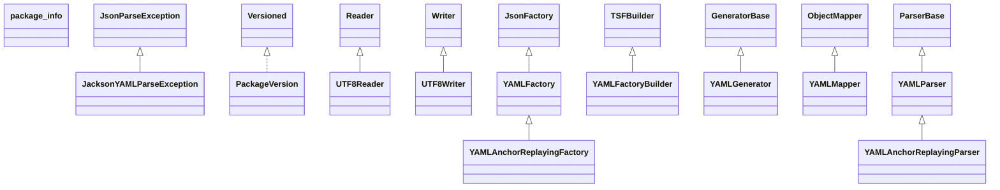

# jackson-dataformat-yaml-2.21.1.jar

[Group index](README.md) | [All archives](../README.md)

## Scope and provenance

- **Donor:** `SQX_145_REFERENCE_ROOT/internal/libs/jackson-dataformat-yaml-2.21.1.jar`.
- **SHA-256:** `5c94fa55d4b93bd4ea9ac6f2cf4928ff50822d1c43e521e715d3abf23031a06d`; accessed 2026-10-06; captured `2026-10-06T18:54:51.906614+00:00`.
- **Classes:** 24 raw entries; 24 unique entry names. Duplicate occurrence indices are zero-based.
- **Inspection:** read-only ZIP hashing and class-file structural parsing; signatures/descriptors, modifiers, hierarchy and references only. Bytecode bodies are hashed, not published.
- **Allocation:** proposed `FEAT-HOST-JACKSON-DATAFORMAT-YAML`, P02; [roadmap](../../sqx-full-application-roadmap.md). Domain README registration remains required.
- **Repository:** `01067f00031428613c6394064ca1bcadc1ba00ee`; review state unreviewed. Download label 145-dev1; installed build/activation and runtime equivalence unverified.
- **Limit:** every class/member is inventoried; declaration coverage does not establish consumed calls, defaults, formulas, failure semantics or algorithm parity.
- **Archive/resource index:** [045.json](../../../evidence/sqx145/archives/145/045.json).

## Complete member declarations

Member shards contain exact JVM names/descriptors, access flags, generic signatures, throws types, declared fields/methods, superclass/interfaces and referenced class names. All classes, nested/synthetic members and overloads are retained. Code length/hash is structural evidence, not a normalized algorithm comparison.

- [001.json](../../../evidence/sqx145/members/045/001.json) — SHA-256 `0b665186f73f130a56c970a0b6eca41b95873b6187f07dafc68a30fef1706901`.

## Focused structural diagram

Up to twelve non-nested classes; arrows show declared inheritance/interfaces only. External type names are not evidence of an available body or an executed dependency.

## Class inventory

| Archive entry | Occurrence | Class SHA-256 | Fields | Methods |
| --- | ---: | --- | ---: | ---: |
| `com/fasterxml/jackson/dataformat/yaml/JacksonYAMLParseException.class` | 0 | `8c96569f43a85915941f2c9cfa8693ca36086a19f4a9929e4d8389808203bff8` | 1 | 1 |
| `com/fasterxml/jackson/dataformat/yaml/PackageVersion.class` | 0 | `e150ac30e507aa7b459dcd2d17eb421c4292f2e5eab86cae7ad5aea302381b4c` | 1 | 3 |
| `com/fasterxml/jackson/dataformat/yaml/UTF8Reader.class` | 0 | `83159ebade72fdd0b908dcaa18ea3e4776748efe88e0acbce0bab9854b15c97a` | 13 | 18 |
| `com/fasterxml/jackson/dataformat/yaml/UTF8Writer.class` | 0 | `94168d9321e752873956f9323afaff6091c5795d72fc07baa0791b13bbe4b8fa` | 12 | 14 |
| `com/fasterxml/jackson/dataformat/yaml/YAMLAnchorReplayingFactory.class` | 0 | `a616704c00b8ff4e011346d71dbede6ff6a4301460cbf9b56858d4e05fd283cd` | 1 | 16 |
| `com/fasterxml/jackson/dataformat/yaml/YAMLAnchorReplayingParser$AnchorContext.class` | 0 | `503a7d196693481784ee267c092da1c319a234b3e0692ec93462f205c4aed5c6` | 3 | 1 |
| `com/fasterxml/jackson/dataformat/yaml/YAMLAnchorReplayingParser.class` | 0 | `60f60d1876783431ac4f0653895e6d68f23e97cb1f8711e3f40014bf7e8a9751` | 9 | 5 |
| `com/fasterxml/jackson/dataformat/yaml/YAMLFactory.class` | 0 | `f8982c5ba482a06405acf5f88d7f227c7214722a407fc0d39c3018db42bd9367` | 13 | 67 |
| `com/fasterxml/jackson/dataformat/yaml/YAMLFactoryBuilder.class` | 0 | `b59d303a0e39a0dc70c328a4b4755e7a42a2a54c261d9e387982629a10bb1215` | 6 | 24 |
| `com/fasterxml/jackson/dataformat/yaml/YAMLGenerator$Feature.class` | 0 | `0e55bf7b7e5202f47c919e6692f17851ddb3877b293780ff3cd6aa37f1835381` | 15 | 8 |
| `com/fasterxml/jackson/dataformat/yaml/YAMLGenerator.class` | 0 | `bd914bcc9d02f579e3296156471cc21549f3066744f4a56e36c1b9bab46c86ea` | 22 | 68 |
| `com/fasterxml/jackson/dataformat/yaml/YAMLMapper$Builder.class` | 0 | `cd126766d0e915868475caa1ff04a6b60e809a79a938de2a025d607f640b63d8` | 0 | 7 |
| `com/fasterxml/jackson/dataformat/yaml/YAMLMapper.class` | 0 | `0ad0cf5223fd9b76850557ea97268d00aba3a5127240669a8c9dd609a34daddc` | 1 | 15 |
| `com/fasterxml/jackson/dataformat/yaml/YAMLParser$Feature.class` | 0 | `35a816af4db24eba773aaabda81667a901f7d1ef5e3fbd00f9914fce26435600` | 6 | 8 |
| `com/fasterxml/jackson/dataformat/yaml/YAMLParser.class` | 0 | `6305cc9b09650ede2855fdbd03265f2e34eb698cb4425d57663e97c3e697749d` | 15 | 59 |
| `com/fasterxml/jackson/dataformat/yaml/package-info.class` | 0 | `482e0b7397bb0b10f0f4a94ccb3a762fb3aeb753954864bae89a75c8fa6a54fa` | 0 | 0 |
| `com/fasterxml/jackson/dataformat/yaml/snakeyaml/error/Mark.class` | 0 | `3d12a692a1c086a5af1098bcba826b0a001045d1904dd28b93f27b5371e3a5b5` | 1 | 8 |
| `com/fasterxml/jackson/dataformat/yaml/snakeyaml/error/MarkedYAMLException.class` | 0 | `ae6369fc8809b1cf9cc2ec453fee6aec5f7ab12e27898ff62d03b7f1958593fa` | 2 | 6 |
| `com/fasterxml/jackson/dataformat/yaml/snakeyaml/error/YAMLException.class` | 0 | `ccf93008811730f5de9ca85bf266069c2e84f8678fbd4d5869467264490bc35e` | 1 | 2 |
| `com/fasterxml/jackson/dataformat/yaml/snakeyaml/error/package-info.class` | 0 | `ec0962f1481d6ffbeca40ce34c95858f8d4907c7d1c41c391ef5b17ed4af51d6` | 0 | 0 |
| `com/fasterxml/jackson/dataformat/yaml/util/StringQuotingChecker$Default.class` | 0 | `7c2f7808c09bc2875df38172ebeded9a9c9e8cc0a97c213ed274575f7079c0c4` | 2 | 5 |
| `com/fasterxml/jackson/dataformat/yaml/util/StringQuotingChecker.class` | 0 | `a05c916d5d2e55748d5e2fbe6aaad68d5f761381989ec8b41913e4bd9181927d` | 2 | 13 |
| `com/fasterxml/jackson/dataformat/yaml/util/package-info.class` | 0 | `9e3422b84e91366d758ae91789c971ab3700b6cba4e448fb57d44d46724f87b6` | 0 | 0 |
| `META-INF/versions/9/module-info.class` | 0 | `c058f4a066d01d392c521b96b8b1ff6816112be613f6f3727f6dac4955fa0a9f` | 0 | 0 |
