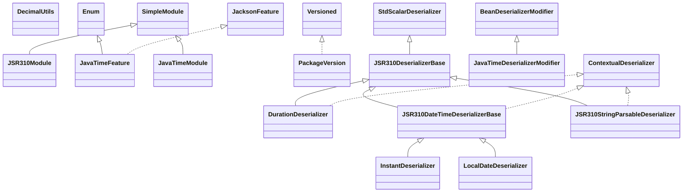

# jackson-datatype-jsr310-2.21.1.jar

[Group index](README.md) | [All archives](../README.md)

## Scope and provenance

- **Donor:** `SQX_145_REFERENCE_ROOT/internal/libs/jackson-datatype-jsr310-2.21.1.jar`.
- **SHA-256:** `4d63378b0a6b53733f086ebd301023ba211b9387e417bd584a5400320cd08b8d`; accessed 2026-10-06; captured `2026-10-06T18:54:51.906614+00:00`.
- **Classes:** 65 raw entries; 65 unique entry names. Duplicate occurrence indices are zero-based.
- **Inspection:** read-only ZIP hashing and class-file structural parsing; signatures/descriptors, modifiers, hierarchy and references only. Bytecode bodies are hashed, not published.
- **Allocation:** proposed `FEAT-HOST-JACKSON-DATATYPE-JSR310`, P02; [roadmap](../../sqx-full-application-roadmap.md). Domain README registration remains required.
- **Repository:** `01067f00031428613c6394064ca1bcadc1ba00ee`; review state unreviewed. Download label 145-dev1; installed build/activation and runtime equivalence unverified.
- **Limit:** every class/member is inventoried; declaration coverage does not establish consumed calls, defaults, formulas, failure semantics or algorithm parity.
- **Archive/resource index:** [046.json](../../../evidence/sqx145/archives/145/046.json).

## Complete member declarations

Member shards contain exact JVM names/descriptors, access flags, generic signatures, throws types, declared fields/methods, superclass/interfaces and referenced class names. All classes, nested/synthetic members and overloads are retained. Code length/hash is structural evidence, not a normalized algorithm comparison.

- [001.json](../../../evidence/sqx145/members/046/001.json) — SHA-256 `9bf8b914cfb5188e491a77fca1794f1ba2b7de0e83eb947af32e572bfb94e035`.

## Focused structural diagram

Up to twelve non-nested classes; arrows show declared inheritance/interfaces only. External type names are not evidence of an available body or an executed dependency.

## Class inventory

| Archive entry | Occurrence | Class SHA-256 | Fields | Methods |
| --- | ---: | --- | ---: | ---: |
| `com/fasterxml/jackson/datatype/jsr310/DecimalUtils.class` | 0 | `13eaf8c2f74b742ea6f02110f91b83f3bcbf6473fbc1bc3ab7509c5b9a738c1f` | 0 | 5 |
| `com/fasterxml/jackson/datatype/jsr310/JSR310Module$1.class` | 0 | `96e2fba639a25fbdeb9f2dacc3f2e2daeda0801be95fe24985a3a53d98d5ffc5` | 1 | 2 |
| `com/fasterxml/jackson/datatype/jsr310/JSR310Module.class` | 0 | `76662e119805350e15219c313c1a4191a023273f3fda8ea9885aff8d2022062c` | 1 | 4 |
| `com/fasterxml/jackson/datatype/jsr310/JavaTimeFeature.class` | 0 | `51ff5307d24eee9e43b9eb90b2ebe3c2f8950a5c8090388dc133f2c56a8cffbe` | 7 | 7 |
| `com/fasterxml/jackson/datatype/jsr310/JavaTimeModule$1.class` | 0 | `1c09927ae931a8e611caa139e43fb73b1325a014537fdf91ebd61e0ba07348a0` | 1 | 2 |
| `com/fasterxml/jackson/datatype/jsr310/JavaTimeModule$JavaTimeSerializers.class` | 0 | `dfd54e51b852df73c286edbc98dc9283950271439a82315f87098b77ed0b074b` | 1 | 2 |
| `com/fasterxml/jackson/datatype/jsr310/JavaTimeModule.class` | 0 | `14070aae97905fedff705f0ed7888c6cf400a33724376b6e5ceb050a03a28424` | 2 | 6 |
| `com/fasterxml/jackson/datatype/jsr310/PackageVersion.class` | 0 | `cfbdbd166e8180873706e03d4828f3a0d92760ef18f17f547ab53789233a7944` | 1 | 3 |
| `com/fasterxml/jackson/datatype/jsr310/deser/DurationDeserializer.class` | 0 | `c0ede10e4450e27875de77decf1f062ff65bc6a0b68c5b258320e1d4dffffeec` | 4 | 16 |
| `com/fasterxml/jackson/datatype/jsr310/deser/InstantDeserializer$FromDecimalArguments.class` | 0 | `a867826c52d378860c62dce50d6fb0eadbe9c43e53a1aeded1b99726ef71cbe6` | 3 | 1 |
| `com/fasterxml/jackson/datatype/jsr310/deser/InstantDeserializer$FromIntegerArguments.class` | 0 | `a96ded7d6d09c96cc7d38b774598c74969081c5164756aa80e9ae396ecfb736a` | 2 | 1 |
| `com/fasterxml/jackson/datatype/jsr310/deser/InstantDeserializer.class` | 0 | `3f26b05f961acd924430c8b8c8a5068ecc4770ba3538ded429fff41030f943e4` | 16 | 36 |
| `com/fasterxml/jackson/datatype/jsr310/deser/JSR310DateTimeDeserializerBase.class` | 0 | `92f9936827e1bb4bf4742c3ca4602d2d586a1e1421e1a91e31c2fca95441f269` | 2 | 16 |
| `com/fasterxml/jackson/datatype/jsr310/deser/JSR310DeserializerBase$1.class` | 0 | `4cbebe14ac5768afe6bb089055f0b2e30801c97ea8fc1dfd119104e88ad29f07` | 1 | 1 |
| `com/fasterxml/jackson/datatype/jsr310/deser/JSR310DeserializerBase.class` | 0 | `70e88dde0583c13c054fd17e878f098bd520391816badfb50caa4e7edae12795` | 2 | 17 |
| `com/fasterxml/jackson/datatype/jsr310/deser/JSR310StringParsableDeserializer.class` | 0 | `d059efce71afe4aec4ab65290aaf65755088e2dd8c6edb0503c3d642ea2e8dcc` | 8 | 11 |
| `com/fasterxml/jackson/datatype/jsr310/deser/JavaTimeDeserializerModifier.class` | 0 | `0179a15f40b9fec50adb087dea6b6310049ed6973000c0f17e3ec9567494855c` | 2 | 2 |
| `com/fasterxml/jackson/datatype/jsr310/deser/LocalDateDeserializer.class` | 0 | `7fb393a7f6b588b36fae5d57f6fd6f7c9c0d46908c7f0626e63e033b3ba6662f` | 5 | 18 |
| `com/fasterxml/jackson/datatype/jsr310/deser/LocalDateTimeDeserializer.class` | 0 | `abd2623fee70a0a733ec27e3bc4c9092d08f9953a80b5b8589338c716938ebc8` | 6 | 17 |
| `com/fasterxml/jackson/datatype/jsr310/deser/LocalTimeDeserializer.class` | 0 | `f0e426fb2be03306d16a8ec6e05b94a646eb097b186390412e1e7e775a90678a` | 4 | 15 |
| `com/fasterxml/jackson/datatype/jsr310/deser/MonthDayDeserializer.class` | 0 | `07af6b98047ff5f3220a5cde1c4e2044e6d403310626e70c7ed042a8cdee49a0` | 2 | 13 |
| `com/fasterxml/jackson/datatype/jsr310/deser/OffsetTimeDeserializer.class` | 0 | `915bccefa776b0d932ff4876011d8845ea4e701879c9549b291e25b7e1ccc600` | 3 | 15 |
| `com/fasterxml/jackson/datatype/jsr310/deser/OneBasedMonthDeserializer$1.class` | 0 | `6ccd28150714180b1e32b809971ba07e5a85681ef529857503bc360167efdef3` | 1 | 1 |
| `com/fasterxml/jackson/datatype/jsr310/deser/OneBasedMonthDeserializer.class` | 0 | `810cdb86920b77744e662c2427f8de49a9f98c99f7aab012251910a9408438f5` | 1 | 5 |
| `com/fasterxml/jackson/datatype/jsr310/deser/YearDeserializer.class` | 0 | `2863dd6909143ce561acc09020037ea2e4d5b24aecae363f9148715b8a6d00c9` | 2 | 14 |
| `com/fasterxml/jackson/datatype/jsr310/deser/YearMonthDeserializer.class` | 0 | `fface676be91d14a3e5f9a45f0ab5090bcba578b72e6d02f8740bdda26d559a2` | 2 | 13 |
| `com/fasterxml/jackson/datatype/jsr310/deser/key/DurationKeyDeserializer.class` | 0 | `c4a894de75c960984cce5460c3766ced1694a3c170fd731b16a3dd3cbcae61b5` | 1 | 4 |
| `com/fasterxml/jackson/datatype/jsr310/deser/key/InstantKeyDeserializer.class` | 0 | `eccece046fdd6346cdfc78fd2973e1461e0d07742236ff329508a1aa349f85ee` | 1 | 4 |
| `com/fasterxml/jackson/datatype/jsr310/deser/key/Jsr310KeyDeserializer.class` | 0 | `d471924a93499f791b12b6e7a42b8e4fd96213287471b8fa4a04f7cd2a1a9b4a` | 0 | 4 |
| `com/fasterxml/jackson/datatype/jsr310/deser/key/LocalDateKeyDeserializer.class` | 0 | `aa7a26161aea89177f0cd907c9cc28974212f72407a50bccd25b699728ec391e` | 1 | 4 |
| `com/fasterxml/jackson/datatype/jsr310/deser/key/LocalDateTimeKeyDeserializer.class` | 0 | `32e04095bd011853fb0c57c3be8fdb25d8c92ae08dca4f7ae87826af365b632b` | 1 | 4 |
| `com/fasterxml/jackson/datatype/jsr310/deser/key/LocalTimeKeyDeserializer.class` | 0 | `226b68648978b0f2634e5ed53794f8291b5c45926b64c213c4d0c70416db0d93` | 1 | 4 |
| `com/fasterxml/jackson/datatype/jsr310/deser/key/MonthDayKeyDeserializer.class` | 0 | `e5bcd3889dc2f3bd830709711bf0d3cb8d70788335c1eb06b67fb989dfa6cfb0` | 2 | 4 |
| `com/fasterxml/jackson/datatype/jsr310/deser/key/OffsetDateTimeKeyDeserializer.class` | 0 | `bb17adbb3e25e2ced78ab8c11b8300c02fe2f174a344907379481b7eb21f1f9d` | 1 | 4 |
| `com/fasterxml/jackson/datatype/jsr310/deser/key/OffsetTimeKeyDeserializer.class` | 0 | `bd7bbd3fc8e342a8817944ab6afaca8f04576736d6c8f3603e625c867b861cf4` | 1 | 4 |
| `com/fasterxml/jackson/datatype/jsr310/deser/key/PeriodKeyDeserializer.class` | 0 | `b6852b98972c0d71e42c69e388486c25ef5dc4d019fca0b8e900a2bd6e6ffd0f` | 1 | 4 |
| `com/fasterxml/jackson/datatype/jsr310/deser/key/YearKeyDeserializer.class` | 0 | `e66c0f86d70488702defceb8eef79971b3dd9eb0dc18f67c8eaad314166da926` | 1 | 4 |
| `com/fasterxml/jackson/datatype/jsr310/deser/key/YearMonthKeyDeserializer.class` | 0 | `87246dd01167676fd4c7200ba8e2eea7db4ca682658fbcc7f5036c9b9ee93a91` | 2 | 4 |
| `com/fasterxml/jackson/datatype/jsr310/deser/key/YearMothKeyDeserializer.class` | 0 | `f70b80a7e786e6de14b15a32cf00d270fddfcf01d41a3973bfd931903b899c8b` | 1 | 2 |
| `com/fasterxml/jackson/datatype/jsr310/deser/key/ZoneIdKeyDeserializer.class` | 0 | `71cd7e4674138ad634c794ae6ccc72663dfda08c3f34a77b4b94033ccfb4b196` | 1 | 3 |
| `com/fasterxml/jackson/datatype/jsr310/deser/key/ZoneOffsetKeyDeserializer.class` | 0 | `dfa96ff835659ddbc7c7360f5480c5b543e0d3c261e8ddcf0404738f315bbbb1` | 1 | 4 |
| `com/fasterxml/jackson/datatype/jsr310/deser/key/ZonedDateTimeKeyDeserializer.class` | 0 | `423e2c455b6e42c77cb7151942bcc369045654fb2860d02fc2814f106c865533` | 1 | 4 |
| `com/fasterxml/jackson/datatype/jsr310/ser/DurationSerializer.class` | 0 | `261e780a00d19c8bb3425dd163100dad66d91371763e33fa6e07a9ebf1d66e2e` | 3 | 19 |
| `com/fasterxml/jackson/datatype/jsr310/ser/InstantSerializer.class` | 0 | `8b0bdf3be2d0162778cfe7bf71299eff696e95540a65f91f965e79bfaf35765c` | 2 | 7 |
| `com/fasterxml/jackson/datatype/jsr310/ser/InstantSerializerBase.class` | 0 | `082ef4ee078e7d904e9446790a24222eed1822ace9626cff32c77e26db7131fd` | 4 | 13 |
| `com/fasterxml/jackson/datatype/jsr310/ser/JSR310FormattedSerializerBase.class` | 0 | `79b1ae3f77cfdeda88918572c9c7cac06490a47e4b0e8e36c9bdfa6b8857053a` | 6 | 18 |
| `com/fasterxml/jackson/datatype/jsr310/ser/JSR310SerializerBase.class` | 0 | `62c89046efe85d3612cb841a3636958f000c315087650e691290fd13d4e12ca9` | 1 | 3 |
| `com/fasterxml/jackson/datatype/jsr310/ser/JavaTimeSerializerModifier.class` | 0 | `05d0a9f6db010855fdd9d90bb5dbf2812c1acd8db225bf5440b5825ab53f8de2` | 2 | 2 |
| `com/fasterxml/jackson/datatype/jsr310/ser/LocalDateSerializer.class` | 0 | `211387ee7550005cc8c4797020cffffb66238bf55f2363a9b3ba61e72b62b653` | 2 | 15 |
| `com/fasterxml/jackson/datatype/jsr310/ser/LocalDateTimeSerializer.class` | 0 | `5657a3296f78f45b714bb079fe63e8adcf3c6ad3fef6cb1331eb15d17d327a3b` | 2 | 16 |
| `com/fasterxml/jackson/datatype/jsr310/ser/LocalTimeSerializer.class` | 0 | `ebbe53f58f4b31a26eb7e90d9f63f5a04ca24c01eaf8c47c690dd2422e1de230` | 2 | 17 |
| `com/fasterxml/jackson/datatype/jsr310/ser/MonthDaySerializer.class` | 0 | `95ca5083bcce504d7bf9e92a741363a26c3d3aa0e41550ebc623c2b906a9ef9b` | 2 | 15 |
| `com/fasterxml/jackson/datatype/jsr310/ser/OffsetDateTimeSerializer.class` | 0 | `18b81b360ca4d48c9123d7d7e5fabf7d65c3ce17943fa043ffed21b5517b44ac` | 2 | 9 |
| `com/fasterxml/jackson/datatype/jsr310/ser/OffsetTimeSerializer.class` | 0 | `68ee3a3979fe2f67682114394bd850c1e56ccc15b069c6f3b079e5d165f78379` | 2 | 16 |
| `com/fasterxml/jackson/datatype/jsr310/ser/OneBasedMonthSerializer.class` | 0 | `eb0d60af5cac84d58285097d3fdf85d24dd7446cb3c8636844f71112afd89e71` | 1 | 3 |
| `com/fasterxml/jackson/datatype/jsr310/ser/YearMonthSerializer.class` | 0 | `2a307c350011e22aab3631bee75d36a276dabab7844f0e9760137b94693d9f93` | 2 | 16 |
| `com/fasterxml/jackson/datatype/jsr310/ser/YearSerializer.class` | 0 | `726fd1c21198e3ff3251c7ee712e208f5f7b80ff1187201152e14fe53aa0751d` | 2 | 13 |
| `com/fasterxml/jackson/datatype/jsr310/ser/ZoneIdSerializer.class` | 0 | `5525d00cd12ee66089d18173c22603d6d3a166ea24daecfbd8ccff522de894a4` | 1 | 3 |
| `com/fasterxml/jackson/datatype/jsr310/ser/ZonedDateTimeSerializer.class` | 0 | `44aee0e410cdcf5fb082eeed54d3c236ac062a633c5d2d59e07a7b0cb79b036d` | 3 | 17 |
| `com/fasterxml/jackson/datatype/jsr310/ser/ZonedDateTimeWithZoneIdSerializer.class` | 0 | `6cba05e7df47b78b809672e0bd7a090d69c43da5affb527da28e786b0884d87a` | 2 | 7 |
| `com/fasterxml/jackson/datatype/jsr310/ser/key/Jsr310NullKeySerializer.class` | 0 | `42b43eebf6c9ff00d55e93a622ff4d225bbd490365c630a707179bbede233db3` | 1 | 2 |
| `com/fasterxml/jackson/datatype/jsr310/ser/key/ZonedDateTimeKeySerializer.class` | 0 | `6824629365430f4a9ffe30ca64f26555978d883ced159e4e10f40fbf5c4bbbec` | 1 | 6 |
| `com/fasterxml/jackson/datatype/jsr310/util/DurationUnitConverter$DurationSerialization.class` | 0 | `f079586e595e5197bb0c4f24f8b73ea4ca8e56427cde66b42bbf78ad8e9dba8c` | 2 | 3 |
| `com/fasterxml/jackson/datatype/jsr310/util/DurationUnitConverter.class` | 0 | `fe04c7523bcd8ec91f339f091dd8ab6a4a96d84ecdc147563ae108f7808ad0b6` | 2 | 8 |
| `META-INF/versions/9/module-info.class` | 0 | `eb923548a9c08d5e8e5f8d4c796f8394419ce7c69d5cbb6f09f810af8c2d2f72` | 0 | 0 |
