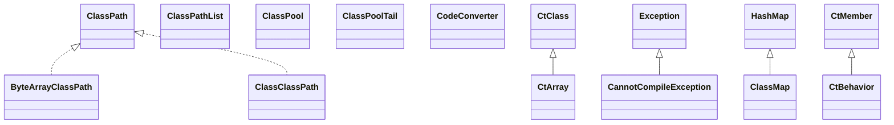

# javassist-3.21.0-GA.jar

[Group index](README.md) | [All archives](../README.md)

## Scope and provenance

- **Donor:** `SQX_145_REFERENCE_ROOT/internal/libs/javassist-3.21.0-GA.jar`.
- **SHA-256:** `7aa59e031f941984af07dacc6ca85e6dc9bd3a485e9aa2494cbc034efa1225d0`; accessed 2026-10-06; captured `2026-10-06T18:54:51.906614+00:00`.
- **Classes:** 399 raw entries; 399 unique entry names. Duplicate occurrence indices are zero-based.
- **Inspection:** read-only ZIP hashing and class-file structural parsing; signatures/descriptors, modifiers, hierarchy and references only. Bytecode bodies are hashed, not published.
- **Allocation:** proposed `FEAT-AUTHORING-JAVASSIST`, P07; [roadmap](../../sqx-full-application-roadmap.md). Domain README registration remains required.
- **Repository:** `01067f00031428613c6394064ca1bcadc1ba00ee`; review state unreviewed. Download label 145-dev1; installed build/activation and runtime equivalence unverified.
- **Limit:** every class/member is inventoried; declaration coverage does not establish consumed calls, defaults, formulas, failure semantics or algorithm parity.
- **Archive/resource index:** [048.json](../../../evidence/sqx145/archives/145/048.json).

## Complete member declarations

Member shards contain exact JVM names/descriptors, access flags, generic signatures, throws types, declared fields/methods, superclass/interfaces and referenced class names. All classes, nested/synthetic members and overloads are retained. Code length/hash is structural evidence, not a normalized algorithm comparison.

- [001.json](../../../evidence/sqx145/members/048/001.json) — SHA-256 `2dc5ef22d9c5fc4d9d6e4f1a79029e806a3a88c2acb8831f21a11b317bc5348c`.
- [002.json](../../../evidence/sqx145/members/048/002.json) — SHA-256 `e5e831de48c7d2a52b0d6fcab130316bf69f78f613d0a00a5e02df36fc14deb8`.
- [003.json](../../../evidence/sqx145/members/048/003.json) — SHA-256 `7e5bf2d1463279395ff81c1492ee933eee32cea10da9531cf77971f48f0017fe`.
- [004.json](../../../evidence/sqx145/members/048/004.json) — SHA-256 `90bb488111718850a463389b4d5f9a2fd246a1b0de169360677b095a4d46aa60`.
- [005.json](../../../evidence/sqx145/members/048/005.json) — SHA-256 `1843f06e3941fe06133a1ae11440e6aa403209089b1b96a1ec50d5823959f823`.

## Focused structural diagram

Up to twelve non-nested classes; arrows show declared inheritance/interfaces only. External type names are not evidence of an available body or an executed dependency.

## Class inventory

| Archive entry | Occurrence | Class SHA-256 | Fields | Methods |
| --- | ---: | --- | ---: | ---: |
| `javassist/ByteArrayClassPath.class` | 0 | `e3fc881c6b76bab5c850b187ce4e00d7d08103ea6bb781be7c9d858355bfddc7` | 2 | 5 |
| `javassist/CannotCompileException.class` | 0 | `bfcecdaf50511ca5f00fd3652624ec4b0ac988e22fdd5890942f50143be2b40a` | 2 | 10 |
| `javassist/ClassClassPath.class` | 0 | `184400b5bd68f0736c159af0e617ac53872978ce4b7b8bd10d1a4e8b17f782a3` | 1 | 6 |
| `javassist/ClassMap.class` | 0 | `438805f231925dec00565ae3d0aeb586b3a64350cf6494f6c7a2a12493621328` | 1 | 11 |
| `javassist/ClassPath.class` | 0 | `d44c2c107c44e030a1bc245b1640ec28a701f68ed371399e2c0b761e5d3bd876` | 0 | 3 |
| `javassist/ClassPathList.class` | 0 | `ab4e0d009d12c00a07a11fa679b426b91a388066d44ebdd96a4e7a4bfdc53d4c` | 2 | 1 |
| `javassist/ClassPool$1.class` | 0 | `056920046950a8fb0425b3cc1ef65d7a47101837b8b131cca3e6a9864f47b4c0` | 0 | 2 |
| `javassist/ClassPool.class` | 0 | `80155835b05634b2b2f86ade0f4fc04e21442929a642dffd8701f2c123a901f7` | 15 | 58 |
| `javassist/ClassPoolTail.class` | 0 | `6ada0df8558a1b80c304917401ba10befd0b17857919b5b8718c9c575b51cfe6` | 1 | 14 |
| `javassist/CodeConverter$ArrayAccessReplacementMethodNames.class` | 0 | `e56f9f4485bd7482df2b774a9b2042c6155a9c26e20894cd309e97e0d86734e2` | 0 | 16 |
| `javassist/CodeConverter$DefaultArrayAccessReplacementMethodNames.class` | 0 | `c83716b12bc4db2ebcba64d7d9b61541bcf3fae6d1251bc9730734de05b6c24c` | 0 | 17 |
| `javassist/CodeConverter.class` | 0 | `378c112190c2e9a1fb63dea9fef9c123da0351140979a625d5fe895fe468bb18` | 1 | 12 |
| `javassist/CtArray.class` | 0 | `3d7ffeadcfc4ba2e13f335ed395f73e815ccf37ed04d4b6e153c7c7e6da1e7e4` | 2 | 11 |
| `javassist/CtBehavior.class` | 0 | `19c8275089ad9c0ee2efe9e84ce7342f5c727c6a4ac8f36de16e1d366a859dd8` | 1 | 48 |
| `javassist/CtClass$1.class` | 0 | `0ece482398aa020c5146e09afde5531eaa1c111866b80b15d80507609a559120` | 1 | 4 |
| `javassist/CtClass$DelayedFileOutputStream.class` | 0 | `474b63bfad55452e178a3654eb23b0c83dffbe5fb8c33fcead7b97a0bc610cd9` | 2 | 7 |
| `javassist/CtClass.class` | 0 | `b01bd0b105548cf73ebc55f53ca71ca096579eb884c11e680e4cac2dbca80d77` | 14 | 99 |
| `javassist/CtClassType.class` | 0 | `2c14d64fe7fca491031a7f5771eee75042ecf54740de49ebb60284d3f9441507` | 15 | 109 |
| `javassist/CtConstructor.class` | 0 | `b08a85c0b963c07f4c39faab09ba0bd8aa96d56af5ab7c4d019ea286d11ef18f` | 0 | 17 |
| `javassist/CtField$ArrayInitializer.class` | 0 | `c54ab9e73596c885b3c9bada2819158eb829a4e6bfa47f5c0304b7c439613543` | 2 | 4 |
| `javassist/CtField$CodeInitializer.class` | 0 | `d7e352dda839d1f104ba9ca138398cbd1b15b2bbd086c9ce38abea90ccbd6729` | 1 | 3 |
| `javassist/CtField$CodeInitializer0.class` | 0 | `fee0a9438b5aeb3c1b54c3e1e190489e00e5b0120a0bfd2b22682deb923014f1` | 0 | 5 |
| `javassist/CtField$DoubleInitializer.class` | 0 | `b96b6839d3bcafe158050846aee20db188d04bee73b6f834a92c393a4f70c4a0` | 1 | 5 |
| `javassist/CtField$FloatInitializer.class` | 0 | `9191cf23925bf4ed45528ab13ea076fde5c236618f9bc755009ddb09ed309eaa` | 1 | 5 |
| `javassist/CtField$Initializer.class` | 0 | `1d0a00e14b85f483317fd8fe559cf184c83e637d994f1372490920acf8c5ec43` | 0 | 24 |
| `javassist/CtField$IntInitializer.class` | 0 | `7b97fc1e0d74eed8521d98e01fa0b132963b166911c15fed59c3fad21675ff22` | 1 | 5 |
| `javassist/CtField$LongInitializer.class` | 0 | `57c04976ad1634f8289322bec95bae5441ff7b31e5cde6348952d4c71523664d` | 1 | 5 |
| `javassist/CtField$MethodInitializer.class` | 0 | `7da2d707b72634dfaee4e70484e1b38e3905e693bf2f5ca046df554132705049` | 1 | 4 |
| `javassist/CtField$MultiArrayInitializer.class` | 0 | `c700d1da9687bd3afc99fdfdb6027915640883256f81fbe2c0da67e7aaa42520` | 2 | 4 |
| `javassist/CtField$NewInitializer.class` | 0 | `cf8579e5592ebf71c120e3fc9d6adf69c8c73f5d39f605b7880bb31b3709d560` | 3 | 5 |
| `javassist/CtField$ParamInitializer.class` | 0 | `0abcb070a24b936b6da7d362bf352c47a8f3f383b571aa6b9cf42aefd4136c84` | 1 | 4 |
| `javassist/CtField$PtreeInitializer.class` | 0 | `0931d1b93dcd79ca6ebc501495d2167abebb9d19e4910c13cd36a02183446b9a` | 1 | 3 |
| `javassist/CtField$StringInitializer.class` | 0 | `c7e7c61ab63fa1c2987d3b1b22f770dfdef6dc2abab6ae16924f77811f3f423b` | 1 | 4 |
| `javassist/CtField.class` | 0 | `2ad84891a7a4fe10a8c73e8653b40bd98fbc59a1e3f60b50f77671905ff966b5` | 2 | 29 |
| `javassist/CtMember$Cache.class` | 0 | `3574afeb0b26dc9d0b690b62f0be8dbf4e9e7ee6e37536cdacc006b2073d9a20` | 3 | 25 |
| `javassist/CtMember.class` | 0 | `936b4220f45f3836bbb36d7f0f5640cbbb18e40e17134aaa6ba0128e3fc3e1ad` | 2 | 20 |
| `javassist/CtMethod$ConstParameter.class` | 0 | `55fb6e7933ef2c0d4939cc93ec38857263d24716780301d9ba164ffae96d87cb` | 0 | 9 |
| `javassist/CtMethod$IntConstParameter.class` | 0 | `a293b019a667ca979c0f2ddb6064978cc1b72efc33c89a7deed2e31f6fcee120` | 1 | 4 |
| `javassist/CtMethod$LongConstParameter.class` | 0 | `18e6f0a991fe09de9908b49b186c6aa954565ac0dc8c83540706f2c83e73ca30` | 1 | 4 |
| `javassist/CtMethod$StringConstParameter.class` | 0 | `2262c8edd9821835ab4362225c98597a9d156f8a4e3f89bd66d42802d99f67d4` | 1 | 4 |
| `javassist/CtMethod.class` | 0 | `cfb749522bf163aebb02e3565bcd8aa082a2cd0e6f6f88f91eea62e38773d7ab` | 1 | 16 |
| `javassist/CtNewClass.class` | 0 | `4f572ca84584e944bcca81e65f1ee1a7ea70e1958bfa1c9bf6ded2c9e70cfa9f` | 1 | 6 |
| `javassist/CtNewConstructor.class` | 0 | `fef90500bd1047bb256763d90ec60f9cc62d61145ac4ecb54a7d7c487a63bac1` | 3 | 8 |
| `javassist/CtNewMethod.class` | 0 | `4e8c7504013f8f6ee0015f3fe4abced1626dcd08eb9242bbcc71b76ee05a80c2` | 0 | 13 |
| `javassist/CtNewNestedClass.class` | 0 | `003a8511bac0b582bf6b1eded9ea3bd53713442abf0b0a8838c5a4f84e001208` | 0 | 3 |
| `javassist/CtNewWrappedConstructor.class` | 0 | `1067be60b2fef0781c3ed4a46ab6d7b012555e2c74188685084868faa9e0294d` | 2 | 3 |
| `javassist/CtNewWrappedMethod.class` | 0 | `86ebb3042169e1f99a5ff45a70e4f6e0d19f1ba752cc181a237a7f7d02c547a6` | 1 | 8 |
| `javassist/CtPrimitiveType.class` | 0 | `fd519c517b9c39f7ae47867f264c6ca76a4161d3a911847acdf6870984143394` | 7 | 10 |
| `javassist/DirClassPath.class` | 0 | `464006724ab3375aba5032894bd2f3065a1486b0d4a807a44bb41df80c411183` | 1 | 5 |
| `javassist/FieldInitLink.class` | 0 | `2b06134e9a7d86724fcf5b521a4498e2e10489222521a7932a737c336dfdeda5` | 3 | 1 |
| `javassist/JarClassPath.class` | 0 | `7b7c1685dd38b6a1ff693bfe42f754810ac64211d0669c1ffead7b6220708821` | 2 | 5 |
| `javassist/JarDirClassPath$1.class` | 0 | `43843dd7e93c2354b17397d23eed722a0141dbec7a0b0b1485d0f1c3988dc08b` | 1 | 2 |
| `javassist/JarDirClassPath.class` | 0 | `1b63aa217a19917ca124d7cf7be9780e09c48c82e1e4f73fc385c2ab3fa6f980` | 1 | 4 |
| `javassist/Loader.class` | 0 | `c6b0371b4be126260f959f8a945a1fcb892014e15111a3d776d93320f511db1d` | 6 | 16 |
| `javassist/LoaderClassPath.class` | 0 | `574c350c9722e3306e132f463985ecce13bb6eebddb097c9c1c33ac8e5932a67` | 1 | 5 |
| `javassist/Modifier.class` | 0 | `7ae67ce97f16e7df369defca73e99caff0c12233b0585fc004b6c45041f35865` | 15 | 22 |
| `javassist/NotFoundException.class` | 0 | `6cbce578c3819a6fe472d28102834250e319cce179a4e4f5ad6cab7beba54311` | 0 | 2 |
| `javassist/SerialVersionUID$1.class` | 0 | `8285dbb4140069064d686736a7a66e2438ae012c9593a4fc879fd384b81ec52a` | 0 | 2 |
| `javassist/SerialVersionUID$2.class` | 0 | `7f685067c623d2af3bc5b2ebf8ee434e84605158745fee22fd155f47bf330e67` | 0 | 2 |
| `javassist/SerialVersionUID$3.class` | 0 | `f6f32da5d8c40242160840ba02b1687743774b595da4a4c59c16d379f2171580` | 0 | 2 |
| `javassist/SerialVersionUID.class` | 0 | `2e89bc69b14afbd9737526e76f126561115ed4f2b7f6ae1e9dd1d4f249d2541a` | 0 | 6 |
| `javassist/Translator.class` | 0 | `98e7efe420f99e5b85e88687708aa490b939084d3bab489cbdc754ce47efb2fe` | 0 | 2 |
| `javassist/URLClassPath.class` | 0 | `c252a52d0f629a08167b341cd47605fe07116af5afe353ddd9124405f49e0646` | 4 | 8 |
| `javassist/bytecode/AccessFlag.class` | 0 | `9ff208f18788971aed88d4bead9efd0d61d0992831434f6631411c4e93728e09` | 19 | 12 |
| `javassist/bytecode/AnnotationDefaultAttribute.class` | 0 | `84161544b4495322dec341d374c1bad41db9b44cf286678a0362434b31557e6d` | 1 | 7 |
| `javassist/bytecode/AnnotationsAttribute$Copier.class` | 0 | `42df2e9fe239766c6684f999d5baf6ea87913f10e7fef977a39fb479b44e9a21` | 5 | 14 |
| `javassist/bytecode/AnnotationsAttribute$Parser.class` | 0 | `5832bb2db9c62bced3f7e3977617d874fb0737605109fba8389bac908841282c` | 5 | 13 |
| `javassist/bytecode/AnnotationsAttribute$Renamer.class` | 0 | `ee3a35a4ae4b31f644cb38e46a48db5e2d4176523ee1422bcae8ec1cf7c9b6d6` | 2 | 5 |
| `javassist/bytecode/AnnotationsAttribute$Walker.class` | 0 | `9108f5387da11b2495701e992119998f778442ebed4b556fe1845f7dd3c111d1` | 1 | 16 |
| `javassist/bytecode/AnnotationsAttribute.class` | 0 | `1ddac8c3fb9eeb19eac998a4f19e7af03bb427171b9bebf6a07589cbf6207077` | 2 | 15 |
| `javassist/bytecode/AttributeInfo.class` | 0 | `f9ec69dccd0835ea7510a863987d0d26078e8799507bcc0d41031bf1c05d1484` | 3 | 23 |
| `javassist/bytecode/BadBytecode.class` | 0 | `954b22b5fb921df279056ab3d8e7ea18e020d3292f6c30e41408f2539a997d00` | 0 | 4 |
| `javassist/bytecode/BootstrapMethodsAttribute$BootstrapMethod.class` | 0 | `7fa4b16607eb763947171ca5fb6652ce323cfe583fe24cb577afe09aa60c7a1d` | 2 | 1 |
| `javassist/bytecode/BootstrapMethodsAttribute.class` | 0 | `366af6c154d9e0499a95fe20401fa80508ccad01a457ccaad78d8c70304f1dbb` | 1 | 4 |
| `javassist/bytecode/ByteArray.class` | 0 | `d08d5fc2b44d8af3b7bf8d314aa8b3e275442227c319f47d69a072fda7fa24b0` | 0 | 7 |
| `javassist/bytecode/ByteStream.class` | 0 | `7bfb383dd9ddd737d5cb037770083be72ddff7d1d68353c8b2e4b0f4986c34f8` | 2 | 21 |
| `javassist/bytecode/ByteVector.class` | 0 | `93861974e1a6b61217f43d71e1b77fe12ab7f764b71457d594bdc6344e3f3ba9` | 2 | 10 |
| `javassist/bytecode/Bytecode.class` | 0 | `4c191f8bbcaacd5c123deb0b7be42eed375172bf1ae7ccabe594d7464a6f0af1` | 6 | 101 |
| `javassist/bytecode/ClassFile.class` | 0 | `f707776e433eb48ff0a31a81acbbf8c224f6c579d60be1a21b7f40733c3559cf` | 22 | 50 |
| `javassist/bytecode/ClassFilePrinter.class` | 0 | `a15bf9557f6e4e3771d34c386843233ed906dabbc587349ada34aec4fc7dfda9` | 0 | 4 |
| `javassist/bytecode/ClassFileWriter$AttributeWriter.class` | 0 | `8cbe2f98e521f2eee7b8410b2ade5deb5115a2933aa3cdd5b4c4fadc4bb9f566` | 0 | 2 |
| `javassist/bytecode/ClassFileWriter$ConstPoolWriter.class` | 0 | `00485cdf962c1efbd4cd45c984770db8e7d865040b95b568f37f82de32689c6c` | 3 | 19 |
| `javassist/bytecode/ClassFileWriter$FieldWriter.class` | 0 | `711865774a89f589bf09832bdca3cb10d2fb116f32b5b38be1217fb47b3abeb0` | 3 | 6 |
| `javassist/bytecode/ClassFileWriter$MethodWriter.class` | 0 | `6424960269041ba35b6354b272292a1ecfdd684170b13174bb18d2629529996f` | 10 | 15 |
| `javassist/bytecode/ClassFileWriter.class` | 0 | `f348d1493d8e7a9de404dadf27c76e5b9f3a993bd09352868af19506222434ed` | 6 | 7 |
| `javassist/bytecode/ClassInfo.class` | 0 | `e4c8711ef2feece44ba1f64292de0198b0e45dec209874e15b8c2084a91bef2f` | 2 | 11 |
| `javassist/bytecode/CodeAnalyzer.class` | 0 | `0eb5d0cc5b3582c54c74f8dab33ffe2764276cb909796cf929a815eb67bc3c73` | 2 | 9 |
| `javassist/bytecode/CodeAttribute$LdcEntry.class` | 0 | `a6984002834c55d6847d7482d1bc21cb0d6c008ed6d43e6233bc769dff765485` | 3 | 2 |
| `javassist/bytecode/CodeAttribute$RuntimeCopyException.class` | 0 | `a8d4ee4f4c07aa7f0e5264b588f21d68cb0dbbcebf11c68f6e20ce4db227aed8` | 0 | 1 |
| `javassist/bytecode/CodeAttribute.class` | 0 | `e4cf26b47af5200359e16f35a344c86204e6ba2ea13b2bc0224eff39daf4bf32` | 5 | 33 |
| `javassist/bytecode/CodeIterator$AlignmentException.class` | 0 | `6c3ebd5300d09f4715bc782fc2a9b028d636b9d4e805531b7d9a74a1670ca0b2` | 0 | 1 |
| `javassist/bytecode/CodeIterator$Branch.class` | 0 | `503c83a88a9a21dacedd2493fecfc207a3a69a245d88b53d23a7f64e9307f596` | 2 | 7 |
| `javassist/bytecode/CodeIterator$Branch16.class` | 0 | `0335507fefb9d4c7acd4c1dc2dc2607934c0c6498b3a24f2ec15b407ee73145f` | 5 | 6 |
| `javassist/bytecode/CodeIterator$Gap.class` | 0 | `6089c25f4644726025f5096e13032a2047f6656fdf7e23c3ea361005cc60f88c` | 2 | 1 |
| `javassist/bytecode/CodeIterator$If16.class` | 0 | `e1ea3cd8221702cec79cc3e615ca2629984b688eeab1fc5a11dfeb538aeaa687` | 0 | 4 |
| `javassist/bytecode/CodeIterator$Jump16.class` | 0 | `5f489061587d1de6c9ccb9b06379a57e449547f3e094d6a0f4d89b70c33d93a5` | 0 | 3 |
| `javassist/bytecode/CodeIterator$Jump32.class` | 0 | `4c3d63f1a7097e742949fe531cdd4998d7812f24ff536463c15b0d9967fbbbb8` | 1 | 3 |
| `javassist/bytecode/CodeIterator$LdcW.class` | 0 | `b03e1bff3cc31ac1d756b240c6ae726ee3f16d13e2656dbe78dd2043a366d9dd` | 2 | 4 |
| `javassist/bytecode/CodeIterator$Lookup.class` | 0 | `c2192f7876503025691bfb8e42e4c436d92553f96a44e798062a1b663b2711e5` | 1 | 3 |
| `javassist/bytecode/CodeIterator$Pointers.class` | 0 | `f797350a4534f09cc9e9ddba21d378311f712a5cea85c6ad412e214ba8a6ecbc` | 9 | 3 |
| `javassist/bytecode/CodeIterator$Switcher.class` | 0 | `3eead157c619920961f694772e3759bfdb5c0b688da339a4a73405aabefb29f3` | 4 | 8 |
| `javassist/bytecode/CodeIterator$Table.class` | 0 | `e3f5d8aa22aafa8b79cb01b6fe32b7c7a887137d4e164177bc70e761634e7d59` | 2 | 3 |
| `javassist/bytecode/CodeIterator.class` | 0 | `5fc163a82e64e463e49cf7dd65bfa195bfde339efe61629685aadd4e2247359b` | 6 | 53 |
| `javassist/bytecode/ConstInfo.class` | 0 | `34a5fb807492a6d6df2ca646b9a0e5a42d2dd3c31fc49ad3dd538762b8646686` | 1 | 9 |
| `javassist/bytecode/ConstInfoPadding.class` | 0 | `3f730e0a966502bb95beba454a9b8e17a1eeeee023ac537b9762d542870242bc` | 0 | 5 |
| `javassist/bytecode/ConstPool.class` | 0 | `a693ecf59d47adca2f9c2c732877318da2afa5513c229019806179a12b15a657` | 28 | 79 |
| `javassist/bytecode/ConstantAttribute.class` | 0 | `d6f4b942c6bf585e6ae40a9591b8bd11ce8bcb472788606947f56e2ff6d0cb7f` | 1 | 4 |
| `javassist/bytecode/DeprecatedAttribute.class` | 0 | `cffe26a68118d6f78edf5cfdd6aa73d7bc2a193ee67317bf409a258dddf475ca` | 1 | 3 |
| `javassist/bytecode/Descriptor$Iterator.class` | 0 | `aa4fec2a46ad2a9988abfb772093547a7a78a65b0c92bc16a3258167d6152bf6` | 4 | 6 |
| `javassist/bytecode/Descriptor$PrettyPrinter.class` | 0 | `e71032717d1f5d6041f46c18b0817a39bd4a9faaa8aa77153f83cd1388cdad6f` | 0 | 3 |
| `javassist/bytecode/Descriptor.class` | 0 | `2258b66640083f89a91daa32f7fe0881c010a2b82ecb4b625f07294573cdf887` | 0 | 32 |
| `javassist/bytecode/DoubleInfo.class` | 0 | `c089900560f7f93177efb3b6b131d602c74ad5347e49c04c7681174af13d2353` | 2 | 8 |
| `javassist/bytecode/DuplicateMemberException.class` | 0 | `d672a238af26fc2670b8a54b961d24cf037bd90a0caf77a5a4e6860df01774fe` | 0 | 1 |
| `javassist/bytecode/EnclosingMethodAttribute.class` | 0 | `9c5f1bf450178a2bb7bbe0a816f6b73dacba79b0cc078de130d87d67ea676e92` | 1 | 9 |
| `javassist/bytecode/ExceptionTable.class` | 0 | `5829b99dbb4e7eebf9f6bc35707250058ee082d4f19d096aa6e39117a83b6c7e` | 2 | 20 |
| `javassist/bytecode/ExceptionTableEntry.class` | 0 | `d21299ff7f6dbed4c63dfee5ce81a1f3ac983dfe5c9a7a3d0e02891867768ef1` | 4 | 1 |
| `javassist/bytecode/ExceptionsAttribute.class` | 0 | `a760b7050ef94b366f77d697c54d16a41add76d05a16d53c1aebb6396313304c` | 1 | 11 |
| `javassist/bytecode/FieldInfo.class` | 0 | `9b6825f752fbd146476655648c9ffe3c0e78b84dae21c4ec7ab06e5b66fed052` | 7 | 20 |
| `javassist/bytecode/FieldrefInfo.class` | 0 | `388bda4eb0302cb157c7cc27c0ba7774abae80e8fa6b8b781b01ecb98f43ad6b` | 1 | 5 |
| `javassist/bytecode/FloatInfo.class` | 0 | `5814898c68b269f7a0f8d730dc9871c74a197647ed06d447c7de1529f4340f8a` | 2 | 8 |
| `javassist/bytecode/InnerClassesAttribute.class` | 0 | `10acb3e450e76e10156276801fde3bb041d927a151b385ba71b6fabb530f96e5` | 1 | 19 |
| `javassist/bytecode/InstructionPrinter.class` | 0 | `d0e994b66913f92fee41b499b369323c83ac97085b9dde5e863d34e1aefa6e8c` | 2 | 14 |
| `javassist/bytecode/IntegerInfo.class` | 0 | `66e01360c8e3adab7a72b83c0c4a7eeaf1cb1ddac621e24e7e80e444073f2756` | 2 | 8 |
| `javassist/bytecode/InterfaceMethodrefInfo.class` | 0 | `2ff8547e3336368fe4a5a77a40b37f28308cf8779eab1846fe7e5747c34fb5ac` | 1 | 5 |
| `javassist/bytecode/InvokeDynamicInfo.class` | 0 | `2e9ddca4d78033109b0557543c167ee5b77e1f1f177c567d2cb78c9ab0560d54` | 3 | 8 |
| `javassist/bytecode/LineNumberAttribute$Pc.class` | 0 | `a13bc77c9cc38a22a352aa109cc314e722cd25cdf75d8b12b5588bd3e8432469` | 2 | 1 |
| `javassist/bytecode/LineNumberAttribute.class` | 0 | `4c727eba21417b268e389dcfa45af835d9a68398d07c1defbe65093edef15602` | 1 | 10 |
| `javassist/bytecode/LocalVariableAttribute.class` | 0 | `fcaabb8f31a5b4e145729605cdb8d784dadb62ad73d2751f5045d9b486f1df03` | 2 | 23 |
| `javassist/bytecode/LocalVariableTypeAttribute.class` | 0 | `fa6d8e70ea8d9d8b79d16173a61ae7b84770c8de4348a2b3fd65b7014c2c081a` | 1 | 6 |
| `javassist/bytecode/LongInfo.class` | 0 | `86c87b204ce4e5807fd6e85adbe10ecfcc2fddc69833707e15f964de5012716d` | 2 | 8 |
| `javassist/bytecode/LongVector.class` | 0 | `69436d4b41ce93c67ed7efec5fb18d1aee8ea1609ee30b6c0a474639ffcab9f3` | 5 | 6 |
| `javassist/bytecode/MemberrefInfo.class` | 0 | `d38ebfb2dfe364902be11253915f8fa91def84ff37f86ad932c2ac8141393852` | 2 | 9 |
| `javassist/bytecode/MethodHandleInfo.class` | 0 | `e3a54e0342661c641b85370bf483dd4e2b5fbae5dc8a25de27de733b642a50a9` | 3 | 8 |
| `javassist/bytecode/MethodInfo.class` | 0 | `66fe55f72a2b486f89a22abae79121dfb179a6b883b7ed4265c67833f7e070e9` | 9 | 36 |
| `javassist/bytecode/MethodParametersAttribute.class` | 0 | `012d1bc348b63c6b8ba43e3e54cfeabcfec955a6e8b187932cf7806aece19ea0` | 1 | 6 |
| `javassist/bytecode/MethodTypeInfo.class` | 0 | `9d4bf10366da1a0ae0c8e21a0bac11a63c59216f296a1eb0adfb7ad54fa2a8ae` | 2 | 10 |
| `javassist/bytecode/MethodrefInfo.class` | 0 | `6bc2ee4dc6547153c2bd0636068bf4497aaed9aab3bd6fb97c32597c0df95cb5` | 1 | 5 |
| `javassist/bytecode/Mnemonic.class` | 0 | `312ca0380e8a48e8d296c7ce0643c6fa1d68f8880197c45f7cc7d1b24cae057d` | 1 | 1 |
| `javassist/bytecode/NameAndTypeInfo.class` | 0 | `bfde79a6033565c7e60934adf2dc89b690b2cba0752ef95e2bddb06064dee9a8` | 3 | 10 |
| `javassist/bytecode/Opcode.class` | 0 | `0c9310303339deddb80a7a9ab30657334c66da7602264b7e90ad5ff3fef0bd5e` | 211 | 1 |
| `javassist/bytecode/ParameterAnnotationsAttribute.class` | 0 | `c44a3375f3fa6dde9efce6a5f6cfe06dd2d902fb0b296d2891ff325dcc3e9fc1` | 2 | 11 |
| `javassist/bytecode/SignatureAttribute$1.class` | 0 | `6383aae7c1c6a8a8ea77e77aa5b1b1f05f350384266d2ef7fe711dca103c4fda` | 0 | 0 |
| `javassist/bytecode/SignatureAttribute$ArrayType.class` | 0 | `d0329b2a416d69339ae492780fcdf50188d3b9f99877b16e36246a7c97160361` | 2 | 5 |
| `javassist/bytecode/SignatureAttribute$BaseType.class` | 0 | `ac5351e098e04920ea01eeb4ffc8ffcf44faa1c4944006160940003131c93a94` | 1 | 6 |
| `javassist/bytecode/SignatureAttribute$ClassSignature.class` | 0 | `8604bcc8f5b9063bcce4e41d6a53ca6dbe7de17cd59c7bd309daaec9f7446432` | 3 | 7 |
| `javassist/bytecode/SignatureAttribute$ClassType.class` | 0 | `0cf8346553d9d763ce42f58ed4bc95a109c18f4899cc2765e64c967bd608f1ac` | 3 | 13 |
| `javassist/bytecode/SignatureAttribute$Cursor.class` | 0 | `c3cfee08a57ad90262e4675633e44b93d5d9aab4e31ae6019f271092db01bc4f` | 1 | 3 |
| `javassist/bytecode/SignatureAttribute$MethodSignature.class` | 0 | `6f418fe25b5a4433d45f5939d07dc1652e2809fbfc6f5c063b7d60952190b20b` | 4 | 7 |
| `javassist/bytecode/SignatureAttribute$NestedClassType.class` | 0 | `01b36bb28333ab1605ee6ad2523550e95160b1d305b484a386f0738c8f4e8a45` | 1 | 3 |
| `javassist/bytecode/SignatureAttribute$ObjectType.class` | 0 | `81be3280d09523610d1a5ceabf17cb60e417d10241f99a282da25f14bb0e65b8` | 0 | 2 |
| `javassist/bytecode/SignatureAttribute$Type.class` | 0 | `4f07cac6fc71070b1726bd90213e9cef7eb0f6398358c9935a1d8cac8564e5ac` | 0 | 4 |
| `javassist/bytecode/SignatureAttribute$TypeArgument.class` | 0 | `611c2074692859a304362bc3b1cf859fadac251e30879f7c1b08f6e222a28c06` | 2 | 10 |
| `javassist/bytecode/SignatureAttribute$TypeParameter.class` | 0 | `e8c814e713adb597c50e3aa29e160cd6b8f74c359da3a7ccf69c6ac47a480b0a` | 3 | 9 |
| `javassist/bytecode/SignatureAttribute$TypeVariable.class` | 0 | `9762b9b1c7c4d063ba8c0a1ad3ebd95c67f98fc10f63489b5a70750f4f444964` | 1 | 5 |
| `javassist/bytecode/SignatureAttribute.class` | 0 | `a8edb8bf293d3893e72b156c752b45f592045e29710d29a075cbf1186490e36b` | 1 | 25 |
| `javassist/bytecode/SourceFileAttribute.class` | 0 | `b36c6e2103cfc628626b518f6f5f80b3f327cd84a32e17ffdc23823d47e10b76` | 1 | 4 |
| `javassist/bytecode/StackMap$Copier.class` | 0 | `882b8ff8a77223e7badb7243665cba252a66944dba2cf1df445616f4d81e54be` | 4 | 8 |
| `javassist/bytecode/StackMap$InsertLocal.class` | 0 | `f329eaf405848cb46f75859c5657512dd47f38f85a98709ada4a1d413b1d1264` | 3 | 3 |
| `javassist/bytecode/StackMap$NewRemover.class` | 0 | `35bd293645334c3956d79b673aa639f425e4b7d84b919d47c3fc60bcebd1f3e5` | 1 | 3 |
| `javassist/bytecode/StackMap$Printer.class` | 0 | `f1b8328c6230b1da755b62da12a66b8d5419e7e8443aa26d5f1f85522eb4ca1e` | 1 | 3 |
| `javassist/bytecode/StackMap$Shifter.class` | 0 | `50daec601b64463129c00e9cdf327d36042cddfde5c347efc195cb0b5d8964af` | 3 | 3 |
| `javassist/bytecode/StackMap$SimpleCopy.class` | 0 | `c27e19263e47072af76bcac3f41f521c55b12cfde601e909ca4d3de7d04d2d08` | 1 | 8 |
| `javassist/bytecode/StackMap$SwitchShifter.class` | 0 | `04b168c4fcb42bdda80c51d4631a4cc5fff73334bb3f835913e30a8cab784937` | 2 | 2 |
| `javassist/bytecode/StackMap$Walker.class` | 0 | `2cc46b3cee505f297434af719fe05db99e1a44a574916c7c4b2884031354f590` | 1 | 9 |
| `javassist/bytecode/StackMap$Writer.class` | 0 | `34b5bf4c81d842c4614240fd41f29fd97fb41cdfb674966e9dfdda11b00bc030` | 1 | 5 |
| `javassist/bytecode/StackMap.class` | 0 | `3a5415ac47b48e81a4fc2fb33ae3f8dd2cc865791bf7183ac54d65dab52513c0` | 10 | 9 |
| `javassist/bytecode/StackMapTable$Copier.class` | 0 | `15cdc4ac654b6968639debde0427fb2f2d3e40aa397ad8fa913397ad9b43f865` | 3 | 3 |
| `javassist/bytecode/StackMapTable$InsertLocal.class` | 0 | `e23b7c90880036597e3b1665ae4baa7de0cbe91d91133fea4f1bdccd7270ec9d` | 3 | 2 |
| `javassist/bytecode/StackMapTable$NewRemover.class` | 0 | `37eaf16ebe370dfabbf97535c2ea61546b2e0c88bb43268a91d6d10dce4b9db4` | 1 | 3 |
| `javassist/bytecode/StackMapTable$OffsetShifter.class` | 0 | `3a7871743090fed53b856ea8f91d4a7a78b024085362ef66232ef8c703c4d6bb` | 2 | 2 |
| `javassist/bytecode/StackMapTable$Printer.class` | 0 | `43214b910e83fb3452eb9285e7476420a1a0d8f491b512d476cea799c1b8ceb6` | 2 | 8 |
| `javassist/bytecode/StackMapTable$RuntimeCopyException.class` | 0 | `a0d39d9149e6a47f06ae67ff120a53bd6763c5642a200d38de72e841e53a0dca` | 0 | 1 |
| `javassist/bytecode/StackMapTable$Shifter.class` | 0 | `e006f26371b961b82d5b5c998b88b64ced843b15caa0b85d1d722663f8e0103e` | 6 | 10 |
| `javassist/bytecode/StackMapTable$SimpleCopy.class` | 0 | `7820c0d5f588d9139d70da6d8f8eba53859e96245a0ede119ec0b0f346278217` | 1 | 9 |
| `javassist/bytecode/StackMapTable$SwitchShifter.class` | 0 | `0c3e311e5593c506c6618133252e82286cb5151442b7240881e08d0bf18c87ca` | 0 | 4 |
| `javassist/bytecode/StackMapTable$Walker.class` | 0 | `35107d93eecc4125304ab2e6f8c996266459f335a83af68fb0ec1a612f5ebeaa` | 2 | 15 |
| `javassist/bytecode/StackMapTable$Writer.class` | 0 | `486beeed3cab387183ed93daeb72c4c3e3049facbbb468032f620ec8b395056f` | 2 | 10 |
| `javassist/bytecode/StackMapTable.class` | 0 | `e7762f95de85a7f6d6270313d59792783c5787542b3139cb45f0e7bdc9481a76` | 10 | 11 |
| `javassist/bytecode/StringInfo.class` | 0 | `b6488994be61ad9015accf5f4eb4bac22aba41bf36e67b96404685427772c01e` | 2 | 8 |
| `javassist/bytecode/SyntheticAttribute.class` | 0 | `9b5790efe9c2db1f5d251c6d8fc3e35d403be1b271c2c2b055f736f5b6a54e78` | 1 | 3 |
| `javassist/bytecode/TypeAnnotationsAttribute$Copier.class` | 0 | `6dd4831d1d5862d406b190a1d49bdfcf2f237a7397b518a1b4e61acaea0e0875` | 1 | 2 |
| `javassist/bytecode/TypeAnnotationsAttribute$Renamer.class` | 0 | `1117697a652be723871904309fc1c75e3707c17ecade6830324a93235651f009` | 1 | 2 |
| `javassist/bytecode/TypeAnnotationsAttribute$SubCopier.class` | 0 | `016e2e7b33b910d5ad7970a5a3964bd950428e829a60579541888a63121cca4e` | 4 | 14 |
| `javassist/bytecode/TypeAnnotationsAttribute$SubWalker.class` | 0 | `edbcac20abc14ad16a3c0d60b9d1b500c371be3487f64da0b1ed59fb06e85bff` | 1 | 16 |
| `javassist/bytecode/TypeAnnotationsAttribute$TAWalker.class` | 0 | `1130d218f6e54714e7bca039ed4ddc150fbd4aeb845cd22c146df08583c9a155` | 1 | 2 |
| `javassist/bytecode/TypeAnnotationsAttribute.class` | 0 | `e477e89a590e6c469b1810132693ef4dab7b0096514978c0fe2378b0f89c698a` | 2 | 7 |
| `javassist/bytecode/Utf8Info.class` | 0 | `8f8f5ea2539f170b713f1b2d0f3fe1413178fa0d15d69458c168263f80c2eae1` | 2 | 8 |
| `javassist/bytecode/analysis/Analyzer$1.class` | 0 | `544b57b1bbfb40cf227b1c26094c10b1671318a7060ef067e3d5b2948cb7cf04` | 0 | 0 |
| `javassist/bytecode/analysis/Analyzer$ExceptionInfo.class` | 0 | `fc4a4d54ea9be33084b7cdb9b706fecaa8bd163a655a21c256c65e3a12ac5ac6` | 4 | 6 |
| `javassist/bytecode/analysis/Analyzer.class` | 0 | `e086c2ced1fc69503456ed2267a590b0c2459a5acc57084cccd95135fbcb8586` | 5 | 15 |
| `javassist/bytecode/analysis/ControlFlow$1.class` | 0 | `5db02c2305b6e5db1a6700b64e916329a5a14604e163fa23966aeaeed3369d73` | 1 | 3 |
| `javassist/bytecode/analysis/ControlFlow$2.class` | 0 | `682fb7bb45192d1a23a880d1ebd47daf6132c8976469fd435686f429b5f3639d` | 1 | 3 |
| `javassist/bytecode/analysis/ControlFlow$3.class` | 0 | `43fe791b96cc6bcf38245fa869a9feb5791259c2f1f0e93d4b5cb6f60fcb1ca3` | 1 | 3 |
| `javassist/bytecode/analysis/ControlFlow$Access.class` | 0 | `ebb7977fa8be39fb21a50cf38805ed2827493dc06e6984dda38083d3f4364d21` | 1 | 4 |
| `javassist/bytecode/analysis/ControlFlow$Block.class` | 0 | `3bad6648b944c29580f86f722863152642fd0a94f01175acc45f77cdc74d680a` | 4 | 11 |
| `javassist/bytecode/analysis/ControlFlow$Catcher.class` | 0 | `be28d9db2406cce6587b49bc6b5e846aac9ba138839eab7f0f18e532af933e17` | 2 | 4 |
| `javassist/bytecode/analysis/ControlFlow$Node.class` | 0 | `176c483036d35ac7f464389be8548c04cbf3df5d8adad11516e9bbc97a9a7893` | 3 | 12 |
| `javassist/bytecode/analysis/ControlFlow.class` | 0 | `2c556caadc008b1e6ad4bcf925e32907ecdd32a82429f714dc6b9b37f87766f2` | 4 | 7 |
| `javassist/bytecode/analysis/Executor.class` | 0 | `eeebdd803ef4564933d2adb739cf5be22dd0463389933dfe9021ca565c2f7e5c` | 6 | 29 |
| `javassist/bytecode/analysis/Frame.class` | 0 | `52c78f81ec066ce653e0a6065c203f1c4df37de3bd2f9ec43e84528f2e03ac2b` | 5 | 20 |
| `javassist/bytecode/analysis/FramePrinter.class` | 0 | `9e0570af3db02ee15e250e3b1c9a30d7c22fb1ebb512f72869ca81fbfb9413b4` | 1 | 8 |
| `javassist/bytecode/analysis/IntQueue$1.class` | 0 | `cce13b759c4ebe91fbf537cbbd5491392e950089a8f2d262d5f5c5851d20ed9d` | 0 | 0 |
| `javassist/bytecode/analysis/IntQueue$Entry.class` | 0 | `cd39b17afaf661b5c062befca45540a618915e9163ca6e817c79a1c79c4632e4` | 2 | 5 |
| `javassist/bytecode/analysis/IntQueue.class` | 0 | `b6d7917c1e84e659a2bd51dcd94299d09fb63ca834960c117bfd88587c7ebcc9` | 2 | 4 |
| `javassist/bytecode/analysis/MultiArrayType.class` | 0 | `da16415deff88355b0fff2d08c34ff8bcbeee199c88f0c8b9a70503e9de78878` | 2 | 12 |
| `javassist/bytecode/analysis/MultiType.class` | 0 | `330d864d7852af91561eed71b345a117bb75c4beea299f873f51668210dfb619` | 5 | 19 |
| `javassist/bytecode/analysis/Subroutine.class` | 0 | `d96a2a119c48b4a4315750bcf5ddd2af13abca2f8871a89e73059ea4cda17f52` | 3 | 8 |
| `javassist/bytecode/analysis/SubroutineScanner.class` | 0 | `4667b79321b01ada9ff5013a465789be927bcbd89330d94d47d645ac8795e0f9` | 3 | 6 |
| `javassist/bytecode/analysis/Type.class` | 0 | `6dc8b5d168fed1b45378ee3acca21727ff92751363e78b908a6ae0ca25c9d561` | 20 | 30 |
| `javassist/bytecode/analysis/Util.class` | 0 | `01a5d481dbe8fb932770d6a751a60048ee10d91bd6e397b2187d6f4b7b472c72` | 0 | 6 |
| `javassist/bytecode/annotation/Annotation$Pair.class` | 0 | `133bc673881a80c2d249fab1dcd7ae43c94bf0dffcface62fdf19b0a4375e479` | 2 | 1 |
| `javassist/bytecode/annotation/Annotation.class` | 0 | `a9f793fdb6a4c979095f9cd1579363aafacd59ffce89aebca42bfd149c7b12f6` | 3 | 14 |
| `javassist/bytecode/annotation/AnnotationImpl.class` | 0 | `d58955bc9609440b7e020a3dafc7ac4aafb93c46157e47cc49b960c15e075b8d` | 7 | 11 |
| `javassist/bytecode/annotation/AnnotationMemberValue.class` | 0 | `cab5a47cde0a5277bec0addefa4e718e988905c2af2cf414b8d25818f8b6086c` | 1 | 9 |
| `javassist/bytecode/annotation/AnnotationsWriter.class` | 0 | `09c9140b898b6d283c8d4960fe95bd701cd6af7ebdfd7490e896740810c8c342` | 2 | 26 |
| `javassist/bytecode/annotation/ArrayMemberValue.class` | 0 | `cfddc0782471b1ec0bb100857d6037d653a253ce1f3fffcf6fa26029222fc883` | 2 | 10 |
| `javassist/bytecode/annotation/BooleanMemberValue.class` | 0 | `6d99b285cfe885886647e62d0a4bf40b8f1f1dbcd5394c771a943b9650a8fa64` | 1 | 10 |
| `javassist/bytecode/annotation/ByteMemberValue.class` | 0 | `dd7ed2c62f75f198190d2f613ffd29d6860eb1edacdd586c9d5e4fcf071209a0` | 1 | 10 |
| `javassist/bytecode/annotation/CharMemberValue.class` | 0 | `aae2cc129e9ae4c5eb5ef7c7740bca2b73f93bb8a9ef0f96207db51bb27061c3` | 1 | 10 |
| `javassist/bytecode/annotation/ClassMemberValue.class` | 0 | `e13ead7d911a5d5054990a774417207d5a8e639ff6a7826828bfb55c46e27209` | 1 | 10 |
| `javassist/bytecode/annotation/DoubleMemberValue.class` | 0 | `3cf4e294fc6ccce62d9554a87fca15d0ca8344d9a5ab598078d4c320320eeb5e` | 1 | 10 |
| `javassist/bytecode/annotation/EnumMemberValue.class` | 0 | `7b11808fd5327ab975e25ed7a1c8fa07054e2ed728ff7a2eaf3a1e0acb99290d` | 2 | 11 |
| `javassist/bytecode/annotation/FloatMemberValue.class` | 0 | `0f17cc8f9b84fd57b609a96673b42b1bf977580eb4b37bd3c30213fb957d8a8a` | 1 | 10 |
| `javassist/bytecode/annotation/IntegerMemberValue.class` | 0 | `202a4a95ff16087935be8b11d0a46cb0ece0a5c185e7dc8586be3031cd5ded81` | 1 | 10 |
| `javassist/bytecode/annotation/LongMemberValue.class` | 0 | `31196b11ab95da93aeef81f9a5ebc51749f98d25cbbb0169f753178c159ecd6f` | 1 | 10 |
| `javassist/bytecode/annotation/MemberValue.class` | 0 | `ec359deabd3329264ea9da2c8e361e9196150cac7dff9cd83bcdc61885d9c463` | 2 | 7 |
| `javassist/bytecode/annotation/MemberValueVisitor.class` | 0 | `26dbb358726c6ca2fe68dd067462980f705b96023b473c641b35baf7aeb48f86` | 0 | 13 |
| `javassist/bytecode/annotation/NoSuchClassError.class` | 0 | `415d419bfdfa94ec5d398185640bd170a388d67173dca304708ab7c2b30e84a2` | 1 | 2 |
| `javassist/bytecode/annotation/ShortMemberValue.class` | 0 | `09f836b5e3b7e3ae5fb8db596e3c5b629d194471642cc9fd39b7c3bd405daf68` | 1 | 10 |
| `javassist/bytecode/annotation/StringMemberValue.class` | 0 | `de53cfb35df6827efbf0c8026e578fb6486e10a2a15345ad1ddb349e649445e8` | 1 | 10 |
| `javassist/bytecode/annotation/TypeAnnotationsWriter.class` | 0 | `2dc89d407bfd56a01b516da3ef969b6ae87bf18ebff53b64a81bc916e1d6cdeb` | 0 | 15 |
| `javassist/bytecode/stackmap/BasicBlock$Catch.class` | 0 | `81efca3764508f6d278f8269faca000c1406805c1c15264fbceef249b2e978ba` | 3 | 1 |
| `javassist/bytecode/stackmap/BasicBlock$JsrBytecode.class` | 0 | `de036985b28bd13a3bc3dc03632a821278ed3a07660a46ea3550c7352b9565de` | 0 | 1 |
| `javassist/bytecode/stackmap/BasicBlock$Maker.class` | 0 | `1a6e668f5e4b9b643b34e795b980dfc12d81812b97e04bd972a2699a231b6442` | 0 | 16 |
| `javassist/bytecode/stackmap/BasicBlock$Mark.class` | 0 | `b2b936c0ecc72dfa67f43a531e599b3adcb63cd07d62b7e7534554e8293ca5c0` | 6 | 3 |
| `javassist/bytecode/stackmap/BasicBlock.class` | 0 | `a5d007c7a739f3de15a06dcb054b4938ade5b2ef7bc4d4a32b060739aa0c0914` | 6 | 4 |
| `javassist/bytecode/stackmap/MapMaker.class` | 0 | `99a33456d061e3fc69bd1657885909e7391447fa52eb10e0411d9270558e95be` | 0 | 29 |
| `javassist/bytecode/stackmap/Tracer.class` | 0 | `6c354905b649de69db39bc0f1a28260f45d88fcc82e2f608518514c488bbfdf7` | 6 | 38 |
| `javassist/bytecode/stackmap/TypeData$AbsTypeVar.class` | 0 | `39f4b29a194f5d14ca3fd07dd33c9b4d3fde9aba86bfda4b55a02c5da056f860` | 0 | 5 |
| `javassist/bytecode/stackmap/TypeData$ArrayElement.class` | 0 | `53f32559b90d3233f44c02bb6465ce03a65baf651e2a3a37b6afa8b100d66c53` | 1 | 14 |
| `javassist/bytecode/stackmap/TypeData$ArrayType.class` | 0 | `638eb8b549dfa30d3fe6fa0ebc492f6bae4db02f06ca412c1db215276620098b` | 1 | 13 |
| `javassist/bytecode/stackmap/TypeData$BasicType.class` | 0 | `3fa26d5855d0b5d2cd5ec0788bdb5d2e4446ae8d798fe7a8ec228caaed8cd37f` | 3 | 13 |
| `javassist/bytecode/stackmap/TypeData$ClassName.class` | 0 | `c0e589d84fca4ddd63ffa45368b6ab5c1b000c21a96c37e702137813b6fbb8b4` | 1 | 10 |
| `javassist/bytecode/stackmap/TypeData$NullType.class` | 0 | `792ba0b3866f60b9d116bb0131c201fa8603b7d0a3a0718ac6aab0cd20c572d9` | 0 | 5 |
| `javassist/bytecode/stackmap/TypeData$TypeVar.class` | 0 | `335e377fe1b801a105fd6d461a4820bfa21052a84c720bb07b5469ff18c0cef3` | 9 | 19 |
| `javassist/bytecode/stackmap/TypeData$UninitData.class` | 0 | `b4dc196a2c61640a0cd6485d26598bbae07aa1c66a5cbbaf39a671aaae74d9da` | 2 | 10 |
| `javassist/bytecode/stackmap/TypeData$UninitThis.class` | 0 | `1dda761bcebcdf29e0db25b2cb28102172f306693e4697e00a26a3d627f8294a` | 0 | 5 |
| `javassist/bytecode/stackmap/TypeData$UninitTypeVar.class` | 0 | `58081de6c61786bc55489b3bb63f2603f2d2cc263d5c20c74c1d37a42a761772` | 1 | 16 |
| `javassist/bytecode/stackmap/TypeData.class` | 0 | `5e1eb48fb771c56604c0534690ae50dcb346d7fdfab941dea01955ae04c3f532` | 0 | 23 |
| `javassist/bytecode/stackmap/TypeTag.class` | 0 | `3e9ebb2cdb80f12559d180e694a2baa45174c285f19f7a5bd85d126c333f5ea4` | 6 | 1 |
| `javassist/bytecode/stackmap/TypedBlock$Maker.class` | 0 | `1afb77937690fd953857c96655a35cb40f1665b88e31e25b75cc87e5a6ccf6db` | 0 | 3 |
| `javassist/bytecode/stackmap/TypedBlock.class` | 0 | `eb3acf956bce04d907cb500c144d8b8af37aa8e617c83fbc4991bace3713e2bb` | 4 | 11 |
| `javassist/compiler/AccessorMaker.class` | 0 | `a96de075faee82273f0407a4cdcf129d0e09fb7a06ad8e15ff636ca4e6691378` | 4 | 6 |
| `javassist/compiler/CodeGen$1.class` | 0 | `50c9667d5ace2879887e1dadbdfd09d8f407b984c1983115f818dfffb07d4597` | 2 | 2 |
| `javassist/compiler/CodeGen$ReturnHook.class` | 0 | `7c8c57fb40c73f3965344327659ef3ce810db8718fadf8d101084909efb64e75` | 1 | 3 |
| `javassist/compiler/CodeGen.class` | 0 | `aae664a41144792b2fd38285ade6dcf82c3bde8d504e62b2951ae39a260647bb` | 24 | 96 |
| `javassist/compiler/CompileError.class` | 0 | `c00790d89435a9f94399133208cf30720030430558acc22ba9d9f04c27d7549f` | 2 | 7 |
| `javassist/compiler/Javac$1.class` | 0 | `06f1f25ca83ac9dae96197dae808e29a5847d3d55b7d5a008da131e0110c281d` | 3 | 3 |
| `javassist/compiler/Javac$2.class` | 0 | `b61f5d73444a2b3cf09dfde18a39f106f2dc4cd05754149cdab9b755f3823e64` | 3 | 3 |
| `javassist/compiler/Javac$3.class` | 0 | `5520e0902360d1cbb508a307498b866aaf51688d6b6ee228689ad8466533b556` | 6 | 3 |
| `javassist/compiler/Javac$CtFieldWithInit.class` | 0 | `3354c07a575e2bcb747ad1ae7f44715456f2562c76c614128abc0786349269f2` | 1 | 3 |
| `javassist/compiler/Javac.class` | 0 | `8909cc52ad1bcef2ced69cf2ace30649c696250bbdee421d39a2a24c0a25bcf4` | 6 | 24 |
| `javassist/compiler/JvstCodeGen.class` | 0 | `0f672da4cfd6c8aa79ccd672a8e41d3631a9f749bdea56ad7b882a87f3e022f4` | 17 | 31 |
| `javassist/compiler/JvstTypeChecker.class` | 0 | `5b05e5f260632a2232e29be32d8abed55073647579346f5b33fd53be22078ab4` | 1 | 16 |
| `javassist/compiler/KeywordTable.class` | 0 | `17f901460c934f098e9e94ac34f3ec7cfb4d98b7b3e0150a910e844179a8388c` | 0 | 3 |
| `javassist/compiler/Lex.class` | 0 | `548a597106b875001c4315d44b81a140a5873cc0edcdf8c5499c0a9603eda197` | 10 | 23 |
| `javassist/compiler/MemberCodeGen$JsrHook.class` | 0 | `661e44efce8baeccf85fa31e2853514810c06c5d861f8a668c3f47469ae1534e` | 3 | 4 |
| `javassist/compiler/MemberCodeGen$JsrHook2.class` | 0 | `5edb2e104d27c9de6f3a8b05b6a04e85cdd9199a1fa8f5ed9b1a2428dd31e635` | 2 | 2 |
| `javassist/compiler/MemberCodeGen.class` | 0 | `ddfc6e602e643dd7f30ee0de83e8afb8df0f0ee91b9f2f354688826c9cbcbe45` | 4 | 43 |
| `javassist/compiler/MemberResolver$Method.class` | 0 | `ccf71d055c7d2e8b75d6e0daca9035b52e52a9c4766ec02befa6712a9a16068b` | 3 | 2 |
| `javassist/compiler/MemberResolver.class` | 0 | `f3b210a6ae1e8010b6333d37cf74512049ebff6fe48db01c9a6c2a1ce406df83` | 6 | 28 |
| `javassist/compiler/NoFieldException.class` | 0 | `17aceaea0d19d6253ae96e03ced09f5f8d266addd8fedd074aab1f8c2f80f083` | 2 | 3 |
| `javassist/compiler/Parser.class` | 0 | `f43f89395c5a511dfd3fa3e83313558658ea48170c2b1f5c3f7764292d475b38` | 2 | 59 |
| `javassist/compiler/ProceedHandler.class` | 0 | `4cf2c37568963fe1fce8ec8970ff8f8550c59ab507d35ea2e4b271819a6f0619` | 0 | 2 |
| `javassist/compiler/SymbolTable.class` | 0 | `406c7eb248be3c61343536b04553e851704b94b10f3ad2e3c08d4cf7a4d31e5d` | 1 | 5 |
| `javassist/compiler/SyntaxError.class` | 0 | `751e1909014720fd878f4348ef9e550396725dc8cde3e6f8d5c30510990e0f04` | 0 | 1 |
| `javassist/compiler/Token.class` | 0 | `72013234b1835d351905e81c58b43f9d654e3e00eacd116fe824d772ae20faa7` | 5 | 1 |
| `javassist/compiler/TokenId.class` | 0 | `5d533b2510ccb1b89e0c639a58a616b3cc43d622833cb76c82e14632126a1e7f` | 90 | 1 |
| `javassist/compiler/TypeChecker.class` | 0 | `f10fb5d97a1798063184439e7a22c36c721c0f707ec1520aab70a982312c21b5` | 10 | 55 |
| `javassist/compiler/ast/ASTList.class` | 0 | `985cfcc85ef0a77faf25bebc75c7e38d8817f3f8316f265ca7f6b0412fd899ff` | 2 | 19 |
| `javassist/compiler/ast/ASTree.class` | 0 | `044e0f5a3ada69eb3e2f3265e144c44bb0a1d2dd62a5c0352790f2d354b209f6` | 0 | 8 |
| `javassist/compiler/ast/ArrayInit.class` | 0 | `8328cb880c9a960a798ec5c4f2257e83f0bde121dcf29f4b4b603f3ec39eaeac` | 0 | 3 |
| `javassist/compiler/ast/AssignExpr.class` | 0 | `f6ffcef198a21a32a6bff5b6c7bc4f4f24ba911b00b9e0195a232c24531cda7d` | 0 | 3 |
| `javassist/compiler/ast/BinExpr.class` | 0 | `e5fb792e8f316a45d2af9f6975ff3e1cdeeb45b10cc4913af11849daf2de93a1` | 0 | 3 |
| `javassist/compiler/ast/CallExpr.class` | 0 | `94603c3968b17fd0b423aa8b9058fcbcd515506b73fd64962027da226ff5e88f` | 1 | 5 |
| `javassist/compiler/ast/CastExpr.class` | 0 | `d65b6ebd16d2dfb60038330cfd3c2f7242f6b304b9f1643c307e076babfe87af` | 2 | 9 |
| `javassist/compiler/ast/CondExpr.class` | 0 | `0c0de110082c1e4f64eab181cd3dca14c746c486d67f78cae2559201e4e8af24` | 0 | 9 |
| `javassist/compiler/ast/Declarator.class` | 0 | `ac4b5d172029dbc366c0bba9bc2e93803881fc1590fb0a18f4e5d082dbe1bd46` | 4 | 18 |
| `javassist/compiler/ast/DoubleConst.class` | 0 | `3eddcf570fb54d76c2f377716fc64ccc5f289c8a1a91b32af29e3f3a3914408a` | 2 | 10 |
| `javassist/compiler/ast/Expr.class` | 0 | `d6113a3bfaabac0aa4b99a3db2f9136a8a833a9330ded3a904bdcc1a4d63c83c` | 1 | 13 |
| `javassist/compiler/ast/FieldDecl.class` | 0 | `cf92143923b3769fc1cbf29006600b03cb67cf484ff45e37647544b4197cfd58` | 0 | 5 |
| `javassist/compiler/ast/InstanceOfExpr.class` | 0 | `e162ac573bb9404966ecae7b3f81a68dbd9b6f3f78b2ad20185a824c1dc607ac` | 0 | 4 |
| `javassist/compiler/ast/IntConst.class` | 0 | `92ee9b80cba5f54869949757537e8f0671392d32c14dfe5b8f74b8d09ee6ea59` | 2 | 9 |
| `javassist/compiler/ast/Keyword.class` | 0 | `5e59e80554949aeda07424d529b37161ddc4d9e56627118745d36dcca127931c` | 1 | 4 |
| `javassist/compiler/ast/Member.class` | 0 | `3fbe2fececd2556daf37abaee76d196319a58a8f0122e427932e929317275c39` | 1 | 4 |
| `javassist/compiler/ast/MethodDecl.class` | 0 | `5753d147c36682a83b6aef2261812e55ca93b430df1fab216d3f4c2da4360b70` | 1 | 8 |
| `javassist/compiler/ast/NewExpr.class` | 0 | `05b645cacb1c527f531f8f38047752104c3c7c879089c5de0ee27d344cc2786c` | 2 | 11 |
| `javassist/compiler/ast/Pair.class` | 0 | `f54627d0c8eb0d28afeeef32f344ee6c7106218b9df605103fb1c27135505ca0` | 2 | 7 |
| `javassist/compiler/ast/Stmnt.class` | 0 | `9d8213936fddf8cfc97118a9bb5e2973088c79e94187465922ef7575351e5a92` | 1 | 8 |
| `javassist/compiler/ast/StringL.class` | 0 | `a90ded59d68f87abfc8aa0c866d44d8d079a67291ec1f6cea407bc1a15fb5215` | 1 | 4 |
| `javassist/compiler/ast/Symbol.class` | 0 | `c9d6a5b3f58b2c669a210b75d86c8c2fe45e1d50b68a4dd864484ef9e3f66559` | 1 | 4 |
| `javassist/compiler/ast/Variable.class` | 0 | `1e5b802b471ee348cd1aae33d2c3baf43ed22845d3f7f51b4d53c2d924db0feb` | 1 | 4 |
| `javassist/compiler/ast/Visitor.class` | 0 | `ee80a4c9ec699bd948d231c4ad168b288ca0e053ce357bad25b50ce275bf00f7` | 0 | 23 |
| `javassist/convert/TransformAccessArrayField.class` | 0 | `0b98af8c82201923d096fd4e4d09ce5eb538acf6aba9065ba3615331b0194917` | 4 | 12 |
| `javassist/convert/TransformAfter.class` | 0 | `e60c413e7c0238c00f3efaed60379318716f722738d95ff5133ccfef7ea56f84` | 0 | 2 |
| `javassist/convert/TransformBefore.class` | 0 | `5c5dc3c310af1615543bee8ef6d3ce5ff49cddb48e00bac3a62404f924985fa1` | 5 | 7 |
| `javassist/convert/TransformCall.class` | 0 | `79011b1360be058b9f87ef4bd6ce60f6094988aa634f2d02f8e762a24d818666` | 8 | 6 |
| `javassist/convert/TransformFieldAccess.class` | 0 | `e0c95232f93a4f822969d423f9d8a8d7b017130d9293da3dab05b42543523c26` | 7 | 3 |
| `javassist/convert/TransformNew.class` | 0 | `b78e130e35cb75a3b44edbd9b05064d4907bf14bdc7893aef913cb00503054a6` | 4 | 4 |
| `javassist/convert/TransformNewClass.class` | 0 | `43c3caea10070e04871a8ecdce325d24706cf2710312076f3abde80cfa274003` | 6 | 3 |
| `javassist/convert/TransformReadField.class` | 0 | `69724c81a4c201679be2153a0bece2f77e1e0aafe218dbbf692e6c486ace08e9` | 5 | 4 |
| `javassist/convert/TransformWriteField.class` | 0 | `830c78ebeca9833b211387d1c4316c0acec5480974fe17cd58d00f537083373d` | 0 | 2 |
| `javassist/convert/Transformer.class` | 0 | `c6644539099aaa1ca136e5e149327fb98af2744feaddadbf69116c83a8b6dad2` | 1 | 8 |
| `javassist/expr/Cast$ProceedForCast.class` | 0 | `a44c3328ff1ed7daead5abbde4ab221b7a82f9aa65f5d02a9cf55c65a229a774` | 2 | 3 |
| `javassist/expr/Cast.class` | 0 | `012ea822b979b61a6addfcc30cd521e398f164e0e95a6806814993e79d300b81` | 0 | 7 |
| `javassist/expr/ConstructorCall.class` | 0 | `43ff34f663b13c205afbce12c2e5eed5aa9859ed47c0db9e7ad025902e6cf0cd` | 0 | 5 |
| `javassist/expr/Expr.class` | 0 | `0869c4892e45e922d2daf49497c27831548876e144d0b71623b84cac6f8cf0dd` | 8 | 20 |
| `javassist/expr/ExprEditor$LoopContext.class` | 0 | `a9a25bc81e8b6f1dad8404cbc530070847cd483509e205ed9b925913f38167ac` | 3 | 2 |
| `javassist/expr/ExprEditor$NewOp.class` | 0 | `e1e72bbd11fa999c8182f5cdac3db6b3491e20f20d9955576e730d3c4284d7b2` | 3 | 1 |
| `javassist/expr/ExprEditor.class` | 0 | `9ed06e5ba16615152cb50fad92c398611cc6da1c0d48853bb2290c0708a71f81` | 0 | 12 |
| `javassist/expr/FieldAccess$ProceedForRead.class` | 0 | `65f21e1cb90a25311a7431dafeba20456a8cc8307782bdc2ca9cbea69633973b` | 4 | 3 |
| `javassist/expr/FieldAccess$ProceedForWrite.class` | 0 | `7e146cffd4ee9d6a2b3d31145c32f9e00dc000155a058667d2b3679bfabd4507` | 4 | 3 |
| `javassist/expr/FieldAccess.class` | 0 | `1c71cf948cbcc62ffc9788ad01e35e99e1fdb36c168ff0f824fd60587101fe82` | 1 | 15 |
| `javassist/expr/Handler.class` | 0 | `a12db79250b6a4e3e9554ace4320ae73f3d0b9202993fdf0855aaca3d216932f` | 3 | 10 |
| `javassist/expr/Instanceof$ProceedForInstanceof.class` | 0 | `d5fdea800b8dba332db93c616391b2f64a5615ce6bc30eb25ec48ce25af29c60` | 1 | 3 |
| `javassist/expr/Instanceof.class` | 0 | `1d27d296383a6beb5081870e965e5a62c45b532907b43ae48241daf223f78456` | 0 | 7 |
| `javassist/expr/MethodCall.class` | 0 | `16b52f65d791071ab3cc06444b81dbdb69a1b9d27ae30eb536ced7b8daa396d9` | 0 | 13 |
| `javassist/expr/NewArray$ProceedForArray.class` | 0 | `e567720439e6a36d2641e14cb8e035cf9504d66abe3aa2b88d446cd4606ef92f` | 4 | 3 |
| `javassist/expr/NewArray.class` | 0 | `914d71243a776156df625435d85228fe881bed60392497a67e335b4bdb3b6116` | 1 | 11 |
| `javassist/expr/NewExpr$ProceedForNew.class` | 0 | `edc16146df390c413a2726d08e250e90081563113adb7887632dc1ebd5c44252` | 3 | 3 |
| `javassist/expr/NewExpr.class` | 0 | `d4d9299eab86ee2c65165f0472f220fdf150cfc44f66bbf154ac2845e3f5828c` | 2 | 11 |
| `javassist/runtime/Cflow$Depth.class` | 0 | `ed970ea36eb1e017351d301a9a02f4720d92279667fb75c2a74b359798e343f8` | 1 | 4 |
| `javassist/runtime/Cflow.class` | 0 | `08d7c36fd6b85ad247d877cb69dbab7aeeb9a967d53b784080e8333fd0b98640` | 0 | 5 |
| `javassist/runtime/Desc.class` | 0 | `334948aeb291eb4eb5a6f9411c4f18ae92d2e45dd8c548eee4675a4484330d8f` | 1 | 8 |
| `javassist/runtime/DotClass.class` | 0 | `fea08f571eb8a2be4c0639ba32509497a41b4e09707376b546a1b795df44563a` | 0 | 2 |
| `javassist/runtime/Inner.class` | 0 | `918a32d7547046347d916f1ce4e0da6b0c4d7aa3565cfb7ba32262b392a4b422` | 0 | 1 |
| `javassist/scopedpool/ScopedClassPool.class` | 0 | `6f685906eea9cdb2cf6d021a2023b48608436dde1344291f2c44cd2ec5c14c25` | 5 | 15 |
| `javassist/scopedpool/ScopedClassPoolFactory.class` | 0 | `ce450bab0c74b3b44478d60ac93be74b095042de487adfd9f0b62ee470a6be48` | 0 | 2 |
| `javassist/scopedpool/ScopedClassPoolFactoryImpl.class` | 0 | `6bcadb9c77dc6e99254fd7ce70e453cee31f93e05e1287477a111fefa20b9945` | 0 | 3 |
| `javassist/scopedpool/ScopedClassPoolRepository.class` | 0 | `aabf3fcde44aa0e777bd8a327c2d66c7da27bcfa07a8fd56e6c67321a79f9027` | 0 | 10 |
| `javassist/scopedpool/ScopedClassPoolRepositoryImpl.class` | 0 | `4e2dd20513fd7954099b182745def447b5d7d857d78bf4b5f37adc5d1de6089d` | 6 | 14 |
| `javassist/scopedpool/SoftValueHashMap$SoftValueRef.class` | 0 | `3e8098982a224252dfdfea829071f6eeaa485814719fa8ac3fa26887d4ac8ff3` | 1 | 3 |
| `javassist/scopedpool/SoftValueHashMap.class` | 0 | `e9d13c1ad59d4aac7d521b42dfbbedd140ca20c44f0ebd1df1cd21ae24159c3d` | 2 | 13 |
| `javassist/tools/Callback.class` | 0 | `78e82bfa0e9f7ae1c3ca8e5c6fbdf0973c646a02ecfaf05da8348ba255a32709` | 2 | 9 |
| `javassist/tools/Dump.class` | 0 | `f09d9b5426abfc27f4f8145cb880bf9c2b6332a2eb359d52bdebcccb96baf781` | 0 | 2 |
| `javassist/tools/framedump.class` | 0 | `497597e97f3f2142b5c3009d0541602c6fbcb4ba1d4d373acac1d772be1c4587` | 0 | 2 |
| `javassist/tools/reflect/CannotCreateException.class` | 0 | `f70fe8123a2d964f07d56fb14ec7315a4a966053690603b71d586011876c3f5b` | 0 | 2 |
| `javassist/tools/reflect/CannotInvokeException.class` | 0 | `8854d6426bb2e14db069ae0a47798bef5cb7d60d6b2e0ab7dbcbe422b0e3fdfe` | 1 | 5 |
| `javassist/tools/reflect/CannotReflectException.class` | 0 | `21818f2880a0b1b75b1d4f6b71ede3293caaf4feac77fc29dc9cea98a4c0b023` | 0 | 1 |
| `javassist/tools/reflect/ClassMetaobject.class` | 0 | `8657121ba33074c09d1528fbb22a084b59e52e74c2411cbdcb564fd1c1c34da6` | 6 | 19 |
| `javassist/tools/reflect/CompiledClass.class` | 0 | `9cae0520ef2565ce312b90fec5de2a8ed05248b07edfa3a2b60058da7c05a500` | 3 | 1 |
| `javassist/tools/reflect/Compiler.class` | 0 | `13f5a4411f044daf2d549a113a93b8b7780c39b500dd6f96e9a7eb32a9a5d9f3` | 0 | 5 |
| `javassist/tools/reflect/Loader.class` | 0 | `70cdfe47a122951aa58ba8da1a991c10fd443f1241bdda9f42fdbc836d914c6f` | 1 | 3 |
| `javassist/tools/reflect/Metalevel.class` | 0 | `f1bccf0a2618cf9f413e861aa59980bb78b83e40173f78e9b51c035fcb999675` | 0 | 3 |
| `javassist/tools/reflect/Metaobject.class` | 0 | `8fbd47840150f9801861186787b6c9498dc74047689b2026e789d465b9fd8bb6` | 3 | 13 |
| `javassist/tools/reflect/Reflection.class` | 0 | `9c8004bda410f8e02cda6fa73278765e029d8447e58bd3ee23d6536eb5560eac` | 16 | 14 |
| `javassist/tools/reflect/Sample.class` | 0 | `30cdc27e8a067a50a3ad1244115da357823f822ab350ea3887ebe29b71bce714` | 2 | 5 |
| `javassist/tools/rmi/AppletServer.class` | 0 | `1e7dc60b812793cc3d4ec71642749dd010d2bd1be0ce23d38a8357d7de4befb2` | 4 | 12 |
| `javassist/tools/rmi/ExportedObject.class` | 0 | `f2d80614a944b3e8bee636baf93ae4c37016ef7cf372e36831308d179868d3ba` | 3 | 1 |
| `javassist/tools/rmi/ObjectImporter.class` | 0 | `a1aa1886923552d51c33af001a8fb9575b1ca4a9911a790154ecf584195e85fd` | 8 | 10 |
| `javassist/tools/rmi/ObjectNotFoundException.class` | 0 | `2c23763d70703e51d5beed39e3b479ff641cb4b6d3765df75be0a21ac37271b6` | 0 | 2 |
| `javassist/tools/rmi/Proxy.class` | 0 | `a3b6ffec1733781c41b8262d96e16e0ccec388fd763c6859f07b1046fe642d9c` | 0 | 1 |
| `javassist/tools/rmi/RemoteException.class` | 0 | `98c18e03bc76ac913d9d78858dcc94febf32076e1818a16f0b7ddae446665dda` | 0 | 2 |
| `javassist/tools/rmi/RemoteRef.class` | 0 | `8a5e36223f15a7df03140c1deff96f1d2b4a27c8332b57b05a7785f0c64de602` | 2 | 2 |
| `javassist/tools/rmi/Sample.class` | 0 | `70af268f9d6c6fc3a1ee0dc27856dc9f05d1440e49ffe4cd1b8e4a213564fd3f` | 2 | 3 |
| `javassist/tools/rmi/StubGenerator.class` | 0 | `af9e32fb97ac8470291bf6fd1f46438e5e7561319cfeba39eb44a55640326069` | 11 | 10 |
| `javassist/tools/web/BadHttpRequest.class` | 0 | `6917ccd01d39bcc02c394e073bc4bb7daf71cf500c4d9b0dfd05e7e81041e69a` | 1 | 3 |
| `javassist/tools/web/ServiceThread.class` | 0 | `ed1e72d2a3240440678d43bff01425c9ce8da6e1924e548ff4d4d8716e9a0794` | 2 | 2 |
| `javassist/tools/web/Viewer.class` | 0 | `a8106817eb0ffc69b318c9224a3c400fe4212553d50e30aaeedfa89452324c10` | 2 | 9 |
| `javassist/tools/web/Webserver.class` | 0 | `00fce2a1ddd74382979f362c1a9ef1087fb832a0564e0ce8b4be25c666e59971` | 11 | 20 |
| `javassist/util/HotSwapper$1.class` | 0 | `9faa94cbb07a259e76c755c6b4091da18c149227ad8e7b0c3c57a2fa5a091305` | 1 | 3 |
| `javassist/util/HotSwapper.class` | 0 | `31f9faaf66b0c5e3659773bc708b57d32acb3e93570ed52eeff7e444d52e08ea` | 6 | 13 |
| `javassist/util/Trigger.class` | 0 | `30a6a4b3279466e1cc5526f0a343891f7ade4f4236dcd355686e6110092b9472` | 0 | 2 |
| `javassist/util/proxy/FactoryHelper.class` | 0 | `bb4b3732f968daf1cc7613bab7da40ab4175ab8077a237de0a143059802db684` | 8 | 9 |
| `javassist/util/proxy/MethodFilter.class` | 0 | `ec6ddbbffd12c6ef6770a94df6cd244675aa0280080b889b9a2478adaad29fad` | 0 | 1 |
| `javassist/util/proxy/MethodHandler.class` | 0 | `9e54737b8a03dca7ffad6567ba5d8b078affd92ae6dfdfe989866c2675d86f15` | 0 | 1 |
| `javassist/util/proxy/Proxy.class` | 0 | `cc16ea27ae071e50355f38bd4e553aa733c9ff4afae536198c6c8842debb5ca1` | 0 | 1 |
| `javassist/util/proxy/ProxyFactory$1.class` | 0 | `e4619352ffcbbe891f0eeddadecdc89dcf7d494b1d7c30a58451d552ed3dc86b` | 0 | 2 |
| `javassist/util/proxy/ProxyFactory$2.class` | 0 | `07125ed45e95c7ae321f7001317bd278ca9adf5c212527180beed55887f58c61` | 2 | 2 |
| `javassist/util/proxy/ProxyFactory$3.class` | 0 | `3a898e0c982c5c2c7618c85e372f766dec5fa78f66342beb49d02434aacaf72a` | 0 | 2 |
| `javassist/util/proxy/ProxyFactory$ClassLoaderProvider.class` | 0 | `d447eea54feb898a2268eeabbda69835bdf831243114d85256a37232d4d55503` | 0 | 1 |
| `javassist/util/proxy/ProxyFactory$Find2MethodsArgs.class` | 0 | `35b7f1295a5448df589e9b78a19d7a897dda4107af5247dcfed97d8a930f1c1a` | 4 | 1 |
| `javassist/util/proxy/ProxyFactory$ProxyDetails.class` | 0 | `5aa971ca661d929d9c684bc062a541c427cbae4e1c99976cb9615334e161c36a` | 3 | 1 |
| `javassist/util/proxy/ProxyFactory$UniqueName.class` | 0 | `f56903fd0ef580105a38983791ef0342af71f25f2ccb1fd8a9e068849fd47275` | 0 | 1 |
| `javassist/util/proxy/ProxyFactory.class` | 0 | `f97f81b0c5634f332072ff3f2ca660774ed966c02f966e18c192134beac0f35b` | 38 | 68 |
| `javassist/util/proxy/ProxyObject.class` | 0 | `e4c9e0158e878fc54aaae56f38a28c8a0fdd5cd830fef2910cf421802e75903d` | 0 | 2 |
| `javassist/util/proxy/ProxyObjectInputStream.class` | 0 | `1863cd34fad961b7599db3ee753bea282f387a481f70dbecf8d4d8ec92ec4d59` | 1 | 3 |
| `javassist/util/proxy/ProxyObjectOutputStream.class` | 0 | `e07e529cc8caac3232a58ab5d19b7dc7b8a8e02849ac6fe847c0d3e174da7d9d` | 0 | 2 |
| `javassist/util/proxy/RuntimeSupport$DefaultMethodHandler.class` | 0 | `180f3c53b864b1e96733e009cc777c16e7fe1389acb0fb7caad4931e5bdc5460` | 0 | 2 |
| `javassist/util/proxy/RuntimeSupport.class` | 0 | `c30988c4e080ae13ec71751d33a60fcb9ad5559f9b854fe17be3318a814b365f` | 1 | 17 |
| `javassist/util/proxy/SecurityActions$1.class` | 0 | `8b62073d5ed50742973f5333f1a03647ae56606efc0378e46ed63a13bbdec31d` | 1 | 2 |
| `javassist/util/proxy/SecurityActions$2.class` | 0 | `52eddbd61e856ca921fd8d9e16899a885864078d5742237027819bb629665e25` | 1 | 2 |
| `javassist/util/proxy/SecurityActions$3.class` | 0 | `b2ad3403255725e7b2e678b5ecf59be83d9f1384574e3f176f32dffab6529bcb` | 3 | 2 |
| `javassist/util/proxy/SecurityActions$4.class` | 0 | `5ef5a6b8b605caa7ff8c3566269b0f0906774867a4e883e88dce562a4821726a` | 2 | 2 |
| `javassist/util/proxy/SecurityActions$5.class` | 0 | `571bcec832e93f88a2ba1784518957c82c1dc2db955bb3c0606cf84e3775e5f9` | 2 | 2 |
| `javassist/util/proxy/SecurityActions$6.class` | 0 | `bf2d416baa0a846e6f7b5840a3c2e1ef8e1c7d09bbe38a7627dde6f975193a8a` | 3 | 2 |
| `javassist/util/proxy/SecurityActions.class` | 0 | `e4736a7438195748f69b3788eb1316bf031c014ac032bb8db90d7cb4d940013b` | 0 | 7 |
| `javassist/util/proxy/SerializedProxy$1.class` | 0 | `821ab8c11460351ef57348129f833fbf39236fdfdd93217872c1543a396b8856` | 2 | 2 |
| `javassist/util/proxy/SerializedProxy.class` | 0 | `1ea0f7bd99221e1eb6145170f0b6fe1246e8c0ff754140496b5a9c8fd00f68f1` | 4 | 3 |
