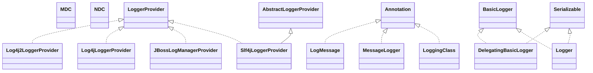

# jboss-logging-3.3.0.Final.jar

[Group index](README.md) | [All archives](../README.md)

## Scope and provenance

- **Donor:** `SQX_145_REFERENCE_ROOT/internal/libs/jboss-logging-3.3.0.Final.jar`.
- **SHA-256:** `e0e0595e7f70c464609095aef9e47a8484e05f2f621c0aa5081c18e3db2d498c`; accessed 2026-10-06; captured `2026-10-06T18:54:51.906614+00:00`.
- **Classes:** 48 raw entries; 48 unique entry names. Duplicate occurrence indices are zero-based.
- **Inspection:** read-only ZIP hashing and class-file structural parsing; signatures/descriptors, modifiers, hierarchy and references only. Bytecode bodies are hashed, not published.
- **Allocation:** proposed `FEAT-HOST-JBOSS-LOGGING`, P01; [roadmap](../../sqx-full-application-roadmap.md). Domain README registration remains required.
- **Repository:** `01067f00031428613c6394064ca1bcadc1ba00ee`; review state unreviewed. Download label 145-dev1; installed build/activation and runtime equivalence unverified.
- **Limit:** every class/member is inventoried; declaration coverage does not establish consumed calls, defaults, formulas, failure semantics or algorithm parity.
- **Archive/resource index:** [050.json](../../../evidence/sqx145/archives/145/050.json).

## Complete member declarations

Member shards contain exact JVM names/descriptors, access flags, generic signatures, throws types, declared fields/methods, superclass/interfaces and referenced class names. All classes, nested/synthetic members and overloads are retained. Code length/hash is structural evidence, not a normalized algorithm comparison.

- [001.json](../../../evidence/sqx145/members/050/001.json) — SHA-256 `2c3109bb4e7b5a79e70ec012ef2b6ee9f53457e634b8675ed454d67167a053fc`.

## Focused structural diagram

Up to twelve non-nested classes; arrows show declared inheritance/interfaces only. External type names are not evidence of an available body or an executed dependency.

## Class inventory

| Archive entry | Occurrence | Class SHA-256 | Fields | Methods |
| --- | ---: | --- | ---: | ---: |
| `org/jboss/logging/LogMessage.class` | 0 | `6f0939e4ec4df42bfd92d2bc365c81a138a9c1d51de54283d860e376e8e3e233` | 0 | 2 |
| `org/jboss/logging/Log4j2LoggerProvider.class` | 0 | `7c7e0ba730d28d56763c2becd5f2ffadb9abb66e4d44c47e70d7d98828aef5f2` | 0 | 15 |
| `org/jboss/logging/MessageLogger.class` | 0 | `64ac014891ff2a0627aaea472177136cdb58e0624be1295d8a43fd8db834bf71` | 0 | 1 |
| `org/jboss/logging/DelegatingBasicLogger.class` | 0 | `4404a6d7a9e09bae5b79cc1d9eccf07414b8ca259126cb75e7e59f0de335b6f9` | 3 | 202 |
| `org/jboss/logging/Slf4jLocationAwareLogger$1.class` | 0 | `53c7103cfc0145c18d68f9f557e5fffac24acb7ae34ec908fc5d7fed7491eb1b` | 1 | 1 |
| `org/jboss/logging/Logger.class` | 0 | `969e4d424e00fbcd71e1ed025c11e4d82226aa647850becfe4d229dc1611e0c0` | 3 | 227 |
| `org/jboss/logging/Log4jLoggerProvider.class` | 0 | `2a4d78b8ea747dfa9be0f211f96acd8b2ac672146a3a50b2a5a9c0bc5e6189c3` | 0 | 14 |
| `org/jboss/logging/Log4j2Logger$1.class` | 0 | `2b3dee5d5f4a6d843f9c0de613fe81cca2acbda4a5b6f9c260d22a4cd73ea59b` | 1 | 1 |
| `org/jboss/logging/MDC.class` | 0 | `1d388ffe313e4e9adee5aed5ffcb65dfedf4698a420ef3d73b10178a88cc6ef4` | 0 | 6 |
| `org/jboss/logging/JBossLogManagerProvider.class` | 0 | `bf404e0186e626905f70e1cc473b17d66116f2183069f9e1c976c7dc7d1d6925` | 2 | 19 |
| `org/jboss/logging/NDC.class` | 0 | `2bc020933595f2438c29ebbea8d5fb62a733d09085731346a39f632984adc527` | 0 | 8 |
| `org/jboss/logging/JDKLogger$1.class` | 0 | `5fa626f39f1867788a298c7152e1777cd8e60fc60e300fe0bfab9e02b4e819dc` | 1 | 1 |
| `org/jboss/logging/LoggingClass.class` | 0 | `038cdf38b0d5de9400a63b710fade9e79ddb9e9f18550a4964f2060822119056` | 0 | 0 |
| `org/jboss/logging/Log4jLogger$1.class` | 0 | `eb48a0ccd23708fefa89760b944253fe127b64ac5e2f94cd6afce9732da173fe` | 1 | 1 |
| `org/jboss/logging/LoggerProvider.class` | 0 | `8d39b04e3cb75c4ec7cbde0d1b4ce304d85c12b47acfa435c36ea9d5b4734f0d` | 0 | 13 |
| `org/jboss/logging/AbstractLoggerProvider$Entry.class` | 0 | `5663220b64162fc52332be8ead58d938c1eaa97e915f9088053948b90fdf127f` | 2 | 4 |
| `org/jboss/logging/JBossLogManagerLogger$1.class` | 0 | `641c9917e5d588d91e13f96269de42cbfcc26b6b3d4dbe62262f3b20242aed08` | 1 | 1 |
| `org/jboss/logging/Slf4jLoggerProvider.class` | 0 | `37cd38d5b272b5d6fc0f0f79a7a074b754fadf2c83511962b7262eb48defe6f0` | 0 | 7 |
| `org/jboss/logging/Message$Format.class` | 0 | `c97956616348a13b23ade28e3bad4bdd5ee2124b28e5afe320e97b1419ab588a` | 4 | 4 |
| `org/jboss/logging/JBossLogRecord.class` | 0 | `d046d3af6df2ed6b03b593c9cb25677a3bdf6cd0ea5689eb15971328ecf02555` | 4 | 9 |
| `org/jboss/logging/Messages.class` | 0 | `5b3d054dd0d58368d4c11f5f9616e929c8c96a707fa81e34634f8d668a7dc9d6` | 0 | 5 |
| `org/jboss/logging/Logger$1.class` | 0 | `51323929405e38a75331e34c6d31e480f5dc8fe4fa2e388fa938e13ac822eb67` | 3 | 2 |
| `org/jboss/logging/LoggerProviders$1.class` | 0 | `f6c50e0ff55377e1751ef124beba2ad6737a9905c8b62c4c0a1d3a9d2fd496bb` | 0 | 3 |
| `org/jboss/logging/SerializedLogger.class` | 0 | `131f8a455a3568c98ef9efc75c447df5c6a9fcb298e77a4c4def2a668189ee4d` | 2 | 2 |
| `org/jboss/logging/Param.class` | 0 | `7c4cea9e116829191c942499913dbfd4d1bf5aa02766ac11d9e8ef4c40b7b9ad` | 0 | 1 |
| `org/jboss/logging/Slf4jLogger$1.class` | 0 | `1e0ba2479d90361c4f146c4a0a2ff5d56a8bfe6873709f537d87d500b1de3dd1` | 1 | 1 |
| `org/jboss/logging/Messages$1.class` | 0 | `7fab4907d57639f711d043fb78061223b2eb2926854b30b2f7b81750fe45a281` | 2 | 2 |
| `org/jboss/logging/Log4jLogger.class` | 0 | `579d54134e99d18bddd63281a667768e43c8a4da5257a09109bfe985fc0adb25` | 2 | 5 |
| `org/jboss/logging/JBossLogManagerProvider$1.class` | 0 | `de06317d7c719d2dbe750af688ed8b3aeb6fddea8e75851645ef7ac326bc63cf` | 2 | 3 |
| `org/jboss/logging/Log4j2Logger.class` | 0 | `fd7cb0ddc74f0850d9dc7d8232abfae907079424f5f36a792283efb7878419bb` | 3 | 5 |
| `org/jboss/logging/LoggerProviders.class` | 0 | `1e3bbadddea09b888a82b79a563b2968f4aec92d42707ca0fec5e1a7eaa94fd7` | 2 | 10 |
| `org/jboss/logging/BasicLogger.class` | 0 | `3e02e69eada81b27bd29fd5b13b2a5705ff5fcf79a7e589f29c97cdf0f1192ef` | 0 | 200 |
| `org/jboss/logging/MessageBundle.class` | 0 | `c24a619d3091cda1b61b044458cb63d417fd61a20fa99a9d29781b2353b04ff5` | 0 | 1 |
| `org/jboss/logging/FormatWith.class` | 0 | `37cee015c5e0f06652f01502abf5b6eb86f748dfb0444b96bb950e001f02f87e` | 0 | 1 |
| `org/jboss/logging/Field.class` | 0 | `3fb98f1af2304b5f3a4b7fbb4b42e506d387c0ccfd645fd44f6c845cdb2a52f4` | 0 | 1 |
| `org/jboss/logging/Message.class` | 0 | `240b56f6359981d3db79de366f7d46c9692e4891cd3357d9bf015cdf8ce0f288` | 2 | 3 |
| `org/jboss/logging/Logger$Level.class` | 0 | `c9a6c51e17db70b4787deb9cd0e0e4705525c151131531e5ace6e046dbfecec0` | 7 | 4 |
| `org/jboss/logging/ParameterConverter.class` | 0 | `e915a4984586201192b5fb6b3c30f4b36a6c9bcf03f4f3f6acccb39b3c1157df` | 0 | 1 |
| `org/jboss/logging/AbstractLoggerProvider.class` | 0 | `a8a96c6b294bd86480f3ff7c6a8bc041c48590f936a6794b5ab6c78bf8261dad` | 1 | 8 |
| `org/jboss/logging/Slf4jLogger.class` | 0 | `0d89d734fe665d976505325115dd6914fe4cdd87d67a0fe754ab8026a0645ad3` | 2 | 4 |
| `org/jboss/logging/JDKLogger.class` | 0 | `388fde4c2a31c05815f3a709843f2082470e3a750f7cdbaed4e84a845278a150` | 2 | 5 |
| `org/jboss/logging/Slf4jLocationAwareLogger.class` | 0 | `1f4e466e14260c69aadf7bca828900f8c5c748bcf41b5d50fa52a1e9e2a0d9a9` | 5 | 7 |
| `org/jboss/logging/Cause.class` | 0 | `62a9b80d6accf4f0e3934827b7d210e3f7f47115e8db519427d035f54457f439` | 0 | 0 |
| `org/jboss/logging/AbstractMdcLoggerProvider.class` | 0 | `29a86dee0c97348f7ee7078af7bc05927a742ed4d2df7e1f017805a82f3be649` | 1 | 6 |
| `org/jboss/logging/JDKLevel.class` | 0 | `8cdc0612fc7bebb512e6a1f437481f4f55991da55b3e5c5b1793881a653dde98` | 7 | 3 |
| `org/jboss/logging/Property.class` | 0 | `3f2dba6be7be81283ed690cf2644ca20eb04ef52acf53c5b1fd4233f62fa920c` | 0 | 1 |
| `org/jboss/logging/JBossLogManagerLogger.class` | 0 | `ad5bb1b12492e3c7e3ecc3345ef6e52fd53784e1f83e46f294e20c45551dddcb` | 2 | 5 |
| `org/jboss/logging/JDKLoggerProvider.class` | 0 | `5767bcc8782ceba3756433490d677bd4d7b9a33dee802541d59afdbd94be7c8b` | 0 | 2 |
