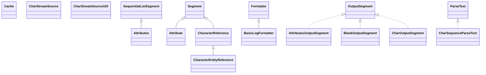

# jericho-html-3.3.jar

[Group index](README.md) | [All archives](../README.md)

## Scope and provenance

- **Donor:** `SQX_145_REFERENCE_ROOT/internal/libs/jericho-html-3.3.jar`.
- **SHA-256:** `149f74929589c67b76efe85804c2c285ec1cc5ab6fcc1c2bc99694475a1656d6`; accessed 2026-10-06; captured `2026-10-06T18:54:51.906614+00:00`.
- **Classes:** 156 raw entries; 156 unique entry names. Duplicate occurrence indices are zero-based.
- **Inspection:** read-only ZIP hashing and class-file structural parsing; signatures/descriptors, modifiers, hierarchy and references only. Bytecode bodies are hashed, not published.
- **Allocation:** proposed `FEAT-HOST-JERICHO-HTML`, P02; [roadmap](../../sqx-full-application-roadmap.md). Domain README registration remains required.
- **Repository:** `01067f00031428613c6394064ca1bcadc1ba00ee`; review state unreviewed. Download label 145-dev1; installed build/activation and runtime equivalence unverified.
- **Limit:** every class/member is inventoried; declaration coverage does not establish consumed calls, defaults, formulas, failure semantics or algorithm parity.
- **Archive/resource index:** [053.json](../../../evidence/sqx145/archives/145/053.json).

## Complete member declarations

Member shards contain exact JVM names/descriptors, access flags, generic signatures, throws types, declared fields/methods, superclass/interfaces and referenced class names. All classes, nested/synthetic members and overloads are retained. Code length/hash is structural evidence, not a normalized algorithm comparison.

- [001.json](../../../evidence/sqx145/members/053/001.json) — SHA-256 `655977c1dcc40dc2857f4ed2317dd326ebbb922c1dfd97d0275bda7260b6e28b`.
- [002.json](../../../evidence/sqx145/members/053/002.json) — SHA-256 `e53febe19c15fad1af171773bd8e4e94eb2d110b9c432009c3da606e042e43c2`.

## Focused structural diagram

Up to twelve non-nested classes; arrows show declared inheritance/interfaces only. External type names are not evidence of an available body or an executed dependency.

## Class inventory

| Archive entry | Occurrence | Class SHA-256 | Fields | Methods |
| --- | ---: | --- | ---: | ---: |
| `net/htmlparser/jericho/Attribute.class` | 0 | `4ad241f7d3f5fe96f12f9dd5a067193b24e9ddc2f2786806c75266d2204af44a` | 15 | 15 |
| `net/htmlparser/jericho/Attributes$1.class` | 0 | `b2e267088ee8c0e96cee25b733e9741ec2525151cde63074152a4072553f9763` | 1 | 1 |
| `net/htmlparser/jericho/Attributes$ParsingState.class` | 0 | `4e6a94ec7a772cec36c14a41680e9ece3c52ec467887ac30b4a12931850eda23` | 8 | 4 |
| `net/htmlparser/jericho/Attributes.class` | 0 | `b41e89e337907c44a78dc794ab9d9e9dba4651d2b16d57604f990ab9607198aa` | 3 | 25 |
| `net/htmlparser/jericho/AttributesOutputSegment.class` | 0 | `647419374ab68dfb3b2bf4f72eea4095716cbd27e17dade829cede3a62082020` | 3 | 10 |
| `net/htmlparser/jericho/BasicLogFormatter.class` | 0 | `5be0a2b34545e1b3575e9870eea1a8cd9437be4c902b9ceb8ae35ad09f6e0281` | 3 | 4 |
| `net/htmlparser/jericho/BlankOutputSegment.class` | 0 | `de4bb54dbd544a93c298ffdb61f8e509b11c5b7b68a21a6b666cf089f673a8ef` | 2 | 9 |
| `net/htmlparser/jericho/Cache.class` | 0 | `53befcac19550d7f3f2c7479d2aacc0cf8a544697bb315679d6c9f872c4b48a8` | 4 | 16 |
| `net/htmlparser/jericho/CharacterEntityReference.class` | 0 | `cacb4848beda65c3c0148ddbee575bb74988e57a0b75e988b27acb3cf42febd9` | 257 | 14 |
| `net/htmlparser/jericho/CharacterReference$EncodingFilterWriter.class` | 0 | `1a131084917690444e7c303b80c6fe82e638d649454c6af3a3cef6a9ccbeeddf` | 1 | 5 |
| `net/htmlparser/jericho/CharacterReference.class` | 0 | `1df058133a4d46c6e882687abc8bed4735e9c46f46a3d946f01bb70ad09bf9b4` | 4 | 42 |
| `net/htmlparser/jericho/CharOutputSegment.class` | 0 | `fc5fae98adc4227a361873a384a287b4e925ff87c674cd196e95e6c9d88d3005` | 3 | 9 |
| `net/htmlparser/jericho/CharSequenceParseText.class` | 0 | `63f4355f1da555f40cf7eae4aee1f832ca60d4e40bd54864f78cea591d3c12f5` | 1 | 16 |
| `net/htmlparser/jericho/CharStreamSource.class` | 0 | `5f0b685318dd9bd9d5e703a25967bac40afa776debd36130e472d24b055619b7` | 0 | 4 |
| `net/htmlparser/jericho/CharStreamSourceUtil.class` | 0 | `c5e195f37fe53778ee309cc781548307098656e3206664ea59c64914af2937f0` | 1 | 3 |
| `net/htmlparser/jericho/Config$CompatibilityMode.class` | 0 | `df9d22da8c00e0371bd085e2b60ce2e12f2a14cc913194ff992e860e7efaf2d9` | 10 | 15 |
| `net/htmlparser/jericho/Config$UnterminatedCharacterReferenceSettings.class` | 0 | `babbf0ee7b0a7885821d3d847e7fb039069424417d42dcceab94283ab5ad97d9` | 4 | 5 |
| `net/htmlparser/jericho/Config.class` | 0 | `d61b870018d3720dbad856ff80c5b413d740ecef1ff5048e01863889103a5759` | 10 | 2 |
| `net/htmlparser/jericho/Element.class` | 0 | `b4712148bd109ce889c8304cfd340a89a854250e11d23c91b52217891db9982a` | 8 | 18 |
| `net/htmlparser/jericho/EncodingDetector.class` | 0 | `88205b45263734701d250f06953be553aabe82279530d3dca6a9916a59e3f8df` | 11 | 18 |
| `net/htmlparser/jericho/EndTag.class` | 0 | `378d36a05247327201f4d3e81765a27a4b97780d3d071ab51789b4d3bb15096d` | 1 | 12 |
| `net/htmlparser/jericho/EndTagType.class` | 0 | `521531cce2779cf6c9dbf840b085402afa780daefb546b82ab48aeb4ed0f4192` | 3 | 6 |
| `net/htmlparser/jericho/EndTagTypeGenericImplementation.class` | 0 | `98427b97251c6ee6486a2eda8bd5595ff61024ea38e6bcb674d38fa827db8465` | 1 | 5 |
| `net/htmlparser/jericho/EndTagTypeMasonComponentCalledWithContent.class` | 0 | `e086c50097b84419e3c63474b89d24dc3b1ca8661c273d62f8dafa35692a1206` | 1 | 3 |
| `net/htmlparser/jericho/EndTagTypeMasonNamedBlock.class` | 0 | `f562556a30b2dcdbb026d586fa45179adc18cc5b8f0452853d5594257cc770ec` | 1 | 3 |
| `net/htmlparser/jericho/EndTagTypeNormal.class` | 0 | `d9bbab2598fea9481f95d273388c12c350cffe2d5b9eb477748f4072d61401fe` | 1 | 3 |
| `net/htmlparser/jericho/EndTagTypeUnregistered.class` | 0 | `6b22b4cbd3f1c9f077f92dfc36536fc53e0c45b6859803182b73b1a3365f246b` | 1 | 3 |
| `net/htmlparser/jericho/FormControl$1.class` | 0 | `b503d87bb4598a4703e8b5642bcaacb4c5227e2edd527bcc5769442226f52638` | 1 | 1 |
| `net/htmlparser/jericho/FormControl$ElementContainer.class` | 0 | `7a5c5e27b34efe78a754def31d59c25203947a2e6ffb09dfb45b796643819f97` | 3 | 8 |
| `net/htmlparser/jericho/FormControl$ImageSubmitFormControl.class` | 0 | `e596d6e6b8957aebb49258f259e762af60a48f43c63ce61753a3949ef324506b` | 0 | 2 |
| `net/htmlparser/jericho/FormControl$InputFormControl.class` | 0 | `38f513cf9d81ccbe02dea513ca47be1cfa2e56b6d630a5f478274ca2490a2273` | 0 | 5 |
| `net/htmlparser/jericho/FormControl$PositionComparator.class` | 0 | `cb7b1de43da6f4e8d29a1314abb7aa9d8cb6c7d098b98403e8a7b22299f673f4` | 0 | 4 |
| `net/htmlparser/jericho/FormControl$RadioCheckboxFormControl.class` | 0 | `5c8af32b1bad4b30134cfac9eee49f80687092975af35248cd5b18f205ad9ab1` | 0 | 7 |
| `net/htmlparser/jericho/FormControl$SelectFormControl$OptionElementIterator.class` | 0 | `fa23947bbc8eb88a53053b06e3e5b7823588cca696b5350279dc831335f7cfa6` | 2 | 6 |
| `net/htmlparser/jericho/FormControl$SelectFormControl.class` | 0 | `25b2153141676c27606310a7e2e499a009b45eb07026f01e15f0f09207661c8c` | 1 | 11 |
| `net/htmlparser/jericho/FormControl$SubmitFormControl.class` | 0 | `1e163d84e7dab59d3344bee2ce9cbf43fdaf3ca7a8d0238185a1c1725aaad882` | 0 | 5 |
| `net/htmlparser/jericho/FormControl$TextAreaFormControl.class` | 0 | `ba36506c6eae189e20c0d7aa9b777c6773823545e8ff8e0e99b83df8df4243e7` | 2 | 7 |
| `net/htmlparser/jericho/FormControl.class` | 0 | `eef174f0f924abce96e8f140ba2ef9f0a6263e037e4ed67606a7cdaf15f7a58e` | 6 | 33 |
| `net/htmlparser/jericho/FormControlOutputStyle$ConfigDisplayValue.class` | 0 | `af8050ea949cc4342fff40dddf2648c26aede6ae95d1c3fe10769863ca29e0cd` | 7 | 2 |
| `net/htmlparser/jericho/FormControlOutputStyle.class` | 0 | `9a97612b2e55a765a6cd4ba2d43678e16e84ee06f2e3cc406008f5d4c9a3848e` | 4 | 5 |
| `net/htmlparser/jericho/FormControlType.class` | 0 | `534a384b75bdfce97f8b56b682abca53c010dde664638c3445e8f561d56ecdd1` | 18 | 9 |
| `net/htmlparser/jericho/FormField.class` | 0 | `c200a68ee40046495cb8a287a9fdbaafd99f5c5c3860eedeefff1a7f3ab877ba` | 7 | 21 |
| `net/htmlparser/jericho/FormFields$Column.class` | 0 | `6625602b5e729f1bc5ea3b326a52f965dbb5f778b874285ec6770448306e0305` | 3 | 1 |
| `net/htmlparser/jericho/FormFields.class` | 0 | `67c52e2d99c185b118bd69a84a07c08883ad440e3577d8f1c7932b04b974b06a` | 3 | 24 |
| `net/htmlparser/jericho/HTMLElementName.class` | 0 | `2de210a52e7b8afbd59a10c3a0d0a912a43ece70cc884e63e5225683f6765443` | 120 | 0 |
| `net/htmlparser/jericho/HTMLElementNameSet.class` | 0 | `723371ac5fb11bd1c620a23eba0b51bb46e5b67c219264cf7f2b064557434fbc` | 1 | 8 |
| `net/htmlparser/jericho/HTMLElements.class` | 0 | `de74b7a2d898a1f98626407b5d641063839773cb7488dbfd3abe8758891b3935` | 18 | 19 |
| `net/htmlparser/jericho/HTMLElementTerminatingTagNameSets.class` | 0 | `d08d5e14d78e1aad53feebd4ccded3df1ab3cf086ed0bb8d16672297759db639` | 3 | 1 |
| `net/htmlparser/jericho/IntStringHashMap$Entry.class` | 0 | `24d4611d7d8fa604bd0bbf494f9d36e58a9415c899eddab09ff5420aa875d28a` | 3 | 1 |
| `net/htmlparser/jericho/IntStringHashMap.class` | 0 | `fb6aa27adee8aeb75d9d120cc21ba13b0922d5b34fa418296d3398b8eae92178` | 7 | 14 |
| `net/htmlparser/jericho/Logger.class` | 0 | `9b0ee39915994f834814a1a249cbc2a8bb3dd4b98042f3d11b2938dd2f772d3e` | 0 | 8 |
| `net/htmlparser/jericho/LoggerDisabled.class` | 0 | `737ae62ff8ee1a654140d1e94722a19304696dd6c9d9025d73d0f51c4889e299` | 1 | 10 |
| `net/htmlparser/jericho/LoggerFactory.class` | 0 | `79959a96e6434085ea6cbae319f079ceb99abac37c52ba2c167e86770f2663ac` | 1 | 8 |
| `net/htmlparser/jericho/LoggerProvider.class` | 0 | `96f72ac010ec35a0b0f1a88ee0de3417247c024c92031b2ecada08464cba2ca6` | 6 | 2 |
| `net/htmlparser/jericho/LoggerProviderDisabled.class` | 0 | `252888a9d4e0b4ea5d34b69d0fa9a9b2fe5afa1f9e2d1b7a234edfead5d12fce` | 1 | 3 |
| `net/htmlparser/jericho/LoggerProviderJava$JavaLogger.class` | 0 | `a65ff44287f1df0c561ab7f4a8dfcbd86d324b26ca914dab8675017d66116115` | 2 | 9 |
| `net/htmlparser/jericho/LoggerProviderJava.class` | 0 | `9b89f7cabf1a412c3773eea832be79310e586260cacab2545c031f5cda102897` | 1 | 3 |
| `net/htmlparser/jericho/LoggerProviderJCL$JCLLogger.class` | 0 | `88119ebad2d42afbda85086102d47fb354893ac3cdf4bdfa6e2f14fb11f3a47b` | 1 | 9 |
| `net/htmlparser/jericho/LoggerProviderJCL.class` | 0 | `8d0ab80122e3cfd8a4cf5c9c2c3699221cf684b9a2af0a73667f32f37bc3ecc8` | 1 | 3 |
| `net/htmlparser/jericho/LoggerProviderLog4J$Log4JLogger.class` | 0 | `e57476f0255ed03dab989ffab486c621cee99dc24d7a1a10a22967e11b40ec4a` | 1 | 9 |
| `net/htmlparser/jericho/LoggerProviderLog4J.class` | 0 | `aca0f61d54ffdae0aefadbc8a09ee3aea706837f7be6fc3cd93cf47bdf6a5bb8` | 1 | 3 |
| `net/htmlparser/jericho/LoggerProviderSLF4J$SLF4JLogger.class` | 0 | `4273a26671ea690121dfefd42af571a62f8914c3b093a2aa12fda9978712d734` | 1 | 9 |
| `net/htmlparser/jericho/LoggerProviderSLF4J.class` | 0 | `411291a92a96584748dc13ff2526eea5ee2be05fbadd253835a5ba59fc252805` | 1 | 3 |
| `net/htmlparser/jericho/LoggerProviderSTDERR.class` | 0 | `236ece2d6444e6593290c7cb6fa33d3d8e27be3f2dcec12bb245f0acb87aca68` | 1 | 3 |
| `net/htmlparser/jericho/LoggerQueue.class` | 0 | `73ee23660522a450530f93930a9dd471568c262b6471954ff9416002748cfa63` | 5 | 14 |
| `net/htmlparser/jericho/MasonTagTypes.class` | 0 | `35cc6d3fc9ce9300fa1eb42829e05f5d861e7e67ce2b583c341dce1c243d7bd0` | 6 | 6 |
| `net/htmlparser/jericho/MicrosoftConditionalCommentTagTypes.class` | 0 | `fbd31b1599a35502782e472252bd83c7f27762df3065125a5b75f113ba12059e` | 8 | 5 |
| `net/htmlparser/jericho/MicrosoftTagTypes.class` | 0 | `e36a92d8b4deb368fe23db347eeec39274bf2bd127978c4e85f3d029508ce151` | 2 | 7 |
| `net/htmlparser/jericho/NodeIterator.class` | 0 | `1bd3e188988e6dd58198617449dfe36561a1221a4047a3c295cbf80cff2a9124` | 6 | 7 |
| `net/htmlparser/jericho/nodoc/SequentialListSegment$SubList$1.class` | 0 | `4640ce86914dc8a0ce539d6c53dd7d47153e9d7b2b2305b8ee8b34f0700c4cda` | 3 | 10 |
| `net/htmlparser/jericho/nodoc/SequentialListSegment$SubList.class` | 0 | `5535d5cacd2c67ecdf53fe29198e2226115db7e2c7afc14e58f62ab7b772b4cf` | 3 | 11 |
| `net/htmlparser/jericho/nodoc/SequentialListSegment.class` | 0 | `5ac43a7beadd162289d80e68ea65cea1123d91a5dba8a0e57066e00e8cbecbf3` | 0 | 25 |
| `net/htmlparser/jericho/NumericCharacterReference.class` | 0 | `364f357df5ea64120b0b1f5e698424641cbb3b4a1fe5a01cc1aceafc08e100b7` | 1 | 10 |
| `net/htmlparser/jericho/OutputDocument.class` | 0 | `bbd511c4f7dfb1a30e9ccf737cc303d5a12d580e13221cbf2388645640136537` | 3 | 26 |
| `net/htmlparser/jericho/OutputSegment.class` | 0 | `932ff272c98b62b4df67d6c972e437ac8211608aaf5a3a322385dbdc1fa3a59f` | 1 | 7 |
| `net/htmlparser/jericho/OutputSegmentComparator.class` | 0 | `814dc20f859680a5269472d99f11c5a01d7cda29220269f018adc7cf04e83f7d` | 0 | 3 |
| `net/htmlparser/jericho/ParseText.class` | 0 | `bc125cfe7956ea1d62763b379cc0cc16e399ed6eb6353f806d6d654728c90de7` | 1 | 13 |
| `net/htmlparser/jericho/PHPTagTypes.class` | 0 | `97da0ec84bb05f585cc3e69c7fd9e15129c662ddd0183414ceb34b7a5383218c` | 4 | 6 |
| `net/htmlparser/jericho/RemoveOutputSegment.class` | 0 | `2c7b0c01c3265fd8cab6856049048d3d85b625928dfe24856ce815758f76ac9b` | 2 | 9 |
| `net/htmlparser/jericho/Renderer$AbstractBlockElementHandler.class` | 0 | `15bc9a5aaa80dac28d9fc5e993cf3230a2dff069d27419f2363bfb7d67b1bba9` | 3 | 10 |
| `net/htmlparser/jericho/Renderer$AlternateTextElementHandler.class` | 0 | `3e859de4ae2cab2a331ddaf9958f7af694e43b1b55bef676ac365214a2bdd59f` | 1 | 3 |
| `net/htmlparser/jericho/Renderer$A_ElementHandler.class` | 0 | `124bc5e9cd9be4a26187b44519881350a72c22940295ec22fd88360a450a2a56` | 1 | 3 |
| `net/htmlparser/jericho/Renderer$BR_ElementHandler.class` | 0 | `bb6cebe1e183eb9793ded6539dcdbcfab7551455aa98c8c58169061ff6842012` | 1 | 3 |
| `net/htmlparser/jericho/Renderer$ElementHandler.class` | 0 | `143fbaaf769e17cad01de541c35dd551b3266f1069ca435ce851f7d913944c48` | 0 | 1 |
| `net/htmlparser/jericho/Renderer$FontStyleElementHandler.class` | 0 | `3229aa72e144e4e6e4b516bce628cb1e51149497edfb5404a6a8bd4a579673f5` | 5 | 3 |
| `net/htmlparser/jericho/Renderer$HR_ElementHandler.class` | 0 | `e6a46a0fba9c785630733a7e640c5c791c0cb8911d2c9d4da69aa002712fdc5f` | 1 | 5 |
| `net/htmlparser/jericho/Renderer$ListElementHandler.class` | 0 | `f9db91e360d5d71623cfa429eb5b3b59227c406e91a3a00f8823775b84ec6c1f` | 3 | 5 |
| `net/htmlparser/jericho/Renderer$LI_ElementHandler.class` | 0 | `7456a25ad92632f13d7259c130b6de2563746f08ab07d0c97c16aeddfe08b8a9` | 1 | 5 |
| `net/htmlparser/jericho/Renderer$PRE_ElementHandler.class` | 0 | `8fb28d5ff7710df48d7c63159cbc890bffa230e1a915f3eace395c9e80dfdc58` | 1 | 5 |
| `net/htmlparser/jericho/Renderer$Processor.class` | 0 | `8561618a0e6f2e9960564659144e7b8e99169a4c22c8eed5f8db040122452dd3` | 29 | 59 |
| `net/htmlparser/jericho/Renderer$RemoveElementHandler.class` | 0 | `de1b5c0e6e6a317b5ca53f8e9ccb5928ea3e10dfef024fcc4d05be5a318d65ac` | 1 | 3 |
| `net/htmlparser/jericho/Renderer$StandardBlockElementHandler.class` | 0 | `15c02d27430b34cf534ada407893617a4c15d3e97631a59c8879147ce106a053` | 5 | 4 |
| `net/htmlparser/jericho/Renderer$StandardInlineElementHandler.class` | 0 | `471e671b2f1f358d01eb29c7158c73f9963a1375311332ad6f2ddd4379a94676` | 1 | 3 |
| `net/htmlparser/jericho/Renderer$TD_ElementHandler.class` | 0 | `7231db9faed74bf64772c2edbd962a1e7e5bfbf36a8051ee01ca251d27da6ced` | 1 | 3 |
| `net/htmlparser/jericho/Renderer.class` | 0 | `dbc22c9e936e801e6a80a56b860cbad712c15bc13e4da02abcba1ea4a8588db0` | 16 | 43 |
| `net/htmlparser/jericho/RendererCSS$Side.class` | 0 | `880c6697df0c881e3b02389a4ad81ba65fe3771a46966241e6982fa54f0e6e8b` | 5 | 4 |
| `net/htmlparser/jericho/RendererCSS.class` | 0 | `465b0c4c1ee02161e0ac65fea6b8717b9f5be8abcf09670f097e813c28483c65` | 1 | 9 |
| `net/htmlparser/jericho/RowColumnVector.class` | 0 | `154d84177bea646cb9ce9b575109363c028ef821697006c7fc800417e1ea1847` | 5 | 10 |
| `net/htmlparser/jericho/Segment.class` | 0 | `60b3261fb1635bd4e3ef1e9ae73b840c2d280704f771986d7ded22523072ff48` | 4 | 65 |
| `net/htmlparser/jericho/Source.class` | 0 | `ed287e9b0cdbd9a751e3685d35cdaa3673e099114c266e7c5dc8e2c874c00838` | 26 | 89 |
| `net/htmlparser/jericho/SourceCompactor.class` | 0 | `8cdb9d21fbdddbf189ed46da4ff6c0537d1128cd099724191100b71760d46470` | 2 | 7 |
| `net/htmlparser/jericho/SourceFormatter$Processor.class` | 0 | `06120b96f9ab37a670625b68b8a1fdd669aeb3d2738431372a2fed13b7d689df` | 13 | 24 |
| `net/htmlparser/jericho/SourceFormatter.class` | 0 | `490058f218bfa912aa25c60028a1416beed5f36c3a0a41edad9ae7e90375435e` | 7 | 17 |
| `net/htmlparser/jericho/StartTag.class` | 0 | `18e3823ffee3dc5258788f61896e5c1752679783d5077a2f7a32a8f7fb1e9556` | 4 | 36 |
| `net/htmlparser/jericho/StartTagType.class` | 0 | `b598383f6b982af4946c26414c7a1a53fb180210ec597b2353c672af719603ee` | 15 | 8 |
| `net/htmlparser/jericho/StartTagTypeCDATASection.class` | 0 | `5449c9388d05454d225ce3208b8b1db7cf61343f36b579db3a0b09b534c32355` | 1 | 2 |
| `net/htmlparser/jericho/StartTagTypeComment.class` | 0 | `7a87329ef58df5af5eb46cacf6dd9f8e97ff36b1da66db0df548111d80b55bde` | 1 | 2 |
| `net/htmlparser/jericho/StartTagTypeDoctypeDeclaration.class` | 0 | `d8d298b7545ab98a99a1db8e2a10d441f26e81d316a5c342143223638df869d6` | 1 | 3 |
| `net/htmlparser/jericho/StartTagTypeGenericImplementation.class` | 0 | `d9cac16a96846d8ad59d5051887b6541d46b53d74c0d9ff64f1a1396e148d7c4` | 1 | 4 |
| `net/htmlparser/jericho/StartTagTypeMarkupDeclaration.class` | 0 | `f0e68d2df6ea73d416f7e7c2d25d57859e23ae909a8efc216660499a03d208a2` | 5 | 4 |
| `net/htmlparser/jericho/StartTagTypeMasonComponentCall.class` | 0 | `8cb49733e995f7715de4540fed549f4b1cbd36b7941f9c45414f8246b5b15c2d` | 1 | 2 |
| `net/htmlparser/jericho/StartTagTypeMasonComponentCalledWithContent.class` | 0 | `bc760d09d4204bf76ab657e2194ee2cff723d67b8c8e51a936f1bfc0018d671b` | 1 | 2 |
| `net/htmlparser/jericho/StartTagTypeMasonNamedBlock.class` | 0 | `900e8f94efd1c8eb5bc58ea22518ac86be8e12a7d683ca561c6c8222815b8815` | 1 | 3 |
| `net/htmlparser/jericho/StartTagTypeMicrosoftDownlevelHiddenConditionalCommentEndif.class` | 0 | `942102197c4b0e797402bd4635d78ea913d32758a348a4528871f54d0a7ba25b` | 1 | 2 |
| `net/htmlparser/jericho/StartTagTypeMicrosoftDownlevelHiddenConditionalCommentIf.class` | 0 | `0684d344d5e94eafee0b4f32c2d340235cb42e1105b0e1b03067b9d2eeec85d8` | 1 | 2 |
| `net/htmlparser/jericho/StartTagTypeMicrosoftDownlevelRevealedConditionalComment.class` | 0 | `022805baf2683be7ed41f7cc23d4e5fff8fbd3d9340400c93d90434c68aa724d` | 3 | 3 |
| `net/htmlparser/jericho/StartTagTypeMicrosoftDownlevelRevealedConditionalCommentEndif.class` | 0 | `6d08c0241870f6539232c624c07ad18055e8b9561ad4bd892bbd9debd7602373` | 1 | 2 |
| `net/htmlparser/jericho/StartTagTypeMicrosoftDownlevelRevealedConditionalCommentIf.class` | 0 | `689aac555a6f9741598a7c8de4e673e77097f8cd6c4f29c4c1abde2422958df7` | 1 | 2 |
| `net/htmlparser/jericho/StartTagTypeMicrosoftDownlevelRevealedValidatingConditionalCommentEndif.class` | 0 | `c81c2b8c5d9e6a9294894433056959f8fbccedeee9ced5cacbe4498f561997c9` | 1 | 2 |
| `net/htmlparser/jericho/StartTagTypeMicrosoftDownlevelRevealedValidatingConditionalCommentIf.class` | 0 | `3440d0d9f46da586d9cc4fdeb77139a3e68c9878a6e8f71d64bb2ae9951838ea` | 1 | 4 |
| `net/htmlparser/jericho/StartTagTypeMicrosoftDownlevelRevealedValidatingSimplifiedConditionalCommentIf.class` | 0 | `1d2b5286960110040498e475f1fe43f577fd82ce681ac154441db3e7a076d024` | 1 | 2 |
| `net/htmlparser/jericho/StartTagTypeNormal.class` | 0 | `8e2d2aa6b1f8ed2c4cf348ce681f68e480c2ab1700c4a90d15040571a96eb153` | 1 | 3 |
| `net/htmlparser/jericho/StartTagTypePHPScript.class` | 0 | `9278bdd0faa1712338c640628b9db342ac5fbfe413905dcd6441e8c021a2ddf5` | 1 | 3 |
| `net/htmlparser/jericho/StartTagTypePHPShort.class` | 0 | `1594debfd9c568618852e90eddc0ba308230cf0524900f1bcadd0c437f47a9ef` | 1 | 2 |
| `net/htmlparser/jericho/StartTagTypePHPStandard.class` | 0 | `3d88c31ee9df0b86612081470d2cb34d9b0f782e9cfd9a542f4bfcd3f504c6c3` | 1 | 2 |
| `net/htmlparser/jericho/StartTagTypeServerCommon.class` | 0 | `c1512ee326628d365b3d46da414fff1956084fef9180f1b0ee10c8691ad36141` | 1 | 2 |
| `net/htmlparser/jericho/StartTagTypeServerCommonComment.class` | 0 | `267ba181722dd1cdad95d8ebe698ee44e1154c9e8a6a0a2a3b7df69b21921f1f` | 1 | 2 |
| `net/htmlparser/jericho/StartTagTypeServerCommonEscaped.class` | 0 | `1209742202b439ed4bea2de63765bbf61efdb189f4ad4f1ca22d0a42b9f93f54` | 1 | 3 |
| `net/htmlparser/jericho/StartTagTypeUnregistered.class` | 0 | `c366bd02ac73b9ea8560bd304ddf9fb06f1e16b3aa28106bd2385be6e63c9d41` | 1 | 3 |
| `net/htmlparser/jericho/StartTagTypeXMLDeclaration.class` | 0 | `a69c33427083c8d830a3081bc92d85c7e489e5fdc21162cb754bb69ea4985053` | 1 | 2 |
| `net/htmlparser/jericho/StartTagTypeXMLProcessingInstruction.class` | 0 | `f52cd748a793b74c223dfd364dd524ca27bbdfbd70d9badc9abc3028d628b8fb` | 1 | 2 |
| `net/htmlparser/jericho/StreamedParseText.class` | 0 | `e807653f85626ac2e4370915ab7fcccbb870a68323d6b44b07cc3c4290efe173` | 1 | 3 |
| `net/htmlparser/jericho/StreamedSource$StreamedSourceIterator.class` | 0 | `6dcf8810a2f2a7576589af6be8a808d398a6508c47129e7760978d4f35bf86ca` | 7 | 7 |
| `net/htmlparser/jericho/StreamedSource.class` | 0 | `7c5f6974e5f2b319807ce764467c1da800c5ab70ce9e0ec738e535558866aa4d` | 14 | 39 |
| `net/htmlparser/jericho/StreamedText.class` | 0 | `f7061ff3c7b269221e9c2ef4497e526c12104a2083d62c94ce9f799d8b11cf56` | 8 | 31 |
| `net/htmlparser/jericho/StreamEncodingDetector.class` | 0 | `6444aedb0a3c86bdd363e5723f6ef660d7225746d75caf1608e2d9146e8c491b` | 23 | 13 |
| `net/htmlparser/jericho/StringOutputSegment.class` | 0 | `119c626e943ff1a29125cd5cfff667fc4170475f4f601bfa967d81253f6ece65` | 3 | 10 |
| `net/htmlparser/jericho/SubCache$CacheEntry.class` | 0 | `0a736cad78c5b9dc99b738bbd45584e71e5960578c15e6e864ef1eea54a7e97c` | 6 | 4 |
| `net/htmlparser/jericho/SubCache$CacheEntryMissingInternalError.class` | 0 | `ecb3d61447ba3036c2a973301b5351a353aed78aee388d098559878b767b812d` | 0 | 1 |
| `net/htmlparser/jericho/SubCache$FoundCacheEntryMissingInternalError.class` | 0 | `f6b3421c867cad7846439ea0686b9a08c15e11ec639759fe2747d701646af328` | 0 | 1 |
| `net/htmlparser/jericho/SubCache$SourceCacheEntryMissingInternalError.class` | 0 | `67cffaa2f46e1cb454ea4c3306547ba23d592396711f1fe8a0569f4614081c9c` | 0 | 1 |
| `net/htmlparser/jericho/SubCache$TagIterator.class` | 0 | `be4cfa68dbd8367081d780471378214001d3f0034e65d24524b5e274e5b26e85` | 3 | 6 |
| `net/htmlparser/jericho/SubCache.class` | 0 | `a4b8f4466420fd798f89cdeab66c325a37b194e4f70741707b1aed847f9b358c` | 6 | 29 |
| `net/htmlparser/jericho/Tag.class` | 0 | `12a20eab6a6ac2b16dec208b1c73ee16d02ca3a1c633c31bd1b7d65c7396de9f` | 7 | 35 |
| `net/htmlparser/jericho/TagType$TagTypesIgnoringEnclosedMarkup.class` | 0 | `85bf5ee036a454567cfffdca186a10df8e180b40a4cf615f36333db0253b8c46` | 1 | 2 |
| `net/htmlparser/jericho/TagType.class` | 0 | `d336661f06c5975cc6e377b405c37d3910de97f38411ff15f42bf81c65e6bb87` | 7 | 18 |
| `net/htmlparser/jericho/TagTypeRegister$ProspectiveTagTypeIterator.class` | 0 | `ea1f5f40833c311c31ba9a15cb9c16b18ccb8be11e6e4efde36081a25bfeb499` | 2 | 5 |
| `net/htmlparser/jericho/TagTypeRegister.class` | 0 | `953c0cba4235deae0c1257f29257b282a016c490fd335acbb119c32e492839f5` | 7 | 20 |
| `net/htmlparser/jericho/TextExtractor$1.class` | 0 | `27eec6580f2f7091e316b906614f1d56937bf01d27486b0e766d735d44cebb2c` | 0 | 2 |
| `net/htmlparser/jericho/TextExtractor$2.class` | 0 | `93c9dd78ac18518040ed545d98dbf14197c0d4b7209ae4b3965fe1d0cccf8c01` | 0 | 2 |
| `net/htmlparser/jericho/TextExtractor$AttributeIncludeChecker.class` | 0 | `5025601554b56c3e064c07cc6d6fb17ae7fa3c82a7148e31a6a6dcac9fa2938a` | 0 | 1 |
| `net/htmlparser/jericho/TextExtractor$Processor.class` | 0 | `6c2431d96109a02a0dce0186295465883fbeda401de1b96d5626203745404ff5` | 6 | 2 |
| `net/htmlparser/jericho/TextExtractor.class` | 0 | `f851ffa2f5e7764aa990f46ff62abcba4268d3cdb776611a264ba249d7e5e24b` | 7 | 14 |
| `net/htmlparser/jericho/URIAttributes.class` | 0 | `6c2396244d9c88aeb4cefde753bae4836d7dd1ae947d81c7d56e65a337d63d3d` | 2 | 6 |
| `net/htmlparser/jericho/Util.class` | 0 | `8ad96e0d7ad3a2015b7cd9ef7c46584ed7ad4c4418a3596d023caf0e021d99fd` | 2 | 6 |
| `net/htmlparser/jericho/WriterLogger.class` | 0 | `d9c9a42ee30db0e24dbb32ddadcb27d2367ccc541b799db3df51a8a0f28263b4` | 6 | 17 |
