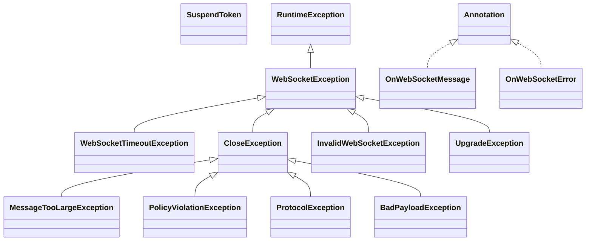

# jetty-all-uber.jar

[Group index](README.md) | [All archives](../README.md)

## Scope and provenance

- **Donor:** `SQX_145_REFERENCE_ROOT/internal/libs/jetty-all-uber.jar`.
- **SHA-256:** `7ce8b3a1ed9852b9d7b16ba10a9db9a4fb42151845fd3fa3f9f45ac2ee416a98`; accessed 2026-10-06; captured `2026-10-06T18:54:51.906614+00:00`.
- **Classes:** 1703 raw entries; 1703 unique entry names. Duplicate occurrence indices are zero-based.
- **Inspection:** read-only ZIP hashing and class-file structural parsing; signatures/descriptors, modifiers, hierarchy and references only. Bytecode bodies are hashed, not published.
- **Allocation:** proposed `FEAT-HOST-JETTY-ALL-UBER`, P02; [roadmap](../../sqx-full-application-roadmap.md). Domain README registration remains required.
- **Repository:** `01067f00031428613c6394064ca1bcadc1ba00ee`; review state unreviewed. Download label 145-dev1; installed build/activation and runtime equivalence unverified.
- **Limit:** every class/member is inventoried; declaration coverage does not establish consumed calls, defaults, formulas, failure semantics or algorithm parity.
- **Archive/resource index:** [054.json](../../../evidence/sqx145/archives/145/054.json).

## Complete member declarations

Member shards contain exact JVM names/descriptors, access flags, generic signatures, throws types, declared fields/methods, superclass/interfaces and referenced class names. All classes, nested/synthetic members and overloads are retained. Code length/hash is structural evidence, not a normalized algorithm comparison.

- [001.json](../../../evidence/sqx145/members/054/001.json) — SHA-256 `dce0e819305c59090a0794029260d06f022cdd63914300e1f65de85004401ef8`.
- [002.json](../../../evidence/sqx145/members/054/002.json) — SHA-256 `26868f4d6b46665589618b2caa35051011779dd30d4572fac624c372715049ae`.
- [003.json](../../../evidence/sqx145/members/054/003.json) — SHA-256 `d0ba97c6d76e60f1b34023581b19d1eda165e1b7169d1cd15fcf707772a3b5ca`.
- [004.json](../../../evidence/sqx145/members/054/004.json) — SHA-256 `49ac4d45850077349cadba5c15fc3aa66d8236311e3373c92a2e7cae78aee21e`.
- [005.json](../../../evidence/sqx145/members/054/005.json) — SHA-256 `4b50852a8aff9e01e53b3c665d1829afacdbc7b11dd8ada5b6f3b83ac73f0b8e`.
- [006.json](../../../evidence/sqx145/members/054/006.json) — SHA-256 `c55488e1520d586bfc76d1294439820609d224bea3505abdb35ecf23a01e2c16`.
- [007.json](../../../evidence/sqx145/members/054/007.json) — SHA-256 `47566b3ab769faa89127018fd8228cab0e700315b34e57d960de62f32322fcee`.
- [008.json](../../../evidence/sqx145/members/054/008.json) — SHA-256 `ea17072bb6985f6b30ec6d5aa8955760dcd31eef09abe63d2494bbe821beee7a`.
- [009.json](../../../evidence/sqx145/members/054/009.json) — SHA-256 `572d4b6f691a80dba0139f6d5411fa1320efe3dd37710657918ee91ca55c6471`.
- [010.json](../../../evidence/sqx145/members/054/010.json) — SHA-256 `d7fbac66c9520695758f29e95de09bff55fa4b0c51aab6d821b436e7fdcae09e`.
- [011.json](../../../evidence/sqx145/members/054/011.json) — SHA-256 `101534089dbc72a069475b7bad8e762ee7f4985bdc90f895617981fa3fb4898f`.
- [012.json](../../../evidence/sqx145/members/054/012.json) — SHA-256 `a49eee38471858ac23770a6f4ce2cda0486f980e03ebb4c4bb0810da06f56032`.
- [013.json](../../../evidence/sqx145/members/054/013.json) — SHA-256 `d0672bacb4a1f2f206e69d25a0d381e9948bd2bf000d7be71b34d45f75bbc443`.
- [014.json](../../../evidence/sqx145/members/054/014.json) — SHA-256 `5e5be0cd0ca31af28f3f515b4638154d6a02c2ba98b2f10791407ae82a4380d5`.
- [015.json](../../../evidence/sqx145/members/054/015.json) — SHA-256 `f71b35a5df53a95d5d618ea5df5b304adc443efa46b6fb4c7d1122a0ea3c8133`.
- [016.json](../../../evidence/sqx145/members/054/016.json) — SHA-256 `65c0c1b07b2802a402c57b78b0b2373837124307901e3a953b69b3daef0731a3`.
- [017.json](../../../evidence/sqx145/members/054/017.json) — SHA-256 `d7dd4de64893bcdf88d7ac11550a01ef0b44770aaec7aa8fbc3ca1b0373cb6a4`.
- [018.json](../../../evidence/sqx145/members/054/018.json) — SHA-256 `9b74ea0829ea0e7fb435600e39abb6a25f2c862adf5d5cc44e215f0b83eea632`.
- [019.json](../../../evidence/sqx145/members/054/019.json) — SHA-256 `42f1f7f8b4cef91a0e23b56ccdaa5683b9015fa6a29086e018ecdbdd5c73975e`.
- [020.json](../../../evidence/sqx145/members/054/020.json) — SHA-256 `f9040f562f68944be2ed6ad6fc23c0b85f74a1d55506ea77a71b1840dd9c0d78`.
- [021.json](../../../evidence/sqx145/members/054/021.json) — SHA-256 `a6b0d520f3a3e5154222fd714aca6ad3f54eb0a9f6c9e5cb44372a57ee539340`.
- [022.json](../../../evidence/sqx145/members/054/022.json) — SHA-256 `957e621a6e760f7d1506f03b796c8ece5dbc7099153e97f7e10305b6ce2ad45b`.

## Focused structural diagram

Up to twelve non-nested classes; arrows show declared inheritance/interfaces only. External type names are not evidence of an available body or an executed dependency.

## Class inventory

| Archive entry | Occurrence | Class SHA-256 | Fields | Methods |
| --- | ---: | --- | ---: | ---: |
| `org/eclipse/jetty/websocket/api/SuspendToken.class` | 0 | `74cc7a1a6be23013eebd48cab488d23783f799a86872a162e9eb940c6057008b` | 0 | 1 |
| `org/eclipse/jetty/websocket/api/exceptions/WebSocketTimeoutException.class` | 0 | `56167f7e387f488a4d4212c288e832b07f0f3beb90597dcb2e1c4d04d7c427a0` | 1 | 3 |
| `org/eclipse/jetty/websocket/api/exceptions/CloseException.class` | 0 | `bebe18dfbd38f496f324a6ba5935b6661f0cb0193ec6274df563511a97a517bc` | 1 | 4 |
| `org/eclipse/jetty/websocket/api/exceptions/MessageTooLargeException.class` | 0 | `f939eb681925d0711b0f209e3e30d224af17568ab0efd5343c75de6d303f2ac5` | 0 | 3 |
| `org/eclipse/jetty/websocket/api/exceptions/WebSocketException.class` | 0 | `a4abd828cc38515256e1854454f5c727de046dfe6d7c89afb84290a37d8860cd` | 0 | 4 |
| `org/eclipse/jetty/websocket/api/exceptions/PolicyViolationException.class` | 0 | `b530fa207d5209a4a86ce664c21eaba05b420f10a5aa473409692a32ebf37f9e` | 0 | 3 |
| `org/eclipse/jetty/websocket/api/exceptions/InvalidWebSocketException.class` | 0 | `e9911252a0ea31a9190dcee3f634f077d9ca20ea0f29f517a32cc180ebabe1f7` | 0 | 2 |
| `org/eclipse/jetty/websocket/api/exceptions/UpgradeException.class` | 0 | `602e02072f29a36f4d500c70af0b98b071453f3944b6d51f3910402aab3fcf1b` | 2 | 6 |
| `org/eclipse/jetty/websocket/api/exceptions/ProtocolException.class` | 0 | `c9ffbbcf371e314952c647d22b96ba0328d7b2d49d03187b872f26f3416c807b` | 0 | 3 |
| `org/eclipse/jetty/websocket/api/exceptions/BadPayloadException.class` | 0 | `7433e9c0cba0f754c238f56fdaf5dcb6332725dd57c7c8bb54e77c76f9a4dd14` | 0 | 3 |
| `org/eclipse/jetty/websocket/api/annotations/OnWebSocketMessage.class` | 0 | `364884559be00e37d9d272bae619ae065f4afc61fab19ced012ffcf7b15c61e9` | 0 | 0 |
| `org/eclipse/jetty/websocket/api/annotations/OnWebSocketError.class` | 0 | `86c5135a58d01900c0a5782288fb696ad8e10ef722645a1b634252733e1541a4` | 0 | 0 |
| `org/eclipse/jetty/websocket/api/annotations/WebSocket.class` | 0 | `b332fea1ee1d9288f598f33006fc922d066480b2c6571821b2e817f8dd46c7d8` | 0 | 5 |
| `org/eclipse/jetty/websocket/api/annotations/OnWebSocketFrame.class` | 0 | `4f7f159a76525f8a677737124804ce8c92ef367bd6a2cfa8b5d4325507e06c6a` | 0 | 0 |
| `org/eclipse/jetty/websocket/api/annotations/OnWebSocketClose.class` | 0 | `da5573d187e59bdaf2ea6315e8d8bc2ba5b3727a65c2ef02271ab7e103cea2b1` | 0 | 0 |
| `org/eclipse/jetty/websocket/api/annotations/OnWebSocketConnect.class` | 0 | `8cd7073e7e52853e6c097e2a5eec379c05f07f79166894f581e06f67b4c425eb` | 0 | 0 |
| `org/eclipse/jetty/websocket/api/WebSocketConnectionListener.class` | 0 | `6a98618fa819371498b41f2846078b38580da2b019d929094ab25cf5475ee96d` | 0 | 3 |
| `org/eclipse/jetty/websocket/api/WriteCallback$Adaptor.class` | 0 | `1982db0dfdf15b86d9262b4342297b5cf3fcbfa6c9179e3ccb7aab030b655912` | 0 | 3 |
| `org/eclipse/jetty/websocket/api/WebSocketSessionListener.class` | 0 | `a6db6f537192143ad70ca7b3a13d892dbadb8dfae38e1bb868c0398bdab3f6b7` | 0 | 3 |
| `org/eclipse/jetty/websocket/api/ExtensionConfig$Parser.class` | 0 | `84a1b32c1a2b008be520d2f650b8671455d2da539eac9d6b6fceb62fd3ef3f8e` | 0 | 1 |
| `org/eclipse/jetty/websocket/api/Frame$Type.class` | 0 | `acafc6883a502b34c600adbab4cc748cebbfc5dd820da74eb80a0acde3a91336` | 8 | 11 |
| `org/eclipse/jetty/websocket/api/WebSocketAdapter.class` | 0 | `5be151e293d06fee8f5f16668556ea03fd0e607541feceba984a528fa0d7feff` | 2 | 10 |
| `org/eclipse/jetty/websocket/api/CloseStatus.class` | 0 | `3159e953dca26c18f4c115661d0aebeb6d6b93597ff34fa63468a44b1e1f1e16` | 4 | 3 |
| `org/eclipse/jetty/websocket/api/WebSocketFrameListener.class` | 0 | `b9ce3f13c3f8bb3eddbdb2bd7462e71f42f38647351e47b8ac6f1d7e13e634fd` | 0 | 1 |
| `org/eclipse/jetty/websocket/api/Session.class` | 0 | `2a0d638bfbf02acd2496777cecfbe7dbd5926f8e77fcde377f967b058d0bf278` | 0 | 15 |
| `org/eclipse/jetty/websocket/api/BatchMode.class` | 0 | `c5f301c72ac861ce9c9974737b365afe0513707515125f1026e02f218c727dc2` | 4 | 6 |
| `org/eclipse/jetty/websocket/api/UpgradeResponse.class` | 0 | `f97e460924d935487e6421e03e14a7fdf2bbc2d5143fb40ab0070ba1c01867a8` | 0 | 7 |
| `org/eclipse/jetty/websocket/api/WebSocketPartialListener.class` | 0 | `644aeccf06b913a5a91d5cc822c7e27ba082a618c39880f94aaca944067df935` | 0 | 2 |
| `org/eclipse/jetty/websocket/api/util/WSURI.class` | 0 | `91b35bbfc459f1de931f62530be8d845c68489805d1806ca928ea581bbe990be` | 0 | 5 |
| `org/eclipse/jetty/websocket/api/util/WebSocketConstants.class` | 0 | `6f5e77025f6b6cc0acd901cd97c50114890811750587093d19ff1ec997108bc3` | 7 | 1 |
| `org/eclipse/jetty/websocket/api/WebSocketBehavior.class` | 0 | `c50dabeb65caf84694dbe48f1a092b20be709981a9fdd32246ca0e7f9b7aa71b` | 3 | 5 |
| `org/eclipse/jetty/websocket/api/WriteCallback$1.class` | 0 | `0d73e98517ec6bb8b9c886ed7edf75939b63b9c1eb29247440c36b20ab3f7659` | 0 | 1 |
| `org/eclipse/jetty/websocket/api/WebSocketPolicy.class` | 0 | `b53970e80958bb1a9ebf8e705906d685bcda22a5416a21ff932e3559db512857` | 0 | 15 |
| `org/eclipse/jetty/websocket/api/UpgradeRequest.class` | 0 | `fdfdc3d19e95f01b5e4f73fd910127d2aaa3e296d02176248d7be2f2b923ad9d` | 0 | 18 |
| `org/eclipse/jetty/websocket/api/WriteCallback.class` | 0 | `ef1994be3459b6cebaba6d07eda0f25109fb2c4e09b35999068e58cfbaa80c5c` | 1 | 3 |
| `org/eclipse/jetty/websocket/api/RemoteEndpoint.class` | 0 | `fbb5debdd1b9ceb1238df9a35c4c4c48aad8535a946824b5b66443f1517cd659` | 0 | 18 |
| `org/eclipse/jetty/websocket/api/ExtensionConfig.class` | 0 | `f2f38c7c6f7dac6cdcd020255b8037bbfc7bd3ce750d6c2a63ba1ff0f740991f` | 0 | 11 |
| `org/eclipse/jetty/websocket/api/StatusCode.class` | 0 | `fb6baed03edbb6a902e8f1fa194665d65b54222fd20ead1d77a89d20317be5d1` | 17 | 2 |
| `org/eclipse/jetty/websocket/api/WebSocketPingPongListener.class` | 0 | `4e745d8b8f3b5e779c22791c354045727fd145311dcd9642d7635296d568edb8` | 0 | 2 |
| `org/eclipse/jetty/websocket/api/WebSocketContainer.class` | 0 | `2b139acd1cbfbb8b81dd07525cd039b781b3409cacab4afa265516991147e57d` | 0 | 5 |
| `org/eclipse/jetty/websocket/api/Frame.class` | 0 | `38fd33ff9123109401f003d29d81888207d93dafae3c3519087004c0662b4e93` | 0 | 11 |
| `org/eclipse/jetty/websocket/api/WebSocketListener.class` | 0 | `b115843da6139328b25e65a2f4cb3e71a3a20bc1428880472ffc7291ed0f3946` | 0 | 2 |
| `org/eclipse/jetty/websocket/server/internal/JettyServerFrameHandlerFactory.class` | 0 | `43e6df5b1c44ffbb1bce2821543ef78a58c78a9d0e90c337c97041d2b9ce771b` | 0 | 3 |
| `org/eclipse/jetty/websocket/server/internal/DelegatedServerUpgradeRequest.class` | 0 | `45955f016c93e1e00ed51032d457456c6104ffad0e92d3793beeb19c7159b8f3` | 1 | 33 |
| `org/eclipse/jetty/websocket/server/internal/DelegatedServerUpgradeResponse.class` | 0 | `032004f11cc22be976dc20562ed77a2c2c747f33872e1caadfd38baf6477a605` | 1 | 18 |
| `org/eclipse/jetty/websocket/server/JettyWebSocketServlet$WrappedJettyCreator.class` | 0 | `0ed360f844ec824935d1f1fc41888db5b47471722e75288976a165051d4141e4` | 1 | 3 |
| `org/eclipse/jetty/websocket/server/JettyWebSocketServletFactory.class` | 0 | `f914ed5beb3ea12ce5d0ed886978c15e906164169f030b4ad9cb17840cbbb0de` | 0 | 7 |
| `org/eclipse/jetty/websocket/server/JettyWebSocketServerContainer$1.class` | 0 | `306956a77672877dcdd35f501836c3bb48565626968f414c4d25f31a3dacbe64` | 2 | 3 |
| `org/eclipse/jetty/websocket/server/config/JettyWebSocketServletContainerInitializer.class` | 0 | `a630c88ee4b7bb9884a05667739144f062a2c0acb02addd96b2c5187f1525867` | 2 | 6 |
| `org/eclipse/jetty/websocket/server/config/JettyWebSocketServletContainerInitializer$Configurator.class` | 0 | `64c357892d161e1f205f4ed99f6a01436b999d900fc34e17d16cb2695c8a6db2` | 0 | 1 |
| `org/eclipse/jetty/websocket/server/config/JettyWebSocketConfiguration.class` | 0 | `742c774529f735064258e09e32793fd08ec4aec5eefa0caa9ed942b1be5b31ea` | 1 | 2 |
| `org/eclipse/jetty/websocket/server/JettyServerUpgradeRequest.class` | 0 | `fd57fa56718e41fee596cbe148f2ecb54fcbcfc991226cc9401e7163e6937b48` | 0 | 13 |
| `org/eclipse/jetty/websocket/server/JettyWebSocketServerContainer.class` | 0 | `d8d1e0f010e101209e5ef79d6b87eba153668961324c2a2c6c3937c7b1be64dd` | 10 | 31 |
| `org/eclipse/jetty/websocket/server/JettyWebSocketServlet$CustomizedWebSocketServletFactory.class` | 0 | `803e32f3d70629fd2a06245299795e11d78c8969f3103828e0dae8bc69d3b642` | 1 | 8 |
| `org/eclipse/jetty/websocket/server/JettyServerUpgradeResponse.class` | 0 | `a29418da9c596f759718a5777f43904c4588a1acabbc6276e58ba30d00874e5a` | 0 | 9 |
| `org/eclipse/jetty/websocket/server/JettyWebSocketServlet.class` | 0 | `8c69f516e1568bd5f67a48c8e8e9b01d2b505f6a65f82b865c4eb2a313a9feea` | 4 | 6 |
| `org/eclipse/jetty/websocket/server/JettyWebSocketCreator.class` | 0 | `b3ed44746fee4ae995327ebf416506b1b4e8033de2085deede83b1a603673a37` | 0 | 1 |
| `org/eclipse/jetty/servlet/ServletHolder$1.class` | 0 | `3b95f7f49ff49d1a9118d0a011b741c2882993920ba88472853dd237aa709006` | 2 | 1 |
| `org/eclipse/jetty/servlet/ServletHolder$Wrapper.class` | 0 | `3ce9e926549719a23cad45af487b7fceb1e1fe2ae216a01409773626301bc68a` | 1 | 9 |
| `org/eclipse/jetty/servlet/ServletHandler$1.class` | 0 | `25c70cc694d510175a7e1197e38f5a47fd8ecbd7b5041c0fdb3f20d50501b6b3` | 1 | 1 |
| `org/eclipse/jetty/servlet/FilterMapping$1.class` | 0 | `47a74d2c75f843385399c2fe84479339c9452153f47660903198fa5be0a2ddab` | 1 | 1 |
| `org/eclipse/jetty/servlet/JspPropertyGroupServlet.class` | 0 | `ae84a331fd12fa28a0fc012a87d681846cfe28c20a87477a21cf87624691636a` | 7 | 3 |
| `org/eclipse/jetty/servlet/ServletHandler$Default404Servlet.class` | 0 | `df77959ee0e8cf7d0e01ec39106ff285746a6201686037dd6dfe5d45c9a23da4` | 0 | 2 |
| `org/eclipse/jetty/servlet/ServletContextHandler$TagLib.class` | 0 | `5e8c9e37a429c1c163f291e8562e4dc626995cc3c84d2e287b7cb273c453c926` | 2 | 6 |
| `org/eclipse/jetty/servlet/ServletHolder$UnavailableServlet.class` | 0 | `c51235904ca8eee46aa5942f7369f9998428c1ce2d210afd38fece4c0771cf60` | 3 | 3 |
| `org/eclipse/jetty/servlet/ServletHandler$MappedServlet.class` | 0 | `d12e640221b5c8da33ce033216d7516cdb185f22c070c98550edc6a0a5de433b` | 3 | 5 |
| `org/eclipse/jetty/servlet/DefaultServlet.class` | 0 | `3a6a9d7297d5f968e7e1735987699b9fdfc96e7120d99db1ce046c45c4c9cc1c` | 16 | 18 |
| `org/eclipse/jetty/servlet/ServletTester.class` | 0 | `a160cd24b74b33d7b573618c1becb7e771a8e10968c54dd963ce1f8aa4cad693` | 4 | 36 |
| `org/eclipse/jetty/servlet/Invoker$InvokedRequest.class` | 0 | `f4ac8c4a5fe645640c362b4fa9f4c3fac01a5073a85c70a2fdb5cf7a6146c91f` | 4 | 4 |
| `org/eclipse/jetty/servlet/ServletHandler.class` | 0 | `ee745c7277dbc5b808c9532d7e480ae45001e246a320add1fb6a74b0a1d3b62f` | 26 | 89 |
| `org/eclipse/jetty/servlet/Source.class` | 0 | `62e7e283108fb8f3cb83aacfd082c99d3b21d9f61ea1f4e14f9441279a240e4f` | 4 | 5 |
| `org/eclipse/jetty/servlet/BaseHolder$Wrapped.class` | 0 | `aaae4cb7ce23d2a013d6c96f703892848ba77e90708ab414a518e301011b86e0` | 0 | 1 |
| `org/eclipse/jetty/servlet/ServletContextHandler$Context.class` | 0 | `2835250bf1d03c734f157155120037033f389573107c0a6d7cf8186496d54ec0` | 1 | 39 |
| `org/eclipse/jetty/servlet/ServletContextHandler$ServletContainerInitializerStarter.class` | 0 | `fb5dbde45a59664091da344b74adba92e35c49619f72bac37e081597d13f270e` | 0 | 5 |
| `org/eclipse/jetty/servlet/ServletContainerInitializerHolder$WrapFunction.class` | 0 | `b52e1e9550b85137a978d5aa25dc7ef8fb4365057aaa5a5583bdef0a4db0d2aa` | 0 | 1 |
| `org/eclipse/jetty/servlet/ServletHolder$Registration.class` | 0 | `ff82947c99056e52047c66971bf14adf57979c91aaa4c9069eb21b76d788fd18` | 2 | 18 |
| `org/eclipse/jetty/servlet/StatisticsServlet$XmlProducer.class` | 0 | `7881228e332cbe6450dd999dc14c45c8045ea27cf5c3e23860c034fee7583ea3` | 2 | 9 |
| `org/eclipse/jetty/servlet/ServletContextHandler$JspPropertyGroup.class` | 0 | `1bb0ca37a2d3c6b2f0d96155089b0c96d571b938fa1bb86f4d5c225807eec515` | 12 | 26 |
| `org/eclipse/jetty/servlet/Source$Origin.class` | 0 | `610962dbe22067bfea54d5043290b8c0bd2056b0dee1724a26c7bc93eed35a62` | 5 | 5 |
| `org/eclipse/jetty/servlet/StatisticsServlet$HtmlProducer.class` | 0 | `be9dd67a70a81fa96eab76581f6c5d4134c96e092fe388a58a35a1c7d33c5ff6` | 2 | 9 |
| `org/eclipse/jetty/servlet/Invoker.class` | 0 | `f1a56b7d77c5db768c8454aad20a7a1480ff10b593562b7feb4535f16ccc9b64` | 7 | 5 |
| `org/eclipse/jetty/servlet/DecoratingListener.class` | 0 | `8e708adf10b86c6b637da280cf6671cb835592815c13e961c7cb2f46a3eadde6` | 5 | 8 |
| `org/eclipse/jetty/servlet/ServletHolder$Config.class` | 0 | `cfb7316c6cc2bdad510c9415beb9cdbf82532580989b20e1c35321c4bf0f9b45` | 1 | 2 |
| `org/eclipse/jetty/servlet/ErrorPageErrorHandler$ErrorCodeRange.class` | 0 | `5e386eebabdd39f4aeafd748f675e748ce0c4eeff1c73bad12102c643af1ca73` | 3 | 4 |
| `org/eclipse/jetty/servlet/ServletHolder$NotAsync.class` | 0 | `f800fef625a0f47f5c316294ddb9a9cf94cf4c143a561c69b0633a14ba763ce7` | 0 | 2 |
| `org/eclipse/jetty/servlet/ServletContainerInitializerHolder$Wrapper.class` | 0 | `57ce7e1173bd2efecaa3e130dfa2ba1882bbb0b03cc61f52450df6470d9e75a5` | 1 | 5 |
| `org/eclipse/jetty/servlet/ServletContextHandler$JspConfig.class` | 0 | `4d2567acf4394b24358608f8e6927c70beb8e43573ab883ae1fe69dd6961acdc` | 2 | 6 |
| `org/eclipse/jetty/servlet/ErrorPageErrorHandler.class` | 0 | `a4ae9548fa33b2e8d72153b610306e8b0f98eed691bd530462d765cd2c5b5890` | 6 | 13 |
| `org/eclipse/jetty/servlet/jmx/ServletMappingMBean.class` | 0 | `933113c5e7fe849302777becafa269c00605fd56cf9e9aa49b47997b2174a65a` | 0 | 2 |
| `org/eclipse/jetty/servlet/jmx/HolderMBean.class` | 0 | `59b4bd94665e1871f6b0509c1d87383fca3c266c20aa8e13e177e4f43f552d31` | 0 | 2 |
| `org/eclipse/jetty/servlet/jmx/FilterMappingMBean.class` | 0 | `d55642921d9ad55eed8e8aa482396811607243f2d95e546b59e0a94964981264` | 0 | 2 |
| `org/eclipse/jetty/servlet/ServletHolder.class` | 0 | `7dcbd8c2d8dce3a8b9fa7a44b1fe7a9f6aa525b6d2bab48c69ecd8c7a0645385` | 13 | 57 |
| `org/eclipse/jetty/servlet/ServletContextHandler.class` | 0 | `a3f94d98e086282dd350d7ff1d758bf47171f9549ec52331b12213e6575ba779` | 13 | 53 |
| `org/eclipse/jetty/servlet/StatisticsServlet$OutputProducer.class` | 0 | `e8e58efc3ad529e556d4aa63a57a11a07d0aa04203365323e92aa47c26beeb04` | 0 | 1 |
| `org/eclipse/jetty/servlet/StatisticsServlet.class` | 0 | `29ec43481afcc6c0b90302b14d549a78ce4ce3a2a935260859de815335c79809` | 5 | 13 |
| `org/eclipse/jetty/servlet/FilterHolder$Wrapper.class` | 0 | `82858676e491bc5ba7f77332a0f6878a9f5104199c121d2845f6d7b63dda3bf1` | 1 | 7 |
| `org/eclipse/jetty/servlet/Holder$1.class` | 0 | `90a5cbac9ce30257829202074cf5cf6a86b612e4dcb1e08c108ce417245babb8` | 1 | 1 |
| `org/eclipse/jetty/servlet/FilterHolder$Registration.class` | 0 | `c245d83bb2af89c0378bf3e11dd08b67d13c503c463c7e100f983a6d687fba9a` | 1 | 5 |
| `org/eclipse/jetty/servlet/NoJspServlet.class` | 0 | `323670386d90f974c01dd24fad15075e8114f3d8068d93a7c4d141e4b74c5c3d` | 1 | 2 |
| `org/eclipse/jetty/servlet/Holder.class` | 0 | `11cb855fc9e7300a4d3b2b39d02a0e23a29dc4426fe95ec8719013da659bc8ca` | 5 | 19 |
| `org/eclipse/jetty/servlet/FilterHolder$Config.class` | 0 | `304b9b837a754d29d1bc8473bafeb8db34b931bdb4746d8d550bdda239abe4c9` | 1 | 2 |
| `org/eclipse/jetty/servlet/listener/ELContextCleaner.class` | 0 | `18c70f62ca0127bb683f6e9d7619110d401497a66522f42e53722b55615c134e` | 1 | 6 |
| `org/eclipse/jetty/servlet/listener/ContainerInitializer.class` | 0 | `2bcb04c58c768666f3bda95b06a7ed27101e81af5c3af9ec910d169db2fcd0b6` | 0 | 2 |
| `org/eclipse/jetty/servlet/listener/IntrospectorCleaner.class` | 0 | `6dc9e7521cb7bc8099e3c9fa8abb4a272e3b6c65876c76beb75544af5be3d946` | 0 | 3 |
| `org/eclipse/jetty/servlet/listener/ContainerInitializer$ServletContainerInitializerServletContextListener.class` | 0 | `b0027ce3563f1d290c1324fda40debc5fe84a5ee22e80e191c1fd86cd6bbcf27` | 4 | 7 |
| `org/eclipse/jetty/servlet/FilterHolder$WrapFunction.class` | 0 | `174192e6a3a5967a65831cf00415d89ab725f979c02539c50ced4772260239ef` | 0 | 1 |
| `org/eclipse/jetty/servlet/Holder$HolderConfig.class` | 0 | `7027098e206ec6d5e4476cca68eb6fb4c7f7460fe541bce9fc46f24707795fe7` | 1 | 4 |
| `org/eclipse/jetty/servlet/BaseHolder.class` | 0 | `a708144f05660311824fbe6181e2089556447cec7a3bff16f21f72afc3f559e8` | 7 | 24 |
| `org/eclipse/jetty/servlet/ServletHandler$Chain.class` | 0 | `b22949e25890cc33502a4d5ed6c03260a7b93d7061cfe66fa206e186b4dfc4a9` | 2 | 3 |
| `org/eclipse/jetty/servlet/ServletHolder$WrapFunction.class` | 0 | `fc8b80b46202e10c0c1d08dac9de0f21e508c60b57bece7bc48f18ebee7a90ab` | 0 | 1 |
| `org/eclipse/jetty/servlet/ListenerHolder$Wrapper.class` | 0 | `706f4a274e0444d41c7687cc08a22c449316e3b4dc669179c296a390dd65859b` | 1 | 4 |
| `org/eclipse/jetty/servlet/ServletHolder$RunAs.class` | 0 | `437eeee45b4b6c39d7ad07bdc260134bc9ea3950ad57a10fdaff4ad0220ea72c` | 2 | 4 |
| `org/eclipse/jetty/servlet/DecoratingListener$DynamicDecorator.class` | 0 | `ba812ca9c9a2a268748f05f4264aaeee9b8602e1392eac27f2cde9ad33f1ac1d` | 3 | 3 |
| `org/eclipse/jetty/servlet/Holder$HolderRegistration.class` | 0 | `c69d1947ad26289c3ccb1e9d6015b859baa4df3fa69485f8f5145635312e15be` | 1 | 9 |
| `org/eclipse/jetty/servlet/ErrorPageErrorHandler$PageLookupTechnique.class` | 0 | `f7712ade3ce23ae9c89400a12f5d206d03b0995fa0b843a8a92035ff5819ee54` | 4 | 5 |
| `org/eclipse/jetty/servlet/StatisticsServlet$JsonProducer.class` | 0 | `dab9c5b501c45e380eeda79bcb9f8e19248bf39b54cf0a338720de2031819453` | 0 | 2 |
| `org/eclipse/jetty/servlet/ServletMapping.class` | 0 | `ec890ec36723461f79cc443d020e142823758915fe330afcc13aa44ebaefd9a2` | 4 | 13 |
| `org/eclipse/jetty/servlet/FilterMapping.class` | 0 | `89d76b59324af521a0f308ddb6011a80d85d5bdf43c015b9924f935b617883a5` | 12 | 24 |
| `org/eclipse/jetty/servlet/ServletContextHandler$ServletContainerInitializerCaller.class` | 0 | `b94bbf6d159dc117e5bb2288ec7814da9ca6e70ca6b7b892f2a102e951e6b7dc` | 0 | 0 |
| `org/eclipse/jetty/servlet/FilterHolder.class` | 0 | `3989593d5d6b76e1c3ab1e8fbcc5611bbf902655e9234bdd04c47f4254469c8e` | 4 | 17 |
| `org/eclipse/jetty/servlet/ServletContextHandler$Initializer.class` | 0 | `16e3af0a1b6e15421dd9a00c5db08d82191fbd02d8e39513274b8412fcf6e469` | 3 | 3 |
| `org/eclipse/jetty/servlet/ServletContainerInitializerHolder.class` | 0 | `c802b6d71a0a4c9839d7d3645c428891c83697250b0385270d137e172f31699d` | 4 | 14 |
| `org/eclipse/jetty/servlet/ServletHandler$ChainEnd.class` | 0 | `a55f6277f241539a70d2f2d986ca6171d81a077c5de8914a89c100af93b8900a` | 1 | 4 |
| `org/eclipse/jetty/servlet/ListenerHolder.class` | 0 | `21e17086b90ec295b4d6af46b9a6f87a67fd617cc917784db3a18a1410998a4f` | 1 | 10 |
| `org/eclipse/jetty/servlet/ServletHolder$SingleThreadedWrapper.class` | 0 | `8e057e9b252b9959af103fc6555577a827910391f4a0147d518a9722170f3029` | 2 | 6 |
| `org/eclipse/jetty/servlet/ServletHolder$UnavailableServlet$1.class` | 0 | `130e3caaec340d23f687c008990598754ea3b0d37873c654ddbb6cbb16acfd05` | 1 | 2 |
| `org/eclipse/jetty/servlet/ServletHolder$JspContainer.class` | 0 | `7937098ab166895cd570693313ae0298abaed8d8dd0e0b5727406a169e0f7d18` | 3 | 5 |
| `org/eclipse/jetty/servlet/StatisticsServlet$TextProducer.class` | 0 | `fc9f52abaf52bee6aee161d3d6717426966d25a773ff7c9a38bf7bd1fc65d13c` | 2 | 9 |
| `org/eclipse/jetty/servlet/ListenerHolder$WrapFunction.class` | 0 | `6e355520b69106aab8f138cd41c5d046cf31ec20228b7a7b1d90a2ad11b89918` | 0 | 1 |
| `org/eclipse/jetty/security/ConstraintMapping.class` | 0 | `6ca8eb62c3a774b07967dfb7efa80948fc47630b2bb7576cf71d4d020182aad3` | 4 | 9 |
| `org/eclipse/jetty/security/UserPrincipal.class` | 0 | `4ecc984ea0c075b972e00444a8992d96d32546ba90decc69cc9989dc0c5d51da` | 3 | 8 |
| `org/eclipse/jetty/security/PropertyUserStore$UserListener.class` | 0 | `1339eb1e9ef84b5fd16e73ef5cf77eb1b535c865e3e0743541120359d91ca036` | 0 | 2 |
| `org/eclipse/jetty/security/SecurityHandler$3.class` | 0 | `4c40f81841264c31834f972f356113a14828a91917ccb4b23e49f47d66df4d15` | 1 | 1 |
| `org/eclipse/jetty/security/ConstraintSecurityHandler.class` | 0 | `30bd7f3b5de4ff553fc29c089de56f25ba771093317bb9d2ab9d15d67503704c` | 8 | 37 |
| `org/eclipse/jetty/security/Authenticator.class` | 0 | `a4507f70515204c6fd1ca0e26f8952d2d55e7c85d0441ee8c2784ff10c01f560` | 0 | 5 |
| `org/eclipse/jetty/security/RoleRunAsToken.class` | 0 | `f955536a67715a765ed2e5934ca63f9cf9f11040e4ede16f7504bec58ae31b04` | 1 | 3 |
| `org/eclipse/jetty/security/SecurityHandler$NotChecked.class` | 0 | `012cb4c042d8af6ea8c9fb9c168cc3b19dd739e63d152182abb6a00b17101cca` | 1 | 4 |
| `org/eclipse/jetty/security/JDBCLoginService.class` | 0 | `d6aac118e749032c473ce5752965833fbff90f024e3bf04ca2b54454471e8615` | 12 | 13 |
| `org/eclipse/jetty/security/authentication/SslClientCertAuthenticator.class` | 0 | `c6032dc36c5c2f118a8a5378c993e6edb46ebf2e582590a0e45f649ba0ad337b` | 2 | 6 |
| `org/eclipse/jetty/security/authentication/ConfigurableSpnegoAuthenticator.class` | 0 | `8f810dc40ee7ccd07fe9ed77f3708b0b144bfa1ed19699ae65b2289fc807e24e` | 3 | 12 |
| `org/eclipse/jetty/security/authentication/FormAuthenticator$FormAuthentication.class` | 0 | `b1de90895c7f26eebc18f0b24d938e053417a6f7b2223221029ad7a962fc4965` | 0 | 2 |
| `org/eclipse/jetty/security/authentication/ConfigurableSpnegoAuthenticator$UserIdentityHolder.class` | 0 | `53a15a0bb18114276e988d70f3ba5ea56ca8d200782ea14739a156ef4ad3a4a4` | 3 | 2 |
| `org/eclipse/jetty/security/authentication/DeferredAuthentication$2.class` | 0 | `65bb248ea88f7665a6d71484e08d825a503ed13aa751cd8b8390ae8f26107775` | 0 | 6 |
| `org/eclipse/jetty/security/authentication/SessionAuthentication.class` | 0 | `d9a506bca331c27965b41cd95833887d47930c462a401b40d419c58208e019e4` | 6 | 7 |
| `org/eclipse/jetty/security/authentication/BasicAuthenticator.class` | 0 | `cde1373bf37b4a8c46b194960aa8792ba1c705614828188a34be9de5169609f1` | 1 | 6 |
| `org/eclipse/jetty/security/authentication/FormAuthenticator$FormResponse.class` | 0 | `f8bc67a2197c208ce40c71a6a7c2a9d8d2ea8aa037d7fcd9626f6170075f7536` | 0 | 6 |
| `org/eclipse/jetty/security/authentication/FormAuthenticator$FormRequest.class` | 0 | `f931b17863246b48b8e3042160111235d107db244b4d2d96bfe7c363a1b63937` | 0 | 5 |
| `org/eclipse/jetty/security/authentication/LoginAuthenticator.class` | 0 | `2e2662d2221f9473439232b02d336b8a3848d5b3f70b0a3d31d3411f2fd2df3d` | 5 | 8 |
| `org/eclipse/jetty/security/authentication/AuthorizationService.class` | 0 | `ca5bc67eab520cdc3b0e55fe30d430b6bf768f408770dfd84815928ab407fbd1` | 0 | 3 |
| `org/eclipse/jetty/security/authentication/DigestAuthenticator$Digest.class` | 0 | `30fa14ac9634421c9551fc2e8b1dbd0cd6b9af601196c060a1dd9ab1b2e2575c` | 10 | 3 |
| `org/eclipse/jetty/security/authentication/FormAuthenticator.class` | 0 | `a474598c6f354997598d948f4689f180d3155d2c6a65fb9bf2035532b959b259` | 16 | 16 |
| `org/eclipse/jetty/security/authentication/DigestAuthenticator.class` | 0 | `8c788319abf22b5923c68e07ebef765a77288bf262ad75f7bd1fdfb57bc1d46a` | 6 | 13 |
| `org/eclipse/jetty/security/authentication/DeferredAuthentication.class` | 0 | `f398403909452fa61eed7b1a90255e5fa9e48729f413e0b5c1d0b68b1b4816f2` | 5 | 8 |
| `org/eclipse/jetty/security/authentication/DeferredAuthentication$1.class` | 0 | `ccbd6e1b651a22d65c223dd7eae9bce46f66b2ecb15fb22e1ba637b7b85a7867` | 0 | 38 |
| `org/eclipse/jetty/security/authentication/LoginCallbackImpl.class` | 0 | `06abb129394c8167c07915b470e744fc7ca74948e170b52979f929f7debb786a` | 6 | 11 |
| `org/eclipse/jetty/security/authentication/DigestAuthenticator$Nonce.class` | 0 | `cc5c886d64861f50adf0b88c8f51f2bb6a1f7bc3dfe1e4c085c53ca562216204` | 4 | 2 |
| `org/eclipse/jetty/security/authentication/ClientCertAuthenticator.class` | 0 | `775f41a5fcd95bc734731fd1c5cddc8d402e20acf4bf1a52a9db533238dbb372` | 11 | 25 |
| `org/eclipse/jetty/security/authentication/LoginCallback.class` | 0 | `edd5d6293e0ff931632a574fc6b1e8a29727c7af49303ac806398fad7c4d3e15` | 0 | 10 |
| `org/eclipse/jetty/security/ServerAuthException.class` | 0 | `d1ddfc2b8177304c43d57a4960e179d850df530a247d7791f8cb43416738431b` | 0 | 4 |
| `org/eclipse/jetty/security/SpnegoUserPrincipal.class` | 0 | `bd2cd36c81f8a5b7f3da7e01e53af77da9b042986223a7c3ca1bafb2e483dab2` | 3 | 5 |
| `org/eclipse/jetty/security/Authenticator$Factory.class` | 0 | `3a220cd9736cf3fd79d37a58e8324db763ccc48a77bdb0086a1de19de450de1b` | 0 | 1 |
| `org/eclipse/jetty/security/AbstractLoginService.class` | 0 | `ea63683fededfe5097a10b2c54d3fa94f8ea9e643338a4329c44bd1d0ea37584` | 4 | 15 |
| `org/eclipse/jetty/security/UserStore.class` | 0 | `ac6ad8076b1b11dc529d9fb9c76102af93cf0f64a9a16811587635d6552c2f2e` | 1 | 6 |
| `org/eclipse/jetty/security/SecurityHandler.class` | 0 | `6342ad8daa0cb305f84e692230b264af52e1a0d7d63385e54d1303c343b8fe73` | 14 | 36 |
| `org/eclipse/jetty/security/LoggedOutAuthentication.class` | 0 | `1ecc59202cbae838032c14b0baae7ab008a3e06ea5ce8142e6b5c19133d1c5c7` | 1 | 2 |
| `org/eclipse/jetty/security/EmptyLoginService.class` | 0 | `d36f86e67cb8a3e44d588e9e3420a33b8aa49ea08664b60bb0bb5450d08bfb85` | 0 | 7 |
| `org/eclipse/jetty/security/UserDataConstraint.class` | 0 | `b37dd06efc97a7e91dbd31c063d058205bb3c32896224f9084397d29411438f2` | 4 | 7 |
| `org/eclipse/jetty/security/RolePrincipal.class` | 0 | `07eedd2bcab994999f6e541ce14a514eb945c1822f13f16e9083a5f5601983e6` | 2 | 3 |
| `org/eclipse/jetty/security/ConstraintAware.class` | 0 | `8e09428f79e8588a6dcdd98e694a4be8a302543272e3dc8f195b1389dbdfebac` | 0 | 8 |
| `org/eclipse/jetty/security/DefaultUserIdentity.class` | 0 | `fb1be6e5445d3f509e41ba065da269be9537bad594b265c8119423597128d55a` | 3 | 5 |
| `org/eclipse/jetty/security/WrappedAuthConfiguration.class` | 0 | `0344d69819702d8e6781f3f798261b54ee0d072443f6fb7dec87bb13815058c5` | 1 | 9 |
| `org/eclipse/jetty/security/PropertyUserStore.class` | 0 | `b8331ef49488f60410260167f1d45c79a81dd54f9b11c4172a9d3d9b96ba38f5` | 6 | 19 |
| `org/eclipse/jetty/security/ConfigurableSpnegoLoginService.class` | 0 | `897153d2744d2b69a060905245d38cf2122c463354948b84797cd61aecc9d758` | 9 | 22 |
| `org/eclipse/jetty/security/LoginService.class` | 0 | `8daf6e0bc1282d4a1b9d10becf2857854507dc38dec86977874fc80ecc53e9a0` | 0 | 6 |
| `org/eclipse/jetty/security/UserAuthentication.class` | 0 | `2d7a03bbb89d1c5642fa4018d17ce2a56b830cca3b901841de115137216354e9` | 0 | 2 |
| `org/eclipse/jetty/security/SecurityHandler$1.class` | 0 | `cff9884b9a1e837e9881228128d8afca55c76746880dca59ff8f774c5eb75556` | 0 | 3 |
| `org/eclipse/jetty/security/RoleInfo.class` | 0 | `0aa0c619fe784c9b1eef307dd0f96c0d193fc261c980844c7ff1826fe8468d53` | 6 | 15 |
| `org/eclipse/jetty/security/DefaultAuthenticatorFactory.class` | 0 | `86fec8b00a8c687c6fa77a53cb029b3f005c72acac263e3cc799c940c5bf8ccd` | 2 | 5 |
| `org/eclipse/jetty/security/SecurityHandler$2.class` | 0 | `a22ebb101ee46dce3435eb5cd7c24a2f7486b1e565d6dc64d33a6fc2db768069` | 0 | 3 |
| `org/eclipse/jetty/security/AbstractUserAuthentication.class` | 0 | `e58f9fc87037b397d2c0cfb9f8587a69818e25a57e0685f18f16b94065365e81` | 3 | 6 |
| `org/eclipse/jetty/security/RunAsToken.class` | 0 | `4fdc5e4656380e883e932082dffc637ebc64ab5b7867c7db315f31ca2facde00` | 0 | 0 |
| `org/eclipse/jetty/security/JDBCLoginService$JDBCUserPrincipal.class` | 0 | `751c426648ebe1708184da308d126c82a42fca5fb4d354e99301ae1e4d927eec` | 2 | 2 |
| `org/eclipse/jetty/security/DefaultIdentityService.class` | 0 | `b6ed5edc7b171deaecc8230f587545fea08ad2d11416b382b1e6ae2c64389af0` | 0 | 8 |
| `org/eclipse/jetty/security/HashLoginService.class` | 0 | `ce03980ca994b98fb96502542a374addd1f191c576e1b1edef41d664de8c74ee` | 5 | 15 |
| `org/eclipse/jetty/security/ConfigurableSpnegoLoginService$GSSContextHolder.class` | 0 | `afe7e0b4ae3763dd76593aff218c7fb35a1a0d3cadfe72ad379e275a2e6474bb` | 2 | 2 |
| `org/eclipse/jetty/security/Authenticator$AuthConfiguration.class` | 0 | `79688a26d45c88ae3d6869db91de71af6bc4d2666ba72cc1884d4dbcdb31a8da` | 0 | 8 |
| `org/eclipse/jetty/security/SpnegoUserIdentity.class` | 0 | `17370a19b3d574e63ad65b6b24f73a088a8a2ad174ae99ed731c64f0ed2e597f` | 3 | 5 |
| `org/eclipse/jetty/security/ConfigurableSpnegoLoginService$SpnegoContext.class` | 0 | `5399cb41045aba9e968ab07206d8a931f0468ae96c9d5c7927769a53eb5a0a7b` | 2 | 1 |
| `org/eclipse/jetty/security/IdentityService.class` | 0 | `d45c1cba66d9e5d16589001a5437fc815907e2b986f9756dd0d9278cd7298195` | 1 | 8 |
| `org/eclipse/jetty/security/ConfigurableSpnegoLoginService$SpnegoConfiguration.class` | 0 | `383d58f3427cff9108573df45b4c3c60c255f062de1a6bc4bff104f369ca10fe` | 1 | 2 |
| `org/eclipse/jetty/security/UserStore$User.class` | 0 | `468c3718d3c04f5914302e6ce39e1cec5e44089f042b10251ca278aff5d0f907` | 3 | 3 |
| `org/eclipse/jetty/server/DebugListener.class` | 0 | `4f882e52f492aaa221c2f2af5719d0063fbd8686fc67cddd6c0c04cc27f708f7` | 10 | 15 |
| `org/eclipse/jetty/server/Authentication$SendSuccess.class` | 0 | `bf1f2703a9867dee6f3f20728c71ac91502cf2b7809501be02e99c838f26615f` | 0 | 0 |
| `org/eclipse/jetty/server/HttpChannelState$OutputState.class` | 0 | `1bb7b4e85f23f037df1b36d22b1c3022ecbdbb8c0d6014c67d8483db67c0d098` | 5 | 5 |
| `org/eclipse/jetty/server/AsyncRequestLogWriter$WriterThread.class` | 0 | `94e83a91ca53e208d2b49d28ee6252b1916a55d1c8b61978ade9ef29560ba87a` | 1 | 2 |
| `org/eclipse/jetty/server/NegotiatingServerConnectionFactory.class` | 0 | `37262e687f434b0b3c1340761032c02fec1de7316d996d11bef251c3bb226eb1` | 2 | 8 |
| `org/eclipse/jetty/server/Server.class` | 0 | `8dee1191c7791f1b798436f87054e6e12bac020a5643aad9d069b3e7fb21c2cf` | 14 | 49 |
| `org/eclipse/jetty/server/ContentProducer.class` | 0 | `30baf78308f2a8acd0630c89c7d5fea2b961a446b1ad0760e7dfee997e034115` | 0 | 15 |
| `org/eclipse/jetty/server/HttpChannelState$1.class` | 0 | `7aa5b9a43ab759a9261fe95890d0c3963b2bf89a181cb764ff44b77dab501351` | 3 | 3 |
| `org/eclipse/jetty/server/MultiPartFormDataCompliance.class` | 0 | `bf6704f72f1af7642b0c47f5675cb5ce333ca30c4c24c65dec3276809d7c884e` | 3 | 5 |
| `org/eclipse/jetty/server/CustomRequestLog$Token.class` | 0 | `51464c8b9d960b6e623c64e8786f812f4f3aefa6822ee6854cd2e0ad688be768` | 5 | 4 |
| `org/eclipse/jetty/server/Authentication$Wrapped.class` | 0 | `5dbc210dbf6aa2556ef79a5ba95314883ab3a1584e7d006aa16e8d0a17d0f8b6` | 0 | 2 |
| `org/eclipse/jetty/server/ResourceService$2.class` | 0 | `8bf9cc565863b3f97cd19f40a24a5e22e897c4be62833e569674ef6a6069e092` | 1 | 1 |
| `org/eclipse/jetty/server/HttpOutput$ApiState.class` | 0 | `c4b411e4aa45bdf75e2107eb682947595595ef1e6e5e85fc3fca05ff7210b086` | 7 | 5 |
| `org/eclipse/jetty/server/Authentication$NonAuthenticated.class` | 0 | `fd7648e5f318616fcc263facc8f3fc9af4240486fbd580b5e345e22ec384e162` | 0 | 0 |
| `org/eclipse/jetty/server/Response$EncodingFrom.class` | 0 | `49a725e91420f126f1a674a644558d5a819ce0fbc9ae9c9b902df22107014345` | 7 | 5 |
| `org/eclipse/jetty/server/MultiParts$MultiPartsUtilParser.class` | 0 | `e2821c97852dd012c44dcfaeb47c212cb12798d56225454dc3f1e67ff281c789` | 3 | 9 |
| `org/eclipse/jetty/server/DebugListener$1.class` | 0 | `86892f3c3c589b85b1b6ee15ed8e6d591f59c4cf4cf33f55940c2fbd1cff761e` | 1 | 5 |
| `org/eclipse/jetty/server/DebugListener$2.class` | 0 | `53b06928fddcad9e0b7794659c5f8cc0fcec35b2dab003bc626e4fe4ed942147` | 1 | 3 |
| `org/eclipse/jetty/server/Dispatcher$IncludeAttributes.class` | 0 | `8463e209d40d047a98b779ce0d7eff6b86d15c35cce7318b7e55ae22db8b7ef8` | 7 | 9 |
| `org/eclipse/jetty/server/HttpChannelState$Action.class` | 0 | `cea0eeb51f6aa714466b8982159cb82eb301c2c7daf22df9711fa072c8d35c60` | 11 | 5 |
| `org/eclipse/jetty/server/ServletPathMapping.class` | 0 | `05338be62f0f1c9f8b3f8c2e160d93626951017666417a8a24561f4d8630329c` | 6 | 9 |
| `org/eclipse/jetty/server/MultiPartInputStreamParser$Base64InputStream.class` | 0 | `8277f8d39c9bf49bcb33bffbc16089703cca367fa56390fabc9333d067781050` | 5 | 2 |
| `org/eclipse/jetty/server/ConnectionFactory$Configuring.class` | 0 | `419036f7d0848ab24075da6367c2a8517ca91d35145ec11324713fcf58a2e3f7` | 0 | 1 |
| `org/eclipse/jetty/server/HttpInput.class` | 0 | `1fdd35254d11ad4aa7b2261aabc8350b9410d4917a1e1aec3e523d34da4fc72c` | 9 | 27 |
| `org/eclipse/jetty/server/ProxyConnectionFactory$ProxyV1ConnectionFactory$ProxyProtocolV1Connection.class` | 0 | `38c3df07872e2c00b0a18a6e8294de785c122b198ffb6b26bc313fc3e874d470` | 9 | 8 |
| `org/eclipse/jetty/server/UserIdentity$1.class` | 0 | `9be089daf75bd0562218bdacf33696bf6f5fec9f7f77f23b1bb017c774db62c9` | 0 | 5 |
| `org/eclipse/jetty/server/DebugListener$3.class` | 0 | `9da857398cefc7defe764f97411935af66c09c48f1cb639e9ab3c921013f07fc` | 1 | 3 |
| `org/eclipse/jetty/server/Connector.class` | 0 | `4cf4c817304131a121aa294a949aacda97f5d0abdd67953c7a71bc8ec31081ca` | 0 | 13 |
| `org/eclipse/jetty/server/ShutdownMonitor.class` | 0 | `ee845356c233d22bf6bb4122cac27d636cafa4b902bbfab5d3efa81d92d572af` | 8 | 24 |
| `org/eclipse/jetty/server/PushBuilderImpl.class` | 0 | `7113711e9323cebc774ea06c3d4f4f273b4b6d55ee1a7fedee6c91876f4b7960` | 10 | 16 |
| `org/eclipse/jetty/server/HttpInput$SpecialContent.class` | 0 | `994cdf079b473ab140d2077b9f32bb04ad7a131eca106011ee7681d81b36dfa1` | 0 | 8 |
| `org/eclipse/jetty/server/NegotiatingServerConnection$CipherDiscriminator.class` | 0 | `904c6bf67064908089129505270acc9cfc8c1a092b08df9162fc47e07ca0f72f` | 0 | 1 |
| `org/eclipse/jetty/server/AcceptRateLimit$Rate.class` | 0 | `0c3ac93d19fd41092a122c8accdd0b03bd1e65f879d2220597f13f8b91e98a0d` | 0 | 2 |
| `org/eclipse/jetty/server/AbstractConnector$Acceptor.class` | 0 | `42b52e3721a1cb0c2e7e994ce7a2141e24282475aba751befd9593b4b0579c54` | 3 | 3 |
| `org/eclipse/jetty/server/Response$1.class` | 0 | `562d2546a98fc3803855879088417a2ea2e11cc9fd0f580c907df6489d8abe53` | 2 | 1 |
| `org/eclipse/jetty/server/SocketCustomizationListener.class` | 0 | `1cd7075f2895069828fc331aef50b28067d128fcfce771979f01e4e32ce3b882` | 1 | 5 |
| `org/eclipse/jetty/server/HandlerContainer.class` | 0 | `3cd3bf725a9ec090c4ee6c221ae7c150a1ad55c31b965117079cc9e19f3f3c75` | 0 | 4 |
| `org/eclipse/jetty/server/SessionIdManager.class` | 0 | `e44b47177e82741334e5ee1c2f5cbd14cb7349bff9409b93f18b3863ce484226` | 0 | 11 |
| `org/eclipse/jetty/server/HttpChannelListeners$1.class` | 0 | `4deaf79f7e097ceb6616d9d33a29859c3f27ff93fa393bac7cb701b3ce053305` | 0 | 1 |
| `org/eclipse/jetty/server/MultiPartParser$1.class` | 0 | `aed8a26bd7180baab8309b877dc630ecdbf1df04d63e3a4acfaa79fb442d51c8` | 1 | 1 |
| `org/eclipse/jetty/server/MultiPartParser$State.class` | 0 | `8240c63f09826b04602a9226b2394ff37aead1fcd28ddd6a9a31815b4116eaba` | 10 | 5 |
| `org/eclipse/jetty/server/AllowedResourceAliasChecker.class` | 0 | `ab8ec3d1a137c373615a360d2d8b0d7c4c8610fcfee373bb0fad41c80edaecbd` | 9 | 17 |
| `org/eclipse/jetty/server/HttpOutput$AsyncFlush.class` | 0 | `0a4009c8f3d2c2af50363dd9e82e0e18e9e97a91bea2bc7d8503659f79aa2061` | 2 | 2 |
| `org/eclipse/jetty/server/Authentication$ResponseSent.class` | 0 | `ae83410850270e003722d19f2241d7bfb27252b66b96579a8aaf37b44cbc858a` | 0 | 0 |
| `org/eclipse/jetty/server/LowResourceMonitor$MainThreadPoolLowResourceCheck.class` | 0 | `877d308385eb01ea4b207d51f2dc4a7acf15d159fffc152b39e2519fa0174136` | 2 | 4 |
| `org/eclipse/jetty/server/UserIdentity$Scope.class` | 0 | `3a2aef6ef7be88517e2ad5a8ae5b65fc518a5a7d9ab615a88ebc9ec398bb20cb` | 0 | 4 |
| `org/eclipse/jetty/server/ResourceService$WelcomeFactory.class` | 0 | `877f3077215015af05ff1a8e09ffb2ec40eb354f232e87d074115d99eafa391f` | 0 | 1 |
| `org/eclipse/jetty/server/HostHeaderCustomizer.class` | 0 | `28763fef51a17611920eea1d5b8188bbecdb81e485c16fc84de4f4e73ba976cf` | 2 | 4 |
| `org/eclipse/jetty/server/HttpChannelListeners$NotifyFailure.class` | 0 | `cae4c6e71708212eb9c021fb21b09e5e175211840884f7fd63626d1d787f04b4` | 1 | 3 |
| `org/eclipse/jetty/server/DetectorConnectionFactory$DetectorConnection.class` | 0 | `d5eceb19318f9a01cda7cac8837c5148b9986f60593aa35aaef8cd5d3e3e4587` | 3 | 7 |
| `org/eclipse/jetty/server/HttpConfiguration.class` | 0 | `3b00d6fd3cb1b8830e2ca99f0fe13fbda7cf09f94298046eb96d3751d742985a` | 31 | 71 |
| `org/eclipse/jetty/server/LocalConnector$LocalEndPoint.class` | 0 | `40900f168a8cc30760f9de5818541bda1e69339e93bfe492bc18754a84b3cf21` | 3 | 10 |
| `org/eclipse/jetty/server/EncodingHttpWriter.class` | 0 | `1841fa4ca8fc2910aba325fe9aa79e3060f09d2a2a57575124ee82040f75b0e8` | 1 | 2 |
| `org/eclipse/jetty/server/MultiPartFormInputStream$State.class` | 0 | `a07eb394c60832d8cb97e80e4a6212ea230985bf5cdb148c659103d58394d94a` | 6 | 5 |
| `org/eclipse/jetty/server/ResourceService$1.class` | 0 | `b3f18d421045e4714e3a5d81a4a3c1b2ccdabebe0d231194cd83d4b9ca17a8ae` | 3 | 5 |
| `org/eclipse/jetty/server/Authentication$User.class` | 0 | `a30845fb463bd666ad40795970538e9376ac891b805f66492c65ecb4a1df87f6` | 0 | 3 |
| `org/eclipse/jetty/server/ConnectionFactory.class` | 0 | `742512f69235447f87425660dde9ac949822a3dc802a4dcc4b3bd1f509d71b9c` | 0 | 3 |
| `org/eclipse/jetty/server/QuietServletException.class` | 0 | `c427f99cc996b60d404ea7e85ceb9469d4aa8a00acb050bff8a1e70cc5aa0b28` | 0 | 4 |
| `org/eclipse/jetty/server/ProxyConnectionFactory$ProxyV1ConnectionFactory.class` | 0 | `abf625bcca33b7e14d010bdea7d26190dc8472ea209148d09bc1c4254bdcc5e1` | 2 | 4 |
| `org/eclipse/jetty/server/MultiPartInputStreamParser$MultiPart.class` | 0 | `659488bf35e9bc979c8ce022d4c00bf1c4075dda4099d19b6420a86727b4fa1b` | 10 | 23 |
| `org/eclipse/jetty/server/ClassLoaderDump.class` | 0 | `0a7a8ac655eb17e1cf95a0847ccecf0f90ba5e6f5a7c3c553b51e376d6acfaa7` | 1 | 3 |
| `org/eclipse/jetty/server/MultiPartParser$FieldState.class` | 0 | `d92c85a74455c182429110ed5147f5294dfc09cd633acabed577e3e726f454bd` | 6 | 5 |
| `org/eclipse/jetty/server/HttpChannel$AsyncDispatchable.class` | 0 | `38003a32a30f827fc1babd073b90cf00e59143c4dd3eb79bca8bb8e1e61dc765` | 1 | 2 |
| `org/eclipse/jetty/server/MultiParts$NonCompliance.class` | 0 | `f7748dadd7b47fbca75c22f98d1e02b117f67c69611ded429de4a2779f95a80b` | 8 | 6 |
| `org/eclipse/jetty/server/AllowedResourceAliasChecker$AllowedResourceAliasCheckListener.class` | 0 | `50a230af9c51f9ce327eadf137c0d9c2362fea3cd51044ebb08571699e24d68f` | 1 | 2 |
| `org/eclipse/jetty/server/HttpChannel.class` | 0 | `62c26d28b0426d1dd199a27e124f043883c2b697e96efc71eaadf7a4bf68eecf` | 19 | 89 |
| `org/eclipse/jetty/server/SameFileAliasChecker.class` | 0 | `d6a73dd215c1d5306e757ee1bd63e52c884900d70b47982d669bc9502d6e1ef0` | 1 | 3 |
| `org/eclipse/jetty/server/ProxyCustomizer.class` | 0 | `744ffb630097c3bf05239b68c0bc857d2e76aa814f282d75e0f28f999af4c25e` | 4 | 2 |
| `org/eclipse/jetty/server/HttpInput$WrappingContent.class` | 0 | `8282acc6738f1f1c3f4b96dbf77b5713c6de9a165f9a72ab7f208c57d0db3ae3` | 2 | 5 |
| `org/eclipse/jetty/server/ConnectionFactory$Detecting.class` | 0 | `eafd9fba9d4a51e136c735e7f75c9d9c3102f68dd1fc4a1ad9b35f7ff5e9ba7a` | 0 | 1 |
| `org/eclipse/jetty/server/HttpOutput$State.class` | 0 | `7a40d4b5a646e79c1be3d71f11e38e15abb6430db2c5378ea00c2fea326ea6db` | 5 | 5 |
| `org/eclipse/jetty/server/ForwardedRequestCustomizer$Forwarded.class` | 0 | `8b32dbab83da2f7833a056e7d1065216cb6b01762ecb99e63da7dd7e89ce28d8` | 9 | 18 |
| `org/eclipse/jetty/server/ProxyConnectionFactory$ProxyV2ConnectionFactory.class` | 0 | `b24f22a996114568d1ef73d8a846524d592279de4b033b6a41bb1959877d0bfe` | 3 | 6 |
| `org/eclipse/jetty/server/HttpChannel$SendCallback.class` | 0 | `ba67fed1516644c5f2e783bc5056470e11e53e4002b2616ab41c8e5407be7309` | 5 | 3 |
| `org/eclipse/jetty/server/RequestLog$Writer.class` | 0 | `0e67fa274e1744b7b8d8c05c2b6a896842c75c5e27a9cca07183f0d5c646ed09` | 0 | 1 |
| `org/eclipse/jetty/server/Authentication$1.class` | 0 | `c3610c1ae03ae3bbe0993af9eb23cffb895eafe8c52941ebd532699097fb3aa9` | 0 | 2 |
| `org/eclipse/jetty/server/HttpTransport.class` | 0 | `3aa4ec7e7f45e78ceff10216b03d1d1977e74938d18dd2c42a722e39803b41a0` | 1 | 6 |
| `org/eclipse/jetty/server/HttpChannelListeners$NotifyRequest.class` | 0 | `99c87ad87cf0310e5eb810cd6d0beb98dce63d6627ce366117f6aa35a8410bad` | 1 | 3 |
| `org/eclipse/jetty/server/Server$DateField.class` | 0 | `d460e2552b9ef92f4fcf74daf1721c8d3c4d5a669012ed08593911eb956b7e00` | 2 | 1 |
| `org/eclipse/jetty/server/AsyncAttributes.class` | 0 | `5bb467665fa48d605d4f5008776e83233d6958db9f8c6bc22e95bc251fa8b1fd` | 6 | 4 |
| `org/eclipse/jetty/server/HttpOutput$ChannelWriteCB.class` | 0 | `68fa72877226b0f1e9051f1dea30ec6fc2e54caefeee8514941325c34a1ba56a` | 2 | 4 |
| `org/eclipse/jetty/server/ConnectionFactory$Upgrading.class` | 0 | `6bdcda9e8932fa1950df22dc5b78016fb0b9a5b4d2f971ddca6c01502262d87a` | 0 | 1 |
| `org/eclipse/jetty/server/HttpInput$Content.class` | 0 | `ec6ece3f3d676168124049dcc805b29d208fa9d7cb209ad110492e8781df9fab` | 1 | 12 |
| `org/eclipse/jetty/server/HttpChannel$RequestDispatchable.class` | 0 | `19f9bca148a736cc0487520aff54731ddaca992cd910508bb4fe2d9cd6e3eddb` | 1 | 2 |
| `org/eclipse/jetty/server/resource/RangeWriter.class` | 0 | `681cded092a0bfcd530d07a563f962eb85b5ec9da32212d9da6c5b68eb1126e2` | 0 | 1 |
| `org/eclipse/jetty/server/resource/SeekableByteChannelRangeWriter.class` | 0 | `2255bc2877b1937ddecbe4fcf6f4dcded08df41eb67dce866c4f922f3ed0e3a4` | 7 | 6 |
| `org/eclipse/jetty/server/resource/HttpContentRangeWriter.class` | 0 | `17c0161fc751ec80d32eb46596efb9077edb58e0a8edc66a1a778d760af6f4f8` | 1 | 5 |
| `org/eclipse/jetty/server/resource/InputStreamRangeWriter$InputStreamSupplier.class` | 0 | `2ffbf75623770211bae89dfdc4a271933e224df7bd9fc2e49f129e444c019945` | 0 | 1 |
| `org/eclipse/jetty/server/resource/SeekableByteChannelRangeWriter$ChannelSupplier.class` | 0 | `3819105913b1d045662371bd41ab9ace6ca9942ff1f05a0072ddd9e7b136bef8` | 0 | 1 |
| `org/eclipse/jetty/server/resource/ByteBufferRangeWriter.class` | 0 | `6147652c58d650d63fa78e88312196dc13afebcc2c2ccb994da3def855359f2d` | 2 | 3 |
| `org/eclipse/jetty/server/resource/InputStreamRangeWriter.class` | 0 | `5c2057907c3d57d343d81821756692f40c98f2d2fbd2182435f4b8f1045936f3` | 5 | 3 |
| `org/eclipse/jetty/server/ProxyConnectionFactory$UnixDomain.class` | 0 | `85e9c66904c2bd01bc5af059141f92308f4eafa3f2940a490e774364268e5a41` | 1 | 5 |
| `org/eclipse/jetty/server/StateLifeCycleListener.class` | 0 | `2738f1f73a613f2b4482fcf754533d0f0978b46059556451ad2f95eb25c9062e` | 2 | 9 |
| `org/eclipse/jetty/server/AbstractConnectionFactory.class` | 0 | `3bffff4db8d1c848fac93a41d13669ad5b0b7a7fe40b66198f0d7e0cc4513699` | 3 | 11 |
| `org/eclipse/jetty/server/Response$HttpFieldsSupplier.class` | 0 | `73c8a42ef36aab2471aaa4727f1053eb3047a6b64f13dcb2457f8f805ccbd4d4` | 1 | 4 |
| `org/eclipse/jetty/server/ShutdownMonitor$ShutdownMonitorRunnable.class` | 0 | `422cf514380354de9511e00c6d8fad4ba23c68685e2164474f681fabd451019a` | 2 | 5 |
| `org/eclipse/jetty/server/HttpChannelOverHttp.class` | 0 | `15a67d5265c8abe5fd409f48fbac1f0fd042874b1a59c5764480f0e88c1179d3` | 16 | 37 |
| `org/eclipse/jetty/server/HttpWriter.class` | 0 | `2458e487fb9d0d2efcb13f124bea6a64587c1e0f429c510156fe9000d1171466` | 4 | 6 |
| `org/eclipse/jetty/server/CachedContentFactory$CachedPrecompressedHttpContent.class` | 0 | `028cad162b92d61fba425bdec784e6e6d619bc7d30a86260b38189aa1aeb1f74` | 4 | 5 |
| `org/eclipse/jetty/server/Authentication$3.class` | 0 | `9679a35bae95836adc1f3aa33aeed7829040dd25e4f0d7a444fb130ede6d2198` | 0 | 2 |
| `org/eclipse/jetty/server/Authentication$Challenge.class` | 0 | `395f26ac1f21bb2278255c447b8a590a57443e1dce2196248afa9e289e02b665` | 0 | 0 |
| `org/eclipse/jetty/server/LowResourceMonitor$LowResourceCheck.class` | 0 | `1ec372dc1b126cb2d61262eebaa71bac8c44193a60881f45bf0cd1556f11deda` | 0 | 2 |
| `org/eclipse/jetty/server/OptionalSslConnectionFactory.class` | 0 | `d85ca76158abace63df56c947b1e6bc677c841fe361e15f556d5b47cec6dd2f7` | 2 | 5 |
| `org/eclipse/jetty/server/session/Session$SessionInactivityTimer$1.class` | 0 | `c56c1ba06ec8a615f3d6bcde44abeae57ccc081d74da0b81b383fe2eeb14fef8` | 2 | 2 |
| `org/eclipse/jetty/server/session/DefaultSessionCacheFactory.class` | 0 | `3e9021e4d5629c8a74f2304997e8c19811697c8b6347bbeedb5665965781475a` | 0 | 2 |
| `org/eclipse/jetty/server/session/SessionHandler$3.class` | 0 | `d12bde0127a4aa0b64341d4774b2fa3d11b6d142824ac261628561129deab34a` | 1 | 1 |
| `org/eclipse/jetty/server/session/FileSessionDataStoreFactory.class` | 0 | `4c13209c565f63ffc5f68e303d1f80f3701c0f9a2917c0441eeee36a7b1428d4` | 2 | 6 |
| `org/eclipse/jetty/server/session/NullSessionDataStore.class` | 0 | `a8cd9b8d805021b14c9d1de5e492f69eb1c30adbb73ccf6e3b66db6ea0fb4f55` | 0 | 10 |
| `org/eclipse/jetty/server/session/SessionDataStore.class` | 0 | `50aa05c7ee4c63ec3c5f5220b61329572931cc0f8f7468bf55568845b111a84a` | 0 | 4 |
| `org/eclipse/jetty/server/session/CachingSessionDataStoreFactory.class` | 0 | `73553090c897bc1bea8dd26af7432fdf4efa7500c963fdc7170f13d5cbd0f546` | 2 | 5 |
| `org/eclipse/jetty/server/session/AbstractSessionDataStoreFactory.class` | 0 | `04a59a7be97810fa13961a6612982e4ef1c74b16aa49a9971ea48d669dc17f36` | 2 | 5 |
| `org/eclipse/jetty/server/session/UnreadableSessionDataException.class` | 0 | `f67db2c5b20cd137f858df1b3ad35071555f8f95e936f27ed5b207002c55e455` | 3 | 3 |
| `org/eclipse/jetty/server/session/DefaultSessionCache.class` | 0 | `ab1658ab519a7348686e01ae4f45d657a5854fa5b64a65daaf8b5fbf474dcfa4` | 3 | 16 |
| `org/eclipse/jetty/server/session/NullSessionDataStoreFactory.class` | 0 | `6ad1f5a097f975b39d147931eafc215655c115e32ad9084275acf21954aec79a` | 0 | 2 |
| `org/eclipse/jetty/server/session/DatabaseAdaptor.class` | 0 | `52de260a14abc72dcd22e656771397279dcc10b9b94f1db587ece8e34ed266cb` | 12 | 26 |
| `org/eclipse/jetty/server/session/NullSessionCache.class` | 0 | `ebf2c8a700e133ae0646f076fe73eb69b2c01db31fac622accbb55f8b3910f22` | 1 | 11 |
| `org/eclipse/jetty/server/session/SessionCache.class` | 0 | `d9e654ee9a1d4178803ef27803583db242d61006db5b9249dbf2f0c77b256546` | 3 | 30 |
| `org/eclipse/jetty/server/session/Session.class` | 0 | `ed4aa17ddcfa09373bd010a9df4ff4e7ffbcca59a0b56ec9c67a8bfe03129e6a` | 13 | 56 |
| `org/eclipse/jetty/server/session/SessionHandler$2.class` | 0 | `75b38c93a7f5f9d96cb3322befc19fb8b7a585015d9e0b498d5c2e0708475d78` | 2 | 2 |
| `org/eclipse/jetty/server/session/Session$IdState.class` | 0 | `7150f769698f1aafd793263f178bee7c178f502152e3b84668fb943c8dce6b17` | 3 | 5 |
| `org/eclipse/jetty/server/session/HouseKeeper$Runner.class` | 0 | `b041320ba3f4ba3aebf577ad9a45459baf6296bbbab79515c88c7ab99bb1ae3b` | 1 | 2 |
| `org/eclipse/jetty/server/session/AbstractSessionCacheFactory.class` | 0 | `293c0052028bfd92ae0b25be7697e00757a7c6de9a2b773d2c437a66e9bdc5a5` | 6 | 15 |
| `org/eclipse/jetty/server/session/SessionContext.class` | 0 | `ebb1e72d44560ec82f94a5e4b0d9d7e3d66ef41caa31f0350b58175345bd1891` | 6 | 11 |
| `org/eclipse/jetty/server/session/SessionDataMap.class` | 0 | `08b8d07d773a64e401053d7e86d57e0d8b2b1ae413cda3982f731e882cec5144` | 0 | 4 |
| `org/eclipse/jetty/server/session/NullSessionCacheFactory.class` | 0 | `23f8f19143daf8af6a5e0f288476976f430bb76c8e18386b163fe577f4f12ed9` | 1 | 9 |
| `org/eclipse/jetty/server/session/SessionHandler.class` | 0 | `09b8a7d1e76daf08e62e17cdc2e89fd94f79b3724b2b2ce5098239f2d8b8b87e` | 44 | 73 |
| `org/eclipse/jetty/server/session/FileSessionDataStore.class` | 0 | `3045ae8431f0104ff1c7771c62cfd11141502bb3a8fdb656802c07cbbe367c6f` | 6 | 38 |
| `org/eclipse/jetty/server/session/SessionDataStoreFactory.class` | 0 | `483e6bb9e8d938236b7840d7f02143ec987039e3996c5136c9b72cdb347d53b9` | 0 | 1 |
| `org/eclipse/jetty/server/session/SessionDataMapFactory.class` | 0 | `178486e9a7173f61707c330e4ce4fc6a3811835bcb1430c7fe414181de9a5c10` | 0 | 1 |
| `org/eclipse/jetty/server/session/Session$1.class` | 0 | `d968d9cf6c1412c9abb2a6e891fdc3cfb556c380f1ffa8e268aed13b960b2f59` | 2 | 4 |
| `org/eclipse/jetty/server/session/SessionCacheFactory.class` | 0 | `0d0858f71008f3d75e276d82711c898ae8de98bbf9ad1b08c2defbe596aa2b98` | 0 | 1 |
| `org/eclipse/jetty/server/session/JDBCSessionDataStoreFactory.class` | 0 | `47f517cb1050a8e8b178fc17c8376ee1a6b1f0c0b1cf3fcdf8b442cc980e313e` | 2 | 4 |
| `org/eclipse/jetty/server/session/CachingSessionDataStore.class` | 0 | `cd94894426ad370e551ed791925fe6e5eb7473dbef1dd9049d9f95749722c7d0` | 3 | 14 |
| `org/eclipse/jetty/server/session/SessionHandler$1.class` | 0 | `0fd9fc3a94380c50080c725cce2e801c3bafc20e051a3678386108ed34d33c90` | 0 | 3 |
| `org/eclipse/jetty/server/session/UnwriteableSessionDataException.class` | 0 | `8a35d10364806f2af019388b9046da32c60b3812e39f83faa761d4043970e820` | 2 | 3 |
| `org/eclipse/jetty/server/session/Session$State.class` | 0 | `bc40f1a6b49a7aa852e27f8a660ee6b4a4857fe741738729124256fc81689dc1` | 5 | 5 |
| `org/eclipse/jetty/server/session/DefaultSessionIdManager.class` | 0 | `3df370e0dc1a5222546e9726896a8fef8ea5f4c89c945fa2c59f54e34ef17557` | 12 | 26 |
| `org/eclipse/jetty/server/session/AbstractSessionCache.class` | 0 | `a1555dbf3e6f02f0ba9aef3520659077b0f0d86bcd26b6df4c0316a907b96d30` | 10 | 44 |
| `org/eclipse/jetty/server/session/SessionData.class` | 0 | `97f1dabe27037f95365f6f82baa91b3cd233c03c163106a8278e92e492be9a00` | 16 | 48 |
| `org/eclipse/jetty/server/session/Session$SessionInactivityTimer.class` | 0 | `5798e78d582e398b9b9b0ba33c520b785676abdc4eb51c258616c0b1a8d84423` | 2 | 4 |
| `org/eclipse/jetty/server/session/AbstractSessionDataStore.class` | 0 | `34ce10efe69d5abe1dd230c61b2f0d200a952173795b1bfe286cae212bef8259` | 8 | 28 |
| `org/eclipse/jetty/server/session/JDBCSessionDataStore.class` | 0 | `090bed2d9de1a169592db473dd5756c72e9f0507b0a2d484293c9645e34ac53c` | 7 | 17 |
| `org/eclipse/jetty/server/session/JDBCSessionDataStore$SessionTableSchema.class` | 0 | `c228198902f83673071d10651c5f2b5e87557e6825af95630ee9d2ba874416f7` | 18 | 49 |
| `org/eclipse/jetty/server/session/HouseKeeper.class` | 0 | `08f9dd61c7ec079ad3687f8069fafc73b2748d89348e5f643480c0c71054283c` | 9 | 11 |
| `org/eclipse/jetty/server/session/SessionHandler$SessionIf.class` | 0 | `b42a4fcd9f0e1c4255c8ed920e07622eced14f253dc9e5dcab595669b6e21595` | 0 | 1 |
| `org/eclipse/jetty/server/session/SessionHandler$CookieConfig.class` | 0 | `2601a804f3d33dbcea75c8dd87d110c0c6308a72c33521bba1a894afcc5c8d0e` | 1 | 15 |
| `org/eclipse/jetty/server/HttpChannelState.class` | 0 | `7e90b5eb130b716ec32e24766db495ef8b3a6b26b566de5fb47c612f384eb729` | 15 | 65 |
| `org/eclipse/jetty/server/DetectorConnectionFactory.class` | 0 | `69e91973dad24e42a15b5980e98e1b0261f7f5cd8a2e655e9115518a954d106b` | 2 | 7 |
| `org/eclipse/jetty/server/AsyncContentProducer$LockedSemaphore.class` | 0 | `1435cfbf6e085d65d0f8606accc548a69312b80c3f836ca96cb580d9ee572b2d` | 3 | 6 |
| `org/eclipse/jetty/server/HttpOutput$WriteCompleteCB.class` | 0 | `3a86a47013ce04d4b085e29c86d09cf2ac712c827bc1a14b5fed06c2f943ad90` | 1 | 4 |
| `org/eclipse/jetty/server/Authentication$2.class` | 0 | `850e21e2f31c3609948d8d110386d6279efc61d53fec304bd0f3d84cb64574e5` | 0 | 2 |
| `org/eclipse/jetty/server/ForwardedRequestCustomizer.class` | 0 | `346e37b1929830eeaf8be97c8d1fd93a272290fd03112e51b0197f0e0f33b67d` | 14 | 37 |
| `org/eclipse/jetty/server/Authentication$Deferred.class` | 0 | `f7ea456dc138301bf73f4574c1421ac90f7a039f31782862ffa98bd851e9551e` | 0 | 2 |
| `org/eclipse/jetty/server/AbstractConnector.class` | 0 | `ae9f27de89698c7f1359cff5cffbf8b218d7a79c579502294c2a3bb01b195c25` | 21 | 45 |
| `org/eclipse/jetty/server/SymlinkAllowedResourceAliasChecker.class` | 0 | `421bf05e7f9689d48a4d2ddba6490025554eb07e902534a9ff7771c2ea8ecbf2` | 1 | 4 |
| `org/eclipse/jetty/server/HttpChannel$1.class` | 0 | `5c825d7066a6f660fb6ec0cd8b9df286b09b023670cf3e21b79dc80cc9381426` | 0 | 1 |
| `org/eclipse/jetty/server/HttpOutput.class` | 0 | `43382932e04bb4611acbeeb494557bf22594b4612e099c709c5e2c70e06fcfed` | 18 | 50 |
| `org/eclipse/jetty/server/Request$2.class` | 0 | `f62b4871e8df4d18f1dbe2d9f8706c6ba94424d4a11d093c7774965af644ee51` | 3 | 3 |
| `org/eclipse/jetty/server/BlockingContentProducer.class` | 0 | `c4e8bb97d4caa8d53d4adff7e48cf45f8889a507ea188ad80ecb12cdab6ab23b` | 3 | 17 |
| `org/eclipse/jetty/server/ResourceService.class` | 0 | `37fed44bc24bde4f2c95787eb33bcc489c51a8c907a3bf4b0a34aca07f8aeaa9` | 15 | 40 |
| `org/eclipse/jetty/server/NetworkConnector.class` | 0 | `66233b72bd47e9103758c7dece78359d08894ef15f1c8fb46d60b4b04898c061` | 0 | 6 |
| `org/eclipse/jetty/server/Authentication$LogoutAuthentication.class` | 0 | `66e700fece5ef150d7c014fc98235fa36c798645cfb0256c2924174350d9c102` | 0 | 1 |
| `org/eclipse/jetty/server/LowResourceMonitor$MemoryLowResourceCheck.class` | 0 | `e8a37d53c979a02477a805d495355d450da223f143360c614c74744c10028c1c` | 3 | 6 |
| `org/eclipse/jetty/server/SecureRequestCustomizer.class` | 0 | `ff481e6ff60880bf1b7fbf1716bd7594a0dc8bb32bc76cf19219be89afab0916` | 12 | 22 |
| `org/eclipse/jetty/server/RequestLog$Collection.class` | 0 | `15ef7995e72d51fefc5782b192d6a18b7e53fdd3c5f232349a0274d6bbf255c2` | 1 | 2 |
| `org/eclipse/jetty/server/ServerConnector.class` | 0 | `2dcfd11e72a78c9d8deb9f575d8432094de6650d939925594bf02483e4c76ebe` | 11 | 39 |
| `org/eclipse/jetty/server/HttpInput$ChainedInterceptor.class` | 0 | `c1a24331895c544e4aa9cb29eaac37cf59cab23209dee215c619be8e67e43ea4` | 2 | 6 |
| `org/eclipse/jetty/server/handler/ErrorHandler$1.class` | 0 | `e39257f90868e8cc4409cf9d442deab63c18ee88962d2e580cc8ccee4ceb6a2d` | 1 | 1 |
| `org/eclipse/jetty/server/handler/SecuredRedirectHandler.class` | 0 | `ecbc9575400e8898d024724c116156022b708585d4e2c070d0fac795e7cd5e83` | 1 | 3 |
| `org/eclipse/jetty/server/handler/HandlerWrapper.class` | 0 | `78af9c306f3d80ca0eacf07e44414914b55ac9e76c1084393e3efccc43e21dd7` | 1 | 8 |
| `org/eclipse/jetty/server/handler/DebugHandler.class` | 0 | `7b2dd65305747ef9bc17093552e97d21d8490f227f3f1b09ae5a03579e05b5c2` | 3 | 9 |
| `org/eclipse/jetty/server/handler/ContextHandlerCollection$1.class` | 0 | `a5900efa2764102b8d271ee9afba440b7bd030e471e4c84b39212ebad030f9ec` | 3 | 4 |
| `org/eclipse/jetty/server/handler/ShutdownHandler$1.class` | 0 | `a5dd57d2934a78c38ffe3a2bf5c1ba8a5e17eb2edd368f4b672041bb5e9e417a` | 2 | 2 |
| `org/eclipse/jetty/server/handler/ContextHandler$Context.class` | 0 | `88de11b4da167486c9442222fa1b2d317b588d72c3d57a711163b28310e7a5d1` | 3 | 35 |
| `org/eclipse/jetty/server/handler/ThreadLimitHandler$Remote.class` | 0 | `8624d66ca6a85789e8bac7b256ad0421bbab7233b7d9f7ed9386d036fbd718a9` | 6 | 4 |
| `org/eclipse/jetty/server/handler/ScopedHandler.class` | 0 | `7fa3b6eb8f07c4121657befb7c06d69cd20784a8ea8abc952cef7582464ee34d` | 3 | 8 |
| `org/eclipse/jetty/server/handler/ContextHandlerCollection$2.class` | 0 | `4f4f16dbbdc17508aac4e85895acf09fe7315ac94674eeb28915fabb53336953` | 3 | 4 |
| `org/eclipse/jetty/server/handler/AllowSymLinkAliasChecker.class` | 0 | `0d94a9b533da343a1e841ed974e75adea46ff150e93a925c1c525cc37945674a` | 1 | 4 |
| `org/eclipse/jetty/server/handler/DefaultHandler.class` | 0 | `f348962fa8d7e6c83f1ce1923c3a34bec2797d606b2c9135ffa39c9b4f7ffd87` | 5 | 7 |
| `org/eclipse/jetty/server/handler/BufferedResponseHandler$ArrayBufferedInterceptor.class` | 0 | `3a680d20d216c1b149a346551ff7769dc2a3d27ed4e60e613a9682d57b43fbe9` | 6 | 5 |
| `org/eclipse/jetty/server/handler/InetAccessHandler.class` | 0 | `94c8ff268e7823665f8304e9e8028c3b35462ef143de08ba9d6e0bdfa7f6ca14` | 1 | 15 |
| `org/eclipse/jetty/server/handler/BufferedResponseHandler.class` | 0 | `c406825d264bfd2df7ecf83d3d77d475e1371e8281700196d705d5490a885d9c` | 4 | 10 |
| `org/eclipse/jetty/server/handler/ContextHandler$StaticContext.class` | 0 | `44db0b73826e8007bd321d5708a6d976df0e319efc9c8b8840a8627122a41ad7` | 2 | 59 |
| `org/eclipse/jetty/server/handler/InetAccessSet$PatternTuple.class` | 0 | `d5b549c9c4b195e149a1138bcb01ff02529f5a1b9d2ff1c1190389cc31120e22` | 3 | 5 |
| `org/eclipse/jetty/server/handler/ContextHandler$ApproveNonExistentDirectoryAliases.class` | 0 | `c6a572a7c1803b9516b3529f8fb5932cb03d44e286ecc9222017b52be0ce2de2` | 0 | 2 |
| `org/eclipse/jetty/server/handler/FileBufferedResponseHandler.class` | 0 | `7189b98f5cc700659299035449609541b1b3bc352c325bcc8a582f7f7715eae0` | 2 | 5 |
| `org/eclipse/jetty/server/handler/IdleTimeoutHandler$1.class` | 0 | `0470ea26a3071abf1eec2e71c2ce8aadeab33fc310276533ad24e6729b338c0c` | 3 | 5 |
| `org/eclipse/jetty/server/handler/HandlerCollection$Handlers.class` | 0 | `5f6f11271d2a9bd7a8b76b19f8076cb2e1c52bf40929b0453fc9279d4aad95b0` | 1 | 2 |
| `org/eclipse/jetty/server/handler/HotSwapHandler.class` | 0 | `29c63e9061f446e3f80803c9a5ff0bdeceba9fbe728edb7d58ccf0079fbf86fc` | 1 | 9 |
| `org/eclipse/jetty/server/handler/ContextHandlerCollection.class` | 0 | `246fc14db77b79a6b4381a2f0c906695584bece3b933665b599254a7bc05d5e2` | 2 | 9 |
| `org/eclipse/jetty/server/handler/ContextHandlerCollection$Mapping.class` | 0 | `86d2ce1cdb7b13772e33e458e51daa5c47d0c2abfbaa7af5727d9c54ebd72693` | 2 | 2 |
| `org/eclipse/jetty/server/handler/ResourceHandler.class` | 0 | `c7cc7843cc202cb07dee2eb51d784fa0771882354cab3cd50878ef763b85e67c` | 8 | 36 |
| `org/eclipse/jetty/server/handler/ThreadLimitHandler$RFC7239.class` | 0 | `9d2a20dc9c41b5a264fe9ff213483b9fec3c3888d238e4debfbaed266b9ffa59` | 1 | 3 |
| `org/eclipse/jetty/server/handler/RequestLogHandler.class` | 0 | `3074b320ba43ad80292bba5db7e41eefca987f61307af53f51c0a8f2e8baa6f7` | 1 | 4 |
| `org/eclipse/jetty/server/handler/InetAccessSet.class` | 0 | `f948987afa9397feb3ffdd38b5d59b41cec969041f28dd48b80f5d98c0170d83` | 1 | 8 |
| `org/eclipse/jetty/server/handler/ContextHandlerCollection$Branch.class` | 0 | `4e1b604db9d1dbb72d4b40c59b1daf177a067823da0724050b204bf77e50d2f9` | 2 | 6 |
| `org/eclipse/jetty/server/handler/AbstractHandler$ErrorDispatchHandler.class` | 0 | `40652680d22d387d0dfa31790052531aa337dd7d571f02763bd34ff12f6cf814` | 0 | 3 |
| `org/eclipse/jetty/server/handler/AbstractHandler.class` | 0 | `f605c714a813963ceec22e2870051d083137c6e428353d61a3ee91f0bfe213c8` | 2 | 9 |
| `org/eclipse/jetty/server/handler/FileBufferedResponseHandler$FileBufferedInterceptor.class` | 0 | `2d310af645c51d8512aef9cf32cd8115f52e78e475fcdff0ac4c2512711e78cf` | 7 | 7 |
| `org/eclipse/jetty/server/handler/ErrorHandler.class` | 0 | `ca0c3e8164e5c53dfc85101d6a0d8c8380bcd0767d86ebb56d52049f2f137b1b` | 9 | 28 |
| `org/eclipse/jetty/server/handler/FileBufferedResponseHandler$FileBufferedInterceptor$1.class` | 0 | `5e5b1570982558c1f711b72cb23d827ae2699cc11de35ec68f28caf153362028` | 5 | 4 |
| `org/eclipse/jetty/server/handler/jmx/ContextHandlerMBean.class` | 0 | `f8bf9f7ad58e89747ae41be8c4d3e022c035c86add54b88d06a7abd413598e26` | 0 | 5 |
| `org/eclipse/jetty/server/handler/jmx/AbstractHandlerMBean.class` | 0 | `ec2db3ec43cafbbd5608017b596d20acd1981847a2895b09383d71e3853974a4` | 1 | 4 |
| `org/eclipse/jetty/server/handler/StatisticsHandler$1.class` | 0 | `6118d0d1fa8869d4d4c50524aa1605a7d31acb4ec7948ec9d1a00fe55cf2fadc` | 1 | 5 |
| `org/eclipse/jetty/server/handler/StatisticsHandler.class` | 0 | `643fb328eb92a0c1d7983fcf439fbaba573e2c17522429b192c0f922c6e8c1dd` | 20 | 41 |
| `org/eclipse/jetty/server/handler/ShutdownHandler.class` | 0 | `57f1058cb159f52f1dc325b05386d33a8734be620abb87fc9c7630c98622794c` | 4 | 16 |
| `org/eclipse/jetty/server/handler/InetAccessSet$AccessTuple.class` | 0 | `88a72ed6903a2b7c5c991bd270b0cc125ca3e90389044994ccf3f01137e8486e` | 3 | 4 |
| `org/eclipse/jetty/server/handler/IdleTimeoutHandler.class` | 0 | `f4cbac1563ee20e098a210bd01fe42a369a554a3cfe685350ab7e2a5895a7356` | 2 | 6 |
| `org/eclipse/jetty/server/handler/ThreadLimitHandler.class` | 0 | `18a6de4d82ca9e00ca77927b14848c9fe0584932759d40f54b494c52bd2ccacc` | 9 | 18 |
| `org/eclipse/jetty/server/handler/StatisticsHandler$2.class` | 0 | `5dbe06828a2ea2c86d4cb1d07ff72439c943ee7dfac051734fbd1b99bdcf9478` | 1 | 2 |
| `org/eclipse/jetty/server/handler/HandlerList.class` | 0 | `a5fe907b7a696bcc3f8417dd02537fe54acf05e1cc134b7663d3c490fee6459e` | 0 | 3 |
| `org/eclipse/jetty/server/handler/AsyncDelayHandler.class` | 0 | `c7eba805c3c8510a03b7258e4349e10e7a1ef62601809ec40b66f10e7071da18` | 1 | 5 |
| `org/eclipse/jetty/server/handler/ContextHandler$ContextStatus.class` | 0 | `694d9286e0be57fbe5c8dfe8358a76f05170d263c02c0879c77f6700c74c0c08` | 4 | 5 |
| `org/eclipse/jetty/server/handler/ContextHandler$Availability.class` | 0 | `e0912d09a97acbe8be679a05f546b9eee437e91b2ca64a8a5067f82ef31c0fb6` | 6 | 5 |
| `org/eclipse/jetty/server/handler/ResourceHandler$1.class` | 0 | `ee18dfce14760709aac07d2750ef8f78f5fa2bfcd6458eedd89d8f6f8ab5ac8e` | 0 | 2 |
| `org/eclipse/jetty/server/handler/ErrorHandler$ErrorPageMapper.class` | 0 | `57ffb9a2dd889cf033c1ff881b6289b73dc9fa1430bd7b8cf8fc19ed54e378d3` | 0 | 1 |
| `org/eclipse/jetty/server/handler/AbstractHandlerContainer.class` | 0 | `4e099ce4dcb32bfe46ad99bc4059e4ddee57bf2d915a11f24992adde2c9a004c` | 1 | 9 |
| `org/eclipse/jetty/server/handler/gzip/GzipFactory.class` | 0 | `09500102333965b729c5cd4e6db20bcb413f9a8d70f1990fe4420b89e8afb992` | 0 | 2 |
| `org/eclipse/jetty/server/handler/gzip/GzipHttpInputInterceptor$Decoder.class` | 0 | `c6a67a00479b5813f5c641ccce90b9d75836938066d279f83b58667e0649e376` | 1 | 3 |
| `org/eclipse/jetty/server/handler/gzip/GzipHttpInputInterceptor$1.class` | 0 | `8c10bb956a7e072de4d070cf5ae670f13aec152b350873f8b8ae074204fb95f8` | 2 | 3 |
| `org/eclipse/jetty/server/handler/gzip/GzipHandler.class` | 0 | `16c94d718cd7640ca280222bd5c50c270a1be4d9f6205cc8f77f0a30649fedac` | 20 | 62 |
| `org/eclipse/jetty/server/handler/gzip/GzipHandler$1.class` | 0 | `599e8b4ea8f06bae1d846a78e2e62015182e7c0c77a3290b5c993998ea607f76` | 1 | 1 |
| `org/eclipse/jetty/server/handler/gzip/GzipHttpOutputInterceptor$GzipBufferCB.class` | 0 | `3b749b37e49f635bbf323b550fedf400f485a36feb2f8a533e2280b151af759d` | 3 | 4 |
| `org/eclipse/jetty/server/handler/gzip/GzipHttpOutputInterceptor.class` | 0 | `301a04a071d0db2d107bb64b9ef6fecb24de90bd37f64d42c766b75137cc7612` | 13 | 12 |
| `org/eclipse/jetty/server/handler/gzip/GzipHttpInputInterceptor.class` | 0 | `8b6ef57ee43774ecef3b661db6ccde08dead11ffd14ede66a190c8c444afdd7e` | 2 | 4 |
| `org/eclipse/jetty/server/handler/gzip/GzipHttpOutputInterceptor$GZState.class` | 0 | `404e94900c0ae8671deeac4fbf91c0545750f87894cecb272233ccf8adb632a3` | 6 | 5 |
| `org/eclipse/jetty/server/handler/HandlerCollection.class` | 0 | `42a3c846ab60281925d18e51dc817643c81dc165815b0a163f6bb0590168a7a9` | 2 | 13 |
| `org/eclipse/jetty/server/handler/ContextHandler$ApproveAliases.class` | 0 | `be4ca082f7da6450b05ec772076b841ea517346a384ff1251a22ed3f47967ff2` | 0 | 2 |
| `org/eclipse/jetty/server/handler/MovedContextHandler.class` | 0 | `a4ad004cfd6f561725af6444430dc4d20c43371f55f16709d97824262e7bdde1` | 6 | 12 |
| `org/eclipse/jetty/server/handler/ManagedAttributeListener.class` | 0 | `3889aa02e640892dafc2046d940f71f0ec268c4e1697becfee96ef6a43a7d421` | 3 | 8 |
| `org/eclipse/jetty/server/handler/ContextHandler.class` | 0 | `9ec45c940ba38a28e6520faff2923c4552ae055e3565ee45762b2979b75d101d` | 51 | 118 |
| `org/eclipse/jetty/server/handler/BufferedResponseHandler$ArrayBufferedInterceptor$1.class` | 0 | `2b4cccd861be2ebaf96a3536e8fdb50ac48784993f5dd070021bd8e5be25c5c2` | 2 | 4 |
| `org/eclipse/jetty/server/handler/ContextHandler$ContextScopeListener.class` | 0 | `88b060e7a4e689740df87c18e7e8dec428f37c91506ef31c9b3347d45990812d` | 0 | 2 |
| `org/eclipse/jetty/server/handler/MovedContextHandler$Redirector.class` | 0 | `5704bd2562e8a93720c30368da5bf2ce7a78be0127e7293ab618f9bbfee9f267` | 1 | 2 |
| `org/eclipse/jetty/server/handler/BufferedResponseHandler$BufferedInterceptor.class` | 0 | `b1b0234675b889b0119f583cf0aef8d18cd12db594b14ba13e3679d94287c169` | 0 | 0 |
| `org/eclipse/jetty/server/handler/ContextHandler$ProtectedTargetType.class` | 0 | `7cfcc28e0fb4eee146bebd56601c03e1ca8bd6e8a8085932771791edc1af7d93` | 3 | 5 |
| `org/eclipse/jetty/server/handler/ContextHandler$AliasCheck.class` | 0 | `71ad6ab3f54599f56da71096d6b98cb757637fb22b96abeda6c77e55d7d056dd` | 0 | 1 |
| `org/eclipse/jetty/server/jmx/AbstractConnectorMBean.class` | 0 | `e8ef9d2bf3f08cbf09a1c3d4bb17daa5c41ce577b7e833e0e3151c32b600a41e` | 1 | 2 |
| `org/eclipse/jetty/server/jmx/ServerMBean.class` | 0 | `ceb11aaf6818a6421cea4f87f3330fb768b600f60dd561922a46d4ae36f9b47b` | 2 | 3 |
| `org/eclipse/jetty/server/ConnectionFactory$Detecting$Detection.class` | 0 | `00a51cb99724adda3845d39c55a33dbc88e2d3412d0dee87a792690435a06b8b` | 4 | 5 |
| `org/eclipse/jetty/server/Response$OutputType.class` | 0 | `601a63498bf891327ec2a8f90c542522780871b53973e443c1b87c80c05b2644` | 4 | 5 |
| `org/eclipse/jetty/server/HttpConnection$AsyncReadCallback.class` | 0 | `26b931353d66ebfda0553825eea837f12ec17a9351e03bbc2559b5db59104c58` | 1 | 4 |
| `org/eclipse/jetty/server/HttpInput$EofContent.class` | 0 | `33835c14dbb71117900000ae11c1814494466a5c239f8809d1730f94b831822f` | 0 | 3 |
| `org/eclipse/jetty/server/HttpChannelState$RequestState.class` | 0 | `bc5e1358fb22e23770af3bc68f96aee545d3c3a216c1ac993d0d9bbe9dd44e81` | 9 | 5 |
| `org/eclipse/jetty/server/HttpChannel$Dispatchable.class` | 0 | `ae713cda161fc6d115b3101981d5986b9091a6dd0a780d2fa89fe1bb04817945` | 0 | 1 |
| `org/eclipse/jetty/server/Authentication$4.class` | 0 | `75a95cc5a9fd637fe2599359c4bada111bf4e71ba87a250398076020b23783a2` | 0 | 2 |
| `org/eclipse/jetty/server/HttpConnection$SendCallback.class` | 0 | `26a5c0dea34ff41792d1a16b6890aeee0532b57110dcb411f66bb22293db7401` | 9 | 10 |
| `org/eclipse/jetty/server/ForwardedRequestCustomizer$Source.class` | 0 | `4fceaf9d08ede92b715fbc1a4b6cad4112269e4d3e8c90552649453069837422` | 10 | 6 |
| `org/eclipse/jetty/server/ServerConnectionStatistics.class` | 0 | `322d720fca208bcb121f1aff1dcc96082a843c4589e96b681a67c5537a03026b` | 0 | 2 |
| `org/eclipse/jetty/server/SecureRequestCustomizer$SslAttributes.class` | 0 | `04cce19473a28f3bc5ee3af162a7afbb16c4589ebe52a67ea2763c4005ef2e71` | 8 | 4 |
| `org/eclipse/jetty/server/HomeBaseWarning.class` | 0 | `6c59fb283257afb016e337b738058d3b4e00393b2b230520ba57892dc304104f` | 1 | 2 |
| `org/eclipse/jetty/server/HttpChannel$SendCallback$1.class` | 0 | `77da767334c102914e43c38820e72ac11a95b0d4b9e340a61845428509dbc258` | 2 | 3 |
| `org/eclipse/jetty/server/Dispatcher$ForwardAttributes.class` | 0 | `c29c5a836a032cf8399d1f6f914acb8f7e88c82eba3f999a611956dba7d24850` | 7 | 7 |
| `org/eclipse/jetty/server/MultiPartParser.class` | 0 | `6f18a5f381488da135311d5c0c9a9e977d2159b84e28baf7864454263c7a45fd` | 16 | 19 |
| `org/eclipse/jetty/server/ServletAttributes.class` | 0 | `ce9b18413d01eed3c5b35a96bbf17315276c29f3db5cabcebfae78042e123009` | 2 | 8 |
| `org/eclipse/jetty/server/AsyncContextState$1.class` | 0 | `a5615724d4acfad7d527b62d7571bf5a40a5aab06d1a4a6bfe10814f8355ddc1` | 3 | 2 |
| `org/eclipse/jetty/server/HttpOutput$Interceptor.class` | 0 | `4b2b69cbe995024470010e842fc4ca9ec6415c18a82e9dfc6f2ba0d23177eae5` | 0 | 3 |
| `org/eclipse/jetty/server/SecureRequestCustomizer$SslSessionData.class` | 0 | `5081bb8615c639b6bce9004d5498a4ef49a397da26f95237bfb4c3864b468e93` | 3 | 4 |
| `org/eclipse/jetty/server/Authentication$LoginAuthentication.class` | 0 | `7b9b40508d16ff90cc56e4faddb36ec7de6ea1f09946bf4c8b730811d47d302e` | 0 | 1 |
| `org/eclipse/jetty/server/ForwardedRequestCustomizer$MutableHostPort.class` | 0 | `860068519689fdd2a14e9959fe9947585179ba17b21ecbf63478207acbfb8c5e` | 6 | 6 |
| `org/eclipse/jetty/server/HttpChannel$TransientListeners.class` | 0 | `c5ff0f6d0ec46c8fee0ee48b3b2ab69c24d15bc05fb4e793076b6a5b4cc2c9dd` | 0 | 31 |
| `org/eclipse/jetty/server/HttpOutput$1.class` | 0 | `df54693bb521b65519d71f77125987c5b29367f5761d2add5d0b1fe5ea1a5bd0` | 1 | 3 |
| `org/eclipse/jetty/server/MultiPartParser$IllegalCharacterException.class` | 0 | `17222bfd054fbb542379be22d5e57e073f422a97346b47d841eb30fa7a30ad3b` | 0 | 1 |
| `org/eclipse/jetty/server/MultiParts.class` | 0 | `9ffe4f1bf368221a65ca25ee414fd52d1f5e8d021c26a7f830307e7fb7ff95a3` | 0 | 5 |
| `org/eclipse/jetty/server/LocalConnector.class` | 0 | `8e905c0b701026f273964d8fbdaf70dac321d4a0a71ba2e1b40129b951a00fa7` | 1 | 16 |
| `org/eclipse/jetty/server/HttpChannelState$2.class` | 0 | `84bcf15abfd76bd3aeff47af4a163766f5f74541a05039e480d921927528a0a2` | 3 | 3 |
| `org/eclipse/jetty/server/InclusiveByteRange.class` | 0 | `8ba02f8bde2ac7c97ee30a2b57302e34bf24b799623509ab0a189c958a1cab5a` | 3 | 13 |
| `org/eclipse/jetty/server/ProxyConnectionFactory$ProxyV2ConnectionFactory$ProxyProtocolV2Connection.class` | 0 | `f1d6b840389f30663bf48eaed648d7e7d07c2ee3f2a330227739556b4b29d7c2` | 9 | 8 |
| `org/eclipse/jetty/server/RequestLog.class` | 0 | `b9a2935f4170d5d85f7b22b2241cd763b49ba2031566627cafae5024602371a9` | 0 | 1 |
| `org/eclipse/jetty/server/ShutdownMonitor$Holder.class` | 0 | `3a45629affbe5ba17858cc7c355861e1ae30cfbfb29a9f61aa947a46aeaa6e17` | 1 | 2 |
| `org/eclipse/jetty/server/HttpConnection$1.class` | 0 | `0eb7159957856f7d6412e52e0304223bb1c89f59e1728cf9a8d04995b1064682` | 1 | 1 |
| `org/eclipse/jetty/server/AcceptRateLimit.class` | 0 | `100b47e62110e1b5e517fd00e9f45d23bffbb27ad41e202a486a76c83b417b79` | 8 | 17 |
| `org/eclipse/jetty/server/LowResourceMonitor$MaxConnectionsLowResourceCheck.class` | 0 | `016c819964c4b46a57af5ba757d2df976865db20ca9697eff6f7d9cd3fcfa734` | 3 | 4 |
| `org/eclipse/jetty/server/ConnectionLimit.class` | 0 | `059e32960a02287a158785ba0ebb321ec5cffc32285844eeb7de9d0a3ea7af99` | 9 | 18 |
| `org/eclipse/jetty/server/HttpOutput$AsyncWrite.class` | 0 | `e97585c0e610483bc4fd7efa330ca6be14c9bf484766c65704d87f6b38a87e75` | 5 | 3 |
| `org/eclipse/jetty/server/HttpOutput$NestedChannelWriteCB.class` | 0 | `2ee2f6ddc465ab28590c90e4baee8d8efad0b31def199d7252010595639e144c` | 2 | 4 |
| `org/eclipse/jetty/server/MultiPartFormInputStream$Handler.class` | 0 | `1f293d9516f15b2b62bb7633c89062ad5574d34d6450023b8365cd24c726e7e8` | 5 | 8 |
| `org/eclipse/jetty/server/UserIdentity.class` | 0 | `7f0a59d3a75810242c12396768097054a90f87d385b8bcedcffaec6ea3fcf375` | 1 | 4 |
| `org/eclipse/jetty/server/RequestLogWriter.class` | 0 | `8e79e46a16eefa7a890c87c6227e5a805dfcd7e327365f5c54ae2728549f0f4c` | 11 | 17 |
| `org/eclipse/jetty/server/HttpConfiguration$Customizer.class` | 0 | `771f7f88a734650fc40c4603dce1a6852eb00b0bfe6031d0d2c571c09fa05f8c` | 0 | 1 |
| `org/eclipse/jetty/server/LocalConnector$LocalEndPoint$1.class` | 0 | `d34e6b05445bee2ef915cf7c6b1d564ae4a61c52b4a5b46d61c04efa434fa6af` | 1 | 8 |
| `org/eclipse/jetty/server/ServletPathMapping$1.class` | 0 | `a2ec2634f1611ffc330be9efdfffd2c60a1ba2480a3fb0b675fee769b70f2a99` | 1 | 1 |
| `org/eclipse/jetty/server/Authentication.class` | 0 | `6b3432d5056d15c57f51efde143228a34d97b781317ff14bf0da06668f1c9aa5` | 5 | 1 |
| `org/eclipse/jetty/server/HttpChannel$ErrorDispatchable.class` | 0 | `0c05fbd280eda3add774b9a15596b3326c1c8418751c6a2387df7f856dd56bcc` | 2 | 2 |
| `org/eclipse/jetty/server/ResourceContentFactory.class` | 0 | `8c28fe2c46877e0a7c3f4170435ff735ba06de775e434477512808dd2f351dbe` | 3 | 4 |
| `org/eclipse/jetty/server/Authentication$Failed.class` | 0 | `c51ff6f265d50284254b14b51b571a0adc8219a31e81931b0028481b6d1b31bc` | 0 | 1 |
| `org/eclipse/jetty/server/DetectorConnectionFactory$DetectionFailureException.class` | 0 | `c69a3615be860688bd80613973e0f233ff42b56db8ccd86b2b29567299f51ea8` | 0 | 1 |
| `org/eclipse/jetty/server/HttpChannel$Listener.class` | 0 | `ee549e0adb0822ed67a95df42e967cf524df2af8ec38674ed2d885c389fc3063` | 0 | 15 |
| `org/eclipse/jetty/server/HttpChannel$Send1XXCallback.class` | 0 | `6210e979996588cbd8fb7290a671895a3a787352530844c34b49921cd23db59a` | 1 | 2 |
| `org/eclipse/jetty/server/ServerConnector$ServerConnectorManager.class` | 0 | `0938cc01452c47034489b2fe15d7936bfb3aa3fc5d4232528578c65b3fbca00d` | 1 | 8 |
| `org/eclipse/jetty/server/HttpOutput$WriteBlocker.class` | 0 | `00155b558fee4ba8eb98cf71e70ffd9901327ccd3da2f696771228c492d9c69f` | 1 | 1 |
| `org/eclipse/jetty/server/LowResourceMonitor$ConnectorsThreadPoolLowResourceCheck.class` | 0 | `684345c040eefa96af254eb21bd070cddca5e020159ed2fc179604d6184d66d0` | 2 | 4 |
| `org/eclipse/jetty/server/Iso88591HttpWriter.class` | 0 | `b964a3b26cc8f7a78332200d02e460ff1f79bda35ab9cf03c1387fb585826b27` | 0 | 2 |
| `org/eclipse/jetty/server/Response.class` | 0 | `c50bb1487351e05c079f9cc1be5f394df83bbaf58c5e4570271a1596c757bf67` | 22 | 88 |
| `org/eclipse/jetty/server/ServletResponseHttpWrapper.class` | 0 | `826d9b77eddb4f679bbfeb0080d71565da9e9e9405acbd2c2d3d275d8b98d45a` | 0 | 22 |
| `org/eclipse/jetty/server/Dispatcher.class` | 0 | `ec101cb0f28a4ff59dbb06e5dae2982d03a86bebdbcbce232312e719db3526b3` | 7 | 9 |
| `org/eclipse/jetty/server/ProxyConnectionFactory$ProxyV2ConnectionFactory$Transport.class` | 0 | `280f09f982aaad6462d662cf37169083774adad2e80920e0faf8260ba3a63495` | 4 | 5 |
| `org/eclipse/jetty/server/Authentication$5.class` | 0 | `4dfb46897f2c158ce346155937d1076e1cf62d0325c860a287fb35c01b24d445` | 0 | 2 |
| `org/eclipse/jetty/server/Request$1.class` | 0 | `e7d07688574bebf985dc92c1dde7e0f113e87aedeed5d90545c286db6b824fa4` | 2 | 2 |
| `org/eclipse/jetty/server/ResponseWriter.class` | 0 | `319f263713afc5496979b2c8694b7ccc6bc4c9533b8a83cc8f19deed043be45c` | 7 | 40 |
| `org/eclipse/jetty/server/LowResourceMonitor$1.class` | 0 | `8acc536a249bde699622a3d474037d0b7beb25a1a8dc2a4e3b65edb1aad828a6` | 1 | 2 |
| `org/eclipse/jetty/server/ProxyConnectionFactory$ProxyV2ConnectionFactory$Family.class` | 0 | `bcd31840344f653d58b0c5283c80f259ac11d0acddda7a1e511f8df25faa4119` | 5 | 5 |
| `org/eclipse/jetty/server/HttpConnection.class` | 0 | `96d51cbbac23e34231fde0c972426361dd8f0bf9cc243e3e53593367864845f1` | 19 | 49 |
| `org/eclipse/jetty/server/HttpConnectionFactory.class` | 0 | `3952d785ff905d75df54cd2375d8aacc53073b0d459774f17c47a23ac0bd55fc` | 4 | 10 |
| `org/eclipse/jetty/server/HttpInput$Interceptor.class` | 0 | `baaaa7de9afb01b9442b1f3fad83b7579ad86b63149d8155208e44facf997e94` | 0 | 1 |
| `org/eclipse/jetty/server/MultiPartFormInputStream.class` | 0 | `8d03cf45d5329e644ce3e92fca29776c721426d4140ea1494a983c777911f561` | 16 | 19 |
| `org/eclipse/jetty/server/Handler.class` | 0 | `ec2af1d20f50244582cdbf16e91e8fc34e5e65ce3bc73d097349a9a1334eefbd` | 0 | 4 |
| `org/eclipse/jetty/server/HttpChannelListeners$NotifyContent.class` | 0 | `15840eba24bc61caaea78e34d9c26b307ae41303aae9887811ae750a5e30621b` | 1 | 3 |
| `org/eclipse/jetty/server/HttpConfiguration$ConnectionFactory.class` | 0 | `7fd0077d8ee6a2f098fea2de71f1c1ef811d7033a33882d006cd8d30888a0fb8` | 0 | 1 |
| `org/eclipse/jetty/server/Authentication$Failure.class` | 0 | `7442449757a79e13c9fe6a2896b53b6e1e9052db0434013d147196cb9ee62162` | 0 | 0 |
| `org/eclipse/jetty/server/NetworkTrafficServerConnector.class` | 0 | `7081692bc87b5ec8e182c5ae9fb13beb16604b118767302dd1244c3a21d9f0fb` | 1 | 8 |
| `org/eclipse/jetty/server/HttpInput$ErrorContent.class` | 0 | `b2f5bf83b278ac3a19fb6c5a934389928de44e54bf252022e1a8236b009aabd8` | 1 | 3 |
| `org/eclipse/jetty/server/Request$3.class` | 0 | `d8bd8f00a66e2e6a74f320c430b7b1659af596e2114b524bcdb04fd1a21174fb` | 3 | 4 |
| `org/eclipse/jetty/server/AsyncContextState$WrappedAsyncListener.class` | 0 | `358587ce820b260582d8e0bd180187a0c1462f050607d1ee86e4c741841142be` | 3 | 6 |
| `org/eclipse/jetty/server/MultiPartInputStreamParser.class` | 0 | `07d0877b27664a8b49125b254ac35677c77287b496f11357b8538f70d099c1c6` | 15 | 16 |
| `org/eclipse/jetty/server/HttpConnection$Content.class` | 0 | `33f3f1da487d5d67246e91a6724e38de7fe30d0936a006baf8f6f96f46cf6acb` | 1 | 3 |
| `org/eclipse/jetty/server/HttpOutput$InputStreamWritingCB.class` | 0 | `89eea6ae40152eab5411705eab534b38aad328fcc8e348d0a1a5aca4eabfe8a0` | 5 | 3 |
| `org/eclipse/jetty/server/LowResourceMonitor$LRMScheduler.class` | 0 | `d6073faa8be053f9bc4d1e967aaac520e9b4f5316133a855878f978cd8c02936` | 0 | 1 |
| `org/eclipse/jetty/server/MultiParts$MultiPartsHttpParser.class` | 0 | `cb41eeead664873e686607690bd15d58f23941d8baffca0a6966c392f4a9b26e` | 3 | 9 |
| `org/eclipse/jetty/server/AbstractConnector$2.class` | 0 | `4157684c1f9b0f47b154dc6b8038f4ca0d79b91d8127deb2dbe05c400e282952` | 1 | 2 |
| `org/eclipse/jetty/server/HttpChannelListeners.class` | 0 | `6bab5c7ab831c26c915f09d56483a82b925aa69138875624ec5d255c8b5aa23c` | 17 | 25 |
| `org/eclipse/jetty/server/AsyncContextEvent.class` | 0 | `27b8c2f0829b0fd75c44a9aac7f355ce8d4e8b19354b1cb9fa10c53e8e863c74` | 8 | 19 |
| `org/eclipse/jetty/server/AsyncContentProducer.class` | 0 | `d2d2fadc077256023f807128ed301913956cc4dc3c1ac5803a1d5d010e613e58` | 11 | 26 |
| `org/eclipse/jetty/server/HttpOutput$ReadableByteChannelWritingCB.class` | 0 | `40b05cb32dd73cec649fe953a6fab44e01d29ad7a5ef5607716e6a1b194dfec5` | 5 | 3 |
| `org/eclipse/jetty/server/HttpChannelState$State.class` | 0 | `889a50fb523949b703e0eacf9181323992423a2aa2d2b8f947a3e38842653694` | 6 | 5 |
| `org/eclipse/jetty/server/UserIdentity$UnauthenticatedUserIdentity.class` | 0 | `1bed583e56402ad8c9c5bae7274192b66b0ef4a6c3baed96dcfe2ae8709f0ad0` | 0 | 0 |
| `org/eclipse/jetty/server/Request.class` | 0 | `909a9dc7b11b219bce267e80b13a47cc73087abe73ea34750b5189d92e9ede29` | 50 | 170 |
| `org/eclipse/jetty/server/Request$4.class` | 0 | `0f87fbbcf066f6de2e9bdb1c186d03117da56b2abc6409639533f858d196c613` | 1 | 1 |
| `org/eclipse/jetty/server/ProxyCustomizer$ProxyAttributes.class` | 0 | `2c080f1082769455faaa3587d761a4f2d42ad0933eb978ff853895fe1a47cce1` | 4 | 3 |
| `org/eclipse/jetty/server/CachedContentFactory.class` | 0 | `9559ae412d6318905bf4b01bbc57b008cf3b5672a3d9982343ec689daae0fc39` | 14 | 21 |
| `org/eclipse/jetty/server/MultiPartInputStreamParser$1.class` | 0 | `6168b9d84acaa80c1e576d4d4e27a60e185eb844cae041c3bc8d07385a47275a` | 1 | 2 |
| `org/eclipse/jetty/server/AsyncRequestLogWriter.class` | 0 | `3661d7c5f46cf813d7da3d7ab1a56a15a5740d6088b8c29171ab82feef7c504d` | 4 | 9 |
| `org/eclipse/jetty/server/AsyncContextState.class` | 0 | `1dabd3eb607e7b9b9fb8982ad0bf22abb07880c130cd5fed5f42f581aaf42c83` | 2 | 18 |
| `org/eclipse/jetty/server/ServletRequestHttpWrapper.class` | 0 | `d01f04c5245e37a8ba1e189a236b33b559cfd8a029e131b08385a1b08f6debf4` | 0 | 33 |
| `org/eclipse/jetty/server/Cookies.class` | 0 | `92a530035495ba2b4606d8df52e957d4d3a1014b820e4b4e1858596f726ea936` | 8 | 8 |
| `org/eclipse/jetty/server/MultiPartFormInputStream$MultiPart.class` | 0 | `c26d0d911bfa88c5de98bd4153a3f8bea31e0dfa0b2d2e7c393529b3a24e57fa` | 10 | 23 |
| `org/eclipse/jetty/server/Utf8HttpWriter.class` | 0 | `dfd51288849a734bae0c189fe17086645f73a13a42ad942d3bc4ff4feed2c941` | 1 | 2 |
| `org/eclipse/jetty/server/MultiPartParser$Handler.class` | 0 | `c101323feb713bb8a5990bf89477c04907f6c07282151de73ec5cca87df53231` | 0 | 6 |
| `org/eclipse/jetty/server/ProxyConnectionFactory.class` | 0 | `95cfd78a3ccbc125193fb2419421649bfbc0084d75e819174dd47d10e7865f77` | 2 | 6 |
| `org/eclipse/jetty/server/AbstractConnector$1.class` | 0 | `92e4782263d647e2e1f136d1ecd615c0115ccec1500f4e4a23d0c434f23883bc` | 1 | 3 |
| `org/eclipse/jetty/server/HttpChannel$2.class` | 0 | `ae7587c0c5b636907b7da669862319aac9a80f4b3432224285deae4ecb6b62be` | 2 | 1 |
| `org/eclipse/jetty/server/CustomRequestLog.class` | 0 | `071a554b00713ec0cf0a6440199bfbe582e27a3ee816f6748edf38b93ff31e43` | 11 | 61 |
| `org/eclipse/jetty/server/HttpChannelState$InputState.class` | 0 | `2aae263b4da37efac39369db1160ccdb19b3ae301f54cd20f330d9515fa97d21` | 4 | 5 |
| `org/eclipse/jetty/server/AbstractNetworkConnector.class` | 0 | `62cbf3157eefd66645eac23a71ea88a8b99ac35c659d8b6e8c8281add2b6e28c` | 2 | 13 |
| `org/eclipse/jetty/server/HttpChannelOverHttp$1.class` | 0 | `9ed66f9aeacc48a0629ef70a1ad101f8d66001e669b09f2113a46fa5ec0d15a5` | 3 | 1 |
| `org/eclipse/jetty/server/CachedContentFactory$CachedHttpContent.class` | 0 | `bdfbdea28733e2abdd906316489d11c280363c6c17e040e3f71522dc7b0fbec4` | 16 | 25 |
| `org/eclipse/jetty/server/LowResourceMonitor.class` | 0 | `680bfba4293c0296180f638aa131eb035f5b2b52519f1272a6c826103623d5a2` | 14 | 35 |
| `org/eclipse/jetty/server/SslConnectionFactory.class` | 0 | `409049d7136fa0ca1e02f19da8e01cba6ff83307d53362d3aa31492b72f5448b` | 8 | 19 |
| `org/eclipse/jetty/server/NegotiatingServerConnection.class` | 0 | `f597d6a2e4382c30dfdadae2ad693e9b1c47e1f18c480d9944f3f6e39f198161` | 6 | 12 |
| `org/eclipse/jetty/server/ProxyConnectionFactory$ProxyEndPoint.class` | 0 | `7dd9d31a8519b4d39ffa5f9bdf5027e30191d986a34eade53ff30746d25204e6` | 8 | 30 |
| `org/eclipse/jetty/server/Slf4jRequestLogWriter.class` | 0 | `41e5b0d7dcc0e9c59af08f9b08a48e578330d9dafc9567a02f0bd781ebfdbc22` | 2 | 6 |
| `org/eclipse/jetty/server/HttpChannelOverHttp$RequestBuilder.class` | 0 | `8a585d7e319c777d28f6aa3742262ccea17aee5c36778c7e87acb20511bbdec4` | 5 | 7 |
| `org/eclipse/jetty/server/RequestLogCollection.class` | 0 | `75ca62b8bdcb80996eb30e49b7b8ba2d6163780f10d8c66ca33ea6880b9d1b18` | 1 | 3 |
| `org/eclipse/jetty/webapp/MetaInfConfiguration.class` | 0 | `a90eed3b7bb1c34072f3e67f65d2d17a640def986e4f27a9dbcff3caec5b6b51` | 13 | 24 |
| `org/eclipse/jetty/webapp/MetaInfConfiguration$ContainerPathNameMatcher.class` | 0 | `f55071b4e7083b4f2a247a4122298e74527004541bf0b79d7123f9d3f84d44cc` | 3 | 3 |
| `org/eclipse/jetty/webapp/MetaData$Complete.class` | 0 | `c0bef591230faf8478aa8be514c3c83a294707475ef92fe5844172dd151b7ba2` | 4 | 5 |
| `org/eclipse/jetty/webapp/JettyWebXmlConfiguration.class` | 0 | `7c05ac0cdf154b107053075dd498eba69ddad24666bb108c00b50a37cf035531` | 5 | 5 |
| `org/eclipse/jetty/webapp/MetaInfConfiguration$WebAppPathNameMatcher.class` | 0 | `f61b44beb44e1e8af879c69252ca2441bafa96bfe3478975850f9450c7b039c8` | 3 | 3 |
| `org/eclipse/jetty/webapp/ClassMatcher$ByPackageOrName.class` | 0 | `0e41839cb964bd3af9359ccd63889ae7dc94864273bd2223788684e0c417e782` | 2 | 9 |
| `org/eclipse/jetty/webapp/MetaData$OriginInfo.class` | 0 | `446ef80b052ec3054f75f5e4a51bc3ac2d74a79610aaabfe83b4746e877581db` | 5 | 7 |
| `org/eclipse/jetty/webapp/JndiConfiguration.class` | 0 | `6bbaa18a7018cb537671e6d7cb4c7e600af9cb912fdab17a3bf8d44aa5fcd96f` | 1 | 3 |
| `org/eclipse/jetty/webapp/StandardDescriptorProcessor$1.class` | 0 | `b7152ab731ad72b55c3d0ee3487a1bb803e0747bb39cd570c7f23151456f95f1` | 1 | 1 |
| `org/eclipse/jetty/webapp/WebXmlConfiguration.class` | 0 | `5f646912cc6732c6a9e6640c335dfe93090c4bc968e7fb507f63efac681e57fa` | 1 | 6 |
| `org/eclipse/jetty/webapp/Configurations.class` | 0 | `430d7721209b66f0cee1cd756f743b2a51010c665807d869692c657b77be6d0a` | 6 | 52 |
| `org/eclipse/jetty/webapp/JmxConfiguration.class` | 0 | `699f19479a0930646abae2b0e8bab01d16d1d2655f480cc0108fe988a7b97b26` | 1 | 3 |
| `org/eclipse/jetty/webapp/WebAppContext.class` | 0 | `bd680a9af6b559b2d379a2771df6cea70a904c969103acfdc1db598c24b39216` | 35 | 100 |
| `org/eclipse/jetty/webapp/ClassMatcher$ByClass.class` | 0 | `64180ffb6e593a8393d036fd1db79ab6838960346d4850ae98975cc4c2ca2ccc` | 1 | 8 |
| `org/eclipse/jetty/webapp/WebAppConfiguration.class` | 0 | `1dd3245ed2698fe1eb14593d85d92b80d0c2b4a64e28a93f10ccd0d42de4fd86` | 0 | 1 |
| `org/eclipse/jetty/webapp/Origin.class` | 0 | `af8d4db77797babef153716031c058a515743b7c370e62f782e69cdd0bfb964e` | 8 | 6 |
| `org/eclipse/jetty/webapp/StandardDescriptorProcessor.class` | 0 | `26fe738e1f0d44dc7ae859a23cba4c6aba6d48f57ca6005cfcf81ae47b82778d` | 8 | 29 |
| `org/eclipse/jetty/webapp/WebDescriptor$1.class` | 0 | `202b283822e9f319f58d40691507420d8ef6f72ec1c1ba1bafc30514568977c9` | 1 | 3 |
| `org/eclipse/jetty/webapp/ClassMatcher$ByModule.class` | 0 | `d979396ed4ddcbf7ac6adb58b125e2d4caea2c9f98e14fb2e3a7900d42b2f713` | 1 | 8 |
| `org/eclipse/jetty/webapp/ClassMatcher$ByLocationOrModule.class` | 0 | `e915f6c6364a89655bcb37cf9c0404f3f9298973c64b54681456179f1cf822c1` | 2 | 9 |
| `org/eclipse/jetty/webapp/FragmentDescriptor$OtherType.class` | 0 | `75cc769fdd4806493c1735dae9e850196cc5e03fac0cc24d2623f1fc5e240e4c` | 4 | 5 |
| `org/eclipse/jetty/webapp/JaspiConfiguration.class` | 0 | `1e9898f1e4effb1475a711ea39c2fd0ce16c5d90bc05120e2ca46c0d28290f6a` | 1 | 3 |
| `org/eclipse/jetty/webapp/OverrideDescriptor.class` | 0 | `b9acd68499ee2c876afabb690642dbe0e6d90c59a5fac75b28dd45af5f400fb2` | 0 | 1 |
| `org/eclipse/jetty/webapp/Configuration$WrapperFunction.class` | 0 | `25a857de7c2d6c387605114cbb3e7ae6a3448d30c90288dc823b9e4385aaaf6c` | 0 | 1 |
| `org/eclipse/jetty/webapp/CachingWebAppClassLoader.class` | 0 | `aba7516644580f2ba1ae239172dcf5c6ff46ccad3650947089c1a835e364eb26` | 3 | 7 |
| `org/eclipse/jetty/webapp/WebAppContext$1.class` | 0 | `6f1b782ecf64972761d677dee23814cd0bc4fc491a802aaf6a7b26e334a751f1` | 1 | 1 |
| `org/eclipse/jetty/webapp/RelativeOrdering.class` | 0 | `b223dee8e4ed0fa13bc1df75b039f97c977472b6d01aff87f25ac78d231006f4` | 1 | 4 |
| `org/eclipse/jetty/webapp/ClassMatcher$LocationEntry.class` | 0 | `db682418e38d302975a8f924a2d2eb261672a4b11d9a2f14202b54b3917f3c8c` | 1 | 2 |
| `org/eclipse/jetty/webapp/WebDescriptor.class` | 0 | `cff505a654422e4da1492f8c494b81b474a5927b1773581de761718d7f1df255` | 9 | 17 |
| `org/eclipse/jetty/webapp/Ordering.class` | 0 | `5e2b890c481764dfe1b9303c94f0aa731bf230ff7c4146afac6118fec4f0ad70` | 0 | 1 |
| `org/eclipse/jetty/webapp/MetaData.class` | 0 | `b4d00914ed1aff288b94f2c6422140349dbe660db7784e039fb760df28cade80` | 22 | 46 |
| `org/eclipse/jetty/webapp/JaasConfiguration.class` | 0 | `1582cf11dd771d1de0dee846db05578050fe237c02a554aff0cb10742f8487a9` | 1 | 3 |
| `org/eclipse/jetty/webapp/ClassMatcher.class` | 0 | `567198fe2880c23593014b1d691aa34cbb43a38a5798252f99ab98d32aafedaf` | 3 | 32 |
| `org/eclipse/jetty/webapp/ClassMatcher$PackageEntry.class` | 0 | `2bf1ef0a75677ea88cc7faa2ca2e1ba984cfbbc38e2de88a6a2812961ac1c93c` | 0 | 1 |
| `org/eclipse/jetty/webapp/DecoratingListener.class` | 0 | `d0cb13bad5734ddfd027446f9419c2f6af57e6e4aea49436ac09acca6c10110f` | 1 | 5 |
| `org/eclipse/jetty/webapp/IterativeDescriptorProcessor.class` | 0 | `cbd6d27b4cbc321130ccb28cd134f22da8c3d2d7b3b5a818c4b25037e3a822de` | 2 | 7 |
| `org/eclipse/jetty/webapp/FragmentDescriptor.class` | 0 | `07731031c36710e0d4411b6fdeee0969b8e07e1c049b85f88094fb77660a3073` | 6 | 12 |
| `org/eclipse/jetty/webapp/Configuration$Wrapper.class` | 0 | `159d6410235b97acc531b336c04960d4b491ee9571e0bf51163c5d180ff2d661` | 1 | 9 |
| `org/eclipse/jetty/webapp/DescriptorProcessor.class` | 0 | `4a9e7f844f66a1539aaa9d853d3ca6d8d5f7dbd660032ab6466ee0249f3c84a1` | 0 | 1 |
| `org/eclipse/jetty/webapp/AbstractConfiguration.class` | 0 | `adcdc4e79c2625a3333a1f291998fa46cf7b1e7fba4170a58d7f95606cba0664` | 5 | 22 |
| `org/eclipse/jetty/webapp/DefaultsDescriptor.class` | 0 | `06f8a993971ca0d7afa48b2d574208567b2e705d781d14615e1f3cc1b38119d4` | 0 | 1 |
| `org/eclipse/jetty/webapp/AbsoluteOrdering.class` | 0 | `aa68fdc9bd09c0c13ebf0ad71d0d5fa4044959227ee8796690ae0c6d32aa4b95` | 4 | 4 |
| `org/eclipse/jetty/webapp/JspConfiguration.class` | 0 | `772b9427f1247729618197bc0eeaf2a7361a6ce5b160783125a063c6ce8aa334` | 1 | 3 |
| `org/eclipse/jetty/webapp/Configuration.class` | 0 | `ed5989431067ac0962136308e6ad1346996b233cb74139f95bf6fcdeab7184d9` | 1 | 13 |
| `org/eclipse/jetty/webapp/ClassMatcher$ByLocation.class` | 0 | `276fbc34b1f290c58ccd9ee222bbb43bda7c7fec09023a203f66229b1ee57334` | 0 | 3 |
| `org/eclipse/jetty/webapp/DiscoveredAnnotation.class` | 0 | `b8ea2dcd98ef2e090a77df75cde28356bec9d6bfbbbf69d594a7b3740d259c5c` | 5 | 9 |
| `org/eclipse/jetty/webapp/RelativeOrdering$1.class` | 0 | `01e50e70d6ccfb079b1246ef56ecb9930c9043cdeba0fb6b258c1a2c09c23dc9` | 1 | 1 |
| `org/eclipse/jetty/webapp/ClassMatcher$Entry.class` | 0 | `3e3c834906c3091306323509eff12bf4c0724c0d088f08df320bb05890d3eb9c` | 3 | 7 |
| `org/eclipse/jetty/webapp/WebAppClassLoader$Context.class` | 0 | `e3a9c5af6f9112cd54428f80446b95db0e6e51ea852b1c10831febe430441c11` | 0 | 6 |
| `org/eclipse/jetty/webapp/WebAppContext$Context.class` | 0 | `213a454c4035d37a778dd79b44754c891480e7e576512570ec14c8ce85a502a5` | 1 | 4 |
| `org/eclipse/jetty/webapp/ServletsConfiguration.class` | 0 | `cf2227469cb10a8fcce7809d55863e74d8fa4c8529de6ad63851e091fd991331` | 1 | 3 |
| `org/eclipse/jetty/webapp/ClassMatcher$ByPackage.class` | 0 | `0651f222fa7617c9d585d4049e7f5f5bd8ffaefcc759d09b65621f91f778cc8a` | 1 | 10 |
| `org/eclipse/jetty/webapp/ClassMatcher$ClassEntry.class` | 0 | `b5bdc9214a0bb764353bdb5c227e2811555b2e7aae70fffc767e7af13f765997` | 0 | 1 |
| `org/eclipse/jetty/webapp/WebAppClassLoader.class` | 0 | `fd491f888cbc1a97b98102629784611fb2535fcb43cefe3ca95a3040d165c6be` | 7 | 24 |
| `org/eclipse/jetty/webapp/Descriptor.class` | 0 | `da885b15e538a9763074b48fda29b7253a5e4208e25722488e8254d2a3b2c29d` | 3 | 6 |
| `org/eclipse/jetty/webapp/WebInfConfiguration.class` | 0 | `a33a50891acdcacabcdc5953105e711579a0f966797fe1622e18c19854589242` | 4 | 14 |
| `org/eclipse/jetty/webapp/ClassMatcher$ModuleEntry.class` | 0 | `080618c61aad21c358139e96fd883d9a63618897e24eb9c37d3bb819aeed20b1` | 1 | 2 |
| `org/eclipse/jetty/webapp/FragmentConfiguration.class` | 0 | `9cdf723b9d448612378ecfd9bf12d089452e026bd032fb67f17a5c8a8f496b80` | 1 | 4 |
| `org/eclipse/jetty/xml/XmlParser$Handler.class` | 0 | `399f265a5cfa0ea575685b307ac8c200f9de3924e444d66a97dc9b8a8ba2c983` | 5 | 11 |
| `org/eclipse/jetty/xml/ConfigurationProcessorFactory.class` | 0 | `94e94a3b8e2dfc4c6b5dff44cb74e5a4a66bd1d7b6e0b09785047c9a73d061b6` | 0 | 1 |
| `org/eclipse/jetty/xml/XmlParser.class` | 0 | `c74808b9bb3a6a61384df575cbf0dcf8abd98e1cf876adcfaaffa1f683409b17` | 9 | 18 |
| `org/eclipse/jetty/xml/XmlParser$Node$1.class` | 0 | `81e48a01e7d702d38e1a0e2ac985960cd201e4bcd84e771211feba88920bec32` | 4 | 5 |
| `org/eclipse/jetty/xml/ConfigurationProcessor.class` | 0 | `cdc224de282af2ba5a39c67ab7b931e4336935359923b6cacd2996e819b95f55` | 0 | 3 |
| `org/eclipse/jetty/xml/XmlConfiguration$JettyXmlConfiguration$AttrOrElementNode.class` | 0 | `76df3d96ade19840f7fcfe6ff2aa4c3d16ee3e606cb78a55a8837b6729e5547f` | 5 | 9 |
| `org/eclipse/jetty/xml/XmlConfiguration$JettyXmlConfiguration.class` | 0 | `1c411f7300f9154deb44ac9dbd8eaccb5877e4fbf9ad37bd0ca3d7a2bf76ee9d` | 2 | 35 |
| `org/eclipse/jetty/xml/XmlParser$NoopHandler.class` | 0 | `ebcd021a717923315b72758449e3a817f7e01c8561ec3f5d506f4aabcb37ce11` | 3 | 3 |
| `org/eclipse/jetty/xml/XmlParser$Node.class` | 0 | `8559f6d6be71f1ae85f053f9ddbfa397e6db702dcc6b9fcd1a3777cf03c8c087` | 6 | 18 |
| `org/eclipse/jetty/xml/XmlConfiguration$ConfigurationParser.class` | 0 | `f80040ff7e9d00eb0007cb41a636a1df6888a52058b4be32ce7a0aab2370ae6a` | 1 | 2 |
| `org/eclipse/jetty/xml/XmlConfiguration.class` | 0 | `f2b6753eb5c10afa46365e0b42ff078549faeefd9952f9116a4513fe993cdde8` | 12 | 21 |
| `org/eclipse/jetty/xml/XmlAppendable.class` | 0 | `5688f5294fc8f5c19b1c59ee10382dfbce7968967b8e677047e071d6fe282bf4` | 5 | 17 |
| `org/eclipse/jetty/xml/XmlParser$Attribute.class` | 0 | `fa2145e7cbf02b5ab79b78c0969ae58591f354780b4da1ecc2c218f86f53c492` | 2 | 3 |
| `org/eclipse/jetty/xml/XmlConfiguration$JettyXmlConfiguration$Args.class` | 0 | `57011fbbd28fd19f0dcee91317248f93ab831460b91e7f747888abc69bc5d176` | 4 | 6 |
| `jakarta/servlet/ServletRequestAttributeListener.class` | 0 | `a3c05f73dac9983ea5e2901d45da35532d2f583b8f60e8b16f894e2aecff92e3` | 0 | 3 |
| `jakarta/servlet/AsyncContext.class` | 0 | `a885ce56b13338e2ed258286df007a8eba97763b1bb0c86e094cb98a16010640` | 6 | 13 |
| `jakarta/servlet/http/NoBodyOutputStream.class` | 0 | `1e5b88fbf39f7f582ac45c398e372dabc367e507ec6f41f5cde7ef4ab87726f8` | 3 | 7 |
| `jakarta/servlet/http/HttpServletMapping.class` | 0 | `7f92a1d098bc00203289c7f1a0b6f70bb8167e7a4ea2b81e0dc68e99c4bd4e0d` | 0 | 4 |
| `jakarta/servlet/RequestDispatcher.class` | 0 | `171b8464383a2649df14d3807817b8f6e231bef77b1e53eebb15a4e57c89b438` | 18 | 2 |
| `jakarta/servlet/Registration.class` | 0 | `d6f9520f0f541b27c8a2a4e4dcc163ee77497db7f062c0adb76c3e8acb8b0bbf` | 0 | 6 |
| `jakarta/servlet/Filter.class` | 0 | `c442eb0821fd59d2cded8e0601eaca98536818c892cd1136532eee79b4d665fd` | 0 | 3 |
| `jakarta/servlet/GenericFilter.class` | 0 | `53531ca462b94176ea48d728a5ea8b31d28821d661dbfc7d5a1fbbde44ff7602` | 4 | 9 |
| `jakarta/servlet/descriptor/JspConfigDescriptor.class` | 0 | `8d89f722ce8a00e8dfcc1a2d8af9512f1e8d9cd27a35453e0d7c94078dfc7eaa` | 0 | 2 |
| `jakarta/servlet/http/Cookie.class` | 0 | `5a056e3c4b7135c2bcfdae38f5fb7312a16885e52145087b0876b870ef29a3d0` | 13 | 21 |
| `jakarta/servlet/http/HttpUpgradeHandler.class` | 0 | `170b4417ac374cb0da36cd862d17929bcebbfab9048d813f47615c91d6ec20b7` | 0 | 2 |
| `jakarta/servlet/http/HttpServletRequest$1.class` | 0 | `6db0df721496adb4904d8bd732004e4078e98302ee30c90981da809e6e18afeb` | 1 | 6 |
| `jakarta/servlet/http/WebConnection.class` | 0 | `4083124e7cb7e92a429e360ebe7e8b3c910002c77fd827423c13030607083986` | 0 | 2 |
| `jakarta/servlet/http/HttpSession.class` | 0 | `f88d1a18349ddf74a2e94bc16cd655da3de7a63dfa3fec0808277e0a8c53c933` | 0 | 17 |
| `jakarta/servlet/http/MappingMatch.class` | 0 | `de571a67724e61ff0c812323d19c745d4b6bc774a57983745dc54df2490b98af` | 6 | 4 |
| `jakarta/servlet/http/HttpSessionContext.class` | 0 | `542dd564cd198966767ba325ce65fc9364d98e00a3925411a1b2ba39022e6b3c` | 0 | 2 |
| `jakarta/servlet/http/HttpServletResponseWrapper.class` | 0 | `349393f624d7b3f7b9297ffd7884f4bd3b14486f44a3d4ffe4630a775337ee29` | 0 | 25 |
| `jakarta/servlet/http/HttpSessionActivationListener.class` | 0 | `fdd18c027b029694ba627c711906492b5f5f1238323e30dbd97faaf0050afa65` | 0 | 2 |
| `jakarta/servlet/ServletRequestEvent.class` | 0 | `336cec0d7888c72b671fa275114439c328eb882264e834347b6017c6a560ee61` | 2 | 3 |
| `jakarta/servlet/ServletRequest.class` | 0 | `73a59976f2ff5471028484f2980cae87e0ccc1d9883ddcb6a9b9fb6b24c9614d` | 0 | 37 |
| `jakarta/servlet/AsyncEvent.class` | 0 | `f58aab4c9312aa909bfd44773e674dd21779c0d5d112a650cb07ece516d401d5` | 4 | 8 |
| `jakarta/servlet/WriteListener.class` | 0 | `1b63efbfa3c706867fa8b255812e8d685c2f7e6b37adcf5cefed0395ea75a5f1` | 0 | 2 |
| `jakarta/servlet/Registration$Dynamic.class` | 0 | `5e4706b7bfce12fda4da2b6128c778979fba1c902e734ba86b1054e59bbce529` | 0 | 1 |
| `jakarta/servlet/SessionCookieConfig.class` | 0 | `d18fe5dab81f94993bf5a1de9f7ee9b10a817837d8289beb88777775502abe81` | 0 | 14 |
| `jakarta/servlet/HttpConstraintElement.class` | 0 | `df4eee561a63cfff160bc1a16fafff55f6596ab8017c178493fdac4682b1e8cf` | 3 | 8 |
| `jakarta/servlet/descriptor/JspPropertyGroupDescriptor.class` | 0 | `eed92441ee0b711a2630ad9280d8ed231433b8829120b0d9be625fe5f284e783` | 0 | 12 |
| `jakarta/servlet/http/NoBodyResponse.class` | 0 | `7aa48691b04d27cc5985c7c561e771179e60cda0415be7a6f8790f51cc6a79d7` | 5 | 12 |
| `jakarta/servlet/http/HttpServletRequest.class` | 0 | `06aa038c71799fbac69a3c30c9dd0e4174330e81dbd80328f9bf54e26141dafc` | 4 | 36 |
| `jakarta/servlet/ServletOutputStream.class` | 0 | `d5a59b231c956670e1780ba9f34d2ccfe2040c1e6e19a5770e51b6ab6b6ae198` | 2 | 19 |
| `jakarta/servlet/ServletSecurityElement.class` | 0 | `746127d045dbb77edb77283c9d32b1637840fd2ae2d79ed91723104dfa174bf9` | 2 | 8 |
| `jakarta/servlet/ServletContainerInitializer.class` | 0 | `5f1fddb1c2938c8b1d4e190a603148f363bfb953625a5c5f3a1be0a4ce18d911` | 0 | 1 |
| `jakarta/servlet/ServletRequestWrapper.class` | 0 | `94875dbbb62092157a310c1270d633d7336bee6c20c7ef859ced448475740585` | 1 | 42 |
| `jakarta/servlet/Servlet.class` | 0 | `ca24a5adee2b352dcc0b5b733eab23babd9b37af2fc954787a817e4f19ff4837` | 0 | 5 |
| `jakarta/servlet/ReadListener.class` | 0 | `2cff6d428d4f94a014026e94da925ea1cdbc71ca5dd3cd7ef80875438277a15e` | 0 | 3 |
| `jakarta/servlet/ServletContext.class` | 0 | `1e2c98678fcfb8e8d2afb8407a47b95097c23a65dd95b8570aa80a93406b4a40` | 2 | 59 |
| `jakarta/servlet/ServletRegistration$Dynamic.class` | 0 | `7d13c8e736ed2dec97cb319615597e813c21205727c8a27676b3dd54118a5614` | 0 | 4 |
| `jakarta/servlet/http/HttpServletRequestWrapper.class` | 0 | `8c1f253e6d1bf1f42abed7cec64ae8391c56467db135f9f9fe37873e2f3c0670` | 0 | 38 |
| `jakarta/servlet/http/HttpFilter.class` | 0 | `eb7b30e8e3fc95c9fec99b9935582e499df98db6f334079fd23bc0ab6c359dba` | 1 | 3 |
| `jakarta/servlet/http/HttpServletResponse.class` | 0 | `628a8575c72279496e9a6133b6ea00942b86d2a4fd88afb55bd10f1ffd265a72` | 41 | 23 |
| `jakarta/servlet/ServletContextEvent.class` | 0 | `cdaeff1afa1bee27bab742559a56f71da72b5742e2ae1726ad86f63b67433e33` | 1 | 2 |
| `jakarta/servlet/SingleThreadModel.class` | 0 | `68a29ace529524687a6ba56f349e384ef68207a9717e14e631c7e1e27cadab64` | 0 | 0 |
| `jakarta/servlet/ServletRequestListener.class` | 0 | `6bc1c634ceded0336a4b5c778b27f74911b0333ef8b188586e04fb8fa241c939` | 0 | 2 |
| `jakarta/servlet/HttpMethodConstraintElement.class` | 0 | `777dd7d4181def5b5ae928593f957df749ba0a9efe80e6333d472e1db3b57668` | 1 | 3 |
| `jakarta/servlet/http/HttpSessionAttributeListener.class` | 0 | `f48ba773513d4098813def18ee117d3fe82c733d80da0c3a68b02639eeceb2fc` | 0 | 3 |
| `jakarta/servlet/SessionTrackingMode.class` | 0 | `aec1eda9da9c20e6caaecd784ac34290400754ba190c81f02c043636d7d3e7e7` | 4 | 4 |
| `jakarta/servlet/ServletContextAttributeListener.class` | 0 | `fe94f1b12ca15142358bd1f87138143859e72a8c5ffc6b47f3239e84f6c1eb86` | 0 | 3 |
| `jakarta/servlet/ServletContextListener.class` | 0 | `07771db575ba55448d2915575a0e02de30d24152fb2485c56520cbb6fee422cb` | 0 | 2 |
| `jakarta/servlet/descriptor/TaglibDescriptor.class` | 0 | `770ed4f455833ca3399d7e182ad983d94c62bb66db1f1bc383a115a26189d26e` | 0 | 2 |
| `jakarta/servlet/http/HttpSessionBindingListener.class` | 0 | `beb92f85546c43eff69bfcfc2bc02ad8f6acbbe177516795d126f66e34ff9d25` | 0 | 2 |
| `jakarta/servlet/http/HttpSessionEvent.class` | 0 | `21590589a4cec95739b43fbe99c8c632117bba82278a5d5304e070f807d52e5b` | 1 | 2 |
| `jakarta/servlet/ServletRequestAttributeEvent.class` | 0 | `72d88f49b92078926083ebb67eb6b0f0542e649fad8a5bf6db268fd3433f7fed` | 3 | 3 |
| `jakarta/servlet/MultipartConfigElement.class` | 0 | `19e1b077bb56f7a09ba83a9587985a91974b9714e8aca2d65469e8609440d6a5` | 4 | 7 |
| `jakarta/servlet/http/HttpSessionBindingEvent.class` | 0 | `1c53704779762fef66558e44907c7e0516689c4db79f3126f5bf2b4c46e61d6f` | 3 | 4 |
| `jakarta/servlet/http/HttpSessionListener.class` | 0 | `db66874d889563763305e681d3742b8bbc29ea798eb07ebc1aef55625f68d52b` | 0 | 2 |
| `jakarta/servlet/AsyncListener.class` | 0 | `0b5402ffceb95321a2d62b42f5cde13ba8c91c89bbc03b181ff2ec8cfd58c4e8` | 0 | 4 |
| `jakarta/servlet/DispatcherType.class` | 0 | `3fc27158cff5ddcca7231e681c662708a5ccf5b2a1075a75a08f26879752fa55` | 6 | 4 |
| `jakarta/servlet/http/HttpSessionIdListener.class` | 0 | `0bdbba0f94d38a0f5822a6bbc5959792d373ff4375d48ec25b26b4e54c062748` | 0 | 1 |
| `jakarta/servlet/http/HttpServlet.class` | 0 | `c91cb4214f902206fe5cf3a725fc25fef4f2d5528fff469368ae83933da8a916` | 12 | 15 |
| `jakarta/servlet/http/Part.class` | 0 | `510f9d3d84ab87f293a94066a3cd2bf93a63fe68b3f51178d1b0f908a711dd74` | 0 | 10 |
| `jakarta/servlet/http/PushBuilder.class` | 0 | `5e065d525b10cf4b3e5621cb87d5bee94eb0c43b37fe26518fc3403783587ab6` | 0 | 14 |
| `jakarta/servlet/http/HttpUtils.class` | 0 | `8904b70302194713c662b4954fac43e302e648813b54033e4c20b2d48df3d1bf` | 2 | 6 |
| `jakarta/servlet/UnavailableException.class` | 0 | `01c10534f6382c571d6941da0086da6bce3f9d669b20f4b3acff557a8f288ca6` | 4 | 7 |
| `jakarta/servlet/ServletResponse.class` | 0 | `d45cfe94e9b834b042afa319c592c3e79b61999d13c6d8f3b9fd439c685145a8` | 0 | 16 |
| `jakarta/servlet/FilterConfig.class` | 0 | `1a199c7eb4d50c7034d110816cf1dd7d18807d5ef61633a9548254cb84310d7c` | 0 | 4 |
| `jakarta/servlet/ServletConfig.class` | 0 | `6dc448690dbf30ac92215b9ac5e8949fa9bf9ce53b2d1eb2dd7a266861215a31` | 0 | 4 |
| `jakarta/servlet/ServletResponseWrapper.class` | 0 | `47b8b2d411c97b6fec146e85f20da56d9d9b2d699344a6dbc5a23e9baa4c416c` | 1 | 21 |
| `jakarta/servlet/ServletRegistration.class` | 0 | `07a515c697ccf85d2b745f460c1ffb7609313c3a6324aa21c1c9fefe6df37e49` | 0 | 3 |
| `jakarta/servlet/FilterChain.class` | 0 | `a01987943f13359eb0227c69585da1f7d33f0efaa3d6ee2039b9dea33f7b2635` | 0 | 1 |
| `jakarta/servlet/ServletContextAttributeEvent.class` | 0 | `7af1d0f1f6a5de4f0852f166a33f6ec9390f004b22694ef4db4209d8e731c1ca` | 3 | 3 |
| `jakarta/servlet/FilterRegistration$Dynamic.class` | 0 | `5394427aeb77b8824b882df1397d1ab21f358da84d418800e5ce0f82c904e58a` | 0 | 0 |
| `jakarta/servlet/ServletInputStream.class` | 0 | `89c6973de4c7a863f7a68b9efad5d4dbbbb4b4361873186ff215639751e4dfb8` | 0 | 5 |
| `jakarta/servlet/ServletException.class` | 0 | `a18b4cd39f976e80225a20dffc31df87a6df1f447e30c7b7f622dd70538f7ff5` | 2 | 5 |
| `jakarta/servlet/annotation/HandlesTypes.class` | 0 | `33b896bdad36bd9a6ed4fcb213a4da425bf1baf283a151b4b6d58dab586276ab` | 0 | 1 |
| `jakarta/servlet/annotation/HttpMethodConstraint.class` | 0 | `b3cd434a59713912ea80caaf0a890284a3b71b1f42e49b0173240f6f2a9edfe0` | 0 | 4 |
| `jakarta/servlet/annotation/WebFilter.class` | 0 | `e556ac5a9e91e96e97a17cde01af0dd84cade53b6d9e4f0fb0a13d4168c81082` | 0 | 11 |
| `jakarta/servlet/annotation/HttpConstraint.class` | 0 | `95c2dc79743216a8cb455bd80f105821bc46ed3f4e7d8dd79d7f738c7c418ac6` | 0 | 3 |
| `jakarta/servlet/annotation/MultipartConfig.class` | 0 | `a57891d8dc41cdfd1e24782eef787b906bf519b8c1c3e9b6ccaacc19d1f7442a` | 0 | 4 |
| `jakarta/servlet/annotation/WebServlet.class` | 0 | `3cb6f943e4a5a054917a527665870e819be60f9a79b59838cb8ca311612871fe` | 0 | 10 |
| `jakarta/servlet/annotation/ServletSecurity$EmptyRoleSemantic.class` | 0 | `71e27b15ccd2d85bffdfd1794378852581a6a2137d187ee903c402526b7c1a91` | 3 | 4 |
| `jakarta/servlet/annotation/ServletSecurity.class` | 0 | `05e01677ac11a6ca77435d4f746b354259ee1ce4b34fcf8a4379d513cab35f69` | 0 | 2 |
| `jakarta/servlet/annotation/ServletSecurity$TransportGuarantee.class` | 0 | `60f1951e63eeca6734905675f957e91a864797aaf98e0b68991878ba7aa64c92` | 3 | 4 |
| `jakarta/servlet/annotation/WebListener.class` | 0 | `070f7ef295cf8aa554329b399d35434eff1b8eb0eab1b2bfb407dce3bb24fd7f` | 0 | 1 |
| `jakarta/servlet/annotation/WebInitParam.class` | 0 | `58a9b7f429f894fdc03b8933cc3c7d58dd3912ce6b3ddf06abfbbdad0deab8d1` | 0 | 3 |
| `jakarta/servlet/GenericServlet.class` | 0 | `cbbf223ee76d230657e72027e96e9a1a98948faa1cc8df1e910f2e86a9307ff3` | 4 | 14 |
| `jakarta/servlet/FilterRegistration.class` | 0 | `02c4ee8fdaa7edc4b7faea5a011e640929d0fd927e01d7ac9f7f83cfb8ebe2d9` | 0 | 4 |
| `org/eclipse/jetty/websocket/common/WebSocketSession.class` | 0 | `dd5b84ddc9530629ee77e33674eb167e090516f4bc3776a0f8b8e982e3190f2b` | 6 | 38 |
| `org/eclipse/jetty/websocket/common/JettyWebSocketFrameHandlerMetadata.class` | 0 | `918d2106493b9adec32bb1cccdfa4882617715de85a0d4ba48f66c2debb5f7ce` | 11 | 23 |
| `org/eclipse/jetty/websocket/common/JettyWebSocketFrameHandler$SuspendState.class` | 0 | `401bbfe6c3d4a5142f3b561cf0d0cd76b241858720e3d57fd376b6c465f0ec92` | 5 | 5 |
| `org/eclipse/jetty/websocket/common/JettyWebSocketFrameHandler$1.class` | 0 | `0ef4ef18d4d3a8b87c0817bc7af28a674f76c33a83ed3ca82a172aa23807522f` | 2 | 3 |
| `org/eclipse/jetty/websocket/common/ExtensionConfigParser.class` | 0 | `10d137b30af53a8e6bc6d8912587ff8058f51728973028117a751eef8685fd96` | 0 | 3 |
| `org/eclipse/jetty/websocket/common/JettyWebSocketFrameHandlerFactory.class` | 0 | `72a665662993a1ece935f892e13ff368e473c4f1a83bfa62087da8413a118c64` | 11 | 14 |
| `org/eclipse/jetty/websocket/common/SessionTracker.class` | 0 | `f0c81c8a53a53412c04b5cd9d5a48ffe332d51bd3b6a1e8213ef0244c3edf2c1` | 2 | 11 |
| `org/eclipse/jetty/websocket/common/JettyWebSocketFrame.class` | 0 | `97cd14e6231137d9ff1d897187dddb318521e9bf6845dddbc1c0601610c715f8` | 1 | 13 |
| `org/eclipse/jetty/websocket/common/WebSocketSession$1.class` | 0 | `e32380851fa60ffdd753e945bd50024032b8a385e185491a0455e423c87b312e` | 1 | 1 |
| `org/eclipse/jetty/websocket/common/JettyExtensionConfig.class` | 0 | `d75594238770927383ce39a3c0ade38f98d6322f3eb00e07ea236f307a913dd5` | 1 | 15 |
| `org/eclipse/jetty/websocket/common/JettyWebSocketRemoteEndpoint.class` | 0 | `b500eb2992b44db30a468a2b5a56ae2dd6c3d47da30e1eff55734504fcbe5a0a` | 4 | 24 |
| `org/eclipse/jetty/websocket/common/JettyWebSocketFrameHandler.class` | 0 | `7f150eaa6fc921ccd27674b2b19fa9e1359b3762b1a25c068c5ca289ab905366` | 27 | 28 |
| `org/eclipse/jetty/websocket/core/CloseStatus$CloseFrame.class` | 0 | `556507735c72261ec5b7eb26fe19b22af5bc4bed75ce7eb4652a32bfdad67b19` | 1 | 4 |
| `org/eclipse/jetty/websocket/core/Behavior.class` | 0 | `7ca041080dd3f73548f7bfdec6c765701911d597addd724779a5e35153dd8d43` | 3 | 5 |
| `org/eclipse/jetty/websocket/core/Configuration$Customizer.class` | 0 | `c3ffe66485f005b10edb1c54f900c8c130613924caf60e8db567afcdd41f203b` | 0 | 1 |
| `org/eclipse/jetty/websocket/core/WebSocketComponents.class` | 0 | `b8df0de49e6606d7d477362bae8a22c669dbc1c53bc2c620c673169073f1559e` | 6 | 9 |
| `org/eclipse/jetty/websocket/core/CloseStatus.class` | 0 | `2b10ebc94ee9440f9f8493beb2db8ddaa036b6cbe88add00a0e3f67f162e1d5a` | 23 | 24 |
| `org/eclipse/jetty/websocket/core/WebSocketConstants.class` | 0 | `b2d7c6742b6afc031c8219f70c44417b1ea275cea75c5f2ab414b8848a8ecf12` | 12 | 2 |
| `org/eclipse/jetty/websocket/core/IncomingFrames.class` | 0 | `94ec51133a3f79382f818d7f9642fe989e691375a7d9a31ed855e504168df262` | 0 | 1 |
| `org/eclipse/jetty/websocket/core/OpCode.class` | 0 | `b6b3ad3009357f320eb9de83c0516343f31533f92afaa84ee2c79afb9410ddc8` | 7 | 6 |
| `org/eclipse/jetty/websocket/core/internal/WebSocketCoreSession$IncomingAdaptor.class` | 0 | `6aaddb7c308e1ca4cb8b857e74508b7d30127a9e84b990ae388f8f3c9768e0f2` | 1 | 8 |
| `org/eclipse/jetty/websocket/core/internal/FragmentingFlusher.class` | 0 | `2140bdeae863ad3724c04b8d2fd6eb9fc3c544e3f90cf1667de6988c2b1384f1` | 4 | 6 |
| `org/eclipse/jetty/websocket/core/internal/MessageHandler$3.class` | 0 | `c3ab741ee6d06a3d701a53a057cf8e404bd27aee6f495e54ecc529b4658ada90` | 4 | 2 |
| `org/eclipse/jetty/websocket/core/internal/MessageHandler$2.class` | 0 | `8b4720e00d26e2e7b7409dfd90c543394cc19c8e55a18821b872de46476abc9c` | 4 | 2 |
| `org/eclipse/jetty/websocket/core/internal/WebSocketCore.class` | 0 | `d002e59e66b306ea5894db213d4ddcaefc179e002f538d463f1c9d28afaa55c2` | 0 | 2 |
| `org/eclipse/jetty/websocket/core/internal/Negotiated.class` | 0 | `d0017148f3135fddaa4cca8fd6f88fd6845296ac5fbf66052b430d21b157a16b` | 6 | 10 |
| `org/eclipse/jetty/websocket/core/internal/FragmentExtension$1.class` | 0 | `c8ecb84330a50b4bd540d08aa1178cd97880e6c665a7e2e53b41f1c01024d3d8` | 1 | 2 |
| `org/eclipse/jetty/websocket/core/internal/ExtensionStack$1.class` | 0 | `b0939acc315c4d8f870b41518043a4dbc6f8b06ab8e7c85cc3a45473a0bcb98b` | 1 | 1 |
| `org/eclipse/jetty/websocket/core/internal/Generator.class` | 0 | `b726e37bd3652018c357c50322d3f9951b7fb61eac2cb38d3d41dd4450dcd666` | 1 | 5 |
| `org/eclipse/jetty/websocket/core/internal/FrameEntry.class` | 0 | `895a03c846051bcc165ca641f0c710eccb26da5a3108a802f79031caef87df30` | 3 | 2 |
| `org/eclipse/jetty/websocket/core/internal/Parser.class` | 0 | `47c0c5ae4f5a087c224d6a70dc186557bd4ce65fee863aacbe6e8049372ecc00` | 9 | 11 |
| `org/eclipse/jetty/websocket/core/internal/WebSocketConnection.class` | 0 | `1a9a383c4848b6f0f029138527724e4bb3f1ec1fceb98ef76ab68adeef0d3f19` | 18 | 43 |
| `org/eclipse/jetty/websocket/core/internal/WebSocketConnection$1.class` | 0 | `241443169df8b8c83cbe84bc157937fa486ec20b5d1a6fd7f4c848c8996ece72` | 3 | 3 |
| `org/eclipse/jetty/websocket/core/internal/WebSocketCoreSession$OutgoingAdaptor.class` | 0 | `cace528cb4c7f75d64886589dc5a75d76994e9eea9e49fbdc83a2f139551e245` | 1 | 2 |
| `org/eclipse/jetty/websocket/core/internal/DemandChain.class` | 0 | `6cf92bf1c9e623aa9ecce04c53078c78b272d4eb32c41b21e3456a6ce900c7b9` | 0 | 2 |
| `org/eclipse/jetty/websocket/core/internal/FrameSequence.class` | 0 | `ee22baa1da60a57bbd64c4e29dacb06b6df624b5199483bbd39cb73c46051d54` | 2 | 2 |
| `org/eclipse/jetty/websocket/core/internal/FrameFlusher$Entry.class` | 0 | `34ccac5ced1d84d39a2d01749532c65ed1a75c31c022acc19143de41a7f200e1` | 3 | 3 |
| `org/eclipse/jetty/websocket/core/internal/FragmentExtension$FragmentingDemandingFlusher.class` | 0 | `79f88a73e140a65d60cb58212e5ff8fb5e0873e200d660a2660298923a889f61` | 1 | 5 |
| `org/eclipse/jetty/websocket/core/internal/Parser$ParsedFrame.class` | 0 | `49c4cac50715f9b57893896e177dbeb7a85d150ba3dc13cfb2d199476a1d8d1e` | 3 | 5 |
| `org/eclipse/jetty/websocket/core/internal/WebSocketCoreSession.class` | 0 | `0cfc0a4256c99ed4f7f24e6ff954744c3130ee824281a44bd8722fe8c275c5df` | 22 | 72 |
| `org/eclipse/jetty/websocket/core/internal/TransformingFlusher$Flusher.class` | 0 | `d1fe611f690f544323c3acc336d5ff7feec45466088aa474c69f6cc7d4e66d56` | 2 | 3 |
| `org/eclipse/jetty/websocket/core/internal/WebSocketSessionState.class` | 0 | `f798c65688cecbab91d7a360726ee1a5ba0b739f29fe61529070072844066e7c` | 5 | 15 |
| `org/eclipse/jetty/websocket/core/internal/PerMessageDeflateExtension$IncomingFlusher.class` | 0 | `cdaec15124f4dde3800cae233249ab847d7d70b4b5ff3ae58ce103b84715c8c7` | 3 | 6 |
| `org/eclipse/jetty/websocket/core/internal/FrameFlusher$1.class` | 0 | `09b5ad4da7437ffb7dd03d93355c97ad75b5b753391017024c4e2edd605e0dc8` | 0 | 2 |
| `org/eclipse/jetty/websocket/core/internal/ValidationExtension.class` | 0 | `c87d52bd92d3b15f57ae38d84406248536f1257577be49a2d962d7d52e9a343b` | 9 | 8 |
| `org/eclipse/jetty/websocket/core/internal/NullAppendable$1.class` | 0 | `8f339a531b0a0d69ced8e94bf56a6fb10957b3a8bfea08b0ef14f9456de08f20` | 0 | 4 |
| `org/eclipse/jetty/websocket/core/internal/FrameCaptureExtension.class` | 0 | `d70d527eae3d59af27f2e2c600d68ee85fdbe1459cd59778d658146b1e13a46e` | 11 | 7 |
| `org/eclipse/jetty/websocket/core/internal/IdentityExtension.class` | 0 | `1ad3c250de7e043681d0dfe7a9131ec9f239cefc8b2395f192f6c598932a47a2` | 1 | 7 |
| `org/eclipse/jetty/websocket/core/internal/util/InvokerUtils$ParamIdentity.class` | 0 | `80c5278e03eb777fbd5eafb3317b67f9185024c621be1093c5beeb6fdcfb125c` | 0 | 2 |
| `org/eclipse/jetty/websocket/core/internal/util/TextUtils.class` | 0 | `4a654637b808fb4802acfd015385248b1fa90ca70f65c41131d3f7e66c7875ed` | 0 | 4 |
| `org/eclipse/jetty/websocket/core/internal/util/InvokerUtils$Arg.class` | 0 | `615c1b7a70027cce74e75f2f05d57794c588721f5dca9d532cd9b9e257ff3112` | 5 | 10 |
| `org/eclipse/jetty/websocket/core/internal/util/ReflectUtils$GenericRef.class` | 0 | `356eacbbe13b2e9926b8978a349c011dd558669a2a6c2a1d02d93fdafe1a4abd` | 5 | 4 |
| `org/eclipse/jetty/websocket/core/internal/util/FrameValidation$1.class` | 0 | `04902af9957e98fd654446df11345e6cfc2ac8703cab609db60c3c2cbf0dc4f7` | 1 | 1 |
| `org/eclipse/jetty/websocket/core/internal/util/ReflectUtils.class` | 0 | `d173911b68e84a045a11864fb2ad19371ed7c78442ee4c5774f01de4bc839b3a` | 1 | 22 |
| `org/eclipse/jetty/websocket/core/internal/util/InvokerUtils.class` | 0 | `cc6d48427a53f2221c25debec1dd85b8863f83ea97d81fdce4603445ce226ae2` | 2 | 10 |
| `org/eclipse/jetty/websocket/core/internal/util/FrameValidation.class` | 0 | `d616aa5d044164217706a89423d90397ffceb79f969022116114fbf409331a3d` | 0 | 4 |
| `org/eclipse/jetty/websocket/core/internal/util/InvokerUtils$ParamIdentifier.class` | 0 | `b8c8f0c7f82a8fe8f590ba98355e890baebc163797a58c1e37afcc84b7fe0f24` | 0 | 1 |
| `org/eclipse/jetty/websocket/core/internal/PerMessageDeflateExtension.class` | 0 | `0190fef8a612999382e8ee2b0a15fc29bfada69f2cceb8db5d31608513e1f4e5` | 15 | 24 |
| `org/eclipse/jetty/websocket/core/internal/Parser$State.class` | 0 | `b71d754805a3b8cb6512e525c3a539335773b94d24d7e474ca63572e04178daa` | 8 | 5 |
| `org/eclipse/jetty/websocket/core/internal/FragmentExtension.class` | 0 | `61fd0a61070bfd2cf2df9f9d54482d35fffb875ec09dad17ca5ff54ecb3a7819` | 4 | 10 |
| `org/eclipse/jetty/websocket/core/internal/WebSocketSessionState$State.class` | 0 | `847087685e3e6ced9eba49387332ec37bebfa40732de9f7b37b94b10b9c73ed1` | 7 | 5 |
| `org/eclipse/jetty/websocket/core/internal/TransformingFlusher.class` | 0 | `58f2d6863cc7aadfb0bfd82d092893ce2a3d32c1e1ad7fc9f753988e41fc09de` | 7 | 11 |
| `org/eclipse/jetty/websocket/core/internal/NullAppendable.class` | 0 | `8f0777a9ee7a66ecb7e63c4037722bb92c5f58c2b9f1542e578177882630887d` | 0 | 3 |
| `org/eclipse/jetty/websocket/core/internal/messages/PartialByteArrayMessageSink.class` | 0 | `219c3797b080c2ab2fca9feedf20b6fb34a5ca9b194ebd9a040045df9fb465fe` | 1 | 3 |
| `org/eclipse/jetty/websocket/core/internal/messages/MessageWriter.class` | 0 | `537550092401b5a54a77e69928e69dda8524086de959df0879b3536185748437` | 2 | 5 |
| `org/eclipse/jetty/websocket/core/internal/messages/ReaderMessageSink.class` | 0 | `8ecc79e543c42fee21a3ef3830f94255e52c97c9a7abff108393d359f4cd1fef` | 0 | 3 |
| `org/eclipse/jetty/websocket/core/internal/messages/DispatchedMessageSink$1.class` | 0 | `2a273d038798ab95460cb64f4befa4f919dddc58cd35cfac3ea94cf3a4916454` | 1 | 2 |
| `org/eclipse/jetty/websocket/core/internal/messages/MessageInputStream.class` | 0 | `4fddb449cfc947bf7d1a569af462fc8b6e6eaaa7260fc33e1773407070db5133` | 8 | 12 |
| `org/eclipse/jetty/websocket/core/internal/messages/PartialByteBufferMessageSink.class` | 0 | `249412b3589b4c64e25a2ede15800def21a8d4be84fe5a2d78e9bc78c015f433` | 0 | 2 |
| `org/eclipse/jetty/websocket/core/internal/messages/ByteArrayMessageSink.class` | 0 | `f8604fd2356d4f93afb48793e127ffb7578641e2ba7b489c026a0d198a33e176` | 2 | 4 |
| `org/eclipse/jetty/websocket/core/internal/messages/ByteBufferMessageSink.class` | 0 | `ecd3ede2f01495cdcf65e4e53fb8a88919cca70aea06321c24490b400d483670` | 1 | 3 |
| `org/eclipse/jetty/websocket/core/internal/messages/MessageReader.class` | 0 | `3fd277e1f2a040bb4f0b0adc78c292d76314024ff28172da19198fd94437549a` | 4 | 6 |
| `org/eclipse/jetty/websocket/core/internal/messages/MessageSink.class` | 0 | `d1107e7c524d13f4f30af6425f3cfad740c7ed153799a3296fbf50c1f9f97872` | 0 | 2 |
| `org/eclipse/jetty/websocket/core/internal/messages/InputStreamMessageSink.class` | 0 | `fa45b02cd23c232dbb83fb695fdc4f142a8f9999c5208735103d88cd95cc6b32` | 0 | 2 |
| `org/eclipse/jetty/websocket/core/internal/messages/PartialStringMessageSink.class` | 0 | `08e11f6c1020f81db81a20cd3c08e3b77d38f74c771e77815569bed3e44819e1` | 1 | 2 |
| `org/eclipse/jetty/websocket/core/internal/messages/MessageOutputStream.class` | 0 | `60690a78297ffe2b18ad3d8bd92680934ac38100cfcb8837b33e370e0d36682b` | 12 | 13 |
| `org/eclipse/jetty/websocket/core/internal/messages/AbstractMessageSink.class` | 0 | `6cc74136e73043c6591867cd82f3f64ce2daa633a2d52bf08b70182e668e24f6` | 2 | 2 |
| `org/eclipse/jetty/websocket/core/internal/messages/StringMessageSink.class` | 0 | `b25fbbec59f187443c309cb368057755abc86467b12d3da9ec2346e88b91c268` | 2 | 4 |
| `org/eclipse/jetty/websocket/core/internal/messages/DispatchedMessageSink.class` | 0 | `e7eef30e001a55d2053d8955d0aae421de0ee5024d8f08ecac3a948e36164131` | 3 | 6 |
| `org/eclipse/jetty/websocket/core/internal/messages/MessageInputStream$Entry.class` | 0 | `1f5f1d37f5b93d4dd341f844ce392b5ddbf20b166b67085f340fdc4146a1a9e3` | 2 | 2 |
| `org/eclipse/jetty/websocket/core/internal/WebSocketCoreSession$Flusher.class` | 0 | `d12a3e79a231ac93c93953825bc3230728b733b5f91af7519ae59692002b758e` | 1 | 2 |
| `org/eclipse/jetty/websocket/core/internal/FrameFlusher.class` | 0 | `5c6056e4e0e941f094c4406f9d7ce10dc459f6a2b641aade36bd8903492602f7` | 24 | 20 |
| `org/eclipse/jetty/websocket/core/internal/ExtensionStack.class` | 0 | `9bd76f54d3a1d8a09711b412f19f0e8c88d36c078a875888c2939e3344e49737` | 9 | 26 |
| `org/eclipse/jetty/websocket/core/internal/DemandingFlusher.class` | 0 | `9c623b7ceaec7a9cbeef5deb1cb9fb8d83751bff9c7ad5719537914bdff5c2fc` | 9 | 12 |
| `org/eclipse/jetty/websocket/core/internal/MessageHandler.class` | 0 | `dc0198a18cf5bf5622221f687911759bcf6bf4fbb2effdfb2ed85c450c732331` | 5 | 22 |
| `org/eclipse/jetty/websocket/core/internal/WebSocketConnection$Flusher.class` | 0 | `4be561d03a71586294e4d354b2cdd132936af8fdc688c51a7c092641f2c78844` | 1 | 2 |
| `org/eclipse/jetty/websocket/core/internal/MessageHandler$1.class` | 0 | `92ded6f6a1613ae554ba80d0ffb9009b0a44bace74937a602c9353f3b531d4bc` | 2 | 3 |
| `org/eclipse/jetty/websocket/core/internal/PerMessageDeflateExtension$OutgoingFlusher.class` | 0 | `bb7e96e6c62c8a6c0b385966214bc6f455f6867a7a69323b9f54b06d98e04dc4` | 4 | 5 |
| `org/eclipse/jetty/websocket/core/AbstractExtension.class` | 0 | `a9173e207456f2ebe44a581981b3519451648edf6e4e1694f4f9042ca90591a6` | 8 | 22 |
| `org/eclipse/jetty/websocket/core/CoreSession$Empty.class` | 0 | `bea2c41152c938d37a795bb1d3f8f65066d47bfa4a32f7bc43f94c4f50df71c8` | 0 | 23 |
| `org/eclipse/jetty/websocket/core/exception/WebSocketTimeoutException.class` | 0 | `334ddd11376526c98c85b8609152880eed62f6324daa9f97e4adaad052d50d20` | 1 | 3 |
| `org/eclipse/jetty/websocket/core/exception/CloseException.class` | 0 | `ce0feb67578d66181b7603adcfe5321bcf8099231ff3abd5333d34b8b253f55a` | 1 | 4 |
| `org/eclipse/jetty/websocket/core/exception/InvalidSignatureException.class` | 0 | `8ffdf14c0f7adad061ea35a12568125df9d4214d2bde79928f3afd924b37ce57` | 0 | 4 |
| `org/eclipse/jetty/websocket/core/exception/WebSocketWriteTimeoutException.class` | 0 | `e0003af99b27d0c66eec4e46335b0a1d7cc58e32c49d308f24dd10b78712e5b8` | 0 | 1 |
| `org/eclipse/jetty/websocket/core/exception/MessageTooLargeException.class` | 0 | `95cbe6ad6e954a51c913aead7cbd16e1736a1b1647d64257e704cbbff2acacf5` | 0 | 3 |
| `org/eclipse/jetty/websocket/core/exception/WebSocketException.class` | 0 | `8cebee22551fba482b06bba8867b7344d08fea465b4545b1e18a4c1b22f0c945` | 0 | 4 |
| `org/eclipse/jetty/websocket/core/exception/InvalidWebSocketException.class` | 0 | `370bad037bb6a0abe154f892493d8d8a2dda06f1de04ec8499b5de6e733e6e22` | 0 | 2 |
| `org/eclipse/jetty/websocket/core/exception/UpgradeException.class` | 0 | `135d58e84de27229cf17147e0ebc1c7d2ae3a0ea8115816f708200a7a73f8b9c` | 2 | 5 |
| `org/eclipse/jetty/websocket/core/exception/ProtocolException.class` | 0 | `611dab0c15655b40a386b66330a9043df5c74fa54bad973fd10b199a15c4d1d8` | 0 | 3 |
| `org/eclipse/jetty/websocket/core/exception/BadPayloadException.class` | 0 | `15c2130fa7a4dc060c4027558976e3b3dfc9f49b69242da749834d7aaf0713cd` | 0 | 3 |
| `org/eclipse/jetty/websocket/core/exception/DuplicateAnnotationException.class` | 0 | `8d1a1bed1a9feeaf6109d78da037c7cb3c6e0f967bc0093fbd3e1f01fbdf7264` | 0 | 3 |
| `org/eclipse/jetty/websocket/core/Extension.class` | 0 | `3479075ef3684160527a8c3972bf432ffd1240e4c806b843573384edd9895003` | 0 | 10 |
| `org/eclipse/jetty/websocket/core/CloseStatus$Supplier.class` | 0 | `97406b3b948994fc238314412c5d293525db5334542af7a3c0e58abb5636245a` | 0 | 1 |
| `org/eclipse/jetty/websocket/core/Configuration.class` | 0 | `d7cddb5571776c0e600cc7e772677db1cc57ab03d471dbcfa7059cd84726021c` | 0 | 18 |
| `org/eclipse/jetty/websocket/core/OutgoingFrames.class` | 0 | `b008eb06129770d965126cf123f4f17cf100e4762205d47d863e1864a642d7d4` | 0 | 1 |
| `org/eclipse/jetty/websocket/core/ExtensionConfig.class` | 0 | `b53089c5ef4b8763043d9015f07a9d51cb5c2914f9c96291c44e3c82c17b6070` | 3 | 25 |
| `org/eclipse/jetty/websocket/core/WebSocketExtensionRegistry.class` | 0 | `300f16eac829d61bd19bb0404c8ed84113f2226afe3a3efca7e54807d10dabf3` | 1 | 10 |
| `org/eclipse/jetty/websocket/core/Frame$ReadOnly.class` | 0 | `99f4a9a1aab94004697933417ce4f112491043dae0670fac53be2a40b34e39af` | 0 | 14 |
| `org/eclipse/jetty/websocket/core/FrameHandler.class` | 0 | `bdc27a9a0adf9db95e613cc6a65fd464aa87e606d349d961ca48124fe7183005` | 0 | 5 |
| `org/eclipse/jetty/websocket/core/ExtensionConfig$ParamParser.class` | 0 | `5ea5a27e93ecdc3072f5f1d51e37ba601f8726e384d2d1d0d9618d94652fb70a` | 3 | 6 |
| `org/eclipse/jetty/websocket/core/CoreSession.class` | 0 | `cac89e5b3d8751ec9d1745aecd47df6f908218808b084881a5a98a694877ca9e` | 0 | 21 |
| `org/eclipse/jetty/websocket/core/Configuration$ConfigurationCustomizer.class` | 0 | `53516a7c7aa71ad437169de345dbc4e4b636ec7bdce34984190d363e048df650` | 9 | 21 |
| `org/eclipse/jetty/websocket/core/Frame.class` | 0 | `0d8cd47d2074584fca6148d0879c40dcc27a48e03b67d4b0e65ebeebeff9bcaa` | 4 | 39 |
| `org/eclipse/jetty/websocket/servlet/WebSocketUpgradeFilter.class` | 0 | `b0e4c691ac36f77d86dab2edcf8c781e0d90c6cebb9d38535aac371009fcf5bb` | 4 | 8 |
| `org/eclipse/jetty/websocket/servlet/WebSocketUpgradeFilter$1.class` | 0 | `13b216891ca7dc3ca9a6ced5411d039120de72a5a19b98376f28f30e4b341ced` | 4 | 3 |
| `org/eclipse/jetty/websocket/core/server/WebSocketServerComponents.class` | 0 | `2b22f7c873cbaf2b14ad9fee9aa75fa1aa91082edd6c675106c383aa1f6bd82e` | 4 | 4 |
| `org/eclipse/jetty/websocket/core/server/WebSocketServerComponents$1.class` | 0 | `05ba008d328943c8ccbdd30aa4b204cd457574db0884a5be85564fd19e46feea` | 3 | 3 |
| `org/eclipse/jetty/websocket/core/server/WebSocketCreator.class` | 0 | `bca124e98f787f394c74269ccf952e7fd92fd9e89b5e6dafcfe1d20bc825dd4f` | 0 | 1 |
| `org/eclipse/jetty/websocket/core/server/Handshaker.class` | 0 | `c57e9628d156a29ff172a79e46ccffcd0432f0a2818e879d54b1b555840a1915` | 0 | 2 |
| `org/eclipse/jetty/websocket/core/server/WebSocketNegotiator$AbstractNegotiator.class` | 0 | `95f8655519de5232390088cb3ed4bcb7a182a70f6e62812fee5d182514867439` | 1 | 3 |
| `org/eclipse/jetty/websocket/core/server/WebSocketNegotiation.class` | 0 | `3905b7f71a9a301b4393f3b7f001f73ed9b9bfb4f84af327931e1fcd874125b6` | 9 | 18 |
| `org/eclipse/jetty/websocket/core/server/internal/RFC6455Handshaker.class` | 0 | `abdbb7f5542e8f2ba700e16ad6dad3547a3a483363ab40a54fba4b922d8f4498` | 2 | 8 |
| `org/eclipse/jetty/websocket/core/server/internal/HandshakerSelector.class` | 0 | `2d9fa88b2e8b8618d9ee648e97b9aa8f9231b7ae8cddf8941d4a4625cbfde31f` | 2 | 2 |
| `org/eclipse/jetty/websocket/core/server/internal/AbstractHandshaker.class` | 0 | `8a16848646031952ca2c6cdd5f23624bd604083665e71b7f9a4a11d058a39f80` | 2 | 13 |
| `org/eclipse/jetty/websocket/core/server/internal/CreatorNegotiator.class` | 0 | `8dcd0e5f9abc39f61019fd90b46dce1caceafbffa78a12e90d525a542b66c209` | 2 | 6 |
| `org/eclipse/jetty/websocket/core/server/internal/AbstractHandshaker$1.class` | 0 | `09caecdbba9c0e4e6d4aa4d45c030efd26dd6684f8f049d7f52deb712bcc11a9` | 2 | 2 |
| `org/eclipse/jetty/websocket/core/server/internal/RFC6455Negotiation.class` | 0 | `b4ca8e4f95932ab113198fd1b30ada357315e79435ef6bdcbd50acdee30fdfb5` | 2 | 5 |
| `org/eclipse/jetty/websocket/core/server/internal/UpgradeHttpServletRequest.class` | 0 | `e13e4dd522819a5735a5b8fd948ea1fd5581eb56978209e7a80edb4bee8c1b29` | 32 | 73 |
| `org/eclipse/jetty/websocket/core/server/internal/RFC8441Handshaker.class` | 0 | `976deb1ae4883d4d74b56b875be9462391737ba5396d74fd8a339f5c84e0f506` | 0 | 6 |
| `org/eclipse/jetty/websocket/core/server/internal/RFC6455Negotiation$1.class` | 0 | `fb3f6d7556e7edd8405e0ed782a4b1c62e0e4f1e4a8c26ec28495a9d21ca6060` | 1 | 1 |
| `org/eclipse/jetty/websocket/core/server/internal/RFC8441Negotiation.class` | 0 | `85f04757f60f61151d4f130e0e8c647f9ab8b1c42f1a5e8b2926d0c396e343d0` | 0 | 2 |
| `org/eclipse/jetty/websocket/core/server/internal/UpgradeHttpServletResponse.class` | 0 | `631d5370e3042c43cb6112e9355d9464af5a20b6d3f402ee602633b037cf7fc1` | 7 | 40 |
| `org/eclipse/jetty/websocket/core/server/WebSocketNegotiation$1.class` | 0 | `37a57c01045dfe5d4bb0dc471be523c38e2c5831b81098a6ea6b3acb33e967e4` | 1 | 1 |
| `org/eclipse/jetty/websocket/core/server/WebSocketMappings.class` | 0 | `1bde394fe8189ffa3319ce89bd7eed1a0e50944281719a203df1fd0bfe68e67e` | 5 | 17 |
| `org/eclipse/jetty/websocket/core/server/ServerUpgradeResponse.class` | 0 | `547e25cab9c2b343aea4379a31b2aad03933f26730b5f594d455e4865da983af` | 2 | 25 |
| `org/eclipse/jetty/websocket/core/server/FrameHandlerFactory.class` | 0 | `6847979de48497ebb92fbfe8ad11d59fad3ede95386390ce41f81e009db403b6` | 0 | 1 |
| `org/eclipse/jetty/websocket/core/server/WebSocketNegotiator$1.class` | 0 | `253b159477e1b2b52eb6a34dc1b515b192ed142f6c489137fa6df85e3af2de47` | 1 | 2 |
| `org/eclipse/jetty/websocket/core/server/WebSocketNegotiator.class` | 0 | `fd92daf0512f619d18b9c3a3561ed518c76dbbda0491c41329c67fd8e3d1d0f3` | 0 | 6 |
| `org/eclipse/jetty/websocket/core/server/WebSocketUpgradeHandler.class` | 0 | `b0ac3c2fcc96d7268fcef1a9a68da1f770982221212feca2754f836c69c6190e` | 2 | 6 |
| `org/eclipse/jetty/websocket/core/server/ServerUpgradeRequest.class` | 0 | `a9efcc1197292e02262b7b7f9fe423b669766b24187d7daed8a871473269e12f` | 7 | 34 |
| `META-INF/versions/9/module-info.class` | 0 | `de35a58983fef5a2e3eba4c23e56fc8f010177d80469e78e89e6faff28051a74` | 0 | 0 |
| `org/eclipse/jetty/websocket/client/impl/DelegatedJettyClientUpgradeResponse.class` | 0 | `f05f500da9d6b5546d06d43712d7ced3f697353f40c2b92176d9750c1eb5e163` | 1 | 10 |
| `org/eclipse/jetty/websocket/client/impl/JettyClientUpgradeRequest.class` | 0 | `70ece868d135ba67e899908acae93cc09f83f71b4abb0e0227a52c7e67e34ef7` | 1 | 7 |
| `org/eclipse/jetty/websocket/client/impl/DelegatedJettyClientUpgradeRequest.class` | 0 | `d828fe2b020de41244243da46d5b6341cd45aa7b71c3e7b3547713020cf6fc29` | 1 | 20 |
| `org/eclipse/jetty/websocket/client/WebSocketClient.class` | 0 | `430bf9f3ae50669b473563aa95c347b0e4a7acb17be7aead4bb06c19363d45b2` | 9 | 45 |
| `org/eclipse/jetty/websocket/client/ClientUpgradeRequest.class` | 0 | `6cda25404c04dbe4816e304e2e1a65b5adf66290f613c4255ee91e16fd1b2458` | 8 | 33 |
| `org/eclipse/jetty/websocket/client/config/JettyWebSocketClientConfiguration.class` | 0 | `a737b2d47c7800de2e7c656f3e266313146b0d0107fef2a2339dd7617a506ff0` | 0 | 1 |
| `org/eclipse/jetty/websocket/client/JettyUpgradeListener.class` | 0 | `643d61b1d30891e0ca8a0e1da9228297984c087ffd49879de5bf8d1c058d8f6c` | 0 | 2 |
| `org/eclipse/jetty/websocket/client/WebSocketClient$1.class` | 0 | `a4ee644d9e4904e48eb41ab1d3cc4589a07226d6c6a6114bcbf9638e193c0dbd` | 2 | 3 |
| `org/eclipse/jetty/client/HttpResponse.class` | 0 | `89fc24701f29de179bced5454f44ce13e18f148f5c4c154c7314cad9609f71fe` | 7 | 17 |
| `org/eclipse/jetty/client/HttpProxy$TunnelPromise.class` | 0 | `ec3b12b2dcd45c34094808585c26b53756b09409334658fcbd9a74c321240651` | 3 | 4 |
| `org/eclipse/jetty/client/HttpReceiver$Decoder.class` | 0 | `a2a75ef298a1a6671de45b807538049a6a08582a667738b02e338d1f6cb18412` | 5 | 7 |
| `org/eclipse/jetty/client/HttpDestination$RequestTimeouts.class` | 0 | `0d5b3355c00f319177add583558ab7989c8d872290d2113f05aa69588f4bd3c7` | 1 | 4 |
| `org/eclipse/jetty/client/Synchronizable.class` | 0 | `749ac0b66ce50f72a1cc1f130a13096e84c78e86ba4b195ae30436f4644004bc` | 0 | 1 |
| `org/eclipse/jetty/client/RandomConnectionPool.class` | 0 | `30b9f4a49c99f9ef451f80086eadafb9292b7033bbf5373cf6d46348830e5922` | 0 | 1 |
| `org/eclipse/jetty/client/UpgradeProtocolHandler.class` | 0 | `511038acea6fc691594e58d6be6522787c69c6d13627d640ef8245fed80542ff` | 1 | 6 |
| `org/eclipse/jetty/client/MultiplexConnectionPool$1.class` | 0 | `480b5b8f6bc060352c2031e8fd2cf2efd365009c611c8978ca0537545c569d6f` | 0 | 5 |
| `org/eclipse/jetty/client/IConnection.class` | 0 | `c4785b50b9ca073e3f24ec36a05f67cd57a76574b0db82c15d28e4a7f5a74a89` | 0 | 1 |
| `org/eclipse/jetty/client/Socks5Proxy$Socks5ProxyConnection.class` | 0 | `7fad99a512f04c7f1d2ceac5d3f46bd938b2e312064ad4b8fd7f235e26a3ff9d` | 6 | 14 |
| `org/eclipse/jetty/client/http/HttpReceiverOverHTTP.class` | 0 | `fec1903bb6f8fd1023e5ed2e4d1ef3b32a7aa82251e18a627b83b035947a964b` | 11 | 31 |
| `org/eclipse/jetty/client/http/HttpSenderOverHTTP.class` | 0 | `76fca6d51902ba3ba6ebc468febc013723fcf6c4093e548b3c7b68f8095faa69` | 10 | 11 |
| `org/eclipse/jetty/client/http/HttpSenderOverHTTP$ContentCallback.class` | 0 | `763899197e3f1771872c8bf79ee53bb08d0dac92d26697984352583bc4db1231` | 2 | 4 |
| `org/eclipse/jetty/client/http/HttpSenderOverHTTP$1.class` | 0 | `609619d54476a34889d2e490ced9ad9a8a67935f4347ae40307b25c96e198715` | 1 | 1 |
| `org/eclipse/jetty/client/http/HttpConnectionOverHTTP.class` | 0 | `196f73b1991310710b12be0146cdda18a5012330435f06405fb0b983fda4dbf3` | 9 | 34 |
| `org/eclipse/jetty/client/http/HttpClientConnectionFactory.class` | 0 | `e66a7443a5642c1ea0720523f88b88b0e017c2074cb98bdc72368693e4f3da7c` | 1 | 3 |
| `org/eclipse/jetty/client/http/HttpChannelOverHTTP.class` | 0 | `c278f935636fb885e2dac0798f69366c5dc130e825714a3d420e70627eb8d6c9` | 5 | 18 |
| `org/eclipse/jetty/client/http/ProtocolHttpUpgrader.class` | 0 | `dc1adca31a7c091cfebc179e4215cd7f3ac34c4dab40bc1ea60d32826ffb46fd` | 3 | 5 |
| `org/eclipse/jetty/client/http/HttpClientConnectionFactory$HTTP11.class` | 0 | `02bb3b8e57360c655eb4329e40623a18cf1cdc945bb8aafa30382b83cacc3523` | 1 | 4 |
| `org/eclipse/jetty/client/http/HttpSenderOverHTTP$HeadersCallback.class` | 0 | `00d2ea700110a2df1143d852f194f85af04e46244f2f21274fa1fce696f2730f` | 4 | 7 |
| `org/eclipse/jetty/client/http/HttpClientTransportOverHTTP.class` | 0 | `4e343e786220c23f1986e38177cba055ca17cf5933cca8c2912c8806d11544e8` | 5 | 12 |
| `org/eclipse/jetty/client/http/HttpConnectionOverHTTP$Delegate.class` | 0 | `1377df7101fbd58f09e7762e956385039921d43292ca6df1a024abd40dfce354` | 1 | 9 |
| `org/eclipse/jetty/client/HttpReceiver.class` | 0 | `433895d9ec02ecf1a94264f5897d16b66fab4eec27c436670d0588bc90820fd9` | 10 | 29 |
| `org/eclipse/jetty/client/RoundRobinConnectionPool.class` | 0 | `5af646dbf59aae1ce4ba5108ed04524aabde2ac5952445ce9e553875d04fa04a` | 0 | 2 |
| `org/eclipse/jetty/client/Socks4Proxy$Socks4ProxyConnection$Socks4Parser.class` | 0 | `3f93838c6c5cc6247e81d73fffb4439bf0324ad69987e5372ae2eb66407ea773` | 4 | 3 |
| `org/eclipse/jetty/client/HttpRequest$9.class` | 0 | `88795a9dd455861bccf02e303cc90d8206cb67fff526d2fb629bdd06c91791ed` | 2 | 2 |
| `org/eclipse/jetty/client/AsyncContentProvider.class` | 0 | `1507228c0ef6fcdbf806a71d332b30c9645364e9f963a52d841cb8c4f1c9320e` | 0 | 1 |
| `org/eclipse/jetty/client/ProxyProtocolClientConnectionFactory$ProxyProtocolConnectionV1.class` | 0 | `b23e15a00980817511ecc32106bd5a52ec466c868907a9211c5ee8afcc8d8079` | 1 | 2 |
| `org/eclipse/jetty/client/UpgradeProtocolHandler$1.class` | 0 | `5ab852a133bfba6102267f9d16ce3b4de79e91e784a8552277e604bc9f9be080` | 1 | 3 |
| `org/eclipse/jetty/client/HttpDestination.class` | 0 | `cf405fb35450991f2f303156560be59bc5fc4cbb529efb5ccf5470bd96dc92d4` | 14 | 48 |
| `org/eclipse/jetty/client/ProxyProtocolClientConnectionFactory$ProxyProtocolConnectionV2.class` | 0 | `b98380daee0a16f4d871d7e5fca7bcdf2c4c30d0814db7f429ec36b5a0246bd9` | 2 | 4 |
| `org/eclipse/jetty/client/HttpClient$ContentDecoderFactorySet.class` | 0 | `77b0d8af54275468762bed906ad3d92514bc686af47fd015c51be804645dd2ff` | 2 | 16 |
| `org/eclipse/jetty/client/HttpReceiver$ContentListeners.class` | 0 | `2e9338e89af4535c6d07c590411eeb4cd5e07314f7ab1c633773e516cf85ce47` | 4 | 9 |
| `org/eclipse/jetty/client/GZIPContentDecoder.class` | 0 | `a4e62090e1866f29e5ca9286c8867043f5f6db5cfe1993aae3f8c88226593dca` | 2 | 8 |
| `org/eclipse/jetty/client/HttpRequest$13.class` | 0 | `816c0875e5d50744d355dbd029686bdcd3e0ce54782e4176b18e393158055545` | 2 | 3 |
| `org/eclipse/jetty/client/HttpConnection$RequestTimeouts.class` | 0 | `63a0a582c4e50232f78d797a9d80dcc6e77424500bc6b40de038529030a4dfd9` | 1 | 4 |
| `org/eclipse/jetty/client/ProtocolHandlers.class` | 0 | `009c0674f7308a3c9d7135e3233e28209c66e577e2ae4780493d5c16736dcd1f` | 1 | 7 |
| `org/eclipse/jetty/client/ProxyProtocolClientConnectionFactory.class` | 0 | `5e20228437de1b5dee6ff346935f1bca6f4d836eeb1733eba11c456b4836fcc4` | 1 | 4 |
| `org/eclipse/jetty/client/HttpDestination$Multiplexed.class` | 0 | `b40313eb9bf294b1cc60c5cf20a4f2d844ce7b760775f34af07b5b479ae20529` | 0 | 1 |
| `org/eclipse/jetty/client/SendFailure.class` | 0 | `8a877e1501dbfe410290509323f4a01bed6a6568eba0b30660aaade17bc8e40a` | 2 | 2 |
| `org/eclipse/jetty/client/Origin.class` | 0 | `5c12bf1f14f193028c25276459505b2d7a0cfd6b8694c47f991def4f9a2b82f1` | 4 | 14 |
| `org/eclipse/jetty/client/AuthenticationProtocolHandler.class` | 0 | `19fa92d1da854b2753ed90158da771127c2d91cd9694f4916189ffd761e13c50` | 6 | 9 |
| `org/eclipse/jetty/client/ProxyProtocolClientConnectionFactory$V2$Tag$Family.class` | 0 | `d5f16e974e72f57e3ea4e7f9c864d8593c2456162e3cd952c3b4ab0b3e1c4975` | 5 | 5 |
| `org/eclipse/jetty/client/HttpClient$1.class` | 0 | `f8d672ebc73bbbf2c4734bc02eaf260a86381dea768ce8360f988b569fd177b8` | 3 | 5 |
| `org/eclipse/jetty/client/api/Destination.class` | 0 | `c25c7769366b2190518c2606301403b3cac9bf10fd37c5fc794da2f859a51c8f` | 0 | 4 |
| `org/eclipse/jetty/client/api/Response$DemandedContentListener.class` | 0 | `4b534a6a571093d6c7c54e247e5e0ff37f91a05e1ddcbb2dad51f2e8aa15666d` | 0 | 2 |
| `org/eclipse/jetty/client/api/Response$ContentListener.class` | 0 | `4f773206ec4bbb3796426b50c70f02974eaf49035a8b995f138f064a4d646683` | 0 | 2 |
| `org/eclipse/jetty/client/api/Response$Listener.class` | 0 | `c646ab140afee16921130279534ccae62cd682fd77b50499348cde7f1f9329ac` | 0 | 7 |
| `org/eclipse/jetty/client/api/Response$SuccessListener.class` | 0 | `1ed689149d395227c837ccead9db57178801773592e16117e995674eb0b0e76e` | 0 | 1 |
| `org/eclipse/jetty/client/api/Request$CommitListener.class` | 0 | `513e6fe6d01ea668221fde3abccea9e64e07c43e2202b6f5c33e2f02693d7e83` | 0 | 1 |
| `org/eclipse/jetty/client/api/ContentProvider$Typed.class` | 0 | `a997a70df99a7fb44a610db3131911b8da72a92b83c93412455073c8457cb8af` | 0 | 1 |
| `org/eclipse/jetty/client/api/Request$Listener$Adapter.class` | 0 | `ca0b04c90eb734fbd33896655c6dac5b33b94813156397c4b1df71d47fbd80ad` | 0 | 1 |
| `org/eclipse/jetty/client/api/Response$Listener$Adapter.class` | 0 | `478167e0b38bf8bf09d3dd334c0972b7726e3dd4effc19e1bf032db5da9a4037` | 0 | 1 |
| `org/eclipse/jetty/client/api/Authentication$Result.class` | 0 | `fb276a5a7e20923ddc48f180497e8bf51f2acfb236897ee911d18331dbb6f061` | 0 | 2 |
| `org/eclipse/jetty/client/api/Response$FailureListener.class` | 0 | `16a99bd5a447dda1cee742f8e6b618881b8350d4fc14546c73332154e33f33de` | 0 | 1 |
| `org/eclipse/jetty/client/api/Request$FailureListener.class` | 0 | `94e1cecac2fb475fa6d1b17ab12a4ab81880247a81d1b65863baa0cadc2bdd44` | 0 | 1 |
| `org/eclipse/jetty/client/api/Response$CompleteListener.class` | 0 | `74a4f11d328b313434eeeecefe49f6c92ae938fc11b23a3586cb2c82298f8751` | 0 | 1 |
| `org/eclipse/jetty/client/api/Request$ContentListener.class` | 0 | `bc64d84bcd28eed627d69522caa917169be66c8648011887548451df4cc26fdd` | 0 | 1 |
| `org/eclipse/jetty/client/api/Response$AsyncContentListener.class` | 0 | `a7a3180810b71f9244fa65171b1c8671ca44e875d8da9c54be5adba051b6ba33` | 0 | 3 |
| `org/eclipse/jetty/client/api/Request$QueuedListener.class` | 0 | `d1b9cbc12e01874854798b7ceef2c559677ec1ac5f10cea4bcc081f64b563266` | 0 | 1 |
| `org/eclipse/jetty/client/api/Request$SuccessListener.class` | 0 | `c4b15449aa4161ae6b833b2a2b20c8e5a318578c06e387a688f785027ae53f50` | 0 | 1 |
| `org/eclipse/jetty/client/api/Result.class` | 0 | `4109a515e1fcf56f8f42c893a2cc0b8fb515d154997ec03a30ced7d0c1489179` | 4 | 13 |
| `org/eclipse/jetty/client/api/ContentResponse.class` | 0 | `712fb018ababa4d9f4121e464227a126bd08fe3cdf54dbb68829b73cfeab03e2` | 0 | 4 |
| `org/eclipse/jetty/client/api/Request$Content.class` | 0 | `4f92df5a6e931d4c617c31bde6a78cd17f28355dbe0bd589c6cc620c7632f041` | 0 | 5 |
| `org/eclipse/jetty/client/api/Request$HeadersListener.class` | 0 | `e04b8a30263e73c0feb5f55f63d869dc3d5adad19f8c4fb9e65e65c1c6141565` | 0 | 1 |
| `org/eclipse/jetty/client/api/Request$BeginListener.class` | 0 | `5aa6918c26c86bab617459af5745c8f2bcc70f0162df275aaf217aca07bd2425` | 0 | 1 |
| `org/eclipse/jetty/client/api/Response$HeaderListener.class` | 0 | `47948399804c7b365f093ee993bfe8a38efc0da0b0f7f8fd025e78cfb6d63e36` | 0 | 1 |
| `org/eclipse/jetty/client/api/Authentication.class` | 0 | `95ac9e2745a532cff2057d5c9d7b39c0c02570bcea0464ec5f364d80be8e67cf` | 1 | 2 |
| `org/eclipse/jetty/client/api/Response$HeadersListener.class` | 0 | `d74b3d4b0db21682bae41cc8ab74b8ae59d2f3b6fc2d1f67aeffc582ef5d1aab` | 0 | 1 |
| `org/eclipse/jetty/client/api/Response.class` | 0 | `4a75daa535dbebcfc377f23cb4e69e2d7f0855f795eb7c6e5d416828a756842e` | 0 | 7 |
| `org/eclipse/jetty/client/api/Request$RequestListener.class` | 0 | `59b4809fab97838c35948866f3c9f76142782e3b3374c0800ecd4f8c0ecafc74` | 0 | 0 |
| `org/eclipse/jetty/client/api/Authentication$HeaderInfo.class` | 0 | `10f3bdea7d06671a419d826c5f50a21c49bafc0eab41edf5ed67b7bae86c1fd1` | 3 | 7 |
| `org/eclipse/jetty/client/api/Request$Content$Subscription.class` | 0 | `42b56bd3b56acaece793d4dc52be29c24ce901a59b534e57c702c5ceda9680e5` | 0 | 2 |
| `org/eclipse/jetty/client/api/Response$BeginListener.class` | 0 | `b01e98a8512993d4f0428319338ef830b2c7c93670405811d4554e7501d00f82` | 0 | 1 |
| `org/eclipse/jetty/client/api/AuthenticationStore.class` | 0 | `e659c66866999f5b5c1f5f8048cd86c07287584529ee1bf27087f0a26617351a` | 0 | 9 |
| `org/eclipse/jetty/client/api/ContentProvider.class` | 0 | `7724f1c3af8f28a093dfc020bbbdd9deff1c0f37b4ee916e0173b29ed560a85b` | 0 | 3 |
| `org/eclipse/jetty/client/api/Request.class` | 0 | `dfb812be7a66dca8b7faed060f9048142c16357050c19da6f1f21432747e0778` | 0 | 66 |
| `org/eclipse/jetty/client/api/Response$ResponseListener.class` | 0 | `114948748779a7835e8472a0a878a3c7d6c14ba2d41e1166dce63a6a29af8762` | 0 | 0 |
| `org/eclipse/jetty/client/api/Request$Content$Consumer.class` | 0 | `6c865681026dbe47636e833fec64077d62f2503e44837520e71d7f2021ecda9b` | 0 | 2 |
| `org/eclipse/jetty/client/api/Request$Listener.class` | 0 | `63361b7a9dd2b2134e275053f5da59f01370becf3d9e7edf9b1c2976f3bb7704` | 0 | 7 |
| `org/eclipse/jetty/client/api/Connection.class` | 0 | `366c59286c692a0738757436327f3b89a9af2c41d45f2949e13c93e9393b4d23` | 0 | 5 |
| `org/eclipse/jetty/client/HttpExchange$State.class` | 0 | `eb7225dac997fa04aeb2ed573d099f71c2a86f83ccd5021846c6605dd20d181c` | 4 | 5 |
| `org/eclipse/jetty/client/ProxyProtocolClientConnectionFactory$V2$Tag$TLV.class` | 0 | `6b252eadb7850ba7c9ef11752c334bdecc8f3a057a856affd9d49c264364387b` | 2 | 5 |
| `org/eclipse/jetty/client/dynamic/HttpClientTransportDynamic.class` | 0 | `9011f656f0bc4da485da27793dc537918dcc81e8b4b078edb632d85eda500df1` | 3 | 19 |
| `org/eclipse/jetty/client/DuplexConnectionPool.class` | 0 | `120083ea08f81166b6dc8a7fd3f5c5b8df4f28317c9d4762bfeb5f935b79103a` | 0 | 5 |
| `org/eclipse/jetty/client/HttpRequest.class` | 0 | `31bfffaa9dda431ece4833c0f17c1ea3bfb20ef0ceca3b3a92a5f23edf083db7` | 30 | 97 |
| `org/eclipse/jetty/client/HttpRequest$12.class` | 0 | `0185b6a97b793423a8fda0a3d772d3f63da709bb7f28a9e8581894221e8d44f6` | 2 | 2 |
| `org/eclipse/jetty/client/HttpChannel.class` | 0 | `d0d3ee4bf6c276ca8954dc33475ce139e256938b6ae1c8d91001c439d0c2b269` | 4 | 20 |
| `org/eclipse/jetty/client/ContentDecoder$Factory.class` | 0 | `6ad1873b4f67ba202aa0847f9ee5e5c3995606e16dcf090a10bc1e8734de265f` | 1 | 5 |
| `org/eclipse/jetty/client/HttpRequest$6.class` | 0 | `a52b563a64391eb95ffd8daf5198334adfde01b8c9705659a460f2a8bafcd620` | 2 | 2 |
| `org/eclipse/jetty/client/HttpProxy.class` | 0 | `95f97735180a38a34a6a6ec5f6fb79910445bba67dd1cafa70f3f0d7e01229c3` | 1 | 14 |
| `org/eclipse/jetty/client/ResponseNotifier.class` | 0 | `260bcd171acbc1343c83ee83342e1df7fc7626584373dc1226f91f3a4c3fac40` | 1 | 27 |
| `org/eclipse/jetty/client/HttpConversation.class` | 0 | `3a62be90c05941c06472c80d1449a55a83d473f444d32dd746955219722fa8ab` | 3 | 8 |
| `org/eclipse/jetty/client/ConnectionPool$Factory.class` | 0 | `5dca83db2a3a8a4fcfc2638827df1cbfdcb20a5be909cba590f3b6030ce07b04` | 0 | 1 |
| `org/eclipse/jetty/client/ConnectionPool.class` | 0 | `0e5dad58542dbe7b3e2588c0b9c0891b060c143a8563b873e33129326861fbc0` | 0 | 9 |
| `org/eclipse/jetty/client/Origin$Address.class` | 0 | `f1302c23deb3716f014e51466bc582cb9430c301c654507dc5f0ae63f01921e5` | 3 | 8 |
| `org/eclipse/jetty/client/HttpReceiver$ResponseState.class` | 0 | `225886d05033bc7a4fdd41c705643ebdde26cf21e14e39d3405248261e702d56` | 8 | 5 |
| `org/eclipse/jetty/client/HttpClient$ContentDecoderFactorySet$1.class` | 0 | `a287a540fda8e40a5072f558b2bcf6ff9d7fc7c277ede23a322d375156e45849` | 2 | 5 |
| `org/eclipse/jetty/client/HttpRequest$5.class` | 0 | `acf179b2cd4a680ffa6a78fe7a44d830a219153d922b882b6ecab28c1218b630` | 2 | 2 |
| `org/eclipse/jetty/client/GZIPContentDecoder$Factory.class` | 0 | `b531b498a2d2c201d0754b303a4f3f36dd06830b542eea4921986ceaf99bd941` | 2 | 5 |
| `org/eclipse/jetty/client/ConnectionPool$Multiplexable.class` | 0 | `9897963c784d798f18721e2cb299877ff854020fc0581d8d10d5f0c6b0ba0125` | 0 | 2 |
| `org/eclipse/jetty/client/ContentDecoder.class` | 0 | `9644a3a7077541ceb945cdb8c7573956947e7f0ced310dec2138b0b92ebd91d4` | 0 | 4 |
| `org/eclipse/jetty/client/AsyncContentProvider$Listener.class` | 0 | `aea9bbd726219307e8d30b131ee314d5f2374e500517de86d48efe32981b8e02` | 0 | 1 |
| `org/eclipse/jetty/client/RequestNotifier.class` | 0 | `76b401823a47a90ac9a25632fa21abd4db9b67afd8f9b4c6bedee25714567823` | 2 | 16 |
| `org/eclipse/jetty/client/internal/RequestContentAdapter.class` | 0 | `5c73edb382aeff83db84c5423b3740c8d5412537e1842a26bc6fd17d94a8b109` | 12 | 20 |
| `org/eclipse/jetty/client/HttpRedirector$1.class` | 0 | `40bc3bf3aa43cf38e13e4a1cb8b85f88898fa3efa57ba551fa0672d7eecca676` | 3 | 2 |
| `org/eclipse/jetty/client/AuthenticationProtocolHandler$AuthenticationListener.class` | 0 | `e9066b65708e43b8326fbeec2d8b0e343432f54b18dee5e7c0c713734d33152f` | 1 | 8 |
| `org/eclipse/jetty/client/ProxyProtocolClientConnectionFactory$V2$Tag$Protocol.class` | 0 | `87c465cda767af4817ca692398ff3cb6033fd32aab7069a547cc7dbc5834910a` | 4 | 5 |
| `org/eclipse/jetty/client/HttpRedirector.class` | 0 | `02cd8a1beecc895b1e02b3de01ec5f5fc59aa587f2d881d4697f82aa29dec061` | 11 | 15 |
| `org/eclipse/jetty/client/HttpSender$ContentConsumer.class` | 0 | `65ccdfc812c730e03187b5a7d1baacdb2e99392d26ee5813d9af90f823b912d3` | 7 | 7 |
| `org/eclipse/jetty/client/HttpResponseException.class` | 0 | `e62dc7d92e21accfaac62c26e98e653950a5a1d52207070dccc2a36308e3ab4a` | 1 | 3 |
| `org/eclipse/jetty/client/HttpRequest$8.class` | 0 | `b269697da2d03fdcedcc567a14e6326352f1015a5bcb0d3d824b90192446503e` | 2 | 2 |
| `org/eclipse/jetty/client/ProxyProtocolClientConnectionFactory$V2$Tag.class` | 0 | `6331513058ca149cf2abd0c36b741bec5d56c33e2a409895cf5b5df00c283ed4` | 9 | 16 |
| `org/eclipse/jetty/client/HttpUpgrader$Factory.class` | 0 | `6fdb8f6c5f520a370fa45f717ec30b90f5471f10cba7c33d8f6ca1568dd48452` | 0 | 1 |
| `org/eclipse/jetty/client/ProxyConfiguration.class` | 0 | `7a45f8e449eeeeb375530c347d22ea56d53da605f9112284e1bc8314c5b030ae` | 1 | 5 |
| `org/eclipse/jetty/client/Origin$Protocol.class` | 0 | `e72c5a5344e3b759af77c2913fdd7d473d48438cffc639b295af776dac11b9b2` | 2 | 7 |
| `org/eclipse/jetty/client/WWWAuthenticationProtocolHandler.class` | 0 | `31276a4df54a73066e8045c98286c803f4ead00a80c78468841d2a9a8d0d748c` | 2 | 9 |
| `org/eclipse/jetty/client/AbstractConnectorHttpClientTransport.class` | 0 | `cfcdbae80bd9552c6440176016cf88bdea7ee144f242d686d23caeb45264f81b` | 1 | 7 |
| `org/eclipse/jetty/client/MultiplexConnectionPool.class` | 0 | `42684dad35c6b83ab1a08fa27fe60785915c27ea247fbb26ddbce9ca7693a35e` | 0 | 8 |
| `org/eclipse/jetty/client/util/PathContentProvider.class` | 0 | `57720b79cf441f9f60f53c1e52072523dcf209bb0f2c7f4d6478933d79dcd134` | 6 | 12 |
| `org/eclipse/jetty/client/util/OutputStreamRequestContent.class` | 0 | `9a062ee38ffbaa8daaf2eb4f35ae253d2e410469bf19532d1a45e15d6a21c71a` | 1 | 3 |
| `org/eclipse/jetty/client/util/OutputStreamContentProvider.class` | 0 | `eccdcfac5457c79cab912eae4fbf742ba4a2c4969444ceddc66024edd3081477` | 2 | 10 |
| `org/eclipse/jetty/client/util/DigestAuthentication.class` | 0 | `c237eed3d97c297320d96942ae3cc7242ac9d11ee112ac19ba0d2ae2f6d610bd` | 3 | 6 |
| `org/eclipse/jetty/client/util/SPNEGOAuthentication.class` | 0 | `fdf6a4010ccd089802e4d78d8c479ca10f650748cb73709b3aa0dc215db439b8` | 10 | 21 |
| `org/eclipse/jetty/client/util/AbstractTypedContentProvider.class` | 0 | `2a81f6d31e4575c337057830a7e91abcd51152a94a64db2e67927665cc8c6642` | 1 | 2 |
| `org/eclipse/jetty/client/util/MultiPartContentProvider.class` | 0 | `594a3069f7a107f6ea8f6e5ed7f7b475049cdac0358536e4707f647990dd16e7` | 11 | 12 |
| `org/eclipse/jetty/client/util/InputStreamContentProvider.class` | 0 | `9325e97feb533a474549f2097997dcbb380566a860f903cefeb3534fedea8e57` | 5 | 10 |
| `org/eclipse/jetty/client/util/BytesRequestContent$SubscriptionImpl.class` | 0 | `c98a7a959f37c1aa4b756957d6a2b718eb571934b75924e8322cfa4d9b3e3d5b` | 2 | 2 |
| `org/eclipse/jetty/client/util/FormRequestContent.class` | 0 | `6e916ac3b843c1118a9e89ddbb2b1b5a5e36ecd796bc655a07241dd7acfd8263` | 0 | 5 |
| `org/eclipse/jetty/client/util/InputStreamResponseListener$Input.class` | 0 | `e9999e949d1028f53e943b53404fafd0e4ed420eb84edc5c093595ca17048392` | 1 | 6 |
| `org/eclipse/jetty/client/util/MultiPartRequestContent.class` | 0 | `f9dcd4550f9242c04b3af7fb79e20357867f0a24aef18c1aa61f5e018e853440` | 11 | 14 |
| `org/eclipse/jetty/client/util/SPNEGOAuthentication$SPNEGOContext.class` | 0 | `8ac8ca557b49244c92a0f151b97dbed7aa7dd56b1a57f3050c37d0edc46af006` | 3 | 3 |
| `org/eclipse/jetty/client/util/MultiPartContentProvider$MultiPartIterator.class` | 0 | `b5a119be3f03368c309bad0ab1f77deddbc1c12465df05304831cd1c3ea75456` | 4 | 8 |
| `org/eclipse/jetty/client/util/ByteBufferRequestContent$SubscriptionImpl.class` | 0 | `6ddace4b933507a88b0b1b3b8e52617de38f1ca50b6ae7aa4aa75db6999b261d` | 2 | 2 |
| `org/eclipse/jetty/client/util/BytesContentProvider$1.class` | 0 | `f8d5835e2915c7e30e5942540e3ee42b8dbf0c67865242814c90fbd051300ef7` | 2 | 4 |
| `org/eclipse/jetty/client/util/DeferredContentProvider$Chunk.class` | 0 | `065f964e397fff4262bdb7fe63dda1ec395cfdf5c8f0ea2986c52f6adde3e22e` | 2 | 2 |
| `org/eclipse/jetty/client/util/OutputStreamRequestContent$AsyncOutputStream.class` | 0 | `f0b5acf6f48f1409eb0569dbd89ce0e6a43a3a42a83ed3f3b65dada0931d6bab` | 1 | 5 |
| `org/eclipse/jetty/client/util/FutureResponseListener.class` | 0 | `c8d17ce1396dd1470c41ef41839f38093c3fea37d19c79e041bf0b7bed0f4b00` | 5 | 12 |
| `org/eclipse/jetty/client/util/ByteBufferRequestContent.class` | 0 | `91a8b53fde308bd2eeb3ff8158a242a93f83ffc0920152dc31c8af228a2b6beb` | 2 | 5 |
| `org/eclipse/jetty/client/util/MultiPartRequestContent$SubscriptionImpl.class` | 0 | `32d25a43571f1563616f4cdf07b5bb2fef0eb12120d89a490b491e64d32f990e` | 4 | 4 |
| `org/eclipse/jetty/client/util/MultiPartContentProvider$State.class` | 0 | `6e6d0699331acc61a30aee1ab1775b57e086d2457aea174b1162e6bdf423d169` | 7 | 5 |
| `org/eclipse/jetty/client/util/InputStreamResponseListener.class` | 0 | `934a88f11afc6608c5f0fd141797eef6f11e642d21290a78fbed479865250ecb` | 11 | 13 |
| `org/eclipse/jetty/client/util/OutputStreamContentProvider$DeferredOutputStream.class` | 0 | `1fd3f759692c264bfe2ed325e07bf873049ad38597bb797321949037454ce00c` | 1 | 5 |
| `org/eclipse/jetty/client/util/FormContentProvider.class` | 0 | `66a650174ceb7ab825287adcd4cbfccfc15c3a563fa2b00500b60ce7d4ad1122` | 0 | 4 |
| `org/eclipse/jetty/client/util/AbstractAuthentication.class` | 0 | `adc3ad74c6bb2d6bde475078ab68dae9e42fcde1ed1320dd9aa60566b8216997` | 2 | 6 |
| `org/eclipse/jetty/client/util/AbstractRequestContent$Producer.class` | 0 | `e666b5e17243d79aa9ff19e24eff1b77a2813e46f689e7793d931dc997c3b354` | 0 | 1 |
| `org/eclipse/jetty/client/util/BufferingResponseListener.class` | 0 | `2e01af5eff653e6d0ad6537c24166079e173bbeb832b2b40cb550f37d5c8ff32` | 4 | 12 |
| `org/eclipse/jetty/client/util/PathRequestContent$SubscriptionImpl.class` | 0 | `2c4ce7b87fdeb016b9a76fda95da198b56e569484b8920416a1825cf90dd7f34` | 3 | 5 |
| `org/eclipse/jetty/client/util/SPNEGOAuthentication$PasswordCallbackHandler.class` | 0 | `c49887dcd95304407b6550f1a59c04ace6f6b60210759cb337ba3ee378988618` | 1 | 3 |
| `org/eclipse/jetty/client/util/InputStreamRequestContent$SubscriptionImpl.class` | 0 | `e52fee64127930efff14422f9b97cb989c98bc25a847b660a00e678bd77690de` | 2 | 4 |
| `org/eclipse/jetty/client/util/DeferredContentProvider$DeferredContentProviderIterator.class` | 0 | `22adfce9bea626065ab669425da0a98eeaebb2cac29a2063328a5dcc031bd822` | 2 | 8 |
| `org/eclipse/jetty/client/util/MultiPartRequestContent$Part.class` | 0 | `935267587f21381230f67341620f2fd900e41449107ed8683c723b5766405946` | 6 | 3 |
| `org/eclipse/jetty/client/util/MultiPartContentProvider$Part.class` | 0 | `fe62ad4228177bb36b9eef323ba207952195a21ef04aed5c85008026ccedc5f8` | 7 | 3 |
| `org/eclipse/jetty/client/util/BytesRequestContent.class` | 0 | `40b74b79d51727717b0a69ea2ee45f21079d400b19b142bf21905096c29b4d68` | 2 | 6 |
| `org/eclipse/jetty/client/util/AbstractRequestContent$AbstractSubscription.class` | 0 | `369e870468beecc218af938c3dd274637e3810f14d5c743293fd5344bf2d630b` | 7 | 9 |
| `org/eclipse/jetty/client/util/SPNEGOAuthentication$SPNEGOResult.class` | 0 | `7954993eb9629391489bbeb918125506b4c5508d22a7c13bdc856d7a93995161` | 3 | 5 |
| `org/eclipse/jetty/client/util/DeferredContentProvider.class` | 0 | `e76392c72ffaa5cf8fb322a6c8ea12ba11b24e325ba68ef810aa06a0cb9fa6a8` | 9 | 14 |
| `org/eclipse/jetty/client/util/PathRequestContent.class` | 0 | `92a393c359256c0eb8e808abae3a7dbca5b08f93ed1f007a2c4a3383ea5b90d3` | 6 | 12 |
| `org/eclipse/jetty/client/util/PathContentProvider$PathIterator.class` | 0 | `378e979f37922e5cdacabc55accdc7a739921391c1e8a98cf3b0da68488bedbd` | 4 | 5 |
| `org/eclipse/jetty/client/util/StringRequestContent.class` | 0 | `5f33994dac4d4b19bcae7a9522c250e883effd8e75e6686709c10b2416d1c3bd` | 0 | 4 |
| `org/eclipse/jetty/client/util/InputStreamRequestContent.class` | 0 | `ae3137475762d579d275e27fe56763d979b5079628967608f813009e54d6f722` | 4 | 9 |
| `org/eclipse/jetty/client/util/BytesContentProvider.class` | 0 | `6dc224a452a80dc1962d3b98fe446d5afe47e8082770d76db1558a917f996427` | 2 | 5 |
| `org/eclipse/jetty/client/util/AsyncRequestContent.class` | 0 | `c4a88016c1531f07730e9dab3433046b767eb19068bb508815ef33a86484b290` | 14 | 22 |
| `org/eclipse/jetty/client/util/SPNEGOAuthentication$SPNEGOConfiguration.class` | 0 | `2196c5c55ba20baa9f5098c92c262026e1f7e590d861a6244a0ea21bd38daf36` | 1 | 2 |
| `org/eclipse/jetty/client/util/BasicAuthentication.class` | 0 | `d99b9c090ff300e8eb73e8f06402edb416901b102a27a3d7084433d3ebd00ae3` | 2 | 3 |
| `org/eclipse/jetty/client/util/DigestAuthentication$DigestResult.class` | 0 | `375791b58702ae5dc823eb9f6801195ec6645b7fc90a45daa583ad9b7cad8757` | 11 | 7 |
| `org/eclipse/jetty/client/util/BasicAuthentication$BasicResult.class` | 0 | `58fa97d08aaba21fdddd4d0314136f03803856192f120194e40de1ecb3b2446c` | 3 | 7 |
| `org/eclipse/jetty/client/util/InputStreamResponseListener$Chunk.class` | 0 | `8083ffd9c600030d5f72e582037a1128f2f598dbc44c840a705fa8ebf47db0e5` | 2 | 1 |
| `org/eclipse/jetty/client/util/InputStreamContentProvider$InputStreamContentProviderIterator.class` | 0 | `837e69616ff2d04c27f012936cdbc3d48d39333631d2ce2ab98f224c49359a62` | 4 | 6 |
| `org/eclipse/jetty/client/util/MultiPartRequestContent$State.class` | 0 | `e9895bdead1c8cc1cc2ad1bbeb981ae63634d0947150669d6f67acece9de8609` | 7 | 5 |
| `org/eclipse/jetty/client/util/StringContentProvider.class` | 0 | `a9f7c593f72614252b4bd833e589fb36f703e6f7d81c9ba1ebab5390b2fa13dc` | 0 | 4 |
| `org/eclipse/jetty/client/util/AsyncRequestContent$Chunk.class` | 0 | `0ccc2838ccee84369af50a15e033b9be9bdc4feef9876fd5461a7f2ac462423f` | 3 | 2 |
| `org/eclipse/jetty/client/util/ByteBufferContentProvider$1.class` | 0 | `442813350ec81820a180531fc70064de70037aafd4c9609b0171dfe4c70cc7ca` | 2 | 4 |
| `org/eclipse/jetty/client/util/ByteBufferContentProvider.class` | 0 | `8e4b717f72af68152e1b5f8b78ad6a8067af7d22dff6515685f8f631163bce2b` | 2 | 5 |
| `org/eclipse/jetty/client/util/AbstractRequestContent.class` | 0 | `31146d2c114ee1e764bba6c14d0aa66eb1560a9d885e1c24d21d56db40edc91e` | 3 | 5 |
| `org/eclipse/jetty/client/AbstractConnectionPool.class` | 0 | `0aee39f2e28f34b91e8076f727e98bef94a90ada5e52314b9686f20bafb588c5` | 7 | 47 |
| `org/eclipse/jetty/client/AbstractConnectionPool$FutureConnection.class` | 0 | `e577af17f3a5441b2af4f0a63a30ed2c66a30cf1701953bee01f4ceb80f1eccf` | 2 | 4 |
| `org/eclipse/jetty/client/ProxyConfiguration$Proxy.class` | 0 | `ce4f09666298fc9a1414e029a07ef56d798e5dbc7cc4a5ea0b56a720a7f8008a` | 4 | 14 |
| `org/eclipse/jetty/client/Socks5Proxy$Socks5ProxyClientConnectionFactory.class` | 0 | `4e9bd389815a7ea01eb51666e8d760462b6890ec51189d629eb3df0a018e5658` | 2 | 2 |
| `org/eclipse/jetty/client/jmx/HttpClientMBean.class` | 0 | `556deedcde5131b6b24e9e0cc6aeb217993db0e882f229901ecc1437c5bd46e0` | 0 | 2 |
| `org/eclipse/jetty/client/HttpRequest$11.class` | 0 | `c5ea926ba41784fa070e96211f6c930ecaf9d790dd3b5d6eed3a67e69dafad26` | 2 | 2 |
| `org/eclipse/jetty/client/HttpReceiver$DecodeResult.class` | 0 | `cc42ac1685f0733aad942c5ece5d955d2be3fab4944e81031e9d3a0a6b64ee0e` | 4 | 5 |
| `org/eclipse/jetty/client/ValidatingConnectionPool$Holder.class` | 0 | `a6984c14d1baadb81c664ed928ab89a839063f82d5d9160aa0bc854ab49fe5de` | 5 | 4 |
| `org/eclipse/jetty/client/HttpProxy$TunnelRequest.class` | 0 | `cadd293d7987688790685fd9f2ea490c6488acc827676e07e5da20679e9122ed` | 1 | 4 |
| `org/eclipse/jetty/client/ValidatingConnectionPool.class` | 0 | `50685eab98722c50060e2d8f959b8c8157f0c9f7db954c90c4d4e4693a563dc4` | 4 | 7 |
| `org/eclipse/jetty/client/HttpProxy$ProxyConnection.class` | 0 | `8b7734471f693dc9be3ff2ba6171b7069e29dadc5fbbf3e3411754ca9921d8c9` | 4 | 8 |
| `org/eclipse/jetty/client/HttpRequest$7.class` | 0 | `d145ba0b26ecb9b5533fe0cac77af177014cef98be8d646d119b313b8b8eb74f` | 2 | 2 |
| `org/eclipse/jetty/client/HttpProxy$CreateTunnelPromise$TunnelListener.class` | 0 | `c08c41c8068b6a05f49b30db8879eb8bb0ea76833e0a9decb1f41bf6650798a8` | 2 | 3 |
| `org/eclipse/jetty/client/Socks5$UsernamePasswordAuthenticationFactory$UsernamePasswordAuthentication.class` | 0 | `830e9e0beef8a88f475068285dac8f619628ae7918a4a01eedfc07d883d9175d` | 4 | 6 |
| `org/eclipse/jetty/client/HttpClient$1$1.class` | 0 | `fc5ea961a0fc539ddd6d013a120e77897578f509fa5efe77031ce6982328cf33` | 4 | 2 |
| `org/eclipse/jetty/client/HttpRequest$4.class` | 0 | `93eb1e1097576a95827f2913d5b81375f709f5a576a4a93ac0a7a41bed51a828` | 2 | 2 |
| `org/eclipse/jetty/client/AbstractConnectionPool$EntryHolder.class` | 0 | `73c64f42c5fa1ae96b9be7d2d39ea66959f2b6c78f9a15721da527d2fe441f05` | 2 | 2 |
| `org/eclipse/jetty/client/DuplexHttpDestination.class` | 0 | `87f8385c08b0f43e016859ec85fa6a2a9dcdb9ffab48690c7ff87048b6e30737` | 0 | 2 |
| `org/eclipse/jetty/client/HttpRequest$2.class` | 0 | `6c7f597b472a110365eb58e990f8d4dbd274c5744d8bdfb8fb44d499aa57c1d4` | 2 | 2 |
| `org/eclipse/jetty/client/Socks5$Authentication.class` | 0 | `05ef1301efa118244db72e83a92a0a1ae9f95640445f7ae65f8ca8a4e66c6f7e` | 0 | 1 |
| `org/eclipse/jetty/client/Socks5$NoAuthenticationFactory.class` | 0 | `7bf9db01465c28e7955c9e16390d7e17ff92b879f068b3aa4d8a874ab028745d` | 1 | 4 |
| `org/eclipse/jetty/client/Socks5$UsernamePasswordAuthenticationFactory.class` | 0 | `6fc532f07cfbe2396deca5c8554405dff4ff26d653d77b985ef35a145aea1f81` | 6 | 5 |
| `org/eclipse/jetty/client/HttpRequest$14.class` | 0 | `d2b0cdea0ddc455cd144fd1e55f2632e752812e35e16ef0daac2d9259b09eb77` | 2 | 2 |
| `org/eclipse/jetty/client/HttpProxy$HttpProxyClientConnectionFactory.class` | 0 | `fa91fa84a94bc54dde6f3c1c5143653200e0a813e2afb1968a1953a9e9c1af62` | 2 | 3 |
| `org/eclipse/jetty/client/HttpUpgrader.class` | 0 | `1d52f9ae66565784cfb4c768349a402b1ecfc4e47e2dec2214dda3d841784b44` | 0 | 2 |
| `org/eclipse/jetty/client/LeakTrackingConnectionPool.class` | 0 | `63da373455fb85c086410ac28f70a26db646446c7200dad0bc04faf77d860d13` | 2 | 6 |
| `org/eclipse/jetty/client/ProxyAuthenticationProtocolHandler.class` | 0 | `5e281b0c238f8474a319f776e3547c619f4d510f8ab40b619ff6cc37c473ffc2` | 2 | 9 |
| `org/eclipse/jetty/client/HttpReceiver$1.class` | 0 | `daa6ee1eb43938fae2eb82e2201110c8b7563b2e7365490d2ec8601b3652f29d` | 1 | 1 |
| `org/eclipse/jetty/client/AuthenticationProtocolHandler$AfterAuthenticationListener.class` | 0 | `46f0e5373afb4086c9f2f83e8c3c6332e1fc53cdef681cb1ed3ee771987a8b7a` | 2 | 2 |
| `org/eclipse/jetty/client/HttpClientTransport.class` | 0 | `7400744dcfb14ed355aefc48eb1feaa39f0d6816953e0392404a8b0502b7d9f8` | 2 | 7 |
| `org/eclipse/jetty/client/HttpSender.class` | 0 | `018dad1be81a1acbe89082851cd7eeb9f36183eca5733e5d4f31241b9fec1d98` | 6 | 27 |
| `org/eclipse/jetty/client/HttpProxy$CreateTunnelPromise.class` | 0 | `73fd0bf2aee72c8a11229b86a1be77eeec019fa01bf8ee353f8155dc1bb5831d` | 5 | 8 |
| `org/eclipse/jetty/client/ProxyProtocolClientConnectionFactory$V1$Tag.class` | 0 | `b0354740c80be1bba8f35bfb91a29f633af4260a013c2c58adeeaea7ea472119` | 6 | 12 |
| `org/eclipse/jetty/client/HttpRequest$1.class` | 0 | `f78cd44cb1c58d03e43f854be7ff73d45d260b6b4687e0b1fbf8c72a408619a1` | 2 | 2 |
| `org/eclipse/jetty/client/HttpClient.class` | 0 | `75088745db4ecf09613d19df0c7a2e85bd8678687eb9fb6504151cf966ca16d4` | 32 | 98 |
| `org/eclipse/jetty/client/ContinueProtocolHandler$ContinueListener.class` | 0 | `06288cec6223198c5b86d926ea463a295e3aabf4aef68bfd8de6cb52dcbae93f` | 2 | 5 |
| `org/eclipse/jetty/client/Socks5$Authentication$Factory.class` | 0 | `c5abc4aad97e0ca45a1e95f35bddb0b10a0cc787a80698efcd3476a66a028f39` | 0 | 2 |
| `org/eclipse/jetty/client/HttpRequest$10.class` | 0 | `937674f785478c107c80c4e7c8641abf77cc456bece116e069298d71a1a76116` | 2 | 2 |
| `org/eclipse/jetty/client/HttpContentResponse.class` | 0 | `3a3742155e2e13229b869944a79975ff5cbfd149d081a0e7e9bfe5ba65c06f0e` | 4 | 13 |
| `org/eclipse/jetty/client/HttpConnection.class` | 0 | `cf12455979206dce76ed081a902459ff8fdd7bb03807b65dfddc49610af91b1b` | 7 | 16 |
| `org/eclipse/jetty/client/Socks5Proxy.class` | 0 | `71a5b43eac4ab0ed85e3bad28d30f289df5d58f4a5a81fcc58d8ff048096e1cb` | 2 | 6 |
| `org/eclipse/jetty/client/HttpSender$RequestState.class` | 0 | `216a82195285b0fcf4739b380589616adb6689e0f6f45898b0a06ed8af818f8b` | 8 | 5 |
| `org/eclipse/jetty/client/ProxyProtocolClientConnectionFactory$V2.class` | 0 | `1796b8e54bb7d7a42d24f0fcb33a83b57012e28f6068ff40e208acf39455992e` | 0 | 2 |
| `org/eclipse/jetty/client/Socks5Proxy$Socks5ProxyConnection$State.class` | 0 | `b8c937027b1ab34cc1881eec8782bda9ce8f8c88bb0159e7105988b48f178685` | 3 | 5 |
| `org/eclipse/jetty/client/ProxyProtocolClientConnectionFactory$ProxyProtocolConnection.class` | 0 | `863c72c37287ff68df5f4f3872dea212454411dc4b45bd42b1b29ce837484b64` | 3 | 8 |
| `org/eclipse/jetty/client/Socks4Proxy$Socks4ProxyClientConnectionFactory.class` | 0 | `130c9ede4f6c2933a4511f9edee6eddddcee76c01788bbf03a17417550e1113a` | 1 | 2 |
| `org/eclipse/jetty/client/ProxyProtocolClientConnectionFactory$V1.class` | 0 | `2a8eaa23633e173b3037ca19d5822b7083e6f1e729da6422efb6e944fc541b29` | 0 | 2 |
| `org/eclipse/jetty/client/RedirectProtocolHandler.class` | 0 | `1110712e1a72d7c26d62f52d12e568689fd650781b3c728bf9aee2ea33b0f53f` | 2 | 6 |
| `org/eclipse/jetty/client/HttpRequest$15.class` | 0 | `9b66cd492771f9254e0c57f01714363e49f156380390e4e6e0c162cd71288cf9` | 2 | 2 |
| `org/eclipse/jetty/client/HttpExchange.class` | 0 | `b8593b8a7612bf6a991a6c5d39f75be228188014eff27662340811054eb2f899` | 11 | 24 |
| `org/eclipse/jetty/client/ConnectionPool$MaxUsable.class` | 0 | `6960b1d8efbe655595bb133df615a670a9fda76de4d4717a3f0925b8005ff901` | 0 | 1 |
| `org/eclipse/jetty/client/LeakTrackingConnectionPool$1.class` | 0 | `a778c299c850715aff8116bf8ac1a2413067641337cea597e422dfc640fa2726` | 1 | 2 |
| `org/eclipse/jetty/client/HttpRequest$3.class` | 0 | `cf580cc902a47136cb03187141e9d007ebdeaddcda85428193cfbe15b479e1ed` | 2 | 2 |
| `org/eclipse/jetty/client/ContinueProtocolHandler.class` | 0 | `32ea0afc4f5808170e8ff0ceb717a004453d7803f9d617f20d3eba07109d012f` | 3 | 6 |
| `org/eclipse/jetty/client/MultiplexHttpDestination.class` | 0 | `f63d58298b895a1eb98b57f38127974a632bc9b11ebc670513df4dfa08b8e13c` | 0 | 4 |
| `org/eclipse/jetty/client/HttpAuthenticationStore.class` | 0 | `83ba71d7931280018e2b0e638a0dac802c6bd4d3425d51ec9b5cea862fcff61b` | 2 | 10 |
| `org/eclipse/jetty/client/ProtocolHandler.class` | 0 | `6c01bd0893e091f73e2f22027d5c2efdfe2312722af7eb9de81182ea2d3e220d` | 0 | 3 |
| `org/eclipse/jetty/client/Socks5.class` | 0 | `93c5d7c1620a2eb77c2cb550e286eeba1c691839f23667c6b7e934d88f4f666a` | 6 | 1 |
| `org/eclipse/jetty/client/TimeoutCompleteListener.class` | 0 | `f746937162992bcee0fa54353c37d008cecb85508218ef84b907e9a78988f4db` | 2 | 5 |
| `org/eclipse/jetty/client/HttpRequest$16.class` | 0 | `225f7294076483539544dbd8226be4d374e8edac91a9845f53c1fbcb4cd23809` | 2 | 2 |
| `org/eclipse/jetty/client/Socks4Proxy$Socks4ProxyConnection.class` | 0 | `3f23dcd8a07d81763ecf2149f3a3a88253f7f9acd597ff873c17eb6f1a5d4e7a` | 5 | 10 |
| `org/eclipse/jetty/client/HttpRequestException.class` | 0 | `c874f09703e7d925795b8d990003ab702a68ef7571b31606b8d683870408f914` | 1 | 2 |
| `org/eclipse/jetty/client/Socks4Proxy.class` | 0 | `29b2f8d894cad67712f71c903c7c746f2879ed650c69ac805e238ed7192c1a0b` | 0 | 3 |
| `org/eclipse/jetty/client/ProxyProtocolClientConnectionFactory$V2$Tag$Command.class` | 0 | `4c955cf80c270f9ff2196fd8ee824f8ac5daefde21da01274a18725d8e24066d` | 3 | 5 |
| `org/eclipse/jetty/client/AbstractHttpClientTransport.class` | 0 | `77d2a5a15d3d2066f041c522ec805d11daba9ee60f02620175f452ed2253e0d0` | 3 | 7 |
| `org/eclipse/jetty/alpn/client/ALPNClientConnectionFactory.class` | 0 | `3301f15f9592bf710f60663a456a539d1f91ad57d75c6b384bc5224c19e1701b` | 4 | 4 |
| `org/eclipse/jetty/alpn/client/ALPNClientConnection.class` | 0 | `c7f761779c1e66a02548b5e43388bd1c04c7123477d455db3628b7a0d99c9909` | 1 | 3 |
| `org/eclipse/jetty/websocket/core/client/CoreClientUpgradeRequest.class` | 0 | `f19c3688bf9a69d87a08ce0fa20597e3a99a78b7154a84fdb0490caa6a088510` | 7 | 33 |
| `org/eclipse/jetty/websocket/core/client/CoreClientUpgradeRequest$1.class` | 0 | `464c1d28c926ac62250a0d29cc035721011722667ebe14c001258d46e7b4ccaa` | 1 | 2 |
| `org/eclipse/jetty/websocket/core/client/internal/HttpUpgraderOverHTTP2.class` | 0 | `9d231cc6fc1091b938184bcf2bd12dc0f4fbed3340862f217ac9f21a251de4e5` | 2 | 5 |
| `org/eclipse/jetty/websocket/core/client/internal/XmlHttpClientProvider.class` | 0 | `0e90b722890e1ac95cca500316473abff8726523e3a8baf20212c51302be40d1` | 1 | 4 |
| `org/eclipse/jetty/websocket/core/client/internal/HttpUpgraderOverHTTP.class` | 0 | `de5c93125d137a24cb3e11cf753f62c15fdcb86510747b00208dc76030614bfc` | 6 | 6 |
| `org/eclipse/jetty/websocket/core/client/internal/HttpClientProvider.class` | 0 | `8ee2fd5632369914e10747b4a7e4fa53bc69c74cddd0f7974534aed5206af2a9` | 0 | 3 |
| `org/eclipse/jetty/websocket/core/client/UpgradeListener.class` | 0 | `c0a359cf2c6c37f16b51f229ac37f0a9166ec752bc1334eaf4161fb7a2f42e5f` | 0 | 2 |
| `org/eclipse/jetty/websocket/core/client/WebSocketCoreClient.class` | 0 | `206bb903ccc64716c59905698b760506493af3b8bc4c1a110fc20e41a1f1429c` | 5 | 12 |
| `org/eclipse/jetty/servlets/PushSessionCacheFilter$Target.class` | 0 | `1f5eb55001938a62f5764d1f547eff2cbfb5861280ad0e2822e3c3d43f641a4b` | 4 | 2 |
| `org/eclipse/jetty/servlets/DoSFilter$DoSTimeoutAsyncListener.class` | 0 | `e0cb059fd56ed2b500841bd658403b60cf6326aacc77e6667d9e6b50318f9315` | 0 | 5 |
| `org/eclipse/jetty/servlets/CrossOriginFilter.class` | 0 | `1db26e2124941fd2a01968e9b8ee3b0f878c3a17cac43caf9a9c460741456910` | 39 | 18 |
| `org/eclipse/jetty/servlets/DoSFilter$RateType.class` | 0 | `11318c2016314401cd01517cbd70d7b31ad0a3737ec94797e7b93bfd7c2e0dea` | 5 | 5 |
| `org/eclipse/jetty/servlets/DoSFilter.class` | 0 | `3615ab51039d1221f301b3509736bd0b243af20b835c19a95b8bfd37bb736ab3` | 51 | 57 |
| `org/eclipse/jetty/servlets/CGI.class` | 0 | `486cbeea3107bea12963d35f3102906d836be7f48ddf650286df38343bc5886e` | 12 | 8 |
| `org/eclipse/jetty/servlets/WelcomeFilter.class` | 0 | `1c4d28ac7626a25104d125da40109102c6f7e364e463fb25bb9b0d3ed28c2fd2` | 1 | 4 |
| `org/eclipse/jetty/servlets/CGI$3.class` | 0 | `ec0edd3ac0debc53fd2fe76f2456bc6d245b1c7ccf66ebcef8d25219ee6df34c` | 3 | 2 |
| `org/eclipse/jetty/servlets/HeaderFilter.class` | 0 | `248408d4d61198c12228cae483d53991b3fb023344eb945a607d9a07d50a16ab` | 2 | 6 |
| `org/eclipse/jetty/servlets/DataRateLimitedServlet.class` | 0 | `f89e455034fb88935c738a4729e7b10326bca087f49ac7f8e806af9ae13f38ae` | 5 | 4 |
| `org/eclipse/jetty/servlets/DataRateLimitedServlet$JettyDataStream.class` | 0 | `382b7c4650372406bb492a24a2f1e8fa2d7ab834bb104ee459e78e9e423a57ba` | 5 | 4 |
| `org/eclipse/jetty/servlets/PushCacheFilter.class` | 0 | `c95d66748a07a13bd808ea05f5efc3a59fc5d7c5403737c29980c091b54ca061` | 8 | 8 |
| `org/eclipse/jetty/servlets/PutFilter$1.class` | 0 | `46d37723f49d6b85ec9de647b3323d0a36b96a216d4e463d04e62747b4c85c3a` | 1 | 2 |
| `org/eclipse/jetty/servlets/EventSourceServlet.class` | 0 | `507f04df932c6ea93f033ed11e22a969d176f6079546e1fe7b428f323ff1eb26` | 6 | 8 |
| `org/eclipse/jetty/servlets/ConcatServlet.class` | 0 | `024a02214d188a58abca53f99d3c91a5c549c731826e8eca4f346b5b2e0a58de` | 2 | 5 |
| `org/eclipse/jetty/servlets/PushSessionCacheFilter.class` | 0 | `61785b20b39fd0fd3a53c82d88cd474d7d92780d552c4b6f62f1fca22b895f72` | 6 | 5 |
| `org/eclipse/jetty/servlets/DoSFilter$RateTracker$Overage.class` | 0 | `9f9d7792199feabbdd390a53d5871dceba9a7b3081b08e1b59de09283d1d10dc` | 3 | 5 |
| `org/eclipse/jetty/servlets/PushCacheFilter$PrimaryResource.class` | 0 | `62c09b8bd3cd77c44ca043448599808b6c878c48b27a2021819d027ea1fdc3d1` | 2 | 1 |
| `org/eclipse/jetty/servlets/EventSource$Emitter.class` | 0 | `9a384d6439ef71192c4d35c1e65d66b03b5b72c0f173afc62682fbd27b09c9d2` | 0 | 4 |
| `org/eclipse/jetty/servlets/DoSFilter$OverLimit.class` | 0 | `8a055b1dcc8ee70c26574eda06e6e31988701433502dbf39ac22c42ea1d29e4a` | 0 | 3 |
| `org/eclipse/jetty/servlets/IncludeExcludeBasedFilter.class` | 0 | `8d4ea4817d2742f7d3a19f753c64f43b44c44185841ffedc31880145146a1a50` | 4 | 7 |
| `org/eclipse/jetty/servlets/DoSFilter$Action.class` | 0 | `582f1dcd30b70f98dee671d190c342fa822798ce711d071e8282f9240cce1a08` | 6 | 6 |
| `org/eclipse/jetty/servlets/DoSFilter$Listener.class` | 0 | `4e9edbe9e72ac4e4c729306455da69daaeb6219e9f0da52bcb0312e4f3701cbf` | 0 | 2 |
| `org/eclipse/jetty/servlets/PushSessionCacheFilter$1.class` | 0 | `4d4492712a644e99859c8c2a57f4add549ac30022f322737b03b585e63fc1da2` | 1 | 3 |
| `org/eclipse/jetty/servlets/CGI$EnvList.class` | 0 | `29e824ed599bf159435065c12dcbcc70916cc6f59be8a70f307bcf09a53e3a17` | 1 | 6 |
| `org/eclipse/jetty/servlets/DoSFilter$RateTracker.class` | 0 | `08a15445a83ffd22a5277a1550b199f46f887e1fc7e5157fe2d60e8c84dfc11b` | 8 | 8 |
| `org/eclipse/jetty/servlets/DoSFilter$DoSAsyncListener.class` | 0 | `fa9db88e3d0763efe4e271beab9378f1263bd035e7e8551c17956edb4a04abbd` | 1 | 2 |
| `org/eclipse/jetty/servlets/DoSFilter$FixedRateTracker.class` | 0 | `eaf4ce5c58d4102cb13ba672eceb033275aabf1575054bdaf2a57ea7aecd95f9` | 0 | 3 |
| `org/eclipse/jetty/servlets/EventSourceServlet$EventSourceEmitter.class` | 0 | `63a45021c0d71cebd159a13a5264948ebf31c15712711a7de0c5d44cb2ce68cf` | 7 | 8 |
| `org/eclipse/jetty/servlets/QoSFilter$QoSAsyncListener.class` | 0 | `a40ba58ae997091f027d43161fcb7eb4b645de26fee5dda59b3c2be56b913a51` | 2 | 5 |
| `org/eclipse/jetty/servlets/CloseableDoSFilter.class` | 0 | `1638e3515b10ce6bacdf49cbdb8a1d1fdc9cb06ad968620d2e1b1f0b288cebc3` | 0 | 2 |
| `org/eclipse/jetty/servlets/EventSource.class` | 0 | `95a2391dd03d46374240d1f59354791c41307173540d2685bd0f375afe2190d8` | 0 | 2 |
| `org/eclipse/jetty/servlets/HeaderFilter$ConfiguredHeader.class` | 0 | `15ac6b4e5ee787d8ab6abb6c13280e0200c01bddf7053f7583eaadde6900a393` | 5 | 7 |
| `org/eclipse/jetty/servlets/CGI$1.class` | 0 | `f0f75887fddd663e656c42245bc281654c9b3f206632169873fa9f3f1d102dd7` | 2 | 2 |
| `org/eclipse/jetty/servlets/QoSFilter.class` | 0 | `a9053964c2a5d6a76878e80964e9461a245dd326d3cdf02801915be9048c24b9` | 18 | 12 |
| `org/eclipse/jetty/servlets/DataRateLimitedServlet$StandardDataStream.class` | 0 | `05a8f8e5d2789aaef8ae06fd7c7e892db5e1211c8d28ab12cb8749c17ab1cda6` | 4 | 4 |
| `org/eclipse/jetty/servlets/CGI$2.class` | 0 | `6f511414b48565f6c5b6bf50e5df92e6b47c748944dd28bb07ae58d995e27220` | 2 | 2 |
| `org/eclipse/jetty/servlets/PutFilter.class` | 0 | `959b9c06f92f405f4cff399bacbdd05b9e75f0be7088d8f76c4cb113771cb676` | 11 | 11 |
| `org/eclipse/jetty/http/HttpContent$ContentFactory.class` | 0 | `d19364845926a66e45e959ef36b5a692338124f2d90d2123031522f56902eee2` | 0 | 1 |
| `org/eclipse/jetty/http/QuotedQualityCSV.class` | 0 | `7dc161a823fae7da2c792592cb1033683d5ecd4d39b7523614bb5e3a8bdbecea` | 6 | 16 |
| `org/eclipse/jetty/http/UriCompliance.class` | 0 | `14617a168aea5388d3268ac7fc96a5f336585774e6dd1e1a1c5ed25ce6a27605` | 12 | 15 |
| `org/eclipse/jetty/http/HttpTester.class` | 0 | `4126f857e6b42713f08c97f0f59ed736ca03441cc08c5571ec6e6c123c3f72f5` | 0 | 16 |
| `org/eclipse/jetty/http/HttpParser$FieldState.class` | 0 | `7cb01a3dd9337f80a503e76939b4cc0a1490b06db6c8458a5789c7a36b8ddab8` | 6 | 5 |
| `org/eclipse/jetty/http/HttpGenerator.class` | 0 | `38c8604397343049d6bc8fd38d3160fa4df5cbbea737f64ee99541424c504a47` | 26 | 36 |
| `org/eclipse/jetty/http/ComplianceViolation$Mode.class` | 0 | `1f1f979f949582d96d14075cd332297884d00ff3d4da975d4d1402919d4bd299` | 0 | 4 |
| `org/eclipse/jetty/http/CookieParser.class` | 0 | `ea2e520d7c98d8daf3c6b13bcc46a5ad21a677b6a631f669e694c6b03df4ef6c` | 0 | 3 |
| `org/eclipse/jetty/http/CompressedContentFormat.class` | 0 | `352cc5bc50c257169eeb43f43204cc0794e5f41318a2b5f9dda045a60ccaf46e` | 9 | 12 |
| `org/eclipse/jetty/http/ComplianceViolation.class` | 0 | `30c316fd03a5718de3f8476ea8f5fe3b6cab2a9c5743dfae227291080c981ef3` | 0 | 4 |
| `org/eclipse/jetty/http/HttpParser$1.class` | 0 | `492c10ca6094c6108b80e4dda57edb70044a96c24357f4fe7c4cd9e6cc328a89` | 3 | 1 |
| `org/eclipse/jetty/http/HttpTokens$Token.class` | 0 | `bc324fba47e91276099dd073036364a95d87571e785bec034f8eec26c8e32c50` | 6 | 9 |
| `org/eclipse/jetty/http/QuotedCSVParser.class` | 0 | `bdfa3011d7e8392d4ed804e163e892a13ce8631bb6d1b6016475dcadb26fe0a8` | 1 | 6 |
| `org/eclipse/jetty/http/MetaData$Response.class` | 0 | `0b296426075d7d5595ca30cbbf5876887a5d24ac5d9a159812550ef267d511fb` | 2 | 8 |
| `org/eclipse/jetty/http/MimeTypes.class` | 0 | `d4cf1c69a5180bb4a187dfb448cde7fbf0106ac869627d9adeca12149a135407` | 6 | 20 |
| `org/eclipse/jetty/http/HttpCookie$SameSite.class` | 0 | `45b15f302ad8b8e708e938a67d92bfe8606422a7146c64d4bcb2f662e7a10218` | 5 | 6 |
| `org/eclipse/jetty/http/PrecompressedHttpContent.class` | 0 | `ef1401320cc8a53b6eee737cecb525789e53d329b829902a94a29ca540a990e7` | 3 | 23 |
| `org/eclipse/jetty/http/QuotedCSV.class` | 0 | `4d21f40a1ac4d23874f0605c6a62d843943dce904f885d2c8f2377ae87f09506` | 2 | 11 |
| `org/eclipse/jetty/http/HttpCookie$SetCookieHttpField.class` | 0 | `c3d50f58ca675fafba6290d3b6c47c4330a0a70650efdb55714e78d0936c3642` | 1 | 2 |
| `org/eclipse/jetty/http/HttpParser$ResponseHandler.class` | 0 | `ed2fd49fa506347f10cb4597da9b6db3907f876670ab615b988f5795c2b66657` | 0 | 1 |
| `org/eclipse/jetty/http/MetaData$ConnectRequest.class` | 0 | `85bce8463ccc31edafe224193f957a6a66ee357aa8fbca93a784734406147359` | 1 | 5 |
| `org/eclipse/jetty/http/GZIPContentDecoder.class` | 0 | `44c73992eedd7594c660fb4ac5eeb570188bd5a82b7bcde0b539b77df3bff427` | 12 | 14 |
| `org/eclipse/jetty/http/HttpCookie.class` | 0 | `4f2f79e80dd07f97f144f682c28f30ea2b2535526d515dbde8a4ee1dcdbbcc3f` | 22 | 34 |
| `org/eclipse/jetty/http/MimeTypes$Type.class` | 0 | `d5d973961f847a2534cb759ce6691dcf51dcb2c63f1753c3ce9014ccaf1067cf` | 27 | 16 |
| `org/eclipse/jetty/http/EmptyHttpFields.class` | 0 | `452a76e2d29d887a0ba0c77b47da23a32ff3db5e1aa47d13726fcc49d0cad799` | 0 | 4 |
| `org/eclipse/jetty/http/Http1FieldPreEncoder.class` | 0 | `818b1178b318ff3f9a215af5fab78734eddd7fb07f8ce8b47d51a4ea934bb500` | 0 | 3 |
| `org/eclipse/jetty/http/HttpCompliance$Violation.class` | 0 | `66654e957d87885ed159b462265e5c7c2055325ec1b540df5caebf1a35809549` | 14 | 8 |
| `org/eclipse/jetty/http/HttpTester$2.class` | 0 | `107d3df2f4c9a1735be18f5f5715eb21101beb85f40c24c47272e1cc6b9524d4` | 1 | 2 |
| `org/eclipse/jetty/http/DateGenerator$1.class` | 0 | `b2173136789cde179a00d917af5484d5ec5107871d673f1f429f67f44e6189ef` | 0 | 3 |
| `org/eclipse/jetty/http/HttpMethod$Type.class` | 0 | `b667407581dee4eecacf57ac3c5696b58299d745e5ec68ba0e0a33686d433959` | 4 | 5 |
| `org/eclipse/jetty/http/HttpStatus.class` | 0 | `c309f5925167e0a6d311a29b54132a2e2b22956ad3b53aab5178084d073adaca` | 62 | 11 |
| `org/eclipse/jetty/http/HttpCompliance.class` | 0 | `3c7f2bbf5818379f34aac1d9cf01dbc620cd7d9d1b8457ed4b3d2d646ff7c5a6` | 11 | 13 |
| `org/eclipse/jetty/http/HttpTokens$Type.class` | 0 | `8ad9f4b9bedeefa1291d8cb7530bf656c3cf49d10fb83846ca68e0c9b07d03cd` | 12 | 5 |
| `org/eclipse/jetty/http/BadMessageException.class` | 0 | `40c75c8565440b77c6259f2d5230b6a70dd8d77813508384a2d5cc148a2b9612` | 2 | 8 |
| `org/eclipse/jetty/http/HttpGenerator$Result.class` | 0 | `aa717364c78008be732ba9ab92a0817386f893420fd900ca024542dcfcde8ec3` | 10 | 5 |
| `org/eclipse/jetty/http/RFC6265CookieParser$State.class` | 0 | `daf2c1d0b1ceafa73540845830269bf1c051bfac64f3f8a4fb0854f031ef128b` | 12 | 5 |
| `org/eclipse/jetty/http/HttpParser$State.class` | 0 | `1b39795ccbf8288e5ceb75795019f95541e6215200e1170e5907211c63b1bcb4` | 23 | 5 |
| `org/eclipse/jetty/http/PreEncodedHttpField$1.class` | 0 | `1d5ec226e38d446b4f9f7e98f44d3a4507e695de00f4d818456240edb04580fb` | 1 | 1 |
| `org/eclipse/jetty/http/HttpFields$Mutable$1.class` | 0 | `3d5b8d56187e59edda1492dfc76adb36f37b2aa1e8922918b7cbed238ed606ac` | 2 | 5 |
| `org/eclipse/jetty/http/MetaData$Request.class` | 0 | `e3fc88f1f1ceec4b045bb5ce00760917b9d1eb2bf4d2dc240bc3129a3f0ae79c` | 3 | 16 |
| `org/eclipse/jetty/http/ResourceHttpContent.class` | 0 | `03106144153aa71a211ce334655c0e3d063d821c99ded001e698a37437f19ec2` | 5 | 23 |
| `org/eclipse/jetty/http/pathmap/RegexPathSpec.class` | 0 | `5ab202c38fdaefeeff446040a1f0b4943c87b7a481b75c5560180574a3cd7b23` | 7 | 14 |
| `org/eclipse/jetty/http/pathmap/PathSpecSet$1.class` | 0 | `e87fdbc2a86e687ab9206fda0547d5d983a1a279eaae4866cf25b3280f264ec5` | 2 | 4 |
| `org/eclipse/jetty/http/pathmap/ServletPathSpec.class` | 0 | `32c68e843d314170cd4bef80d2386866ed40d1cb7a0435b3cac4c7cd93c9dca7` | 9 | 21 |
| `org/eclipse/jetty/http/pathmap/MatchedPath$1.class` | 0 | `051ed7d977f4f45e1b690e59e6ca600fc4b725655d2f1fb64849d6c183664575` | 0 | 4 |
| `org/eclipse/jetty/http/pathmap/UriTemplatePathSpec.class` | 0 | `129844c77b401ba07292863ec1efc71fced9d4a75c28961597b4920e7f429c1c` | 12 | 21 |
| `org/eclipse/jetty/http/pathmap/MatchedPath$2.class` | 0 | `63017a510052bad07206e27de55c438b1235f69057699e132f42d562bc9f44d3` | 2 | 4 |
| `org/eclipse/jetty/http/pathmap/PathSpec.class` | 0 | `a697dee7612d3ce6d35f3f8dfb816fd149d9deef1774ea94d9de2467c3b7119c` | 0 | 11 |
| `org/eclipse/jetty/http/pathmap/MatchedResource.class` | 0 | `b65eb8ff48c78ea01c0b58a30fc483b37550408728d6057122dc288ad22cb065` | 3 | 7 |
| `org/eclipse/jetty/http/pathmap/UriTemplatePathSpec$UriTemplateMatchedPath.class` | 0 | `80119005ba6122ea1aa983a95c32b41fc5a53eb02628a389af7f3245ccc676ae` | 3 | 4 |
| `org/eclipse/jetty/http/pathmap/MatchedPath.class` | 0 | `40feffd725b1b75ad0f15f08ca2247c9c27ec026bf2cbc658778b043be2c62b4` | 1 | 4 |
| `org/eclipse/jetty/http/pathmap/PathMappings.class` | 0 | `5959a36f31b66e1f8b459a1afaf853f60915a2899b124b0bb06a39cae68ebb3f` | 12 | 30 |
| `org/eclipse/jetty/http/pathmap/AbstractPathSpec.class` | 0 | `32ab198f48d2aaed5b5fb7ce48ab1781c2753ceee0bfd5fd8a45fb7e7fada5bf` | 0 | 6 |
| `org/eclipse/jetty/http/pathmap/MappedResource.class` | 0 | `61fb13e43509f5c835f5f44cc463e23e39bea48795e7f2c1c40ac0f7c4ee38d7` | 3 | 9 |
| `org/eclipse/jetty/http/pathmap/PathSpecGroup.class` | 0 | `4c6cbf76097ab0f1e957f0f2db9bc48129aa4e1ccdf368d3d05b3e4886f3ae59` | 7 | 5 |
| `org/eclipse/jetty/http/pathmap/PathMappings$1.class` | 0 | `61c9563abd035ea467c8cba33e28404f899c485072b0696c8cf9631aa86a1cd7` | 1 | 1 |
| `org/eclipse/jetty/http/pathmap/ServletPathSpec$1.class` | 0 | `b5fc9d834da4b223dba6007f221538f86492118ae321cb08bd9c80540b242e0e` | 1 | 1 |
| `org/eclipse/jetty/http/pathmap/RegexPathSpec$RegexMatchedPath.class` | 0 | `93740f4f32c56af2048f01b4674fad8bf84e72688eea93fb69e278c0f638cc86` | 5 | 7 |
| `org/eclipse/jetty/http/pathmap/MappedResource$1.class` | 0 | `2e0c76b240449237eb0eebde15f6f924c9a97d2a5381341ce1b79756a43cb09d` | 1 | 1 |
| `org/eclipse/jetty/http/pathmap/PathSpecSet.class` | 0 | `71b3d32f1791d3afb91da5e9a8c8ddceef66bb7401a4fa5736789a5b3308954a` | 1 | 10 |
| `org/eclipse/jetty/http/HttpTester$Request.class` | 0 | `7f043433c8fd1c5ec1a00cb909c5bd0fa2337f5e0e5446989205db3aabe9c986` | 2 | 10 |
| `org/eclipse/jetty/http/HttpFields.class` | 0 | `de32fbe78f9d793c448ab1d8905c68a8d7cc87fe98f229a9fe62009fb17608fd` | 1 | 42 |
| `org/eclipse/jetty/http/HttpParser$RequestHandler.class` | 0 | `b2046df9a52a39af7744e2a4c474ac4284cff3291c7cf38809b6b14a0fda752b` | 0 | 1 |
| `org/eclipse/jetty/http/HttpTokens$EndOfContent.class` | 0 | `6112fbafade4000c28b51ed5e06928c7626356b39c468d9fc5b57a84bf7199b8` | 6 | 5 |
| `org/eclipse/jetty/http/DateGenerator.class` | 0 | `08c145281124f3f0e9305bc72fed68dab7dcb48b1ed8894e787fac4432ea4938` | 7 | 7 |
| `org/eclipse/jetty/http/CookieCompliance$Violation.class` | 0 | `d92e57d86a09d32172ee4f94e5e3f90af4013d020a7f8ba9b709359c7a78efc2` | 14 | 8 |
| `org/eclipse/jetty/http/HttpFields$1.class` | 0 | `90a1394be19393b041eecb92bdd8839a9c742a333306387b55bc3cbbecba21f2` | 4 | 4 |
| `org/eclipse/jetty/http/HttpTester$1.class` | 0 | `15c31fb040ea80ce009cf72b6d3f8c709146673e000248c64c013790142177be` | 0 | 2 |
| `org/eclipse/jetty/http/MetaData.class` | 0 | `3df2b4dc46a50c5a0a505897a787226570b6acef0520fe165db39037983f8ff5` | 4 | 12 |
| `org/eclipse/jetty/http/CookieCutter.class` | 0 | `f258a506edeade60a4ebc01f1f758c6c39c9602ad718e7f6bebeee1d16159c92` | 4 | 6 |
| `org/eclipse/jetty/http/UriCompliance$Violation.class` | 0 | `9eee593c19a3d0dfc94151d8576e4177d82167803b55619a2e765e89ddf9f61f` | 9 | 8 |
| `org/eclipse/jetty/http/HttpFields$Mutable.class` | 0 | `7714f20c86dd0b1ab458fad76551d88d74bf0705a6ddee438a67bea63fe557bf` | 2 | 48 |
| `org/eclipse/jetty/http/HttpField$IntValueHttpField.class` | 0 | `ca9ead766b2d064be3c08096d575ff2e7bc5aadfc8d8b5630500c6ac75bb13d9` | 1 | 6 |
| `org/eclipse/jetty/http/HttpTester$3.class` | 0 | `5d4416ce20eac11456024e2c007eef970d0c878046ecae7929353e183d72ec31` | 1 | 2 |
| `org/eclipse/jetty/http/HttpFieldPreEncoder.class` | 0 | `46500168584a2fd000e6fe838074cf7043d0a489a39951f15ce8995262b1b657` | 0 | 2 |
| `org/eclipse/jetty/http/HttpHeaderValue.class` | 0 | `e972cfd4dc89af80fe387009114fde9485c92625178d227c7b912e9d700ffca2` | 16 | 12 |
| `org/eclipse/jetty/http/Syntax.class` | 0 | `8b7c5594fb1373b1edcc96f4f50ad197512be7d05c148d6a368874c6b7e3216c` | 0 | 3 |
| `org/eclipse/jetty/http/HttpURI$Immutable.class` | 0 | `54cf46b94f564f592bdcc98cc2cb25025fefde1fdb32b98ced7d390eadbae5ef` | 11 | 25 |
| `org/eclipse/jetty/http/DateParser$1.class` | 0 | `bb0ab18841f1e14121d70d0d8ac0c3ddac3547c8de821bcfc756535b68506411` | 0 | 3 |
| `org/eclipse/jetty/http/HttpGenerator$PreparedResponse.class` | 0 | `fd202dd9b52afb1c7fc6b99820412845a014fcf394ae2bc0e29d7406a5be64c5` | 3 | 1 |
| `org/eclipse/jetty/http/HttpFields$Mutable$ListItr.class` | 0 | `02e4bc7f2bda5ecabcbaa70196a6b242299988a8f1f014a19c8fd59e603c06da` | 3 | 14 |
| `org/eclipse/jetty/http/ComplianceViolation$Listener.class` | 0 | `d518a1771d9a1255072242c9597f9be9c08dbb74590130e45bd4a23091a40e20` | 0 | 1 |
| `org/eclipse/jetty/http/HttpURI$Mutable$State.class` | 0 | `fc13a98acbfa467c4c59e82458e3377892bc8bbef0daa2e0f8d6327accea9b94` | 12 | 5 |
| `org/eclipse/jetty/http/HttpGenerator$1.class` | 0 | `5a73c9babb2f7b0b1bf744e6e3aa78238360ce24e55830dfe4040eb42c22b995` | 1 | 1 |
| `org/eclipse/jetty/http/CookieParser$InvalidCookieException.class` | 0 | `a4d98ca374a49a28340ca2ab57665351fea6fd479cd049d2b30ea15800d01664` | 0 | 4 |
| `org/eclipse/jetty/http/HttpFields$Immutable$1.class` | 0 | `c5a625466eb7e3659620f125cc1315e899bf480aba990858a56e472ec059a2e6` | 2 | 4 |
| `org/eclipse/jetty/http/HttpFields$Immutable.class` | 0 | `bdec8558952ad148b7b8ab08f9d4c629cc0e111fa3ae2166b6dab964b073475b` | 1 | 13 |
| `org/eclipse/jetty/http/HttpParser$FieldCache.class` | 0 | `c7c5b83558b89e1254817827cd36f59ae5b3157675ad1022caa3c27db6ea445b` | 4 | 11 |
| `org/eclipse/jetty/http/HttpParser$HttpHandler.class` | 0 | `41f011502afcc6ecca3be4edcdf2947ec75ff4cecde0172b00a3c67de2b2c256` | 0 | 8 |
| `org/eclipse/jetty/http/HttpScheme.class` | 0 | `7fb912bf8efaebedd410709152fc66f209bc6d2d8f026a6acd7476b57e8e11e9` | 9 | 13 |
| `org/eclipse/jetty/http/QuotedQualityCSV$QualityValue.class` | 0 | `c8f239efc959b4f0281dda074e296af44925976ffbe35617eeaf09d587802b87` | 4 | 7 |
| `org/eclipse/jetty/http/HttpParser.class` | 0 | `b6821b636cf42649029c426e353d7dea18b4cbaeb282a196350a783c91f0e19f` | 44 | 62 |
| `org/eclipse/jetty/http/HttpField.class` | 0 | `c5a20e8751a185bf9f3d89718b58941a5fd750a9c04d9e9d3b13809d37e7b0da` | 5 | 21 |
| `org/eclipse/jetty/http/HttpParser$IllegalCharacterException.class` | 0 | `ab10106b0d786f354602fcee2e398a6f10036ef875f7fb961eef92e8358ed0d6` | 0 | 1 |
| `org/eclipse/jetty/http/compression/NBitIntegerDecoder.class` | 0 | `97b7dd3a02c16e2aeda5d4b239019eca84cf36771d03f461d59a542b14ed2621` | 4 | 5 |
| `org/eclipse/jetty/http/compression/NBitStringEncoder.class` | 0 | `a10a7d6f47ac6579aa9db9e69b7e8f0a9941eba30df4a9f5e3134077fc1ee47a` | 0 | 3 |
| `org/eclipse/jetty/http/compression/HuffmanDecoder.class` | 0 | `72a33c2be9f8435e35195d8ffc65428cba56cc0a7c294952971ae287bf29bdc3` | 6 | 4 |
| `org/eclipse/jetty/http/compression/EncodingException.class` | 0 | `79fbab454578205df2baa433955ba0d420e1049e831b9e09b296327856b9fc7f` | 0 | 1 |
| `org/eclipse/jetty/http/compression/HuffmanEncoder.class` | 0 | `f91110cb83b24b96f47306c7d54c75cfd1307c345089bb0e4123b34e749956e0` | 0 | 8 |
| `org/eclipse/jetty/http/compression/Huffman.class` | 0 | `786a585b5b0b5ec9d823cd9ab91fe5c89fc8c548cb0d2c6c0eace227080833ab` | 6 | 2 |
| `org/eclipse/jetty/http/compression/NBitStringDecoder$State.class` | 0 | `ab71704508dd8e17fcc4e865aa2b5a09c519c82aca9fa0a73be188aefc466ba3` | 4 | 5 |
| `org/eclipse/jetty/http/compression/NBitIntegerEncoder.class` | 0 | `cd6277f7cb07f775976aa89def310ac29900fd64fa641a65c76d17e173ae767e` | 0 | 3 |
| `org/eclipse/jetty/http/compression/NBitStringDecoder.class` | 0 | `2d0d6e3bd805b2042dd634c5c3f18da76542d537cfabfb27b21b04040bc73068` | 8 | 5 |
| `org/eclipse/jetty/http/GZIPContentDecoder$State.class` | 0 | `6f228c9101a2cc3d4feb723962e0591e55b4f8d1ddb4321e5c3a78d4ac45e9db` | 17 | 5 |
| `org/eclipse/jetty/http/HttpURI.class` | 0 | `d5d861eb2347a4fa15d3da83e2bfc3bdc014c63d470ea2a07eed9910e4db2c39` | 0 | 36 |
| `org/eclipse/jetty/http/HttpMethod.class` | 0 | `fc8b97313e5310f55570aa3b7aa0cba635e37bf54fcc9de9b8fc54b479da2141` | 54 | 16 |
| `org/eclipse/jetty/http/HttpGenerator$State.class` | 0 | `efa026fb3d010c9e8b7e8a2b90a2ab0ed8965aaf3c9d4964a3076f94094aba84` | 6 | 5 |
| `org/eclipse/jetty/http/DateParser.class` | 0 | `37ab90b4b77648292f1ef8ce79a8504d3f6280e844cb5d2d3558d379890c2907` | 4 | 4 |
| `org/eclipse/jetty/http/HttpTester$Message.class` | 0 | `26aa3bc2a934a7f6d5428f6bafc864406622cc6ff4bf642848ebb024c4d02bfc` | 4 | 20 |
| `org/eclipse/jetty/http/HttpContent.class` | 0 | `361b71da8662a0b9749f92af129d4eaa502030cd5ab034824918937d1285c6d5` | 0 | 19 |
| `org/eclipse/jetty/http/HttpHeader.class` | 0 | `cb29a195110b8d01eb2441684291fb97510c88cce77af576008a95a015e13e2a` | 88 | 14 |
| `org/eclipse/jetty/http/HttpField$LongValueHttpField.class` | 0 | `bcd27b5c9a7728181823a55cdfb30bf2d84557844ba520f6dddf398c507b41f4` | 1 | 6 |
| `org/eclipse/jetty/http/HttpVersion.class` | 0 | `ca2097c1683c6e36414119ab4166e8646a4b2857972ada829029c014ffe74e87` | 11 | 15 |
| `org/eclipse/jetty/http/HttpTester$4.class` | 0 | `15dea92e33f7c2b3d0b0e39949a7c13251170b40d917c08c9a9b975f7c9bee9d` | 1 | 1 |
| `org/eclipse/jetty/http/HttpTokens.class` | 0 | `8e1cfb03ac1a6052087a768b34ae10cf5a165f089d0fdf3ae97d0b7f7ed77ed1` | 7 | 6 |
| `org/eclipse/jetty/http/QuotedCSVParser$State.class` | 0 | `dae2670bafde1f99e5d0a7cea5210aede9553768c4cc3752b5659f86e0da5747` | 4 | 5 |
| `org/eclipse/jetty/http/HostPortHttpField.class` | 0 | `ee04ab15a12019c30438643dbb942d4643577e70cdc46b7dc94f228c79e05ecd` | 1 | 9 |
| `org/eclipse/jetty/http/HttpTester$Response.class` | 0 | `a4a95586fd1b17bf7ad414927c0445fff9d6e3964732c4ad24e7e103864b696e` | 2 | 7 |
| `org/eclipse/jetty/http/CookieParser$Handler.class` | 0 | `f3f42ad4f4b8b819c72269c496fcd3b7a62293e1d850ce1039a98e5939f561ff` | 0 | 1 |
| `org/eclipse/jetty/http/HttpTester$Input.class` | 0 | `467406f4f76d9b788e9316af4e2d64310eebb9c63162406a9dd58fcad205670a` | 3 | 8 |
| `org/eclipse/jetty/http/HttpStatus$Code.class` | 0 | `ed23ae0d35e3dc91a7f67f15c733dc49fc2289cf1c0a683456c33b8d06054b77` | 64 | 14 |
| `org/eclipse/jetty/http/HttpURI$Mutable.class` | 0 | `197ad59a999950faa8fec6c4faf3d2557fa6fb24f0eeb47868aded254a799a82` | 13 | 53 |
| `org/eclipse/jetty/http/CookieCompliance.class` | 0 | `733aeb47845cf338180fe38dc702101e608e4f0fd4dfb9de539ff2851ef83a77` | 10 | 10 |
| `org/eclipse/jetty/http/RFC6265CookieParser.class` | 0 | `1eaee41e38fa6502c08239a3a460f8a34de1dfdaba9f1acab341bf3c1a88200e` | 4 | 4 |
| `org/eclipse/jetty/http/PreEncodedHttpField.class` | 0 | `bab8ed3af0e976014279de242308890049db2cf843e8b1ff5e48881bb2e96788` | 3 | 8 |
| `org/eclipse/jetty/io/Connection$UpgradeTo.class` | 0 | `946e1951c32b781edd5fabfe7430dd10f04d87ff88a5ac135b0e7b72f59d10b6` | 0 | 1 |
| `org/eclipse/jetty/io/CyclicTimeouts$Timeouts.class` | 0 | `3dadb7fd4679a922f521f972ab7782d303fc85961a29332b282558a736a59105` | 1 | 2 |
| `org/eclipse/jetty/io/ManagedSelector$SelectorUpdate.class` | 0 | `ef48e7507c471b4118dc6bbf12e5bbeacc31e98cd941403d8a120f851c437755` | 0 | 1 |
| `org/eclipse/jetty/io/RetainableByteBuffer.class` | 0 | `9cd2ba637fbcaa8d09a4f5d259c2da9ab97ef094b122805f55ddff72cdb10f5e` | 4 | 17 |
| `org/eclipse/jetty/io/WriteFlusher.class` | 0 | `28e730074d2d93c947236ffeab1dd726fb100d0ee17364d354e4ed6cad5b12d1` | 9 | 19 |
| `org/eclipse/jetty/io/NegotiatingClientConnection.class` | 0 | `45f9746af49beedf8ee4b5e432c9dd2b6e68d723b5e321519731c6fb3b09060a` | 6 | 10 |
| `org/eclipse/jetty/io/ClientConnector$ClientSelectorManager.class` | 0 | `7312607d09c70e8110848906f46a3960264cb1b994ab8d3b540696596e673e4c` | 1 | 5 |
| `org/eclipse/jetty/io/WriteFlusher$WritingState.class` | 0 | `83bbe2a2650c11074edaa37efd4bd79f7d498cf514e59413abf786a8c16ec176` | 0 | 1 |
| `org/eclipse/jetty/io/ManagedSelector$Start.class` | 0 | `870f4f8b82a72cbcbf9dc8e654d5c57d74e1353db3b883db20d3a0b904b03a21` | 2 | 2 |
| `org/eclipse/jetty/io/ManagedSelector.class` | 0 | `9e6f121e214e301d66228f58956e7181b16dac60aab1833ae64c64edee47739f` | 12 | 30 |
| `org/eclipse/jetty/io/NegotiatingClientConnectionFactory.class` | 0 | `68a1e4d2d376bdf4e13204b2a99622f692568474708e5c8aa0e90e4895a9834d` | 1 | 2 |
| `org/eclipse/jetty/io/CyclicTimeout.class` | 0 | `f913f44ae534bd2d1084f0e669c07f92b021ce25c1f172a0b9d7ed721e5d7aea` | 5 | 8 |
| `org/eclipse/jetty/io/ConnectionStatistics$Stats.class` | 0 | `589031774ec8c49ebb7bbf2eacfe4a28ca2e4a58afac35a9a7638ff1353e596e` | 11 | 26 |
| `org/eclipse/jetty/io/ManagedSelector$Acceptor.class` | 0 | `2f5e5036c7fd2c9fc9447a160071a9b29adf1703f3beecc53a73a3e4fab71565` | 3 | 7 |
| `org/eclipse/jetty/io/MappedByteBufferPool$Retained.class` | 0 | `51c914ff47da44b36f19adeaf2da1ac59e843767b60d071a357ac8c536b5634f` | 1 | 4 |
| `org/eclipse/jetty/io/LeakTrackingByteBufferPool.class` | 0 | `5a381d76001cae789222ccdbef1179116883a2c4eb35749e44f6fb95fa1d1f8f` | 7 | 12 |
| `org/eclipse/jetty/io/SelectableChannelEndPoint.class` | 0 | `e35c1826cf9b692bda91f83c94758da7aa3b7aaa566fbdde6d2cad1ed73fd62a` | 12 | 16 |
| `org/eclipse/jetty/io/SelectableChannelEndPoint$3.class` | 0 | `63e2bfdca39ad7c409c54f4be54f48888496ebbcd04f4d4a85beadaef9f48d86` | 1 | 3 |
| `org/eclipse/jetty/io/WriteFlusher$PendingState.class` | 0 | `20921c19c6573f7ed50dcf3897f1b9d0b81a2bc6dba4b5af295ddf799f6cd4a3` | 4 | 2 |
| `org/eclipse/jetty/io/MappedByteBufferPool.class` | 0 | `c967126c8bddd096cc5eafcc10a0be56fb79d2457e3050288edd2bcca04f3c13` | 5 | 31 |
| `org/eclipse/jetty/io/ConnectionStatistics.class` | 0 | `d19fb189c757a17b75960f9d97e717a8332fbbeed3dbc82f1e37f7adbc71ec94` | 2 | 27 |
| `org/eclipse/jetty/io/ClientConnector.class` | 0 | `3690c2537fce0a671fa002be587f626d0a2f1835f7fa5de4b50cdcba60aafca6` | 22 | 45 |
| `org/eclipse/jetty/io/ssl/SslClientConnectionFactory$SslEngineFactory.class` | 0 | `50fc267cefa453bca30c13c100a2e3327d30fc405e28cd4d4f434f8c09287461` | 0 | 1 |
| `org/eclipse/jetty/io/ssl/SslConnection$HandshakeState.class` | 0 | `44dec75b4131179203006b83cb354d1563f8604751b6088fa053b5f46fda1168` | 5 | 5 |
| `org/eclipse/jetty/io/ssl/SslConnection$DecryptedEndPoint$IncompleteWriteCallback.class` | 0 | `2000bd65551cda7141caf3b854eda56c95b2a9b8d2b2d82f9819a6774738767c` | 1 | 6 |
| `org/eclipse/jetty/io/ssl/ALPNProcessor$Client.class` | 0 | `b8c68cdc40eb57315a34840246c7a79f138bcba2691fb362b8f4b8590f52ff92` | 0 | 0 |
| `org/eclipse/jetty/io/ssl/SslConnection.class` | 0 | `631f3aff7f67bed25f519294ec4527ea0cd3e2443e25a630173a68faccfafbbe` | 25 | 47 |
| `org/eclipse/jetty/io/ssl/SslHandshakeListener.class` | 0 | `d4fdabf42df32ee8b397108a700068eb5035c758f08f6aba1f4fed9044870cee` | 0 | 2 |
| `org/eclipse/jetty/io/ssl/SslConnection$RunnableTask.class` | 0 | `eadbf1723fbf8c82e6bef07eed48dcb37ff564920b7400c0e1fbd3a500afd934` | 2 | 2 |
| `org/eclipse/jetty/io/ssl/SslConnection$1.class` | 0 | `e229532f249e544c06c5b2e3ac6ffe1b26be94abbd46da390c75a82ff7cd55e7` | 1 | 3 |
| `org/eclipse/jetty/io/ssl/SslClientConnectionFactory.class` | 0 | `47e83dfd0097ae19e64c6d133e36ca5045fb72fd5addabf4217f6c9bd822552b` | 8 | 11 |
| `org/eclipse/jetty/io/ssl/ALPNProcessor$Server.class` | 0 | `4db583470fa09a1c3ce0a5bf0e0057fd9c930bec1c673b5288a0557e5aa8bc17` | 0 | 0 |
| `org/eclipse/jetty/io/ssl/SslConnection$3.class` | 0 | `713504bf6dfdc7e5589a3226dd6d247f1e037f0d3864fd4c1cbcc20303bcf766` | 2 | 1 |
| `org/eclipse/jetty/io/ssl/SslClientConnectionFactory$HTTPSHandshakeListener.class` | 0 | `53f95cb2e6f8c2dfe564f843a6fb5312d68b3436e0141854a97038b59e7cbc06` | 2 | 2 |
| `org/eclipse/jetty/io/ssl/SslConnection$FillState.class` | 0 | `cba5dc575dde9044e94de40de685ce1b1f03d76e680ac2a793b0213246dc222f` | 4 | 5 |
| `org/eclipse/jetty/io/ssl/SslConnection$DecryptedEndPoint.class` | 0 | `05f94a015b75bdf1f18f1b4d3daccf981d8c1a1e144eb667cdd50bf5f72355ac` | 3 | 43 |
| `org/eclipse/jetty/io/ssl/SslHandshakeListener$Event.class` | 0 | `850624fded77fcae08a55aaec543819b61fa8e2887f8f1273e77af6690c8201e` | 0 | 2 |
| `org/eclipse/jetty/io/ssl/SslConnection$2.class` | 0 | `80948aae3110762545b1d34c58c5141ec8f64c69e766bca696c11917053b4110` | 1 | 5 |
| `org/eclipse/jetty/io/ssl/SslConnection$FlushState.class` | 0 | `52f211be6aeb753964946f4b3cc10be93f65109d1ea2abc675661cf5133c61f9` | 4 | 5 |
| `org/eclipse/jetty/io/ssl/ALPNProcessor.class` | 0 | `439e5fd9ec8d73a412941412b97f826e2ef362ea447fb8dfc6b47cf6eea751a1` | 0 | 3 |
| `org/eclipse/jetty/io/CyclicTimeouts$Expirable.class` | 0 | `85c2ed29a0b743f1b406e882c95f2077f47cd5ba126b7a6efb454a44eee610f6` | 0 | 1 |
| `org/eclipse/jetty/io/Connection$Listener$Adapter.class` | 0 | `07d313eba782bb46b21a5022483e805b8fcb90f34e2fc066e825441995dd8c27` | 0 | 3 |
| `org/eclipse/jetty/io/ArrayRetainableByteBufferPool$RetainedBucket.class` | 0 | `7107b7d84e56315a641da7a2fa71106d77b9f789e7431bfe1cff04c23540668a` | 1 | 2 |
| `org/eclipse/jetty/io/Connection$UpgradeFrom.class` | 0 | `abff4528bc595406c2c54efb1c2a115baf6a38c1c3982da14dec6ccee4d4d0da` | 0 | 1 |
| `org/eclipse/jetty/io/RetainableByteBufferPool$NotRetainedByteBufferPool.class` | 0 | `6d0d754265151f816609f6f7f68daa428a0256ff04884195546b4bdc92328ae3` | 1 | 5 |
| `org/eclipse/jetty/io/EndPoint.class` | 0 | `7eda2e4c4d584fc455105fc89674ee56c08bdb5063a7a9bc143711c7a03c7711` | 0 | 25 |
| `org/eclipse/jetty/io/ByteBufferPool$Lease.class` | 0 | `537f8fd8ef34841b23a7ef5d30df2687c268b1477099646430eb0d37808bd60e` | 3 | 9 |
| `org/eclipse/jetty/io/RuntimeIOException.class` | 0 | `6b61d6ae0f3b7b7d112cce8b7fa1e692f82f517254c5e4536b0a580dd8536c4b` | 0 | 4 |
| `org/eclipse/jetty/io/Connection$Listener.class` | 0 | `00f4aecabfcb31863d62ca1ce6434fb9e5512a2bd30358978caaed0b819a6790` | 0 | 2 |
| `org/eclipse/jetty/io/ArrayRetainableByteBufferPool.class` | 0 | `12468d1be834bc44bec7f1dc0240a8c9efdccb0c7aa0b0fe0078bab2545e0a9f` | 10 | 38 |
| `org/eclipse/jetty/io/AbstractConnection$ReadCallback.class` | 0 | `ef109f0161ddc1fd8df1df93cd83961e157d88b834f59ebe0b5683fa4c5c57c0` | 1 | 4 |
| `org/eclipse/jetty/io/SocketChannelEndPoint.class` | 0 | `3a68eeb994c6f2be197db37c462358b9bb2b63f480e8c0427cf264e1cff54f9c` | 1 | 8 |
| `org/eclipse/jetty/io/NetworkTrafficSocketChannelEndPoint.class` | 0 | `1e7be7a66c91c5563f793eb1a33e48c550b18b71cccba8f52870cae566a97679` | 2 | 8 |
| `org/eclipse/jetty/io/IncludeExcludeConnectionStatistics$ConnectionSet.class` | 0 | `de7950c05bb096f820ab44f63d44f1c0911fabd4caf58ea21888cb80d421c803` | 1 | 9 |
| `org/eclipse/jetty/io/ByteBufferOutputStream.class` | 0 | `b971784523937fc848dcfc487f8655bb9ae8cb97a05b631473a877101250edd7` | 1 | 6 |
| `org/eclipse/jetty/io/AbstractConnection$1.class` | 0 | `e578d28871e18ec5119e735b8478ee9580604d36e4c8a7304bd7f1aee2c46177` | 1 | 1 |
| `org/eclipse/jetty/io/ClientConnectionFactory$Info.class` | 0 | `9ff627f20f95537909fb3147c052b1b01218963c5e515ea8ff88fc7d4416d2b7` | 1 | 7 |
| `org/eclipse/jetty/io/ByteBufferCallbackAccumulator.class` | 0 | `d2687c490fc8de70fc1374b416ee975e3f2d9139abe2f9ad80518a0c50015b40` | 2 | 6 |
| `org/eclipse/jetty/io/SelectableChannelEndPoint$1.class` | 0 | `de519fa8d9f519ae58c98cdbd382c6031f387cc19981c32910d9b94fddfa0ac7` | 1 | 3 |
| `org/eclipse/jetty/io/ManagedSelector$Connect.class` | 0 | `9cea49b4fd0c09304d692bf1934978d85202ad39657004bf6ad5ce15d2e3b4bc` | 5 | 5 |
| `org/eclipse/jetty/io/EofException.class` | 0 | `f08192f919d053ee7126f72ac0e10431e40105304b8e44844149710e1d414aaa` | 0 | 3 |
| `org/eclipse/jetty/io/LogarithmicArrayByteBufferPool$LogarithmicRetainablePool.class` | 0 | `b5ae07573f9ecb6cc8627a3b904b7cca991147c7aab661604196f35848901965` | 0 | 5 |
| `org/eclipse/jetty/io/ManagedSelector$SelectorProducer.class` | 0 | `3e3caefee3ba926a1fe9d0b63459103a85ef52f11c56dea38936ba6f7986b8cf` | 3 | 7 |
| `org/eclipse/jetty/io/AbstractByteBufferPool$Bucket.class` | 0 | `ad6fb940aa3673286789d5f4b1af990cde183d1f8b9e9d4e11e7b3684a5fb7a4` | 6 | 11 |
| `org/eclipse/jetty/io/ManagedSelector$DestroyEndPoint.class` | 0 | `85bbc52382ec11e0344a9805f3b9d12bccffbb72433f8c9f6018b4cdfddb0803` | 3 | 3 |
| `org/eclipse/jetty/io/AbstractConnection.class` | 0 | `5c1ca263c5b696f9f7e927644dba09f6a43b2c7a296642fe1bbd1b8a72f03733` | 7 | 29 |
| `org/eclipse/jetty/io/QuietException.class` | 0 | `a85f578dbc561c047c2336409e9b63941b55f99a4458e7aaa0bd1dd2e31e862c` | 0 | 0 |
| `org/eclipse/jetty/io/ManagedSelector$Selectable.class` | 0 | `9b35ef1c5e692e7a0d1c6f7fd6447ae78def5c032a912dbcf67ac4d10c68ccab` | 0 | 3 |
| `org/eclipse/jetty/io/DatagramChannelEndPoint.class` | 0 | `89b72b3fb30c3829bbf245e5ab6b0cda734c2db7e73f3e71c573e907291adfb9` | 2 | 7 |
| `org/eclipse/jetty/io/WriteFlusher$Listener.class` | 0 | `d9e9166e6a4cf2f43ece9d232372603649e71c0cfc4c7202b72666bcca88ef5c` | 0 | 1 |
| `org/eclipse/jetty/io/ManagedSelector$CloseConnections.class` | 0 | `0133a854d3f879609ca1fd95d821f48298e12caafc1501e23f372e0fed6ed9a2` | 3 | 3 |
| `org/eclipse/jetty/io/CyclicTimeout$Wakeup.class` | 0 | `2620395ecd45b1b330677af5f9053d0f1eb072fbba8b7320d6412d17d526cb78` | 4 | 5 |
| `org/eclipse/jetty/io/ByteBufferPool.class` | 0 | `0bdf3998c27c56e5fca41552d4f54f26390e233d7165edbb3ec2311ac0b7775c` | 0 | 5 |
| `org/eclipse/jetty/io/RetainableByteBufferPool.class` | 0 | `0b9d757291c18757ccd711099ac9afd5cecb073c4483590df61cc9280b3bb8da` | 0 | 3 |
| `org/eclipse/jetty/io/AbstractEndPoint.class` | 0 | `42fd23e0167767c220112ea8dabf45f395409d6462d3e64bf038513881dbb91e` | 6 | 37 |
| `org/eclipse/jetty/io/NullByteBufferPool.class` | 0 | `1d1d2f48dbc7194bfd02285d5627ac7eafc5bb64da4796d86e70a244179fda58` | 1 | 4 |
| `org/eclipse/jetty/io/ClientConnector$Configurator.class` | 0 | `0b659ee327fa15c701c54c6aa024a8d7d09cf767f1c9c8001baf124a2c322612` | 0 | 6 |
| `org/eclipse/jetty/io/WriteFlusher$FailedState.class` | 0 | `b5c31f33c170bbc64434b1a14bb1cfc6b8d545199f6000db0a07d0826085315e` | 1 | 2 |
| `org/eclipse/jetty/io/jmx/ConnectionStatisticsMBean.class` | 0 | `d8679eb3b0dd34d895ad13e25e37d63a774b7c0047b89a1cd0f84d89c86e3308` | 0 | 4 |
| `org/eclipse/jetty/io/EndPoint$Wrapper.class` | 0 | `36e1ec3d657f97953771fd6f347156b6258cf96e391b7a413ac511e655d3e38d` | 0 | 1 |
| `org/eclipse/jetty/io/AbstractByteBufferPool.class` | 0 | `309012275541d3496b2ba74058e8406ff3f3750a94139d839a7b1b7f03e87759` | 10 | 19 |
| `org/eclipse/jetty/io/ClientConnector$Configurator$ChannelWithAddress.class` | 0 | `fc088937f699c7e6bd3794f08ed17b7f8e12ccf9806c76e80f09b3443301655a` | 2 | 3 |
| `org/eclipse/jetty/io/ClientConnectionFactory.class` | 0 | `f1875e2e1418f1b34063cfa3e1ef8c77e69b3aefba58440282abb5b307e57525` | 1 | 2 |
| `org/eclipse/jetty/io/ByteBufferAccumulator.class` | 0 | `add648779b2bba4fc023167beab735d0c7ccc87ae7d8afb28ee3a459d3376d13` | 3 | 14 |
| `org/eclipse/jetty/io/FillInterest.class` | 0 | `6028178c7044cb5d32af03a8584e12eb0b4e58b38d80f6c85ba5a7245e4c7203` | 2 | 12 |
| `org/eclipse/jetty/io/SelectorManager.class` | 0 | `762fd2f4558b58db49315f39120bf02c663d20061c8d17700596517434818e5a` | 10 | 38 |
| `org/eclipse/jetty/io/NetworkTrafficListener.class` | 0 | `f3a9cde0071c7598ac198ce6841b993f822f18b29c5349e8cb399d74b7674ada` | 0 | 4 |
| `org/eclipse/jetty/io/SelectorManager$AcceptListener.class` | 0 | `585b9dbfc51577e1e45e1c17c41f49099cbb4dc204bfa9139c62b266959a04ff` | 0 | 3 |
| `org/eclipse/jetty/io/ByteArrayEndPoint.class` | 0 | `6b6b7110322e427f957e24c7966955fb1ed78b5ca33975570dc2aae10ae7066b` | 11 | 39 |
| `org/eclipse/jetty/io/WriteFlusher$IdleState.class` | 0 | `58b2b3bfd9ea3af3e9d3edbb5923ef910fd8c9127860194dd842423de48dc858` | 0 | 1 |
| `org/eclipse/jetty/io/IdleTimeout.class` | 0 | `95cbe11e9f81f876203dc4e85304237348aa39b57eeca368d104e488ac6435dd` | 5 | 16 |
| `org/eclipse/jetty/io/WriteFlusher$CompletingState.class` | 0 | `7fa66bd24a95c1f69ba026d0320d74e1cf5dbecc8b69b7e1f6a45a83defb27c6` | 0 | 1 |
| `org/eclipse/jetty/io/WriteFlusher$State.class` | 0 | `6b77695e5347a73f91e20f10717520b77be908f3ddabe47f9eb71261d9b8f29b` | 1 | 3 |
| `org/eclipse/jetty/io/AbstractEndPoint$State.class` | 0 | `255cdce034b4354a25643828d1d6b05daa8b3accfcd87396aadb41898074e712` | 7 | 5 |
| `org/eclipse/jetty/io/LogarithmicArrayByteBufferPool.class` | 0 | `d9960d8aed24e969f9689a1ecb879f62c34714965362f0e0c7b0a1ca910b1afb` | 0 | 9 |
| `org/eclipse/jetty/io/SelectableChannelEndPoint$RunnableCloseable.class` | 0 | `13c7466b5065bde4bdd7aa625b8e848d54034cb0abea706792a1a96ab0c67ffe` | 2 | 3 |
| `org/eclipse/jetty/io/ManagedSelector$DumpKeys.class` | 0 | `52e4f96a1846c704699195653d3f4c58ef310c8d091c202020d04059d311e98d` | 2 | 3 |
| `org/eclipse/jetty/io/ByteBufferOutputStream2.class` | 0 | `3916d5f2b081604f9eb3651384f8fc0107e66d29d2ec1a750fcec928404cce2d` | 2 | 14 |
| `org/eclipse/jetty/io/ClientConnector$Configurator$1.class` | 0 | `221ee379e0c18271f24b0af2e70785b184d42d645de0be18caa3b5a130f1a8ac` | 1 | 2 |
| `org/eclipse/jetty/io/ByteBufferCallbackAccumulator$Entry.class` | 0 | `35627dadc9737c69f228f20ce82e18fce2aace58ef364247ad355cc95c8c043a` | 2 | 1 |
| `org/eclipse/jetty/io/WriteFlusher$StateType.class` | 0 | `7f24d8ee7a8485754e83c80ec05eb8c3d05793f17621dd7fb6c8d417291664de` | 6 | 5 |
| `org/eclipse/jetty/io/LeakTrackingByteBufferPool$1.class` | 0 | `8081d1359a244c31998816100f7037bc953aaea96ff6e047d58efd9db0815b59` | 1 | 4 |
| `org/eclipse/jetty/io/AbstractEndPoint$1.class` | 0 | `d5ef53dc96e922b461587c92abd7d4109802f03f699a887437ecf8cab2efb0d7` | 1 | 2 |
| `org/eclipse/jetty/io/ClientConnectionFactory$Decorator.class` | 0 | `3b4e3454ef47d641e6ce90608c72178ffa3b8190f6c07eed9d7c37926da80df1` | 0 | 1 |
| `org/eclipse/jetty/io/ArrayByteBufferPool.class` | 0 | `01b7148071b3a694aeabe16b1585481630263063294b582bbc802e92c3358f32` | 6 | 31 |
| `org/eclipse/jetty/io/ManagedSelector$StopSelector.class` | 0 | `b5b89475c1e761b9cee9955727e9f04dabcda8bb68a7f01cbe58159cfab8d8d4` | 2 | 2 |
| `org/eclipse/jetty/io/IncludeExcludeConnectionStatistics.class` | 0 | `1863309a83e610bce4fe9c9dcd64f60249a20338fa85e89681acae5429755326` | 1 | 8 |
| `org/eclipse/jetty/io/AbstractEndPoint$2.class` | 0 | `873f916afc74298e04a29257680a9e70e8744a972829ae08957deddc5026b841` | 1 | 2 |
| `org/eclipse/jetty/io/SelectorManager$SelectorManagerListener.class` | 0 | `77ea496d70cad2c9d8594c138bc01c6673a8b5d628fb8369e2345c8c5588fd63` | 0 | 0 |
| `org/eclipse/jetty/io/ManagedSelector$CreateEndPoint.class` | 0 | `19fecfce9a12a64a022ee1acb61e07da58f6633bb6a0d4ce56c4bbfa90f6d85e` | 3 | 3 |
| `org/eclipse/jetty/io/ManagedSelector$Accept.class` | 0 | `0c41e16e26aa228db6b9ead28b8bc6596a5f3f5c506ee051467ec66e5723b02d` | 4 | 6 |
| `org/eclipse/jetty/io/ArrayByteBufferPool$Retained.class` | 0 | `960d6fecc8a1b5b3154ddb9766fc78e7b406419536141eac2f051a41004daa09` | 1 | 4 |
| `org/eclipse/jetty/io/SelectableChannelEndPoint$2.class` | 0 | `8bd444afd5d7fdbbd648874bc7f14a4b558b3b24d6f4ffef78c918bcebefdf8f` | 1 | 4 |
| `org/eclipse/jetty/io/CyclicTimeout$Timeout.class` | 0 | `4066a8a58d0fc33190a2d18fc3bc2617ef7301c1e2334a4312c48742bad96315` | 2 | 2 |
| `org/eclipse/jetty/io/CyclicTimeouts.class` | 0 | `feb3c6e7156b3b2decb0c4449d798d8fbfd2fe353cb4f85fd027aa0ca3e85161` | 3 | 10 |
| `org/eclipse/jetty/io/Connection.class` | 0 | `7924ceee5bdcdccc9133d73aa69bf1743aeea22c1b80b7665bba69842ba5268b` | 0 | 12 |
| `org/eclipse/jetty/io/WriterOutputStream.class` | 0 | `b13526b45fadcdd2dccbdd7db2a2cf2cb70e6db6801d719c77e07520e08a65c3` | 2 | 7 |
| `org/eclipse/jetty/io/MappedByteBufferPool$Tagged.class` | 0 | `d8a97584585e816f69b58a95eef1e03172c4f08b6e1e8218aaa962302cf0dcd1` | 1 | 8 |
| `org/eclipse/jetty/util/CharsetStringBuilder$UsAsciiStringBuilder.class` | 0 | `a0e427262b6bfc6ecc1a51cec074f575956f0ffbd75229dcc8aa433cb5ebfe34` | 1 | 6 |
| `org/eclipse/jetty/util/Callback$Completable.class` | 0 | `ddf2ade71d20e005bd00d0005ea0628a1a141b2e26dde33f6954615962ee1c4b` | 1 | 6 |
| `org/eclipse/jetty/util/Utf8LineParser.class` | 0 | `a3cc21ae3e2451e10bfc6bc9f49c60fdb27acdcf793772cfddb83223956de014` | 2 | 3 |
| `org/eclipse/jetty/util/AsciiLowerCaseSet.class` | 0 | `575672ee6cc8c97f1a0427b85b42508fa3d706ac5e281370541923a12a638d6d` | 0 | 4 |
| `org/eclipse/jetty/util/Pool$MultiEntry.class` | 0 | `d1e28c822445ea5977f4c916cd387bff3536e0e0f96b7df73bfa0b4dc3fb7f30` | 2 | 14 |
| `org/eclipse/jetty/util/MathUtils.class` | 0 | `85236ffca94a41e66f5cbe35f40f7c5b0ea1d43bcdc633cb4513d2d88fb67d04` | 0 | 4 |
| `org/eclipse/jetty/util/Fields$Field.class` | 0 | `2b7c7557c79646c3f14cbc5c918d0050ad91018b5e6dcd4adbd6a4b106b14af0` | 2 | 11 |
| `org/eclipse/jetty/util/ClassVisibilityChecker.class` | 0 | `96fdc1db84d6f38a9b0e6942cfb5a0faf3aece00ffe23000154a4c8791f319a2` | 0 | 2 |
| `org/eclipse/jetty/util/HttpCookieStore$Empty.class` | 0 | `61959d4b3c9f06579e7784044a9a170adba66335d3e1e9f01cc689b70ab97d18` | 0 | 7 |
| `org/eclipse/jetty/util/Callback$2.class` | 0 | `378fd4b78505a5ae7467ec1ab32ad99b2182e09829f91c7900526118f0311bf0` | 2 | 4 |
| `org/eclipse/jetty/util/InetAddressPattern$MinMaxInetAddressRange.class` | 0 | `9ca1a1feccb05aa63984d8f7bb3f3e39e3e60a6ee1b257949a20483eb8ecd0e5` | 2 | 3 |
| `org/eclipse/jetty/util/security/Credential$MD5.class` | 0 | `f4e8ade6f117453fb19d42cc5b01eaded793b9184eca48b527fcc21fb8cbeb9e` | 5 | 6 |
| `org/eclipse/jetty/util/security/Credential.class` | 0 | `9a27dc75ddd118f78ee2e3023a70226e4984375424c35ad3cf2e179400a6b930` | 2 | 6 |
| `org/eclipse/jetty/util/security/Credential$Crypt.class` | 0 | `05dd0a6d6b0b2fb20b4afa4a6c5f513dccd682134d1debe4ec23fc7e4f3dc0e6` | 3 | 4 |
| `org/eclipse/jetty/util/security/Password.class` | 0 | `85abe19df939cbefcd44a7c7248b7c31d48c9e1b3f675bdecab472a6d58d28f6` | 3 | 10 |
| `org/eclipse/jetty/util/security/CertificateUtils.class` | 0 | `31d11cb44e93ed4c99df42a7d6da1067ba9b7491ed4ad34efbcfdf66717c4b80` | 0 | 3 |
| `org/eclipse/jetty/util/security/Constraint.class` | 0 | `7b31e135a051ae08d4e5874b42a54dd83482183dd360cdba7f41f9a85c79dbd7` | 22 | 18 |
| `org/eclipse/jetty/util/security/CertificateValidator.class` | 0 | `845ea8a6a44c78235e7c2fb4763d090bcf0c828d2d0db1334222b4ec585eb5d1` | 8 | 16 |
| `org/eclipse/jetty/util/security/CredentialProvider.class` | 0 | `edf0383ed89780599dbd05677a79beb3345c3148a3ff5ffff8a72259ffa6bb25` | 0 | 2 |
| `org/eclipse/jetty/util/security/SecurityUtils.class` | 0 | `ea03a19632dc0201dcfe06f5ccd599ecf70cd7af862275499e5ec14c349dcad6` | 1 | 7 |
| `org/eclipse/jetty/util/security/UnixCrypt.class` | 0 | `72d7ce103776f7a5a685b627644a0284f4774a842e60043005270c12b9d36b2d` | 15 | 11 |
| `org/eclipse/jetty/util/preventers/AWTLeakPreventer.class` | 0 | `eb2b0f552a99272ce60cefe1c29609de9b187005390d7a992f7136d50d747669` | 0 | 2 |
| `org/eclipse/jetty/util/preventers/AbstractLeakPreventer.class` | 0 | `4ee2180ec08859c9e588c0cb6d68a0b4a2a2896c6bfb69035cd90bc1046dc43f` | 1 | 4 |
| `org/eclipse/jetty/util/preventers/AppContextLeakPreventer.class` | 0 | `3f191cd20bb38b9743404748bde6e34de84921b26130a07e3251f4d14a4029ec` | 0 | 2 |
| `org/eclipse/jetty/util/preventers/DriverManagerLeakPreventer.class` | 0 | `4741a48907082b8e7905eab1bef5b6f6acfb14f1c1af2e2a7453072f557af1d2` | 0 | 2 |
| `org/eclipse/jetty/util/ConstantThrowable.class` | 0 | `369fccec3efbf9422c9ee4d3b17e70e0145e38ad3388fb6df28b1993622d33e2` | 0 | 3 |
| `org/eclipse/jetty/util/MultiMap$1.class` | 0 | `2ddfa5ba5716b02d936caae90dd33ff2d4727e29403d542c93fd50bb68be6f95` | 1 | 2 |
| `org/eclipse/jetty/util/PatternMatcher.class` | 0 | `602042fa5f4ac58aa5846933fdd085b1a960d6189a10567e15ed730ef0a1048c` | 0 | 5 |
| `org/eclipse/jetty/util/ServiceLoaderSpliterator$ServiceProvider.class` | 0 | `a3899a0dae30792b72f4049dbd4f3076e6d3b3e9e66230cbe10d308cb79e806b` | 2 | 4 |
| `org/eclipse/jetty/util/AtomicBiInteger.class` | 0 | `66a4ee082bc0a588a9f1aca8540dde3190c86abf06e391d2ebeaa2e282a82c17` | 0 | 21 |
| `org/eclipse/jetty/util/CharsetStringBuilder$DecoderStringBuilder.class` | 0 | `33342ea084a6902bb06d6633cb924d40bd929c757cc8c30a897c70dbf4396a08` | 3 | 9 |
| `org/eclipse/jetty/util/DateCache.class` | 0 | `c76f115037344436133e03ff624cdd7599f015b253ddad4d81543825f4759f87` | 6 | 16 |
| `org/eclipse/jetty/util/statistic/CounterStatistic.class` | 0 | `625fdbcb20886698579895e4c62502c03b89afc403f900da39ec231581a2ec84` | 3 | 10 |
| `org/eclipse/jetty/util/statistic/RateStatistic.class` | 0 | `77985eaf67339863918faca3d7bc96989f910bf179f1ac6eabc2047797efd0b1` | 6 | 17 |
| `org/eclipse/jetty/util/statistic/RateCounter.class` | 0 | `073d91e55104502aa0b0710e02910ffc46086f416e62f23e4c023716011e403f` | 2 | 4 |
| `org/eclipse/jetty/util/statistic/SampleStatistic.class` | 0 | `75f156743c17fe13de8c20a2cef7163ddb91974f0d86a4df8c4951cab483c76f` | 4 | 10 |
| `org/eclipse/jetty/util/Attributes.class` | 0 | `d9c5ea58754dd0aff076f0ebd4a9939c37bd10ed67174451b22c64a5284758f8` | 0 | 8 |
| `org/eclipse/jetty/util/Scanner$Listener.class` | 0 | `8ec011f52fd85bccb9f68ce6b97f6ae7d00728454c36c5576cc62cea7ad3ffb8` | 0 | 0 |
| `org/eclipse/jetty/util/BlockingArrayQueue.class` | 0 | `014ea24ffd03e2e268a160b98979476100d344f44a722cc1a830121f2eba6970` | 12 | 30 |
| `org/eclipse/jetty/util/Utf8LineParser$State.class` | 0 | `2534d00a2eefd1e8f7a77f4a1f7d9d938cd363d7f6156bbf290ba7b54af4e492` | 4 | 5 |
| `org/eclipse/jetty/util/Callback$4.class` | 0 | `9d303b4a7fdb95ada0cec36982269e1894836ffddf103c005a719460c47a9056` | 1 | 2 |
| `org/eclipse/jetty/util/Uptime$DefaultImpl.class` | 0 | `e5270eb39e12d57faa8d69fb7bf248694c86f3c200e0392fff4e8bf7830607d4` | 2 | 2 |
| `org/eclipse/jetty/util/Uptime.class` | 0 | `762b9504c0085814b318eb705c2dc7aa0d244c4ec497ebbe062f1f312d209856` | 3 | 6 |
| `org/eclipse/jetty/util/ReadLineInputStream.class` | 0 | `beb2b25b45108dccf1a10b5a9965678d61e4daf78a4dc40279a4cf95bdbce660` | 3 | 6 |
| `org/eclipse/jetty/util/IO$NullOS.class` | 0 | `253bf40b37a77fec5855514928c49ed6650bb22c27bbd903dee57b29a20eb0ba` | 0 | 6 |
| `org/eclipse/jetty/util/Scanner$PathMatcherSet.class` | 0 | `78051ef43415a60ba1dbbfc43a139a475e39094b4def79e8a2a20a1401ad5693` | 0 | 3 |
| `org/eclipse/jetty/util/PathWatcher$Listener.class` | 0 | `e8cc8660ba61f12d5c7a8cd6b3a2054713fa16f452a65eea48244726f3167876` | 0 | 1 |
| `org/eclipse/jetty/util/ssl/SslContextFactory$Server.class` | 0 | `f0a80188075b8a47cb3132ce2f87df8c083a9b23b0c755404727c55484bacd38` | 5 | 15 |
| `org/eclipse/jetty/util/ssl/SslContextFactory$X509ExtendedKeyManagerWrapper.class` | 0 | `2813a6bdab10bfc7f09c05ee205e921ec174eb65493a8ca3537d7e8265390744` | 1 | 9 |
| `org/eclipse/jetty/util/ssl/X509.class` | 0 | `d07d425c4c6c785aff980635d55491edbaf78d1af094c6805ed0f15ee9dfc1dd` | 12 | 13 |
| `org/eclipse/jetty/util/ssl/SslContextFactory$Client$SniProvider.class` | 0 | `98901a2a4627abe7eac59a271a7e3343d3eb2f131153dcb36aa2f3c77cdac083` | 1 | 3 |
| `org/eclipse/jetty/util/ssl/SslContextFactory.class` | 0 | `223e43caa08858b2fe741df8dd03d05a9c41701f90cfd7e80865e112e261dd8f` | 56 | 142 |
| `org/eclipse/jetty/util/ssl/SslContextFactory$X509ExtendedTrustManagerWrapper.class` | 0 | `2e00b6be50d9a37d8d8c9e782f1e5b9bac009ecb2a5019b23480c564782ddec3` | 1 | 8 |
| `org/eclipse/jetty/util/ssl/SslSelectionDump.class` | 0 | `cd02abcc29271e41019eb83cf4c788efd549b1eeb092c8a480d6728f956d72e7` | 3 | 7 |
| `org/eclipse/jetty/util/ssl/AliasedX509ExtendedKeyManager.class` | 0 | `eb7ba7fde00f330a77d49587b76b6b353d21177e5dd7f54325d7c6e8e0d725d0` | 2 | 10 |
| `org/eclipse/jetty/util/ssl/SslContextFactory$Client.class` | 0 | `dc7f8f533a3f8bd9d9ec9719683f454b6dc49d55d687fb24bfa51730bb3e5fe7` | 1 | 8 |
| `org/eclipse/jetty/util/ssl/SniX509ExtendedKeyManager$SniSelector.class` | 0 | `11213e8168818f16a20b186462816174fc79d425b6b4b34bd39273cd9516aab8` | 1 | 1 |
| `org/eclipse/jetty/util/ssl/SniX509ExtendedKeyManager.class` | 0 | `f58299cf4e8b788c3b1b27259b94411ac30548e15d4bd6fb9b8c253b7cf9af71` | 4 | 14 |
| `org/eclipse/jetty/util/ssl/SslSelectionDump$CaptionedList.class` | 0 | `d51c6f6479c778c6d3470ac543060a35b5166394ca014f1fcdff189595fe07be` | 1 | 3 |
| `org/eclipse/jetty/util/ssl/KeyStoreScanner.class` | 0 | `e849f0a4a75ed4a98d4516df0d8a1f29ec0847438ff55db13c586079b9c4dc17` | 4 | 13 |
| `org/eclipse/jetty/util/ssl/SslContextFactory$Factory.class` | 0 | `a880cb61ac84e998191d9713709b2ca22e40a38c0de1cd89606a7934bb5870fa` | 3 | 1 |
| `org/eclipse/jetty/util/ssl/SslContextFactory$AliasSNIMatcher.class` | 0 | `240f6ceb6011fb6e58984a45f7f59ca58bd38372866e676c28c7ea09b2791b1f` | 1 | 3 |
| `org/eclipse/jetty/util/Index$Builder.class` | 0 | `d13eebbe3bb1095c858e5f2b8f15377f2505dae25812bb67791a5e91b8cc2c78` | 2 | 11 |
| `org/eclipse/jetty/util/annotation/ManagedAttribute.class` | 0 | `202dfa49903d900a48eea56863426dfede812470aa8811421c3d669da98a5051` | 0 | 5 |
| `org/eclipse/jetty/util/annotation/ManagedObject.class` | 0 | `f268eefd5cd521b28daebe7474d76e05e79dec9bd3556602d50a9e2f1b74165c` | 0 | 1 |
| `org/eclipse/jetty/util/annotation/Name.class` | 0 | `545255e36f7496ac042972e62fd34d7daeef3058ecfacdfeeefcd0d9e38e5a1e` | 0 | 2 |
| `org/eclipse/jetty/util/annotation/ManagedOperation.class` | 0 | `39f3e6cb8f2270689b7d0e9780288bf13e0757578918eae39257fabb4f4997fa` | 0 | 3 |
| `org/eclipse/jetty/util/AttributesMap.class` | 0 | `33c2ec6a596b3a223f557f6f2e4a14a087f045151307678d21ec4570fee5084a` | 1 | 18 |
| `org/eclipse/jetty/util/IteratingCallback.class` | 0 | `81758eaf120788abb2484056ebf643c1a4f5c8987c252d6625b5976f58dda9d3` | 4 | 16 |
| `org/eclipse/jetty/util/Scanner.class` | 0 | `8255375ae1f03e9c892ec1cbca10aa244a3ac92f054fa9a82b7a8d99d96f0767` | 18 | 41 |
| `org/eclipse/jetty/util/Index$Mutable.class` | 0 | `4f1b2e3554ddd643a7d828ddada5ea5cb0d383a292a073e5cb99104b5271393a` | 0 | 4 |
| `org/eclipse/jetty/util/VirtualThreads.class` | 0 | `82a067403ce3adfb8b18bf8564f0d2d02fb73d31d81086341e08a990600a5d3d` | 3 | 12 |
| `org/eclipse/jetty/util/MultiReleaseJarFile$VersionedJarEntry.class` | 0 | `ae0168cd629cf59d1b909fa7ffa6a7cefc073c61f41d2210e8349e22446ac56f` | 6 | 10 |
| `org/eclipse/jetty/util/TopologicalSort$InitialOrderComparator.class` | 0 | `7b0cfea2dce624ecec9982d40a29a2de182c0981c00a014de276d338250d5d2e` | 1 | 3 |
| `org/eclipse/jetty/util/CountingCallback.class` | 0 | `64319356c7f9a5e85313ea725baf050388cf047ea45a4729af7ef1f195338782` | 1 | 4 |
| `org/eclipse/jetty/util/Attributes$Wrapper.class` | 0 | `05aba5bb376ee9b8d1ea3af8ecb3a0a19a0746b62a8a99ef7798a626d3fc895e` | 1 | 7 |
| `org/eclipse/jetty/util/PathWatcher$PathWatchEvent.class` | 0 | `05e5c5ef00ccf016ddecc9c3939845c5d80e951ba2525eedde9747952d831c1c` | 7 | 12 |
| `org/eclipse/jetty/util/CharsetStringBuilder.class` | 0 | `eba70d69dae49796accdf9a55de176f4c8e8f90a4d77bde6533e63a304439031` | 0 | 9 |
| `org/eclipse/jetty/util/IO$NullWrite.class` | 0 | `90ab62abd5a257a153c131b260cb5fc5aeb6af752945d255c3bbc25916ede21d` | 0 | 8 |
| `org/eclipse/jetty/util/Utf8StringBuilder.class` | 0 | `edd400eac4e2ce49ce79a8758ca94d21488aa0279672e2abad805340eac9fbd9` | 1 | 7 |
| `org/eclipse/jetty/util/CharsetStringBuilder$Iso88591StringBuilder.class` | 0 | `c1fc5d445c09e225edd2b398d69bed338f2dcebf408586b00bf6860ea9430de0` | 1 | 6 |
| `org/eclipse/jetty/util/SharedBlockingCallback.class` | 0 | `4662684341af73a8554ec8c8ded115aef54a4728f71282620571e5941f07ce2d` | 8 | 5 |
| `org/eclipse/jetty/util/EmptyTrie.class` | 0 | `960c71ba2548c908001030902464625c96e29d67b88825e2da3a898344ef8e7c` | 2 | 20 |
| `org/eclipse/jetty/util/SharedBlockingCallback$Blocker.class` | 0 | `c232bc66bf5b0076c9940a45e584967ae2b008bcb24b0957bd14fb7d431229d3` | 2 | 7 |
| `org/eclipse/jetty/util/Callback$Completable$1.class` | 0 | `455f961d13514678e3664dec277f5ce7a69227f51b57221ca68c55dc00d859e9` | 1 | 3 |
| `org/eclipse/jetty/util/thread/TimerScheduler.class` | 0 | `3f7b1db2d20fc8596fccdfdc121fc72870773a7f679184be7ee900e55dd3cf18` | 4 | 7 |
| `org/eclipse/jetty/util/thread/TryExecutor$1.class` | 0 | `5e1339702b2ce96916d25c1cfedf559517f4c9454125582d9e712a9a0016649f` | 0 | 3 |
| `org/eclipse/jetty/util/thread/Sweeper.class` | 0 | `dd4938046f571fb64b1ffa2763adf5b6c23c49d4f33dcdbe13e90dec18dd29e3` | 5 | 10 |
| `org/eclipse/jetty/util/thread/QueuedThreadPool.class` | 0 | `28da3c90674af6ebdc840458a38c5d1eedec4d7af72b541aaaa3bab9bee6a82b` | 24 | 71 |
| `org/eclipse/jetty/util/thread/ScheduledExecutorScheduler$ScheduledFutureTask.class` | 0 | `9809a4a1b15f57e7cb9b2ef68894d6cc7b6cd8add19802565be7dd218e910bf3` | 1 | 2 |
| `org/eclipse/jetty/util/thread/ThreadPoolBudget$Leased.class` | 0 | `b4b7d998c8c89885cccfc64f58242d7c8d589976b5f0be6a470eb9f841497e53` | 3 | 3 |
| `org/eclipse/jetty/util/thread/ReservedThreadExecutor$State.class` | 0 | `ee347ddf4df9f572ccf0732fac8e230f24d428db51e1c27af5f8fd92eb22bd56` | 6 | 5 |
| `org/eclipse/jetty/util/thread/ReservedThreadExecutor.class` | 0 | `a25ed309dfb593c38e17f74905631a8ea00735c8c2f31a459e5b7fcfa6ab139d` | 11 | 19 |
| `org/eclipse/jetty/util/thread/Invocable.class` | 0 | `e8839d5b5ead3bede2fd644d8a41081d2eefe31d0dc75f9e8aef8b4dd8a6d445` | 1 | 7 |
| `org/eclipse/jetty/util/thread/ExecutorThreadPool.class` | 0 | `733f5b6fa28696683a214bd85ddf8215e9d5a3836cabf66e33aedacc52a1f817` | 11 | 40 |
| `org/eclipse/jetty/util/thread/TryExecutor.class` | 0 | `fce6583cf0aca8a4f5fa63ceab1719442c6d97bf7011ebd632ed9ba7006cb8d2` | 1 | 4 |
| `org/eclipse/jetty/util/thread/TimerScheduler$SimpleTask.class` | 0 | `d85b2e12636a52bb629113bc34c161fe6052c71af5f36dd51b45f3ba68faf39d` | 1 | 3 |
| `org/eclipse/jetty/util/thread/strategy/ProduceConsume.class` | 0 | `379776a0e736cb8604b3a23ec78988fb214d017879565e7da80ad5dfbb385c1f` | 5 | 5 |
| `org/eclipse/jetty/util/thread/strategy/ProduceExecuteConsume$State.class` | 0 | `b5325ee015ddc8825db4fc0f32d04a4ca5aa6c5cd58f7993c72a30b4cfc69c9f` | 4 | 5 |
| `org/eclipse/jetty/util/thread/strategy/AdaptiveExecutionStrategy$State.class` | 0 | `4f83bfd0753ced412d935f1474c666f389e3c814aea6795fd543b926cf0f5f90` | 4 | 5 |
| `org/eclipse/jetty/util/thread/strategy/EatWhatYouKill.class` | 0 | `8076847312af75b0262bdb2360b713ce71d8bd674f5c518f1f95a357c239df1e` | 0 | 1 |
| `org/eclipse/jetty/util/thread/strategy/ExecuteProduceConsume.class` | 0 | `10882aed9e054e4a6fd8dafa652b0fefa85e806a916a9db400608a4e4b479db8` | 9 | 8 |
| `org/eclipse/jetty/util/thread/strategy/AdaptiveExecutionStrategy$1.class` | 0 | `374a316333e6ecb5c17fc7c767521456afb4349d316a722980e0ac2007962df2` | 1 | 1 |
| `org/eclipse/jetty/util/thread/strategy/AdaptiveExecutionStrategy.class` | 0 | `fb5c5fa9ab24cd424e66ce0c83214ba307908a12f9ae1da9027d67e70d6becb9` | 12 | 23 |
| `org/eclipse/jetty/util/thread/strategy/ProduceExecuteConsume.class` | 0 | `88dc6a5542eeab157e8f08bcaf3974d467883df98439110420ca7706dba98174` | 5 | 4 |
| `org/eclipse/jetty/util/thread/strategy/ProduceConsume$State.class` | 0 | `0903446a500fa728102ba8085bedb8c42036723f64e5c3c3ae7e4ac41e6449ad` | 4 | 5 |
| `org/eclipse/jetty/util/thread/strategy/ExecuteProduceConsume$RunProduce.class` | 0 | `5b13ec0077383209a786e966f476beebc1f745d3954728ff86ff3b9f24675201` | 1 | 2 |
| `org/eclipse/jetty/util/thread/strategy/AdaptiveExecutionStrategy$SubStrategy.class` | 0 | `0d451d100e5bdcad0d80d2bfd192e3fba76efb682382c992e584e3a9056874e1` | 5 | 5 |
| `org/eclipse/jetty/util/thread/SerializedExecutor$ErrorHandlingTask.class` | 0 | `053bab4779b99490558255197bd3ce064e2ccf687cce0739e959bfb694a2c198` | 0 | 0 |
| `org/eclipse/jetty/util/thread/MonitoredQueuedThreadPool$1.class` | 0 | `5bf03fa0b479649cff020594afa0d56988201c0cd94689c8698983ff9dbc5baf` | 3 | 3 |
| `org/eclipse/jetty/util/thread/SerializedExecutor$Link.class` | 0 | `dfdaa4e965d1632ae4107ed8571dcedfa8e3d897d2c56ab8122c35acd741bc0d` | 3 | 1 |
| `org/eclipse/jetty/util/thread/AutoLock.class` | 0 | `2f7c5fc9b6bcaf6175a62df16d9f4e15b0e72fef6dd74a245ae787add84a16a7` | 2 | 6 |
| `org/eclipse/jetty/util/thread/ExecutionStrategy.class` | 0 | `aee46cb64c4ec0f102c295f716189072449e2b9262dc5fb7a1156302ca3bbfce` | 0 | 2 |
| `org/eclipse/jetty/util/thread/ReservedThreadExecutor$ReservedThread.class` | 0 | `afb3c5b4b16d59df921230af45b32668974d01f9d203f2fcbff508090cc3cb11` | 3 | 5 |
| `org/eclipse/jetty/util/thread/ThreadPoolBudget$1.class` | 0 | `bc554b88b7e2602ae765988e5432e4de13a6f1302bccc4e779ddd8d021d70290` | 0 | 3 |
| `org/eclipse/jetty/util/thread/ExecutionStrategy$Producer.class` | 0 | `74f31966517fc080bf28a6e845dac0ac2394339fc481a34baf019a89fcb4f687` | 0 | 1 |
| `org/eclipse/jetty/util/thread/AutoLock$WithCondition.class` | 0 | `991c98d1168c3bed798a585ca1014f820705293e85bbec984f3c97ddef4fe6d5` | 1 | 7 |
| `org/eclipse/jetty/util/thread/ThreadPoolBudget$Lease.class` | 0 | `490837c925e31f102f9fe9b53674c05c768cf990f9adef8e4114fe9b3802826e` | 0 | 1 |
| `org/eclipse/jetty/util/thread/ShutdownThread.class` | 0 | `3e39781361abe278bc00f8aad3ad1d5216dd7562bc246b2583cb0b8753d4540c` | 5 | 10 |
| `org/eclipse/jetty/util/thread/Sweeper$Sweepable.class` | 0 | `3109bff7c5b64a53a0c11f14a4e13785b3122d6462cecad955127c9d8a3184da` | 0 | 1 |
| `org/eclipse/jetty/util/thread/PrivilegedThreadFactory.class` | 0 | `cf24e2b3231ef93e9172a2bf308e55ca36e5ed4424694fbfa29db9682f5a5c32` | 0 | 2 |
| `org/eclipse/jetty/util/thread/ScheduledExecutorScheduler.class` | 0 | `a9a4daabdee9bc6b30197f2213308fec163b52f76a69ff051a213ae504f6e60d` | 8 | 17 |
| `org/eclipse/jetty/util/thread/MonitoredQueuedThreadPool.class` | 0 | `8861d29bf6e74cbc0045bdc1227ec3f39ad8b243c63aee7d068613ed46e6eb99` | 4 | 12 |
| `org/eclipse/jetty/util/thread/ThreadPool.class` | 0 | `63d165c702b965a034d0d674cdac482659cb8d8ef2d98beaef2cbbf01f9354b9` | 0 | 4 |
| `org/eclipse/jetty/util/thread/SerializedExecutor.class` | 0 | `e6218e79eaa6384b9e358993ac3e8570ae7119151380e279fccb17b7717facda` | 1 | 4 |
| `org/eclipse/jetty/util/thread/ThreadClassLoaderScope.class` | 0 | `0d086dd4def4a883e20c25f1dad954afd122a6ec52c5bcca1f1518bbd067364b` | 2 | 3 |
| `org/eclipse/jetty/util/thread/ReservedThreadExecutor$1.class` | 0 | `6f286115aeae3a79ea8c886cd68b45cf0de5ad8cbc6b5c0e044e7bba2599826e` | 0 | 3 |
| `org/eclipse/jetty/util/thread/ExecutorThreadPool$1.class` | 0 | `5762ddc6fab1348ff7db41754f8e3220ab073de8c83a42738b25b0da1d180b9a` | 4 | 3 |
| `org/eclipse/jetty/util/thread/Scheduler$Task.class` | 0 | `f25b4e161b5a042d10e704d64cd2c0c88177cc765885be217ba98a2de6fce1dd` | 0 | 1 |
| `org/eclipse/jetty/util/thread/QueuedThreadPool$Runner.class` | 0 | `a06c56b617cf3c29b1007224f27661b3db69650a7149bae2d726f0b5969ed69b` | 1 | 4 |
| `org/eclipse/jetty/util/thread/Scheduler.class` | 0 | `7b6766f1dc7288fbb1cb76403b3b4162d0d2a243dbee8292de64c8e962c91bf4` | 0 | 1 |
| `org/eclipse/jetty/util/thread/ThreadPoolBudget.class` | 0 | `3a49eb58e9d80e5dac12d2acc9e86d375808c519232d1491cd556eceefeb0ded` | 6 | 10 |
| `org/eclipse/jetty/util/thread/TryExecutor$NoTryExecutor.class` | 0 | `584dd0c470a11df3958daf68c71ea1f99e07ab86ef3923a993eec1d796bc8c00` | 1 | 4 |
| `org/eclipse/jetty/util/thread/ThreadPool$SizedThreadPool.class` | 0 | `7960e299b21b85fd85f084012c02d333801d4f1aa603e99dbe26e7d48e6c62b4` | 0 | 5 |
| `org/eclipse/jetty/util/thread/Invocable$Task.class` | 0 | `766eb0ddbe48d1c7c0085b3a6ae0432ae389a564123a81152b382b92e3af4541` | 0 | 0 |
| `org/eclipse/jetty/util/thread/Invocable$ReadyTask.class` | 0 | `59eac6d62f0507e6dd9f9e838d7e2e90e69f08609d19389116f583a4e55f5fb9` | 2 | 4 |
| `org/eclipse/jetty/util/thread/Invocable$InvocationType.class` | 0 | `3ea89c3b3e141e1191ba88a90302c8fac4e227ada1ab694ceaa2a23d903f1337` | 4 | 5 |
| `org/eclipse/jetty/util/IO.class` | 0 | `e1ba8d3c56d3987638aa18479549193201a22c9f586abb998668b15a72902eee` | 8 | 27 |
| `org/eclipse/jetty/util/PathWatcher$ExactPathMatcher.class` | 0 | `08e07a87002b40de604f799457cd03121a1d5a7de19a1e727af2e3c2e5df1ae5` | 1 | 2 |
| `org/eclipse/jetty/util/TopologicalSort$CyclicException.class` | 0 | `5e265be03ac4ce12fb11bbfdd80de309c5a3b8c7873dc717ead61f61e95532fc` | 0 | 2 |
| `org/eclipse/jetty/util/Scanner$DiscreteListener.class` | 0 | `5f345ebf4ade1e08fd80808942b22a7e45581b1cf80b14d98b1c809401cf84a6` | 0 | 6 |
| `org/eclipse/jetty/util/Scanner$MetaData.class` | 0 | `7c8a4019215082519a0627abde128683cfd6a3b3874664c62003e10c659a38f5` | 3 | 3 |
| `org/eclipse/jetty/util/SharedBlockingCallback$BlockerFailedException.class` | 0 | `d17a8376556087bdfcd3cddd077ccabd586eae39daabf577ade54a44317bf485` | 0 | 1 |
| `org/eclipse/jetty/util/Callback$Completing.class` | 0 | `aea4fd10669d4edbfc4bddb47ee69f205fde801b8a5a15c5c6f01e037199e76e` | 1 | 6 |
| `org/eclipse/jetty/util/Jetty.class` | 0 | `4a82a974a85a0e12018c2e66844e05193f0a7a3320d604d6c3675c21c3532efa` | 7 | 3 |
| `org/eclipse/jetty/util/TopologicalSort.class` | 0 | `5624417b2538fa679b0f36eb74a80e5d7591361d12daa16ed1c046951b26dbae` | 1 | 7 |
| `org/eclipse/jetty/util/log/Log.class` | 0 | `d4c789b2d9844b156be4e52d7af21eae392f23ed0c07afb56a1e79d15bb16df1` | 1 | 6 |
| `org/eclipse/jetty/util/log/Logger.class` | 0 | `e955516f1f80a288610e9f241cfe9f3eb91e4252466329807f6da79139ceef63` | 0 | 15 |
| `org/eclipse/jetty/util/log/Slf4jLogger.class` | 0 | `5b6cdd71adddee34ab37f66d49f0015ce5fb7bd2cae5e1476a75e99fd164572d` | 1 | 16 |
| `org/eclipse/jetty/util/HostMap.class` | 0 | `dc162af4ae3105776703909ad3f107aea1698bf2329e69194d858238e30e5cb4` | 0 | 6 |
| `org/eclipse/jetty/util/Pool$Entry.class` | 0 | `3a90fb6c1186ecb4804528dddd6b184777688ce98ab43947d988c5b40a27a4a0` | 2 | 17 |
| `org/eclipse/jetty/util/QuotedStringTokenizer.class` | 0 | `8f4fc816fbe5f37f68b43b085242d9d3965a30a34d452e5e96b665eb63c69cb0` | 12 | 24 |
| `org/eclipse/jetty/util/LazyList.class` | 0 | `c0b079dae0849535970dc60fdfe41f731f564d40060ace998f1fb6cbe15fd726` | 1 | 22 |
| `org/eclipse/jetty/util/DateCache$TickHolder.class` | 0 | `3b3c6c5c9007718fa1e33b67632c646f41b9faf7e39272697f1d5922a0c0982c` | 2 | 1 |
| `org/eclipse/jetty/util/Scanner$ScanTask.class` | 0 | `69483f7a3d24b6d132d12e429872512eb9f18593c83ca3e46dc2e6cfe24754b1` | 1 | 2 |
| `org/eclipse/jetty/util/Promise$2.class` | 0 | `2506ba007f06c7a2b1e6b932e1de518e318f306dbc1141c7dd15459b791f63cd` | 1 | 3 |
| `org/eclipse/jetty/util/TypeUtil.class` | 0 | `9cfa7e29702f79b3f5de6e8548005bc80464f95896aa1828a38081955fc91fc2` | 8 | 37 |
| `org/eclipse/jetty/util/RegexSet.class` | 0 | `10edabe4c110414b0fefa86eb83ef51f11a0397a173ecf3c7e483c3b9c42d73d` | 3 | 12 |
| `org/eclipse/jetty/util/BufferUtil.class` | 0 | `ed56125ed78dd75b05d81257c4ba6b0dbf77a8bb14ff35d93fcfaa4e522afd9f` | 9 | 66 |
| `org/eclipse/jetty/util/IO$Job.class` | 0 | `d55d78f32cf7327320aa2019d492b45dbadc3dc029e88f87d1730f4cb04d4233` | 4 | 3 |
| `org/eclipse/jetty/util/Atomics.class` | 0 | `f796414fca3cd31461f6c1655bc717c6f2b286a110fa5b51ca2631dd58084983` | 0 | 5 |
| `org/eclipse/jetty/util/StaticException.class` | 0 | `871056c97c6d70fae93feb5ecad44747752732358a1fe22fd278dd0bd9ce3b68` | 0 | 2 |
| `org/eclipse/jetty/util/PidFile.class` | 0 | `5606888cfff24e2bf9526b2273c99e8f296d04073b2a05488a982e15914f8c83` | 3 | 4 |
| `org/eclipse/jetty/util/PathWatcher$EventListListener.class` | 0 | `d07fe651cd7a5760c1601f4da20e11ec1f3e02d9e14d976b8885a0adc9d8b2b7` | 0 | 1 |
| `org/eclipse/jetty/util/DeprecationWarning.class` | 0 | `2453da773e458fba8db43d5a14d17a29e1786de2655b1e6cc6a6a2669acb4d2a` | 1 | 5 |
| `org/eclipse/jetty/util/resource/JarResource.class` | 0 | `7822d8bb56ad94ef648b727bd6dbf4e1a78fd66e66eb052a707a0563d30f9c45` | 2 | 11 |
| `org/eclipse/jetty/util/resource/ResourceCollators$1.class` | 0 | `ae58a180a28f84f232bc8b7b67145fa21cd5b78019b99f64d369ef4e17a2718e` | 1 | 3 |
| `org/eclipse/jetty/util/resource/URLResource.class` | 0 | `0f67226ccfc93c0f4375eac9d29b183c6f6716ebf812edc01f4d0e8caa5cc207` | 7 | 24 |
| `org/eclipse/jetty/util/resource/Resource.class` | 0 | `23edfe648ba2883d579c9214a7ee3bf744bc1fa4ab1d7c4efe611b6a97780b79` | 3 | 49 |
| `org/eclipse/jetty/util/resource/ResourceCollection.class` | 0 | `50e7f3ee327b73865064701f15cefb83dda5f0b6b651416e87229773094710ab` | 1 | 28 |
| `org/eclipse/jetty/util/resource/ResourceCollators.class` | 0 | `3ae2964e906f5c50af361da5f3bb477b1011f95c6dc6febb4aabb600de31bfff` | 6 | 5 |
| `org/eclipse/jetty/util/resource/JarResource$1.class` | 0 | `0246d674ce01ac769cc4711e0f7b83365b53b7249289ba632e2b34c9ec7380a0` | 1 | 2 |
| `org/eclipse/jetty/util/resource/JarFileResource.class` | 0 | `7637b2faba8bc609487203acade9df5e838c657f57471c1ebbaa697203587a95` | 9 | 13 |
| `org/eclipse/jetty/util/resource/BadResource.class` | 0 | `f6dce1a5f79af0ab6b5b3e586478bbbef5538b9ca28b505a6e3eecb4a6337383` | 1 | 12 |
| `org/eclipse/jetty/util/resource/PathResource.class` | 0 | `d7249255adec5fcaee84807bd72ffedfec38fe0cb92dd87b7aef8b08234e4dce` | 7 | 34 |
| `org/eclipse/jetty/util/resource/EmptyResource.class` | 0 | `592cf531ad00ae9f6b7da13463c168a857d66eb93a4facd932176430d284868f` | 1 | 17 |
| `org/eclipse/jetty/util/resource/ResourceFactory.class` | 0 | `ab8070603cf6d4a428665a347dda1c91494267d5f58a9225fcd73bfa73719d90` | 0 | 1 |
| `org/eclipse/jetty/util/RolloverFileOutputStream.class` | 0 | `369f8150004fb1054db7155535ff011fa8e4dbd159b90b4d1e0aaa976bcd389e` | 14 | 23 |
| `org/eclipse/jetty/util/IO$ClosedIS.class` | 0 | `af41c4dc6b95353dd80703f6a1153d895298222775ef61f14a9129c6ae109293` | 0 | 2 |
| `org/eclipse/jetty/util/PathWatcher$DirAction.class` | 0 | `7ca7fc5de2ce400ceef39a9fc26be349a570ea4a626ef71660249af7985fc6ff` | 4 | 5 |
| `org/eclipse/jetty/util/ArrayTernaryTrie$Growing.class` | 0 | `90dc78ce385b4deca8da6eb078438c81c3997280dc994647c1becf33f49fcfb6` | 2 | 22 |
| `org/eclipse/jetty/util/ProcessorUtils.class` | 0 | `ae9f72a750aed8259e5a6fbaf1ff146cbfc11034e9c363f8449692fb79140331` | 2 | 5 |
| `org/eclipse/jetty/util/Promise$Adapter.class` | 0 | `1bd039c0626dbea6ca2c7669b1eba7b2da39c342b9d439d556f03b856589f6f0` | 0 | 2 |
| `org/eclipse/jetty/util/ArrayUtil.class` | 0 | `69583d4ba23456e9189b74573c55fba799e7c8fc36be31ba200481d5658e91a4` | 0 | 7 |
| `org/eclipse/jetty/util/Scanner$Visitor.class` | 0 | `f7b53ca96767d4b1a53e8d947237cb2fa3446efdd7e2c89de4c3894f9c69e050` | 4 | 9 |
| `org/eclipse/jetty/util/TreeTrie.class` | 0 | `59403caf70bede49a68256e75bdeb661718675eb7135c3000fdcd96488ecd797` | 5 | 20 |
| `org/eclipse/jetty/util/ClassLoadingObjectInputStream.class` | 0 | `8b9886c99a344ff189603063e6eba764c4c263137addce52fc6c684fa4f8b70a` | 1 | 5 |
| `org/eclipse/jetty/util/Callback$1.class` | 0 | `c456b149a78b300068f1c6fae0a8392d8ee3ee88374478456a898802f2b1d1d2` | 0 | 2 |
| `org/eclipse/jetty/util/PathWatcher$Config.class` | 0 | `0d5fecf14a008ab3a59f3bc4a2c799da317ad05d6e4f3b6da417fac7fe874d93` | 8 | 28 |
| `org/eclipse/jetty/util/Utf8Appendable$NotUtf8Exception.class` | 0 | `c5fabdf365adbe291718ac88f297f3a5e1a6545b63cdbcbe2cd272e5caf80139` | 0 | 1 |
| `org/eclipse/jetty/util/MemoryUtils.class` | 0 | `73f0d9282c4859e2b1c1455dd0332bb75d4a47ba8c397ca68c85c114ad7eb650` | 1 | 5 |
| `org/eclipse/jetty/util/InetAddressPattern.class` | 0 | `5e169309eacd97270128e7ed973b261f2c346054518be073028bf40f6174433d` | 1 | 3 |
| `org/eclipse/jetty/util/InetAddressPattern$CidrInetAddressRange.class` | 0 | `44d227fdaee7c1d03410f94971eae0b504a66d347c68bd3a26e42ac1370ec2c7` | 4 | 3 |
| `org/eclipse/jetty/util/Scanner$ScanCycleListener.class` | 0 | `2a3cc5a3865e0b6519f2f94b4172342106f3655bcaeb264cd966e6605e7d1988` | 0 | 2 |
| `org/eclipse/jetty/util/Callback$5.class` | 0 | `f6de6fbfd2b47bdd6036019afb3699ed5160371bb11b2e1ed2f25e202f95d2fa` | 1 | 2 |
| `org/eclipse/jetty/util/Utf8Appendable.class` | 0 | `2aac4fa90a8beb051d4cf6709f6ef140c57e37e2d29ca5cfa617c598c42995c0` | 10 | 19 |
| `org/eclipse/jetty/util/Callback$10.class` | 0 | `5a99d9faeee91385bd7cddf10d3b3c606c4f12338d8a67abcf48707b27ec60a4` | 2 | 4 |
| `org/eclipse/jetty/util/JavaVersion.class` | 0 | `fcad02251097bf1feb7b31f94b72d962b90bd1e702eefad05c0611dd7a483667` | 7 | 9 |
| `org/eclipse/jetty/util/SocketAddressResolver$Async.class` | 0 | `29961714f86c10b755738a0a68b5ec152386902484922e1f4f64703ddcb0ce1c` | 4 | 8 |
| `org/eclipse/jetty/util/Callback.class` | 0 | `c8cec711d5e7e388cf744d45f7fd3ad28f8eae1ad4290ec02d22213f22af5b0e` | 1 | 16 |
| `org/eclipse/jetty/util/component/AbstractLifeCycle$StopException.class` | 0 | `7808c30286245e124c836f41488b245649cf4e7a2d47611ff6fcd3a199ddc4ae` | 1 | 1 |
| `org/eclipse/jetty/util/component/HaltLifeCycleListener.class` | 0 | `f3b8181208e678362dd4493f8fc45e50fd5aa5c0667c30803cbba9d44410e9e0` | 0 | 2 |
| `org/eclipse/jetty/util/component/Graceful.class` | 0 | `f30ebf4b82d2bf65d2f2bc051cfab8c4e1823455249d5e9edeab17d12814d83f` | 0 | 7 |
| `org/eclipse/jetty/util/component/Dumpable$DumpableContainer.class` | 0 | `367ccc33bd9f956ad1120fe750e66a38ae3f5de78e5aa672417d87efbde0cfac` | 0 | 1 |
| `org/eclipse/jetty/util/component/Container.class` | 0 | `d09ff1535a4091f8c6ff0189a4793416e49228849d7bba3f8eeb1f0304f91231` | 0 | 17 |
| `org/eclipse/jetty/util/component/AbstractLifeCycle.class` | 0 | `dd461cf00c41c7598b5a5ac5367db411e42297e8bec0d8097d91943fc19bddc0` | 9 | 24 |
| `org/eclipse/jetty/util/component/StopLifeCycle.class` | 0 | `f1c631011515a282771f95c5af49de82bef6973906105f05ddf385df548ce828` | 2 | 3 |
| `org/eclipse/jetty/util/component/ContainerLifeCycle$Bean.class` | 0 | `4b03556414b3d6b19a849d9ef76bef4dae723f9e7c8ebcd7d027f546ddfc8673` | 2 | 4 |
| `org/eclipse/jetty/util/component/AbstractLifeCycle$State.class` | 0 | `dafd49288a5a9d71780cc06df2dfc9ca1b1413df2881ff4aadf677e1ed578654` | 6 | 5 |
| `org/eclipse/jetty/util/component/Container$InheritedListener.class` | 0 | `62d8117f20212ab95eedb5420dfffbcf49361fe3541c3c18eb27b5df9aef0e8c` | 0 | 0 |
| `org/eclipse/jetty/util/component/Graceful$Shutdown$1.class` | 0 | `7de2ac8ca63aefb0edf1976dc72cd4c30bc4aef7434dfd23e7e2049117f27571` | 1 | 2 |
| `org/eclipse/jetty/util/component/LifeCycle$Listener.class` | 0 | `c4fbb67dcc06e2fc2a8b3674b346b8a2d009e4d51592a47382bfadd1bf56c47e` | 0 | 5 |
| `org/eclipse/jetty/util/component/DumpableCollection.class` | 0 | `ffcb5d4691204d01b087e15bbdb40891cd8c7cb9394c11e9c2ca7208120cc518` | 2 | 6 |
| `org/eclipse/jetty/util/component/Destroyable.class` | 0 | `4a1b1e0d99eda34b89c1bd46a655191883430797dbbd9163e61fbd37d28236d2` | 0 | 1 |
| `org/eclipse/jetty/util/component/Dumpable.class` | 0 | `da5b195b64dd527a90f84b94225945f9dc209573aff8aea7b4044d900643c962` | 1 | 11 |
| `org/eclipse/jetty/util/component/Container$Listener.class` | 0 | `504aded89bcb4c3c72a2803a5fc1e81a5108780d60bd2d31fcb06f036cc6394a` | 0 | 2 |
| `org/eclipse/jetty/util/component/FileNoticeLifeCycleListener.class` | 0 | `3abdfc337a4e2dd57ea6be66e9f2d3b682103d0958b4bf409405b3bb333695b6` | 2 | 8 |
| `org/eclipse/jetty/util/component/LifeCycle.class` | 0 | `c69d4355f22257e4307c711fbb2be5dbb7db30a9a304171bd34c10ce59c2fea8` | 0 | 12 |
| `org/eclipse/jetty/util/component/ContainerLifeCycle$Managed.class` | 0 | `a3d0f8c109d2b531dd9f0a7e7e2f64a9f78fb1fc65a63c340ab6452598d600e4` | 5 | 5 |
| `org/eclipse/jetty/util/component/Graceful$1.class` | 0 | `bbc49844a6a092b5991403c30b90244f8664faf41043c93c666b29de2d808c5d` | 1 | 2 |
| `org/eclipse/jetty/util/component/ContainerLifeCycle.class` | 0 | `8252ed09e0e6c8fa89c7e7ad9548ac9ee95e3bf8bc148d40f418ada6678ba639` | 5 | 40 |
| `org/eclipse/jetty/util/component/AbstractLifeCycle$AbstractLifeCycleListener.class` | 0 | `a57dc82a30ef1201485fccecf1109ae52202d487c59700f50bcb744c3bff1582` | 0 | 6 |
| `org/eclipse/jetty/util/component/AttributeContainerMap.class` | 0 | `dab472b4b832b14ca66cca479950792fba99b381bb0aeaa9cb455f9862888cc2` | 2 | 9 |
| `org/eclipse/jetty/util/component/Graceful$ThrowingRunnable.class` | 0 | `e98da14084c9fd4348a366533bdbf138fbc26d48b2bb8d44b1f7e5f1436fca7f` | 0 | 1 |
| `org/eclipse/jetty/util/component/FileDestroyable.class` | 0 | `03de379bb078cec20964175fd8893a2626f27edc3a0850ea2f85f2a002678e29` | 2 | 10 |
| `org/eclipse/jetty/util/component/Graceful$Shutdown.class` | 0 | `1b4c7158e9360a2cb2ba248a051d8f9d5412eead28ab3d667eb96075d359f74e` | 2 | 6 |
| `org/eclipse/jetty/util/Promise$1.class` | 0 | `6e7b380b6fd7e10da7ee49a004147d842423ed8778726fb526a63fab40cf978b` | 2 | 3 |
| `org/eclipse/jetty/util/Scanner$Notification.class` | 0 | `4f1b864b2c7218cf93abd9725f40d80e93046107bc0d5eb37e9ddaf88230b866` | 4 | 5 |
| `org/eclipse/jetty/util/SocketAddressResolver.class` | 0 | `748348e51a5520663e2c473b07502c99d7e907afbb24deb9365cde0b09a80882` | 0 | 1 |
| `org/eclipse/jetty/util/Callback$8.class` | 0 | `76eb336aefff0590cbf5a9a43a4fba4ed694be1d6c42516d109ccd51c0ea80a7` | 2 | 3 |
| `org/eclipse/jetty/util/Callback$9.class` | 0 | `20b7ea932b520dcff387f0553568de232e59bf67878d1e8b9b0fb0d167c80dce` | 2 | 3 |
| `org/eclipse/jetty/util/IteratingCallback$State.class` | 0 | `9efadc0ad4d997c0fa164a23bec15a9e27f549df7c277aba20893266dcddf404` | 8 | 5 |
| `org/eclipse/jetty/util/ReadLineInputStream$Termination.class` | 0 | `16238aaeef2118af18158b1f332324f5c45faeaab7714626dfc81a73159fae07` | 5 | 5 |
| `org/eclipse/jetty/util/ClassLoadingObjectInputStream$ClassLoaderThreadLocal$1.class` | 0 | `722ffbb6daeecd015819ca5de5db9612ab0d8271b1bf9717af6b9ddd70436356` | 0 | 1 |
| `org/eclipse/jetty/util/Utf8StringBuffer.class` | 0 | `a8e995f877b79fa9aad943ac24087302a579cb23550f0a3e5a394e15d5bf4637` | 1 | 7 |
| `org/eclipse/jetty/util/MultiMap.class` | 0 | `b375352bc181aeffb7a97c99abf9bfadd5fd7e2dedcb19b5159badd23788012b` | 0 | 18 |
| `org/eclipse/jetty/util/Pool$StrategyType.class` | 0 | `06476fd633484c6ee794015f6fa8058890a5301888e8b818c547e22aa027789e` | 5 | 5 |
| `org/eclipse/jetty/util/SearchPattern.class` | 0 | `f0ce1bb442786263da1eb15fe8f0a33ab87a81d382c7b90d733f8789e7c18fe4` | 3 | 8 |
| `org/eclipse/jetty/util/Callback$Nested.class` | 0 | `1ef8eef095d460aa809f1c17f77d0ba4eafe95bff077e1325458f9d0010bc7a6` | 1 | 6 |
| `org/eclipse/jetty/util/Pool.class` | 0 | `f582fdee364ccf8f9785fb7d62d1938ef9640ba11737de63c215f2e6dc5980bb` | 10 | 31 |
| `org/eclipse/jetty/util/SharedBlockingCallback$BlockerTimeoutException.class` | 0 | `f3c43e1a30a235f035e87541cdffd7f57e2f8b6ebe3738ec3218fc748b116ad8` | 0 | 1 |
| `org/eclipse/jetty/util/Uptime$Impl.class` | 0 | `1dfff44d941692fa581317a8c555c1db7f2da8dcaeb86b454eef8d6a0c9bb0d7` | 0 | 1 |
| `org/eclipse/jetty/util/ArrayTrie.class` | 0 | `16a10e129350661fbcdfabd71bc4083ec507760050b748f584e10e050c21bcd3` | 12 | 22 |
| `org/eclipse/jetty/util/MultiReleaseJarFile.class` | 0 | `82e0a506fd8e3ffc2350bce04d43da948cc17b9805c3911bcbe436e5009e93b9` | 5 | 12 |
| `org/eclipse/jetty/util/DecoratedObjectFactory.class` | 0 | `813cc94f0a3c708df14310c30dbafd209da56f6cb61d82ce357aeeb69249b396` | 4 | 15 |
| `org/eclipse/jetty/util/Decorator.class` | 0 | `051925bf4fbdd2d29f129aa4cce607e0a3955aee33c32e3467545c486bcdad2d` | 0 | 2 |
| `org/eclipse/jetty/util/HostPort.class` | 0 | `27d2698483481dcabc681683c5b58f25cab2e082fcf8b47c09d8814edfba5075` | 4 | 16 |
| `org/eclipse/jetty/util/Index.class` | 0 | `495d5e8e4d2fd8caffe1ba933ceeb76b65c75b95b41519bdf486e79ef24e4ffd` | 0 | 15 |
| `org/eclipse/jetty/util/HttpCookieStore.class` | 0 | `32888f3824a63a4f40d48e76d55b67859b766e8dce7c36bea05f887bb9531b14` | 1 | 8 |
| `org/eclipse/jetty/util/Pool$MonoEntry.class` | 0 | `ac36592ad422a2bf7171824e93b179cfc6adf0089cba51d823cccd01ecad47c0` | 2 | 10 |
| `org/eclipse/jetty/util/Attachable.class` | 0 | `c05859b88dfa33f6d044ff86d8456ed345e1af61a1290c47e68f90991dccd31c` | 0 | 2 |
| `org/eclipse/jetty/util/Callback$7.class` | 0 | `41b9f11ba15358a32557250938ce429a916746082b25bf50eb447a31404dd05a` | 2 | 3 |
| `org/eclipse/jetty/util/Loader.class` | 0 | `88c4e23b60e9748e076193a99f9e40a20e3dc95ee97b01b3ead966a1e0e09d97` | 0 | 5 |
| `org/eclipse/jetty/util/SocketAddressResolver$Sync.class` | 0 | `ef7f274ee31534268f8fde4d9864aec8f79447f79fd41d6fd05b912548be66d0` | 0 | 2 |
| `org/eclipse/jetty/util/IncludeExcludeSet$SetContainsPredicate.class` | 0 | `8561a4ae716e4c27396380c98b2df52d5d8357c3f1b1a8ffad66867417fd5d7e` | 1 | 3 |
| `org/eclipse/jetty/util/compression/CompressionPool.class` | 0 | `47cd854d8595f2114d4cde70f9647ea21c35122aa8b2ba14b68e628438f2652a` | 3 | 13 |
| `org/eclipse/jetty/util/compression/DeflaterPool.class` | 0 | `21e8d74070903eb7a19b190e6b0426a32426cf9b90f79721c206c6c640d6acba` | 2 | 8 |
| `org/eclipse/jetty/util/compression/InflaterPool.class` | 0 | `42311c9f27ae6a7a6e29447b96504067aea9f6b10765953dc0c89977e2a82f41` | 1 | 8 |
| `org/eclipse/jetty/util/compression/CompressionPool$Entry.class` | 0 | `97fcfe5756989d664fbfed6741d68ca30515c7b6a088e4e5d4a738b635cea351` | 3 | 5 |
| `org/eclipse/jetty/util/IntrospectionUtil.class` | 0 | `d72da57429549a80c1792f0b5bba00b54d599acc89bfd43c5604dcad2378b560` | 0 | 12 |
| `org/eclipse/jetty/util/URIUtil.class` | 0 | `095d8c23977d6f856e8b10016b6ac2e7a8406034467c9556d8b66d8771ec5614` | 9 | 36 |
| `org/eclipse/jetty/util/Callback$6.class` | 0 | `b6d2bc3a27282d69ab280341a963ce1df5c6d0f35f769e4645892f0f845a4d8a` | 1 | 2 |
| `org/eclipse/jetty/util/IteratingCallback$Action.class` | 0 | `5c81c123ec15d12f45be822a987c3fc49df21151901f64f2d59e9d01c2955e9a` | 4 | 5 |
| `org/eclipse/jetty/util/Retainable.class` | 0 | `7986ea7c91371c64ca6afea072ea05133cf34bb760c1785cb6494cd8ff5600f8` | 0 | 1 |
| `org/eclipse/jetty/util/Callback$3.class` | 0 | `1d7470bc371bdeca17fd16757185911ea4da75dcdbe6743b00bf22521582716b` | 3 | 4 |
| `org/eclipse/jetty/util/ManifestUtils.class` | 0 | `945f74311943ef73c31525e4953b297c5ce73c02cfb3f71e1a4fcb941d19e57e` | 0 | 4 |
| `org/eclipse/jetty/util/IteratingNestedCallback.class` | 0 | `12fe84940f1c3b1e4132f392369fcf5c74fc810cc508d96229d7748c7b2e910b` | 1 | 5 |
| `org/eclipse/jetty/util/ArrayTrie$Node.class` | 0 | `c3e312f68c6b7fc20f6026d4f0d23417d2ff691d2bff80e2a269e51f70cb98f4` | 3 | 2 |
| `org/eclipse/jetty/util/PathWatcher$PathWatchEventType.class` | 0 | `c35d2065413fff8b7256b560543c7972500104b2943ec3b3c7e41c0799b0e49b` | 5 | 5 |
| `org/eclipse/jetty/util/InetAddressPattern$SingletonInetAddressRange.class` | 0 | `0cdf7863899a42b32dff62106ee690f96c2a8397f42f0639f60a61babdd8cf77` | 1 | 3 |
| `org/eclipse/jetty/util/ByteArrayISO8859Writer.class` | 0 | `9917c918e1383c8b76d47657dc6fb03064699589e424c213ee8a8b27673fcef0` | 5 | 22 |
| `org/eclipse/jetty/util/StringUtil.class` | 0 | `9dc2c9c140e298fa1d7267018bd8c0dc60fbc05852bbac9fb2aa470bbad212b3` | 9 | 52 |
| `org/eclipse/jetty/util/Index$Mutable$Builder.class` | 0 | `5c98eaeb6bb758424591b38124d19ad5e17b96854126060f2c0a9a482a2d1d07` | 1 | 5 |
| `org/eclipse/jetty/util/PathWatcher.class` | 0 | `dfe831438bd3face87a950d060957af123a911f54a313963c9bcaee8b6ca1087` | 14 | 29 |
| `org/eclipse/jetty/util/UrlEncoded.class` | 0 | `45afa54e3552ae3ac594df6d6b66bc6a9c353c05d870c331efc08cd0742c9e81` | 2 | 21 |
| `org/eclipse/jetty/util/FutureCallback.class` | 0 | `bc07276ff3eb5b909420c33cdb3e2632fe7eab0a8b09dc916eb78fd32f0455d1` | 5 | 17 |
| `org/eclipse/jetty/util/ByteArrayOutputStream2.class` | 0 | `de44942ba8a5a32b4335dd489350bf2cf782e1a5e6280d0d74c7b4e1feec545b` | 0 | 8 |
| `org/eclipse/jetty/util/IncludeExcludeSet.class` | 0 | `5ee6f64db1909e4ad1f0c40972b953a175029e21ebced6d8196512a0dcfa5a70` | 4 | 17 |
| `org/eclipse/jetty/util/Scanner$BulkListener.class` | 0 | `74f092696df0b58686fb4fffed994dcf30c280f7228a8afef96a2143934ff4cb` | 0 | 2 |
| `org/eclipse/jetty/util/StringUtil$CsvSplitState.class` | 0 | `75a9dee40c6dcc0138ef5ae59562cf87d2502bed437d7208fea616833a626451` | 7 | 5 |
| `org/eclipse/jetty/util/ArrayTernaryTrie.class` | 0 | `6d3871d0b7fbbfa33a5b652a9542eb32ac6dde40558503fbc87a1c122abd34d5` | 9 | 19 |
| `org/eclipse/jetty/util/Fields.class` | 0 | `25263d695bdcde29d82ad4a3f45ce7a9d71f04a1b595319e107b2bfeedcd6460` | 2 | 17 |
| `org/eclipse/jetty/util/Scanner$Status.class` | 0 | `a7e7f307a1a6dcef4703099a6111d953b1fc2e25f34d0b11f4bc9b8bbbc36621` | 5 | 5 |
| `org/eclipse/jetty/util/ClassLoadingObjectInputStream$ClassLoaderThreadLocal.class` | 0 | `8b38334ec39ae80eb28481d6f496f8765b8327ee943e886fc84b1d2c41c35b5a` | 1 | 4 |
| `org/eclipse/jetty/util/MultiPartOutputStream.class` | 0 | `186e77c460a192fff586f93f1e2f60fcd58da67df771ecbbbc555fc49cf8ea3e` | 7 | 9 |
| `org/eclipse/jetty/util/Promise.class` | 0 | `64cf05154aa52bdd269a4d46be450f65a371eb9c936ecd65db70dd3e1e646c06` | 0 | 6 |
| `org/eclipse/jetty/util/NanoTime.class` | 0 | `f12b7f22d9356ffe1be56e7919e6ddf96919a85423a80629548501cd3766fb13` | 0 | 14 |
| `org/eclipse/jetty/util/TreeTrie$Node.class` | 0 | `becd88d37771561730bcd2feef5c333ebfb892f0809fd4154019933c1bbc8d29` | 5 | 1 |
| `org/eclipse/jetty/util/PathWatcher$PathMatcherSet.class` | 0 | `59aa1d388e1bc7ca6f2a7b305cb6205da501cb55ae2e56905f79dd1ec37e938d` | 0 | 3 |
| `org/eclipse/jetty/util/VirtualThreads$Configurable.class` | 0 | `5425cd982bcf818cde01096b5e8e60b8be5a623a9826b89e01009db842de6741` | 0 | 4 |
| `org/eclipse/jetty/util/BlockingArrayQueue$Itr.class` | 0 | `1ef17c827f140b3adbec65e82ebda4883f56fb8dd8f2330704d5898eb30c1df4` | 3 | 10 |
| `org/eclipse/jetty/util/LeakDetector.class` | 0 | `968408ec618c3eabbf8e4bd2f621ada2c9afa49f7642337c61935c8820f7952d` | 4 | 9 |
| `org/eclipse/jetty/util/ServiceLoaderSpliterator.class` | 0 | `7f0913c2c2a11d7664e56c0a9a52ebccf872f3aa2e2709c23bc5208eb45b57bb` | 1 | 5 |
| `org/eclipse/jetty/util/AbstractTrie.class` | 0 | `bf045e13f06677110ec9884512eac6a115193c47040cd7b2940036a81f618dbc` | 1 | 12 |
| `org/eclipse/jetty/util/FuturePromise.class` | 0 | `c045d711ca35737a313c20069b41381b45a85c3777a5269e7c128271bf3ff3ab` | 5 | 14 |
| `org/eclipse/jetty/util/TypeUtil$1.class` | 0 | `9c182d092d08c36d8890eec9ba91df92fe2b1ce54e301b700b347a0bb4f77866` | 2 | 3 |
| `org/eclipse/jetty/util/MultiPartWriter.class` | 0 | `286e2aa055f1420171158c5134b78a29f46002f3825cf9fe6ac3670c736bed09` | 6 | 6 |
| `org/eclipse/jetty/util/DateCache$Tick.class` | 0 | `191b80e32368b6012a98ee8137212b7d60c8e602ad33976039b1d182163aac8d` | 3 | 3 |
| `org/eclipse/jetty/util/MultiException.class` | 0 | `66d352bae12018e6cc868dd50d7bbf8ad59d885b880e12353a4f8cee2959871e` | 2 | 11 |
| `org/eclipse/jetty/util/InetAddressPattern$LegacyInetAddressRange.class` | 0 | `1076332fb19c2306e8f7e4d82714bd4b7987471bf92adbe3c7f430d2904e5cf3` | 2 | 3 |
| `org/eclipse/jetty/util/InetAddressSet.class` | 0 | `2a146c08b1861a6e480961e53201be1933f70da9ae3411040847759b47ecd898` | 1 | 8 |
| `org/eclipse/jetty/util/Promise$Completable.class` | 0 | `e4ef27652793db05b445fa61942b144ca18e7a18d6ad4aeca681feca9cfc65a8` | 0 | 3 |
| `org/eclipse/jetty/util/LeakDetector$LeakInfo.class` | 0 | `bb2285c3f21f0462b487816106f7b1e3b85796233eab1f090e4d7917c6b10a32` | 4 | 4 |
| `org/eclipse/jetty/util/IncludeExclude.class` | 0 | `c4860885f8920676715fd79b814024de1c12621cb4271c772a48f4c8dfdffa5a` | 0 | 3 |
| `org/eclipse/jetty/util/Promise$Wrapper.class` | 0 | `2bcb41bfebc5041bbfde074b908b6240af22f680185d800a3cce9eb365d3c539` | 1 | 5 |
| `org/eclipse/jetty/http2/hpack/HpackContext$DynamicTable.class` | 0 | `e8bf58ea64e3a6f2e37f1e668c8d66615fdb8b09914e9a9edd01686ae30c7d59` | 5 | 7 |
| `org/eclipse/jetty/http2/hpack/AuthorityHttpField.class` | 0 | `bb6ba22e766b806ba072c9c183ff8bfacc694bebe313adc21e640c93ee012917` | 1 | 3 |
| `org/eclipse/jetty/http2/hpack/HpackException$CompressionException.class` | 0 | `6ff7cea58532728dd05b153ac9d9a11df4e184eb3920635198faa4a01e9b0ee4` | 0 | 1 |
| `org/eclipse/jetty/http2/hpack/HpackContext$Entry.class` | 0 | `bb406f113479b542a778dbc56133b6580c43ded4ba743f1370e1f4ca4d328b5c` | 2 | 7 |
| `org/eclipse/jetty/http2/hpack/MetaDataBuilder.class` | 0 | `3b63ee745db0f0e37169ff0e79f36c5fe95c0d18cbb05816aed7899a609a4250` | 14 | 9 |
| `org/eclipse/jetty/http2/hpack/StaticTableHttpField.class` | 0 | `55a09fb92f042f6d1f60b089bdcd19df9c0ddd0196f165889c993c4d0fffce48` | 1 | 5 |
| `org/eclipse/jetty/http2/hpack/HpackException.class` | 0 | `94ac256ab52100b773da5a69c751f04b618a6a74b8c1a1e63c5df9f99fbda90d` | 0 | 1 |
| `org/eclipse/jetty/http2/hpack/HpackEncoder.class` | 0 | `55625327e02b74a029b7b47f3acfd5f4b5a8a17423f63303a55ed37655527e25` | 17 | 18 |
| `org/eclipse/jetty/http2/hpack/HpackException$StreamException.class` | 0 | `d4ac00baf05a9dab4df0154cb0e3ad29b892e46910845d9893b64684ac890009` | 0 | 1 |
| `org/eclipse/jetty/http2/hpack/HpackContext.class` | 0 | `774061e52c41943d23587a553ab889ad251b2cadaf9d5cff63d4872ddaf77db2` | 14 | 15 |
| `org/eclipse/jetty/http2/hpack/HpackContext$StaticEntry.class` | 0 | `99430f7570c75eae2f8042c84db104b51006f8ede5743100e7a2fe19b1606c80` | 2 | 4 |
| `org/eclipse/jetty/http2/hpack/HpackFieldPreEncoder.class` | 0 | `8c6ed6ac8ff0404b283ec3d4fdfa8608fa9096ba61fd28de1260d9519c97f405` | 0 | 3 |
| `org/eclipse/jetty/http2/hpack/HpackDecoder.class` | 0 | `b0a7cd8734ced42ca1973876ec40580bcbc187c89865d51ea5b7828fd9a6bc5e` | 8 | 13 |
| `org/eclipse/jetty/http2/hpack/HpackContext$1.class` | 0 | `de4e5f14ab919cd68d3726eb03e4651bd18645153d958c59052fdb15af61e33b` | 1 | 1 |
| `org/eclipse/jetty/http2/hpack/MetaDataBuilder$1.class` | 0 | `0ff8af8a3257de7f059bb6984ba2fb13d74249c0e5de50f1fe0b222d0d131fd6` | 1 | 1 |
| `org/eclipse/jetty/http2/hpack/HpackDecoder$1.class` | 0 | `503a02f7d33d026d567b5ea5cdaa75b031e063a59efdc30af3460c5ceb0bb405` | 2 | 1 |
| `org/eclipse/jetty/http2/hpack/HpackException$SessionException.class` | 0 | `3f1e95491b7863687d383b75eb69eda24fb6f3832e445598d6693963b0215762` | 0 | 1 |
