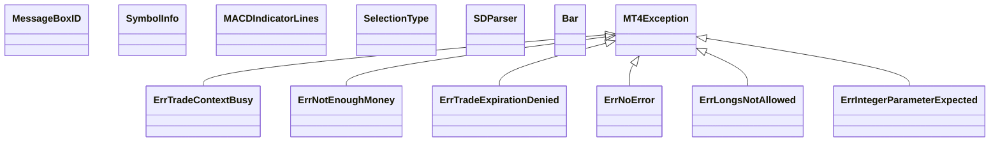

# jfx_2.4.9_sq.jar

[Group index](README.md) | [All archives](../README.md)

## Scope and provenance

- **Donor:** `SQX_145_REFERENCE_ROOT/internal/libs/jfx_2.4.9_sq.jar`.
- **SHA-256:** `b05ca416555206d0dc5282431cd690c088d6481cf07c1d4a24ec91737bd8b2d5`; accessed 2026-10-06; captured `2026-10-06T18:54:51.906614+00:00`.
- **Classes:** 261 raw entries; 261 unique entry names. Duplicate occurrence indices are zero-based.
- **Inspection:** read-only ZIP hashing and class-file structural parsing; signatures/descriptors, modifiers, hierarchy and references only. Bytecode bodies are hashed, not published.
- **Allocation:** proposed `FEAT-PRODUCT-JFX-2-4-9-SQ`, P17; [roadmap](../../sqx-full-application-roadmap.md). Domain README registration remains required.
- **Repository:** `01067f00031428613c6394064ca1bcadc1ba00ee`; review state unreviewed. Download label 145-dev1; installed build/activation and runtime equivalence unverified.
- **Limit:** every class/member is inventoried; declaration coverage does not establish consumed calls, defaults, formulas, failure semantics or algorithm parity.
- **Archive/resource index:** [056.json](../../../evidence/sqx145/archives/145/056.json).

## Complete member declarations

Member shards contain exact JVM names/descriptors, access flags, generic signatures, throws types, declared fields/methods, superclass/interfaces and referenced class names. All classes, nested/synthetic members and overloads are retained. Code length/hash is structural evidence, not a normalized algorithm comparison.

- [001.json](../../../evidence/sqx145/members/056/001.json) — SHA-256 `491e75e4c9b81c30108302325a4bfa1a882759b6ac04169d13f83c46d2564075`.
- [002.json](../../../evidence/sqx145/members/056/002.json) — SHA-256 `9ef5d8f0f88a63aa37953fad5b7743c901c20c21420837f76f7e660a2b0a994e`.
- [003.json](../../../evidence/sqx145/members/056/003.json) — SHA-256 `77afa2a31da82757c3e9eb919e3767fffa3addca457674096b87d3c9a5e561f8`.
- [004.json](../../../evidence/sqx145/members/056/004.json) — SHA-256 `b4ff82f6a5c352d12791bbd98bf40cd704d25dbf93ac773863ec86c30dd5e018`.

## Focused structural diagram

Up to twelve non-nested classes; arrows show declared inheritance/interfaces only. External type names are not evidence of an available body or an executed dependency.

## Class inventory

| Archive entry | Occurrence | Class SHA-256 | Fields | Methods |
| --- | ---: | --- | ---: | ---: |
| `com/jfx/ErrTradeContextBusy.class` | 0 | `de4ea11db6d96fe5c949386ad287f2238af1ad1983398246b6aca4a733bff31a` | 0 | 1 |
| `com/jfx/MessageBoxID.class` | 0 | `884b5ec5b9048d54ab93bb6d4c3321065b093681b9970a342062a50b6feb08ff` | 19 | 3 |
| `com/jfx/ErrNotEnoughMoney.class` | 0 | `5580e1aea9383cbf24729eade42f8512e2a775e1aa55b476d4c4502966c40362` | 0 | 1 |
| `com/jfx/ErrTradeExpirationDenied.class` | 0 | `7d9265537fc41c9c1848f125390dd0e106ef5d7f5b775f6701a4f27e13f8fd6b` | 0 | 1 |
| `com/jfx/ErrNoError.class` | 0 | `859f76ec3a348dd87dc45808d04693a2319e91755fe4872679e99fb406204de8` | 0 | 2 |
| `com/jfx/SymbolInfo$DayOfWeek.class` | 0 | `90c7737ac47ad5b450e477062aaf12ef451ed0f3fa2a9cae106206cb89ddd7bb` | 8 | 4 |
| `com/jfx/SymbolInfo$ExpirationMode.class` | 0 | `b4ad18ffe6fc36b41709a2618d179b571df0c593a423bce6faa97e447e024d3a` | 5 | 5 |
| `com/jfx/SymbolInfo$FillingMode.class` | 0 | `3c719d7719c7c8aa5a553583b49efe7b7abbf127dbf4a5917a059418b18db6d3` | 4 | 5 |
| `com/jfx/SymbolInfo$OrderMode.class` | 0 | `af9f9d1770c38fd0b926358c46427df68bbd68c53d9ec4517752b12b89d9a20c` | 7 | 5 |
| `com/jfx/SymbolInfo$PriceCalculationMode.class` | 0 | `85b4e7d0a1cc94cd9108b2191d270993541db6ad748b24bc7e384218f8a96fb8` | 9 | 4 |
| `com/jfx/SymbolInfo$SwapMode.class` | 0 | `201cc9f33c37186535471613e8d81c747cf7519a3740651242d8568a688882cc` | 10 | 4 |
| `com/jfx/SymbolInfo$TradeExecutionMode.class` | 0 | `b691e7bab614a88cd689f57cbcdf0619b8b89352c9ebb22f3f8c4548cd3f022f` | 5 | 4 |
| `com/jfx/SymbolInfo$TradeMode.class` | 0 | `6ab3f25c12174c7033408e21dafd58d70f6fe6d2805f34963650a5939314e381` | 6 | 4 |
| `com/jfx/SymbolInfo.class` | 0 | `0fb90ae19cdd261091e96e2e5854481d0fb45659e74380d0601295b4f1985895` | 68 | 68 |
| `com/jfx/ErrLongsNotAllowed.class` | 0 | `c2fe765e2367dd5c8974d4abad5b4b5f833c93c948b1af48e6f139a87a7969f0` | 0 | 1 |
| `com/jfx/MACDIndicatorLines.class` | 0 | `a7355b286b81d61ea3b700564f339f3a2556c8fbeb44a2f30d049cd6aa3e4f7f` | 5 | 4 |
| `com/jfx/SelectionType.class` | 0 | `17fe89cee484d4f661c658bd4d91c6adab3f85079cf1339bb78e26d1546ce95b` | 5 | 4 |
| `com/jfx/ErrIntegerParameterExpected.class` | 0 | `d7f0a4d4b3b59fc920b542f5f787c639523515d5ce10e18e5b81d8df695e2ea4` | 0 | 1 |
| `com/jfx/SDParser.class` | 0 | `1430e83d2809a6e2b19b4133da0679b192ce0442a0c82253c01b7a8b3a825ab7` | 4 | 7 |
| `com/jfx/Bar.class` | 0 | `28c6b947a714188375f587cba39199003e394ae3b3b5d0232a51b552d9cf10d4` | 7 | 2 |
| `com/jfx/UninitializeReason.class` | 0 | `f015c1bc8fc6390e1eb7404edf09353f544f8c284306ea8e9f568e76c178b704` | 15 | 3 |
| `com/jfx/DDParser.class` | 0 | `204544dd57fbc89186c44db96d04e3371e585c17015dc2f764397410d7239ee3` | 6 | 4 |
| `com/jfx/BandsIndicatorLines.class` | 0 | `778d52c0de2235a540bc01992924d13d573fa273951c6877343cf8030388e58b` | 5 | 4 |
| `com/jfx/MT4RuntimeException.class` | 0 | `06a879e6ac4dfb942533513628b4fa43d70f41b1b67d9ce3f522aed037784de8` | 1 | 2 |
| `com/jfx/ErrGlobalVariableNotFound.class` | 0 | `990d6d333b04b398dd0974050c55d68251d39a2847663784bb3b69650806943a` | 0 | 1 |
| `com/jfx/ErrCustomIndicatorError.class` | 0 | `a94265115472d580d62a58a111f6c8ca12fe347c8f33aa2fa84648ff48f10c3e` | 0 | 1 |
| `com/jfx/ErrTradeNotAllowed.class` | 0 | `420a0db32f8e64d135049ba73cb54f47f96ecb1a7fb22cca4ea1e70fe3fd1b09` | 0 | 1 |
| `com/jfx/AccountInfo$StopOutMode.class` | 0 | `c140ee00c44949d02b0250b69d181dbcb4c8e88f37003cc5f8ca09163e59f522` | 3 | 4 |
| `com/jfx/AccountInfo$TradeMode.class` | 0 | `a7c4bd8e527ee8793344fd7acb72a7ee35475d78972e6386cdb6c7fa35c42661` | 4 | 4 |
| `com/jfx/AccountInfo.class` | 0 | `007af18f077d23fea789f2526beb579df08750db143f638f27f5877e84a8b7d1` | 21 | 21 |
| `com/jfx/ErrInvalidTradeParameters.class` | 0 | `76ae053db137c879175c043e0c644c8c94c0365fa6506e648f207d9eb884a542` | 0 | 1 |
| `com/jfx/ErrServerBusy.class` | 0 | `65fe59eb7a5ee5e2633e11edf37e8378c916dbc38bb61ec74c065d0abb5d39dd` | 0 | 1 |
| `com/jfx/ErrTradeTooManyOrders.class` | 0 | `ad55f762bf6d4d49cef5053f56e0aed7bf78b1bb651adde95f38eae590075217` | 0 | 1 |
| `com/jfx/ErrTradeTimeout3.class` | 0 | `8a8dde6c067487a69907bcff6156c586ecc3bac4d741b2db45abef9f52ee6f87` | 0 | 1 |
| `com/jfx/ErrOrderLocked.class` | 0 | `afa2581c8e88ebed7a80e1009312bae00c50b79488edfbd8b6ee8b41be0511c5` | 0 | 1 |
| `com/jfx/MarketInformation.class` | 0 | `e7ac1bbab3de4405b097cf9cc4382eaf0065bc0f7107d64feeeb8c838007c795` | 28 | 1 |
| `com/jfx/Rate.class` | 0 | `cbf8a887280acd8659ece88c0ae288cc1d3628e1e4dfa8e08e2503a46cd527a9` | 8 | 4 |
| `com/jfx/ErrOldVersion.class` | 0 | `428e7e5ce4645e4cdb557304c02884833590b165cd7454e6ae2d8c73d0fffc22` | 0 | 1 |
| `com/jfx/MovingAverageMethod.class` | 0 | `cdd57fecb03da814e162cd9b02c2dd95c7111096ee154a1d70d6ad8bd637cfa1` | 9 | 4 |
| `com/jfx/ADXIndicatorLines.class` | 0 | `0b01b3e9d565fd1680e83915483b5682f81ea9ae6d0cdb3c8ad1323a6a42c045` | 7 | 4 |
| `com/jfx/Tick.class` | 0 | `5fc65296f96976125b5389fa1684d1fbe495c239e702d32cbaba08ce0f17b854` | 4 | 2 |
| `com/jfx/TickInfo.class` | 0 | `828fc9c910672cf60f0676ed244e6f91813f3fcfc89437c247f082ad8b319025` | 5 | 4 |
| `com/jfx/ErrCommonError.class` | 0 | `b8b8a1bd9dbb5e71c231481c5dc2202825e936d816c6b4539b437834f89fe74a` | 0 | 1 |
| `com/jfx/GatorMode.class` | 0 | `86bad9b4da3865dac5efff85f071ae39af3a4c1ac2090a81c8504d1cb5f69de7` | 7 | 4 |
| `com/jfx/ErrNoConnection.class` | 0 | `df2d635013d9183f9c3d9b271fd101eff25ae534ef2d2e2d4da245b6d64cd470` | 0 | 1 |
| `com/jfx/ErrTradeTimeout4.class` | 0 | `4c2aa33df12d25300a5c08a31f77c4b77fe5ffa484cea1b56e2eb8f0c6feaba6` | 0 | 1 |
| `com/jfx/ErrMarketClosed.class` | 0 | `aca980b8408aa55a40a0cedb7f2cda8aa2e6a75deb83f1dae2385dc3044077e8` | 0 | 1 |
| `com/jfx/ErrTradeDisabled.class` | 0 | `a7ad33f07a737260f9e76a682472115097a621436d3deb8d08d848eceb6c267d` | 0 | 1 |
| `com/jfx/MessageBoxFlag.class` | 0 | `437ea033764167513c02bf056af2cc5b9fca649cb758dd490ecf7bc1c3caf8a6` | 29 | 3 |
| `com/jfx/TradeOperation.class` | 0 | `2c15cc2a2930e9385304e956120ee3427718b1e70e8f0aa150f3fcf3709c13ee` | 13 | 5 |
| `com/jfx/ArrowCodes.class` | 0 | `1f3b2e04386a3ddbf79a1feaf3e555337c7d470622445aef1343bef6a405cb3c` | 13 | 3 |
| `com/jfx/ErrInvalidPrice.class` | 0 | `81b9bef0f356bd44c89ecaac4d03424f7ef886c2e73880ab4875b61d204ddd78` | 0 | 1 |
| `com/jfx/IchimokuSource.class` | 0 | `438d5234f1ffa62505cb9d69ae517ee0eb751af7427ab0d245b1944a3b1e2a2a` | 11 | 4 |
| `com/jfx/ErrInvalidAccount.class` | 0 | `89ca9729767f33cd9951f54080e1099ccbc7352723b09426dc3f8cf36b3eb32b` | 0 | 1 |
| `com/jfx/ErrTooFrequentRequests.class` | 0 | `4c6d5512133066e60a9c03d3ece1e4a68f12206b1f53b6baca0bb34e590876a9` | 0 | 1 |
| `com/jfx/MT4$1.class` | 0 | `d781488a13efe167304858dcc07b2df64b5d5c660a3d09feac9a2c496226e18e` | 2 | 4 |
| `com/jfx/MT4$2.class` | 0 | `e1ad35ce7f7c5a6add9a4ce1644afc1d8c0cf3fd3daa604b01c03a10349cac7a` | 2 | 4 |
| `com/jfx/MT4$3.class` | 0 | `333b2baebfc1f162a0be0d67cc81fe90c565584f36165dea65d7225820ccca27` | 2 | 4 |
| `com/jfx/MT4$CustomParameters.class` | 0 | `7f099154f29d0a6797e521c0aed48b0717f138af84b1335da39fc1c14273b873` | 0 | 3 |
| `com/jfx/MT4$MT4DateFormat.class` | 0 | `b55efd76402677882ac5b4976f1f4057bfab20ec2376976a5f499b7f47798162` | 1 | 2 |
| `com/jfx/MT4.class` | 0 | `cc0a883dc6b18fc5628eb45f27f92295a5c06bb6f2e52928781116d4568c63af` | 12 | 214 |
| `com/jfx/ErrIncorrectSeriesarrayUsing.class` | 0 | `cbb967228590fd403474571180fc696734bb79b281b44c3f676a88cfad4f54e0` | 0 | 1 |
| `com/jfx/ErrLongPositionsOnlyAllowed.class` | 0 | `860d29161205cfa23e3812b73e0ae898414d060448d0532b22ed7b0985ff20cb` | 0 | 1 |
| `com/jfx/DrawingStyle.class` | 0 | `8329ebf912aabf5d960b60e5fe469214f4944c1474ef98f5f6dc01753b6a1a8b` | 11 | 3 |
| `com/jfx/Broker$ProxyType.class` | 0 | `a63f02716b8081a112a37c9eb14c2ae5f443c4da5ec893da3eabd69ae3be7b91` | 4 | 4 |
| `com/jfx/Broker.class` | 0 | `4e77e069e7cb0896272e4cf9bd7eda23720125355fa70b4bd0c2caeea6e9dca4` | 64 | 13 |
| `com/jfx/ErrRequote.class` | 0 | `262fe1b811e7942185a45091538c21af848eda5c57217471bca9946e5b6dc938` | 0 | 1 |
| `com/jfx/AppliedPrice.class` | 0 | `a9d798c2ae057dc1bd8437b772c991949d948df6ff8a3059ce49e0b48dd3f0d4` | 15 | 4 |
| `com/jfx/ErrHistoryWillUpdated.class` | 0 | `4a4fef73c7ce47234322396ce0494172b9614bbeb651b2ed1f44d2cbb61d5b1f` | 0 | 2 |
| `com/jfx/ObjectProperty.class` | 0 | `f3f8c4226a57c249c5d61d181f75806b9f1af5f39cfb50cb63fe504146c60849` | 53 | 4 |
| `com/jfx/MarketInfo.class` | 0 | `4dc1850abc63c9643d6df9367add4b08048465162333830cd5a36595841fa607` | 57 | 4 |
| `com/jfx/ErrStringParameterExpected.class` | 0 | `5c58fb4145403cc74b5ce11f39cde0432af7f8a27d9de3c227d6269780067f9a` | 0 | 1 |
| `com/jfx/ObjectType.class` | 0 | `06572f24410f04b711439ca2594d24c5e4197cf8b4a3da1e540417a94201faa2` | 49 | 4 |
| `com/jfx/ErrPriceChanged.class` | 0 | `b486801db9451dbbf79a6be3f14f232f60c4318e80b8d950bd4d3d211a4ac7a0` | 0 | 1 |
| `com/jfx/PositionChangeImpl.class` | 0 | `715b476fe5e2813f934fc7795140a2164115918556a39663a496c2d4d3df7cd0` | 4 | 8 |
| `com/jfx/ErrNoOrderSelected.class` | 0 | `68d35f5f05524d0b56988bda6ac43c29715e5923537621295a42c4f2a8c2e6c1` | 0 | 1 |
| `com/jfx/SelectionPool.class` | 0 | `3d64d939ad3905481942306c6d34559f0cee80c028c69b36be4d10a4437a413b` | 5 | 4 |
| `com/jfx/ErrInvalidStops.class` | 0 | `0895604ae120e3d2750cc6f90cb1b5b3cd18ee7c3d6a794fdb281be5c8b0bd0c` | 0 | 1 |
| `com/jfx/ErrTradeTimeout2.class` | 0 | `ed3fc13f8b1197c42878d5514d1d85ec1ecc0af18eb76c8a8266d39f6a87aafc` | 0 | 1 |
| `com/jfx/ErrOffQuotes.class` | 0 | `ca7ef20dc0b0fb6378d13755ce9d4adc955af96c0d7f9c9471d4d96e04ce0e1a` | 0 | 1 |
| `com/jfx/OrderImpl.class` | 0 | `8cbeda3dd4e324d65455229ca964b4091e9ed99ba6755635ab2b18167e5305f4` | 29 | 35 |
| `com/jfx/Color.class` | 0 | `7450dbf39bd77f79b7526c0865668ab130520fb63176dfbcb3a2c860a8b668eb` | 131 | 2 |
| `com/jfx/ErrTradeTimeout.class` | 0 | `46c64a680f666b08fbfbbeb65c17847470ec576c9d8861eea415ca1c51c3e187` | 0 | 1 |
| `com/jfx/Version.class` | 0 | `60adb4af330eb527d1ceadab53ee17225310c4a8846f09da5c21b7e1d66b4275` | 6 | 3 |
| `com/jfx/ErrTradeModifyDenied.class` | 0 | `99ed93022ac60608d6df40655600297f1940cf478fa9d1123a5e5a9cc8f10a0f` | 0 | 1 |
| `com/jfx/ErrInvalidTicket.class` | 0 | `c02c19724f0f09f05313cdcb74bf20e338fa6ae78688dfd5375e3de15bc0c56d` | 0 | 1 |
| `com/jfx/ErrShortsNotAllowed.class` | 0 | `36f146436d0e6862fe9b68a566be75eaf3a13a9adf45ea6c3ee578aa39202025` | 0 | 1 |
| `com/jfx/ErrInvalidPriceParam.class` | 0 | `2733695ac8805993cc305e6d93a085556615b0c326354237a6ed451ebcfe79cd` | 0 | 1 |
| `com/jfx/PositionImpl.class` | 0 | `6f6bca8224ed9a6e015bc297f04feac36761ded573f6d1cefcb7cba232c04adf` | 4 | 8 |
| `com/jfx/Timeframe.class` | 0 | `1d5c0ae6ce3b55f0b8f0faa4a991c61482f3ccac864a61e98aeae3997e66b625` | 21 | 4 |
| `com/jfx/ErrAccountDisabled.class` | 0 | `8b6e4091667cace20f4c5a13c7366c34910f429982ecd2880f03571c1667c831` | 0 | 1 |
| `com/jfx/ErrNoResult.class` | 0 | `3940caadd99959a2002eb09a15ba717a4b75fc511bb0cd8a483ad82f09b11c39` | 0 | 1 |
| `com/jfx/DrawingShape.class` | 0 | `0cee211541f6c25ede7ad9646f721841643816eda03ba43cca73d3d7cf3b0349` | 13 | 3 |
| `com/jfx/ErrTooManyRequests.class` | 0 | `3b2f961900ef5b9ec8b53f6f99921c4238f676d4a4ba6d9fee1aabfba08bf676` | 0 | 1 |
| `com/jfx/ObjectVisibility.class` | 0 | `91dbbf1f975886581543f72ad1c07747e112222386b4d66c19c00d427ce74b93` | 23 | 3 |
| `com/jfx/ErrInvalidTradeVolume.class` | 0 | `ff1595e3b01eca8aa8e2f59a0870cce7514f1c2326b35e6e21a686afb31cd7f3` | 0 | 1 |
| `com/jfx/ErrUnknownSymbol.class` | 0 | `8574768cb3fa1422ee8665323195a82c7b522be3275ab436cc101fcf8fc853e8` | 0 | 2 |
| `com/jfx/ErrInvalidFunctionParamvalue.class` | 0 | `508fb9346aae46ef1cb45b309f9b0ee34c32e3e2d28fb1b87028b14e062eb813` | 0 | 1 |
| `com/jfx/ArrowSpecial.class` | 0 | `36b315cbc9c1981110cc8c4c4d5eb0d96b4c4d08dde9f3fca2fe0dcbd832a4cd` | 13 | 3 |
| `com/jfx/Series.class` | 0 | `a2a6e2bff1c7d22e8c5ef93a70992a41ffa435d600d2701dab10b3db492e2102` | 13 | 4 |
| `com/jfx/MT4Exception.class` | 0 | `b9e513301643706e542bc608f8e755bfbe65a3be3dceb89261247cb5f2133bb0` | 1 | 3 |
| `com/jfx/io/BytesListener.class` | 0 | `ee16fd13b7ae155a0bb68af1a47ed82e99118212478f0026979b7a517258124d` | 0 | 1 |
| `com/jfx/io/CachedThreadFactory.class` | 0 | `a3d3b39a2531200b8f5b6aad3537121dcd0212ec1826821d86b235d6bdd63633` | 2 | 3 |
| `com/jfx/io/CommandListener.class` | 0 | `1f3d924c7029066217769f80830aa98d2abb4d287b637f4d86a093b128881cff` | 0 | 2 |
| `com/jfx/io/InputStreamManager$1.class` | 0 | `8ac2a66fd8ab1070506287e53decfa363f709d6556e6df6cb29377c36ea9af82` | 3 | 2 |
| `com/jfx/io/InputStreamManager$2.class` | 0 | `f959670a5910b664111785b3e5b8356ecada27d80e750d885c4c69df02742af6` | 3 | 2 |
| `com/jfx/io/InputStreamManager$GetBytesListener.class` | 0 | `3df69a30bb0f6b6c5ae906096760aa676987d0776c3ebf3be3ab14c387d0cc14` | 1 | 4 |
| `com/jfx/io/InputStreamManager$GetBytesListenerLF.class` | 0 | `72dd32639b76ca5cac8a07dc04151ecfad4548e9f6d53366f75318ffd83328ec` | 1 | 4 |
| `com/jfx/io/InputStreamManager$InputStreamReadableByteChannel.class` | 0 | `1cc45f2cd82a1e960c0bf673e8afd9f042c28cfe50370a126111887c3e222ff1` | 1 | 5 |
| `com/jfx/io/InputStreamManager.class` | 0 | `73040316b134c56c403fd7a76f0c47acac89e265763442583b0025e2731a89b9` | 6 | 22 |
| `com/jfx/io/ConfigurationFile.class` | 0 | `330ee5519e8642779e9d91d747dc8d6cda83bb95443a4125b1828b18f0b1cb62` | 2 | 4 |
| `com/jfx/io/LineListener.class` | 0 | `64239f228496c3094a2bd93a69cdb342dac8681eff4aa8a26252d9050180d111` | 0 | 1 |
| `com/jfx/io/ExtendedLineListener.class` | 0 | `fc0b650ec2c8bd245f1a8754236f39ac893f1e05378f67c64c83b1767b826876` | 0 | 1 |
| `com/jfx/io/Log4JUtil$Logger.class` | 0 | `4d4e0d941c5a9fa9f1de709af0984b2ced3756afe6e0a5cfeb41e28edfe13828` | 1 | 1 |
| `com/jfx/io/Log4JUtil.class` | 0 | `4071708fa0435d9366a381e4dabb0c421ab6841b06a6bb68607dc312f646f020` | 2 | 6 |
| `com/jfx/io/ResourceReader.class` | 0 | `eeab8405d43ff34883c0a31823d735936a664d19f0800630b9b6d392c0dba078` | 21 | 27 |
| `com/jfx/io/BytesLineListener.class` | 0 | `afd6d9d1a549be6c18bfbb7c9360fa0f406b043d894ed466c0dfa18b1d129d69` | 0 | 2 |
| `com/jfx/jboss/JFXService.class` | 0 | `3048587fb4d806e92fd6edb2453e8258ccada9fa6fa1ecb42bbcda35e656d95c` | 0 | 156 |
| `com/jfx/jboss/JFXStrategy.class` | 0 | `e54ebcda8bc324963d5f48797d6fc5b282618e551c4aa8acf8763d1caccd494d` | 0 | 3 |
| `com/jfx/jmx/JMXServer.class` | 0 | `0bba439ea8674f6224d47a578b8985494cb549333884378c6aae50a2691f23e5` | 10 | 10 |
| `com/jfx/jmx/DummyMBeanServer.class` | 0 | `e0fba25128fc351399c4b6fbaae2f4e55e4b932d5c01f96eba9fce401fc5a832` | 0 | 37 |
| `com/jfx/jmx/mx4j/JMXServerImpl.class` | 0 | `d6a707fd997e4ba2554eb6b1daceacd4baf631e211288904c591ef3bc687e9d1` | 4 | 4 |
| `com/jfx/md5/MD5.class` | 0 | `5e16c61aad2a9acb463388d6a4d60b40e4c47981e9b6b26d0cd7253e8d103b11` | 3 | 22 |
| `com/jfx/md5/MD5State.class` | 0 | `b5b5ddcb1ff443dbe51fcfdb8b9894958f8f5c97b2005f7cf37990e86803014c` | 3 | 2 |
| `com/jfx/mt5/Broker.class` | 0 | `0d45b422b83c95af668ea4e8e52364da32821d7e6010d9b82f0f1aeb39602fe4` | 0 | 7 |
| `com/jfx/net/UnsafeByteBuffer$1.class` | 0 | `8da31310f05f87238a9dce9b231a420dc7f7fe117d970f41dd98c46370655467` | 0 | 3 |
| `com/jfx/net/UnsafeByteBuffer.class` | 0 | `3a130cc6f3a15b8b2b2108643a1b2c07e95c9722608f563e38663836bc701fdc` | 23 | 42 |
| `com/jfx/net/JFXServer$ListenerThread.class` | 0 | `3b41ec4d36d3cf357fa671e41afed9bb45555d9777bc97cd40990382dd070b51` | 1 | 2 |
| `com/jfx/net/JFXServer.class` | 0 | `183989665a5494b204bf41d2e49b08e23726141da3e3d95beaab18cbfb1370d8` | 14 | 11 |
| `com/jfx/net/TSClient$1.class` | 0 | `5300557e40484d959257711e202043081709321c3aa2aef6568ddaecf5efed4a` | 1 | 2 |
| `com/jfx/net/TSClient$WebEndpointInterceptor.class` | 0 | `818a641d76296d37ffecde3a9dfc30805d4310a5e3641cd574c3a7ecab0fa2cc` | 0 | 1 |
| `com/jfx/net/TSClient.class` | 0 | `ed2ff79126288e3f5eb5463c2a6f69fc80f52ae4ba39205d56098b402625cfc4` | 9 | 18 |
| `com/jfx/net/Greeter$1.class` | 0 | `0b0d2da52c37ddcee2744119279bac5bcbd55190350ccf53acd55f91b38a7c79` | 2 | 2 |
| `com/jfx/net/Greeter$2.class` | 0 | `248bce592459fbb3831d9ee11c0b8e8f947e9f49c6e6a44c069def5ef3e8fd95` | 1 | 2 |
| `com/jfx/net/Greeter.class` | 0 | `32e7907574477e5d54f88515172152ce7f0d7bfc235c564cec1c703b17792a8c` | 9 | 12 |
| `com/jfx/net/InprocessSocket$InprocessInputStream.class` | 0 | `a6311e1a462c494c408bbff625ed62838d5e960b1feab220d191ae8161be4e62` | 5 | 4 |
| `com/jfx/net/InprocessSocket$InprocessOutputStream.class` | 0 | `3bc4125b64e2d864c26ee535edd392568a4d130b2ba98274bd3f02a7cadde437` | 3 | 8 |
| `com/jfx/net/InprocessSocket.class` | 0 | `bec8967396628989cc56752c66dc035c00f69353e10ac6972a2eed336550b56d` | 8 | 11 |
| `com/jfx/net/TerminalClient$ConnectionWorkerThread.class` | 0 | `529853f7094adb741c4ceb72bcb61f63b8a97f413be9b2153ddafa7f3caa61cc` | 6 | 8 |
| `com/jfx/net/TerminalClient.class` | 0 | `b423c31aaf3784f377a6389c88f17aacc270538bade910971a60b6b410bc1c99` | 6 | 15 |
| `com/jfx/net/UbbArgsMapper.class` | 0 | `9e43342b379940177f18b786f01c9999194f62fcc42529442ed92b0099203296` | 15 | 13 |
| `com/jfx/net/InprocessServer$1.class` | 0 | `5c3b9365834db57a220e4d38c97c084fd457ce271360fe159ac7de8585ce47ab` | 0 | 2 |
| `com/jfx/net/InprocessServer.class` | 0 | `db65a1391d31da3091e1a42d2e9a0fba6102035165a31923ff6c583ec9cd7f84` | 5 | 4 |
| `com/jfx/net/ByteBufferBuilder.class` | 0 | `7b669c635914306a30061966a8a83f2a89602d1227d737faf484670a20854721` | 0 | 1 |
| `com/jfx/net/tsapi/ObjectFactory.class` | 0 | `1cea049c72d3895323f663a66f9e02e97ff18a9440754faa7afb339c52298748` | 18 | 43 |
| `com/jfx/net/tsapi/package-info.class` | 0 | `16e3521930a7b8dbd5b84478e8c5659e4b0b1f73987b7cf15eb6323a7c4cd657` | 0 | 0 |
| `com/jfx/net/tsapi/EaInputs.class` | 0 | `2b38101f76802ceebd6f5f1f2120679f7ee456af7db28ab966e2188ca967aa69` | 1 | 2 |
| `com/jfx/net/tsapi/RunMT4ExpertResponse.class` | 0 | `6979df343edc452152c1659f771df841d41de51fe4395bedc5597ed0cc969def` | 1 | 3 |
| `com/jfx/net/tsapi/Mt4ExpertParams.class` | 0 | `dae66968be6dc9e2fa3ffe12ec74535e1eae1f37f8283e3684321acddf5ec42d` | 4 | 9 |
| `com/jfx/net/tsapi/GetRunningExperts.class` | 0 | `6e5bd3a4b3d85677b03251c7c80587b775773f985c99878821c39b02c15815ba` | 2 | 5 |
| `com/jfx/net/tsapi/GetTSInfo.class` | 0 | `85f29268817ec5dd5acbb8a997b96b59e194217441bb3a2778b1a56a27a828df` | 1 | 3 |
| `com/jfx/net/tsapi/Close.class` | 0 | `363387953fb33c168591421e845dc29e8c2413c2d6dfddb5da13ec4a633676bc` | 1 | 3 |
| `com/jfx/net/tsapi/Nj4XMT4Account.class` | 0 | `e24b5783dc1058727adc1d6db8b55806fd2d8329226e357171f3fbc74209a1d1` | 7 | 15 |
| `com/jfx/net/tsapi/Deposit.class` | 0 | `3fc075fff7002c7b1ff90f0f38e4c497121a3d8d4a9ab66180e7e850a93f8b4d` | 2 | 5 |
| `com/jfx/net/tsapi/RunMT4Terminal.class` | 0 | `0e9c1a9dcdd9db52e94320d8301bdd56ac6ab9e4b6675f1a1637409a403a747c` | 4 | 9 |
| `com/jfx/net/tsapi/DealType.class` | 0 | `7eb9347af371858d11112cffb0e574a6df41507f05795354072eb4d33a2bbba6` | 9 | 6 |
| `com/jfx/net/tsapi/SingleTestReport.class` | 0 | `6b0f1e522d8116f3c3e154557f13e8048e09bfd264ff1ddb89b237c22e7ebe11` | 28 | 56 |
| `com/jfx/net/tsapi/Mt4ExpertTesterParams.class` | 0 | `f9e3c3fe7da908afbbcc392b2450b591f8357ef20d314de5ab3ce9a1f24bf2aa` | 2 | 5 |
| `com/jfx/net/tsapi/StopMT4ExpertResponse.class` | 0 | `35236c29f7f47527415cba29939aa59f9f84dd6396d1daa2d7ea950c0f4fa86e` | 1 | 3 |
| `com/jfx/net/tsapi/Nj4XTSInfo.class` | 0 | `525df43cb3c8eb01df79a43b6482f75cc2465461d8c7d0153ca1e0e125645f05` | 2 | 5 |
| `com/jfx/net/tsapi/EaInput.class` | 0 | `8e2815c3973c47e4728add684aafb56a415c0337912c33a8f912d2ff0d726e53` | 3 | 7 |
| `com/jfx/net/tsapi/KillMT4Expert.class` | 0 | `d5471d8b6baf7aa777f0e802df9236758da0d9a0c45617fe795b4486cb178e96` | 3 | 7 |
| `com/jfx/net/tsapi/KillMT4ExpertResponse.class` | 0 | `c74d4256c756bc1bc45375cb9828e9ed0a8ee857ae63331f6e5aa4ec3cc7c4ae` | 1 | 3 |
| `com/jfx/net/tsapi/EaRunParams.class` | 0 | `c6e6ac2150d85ac63a90e40a1597d9604cbdcc3e3b780dad450ea4889d108765` | 4 | 9 |
| `com/jfx/net/tsapi/InstallExpertResponse.class` | 0 | `25bb97e14448b829cc4d642d1c53232f4e31bd11a83519050730255a118f1a98` | 0 | 1 |
| `com/jfx/net/tsapi/TesterService.class` | 0 | `cdf61b248364ccabb58f10731e6691f42d18463c2edc83bfd5173e520efc8845` | 3 | 10 |
| `com/jfx/net/tsapi/TestModel.class` | 0 | `c10c65cae0cda8ef0406eba7f4839be0fe31114fdcd50ade051fac55236c53ca` | 5 | 6 |
| `com/jfx/net/tsapi/Nj4XClientInfo.class` | 0 | `6afae4344667239d38a38615ab0f4df4251827b5593170b2c346cb6609dff21b` | 2 | 5 |
| `com/jfx/net/tsapi/RunMT4TerminalResponse.class` | 0 | `83460dade8d703970d23a7f038f6fd4aafc5b772e6eb1e41881e3d3e50283c34` | 1 | 3 |
| `com/jfx/net/tsapi/GetInstalledExperts.class` | 0 | `d60b0de0191f53f976cdad9018b0634c71031405181bca5ddbeef4e6f909a635` | 1 | 3 |
| `com/jfx/net/tsapi/Experts.class` | 0 | `4749b9ac55df80b8fd417ae1ed325a0e5885fa2be515cf0fbec98d752021b681` | 0 | 12 |
| `com/jfx/net/tsapi/Deal.class` | 0 | `1aed5b387e8edf3ae4dd1a184278baf21136d40421a89ae102c7f28ebd1bc07a` | 10 | 21 |
| `com/jfx/net/tsapi/OptimizationReport.class` | 0 | `254f916043b4aaa3c7341b52888fcbcdcb9947dcaaffdb039315f1446c2f3376` | 6 | 12 |
| `com/jfx/net/tsapi/GetExpertInputsResponse.class` | 0 | `7b228208a092d5c65d1bc2a76ad5f1ba058603aec1c8cd4f00e459e9732c3fef` | 1 | 3 |
| `com/jfx/net/tsapi/EaTestOptimizedParameter.class` | 0 | `ed48ba7ea0bf16acd1063c39ec84bd8460f011e9e1b6cfa1d9bb0ac686c51e90` | 7 | 6 |
| `com/jfx/net/tsapi/RunMT4TesterResponse.class` | 0 | `4e92ba6f259b05a8780b49cd46e7c402ea2f4a1c5f5b1164f4d8398d8b57d2d5` | 1 | 3 |
| `com/jfx/net/tsapi/GetTSInfoResponse.class` | 0 | `e1077042d41483ae1289038e08439695b85890d63d7eef62dd6ca0f9443ac8ce` | 1 | 3 |
| `com/jfx/net/tsapi/IsExpertInstalledResponse.class` | 0 | `8ec95acfcbac48e3ebd15ada752e0bdafed8f7429a2be2c68e7910de65e31510` | 1 | 3 |
| `com/jfx/net/tsapi/StartSession.class` | 0 | `469c832f43380689f8e7cb0ac7ef32cf6c379b2d28cf2de37d4de44e18347e28` | 1 | 3 |
| `com/jfx/net/tsapi/IsExpertInstalled.class` | 0 | `b6c98c3a862f551a682873badb8aa1c7e58070397e76d80c29e4e6be30837a7a` | 2 | 5 |
| `com/jfx/net/tsapi/StartSessionResponse.class` | 0 | `43c685c1313309752d33d65625b0b152fd995fedf73e16cf0e9b34a8793e4b6e` | 1 | 3 |
| `com/jfx/net/tsapi/TS.class` | 0 | `38da604559d6b7ff9395228b6220e6b4951a54ac500e6b3ece7c18cf47b4b841` | 0 | 9 |
| `com/jfx/net/tsapi/Nj4XChartParams.class` | 0 | `61532527a08247640a92c865e7e42ce12ade6151ac23060d70e06a82f5dd271e` | 2 | 4 |
| `com/jfx/net/tsapi/Mt4EAInput.class` | 0 | `8d64467514432d265dd0bf4ec6a233c316b911fe7b4eacf2bb4afc90385cdaef` | 5 | 11 |
| `com/jfx/net/tsapi/CheckMT4Terminal.class` | 0 | `2b8c770bb6a77a4cac358c17b26e61e984642c51db6ba2e16949e722391ece54` | 3 | 7 |
| `com/jfx/net/tsapi/RunMT4Tester.class` | 0 | `cc3e8a6259e3f2b430f72e41ea4b009852e8afc8fb0d03c6bd8bbb734ed883de` | 3 | 7 |
| `com/jfx/net/tsapi/Mt4EAInputs.class` | 0 | `e73333cbd128bf4b9d4a0a852e60092c79879860043ec6daa6d0ecc259d61e25` | 1 | 2 |
| `com/jfx/net/tsapi/OptimizationRun.class` | 0 | `f5546926cfb0c648318edb7df24efc27de52d4043094797845616882a97bffab` | 7 | 15 |
| `com/jfx/net/tsapi/DisconnectMT4TerminalResponse.class` | 0 | `ab5e437c90a9c9d4cb0ebec4ffe755bcbadc21bf497ecbf16a50a70f880be495` | 1 | 3 |
| `com/jfx/net/tsapi/GetRunningExpertsResponse.class` | 0 | `00defcdf101177fcd92957cafe91367fb406e57d4a328f0337f65c8c9e51ba05` | 1 | 2 |
| `com/jfx/net/tsapi/RunMT4Expert.class` | 0 | `bd2d53927904c946d0025678a4825e4d477f0c745d512b55753602e73c3699f8` | 3 | 7 |
| `com/jfx/net/tsapi/GetAvailableSRVFiles.class` | 0 | `b78c4dd98d4d513ef13f759873addc6d1a76f1bdc21fc6635b11d287b407b5ab` | 1 | 3 |
| `com/jfx/net/tsapi/Nj4XParams.class` | 0 | `6affa0e14603d259812e007779f1a300acf1d4982135d47c7899116b54fc6847` | 10 | 20 |
| `com/jfx/net/tsapi/KillMT4Terminal.class` | 0 | `849952b7c89e57375a4ea7ac6f2c72f59abb172ef31f607423b8612062ddb80d` | 3 | 7 |
| `com/jfx/net/tsapi/CloseResponse.class` | 0 | `4e3ddf4d6331eacae78ea8bd483a056ffb6a03f592b4bf6334933c26493d8678` | 0 | 1 |
| `com/jfx/net/tsapi/InstallExpertLibrary.class` | 0 | `ef1a84c00908df84ab5f7eadfa2498096062269ad3de614a94ea6cc9c08d7b98` | 4 | 9 |
| `com/jfx/net/tsapi/Period.class` | 0 | `d6a967e682efec6352e76814e8f7182cb236f33d8fdb9144324e4d0e933e31c6` | 11 | 6 |
| `com/jfx/net/tsapi/GetBoxIDResponse.class` | 0 | `69cbae0c019ba76339d5922c8e2a152bbaea40e2f2b720a9a9f380319b670cdd` | 1 | 3 |
| `com/jfx/net/tsapi/TSService.class` | 0 | `35d42b2dd0bc014c1837e6da4931f69a0e80952e499e40819795f4de82af3f11` | 3 | 10 |
| `com/jfx/net/tsapi/DisconnectMT4Terminal.class` | 0 | `d9ef9fae1973d227b75e9df2a12a4c7f4e51c4473e32ef90541db4b1ca08062a` | 3 | 7 |
| `com/jfx/net/tsapi/GetBoxID.class` | 0 | `69dd59dfc60244533d0b57c4472897ed622fff8592a685a5dbb95e93be267e9c` | 0 | 1 |
| `com/jfx/net/tsapi/KillMT4TerminalResponse.class` | 0 | `4989bbd024f2ee9128d783219652b7354b07c202f3704374f78bd80978f1480e` | 1 | 3 |
| `com/jfx/net/tsapi/Mt4EATesterConfiguration.class` | 0 | `e291c385bd2b057e44cf5a5bc65c7043904683c07d461fb5b06a1a2e1b8b2357` | 10 | 21 |
| `com/jfx/net/tsapi/Mt4EATesterLimits.class` | 0 | `0fe316bd5b8a7fed7e95aa127aaf1f8f88e88fa69a775141a4959c00557b0d0d` | 8 | 17 |
| `com/jfx/net/tsapi/GetAvailableSRVFilesResponse.class` | 0 | `d8e8546b8b83606a44d2ec9a27758c4e2cf046f67b65c2f0d22cee660266bc1c` | 1 | 2 |
| `com/jfx/net/tsapi/StopMT4Expert.class` | 0 | `108203781e4a561dd7b35140642b8343fdb41ddbf80d3e33dee43dbc83ce925f` | 3 | 7 |
| `com/jfx/net/tsapi/InstallExpertLibraryResponse.class` | 0 | `19757c6ed485479758db56e7005698ea3fbb62f8b6956a2eaab1321238190b50` | 0 | 1 |
| `com/jfx/net/tsapi/DataType.class` | 0 | `32fa738dc002f87cefb3fb722d9d83959a8944d5b3e5faf3b82ad0d08612446e` | 6 | 6 |
| `com/jfx/net/tsapi/InstallExpert.class` | 0 | `30735ff9d9f43ca7a504c3ae900261565b776cac9f9183e4bace266bd105ab29` | 3 | 7 |
| `com/jfx/net/tsapi/GetExpertInputs.class` | 0 | `69d6d99f2e8966e75e856c1f7ae132146a62dbbfdc9229c2191d0b68e9635eab` | 2 | 5 |
| `com/jfx/net/tsapi/Mt4TesterReport.class` | 0 | `6ac96c6c7ef6024b77637659529e2da14efc4ec9adfe67f75f64fee3b72a33fa` | 4 | 9 |
| `com/jfx/net/tsapi/EAService.class` | 0 | `a430ecc08c50346f39f36217de416d73b4d348f44c8474c9799bed938a5cb7f6` | 3 | 10 |
| `com/jfx/net/tsapi/Tester.class` | 0 | `c284dbfe1a9aa20fcf1d3e135c2e08e14e5a235a069da0fd1083b1ed1765efa3` | 0 | 6 |
| `com/jfx/net/tsapi/EaTestPositions.class` | 0 | `03fd042f06d86a90a7599f90d262ad31f34a9904f7c191be02cc315acc2f443b` | 4 | 6 |
| `com/jfx/net/tsapi/GetInstalledExpertsResponse.class` | 0 | `cdffc0875a01afb980b03eee88e6bae1a3678e130545e470429fff6a7dd9b596` | 1 | 2 |
| `com/jfx/net/tsapi/CheckMT4TerminalResponse.class` | 0 | `2abb6bf358bea5a86cf3d89552914df18ecac98a3b63a7fdecbfe316bebec447` | 1 | 3 |
| `com/jfx/strategy/MT4TerminalConnection$UDPClientPacket.class` | 0 | `8e1452c176800148a1cf9d5a6799c19318de5e728a7995d37e811365c2f77fd4` | 4 | 8 |
| `com/jfx/strategy/MT4TerminalConnection.class` | 0 | `bd0351f9dde1fa1ee1f6777e9bd405b595246368d7173b182b3618ac86d67be1` | 15 | 28 |
| `com/jfx/strategy/PositionChangeInfo.class` | 0 | `849cdb50c4da8aa53321565a40f73269b8789ed6a35be2abc366a376ac8ac61a` | 0 | 4 |
| `com/jfx/strategy/PositionListener.class` | 0 | `5d7cc59b69bd4b49d95a73c34514d1c1eaf6ba148fd3745812b2a4b0beb05cd1` | 0 | 2 |
| `com/jfx/strategy/NJ4XInvalidUserNameOrPasswordException.class` | 0 | `3100ed8246a4b01b3b3da5a0edd60e6800af29718857688e2fa81b325df69c69` | 0 | 1 |
| `com/jfx/strategy/NJ4XNoConnectionToServerException.class` | 0 | `002cb29bbdfe579f6a6f08afd6db96f01d256a190921fc721ff3232c0430e209` | 0 | 1 |
| `com/jfx/strategy/MT4DisconnectException.class` | 0 | `22fc9bfcc5cda80f5088567d2de46901898551a1b4e0885823a1ecb5da5c36e0` | 0 | 1 |
| `com/jfx/strategy/MT4InprocessConnection.class` | 0 | `10099ec53fd852ab9223d26bba9ea742feb49bfea94f9d24232c0b63ed5d30b2` | 4 | 18 |
| `com/jfx/strategy/BasicStrategyRunner$1.class` | 0 | `362cb6907232f810683f9169b8390cfafd3084fd5002210d2ab9b7150a21520d` | 1 | 3 |
| `com/jfx/strategy/BasicStrategyRunner$2.class` | 0 | `6127d5cfde4de2afab042d8a5e98894370bbc9f2db58ce92ece2bebb2af24daa` | 1 | 2 |
| `com/jfx/strategy/BasicStrategyRunner.class` | 0 | `3c0726a98339177c722df6c59e0efcedfb1dc44bb80594d05a50fde4acd8fbff` | 22 | 18 |
| `com/jfx/strategy/NJ4XMaxNumberOfTerminalsExceededException.class` | 0 | `5dc869c2389647b939b1b04606ca5f190493dcdd1284c530ebcea2a5896a7a0c` | 0 | 1 |
| `com/jfx/strategy/Dummy.class` | 0 | `6b5cb7e982aa510827fc6979a22f4edb36feb34a618aed3fc27556643c3eb115` | 0 | 5 |
| `com/jfx/strategy/PositionInfo.class` | 0 | `b201dbb49295ebdf17e31e3d8b9629c2bbae859ec66897827013625931f2e817` | 0 | 5 |
| `com/jfx/strategy/OrderInfo.class` | 0 | `dacff93252380318c0bf0067ab37ce08c414e261054fd7e324b7c3aae4036978` | 0 | 31 |
| `com/jfx/strategy/StrategyRunner.class` | 0 | `0261e5c7d79bb33930488ecb1830401c31f3601a492b6020a8e37751185701c7` | 0 | 8 |
| `com/jfx/strategy/Strategy$1.class` | 0 | `1a32f2e0abd951aa45bd7114ee916decc753e4522eb82421c0c0d67fe2fc72e7` | 5 | 6 |
| `com/jfx/strategy/Strategy$2.class` | 0 | `adfb47effc12d43f7ae49cc50cc57bfa1d48a314893643d82161e37070bc7582` | 3 | 3 |
| `com/jfx/strategy/Strategy$3.class` | 0 | `c33cf98fec5120cdfb67deb26962e568175d8493ab29f55fe4ae537c2de22327` | 2 | 3 |
| `com/jfx/strategy/Strategy$BulkTickListener.class` | 0 | `c9859ab4f2785d4314e040962bb0b3b5bfb28fa7421f70feebd8a76ac27e7536` | 0 | 1 |
| `com/jfx/strategy/Strategy$Chart.class` | 0 | `edb47a681d29372fd2191b40ffcc8e47c72f15ec080891a1e52e882e4d841183` | 1 | 12 |
| `com/jfx/strategy/Strategy$HistoryPeriod.class` | 0 | `700797a38f898fea158e7dc3140143448d08e4ddd525d9b79814e19d3fb32fb4` | 10 | 6 |
| `com/jfx/strategy/Strategy$Instrument.class` | 0 | `c90e8f43328b10cf678af7561f8c89989eb9cf3018213590d96def2cd3807bbf` | 4 | 7 |
| `com/jfx/strategy/Strategy$Terminal.class` | 0 | `4d09188dadf58606ba965be0250777f098c2db306019cb8e7d03ecfa07a87228` | 9 | 19 |
| `com/jfx/strategy/Strategy$TerminalStrategy$1.class` | 0 | `80b0cb2351ee7cffc4eba6334c4e37320b94a4944f0ae88a324e6e8e9c6394ab` | 1 | 3 |
| `com/jfx/strategy/Strategy$TerminalStrategy.class` | 0 | `0e0b597549ed0cf7fd5f6a535724aaf54060d3e2aab17fe08a619875c2156167` | 2 | 15 |
| `com/jfx/strategy/Strategy$TerminalType.class` | 0 | `15c54a7780bbed58fa5028eaf3d092d859cc634a7e56ee835f67a7a5cb9e2d13` | 4 | 4 |
| `com/jfx/strategy/Strategy$TickListener.class` | 0 | `f4baf023fcd954a8682c74023df9e448b6ff30a801ffc447cc3112126e87bb7b` | 0 | 1 |
| `com/jfx/strategy/Strategy$TickListenerChart.class` | 0 | `d0410cb06e8fce75576ede94d76f59d796a81083033a455774ce194b7461ccd0` | 3 | 5 |
| `com/jfx/strategy/Strategy$TimerListener.class` | 0 | `3dd8f69a3525e0a98324e948704411c5c39b43f7bb5190ff61343a15d45838ba` | 0 | 1 |
| `com/jfx/strategy/Strategy.class` | 0 | `1676f4edc01d8f13762d12d0f0ed4227f031c9f6d5b8a33cdd650bd00ab991cd` | 39 | 85 |
| `com/jfx/xml/DOMUtil$1.class` | 0 | `cb7b0bc679785cac59fc299dfb48d5bf3ee0625628abf800a1f6026e01134159` | 2 | 3 |
| `com/jfx/xml/DOMUtil$2.class` | 0 | `b63dca015eae1700fb7c8a8342d27b3c5033d40990d05bdf741e541aa8da224b` | 0 | 2 |
| `com/jfx/xml/DOMUtil$3.class` | 0 | `b51a51dcf6bdf00d6cdd4044e3a2db00b2d35a9daa8f74a56b4b0cf05bb99967` | 1 | 2 |
| `com/jfx/xml/DOMUtil$ElementIterator.class` | 0 | `e4c7fea03b5f000e602435ea4b2be80620875d45decdf00b1dd5a9d1c74b954b` | 7 | 4 |
| `com/jfx/xml/DOMUtil$NoElementIterator.class` | 0 | `3ffe666c8a04f42b3750f94fd6534492ff9f83241816be825fe6fbef7a732a0c` | 0 | 5 |
| `com/jfx/xml/DOMUtil$NodeFilter.class` | 0 | `63af8e399319ff638cc57ba160140e0c44bb61d8380cf3e0d0119b3c1fad174e` | 0 | 1 |
| `com/jfx/xml/DOMUtil$SAXDocument$1.class` | 0 | `404563c1cc7b263c19578f458332d6ae055eddb210a66f74e9a645008f3abec5` | 4 | 3 |
| `com/jfx/xml/DOMUtil$SAXDocument$2$1$1.class` | 0 | `784fe0638683de059fc58e9b4a3c1cc83e0c53f05db70f8ccf2b7d35724bd368` | 7 | 3 |
| `com/jfx/xml/DOMUtil$SAXDocument$2$1.class` | 0 | `112c50d7a62ed2cbc029382f9d2d76fbdfaf7ec69f843c43a6ecd7c2257bb9be` | 1 | 3 |
| `com/jfx/xml/DOMUtil$SAXDocument$2.class` | 0 | `326789814d701c1ab9076bfdb7bee6b5852b77a54b8b47aae69ce9ab96f1e167` | 6 | 7 |
| `com/jfx/xml/DOMUtil$SAXDocument.class` | 0 | `1568bea8636bb278cc0532e0f886c45d4bf096a5f5cc623ddac39b9334566ef7` | 2 | 3 |
| `com/jfx/xml/DOMUtil$SAXNode.class` | 0 | `fbc3caf4bf6c87f6df3a453f583d42976f554132d80aa0b6060c3d2c0fde159a` | 5 | 13 |
| `com/jfx/xml/DOMUtil$SiblingIterator.class` | 0 | `95bc62eb3ad54973c43dc6a255bdb715ee5c026fa66f9d4d9ebe244d0b254a8a` | 4 | 4 |
| `com/jfx/xml/DOMUtil.class` | 0 | `bb13b5686f69ea4d4b1c34e3fbaedeebf91ebcc1d8cc73122eaa2b13e3b3f169` | 3 | 38 |
