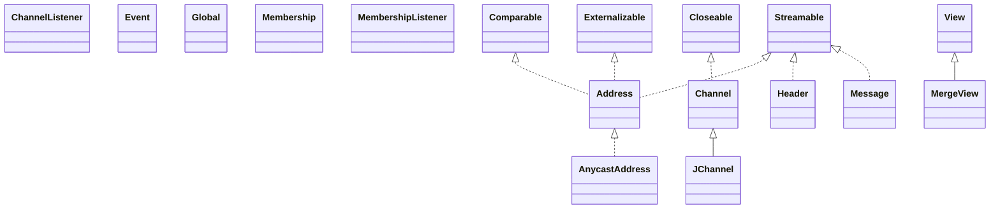

# jgroups-3.6.9.Final.jar

[Group index](README.md) | [All archives](../README.md)

## Scope and provenance

- **Donor:** `SQX_145_REFERENCE_ROOT/internal/libs/jgroups-3.6.9.Final.jar`.
- **SHA-256:** `006cb0ca4b7358e2ae778afe7f7056786fcd4d4b3b02ae7377bb778baf6be196`; accessed 2026-10-06; captured `2026-10-06T18:54:51.906614+00:00`.
- **Classes:** 1060 raw entries; 1060 unique entry names. Duplicate occurrence indices are zero-based.
- **Inspection:** read-only ZIP hashing and class-file structural parsing; signatures/descriptors, modifiers, hierarchy and references only. Bytecode bodies are hashed, not published.
- **Allocation:** proposed `FEAT-COMPUTE-JGROUPS`, P14; [roadmap](../../sqx-full-application-roadmap.md). Domain README registration remains required.
- **Repository:** `01067f00031428613c6394064ca1bcadc1ba00ee`; review state unreviewed. Download label 145-dev1; installed build/activation and runtime equivalence unverified.
- **Limit:** every class/member is inventoried; declaration coverage does not establish consumed calls, defaults, formulas, failure semantics or algorithm parity.
- **Archive/resource index:** [057.json](../../../evidence/sqx145/archives/145/057.json).

## Complete member declarations

Member shards contain exact JVM names/descriptors, access flags, generic signatures, throws types, declared fields/methods, superclass/interfaces and referenced class names. All classes, nested/synthetic members and overloads are retained. Code length/hash is structural evidence, not a normalized algorithm comparison.

- [001.json](../../../evidence/sqx145/members/057/001.json) — SHA-256 `0b2ef2cabb217705fba440aab25f36c553f4887aeff35b5e82f762cbb64f47ad`.
- [002.json](../../../evidence/sqx145/members/057/002.json) — SHA-256 `36763f4e6ef871a40d0f48c4aec81a3db04ec7f060f3e41fa5957c619ad02672`.
- [003.json](../../../evidence/sqx145/members/057/003.json) — SHA-256 `92d2f52e3c4a8c63e9b7c489d1f1ad304456e50dc6c46fe04a099a1cb2d77d0c`.
- [004.json](../../../evidence/sqx145/members/057/004.json) — SHA-256 `4746f130cb6e2784dda8cdc70967f00f3f21d3ec8f98f2323f7da56388d91998`.
- [005.json](../../../evidence/sqx145/members/057/005.json) — SHA-256 `68c4ffcdf838eab364cf6015dd2160cc742b30478d6dc5630c125e8ed7a33a9d`.
- [006.json](../../../evidence/sqx145/members/057/006.json) — SHA-256 `87e5783aa6b75acaa13d70b68b5aff9ec639352fe7b5e64cf5085653e8c705f8`.
- [007.json](../../../evidence/sqx145/members/057/007.json) — SHA-256 `2743ad0d52909e1480e0bf512714754aac06b83901b2879f24cc3ca9d2c19cd9`.
- [008.json](../../../evidence/sqx145/members/057/008.json) — SHA-256 `514fb69f9aa194a0f0c29b97d429311420fa37e089622010069857033f491d73`.
- [009.json](../../../evidence/sqx145/members/057/009.json) — SHA-256 `f69039db61c1f87a7e213087404f6a7fa38e953ec2cc9ec39c1a6e9a01796ef5`.
- [010.json](../../../evidence/sqx145/members/057/010.json) — SHA-256 `4826c6db271a4e49ed1495fa5ae22ca964ee749f10d61a35f33ba5bd473c7139`.
- [011.json](../../../evidence/sqx145/members/057/011.json) — SHA-256 `73359859311a1b27fd4cc1304d42d07c87dd158f433b37046fa0d567bb8834bb`.
- [012.json](../../../evidence/sqx145/members/057/012.json) — SHA-256 `c7748b43c8704d95fd923fc1f7f5e03581b3d499aee966ceabeda4e169c5e0a6`.
- [013.json](../../../evidence/sqx145/members/057/013.json) — SHA-256 `d6e8eb1e119cf2843939085c470f8ffb6e9ed266850b2e7dee48120fdd675b48`.
- [014.json](../../../evidence/sqx145/members/057/014.json) — SHA-256 `eb9fa8fc37b7708266e1d37f82f6717fbe4f48658b156bd6a24a92a2ad723201`.

## Focused structural diagram

Up to twelve non-nested classes; arrows show declared inheritance/interfaces only. External type names are not evidence of an available body or an executed dependency.

## Class inventory

| Archive entry | Occurrence | Class SHA-256 | Fields | Methods |
| --- | ---: | --- | ---: | ---: |
| `org/jgroups/Address.class` | 0 | `4ec43fb291ae718fcd679b49e3e514574a95bb20203d866f6a85aa6518b9d120` | 5 | 1 |
| `org/jgroups/AnycastAddress.class` | 0 | `049c949b8c3a5a816c2a0c15abbd1b4550bf23ce5eea78fc38bd79d90f6d8040` | 2 | 18 |
| `org/jgroups/Channel$State.class` | 0 | `6126c0398ce08d9f11e0933ff0b02f94e662a59a1625d8aa40f278bbbe50b0be` | 5 | 4 |
| `org/jgroups/Channel.class` | 0 | `1b523cbc2b937d2b79f5c43a53b6a410b38da14f3a7b634f6fee006b83b1414e` | 7 | 45 |
| `org/jgroups/ChannelListener.class` | 0 | `019cbd58c14e0f4759713912af3ec822567436e959409829660a7f7e244828fe` | 0 | 3 |
| `org/jgroups/Event.class` | 0 | `2d2eb86ed234964d9433eb02294530804c3e517e8a657d6d632776b96b0fd9be` | 61 | 7 |
| `org/jgroups/Global.class` | 0 | `8384bc4d0af099762a7176ec03fc88293bb0892528e0f71064aa512a57bb00bb` | 67 | 5 |
| `org/jgroups/Header.class` | 0 | `5dce7a6628296be8548d9b3ddaebc9641302dbdfd322673a7a2f4beafd7a0a0e` | 1 | 5 |
| `org/jgroups/JChannel$1.class` | 0 | `2087c708807448b4b9a8c4a8e4aa35cfe35cd7ea166f15caca86536915da1482` | 1 | 3 |
| `org/jgroups/JChannel$2.class` | 0 | `b1a1321d50e23bc30a26460286d3bb9c2cec2942ba8726c1244ca01ee2442c28` | 1 | 1 |
| `org/jgroups/JChannel$MyProbeHandler.class` | 0 | `d9087324524f70b3fae7bdc7f0a077104fc550ffce2122a86e1f124ef1198961` | 1 | 6 |
| `org/jgroups/JChannel.class` | 0 | `eb1c20b16b4f68ec870ebe8ba001908363dfe94f7806141ae5954ba5b4fbdf2b` | 17 | 83 |
| `org/jgroups/Membership.class` | 0 | `97361cbda60d71817620713d40f09cc7f3a6522eb2de2b27a7e95c53bb3bd1d7` | 1 | 19 |
| `org/jgroups/MembershipListener.class` | 0 | `076d9587f67fb9d6c367a8090af90746df8e25188eebd38de4c3a022d3c1557c` | 0 | 4 |
| `org/jgroups/MergeView.class` | 0 | `7392e70070770c1fb20384e66c6c0c97813da5719dd9f2fa3576f50d679eaa44` | 1 | 15 |
| `org/jgroups/Message$Flag.class` | 0 | `87c5ddf9747226c0668bfaa031a514ab6bf2faf4d512061c315b506c2da5fb74` | 13 | 5 |
| `org/jgroups/Message$TransientFlag.class` | 0 | `792f99c206edcc20ed52503343ebe8bf8eff92f9545fcf01223c101311980f71` | 4 | 5 |
| `org/jgroups/Message.class` | 0 | `38d1935ab7532f5943014e11692d75c8a72e89364017e92467848095e284a78c` | 20 | 67 |
| `org/jgroups/MessageListener.class` | 0 | `97a50e1c7a5cc3fa45b46564ac2133b4a89548c98ea711cb82ca4a2e29c362cb` | 0 | 3 |
| `org/jgroups/PhysicalAddress.class` | 0 | `085b3f020b9380370be5709484112ae2bd5c5b38ad70dcd1c646c489b1a9efaa` | 0 | 0 |
| `org/jgroups/Receiver.class` | 0 | `cbc5c4fb353d652d5cebbc1bc191a4347e84638827cf9baf2489401c1d08c13e` | 0 | 0 |
| `org/jgroups/ReceiverAdapter.class` | 0 | `a7f88c97d3d31a96e9122cb55b81dc82a41fa7320e390a13d48847ab119e0315` | 0 | 8 |
| `org/jgroups/StateTransferException.class` | 0 | `09e78657b1936dc9729fca3f2c04c7429e5088e7671540a8ffbca8ab0b558857` | 1 | 3 |
| `org/jgroups/SuspectedException.class` | 0 | `05187fe98ffbfe2ba679f92e2242904767df6a67bb2ffe09774954a3275becc8` | 2 | 3 |
| `org/jgroups/TimeoutException.class` | 0 | `da20fa5a4da18d2e71485d14b842c3318192c5421c28665ab14260627924707b` | 1 | 3 |
| `org/jgroups/UnreachableException.class` | 0 | `1041077d2854c3fad0da31395fac7d08eba6b6194f713a0fd111936da1d03bc6` | 2 | 3 |
| `org/jgroups/UpHandler.class` | 0 | `a164c240d98ee049233b7b72b40a21a08bd970f05d24adbddfbed85614cad448` | 0 | 1 |
| `org/jgroups/Version.class` | 0 | `ae34fe137e77bed48bca8064b94d3b54f8bcc61183d9c64f0e65ae7f96a7e70f` | 14 | 11 |
| `org/jgroups/View.class` | 0 | `a94a45d420fa0f8450fc5d7e6cc7f0b3f36c9cda965d43bee17532dcd6904dd1` | 3 | 26 |
| `org/jgroups/ViewId.class` | 0 | `f3bed25107544368ed39f364523e31ae7d5898a9d202c3971b552be9fa5d33b3` | 2 | 15 |
| `org/jgroups/annotations/DeprecatedProperty.class` | 0 | `66e0fdffb04a73cf5ea71a028eb426a99db5b784ce13894c474f946b99639a73` | 0 | 1 |
| `org/jgroups/annotations/Experimental.class` | 0 | `f0058198e6c5c1bda810a654704ed2274157ba4d216852a10aaaa0db7886d5b8` | 0 | 1 |
| `org/jgroups/annotations/GuardedBy.class` | 0 | `ec1d489895af05daab8adf4b9ff88f71fcdf7f70288e9d3e4d3f6ece2dd30914` | 0 | 1 |
| `org/jgroups/annotations/Immutable.class` | 0 | `d28b10c3cd34464d7fd141408f589745cd313128faa2e5c95c571ef90dc40840` | 0 | 0 |
| `org/jgroups/annotations/LocalAddress.class` | 0 | `9ae8b5573589340d8a8e0a42d9137c47d6fdabfaba019049d81b2278bfc98059` | 0 | 0 |
| `org/jgroups/annotations/MBean.class` | 0 | `41ac2d48e69d3bbc3ba7b968e27f0ef613fdee3fe65b02e5bd5475076d6b74fb` | 0 | 3 |
| `org/jgroups/annotations/ManagedAttribute.class` | 0 | `334dee5524ff6c995b2a2a5a734ce0b98be14f2be59411462b7ca3aa31f588d0` | 0 | 3 |
| `org/jgroups/annotations/ManagedOperation.class` | 0 | `e6abccf53b613568538e9532ca29f5cc8311ffa1f622695f992c35e565e5f223` | 0 | 1 |
| `org/jgroups/annotations/Property.class` | 0 | `32ca8a5480345e074d2b3506e12f0f561055cfbbeaf18596b284d992483fb1a4` | 0 | 10 |
| `org/jgroups/annotations/Unsupported.class` | 0 | `8b6183b4c07548c198eb5953ab8787ae7137918aa5f8d1f3af339e7d0c58493a` | 0 | 1 |
| `org/jgroups/annotations/XmlAttribute.class` | 0 | `a121c43f419afae2ccabd00fd83e076b8d26adfa4155a427ed4192a39845b4a7` | 0 | 1 |
| `org/jgroups/annotations/XmlElement.class` | 0 | `10e46b2ecbc87f9dee302e5f378eb487ec23cd7b6ef14c0380f62a2a6f6650b5` | 0 | 2 |
| `org/jgroups/annotations/XmlInclude$Type.class` | 0 | `8666f09e7f2472f3981f2f6de1bc0e8b85e7e78bd3465ddcf479a48d3dbd3f70` | 3 | 4 |
| `org/jgroups/annotations/XmlInclude.class` | 0 | `859e54f54c755f661b63e32f1d199d2f37627837a474012a0cb73150238d3d78` | 0 | 4 |
| `org/jgroups/auth/AuthToken.class` | 0 | `166d2eb12df1f500484a7b5d721c469ace16161f91365def8c69739931c860ee` | 2 | 9 |
| `org/jgroups/auth/DemoToken$DemoHeader.class` | 0 | `3738eed2228ab8ff5115ee50419811a7bc461e2742cb9112e0315bf52981c595` | 5 | 7 |
| `org/jgroups/auth/DemoToken$Entry.class` | 0 | `94879e60b99c8c04cb3c68bc14ab90a964a795c18debbfc3db2f437bed07c951` | 3 | 2 |
| `org/jgroups/auth/DemoToken.class` | 0 | `94a0cb5aee5483e8790e82e88a2562f7aede3967066993abdd7b01415dbf4926` | 3 | 12 |
| `org/jgroups/auth/FixedMembershipToken.class` | 0 | `1aea75be0e6e8ab2dc2fb680e77eb5927ed003f664c19bc16768c8a7e5d79da0` | 3 | 11 |
| `org/jgroups/auth/Krb5Token.class` | 0 | `7db87f150d3364b5008615b64def2f56a77f12cb0dd891a29ea0699323eaa298` | 11 | 14 |
| `org/jgroups/auth/Krb5TokenUtils$1.class` | 0 | `fefb9fb0a06aabf2dc7f6226d06da0734393ec97ac99ba1b4e4372d7188c896e` | 1 | 3 |
| `org/jgroups/auth/Krb5TokenUtils$2.class` | 0 | `ff2f49d13807cff99915900e64fc7722d15fee1834b4de8fef0aa94bc01d4c91` | 1 | 3 |
| `org/jgroups/auth/Krb5TokenUtils$LoginCallbackHandler.class` | 0 | `a2eff99a01869e61c0954fc264d4333d505fffdc109b25c95e8aa2e2da548a82` | 2 | 4 |
| `org/jgroups/auth/Krb5TokenUtils.class` | 0 | `5efba9c542d5c084e8643839a944bfb6de7ea3812afbf40425c0ba6824b3da77` | 2 | 8 |
| `org/jgroups/auth/MD5Token.class` | 0 | `34f11e899acaa5b151bcf5a85e4fbc1dc4c2052be22b7e403c0d87639fad7108` | 2 | 13 |
| `org/jgroups/auth/RegexMembership.class` | 0 | `2c94bf32672a4d9999efba4de63e801de385677380c271e882fba71f8d08c60b` | 4 | 7 |
| `org/jgroups/auth/SimpleToken.class` | 0 | `c7cb9173455c3082ea86b52ec56f4c8565c10844e82dec2aab17dfff30ac50c6` | 1 | 10 |
| `org/jgroups/auth/X509Token.class` | 0 | `a2816ca825e868f7017fa4da6c1826436684f29f9e26428cb14699307b526779` | 19 | 10 |
| `org/jgroups/auth/sasl/FileObserver.class` | 0 | `e70c37bcc5822269014883f0c40e1db5c3ae9f08201cc04a0e2ce1a30649e7ad` | 0 | 1 |
| `org/jgroups/auth/sasl/FileWatchTask.class` | 0 | `8563c4c4c2df7b3f56d2ad4258540d919a000ba35310a6ae82ecab52b87b1ef2` | 3 | 2 |
| `org/jgroups/auth/sasl/SaslClientCallbackHandler.class` | 0 | `0bb68a0c749e9a476a847ac782c19940d3df19dfcdda0150a1e6943b271527da` | 3 | 2 |
| `org/jgroups/auth/sasl/SaslClientContext$1.class` | 0 | `422ad79b1d89b4ec8d3c2be3a348f78fad250c1426b4d95208b08f884649d1e5` | 6 | 3 |
| `org/jgroups/auth/sasl/SaslClientContext$2.class` | 0 | `ed889472ea292ade7e85d81ded2159ffad2126ba9efd2a405dce3429dc1c7ead` | 2 | 3 |
| `org/jgroups/auth/sasl/SaslClientContext.class` | 0 | `fbe796c1234126fe5629769c89ff1fc5a838131bacc31a4ea2975700321c259a` | 3 | 10 |
| `org/jgroups/auth/sasl/SaslContext.class` | 0 | `ef7daeb4bb14708f988813c4899ad4718bbf9b5010df2dfdbc941aa69b8c58f0` | 0 | 6 |
| `org/jgroups/auth/sasl/SaslServerContext$1.class` | 0 | `aede5b1a44be1a1dc31378099419ec73dcad0703cc88922a87080e63bb23d25a` | 6 | 3 |
| `org/jgroups/auth/sasl/SaslServerContext.class` | 0 | `ded7b930f07f196755165cbe5e8b7db2b573c247f1b64420ca82ccbbb3386b6b` | 3 | 9 |
| `org/jgroups/auth/sasl/SaslUtils.class` | 0 | `e8520b07f3a065e5c953f68c8577346d652083be890ffc0f6df93119c48ef7d3` | 0 | 8 |
| `org/jgroups/auth/sasl/SecurityActions$1.class` | 0 | `f795a3f5d3097dde61914c75d7fcd91ce61b0660012c0f05b4c39fdb0405de80` | 1 | 3 |
| `org/jgroups/auth/sasl/SecurityActions$2.class` | 0 | `72693ac541ed81365721c91f3c02a4830cfee46b3fe3ffe4c2cc3fc2473e333a` | 0 | 3 |
| `org/jgroups/auth/sasl/SecurityActions.class` | 0 | `67995041ad05f57ac56e68fade93899df40e1aa7da77aad717892f8c3d5049d5` | 0 | 4 |
| `org/jgroups/auth/sasl/SimpleAuthorizingCallbackHandler$PropertiesReloadFileObserver.class` | 0 | `ad075bb1e60d569b5b1c17e85a546233581ee292ef799a9c70bb862e5b62d792` | 1 | 3 |
| `org/jgroups/auth/sasl/SimpleAuthorizingCallbackHandler.class` | 0 | `4b76ccacc5cc808fe46a63c3b244a0ca1d14162af2e6f20a3688787857d4ff0d` | 7 | 6 |
| `org/jgroups/blocks/AsyncRequestHandler.class` | 0 | `48e47a060798337769bf20ed97bcae3f345cdad2a83a8c3ece9d77519b3cba91` | 0 | 1 |
| `org/jgroups/blocks/BasicConnectionTable$Connection$Sender.class` | 0 | `cba6f885e5ca084291905bbd8336fe064fffcb70dd8d37410f89c64eb0fa8b8a` | 3 | 5 |
| `org/jgroups/blocks/BasicConnectionTable$Connection.class` | 0 | `ed14e4b60daaa103ac2196faf35a7dd8749f9ffa97c64a8728a604e9a2248515` | 12 | 22 |
| `org/jgroups/blocks/BasicConnectionTable$ConnectionListener.class` | 0 | `a9d628e85c049a15710e99187e2be68dc232c456c8a00b6b5e3173b9889141f4` | 0 | 2 |
| `org/jgroups/blocks/BasicConnectionTable$Reaper.class` | 0 | `3fa29693c0fcb4058e406f37ae81ee607795ac003bdcbfe86735e457d127d31b` | 2 | 6 |
| `org/jgroups/blocks/BasicConnectionTable$Receiver.class` | 0 | `7f912b438d5f9d5564188f5299205b6002fcaa60941c092d5b7a6d6cc4713b59` | 0 | 1 |
| `org/jgroups/blocks/BasicConnectionTable.class` | 0 | `6d3f02f66dd628a8996f72c2fe75595efc13e16d8b165f764e42514d465e5c47` | 31 | 39 |
| `org/jgroups/blocks/Cache$1.class` | 0 | `ba073b6f59b8309410e01dedc20619b91605964c104c07c75c9e67cdf7d44b82` | 1 | 2 |
| `org/jgroups/blocks/Cache$ChangeListener.class` | 0 | `8ef7ab0762d60d9e0051d49176170835ab912fcff7b48bd80991340919df7c42` | 0 | 1 |
| `org/jgroups/blocks/Cache$Reaper.class` | 0 | `e55ae65211b5df8e4bef67326c078d025fde7bf8f20924f4ce601a8ec249e18e` | 1 | 3 |
| `org/jgroups/blocks/Cache$Value.class` | 0 | `6f1823157ed06e086dc09fc0de844832430d3e396f4e00838ed8024b0bbc47c7` | 4 | 10 |
| `org/jgroups/blocks/Cache.class` | 0 | `b67acdecca96a386a4a4b022488539e1f5e753766086d0a256ab667b38f1a797` | 7 | 29 |
| `org/jgroups/blocks/ConnectionTableNIO$1.class` | 0 | `2f27301bc33ce8e7fc60e678cf827d56f0144be2b1d3a7d3525fa8dc42e6621a` | 1 | 2 |
| `org/jgroups/blocks/ConnectionTableNIO$2.class` | 0 | `3efb73ca85289bc237a807ff636e853b12f6f61b37cd4392f1b5441d65a99b78` | 1 | 2 |
| `org/jgroups/blocks/ConnectionTableNIO$Connection.class` | 0 | `2d53eacdbb4897195b74c16b0c9a6aa18646aab8e6486b43efdfd4bcecc907f2` | 7 | 9 |
| `org/jgroups/blocks/ConnectionTableNIO$ConnectionReadState.class` | 0 | `4434b23aaa84e0f42a8c08d876f9f5ec72f7c9c65ba07ce8bf24f50b9b096698` | 5 | 6 |
| `org/jgroups/blocks/ConnectionTableNIO$ExecuteTask.class` | 0 | `ea9d50596144f2894a2225861abbd97626aa34bd96ee100fb6e7325870213df5` | 3 | 2 |
| `org/jgroups/blocks/ConnectionTableNIO$MyFuture.class` | 0 | `1758776cf04f5c8a0e10df60ffbb70be7111100351e728064b6978f57cbb5295` | 0 | 3 |
| `org/jgroups/blocks/ConnectionTableNIO$NullCallable.class` | 0 | `806fadd0ec73db110ae68526157c1ad181dc0afb3f2e911dae77e5ab30509304` | 0 | 3 |
| `org/jgroups/blocks/ConnectionTableNIO$ReadHandler.class` | 0 | `196f85473677daddfe38f362a15f9404a212d78349d8d6ef45b6acda2b3bce3e` | 4 | 11 |
| `org/jgroups/blocks/ConnectionTableNIO$SelectorWriteHandler.class` | 0 | `5513490a7cd1065e53d8ef173ab0fabe7e324b0bd984db7722c06d4918dd26e4` | 8 | 16 |
| `org/jgroups/blocks/ConnectionTableNIO$Shutdown.class` | 0 | `eadd46718c0e06734351a634bd478acfaeb7a748bdcc43cfaa2006580610b6aa` | 0 | 2 |
| `org/jgroups/blocks/ConnectionTableNIO$WriteHandler.class` | 0 | `8939787c501cc027b92e48e174b2e1812dbac26f10fe2db38634a84863d9a833` | 5 | 14 |
| `org/jgroups/blocks/ConnectionTableNIO$WriteRequest.class` | 0 | `669b4c7295a5a58842de51c24f3bafbf485ac8f18844af94d352136dbf0ba770` | 4 | 5 |
| `org/jgroups/blocks/ConnectionTableNIO.class` | 0 | `179bd3a42c41d95a2d0e5660436998567410f465cf9e4935b7ff1b43557f149a` | 19 | 30 |
| `org/jgroups/blocks/GridFile$Metadata.class` | 0 | `5619d056199c790dc79dfb3245c2b0c84f413615056e79555b0d4d1e7fdc240d` | 6 | 15 |
| `org/jgroups/blocks/GridFile.class` | 0 | `74d2e1a13a32fc2c10437873acf2cae56cdc80bbcc64f1a366eef8dafb43b498` | 5 | 30 |
| `org/jgroups/blocks/GridFilesystem.class` | 0 | `a9f6e2c113f734cc01fc61c1d28f716c74fc966c84e0b72b666b8c6205536f88` | 4 | 15 |
| `org/jgroups/blocks/GridInputStream.class` | 0 | `855fb505a77b6f242955f12990a183c4781eff71fb1ed09b2871cc76c17312e1` | 9 | 11 |
| `org/jgroups/blocks/GridOutputStream.class` | 0 | `2cf8efa97761c3399fee9317ec75b1388ffaa2f9eb4d0e44ec3e20fe4b8ebd61` | 9 | 10 |
| `org/jgroups/blocks/GroupRequest$1.class` | 0 | `ccb5b713cfd8447e3071707d85e45122dd5f69ffc938ec8db7cd9d5b7888ea4c` | 1 | 1 |
| `org/jgroups/blocks/GroupRequest.class` | 0 | `2b24789447dd82e783336153d0193890913b1bb3c46696237add6755534da7a4` | 3 | 17 |
| `org/jgroups/blocks/LazyRemovalCache$1.class` | 0 | `eed6428bf4b70bb9a65b91d6f6ecec84fd024728cd6ef1e45919902ae8c486eb` | 1 | 2 |
| `org/jgroups/blocks/LazyRemovalCache$Entry.class` | 0 | `a910525b2b4f9c6ed43763c52ea5ab43fc0d2dd79d832a0e51a64db79b40111e` | 3 | 5 |
| `org/jgroups/blocks/LazyRemovalCache$Printable.class` | 0 | `6be9fe2f6632c3279daa2e4adf3edf41bbdd6521ee77f5d5c549ff395c040691` | 0 | 1 |
| `org/jgroups/blocks/LazyRemovalCache.class` | 0 | `3f0d993591792170b5bdb5910c3b2220f66fed42b190ac8ee1706c0629c12d11` | 3 | 28 |
| `org/jgroups/blocks/MemcachedConnector$1.class` | 0 | `4b8c674b2cac042c6a9e4e561c6aa8280d7b0d63d1fac90b6c1cf95140f2e13f` | 1 | 1 |
| `org/jgroups/blocks/MemcachedConnector$Request$Type.class` | 0 | `8b120b376e87eab01124276f6ce07659c343ea70675f8404c249ca8ba76ff8d8` | 14 | 4 |
| `org/jgroups/blocks/MemcachedConnector$Request.class` | 0 | `849fac7f37d37782c1d113d0967f212b2f91b49a6533b8a55f51fd3db630aeb3` | 5 | 2 |
| `org/jgroups/blocks/MemcachedConnector$RequestHandler.class` | 0 | `15569b70a9cf8b925bab7b188355b0132949f19687d2a979a6cdd59c7ba54ca3` | 4 | 3 |
| `org/jgroups/blocks/MemcachedConnector.class` | 0 | `fd903b0e783e7767824cb7136cd76a76f85cca6dc3a3b76e7b8ab28cab08da3f` | 14 | 24 |
| `org/jgroups/blocks/MessageDispatcher$MyProbeHandler.class` | 0 | `030d6ead5258b3a76bdf036ba08d3ce43d3e3647a2dd6050156196092d19b56d` | 1 | 3 |
| `org/jgroups/blocks/MessageDispatcher$ProtocolAdapter.class` | 0 | `0712473d8831dff0af34b466ad5e6ef6260fedceeac2d7411aa59055369c0d0f` | 1 | 4 |
| `org/jgroups/blocks/MessageDispatcher.class` | 0 | `49f2cb53946f494c2b5bbe52af2128abf778d37ab7fe92a4d8266f34adf879e1` | 15 | 42 |
| `org/jgroups/blocks/MethodCall.class` | 0 | `e363141e0dd6cd5d11e3159673c1ddc186ba1604d8e6a8946be4ffe28d0b6b6d` | 12 | 37 |
| `org/jgroups/blocks/MethodLookup.class` | 0 | `b17650470a51965d9fbf9ca9cb9ab4beb9ad5419a8fe154260d681f45a7facd6` | 0 | 1 |
| `org/jgroups/blocks/PartitionedHashMap$1.class` | 0 | `a2694ec74e867b2803676e49d18e0a7df41d3d6e9698d6ec8801c7deb03ed338` | 1 | 2 |
| `org/jgroups/blocks/PartitionedHashMap$ConsistentHashFunction.class` | 0 | `ec52848f1481438462ed5de7ffd0699ae5a8ba1474f35813b8d3e2ba44aca7b2` | 2 | 7 |
| `org/jgroups/blocks/PartitionedHashMap$CustomMarshaller.class` | 0 | `b3a44ccce164ff81f990878b437fff1da2d099583edbf02b1fd149e4fd3d9f1b` | 4 | 4 |
| `org/jgroups/blocks/PartitionedHashMap$HashFunction.class` | 0 | `6d17ef22699d8f179b39f60f698ada825ca59e220d2f162f9a8d95ecd3fc514f` | 0 | 1 |
| `org/jgroups/blocks/PartitionedHashMap.class` | 0 | `6a1bcef0101c2a2a0b7d1c0254cbc368e9ea0e7d125ca718a1cb68a05b66527f` | 18 | 43 |
| `org/jgroups/blocks/ReplCache$1.class` | 0 | `ca515719095df34df04f3164218ba0e8b65b569053909bf6268875bd95b13911` | 1 | 2 |
| `org/jgroups/blocks/ReplCache$2.class` | 0 | `4f65678ee7b0c10e1c4aed1e50d9ac5de7f222ddf4d89655237341087b49ef6e` | 1 | 2 |
| `org/jgroups/blocks/ReplCache$3.class` | 0 | `36665def8b62bc5bc292af0200291865b606ed47edf33c94f91ee4f9843ba9bf` | 3 | 2 |
| `org/jgroups/blocks/ReplCache$ChangeListener.class` | 0 | `364a1c9b92867981aef836772f3e0360ec3427727c3f569f65413642afa2bdb7` | 0 | 1 |
| `org/jgroups/blocks/ReplCache$ConsistentHashFunction.class` | 0 | `c554faef94609a0297a7ef3865bb3536c2220bb699b255df8d62d10389c8b904` | 3 | 3 |
| `org/jgroups/blocks/ReplCache$CustomMarshaller.class` | 0 | `19e3d80a109f8eebcf44e0e1c9f581a59cbe91aa1a90b8b73ad89f7958c76762` | 4 | 4 |
| `org/jgroups/blocks/ReplCache$HashFunction.class` | 0 | `af13d73b44a73a0dd6c5ee6f5fe23a0a854fc0fff5418c111b18a182cb12f881` | 0 | 2 |
| `org/jgroups/blocks/ReplCache$HashFunctionFactory.class` | 0 | `403576fb827fc64b6555f47ff61a45a70961a01841e39a2a77cc980025ac251d` | 0 | 1 |
| `org/jgroups/blocks/ReplCache$Value.class` | 0 | `f231ad240a5be90af9ef6f8c496b22cdff3b3e9da216b85dc5218f7e066a4853` | 3 | 4 |
| `org/jgroups/blocks/ReplCache.class` | 0 | `9253ab29df07da67c201c9e8b71722ac1d2efc153805a62c093d049cb7399293` | 24 | 60 |
| `org/jgroups/blocks/ReplicatedHashMap$1.class` | 0 | `186d735b5ccced057ee2437171e840711e0d22975c1bea972e9d83b538e741f0` | 1 | 2 |
| `org/jgroups/blocks/ReplicatedHashMap$Notification.class` | 0 | `bfea2c922598ccf5f42d646f9310c040c9ec536cf12f17100d6015551609b6b2` | 0 | 5 |
| `org/jgroups/blocks/ReplicatedHashMap$SynchronizedReplicatedMap.class` | 0 | `e18d852dfa743bd8bf90b24572e33269addfb6c7253e66ecb3aa32bc03d18b42` | 5 | 29 |
| `org/jgroups/blocks/ReplicatedHashMap.class` | 0 | `b971135e4256d06df93043b75634fa83d4e8668397a8728c3e949339c93efd29` | 17 | 48 |
| `org/jgroups/blocks/ReplicatedMap.class` | 0 | `a5519e78a6151f8beed86ea754e1efffcd0f581894d8911553b73a8d4a980a50` | 0 | 8 |
| `org/jgroups/blocks/ReplicatedTree$1.class` | 0 | `251496a86bf706a44dc66e660b7640fcd2c67ae75607e2aef2a3b7b690572f92` | 0 | 0 |
| `org/jgroups/blocks/ReplicatedTree$MyListener.class` | 0 | `1223dadf18de7ee460e50a3cc28851982055102ee45e134c4aa5e69d3457f338` | 0 | 5 |
| `org/jgroups/blocks/ReplicatedTree$Node.class` | 0 | `7f1c82cf8c306f379b90db41f54e43e8280fa1ab1fd6df41ae379eb2823f87f6` | 6 | 20 |
| `org/jgroups/blocks/ReplicatedTree$ReplicatedTreeListener.class` | 0 | `b961d4e552dd589160aca301877c39d900f4109dee105c1514b1af573fc02640` | 0 | 4 |
| `org/jgroups/blocks/ReplicatedTree$Request.class` | 0 | `ca6826c0cd6775956eed26dab0a07849328e3903f789d00e67bb8413d58b2349` | 8 | 10 |
| `org/jgroups/blocks/ReplicatedTree$StringHolder.class` | 0 | `1218bf5cf55d17dbf5a556013548004d4e6937840a3b79e8497227887098b950` | 1 | 4 |
| `org/jgroups/blocks/ReplicatedTree.class` | 0 | `32698ccb8e7af7995dae38b3cf4f45b24d50c1f31ebf522a17c833cc9725d56c` | 13 | 44 |
| `org/jgroups/blocks/Request.class` | 0 | `5bdcb57861209a52688da0c92dd7eb0cbc03cd7a8ce15f2e3a9575f800801a8f` | 8 | 23 |
| `org/jgroups/blocks/RequestCorrelator$Header.class` | 0 | `134d598773205354409221d4415feef75615200a8db618bb78b25dcf7f48dff1` | 6 | 10 |
| `org/jgroups/blocks/RequestCorrelator$MultiDestinationHeader.class` | 0 | `80635d3af59c786f273cb0f28660e8c47923c15549fbcd3e5d5ea10e5074d268` | 1 | 6 |
| `org/jgroups/blocks/RequestCorrelator$MyProbeHandler.class` | 0 | `ac520a57fc9538a223637c6cc231bc12af3656161bf6a368894a5435b2ffa936` | 1 | 3 |
| `org/jgroups/blocks/RequestCorrelator$ResponseImpl.class` | 0 | `7d4b0be6822678921d63769f3be7451dd0a15a0256432dcc7577fb014984ec17` | 3 | 3 |
| `org/jgroups/blocks/RequestCorrelator.class` | 0 | `75538996140f803c9f11b59898d46a11584cd21cfcfc2c23e9d328746e9d50f6` | 13 | 30 |
| `org/jgroups/blocks/RequestHandler.class` | 0 | `f2a1ffc428730f20d1957e0e10b47ca3b513d7f5c3ff765a4c5d61a24ba37f1b` | 0 | 1 |
| `org/jgroups/blocks/RequestOptions.class` | 0 | `04438703e73236d4f6560a871265e9ca4e690dc7ab2e10d8b3ca1d8e22e37e0a` | 9 | 34 |
| `org/jgroups/blocks/Response.class` | 0 | `720cacea4c565fcacc5e516fc92a792a358dbdb5f01861fc845855cb6f96fc45` | 0 | 2 |
| `org/jgroups/blocks/ResponseMode.class` | 0 | `1bd98960591cda577b673856cf1673c9fe16ad4dfff22f2926706853576af97b` | 5 | 4 |
| `org/jgroups/blocks/RpcDispatcher$Marshaller.class` | 0 | `d159ebfe47b8e6ce592ac68b2f8b1ed56fe401ea4f7f0daa228b084aab3f6d96` | 0 | 2 |
| `org/jgroups/blocks/RpcDispatcher.class` | 0 | `070283b698b5a8cc3a92d55a57001c201c12b9826eada5f7f3f2f1d352adf8c7` | 4 | 24 |
| `org/jgroups/blocks/RspFilter.class` | 0 | `0e20169600bd24a4fa477d9f59d48e75f89b34ddc8d90d91677425ee6a490f32` | 0 | 2 |
| `org/jgroups/blocks/UnicastRequest.class` | 0 | `191cc71fb5d75f2d0b446d8d9c26e030f81929a54e86f7ea72c17b7a40cb659e` | 3 | 14 |
| `org/jgroups/blocks/atomic/Counter.class` | 0 | `4932e3a973cbdc1bc7b194535cfcc96315d5c5c5d0b86fe30dcf071e2b2789ae` | 0 | 7 |
| `org/jgroups/blocks/atomic/CounterService.class` | 0 | `a4e750345f4c8dbb38ff661fa37aaf048eee435895b929577542fb9e910e46a9` | 2 | 6 |
| `org/jgroups/blocks/cs/BaseServer$Reaper.class` | 0 | `43ba93ecc1611ec7543a2f867e2469e7b07421e2d3bd5e4feaece744225302e6` | 2 | 6 |
| `org/jgroups/blocks/cs/BaseServer.class` | 0 | `b933e8a3d50d4673b35e7ac61bbab423fa24bce62e337a2b30647ed06894b864` | 21 | 63 |
| `org/jgroups/blocks/cs/Client.class` | 0 | `64ce9eebd15cbff659d53f50705728df60aed48d9ec1918d4a629c503b8fd8ce` | 0 | 6 |
| `org/jgroups/blocks/cs/Connection.class` | 0 | `d1281deb58ed1e95dd1e8a69db2e2dabcc2c5e08763bcf9ef668247c82c7f42c` | 3 | 11 |
| `org/jgroups/blocks/cs/ConnectionListener.class` | 0 | `cfb0b67499167a0cc8e708c74b779cceb7a6f8c4c020addb8a9efaf508a2876e` | 0 | 2 |
| `org/jgroups/blocks/cs/NioBaseServer$Acceptor.class` | 0 | `bbfb317ace726f0d28da67bdbeb31c7e0badf2dd375805c00f98ea800cb334ac` | 1 | 4 |
| `org/jgroups/blocks/cs/NioBaseServer.class` | 0 | `13c46091d1e21a2b5777c827004ab2a9a86abd152289a165395ed581e53b0cad` | 8 | 16 |
| `org/jgroups/blocks/cs/NioClient.class` | 0 | `1fb345af260a03ed7bc17668033fc2ade8c0cddacb54921811872e2ee2ec77fb` | 2 | 14 |
| `org/jgroups/blocks/cs/NioConnection$1.class` | 0 | `6cb3a9f910e4665e56bd6797a3b643be28f931c48d390a9b083f78f955a94020` | 1 | 1 |
| `org/jgroups/blocks/cs/NioConnection$Reader.class` | 0 | `6fe84361b641b317d022026547b40196f9a69a79fa23fe8e5dd951eb909bb2cb` | 7 | 12 |
| `org/jgroups/blocks/cs/NioConnection$State.class` | 0 | `8dd142f50e6094270e0f739e75c6ab5a8c51738a660471e30cec4f196cb0493a` | 4 | 4 |
| `org/jgroups/blocks/cs/NioConnection.class` | 0 | `2cb03426abdf659fadec7d855a8dc9c2a09b1653ba23c309786c8e79ac90c9d5` | 11 | 37 |
| `org/jgroups/blocks/cs/NioServer.class` | 0 | `9c06e770d39aae70a51166988cf9fff6e9c06555d3dc6ec97e4af6ef30f7c8c5` | 1 | 7 |
| `org/jgroups/blocks/cs/Receiver.class` | 0 | `e07ad644bd65e8aeefab521c868986b4aac4a265a2786996584cb5c7ba1da974` | 0 | 2 |
| `org/jgroups/blocks/cs/ReceiverAdapter.class` | 0 | `4154d2aff01209908513ec378b287356f21b3ab88620b6071d2d20e5a2497a3f` | 0 | 3 |
| `org/jgroups/blocks/cs/TcpBaseServer.class` | 0 | `1159bc73cab4fc034925f0b14dd83f170dfa65184af33ebac9a3290d04050fd7` | 4 | 11 |
| `org/jgroups/blocks/cs/TcpClient.class` | 0 | `976eba89e010bb1728d28eb0dc55c7b8738ff44becad8564279a6639399c1335` | 2 | 16 |
| `org/jgroups/blocks/cs/TcpConnection$Receiver.class` | 0 | `92123a8f6aa1e49b2906caf0a1e1afd99c221876f735d9d9c247f5486c985ba3` | 4 | 7 |
| `org/jgroups/blocks/cs/TcpConnection$Sender.class` | 0 | `1e7b689d36e5a87c7ada784098c38475173ce01e6fc974f0681ca074574f8b53` | 4 | 7 |
| `org/jgroups/blocks/cs/TcpConnection.class` | 0 | `7510e91044d6922cc431063e0c88adbc3d4f4c7a560b6fab7ee8da31a8fb4e92` | 8 | 26 |
| `org/jgroups/blocks/cs/TcpServer$Acceptor.class` | 0 | `6c64775d77dcd10ab2160bfc3be716c2f92f92fc78f32d579f72f8e794eb18b1` | 1 | 3 |
| `org/jgroups/blocks/cs/TcpServer.class` | 0 | `c91f8547da43fe99da7d855a0e1440a800daa65191ac225cf5c47af85cb6a879` | 2 | 6 |
| `org/jgroups/blocks/executor/ExecutionCompletionService$QueueingListener.class` | 0 | `1e6692eda7af1e609b78495caf8e79bb2906df7e056823a13b78d0f91cd4021d` | 1 | 2 |
| `org/jgroups/blocks/executor/ExecutionCompletionService.class` | 0 | `7ef2c4b0d771feea77f926c597cc8ee72f57b13c0f2eb097d517b17593f2b82a` | 3 | 11 |
| `org/jgroups/blocks/executor/ExecutionRunner$1.class` | 0 | `e650318c1dcbaf7e7129f019bafa2eeb9fa5f7137962dd86b6d5788e34490120` | 4 | 2 |
| `org/jgroups/blocks/executor/ExecutionRunner$Holder.class` | 0 | `0d35f2335d6babd2c5fcf22410e7db6846fbf744b33400fc05906e1e8426713c` | 1 | 1 |
| `org/jgroups/blocks/executor/ExecutionRunner.class` | 0 | `985647277c8acca18583b6d03a3c77bbf09f4399827d73b7839787de75573595` | 4 | 6 |
| `org/jgroups/blocks/executor/ExecutionService$1.class` | 0 | `329884cb6ccaa565913a613fa51d552e8b836dd75a698a2ba64c78241c149a4c` | 2 | 1 |
| `org/jgroups/blocks/executor/ExecutionService$DistributedFuture$Sync.class` | 0 | `8cfef801da903483189261da5104c9abd6415bc9a5f74b0595fd7c805b2a7b4e` | 9 | 13 |
| `org/jgroups/blocks/executor/ExecutionService$DistributedFuture.class` | 0 | `ac6245c8ed256394f435e8b8e4077916dd255a83b296ed6e031b744acc2df0ca` | 6 | 17 |
| `org/jgroups/blocks/executor/ExecutionService$RunnableAdapter.class` | 0 | `dd09e73de35c8607d05b2fcbe63c516dd988a0dcecbe5997f9cd1bd75da44804` | 2 | 5 |
| `org/jgroups/blocks/executor/ExecutionService.class` | 0 | `c0a8d0350a4024985f658fc1e354009ec4b3b2a3751cc35ba1addfe0b8a024d0` | 7 | 20 |
| `org/jgroups/blocks/executor/Executions$StreamableCallable.class` | 0 | `417daf75c4764eec0a1aa4028a48835b37c049e5b85d0965097e5bc642e7882e` | 3 | 6 |
| `org/jgroups/blocks/executor/Executions.class` | 0 | `52154065c60e06fad64a554c25471e1c3eb0e394693610276ce308d783280b37` | 0 | 2 |
| `org/jgroups/blocks/executor/ExecutorEvent.class` | 0 | `8c3175ff37d6848f18e9a650d915ee5426424a64129ce6aacaff6206a1282946` | 5 | 1 |
| `org/jgroups/blocks/executor/ExecutorNotification.class` | 0 | `6a1f084b131a99578acb965ba0e22b20be2861d897850596e2e60c32f781e5a7` | 0 | 3 |
| `org/jgroups/blocks/locking/AwaitInfo.class` | 0 | `ca1746338a2f9fd53e895205d61c69f07a134879623da63d00014f4ea182fcfd` | 2 | 4 |
| `org/jgroups/blocks/locking/LockInfo.class` | 0 | `b7134044d6c402ffcbbb0ed42d2e64913277b1584a61fbcb55d437905bbb8011` | 6 | 8 |
| `org/jgroups/blocks/locking/LockNotification.class` | 0 | `09acb15b8a0fe6be33a5a38f7176942ae2ceb2df073983ab59f1dbb9b798f799` | 0 | 6 |
| `org/jgroups/blocks/locking/LockService$ConditionImpl.class` | 0 | `32b84426ce6725d7f20ae4ceac79f3d4b66c0a622f852aedb210195ed8f69ff6` | 3 | 8 |
| `org/jgroups/blocks/locking/LockService$LockImpl.class` | 0 | `2095b903fe9acc4b325ed2b373392ef341d08c66146b4d1ce298fe1d439f2f1a` | 3 | 8 |
| `org/jgroups/blocks/locking/LockService.class` | 0 | `0f1c8c02cbac3ca9cb536e9d6521ab863f84ad06cadff04bb879651dc8269c7f` | 2 | 8 |
| `org/jgroups/blocks/mux/MuxHeader.class` | 0 | `3a550bf6324c13d3f18b8fbe4316c2d1a01b00c416872cd62a27830a939d39a7` | 1 | 7 |
| `org/jgroups/blocks/mux/MuxMessageDispatcher.class` | 0 | `8a80d8982d2cd8035653540a56f6de2db487a8958f17f284532855f57e39da91` | 1 | 7 |
| `org/jgroups/blocks/mux/MuxRequestCorrelator.class` | 0 | `5465e57945ea9cb31f3e3f37d9ef51f45c2f190814adc9e841d4eca490964b4e` | 2 | 5 |
| `org/jgroups/blocks/mux/MuxRpcDispatcher.class` | 0 | `e6629780343fbd84685a31b8a252d40da659c8f5434ffd209d3f82166911af1b` | 1 | 8 |
| `org/jgroups/blocks/mux/MuxUpHandler.class` | 0 | `521527e24794c3f34c2937d4b30c1409788860e35735c0148eb391b730ee2e5b` | 5 | 14 |
| `org/jgroups/blocks/mux/Muxer.class` | 0 | `23b01197ffa7792531076b79ced20343931f8556e9283df9755e84fd999873ca` | 0 | 5 |
| `org/jgroups/blocks/mux/NoMuxHandler.class` | 0 | `d87e23f057a01b893320d22a0f9d25d6cb7e1778f4dd502a52866a4826fc0137` | 2 | 4 |
| `org/jgroups/blocks/mux/NoMuxHandlerRspFilter.class` | 0 | `2fd35f093819c417fab3acd24e909a3e8cc5d411aa3f0919ef61d2b0e907abf3` | 1 | 6 |
| `org/jgroups/client/StompConnection$1.class` | 0 | `075829d18988a46003c1f674254b625da741f3be9e9210b0e970c4883bb496a9` | 0 | 3 |
| `org/jgroups/client/StompConnection$2.class` | 0 | `d9ca53741fccbdea38ad6a26f1e6f7f3c9496ef7be7044462e458632dcd265de` | 1 | 1 |
| `org/jgroups/client/StompConnection$ConnectionCallback.class` | 0 | `57d379fe95b2bf2b5a9093e76ec4d6db40363fb8aa935f7ca5452209874059d0` | 0 | 1 |
| `org/jgroups/client/StompConnection$Listener.class` | 0 | `df158779430300cc6456715220d40a5a2e8d67f30f0c1cdea7adeb0c9a61be42` | 0 | 2 |
| `org/jgroups/client/StompConnection.class` | 0 | `ba363619ab037f70438a354b603ea0f0acbc43c108b9608fb6a2165f9295eab7` | 15 | 30 |
| `org/jgroups/conf/ClassConfigurator.class` | 0 | `4abd16148bdf830552d0a3a761efd0da912a7aae591825b15f1ce57d2450ba82` | 10 | 17 |
| `org/jgroups/conf/ConfiguratorFactory.class` | 0 | `0ab941a815e5e29d885ed0e1edf9ee2e48fb0798fe8319c965514a44b7670ee2` | 1 | 14 |
| `org/jgroups/conf/PlainConfigurator.class` | 0 | `d4265ccf1727272cdeb242f34888df6aded132b7860b492be6cb5b20db21c36b` | 1 | 3 |
| `org/jgroups/conf/PropertyConverter.class` | 0 | `65d82a3335d301e7d69ee117cbd26011b4b35041a3bd31f7fc7bee86dc76714d` | 0 | 2 |
| `org/jgroups/conf/PropertyConverters$BindInterface.class` | 0 | `c27c5411796272462bda92443d191b19593d0a04cc94937915f0db666f0e9f49` | 0 | 4 |
| `org/jgroups/conf/PropertyConverters$Default.class` | 0 | `1ca6f3144264dfea2aeabc05da6636bf395011f460625ccdd6b8d18e4c3d958a` | 1 | 5 |
| `org/jgroups/conf/PropertyConverters$FlushInvoker.class` | 0 | `3653edd194bd5d01cb9190876a67514908523eda2bc2a1c2c68fd7f424cb4dc5` | 0 | 3 |
| `org/jgroups/conf/PropertyConverters$InitialHosts.class` | 0 | `715fc5c0265aa1bad74312cfdbac96e9bbe923d694945ecd1797235c66c56e4d` | 0 | 4 |
| `org/jgroups/conf/PropertyConverters$InitialHosts2.class` | 0 | `9b4c087e964d9bb041ef0afae15e4add1c14f64cccb0ed374109e26dc6997b5a` | 0 | 3 |
| `org/jgroups/conf/PropertyConverters$IntegerArray.class` | 0 | `99b8411d88f121524673b15c9d8fb66580699321a8b33c49c8fe5f0524cbcbbc` | 0 | 3 |
| `org/jgroups/conf/PropertyConverters$LongArray.class` | 0 | `235796634957bcd0051b5985d8ef371562d38fc1a2ad051ce14a9aece0cb04df` | 0 | 3 |
| `org/jgroups/conf/PropertyConverters$NetworkInterfaceList.class` | 0 | `0db8d7287be557444b90d818ec4054ec0525367ca9e30c014b58ff01c00a44c1` | 0 | 3 |
| `org/jgroups/conf/PropertyConverters$StringProperties.class` | 0 | `3e0433cdecc54b7b5c78a85a5729cb63a585a28853e97324fd5c417edbac30a0` | 0 | 3 |
| `org/jgroups/conf/PropertyConverters.class` | 0 | `d423d5b92dd184abd777e8e57dc9d366275f2d1ff7dd8f054894670b941e75c7` | 0 | 1 |
| `org/jgroups/conf/PropertyHelper.class` | 0 | `775d0964b50f939d7387afabea97d421825524348a3add359838866b43365614` | 1 | 8 |
| `org/jgroups/conf/ProtocolConfiguration.class` | 0 | `3b9934cd4feaf8faafab9023a242fec8b8fc45d65daa0216b9a4f9817e937839` | 6 | 19 |
| `org/jgroups/conf/ProtocolStackConfigurator.class` | 0 | `aaddc32884fa892fb164a9ccdbe64e0a1d58f31c32c7ecff1bd17fd4a39b6ee1` | 0 | 2 |
| `org/jgroups/conf/XmlConfigurator$1.class` | 0 | `55b6556f991ff134ae099e7117aa3f9cc544a77bfed6205fbc3398e91d5b5706` | 0 | 2 |
| `org/jgroups/conf/XmlConfigurator$2.class` | 0 | `1695999dc40872eb7146994b82899b6cba024f3ec9fd0a9cf748037657e616cd` | 1 | 4 |
| `org/jgroups/conf/XmlConfigurator.class` | 0 | `b255ce61e8383e8f822037a644f52afdd487f3a8fb3174fce5e09fb6fdcf93b9` | 4 | 21 |
| `org/jgroups/demos/Chat.class` | 0 | `16eb511309717c483206698b9ef00e053854620892fc7b8061aef23b628e1aa2` | 1 | 8 |
| `org/jgroups/demos/CounterServiceDemo$1.class` | 0 | `6b3a862c9026ce7c8e03155002c0253bc27261dc4a64ee1112e0024298f61bc0` | 1 | 2 |
| `org/jgroups/demos/CounterServiceDemo$2.class` | 0 | `3b6bc4be1cf7c4ecf4aea86fd4129c40e633d99096937fd17946d7d44493086b` | 1 | 2 |
| `org/jgroups/demos/CounterServiceDemo.class` | 0 | `aa627d9b3568933332f27a08b123c14206bfa1eff0a9fd60c0302725c0cc4f6d` | 2 | 6 |
| `org/jgroups/demos/Draw$DrawPanel$1.class` | 0 | `465544c068e21a39abc10da102a4769236ab8b78c3116b20cdbc3fb62d89665b` | 2 | 2 |
| `org/jgroups/demos/Draw$DrawPanel.class` | 0 | `1a0feb94f99d6c2823dcb9ffbaaa40a681c161ce11e563dfdbdcfbf5090dceb6` | 7 | 11 |
| `org/jgroups/demos/Draw.class` | 0 | `b6a2614a3d01791e32407a528657227e67fe1781d6e441ef61da1a6b06307028` | 19 | 29 |
| `org/jgroups/demos/DrawCommand.class` | 0 | `5b1a689964a59e4fceeefefd6619eaedd51dbedd8729ed409fa49c2018cf5faa` | 6 | 6 |
| `org/jgroups/demos/ExecutionServiceDemo$1.class` | 0 | `98774c04f166253785cf5fc8a23348ddb33ff4ded80893e60255b30c991f66fe` | 2 | 2 |
| `org/jgroups/demos/ExecutionServiceDemo$ByteBufferStreamable.class` | 0 | `30b7be8f3bb80f894127aab15978e688066ba4fa1196dd92420e047e0cf05f50` | 1 | 4 |
| `org/jgroups/demos/ExecutionServiceDemo$SortingByteCallable.class` | 0 | `4cf8d178d5593717496c8cefb928f1ecaf5e0aa58d7c6197c999dd7e78b59cdc` | 1 | 6 |
| `org/jgroups/demos/ExecutionServiceDemo$SortingTwoByteCallable.class` | 0 | `7ed4cb1e342d52dfba03745b9645c8807acbe0eb4328c9c3032a0c096b8452ae` | 2 | 6 |
| `org/jgroups/demos/ExecutionServiceDemo.class` | 0 | `a9a54972a09d58daca79dcfd418935b9f9d3f5efe0d67a217398441f321e0be0` | 10 | 5 |
| `org/jgroups/demos/JmxDemo$1.class` | 0 | `09c3e42c624a3a3610f0e867a80febaa3b7e13d0b9b5671212c88998790cefe3` | 0 | 2 |
| `org/jgroups/demos/JmxDemo$2.class` | 0 | `9d426dfb0d82fdc20f5f60a3a31a28deed58ae61dc448701b0db4aa0ee89d040` | 1 | 2 |
| `org/jgroups/demos/JmxDemo$MyNotification.class` | 0 | `417a470d5265074372df26e51d3c66b9292681e97c5ce4a4922bad89387e9285` | 1 | 7 |
| `org/jgroups/demos/JmxDemo.class` | 0 | `d308283f32636b9ba6d6ecd64f4d0d99d32a58977eadfdf5b9261be65ca57bf7` | 10 | 18 |
| `org/jgroups/demos/KeyStoreGenerator.class` | 0 | `d86ca82136d9f47656f27113bdf38adcc92a5c55ec83cb66fbb15b1468dde836` | 5 | 5 |
| `org/jgroups/demos/LockServiceDemo.class` | 0 | `d195986d3e90335b8102ad363b6340f4a1c9b456af6d824864ef037553d49461` | 4 | 14 |
| `org/jgroups/demos/MemcachedServer$1.class` | 0 | `f3cdb8075df8e3ebead410d1278a4e5e1e8c5d2ec6366fe1131ba2ebef0e2f14` | 1 | 2 |
| `org/jgroups/demos/MemcachedServer.class` | 0 | `57e3d11cb8ce1de82168b0477837dee33e4ee0a1ed4860ebb1d095eb1eadcf71` | 3 | 6 |
| `org/jgroups/demos/MyCanvas.class` | 0 | `5f15cfb0a719424b353b2ec372f8fb11aeec9993aef8beeb68f202f1ce14ecb4` | 12 | 24 |
| `org/jgroups/demos/PartitionedHashMapDemo.class` | 0 | `731a233dc2dbac2ca0f5e0731cc751bbe920879393d8e1abc70853ca4bdec86b` | 0 | 4 |
| `org/jgroups/demos/ProgrammaticChat$1.class` | 0 | `2bf492cd4e691653cc1fd7a3ce540fdb55ba6be6f216fb5c0731783c5f8914ed` | 0 | 3 |
| `org/jgroups/demos/ProgrammaticChat.class` | 0 | `0bd5a92a2d3ea0851ff4534540381f6eaa50e85f909d4217e202c6cd38e22ee8` | 0 | 2 |
| `org/jgroups/demos/PubClient.class` | 0 | `821cc4eab80b1d74f17a0879ff5aa2e99ae854ca1b1740ac6cbef13d07c3cb34` | 4 | 9 |
| `org/jgroups/demos/PubServer.class` | 0 | `7d4451fdd320a07ab1731785129c865d97b83add4a7f231f7c08d4d67982bd68` | 2 | 6 |
| `org/jgroups/demos/PubSub$1.class` | 0 | `562c6b417465e0da2111102fdc990d6b649f42aadc8b96979b9c76038ee38389` | 2 | 2 |
| `org/jgroups/demos/PubSub.class` | 0 | `f1e3b1a0ec7cb27ef2c35e1cb893cea955629fecf4b3c5676b8824e6cba7ca46` | 1 | 5 |
| `org/jgroups/demos/QuoteClient.class` | 0 | `d654bc569ceb2616ba9970668bba08d2d893876b32daf916c1bf114c4915f5c5` | 15 | 20 |
| `org/jgroups/demos/QuoteServer.class` | 0 | `b8107e6bea68bf9afa8b604b805376493b67b882a9a93ecb5c13038a307c2ea3` | 7 | 11 |
| `org/jgroups/demos/RelayDemo$1.class` | 0 | `feb7ff9c6bfe82ba6cbd3a15e92c9e150fa48826a400daad80b83d18eb610655` | 1 | 3 |
| `org/jgroups/demos/RelayDemo.class` | 0 | `2ac34144971fb2b5ccef3279f1baaeef474fcb3e68c36cef9cc7546f17f2b508` | 0 | 3 |
| `org/jgroups/demos/RelayDemoRpc.class` | 0 | `56b92621218ca683c75aec6c18201fa3eb84e34a32d837c36e9beec6295a752f` | 5 | 7 |
| `org/jgroups/demos/ReplCacheDemo$1.class` | 0 | `968f33fa9f70535d2d2713da6dd726df7fcfb589500404a242dd4ad1b4005705` | 1 | 2 |
| `org/jgroups/demos/ReplCacheDemo$2.class` | 0 | `24c186f5402d515142704dbff3f7c18166c4f5a2cea89236365e80a328b6b93b` | 1 | 5 |
| `org/jgroups/demos/ReplCacheDemo$MyFocusListener.class` | 0 | `df002c99ff0561ff1a3677689770fa31f035b8e979de34e3582831ba937dbb33` | 1 | 3 |
| `org/jgroups/demos/ReplCacheDemo$MyTable.class` | 0 | `b39de73220f711c145131abba83b27897b1fcc7102d3841e9bfb39b09ab9af43` | 0 | 3 |
| `org/jgroups/demos/ReplCacheDemo$MyTableModel.class` | 0 | `b07c8b5ef567a44fb9f13cd2d81dfb215029a429625a4a2927014db0278cb9d9` | 4 | 8 |
| `org/jgroups/demos/ReplCacheDemo.class` | 0 | `670bd55066f128adc456c5d98c013aa34d6648feece8f09b8c89a0bd0381f3f2` | 17 | 12 |
| `org/jgroups/demos/ReplicatedHashMapDemo.class` | 0 | `3ecc3fe1e3c23249724658dbb873181d24208b05eca25d4a9c7b6b8b93f51412` | 13 | 22 |
| `org/jgroups/demos/StompChat$1.class` | 0 | `0c252cf8a81cbf37edba2fa85b52293539ad39b1d0a0465df869b060c83a15af` | 1 | 2 |
| `org/jgroups/demos/StompChat$2.class` | 0 | `bdd0d91101dafce01d7743bfc76119e9bfe7275003ab84f1e1dd83bd2965fa21` | 1 | 2 |
| `org/jgroups/demos/StompChat$3.class` | 0 | `115354d4cbec48e7110c2a6b7d9cefd90c8756b70310c8c51bb9b40018c98184` | 1 | 2 |
| `org/jgroups/demos/StompChat$4.class` | 0 | `485dbdf4acbd1b89a60bae35f71e8c496388a73a3dbe16a9e2a81f7730826e36` | 1 | 2 |
| `org/jgroups/demos/StompChat$5.class` | 0 | `e5b36b9d2553f8fea76603f05b4f5736c1dd746d05498d1092728c2fa79e303a` | 1 | 2 |
| `org/jgroups/demos/StompChat$6.class` | 0 | `88735bc5d347f6224e1a448b386fabd0f1fa596ab490d72d3d680efb879be21e` | 2 | 2 |
| `org/jgroups/demos/StompChat$Destination.class` | 0 | `8992d617cc3547781be10ee6e32f19d00830ff6e73a5d6abb689c2d80f778949` | 4 | 4 |
| `org/jgroups/demos/StompChat.class` | 0 | `a087af39dd5523c40c38c844ae6aa29df9551ac7d571020e00b5fd64d216e1b6` | 32 | 19 |
| `org/jgroups/demos/StompDraw$1.class` | 0 | `cf248cc099fdcd71c52e853cab3d285154e21ae4c67f31b41116ac111ff1c405` | 1 | 2 |
| `org/jgroups/demos/StompDraw$DrawPanel$1.class` | 0 | `0aeddfc1e099d0e082e0a1a62714ddbe7d2ab611c5bcf0a5bc4092cd7c918b52` | 2 | 2 |
| `org/jgroups/demos/StompDraw$DrawPanel.class` | 0 | `20d9a5ebe67fd044795c3d8a20697a4bab88924d09e1eee94a34c0d8c367e42d` | 7 | 11 |
| `org/jgroups/demos/StompDraw.class` | 0 | `a711b4fc776cd69db00cf8bc928877b58c9385fb9121a453c795a1b14311ff13` | 16 | 18 |
| `org/jgroups/demos/Topology$1.class` | 0 | `4dc94257d983729781aa41fbeb8603394043da56e1f9f27ad091e97e3a2aea39` | 1 | 3 |
| `org/jgroups/demos/Topology.class` | 0 | `e915a8ca9d1ebc5eed9b5580f78440c3a1f0a609a3bab9cdb81cf7d1ec74d465` | 12 | 19 |
| `org/jgroups/demos/TotOrderRequest.class` | 0 | `33b80aea3a1495bf334672a81f3c42348daf4dfa0f0ab56aad2eeae07a6e9d5e` | 10 | 6 |
| `org/jgroups/demos/TotalOrder$1.class` | 0 | `49e5a6fcec9d0d1b9f10291ab7a298a1711ed17f3db1c367943029acbf0d3769` | 1 | 2 |
| `org/jgroups/demos/TotalOrder$2.class` | 0 | `a91817a7fc19ac5730e08bacb2f65efab3066acda6a86d327c02aed104555742` | 1 | 2 |
| `org/jgroups/demos/TotalOrder$3.class` | 0 | `4b4b731e1bea1b456800f25984c2ac6c60d8837f8d043dda817312462d2918cd` | 1 | 2 |
| `org/jgroups/demos/TotalOrder$4.class` | 0 | `a104a7f550ee9bc24718195c42209eb05a1f3ddbb5e5fa206fea4a8c0a314e38` | 1 | 2 |
| `org/jgroups/demos/TotalOrder$5.class` | 0 | `1278e9177176ed23489a86eefe1b5f9ea629f5caf8dc8ddb05fb3e1add634c5a` | 1 | 2 |
| `org/jgroups/demos/TotalOrder$6.class` | 0 | `c4b87234ca9a5bd36a117bf4f857465e3979fc6b19f26042fac85a485802fb39` | 1 | 5 |
| `org/jgroups/demos/TotalOrder$7.class` | 0 | `ab37c2d5c6b3d7a4f24a1b13435a019608d30caa4d1b8e1edf5a60cd5a0733ea` | 1 | 2 |
| `org/jgroups/demos/TotalOrder$EventHandler.class` | 0 | `732479a529e8930421ab84f72ea37c8a8094517095e9cf843fbad2441c8f704c` | 2 | 2 |
| `org/jgroups/demos/TotalOrder$SenderThread.class` | 0 | `5d9f8e96a0b2bb833adf33f53a5e4df3327971e2ba6e341d4b54188e414d5509` | 3 | 3 |
| `org/jgroups/demos/TotalOrder.class` | 0 | `9cdf027ff1178c94d58e8f6dd901cc4712a8b80de6c6f45bf866c7bef9efde7b` | 22 | 18 |
| `org/jgroups/demos/ViewDemo.class` | 0 | `1da730e4e981c9c6516587deb5c96d9c556b30e8e3193409bc4c3d34aa37dc98` | 1 | 6 |
| `org/jgroups/demos/applets/DrawApplet$1.class` | 0 | `31a6a597d0d80850a34a6e0969c158990558841fd28bc731cf65dff6daa1a7f2` | 1 | 3 |
| `org/jgroups/demos/applets/DrawApplet.class` | 0 | `e9cfccd4244756e0cf4b643cdc7e4e4bf9576312559306a3b765145ee56c1768` | 22 | 20 |
| `org/jgroups/demos/wb/ApplFrame.class` | 0 | `18da8ef3e801ea47ae96c6ef9cb4d9d54bf2d8f71e5296a029e5c4104d0eecd0` | 1 | 12 |
| `org/jgroups/demos/wb/GraphPanel.class` | 0 | `5e71fc75d86832066eb23daad4a551ecd64826f6972ee2098e09a87b08b6ee24` | 14 | 21 |
| `org/jgroups/demos/wb/MessageDialog.class` | 0 | `9a15a9798eba0382ac2ac25cbd86668c585cd4d2c1d863440e7539388a1859c5` | 2 | 2 |
| `org/jgroups/demos/wb/Node.class` | 0 | `ca26351b04121deb41224c8dfb185321563240a96b48971c4ed38e0e21c2f1b0` | 11 | 2 |
| `org/jgroups/demos/wb/SendDialog.class` | 0 | `c1373a0154fb83d98b622f276d09d98f840f0eb24e275eeb89982e887a98a03c` | 5 | 3 |
| `org/jgroups/demos/wb/UserInfoDialog.class` | 0 | `11c8ee14ae7b36be5d13354fb4636b7a2edf797eafb9174fcc15c0743010862a` | 4 | 3 |
| `org/jgroups/demos/wb/Whiteboard.class` | 0 | `a5c22ca9b9d5a61bfe8d679324a4a95ddd8167eaabf8adecb46ac86078d78349` | 10 | 27 |
| `org/jgroups/fork/ForkChannel.class` | 0 | `f9bab39ee4f1349d7bc0731ffa3e12a51a1484a51d6678252962886903e5d0f6` | 3 | 26 |
| `org/jgroups/fork/ForkConfig.class` | 0 | `5feda0f3eec479912ddd2b0f4788ef0c3327e351fc5fdebd5a9d768a3aabe79e` | 3 | 6 |
| `org/jgroups/fork/ForkProtocol.class` | 0 | `68ff2bdffa6e258421a30605ae0d760de2b5463559192d569dcc754042f87826` | 1 | 3 |
| `org/jgroups/fork/ForkProtocolStack.class` | 0 | `e57c063e344e47048f6bd38ebe7a92b328861ee8b4519a4cf27f46b24d5fd185` | 7 | 17 |
| `org/jgroups/fork/UnknownForkHandler.class` | 0 | `e10f8e30209d302460ea4db3fb9da83e9cf80172d7df07838a71e0174db0ad0a` | 0 | 2 |
| `org/jgroups/jmx/JmxConfigurator.class` | 0 | `6b093e5a05caa5a46fcc6feffa38920b05406776dddcb079e9c233805807e2c8` | 1 | 19 |
| `org/jgroups/jmx/ResourceDMBean$Accessor.class` | 0 | `a8d64e097b75280460d3dd4677060536197d5b91e0bfe6440f6b5bdb702ec002` | 0 | 1 |
| `org/jgroups/jmx/ResourceDMBean$AttributeEntry.class` | 0 | `7e2d414917d587875b2c0f918d4a85ac0395781f9b9af42c06eb4ca77a8aa559` | 4 | 7 |
| `org/jgroups/jmx/ResourceDMBean$FieldAccessor.class` | 0 | `b6c5e2cf27abdd608e6a870dd495f65437d798e7647eb7ef1d5ba53e71f3779f` | 2 | 4 |
| `org/jgroups/jmx/ResourceDMBean$MethodAccessor.class` | 0 | `5c2acb95d7d229633896cb0f597bc4e81f3e2dda9287976a4d437c42508dac09` | 2 | 4 |
| `org/jgroups/jmx/ResourceDMBean$NoopAccessor.class` | 0 | `fe75b7880e71f279643f18b5cf60db3dcc53978d52ba373e1e28d0ebe41a1038` | 0 | 3 |
| `org/jgroups/jmx/ResourceDMBean.class` | 0 | `0044cd9e0eff78ae6018c7686ab57cc3162cd6381bb318e64610d5f9e48f8f42` | 10 | 21 |
| `org/jgroups/logging/CustomLogFactory.class` | 0 | `c85a41ef503f8dcdfff309fb336ab120b3175e33b0c49f8a6bb2e881c2929c29` | 0 | 2 |
| `org/jgroups/logging/JDKLogImpl.class` | 0 | `1c65d9078fb7c41d332cf9b7eba8e8f86f58b4ba8aa86410de930c46be99c749` | 2 | 33 |
| `org/jgroups/logging/Log.class` | 0 | `4ed101d5b1439dde3f2fac594544b37721248504e6c2a8dfb91c36c486eb7f32` | 0 | 26 |
| `org/jgroups/logging/Log4J2LogImpl.class` | 0 | `611a6a7ccf64a86621b77be3e335bd16aee5dd1f5441090502dfabdb556d10b0` | 2 | 30 |
| `org/jgroups/logging/LogFactory.class` | 0 | `aa5f0f3e50d894efc63ddea485094708b0069b82cd64dc9f14e0b42b6ccf156b` | 3 | 9 |
| `org/jgroups/nio/Buffers$BuffersIterator.class` | 0 | `091267633d3460b190676ed65077e9965aee57c5bcec89ba9b98f8856fcba807` | 2 | 5 |
| `org/jgroups/nio/Buffers.class` | 0 | `d294f993d8b33d59cd563b6768944d54a3edbe7e0753e1bbf3d2360b876fa8d4` | 4 | 30 |
| `org/jgroups/nio/MockSocketChannel.class` | 0 | `f37317a4f9e55a7cabfc8d2e964344eaa8ea5b437dd2b2757e1cc1a7849ec9ca` | 4 | 30 |
| `org/jgroups/protocols/ABP$1.class` | 0 | `aabed068cdd98390475b1d1c8c284908a1d204053f3ae245b7b1fbc47471e914` | 1 | 1 |
| `org/jgroups/protocols/ABP$ABPHeader.class` | 0 | `6785c10033060852c14162e80f5d7e99646404c6343068ee4550459e2400ce23` | 2 | 6 |
| `org/jgroups/protocols/ABP$Entry.class` | 0 | `0127cbbda2102d8bf3fc210ce3fd57332f3a6680c608862593c105db4ac539c0` | 4 | 6 |
| `org/jgroups/protocols/ABP$Type.class` | 0 | `8135e3ddc53d92504bafb1bb8668e5b446a74af24223533eb04356a28b3135ce` | 3 | 4 |
| `org/jgroups/protocols/ABP.class` | 0 | `38942aa1c22b755bd154802db5bb8cb33bc0ac0bbc92ef6fd5a773c796e1cd9d` | 5 | 11 |
| `org/jgroups/protocols/AUTH$UpHandler.class` | 0 | `ae8f6eafe38aeb72266bc423806bda5a9c9d0e28a8e6bbe1ddbec18a03a15136` | 0 | 1 |
| `org/jgroups/protocols/AUTH.class` | 0 | `e0015581603ba582f73adda18ebbeee1d131c7af3c97e68930f10fc0a3cf0b2b` | 5 | 27 |
| `org/jgroups/protocols/AuthHeader.class` | 0 | `ff1c06f731ef5535c457930cc3bc734e48547ddd5eee4dbd4c84ba036562f5f2` | 1 | 13 |
| `org/jgroups/protocols/BARRIER$1.class` | 0 | `d07576bda120279e4fad06b39df860b3d4717a12ee15ba5161ece32b92ae16de` | 1 | 2 |
| `org/jgroups/protocols/BARRIER.class` | 0 | `48ea833b8020e199a0d88c50108e7a77f90693d06b1532572de2f00907e30577` | 14 | 20 |
| `org/jgroups/protocols/BPING.class` | 0 | `4603885ad419536fe931bc825ab725415bd6447e98c50b7dde97e740c5123ac6` | 6 | 9 |
| `org/jgroups/protocols/BasicTCP.class` | 0 | `a452274d9d56fed02edcfa334a063ad0313fd75a5df4b06b2a4600d43f8ced69` | 13 | 16 |
| `org/jgroups/protocols/CENTRAL_EXECUTOR$1.class` | 0 | `9408baadecec2a2975ad142b0c05546c0695d0e33cd96999fdc7a127db4aa3e1` | 1 | 1 |
| `org/jgroups/protocols/CENTRAL_EXECUTOR.class` | 0 | `f2f1f2c8d2d048c604f5622187f0488d39d8e76c53ab7f1ee04c03c5db37bf67` | 4 | 15 |
| `org/jgroups/protocols/CENTRAL_LOCK.class` | 0 | `b913cffd71263abeb71205853d47ee3226c36ab201557bdff9c4a0e511cf313b` | 5 | 24 |
| `org/jgroups/protocols/COMPRESS$CompressHeader.class` | 0 | `153580fdd11cfe1e588e65afe99310a214fab488b2162e95c3c6a10dde7e8e71` | 1 | 5 |
| `org/jgroups/protocols/COMPRESS.class` | 0 | `217634450afe309b2f8b5eea373408ae5f8259560c8db12ec94d7152775870a5` | 5 | 7 |
| `org/jgroups/protocols/COUNTER$1.class` | 0 | `e23a8e2f60e1968cfe0b6d17ffb0164894e0ce204cfcc3edff6eb4bd81d9aa40` | 2 | 1 |
| `org/jgroups/protocols/COUNTER$AddAndGetRequest.class` | 0 | `1d9afad95014ef916f3fc81bb285b70134dcd6d4f09b1c099e1056e274f38f4a` | 0 | 3 |
| `org/jgroups/protocols/COUNTER$BooleanResponse.class` | 0 | `9edb1b1b29b39ea64d40796686c5aa3e452bfba995dbb0dc8ed75b26bf9875ba` | 1 | 5 |
| `org/jgroups/protocols/COUNTER$CompareAndSetRequest.class` | 0 | `64a74145acd04e3d7ff53d673c93799302e7e9af6ec1014f6091d4080200f205` | 2 | 5 |
| `org/jgroups/protocols/COUNTER$CounterHeader.class` | 0 | `748dcc5cc0f5f41c8003e19d36898cb851d355cc812ba62fe4c4d59e16674045` | 0 | 4 |
| `org/jgroups/protocols/COUNTER$CounterImpl.class` | 0 | `9f9b6afc2e923d1d02627d3b322900ef8d1c393324b0be4e337b307a621aadad` | 2 | 9 |
| `org/jgroups/protocols/COUNTER$DeleteRequest.class` | 0 | `e5db007416bd4feafbeb4fdde086c79fe1e64afd5e400469c9b3710703b56193` | 0 | 3 |
| `org/jgroups/protocols/COUNTER$ExceptionResponse.class` | 0 | `3b0a87ed8e319a690bd7e67beeea6a213fd73e2d70664147c7e4fafddb3abea8` | 1 | 5 |
| `org/jgroups/protocols/COUNTER$GetOrCreateRequest.class` | 0 | `a6a93681496df603fc227eb8658d358187b33ff890349a43e00d28c4e3c7ecdc` | 1 | 4 |
| `org/jgroups/protocols/COUNTER$GetOrCreateResponse.class` | 0 | `83761ccaf3ca0d6cea1425d2ebc2e6a066faeda6d7281a8faa3c50176a505483` | 0 | 3 |
| `org/jgroups/protocols/COUNTER$ReconcileRequest.class` | 0 | `0009c135a227835177e1c3880b9d0ac21648d61bfaf153ac6717394c038e112a` | 3 | 5 |
| `org/jgroups/protocols/COUNTER$ReconcileResponse.class` | 0 | `033e18cccb27db6738b49d21bfdbcaa68c138bbf9415cc1951a74ad4fa55ff7d` | 3 | 5 |
| `org/jgroups/protocols/COUNTER$ReconciliationTask.class` | 0 | `5e8873d07f79dfc6b63cee70065b0baf763f19425736b26bd3acb25e41fe63e2` | 2 | 6 |
| `org/jgroups/protocols/COUNTER$Request.class` | 0 | `acb242296e40130c1d1c22ae1378a77109eb29198a32029819214120cfa124df` | 0 | 1 |
| `org/jgroups/protocols/COUNTER$RequestType.class` | 0 | `6778df52f04c70d1a0b5a851234b51a69842cb93642bf8b76e4b6aff94589b0b` | 9 | 4 |
| `org/jgroups/protocols/COUNTER$ResendPendingRequests.class` | 0 | `7864845287fb4bce97875cd8cfbabf71a1c7aecce83c60c6634cb399a32a22d5` | 0 | 4 |
| `org/jgroups/protocols/COUNTER$Response.class` | 0 | `0fb4dded95b5852f838262c301175ddeca40e22f756c47a8fef49d02477eda19` | 0 | 1 |
| `org/jgroups/protocols/COUNTER$ResponseType.class` | 0 | `d409fb1d10f4a398dc737bea22ac9d4963b684e40548de0c35e35c27d8fe7560` | 7 | 4 |
| `org/jgroups/protocols/COUNTER$SetRequest.class` | 0 | `c01e171229b1c2697085350c7f80f939461f808eb6790610d2ae85e908385a44` | 1 | 5 |
| `org/jgroups/protocols/COUNTER$SimpleRequest.class` | 0 | `e73e657ba850df8df32efb66929e538a45a898837bb77b5b400aad0885fb710a` | 2 | 5 |
| `org/jgroups/protocols/COUNTER$SimpleResponse.class` | 0 | `05782a4b10344c8a8a835ac7b2617c6338ddb014b42f16c582f87a68a08c31bc` | 2 | 5 |
| `org/jgroups/protocols/COUNTER$UpdateRequest.class` | 0 | `540ed4fea6d36ff3df86f815f446d9da374a0fba856368cb120559b3c0089dc9` | 3 | 5 |
| `org/jgroups/protocols/COUNTER$ValueResponse.class` | 0 | `73bdd4b11c674859343f6e4a205db0484f891d4257d60588a67bff41f29da7ff` | 1 | 5 |
| `org/jgroups/protocols/COUNTER$VersionedValue.class` | 0 | `5b8951e5febdec4246192b12ab66ff684b693b40b9db1a28e20648afc180e1f8` | 2 | 7 |
| `org/jgroups/protocols/COUNTER.class` | 0 | `e667235fde2d9bfdacfb084d4f9a78152c9f0b949de652eaad6aefa8b37b73d2` | 15 | 38 |
| `org/jgroups/protocols/DAISYCHAIN$1.class` | 0 | `0f595a7d00bf006e5e70ef89d276eadcc78b37fc3f49f973f939d9cb7e611c6e` | 2 | 2 |
| `org/jgroups/protocols/DAISYCHAIN$DaisyHeader.class` | 0 | `42903164a7f05cb74bdafbcde10263bca4bef1ff36b112bd6c7f47144cd693de` | 1 | 8 |
| `org/jgroups/protocols/DAISYCHAIN.class` | 0 | `8b7d55f92be8d1dbd468721b57549ad244a05cc989d70ba70d447870e627029e` | 11 | 10 |
| `org/jgroups/protocols/DELAY$1.class` | 0 | `c588289a14cd2ec46b7208e6ff2c2cbde19475e399578763d8afebe9a32191b4` | 0 | 0 |
| `org/jgroups/protocols/DELAY$DelayedMessage.class` | 0 | `1d36645831b4302f174332b368a43f042260fc46f3aca7b7b5393fecefdcdf31` | 4 | 5 |
| `org/jgroups/protocols/DELAY$DelayedMessageHandler.class` | 0 | `5b8edc7ab27f4755e65913dda80d02a8ec667aedbef674f17667175c9c9135dc` | 2 | 3 |
| `org/jgroups/protocols/DELAY.class` | 0 | `d06a87efc68523c7ed0a901586665d92f3fddfb9c937c822329f0bdebbe234fb` | 8 | 20 |
| `org/jgroups/protocols/DISCARD$1.class` | 0 | `1c62c7f8ed4a862fd27c276e5c130dbdc4c163754e6e607642acc3c8b3bfec9b` | 2 | 2 |
| `org/jgroups/protocols/DISCARD$DiscardDialog$1.class` | 0 | `c6f7b0e36ef0ec2fedc6ecf9495ab2a981c5393a5a4fb092959883224c4a889a` | 3 | 2 |
| `org/jgroups/protocols/DISCARD$DiscardDialog.class` | 0 | `b3ca68a3bb6957b5353ce9bc676e3a2cc125f83f0f2a5fc252ab9f9a7558bf31` | 4 | 4 |
| `org/jgroups/protocols/DISCARD$MyCheckBox.class` | 0 | `42d2eabc0f8965579dcebb9dd43824fc5df79120961743d0fbf547484b8f51d5` | 1 | 2 |
| `org/jgroups/protocols/DISCARD.class` | 0 | `16e1ecd3da441c0e82921fa416a058b9b0c89b072ef246af1a5666f7d7e9400c` | 13 | 30 |
| `org/jgroups/protocols/DISCARD_PAYLOAD.class` | 0 | `e0b8fdc4c9664b8e4e31520a0a3ddb5f6c1263d55a05abb1d45b60e10c09ecfe` | 3 | 2 |
| `org/jgroups/protocols/DUPL$1.class` | 0 | `c680d957f1c23b8f1915c2bc9ceaf5368a9c235737e090d306b3a015c266701c` | 1 | 1 |
| `org/jgroups/protocols/DUPL$Direction.class` | 0 | `6508f960259b0ae017a866fe423b85869bd25c1bd80ce54a9c2daf97dfb7dfe8` | 3 | 4 |
| `org/jgroups/protocols/DUPL.class` | 0 | `76b0f9140573f4780a7ae937825eb3a6bc8c3209878c60ab9b35a750fed7fd6c` | 4 | 14 |
| `org/jgroups/protocols/Discovery$1.class` | 0 | `d2a10a7eb313dfa9c0236c6a91ad04c57e95f2d414971fedbeaafec278756f88` | 4 | 2 |
| `org/jgroups/protocols/Discovery$2.class` | 0 | `42fdee29b14a80971b1bb3fbc0c8da29f02b815a8b1393abdf92d41ee1a74d89` | 4 | 2 |
| `org/jgroups/protocols/Discovery$DiscoveryCacheDisseminationTask.class` | 0 | `6c3f363b9e13b53dba11100e1ba323995896d6a5bea5dd790270f7901a7d7627` | 4 | 2 |
| `org/jgroups/protocols/Discovery.class` | 0 | `db41166a0b70ffe3bbbd539cba8fdfaa34f216999c64b2c8d4fed723b7255f10` | 27 | 61 |
| `org/jgroups/protocols/ENCRYPT$Decrypter.class` | 0 | `ec6465348982bf9376c2ceec7a3418af1edeefa815b1fc81bd6e09a8e1062d8f` | 3 | 5 |
| `org/jgroups/protocols/ENCRYPT$EncryptHeader.class` | 0 | `cebd57b7220f50b8f410de619f8b192755041b9fb8bd2045aaf982a4a5eea8d3` | 6 | 10 |
| `org/jgroups/protocols/ENCRYPT.class` | 0 | `7dce67971465bd9580146a8cbc969c8e0bb6bcacefc0dda191a8a8a248bf3455` | 33 | 55 |
| `org/jgroups/protocols/EXAMPLE$ExampleHeader.class` | 0 | `854732b7b09f8a9077fe99b22061c8d483255e253dd51e475f65848c3dfcdca9` | 0 | 5 |
| `org/jgroups/protocols/EXAMPLE.class` | 0 | `b379abb41a7fb9ab9566cffa4a2408b8e5813b67b3d56d9903e1c7598ec6f5d9` | 1 | 5 |
| `org/jgroups/protocols/Executing$1.class` | 0 | `f25b6750d4bd107ef955d2630dae3240bb27c5ddfd3e0f852afe24800df60f1b` | 1 | 1 |
| `org/jgroups/protocols/Executing$ExecutorHeader.class` | 0 | `aaa48573ae542124336027d26ccdffe0dcbd70795c1fdb7cc1feee11305c197e` | 0 | 4 |
| `org/jgroups/protocols/Executing$Owner.class` | 0 | `d8af8238217332678ef9ffedda013787e615c5e5a86c9bcfebbd74aa624a9af8` | 2 | 6 |
| `org/jgroups/protocols/Executing$Request.class` | 0 | `7eb5e56e8dfcca5476bbe109f0d2b028d40b33e81418464360dbef6bdcce0fce` | 3 | 5 |
| `org/jgroups/protocols/Executing$RequestWithThread.class` | 0 | `5051dfa278e28fc58342a5ee0c31929d8a44117878c78389412efe0c8e34f286` | 1 | 5 |
| `org/jgroups/protocols/Executing$Type.class` | 0 | `dc99bc1d693636d75e95ef64cded5e20821f6172271f44098613d7c89a215b46` | 14 | 4 |
| `org/jgroups/protocols/Executing.class` | 0 | `16c0d312ad462332562712cb95f69e0b934931eb70b861378d7b82468c98da0f` | 17 | 31 |
| `org/jgroups/protocols/FC$1.class` | 0 | `a870120a794cfcbc7bc509b9b4515a8e989efe0108d8004c77c330822b9080f0` | 0 | 0 |
| `org/jgroups/protocols/FC$Credit.class` | 0 | `931ed79eb08e4cd71b55342dd75cdd23c2579c9576dd973bc225baf49d141a8c` | 2 | 14 |
| `org/jgroups/protocols/FC.class` | 0 | `9a5edbbb32c959fdf9e5c359dbe140ad6ada7655e4f308c353f738310b184e05` | 25 | 49 |
| `org/jgroups/protocols/FD$BroadcastTask.class` | 0 | `56d15c9a62c1562436bdd69bc336822a0ca9e2d3534596709636b3adb486225e` | 2 | 5 |
| `org/jgroups/protocols/FD$Broadcaster.class` | 0 | `473c455436c250b95a7aff832d0875468b697d314506d076b615318a24edf42f` | 5 | 7 |
| `org/jgroups/protocols/FD$FdHeader.class` | 0 | `5ae94d6640c65182d687a109a6d412fbbcbf25467f5e018571fca24331dd6154` | 7 | 7 |
| `org/jgroups/protocols/FD$Monitor.class` | 0 | `c0ded45f50926194b06455caf21f739b589dba2107e44b40ed23c5e779b31316` | 1 | 3 |
| `org/jgroups/protocols/FD.class` | 0 | `21ca2d84955b90ed1203434510110f3fcba19a2a300ef6550a0ceb8332cb1592` | 16 | 39 |
| `org/jgroups/protocols/FD_ALL$HeartbeatHeader.class` | 0 | `828a56e9a35305620a0bc541bf24032fa01607574aed34ad0a6d8ad3677ab622` | 0 | 5 |
| `org/jgroups/protocols/FD_ALL$HeartbeatSender.class` | 0 | `cc658b9170b822138251ee7e27765d6c618ebf2b7bb39d56e6ed2a7fc632fb74` | 1 | 3 |
| `org/jgroups/protocols/FD_ALL$TimeoutChecker.class` | 0 | `0789688a6e3063363e10f11c7c3aee0a274bf087bb0537ccd615621a0c6748e6` | 1 | 3 |
| `org/jgroups/protocols/FD_ALL.class` | 0 | `4bcf2cb27576836a3427baa7a01ac28a99639a2c345002e965e9db2a3795c079` | 19 | 40 |
| `org/jgroups/protocols/FD_ALL2$HeartbeatHeader.class` | 0 | `fcb71f808d8e658d196c63b17dea7c03fcf6e8c2a54669c018715519ca8e352d` | 0 | 5 |
| `org/jgroups/protocols/FD_ALL2$HeartbeatSender.class` | 0 | `3baa3a5d430594f6e09b4c2546596fa12037f9cd3355e820830ee5ee713652b6` | 1 | 3 |
| `org/jgroups/protocols/FD_ALL2$TimeoutChecker.class` | 0 | `2a4ce6767fbe741bd7be135f8796065ce905cd62f8b18b67a057e13aec4e0c0c` | 1 | 3 |
| `org/jgroups/protocols/FD_ALL2.class` | 0 | `e87b8a251b1e7bdf43e963fc0dcd1f2a8667731406c1368dd9b30b1623b50685` | 17 | 38 |
| `org/jgroups/protocols/FD_HOST$CommandExecutor$Reader.class` | 0 | `59fff475ad01b9686bce5cdcb7d6cf11beed3377032be7ceda6a95ae1b09d73f` | 1 | 2 |
| `org/jgroups/protocols/FD_HOST$CommandExecutor.class` | 0 | `cfa066d55289593e0ce8f3b74fcc623da38d4e557a2b1dddd0044e369bf03ee9` | 0 | 2 |
| `org/jgroups/protocols/FD_HOST$CommandExecutor2.class` | 0 | `c41ff3d20c4d4fa8ce6347ee5a47e49464977cf6777d030a0a31868bdd5ba5e3` | 0 | 2 |
| `org/jgroups/protocols/FD_HOST$ExternalPingCommand.class` | 0 | `cffd5570fa2d1aaf457ae3e47495de6fa7dfea63eada4627629526163c1640e8` | 1 | 2 |
| `org/jgroups/protocols/FD_HOST$IsReachablePingCommand.class` | 0 | `eb65ef5ca83f8fff09a07e074397899f4322595ac144154c560b266f24bf994f` | 0 | 2 |
| `org/jgroups/protocols/FD_HOST$PingCommand.class` | 0 | `5d51fbfd17892da18dae84d0602d927404bae10cb914d4f7bfade96838a91eaa` | 0 | 1 |
| `org/jgroups/protocols/FD_HOST$PingTask.class` | 0 | `11f0465b05490865c9290250cd74defbf2ee39a60ce6498e5a985592355e52a0` | 1 | 2 |
| `org/jgroups/protocols/FD_HOST.class` | 0 | `be145feb50b4040accd9dca8f6bb0319140cdb28cb3864b3ca7ef421cd9d37ff` | 19 | 28 |
| `org/jgroups/protocols/FD_PING$PingMonitor.class` | 0 | `049682564485ec0ccd09eb578f97979e0245371617aa5d0ae829bfde33ae089d` | 1 | 2 |
| `org/jgroups/protocols/FD_PING$Pinger$Reader.class` | 0 | `283cce14ad6370f99be2e1b6f63a05a374ef575644f5213f59f29e6b529bb2c7` | 3 | 2 |
| `org/jgroups/protocols/FD_PING$Pinger.class` | 0 | `2e8f9bf245fb1bf674e884ab9f6eb2d647fd5853e9b774536dc602cada636cc6` | 0 | 2 |
| `org/jgroups/protocols/FD_PING.class` | 0 | `710c271ba5cdd7b5f0fcb84d24e95131e3c14d4b4dad6f06de8cac0142aa8161` | 2 | 14 |
| `org/jgroups/protocols/FD_SOCK$BroadcastTask.class` | 0 | `23e08ed9ab0c00afbb57e49de45de2a969719585c1a5c3b074b10f4294f0ac8b` | 3 | 9 |
| `org/jgroups/protocols/FD_SOCK$ClientConnectionHandler.class` | 0 | `661af6d2a133090439cbd21bb5e391174fa131a6b0ca4939f65831582e587f37` | 4 | 4 |
| `org/jgroups/protocols/FD_SOCK$FdHeader.class` | 0 | `1d6a85553effb4f14af40d68e052584040d4555ec9376f7cd6bddff1c3ffa775` | 10 | 10 |
| `org/jgroups/protocols/FD_SOCK$ServerSocketHandler.class` | 0 | `c94c1cc00cbd06e7c3736794f8e9bccda22b04a7a5710cbde4ddabbed3fc3303` | 3 | 5 |
| `org/jgroups/protocols/FD_SOCK.class` | 0 | `697b6c9fe180643a2725402ac1498ecd55bada6075d5380475e672fe210d169e` | 38 | 50 |
| `org/jgroups/protocols/FILE_PING$1.class` | 0 | `7d9d7c219cadaafe428553bfccc7758fa7ee94d648004c4508823c88fa88e297` | 0 | 2 |
| `org/jgroups/protocols/FILE_PING$2.class` | 0 | `30f73829e5109f6ba1bd2a7bf6406bda2a312066895769f3e8ed6ab90395ca77` | 1 | 2 |
| `org/jgroups/protocols/FILE_PING$InfoWriter.class` | 0 | `c9fc7797982e40d44584a57be084d89b248270b960fc34d1cbe758367c3d2ec6` | 4 | 3 |
| `org/jgroups/protocols/FILE_PING.class` | 0 | `44d3befc31558d88ad29572b52de96a9f3c4bcf039b359f781d0cc6f46f8b1d4` | 13 | 24 |
| `org/jgroups/protocols/FORK$1.class` | 0 | `6bbaf83b3a9498eff8dbf9f2cc025775c94c4582982bc96ab39b695e1153f9e3` | 1 | 3 |
| `org/jgroups/protocols/FORK$ForkHeader.class` | 0 | `9c026124084955f0d31648f7e932eff191f7d6cbe520c2f7f200d1b2c0f5604c` | 2 | 10 |
| `org/jgroups/protocols/FORK.class` | 0 | `2c67a62b58913d4f0e75a213528974eb3f0a46452098be50843d6396a14571b5` | 6 | 24 |
| `org/jgroups/protocols/FORWARD_TO_COORD$ForwardHeader.class` | 0 | `3dc9118b03564cfa3e3a2f71872d0b122df366aae0117f09a9866ea9f62de8d1` | 5 | 9 |
| `org/jgroups/protocols/FORWARD_TO_COORD.class` | 0 | `26728a0e1c04124af4c074c25c65a537c8a361791669b978e94a0854e2e4a705` | 6 | 13 |
| `org/jgroups/protocols/FRAG$FragmentationList.class` | 0 | `9a1bd21c74adb09739de42c9fcb6ad0f9f270f569c8be386474d05b4db3dc86a` | 1 | 7 |
| `org/jgroups/protocols/FRAG$FragmentationTable$FragEntry.class` | 0 | `9e5e86ab77411ede518212b19d8a5b6acc389f1372343cb6c5594ce6f06636bf` | 4 | 6 |
| `org/jgroups/protocols/FRAG$FragmentationTable.class` | 0 | `42d68d1f5859bce74bb89a082bd5ba016da404d55b9031c6c28539c4950911a7` | 2 | 3 |
| `org/jgroups/protocols/FRAG.class` | 0 | `c5543a2bf0276f6dec602eb23baba6e2364b4bdf257535097c39552e43ac07db` | 8 | 15 |
| `org/jgroups/protocols/FRAG2$FragEntry.class` | 0 | `c1f58730e88da23672b4b4ab557419a3221336425b582d9fc0fb8e2acf9779e9` | 3 | 7 |
| `org/jgroups/protocols/FRAG2.class` | 0 | `8a8d1d793dc06dc8532fb7dc72f771d3b88c7f585587d39000e6a9ee701fdbb0` | 7 | 18 |
| `org/jgroups/protocols/FcHeader.class` | 0 | `a6bd348b6ee5f235dfc140323299b66ff6083f3c4fac85b0aafdd2279d8d2f2d` | 3 | 6 |
| `org/jgroups/protocols/FlowControl$Credit.class` | 0 | `d1cc0573d56517a427a19fd0c6cbaa5eeeb29a624af0014f64ee07722f566931` | 5 | 11 |
| `org/jgroups/protocols/FlowControl.class` | 0 | `a502c47f8f5b75a058dcd018d3f4beba1824f27eaadba9b5aeeb8f4b535a1235` | 16 | 44 |
| `org/jgroups/protocols/FragHeader.class` | 0 | `0652212da3b35b931bb55dbcab180c91e19b519b555d174990449f1b41acec58` | 3 | 6 |
| `org/jgroups/protocols/GOOGLE_PING.class` | 0 | `ed143bf9f0ebd84ebcff133b5e6757f5d09f24fa976d0620f54668d0fd5198ba` | 0 | 3 |
| `org/jgroups/protocols/HDRS.class` | 0 | `0f6d7473498121fd037f95b7014eddb1deb0c1d5da2343c8b968228d7c516937` | 2 | 4 |
| `org/jgroups/protocols/JDBC_PING$1.class` | 0 | `b73d4e0c14410aa9e5c67e3c12873c197bb27adabb7a3c4dfb496e90ae171af7` | 1 | 2 |
| `org/jgroups/protocols/JDBC_PING$InfoWriter.class` | 0 | `d856e7b0808f82a6fb0bb37b52ee67719e91d86eb460ac733b5de4830dc30ab4` | 4 | 3 |
| `org/jgroups/protocols/JDBC_PING.class` | 0 | `6802fd0c5b5050aa40cbaf89965025928ce635d8500e96b35ffe96da45a25028` | 17 | 30 |
| `org/jgroups/protocols/Locking$1.class` | 0 | `47931ed70adae3b06e3491ed592e382e06399b32f46ae98fc15beea877273a80` | 1 | 1 |
| `org/jgroups/protocols/Locking$ClientCondition.class` | 0 | `e4da725c37d4de5128d14c8b84fcb35080d0ece3bf3c83ebb988f3dce42f22b3` | 4 | 11 |
| `org/jgroups/protocols/Locking$ClientLock.class` | 0 | `9dadc0255c70b730f0c0903d0d728f216e326b62e31e38615ffcc749e7004cce` | 9 | 15 |
| `org/jgroups/protocols/Locking$ClientLockTable.class` | 0 | `c053fd63de00584e8c635d397c0c1fc7c749cbdc12e644cca0e3b274049345ce` | 2 | 7 |
| `org/jgroups/protocols/Locking$LockingHeader.class` | 0 | `909a00ccfa81db0714ac1b71d820022d8597f9b6ba97a0790634d7198d5560f4` | 0 | 4 |
| `org/jgroups/protocols/Locking$Request.class` | 0 | `d329ddd1fd90cc3ec01930ec63ae65793b969ff97bed19f4f7a4cd88c4976fda` | 6 | 9 |
| `org/jgroups/protocols/Locking$Response.class` | 0 | `e7d7b56ce9eded19dbdc1f2363a9556ad33c768f7a06c437fdec13a80a580743` | 4 | 1 |
| `org/jgroups/protocols/Locking$ServerCondition.class` | 0 | `11e1ebac0c77748a939853a3048501c3d440042252e681ec4f9af32d4f46c734` | 3 | 4 |
| `org/jgroups/protocols/Locking$ServerLock.class` | 0 | `c5e2d2f2b34081972d97e5e11849a1336b8e5a4db9b5b57a42fbe37e9ea1e2ed` | 5 | 12 |
| `org/jgroups/protocols/Locking$Type.class` | 0 | `8d4f7bb21574a40caf49ec675cec8c4fd89c8c9e0f808ea82531df69259aed42` | 14 | 4 |
| `org/jgroups/protocols/Locking.class` | 0 | `5dc7dd0596b799c24af1a2c25c2e69c28c6c571128c2b882dda80946079b54da` | 9 | 54 |
| `org/jgroups/protocols/MAKE_BATCH$Batcher.class` | 0 | `0249e38a7ce12b3103383b5b188949d2a4b51b80f04e66bf145b6b85f3ad43a9` | 1 | 2 |
| `org/jgroups/protocols/MAKE_BATCH.class` | 0 | `848d768c852c7b1a5c89a30343c8b2dc3701533898ddb62366acc4a6fecd2a37` | 11 | 12 |
| `org/jgroups/protocols/MERGE2$1.class` | 0 | `9917d1142206876f2848e5ecab2a790452fac90d099f07fcb06d1c4ab4acb56a` | 2 | 2 |
| `org/jgroups/protocols/MERGE2$FindSubgroupsTask$1.class` | 0 | `b3bd35a958e80575d05e5792012c35983b56fdcffbef7878706599b7d4f040d8` | 1 | 4 |
| `org/jgroups/protocols/MERGE2$FindSubgroupsTask.class` | 0 | `0846c9fb0df943ba6dd6b55eec27f4a179bcc4da41c4f8aa21eec54fe332f529` | 3 | 9 |
| `org/jgroups/protocols/MERGE2$MergeHeader.class` | 0 | `fce138380fe889e66bb87cdcbb869332eeecd3fddfbb5c44dd4747bd1b12d95f` | 4 | 6 |
| `org/jgroups/protocols/MERGE2.class` | 0 | `bd472bb0a147a7f4d8d707f8a5517972fa54cc8106cf45f526274c977ff56c00` | 23 | 33 |
| `org/jgroups/protocols/MERGE3$1.class` | 0 | `15ddfe39e4f28947ad750eda4fca9b02354705d33f461b5eddb51b9d03509b0d` | 1 | 1 |
| `org/jgroups/protocols/MERGE3$InfoSender.class` | 0 | `3c05fee14631fff70fdcd7a9ade0b1a7bb0e017ed9bbf38ed0526d7d9c3a3e3b` | 2 | 4 |
| `org/jgroups/protocols/MERGE3$MergeHeader$Type.class` | 0 | `21969831ea5ff40f3447d1358f68e1e6bd259c1ffd45edc0b5a22725de72c26d` | 4 | 4 |
| `org/jgroups/protocols/MERGE3$MergeHeader.class` | 0 | `1060db0ba947754e5e0c78985d02adef2ed43668bbaf272fa4e0d174f878e34f` | 4 | 9 |
| `org/jgroups/protocols/MERGE3$ViewConsistencyChecker.class` | 0 | `3ae2f2faee66981215bd7d1102acf2ae1379e37023cd1079b31f4b62ca55c580` | 1 | 5 |
| `org/jgroups/protocols/MERGE3.class` | 0 | `c21c670173702c0340b6e53963ea03bf8567f37041e377ab932c888e44bab215` | 15 | 44 |
| `org/jgroups/protocols/MFC.class` | 0 | `85dbf2007f6477c1c639b2a6227488cf25371358457e910afbd6febb793496ca` | 2 | 14 |
| `org/jgroups/protocols/MPING.class` | 0 | `9ae544c27349ad54f2594e1d9399cefc6b8527a3d91d48497556d52e64cb809f` | 13 | 23 |
| `org/jgroups/protocols/PDC$1.class` | 0 | `dccd89e32264a543a94205ec21bba11ce81f219471c706943f4c031a6be22029` | 1 | 2 |
| `org/jgroups/protocols/PDC$Mapping.class` | 0 | `73e08b7f39cc07bb97cf371d3278f3e60a32fd7aa64eb6147721768c48a71c32` | 3 | 8 |
| `org/jgroups/protocols/PDC.class` | 0 | `89830e51ef707e54253aa798663669895ef2621c9c57ee818b7b675788bad78e` | 6 | 12 |
| `org/jgroups/protocols/PEER_LOCK$PeerLock.class` | 0 | `94ebdf17ab0df61c3e0e1a0c95ab07069c5f9526c4f039324659591983ce3678` | 2 | 3 |
| `org/jgroups/protocols/PEER_LOCK.class` | 0 | `7bf054babfa897ea9c66f612c06516f765458e08e32b30ad3eceefac653ea32b` | 0 | 8 |
| `org/jgroups/protocols/PERF$PerfHeader.class` | 0 | `e67877d8fafa458b0b755a3c19b4076f1467441e9ccb226c7991a45b74bb927b` | 1 | 5 |
| `org/jgroups/protocols/PERF.class` | 0 | `5491b7adbf5c0ed7184c5be248fd793acb9a2f8260954ec197d556754ed4e2f1` | 3 | 8 |
| `org/jgroups/protocols/PING.class` | 0 | `92ad491bdafd504dbfe22eed0ead2d82eda1add317a02104d73f60b718c98431` | 0 | 5 |
| `org/jgroups/protocols/PRIO$1.class` | 0 | `e56e648766b8a46ed6c950fd3d84dde977c8fd39a1867502b4258eb8b29d9a2d` | 0 | 0 |
| `org/jgroups/protocols/PRIO$DownMessageThread.class` | 0 | `e14d977f823296c01e2cc8eaf31ed02d4fe72ff11a15f56dc3ed284e52e00fc1` | 1 | 3 |
| `org/jgroups/protocols/PRIO$MessageThread.class` | 0 | `d0ea8f1f510acc309e0e09de594982c77c6b21e716ea5c3752b05a43423139e8` | 4 | 5 |
| `org/jgroups/protocols/PRIO$PriorityCompare.class` | 0 | `2f8e8fa36ba2794cc5f2c85beb6db597aea5662f73172a26de4763d23c7d1ff8` | 0 | 4 |
| `org/jgroups/protocols/PRIO$PriorityMessage.class` | 0 | `9d8045408f63c3822d69351d45479d952459455065909038d0d42a7edc329c13` | 3 | 1 |
| `org/jgroups/protocols/PRIO$UpMessageThread.class` | 0 | `606ece2d1a8b7e3476eb3f78a6b31c48dc25ba604a748bd66d481717ab550963` | 1 | 3 |
| `org/jgroups/protocols/PRIO.class` | 0 | `ff2b1c2d9c5c90abf1fe2b107ff441d50874d31f944c65c77fd98d3f5a3a2643` | 8 | 14 |
| `org/jgroups/protocols/PingData.class` | 0 | `551f832b6b2860d4c82ab53fd3e5fd6c94e744b2f58944d0fde85ec95c67b9c9` | 7 | 21 |
| `org/jgroups/protocols/PingHeader.class` | 0 | `f5f74d194ea0fe6ba2da425f31593d0da6b8f823ced2544dc4afdbc916ab73cd` | 4 | 9 |
| `org/jgroups/protocols/PrioHeader.class` | 0 | `8190fa62259c3c8bfd7b3443fd7517278c977248fcc95436ef3aa361dc604870` | 1 | 8 |
| `org/jgroups/protocols/RACKSPACE_PING$RackspaceClient$ConnBuilder.class` | 0 | `21ff168b13c85aad9cc29c44d4b8c4be3bd4d58a73526f2bc83bfe103a8f054e` | 2 | 5 |
| `org/jgroups/protocols/RACKSPACE_PING$RackspaceClient$Credentials.class` | 0 | `eab4568a23d7d4c8b7bffce1a24df709c8a1fc4b8a5dba54d7fa4a3aa745f37d` | 3 | 3 |
| `org/jgroups/protocols/RACKSPACE_PING$RackspaceClient$Response.class` | 0 | `de31bc5fcfeccd03305deb60a319e2d1fab60017995b2bd190dfd0b0bedb90b4` | 4 | 8 |
| `org/jgroups/protocols/RACKSPACE_PING$RackspaceClient.class` | 0 | `fb955f6a86e786cb99e95eff31a7692fa234ccdf1666280ba9ddd7acb07e44dd` | 10 | 12 |
| `org/jgroups/protocols/RACKSPACE_PING.class` | 0 | `5685ab7ef053e84df6cbe530a87d9518ab6d20617b50f5c0e71fc5e344334dbd` | 8 | 8 |
| `org/jgroups/protocols/RATE_LIMITER.class` | 0 | `e734ca57985a442268938b0fde136793578b1f328b255292743133f1d018e392` | 10 | 12 |
| `org/jgroups/protocols/RELAY$1.class` | 0 | `2bfd468d0322908582b53742513091771e7b97eb6e2a555ff9a96db72e5b3ce4` | 1 | 2 |
| `org/jgroups/protocols/RELAY$2.class` | 0 | `6959a959c114fe600ad368d0e30808c1da65be7c6dbff713039637dee316c84d` | 2 | 2 |
| `org/jgroups/protocols/RELAY$3.class` | 0 | `61c45e5c0aee7e221b0a0fe6261449a4dc4e1bc7c14b7fd9b438d986aa4ec2d6` | 1 | 3 |
| `org/jgroups/protocols/RELAY$4.class` | 0 | `6edad4348918478ab801d522e49e2dba142f700946151cbef961fcb0a7ba180c` | 3 | 2 |
| `org/jgroups/protocols/RELAY$5.class` | 0 | `d3ab7c4a2db0f826e9f058ede5cd856086a0b849b629873fb13508cda63aa211` | 1 | 1 |
| `org/jgroups/protocols/RELAY$Receiver.class` | 0 | `9657a477634d21463b8d6d0612cb1ba1f4689c7742200f100912a8cb3d358db4` | 1 | 3 |
| `org/jgroups/protocols/RELAY$RelayHeader$Type.class` | 0 | `325363d2e460bd185165b0be48fcccaa41f28bde0fa89292e4e8a5442a4b5c39` | 5 | 4 |
| `org/jgroups/protocols/RELAY$RelayHeader.class` | 0 | `3e01914ce39821cfa297855a68ca363edd36544bbed8ecba675710a0ae692c36` | 2 | 9 |
| `org/jgroups/protocols/RELAY$RemoteViewFetcher.class` | 0 | `d5dc2a466cdb7f246e081f4505768675c9a3d86cf800653ac4d9118e5243d58a` | 1 | 2 |
| `org/jgroups/protocols/RELAY$ViewData.class` | 0 | `767f73f7f431489d2d24f806edcbc363d0dc420a775baf98c7bd22b41fde8c5e` | 3 | 6 |
| `org/jgroups/protocols/RELAY.class` | 0 | `2e0eb6da7a7f894fefae5dd9c2c4ed4b712f48e7fe11062c6a512712054eb793` | 17 | 32 |
| `org/jgroups/protocols/RSVP$Entry.class` | 0 | `4d2ba8f7f7c3ed7d552351faf965a21dcbffe76c083fb733d21690d8c27bdf0b` | 3 | 8 |
| `org/jgroups/protocols/RSVP$ResendTask.class` | 0 | `c706cc9e2ae2752eaba68e32d140b33954fa46125a330d315c46d5e05820b5b0` | 1 | 2 |
| `org/jgroups/protocols/RSVP$RsvpHeader.class` | 0 | `eb7322a0e16950c75c0f732dc73727ea304aac70449c1bf92773aa0314b4872f` | 5 | 7 |
| `org/jgroups/protocols/RSVP.class` | 0 | `25a3fc563333a6d310d25e61f1656bc632d3deb68fc25d58ead8afad65bb62d9` | 11 | 20 |
| `org/jgroups/protocols/S3_PING$1.class` | 0 | `6f918729aab88cc2ae716347d863d0a4f2ab33e7ba6d203c20eafa71af58726f` | 0 | 0 |
| `org/jgroups/protocols/S3_PING$AWSAuthConnection.class` | 0 | `607c6b1ba8ae5dc344c86b6b51a56240eed15dcae86b30ded0a10e443e343a32` | 8 | 39 |
| `org/jgroups/protocols/S3_PING$Bucket.class` | 0 | `b447ba31245f293c24b8576ace49a2f0af050fe6fac0b75c0c8a1a2b69800020` | 2 | 3 |
| `org/jgroups/protocols/S3_PING$CallingFormat$PathCallingFormat.class` | 0 | `b001a282937ff94cec2e7b517b7d3c34fd3811c83ee9e106ca1b7f6cd8844d37` | 0 | 7 |
| `org/jgroups/protocols/S3_PING$CallingFormat$SubdomainCallingFormat.class` | 0 | `0a53fd6dbed92f76debe9b4f053b8dc74f6695fbfb6ea91b821eae975f09509f` | 0 | 7 |
| `org/jgroups/protocols/S3_PING$CallingFormat$VanityCallingFormat.class` | 0 | `eb2d82ee3eeead81bdd584d7645523d798c752e43005fb9aefa1e2c0ea4dc382` | 0 | 3 |
| `org/jgroups/protocols/S3_PING$CallingFormat.class` | 0 | `e478dca11802f4ad49e75615268e38c0ffc6c291982fe1a9bbd9a84e935d3cae` | 3 | 9 |
| `org/jgroups/protocols/S3_PING$CommonPrefixEntry.class` | 0 | `8d82d1de52cbdffec92076521d854a93db1ac39adf94ba285d7f1d851d7cf922` | 1 | 1 |
| `org/jgroups/protocols/S3_PING$GetResponse.class` | 0 | `638bf6ba526a995e8099584286e0bea3dc574b08e3517dc398cfdd02a20d9363` | 1 | 3 |
| `org/jgroups/protocols/S3_PING$ListAllMyBucketsResponse$ListAllMyBucketsHandler.class` | 0 | `4f5c9e2d985869bd301f4cb9ed37db208611fe51b6df3105081085867f8618cc` | 4 | 7 |
| `org/jgroups/protocols/S3_PING$ListAllMyBucketsResponse.class` | 0 | `a34e98f1dd74f6439beb5651fa18da1597efa88f9ca200ac910f6a530b796c54` | 1 | 1 |
| `org/jgroups/protocols/S3_PING$ListBucketResponse$ListBucketHandler.class` | 0 | `68e8739e59588c3a55524de75e9519e64ac416c830a35e9df896ee9623bfb92c` | 14 | 15 |
| `org/jgroups/protocols/S3_PING$ListBucketResponse.class` | 0 | `c74ca15fc310a5dd44ff6d8f3fb343fbc523dd7636750250f9627998f1a63e01` | 9 | 1 |
| `org/jgroups/protocols/S3_PING$ListEntry.class` | 0 | `e7adda923053f50bf2fc6ae2e57c9573f71833b021486301a0999ec05b2435ca` | 6 | 2 |
| `org/jgroups/protocols/S3_PING$LocationResponse$LocationResponseHandler.class` | 0 | `4456997a80cbae4d20c5b61f3e362298f46f0ea0322fc24dd275610bb71f28e8` | 2 | 5 |
| `org/jgroups/protocols/S3_PING$LocationResponse.class` | 0 | `a616f8fd890476ddf8345391cd47dc48e69408a7d257db46efb9c6c6140feb1d` | 1 | 2 |
| `org/jgroups/protocols/S3_PING$Owner.class` | 0 | `790fff80339cba30f31690488ef15ef16174e87d1f161563730a2df74dbe8d66` | 2 | 1 |
| `org/jgroups/protocols/S3_PING$PreSignedUrlParser.class` | 0 | `f6ce730756f654779eb202c4fa0a5b6f81c63710a26eddb4683d6988005eba88` | 2 | 4 |
| `org/jgroups/protocols/S3_PING$Response.class` | 0 | `5b8cea00603e021795cd0e9d503c933bd97dc59943e64654cdc0e8da80a4722f` | 1 | 1 |
| `org/jgroups/protocols/S3_PING$S3Object.class` | 0 | `0f91e05371e00311ef0ee0744a67999ded6e9c8224b70cec99c95a80c62d1cee` | 2 | 1 |
| `org/jgroups/protocols/S3_PING$Utils.class` | 0 | `8e5fb5f6943240ba0921628e04990c1b928f422e5411eb24551492acf8c33380` | 7 | 15 |
| `org/jgroups/protocols/S3_PING.class` | 0 | `456fc72f3f69cb930b2801345eb952929ddacb9880f01bed54f84986dc084f18` | 10 | 13 |
| `org/jgroups/protocols/SASL$1.class` | 0 | `c2488e24b70b5489c4ec47387d9ef605867f5f1a12ffe2b3907f2e7343d251f8` | 1 | 1 |
| `org/jgroups/protocols/SASL.class` | 0 | `aeaa50eb5f821460cd9c7204dc6b4c4b14607437c863fcaac611c16b4af67d34` | 18 | 39 |
| `org/jgroups/protocols/SCOPE$ExpiryTask.class` | 0 | `0ca1ef6d2afafe61077aeda28fd5667cd643a765129d12a9f0acd6bbd9b6d46c` | 1 | 3 |
| `org/jgroups/protocols/SCOPE$MessageQueue.class` | 0 | `4436c1d6a9c3cd6c5980410712e03408b015d024a9cba7e59c4f0f0bab33534b` | 3 | 8 |
| `org/jgroups/protocols/SCOPE$QueueThread.class` | 0 | `1a0f47753edb144c75cdb82c60e9bd04ddfb9c949e6ddd0891400f63fde9bb4b` | 3 | 2 |
| `org/jgroups/protocols/SCOPE$ScopeHeader.class` | 0 | `f6100f11b4f017954fd912258347bbd31ecd8688f346907c5d24c6e9f25997e5` | 4 | 10 |
| `org/jgroups/protocols/SCOPE.class` | 0 | `a3b7f192540929fa3fd4917fdfca8dd29f11b905f004a117fcf9b4f9d8abf7f5` | 13 | 33 |
| `org/jgroups/protocols/SEQUENCER$Flusher.class` | 0 | `cb2e93f3e7eacb6ca46f1689c1833a644132d3bec640822e3274dd3d6bc5d348` | 2 | 2 |
| `org/jgroups/protocols/SEQUENCER$SequencerHeader.class` | 0 | `364a08101ae7936469d2cb70538891f443ad3a24be2b9505e92c4a3fe0c8e572` | 7 | 9 |
| `org/jgroups/protocols/SEQUENCER.class` | 0 | `2c5c38a476c26447c79559bb97a17909596e1213833594fbcaa42bfc610b6bc3` | 23 | 33 |
| `org/jgroups/protocols/SEQUENCER2$SequencerHeader.class` | 0 | `667603ee0de80926da8492dd7eb41cc491a987acf404a0edce58ad7e0dee2213` | 6 | 10 |
| `org/jgroups/protocols/SEQUENCER2.class` | 0 | `7a14e2a67588d2bc8a312b45e7477764dd8119f67fff370d65ad2a016a46968e` | 20 | 25 |
| `org/jgroups/protocols/SHARED_LOOPBACK.class` | 0 | `d86cac3f89e6477ea472ae62b6e07989a1d9cba63b50d7456f75457c3c15d206` | 5 | 19 |
| `org/jgroups/protocols/SHARED_LOOPBACK_PING.class` | 0 | `dece0f4eea04f35334b3922f11090c658e123c47c924958cb0a42355c8ce8162` | 0 | 4 |
| `org/jgroups/protocols/SHUFFLE$1.class` | 0 | `c40f279248457df29d6687e634ea5efed18b0c5987a66fad4fdb88b6d3cc114f` | 1 | 2 |
| `org/jgroups/protocols/SHUFFLE.class` | 0 | `098b6a30fbb59e6f16d5e868107223ce57139a7c755e5132de0abeb9effa0cad` | 8 | 19 |
| `org/jgroups/protocols/SIZE.class` | 0 | `b7230eed05d0756ee149acda249c5605f9a7a23d20d7644c9b9952f569d2a38f` | 5 | 6 |
| `org/jgroups/protocols/STATS$Entry.class` | 0 | `853948d69f500b51920a60dd3a52f0a7fd7cdfa53f0226abd170a2536d92d031` | 6 | 2 |
| `org/jgroups/protocols/STATS.class` | 0 | `ba21e5940a55b3e61939344604147e4928d523b1aa63e79ba4aec3ef023e62da` | 16 | 20 |
| `org/jgroups/protocols/STOMP$1.class` | 0 | `68bd32f2bc399be57c39103212bb93c449e1737af11ae66559f7022a6ca395a8` | 2 | 1 |
| `org/jgroups/protocols/STOMP$ClientVerb.class` | 0 | `444f2b4b5f541855daeddc0783a34e936701683f3f840356033469f77b3f4f8d` | 10 | 4 |
| `org/jgroups/protocols/STOMP$Connection.class` | 0 | `8bcba3e012fbfb3046f36d1eeb58a6bb09b40537fd710b64b758c04b97cc7b9a` | 5 | 10 |
| `org/jgroups/protocols/STOMP$Frame.class` | 0 | `c9b88ad9f2841ea5b51c187093e0e2dc156ee3e9519ec78f7d02abf8b146b3d9` | 3 | 5 |
| `org/jgroups/protocols/STOMP$ServerVerb.class` | 0 | `476abeb60f81365571bdf15317c7a7a29797b4943854dae9b3054b5838fc268f` | 6 | 4 |
| `org/jgroups/protocols/STOMP$StompHeader$Type.class` | 0 | `b9678aefafd59419da927fa9bca8efd407b44cb2160f006e3b12092adf51a013` | 3 | 4 |
| `org/jgroups/protocols/STOMP$StompHeader.class` | 0 | `b2ea6894eb2e10cd759647d8d06aa86a8a8dc298d6087b0efd58d1742e0a1004` | 2 | 8 |
| `org/jgroups/protocols/STOMP.class` | 0 | `e61dfbd41da835b27fd0b6a50a54bbc70d89ea6aa5abd504ce2326ac0f8df119` | 15 | 27 |
| `org/jgroups/protocols/SWIFT_PING$1.class` | 0 | `4fbcac2420d896aa2e16e79ee0168c3f66136bcc5172315790da83e60052dbb1` | 1 | 1 |
| `org/jgroups/protocols/SWIFT_PING$AUTH_TYPE.class` | 0 | `67530c842710c129dfe5c32f0713834d9a47bf046ccf3f883b09bde24173d5e4` | 4 | 5 |
| `org/jgroups/protocols/SWIFT_PING$Authenticator.class` | 0 | `9b437c65dd5caa6db95995a5c683d6f7105c0e23450557728366138141c8013f` | 0 | 2 |
| `org/jgroups/protocols/SWIFT_PING$ConnBuilder.class` | 0 | `88449e148365d4161e2c2c971757ccc66627209ed0c43489e6d24a480df63986` | 1 | 5 |
| `org/jgroups/protocols/SWIFT_PING$Credentials.class` | 0 | `54947537bd444930a8c595507bf8e713c3ea62984b30eeb0f7fc25f63421e508` | 2 | 3 |
| `org/jgroups/protocols/SWIFT_PING$HttpHeaders.class` | 0 | `6cf9800cb3f267dd63f4b11a756db30f822b284465d45b9ec2ad8da1d74b2cf7` | 4 | 1 |
| `org/jgroups/protocols/SWIFT_PING$HttpResponse.class` | 0 | `771b6cc7bf1c23c694fd0e47b11c949a148b4e29ea4708f67d40d2d697106bad` | 3 | 6 |
| `org/jgroups/protocols/SWIFT_PING$Keystone_V_2_0_Auth.class` | 0 | `db11564ca15833997bb04e1a389f7f8737e5514b8c49fc209907d8a4b6f96ad6` | 7 | 5 |
| `org/jgroups/protocols/SWIFT_PING$SwiftClient.class` | 0 | `f253a2a6ea4370887840c0b49d2b0cac209d29d84c4c5701328631d703bb0687` | 2 | 8 |
| `org/jgroups/protocols/SWIFT_PING$Utils.class` | 0 | `ac9df6670e46465017dd20852216e219d32f830ae52a706e721b6a4f09c95e96` | 0 | 9 |
| `org/jgroups/protocols/SWIFT_PING.class` | 0 | `3754e2f7ca835015d3e375abb2bb8e424819abf765bcf40a47f3ddaaaff6cb16` | 8 | 10 |
| `org/jgroups/protocols/SaslHeader$Type.class` | 0 | `963d6c29ed2bbadf0773c3d94237e950f26efb89965737d76372f3d3a5a83006` | 3 | 4 |
| `org/jgroups/protocols/SaslHeader.class` | 0 | `66ef8eaec8b0ed83e5d8ab769c12c7fdf105e2e52b603b4d47f158fff4f8a5d6` | 2 | 13 |
| `org/jgroups/protocols/TCP.class` | 0 | `d18cf402c42f50fa1ff4e7d8714f971b7fdee3840c247417cf5944669beed864` | 1 | 12 |
| `org/jgroups/protocols/TCPGOSSIP$1.class` | 0 | `1f7a2c2216a34a20696c5586cb85b182ca5fa3824e7b3eee44456d3a14354396` | 1 | 2 |
| `org/jgroups/protocols/TCPGOSSIP.class` | 0 | `51d3b33e8420950283a2f652f96d45823ba4d5c7ab088c62927f76707b83ff22` | 6 | 19 |
| `org/jgroups/protocols/TCPPING$1.class` | 0 | `84ed7e01cd965533e83eb072acad9e2e3b6c26eddda4b241595df64e798479b2` | 2 | 2 |
| `org/jgroups/protocols/TCPPING.class` | 0 | `5cddfb4ca1a74f3d9a7d7423c6d93b5dfbf73f99e121c7192bdcb517f814ce74` | 4 | 15 |
| `org/jgroups/protocols/TCP_NIO.class` | 0 | `cfdf5d7183f8d17cd5f2c2ca8b1ffbe1c45ba1cfd5f41175a5460b5e3a2508ab` | 8 | 16 |
| `org/jgroups/protocols/TCP_NIO2.class` | 0 | `bba9f9c41d35091cd3c92c9665d6ea37a9414d9ee59396a9d54d06a3cb1e4074` | 4 | 17 |
| `org/jgroups/protocols/TP$1.class` | 0 | `6f9500077410e595fcf6e54c93350dbcc6aeeb4a73aa2c21fd4aad05952458fc` | 0 | 3 |
| `org/jgroups/protocols/TP$2.class` | 0 | `27e747c75d7039309cca8beee0785d7923e4a03c2efcaa5736ca0d0a284cb328` | 1 | 3 |
| `org/jgroups/protocols/TP$3.class` | 0 | `9ee2c410d8daa2e1e0b03507c61f667225035d621cb3d3bdfdbed19dbf2b836b` | 4 | 2 |
| `org/jgroups/protocols/TP$BaseBundler.class` | 0 | `3a3795abf8a698dbe456d1e3f7157f12e07b0976b20119d571e9e7e990ceda77` | 5 | 9 |
| `org/jgroups/protocols/TP$BatchHandler.class` | 0 | `27438d65e58451166d11c111295a02ee99e657ebc2729876083d5748eb1a6218` | 2 | 2 |
| `org/jgroups/protocols/TP$Bundler.class` | 0 | `069e06af0722e1a02688371ca10a5f9d2f31a93cda67a7d3cc84f9201338f8a0` | 0 | 3 |
| `org/jgroups/protocols/TP$ProtocolAdapter.class` | 0 | `c3d5c4f3fca2c4cfe4c6fb6480f1e07f3db5927f2d29fea7b96b00325a69e075` | 7 | 19 |
| `org/jgroups/protocols/TP$SenderSendsBundler.class` | 0 | `4e0545a1db5ea714e1de3b90c77cba53501bfbe527cb2de72008c0bda6fefc19` | 2 | 2 |
| `org/jgroups/protocols/TP$SenderSendsWithTimerBundler.class` | 0 | `61bbc97cdf30f5f26ee527924de694f8b3c5d712b6c66e16325a2dbff08faff9` | 3 | 4 |
| `org/jgroups/protocols/TP$SimplifiedTransferQueueBundler.class` | 0 | `257ad0066f3fc9fc943707b5ca1ec476c0255989fe10a119dcabf060b47a9067` | 4 | 5 |
| `org/jgroups/protocols/TP$SingleMessageHandler.class` | 0 | `9af482967dc782b14fa4252cbbc8e4cf6bb2aba0af32cc698e4d15214b55c64d` | 2 | 2 |
| `org/jgroups/protocols/TP$TransferQueueBundler.class` | 0 | `3fd3e4579fda6fdba7608af7630ee2c5515f68cd5b032b72acbbb5e2e797f90c` | 4 | 8 |
| `org/jgroups/protocols/TP.class` | 0 | `b3377899500e7d3272e7fd2659c99cc76486020880eab7d5297b765968e48a96` | 121 | 209 |
| `org/jgroups/protocols/TRACE.class` | 0 | `cebd64576b8a14b229a42262d0cd1ca66d8153474ab22340ba73f4e559038af1` | 0 | 5 |
| `org/jgroups/protocols/TUNNEL$1.class` | 0 | `5b76ef86c2190fb5ea87a38784ec2b7af5cd106109f28c6faa789e89a586070a` | 1 | 1 |
| `org/jgroups/protocols/TUNNEL$DefaultTUNNELPolicy$1.class` | 0 | `9395e401daa665e25f5cda9e16512a5b178ec1043efe10dd5ebe2a42f0e03ac5` | 5 | 2 |
| `org/jgroups/protocols/TUNNEL$DefaultTUNNELPolicy$2.class` | 0 | `bfd2563d8a0aae6b25399832745d9cf8c52ed5112c68d3cc0519019b268a421d` | 6 | 2 |
| `org/jgroups/protocols/TUNNEL$DefaultTUNNELPolicy.class` | 0 | `a68b91f93a9578f8f0323bc3bb9b7e01c0cb883a97627f35de1da0adc197a20b` | 1 | 4 |
| `org/jgroups/protocols/TUNNEL$TUNNELPolicy.class` | 0 | `46a18f4cf3be150f64780bb20617ef084a0ad679564989f0c358f3c69bd2a23b` | 0 | 2 |
| `org/jgroups/protocols/TUNNEL.class` | 0 | `eee26394294a1650395f633c19d85c8abd9a4e54cf7b196809c33f4849d43da6` | 7 | 27 |
| `org/jgroups/protocols/TpHeader.class` | 0 | `cf3507fb4668b1b6fc59733e58773103b6a62b777e52d671818026de91e40666` | 1 | 8 |
| `org/jgroups/protocols/UDP$1.class` | 0 | `bb89ab30d9b95f785eecf671011ea14997eb67c9f86c4a4caf48db8c0ce08128` | 1 | 2 |
| `org/jgroups/protocols/UDP$2.class` | 0 | `a3ec8558c6d64b5575a3c8cbb1897ed2acbc2ac1cbae9924f954d8967cdb8390` | 1 | 2 |
| `org/jgroups/protocols/UDP$PacketReceiver.class` | 0 | `9c70d252062c9c45f7b964a7d32fa168c04e479917400bd40cf2d13a3d793fa0` | 5 | 5 |
| `org/jgroups/protocols/UDP.class` | 0 | `3e96b4df9111d07492741c7227d9f19339bf14de45017f1336bfdad06137eb93` | 19 | 51 |
| `org/jgroups/protocols/UFC.class` | 0 | `c3419423aff57ba60de0737597d95e537b27c8a62c3918cfece37da954f1c758` | 2 | 14 |
| `org/jgroups/protocols/UNICAST$ConnectionReaper.class` | 0 | `53af690b61628206bb4571d0812815d8b400827197d7eedbf505131914e5ab90` | 1 | 3 |
| `org/jgroups/protocols/UNICAST$ReceiverEntry.class` | 0 | `33ae8a6e63b609ffae699c772396189c3616cdd2767574a119987958ab56c4dd` | 3 | 4 |
| `org/jgroups/protocols/UNICAST$RetransmitTask.class` | 0 | `872fb10d400ba5b2d9d7de7b09a46db155c34b9f29fddbb1eab2cc592f3c86d9` | 1 | 3 |
| `org/jgroups/protocols/UNICAST$SenderEntry.class` | 0 | `641b659c8a803686652bfb43e585b94918e626b59fb47b8c6f3227f941dfbb7c` | 6 | 4 |
| `org/jgroups/protocols/UNICAST$UnicastHeader.class` | 0 | `06b1a670c0912defac0b4a015a953fbea26d5f3f7d811863f9c7eae40456db89` | 7 | 13 |
| `org/jgroups/protocols/UNICAST.class` | 0 | `397eca420ff0004ee73d9bbda531dd1179bd0979139d1d00d6ce4ef1a76818fa` | 27 | 64 |
| `org/jgroups/protocols/UNICAST2$1.class` | 0 | `fccd9215d42ac41a40d1fec2ff2015f355025937239bb7e3b5ccbe07d04bf3ba` | 0 | 3 |
| `org/jgroups/protocols/UNICAST2$2.class` | 0 | `db15700446c84e518eda16e76d604591f06eb98667ccb4d7e6fb41945021f1b2` | 1 | 3 |
| `org/jgroups/protocols/UNICAST2$ConnectionReaper.class` | 0 | `27dfd9826a9cab1d4caba591e7cef6a33ff2011917de493a578624c4a3b30d62` | 1 | 3 |
| `org/jgroups/protocols/UNICAST2$ReceiverEntry.class` | 0 | `c38742b465e883a3dbe7edf6ea8a71c2bc44ba8fb2c12ab3536130e5471a5e09` | 8 | 6 |
| `org/jgroups/protocols/UNICAST2$RetransmitTask.class` | 0 | `9fa2bd8c597dfd2ce4e95669d2e724870a6f935e4c5402065507a28093e66eca` | 1 | 3 |
| `org/jgroups/protocols/UNICAST2$SenderEntry.class` | 0 | `f9e5ce50912b9e051de372bd83ca65939390a9869bf5cf45a674b2e03ce5af65` | 6 | 7 |
| `org/jgroups/protocols/UNICAST2$Unicast2Header.class` | 0 | `64d998c6fce765bfd3749f34f77896a85c45ae79a0ef8ead103f0eb9c110e80b` | 10 | 20 |
| `org/jgroups/protocols/UNICAST2.class` | 0 | `5ba312c935b3d0dd05264ccbb444c4b7183f54ce79e4bfd206f42e7f1d0a1548` | 36 | 67 |
| `org/jgroups/protocols/UNICAST3$1.class` | 0 | `5f19d6aaa31603b6ae06d3254f05bf952a5f6684e38ccb4bc45a6f912c57b1cb` | 1 | 3 |
| `org/jgroups/protocols/UNICAST3$2.class` | 0 | `fe8d4edf54b6d3968236ef0f975a9ff4ff67712e218fb933e0d33437ad9c4746` | 0 | 3 |
| `org/jgroups/protocols/UNICAST3$3.class` | 0 | `a26ad615e9fa6a09fec8a36c674d7a67c144fe74e29f1dd5227923d6084c23f3` | 4 | 2 |
| `org/jgroups/protocols/UNICAST3$Entry.class` | 0 | `a954c14175d6253a5eb83af348de8c0305f3ccbe678ad7e272f91f98649ec566` | 5 | 6 |
| `org/jgroups/protocols/UNICAST3$Header.class` | 0 | `a38e3939f9879b55f2df1ba84539f0a00c1d87c8b657d8610c155ebd04787621` | 10 | 21 |
| `org/jgroups/protocols/UNICAST3$ReceiverEntry.class` | 0 | `4818da614e0d8fb3bbdde9807fd04c1373db974bafd0b4bc744d1c7a70363c85` | 2 | 4 |
| `org/jgroups/protocols/UNICAST3$RetransmitTask.class` | 0 | `bc5b53d60edb9359566c67a2bdf4ebec9a3db582ea7057792d2bd0188614b7ca` | 1 | 3 |
| `org/jgroups/protocols/UNICAST3$SenderEntry.class` | 0 | `1ceac8f5ded660dbe479b3229daffe6648e8187fcd516672c32da9a331db8fe2` | 4 | 5 |
| `org/jgroups/protocols/UNICAST3$State.class` | 0 | `ada9cf7a638d9d900983b2c43083a29626f1d209628b7aa3501e03c8380276c5` | 4 | 4 |
| `org/jgroups/protocols/UNICAST3.class` | 0 | `f780f34a6e6b74fd607d67bcb0ce6f3f4ea48308e3d209db6267ac3fe989227d` | 40 | 78 |
| `org/jgroups/protocols/VERIFY_SUSPECT$Entry.class` | 0 | `12ebd19bb22ebef1e263f7cbf533496fb2072188e47982b6dc694c9ce35bb5bb` | 3 | 5 |
| `org/jgroups/protocols/VERIFY_SUSPECT$VerifyHeader.class` | 0 | `0e492a91383dad738cf9f29ab7da74840acb0557846bf9d703913735b39e5517` | 4 | 7 |
| `org/jgroups/protocols/VERIFY_SUSPECT.class` | 0 | `a54cbaf40059e28164f8ac60c4f441bb01f90729ec72b2fd272110e1cb261410` | 10 | 14 |
| `org/jgroups/protocols/pbcast/ClientGmsImpl.class` | 0 | `b6da61e3e235465cb2b9871c5cb68a816ae37f8d012c240b97c603dba64775f2` | 1 | 17 |
| `org/jgroups/protocols/pbcast/CoordGmsImpl.class` | 0 | `981f6682e9800549d42fadb58b0c36eebc625c74d86164286294fa0e2974d108` | 1 | 16 |
| `org/jgroups/protocols/pbcast/DeltaView.class` | 0 | `07a304574c7a664c8de780aed3634220327c33da018e570fe5b1dbe00830f1ac` | 3 | 10 |
| `org/jgroups/protocols/pbcast/FLUSH$1.class` | 0 | `054aeea189fc931ad40c6e95ad5b127bc1bd53e78611f27ee0a4da6ac42fe01c` | 3 | 2 |
| `org/jgroups/protocols/pbcast/FLUSH$2.class` | 0 | `d2b68bdc86887c64abb1d2e2cf33277410505efbd8d8f4f2257e6d58f911ac84` | 3 | 2 |
| `org/jgroups/protocols/pbcast/FLUSH$FlushHeader.class` | 0 | `50d300a14976495c5e4c138ccc7e6a292f1983704c61765c768c6e4b9f0a6148` | 10 | 9 |
| `org/jgroups/protocols/pbcast/FLUSH$FlushStartResult.class` | 0 | `d2e3b3609dc9a19ec23ced5613361f430314ccd7dea727407b4aeea551d7b6d8` | 2 | 5 |
| `org/jgroups/protocols/pbcast/FLUSH.class` | 0 | `35c92b2076f3cf9c0a734840198c2e56baf6b43857470fdfa94d64ad76fa38e0` | 32 | 46 |
| `org/jgroups/protocols/pbcast/GMS$DefaultMembershipPolicy.class` | 0 | `24272fe1410d509f718ff47fd24cd4e1e4d767e11b920e83f3d78c24e98126b3` | 0 | 4 |
| `org/jgroups/protocols/pbcast/GMS$GmsHeader.class` | 0 | `e76b0c5f144ffd33720dd42ecdb75442a6582fdf01e59409228a0862db9c7d47` | 25 | 19 |
| `org/jgroups/protocols/pbcast/GMS$ViewHandler$1.class` | 0 | `834cb3224e148e6aac5b9b8114096bdb26663e97cdfca0b6aaca56921bd7f9a9` | 1 | 2 |
| `org/jgroups/protocols/pbcast/GMS$ViewHandler.class` | 0 | `f14eac13cb1471da446fa628041d571e6e794b80d4f20c8fe9879029a02b5378` | 8 | 15 |
| `org/jgroups/protocols/pbcast/GMS.class` | 0 | `df1ab80a9c879c93ad6098b54ea416c46ffc3ac92a414061cd0610b5509a22ee` | 49 | 104 |
| `org/jgroups/protocols/pbcast/GmsImpl$Request.class` | 0 | `50cfa3441693de62a80544d21a3d28edccf9a74dd8b8551b232a63c6dc159a92` | 10 | 6 |
| `org/jgroups/protocols/pbcast/GmsImpl.class` | 0 | `5e6cf92386cc9322b36b954d5c5c0fb0353d590272eeee04f3c6ade0cafb95f6` | 4 | 21 |
| `org/jgroups/protocols/pbcast/JoinRsp.class` | 0 | `1a4d4b41e5fa20b27cec27dbbfe5ef24924ea0ca468821948b2b88e7f5dac733` | 6 | 11 |
| `org/jgroups/protocols/pbcast/MergeData.class` | 0 | `23471e13e6aae22da267c85551f7da2afd326a73566028bd4e4edd5cf006ab56` | 4 | 6 |
| `org/jgroups/protocols/pbcast/Merger$MergeKiller.class` | 0 | `e6328c8591ddcd3e3b87bc3e25a2fc00c8c2aed7830f9547a1f0f3277c41840b` | 2 | 3 |
| `org/jgroups/protocols/pbcast/Merger$MergeTask.class` | 0 | `c303f09ff0d43d10f6edebc201111777de58435093d9e488f21b56547e5589a1` | 4 | 10 |
| `org/jgroups/protocols/pbcast/Merger.class` | 0 | `aade52e1e4b5e43facdc49b3be3e4a69e8099825b3c2ca7d6c4b5999bab1929a` | 8 | 30 |
| `org/jgroups/protocols/pbcast/Merger2.class` | 0 | `a94a0d323dcdd51cbfc84bb1b817c445f5e2f0dffda6048bdfa5254e6a445620` | 0 | 2 |
| `org/jgroups/protocols/pbcast/NAKACK$1.class` | 0 | `714d109aaf76e0375fed1a352943ab1d0dc24900b2ec7f2aae15d81626d6cfc0` | 2 | 2 |
| `org/jgroups/protocols/pbcast/NAKACK.class` | 0 | `e506cb0df01bb8af7912eb0aaa996de641294dc832bc8567e1b020a7fb1bf7d5` | 44 | 65 |
| `org/jgroups/protocols/pbcast/NAKACK2$1.class` | 0 | `7e0d7fef81417ed5aaf6c90ae00df886070f40309a75244219f936bf77bb67a7` | 1 | 3 |
| `org/jgroups/protocols/pbcast/NAKACK2$2.class` | 0 | `7dea0a926193f8efccc9b35aeaa078107d7a5e4dc9633bbae01cc3992eb5b258` | 0 | 3 |
| `org/jgroups/protocols/pbcast/NAKACK2$3.class` | 0 | `14844ab8259b1c434b7bb801cd2490ae9cec94c2e4df79f9603cc50b00a2d989` | 2 | 2 |
| `org/jgroups/protocols/pbcast/NAKACK2$Counter.class` | 0 | `340801fdbe78132af61e3fe6b126394fd6e619ad4d9263b1fd7c2766e4e98531` | 2 | 4 |
| `org/jgroups/protocols/pbcast/NAKACK2$LastSeqnoResender.class` | 0 | `f7238bec198403ca18eb214f3057c1e5b982f45dabfc4ff68095759525cc6632` | 4 | 3 |
| `org/jgroups/protocols/pbcast/NAKACK2$RetransmitTask.class` | 0 | `d0dda1e050637db146e3696e8cfd36bb5238f407750c9dd96d505645c9960491` | 1 | 3 |
| `org/jgroups/protocols/pbcast/NAKACK2.class` | 0 | `51a227d39fd12bbb5812daaa0a3bc20473295177d7072d7ea1f4dfe60ae5853a` | 50 | 90 |
| `org/jgroups/protocols/pbcast/NakAckHeader.class` | 0 | `57fdd8492314cac1fa8ad77daae73460721405badfd7a563e233277b3116ea9f` | 7 | 16 |
| `org/jgroups/protocols/pbcast/NakAckHeader2.class` | 0 | `b4ce8edc45c23a572ff7102f381581427555c0f03ccecd81d816afa1e85e4607` | 7 | 16 |
| `org/jgroups/protocols/pbcast/ParticipantGmsImpl.class` | 0 | `e8e64c5336ceb126e1e9d27b900c704db761e68e6bbeb4f822669dde4bd50f5f` | 2 | 13 |
| `org/jgroups/protocols/pbcast/STABLE$1.class` | 0 | `bcdc52f0e7c2c4441a5068c7f2d3db03e46024e5c54acee959a4f747e578b497` | 2 | 3 |
| `org/jgroups/protocols/pbcast/STABLE$ResumeTask.class` | 0 | `8fba1fcd2e0d0e1ed8b11bd4c38fa08e588f9df18acc45f7ab1f665af09524b7` | 1 | 3 |
| `org/jgroups/protocols/pbcast/STABLE$StabilitySendTask.class` | 0 | `5f2118d21c7ea4be6236c37422bc35ccf9fe7ba7810925181116de09929d2dcd` | 3 | 3 |
| `org/jgroups/protocols/pbcast/STABLE$StableHeader.class` | 0 | `ea870ef7944d23e4654d0f8cd128cd700997d63ab99fd5e71dd2a5c84a8074aa` | 4 | 7 |
| `org/jgroups/protocols/pbcast/STABLE$StableTask.class` | 0 | `d3e0757757ed7ffedcb8f90b198c92aa2d4f1ed4f9560a358b46ae3c58acb770` | 1 | 6 |
| `org/jgroups/protocols/pbcast/STABLE.class` | 0 | `fec44f711534837547516961d85c37ae204e53fe01e7ca368bbdcb4046939e1a` | 27 | 53 |
| `org/jgroups/protocols/pbcast/STATE$StateOutputStream.class` | 0 | `5bec8f1cc0387ffb9854cccd8a4f2127472e7f06c7ca1d73ac0db5547dd9ac2e` | 4 | 7 |
| `org/jgroups/protocols/pbcast/STATE.class` | 0 | `31c1bb70ecce6a21bc2a27373322402d12a129da23ad7d3300bd29b3219e5353` | 1 | 13 |
| `org/jgroups/protocols/pbcast/STATE_SOCK$StateProviderAcceptor$1.class` | 0 | `0cd82f1dc051766787edda25c72506cbf490917cf20a452b26fd2dcf69dea4cf` | 2 | 2 |
| `org/jgroups/protocols/pbcast/STATE_SOCK$StateProviderAcceptor.class` | 0 | `528bc2c0666a6e9f75276da0ecd9c3891dfeca872b4a433a953858b9961f2064` | 5 | 6 |
| `org/jgroups/protocols/pbcast/STATE_SOCK.class` | 0 | `0c3ea91001e9ec472d953134f3873c4ae10dc939a0c230ab382dbc9585f9351e` | 6 | 15 |
| `org/jgroups/protocols/pbcast/STATE_TRANSFER$StateHeader.class` | 0 | `0366aa45fdf61bd6362e35898e7613a9d7f5a7725c05ec972212fa3e915428e0` | 5 | 10 |
| `org/jgroups/protocols/pbcast/STATE_TRANSFER.class` | 0 | `10529b1f26b621c5970b71f5f5b130c917c300470cc2e9f81390df9950109b18` | 11 | 27 |
| `org/jgroups/protocols/pbcast/ServerGmsImpl.class` | 0 | `cb161870dc56dbffe866913f6d8f33a49a2087f3691a309ab4fb273546a1b8fb` | 0 | 4 |
| `org/jgroups/protocols/pbcast/StreamingStateTransfer$1.class` | 0 | `58b09d67dc4246d4cc3aa8b88e018d2e6bda0b0731a18058063e71e970eae2ef` | 2 | 2 |
| `org/jgroups/protocols/pbcast/StreamingStateTransfer$2.class` | 0 | `8420d7858dc686b2de73a0343921f3483eebf1daf89c2c1ecd1482941d83afd8` | 4 | 2 |
| `org/jgroups/protocols/pbcast/StreamingStateTransfer$StateGetter.class` | 0 | `eb007ca84cf542c5e98b77525e8803e86628ade346777fef787a11f11791b2ec` | 3 | 2 |
| `org/jgroups/protocols/pbcast/StreamingStateTransfer$StateHeader.class` | 0 | `55e3bad2d381095abf98f9e26eeca7c371ddd33e64901870512ee286a7549946` | 8 | 11 |
| `org/jgroups/protocols/pbcast/StreamingStateTransfer.class` | 0 | `b7acf5bee8441ad9dda10be343f61d45cbc26baa4c5903808315fcab0c28563e` | 12 | 43 |
| `org/jgroups/protocols/relay/CanBeSiteMaster.class` | 0 | `d5bd0711de81e063472fd7c5bb37cade525caa75f9986f0d3cdd93ec23d27c43` | 1 | 6 |
| `org/jgroups/protocols/relay/CanBeSiteMasterTopology.class` | 0 | `aaed9e78fb310bcedc2e2a6f5d4c772d8f916e5c2c2c7718e4594dd4da57bac1` | 1 | 3 |
| `org/jgroups/protocols/relay/RELAY2$1.class` | 0 | `ea69a6d75900d71027a7ff84c230b940650e0b83bac75c882b468168ef2c74e5` | 1 | 2 |
| `org/jgroups/protocols/relay/RELAY2$2.class` | 0 | `b1edf7dbdf28c7616bc3b150394ac154c4d53075df8ca5d180af37ee948f4f36` | 3 | 2 |
| `org/jgroups/protocols/relay/RELAY2$Relay2Header.class` | 0 | `aa1cc79369b6cd388b3e15c20ed7399fc9ace6e0f2d042e4e532eb89deb21fc6` | 6 | 7 |
| `org/jgroups/protocols/relay/RELAY2.class` | 0 | `ce6f3b569d088a0a1e1cbb6c649c54034d18d39671b897924b44eaf653fcf0c5` | 28 | 61 |
| `org/jgroups/protocols/relay/Relayer$1.class` | 0 | `0e74708e7e3fff8cd8d41d588ff79b761006ff9b29f3eeb9b09bc9d061e4da7f` | 2 | 2 |
| `org/jgroups/protocols/relay/Relayer$Bridge.class` | 0 | `ab4b796b8ba3880670f7c7e052954223411ceea5687733c19f376ce1e09fad44` | 4 | 7 |
| `org/jgroups/protocols/relay/Relayer$Route.class` | 0 | `fb187da9de11d398ed913aaf94fc91182a0640f5deeeea3c8d9c73587ee2fe0d` | 3 | 10 |
| `org/jgroups/protocols/relay/Relayer.class` | 0 | `94401f3f34ab11c3dff6dd301e7f997017f67c15893a80a5f9ab5c7e3f6c4382` | 6 | 10 |
| `org/jgroups/protocols/relay/RouteStatusListener.class` | 0 | `11290d8c091c105d6f08b0f7bec3104e726600209160cee1f4d609bf39c185ef` | 0 | 2 |
| `org/jgroups/protocols/relay/SiteAddress.class` | 0 | `cf10ece1a9847cf31f80ef914b52e49e19fc2e44e43ac5db61207b7c4fd0543c` | 0 | 1 |
| `org/jgroups/protocols/relay/SiteMaster.class` | 0 | `f5a06d9244b928fa3e114d2fff17d896420f16d970d3fe4b65803296ed63b03c` | 1 | 9 |
| `org/jgroups/protocols/relay/SiteUUID.class` | 0 | `46d43c1d1a872610e4e7c439f1c5e1a8422ed8b43b36eaac482101d2a5557863` | 3 | 13 |
| `org/jgroups/protocols/relay/config/RelayConfig$BridgeConfig.class` | 0 | `9fed4ebcdc20759a07dc24aae21d0a2c535f4ed58ac5b707a7f4c3183f92a70f` | 1 | 4 |
| `org/jgroups/protocols/relay/config/RelayConfig$ForwardConfig.class` | 0 | `f11f357e88446e00d663a306f8b1971d6b1b165f9bf66ee2b667c1481ffff94e` | 2 | 4 |
| `org/jgroups/protocols/relay/config/RelayConfig$ProgrammaticBridgeConfig.class` | 0 | `6d589f53b06433c32d3f44c08af2a9bf725ae1b2fc801336b5c2eaf4e722876d` | 1 | 4 |
| `org/jgroups/protocols/relay/config/RelayConfig$PropertiesBridgeConfig.class` | 0 | `aa01a53e9036ea801f07a24df1aeb6b4da4428965b7d986c3748d66bde284d24` | 1 | 3 |
| `org/jgroups/protocols/relay/config/RelayConfig$SiteConfig.class` | 0 | `50ffbd9f1211b18794f89ca8ad89ab6e1a9873b39271493b56ec39995bd6fee2` | 3 | 7 |
| `org/jgroups/protocols/relay/config/RelayConfig.class` | 0 | `3e62a05d966e7e3886487539326f58c9ddc99e4f882f17be8d8bf1244e716c0b` | 7 | 9 |
| `org/jgroups/protocols/rules/CheckFDMonitor.class` | 0 | `ed3a19db453b95bfe9fae96e595bacd49e0a2daa912941d4cfc15d2ba821df05` | 1 | 8 |
| `org/jgroups/protocols/rules/EventHandler.class` | 0 | `0af4277d89946fe08aba76cfb5c3ba659c9ed5285d19d7274c364207e28aca72` | 0 | 2 |
| `org/jgroups/protocols/rules/Rule.class` | 0 | `bdff777e1d26531d3951ba6b8877ad79add8ae0eb5f10fbe5132dd9b9bb1e06b` | 2 | 11 |
| `org/jgroups/protocols/rules/SUPERVISOR.class` | 0 | `43866d1371326c91e29a4322dcdcbe6ab7f83fbdb379f46b76d94576917c9af1` | 13 | 24 |
| `org/jgroups/protocols/rules/SampleRule.class` | 0 | `99b3e5e3b92de6a81c9de45e68e145a26e3bc56866e2d11e79477b876d64af94` | 0 | 6 |
| `org/jgroups/protocols/tom/DeliveryManager.class` | 0 | `7e3a128d1fd1d081ac140a844f24a091cb2a27ae96fa64da63073f6fb55263c7` | 0 | 1 |
| `org/jgroups/protocols/tom/DeliveryManagerImpl$MessageInfo.class` | 0 | `3b50beb17df1dae2cea4469104e7b7c1ec869b0ed2b8a6c4b090ca62711aee29` | 4 | 14 |
| `org/jgroups/protocols/tom/DeliveryManagerImpl.class` | 0 | `5b28211a78a6370bb508c238c3c04811146e85a4b8cf1493848042ca5cdab790` | 3 | 11 |
| `org/jgroups/protocols/tom/DeliveryProtocol.class` | 0 | `80eae118c992cd96c1d96d885810c5c17402ce86a810d1cb737b286b318d9175` | 0 | 1 |
| `org/jgroups/protocols/tom/DeliveryThread.class` | 0 | `463ec1cea5c0538a46b16ead722fce45131c4648ca0224dcc7df529f33882555` | 4 | 6 |
| `org/jgroups/protocols/tom/MessageID.class` | 0 | `e733340ec3220909696b33c0136c1e55aa8e5669f8a79c3b73179b03c556b85e` | 3 | 14 |
| `org/jgroups/protocols/tom/SenderManager$1.class` | 0 | `fc36eb1d2f9c688cec8a2d276f2e5d7a1404eb1fc8938aba82796b5a830aa71d` | 0 | 0 |
| `org/jgroups/protocols/tom/SenderManager$MessageInfo.class` | 0 | `b2f3ee659f974784252bb802dd210139e9519826dfef8c2bb5c293a4a14ba661` | 5 | 13 |
| `org/jgroups/protocols/tom/SenderManager.class` | 0 | `eb8a8538a2435ddd453cf8a3ebbc8e8f739781e47d07a89c4a26f59e2ff71731` | 2 | 8 |
| `org/jgroups/protocols/tom/SequenceNumberManager.class` | 0 | `7b8c2d1554c7b34903182bfb9954f80a67513c46b5fdd07eb2f3657cc7aacef4` | 1 | 5 |
| `org/jgroups/protocols/tom/StatsCollector$Counter.class` | 0 | `49867d4bb17a3b094f3f498eeeed62b2cfc4546bb3707238f9866ec46d4da933` | 8 | 4 |
| `org/jgroups/protocols/tom/StatsCollector$Duration.class` | 0 | `cd0e97f9c0d0dabcba2529e5d88a63534aea889fa5e73bcb2b6b140942b8fdd5` | 6 | 4 |
| `org/jgroups/protocols/tom/StatsCollector.class` | 0 | `b1d7decd4697632ad0e9a761d2ec4ef4742724731192d7e0356a18337262aed7` | 3 | 23 |
| `org/jgroups/protocols/tom/TOA.class` | 0 | `d06ab6446b0cfb6aa9f4ab7ad116dc5f23435cf035f9f31944964753b6c1c214` | 7 | 32 |
| `org/jgroups/protocols/tom/ToaHeader.class` | 0 | `0764d6bc87c91ae6f0806dc8b7987e332027ddab269b677198fb41524bb7068f` | 8 | 18 |
| `org/jgroups/stack/AddressGenerator.class` | 0 | `81f0c09dbf9e517c033c5c1e946024f7ab01d1d0414019723182800d0802e526` | 0 | 1 |
| `org/jgroups/stack/Configurator$InetAddressInfo.class` | 0 | `7e8da2484f6a3272f00cd1912895373b3d4fe940f88a8c4ab31ba5aa0f1a3e3d` | 9 | 19 |
| `org/jgroups/stack/Configurator.class` | 0 | `e0d975d7130094a46b35bfd6768f218e0b757c564b99d2c0b9b3c93e1576affa` | 2 | 41 |
| `org/jgroups/stack/DefaultRetransmitter$SeqnoTask.class` | 0 | `2937ba5b9fbe6baf252d316506bbe6650ac95ed32a06e72c220d6f672294cee1` | 2 | 3 |
| `org/jgroups/stack/DefaultRetransmitter.class` | 0 | `d0df313ebee58e38179fff441f21b23044f091a0bd9162435338a7195cf37193` | 1 | 7 |
| `org/jgroups/stack/DiagnosticsHandler$ProbeHandler.class` | 0 | `485b39e329f3c69ea239a89d94a055dfe64b83915d0551ca7dd0d0cb0e929f5c` | 0 | 2 |
| `org/jgroups/stack/DiagnosticsHandler.class` | 0 | `7b57d5c8bb1794ebc126974c0b9763778f3640a9eb8fc437a6150f69c0f2aa21` | 13 | 20 |
| `org/jgroups/stack/ExponentialInterval.class` | 0 | `8589c2370ae9284d4aaa7874f0a337c01e4315889ac603fa187e31b87ac63421` | 2 | 5 |
| `org/jgroups/stack/GossipData.class` | 0 | `7136b29d3c973368487c04c033579267e5be277552d3216129cf591ebc21ca32` | 9 | 23 |
| `org/jgroups/stack/GossipRouter$1.class` | 0 | `1ea8b325492a8f59930b05eb9a38d59d1e9f5c5aa8f4b1b4f417fac49fab19b2` | 1 | 2 |
| `org/jgroups/stack/GossipRouter$2.class` | 0 | `14681ab2f365640f9cef24e639cdc1cebd5fbf414e752bfaa89585d92d06a93e` | 1 | 1 |
| `org/jgroups/stack/GossipRouter$Entry.class` | 0 | `7da0086dbb2d834977e7c2ec49b7023ceb53ba4d0eb0cd2c64462654ec8b7293` | 3 | 2 |
| `org/jgroups/stack/GossipRouter.class` | 0 | `9e47cdd1d466fa3c67c2c6ff06a401a48e6cdd291f375ea7a4c2bc9559f1a297` | 15 | 43 |
| `org/jgroups/stack/GossipType.class` | 0 | `42bbad602b47c2a42dc25bb6c0178ed5040d2ce2804161ca3a334910d1fafe78` | 7 | 4 |
| `org/jgroups/stack/Interval.class` | 0 | `edeabf147b851d8d17edef15033e215a8ff44087ee9fc029740d42ab4dec53b4` | 0 | 2 |
| `org/jgroups/stack/IpAddress.class` | 0 | `db74c3f3955a5ff8d0b39c6997a00a2224f322abfbc1fefe0aa85d999e69199b` | 4 | 22 |
| `org/jgroups/stack/LargestWinningPolicy.class` | 0 | `5ed34192dcdede9219b02b5c4e616f603390288d9342551f5c832b7f0cd481e6` | 0 | 2 |
| `org/jgroups/stack/MembershipChangePolicy.class` | 0 | `31d290a3373d7ecc02027e38c02503e8f19d6390b2dbf01957e8f26c2bfd62c5` | 0 | 2 |
| `org/jgroups/stack/NakReceiverWindow$Listener.class` | 0 | `65b0a9b26710b9bea28a6527bdba8f48b55ee65f1ee5de63cc76547b7a962ec6` | 0 | 2 |
| `org/jgroups/stack/NakReceiverWindow.class` | 0 | `198dd6a94ea76a5a3de17d5fb5e340ad5cc8cb4ce36d43fd505737bfb5f58202` | 10 | 34 |
| `org/jgroups/stack/Protocol.class` | 0 | `fe1075c784eb4e66fbe5cd66591e87f9707ad57e57296d777745a0607db74fbe` | 9 | 46 |
| `org/jgroups/stack/ProtocolHook.class` | 0 | `1ffa742ff24a0c2ec598a535c6c0d6e7f0a6bd67e67729e66b409445507d9850` | 0 | 1 |
| `org/jgroups/stack/ProtocolStack$1.class` | 0 | `287f18d490eac5334a5050dae7f7a930d769abdae78bf09421c85316ff3f50e2` | 1 | 3 |
| `org/jgroups/stack/ProtocolStack$RefCounter.class` | 0 | `d4b4daebbc5ffbf2940b1c4d41030993ba1b08684ad715eb7d44620157108712` | 2 | 8 |
| `org/jgroups/stack/ProtocolStack.class` | 0 | `a1f93b786e2a9c495e7943c1a28da5e0563d1cf9587f9cca609066580761c3d6` | 9 | 52 |
| `org/jgroups/stack/RangeBasedRetransmitter$RangeTask.class` | 0 | `7d6a3ca165774ec412f3888274db515a80be827d95cbc95dc046d42f407d692b` | 2 | 3 |
| `org/jgroups/stack/RangeBasedRetransmitter.class` | 0 | `e5fe5695cafaffcc364d46fe9266720f01f7918224fb11eb4a233586168300c9` | 5 | 7 |
| `org/jgroups/stack/Retransmitter$RetransmitCommand.class` | 0 | `5e0f320a032613ab333dc79397b4df520a5da23af023c9435e5a80c4522a6454` | 0 | 1 |
| `org/jgroups/stack/Retransmitter$Task.class` | 0 | `853dcf13dac2db91f363c2240db8f0032d1293165f8903b4e0c1a0534ecd7d0b` | 6 | 6 |
| `org/jgroups/stack/Retransmitter.class` | 0 | `79d70c472020b40e3c3b98f3c10860f5dc4b01d07d56070f635085b4245baa2a` | 6 | 9 |
| `org/jgroups/stack/RouterStub$1.class` | 0 | `7fee6198b95490af395d5b428c63a24759f6183dbdba31945f0b07292876cb3a` | 1 | 1 |
| `org/jgroups/stack/RouterStub$CloseListener.class` | 0 | `d47fa5e65cf2096cb4d6658342f1f4ec89e9f0e0e29f1c6723f884817e91d121` | 0 | 1 |
| `org/jgroups/stack/RouterStub$MembersNotification.class` | 0 | `a987ab40040aca754648fd24d9822ea70d535685047a526f367f2983d02c8f94` | 0 | 1 |
| `org/jgroups/stack/RouterStub$StubReceiver.class` | 0 | `2c13e2159ac9d7fcec11923ee230b55d5499cdce464439cf5183b27857fed558` | 0 | 1 |
| `org/jgroups/stack/RouterStub.class` | 0 | `bb6ff01777b5a3373f4a660b18e3d9e2cad61a0e08328b1be2d37e411c6c7641` | 10 | 37 |
| `org/jgroups/stack/RouterStubManager$Consumer.class` | 0 | `e3bb0ae25a2fd640cdb8a298ad8c075b795d981dbc57ae93f93b7a63e530e815` | 0 | 1 |
| `org/jgroups/stack/RouterStubManager$Target.class` | 0 | `c327faabeeb2e4088543d6bf9da9f2488a9fd57e0e2bcf971b347233f93a218f` | 3 | 6 |
| `org/jgroups/stack/RouterStubManager.class` | 0 | `9868667d7b078f729c33230006a19e2bfda7aec502962b03f118fe7962ba1cea` | 13 | 25 |
| `org/jgroups/stack/StateTransferInfo.class` | 0 | `e24b253715e4a54bc2c3b405526458d5a95ae7413e894815abc4bc65c743ca90` | 3 | 6 |
| `org/jgroups/stack/StaticInterval.class` | 0 | `a7017907018570c8ef1bb29a2e827dacea126549f91d982dbc1c3493297f5e24` | 2 | 3 |
| `org/jgroups/tests/CheckGaps.class` | 0 | `35f285a4b8211af55e8962f6e0c31f265de4b2d3d28b29edac82756abee54eed` | 0 | 2 |
| `org/jgroups/tests/CheckMonotonicallyIncreasingNumbers.class` | 0 | `277dd6aeb3c39ad69a7a2a0fbbe40288b47319ac35ba107970c96b80dae7a5af` | 0 | 4 |
| `org/jgroups/tests/CheckToaOrder$1.class` | 0 | `9228c3f35a58f44e52d8801e9559c01c09a79043d975a097f5611a3cd38d7bc5` | 0 | 0 |
| `org/jgroups/tests/CheckToaOrder$ComparingFiles.class` | 0 | `fde6e41fcf9805dbc5e908e04057c2cd342c98b6a4022b9be2b2f26d1d74f0e0` | 3 | 3 |
| `org/jgroups/tests/CheckToaOrder$Pair.class` | 0 | `3eb9f8a7157969df49572ebaa74205b4c85867f324809948a5f1a05d3b193707` | 2 | 5 |
| `org/jgroups/tests/CheckToaOrder.class` | 0 | `9d4c796a5c21383647b74e0f4a460c99692455e0c959073d7d2b06bb44986258` | 0 | 4 |
| `org/jgroups/tests/DiscoveryPacket.class` | 0 | `dc2286e000dd0becacdb70d4aa435b0a5200f973579005fe94b6efb185406cde` | 1 | 1 |
| `org/jgroups/tests/DiscoveryRequest.class` | 0 | `3dc9d51d8a9d825f97cd862d6b4dcbe706320a5567e49c81cb528a97fe7a6b4f` | 2 | 2 |
| `org/jgroups/tests/DiscoveryResponse.class` | 0 | `f0b639f379ca8b11a713f419febd8bb7158b854008c37b28e7d573206540cca1` | 3 | 2 |
| `org/jgroups/tests/FlowControlTest.class` | 0 | `32cae6160c2214b635c7b2ac1162cb81acfb47ac924e7c4410f29de51aece66e` | 2 | 7 |
| `org/jgroups/tests/GetGlobalAddress.class` | 0 | `8f80217ff95d0bdc9b21520404e2124ecb233a9a5528b6ce046ffa15cce03ced` | 0 | 2 |
| `org/jgroups/tests/GridFilesystemTest$1.class` | 0 | `d956727c0f30d016635059b53617cf59f8a43d249af290ce30dc7bee7d639e2d` | 0 | 0 |
| `org/jgroups/tests/GridFilesystemTest$Command.class` | 0 | `a932e3a74aa1dc33e79db83435d0614a3ff0d3ac4f80d3a246d76bc70c89ff3d` | 0 | 2 |
| `org/jgroups/tests/GridFilesystemTest$cd.class` | 0 | `2549e3e27dde00bf7dab1ddae78d6a7f43fe75b9d1eed50ebfe6f8eb7666f184` | 0 | 4 |
| `org/jgroups/tests/GridFilesystemTest$down.class` | 0 | `a4a8d0d1cdd70c7a8610234a9f75366243230639f0fd6bd48ebe1627e9fbbf38` | 0 | 4 |
| `org/jgroups/tests/GridFilesystemTest$ls.class` | 0 | `a06b0770f67d5b2ae69bdba7589bc0b963392876037faa79778d1d353af24771` | 0 | 4 |
| `org/jgroups/tests/GridFilesystemTest$mkdir.class` | 0 | `251678ea68b3acb80cf8b9fc402df18bed8ceed01294415b6fac7fbe42eac841` | 0 | 4 |
| `org/jgroups/tests/GridFilesystemTest$pwd.class` | 0 | `6ab68027e3e9944f677c956101f0bf16edc6231ba7c31da55db85ffa69e564c4` | 0 | 4 |
| `org/jgroups/tests/GridFilesystemTest$rm.class` | 0 | `371872b647b695dff7e90555a9bfd26d97619f2b72c48ee1a8d2502b1a170010` | 0 | 4 |
| `org/jgroups/tests/GridFilesystemTest$up.class` | 0 | `049938e614636a3d7314bcc4ab75f408ff18fae9efabbb1d098d8c00a1ee6c73` | 0 | 4 |
| `org/jgroups/tests/GridFilesystemTest.class` | 0 | `08a17a752c930de1101c841e0e317a5202a5e2e87be9daf79aa021794000da63` | 3 | 17 |
| `org/jgroups/tests/LargeState.class` | 0 | `0e25ed51709eaddf04a2b8345dc95b0ca66347950af64ad4690e34a5e9502d9b` | 12 | 9 |
| `org/jgroups/tests/MakeUnique.class` | 0 | `3528a06f069f8caba4ec79cb5834f86cd82a9a7ccb6b91b03c8fcceeaed1e24b` | 2 | 6 |
| `org/jgroups/tests/McastDiscovery$McastSender.class` | 0 | `76dc1dbaefac84ce14b31ae007186c0e759727987591d0010427995367e9ee60` | 1 | 2 |
| `org/jgroups/tests/McastDiscovery$MessageHandler$McastReceiver.class` | 0 | `c598885d543232107aece67c6b5361a465ee9047babf54e8d32596787a770e74` | 6 | 2 |
| `org/jgroups/tests/McastDiscovery$MessageHandler$UcastReceiver.class` | 0 | `fb6963f2a2c1ea7f2a7ed6afbf7c69018e7e8a91affc5b8e3c20e2f89e7bbb3e` | 1 | 2 |
| `org/jgroups/tests/McastDiscovery$MessageHandler.class` | 0 | `06a1ed7616f53b8a852afdeb0b75f6a4a16cbcb3a0e9f5d00bcacd4b95d9878e` | 7 | 4 |
| `org/jgroups/tests/McastDiscovery.class` | 0 | `9742aea6a6ce0fc19675bd1e3061bbb3217fa7d97e12cb2f1a9cfde10376142d` | 8 | 5 |
| `org/jgroups/tests/McastReceiverTest$Receiver.class` | 0 | `c265674fc7530409b946ff3188744397de7c42ad3af392337cbf5b4fa9f8227d` | 5 | 2 |
| `org/jgroups/tests/McastReceiverTest.class` | 0 | `eb45d5b5ce170cd9db24875b1998aec3eccc5f94dbab7f3cc3330e3f7573eb6b` | 0 | 3 |
| `org/jgroups/tests/McastSenderTest$AckReceiver.class` | 0 | `9ba47f0def903c985f18ab9dbd21f484f13c0915894ec9d9fb5daa86c3777a02` | 4 | 4 |
| `org/jgroups/tests/McastSenderTest.class` | 0 | `5d35cf911ec6ca419539e626b7df4ebdb53f07f8b91de3be09094115cff08427` | 0 | 4 |
| `org/jgroups/tests/MessageDispatcherSpeedTest.class` | 0 | `edf15fd9daffdb6c01a0218c29599a77026168193fa57aa3de03084a4a7eb3d5` | 7 | 11 |
| `org/jgroups/tests/ModClusterAdvertizeListener.class` | 0 | `a1d8c0306d865df54d3fd8db83dfdc0102009882b8c1d7a99ccdfc2b1f6df6d4` | 0 | 3 |
| `org/jgroups/tests/NioClientTest$Sender.class` | 0 | `0e67bde194d962cf0229e7d02c11debe3941092126fe34dca01fbba98a96f482` | 6 | 2 |
| `org/jgroups/tests/NioClientTest.class` | 0 | `be30347b1ba1929601b407bb300a1bbb653f9740df979f852400388c731a56b0` | 4 | 5 |
| `org/jgroups/tests/NioServerPerfTest.class` | 0 | `336583c8c4990125e001c5fd60d2a44df9647b8887a0b9e8bb0d5b09ca93890d` | 9 | 5 |
| `org/jgroups/tests/ParseMessages.class` | 0 | `bc140a2ddc1771e4066d111c769c15caecf79f8a7c5386d09107f1a9b69315b0` | 3 | 6 |
| `org/jgroups/tests/PingPong.class` | 0 | `5d0d60e3f4ae35a494324a8a615bdd0c2b164ab5858e09b8634257917e510a77` | 7 | 6 |
| `org/jgroups/tests/PingPongDatagram$Receiver.class` | 0 | `250696edf0e986a20c40f3d18e395999e72f56cf94e467829b3d0f33e94ae8ec` | 2 | 2 |
| `org/jgroups/tests/PingPongDatagram.class` | 0 | `06bf877475734e769d5afcb6a09d6d245512f3ef6344ce8ed24da5189e3df8b0` | 8 | 4 |
| `org/jgroups/tests/Probe$1.class` | 0 | `ad702129d6f50a75fabc7cd3f0cb87fd07d8dbb33da3ee7b17af7c59aa492e7d` | 2 | 2 |
| `org/jgroups/tests/Probe$2.class` | 0 | `2470e59df27c43bbfc693b22639ac4ab227fc96d39aab80eec0ef51d7213b039` | 2 | 2 |
| `org/jgroups/tests/Probe.class` | 0 | `6f1dbe14fd2b082489cea926b890ac99d35b51fa22596265b83d13d8401beb74` | 3 | 9 |
| `org/jgroups/tests/Result.class` | 0 | `47d03a97aaf1e84be332dd8adbec65735faecd7270e783165e30cbc8b41db293` | 2 | 3 |
| `org/jgroups/tests/RoundTrip.class` | 0 | `e0aafd3997f4d305ad55abdf49e3410afb5433989e5520c5cda0af021c7b8211` | 8 | 6 |
| `org/jgroups/tests/RoundTripMulticast$1.class` | 0 | `80619d2039fdce28485bc4fbff199af37279484c6b0486549bcdbe5de2dfc701` | 1 | 2 |
| `org/jgroups/tests/RoundTripMulticast$2.class` | 0 | `9b4f0a06d65bd7c2b1a9d76d09defe9fe497a5718d01c7a73e3ac59eb7c1b733` | 1 | 2 |
| `org/jgroups/tests/RoundTripMulticast$3.class` | 0 | `7c0efdbac14394d703dfcaf3a7f73a12d67cc41d226cc03b4862fd084783f8f9` | 1 | 2 |
| `org/jgroups/tests/RoundTripMulticast$Receiver.class` | 0 | `fe96f8c78072306ee7da27173b1b33063700562e6cb40486a177a3e62fc98bee` | 0 | 1 |
| `org/jgroups/tests/RoundTripMulticast$ReceiverThread.class` | 0 | `f4f15982c77a57ac971f06f989f595020cd750d12f29b8dbdcd621279d4b2c3e` | 5 | 4 |
| `org/jgroups/tests/RoundTripMulticast.class` | 0 | `bdc92e32c573e7dd415794513d014f35364eadc5a381ae2ff2df39114f0bad8e` | 13 | 5 |
| `org/jgroups/tests/RoundTripTcp.class` | 0 | `c94944c297518c5e451df2b9527c9287fce0783b4910ceca5578e3c394c615a6` | 8 | 5 |
| `org/jgroups/tests/RoundTripUdp.class` | 0 | `9a33ca23fa51956dffb0a023f5713b36e08d164a8c14f690d35f57887a88c3d8` | 8 | 5 |
| `org/jgroups/tests/RouterStubGet.class` | 0 | `c60cb0738ec824efc1d0738918aaf09668a5f3dc0391093a3e451b2aeb8fca1a` | 2 | 5 |
| `org/jgroups/tests/RpcDispatcherBlocking.class` | 0 | `d11a8574fe88543a9524bd50dea3f5bd944967351632ad27a63fe62aa4bc643a` | 5 | 10 |
| `org/jgroups/tests/RpcDispatcherSpeedTest$1.class` | 0 | `b08eae95b22276aaa1b52e464ce57cedc9515a00b1e646ddca7cf9aafbc4467e` | 1 | 2 |
| `org/jgroups/tests/RpcDispatcherSpeedTest$Publisher.class` | 0 | `d3130df070e34aab65908749bde370496742426b77ad1a3f565c28c0da0ab3c2` | 7 | 2 |
| `org/jgroups/tests/RpcDispatcherSpeedTest.class` | 0 | `43db04d4d7f5ff6f7b50a09fef0836b3477c2123b59b3aa35fae974b1955dfe7` | 14 | 12 |
| `org/jgroups/tests/ShmTest.class` | 0 | `f672309c538efba5d448875c6b78d32f5354400f5cf02387a87741d2b6385862` | 4 | 3 |
| `org/jgroups/tests/TestToaOrder$1.class` | 0 | `e34859cd3352f182f29041b4638a7aaf20d32d965758de7e68a975ed4266c226` | 0 | 0 |
| `org/jgroups/tests/TestToaOrder$ArgumentsParser.class` | 0 | `360a694a51d3404eafdc14b3f43267539777b41c6b9d73e35b9b1cb0248e040d` | 9 | 9 |
| `org/jgroups/tests/TestToaOrder$DataMessage.class` | 0 | `98c9e711f4da2995322bc647dcc04814c3487cb1c63c705f119a28f09d0f803c` | 5 | 6 |
| `org/jgroups/tests/TestToaOrder$MyReceiver.class` | 0 | `705aad1762e1c6cddc857ecae5c660fbb6bbdb006a88f6432e3e375c58372c5c` | 8 | 7 |
| `org/jgroups/tests/TestToaOrder.class` | 0 | `27eb98bfb36bde39153f16915fee3ab79c6199066d3c3e78489622b36a0c91af` | 14 | 15 |
| `org/jgroups/tests/UnicastTest$MyReceiver.class` | 0 | `ca6430d357c9f8dc637eb0c0486be8c8355d1308451897fd9ee72ccadd33e3f7` | 5 | 3 |
| `org/jgroups/tests/UnicastTest$Sender.class` | 0 | `20bc92e990626f37247eacfd4112f36bd4ffbcc6511d92f97bf9f9f2a638e917` | 5 | 2 |
| `org/jgroups/tests/UnicastTest.class` | 0 | `130524d8b40f994754c7b7d652363684d2c60e4e05b34d539a4a2acd566535bf` | 10 | 15 |
| `org/jgroups/tests/UnicastTestRpc$1.class` | 0 | `c848d15bf4e3d3964bc6f98290d182a501fdaea79f3de50a329de2655b9f21ce` | 1 | 2 |
| `org/jgroups/tests/UnicastTestRpc$CustomMarshaller.class` | 0 | `6ac711c70cbf26c334ab23d2d24b1cd29d95680ddb8628e083ee315b03e82cb9` | 0 | 3 |
| `org/jgroups/tests/UnicastTestRpc$Invoker.class` | 0 | `d77271d43b75797b5fb5a3df2380d54ab5f372da53bb0b9fe718cbd1e768dc5a` | 5 | 3 |
| `org/jgroups/tests/UnicastTestRpc.class` | 0 | `46b20a8156cd0df542d3fbd52c7e402c4047a5a5ecd313d15d2bcc0ae9234fa0` | 17 | 23 |
| `org/jgroups/tests/UnicastTestSharedLoopback.class` | 0 | `ddc857590327f4898dd16623fcd5406d8a5fe5a625af2714e27ad2bc3e3156e3` | 0 | 3 |
| `org/jgroups/tests/UnicastTestTcp$Acceptor.class` | 0 | `42b7cc5c3e76c938fcbabf97f96cf268ca5bc7a1212b5deed58c6809326d01f5` | 1 | 3 |
| `org/jgroups/tests/UnicastTestTcp$Sender.class` | 0 | `47c1f53f147846e5f1f8d84fdab403ec0915a22ac18c5bb72afb2aa3972fe771` | 4 | 2 |
| `org/jgroups/tests/UnicastTestTcp.class` | 0 | `facf630f72267e4484f21ac9bb158a90078a4c9f5ec5c7f3403a9700bc7defba` | 25 | 12 |
| `org/jgroups/tests/UnicastTestTcpRpc$1.class` | 0 | `8123cc9925c207dc32a0c01a037d2459a40ae0aa2c2cc000c170adabec5c0a86` | 1 | 2 |
| `org/jgroups/tests/UnicastTestTcpRpc.class` | 0 | `49072ef43fa7feecf4897df4948ef9343a9c2ff24303bff38f121b5d7219a528` | 34 | 16 |
| `org/jgroups/tests/UnicastTestTcpSlow$Acceptor.class` | 0 | `8d405163362edcc47b3c74a47c3472e944d69a86695de8d775cf628bdbf79a90` | 2 | 3 |
| `org/jgroups/tests/UnicastTestTcpSlow$Sender.class` | 0 | `c4c1264151747c19501e72387b93ae627ed95793c49acf4abfba4abef0ad519c` | 5 | 3 |
| `org/jgroups/tests/UnicastTestTcpSlow.class` | 0 | `a6b9cfa58920a84d64b0f6372a536bb0bd188c2471f51b2ede02b409d47a5de3` | 24 | 11 |
| `org/jgroups/tests/bla.class` | 0 | `0a75052f34505c920015e18da2707d8c15ef55f6dc04c4aaff7da75a4f44fda7` | 0 | 2 |
| `org/jgroups/tests/mcast$1.class` | 0 | `6901e0a2d25be9d6ce56a3b204e382571d78033a54dd7c609fa51adce31ba9c4` | 1 | 1 |
| `org/jgroups/tests/mcast$Receiver.class` | 0 | `8807a047a57525f61be8c8646a9189f0dc2f94bc0d4319718a8048b6f3974f2e` | 2 | 3 |
| `org/jgroups/tests/mcast.class` | 0 | `0a23beb1ff3d05e2b0274c10d148cb1c193b4c6643ba50671b346fd232650a8f` | 9 | 6 |
| `org/jgroups/tests/perf/JPerf.class` | 0 | `6984e75e7d35cadba7adfe4a049ac1e3c1e16214291cd8ba26f8b21d23e491a3` | 8 | 5 |
| `org/jgroups/tests/perf/MPerf$1.class` | 0 | `8f34785f7a016c80ee12907ae77c9ec3f0203bcace93621d42234dc5468a091d` | 2 | 2 |
| `org/jgroups/tests/perf/MPerf$2.class` | 0 | `fcdf8b3acec2c12113442ffefbeb25f98385c6f51f4202cfea34e55ca3df8829` | 1 | 2 |
| `org/jgroups/tests/perf/MPerf$ConfigChange.class` | 0 | `b15acee56ed1da0497def84d901dee03a20a884d362ffef7b1e9179fcf803a04` | 2 | 6 |
| `org/jgroups/tests/perf/MPerf$Configuration.class` | 0 | `dd96ef4e7af7250d8511e91a2de0d302220bb602040927f4db74d96a58d07f2b` | 1 | 5 |
| `org/jgroups/tests/perf/MPerf$MPerfHeader.class` | 0 | `7306aae98ce297eaea537ae460afef30d48f031241db21b1a9d669da597d67ee` | 13 | 8 |
| `org/jgroups/tests/perf/MPerf$Result.class` | 0 | `695194a8c6df45a6c4b00703be9e294c8144a16b6d0346838d994a8a12a4b5cf` | 2 | 6 |
| `org/jgroups/tests/perf/MPerf$Sender.class` | 0 | `30d8da4d6db3f905fbc6f9ac401ee2060d7383696adaa222579f72bcf826a504` | 6 | 2 |
| `org/jgroups/tests/perf/MPerf$Stats.class` | 0 | `b06f5135277470aeea94ce75ea37a12c4686b404b088162e7d4add85d037d409` | 5 | 6 |
| `org/jgroups/tests/perf/MPerf.class` | 0 | `e26c7307c9123b3199640c25a48c4c9a5399656aaba1603968c40b3a595cb619` | 24 | 22 |
| `org/jgroups/tests/perf/MPerfRpc$1.class` | 0 | `249b5e61013caa38cc5a3e2f9e8fb2f408746d6f69aecf431f0738e730249007` | 1 | 2 |
| `org/jgroups/tests/perf/MPerfRpc$2.class` | 0 | `8b8742bccb1cae646283dd94d1c4156ec6dce3a90f667c267a4a08fcb7c5896e` | 1 | 2 |
| `org/jgroups/tests/perf/MPerfRpc$ConfigChange.class` | 0 | `d65337fa69d588b6acd4a94f189d222c1b5fe681cfa9472f088ebdc629c04122` | 2 | 6 |
| `org/jgroups/tests/perf/MPerfRpc$Configuration.class` | 0 | `2df5214621aaf580050516a0b5b27323df120a51bb74f481c69a15005b49f2ec` | 1 | 5 |
| `org/jgroups/tests/perf/MPerfRpc$MperfMarshaller.class` | 0 | `dbbd125a7c9f515c88e72ed354e35f4e5fdec78a7eed27cc9534dcc36067ba9e` | 1 | 3 |
| `org/jgroups/tests/perf/MPerfRpc$Result.class` | 0 | `752a374a394ccd0fff04adeb1836cda28f41b35b4f2e90b634d00f322609b5ef` | 2 | 6 |
| `org/jgroups/tests/perf/MPerfRpc$Sender.class` | 0 | `4ba1283f97c2f23f41149366adbd41a1befab09b0094e171e125e4de645bf05b` | 5 | 2 |
| `org/jgroups/tests/perf/MPerfRpc$Stats.class` | 0 | `8d63fc3e06fe262a105ad2f91265511ca44b80097869ad41e96c0e1d0ea9de64` | 5 | 6 |
| `org/jgroups/tests/perf/MPerfRpc.class` | 0 | `7891b880656dbc85f5e182eca01358df680818d465f6810d0729e198922e48a3` | 34 | 23 |
| `org/jgroups/tests/perf/UPerf$1.class` | 0 | `6f9454a530da87109185dba9d6eb5bdb220feb127fb7db698072726a433e88c5` | 1 | 2 |
| `org/jgroups/tests/perf/UPerf$2.class` | 0 | `84e58836358a8a261ee1e5e34489c81bf1c0378ca8d7b0d72ed51b285933080c` | 1 | 2 |
| `org/jgroups/tests/perf/UPerf$Config.class` | 0 | `a4b9cb6062a284c1b11fad3e2618ea2eedf19321356af3d653cf323a7810ceed` | 1 | 5 |
| `org/jgroups/tests/perf/UPerf$Invoker.class` | 0 | `6c7c26574071e7693930203a739144686580433ef1375433422640a7b1437330` | 7 | 6 |
| `org/jgroups/tests/perf/UPerf$Results.class` | 0 | `d8d13f9d991085b7e5b5ffe1153ff41fa9c1ad2d0b6ff4e3c7e0f3518ae1f351` | 3 | 5 |
| `org/jgroups/tests/perf/UPerf.class` | 0 | `89cd4709ffefc473d27cf9e4ee1f1b79c7fd2ef8e7ed9b7e6c66d14ca969a140` | 29 | 30 |
| `org/jgroups/tests/perf/UUPerf$1.class` | 0 | `b155df0d374f78996bb61d85f14ce8de0045249ba90a2b6848a511e4893fb635` | 1 | 2 |
| `org/jgroups/tests/perf/UUPerf$ConfigOptions.class` | 0 | `a462256b1607c770ec72ba08d6136d54fe4bd9a1932a2afc7738a9b7c9d0594b` | 5 | 10 |
| `org/jgroups/tests/perf/UUPerf$CustomMarshaller.class` | 0 | `d455433601653d26e1b949ed1f917ee51358b8b572ca04b6d9c112864105e0fb` | 0 | 6 |
| `org/jgroups/tests/perf/UUPerf$Invoker.class` | 0 | `9a52b3bc74984126d49e70973b77e84db7fe4963c1a89fdbf88a25c0eef6197f` | 4 | 3 |
| `org/jgroups/tests/perf/UUPerf$Results.class` | 0 | `8b02a596119732559538e57c5b415068242d020dffd7112c165690c2191c017b` | 2 | 5 |
| `org/jgroups/tests/perf/UUPerf.class` | 0 | `a5403fc9325974582ccdc99527a605f2b7ef8958036ec31acc2baf43be0a5bbe` | 22 | 31 |
| `org/jgroups/tests/perf/UdpPerf$Receiver.class` | 0 | `8974a9db1979fe92e441f02d961ac6ade7331c9f28139ee00b41615e0934e860` | 2 | 2 |
| `org/jgroups/tests/perf/UdpPerf$Sender.class` | 0 | `b139488368314d1fe9fcfd2a7846f7c8fd87475d50e41a2e44e92957a17109af` | 4 | 2 |
| `org/jgroups/tests/perf/UdpPerf.class` | 0 | `b7c8331e1fe7cf512542cca906f6d28fcb39fb328959916104ac2a91680b7be2` | 11 | 9 |
| `org/jgroups/util/AckCollector.class` | 0 | `fdfbe74fc3bf44b91ddbd37627fe003b93cb76fcdb30e7276a8ca3717c3aedb8` | 4 | 17 |
| `org/jgroups/util/AdditionalDataUUID.class` | 0 | `d19a7a28442b84be4f9986b265c15accf7ee6dfdf08d9347bdf2634adab0bb91` | 2 | 5 |
| `org/jgroups/util/AgeOutCache$1.class` | 0 | `ecfaa18cc5231c4cf489c7c91ee90dcb978ff6963447e2ed84ce1eb2c2a859ef` | 2 | 3 |
| `org/jgroups/util/AgeOutCache$Handler.class` | 0 | `fd0a4b247d598c1c4513b09174ff6c87f5bf5d9148d6cf86633ac6d3585f4783` | 0 | 1 |
| `org/jgroups/util/AgeOutCache.class` | 0 | `4068ee553716c9965b586d238ff0eb23402818774e50b48cb985889816f19d9a` | 4 | 16 |
| `org/jgroups/util/ArrayIterator.class` | 0 | `25a3a552e534dbe2ec149dc5367e68a6bf41edc07de83a9278646781715b7cea` | 2 | 4 |
| `org/jgroups/util/AsciiString.class` | 0 | `e4464565104a3f1899c94fe01d7e3d76d4a7199dd07c6403bd849d1ae5660070` | 1 | 12 |
| `org/jgroups/util/Average.class` | 0 | `c061d12b42e67ab138d0378bd78cca3524875734916044e884ae74afcf19ccc9` | 2 | 6 |
| `org/jgroups/util/Base64$1.class` | 0 | `b6351d9d8f236ac6576aa0ddb01b49197e1da76ce8f1c73680a226f6c8072967` | 1 | 2 |
| `org/jgroups/util/Base64$InputStream.class` | 0 | `8f4f442b694f8c2c8ab3272ee801a32da74ac1c9485a44a0a58334b2046fb2ad` | 9 | 4 |
| `org/jgroups/util/Base64$OutputStream.class` | 0 | `88ffb40c22504288d9cc0f9d3b1d1852fa25c89c2c067b1b0b9ca348ce6300b8` | 10 | 8 |
| `org/jgroups/util/Base64.class` | 0 | `7d97a6567b7a552a69a02b32bbfe4831229af444f316b09a4bd1461072499a4a` | 21 | 33 |
| `org/jgroups/util/Bits.class` | 0 | `f7aa272b82ad506c50e06191da064ad2edd6c9727d0d15267fc532fedf47bc12` | 0 | 63 |
| `org/jgroups/util/BlockingInputStream.class` | 0 | `cda6bf8af566943421108f5b238264841dbd2287930f59d827d20b65e1c7e6d4` | 7 | 17 |
| `org/jgroups/util/BoundedHashMap.class` | 0 | `e6101cfe7bf3760d91e355efafd7b1efb1239df2648d153464f3b9154a00ac5f` | 2 | 3 |
| `org/jgroups/util/BoundedList.class` | 0 | `7ef90dcc40cd87562762828dfebe9217f0c2cda7c38882e5fa83fb28018859be` | 1 | 5 |
| `org/jgroups/util/Buffer.class` | 0 | `204ef4cc8706cb01dd4de5d2126283bfe7a84c290e5decf8d08f34d7360d9ac9` | 3 | 7 |
| `org/jgroups/util/ByteArrayDataInputStream.class` | 0 | `8f0389dfac6762b16f94af3d59d597eeb974fdc8be6fe703348805f798b6ecaa` | 3 | 26 |
| `org/jgroups/util/ByteArrayDataOutputStream.class` | 0 | `b313ecdfafa1e0caea51ab28fed2087931602f70d76ec1bd2a6a6dfc1dc4f5f0` | 3 | 27 |
| `org/jgroups/util/ByteBufferInputStream.class` | 0 | `1e91bd615dd4be50bc95fa55ff5ab6c0f416341f3db9a986a5d48c64cf59ed9f` | 1 | 17 |
| `org/jgroups/util/ByteBufferOutputStream.class` | 0 | `bc630a1cf49c5e3a53fef49f6f40add6106ecd82675d4224f1a07cdb72c1172a` | 1 | 19 |
| `org/jgroups/util/ConcurrentLinkedBlockingQueue.class` | 0 | `33472497ed0e47a08c2e11678dc5d652ca7751b1f9f8f522b2d37467c4f50f68` | 5 | 11 |
| `org/jgroups/util/ConcurrentLinkedBlockingQueue2$1.class` | 0 | `0a4414d1a08c5c88b0b7215309ed415ef16e59014a4aa3ced46d1ecf575b7a1d` | 1 | 2 |
| `org/jgroups/util/ConcurrentLinkedBlockingQueue2.class` | 0 | `201edea47ada612c57e7cd8b13a45e3bb931ee0dceeafe31b8515072c200abb9` | 6 | 15 |
| `org/jgroups/util/CondVar.class` | 0 | `34db68662854af02ae624262b7a87d436959aaf24045b4e6db52337f25c2eb4c` | 2 | 5 |
| `org/jgroups/util/Condition.class` | 0 | `9a3c486eb9a06deadb7437cda8c590450b0441991ee96d3ced358f40eb8737b1` | 0 | 1 |
| `org/jgroups/util/CreditMap.class` | 0 | `5d3ec78de7641084553c327d105ce22b4a7d0823327608084e079f5b3dff8828` | 8 | 22 |
| `org/jgroups/util/CustomRejectionPolicy.class` | 0 | `1ec6d369d397c934faf40a063b1ff7b47ee22a14099dd5f3cdcc9cdc3c9f26c5` | 2 | 2 |
| `org/jgroups/util/DefaultSocketFactory.class` | 0 | `ea13bf889161407c01cdcdc92a679721cc4215564fb92fd19c070272cab71af6` | 0 | 21 |
| `org/jgroups/util/DefaultThreadFactory.class` | 0 | `18d081ad1cae7c9351670549fa75843a63b1eb7711cbc492d2c79dcc4b5f65b9` | 8 | 15 |
| `org/jgroups/util/DefaultTimeScheduler$RobustRunnable.class` | 0 | `8b9d36c1e69de30b8775411ca2c5792d3c9573c62f3496abe49fa8a90a9f1a1c` | 1 | 3 |
| `org/jgroups/util/DefaultTimeScheduler$TaskWrapper.class` | 0 | `55cfbd34aa20f040d29335db9e988ae8fbf75d46c3a61c64152efd86e0ff36cd` | 4 | 9 |
| `org/jgroups/util/DefaultTimeScheduler.class` | 0 | `d2ee4a66a0591d65493747b6ecbbaca95de47f3c399f897238253f1949a5e467` | 2 | 22 |
| `org/jgroups/util/Digest$Entry.class` | 0 | `4dfe7d38958edb650af7d1c53ed2cd59b3ce35adf4d91f61115c7fe48192e961` | 3 | 7 |
| `org/jgroups/util/Digest$MyIterator.class` | 0 | `569546ae6fbe67e099c1c3866cb8beee3175e4237de463613bf6ea54c32b82c8` | 2 | 5 |
| `org/jgroups/util/Digest.class` | 0 | `9369b85902826b1b032e23ee07ef5246c9f67db6d2ca0601a57711be12a2d30c` | 2 | 25 |
| `org/jgroups/util/DirectExecutor.class` | 0 | `d69d2ce451fd5c78a1aaae2d32c07b86e0c93e91ce57b0e9850193975b571381` | 0 | 2 |
| `org/jgroups/util/ExpiryCache.class` | 0 | `cd6449cfed069105331d2e13620fc3e99ef382adfc25d0a0e3f78b5daa7d5e95` | 2 | 13 |
| `org/jgroups/util/ExtendedUUID.class` | 0 | `9e2548b75a01fb00b0a2ce26801053fee42841f8d609c013cb76a6a0acf5c278` | 6 | 32 |
| `org/jgroups/util/Filter.class` | 0 | `acdb362132c849ca673f3bb84b0f8824e826979bb8093346b4c0b52b1e1859d9` | 0 | 1 |
| `org/jgroups/util/FixedSizeBitSet.class` | 0 | `b095084a56c6327f635716bd63b5b369dd099bb4932c5beb6cd9808c60b6ef01` | 5 | 15 |
| `org/jgroups/util/ForwardQueue$Flusher.class` | 0 | `d61e88fd029d15a9e5156b3c23c670f40b699d5babd3d5edc26170396e1a0b9b` | 2 | 2 |
| `org/jgroups/util/ForwardQueue.class` | 0 | `165ab724d2528e9e6194deaf0efafb1e3dbaae20380f70bb65d9c4140e884b64` | 14 | 24 |
| `org/jgroups/util/FutureListener.class` | 0 | `c151fe5e458327ae4890f88860fc69cecd42892955afe1be865ab08ac7df540f` | 0 | 1 |
| `org/jgroups/util/GetNetworkInterfaces.class` | 0 | `da8b835d88759796f0f3684cec388a8c1881e7b74902e7fef154d7b9d851c23e` | 0 | 2 |
| `org/jgroups/util/HashedTimingWheel$DynamicIntervalTask.class` | 0 | `9805c4cd7a3bdba03d80d69f195b62be44f9b7b27a107689ef0206d380771220` | 1 | 2 |
| `org/jgroups/util/HashedTimingWheel$FixedIntervalTask.class` | 0 | `56287b7ef9ed123dcf60137785a2ec5fcb1ccf7df9eb70f3e0f2d4bef7a5e676` | 2 | 2 |
| `org/jgroups/util/HashedTimingWheel$FixedRateTask.class` | 0 | `706b4f03b3d31d213b6f508ec15441ea6e564ef1eb5b2f3bfe2f643715c71184` | 4 | 3 |
| `org/jgroups/util/HashedTimingWheel$MyTask.class` | 0 | `ffe40f5e4bbbf75d2929e2e0f56dbd60d6780439aa6706a51a3492cd9f1ab75e` | 5 | 11 |
| `org/jgroups/util/HashedTimingWheel$RecurringTask.class` | 0 | `e38cbeeb5385cacb607949bdf3f793197bc851ababa48fac14107198912cd677` | 4 | 12 |
| `org/jgroups/util/HashedTimingWheel.class` | 0 | `b237a43878af02f6c10c6c5e5efb34f4ed14805eb79d1185b179fa27e6c272af` | 11 | 28 |
| `org/jgroups/util/Headers.class` | 0 | `956dbd838195668e0ac489683b6699f8cf3a8cafa3651b1967d534ce2b458576` | 1 | 11 |
| `org/jgroups/util/ImmutableReference.class` | 0 | `8ea5626580fc08eb33748d24affede9da76aeca0d0b92d57ad1d446792bd798c` | 1 | 2 |
| `org/jgroups/util/InputStreamAdapter.class` | 0 | `2e13e8c4b0967eb974c5dba63dc9863647b294ca17e03d0be492987fde4d4a2a` | 1 | 9 |
| `org/jgroups/util/LazyThreadFactory.class` | 0 | `a50fe89989978782449dfa257dca6561061e5430c1a564584bb65d9e45d6bc0c` | 3 | 9 |
| `org/jgroups/util/MergeId.class` | 0 | `bb25863ead4b075d0916cc1fc4dcbcd1cb71e92f4d976c1665867978cd5e69e6` | 3 | 10 |
| `org/jgroups/util/MessageBatch$1.class` | 0 | `abf98b1f2e708accc6c0b1489a0b271799131b00c4cd631ca7ef42f0f59350a4` | 3 | 3 |
| `org/jgroups/util/MessageBatch$2.class` | 0 | `9352974222f3e0b1ea67a3e0ca43ed6f65866edccac22a3069567598fdb370fa` | 1 | 3 |
| `org/jgroups/util/MessageBatch$3.class` | 0 | `cf2a3bcf96cae462cb8a04c91fb7827e6fafcfe59155336bc4bbfa0766d05d52` | 1 | 3 |
| `org/jgroups/util/MessageBatch$BatchIterator.class` | 0 | `c63caf3d3ef69e64783991f8be256493e3ddc95157ade2d6ab75116a0c43a651` | 3 | 5 |
| `org/jgroups/util/MessageBatch$Mode.class` | 0 | `32d304850025b4b3d64dd04ca92ec62422341c2ab971d8c0269f2b040751d1b0` | 5 | 4 |
| `org/jgroups/util/MessageBatch$Visitor.class` | 0 | `4e794af7e4d4974bdd953ffcf457e23abd77447c7920345f4c2d7c31caaeead0` | 0 | 1 |
| `org/jgroups/util/MessageBatch.class` | 0 | `dd60960095388f2afec1c971130589b20cc75517e00a217e9d42a3a2fe642c98` | 8 | 35 |
| `org/jgroups/util/MockTimeScheduler.class` | 0 | `615ae685bceebd0a50d584277bd392dbe3dda004b86ae34e9377274d3ced4700` | 0 | 18 |
| `org/jgroups/util/MutableDigest.class` | 0 | `5171484c6990639f02682adfe56e7faacaa20ab941ec02836af35e31d0455b0b` | 0 | 10 |
| `org/jgroups/util/MyReceiver.class` | 0 | `4b9a36bc57752da4eb67202fe94b51de32dafeedd32d53270f5e86c77932169f` | 3 | 8 |
| `org/jgroups/util/NoProgressException.class` | 0 | `826a7e14664212f14d1b3b5c6b9c6f6e87620eca7324035748fd429dd6a42057` | 0 | 1 |
| `org/jgroups/util/NotifyingFuture.class` | 0 | `cb58afcd7ca1719eba762c93e82137acedc64a4e189d4a8f450486a728d5ce8e` | 0 | 1 |
| `org/jgroups/util/NullFuture.class` | 0 | `f53f7c47599531b9fa7442b83e243ce3b084abe51ce67be18478dc9834497f4d` | 1 | 7 |
| `org/jgroups/util/ObjectInputStreamWithClassloader.class` | 0 | `66683b040abb701ae16655967ab622b6d7e128bc317b386812a3cbdd5e073839` | 1 | 5 |
| `org/jgroups/util/OneTimeAddressGenerator.class` | 0 | `351eb89b3fc20582c46699a8ef0f07ff9f5fb9882a87cffa2f04a127dddf796d` | 2 | 2 |
| `org/jgroups/util/OutputStreamAdapter.class` | 0 | `1c674b7274ba8901a75155b06df53ed5ca0bf259ddcce6684a1fcddb7347c49e` | 1 | 6 |
| `org/jgroups/util/Owner.class` | 0 | `f8b9f0f4c107feb3d92c77874ebe884319c007c2ded0aabbc0b4aeb16225f9a1` | 2 | 9 |
| `org/jgroups/util/PayloadUUID.class` | 0 | `1ff5c748d47a87b1eef6430bdb5af26eef41b9dec34e5926d4c07b25f0441f58` | 2 | 7 |
| `org/jgroups/util/Pool$Creator.class` | 0 | `80b3bd588df2402149f272bf2367733daa2c7df7d5a973d8e1e4a9f35cc4a09b` | 0 | 1 |
| `org/jgroups/util/Pool$Element.class` | 0 | `e4524e2bc3dab9e4ecd3ba417479e6ea119a10316df42d5ad368842ef8012082` | 3 | 4 |
| `org/jgroups/util/Pool.class` | 0 | `31eb31cfe8c16d198ea92623074cc9567c86c089a4567c879284591fde83f9ff` | 3 | 6 |
| `org/jgroups/util/ProcessingQueue$Handler.class` | 0 | `3709320fe0efae732b0256dff0694190d2f211d47db07ea7ad53508704e3d3d0` | 0 | 1 |
| `org/jgroups/util/ProcessingQueue.class` | 0 | `439ad87efc1ab79b48d486472018dae4feb534979928b31d14448e1bd2f2ea3d` | 5 | 8 |
| `org/jgroups/util/ProgressCheckRejectionPolicy.class` | 0 | `d907f9bd049528621c3e5507bcb091a13e5042f58b936ee9b27c7d35bc9c331c` | 5 | 2 |
| `org/jgroups/util/Promise.class` | 0 | `6cc96055357389d793196f77e250988aec486e24aefe05caef104ea736f5d411` | 4 | 12 |
| `org/jgroups/util/PropertiesToAsciidoc.class` | 0 | `09daf72bfdb942b1d1157e6f2351492cc6bde4695bec9df830bc1912de4450a0` | 0 | 8 |
| `org/jgroups/util/Queue$Element.class` | 0 | `f9c8f63b4531a974826240147b7c0baaef81d4549d9d5f3a8a7b3a530b162547` | 2 | 2 |
| `org/jgroups/util/Queue.class` | 0 | `8dcae7c3418dfc1fbc0db06c1be61c0b4fd952c21336ec9caa9e37f0085dd0d7` | 8 | 24 |
| `org/jgroups/util/QueueClosedException.class` | 0 | `9cdc98cbd5a9cd6c7910d4e8be9efbf899e5296e295147c1a214af765438a993` | 1 | 3 |
| `org/jgroups/util/Range.class` | 0 | `4cb9906bded6b05ad12f04dd47ea79de892d362732e3aa0db01f048f9f0b4d8e` | 2 | 10 |
| `org/jgroups/util/RequestTable$Visitor.class` | 0 | `f19f66becb1c65c79a44820f406712882e70c68505aa25b7f00fbc84ebc4dc1d` | 0 | 1 |
| `org/jgroups/util/RequestTable.class` | 0 | `d8a048c39e45865c1ca88a5fdd5b5ce396f5c06cb29dcb1def8a3df70db5a2f0` | 6 | 28 |
| `org/jgroups/util/ResourceManager$IPv4AddressRep.class` | 0 | `11a1a446520f8367b4851af7fe51dd1db7d566dac79b6659c29cd060fecf6318` | 7 | 3 |
| `org/jgroups/util/ResourceManager$IPv6AddressRep.class` | 0 | `add08a039a7fec5264cbcd9556a0e7fe0580aa8b46901287da2999e33b3617c6` | 3 | 5 |
| `org/jgroups/util/ResourceManager$IpAddressRep.class` | 0 | `6bd6730d1b34acc395a9dff14e3a5e71fc97219caff8a4e6a02be01505b57f03` | 0 | 1 |
| `org/jgroups/util/ResourceManager.class` | 0 | `c4c6c7606a22b13fd7d10a76600bffa6adfaf2622558ca6b35ca4e9f370915f5` | 4 | 9 |
| `org/jgroups/util/ResponseCollector.class` | 0 | `86c045402e31cd5dae974563cdcd0fb37c35a2451479d764f0695c4fc7374b49` | 3 | 20 |
| `org/jgroups/util/Responses$PingDataIterator.class` | 0 | `258a3f9be20885958def38607b61e7f7aee2a2acbb2c2db2f0407e412dd9f7d9` | 3 | 5 |
| `org/jgroups/util/Responses.class` | 0 | `4673cf27e7dbc9fff9455744105f1d1515d3ef13a107227a8429a49d56f4a2ac` | 7 | 24 |
| `org/jgroups/util/RetransmitTable.class` | 0 | `4c69cca5ccf6589ba2e959791ed2e93b1d8bf357476c87c0d62c384398e6bfe0` | 14 | 36 |
| `org/jgroups/util/RingBuffer$RingBufferIterator.class` | 0 | `ee2926c7ef799a6123b91c55c7adf80cdcff4ba57a573df819a483ac7f92e88c` | 3 | 4 |
| `org/jgroups/util/RingBuffer.class` | 0 | `63d7ae4723d2dbcfcff3aa5ab37b3135153aafcf705f5dabf58946b694104396` | 9 | 29 |
| `org/jgroups/util/RingBufferLockless$RingBufferIterator.class` | 0 | `3872fd4b81b1509c3fb52637edbfae96229143295464f5236a8e2c02f85a2228` | 3 | 4 |
| `org/jgroups/util/RingBufferLockless.class` | 0 | `319c95be551f7359d6e8a8107459e38c0deece9b1197b2e9bc9f06c6efd06682` | 9 | 30 |
| `org/jgroups/util/RpcStats$1.class` | 0 | `3ab148325c489be0cb1e1e0ac769aed5fffbf31a785089aaf56b65e5f6c935b4` | 1 | 1 |
| `org/jgroups/util/RpcStats$Result.class` | 0 | `a63f83a30b5cb95f81f82c2d0940495ef773362720d1f43c94b882bb68084d3e` | 5 | 8 |
| `org/jgroups/util/RpcStats$Type.class` | 0 | `f3a0a41589e29de7b819cac4f690f4f6869bb3b5578444b7c948c2043a48441e` | 4 | 4 |
| `org/jgroups/util/RpcStats.class` | 0 | `8eec0e0d84065d451aae2f5d00d668eeedf19e7852b18e742057239853b6b603` | 8 | 14 |
| `org/jgroups/util/Rsp.class` | 0 | `e879dcdbc29e821b0ef98ee6544e385cfb559841e59f245cedddf2c41af714ad` | 7 | 18 |
| `org/jgroups/util/RspList.class` | 0 | `12b6bd54023181eb1d56e8d3d1fdd3b8614c176b04fe84bb3530894ff0ebe587` | 1 | 30 |
| `org/jgroups/util/Seqno.class` | 0 | `3b71339ec2f998b3aecbd805abbf35ce63b195f5981c200c7731df95974edf44` | 4 | 17 |
| `org/jgroups/util/SeqnoComparator.class` | 0 | `d312700bb308e358daa0e756efcae3d63e0b97fe13b6db28f0b9ad80a9989584` | 0 | 6 |
| `org/jgroups/util/SeqnoList$SeqnoListIterator.class` | 0 | `25445797e7ea9640b2b7a47f61d35f668486caa1ceabe1c2d511c2df62f2192c` | 2 | 5 |
| `org/jgroups/util/SeqnoList.class` | 0 | `e613b8d83e57a3d8aa4cc88c0d0056f2c8dcc543d8ce1cfda5511f350e8fa1d8` | 1 | 17 |
| `org/jgroups/util/SeqnoRange.class` | 0 | `1639ec2bcd5ae40404162ee0ef513a98d9ff289335952216412d81cf4ec8cfec` | 2 | 17 |
| `org/jgroups/util/ShutdownRejectedExecutionHandler.class` | 0 | `d2d6d89d70b78a32afe03e6ea4586aa6e9bde758cdfe20fe77255bdcec230384` | 1 | 2 |
| `org/jgroups/util/SingletonAddress.class` | 0 | `d04a41784e152ced263fe043bd48e0bfc45459085faf4bc9ecc1d49dc8c7248f` | 4 | 17 |
| `org/jgroups/util/SizeStreamable.class` | 0 | `684323afb9e6219b16f49235d8ae75d7aa33ee65351bcf86427d55548bd008e4` | 0 | 1 |
| `org/jgroups/util/SocketFactory.class` | 0 | `e4bb5c5bde826191e2e12d0fa818248c7729818560f184dfc1d060098996a5dc` | 0 | 20 |
| `org/jgroups/util/StackType.class` | 0 | `f904eeb9d7720ceaf08b83c0f7b897a7da5872fc65c065343920c47ac1b152f7` | 4 | 4 |
| `org/jgroups/util/StateTransferResult.class` | 0 | `32f8e40582d793f187aaa7564238bc94132884baf7d7568a7cb450f0c193560c` | 2 | 8 |
| `org/jgroups/util/Streamable.class` | 0 | `a4bc5fe22b195e8d4adcaeae117c1dc14447dddbff13a30f716c0b117767379a` | 0 | 2 |
| `org/jgroups/util/SuppressCache$Value.class` | 0 | `196b6a04b390faa52cdd6df0084a1301a5fdd59369041c2e89a4850c7b98603f` | 2 | 5 |
| `org/jgroups/util/SuppressCache.class` | 0 | `c41a96990d25430c4650ad59d9316765358f3be085335e5a82c6aa3401e1598a` | 2 | 8 |
| `org/jgroups/util/SuppressLog$1.class` | 0 | `e2a6d23859db418ffa775f9b2483e9920647f2faf23e15e270f1dc7e59baa940` | 1 | 1 |
| `org/jgroups/util/SuppressLog$Level.class` | 0 | `0247e0e5e24dc55cd895830f95ce170275bf23ac648a1ed12d59496e0a2a8622` | 4 | 4 |
| `org/jgroups/util/SuppressLog.class` | 0 | `4739b8e516edc82024aac11902e526bc42ec957d9ad3e14cb977147720fae084` | 4 | 4 |
| `org/jgroups/util/Table$Counter.class` | 0 | `0e637d03435ae501285933c6d682e6d95601581afa8ccd328735da8ff9717541` | 2 | 3 |
| `org/jgroups/util/Table$Dump.class` | 0 | `28bc3d74e5c721a43c122268edf8a5754421c3614ca75e131f5e205f4d129f84` | 3 | 3 |
| `org/jgroups/util/Table$Getter.class` | 0 | `4a057176b9707d0a7df9bc9b4b9554ff423f7ffabe2e3b752edcf11d41ea7754` | 2 | 3 |
| `org/jgroups/util/Table$HighestDeliverable.class` | 0 | `b36b3291cf7d75a71e9c70328758d81e1a4480fb263c86b7bbc5283f4b303a18` | 2 | 3 |
| `org/jgroups/util/Table$Missing.class` | 0 | `9f4da94834e8ffe59861be34d2602cddfa2b273f3b7bf2279328d360a4678663` | 4 | 3 |
| `org/jgroups/util/Table$Remover.class` | 0 | `d2343bb9a658257167579e2da568b4347e1178e193cbe8e1e0427a310bc9fd4b` | 6 | 4 |
| `org/jgroups/util/Table$RemoverOnAdd.class` | 0 | `8dcca9ebc7dadb14b15f5861fd19a636856fd270d5361d09e54ab0901d34530b` | 2 | 2 |
| `org/jgroups/util/Table$Visitor.class` | 0 | `4d77e9cbb8ac0dc6b89dc5a504233fffe425fa958018d4c66dee203a39ab84ff` | 0 | 1 |
| `org/jgroups/util/Table.class` | 0 | `180db4f5f062c93b2c6095da3e3d2868c83a14c6dea993a38cddfc57500680ec` | 19 | 56 |
| `org/jgroups/util/ThreadFactory.class` | 0 | `57667d1694db4db149aa922c5f4df3761d2af98c433cd65d5f8287421112c189` | 0 | 7 |
| `org/jgroups/util/TimeScheduler$Task.class` | 0 | `f127fbf403b755f453ce48530f57d2281efac6a76ed5fd681cd7a530fd42b0c5` | 0 | 1 |
| `org/jgroups/util/TimeScheduler.class` | 0 | `23e189ef41ca1fb118ee1c86a495a88f33572143ab1c1d87e6d5d27fbbfdcc81` | 0 | 17 |
| `org/jgroups/util/TimeScheduler2$1.class` | 0 | `1dbc2bd1269a1fc499a1d3ee075549a84bea1d92cb88d8de2e97dfc7bb5675fe` | 2 | 2 |
| `org/jgroups/util/TimeScheduler2$DynamicIntervalTask.class` | 0 | `f8fa0e201855f188e46fad5613d54c7b816a074a45269f1ada52c27c69cc878e` | 1 | 3 |
| `org/jgroups/util/TimeScheduler2$Entry.class` | 0 | `a14343b7101a2cfb78b2bdc76ea27241f88e62d912c29877b718e5c8fea54ff8` | 4 | 9 |
| `org/jgroups/util/TimeScheduler2$FixedIntervalTask.class` | 0 | `982256060f98dbabf7774dd4c4ebcccfe6e9ea46bab1cab4ea9ee986e35bcc5a` | 2 | 3 |
| `org/jgroups/util/TimeScheduler2$FixedRateTask.class` | 0 | `4ae606702efa9844d499054e573633b71d859f292efb516e9df251879feab2d8` | 4 | 4 |
| `org/jgroups/util/TimeScheduler2$MyTask.class` | 0 | `274b589b0b689ed15a61120a1d48af0638c3cb8711f3eb82cdfe1272b45d29df` | 4 | 8 |
| `org/jgroups/util/TimeScheduler2$RecurringTask.class` | 0 | `0ca019c74902c77ab6b1a04b3bebb160cb4138b86344da43fca35b61b1d0e83f` | 4 | 13 |
| `org/jgroups/util/TimeScheduler2.class` | 0 | `ad049fcf8c20dddbea2899f0aaa55556c9b9ad9b8cf514806b6c03080aea55c9` | 11 | 31 |
| `org/jgroups/util/TimeScheduler3$1.class` | 0 | `7e9a5a17058b9b05fb16c155951f5841345664a356445873c887557287ef7db6` | 1 | 1 |
| `org/jgroups/util/TimeScheduler3$RecurringTask.class` | 0 | `6f7cdd65aad5506d69305d231c67d08f1c56ebb8cb92d4781a21c15818e957c8` | 5 | 2 |
| `org/jgroups/util/TimeScheduler3$Task.class` | 0 | `769d65cf3bb950ff38709cc5243c4d897f8f9cbb68bf3ace7b8f4045b9862f5b` | 5 | 13 |
| `org/jgroups/util/TimeScheduler3$TaskType.class` | 0 | `364e51e083e71d0ec0542c4b42ee17fb58ff11a1761b33738faf0231ac07ce53` | 4 | 4 |
| `org/jgroups/util/TimeScheduler3.class` | 0 | `31962eec1d7a100087111f7b81e0356a16e1d84fb0b7cd221f7b935fb5f8dc12` | 5 | 31 |
| `org/jgroups/util/TimeService.class` | 0 | `d8a9bf0d69081717901e037f437f64347115e26567a49db353d3c0da7bbc2f3b` | 4 | 12 |
| `org/jgroups/util/TopologyUUID.class` | 0 | `df6d22466b6909f8d45a00171e45a03c059a96bb27866c4141f7b738ac62bc2e` | 4 | 15 |
| `org/jgroups/util/Triple.class` | 0 | `dbbbbafbe8f28020c4dd322bbdaf61169fa28ea38fd50ca94ee2b11bbbb45ddf` | 3 | 8 |
| `org/jgroups/util/Tuple.class` | 0 | `0277e4ece5669cf1f02df3fb578c2f4fce92fcf1cb8f8e375b6cf499ef557519` | 2 | 6 |
| `org/jgroups/util/UUID$1.class` | 0 | `c3e1223be5c9f0b27641b0d09a7bbd8e94da9ef531153c31f2367f38226b7b0f` | 0 | 3 |
| `org/jgroups/util/UUID.class` | 0 | `1de36c343c0e0b940fd79b4fc1cc998276844048b48e38acff6fa40712891e19` | 8 | 31 |
| `org/jgroups/util/Util$1.class` | 0 | `c774eae30f07f2b969a9771608d87f6264acc0cdd6bd22a5c270010104524c3d` | 1 | 1 |
| `org/jgroups/util/Util$AddressScope.class` | 0 | `ee3e744a86ae08d8a44f2f08978864429880b3b441eca75cdf8be871d66d102c` | 6 | 4 |
| `org/jgroups/util/Util.class` | 0 | `3d722c69b71773b97ba810f0292fda15e1f30fdfcbd84123d7180c21b959f808` | 30 | 250 |
| `org/jgroups/util/XMLSchemaGenerator.class` | 0 | `86227faa14a8a1122f6b3cbf6bbd1f58281c2edf57f527b2cf5da4416ad4c007` | 2 | 7 |
