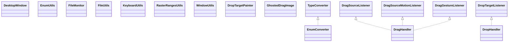

# jna-platform-5.13.0.jar

[Group index](README.md) | [All archives](../README.md)

## Scope and provenance

- **Donor:** `SQX_145_REFERENCE_ROOT/internal/libs/jna-platform-5.13.0.jar`.
- **SHA-256:** `474d7b88f6e97009b6ec1d98c3024dd95c23187c65dabfbc35331bcac3d173dd`; accessed 2026-10-06; captured `2026-10-06T18:54:51.906614+00:00`.
- **Classes:** 1282 raw entries; 1282 unique entry names. Duplicate occurrence indices are zero-based.
- **Inspection:** read-only ZIP hashing and class-file structural parsing; signatures/descriptors, modifiers, hierarchy and references only. Bytecode bodies are hashed, not published.
- **Allocation:** proposed `FEAT-HOST-JNA-PLATFORM`, P01; [roadmap](../../sqx-full-application-roadmap.md). Domain README registration remains required.
- **Repository:** `01067f00031428613c6394064ca1bcadc1ba00ee`; review state unreviewed. Download label 145-dev1; installed build/activation and runtime equivalence unverified.
- **Limit:** every class/member is inventoried; declaration coverage does not establish consumed calls, defaults, formulas, failure semantics or algorithm parity.
- **Archive/resource index:** [060.json](../../../evidence/sqx145/archives/145/060.json).

## Complete member declarations

Member shards contain exact JVM names/descriptors, access flags, generic signatures, throws types, declared fields/methods, superclass/interfaces and referenced class names. All classes, nested/synthetic members and overloads are retained. Code length/hash is structural evidence, not a normalized algorithm comparison.

- [001.json](../../../evidence/sqx145/members/060/001.json) — SHA-256 `3849763a0906499c180d5bf2fc74821c0720d4b5b80bcb5582e9e5aa30017783`.
- [002.json](../../../evidence/sqx145/members/060/002.json) — SHA-256 `7088ff316a88841573b8310b0055c437a8093afb1986003d1b3ef068c609144a`.
- [003.json](../../../evidence/sqx145/members/060/003.json) — SHA-256 `189800aa076c5b87984171b9f1d24c0bb55f985028b8564bd64112eae9a84171`.
- [004.json](../../../evidence/sqx145/members/060/004.json) — SHA-256 `7a63e74f4984d898a34468346a4bdd02688f2f13082f2702305bb311e04bd737`.
- [005.json](../../../evidence/sqx145/members/060/005.json) — SHA-256 `ee038a07ded48fc6f850c4f330e811b2cd22ce6fd4b6b40413961cd7323eaf52`.
- [006.json](../../../evidence/sqx145/members/060/006.json) — SHA-256 `80c8b098eb998cb93fd5967dcaf2fe96268911ffbd52604e80591d87de7675e6`.
- [007.json](../../../evidence/sqx145/members/060/007.json) — SHA-256 `67a77a42a07f235abd1b77a8483a124ae5fb882f2e39bbddbc1a2068a746e26d`.
- [008.json](../../../evidence/sqx145/members/060/008.json) — SHA-256 `2c1fd9a6b57b9b57d719d88dd8ddea5e4d30a3af628feceffb7236ac01daa60a`.
- [009.json](../../../evidence/sqx145/members/060/009.json) — SHA-256 `f74ec1acd47971fb70d28d740f56413d990ee7eeb3ac9bef23cc3bd4eb254a65`.
- [010.json](../../../evidence/sqx145/members/060/010.json) — SHA-256 `686073d868d40e45968787188e5f3c1c9699133b47652b224b3e26fd158c4e31`.
- [011.json](../../../evidence/sqx145/members/060/011.json) — SHA-256 `20c9ead436cbe64457961ce6352c733ded3ba00e96a347f733c386c9cb26b8f2`.
- [012.json](../../../evidence/sqx145/members/060/012.json) — SHA-256 `7617b91a11d25c7dddb1d91b460a0137e557198367213e2454840d8f15100612`.
- [013.json](../../../evidence/sqx145/members/060/013.json) — SHA-256 `493d390e70c8ee0c9a6526006976f7cf1115fd3a72b1d38f424a9512e6f0b0b6`.
- [014.json](../../../evidence/sqx145/members/060/014.json) — SHA-256 `07eb99d763c331cd3d3351ea36171f4c696ada91af1db4ef38eeb12f91417093`.
- [015.json](../../../evidence/sqx145/members/060/015.json) — SHA-256 `c6da0c47556c0d36bb250760afbd59f9138c40f02d93e6520b07e0a1ac274aaf`.
- [016.json](../../../evidence/sqx145/members/060/016.json) — SHA-256 `e5928e9190e1275629fc9d5ebb1ca9c14d407afa23aa1865a75d9e126509969a`.
- [017.json](../../../evidence/sqx145/members/060/017.json) — SHA-256 `382a10d0262da50963f3bb1dfde4f2e53ea3b8c16c87085a69119d69bbb67366`.

## Focused structural diagram

Up to twelve non-nested classes; arrows show declared inheritance/interfaces only. External type names are not evidence of an available body or an executed dependency.

## Class inventory

| Archive entry | Occurrence | Class SHA-256 | Fields | Methods |
| --- | ---: | --- | ---: | ---: |
| `com/sun/jna/platform/DesktopWindow.class` | 0 | `4e183919cf38c6eed875241f539fde62bdec3243159b5d31e49d511588e93cbb` | 4 | 5 |
| `com/sun/jna/platform/EnumConverter.class` | 0 | `bd9ec2e67d99f4357a9a0f0940965298ddac84e3f89313f7103510a7244d2658` | 1 | 6 |
| `com/sun/jna/platform/EnumUtils.class` | 0 | `ae3a3570e0ced21408aeee3b034ce351a3963a54e2ad59e40671eefb81c892ce` | 1 | 5 |
| `com/sun/jna/platform/FileMonitor$FileEvent.class` | 0 | `039b41d7ebfd45a283ca0c153c7198c3c7a0e7a2988e9feb5fc3c81f8db31322` | 3 | 4 |
| `com/sun/jna/platform/FileMonitor$FileListener.class` | 0 | `04c693fc534782dba4418df5fcae4decc77ced9076e250f4711d5fdcd2380112` | 0 | 1 |
| `com/sun/jna/platform/FileMonitor$Holder.class` | 0 | `33a0be4f87ce32de5be529814bf640d1d5145acd076bb177de502313a0e87337` | 1 | 2 |
| `com/sun/jna/platform/FileMonitor.class` | 0 | `7d72160df8af1b4f709935d0b87cd4e44b84a2a781803d977507e40d94f13a04` | 13 | 13 |
| `com/sun/jna/platform/FileUtils$1.class` | 0 | `a99e2e7c17f7eb3e011b219dbf66db1083872199504763af4085e8863b1b4f45` | 0 | 0 |
| `com/sun/jna/platform/FileUtils$DefaultFileUtils.class` | 0 | `1a399cf8bce7204724e7c443790a7c2a71fef1df8b7bf7841d1fd03658f30398` | 0 | 5 |
| `com/sun/jna/platform/FileUtils$Holder.class` | 0 | `68aca2c14751439b514949c636b68103e5b7994b91d5b8af14981b16b00020a8` | 1 | 2 |
| `com/sun/jna/platform/FileUtils.class` | 0 | `b607359f07cbe4e46081c369f40a4f71b6f940624fd23c3eff48f24413aa3cd1` | 0 | 4 |
| `com/sun/jna/platform/KeyboardUtils$1.class` | 0 | `5462abb95c3b8e298dc44381ddc99ebff518738fb9d3c33da26deea246ce0678` | 0 | 0 |
| `com/sun/jna/platform/KeyboardUtils$MacKeyboardUtils.class` | 0 | `68c86f81862f0a148c275c900e83a9241f8b161b5b52e5dc6f37d5c644e08635` | 0 | 3 |
| `com/sun/jna/platform/KeyboardUtils$NativeKeyboardUtils.class` | 0 | `f768a57ac1acc88172175216efb743cea127ccaad0ddc8070efadade5ff4491c` | 0 | 4 |
| `com/sun/jna/platform/KeyboardUtils$W32KeyboardUtils.class` | 0 | `cd753767cc8fe1e9143f2cedf7a5b5ee8c32e9258f583a648f7e6cc1b5681a5b` | 0 | 4 |
| `com/sun/jna/platform/KeyboardUtils$X11KeyboardUtils.class` | 0 | `30e9bf8458abb2933ed49a5973aa49748b30e1592d4e1c7d3884c051f1e31e34` | 0 | 4 |
| `com/sun/jna/platform/KeyboardUtils.class` | 0 | `4ac4b692fcad9a5a3838cee9b6bf1d4c0df8ef06e942154b6f5ac1ccf1538bc5` | 1 | 4 |
| `com/sun/jna/platform/RasterRangesUtils$1.class` | 0 | `90f1ba4c77ac4000a99c95862f6ebacb77a001cca31acd917752c776ba363ced` | 0 | 2 |
| `com/sun/jna/platform/RasterRangesUtils$RangesOutput.class` | 0 | `44c10203b5170be6e4c05f1eeab8de23d80ea5f9b5034805d2a5819a545330e8` | 0 | 1 |
| `com/sun/jna/platform/RasterRangesUtils.class` | 0 | `71bb82647c4967e67c107fef500e4bff5246cc003ec33190e8621b31b34eb873` | 2 | 6 |
| `com/sun/jna/platform/WindowUtils$1.class` | 0 | `342e24716385977fbc86ccde3f6f207adbeed58ded923eee9ca290c01e57129e` | 0 | 0 |
| `com/sun/jna/platform/WindowUtils$HeavyweightForcer.class` | 0 | `312f5050572f6a7c6720f17d04ec112be30a7d886ec8e4fe34baa0491e397179` | 2 | 3 |
| `com/sun/jna/platform/WindowUtils$Holder.class` | 0 | `6d1c1c614f283d0453f1cb77f4335aeb938e89025275d05974184715ecbc8fea` | 2 | 2 |
| `com/sun/jna/platform/WindowUtils$MacWindowUtils$1.class` | 0 | `fa53ed7d7375edf095908ca8d15449a18553558c2f93f50b0d640f6d09048f10` | 3 | 2 |
| `com/sun/jna/platform/WindowUtils$MacWindowUtils$OSXMaskingContentPane.class` | 0 | `b538afd79ce7a994dca8d204fce097670e7b61cb87ff4ff7f5eef2871eba3824` | 2 | 3 |
| `com/sun/jna/platform/WindowUtils$MacWindowUtils.class` | 0 | `c4f85815a274c662e0e391dfa3a517b872728d02eae504ce648b57006b1d39af` | 1 | 10 |
| `com/sun/jna/platform/WindowUtils$NativeWindowUtils$1.class` | 0 | `60101c0a886ed8e8e5bab9f79a66ec9ef96a42c073106a2bc163485890cfe105` | 2 | 3 |
| `com/sun/jna/platform/WindowUtils$NativeWindowUtils$2.class` | 0 | `b08dc1f8ac717ac6f1d6fe3ec12419b3465a8358ab16fec44f83e566afd2d325` | 2 | 2 |
| `com/sun/jna/platform/WindowUtils$NativeWindowUtils$3.class` | 0 | `09ca11641fb9f8cf4f9d0a3d091c4675aecf894b33df31d18acb977e658bbc64` | 2 | 2 |
| `com/sun/jna/platform/WindowUtils$NativeWindowUtils$TransparentContentPane.class` | 0 | `129202f3958eb50f0b10fe4d0539d7ee72eab0f9d7fa3513b948902998b8d282` | 3 | 7 |
| `com/sun/jna/platform/WindowUtils$NativeWindowUtils.class` | 0 | `be455803f96fc500e914714ef9e2eefe27cfc1f5b34999c9f1fd44b18cb85d8c` | 0 | 23 |
| `com/sun/jna/platform/WindowUtils$RepaintTrigger$Listener.class` | 0 | `c0685c5b3b217123ee2937fbefeafabaf7a3bc8c98c08d3c4c2cb5ab1eac67fe` | 1 | 8 |
| `com/sun/jna/platform/WindowUtils$RepaintTrigger.class` | 0 | `f14faaa0374d02399fb4da36d4042d9f56ef9c721899d540853a3ce930de77c5` | 4 | 6 |
| `com/sun/jna/platform/WindowUtils$W32WindowUtils$1.class` | 0 | `316e2a81682073c9811cb8e0f3560994e7044f212376259c335f48e2d8f9c0db` | 3 | 2 |
| `com/sun/jna/platform/WindowUtils$W32WindowUtils$2.class` | 0 | `4d22d54845a98b03fb657d3889d0bfa603e293b9baa3c21efad21133e7b891c3` | 3 | 2 |
| `com/sun/jna/platform/WindowUtils$W32WindowUtils$3.class` | 0 | `52adbdc150f6339d4950132c0c9048b658c8facdaecfcc33e702ddc6f8eb6b00` | 3 | 2 |
| `com/sun/jna/platform/WindowUtils$W32WindowUtils$4.class` | 0 | `ab73671f34f9cdafccd2f9c368504a4cd301a127861830c78d7fbf22ca437960` | 3 | 2 |
| `com/sun/jna/platform/WindowUtils$W32WindowUtils$5.class` | 0 | `385da9eb8c6b8b73288e2d321ed8aaf5f36686acba2e4bb23173d8394ab2cdc3` | 3 | 2 |
| `com/sun/jna/platform/WindowUtils$W32WindowUtils$W32TransparentContentPane.class` | 0 | `3dbe0bc984a0ec00c4fccf6b867a798af6bb4272945032703feb7cca0ea9dc56` | 6 | 5 |
| `com/sun/jna/platform/WindowUtils$W32WindowUtils.class` | 0 | `50d8013b09ca85832b395c1f427b34ee06347baa19ee7efcc7d7f44bd3407218` | 0 | 23 |
| `com/sun/jna/platform/WindowUtils$X11WindowUtils$1.class` | 0 | `7ddcab0122d56072262c5d2bf7726701c60bf4ae3dee149202f45a59a61ea5f2` | 1 | 2 |
| `com/sun/jna/platform/WindowUtils$X11WindowUtils$2.class` | 0 | `ad913f0e0002175f5a70879033724fe01e37c2a94db8f79d81866948d3bde8af` | 3 | 2 |
| `com/sun/jna/platform/WindowUtils$X11WindowUtils$3.class` | 0 | `7c2b88616c63253f4f67318061a2eb554f5e12b9ffc2c9e46f03223e6e5bba14` | 3 | 2 |
| `com/sun/jna/platform/WindowUtils$X11WindowUtils$4.class` | 0 | `92ab3df711fb2fdd9ff6651c3eb436d7e2a736f2bbed5d4f69b0535b5856f571` | 3 | 2 |
| `com/sun/jna/platform/WindowUtils$X11WindowUtils$5.class` | 0 | `62d73d02b4da62014a9b9aac74d31ccf176d79d2d30f41cab00c80724fda7973` | 2 | 2 |
| `com/sun/jna/platform/WindowUtils$X11WindowUtils$PixmapSource.class` | 0 | `a66da0df1f9bf10bbb1ef15fa9a37fc5cbe407b102cab6edc763f54d6a78790d` | 0 | 1 |
| `com/sun/jna/platform/WindowUtils$X11WindowUtils$X11TransparentContentPane.class` | 0 | `912168681e9eaef5d4d276580512f76a1df9bce2310860df01a5a7ae263e44ef` | 5 | 2 |
| `com/sun/jna/platform/WindowUtils$X11WindowUtils.class` | 0 | `2a36fcf2377a70af46339778aacce9720f1e865cb57c2688488d4820e35d62d8` | 4 | 16 |
| `com/sun/jna/platform/WindowUtils.class` | 0 | `cfbe41f902af716daf51bc628edd3ff8ba0a5a67b6340dbedcf28bf65d2f28f2` | 5 | 17 |
| `com/sun/jna/platform/dnd/DragHandler.class` | 0 | `32ffd41baf91f738dd718126c7fdfbd902a0f659b23d20d1afc2175bd5b7af56` | 25 | 28 |
| `com/sun/jna/platform/dnd/DropHandler.class` | 0 | `c014735fccbc8489e22da281b49ccb5a674205e55c4d421d222fa4c061cb8f84` | 7 | 22 |
| `com/sun/jna/platform/dnd/DropTargetPainter.class` | 0 | `b8b3fe7b78eb070c8f99329a9d0303479c9170e72279918176fa3c1ce6858054` | 0 | 1 |
| `com/sun/jna/platform/dnd/GhostedDragImage$1.class` | 0 | `87f1e0afbba2931e90c79e609b2d5306373aa6d69b7c2b671920dd75c90ada48` | 3 | 5 |
| `com/sun/jna/platform/dnd/GhostedDragImage$2.class` | 0 | `83e2192a4ef7fabd88fbbdf3e5b6fca4140f111a6dcf7e0bec05ec3dab5ea31f` | 3 | 4 |
| `com/sun/jna/platform/dnd/GhostedDragImage$3.class` | 0 | `e3edc449005250a488064fbad722c0afc024b0d598d7814bedd6196205911396` | 2 | 2 |
| `com/sun/jna/platform/dnd/GhostedDragImage.class` | 0 | `8acc11307f12fb2fb13442941277971bbc34a86ae332719e29da1da5e6b51259` | 4 | 7 |
| `com/sun/jna/platform/linux/ErrNo.class` | 0 | `b7dde768e87e72245cd36e2090e89909eefd9ceea58852a72f751d7ef96d5008` | 129 | 0 |
| `com/sun/jna/platform/linux/Fcntl.class` | 0 | `ae4b654b2fe2799fd1d96cefdcc6d14ec13a334ad43682dd2b5cb62d6a4a131c` | 21 | 0 |
| `com/sun/jna/platform/linux/LibC$Statvfs.class` | 0 | `3f38c7fea81b2e9999e315c129623be037ac3db522defbcd1275306ec839d98c` | 13 | 3 |
| `com/sun/jna/platform/linux/LibC$Sysinfo.class` | 0 | `3e46c52bcc963b419b5bc7772289277b9edb4a9f7e9463d72ca43df80abddbd2` | 14 | 4 |
| `com/sun/jna/platform/linux/LibC.class` | 0 | `c080e74d2cdaac9b6a1328caa56e43d840f51ded3528550584b5d0c4241fe0ee` | 2 | 3 |
| `com/sun/jna/platform/linux/LibRT.class` | 0 | `9568c8eb062d3c07b36c363d9a0122bc0fc9601fc4c7e227c113fac5106b69db` | 1 | 3 |
| `com/sun/jna/platform/linux/Mman.class` | 0 | `c36d9292564dfcf89672107f070a364091211452a2f94f0f3a466de77d423530` | 30 | 1 |
| `com/sun/jna/platform/linux/Udev$UdevContext.class` | 0 | `e97e296bbe2d0767901a96064929fcbb571654796b7e33f11fb056a587bd8127` | 0 | 5 |
| `com/sun/jna/platform/linux/Udev$UdevDevice.class` | 0 | `c8c66665262cc464671b0380ca2ebdd4161d908651026ee18ba0acf313e11c78` | 0 | 12 |
| `com/sun/jna/platform/linux/Udev$UdevEnumerate.class` | 0 | `3eaa902b0ed6dcca621c785df26363ba70f9817f2954dd7300b499d6b4c15e35` | 0 | 6 |
| `com/sun/jna/platform/linux/Udev$UdevListEntry.class` | 0 | `c915f02824682255cdfc3b2a4cfe3099a05dd20b820b65cec8a2d21997c4cd95` | 0 | 3 |
| `com/sun/jna/platform/linux/Udev.class` | 0 | `3765aad8e89018e62a93c04e68b839a5773eeaaeba8d94c50add45a100132d06` | 1 | 24 |
| `com/sun/jna/platform/linux/XAttr$size_t.class` | 0 | `66871e5f25645a39a3e520d6a28bde96b1b3dbecfd150f90ae01fcb639887852` | 2 | 3 |
| `com/sun/jna/platform/linux/XAttr$ssize_t.class` | 0 | `2c2c050b82c64acd6066a9ec84beb8135e4e031ecb3817a7e75b6995f8b320f1` | 2 | 3 |
| `com/sun/jna/platform/linux/XAttr.class` | 0 | `914ae9dfb5baa699b6d7c6e46ed97a182150d1304788575579a7cfffcb541409` | 12 | 22 |
| `com/sun/jna/platform/linux/XAttrUtil.class` | 0 | `87b1c4a820a9476ccfe1a852bfb0114d475d625c9c40738b8c51bd67fcfc79fc` | 0 | 32 |
| `com/sun/jna/platform/mac/Carbon$EventHandlerProcPtr.class` | 0 | `36cc62347ae0fa4eae0ed9869e770d687cbc4c9f20f6e85ac6aec00985953274` | 0 | 1 |
| `com/sun/jna/platform/mac/Carbon$EventHotKeyID$ByValue.class` | 0 | `863ae93ceb61214e13be894ec449a13c7e70df7f77e76ded7273d40677459b90` | 0 | 1 |
| `com/sun/jna/platform/mac/Carbon$EventHotKeyID.class` | 0 | `e49d86f50acc6cd419fb9b5ec80faacd57ac8e279fd9171eb58f5d67fb739a11` | 2 | 1 |
| `com/sun/jna/platform/mac/Carbon$EventTypeSpec.class` | 0 | `9c82de59e3cf07db9ce31a01f3be97caf39f1ef3a7c0ddb48749368483418fd2` | 2 | 1 |
| `com/sun/jna/platform/mac/Carbon.class` | 0 | `fded2ac1faf69b1008f9e835791324c200c2fe3db5cab10f8383645d2e6a4416` | 5 | 7 |
| `com/sun/jna/platform/mac/CoreFoundation$CFAllocatorRef.class` | 0 | `845298b8eb684c78c2ac5cadcf1c9a04a06465652d651df1c9fee990b8bfb664` | 0 | 1 |
| `com/sun/jna/platform/mac/CoreFoundation$CFArrayRef.class` | 0 | `8b4c37fc7196e084d03d491df741e9c7c5771687a1938910eb00f17ff50eb088` | 0 | 4 |
| `com/sun/jna/platform/mac/CoreFoundation$CFBooleanRef.class` | 0 | `f8ca69791d0da7f42f83f3c775b24187f95790ad406ee7b66b6a10deaf7c3ad2` | 0 | 3 |
| `com/sun/jna/platform/mac/CoreFoundation$CFDataRef.class` | 0 | `e64a65a7893234d62e5b75d12d481bbf421ca392c7ea9490ff9e87d52d039de1` | 0 | 4 |
| `com/sun/jna/platform/mac/CoreFoundation$CFDictionaryRef$ByReference.class` | 0 | `bac04835fda7565b7dcc81c4740a4c03e3cdfc52f7376154fe4ea144be49d506` | 0 | 4 |
| `com/sun/jna/platform/mac/CoreFoundation$CFDictionaryRef.class` | 0 | `4c187ea2b563360c6d5047543ef2542d8ea175c58fa26fe0f8669ca484d55aef` | 0 | 5 |
| `com/sun/jna/platform/mac/CoreFoundation$CFIndex.class` | 0 | `930a8cd578f976decca2a281b0c863eef7ac1941da75570c8a19d99a250fe83e` | 1 | 2 |
| `com/sun/jna/platform/mac/CoreFoundation$CFMutableDictionaryRef.class` | 0 | `c7437956071862742c58f85d56fcade9edd38622e251c5b2ae9fda9817dccb1c` | 0 | 3 |
| `com/sun/jna/platform/mac/CoreFoundation$CFNumberRef.class` | 0 | `62829c02a0a8a4c8d271c8b4fddc1125cc8d6a17bfebae1288e7b99f8346b3a4` | 0 | 8 |
| `com/sun/jna/platform/mac/CoreFoundation$CFNumberType.class` | 0 | `95720aaaff5bdefa69fca396e7d1df847dc6484f0db2e17877fa57290d2276d6` | 19 | 5 |
| `com/sun/jna/platform/mac/CoreFoundation$CFStringRef$ByReference.class` | 0 | `87b8ae58f69b1235e1e41173631468ecad3e750ea5b186db07cecca1cb1a615c` | 0 | 4 |
| `com/sun/jna/platform/mac/CoreFoundation$CFStringRef.class` | 0 | `b0fc95239fe1c366bcfadf978b0b4cf76f09155fe2449750f862c691b3ee59fd` | 0 | 4 |
| `com/sun/jna/platform/mac/CoreFoundation$CFTypeID.class` | 0 | `a6962b6007431136e98e57e3bd86d988353be7ba07bd111e9f3bfbcbf4042527` | 1 | 3 |
| `com/sun/jna/platform/mac/CoreFoundation$CFTypeRef.class` | 0 | `6e9c897adcaf11baade4573bb9563c763d3f67590f38adf9b4567e59fffd1c7c` | 0 | 6 |
| `com/sun/jna/platform/mac/CoreFoundation.class` | 0 | `56e0f6b1f417bc53b63012bed5fbe13c6cfeeacf23f2d0dac008d52e8724a5d1` | 11 | 35 |
| `com/sun/jna/platform/mac/DiskArbitration$DADiskRef.class` | 0 | `ad18036e44fcac60480b79e3c420674c59aac97786c4b3669746457149cfbd7d` | 0 | 1 |
| `com/sun/jna/platform/mac/DiskArbitration$DASessionRef.class` | 0 | `c1b0ed6bfe525caca607401db7ac79f17957f14fee3fb56ef58db7aefec1a016` | 0 | 1 |
| `com/sun/jna/platform/mac/DiskArbitration.class` | 0 | `9b6c3236b4a0714d68158da039da32c728b6b8a1fccf7d6874e53e75f33427d7` | 1 | 6 |
| `com/sun/jna/platform/mac/IOKit$IOConnect.class` | 0 | `19b48ee949884ac33c40fe7d608fc0c1f2b2bb7185c7e25e53ecf48ad3bcf880` | 0 | 2 |
| `com/sun/jna/platform/mac/IOKit$IOIterator.class` | 0 | `97eed902a5d716b7a35422136f7b0aa8671d10123278a6345e15f898de6ff090` | 0 | 3 |
| `com/sun/jna/platform/mac/IOKit$IOObject.class` | 0 | `b7b2207eb911bc18d7f80e0f08d06de4f1358020b9b105500cef00e881ae88ee` | 0 | 4 |
| `com/sun/jna/platform/mac/IOKit$IORegistryEntry.class` | 0 | `aa57208e14893e8d5eb6f649f1f846612826ab069834cf95184ec7aee92c30e2` | 0 | 16 |
| `com/sun/jna/platform/mac/IOKit$IOService.class` | 0 | `8b5826c164020d4abe18fa3a3b6f0f7ad5adad018dbb43825db20fad09daa951` | 0 | 2 |
| `com/sun/jna/platform/mac/IOKit.class` | 0 | `9a632cc1eca34ec6a850f88f2199933c8c61dc9b0c2c54dbc38ae441be83b2fb` | 6 | 26 |
| `com/sun/jna/platform/mac/IOKitUtil.class` | 0 | `f548dd56f4dbc0a0a1d1497145047ab27bc8062189d67bf26ba361f1dd244c2d` | 2 | 9 |
| `com/sun/jna/platform/mac/IOReturnException.class` | 0 | `69720debb2cb4cb63ed9b9884bfe31f269a1e78534e8bd6fc79dbefbf4955cda` | 2 | 7 |
| `com/sun/jna/platform/mac/MacFileUtils$FileManager$FSRef.class` | 0 | `54cb149a6db9cf915da481c784dae7767d79312377823e4da4767fbfc4b68236` | 1 | 1 |
| `com/sun/jna/platform/mac/MacFileUtils$FileManager.class` | 0 | `28299feb079508aa8822018055b8b7cf14df85f6842e9236b9b881204209d540` | 8 | 6 |
| `com/sun/jna/platform/mac/MacFileUtils.class` | 0 | `ed04b966d1682af0c72b3dbb0482c65c90709562e702e3eb56ad5cdf8a7e3cfb` | 0 | 3 |
| `com/sun/jna/platform/mac/SystemB$Group.class` | 0 | `6ae7b95cc7d1b4d5b3be6b047d4d731f49d6e6bb4581c4630b547130799640c9` | 4 | 1 |
| `com/sun/jna/platform/mac/SystemB$HostCpuLoadInfo.class` | 0 | `257ef9cc8b4a7b85755d4547ba69db88f6a23d0a356e86ec170cc54d2f1c2f25` | 1 | 1 |
| `com/sun/jna/platform/mac/SystemB$HostLoadInfo.class` | 0 | `9a3697a781d7379c97f5581b640e2b24916acd39fe146d7d3a71779ff2932411` | 2 | 1 |
| `com/sun/jna/platform/mac/SystemB$IFdata.class` | 0 | `599a22552bdb4f34882ecbfbebb74c3a714f503e82e646d749495556554b8e41` | 29 | 1 |
| `com/sun/jna/platform/mac/SystemB$IFdata64.class` | 0 | `a4e7e92c2fbd590f3409175cb288d355429b71f94c11ceec3deb8f03263e0cb6` | 25 | 1 |
| `com/sun/jna/platform/mac/SystemB$IFmsgHdr.class` | 0 | `93553ec4995904aebe337d30f63fcab32c83d8c8457710d41631b5fb2dd5abf3` | 7 | 2 |
| `com/sun/jna/platform/mac/SystemB$IFmsgHdr2.class` | 0 | `75f4a6dfcdcf4221ca26f199554804b855cceb352b60c0c6c56ab4c9f461e099` | 11 | 1 |
| `com/sun/jna/platform/mac/SystemB$Passwd.class` | 0 | `3860fe73d7fd0d1e7eaf212f6ba64a88e513586ff8f4741d5cf0610da8bb4205` | 11 | 1 |
| `com/sun/jna/platform/mac/SystemB$ProcBsdInfo.class` | 0 | `5fdd451bf731b5c9596d5a1a8c1198c94add3d1ab63b06a000cf8023e3ff1339` | 22 | 1 |
| `com/sun/jna/platform/mac/SystemB$ProcTaskAllInfo.class` | 0 | `b91bf04b2778f6b9a733f798685dacf02ab1ae5226729f532666a6ab5d99be7b` | 2 | 1 |
| `com/sun/jna/platform/mac/SystemB$ProcTaskInfo.class` | 0 | `f3d169ad97f2da3822fe53d43ee6a0b530e9eb7e0a1a9c69e4cf6979faad7e51` | 18 | 1 |
| `com/sun/jna/platform/mac/SystemB$RUsageInfoV2.class` | 0 | `2ca44d5e1ffed9d174ebb497f9ad32e68b8869f4775ee8ccf6895ae167e7be2f` | 19 | 1 |
| `com/sun/jna/platform/mac/SystemB$Statfs.class` | 0 | `f8b84155e393911618c240c2cc5d7d1044f1dbb5afd65d4af04cc5b2907b95f6` | 16 | 1 |
| `com/sun/jna/platform/mac/SystemB$Timeval.class` | 0 | `8316039c9198beae65f857b713a4c7ce63919d231b9219df26197689f13cd0a0` | 2 | 1 |
| `com/sun/jna/platform/mac/SystemB$Timezone.class` | 0 | `508feaf7deb7d8451a35945e5e18162f2d74144c231daed1e38ac6fbddad7397` | 2 | 1 |
| `com/sun/jna/platform/mac/SystemB$VMMeter.class` | 0 | `34617f3014cb759f8ed023746f5144c2253a0cdcc98e8f4f7dbc01170e835971` | 35 | 1 |
| `com/sun/jna/platform/mac/SystemB$VMStatistics.class` | 0 | `ae29081cf87641b534357789261f7997e151be32d88e0cd9f4662b827ecdde11` | 15 | 1 |
| `com/sun/jna/platform/mac/SystemB$VMStatistics64.class` | 0 | `3deeac186664cb3d1b2a356990b67d6a36bc1b06969bc32fcb1d64e02d222a63` | 24 | 1 |
| `com/sun/jna/platform/mac/SystemB$VnodeInfoPath.class` | 0 | `7e82bca46f7baef68463022753ef5af84f3d94582d2fe3a492b3f3a3eebb9497` | 2 | 1 |
| `com/sun/jna/platform/mac/SystemB$VnodePathInfo.class` | 0 | `83faa9ef6a71df09bc6d7396cf325cf50c00c2b5c67db73188af2fef66a19ce3` | 2 | 1 |
| `com/sun/jna/platform/mac/SystemB$XswUsage.class` | 0 | `0e52554de0ecc59013fcb49bce7d22c2025c4e2d8d2375e737e46b3c8bb0574f` | 5 | 1 |
| `com/sun/jna/platform/mac/SystemB.class` | 0 | `dff10e10031b974dbf525f18a43b69be53a32285fbeabb7ebbdf452e93ab1c2d` | 28 | 23 |
| `com/sun/jna/platform/mac/XAttr.class` | 0 | `cd3ad6e266097d21f0ce6427930b2d3885037d5066438ff213a3cd7f563aa546` | 10 | 5 |
| `com/sun/jna/platform/mac/XAttrUtil.class` | 0 | `2c38948a49638b450929adbb4f0726a0ca6ddaf559e502d331aec825db59a0a7` | 0 | 8 |
| `com/sun/jna/platform/unix/LibC.class` | 0 | `3d78bcd01aa641ac7e9943809712e1ab3c326c0b880b5e6ab5867ac51c88910d` | 2 | 1 |
| `com/sun/jna/platform/unix/LibCAPI$size_t$ByReference.class` | 0 | `e77087c935bfcf1582dfaa4597a16e83b5f04b31c45b88dc21aa870dffb2b98c` | 0 | 7 |
| `com/sun/jna/platform/unix/LibCAPI$size_t.class` | 0 | `d689ce02f848f1855113d127dd3a303be3d16be98e208f8a5a183a1a95928716` | 2 | 3 |
| `com/sun/jna/platform/unix/LibCAPI$ssize_t.class` | 0 | `45b7e38167c1b9b328b34a50612e5fe0bca2570994728ecb14726851ab477f66` | 2 | 3 |
| `com/sun/jna/platform/unix/LibCAPI.class` | 0 | `be175e438412418e7efc954dcf684a611297c44252b62a11c65cbde5ccc471b9` | 1 | 19 |
| `com/sun/jna/platform/unix/LibCUtil.class` | 0 | `13e6ff5257b720244beff7ebd140d05508307ef8ec2af9adfcddd8f2dd2a4f01` | 5 | 5 |
| `com/sun/jna/platform/unix/Reboot.class` | 0 | `80b338930da8a9c4be2b8e7da281f476f8b183022816184e4a767f37d8595915` | 7 | 1 |
| `com/sun/jna/platform/unix/Resource$Rlimit.class` | 0 | `ae95b59a85c2a89c62e8d44374abddff97ac39e22a27957495dbd21e4bfc6e87` | 2 | 1 |
| `com/sun/jna/platform/unix/Resource.class` | 0 | `5dee127a37db9fc97d0bc1efc51f1d7efe019c9da1031b7595d82facd4dcce52` | 17 | 2 |
| `com/sun/jna/platform/unix/X11$Atom.class` | 0 | `49ca8d6eaed9c16365ba7b87fe7289b8ea6d2e9ddb9d4dea530b12f3b52a4f29` | 2 | 4 |
| `com/sun/jna/platform/unix/X11$AtomByReference.class` | 0 | `9488959ed82329e868ed116e70f203ca56b8952946679708d431074930282e6a` | 0 | 2 |
| `com/sun/jna/platform/unix/X11$Colormap.class` | 0 | `c4aa5d52375ae79cb94521123e7c97eb0eb7a987e62483fa77ed9d7215989a26` | 2 | 4 |
| `com/sun/jna/platform/unix/X11$Cursor.class` | 0 | `88ced403d4f0b388e4f32868b01c9a2fa0ffbd4c27ae48f776af74a10430d48d` | 2 | 4 |
| `com/sun/jna/platform/unix/X11$Display.class` | 0 | `cedd151072d8155c5a0156de8269df48600a4c9a02fa3597b30aaa1b60a60613` | 0 | 1 |
| `com/sun/jna/platform/unix/X11$Drawable.class` | 0 | `6f9ac649215059df6d25228f08ceb501643595bedadf7d2d9d5cf63eec1ce47e` | 2 | 4 |
| `com/sun/jna/platform/unix/X11$Font.class` | 0 | `5cf436941ec04f65641cd6ba0aee0d589f865545fae5912fb6d8642c8222bddc` | 2 | 4 |
| `com/sun/jna/platform/unix/X11$GC.class` | 0 | `e3d42be4aa6e645b99f2029db9ac7aa55b031395d753788bd00cbdbec85d3dab` | 0 | 1 |
| `com/sun/jna/platform/unix/X11$KeySym.class` | 0 | `a82b668856734aa4067b3a6ec09a9027aa637aeaad236194510a12a0a6863f93` | 2 | 4 |
| `com/sun/jna/platform/unix/X11$Pixmap.class` | 0 | `dfda3519ccbb9cb5391c4c8f05816beeff6190937d7a31cd305cfa51e0bb3afb` | 2 | 4 |
| `com/sun/jna/platform/unix/X11$Screen.class` | 0 | `db2bf8e36d7afb7a5d72bd517aa9a8f2929a370eab769eeabcf9c1fa099e846f` | 0 | 1 |
| `com/sun/jna/platform/unix/X11$Visual.class` | 0 | `cee0a1104ec61dbd26f3b62db890b731128bd21e0e77d573fafa3921bdb3295c` | 0 | 3 |
| `com/sun/jna/platform/unix/X11$VisualID.class` | 0 | `e32ff59b7463cd624af155b4be8a20062478b08592a4ea4e626b4da686ffdf86` | 2 | 5 |
| `com/sun/jna/platform/unix/X11$Window.class` | 0 | `a985d7e598d5ec59ebacce173f317f1d58dfbc78f87d37d764c15516930f67d9` | 2 | 4 |
| `com/sun/jna/platform/unix/X11$WindowByReference.class` | 0 | `bb6fca96912a42a64a059b083ec94a818b9264e00c312b4ee939bfe21036b2c6` | 0 | 2 |
| `com/sun/jna/platform/unix/X11$XAnyEvent.class` | 0 | `88b223d6900f976d107d1082e3a4466552d045730b0a3f17c718441ffca461f0` | 5 | 1 |
| `com/sun/jna/platform/unix/X11$XButtonEvent.class` | 0 | `6f29637232e1b00d23858eabd9f191c7c9eb42a9f1a471e2746496f772024c6d` | 15 | 1 |
| `com/sun/jna/platform/unix/X11$XButtonPressedEvent.class` | 0 | `027579c73dea20462c939a5fb5a1bb010dc80a71a16869f98c008727d808cffe` | 0 | 1 |
| `com/sun/jna/platform/unix/X11$XButtonReleasedEvent.class` | 0 | `92b4b7d05862dd37b1b62f9303a331a8c10f6401efc7b30b19148305dff93dfb` | 0 | 1 |
| `com/sun/jna/platform/unix/X11$XCirculateEvent.class` | 0 | `bc16b81f9ef3ea0750d258d605e9d7261159e85bd891668cf59013a7fc06c4c8` | 7 | 1 |
| `com/sun/jna/platform/unix/X11$XCirculateRequestEvent.class` | 0 | `9032d8d2a53b2e6beae9117791f8a21f1f7de0b298036d367dce7883202c21fb` | 7 | 1 |
| `com/sun/jna/platform/unix/X11$XClientMessageEvent$Data.class` | 0 | `124adf6d663eb1f6afd45f6d9744906a804f5e715f3f2d366fe1b1b6e403283d` | 3 | 1 |
| `com/sun/jna/platform/unix/X11$XClientMessageEvent.class` | 0 | `d5837cbe2169a76d5fa1a2ef94941135bb05b472ee6331836f85eea9050c6478` | 8 | 1 |
| `com/sun/jna/platform/unix/X11$XColormapEvent.class` | 0 | `e3e29a3ba70ad6345dfa8e0eaf1ffe2e76132923c5283f3a1387e4c39d5296ad` | 8 | 1 |
| `com/sun/jna/platform/unix/X11$XConfigureEvent.class` | 0 | `b00a22135479cfb0b9fabc43a42d03741454593a89ae8868e6b2c863e95f1875` | 13 | 1 |
| `com/sun/jna/platform/unix/X11$XConfigureRequestEvent.class` | 0 | `5f8c827926cfa898fd50a65760d2d3e7f8c5a4bc833eff562ef780923117c044` | 14 | 1 |
| `com/sun/jna/platform/unix/X11$XCreateWindowEvent.class` | 0 | `60fed9325b3bb58d7b41a82260c50723453e4e43984b38868ccd993918412a11` | 12 | 1 |
| `com/sun/jna/platform/unix/X11$XCrossingEvent.class` | 0 | `cb4696f545e5eb5a2934c7f1a71c95f277a6b850e353a2adfdd1580d1f76d7a6` | 17 | 1 |
| `com/sun/jna/platform/unix/X11$XDestroyWindowEvent.class` | 0 | `d05b55a7ff336bdf98c3e6d4e208c5321bc7cb008266cadac7ce5dcf292a87c3` | 6 | 1 |
| `com/sun/jna/platform/unix/X11$XDeviceByReference.class` | 0 | `751c13882952fedd1b94be953a91d28ad7d10c4bfd5d56578ce0810c6020eab9` | 3 | 1 |
| `com/sun/jna/platform/unix/X11$XEnterWindowEvent.class` | 0 | `e8d42b2510ba716f4e17c1439ff958012c580c6ee9e79f2d2cdd3402e3ef857b` | 0 | 1 |
| `com/sun/jna/platform/unix/X11$XErrorEvent.class` | 0 | `87707107dbb6c4fa8434cf6bf8620d650a9652f37f59b4e57a8134547a69df6e` | 7 | 1 |
| `com/sun/jna/platform/unix/X11$XErrorHandler.class` | 0 | `d4f244d0263d91771c2c401fb453ba2030484eb3fa8d58939205f3038c712292` | 0 | 1 |
| `com/sun/jna/platform/unix/X11$XEvent.class` | 0 | `dd2c4d32d3a8c3f9546ea57b3ae87401ffddbfa4408ab950c5681f163472c806` | 35 | 1 |
| `com/sun/jna/platform/unix/X11$XExposeEvent.class` | 0 | `7491d19d7fefadf467914ff81abe8630f94d11ddf695a88843a17d573342dd57` | 10 | 1 |
| `com/sun/jna/platform/unix/X11$XFocusChangeEvent.class` | 0 | `8f1d4a489e21cb406ae137d35c77f95df9aa86509db965bc1dbcdff24b2623e6` | 7 | 1 |
| `com/sun/jna/platform/unix/X11$XFocusInEvent.class` | 0 | `d45cba94eb29b74e0789c017dde32cbcdc1c7d378a6d50fe7d2f2d0267fe1f2a` | 0 | 1 |
| `com/sun/jna/platform/unix/X11$XFocusOutEvent.class` | 0 | `dd0a26afff07c325c88241a78c7da5fcc15bb0b55ba79bde4f624e2c86278c57` | 0 | 1 |
| `com/sun/jna/platform/unix/X11$XGCValues.class` | 0 | `23d42882e7b62f0eb135f87b9849503e8e99e5cd8ce81625cc158660bd5ee151` | 23 | 1 |
| `com/sun/jna/platform/unix/X11$XGenericEvent.class` | 0 | `3cbf8717269cecb080d1ea15401055192866956ca967424d2f30731574c41330` | 6 | 1 |
| `com/sun/jna/platform/unix/X11$XGenericEventCookie.class` | 0 | `eb26d5bbaaffbb384b8cceb9ee8b18e2f89f63d47c0729952b23296532b704c4` | 8 | 1 |
| `com/sun/jna/platform/unix/X11$XGraphicsExposeEvent.class` | 0 | `2bb550c5eddf5133081df7389d6f6022aad0212a8b143eef0087317dc2e18ee4` | 12 | 1 |
| `com/sun/jna/platform/unix/X11$XGravityEvent.class` | 0 | `50ea8cc3f0663fb05e29bc1abfefe9b2c71f4e7a64085d925352a99f212239a6` | 8 | 1 |
| `com/sun/jna/platform/unix/X11$XID.class` | 0 | `0d6b150d6876db61a2022e37415e4e9fa4a141e7fb783c9617640d514153c32d` | 2 | 6 |
| `com/sun/jna/platform/unix/X11$XImage.class` | 0 | `3c97ddb3172f19fa845004a371fa773b3fd6306aa83e5b148ffc1e904c264c73` | 0 | 1 |
| `com/sun/jna/platform/unix/X11$XInputClassInfoByReference.class` | 0 | `c0e06c61754d8e77a6be59b60ca4b2c94a98b2127bad1d82f9689620160ab466` | 2 | 1 |
| `com/sun/jna/platform/unix/X11$XKeyEvent.class` | 0 | `712be8fd8dc00c3ff8100f10525b32e994e33bc5dc63308c4ad122b579f23c37` | 15 | 1 |
| `com/sun/jna/platform/unix/X11$XKeyboardControlRef.class` | 0 | `c565a800161834e53303b7257fabd94dce353cdb6d9422d8b2f84f7e4b651a1e` | 8 | 2 |
| `com/sun/jna/platform/unix/X11$XKeyboardStateRef.class` | 0 | `e036baf05a71105d4606ef9adf37dcd41ebc36a85833e818b180bfe85fff43e6` | 7 | 2 |
| `com/sun/jna/platform/unix/X11$XKeymapEvent.class` | 0 | `f22b766fa3621bb265654257b809f1fb60e6c833966e1513da586f2046679002` | 6 | 1 |
| `com/sun/jna/platform/unix/X11$XLeaveWindowEvent.class` | 0 | `7860e3716df694c126b810f7bc658afd37ccf542a1c1e72c403568142e184500` | 0 | 1 |
| `com/sun/jna/platform/unix/X11$XMapEvent.class` | 0 | `e8e9d69704eabeadac61e4feddaceb736fa16eb6b11d347fa076ef32e98bcc63` | 7 | 1 |
| `com/sun/jna/platform/unix/X11$XMapRequestEvent.class` | 0 | `1806323df6d90cea9b77ceb1a8eb710910bbf5e5d8f6a4f249dee7442f77f299` | 6 | 1 |
| `com/sun/jna/platform/unix/X11$XMappingEvent.class` | 0 | `17d89ddee514348b1cc4d84ef2a2af82c7576ea15c4a493167d712fbbb389388` | 8 | 1 |
| `com/sun/jna/platform/unix/X11$XModifierKeymapRef.class` | 0 | `eb5125bfae109849af874763e37adff1ec43db6a01245494bd3d79b282d0af40` | 2 | 1 |
| `com/sun/jna/platform/unix/X11$XMotionEvent.class` | 0 | `5f2ebab121c28d736aa6a5f3992b9435a7902b415a8353eb009f05fb0dcee567` | 15 | 1 |
| `com/sun/jna/platform/unix/X11$XNoExposeEvent.class` | 0 | `b1e0a6791a74613b89862d6f90699a0fa59a7c5090ea7f4714735c1b2d66ad0e` | 7 | 1 |
| `com/sun/jna/platform/unix/X11$XPoint.class` | 0 | `6de1ca7fe6e4c72693ba9827e4dc46b9a472e33dea3231a4c94a7be68cd4a7a0` | 2 | 2 |
| `com/sun/jna/platform/unix/X11$XPointerMovedEvent.class` | 0 | `6fd89045ae3447980b899b79398dfb8b7fc10060771840c14b05139f2490ab6e` | 0 | 1 |
| `com/sun/jna/platform/unix/X11$XPropertyEvent.class` | 0 | `45c5fca4d7143037af74ab070769f27fe70ddf063dc23ce6ff1686520587cb5b` | 8 | 1 |
| `com/sun/jna/platform/unix/X11$XRectangle.class` | 0 | `8cf8840146919f23d6a102f4a35897c53f1b05d5797ae8fe11a35ea366e98fa9` | 4 | 2 |
| `com/sun/jna/platform/unix/X11$XReparentEvent.class` | 0 | `4d330ee8ef02751757da0556ec45064301cb44348ee599c59f30b96f93caaf4e` | 10 | 1 |
| `com/sun/jna/platform/unix/X11$XResizeRequestEvent.class` | 0 | `1fd5485b672ee7660a6079efc002e63c23ef1f7b856d77756cb95368e043dac4` | 7 | 1 |
| `com/sun/jna/platform/unix/X11$XSelectionClearEvent.class` | 0 | `c6261bd1448ade03a0dd62fa0f86bc62d125dbf18f553c2b6f520e577b03e56b` | 7 | 1 |
| `com/sun/jna/platform/unix/X11$XSelectionEvent.class` | 0 | `8a3260469cf96cf26e29c30054ed8733564b079a5e209d372f79975da1dded1a` | 9 | 1 |
| `com/sun/jna/platform/unix/X11$XSelectionRequestEvent.class` | 0 | `d44fef82412b3807fea3cc5f73b0b4c1266740b4d10317277a040a90ed96cd94` | 10 | 1 |
| `com/sun/jna/platform/unix/X11$XSetWindowAttributes.class` | 0 | `14022ecd619ad5163ef1aaa9056e67dfd7b4658faddd18e9b42e795edf28c83d` | 15 | 1 |
| `com/sun/jna/platform/unix/X11$XSizeHints$Aspect.class` | 0 | `770ff25b59154c32bd4136f40e0a34c006713b552e490a68b442f55cdb683caf` | 2 | 1 |
| `com/sun/jna/platform/unix/X11$XSizeHints.class` | 0 | `e40a854be0f3fcc7c7843fa2d6485c281c9a4862db738fa8403ad9aab23902f1` | 16 | 1 |
| `com/sun/jna/platform/unix/X11$XTest.class` | 0 | `4d6fb0a813922f0ede10031edc95bd12e8a46be6a601eacc551bc9ace0706f27` | 1 | 15 |
| `com/sun/jna/platform/unix/X11$XTextProperty.class` | 0 | `74ea2433405eb3393e2ee64dff4238ef5cb4d517d5c24b0cc1f51bc9e20d6c02` | 4 | 1 |
| `com/sun/jna/platform/unix/X11$XUnmapEvent.class` | 0 | `f4891d9bbf68ee5c4f6df325de2660f1413a30877a9e9739dd15c6455760d5d3` | 7 | 1 |
| `com/sun/jna/platform/unix/X11$XVisibilityEvent.class` | 0 | `9cadadb66e08b45d2810ebf82ee5c618e01d0fa4e5817ecf3929d3b03d01d346` | 6 | 1 |
| `com/sun/jna/platform/unix/X11$XVisualInfo.class` | 0 | `419a824476fd49c500a95da25ccb14d2834f142c077c39389d1cb30b14284b7f` | 10 | 1 |
| `com/sun/jna/platform/unix/X11$XWMHints.class` | 0 | `6ba9576d543c37fd0ffa791120818f8983a26e90f3a6b4ae81a1272dc5ed31df` | 9 | 1 |
| `com/sun/jna/platform/unix/X11$XWindowAttributes.class` | 0 | `65b40a749159f54a840cf0c6be6b5888c48c24711f5b396dfe78e506886e5b40` | 23 | 1 |
| `com/sun/jna/platform/unix/X11$Xevie.class` | 0 | `902ffeea41f2d1e81052e9f74d8e52f3d3b8afde9e52979bcb0f064ec4566eea` | 3 | 6 |
| `com/sun/jna/platform/unix/X11$Xext.class` | 0 | `bd8c0f9f9c645f6d8f7752dfad55e159ccdcfa90442b56d38dc02e03f86804df` | 9 | 2 |
| `com/sun/jna/platform/unix/X11$Xrender$PictFormat.class` | 0 | `1718cbbe1d40712a2c205cb50077be8419bbb3bd14ba962fdcca7d9bef677a5e` | 2 | 4 |
| `com/sun/jna/platform/unix/X11$Xrender$XRenderDirectFormat.class` | 0 | `e300bb85baa234df650a31e8376c3c5b81df1db37675eb5b57347d9a375ab5b2` | 8 | 1 |
| `com/sun/jna/platform/unix/X11$Xrender$XRenderPictFormat.class` | 0 | `0f2c769f733eb3b5dafd99b4680aae0351d239eb8e01d53322055c0f7ee48e36` | 5 | 1 |
| `com/sun/jna/platform/unix/X11$Xrender.class` | 0 | `ca2359961834cdad835a1bfec769570116f638592252333c9551d87c3028e416` | 3 | 2 |
| `com/sun/jna/platform/unix/X11.class` | 0 | `db462255aa5b211c58d29920f72591487b255e51b083c0ca9b0f37067053294b` | 443 | 101 |
| `com/sun/jna/platform/unix/aix/Perfstat$perfstat_cpu_t.class` | 0 | `4578383e482af1c2271fe4646b8bf5dce2fe0b14211d9a74597667557a773f0c` | 70 | 1 |
| `com/sun/jna/platform/unix/aix/Perfstat$perfstat_cpu_total_t.class` | 0 | `b40da1e6574d613955482283df0580bc37e6f8d27bfd0992840934417f8ba20c` | 80 | 1 |
| `com/sun/jna/platform/unix/aix/Perfstat$perfstat_disk_t.class` | 0 | `aa6ff25c12af8fadcafd77ef8c084f6f33b8978b6e989f063ee21b91ad5c18da` | 34 | 1 |
| `com/sun/jna/platform/unix/aix/Perfstat$perfstat_id_t.class` | 0 | `e31ccff9d0a4b26923a17aea2c4a94f4111e20975de62211ffb129335361b66d` | 1 | 1 |
| `com/sun/jna/platform/unix/aix/Perfstat$perfstat_memory_total_t.class` | 0 | `70a9fa9bc97d1f61f6e361e0490eacc5746e13854eb15eaa99b8506e1b029027` | 44 | 1 |
| `com/sun/jna/platform/unix/aix/Perfstat$perfstat_netinterface_t.class` | 0 | `35026fde9d3cbb4007ead8a151865ecf4a8c8131b043d94b53a229a62fed6c6b` | 16 | 1 |
| `com/sun/jna/platform/unix/aix/Perfstat$perfstat_partition_config_t.class` | 0 | `fd786df01e9a3f727ee5caa74f7d5fd6e311d797531638514ba3a8d641252a47` | 36 | 1 |
| `com/sun/jna/platform/unix/aix/Perfstat$perfstat_process_t.class` | 0 | `4288af2a0d40dcf9251a680c16b1e149da7efcf62bc077e156272cfc8b1f213a` | 29 | 1 |
| `com/sun/jna/platform/unix/aix/Perfstat$perfstat_protocol_t$AnonymousStructICMP.class` | 0 | `d41b7331aedeb24b8e3b99f443b17f8a463059f51665a7b8a5dae453d4a48fcd` | 3 | 1 |
| `com/sun/jna/platform/unix/aix/Perfstat$perfstat_protocol_t$AnonymousStructICMPv6.class` | 0 | `a824367f1215dc69b594d489c199b4430957cb5a8f5299c35380662a0c6dab58` | 3 | 1 |
| `com/sun/jna/platform/unix/aix/Perfstat$perfstat_protocol_t$AnonymousStructIP.class` | 0 | `c6d69e2f6944662b4703ab29ca5d8f652a425725f766f1e7e0731febe53edd27` | 5 | 1 |
| `com/sun/jna/platform/unix/aix/Perfstat$perfstat_protocol_t$AnonymousStructIPv6.class` | 0 | `c348251a51f296b82203ee170bc052b5fe6eb96e4b3c1bd83db0e291723cb313` | 5 | 1 |
| `com/sun/jna/platform/unix/aix/Perfstat$perfstat_protocol_t$AnonymousStructNFS.class` | 0 | `356b2c7e16d8d42b5a035c66742fe175b92b67577158d7958c351116dc226157` | 2 | 1 |
| `com/sun/jna/platform/unix/aix/Perfstat$perfstat_protocol_t$AnonymousStructNFSclient.class` | 0 | `e97ed6b1893707d69d54c6c50e4f636a652a54f350ee2539651c8b1b6bb9940e` | 4 | 1 |
| `com/sun/jna/platform/unix/aix/Perfstat$perfstat_protocol_t$AnonymousStructNFSserver.class` | 0 | `b6be13766e4da101ed422dffe64929e4ec510327cf5a6ef3435ae8bee68e4593` | 4 | 1 |
| `com/sun/jna/platform/unix/aix/Perfstat$perfstat_protocol_t$AnonymousStructNFSv2.class` | 0 | `b1fd01fda2a0e0dced3b4b1d37bc5a61540c7d2b3ab0821e16399c8eaa000f16` | 2 | 1 |
| `com/sun/jna/platform/unix/aix/Perfstat$perfstat_protocol_t$AnonymousStructNFSv2client.class` | 0 | `b9ad7570795ca9d53c4d92b2ac137f752ed9147bf9cdecdc8c8019bb6b8292e8` | 19 | 1 |
| `com/sun/jna/platform/unix/aix/Perfstat$perfstat_protocol_t$AnonymousStructNFSv2server.class` | 0 | `4b2766227ed157bcd31c0e3b6252906309d3fe8c60bf36e5c9ed8d5396e2546e` | 19 | 1 |
| `com/sun/jna/platform/unix/aix/Perfstat$perfstat_protocol_t$AnonymousStructNFSv3.class` | 0 | `ed2453d47aa6c1238516fb90ae16f3e6945b6130b79c838f2a95702387966507` | 2 | 1 |
| `com/sun/jna/platform/unix/aix/Perfstat$perfstat_protocol_t$AnonymousStructNFSv3client.class` | 0 | `c375933e3c6ff9065a3374ec34309001875faefb00a7249139fe4f7b4fbe0378` | 23 | 1 |
| `com/sun/jna/platform/unix/aix/Perfstat$perfstat_protocol_t$AnonymousStructNFSv3server.class` | 0 | `4e89b03f72a98f66913f8d10ee459c81eaa7c9ae6d868caad54af4077adc6e9f` | 23 | 1 |
| `com/sun/jna/platform/unix/aix/Perfstat$perfstat_protocol_t$AnonymousStructNFSv4.class` | 0 | `707826cc65b08206ee4d25a428383eafb0a75225e912531f464f812c64171e41` | 2 | 1 |
| `com/sun/jna/platform/unix/aix/Perfstat$perfstat_protocol_t$AnonymousStructNFSv4client.class` | 0 | `e2695252db8bb98009a26ed15ebe13fa70d2d86d3183c617b631b8e08778a50d` | 42 | 1 |
| `com/sun/jna/platform/unix/aix/Perfstat$perfstat_protocol_t$AnonymousStructNFSv4server.class` | 0 | `854b24da311063fe108490bda8a04b94617e23e01d64f288a5e43b80db5a7432` | 40 | 1 |
| `com/sun/jna/platform/unix/aix/Perfstat$perfstat_protocol_t$AnonymousStructRPC.class` | 0 | `e16701c1e76a2df629ca66c27c854688f515766d51453595d74d1343ecc011f7` | 2 | 1 |
| `com/sun/jna/platform/unix/aix/Perfstat$perfstat_protocol_t$AnonymousStructRPCclient.class` | 0 | `d72cc5f8c59944b9cdf25647f5a2ad930905c210b536de91575bb9c02217511d` | 2 | 1 |
| `com/sun/jna/platform/unix/aix/Perfstat$perfstat_protocol_t$AnonymousStructRPCclientdgram.class` | 0 | `fac3337be95eb1739080efdca18d38f5493e4ed2558cf3e00e8de89324bc2902` | 10 | 1 |
| `com/sun/jna/platform/unix/aix/Perfstat$perfstat_protocol_t$AnonymousStructRPCclientstream.class` | 0 | `49b07e3969854571f803d1e326c3c84c7693e40683053984e3c1a47b1eb0057a` | 10 | 1 |
| `com/sun/jna/platform/unix/aix/Perfstat$perfstat_protocol_t$AnonymousStructRPCserver.class` | 0 | `3cebd6323dcde10efb1d8f546ba122325caa8e0c0a3a8c9f5303a35f70fe752a` | 2 | 1 |
| `com/sun/jna/platform/unix/aix/Perfstat$perfstat_protocol_t$AnonymousStructRPCserverdgram.class` | 0 | `a0e0758406885c00e2455d6f05b771e8bea56b1de8ba463e169e0276af2ef8a3` | 7 | 1 |
| `com/sun/jna/platform/unix/aix/Perfstat$perfstat_protocol_t$AnonymousStructRPCserverstream.class` | 0 | `fa6d61d09b5e3c32014267a94c2845a7ae966580dff3586350c057d52a57f9e8` | 7 | 1 |
| `com/sun/jna/platform/unix/aix/Perfstat$perfstat_protocol_t$AnonymousStructTCP.class` | 0 | `c8f50d8591913f8439cdc2b7566a26bdbe8934ae97996e2f1a27392f244cd8bb` | 7 | 1 |
| `com/sun/jna/platform/unix/aix/Perfstat$perfstat_protocol_t$AnonymousStructUDP.class` | 0 | `89cce3eadc240e2fc002545bb20e8166f55ec9c6aa35ee067bd63819e03b16b7` | 4 | 1 |
| `com/sun/jna/platform/unix/aix/Perfstat$perfstat_protocol_t$AnonymousUnionPayload.class` | 0 | `32487ca94635e9da12845ddbe4eab746ab681015d4053e41501b8723e30182ae` | 11 | 1 |
| `com/sun/jna/platform/unix/aix/Perfstat$perfstat_protocol_t.class` | 0 | `574e7ad9aa078fca54f5f68877df56479427171a76bff95aec224fcb8712781e` | 3 | 2 |
| `com/sun/jna/platform/unix/aix/Perfstat$perfstat_value_t.class` | 0 | `98b7cd54e5a72f03a9e34beb1337ed5a5019108bdf6d2885a2c87c2da72e3574` | 4 | 1 |
| `com/sun/jna/platform/unix/aix/Perfstat.class` | 0 | `70f4e34dd098b24e9413e4d06ce383f11ace690dacb33ae821790c1b96500510` | 2 | 9 |
| `com/sun/jna/platform/unix/aix/SharedObjectLoader.class` | 0 | `c67988b3724b74bbd1b287faf7f1165859f55b6841308722f77411fe6009c2a5` | 0 | 3 |
| `com/sun/jna/platform/unix/solaris/Kstat2$Kstat2Handle.class` | 0 | `a3f72c0cace43bdbfa1b7dd67f808df31663deb50837f50a5567f52560c7e09f` | 1 | 5 |
| `com/sun/jna/platform/unix/solaris/Kstat2$Kstat2Map.class` | 0 | `eb06316d84da6edbac3ba34a75ac535b54e6f9acecfac691ab51f4cd6d77587c` | 0 | 4 |
| `com/sun/jna/platform/unix/solaris/Kstat2$Kstat2MatcherList.class` | 0 | `b5d39f563ab6ed4944f2ece48c3d4a0e6b625513c49c213e2b794057cd68cdfb` | 1 | 3 |
| `com/sun/jna/platform/unix/solaris/Kstat2$Kstat2NV$UNION$IntegersArr.class` | 0 | `dccc1cb953b15a6909a85c2518754ac614bce884a23a998820e2ff743f3c3d23` | 2 | 1 |
| `com/sun/jna/platform/unix/solaris/Kstat2$Kstat2NV$UNION$StringsArr.class` | 0 | `2942de1bae62da341603e9c387c93cde00c678c7f0895edffc628cee622c22b2` | 2 | 1 |
| `com/sun/jna/platform/unix/solaris/Kstat2$Kstat2NV$UNION.class` | 0 | `e6c4f702b6cb6377dfada8452daa61d81094e9ad1114acc3570472d279f703ea` | 4 | 1 |
| `com/sun/jna/platform/unix/solaris/Kstat2$Kstat2NV.class` | 0 | `39bf5cc1a67c91eaec7a33353e848ccea014faa564531dbd5f84ba5c0156872d` | 5 | 3 |
| `com/sun/jna/platform/unix/solaris/Kstat2.class` | 0 | `c5f885a7984a27e13c1f74059eedf3d2f2406b0d2c059686919d82388808d54d` | 26 | 10 |
| `com/sun/jna/platform/unix/solaris/Kstat2StatusException.class` | 0 | `d6635a22b52d1e8f4582cce780af098382079491381d52ccd1c83da07b22392b` | 2 | 4 |
| `com/sun/jna/platform/unix/solaris/LibKstat$Kstat.class` | 0 | `a0af25cc152953901f5dbcb6001489b5cee40a000b603c0544aed1292060ec14` | 18 | 2 |
| `com/sun/jna/platform/unix/solaris/LibKstat$KstatCtl.class` | 0 | `1bf11b1d42922cb4e47dd7f90b945bae60e1cae820c79f028691e6b8031d80b7` | 3 | 1 |
| `com/sun/jna/platform/unix/solaris/LibKstat$KstatIO.class` | 0 | `353dbeab2267585b42bec7080df9e579e2f8e764315cdda87a32efbc9d965beb` | 12 | 2 |
| `com/sun/jna/platform/unix/solaris/LibKstat$KstatIntr.class` | 0 | `e7adfedce28173fff9e4dbad986956d5ed9b8904045e5e20bf84f9f990eac709` | 1 | 1 |
| `com/sun/jna/platform/unix/solaris/LibKstat$KstatNamed$UNION$STR.class` | 0 | `acf29ccfd41bfea65941da9d9721323d5d132ae2d5626aa042692c62f8ee5f11` | 2 | 1 |
| `com/sun/jna/platform/unix/solaris/LibKstat$KstatNamed$UNION.class` | 0 | `f1942d323c8fe125476c3f83233334b3d351f82c457c14e12f00ed671f95ec67` | 6 | 1 |
| `com/sun/jna/platform/unix/solaris/LibKstat$KstatNamed.class` | 0 | `ae4d6d3230f0da380938a9964a86c8ccfda87d0de759c07926ead8c7178b3791` | 3 | 3 |
| `com/sun/jna/platform/unix/solaris/LibKstat$KstatTimer.class` | 0 | `cef4ad01650490f679be1284a9a033efe375f84eb86e4b28d9aa55f8ed170cfc` | 8 | 1 |
| `com/sun/jna/platform/unix/solaris/LibKstat.class` | 0 | `4f1a00f525a93e6841b7cce0ce3bb570194db02626d9dfce4bd95983e984ca08` | 20 | 8 |
| `com/sun/jna/platform/win32/AccCtrl$SE_OBJECT_TYPE.class` | 0 | `043377c3e832afc715194735749ee535b127dc9cb7abb2f2d16a1d661021668a` | 14 | 1 |
| `com/sun/jna/platform/win32/AccCtrl.class` | 0 | `010765abbf2c8e76370ed835f007323c7974b25ab7f5299fc687e566a35ccef5` | 0 | 1 |
| `com/sun/jna/platform/win32/Advapi32.class` | 0 | `b55be3a4da0187845a2f08ebec3074357112f861e9e6c4b3cfb1b3b7417ac772` | 16 | 111 |
| `com/sun/jna/platform/win32/Advapi32Util$1.class` | 0 | `9cdb103a67e8e9e2411da042b81655ca386f6b22c60a08cb5e9c3edfd1ea4829` | 1 | 2 |
| `com/sun/jna/platform/win32/Advapi32Util$2.class` | 0 | `95b8348e4b11183cb12e4f064f879bc3b8ebc7e1a65496c375b765eaa71b4195` | 2 | 2 |
| `com/sun/jna/platform/win32/Advapi32Util$AccessCheckPermission.class` | 0 | `d15ecc4911bf52e5800ab94e03e3bc00422fd9426a0fe11721bf16efa80b3af7` | 5 | 5 |
| `com/sun/jna/platform/win32/Advapi32Util$Account.class` | 0 | `8d64c3bc1a1f18f082ddaa25e0eb00915ff8433f53b8b9718c9ad9e77780e017` | 6 | 1 |
| `com/sun/jna/platform/win32/Advapi32Util$EnumKey.class` | 0 | `cfbe03d6985576074dc2055e1271bb9fa245fce68c6eba8274686f4cdebce4fd` | 7 | 2 |
| `com/sun/jna/platform/win32/Advapi32Util$EventLogIterator.class` | 0 | `baeaf61298e322e6358f6cb2f28f6af39fef97c7ccd48571b96401459eb31517` | 6 | 9 |
| `com/sun/jna/platform/win32/Advapi32Util$EventLogRecord.class` | 0 | `b61c88eb2c9f48eb0463455700a7f61b454d6a4d5cb437bea1d6dad2eb8b6337` | 4 | 11 |
| `com/sun/jna/platform/win32/Advapi32Util$EventLogType.class` | 0 | `e50eac688af333f6969dec6a4dfa82358959e107ce5defa813d63a8ca333e1da` | 6 | 4 |
| `com/sun/jna/platform/win32/Advapi32Util$InfoKey.class` | 0 | `8d2d52decbeddfa82d35e82ba7d6269cd82b9171116c0c1f12bee5a617946a0f` | 11 | 2 |
| `com/sun/jna/platform/win32/Advapi32Util$Privilege.class` | 0 | `cbb4e9934abe82269e6414a15b8f94ace603988bbc995949f80055922dd8daa4` | 3 | 5 |
| `com/sun/jna/platform/win32/Advapi32Util.class` | 0 | `a4aaa35757948539822dd717d7335245242523ac8d589f70beae9b71d3d485b7` | 0 | 95 |
| `com/sun/jna/platform/win32/BaseTSD$DWORD_PTR.class` | 0 | `24b4432de1ae740a2a4ef9f5072444078266ce4b7fd53d74c5fa7ef06fad661a` | 0 | 2 |
| `com/sun/jna/platform/win32/BaseTSD$LONG_PTR.class` | 0 | `af70c80fc560ac90e36bd653ce72108c485d0a8299bee095b203837dc2086c03` | 0 | 3 |
| `com/sun/jna/platform/win32/BaseTSD$SIZE_T.class` | 0 | `63155ee147abb683475bb8727b11e2d0afdd5d9961f25d6a388b4c2d4a6df1f4` | 0 | 2 |
| `com/sun/jna/platform/win32/BaseTSD$SSIZE_T.class` | 0 | `b1413a18742384a402416d30820daca399a7e39040635f1852cfb277cf03baa0` | 0 | 2 |
| `com/sun/jna/platform/win32/BaseTSD$ULONG_PTR.class` | 0 | `786a89ec0a61d898f7553dd9dab8ffb3521f805b517b5d35e1637c1203e85097` | 0 | 3 |
| `com/sun/jna/platform/win32/BaseTSD$ULONG_PTRByReference.class` | 0 | `11eb736112e16809cf45b0f2c984397f1e128c53fcf474b3698b501676e987b3` | 0 | 4 |
| `com/sun/jna/platform/win32/BaseTSD.class` | 0 | `3acaa6b1ddd608934f0526a28a6799ecdd83a39b74a5083af2d39d3289298b55` | 0 | 0 |
| `com/sun/jna/platform/win32/COM/COMBindingBaseObject.class` | 0 | `d221fc8a4b5398aa9dd757db1c3533ed3914b42f27890fb46f30036141db3b38` | 7 | 25 |
| `com/sun/jna/platform/win32/COM/COMEarlyBindingObject.class` | 0 | `4f1248f30b16be2fbd372966fdb1d8c59d2850399c61b14cb4ec975315dc6e79` | 0 | 10 |
| `com/sun/jna/platform/win32/COM/COMException.class` | 0 | `8b7540e8fd0d81046820f9b68808bb4f511d70e9e43ca29c8851533070444538` | 2 | 7 |
| `com/sun/jna/platform/win32/COM/COMInvokeException.class` | 0 | `ce5631a84dda2218a616ccfdce4f6e360de2035e72a86ee509481f294a671fde` | 8 | 13 |
| `com/sun/jna/platform/win32/COM/COMInvoker.class` | 0 | `1201216345e45bef068b76b1323dae899eb8df61205c5334fecfd44849e8601c` | 0 | 4 |
| `com/sun/jna/platform/win32/COM/COMLateBindingObject.class` | 0 | `58fe756e101ef0764141efd26a51f0ebeb90069ef9023e5e4130cdacb66726c0` | 0 | 43 |
| `com/sun/jna/platform/win32/COM/COMUtils$COMInfo.class` | 0 | `536e43e27cb42ea8c73a1c31a3b485e9c194d075df3c6174d482294a6a8bfde7` | 6 | 2 |
| `com/sun/jna/platform/win32/COM/COMUtils.class` | 0 | `0cdc2a1433f867038bf1018125156a7da209f1c93777d799aa298c370489630b` | 3 | 9 |
| `com/sun/jna/platform/win32/COM/ConnectionPoint.class` | 0 | `ba434d4ad01a6d52d9c49e305bb2950561b52027e21391bfa3d0cf7606e6fee2` | 0 | 6 |
| `com/sun/jna/platform/win32/COM/ConnectionPointContainer.class` | 0 | `97b073675d68a7482330e7a4ac48f80ab5aa2a02d21cecb6b65aabc48e458b9f` | 0 | 3 |
| `com/sun/jna/platform/win32/COM/Dispatch$ByReference.class` | 0 | `2e51e12e1c8b016441a306ef63c119ba7368f256339bd2ad428daaa4c7a9d90f` | 0 | 1 |
| `com/sun/jna/platform/win32/COM/Dispatch.class` | 0 | `d275ab92d737b58a0eeb45f383f5ef7cbd52099643daddab38ad7e95735df187` | 0 | 6 |
| `com/sun/jna/platform/win32/COM/DispatchListener$1.class` | 0 | `fba56b353296db3c3a016680144d7e1aaca705ab3e40fc12d01403fdfe2cf126` | 2 | 2 |
| `com/sun/jna/platform/win32/COM/DispatchListener$2.class` | 0 | `83cb898bc186e4a926e1095c0f13c086218776adf7ce268ce6a91820b28f5992` | 2 | 2 |
| `com/sun/jna/platform/win32/COM/DispatchListener$3.class` | 0 | `630595e541f9f920784b51d1e18db28d97c0522362b0dfa9df91b3471c7e72bd` | 2 | 2 |
| `com/sun/jna/platform/win32/COM/DispatchListener$4.class` | 0 | `9b883e5ef0f155713c88d49b51487f56e43593296c41d960410e1ae02c8705e6` | 2 | 2 |
| `com/sun/jna/platform/win32/COM/DispatchListener$5.class` | 0 | `229dad38c39f9e773f09d9f40824d6686038973912044a53b24d75cccca84e7a` | 2 | 2 |
| `com/sun/jna/platform/win32/COM/DispatchListener$6.class` | 0 | `b271a3ac8484a8951d2ad162168020682daacf739c56e7ef29d82affd428fe66` | 2 | 2 |
| `com/sun/jna/platform/win32/COM/DispatchListener$7.class` | 0 | `a88861d89c2c6287ee92293fe6ddf0bd38d088d7ea614af6b097e5dd89d50ac7` | 2 | 2 |
| `com/sun/jna/platform/win32/COM/DispatchListener.class` | 0 | `20ca9cb181fedf0708a023803833b2645e15b62995425398dd959604a4f6dfe8` | 1 | 3 |
| `com/sun/jna/platform/win32/COM/DispatchVTable$AddRefCallback.class` | 0 | `f6c647c0e9972bfa35eeca76c107068d173cd377642446887f07eed93dac4b4a` | 0 | 1 |
| `com/sun/jna/platform/win32/COM/DispatchVTable$ByReference.class` | 0 | `8115fa40f4f304e5383a01ffe1784fa57acec7cc5320434402e6147862fa4520` | 0 | 1 |
| `com/sun/jna/platform/win32/COM/DispatchVTable$GetIDsOfNamesCallback.class` | 0 | `b42dc6a443e0977ff0ac21d6925583efd6e261ce80a41eeaff16d2ea20ed6d2a` | 0 | 1 |
| `com/sun/jna/platform/win32/COM/DispatchVTable$GetTypeInfoCallback.class` | 0 | `a21a58a4d31540f6c713f21fe65bed101e252666af740fb2d982eee42d541549` | 0 | 1 |
| `com/sun/jna/platform/win32/COM/DispatchVTable$GetTypeInfoCountCallback.class` | 0 | `8535178d4c9361eb4312d9bc2b87dc79991f4ee69ced73c6090b5ee6c8268b34` | 0 | 1 |
| `com/sun/jna/platform/win32/COM/DispatchVTable$InvokeCallback.class` | 0 | `7c620251acb207bde850678bde22c696f52056c23f8359cea785b5df01b29af0` | 0 | 1 |
| `com/sun/jna/platform/win32/COM/DispatchVTable$QueryInterfaceCallback.class` | 0 | `18bea8622c0bfe5d020aa76da7d3fb6469b7aa36ba7cf020ca9868ea56201aa7` | 0 | 1 |
| `com/sun/jna/platform/win32/COM/DispatchVTable$ReleaseCallback.class` | 0 | `0795f360789aa89f8ae455c5bbd0b6c03362373b23fe8d753fa078c8a91aa87e` | 0 | 1 |
| `com/sun/jna/platform/win32/COM/DispatchVTable.class` | 0 | `e0c16f1329e67ef62b829e71814b93949e5c33ca779f15dd9e1a488a7cc638ae` | 7 | 1 |
| `com/sun/jna/platform/win32/COM/EnumMoniker.class` | 0 | `4b458e8ee81fe2762a1f33980390364768ca02ab43086613ea19e9bdcd172396` | 0 | 5 |
| `com/sun/jna/platform/win32/COM/EnumVariant.class` | 0 | `758918c0b6e7af37c726373ea36759188166ab231e3b610d2720e6518f5256dd` | 2 | 8 |
| `com/sun/jna/platform/win32/COM/IComEnumVariantIterator.class` | 0 | `24ee751bca590243352505a0f0167456db93c037199ffe7bfcb5c5a82b6d0e93` | 2 | 10 |
| `com/sun/jna/platform/win32/COM/IConnectionPoint.class` | 0 | `935da37c08c4a0646617e99e800625a96f4c657ae388d0b82c7fdf43639a646b` | 1 | 4 |
| `com/sun/jna/platform/win32/COM/IConnectionPointContainer.class` | 0 | `5926e9f3a398c53e02f3a752a063be04f886a44f80fe6ea368a5823f5e94c8db` | 1 | 2 |
| `com/sun/jna/platform/win32/COM/IDispatch.class` | 0 | `932c8914a43ead0aa3075ddbca71a30fc56db824d7cf1377759b4a7cd475d553` | 1 | 5 |
| `com/sun/jna/platform/win32/COM/IDispatchCallback.class` | 0 | `9f5b1f9711da2d7789815ac947cebd8f7dfe85c7a8004f66ac2c7a2538ae4837` | 0 | 0 |
| `com/sun/jna/platform/win32/COM/IEnumIDList$Converter$1.class` | 0 | `6690ff95b1fa21bed5ae1c6cefc0704780a4944f55fbb5a65576637105da2984` | 2 | 8 |
| `com/sun/jna/platform/win32/COM/IEnumIDList$Converter.class` | 0 | `93adcb7ec7e3114ba09769e9ed4d987b83e581f0bde352231a62d66649210474` | 0 | 2 |
| `com/sun/jna/platform/win32/COM/IEnumIDList.class` | 0 | `d9e880a88eb4959bc1d99cd0d2a50d96030111a8f23427011e49f8f8cadec408` | 1 | 8 |
| `com/sun/jna/platform/win32/COM/IEnumMoniker.class` | 0 | `60574e1a2d0e468c2101e7983ad69f85c8d3516be7db122fe35b5d755b599def` | 1 | 5 |
| `com/sun/jna/platform/win32/COM/IEnumVariant.class` | 0 | `3e124b51e768cad2375271cdb43187eb4b589528baa4a668d17a055ac76f1971` | 0 | 4 |
| `com/sun/jna/platform/win32/COM/IMoniker.class` | 0 | `878e1c53b32b1931e54c824b495952214a6fca1c73ea6c84f86c085e54f9b7be` | 0 | 15 |
| `com/sun/jna/platform/win32/COM/IPersist.class` | 0 | `abf80f9ba06a3afa20674da57331da05aa627ac33c801a9cccac20eb6fde6330` | 0 | 1 |
| `com/sun/jna/platform/win32/COM/IPersistStream.class` | 0 | `cf2a3b749c32f0ce3c0c84c86c6af88a76dc72e824c1f894c702fd83471239e3` | 0 | 4 |
| `com/sun/jna/platform/win32/COM/IRecordInfo.class` | 0 | `9a49252a57d51b3bc707df0e7d8d6a644fd56576f0605b74a8638dfa3ec8bb0f` | 1 | 17 |
| `com/sun/jna/platform/win32/COM/IRunningObjectTable.class` | 0 | `81baff07380308f20c91957df49276fc95b99dc875bf92e8dc5a49ec0b883fcd` | 1 | 8 |
| `com/sun/jna/platform/win32/COM/IShellFolder$Converter$1.class` | 0 | `1d3c4153a70b52f9a7045c5816b56a354fa92fa18451edae038711b7ff5fddc3` | 2 | 14 |
| `com/sun/jna/platform/win32/COM/IShellFolder$Converter.class` | 0 | `512711f33d3e32156f06a1ee1ea9109cf6cd626cde67f18dc6b2fb2399161174` | 0 | 2 |
| `com/sun/jna/platform/win32/COM/IShellFolder.class` | 0 | `8ca63f4b4f87575558f14326ababd0dc0fff6fd972ad2fe95d99236d5e3b4e59` | 1 | 14 |
| `com/sun/jna/platform/win32/COM/IStream.class` | 0 | `026ffc08f2717c74c82fdcbe667fcce3ff7aec3ece9d58048f7275dfd2ec822a` | 0 | 0 |
| `com/sun/jna/platform/win32/COM/ITypeComp.class` | 0 | `7eaef265c5a82f60790d8a79cf940b1ab1afb6216b0c79ff0c7de9411d53fb2c` | 0 | 2 |
| `com/sun/jna/platform/win32/COM/ITypeInfo.class` | 0 | `84b4613a9908d4698ef6345db7a89bd252ad10a526f84035a16ecb0692887aec` | 0 | 19 |
| `com/sun/jna/platform/win32/COM/ITypeLib.class` | 0 | `bee9b9b7594122175a5c19fdee008c2bb6254d91356180cc89537eee969a7ec0` | 0 | 10 |
| `com/sun/jna/platform/win32/COM/IUnknown.class` | 0 | `86bd14b2429ded3097fd523c2f5902b8a09adf8e980670d7d645f4a2f95efe3e` | 1 | 4 |
| `com/sun/jna/platform/win32/COM/IUnknownCallback.class` | 0 | `ef62f1642b8638394380b3a02c37f5c26a8b0115a99443e17d58738a7e0e2ffc` | 0 | 1 |
| `com/sun/jna/platform/win32/COM/Moniker$ByReference.class` | 0 | `df2f93a29f9e281f0b241ce77060b56319b3679766aea42eeaf032db4a36bea0` | 0 | 1 |
| `com/sun/jna/platform/win32/COM/Moniker.class` | 0 | `2e159c4d06ce35a2b4ed1776289beef2f3b060d4d2fd6a51e0e6385d84e5b9a1` | 1 | 22 |
| `com/sun/jna/platform/win32/COM/RecordInfo$ByReference.class` | 0 | `fce5acf77728453ea67f4595e1d7db803c84d0488547d92d100be8cbf7c0ff08` | 0 | 1 |
| `com/sun/jna/platform/win32/COM/RecordInfo.class` | 0 | `94379cd7f715cd494e01ed5a3396059a3c6bd9b223d3745486470ca478275599` | 0 | 18 |
| `com/sun/jna/platform/win32/COM/RunningObjectTable$ByReference.class` | 0 | `1aa1c3a6c18ae2b663a80fc8189636f20574789a31ba486100ab5fd1f5fa7fb3` | 0 | 1 |
| `com/sun/jna/platform/win32/COM/RunningObjectTable.class` | 0 | `5e439f573fdd7f09b63bb57046407a42d0b0265803de186bb1f27b2d80d9b8ca` | 0 | 9 |
| `com/sun/jna/platform/win32/COM/TypeComp$ByReference.class` | 0 | `45470ef9efab7e486b59cfb16821ed578d3d619d1ccbee66bddf77cbc56e29a8` | 0 | 1 |
| `com/sun/jna/platform/win32/COM/TypeComp.class` | 0 | `c01d4430d70549e9ac4fda4924b2b01a5d3d9c116a9a371adef903ded0bd4042` | 0 | 4 |
| `com/sun/jna/platform/win32/COM/TypeInfo$ByReference.class` | 0 | `a53f72e2a9a97d2b3ac1a8b6d7c0385775a3c2c62c39d19c389d86d6e22e3382` | 0 | 1 |
| `com/sun/jna/platform/win32/COM/TypeInfo.class` | 0 | `2ec20d5f04ebfa5980dfee465d74918a036f9361212dbba2fd36db4a218249ca` | 0 | 21 |
| `com/sun/jna/platform/win32/COM/TypeInfoUtil$ContainingTypeLib.class` | 0 | `3bde6a8559d996d74660b7224ae70b488dec7ef4889970e830f7578c6fe70762` | 2 | 5 |
| `com/sun/jna/platform/win32/COM/TypeInfoUtil$DllEntry.class` | 0 | `5735181d57f52225a1207b1b1465cb76041eb712a461ca76f9e2ced19ea7ae58` | 3 | 7 |
| `com/sun/jna/platform/win32/COM/TypeInfoUtil$Invoke.class` | 0 | `1a8a06aae28f2a9046edee52d76f2cf5d8ba6e62fb026cfdbb097831f8ee083c` | 3 | 4 |
| `com/sun/jna/platform/win32/COM/TypeInfoUtil$TypeInfoDoc.class` | 0 | `72a46cd7b29cf83f1a931a8b7eb51a8d67270583c8c60d96c37e532f8ce66e6a` | 4 | 5 |
| `com/sun/jna/platform/win32/COM/TypeInfoUtil.class` | 0 | `092b49b8bd55bfed22daf17cf6deca76530914c80a67da59885d98fb80d9845b` | 2 | 21 |
| `com/sun/jna/platform/win32/COM/TypeLib$ByReference.class` | 0 | `cdc204b7b23ac929c070e283be9c36d6d6369e0f72508e23b544dba712fb47f7` | 0 | 1 |
| `com/sun/jna/platform/win32/COM/TypeLib.class` | 0 | `021ecf66a3f4c09f92eecd78652abb12bacba19abb8b2deb2bcfb37c192d3fe5` | 0 | 12 |
| `com/sun/jna/platform/win32/COM/TypeLibUtil$FindName.class` | 0 | `20c650db0f8f2991d302798afad13c63865a6a2aca4e2cb7a0e5d459db2a9f6b` | 4 | 5 |
| `com/sun/jna/platform/win32/COM/TypeLibUtil$IsName.class` | 0 | `6b3c6e19082ff679b1a84d6e0558b3092f76ebba11245d5bd962deab0044c767` | 2 | 3 |
| `com/sun/jna/platform/win32/COM/TypeLibUtil$TypeLibDoc.class` | 0 | `0f81bc877e4dc7dcc2c2e8779db38e3829c75a53b23a814f29d3211cf62f447b` | 4 | 5 |
| `com/sun/jna/platform/win32/COM/TypeLibUtil.class` | 0 | `ca69e26da83d8429515deec0817393f08a9438fcc959a007846f3f67fd8d06e5` | 7 | 20 |
| `com/sun/jna/platform/win32/COM/Unknown$ByReference.class` | 0 | `32acb2110ce5789b2e89e70c11674b8bec834949f5cb462a782c7b0462f40734` | 0 | 1 |
| `com/sun/jna/platform/win32/COM/Unknown.class` | 0 | `ccbf8fef59d8ce776eb6779c23a67ff8b2d0caf9ce0e63e2f449185f798a7678` | 0 | 5 |
| `com/sun/jna/platform/win32/COM/UnknownListener$1.class` | 0 | `551db0bc0517ec08a669e664116757a0708f00ab01998e7e643aeb7dc9b4ae4d` | 2 | 2 |
| `com/sun/jna/platform/win32/COM/UnknownListener$2.class` | 0 | `8fd9bbfca9a35a1ca7f3ab48c5e84f088da58b9c36a4712826bfa7ff6031a56c` | 2 | 2 |
| `com/sun/jna/platform/win32/COM/UnknownListener$3.class` | 0 | `9fa2016c1a33e6cd6eec632dfdd00728191dea624f0d9015cd8f490ce59bc672` | 2 | 2 |
| `com/sun/jna/platform/win32/COM/UnknownListener.class` | 0 | `6b3fcc07da0276211a9ee70b64ab5112ad62664cc525804e9f7c902bb753ab1c` | 1 | 3 |
| `com/sun/jna/platform/win32/COM/UnknownVTable$AddRefCallback.class` | 0 | `bc094c94079e3f8ef9b3c058dc767856f335f34dd4d0354bb614f34a08b00e76` | 0 | 1 |
| `com/sun/jna/platform/win32/COM/UnknownVTable$ByReference.class` | 0 | `71b094c6b938fc5cbb40f98d2b07a4aaca125f35bf3504b090a8e8c6f035ae52` | 0 | 1 |
| `com/sun/jna/platform/win32/COM/UnknownVTable$QueryInterfaceCallback.class` | 0 | `04b25f4d0f18beac06984efb2b0431bb38d8747e89c78e5c52ec2967e757af92` | 0 | 1 |
| `com/sun/jna/platform/win32/COM/UnknownVTable$ReleaseCallback.class` | 0 | `385a701a19141094cc9bcc57295d595161018ee0fcbbb01048b19314812309cb` | 0 | 1 |
| `com/sun/jna/platform/win32/COM/UnknownVTable.class` | 0 | `2fdae10645df82e1e734bac10d750731223f41539d14eefa694a650466562609` | 3 | 1 |
| `com/sun/jna/platform/win32/COM/Wbemcli$IEnumWbemClassObject.class` | 0 | `124bd905381f0184a8e7fba43afb660c00f626d2eb4a5163841f434ff9d6f588` | 0 | 4 |
| `com/sun/jna/platform/win32/COM/Wbemcli$IWbemClassObject.class` | 0 | `49a2d4c8f0442c8158d14d788d3156e34d9e29b530cc325e64e183f8579d97bd` | 0 | 11 |
| `com/sun/jna/platform/win32/COM/Wbemcli$IWbemContext.class` | 0 | `037f3ec26fe32edd6f1cab864603b28b7d47139139dfce3d3d16499498bdfb8a` | 2 | 7 |
| `com/sun/jna/platform/win32/COM/Wbemcli$IWbemLocator.class` | 0 | `2e3f32c96b3922df04e8608ef9d3243437dc9037ede6a12205e3510d2559c509` | 2 | 6 |
| `com/sun/jna/platform/win32/COM/Wbemcli$IWbemQualifierSet.class` | 0 | `2bc840c9b6187d9f5c14bc1b34f24159bf5668c506ca11b0c4385dbe3409d84b` | 0 | 5 |
| `com/sun/jna/platform/win32/COM/Wbemcli$IWbemServices.class` | 0 | `87da14eed970d0f98f2d4d010a52c2ab331e4fd63ab5e84bb1e43643e55ce3c6` | 0 | 6 |
| `com/sun/jna/platform/win32/COM/Wbemcli$WBEM_CONDITION_FLAG_TYPE.class` | 0 | `16aa5253349988d1529011c3ce53269625b618b4a001b67842aa4fd9122e0123` | 15 | 0 |
| `com/sun/jna/platform/win32/COM/Wbemcli.class` | 0 | `9af60b7a0050b8142292d17008311a3bf684fcc3d9c15713b66017fd5360c740` | 37 | 0 |
| `com/sun/jna/platform/win32/COM/WbemcliUtil$NamespaceProperty.class` | 0 | `46cfed654797018484ed3f143ccd5d683721febac64018201bb25992bbe16704` | 2 | 4 |
| `com/sun/jna/platform/win32/COM/WbemcliUtil$WmiQuery.class` | 0 | `ec37c08c1c331c1e0cda194df7161047a430b20a4be3b8a385db6dace0ee9e68` | 3 | 11 |
| `com/sun/jna/platform/win32/COM/WbemcliUtil$WmiResult.class` | 0 | `1a2b16c6554c03f9202c5745aa21f32c60021c6febad4f8e9fe7599700c39005` | 5 | 9 |
| `com/sun/jna/platform/win32/COM/WbemcliUtil.class` | 0 | `ca91e349aabb3ce0f9918efe83a31048ce2aaec6085eb813a60045ba47af511d` | 2 | 4 |
| `com/sun/jna/platform/win32/COM/tlb/TlbImp.class` | 0 | `c9131738c12da560a4aa5797468f00dbc67f4193e1b6fa0e0a49266bbe1b4c16` | 4 | 12 |
| `com/sun/jna/platform/win32/COM/tlb/imp/TlbAbstractMethod.class` | 0 | `591fba8489a242761d1526754f505da0666ad534bacad0f679c0e25daab167b6` | 9 | 10 |
| `com/sun/jna/platform/win32/COM/tlb/imp/TlbBase.class` | 0 | `31ce1ddb7ba06a5ed8d7ba9aa73d70716c6722f9fcc10e270d66fff48b44a68e` | 15 | 21 |
| `com/sun/jna/platform/win32/COM/tlb/imp/TlbCmdlineArgs.class` | 0 | `ad2e71386fe38c7427668eb9d865e4f755d47bb7befd3a867b79a26520246a9b` | 1 | 9 |
| `com/sun/jna/platform/win32/COM/tlb/imp/TlbCoClass.class` | 0 | `eecffe8d33117200c88efdcb13e5545389e626923f6bcd6aa09fa435c30b29d2` | 0 | 7 |
| `com/sun/jna/platform/win32/COM/tlb/imp/TlbConst.class` | 0 | `b63a189ce867cc503dd6b0160073e7383a56c8e7ca3be0c24f655c9b0385defd` | 19 | 0 |
| `com/sun/jna/platform/win32/COM/tlb/imp/TlbDispInterface.class` | 0 | `767479522a0d31132b0167bb297211a82b425bf66f317c88cc416402deabf70f` | 0 | 3 |
| `com/sun/jna/platform/win32/COM/tlb/imp/TlbEnum.class` | 0 | `2dc38c7234d432aeb455ec2e269930616cc382f5377da8c4f4b89ae22425d5ea` | 0 | 3 |
| `com/sun/jna/platform/win32/COM/tlb/imp/TlbFunctionDispId.class` | 0 | `3cc57bdf1a2720cf8407d389dfc068d50775e01fd536e8c7dc2842becf243d92` | 0 | 2 |
| `com/sun/jna/platform/win32/COM/tlb/imp/TlbFunctionStub.class` | 0 | `5d73b98500c212a9ef2d37ec9bd284f5ceaeb6c4ff9eeac8b911a6542cd25357` | 0 | 2 |
| `com/sun/jna/platform/win32/COM/tlb/imp/TlbFunctionVTable.class` | 0 | `ad94ecc8eebf0255c0987ee7b0804df41290b9c1aad3fed6a000140070abc269` | 0 | 2 |
| `com/sun/jna/platform/win32/COM/tlb/imp/TlbInterface.class` | 0 | `ddf781cdf8223e370c4875044fe1f7ba66925311cb8077e41f48bfde897810a4` | 0 | 3 |
| `com/sun/jna/platform/win32/COM/tlb/imp/TlbParameterNotFoundException.class` | 0 | `462a57003c672d066c7af92b5b8ac5903d57749b1a029b06261f84e9b1efb599` | 1 | 4 |
| `com/sun/jna/platform/win32/COM/tlb/imp/TlbPropertyGet.class` | 0 | `8d397e6963b70577c067f21faca891ee6bf887e443979f32e8cac624c53a2d1e` | 0 | 2 |
| `com/sun/jna/platform/win32/COM/tlb/imp/TlbPropertyGetStub.class` | 0 | `d63e927ba9fff586f638b0425514ef635685fbc74ec268abb92e3d2dc4b88e7b` | 0 | 2 |
| `com/sun/jna/platform/win32/COM/tlb/imp/TlbPropertyPut.class` | 0 | `e4873e4c83c08f60328e81e0cb69e6fde869edac616ca41b45569693f8dbf82f` | 0 | 2 |
| `com/sun/jna/platform/win32/COM/tlb/imp/TlbPropertyPutStub.class` | 0 | `0345a50ccf6804422236246d3f19dc397708544d850b793427d6c74cd30bea7b` | 0 | 2 |
| `com/sun/jna/platform/win32/COM/util/AbstractComEventCallbackListener.class` | 0 | `da79db3658c9b2a58223d1f3e71f5f5712d43a395beffb42d9d7d4d10a266db2` | 1 | 2 |
| `com/sun/jna/platform/win32/COM/util/CallbackProxy.class` | 0 | `458059a327c5b1f3f2a171123ced72122132c19c37d17cb2eade365ff7bf85d3` | 14 | 14 |
| `com/sun/jna/platform/win32/COM/util/ComEventCallbackCookie.class` | 0 | `8e8b0bc963e1e11d12cff10b4fd3d9d027651ff1ea2c1d35a309351db18613b8` | 1 | 2 |
| `com/sun/jna/platform/win32/COM/util/ComThread$1.class` | 0 | `2247ff92ac12079dfe1219803e54c5e1ae24757871dbd6038b2debdfbbb1942b` | 2 | 2 |
| `com/sun/jna/platform/win32/COM/util/ComThread$2$1.class` | 0 | `f2b8a7a3c8eb373ea5c451cd6c3b8b9c6db691617197cbfce1bab55a645c8a45` | 1 | 2 |
| `com/sun/jna/platform/win32/COM/util/ComThread$2.class` | 0 | `39b29a9f6527913d1f7c3e088cf9199497244f959c16a728de34eafd8d056c39` | 2 | 2 |
| `com/sun/jna/platform/win32/COM/util/ComThread$3.class` | 0 | `532aa861f4c862a6359df0c5ee4e83cf9e9065000a4a9f41d492adacda4425d5` | 1 | 2 |
| `com/sun/jna/platform/win32/COM/util/ComThread.class` | 0 | `a135e330287faa8df920ecbd00c9753487ee9ddea3bd77951adaa98c6820d7d9` | 6 | 8 |
| `com/sun/jna/platform/win32/COM/util/Convert.class` | 0 | `620406b9eb69d60c2d1d6f5394b65090b196c5dd53f0068b3a0e6546d8137533` | 0 | 6 |
| `com/sun/jna/platform/win32/COM/util/EnumMoniker$1.class` | 0 | `59e25df35787994162444f57857a7c07b639cc6e5a2b20f0f16aa00e26f26e00` | 2 | 6 |
| `com/sun/jna/platform/win32/COM/util/EnumMoniker.class` | 0 | `16d0ba7316bdd09b3aa4d306c8e18b0a051ae234a58586aa4502cdbe9fbf1ed1` | 5 | 4 |
| `com/sun/jna/platform/win32/COM/util/Factory$1.class` | 0 | `c24c6bb4ead4fcd53b42af518e3c9f7d63a7bb93612c6120fed5a1e9aab43f2e` | 0 | 2 |
| `com/sun/jna/platform/win32/COM/util/Factory$2.class` | 0 | `dc21aaffc6ed5739da6644e70cfef5e99e337d25b493728a6545845cbf23b7df` | 2 | 3 |
| `com/sun/jna/platform/win32/COM/util/Factory$3.class` | 0 | `07ece7c6d1c2e07da406e3c77e68930403357d4401cb75c23db3c7d6a365a1b7` | 2 | 2 |
| `com/sun/jna/platform/win32/COM/util/Factory$4.class` | 0 | `66c4707f2cafa350a2cd50462d83312cb8c4cb9e5164b983d34790fbd326ea0b` | 2 | 2 |
| `com/sun/jna/platform/win32/COM/util/Factory$CallbackProxy2.class` | 0 | `680387fa9c9a006c5bea6901909c815df7c008fbb7af1b3ae819478bd32eb29f` | 1 | 2 |
| `com/sun/jna/platform/win32/COM/util/Factory$ProxyObject2$1.class` | 0 | `6e6cf0fe5a8c809695e0bfd25d38cd213e6b27b6aafe29fcb344d249b86ab5ca` | 3 | 2 |
| `com/sun/jna/platform/win32/COM/util/Factory$ProxyObject2.class` | 0 | `03ed66c81e5d3a20897d5cd682086f0a28a488375244e11df7ca639385f9e22b` | 2 | 3 |
| `com/sun/jna/platform/win32/COM/util/Factory.class` | 0 | `8c23d4cb28e36183089c3b8c35435728f956d5c10fd1a28cfb92893ce7930380` | 1 | 15 |
| `com/sun/jna/platform/win32/COM/util/IComEnum.class` | 0 | `381b33e27614d583bddcebd64c522db11ba7ea8189ec41e0f74aa318b05ade23` | 0 | 1 |
| `com/sun/jna/platform/win32/COM/util/IComEventCallbackCookie.class` | 0 | `3497e9123affd9e5ffd4644be27c1c7c13ef3b007a4de0b5c750f24903e0c3df` | 0 | 0 |
| `com/sun/jna/platform/win32/COM/util/IComEventCallbackListener.class` | 0 | `86906e56184f7a2808a0f905a44fd39e4ed8401a6a82faad5d0c744dfa61be27` | 0 | 2 |
| `com/sun/jna/platform/win32/COM/util/IConnectionPoint.class` | 0 | `249d8fb864153e44e8cac0491c90a2ca67daab77da3b73656de63036628020fb` | 0 | 2 |
| `com/sun/jna/platform/win32/COM/util/IConnectionPointContainer.class` | 0 | `513b7526d08c5c5a518ea2d73fdae862fc1c1d8f82d17f9d7fae50537b711ea5` | 0 | 0 |
| `com/sun/jna/platform/win32/COM/util/IDispatch.class` | 0 | `c685ea1c736d2f89c370c037d24c4b3507cfd91743fb38f57952ac4d00438b21` | 0 | 6 |
| `com/sun/jna/platform/win32/COM/util/IRawDispatchHandle.class` | 0 | `77ef6764e240595d5b723a018076d0fc1e85a0c47170a8d812597115c726551b` | 0 | 1 |
| `com/sun/jna/platform/win32/COM/util/IRunningObjectTable.class` | 0 | `4255bcee11f128c6a71b6ef199aa87fea6a29bedf61abe3345f02517cf667d49` | 0 | 2 |
| `com/sun/jna/platform/win32/COM/util/IUnknown.class` | 0 | `95f6ed6a7eba036a7de342cb4dda13f11cfee7118c424f8c9abf9b675dfddb5f` | 0 | 1 |
| `com/sun/jna/platform/win32/COM/util/ObjectFactory.class` | 0 | `7ec2fd3e9108d7891b08840b2d59838400d4df51d30c186ed6e67270d9bc0c7c` | 4 | 14 |
| `com/sun/jna/platform/win32/COM/util/ProxyObject.class` | 0 | `5800458871dece29afae6ddc62663d152f4a367e9ac3ffac4a41395d9be02d6f` | 5 | 41 |
| `com/sun/jna/platform/win32/COM/util/RunningObjectTable.class` | 0 | `0774055368d20e7b68910c92837375a7a1e3b1e2b9cef27719685e9543300b5c` | 3 | 4 |
| `com/sun/jna/platform/win32/COM/util/annotation/ComEventCallback.class` | 0 | `a02ad863a2a2789b983a79a515825ab0754592ee06525453cf4b49a33589174a` | 0 | 2 |
| `com/sun/jna/platform/win32/COM/util/annotation/ComInterface.class` | 0 | `e8f4bb654f17de450648acfe28eb7844a1d326b4a5e73225e46ec40b785b16c0` | 0 | 1 |
| `com/sun/jna/platform/win32/COM/util/annotation/ComMethod.class` | 0 | `51d6c8a293b70e2ab7aa73df651612b8adf511f74d9576b325ba8ac4d5de5fbe` | 0 | 2 |
| `com/sun/jna/platform/win32/COM/util/annotation/ComObject.class` | 0 | `756be24a953cd885b6ad657828b06d7b7b2750a86fb5af6114cfba418766e604` | 0 | 2 |
| `com/sun/jna/platform/win32/COM/util/annotation/ComProperty.class` | 0 | `0f8aebfa8d8d2ac26b518533f0a0970f614b2710ec54a159331e06e059bc1966` | 0 | 2 |
| `com/sun/jna/platform/win32/Cfgmgr32.class` | 0 | `52c0a5664537ecf45dd684c849d5a183fd7c77405e1f3fd9390cbd2a2bda54b6` | 105 | 8 |
| `com/sun/jna/platform/win32/Cfgmgr32Util$Cfgmgr32Exception.class` | 0 | `94f0499102691d3453f82760a0aa7999b3a12baa4c4f72d4bab633d24a8a5ae4` | 1 | 3 |
| `com/sun/jna/platform/win32/Cfgmgr32Util.class` | 0 | `8a3d8159831711a6f1f13deed2bf4aa62ef2fb0e7e7c8f9c6d114ff48054a9fc` | 0 | 3 |
| `com/sun/jna/platform/win32/Crypt32.class` | 0 | `fd9586c52fb123f84e0902ec78388a2455ec1b2f4ac232f50a8d70863ca496fe` | 1 | 21 |
| `com/sun/jna/platform/win32/Crypt32Util.class` | 0 | `f6a906593b444051c2159d803621932ad4f103051a196cb03188218fd644ecb5` | 1 | 9 |
| `com/sun/jna/platform/win32/Cryptui.class` | 0 | `7a0b5d3f02236ee76c83344f45feb184d4735a1dc406770a6d8057b762dbf65e` | 1 | 2 |
| `com/sun/jna/platform/win32/DBT$DEV_BROADCAST_DEVICEINTERFACE.class` | 0 | `68e470248f923a6b8a8af995fe6d67324ddcc426668e13be8cb0b26d784fed21` | 5 | 5 |
| `com/sun/jna/platform/win32/DBT$DEV_BROADCAST_DEVNODE.class` | 0 | `111e35d3da861c5f355dc76d62a032beaeff5304e886d156da42a0ebb86ab2cb` | 4 | 2 |
| `com/sun/jna/platform/win32/DBT$DEV_BROADCAST_HANDLE.class` | 0 | `9a0c32555f0705adf9e9f9f68538094ff2093117755199b94c223cfcec536095` | 8 | 2 |
| `com/sun/jna/platform/win32/DBT$DEV_BROADCAST_HDR.class` | 0 | `9b5012efbb9e6619130576c7a09e30727f9bb039c1a9d2c19f7b4b37b9788985` | 3 | 3 |
| `com/sun/jna/platform/win32/DBT$DEV_BROADCAST_NET.class` | 0 | `65fdc7f2bf1ea208077dfc0cfb5de575fabc494fd5cdda0b868ee2257181f7fd` | 5 | 2 |
| `com/sun/jna/platform/win32/DBT$DEV_BROADCAST_OEM.class` | 0 | `e5c3322445745e74f24b8f960eab5b81e817c41c60062b2a5e7a84878a28af6c` | 5 | 2 |
| `com/sun/jna/platform/win32/DBT$DEV_BROADCAST_PORT.class` | 0 | `af91a47d84511a8b24e7f787266f6ba8dad060f08860986c8037dc942d3fcb5f` | 4 | 4 |
| `com/sun/jna/platform/win32/DBT$DEV_BROADCAST_VOLUME.class` | 0 | `3ecd9c49d0b7c8fbe13639533b4ae6c4ef6e06be4f8c923b517e431b763b1619` | 5 | 2 |
| `com/sun/jna/platform/win32/DBT.class` | 0 | `24a258cfedb8e16457522c965dca3be166f561724b5b604c08d6a15380cb1ffe` | 25 | 1 |
| `com/sun/jna/platform/win32/Ddeml$CONVCONTEXT.class` | 0 | `6865e11f9df29b113f9a3dfa8f59e0eb515817a712e3b026ddb050ff51bd8240` | 7 | 3 |
| `com/sun/jna/platform/win32/Ddeml$CONVINFO.class` | 0 | `432c0a51515665d6431f54151bd204a066ab75b1bccb23a7f3de1fd3b26cceb3` | 16 | 2 |
| `com/sun/jna/platform/win32/Ddeml$DDEML_MSG_HOOK_DATA.class` | 0 | `90c276d51db67b27f7e406ecfd0e5875a47afb851fbd8a3318bcae1a7c642902` | 4 | 1 |
| `com/sun/jna/platform/win32/Ddeml$DdeCallback.class` | 0 | `348c2f660720258e21ba591137206ac5331b23084fdc800ada6a900165bb3b69` | 0 | 1 |
| `com/sun/jna/platform/win32/Ddeml$HCONV.class` | 0 | `1c20ffbd0138fca113cdb7a25778c11cca51bba6a83a7cf8c349dfa305b204dd` | 0 | 1 |
| `com/sun/jna/platform/win32/Ddeml$HCONVLIST.class` | 0 | `d77e23688bcf7db637f6603eeff268d310d9addbeec59aa0cab2ffbabe10ba46` | 0 | 1 |
| `com/sun/jna/platform/win32/Ddeml$HDDEDATA.class` | 0 | `1c3e25b36525f3d4a3a3d3ef1b69f8a17bfb2f008327d84ce3724daa6a2a2e01` | 0 | 1 |
| `com/sun/jna/platform/win32/Ddeml$HSZ.class` | 0 | `193ea2a4772def7ddcfe8191c6926ba0a43f6603236a991e27cc3ac664b4bb36` | 0 | 1 |
| `com/sun/jna/platform/win32/Ddeml$HSZPAIR.class` | 0 | `5c6172b99fe7228623015a23e41477e43a4a298c0d2c762a1bac61746151547e` | 2 | 2 |
| `com/sun/jna/platform/win32/Ddeml$MONCBSTRUCT.class` | 0 | `955005621bd93dda12cc5216e44dd0a57499deedff950692057a2e955a81efbd` | 15 | 1 |
| `com/sun/jna/platform/win32/Ddeml$MONCONVSTRUCT.class` | 0 | `9f6ed93870f20a6e6da5e7a57b69d9b785b0f966e7e2807c3afaf1e1003467f5` | 8 | 1 |
| `com/sun/jna/platform/win32/Ddeml$MONERRSTRUCT.class` | 0 | `6b8ec0e4605c9dc5b38edbd63ef477b26a4968fc0685704b3b34d867b68191fe` | 4 | 1 |
| `com/sun/jna/platform/win32/Ddeml$MONHSZSTRUCT.class` | 0 | `e6c360ab28648bca051b58f120091edc67d79a99eadfdfaff6170be0c7fea4af` | 6 | 4 |
| `com/sun/jna/platform/win32/Ddeml$MONLINKSTRUCT.class` | 0 | `39fbcfcb17f87aca0db825644b533322d21713a513f06efb90d6c1354befb733` | 12 | 1 |
| `com/sun/jna/platform/win32/Ddeml$MONMSGSTRUCT.class` | 0 | `e34c3345c1b467ea6b111c38ac9462e8afa0029da8f57674b0c9409b8ee6f8ac` | 8 | 1 |
| `com/sun/jna/platform/win32/Ddeml.class` | 0 | `368cae17fad3ae50692526d92052433756a21085a2058dce525abe2658403959` | 136 | 28 |
| `com/sun/jna/platform/win32/DdemlUtil$AdvdataHandler.class` | 0 | `5d9ec7e04d755bf34c7c89d16e2fdcb970234d5ed820f03e18fc5cbe545e6f21` | 0 | 1 |
| `com/sun/jna/platform/win32/DdemlUtil$AdvreqHandler.class` | 0 | `aedff5cd79b9034c079b658d120a86279d5a43045b2c9db6c43d36e992c608bc` | 0 | 1 |
| `com/sun/jna/platform/win32/DdemlUtil$AdvstartHandler.class` | 0 | `f95e92bb81e40750b3e99eddce8b10ecda8387190cb211c504f888a9847e737e` | 0 | 1 |
| `com/sun/jna/platform/win32/DdemlUtil$AdvstopHandler.class` | 0 | `df7b860025f56d28c92f836bfed00243d43d2949ac80feaf118b173192137732` | 0 | 1 |
| `com/sun/jna/platform/win32/DdemlUtil$ConnectConfirmHandler.class` | 0 | `bbe4c580db377daff0dbe160cf5b48dd3d35bfd2b9b1897a6de42d580e413df2` | 0 | 1 |
| `com/sun/jna/platform/win32/DdemlUtil$ConnectHandler.class` | 0 | `4142d5f207ae0e97bbb07f400183d35273e10faa3f441ad60982dad1fbc38aaa` | 0 | 1 |
| `com/sun/jna/platform/win32/DdemlUtil$DdeAdapter$BlockException.class` | 0 | `3e8172c0f89b63e1726f2533e70f12e6fe69c307aaa1ee43336417c8ddd3ef94` | 0 | 1 |
| `com/sun/jna/platform/win32/DdemlUtil$DdeAdapter.class` | 0 | `3145015315e00139c107858a29beee13dfb5e4db17da09f6b03c800e61d3345c` | 18 | 52 |
| `com/sun/jna/platform/win32/DdemlUtil$DdeClient.class` | 0 | `a150a001151741a2373bb897146f1603c2b9a62b5f7c6404e4ec02642257e9ac` | 2 | 59 |
| `com/sun/jna/platform/win32/DdemlUtil$DdeConnection.class` | 0 | `d030ba377941a051f70f42e269d5976904cfb1073f6fbfcc8b422b9f0d4a7930` | 2 | 21 |
| `com/sun/jna/platform/win32/DdemlUtil$DdeConnectionList.class` | 0 | `1d5c52eb6437a707621ae1cb5131645043160cdd9c2d3a80b55da883d445aea5` | 2 | 4 |
| `com/sun/jna/platform/win32/DdemlUtil$DdemlException.class` | 0 | `9d11e061dfe624340603afd5782151f087bfb34b0354ed0d9a18a2b151f77ba2` | 2 | 4 |
| `com/sun/jna/platform/win32/DdemlUtil$DisconnectHandler.class` | 0 | `75b130ffd82010c10eaf20c52cdb3225409b7877172472fa78bcf25f8724ea18` | 0 | 1 |
| `com/sun/jna/platform/win32/DdemlUtil$ErrorHandler.class` | 0 | `9d4deb10b517fa5e462222f84219111db79d4e9c2a0b76fc4f895f5fb74d8501` | 0 | 1 |
| `com/sun/jna/platform/win32/DdemlUtil$ExecuteHandler.class` | 0 | `9abd84cd8279c684363203eec6d94d558d3966f12fc48a7237ffa888c918de8a` | 0 | 1 |
| `com/sun/jna/platform/win32/DdemlUtil$IDdeClient.class` | 0 | `e832c2abfb902f2206d96aa54c611d76bf144aa64eb197d2280fa7634d940d39` | 0 | 57 |
| `com/sun/jna/platform/win32/DdemlUtil$IDdeConnection.class` | 0 | `15d4c219df20bf021eaa04f69b350337ac5ab4accfaeecc2adf9f7c637f10293` | 0 | 20 |
| `com/sun/jna/platform/win32/DdemlUtil$IDdeConnectionList.class` | 0 | `5d0b9552a060d375653b639aa50822a641d01a27ea608717f2a48e49984a4568` | 0 | 3 |
| `com/sun/jna/platform/win32/DdemlUtil$MessageLoopWrapper.class` | 0 | `6566647b3e418593e035a23747429abce078b45257afc8e9fafc54419636a22d` | 2 | 3 |
| `com/sun/jna/platform/win32/DdemlUtil$MonitorHandler.class` | 0 | `d3fbe3b8b128cb9e46993c3d5d7b4861e4bedabbd455834fcedf0fae04da4d12` | 0 | 1 |
| `com/sun/jna/platform/win32/DdemlUtil$PokeHandler.class` | 0 | `519147f932767d7e604c136f33c98ee00d969d9bc88c01747be08a066d45112f` | 0 | 1 |
| `com/sun/jna/platform/win32/DdemlUtil$RegisterHandler.class` | 0 | `dfa2ab1688da92b059f8169adae36bb0de20b959c734fc84c1ee13fae645542d` | 0 | 1 |
| `com/sun/jna/platform/win32/DdemlUtil$RequestHandler.class` | 0 | `b8fcfc724256e1845e9e0cb4996084476718044c7e03327185bee7ced79c5d2e` | 0 | 1 |
| `com/sun/jna/platform/win32/DdemlUtil$StandaloneDdeClient.class` | 0 | `eccceacf1d048c03d2d74c6753291e700c599e4c8ba19be67ead70b8487cf4c9` | 3 | 59 |
| `com/sun/jna/platform/win32/DdemlUtil$UnregisterHandler.class` | 0 | `bdbc1e794aba33640c722d79dcaa2df0772c18e2c03dae9a2f9e8718760ec49f` | 0 | 1 |
| `com/sun/jna/platform/win32/DdemlUtil$WildconnectHandler.class` | 0 | `2bf9ea374a6c2fb0e507cbfcfd022b2d53e375a53b5c76aef5335560b860d195` | 0 | 1 |
| `com/sun/jna/platform/win32/DdemlUtil$XactCompleteHandler.class` | 0 | `1d90f37703f8cacdf584f750c94f7cf2c2f2725d0f6a1aae9aaf17172abf14f7` | 0 | 1 |
| `com/sun/jna/platform/win32/DdemlUtil.class` | 0 | `f23034537934d41eab1b28246d5d548ddfa24c1613691f19e2818aa6612236c7` | 0 | 1 |
| `com/sun/jna/platform/win32/DsGetDC$DOMAIN_CONTROLLER_INFO$ByReference.class` | 0 | `c3f63e1a9da40ef83d28f31b56a6b5a1cc22f0bd05daae281ed30ddac4cddd93` | 0 | 1 |
| `com/sun/jna/platform/win32/DsGetDC$DOMAIN_CONTROLLER_INFO.class` | 0 | `991a67826132355aa495f0b4621d800e6a21617421b03b6edc626bdcec3f7dbc` | 9 | 2 |
| `com/sun/jna/platform/win32/DsGetDC$DS_DOMAIN_TRUSTS$ByReference.class` | 0 | `49304788b940688ae3c16a8580830fad8f6fb8874572682347ccdd98bffdb2a8` | 0 | 1 |
| `com/sun/jna/platform/win32/DsGetDC$DS_DOMAIN_TRUSTS.class` | 0 | `5b6fb0ddb6c688bb46b10e9923cc6f1ea3b5a67b62149d69c6530f6c452ab345` | 8 | 2 |
| `com/sun/jna/platform/win32/DsGetDC$PDOMAIN_CONTROLLER_INFO$ByReference.class` | 0 | `f24fde02c82efa43e0e156e42eb14b206641cf6b9404a1fd65e4fb893d09f537` | 0 | 1 |
| `com/sun/jna/platform/win32/DsGetDC$PDOMAIN_CONTROLLER_INFO.class` | 0 | `a8d8ccaac97977854bbcce4a3079533937f4fd3d14a083cb1fb2f514385bf3e5` | 1 | 1 |
| `com/sun/jna/platform/win32/DsGetDC.class` | 0 | `a1ff2e87618cf1e68cd58841ec14e92611196dbdf4a4b437a5ac146997866918` | 7 | 0 |
| `com/sun/jna/platform/win32/Dxva2$1$1.class` | 0 | `6862a2a269f6d654f00b14ad1bc0634a5c1738945f4de47155b4287d05b97ab2` | 1 | 1 |
| `com/sun/jna/platform/win32/Dxva2$1.class` | 0 | `5822bd70f0a8dd9c48f5366dceb925d6cc8bff916a0156f08e28f2e274aab0c4` | 1 | 1 |
| `com/sun/jna/platform/win32/Dxva2.class` | 0 | `046ea42cd239c8706f152cdce65b59f6cd4e451156e5ed78306f3c76da9ebb2c` | 2 | 31 |
| `com/sun/jna/platform/win32/FlagEnum.class` | 0 | `2d76a48a6413d168f326610f52445883be5723275de0adb4eb7ff2d84b90a250` | 0 | 1 |
| `com/sun/jna/platform/win32/GDI32.class` | 0 | `f7517b1f482614ae7c644daea26ad0f2048c155916733ed4dcba73cf50eaba60` | 2 | 21 |
| `com/sun/jna/platform/win32/GDI32Util.class` | 0 | `9efbfa1c370dfcaa8b2ee437a0623847bb73f4bdefffd6545f83365bf5000081` | 2 | 3 |
| `com/sun/jna/platform/win32/GL.class` | 0 | `9cbc02cd8c6f73cedf71a9c54732acff79e23b65f327324950a7c4e443604ff9` | 4 | 0 |
| `com/sun/jna/platform/win32/Guid$CLSID$ByReference.class` | 0 | `87936a426d2323a927697d1ab89a36f45f39e1b570f24f23eb2287491acddb81` | 0 | 3 |
| `com/sun/jna/platform/win32/Guid$CLSID.class` | 0 | `9427c9d37a609b22a3de4d836e5fcdeddd43b573522c5cac30a38eb960593482` | 0 | 3 |
| `com/sun/jna/platform/win32/Guid$GUID$ByReference.class` | 0 | `3cb172cb12e23a4cd4f84a2bc2113ebcb7b485a2139a105ab764f1901707df7d` | 0 | 3 |
| `com/sun/jna/platform/win32/Guid$GUID$ByValue.class` | 0 | `1b65b3f48715a56df0039105f924f74b34065338d607a38c9c95c2ba3060f0ed` | 0 | 3 |
| `com/sun/jna/platform/win32/Guid$GUID.class` | 0 | `7a5d8d338998e92e59c737ce92ca6e89652cc5ede33544b4f44ece93be063ff8` | 4 | 13 |
| `com/sun/jna/platform/win32/Guid$IID.class` | 0 | `76b488821c7c67df7e9e2a6471bf164723ee2c6c350e6c39494495345b773ec3` | 0 | 5 |
| `com/sun/jna/platform/win32/Guid$REFIID.class` | 0 | `d186944f45c1d38fecbf21d6557f924f450e1c5be142d18f1e5e4d00b6d3634e` | 0 | 7 |
| `com/sun/jna/platform/win32/Guid.class` | 0 | `6df118c6fb849d8f6a2ba211bc9d0fca0283b0fea2a404276246cd1f94557bbd` | 1 | 1 |
| `com/sun/jna/platform/win32/HighLevelMonitorConfigurationAPI$MC_CAPS.class` | 0 | `d6336f3b609b7cf42c960022f1ef186202dbcb64e147537ec9425c2f1bfebefa` | 15 | 5 |
| `com/sun/jna/platform/win32/HighLevelMonitorConfigurationAPI$MC_COLOR_TEMPERATURE$ByReference.class` | 0 | `ebcbdc4ac64d284d724b850188b999e250f9c212f7c731670830970b41ab3c0f` | 0 | 4 |
| `com/sun/jna/platform/win32/HighLevelMonitorConfigurationAPI$MC_COLOR_TEMPERATURE.class` | 0 | `23994f27c7a013d36d7ecfb743a799912c14353d6504d58be76a5f5603673642` | 10 | 4 |
| `com/sun/jna/platform/win32/HighLevelMonitorConfigurationAPI$MC_DISPLAY_TECHNOLOGY_TYPE$ByReference.class` | 0 | `53d152a54931e8d1db2d0437d753e5f824c135c81d6b0325606fcc8eb88cebc6` | 0 | 4 |
| `com/sun/jna/platform/win32/HighLevelMonitorConfigurationAPI$MC_DISPLAY_TECHNOLOGY_TYPE.class` | 0 | `e6441b031283f17a9f341485ff33bea0045994bbd62a00893c9b74d4f6f02f91` | 10 | 4 |
| `com/sun/jna/platform/win32/HighLevelMonitorConfigurationAPI$MC_DRIVE_TYPE.class` | 0 | `bc6730082d0e17ffa5ec6425c34939d930a4afdcb6711b43ee22f015b56cd0f0` | 4 | 4 |
| `com/sun/jna/platform/win32/HighLevelMonitorConfigurationAPI$MC_GAIN_TYPE.class` | 0 | `8456989d3e6ac45edb8cb9cba1fb74d1affb85e0934bf4efcfb486b7572548c1` | 4 | 4 |
| `com/sun/jna/platform/win32/HighLevelMonitorConfigurationAPI$MC_POSITION_TYPE.class` | 0 | `06a898627423245e569a952f5a795720f1646d95a5b66d6968001c134e885125` | 3 | 4 |
| `com/sun/jna/platform/win32/HighLevelMonitorConfigurationAPI$MC_SIZE_TYPE.class` | 0 | `65eebb348bd4d8802755637369469a2f07de4e8e6a7d48263c4e5031ad7c095c` | 3 | 4 |
| `com/sun/jna/platform/win32/HighLevelMonitorConfigurationAPI$MC_SUPPORTED_COLOR_TEMPERATURE.class` | 0 | `470996929ce29aad2ef5493ee9872b5af11a5703a96e9add97bca2332ae20d74` | 11 | 5 |
| `com/sun/jna/platform/win32/HighLevelMonitorConfigurationAPI.class` | 0 | `855a763d4a78944ee6a8aa9154068530c46330b4c243749386cdd04342605b96` | 0 | 0 |
| `com/sun/jna/platform/win32/IPHlpAPI$FIXED_INFO.class` | 0 | `bda0d8a4a083c817b06178b598abff5b3080dce4b7788602a4a866456b29a3d9` | 9 | 2 |
| `com/sun/jna/platform/win32/IPHlpAPI$IP_ADDRESS_STRING.class` | 0 | `ac2dacfb4599458216eb98e1f86057f21c07a0c21473eaf25993979f822502fe` | 1 | 1 |
| `com/sun/jna/platform/win32/IPHlpAPI$IP_ADDR_STRING$ByReference.class` | 0 | `95cea1d880bc209be188c7cfafa2afcdb73aa41ac25fcdd68db17d639c9bb2e7` | 0 | 1 |
| `com/sun/jna/platform/win32/IPHlpAPI$IP_ADDR_STRING.class` | 0 | `c9fc826177e6d411c4024ea9ad76307c5a0b84bccb802d34209710cad571ceeb` | 4 | 1 |
| `com/sun/jna/platform/win32/IPHlpAPI$MIB_IFROW.class` | 0 | `476ede2780f914461045e890e1d2d337252e73ef67dbe6b90d64db288e256b27` | 24 | 1 |
| `com/sun/jna/platform/win32/IPHlpAPI$MIB_IF_ROW2.class` | 0 | `700cd237fe82cdc95c4fd23b1eb18e53e336c7ee608dcadb930f92ff69566ea8` | 41 | 1 |
| `com/sun/jna/platform/win32/IPHlpAPI$MIB_TCP6ROW_OWNER_PID.class` | 0 | `1be5eb7423a13e853706d7d3bd595da9eb3f5471cecb9ec3138e4c85b0231faa` | 8 | 1 |
| `com/sun/jna/platform/win32/IPHlpAPI$MIB_TCP6TABLE_OWNER_PID.class` | 0 | `2296d54aa13815ac0cd5531b7acdd238a086355a61196504dbd71485268b48f9` | 2 | 2 |
| `com/sun/jna/platform/win32/IPHlpAPI$MIB_TCPROW_OWNER_PID.class` | 0 | `07a1ecf906351f2a118744e78daf7bc37353a49cc8169db50a4cf3845ec4a6cd` | 6 | 1 |
| `com/sun/jna/platform/win32/IPHlpAPI$MIB_TCPSTATS.class` | 0 | `12c2c2d7a2305f60a7476658dff845eae97f33675055098804189a2b5c3a01bb` | 15 | 1 |
| `com/sun/jna/platform/win32/IPHlpAPI$MIB_TCPTABLE_OWNER_PID.class` | 0 | `a03f5d3a9d37d08c98fc7a7eab9e3b98f05d5599d2d843127f9fec2c1d54aafe` | 2 | 2 |
| `com/sun/jna/platform/win32/IPHlpAPI$MIB_TCP_STATE.class` | 0 | `301b2d47cf65d25ee5edc5d0c18b1e3327a0413751b68579db67a374babfc4c5` | 12 | 0 |
| `com/sun/jna/platform/win32/IPHlpAPI$MIB_UDP6ROW_OWNER_PID.class` | 0 | `341242c1a8799525da0844af9463342bbb2321353ea50ed134ca720fdc5013d4` | 4 | 1 |
| `com/sun/jna/platform/win32/IPHlpAPI$MIB_UDP6TABLE_OWNER_PID.class` | 0 | `38784c25d8dfa003279b658820d74f74e36e5d423555fbd69513f7e267c772b5` | 2 | 2 |
| `com/sun/jna/platform/win32/IPHlpAPI$MIB_UDPROW_OWNER_PID.class` | 0 | `235e082ee38dfe7cd1e899d54aacfeb0304cffad68e0bcee11d96ca69aedd436` | 3 | 1 |
| `com/sun/jna/platform/win32/IPHlpAPI$MIB_UDPSTATS.class` | 0 | `c4061f4482d88ca4a1e87c674f5e410cc88e48481026621fffe927f93c085965` | 5 | 1 |
| `com/sun/jna/platform/win32/IPHlpAPI$MIB_UDPTABLE_OWNER_PID.class` | 0 | `ba8e9accdf8f10e712ae889d1cb170329a5008e76eeefa8ba1d391e9042474c6` | 2 | 2 |
| `com/sun/jna/platform/win32/IPHlpAPI$TCP_TABLE_CLASS.class` | 0 | `f3d93a17434ed927fff5b79e8b172f3e43e4d594d29d10c23c129448f225442d` | 9 | 0 |
| `com/sun/jna/platform/win32/IPHlpAPI$UDP_TABLE_CLASS.class` | 0 | `66d0c8d6d285b37efabb8f5cf8dc7caf94562958628d77e7379b2005591f58e1` | 3 | 0 |
| `com/sun/jna/platform/win32/IPHlpAPI.class` | 0 | `f0b077367b444958f8361efc546055c79e36bc9395af8993538f057aa9da9e49` | 16 | 10 |
| `com/sun/jna/platform/win32/Kernel32.class` | 0 | `1caa3f76808deb3f7886ba60b3ae98fbc5d73b61d04bbf77eefeefd00e5078ad` | 3 | 178 |
| `com/sun/jna/platform/win32/Kernel32Util$1.class` | 0 | `ec7cdc91ce23fc5e83b1c257cab710d7586febcf83d6852d3fa155fd7d193b74` | 1 | 2 |
| `com/sun/jna/platform/win32/Kernel32Util$2.class` | 0 | `2720093cfbf86d2f480b51e981688759ecac264be07af69d9e920222d17bf272` | 1 | 2 |
| `com/sun/jna/platform/win32/Kernel32Util.class` | 0 | `b316faf893cb5a611b9f85907c0f3bfca0444e22df1b8ce885a3d3c6d1819cc1` | 3 | 47 |
| `com/sun/jna/platform/win32/KnownFolders.class` | 0 | `36445e3690192116ee8d6556c032f041c658448485d4070dff73ec20977b7b39` | 102 | 2 |
| `com/sun/jna/platform/win32/LMAccess$GROUP_INFO_0.class` | 0 | `651306016b86624a757e01e065bb5d4ca6db7238dfbf641417b07e4e7bde93ff` | 1 | 2 |
| `com/sun/jna/platform/win32/LMAccess$GROUP_INFO_1.class` | 0 | `163908aef0cef845a2199c6fab887d5d8e91e2b71ddb64db42dc8036a7c659e7` | 2 | 2 |
| `com/sun/jna/platform/win32/LMAccess$GROUP_INFO_2.class` | 0 | `9d0b03180b69d816edb0652a688a4b36b5ba1f7ad72a6ec534da1927b1fa12e5` | 4 | 2 |
| `com/sun/jna/platform/win32/LMAccess$GROUP_INFO_3.class` | 0 | `4dc8c25666e179fa15dbd940ca2f63b10c25c52dd03d802b55031a89a18169c5` | 4 | 2 |
| `com/sun/jna/platform/win32/LMAccess$GROUP_USERS_INFO_0.class` | 0 | `c72207e656c0cc0f6d605e5d00cfdc0629fbcfabfa2f8ae1dfc790e9d16af037` | 1 | 2 |
| `com/sun/jna/platform/win32/LMAccess$LOCALGROUP_INFO_0.class` | 0 | `0355ec8ec7cb1cae5f9ebf288910178a6391667e9042282ab5fa5b07a20efc56` | 1 | 2 |
| `com/sun/jna/platform/win32/LMAccess$LOCALGROUP_INFO_1.class` | 0 | `d2d2afb9fc802956ede21a633a51a90ffc1575350655dada0c32fb138924ecb3` | 2 | 2 |
| `com/sun/jna/platform/win32/LMAccess$LOCALGROUP_USERS_INFO_0.class` | 0 | `0a840102d287831a76a776792008e759a4e930dcd455115cafc5a6cd1285fea1` | 1 | 2 |
| `com/sun/jna/platform/win32/LMAccess$USER_INFO_0.class` | 0 | `0905e11bae6dde752b707798c527310ff716f97600f601d9a723df9655b1593b` | 1 | 2 |
| `com/sun/jna/platform/win32/LMAccess$USER_INFO_1.class` | 0 | `d82b77b7fb85195d6754525fd57d3ad9e411634c4ac67dc89a84c89429bcc0a6` | 8 | 2 |
| `com/sun/jna/platform/win32/LMAccess$USER_INFO_23.class` | 0 | `cbd9d9fd35f2cdc0292525fc7880072a30bd607b3aa9c6c08f2d26d342dceaa7` | 5 | 2 |
| `com/sun/jna/platform/win32/LMAccess.class` | 0 | `4e308520b91d8d3a95c326b19450bf6f53c6d8ae5223d8f6a4d0da8f967810c8` | 19 | 0 |
| `com/sun/jna/platform/win32/LMCons.class` | 0 | `4602fac92b43239d06327d80cf3fb92076846f488bd4112c0da0ac5be7bb84ae` | 2 | 0 |
| `com/sun/jna/platform/win32/LMErr.class` | 0 | `f1a13988bca4a36a5b5e75c7050cb12492cbac15ed8dd2b8403e729a8b51c0b4` | 314 | 0 |
| `com/sun/jna/platform/win32/LMJoin$NETSETUP_JOIN_STATUS.class` | 0 | `3f12348d999c33efb24efc3a1d7eb6ac3c416603404dad2dc9e34f8ef2fce28c` | 4 | 1 |
| `com/sun/jna/platform/win32/LMJoin.class` | 0 | `9658dd5e8d8ad447fc504162c42881835643481fd6d7eea3d7f3f116e7014c94` | 0 | 0 |
| `com/sun/jna/platform/win32/LMShare$SHARE_INFO_2.class` | 0 | `15a71b11f5557d9c367475bd83cb2afcc73b1dd3d38cd3ca970d63c68ac6a8ae` | 8 | 2 |
| `com/sun/jna/platform/win32/LMShare$SHARE_INFO_502.class` | 0 | `27eb43ab0a54735bce47668312bfd7790c4ca5318a23e11bbc5b021f01ba7f91` | 10 | 2 |
| `com/sun/jna/platform/win32/LMShare.class` | 0 | `9c1307b85ebfeba17f2bcde1e2e1e7e7a4e37e1200b278a9f4e4e7feb287caef` | 6 | 0 |
| `com/sun/jna/platform/win32/LowLevelMonitorConfigurationAPI$MC_TIMING_REPORT.class` | 0 | `2033a46c71de5d5f3ea981d718088cfc653192d0a58e00da36d181b9584f837b` | 3 | 1 |
| `com/sun/jna/platform/win32/LowLevelMonitorConfigurationAPI$MC_VCP_CODE_TYPE$ByReference.class` | 0 | `a7f85fa608f377381b9f0cc0b5baeb894ffcebc012de84e6f7690d06218e8ec0` | 0 | 4 |
| `com/sun/jna/platform/win32/LowLevelMonitorConfigurationAPI$MC_VCP_CODE_TYPE.class` | 0 | `5b5fd41da8b4fbdd8a5821ac99b78dfbed841b9592b18825f06864c6dcbe6eef` | 3 | 4 |
| `com/sun/jna/platform/win32/LowLevelMonitorConfigurationAPI.class` | 0 | `f55750f16fe4f8f895edcfc668fe28f2dee914d6b94aa877548eddc391a574c7` | 0 | 0 |
| `com/sun/jna/platform/win32/Mpr.class` | 0 | `05f8fc1204ddc1eb41819e3a9ccc3613759407d953177353b6939be9435107d5` | 1 | 8 |
| `com/sun/jna/platform/win32/Msi.class` | 0 | `2600f80011e32dc5dfa327894031f8342ceb091e41b8b41ab4b07a1d12f1f4bc` | 15 | 5 |
| `com/sun/jna/platform/win32/NTSecApi$LSA_FOREST_TRUST_BINARY_DATA.class` | 0 | `b35b09b74ae050b6d8543023797932d6b5cfda713871882fdeedc4f96f9ff71e` | 2 | 1 |
| `com/sun/jna/platform/win32/NTSecApi$LSA_FOREST_TRUST_DOMAIN_INFO.class` | 0 | `d2917374f5b051b84bc6f008a0eac6cc2d60b31df81a92b6986a2c5059060043` | 3 | 1 |
| `com/sun/jna/platform/win32/NTSecApi$LSA_FOREST_TRUST_INFORMATION$ByReference.class` | 0 | `598cb8e78d07be2275b02cd06cc3bd7cd2c53663889f33e7a76982f6ef9b62ce` | 0 | 1 |
| `com/sun/jna/platform/win32/NTSecApi$LSA_FOREST_TRUST_INFORMATION.class` | 0 | `e06ba4d133269557cd1805ab996fe378908d66e4f60b0de875ab9762ef27c95a` | 2 | 2 |
| `com/sun/jna/platform/win32/NTSecApi$LSA_FOREST_TRUST_RECORD$ByReference.class` | 0 | `1fe44d463d74739cb7f987197b2bdd08416e61d5f8aa6013c42155da7cd21942` | 0 | 1 |
| `com/sun/jna/platform/win32/NTSecApi$LSA_FOREST_TRUST_RECORD$UNION$ByReference.class` | 0 | `c7d78499099e65e92c7614e9fad3c6a47fdd9707a74964ab6cbe809adde34974` | 0 | 1 |
| `com/sun/jna/platform/win32/NTSecApi$LSA_FOREST_TRUST_RECORD$UNION.class` | 0 | `b6f72bdb5b8140e645948371ec2a2e6b5a59a71b3f77619108ac6a248a7b24fc` | 3 | 1 |
| `com/sun/jna/platform/win32/NTSecApi$LSA_FOREST_TRUST_RECORD.class` | 0 | `e59cc237ea2b17aa70a8ff08a07dd5f90206650f03fc68c42867f884c8d39684` | 4 | 2 |
| `com/sun/jna/platform/win32/NTSecApi$LSA_UNICODE_STRING$ByReference.class` | 0 | `9c6fc387aae42177e42bdc02c16d7cba8978a82278d4b7a633bf9e86c4da64df` | 0 | 1 |
| `com/sun/jna/platform/win32/NTSecApi$LSA_UNICODE_STRING.class` | 0 | `7efdd94945f4edcd63bc4d83af67971cf1e90056cbf585fa6e33c7739e2a8e10` | 3 | 2 |
| `com/sun/jna/platform/win32/NTSecApi$PLSA_FOREST_TRUST_INFORMATION$ByReference.class` | 0 | `6a48458d8a809522659945e260f8b61329eade5efc912086b83f689e8476bdc1` | 0 | 1 |
| `com/sun/jna/platform/win32/NTSecApi$PLSA_FOREST_TRUST_INFORMATION.class` | 0 | `df43aefe2fb75746f9af124974c1f5c29563d10dabbcd3dad8460ee33883906f` | 1 | 1 |
| `com/sun/jna/platform/win32/NTSecApi$PLSA_FOREST_TRUST_RECORD$ByReference.class` | 0 | `38fcd70fa818756c354b72065a5b4588958907e7936a9949e150a3e23836ec13` | 0 | 1 |
| `com/sun/jna/platform/win32/NTSecApi$PLSA_FOREST_TRUST_RECORD.class` | 0 | `5156d29d1f2f4c8c7b362e2155f47898c548f973529073987c09c78d2eeb4898` | 1 | 1 |
| `com/sun/jna/platform/win32/NTSecApi$PLSA_UNICODE_STRING$ByReference.class` | 0 | `349b81f6dc58827b4afc1ecf8624c3b2f07ea3f36d45a622a67dd8dbde50c1a6` | 0 | 1 |
| `com/sun/jna/platform/win32/NTSecApi$PLSA_UNICODE_STRING.class` | 0 | `ef4693a9a30773869501893cf637f2954fb1fd77941a833def4562d1dcbdb350` | 1 | 1 |
| `com/sun/jna/platform/win32/NTSecApi.class` | 0 | `49317098724625ecb14cae2d164a4d0d65f29791a4b7df14a03aa46dcbab96f2` | 3 | 0 |
| `com/sun/jna/platform/win32/NTStatus.class` | 0 | `11d5781238c2caefed84957e1f25dfe4edac16ad3eed860cc86cab8673776daa` | 12 | 0 |
| `com/sun/jna/platform/win32/Netapi32$SESSION_INFO_10.class` | 0 | `192f08b83b8a60ec499a539e1f4a2edfa45cff175c8a3180926dd2a989c1a552` | 4 | 2 |
| `com/sun/jna/platform/win32/Netapi32.class` | 0 | `3f826719ee281d5deb00a8b6a6c4f6b339777c41a857ec11c2a1ac6f5acc8879` | 2 | 19 |
| `com/sun/jna/platform/win32/Netapi32Util$DomainController.class` | 0 | `a45d6b255d04edab5824184c2bb2bbb312d54a4a73210f3e484d83c63a97fffb` | 8 | 1 |
| `com/sun/jna/platform/win32/Netapi32Util$DomainTrust.class` | 0 | `b2c43efaf1eb579f39c3e4ccd09968264f358387cd53230d5681e68ce0276032` | 7 | 8 |
| `com/sun/jna/platform/win32/Netapi32Util$Group.class` | 0 | `59968f821c3c97c6863317230023cefc9869ba140201f47e6d5a92199434c3f9` | 1 | 1 |
| `com/sun/jna/platform/win32/Netapi32Util$LocalGroup.class` | 0 | `040ebb9496a01dc34e96a2c08ef30b16c3ecd28e1f4bbbae5405223bd0742d66` | 1 | 1 |
| `com/sun/jna/platform/win32/Netapi32Util$User.class` | 0 | `2d4c2c7cd2066649b52877e8d5788c00c2729ce3398690a94f9051f7311e2517` | 2 | 1 |
| `com/sun/jna/platform/win32/Netapi32Util$UserInfo.class` | 0 | `39833ad62a736ba4690546e91e7aee514e4623b1285c08df1974c9e271d12b78` | 4 | 1 |
| `com/sun/jna/platform/win32/Netapi32Util.class` | 0 | `64bf6bd03f3b9677559de0110578c58b20390d22381f6597134770639c031a8f` | 0 | 22 |
| `com/sun/jna/platform/win32/NtDll.class` | 0 | `06616b3df8402e4d4cc5c7b3aec5b2ac1df52f5bfa8ddea8c2429e502ab524d9` | 1 | 5 |
| `com/sun/jna/platform/win32/NtDllUtil.class` | 0 | `afe06edb1f8f100d33b3f23d4e3edb41b6b1104c77f2740506e08248a2602b41` | 0 | 2 |
| `com/sun/jna/platform/win32/Ntifs$GenericReparseBuffer$ByReference.class` | 0 | `808bb177735781a07f8771f1205923d94eefdc94e18d18f5404e8e18f74f0d4c` | 0 | 2 |
| `com/sun/jna/platform/win32/Ntifs$GenericReparseBuffer.class` | 0 | `4c5d2139344db873476d0b1a45a4e57eee1c4ccbde309e6c15eadeaf503439e2` | 1 | 4 |
| `com/sun/jna/platform/win32/Ntifs$MountPointReparseBuffer$ByReference.class` | 0 | `bf7d43035e36f221b1ea1800fd49dffcae5b2602f27080a8f45a12cd8282681a` | 0 | 2 |
| `com/sun/jna/platform/win32/Ntifs$MountPointReparseBuffer.class` | 0 | `9016f3e4751c7010ebe10aeaf348adc90f267300ea308f3631a9413bf803d6e9` | 5 | 5 |
| `com/sun/jna/platform/win32/Ntifs$REPARSE_DATA_BUFFER$ByReference.class` | 0 | `15ecc4eb2b0060b4f5dd3b29a00cc9998be4921bd916f4b14d2cc5d355611dfe` | 0 | 2 |
| `com/sun/jna/platform/win32/Ntifs$REPARSE_DATA_BUFFER$REPARSE_UNION$ByReference.class` | 0 | `891507d8a0f5c12e9bf02d8311f5b9bd381625a5f1c48946e3c60db916142a3d` | 0 | 1 |
| `com/sun/jna/platform/win32/Ntifs$REPARSE_DATA_BUFFER$REPARSE_UNION.class` | 0 | `37a58ebfe161d32ebe899635d80c5ddf6e210b43647c2163f395611a92574a4f` | 3 | 2 |
| `com/sun/jna/platform/win32/Ntifs$REPARSE_DATA_BUFFER.class` | 0 | `5a44db92c7dc43b83bfe38e8fbd91283deb8b893e423dea1819b60c1a6860f32` | 4 | 7 |
| `com/sun/jna/platform/win32/Ntifs$SymbolicLinkReparseBuffer$ByReference.class` | 0 | `ce3d8beaa7b6a8d9624db03a8c644babdf4759e1e1b773b916b109121be2a161` | 0 | 2 |
| `com/sun/jna/platform/win32/Ntifs$SymbolicLinkReparseBuffer.class` | 0 | `a2d66cd39f2d7b1190a6e7d225032c06b576e63a6e9454a99cb63bdd9aceb55d` | 6 | 7 |
| `com/sun/jna/platform/win32/Ntifs.class` | 0 | `45ba8a6c2d6dc96e4138f65009ef98bf799a5920a24b0f3ce355251640acf33c` | 3 | 0 |
| `com/sun/jna/platform/win32/OaIdl$ARRAYDESC$ByReference.class` | 0 | `622b17d1035aeec148fbfe619e399616531301dd4f58d977ecbacf95e0c28281` | 0 | 1 |
| `com/sun/jna/platform/win32/OaIdl$ARRAYDESC.class` | 0 | `3d03268ec6c19f8cfa73edbcecd4230247ce3f04fa8bdb78f9578e14d32654ab` | 3 | 3 |
| `com/sun/jna/platform/win32/OaIdl$BINDPTR$ByReference.class` | 0 | `ff6ed0be8003e3eb40b8133cf52f2180a57e95769a934c9f498c9267fc9d957c` | 0 | 1 |
| `com/sun/jna/platform/win32/OaIdl$BINDPTR.class` | 0 | `026b8dc008a1c40219927c7737b2e6028b33a9964aad5cdb21bcded93c4162ed` | 3 | 4 |
| `com/sun/jna/platform/win32/OaIdl$CALLCONV$ByReference.class` | 0 | `0724b08459e67287ba65c370db68f118edcf9a6521b4693944cc6dea30b299f0` | 0 | 1 |
| `com/sun/jna/platform/win32/OaIdl$CALLCONV.class` | 0 | `522892f91e7e26d1b98daa5738e73ebbe7088c83c2d7c0fd7048998aa6217c4b` | 12 | 2 |
| `com/sun/jna/platform/win32/OaIdl$CURRENCY$ByReference.class` | 0 | `bf3d123df84fbc89f7477adc3472d7246b003859bf043ba10295e454c2735300` | 0 | 1 |
| `com/sun/jna/platform/win32/OaIdl$CURRENCY$_CURRENCY.class` | 0 | `b489b1fd1695ccfd4aecb74c94905840435c1b35e2be2c9c4b95f6dc285210a9` | 2 | 2 |
| `com/sun/jna/platform/win32/OaIdl$CURRENCY.class` | 0 | `71a04a75e0e41cb3d78412874afd708083b868fb26e65232e49a4ef95a67b245` | 2 | 2 |
| `com/sun/jna/platform/win32/OaIdl$DATE$ByReference.class` | 0 | `8877d77c10b9911096a27d87afcb00b3e3526429d61ea6e23cb8e162dc9f4623` | 0 | 1 |
| `com/sun/jna/platform/win32/OaIdl$DATE.class` | 0 | `7701c76ed2fd55a8fbba97bd28a56dfe20811c00e1434f9054854b5bc2a0f147` | 2 | 5 |
| `com/sun/jna/platform/win32/OaIdl$DECIMAL$ByReference.class` | 0 | `305ba2c4b7546726f68b798d28a0d3a8f8bf03382e8338e6f9b3a4829817de15` | 0 | 1 |
| `com/sun/jna/platform/win32/OaIdl$DECIMAL$_DECIMAL1$_DECIMAL1_DECIMAL.class` | 0 | `c44b207758fd4f1a37202b51892f17ce9a5abd7d6060536afce37fdfaa5f32c7` | 2 | 2 |
| `com/sun/jna/platform/win32/OaIdl$DECIMAL$_DECIMAL1.class` | 0 | `5eb6f26cec04247b75cd8e1f30124188c3f07ab5bd94a96d0e4db0736681f075` | 2 | 2 |
| `com/sun/jna/platform/win32/OaIdl$DECIMAL$_DECIMAL2$_DECIMAL2_DECIMAL.class` | 0 | `ea1082396078e7fd02462ba46eab3cabeded4cf90819a37c1435b1bae9b71801` | 2 | 2 |
| `com/sun/jna/platform/win32/OaIdl$DECIMAL$_DECIMAL2.class` | 0 | `df52d35883e41a2987f21ed01b36f67948f47ad77403b1fc471c96c7c0a0aed4` | 2 | 2 |
| `com/sun/jna/platform/win32/OaIdl$DECIMAL.class` | 0 | `22466f2c72399f07cdfd2d4391248016df6cbfc84a70bd2ae05873fa318764b7` | 4 | 2 |
| `com/sun/jna/platform/win32/OaIdl$DESCKIND$ByReference.class` | 0 | `063218c145a3511a0786927c3dba14d2135f164b477cb176ba4df48277828dff` | 0 | 1 |
| `com/sun/jna/platform/win32/OaIdl$DESCKIND.class` | 0 | `8f1916e202909362df6d7459f83315eaf0a190113db236e855a0e8451a035387` | 7 | 3 |
| `com/sun/jna/platform/win32/OaIdl$DISPID.class` | 0 | `a02cb40448b2899e970ea0a632e6cc2c35a7f90f7d896205ddfcb5cd7d7f0c55` | 1 | 2 |
| `com/sun/jna/platform/win32/OaIdl$DISPIDByReference.class` | 0 | `5c10913d981effe4996fdcef38abb3f218066c1424aa8bf99ea979fa75bda8c1` | 0 | 4 |
| `com/sun/jna/platform/win32/OaIdl$ELEMDESC$ByReference.class` | 0 | `917cc04734ed5a078d86d8b561a6f5ac0db17f3bdc78be91bfe66feb925d0e15` | 0 | 1 |
| `com/sun/jna/platform/win32/OaIdl$ELEMDESC$_ELEMDESC$ByReference.class` | 0 | `c0725e79cb676ff4d90e458dd68cbc47c22cc20af908df5dfcbb8311bbbb333b` | 0 | 1 |
| `com/sun/jna/platform/win32/OaIdl$ELEMDESC$_ELEMDESC.class` | 0 | `09508d72c19ce3d4ef55dbf82b5c5622b7997399764810a92c54c48761c6dc88` | 2 | 4 |
| `com/sun/jna/platform/win32/OaIdl$ELEMDESC.class` | 0 | `3c84498085eeb27377803cfdf4c90a6ea59794cf69793dea36d47c461184a566` | 2 | 2 |
| `com/sun/jna/platform/win32/OaIdl$EXCEPINFO$ByReference.class` | 0 | `0e5386d7aa0b3ca67c3a5fbae4e5e7b9c6f8624d96a4ed450267c6002088463c` | 0 | 1 |
| `com/sun/jna/platform/win32/OaIdl$EXCEPINFO.class` | 0 | `afea7f15723a931527f40562ffe1092d9abbe4a2e5bbb1862cdc498c0a467ba5` | 9 | 2 |
| `com/sun/jna/platform/win32/OaIdl$ElemDescArg$ByReference.class` | 0 | `246e1329fbf5c415373ae537f6c108b761dfd3f3528728d875f28f392ad254b2` | 0 | 1 |
| `com/sun/jna/platform/win32/OaIdl$ElemDescArg.class` | 0 | `dfaa051bba6decd1b09efaecba92835e49ca073ae0b32193f9d540f86e3ee3ac` | 1 | 2 |
| `com/sun/jna/platform/win32/OaIdl$FUNCDESC$ByReference.class` | 0 | `1d106ddfd64f12f2ddbafe861cba4db66cdbaf05ca9d9a640194df25c98c5717` | 0 | 1 |
| `com/sun/jna/platform/win32/OaIdl$FUNCDESC.class` | 0 | `773ce845fe9720fb9b882e40ebc04b8690b4eb7c3484fe63bb471342742acb11` | 12 | 2 |
| `com/sun/jna/platform/win32/OaIdl$FUNCKIND$ByReference.class` | 0 | `accb42f7c264e552dfc211e48d69fa00b63aea9ef193d7adf929c0760c525f29` | 0 | 1 |
| `com/sun/jna/platform/win32/OaIdl$FUNCKIND.class` | 0 | `daba86452f4be6abdd24fb427739568d27074bbd670fc7c1b34484c1d5a01e1a` | 6 | 2 |
| `com/sun/jna/platform/win32/OaIdl$HREFTYPE.class` | 0 | `ebee3535d7c90c76e226404287bb4eb2790ced5b971a774b46795d7055d77735` | 1 | 2 |
| `com/sun/jna/platform/win32/OaIdl$HREFTYPEByReference.class` | 0 | `2498d2cf481019d97d4ade237e638a271cefe183ea8ac694b3c7e516a649a6c7` | 0 | 5 |
| `com/sun/jna/platform/win32/OaIdl$IDLDESC$ByReference.class` | 0 | `8f84b118d6c549a647248927a54de8742188f8d68bad7a894dde9d75f0a5e2d0` | 0 | 2 |
| `com/sun/jna/platform/win32/OaIdl$IDLDESC.class` | 0 | `7003835b1cc8c0d6824c60fc0f27ba34f49d6c2d8e05dead0f18cbca149404a2` | 2 | 3 |
| `com/sun/jna/platform/win32/OaIdl$INVOKEKIND$ByReference.class` | 0 | `53e5ae78045b7975f0d62cadef16a0850512f9ea364d48762e8b01cc43f47857` | 0 | 1 |
| `com/sun/jna/platform/win32/OaIdl$INVOKEKIND.class` | 0 | `38681e9479fdbb37d932acd4da76eace7c600cf1df54a2a3c67cf51ddc4f47f8` | 5 | 3 |
| `com/sun/jna/platform/win32/OaIdl$LIBFLAGS$ByReference.class` | 0 | `7a5dc8cfcd6b1def0bbb6bc97ef01cfe895fc9dd89e4fd4d32eef6f1ea2b7544` | 0 | 1 |
| `com/sun/jna/platform/win32/OaIdl$LIBFLAGS.class` | 0 | `0486fe3f6a1c49a3898908bb4e26483dca0639e12d563f7c240dda9ce734385a` | 5 | 3 |
| `com/sun/jna/platform/win32/OaIdl$MEMBERID.class` | 0 | `c0f7e50e406f3996692ca4b2f3b5b8cac084428a6b4a155f445b682714806cfa` | 1 | 2 |
| `com/sun/jna/platform/win32/OaIdl$MEMBERIDByReference.class` | 0 | `3fbd51c33d714622aeae77e94090c094c72e207f55ef63ded41d344383d6d9af` | 0 | 4 |
| `com/sun/jna/platform/win32/OaIdl$PARAMDESC$ByReference.class` | 0 | `b3a7b7ab29ce9add9c3830041138be3e0df390eb54f6f8f268dd01dc5dcaf197` | 0 | 1 |
| `com/sun/jna/platform/win32/OaIdl$PARAMDESC.class` | 0 | `0d4be6862c01b38dede891d0cbe510792e9689cca139bc7c2dbbad81643bcf6a` | 2 | 2 |
| `com/sun/jna/platform/win32/OaIdl$PARAMDESCEX$ByReference.class` | 0 | `731104a757f50a948bb941cda37e76f541b2dce46d5732785a839cfebe8e26e1` | 0 | 1 |
| `com/sun/jna/platform/win32/OaIdl$PARAMDESCEX.class` | 0 | `13d1b7db046cf7962d649bfbfade6445526e346cff80705fc8c1b7cc36202af7` | 2 | 2 |
| `com/sun/jna/platform/win32/OaIdl$SAFEARRAY$ByReference.class` | 0 | `b69bede9d9ce503838010f7542286db3094bdfe17e266cd06209c67acda25881` | 0 | 1 |
| `com/sun/jna/platform/win32/OaIdl$SAFEARRAY.class` | 0 | `4809d0d3bf332b4255012aee65eb53fecfbdc32398cfd37d304db616a342356b` | 6 | 20 |
| `com/sun/jna/platform/win32/OaIdl$SAFEARRAYBOUND$ByReference.class` | 0 | `514d7f86c7989b5f0e9cc2d37f479d0749753058a04cdf656fe90ea4d4ac69d3` | 0 | 1 |
| `com/sun/jna/platform/win32/OaIdl$SAFEARRAYBOUND.class` | 0 | `f102ccbd92edc11e0db04022b6b5ad360fb160ef175e7d84d2458874b7216935` | 2 | 3 |
| `com/sun/jna/platform/win32/OaIdl$SAFEARRAYByReference.class` | 0 | `314bb4db75b6819ff6601ae9c33e83ddabf99565cb95a0053da7578368932f51` | 1 | 3 |
| `com/sun/jna/platform/win32/OaIdl$SYSKIND$ByReference.class` | 0 | `2367fa3845cfaf905ff031d8c7231b3aa31109d68057d88ed59478e2f5b20fdd` | 0 | 1 |
| `com/sun/jna/platform/win32/OaIdl$SYSKIND.class` | 0 | `4bd3ff581cee019118b0959c209a12d8dfd289d6fe85239ac1a28b0d151f191d` | 5 | 3 |
| `com/sun/jna/platform/win32/OaIdl$ScodeArg$ByReference.class` | 0 | `f484b9629c51478d397263cf47e30895e5f94b86ba495fb2a10c26cc06422e85` | 0 | 1 |
| `com/sun/jna/platform/win32/OaIdl$ScodeArg.class` | 0 | `406f4b1be636f73a3b9499acd46d1ec6a5fea0bd00cea04641e44430088d5b2f` | 1 | 2 |
| `com/sun/jna/platform/win32/OaIdl$TLIBATTR$ByReference.class` | 0 | `2693d79d79a7fc332223b656a8185845f77545e4dd87c3033a5c7bdd7ab9261a` | 0 | 2 |
| `com/sun/jna/platform/win32/OaIdl$TLIBATTR.class` | 0 | `ecfa8ca00cfa5f1f78e3dd1cc6b307ad69a4449678f9687712004b3c10756296` | 6 | 2 |
| `com/sun/jna/platform/win32/OaIdl$TYPEATTR$ByReference.class` | 0 | `885e8719e2824959d4d4c263d9ebeae5265c588289c9dcc429d7a68b6c869ef6` | 0 | 1 |
| `com/sun/jna/platform/win32/OaIdl$TYPEATTR.class` | 0 | `6f57f580604bdb96111b459da5d0c70801408b0d11fd415e6ed7141f04c63928` | 33 | 2 |
| `com/sun/jna/platform/win32/OaIdl$TYPEDESC$ByReference.class` | 0 | `adb5128da69980d9a086cbdf6cd708a0b9e4b1c0bc2e83d0e9568d6a82a12478` | 0 | 1 |
| `com/sun/jna/platform/win32/OaIdl$TYPEDESC$_TYPEDESC.class` | 0 | `bc354bf228c0828cf56d8740ec99a65f6da1177d7d9790ac5d0004f957315a21` | 3 | 5 |
| `com/sun/jna/platform/win32/OaIdl$TYPEDESC.class` | 0 | `727b325ec007747176566f7490a73f82df1aec667511c4a60c402fc4081cc6b6` | 2 | 3 |
| `com/sun/jna/platform/win32/OaIdl$TYPEKIND$ByReference.class` | 0 | `d00df53e6c257cb28508d7e29a57d5341484a4ac6a6dd90eea221df545504dd6` | 0 | 3 |
| `com/sun/jna/platform/win32/OaIdl$TYPEKIND.class` | 0 | `2f56c350881f2112a86c3673d64a5ccce634083427fde6d69e6b40b1725e23b3` | 10 | 3 |
| `com/sun/jna/platform/win32/OaIdl$VARDESC$ByReference.class` | 0 | `696dccac94029b45e71a73915658763500b67fbcb3f3b2cb92711c710410e3d9` | 0 | 1 |
| `com/sun/jna/platform/win32/OaIdl$VARDESC$_VARDESC$ByReference.class` | 0 | `7512c0aa523117a9c7175b40c091da6bb701a67e440a4bbf52606e744502afc5` | 0 | 1 |
| `com/sun/jna/platform/win32/OaIdl$VARDESC$_VARDESC.class` | 0 | `e6b53ebd3fb6398e94b223e535c7f6b1a2337bfec306ff1b10adc6323bbb2477` | 2 | 4 |
| `com/sun/jna/platform/win32/OaIdl$VARDESC.class` | 0 | `2027490ee44989e159cea4d8227ee62701a3e17eea8eb0f4e518ba9d2121abfe` | 6 | 2 |
| `com/sun/jna/platform/win32/OaIdl$VARIANT_BOOL.class` | 0 | `b297809e8ca24e99dca275fba4be7c19d1ef712072ff383ce0ba0649abab85e3` | 2 | 4 |
| `com/sun/jna/platform/win32/OaIdl$VARIANT_BOOLByReference.class` | 0 | `dc8d13984ee844d953dc4ed7de4e974e3d2b46ca9f08b3fe896d8e044315c7f5` | 0 | 4 |
| `com/sun/jna/platform/win32/OaIdl$VARKIND$ByReference.class` | 0 | `71a0160aeb772e4f61a90db2b8be6d6bc104ae0ca2deffabf742b8b33a70d2d4` | 0 | 1 |
| `com/sun/jna/platform/win32/OaIdl$VARKIND.class` | 0 | `af4d09d2843475f935b70d285351aff428779a3ad67961dc77dc6669b55dc196` | 5 | 2 |
| `com/sun/jna/platform/win32/OaIdl$_VARIANT_BOOL.class` | 0 | `a53ad24838dd44746fd8aea42e75b1dddf4ea7b072eb718b0761d23b5bb3e2ca` | 1 | 2 |
| `com/sun/jna/platform/win32/OaIdl$_VARIANT_BOOLByReference.class` | 0 | `d4478733b3c5b019f789c764318a42043c1f5d05e49a9fde0f4265ab5fcf3f21` | 0 | 4 |
| `com/sun/jna/platform/win32/OaIdl.class` | 0 | `1db5d210572b00138fcd33983c8765b0a83a6a2b3604c66ace591253e4512b1f` | 22 | 1 |
| `com/sun/jna/platform/win32/OaIdlUtil.class` | 0 | `ea2bb9d6b78937ff7e38a01d9a9753abd856559884fb9f420746ec5f5ece076d` | 0 | 3 |
| `com/sun/jna/platform/win32/ObjBase.class` | 0 | `6367f3bbac92deaf99f0c5312ed4f13e77c01e7801ff82e703eca1d3aa74965f` | 3 | 0 |
| `com/sun/jna/platform/win32/Ole32.class` | 0 | `1cb59f13a8f41f47e40fd56ba0d3182303af3859517fdcca0b13b0fb4005e215` | 11 | 23 |
| `com/sun/jna/platform/win32/Ole32Util.class` | 0 | `2b3efaafd8a465b32b4825dad229aebfa55501dcb45c014c4420003962f2313c` | 0 | 4 |
| `com/sun/jna/platform/win32/OleAuto$DISPPARAMS$ByReference.class` | 0 | `bb8445212d4993d34808a0f3e4c0cdaa030fdc6a8cbe8503a0eca5e592674beb` | 0 | 1 |
| `com/sun/jna/platform/win32/OleAuto$DISPPARAMS.class` | 0 | `95a3062cd7f6f8383d80998252bdaf87bbc991a5779b141186ea4d1e55629375` | 4 | 6 |
| `com/sun/jna/platform/win32/OleAuto.class` | 0 | `ab34e16616b20a97fe28c2ec83095d8cd49026aea489dd9064cc57c99969ce3d` | 25 | 31 |
| `com/sun/jna/platform/win32/OpenGL32.class` | 0 | `d67bb9b99f07d6ba9501e100b995e968413203091f98eaea819ea701f31577fc` | 1 | 7 |
| `com/sun/jna/platform/win32/OpenGL32Util.class` | 0 | `95fe606fea875b08745a589bc8deec33646088afe93173a1678975948f2a4396` | 0 | 3 |
| `com/sun/jna/platform/win32/Pdh$PDH_COUNTER_PATH_ELEMENTS.class` | 0 | `49ce8f62e625f8f54ae6acf202f9287ac2ffc4abf6acfc1e4445a2dadf2f0095` | 6 | 1 |
| `com/sun/jna/platform/win32/Pdh$PDH_RAW_COUNTER.class` | 0 | `fe3da1cebedc134945c944dc8578b2be06dc74b84c9ca5f2956cb6c6becb63fc` | 5 | 1 |
| `com/sun/jna/platform/win32/Pdh$PDH_TIME_INFO.class` | 0 | `b95fbed2c407f2b87a334aae1e658a9daa7e9ae81cd3e6ba7fea401757dfbedc` | 3 | 1 |
| `com/sun/jna/platform/win32/Pdh.class` | 0 | `d8b52b7c41f332c5c885e7e4f60b7dfce3392489fb1a0ae3c317835ca8b409a5` | 28 | 18 |
| `com/sun/jna/platform/win32/PdhMsg.class` | 0 | `7a7b96c861d2c440df18645aa33cdbe1ec7746880378e3131415760329c6b4ba` | 85 | 0 |
| `com/sun/jna/platform/win32/PdhUtil$PdhEnumObjectItems.class` | 0 | `abd1597bd3a325ed0fbefd2608bba5859e1cf120ab0c8622375af13c94328d1f` | 2 | 5 |
| `com/sun/jna/platform/win32/PdhUtil$PdhException.class` | 0 | `70410b2df756c99c0cbce48d31a1aa82fe9f55cf2c74e3a8e7298c6d2b0fbb00` | 1 | 2 |
| `com/sun/jna/platform/win32/PdhUtil.class` | 0 | `464e4735d4563ca973a0f7976733bf5a4815cc679fa4fc8dc5e2bbe548eaa178` | 3 | 5 |
| `com/sun/jna/platform/win32/PhysicalMonitorEnumerationAPI$PHYSICAL_MONITOR.class` | 0 | `b746beb770f3dd42cca2fd28de009ff0dc68795271fdb09a5b5c702f91c7511a` | 2 | 1 |
| `com/sun/jna/platform/win32/PhysicalMonitorEnumerationAPI.class` | 0 | `239cfb6ba34e7673a6a916fbecaa56151d290362728069112e0a9e2113ff6ae1` | 1 | 0 |
| `com/sun/jna/platform/win32/PowrProf$POWER_INFORMATION_LEVEL.class` | 0 | `f63e7d0d090e9ecca45222d90f723267e52af44174ecb1b92bfb7a1960b117aa` | 11 | 0 |
| `com/sun/jna/platform/win32/PowrProf.class` | 0 | `99acf6f610c0f92d7beb05d7f0b6101f741e0cdd6eab9d9222198f339aeaa33e` | 1 | 2 |
| `com/sun/jna/platform/win32/Psapi$MODULEINFO.class` | 0 | `f666b3a31424320295e32b2905033e1a229b7221b2ce5c43f7dc7c4571280f6e` | 3 | 1 |
| `com/sun/jna/platform/win32/Psapi$PERFORMANCE_INFORMATION.class` | 0 | `2937629bef095a3a861ccb531013edbeb9cf5cc1ef98f2ed9c2f4e18df5b9d34` | 14 | 1 |
| `com/sun/jna/platform/win32/Psapi$PSAPI_WORKING_SET_EX_INFORMATION.class` | 0 | `594e0e0d7e7b2a6425386ddb53e44575a446c4884dd0595c70a0767931402901` | 2 | 10 |
| `com/sun/jna/platform/win32/Psapi.class` | 0 | `0f331290d8b943d0184897619aaf1e08297f9fb2afc85d0de8fb761fd65bc026` | 1 | 10 |
| `com/sun/jna/platform/win32/PsapiUtil.class` | 0 | `8e8ed7aa344b66465851759b148d767fff310d178803a9764998db6bba436b4f` | 0 | 3 |
| `com/sun/jna/platform/win32/Rasapi32.class` | 0 | `a393c42ed7ffce507e262222255928254b8383891a3f79dc9e6bf81163f45c79` | 1 | 12 |
| `com/sun/jna/platform/win32/Rasapi32Util$Ras32Exception.class` | 0 | `03ef568cc63f738517ac9f93100497302e0c320c02e728ec66d132b85ebd733a` | 2 | 2 |
| `com/sun/jna/platform/win32/Rasapi32Util.class` | 0 | `28780ad1711272dce5911928bceb720e78a685a7ac510db08a1c8197cb0c53e8` | 3 | 13 |
| `com/sun/jna/platform/win32/Secur32$EXTENDED_NAME_FORMAT.class` | 0 | `539aa24591db3cb3fe6cb0dbe421824f994d2565a76a05df717a037ca4b01a86` | 10 | 1 |
| `com/sun/jna/platform/win32/Secur32.class` | 0 | `5e6edcab10d417c7039c76af24b84f065ed3dea946ba999b5b0bb8e610bbe3e5` | 1 | 20 |
| `com/sun/jna/platform/win32/Secur32Util$SecurityPackage.class` | 0 | `3585b93ef1df3b1f193920f85d2a661c3fe0e81f03b75044aea1b563778bff14` | 2 | 1 |
| `com/sun/jna/platform/win32/Secur32Util.class` | 0 | `a3344c6daa488ec38f85147a5df8844faa21e1b38817a46061da061f1ca7675e` | 0 | 3 |
| `com/sun/jna/platform/win32/SetupApi$SP_DEVICE_INTERFACE_DATA$ByReference.class` | 0 | `8a4566882aaedb5e1e5eb084e67801dad9c7453969a13f263b4d44b848e228b5` | 0 | 2 |
| `com/sun/jna/platform/win32/SetupApi$SP_DEVICE_INTERFACE_DATA.class` | 0 | `978d24aa18b99a0e9cf6b83de780dab81dae7acaf377dcb0a0963b4a4a8bcba8` | 4 | 2 |
| `com/sun/jna/platform/win32/SetupApi$SP_DEVINFO_DATA$ByReference.class` | 0 | `f63b24905edba5554e610c93c6b18f145cb8a52c181d2278cb5cfc7a3f780b8d` | 0 | 2 |
| `com/sun/jna/platform/win32/SetupApi$SP_DEVINFO_DATA.class` | 0 | `d2a12573bd54715620e07b208dc6d06470ce6daeee497d38c18789305d492481` | 4 | 2 |
| `com/sun/jna/platform/win32/SetupApi.class` | 0 | `9bee236216f981d87ccb4eaa4115c6b8002c6a55739a3d1ef393bacb0b1e9d03` | 17 | 8 |
| `com/sun/jna/platform/win32/ShTypes$STRRET$UNION$ByReference.class` | 0 | `ff53e28f0e83c125b889c63654a83241e570869c72fabbb906bc63362f353fed` | 0 | 1 |
| `com/sun/jna/platform/win32/ShTypes$STRRET$UNION.class` | 0 | `fbce58131317d48bbb1a33350ed026c7a20740ffe3e45c5c48f681087d460149` | 3 | 1 |
| `com/sun/jna/platform/win32/ShTypes$STRRET.class` | 0 | `f6530d6077366a531c2d7b218ca4aa5aa7f701d9c016730e396ae284ccb1888b` | 5 | 3 |
| `com/sun/jna/platform/win32/ShTypes.class` | 0 | `e749421d8fc0195660caf65ebf66c46e859a78e6b881c45d2f7fcbc3f1a21cae` | 0 | 0 |
| `com/sun/jna/platform/win32/Shell32.class` | 0 | `1edb9bdfdf078c444d721f6b9ec3f9e5dc93e5d9cb5dd2a1d458abf945d811cd` | 6 | 15 |
| `com/sun/jna/platform/win32/Shell32Util.class` | 0 | `aa2fb4ab57256782dea1b20fcddf2bdb3a65905b8e007b74879d3ff9692e45c0` | 0 | 6 |
| `com/sun/jna/platform/win32/ShellAPI$APPBARDATA$ByReference.class` | 0 | `6de4ea6dc0e5b849682dc9c2bdf233e86e436a65bb18007c2ff95254dcade721` | 0 | 1 |
| `com/sun/jna/platform/win32/ShellAPI$APPBARDATA.class` | 0 | `d173046c0793e10c897c38451592bc2f97c498a9b85fcf04013d8fc1ce767003` | 6 | 2 |
| `com/sun/jna/platform/win32/ShellAPI$SHELLEXECUTEINFO.class` | 0 | `91934e1f1092fcbd41a7dbcd43f035eefe5c9ee1a6cf5ee67b90cab5038af4e9` | 15 | 1 |
| `com/sun/jna/platform/win32/ShellAPI$SHFILEOPSTRUCT.class` | 0 | `dc2c5d90baacb24f00b3ada2cf386c065998425adeb4d63debd209bbab250de5` | 8 | 2 |
| `com/sun/jna/platform/win32/ShellAPI.class` | 0 | `6a4c676fb316d9ae318ce5f20179473171a13d573aa9a11493a5cb6efe7237d0` | 42 | 1 |
| `com/sun/jna/platform/win32/ShlObj$KNOWN_FOLDER_FLAG.class` | 0 | `2ad311f242ff0da8508038eef03df3b41f2191db3b29069629cc3cc7dd95f2a9` | 13 | 5 |
| `com/sun/jna/platform/win32/ShlObj.class` | 0 | `d0e3c19c9f503964675b67fa08c6c5e253a401445b42499fcad51835f90688df` | 59 | 1 |
| `com/sun/jna/platform/win32/Shlwapi.class` | 0 | `aec1a073ff8b2ebaa6caa01d83050be0503e0bfc86fd0964afbd83943219e4f0` | 1 | 3 |
| `com/sun/jna/platform/win32/Sspi$CredHandle.class` | 0 | `f2f9c23bca270f299562a15e49d067c91f88d84623628be6aeade423eb80bb66` | 0 | 1 |
| `com/sun/jna/platform/win32/Sspi$CtxtHandle.class` | 0 | `798ef70722d9e1dbc933136e2e4a68c4f1fa55ab539fa5cafa26a4f56a6d0f47` | 0 | 1 |
| `com/sun/jna/platform/win32/Sspi$PSecHandle$ByReference.class` | 0 | `822f8adc079588f945a5a9832ddf2cda3998f2991fc02f8053f8dd567ddcc8a1` | 0 | 1 |
| `com/sun/jna/platform/win32/Sspi$PSecHandle.class` | 0 | `09019d3be096ab77152d11c62ce201b19d8c36a707de3615b1e12ce9eec5824e` | 1 | 2 |
| `com/sun/jna/platform/win32/Sspi$PSecPkgInfo$ByReference.class` | 0 | `e570bf7b1eba756960090297dc64a156ebd47646155e9d0fecd0380b9e27122c` | 0 | 2 |
| `com/sun/jna/platform/win32/Sspi$PSecPkgInfo.class` | 0 | `2051b0fb31606e2ac7bbb04ced459f9642c0ad5a56d8680d2d868470c4107174` | 1 | 3 |
| `com/sun/jna/platform/win32/Sspi$SECURITY_INTEGER.class` | 0 | `384de2a19ab19b5ac1d6d040fe3b16113db632e8dd6e18d8716747b3db73fbc1` | 2 | 1 |
| `com/sun/jna/platform/win32/Sspi$SEC_WINNT_AUTH_IDENTITY.class` | 0 | `7dcfe0ce43615e2352bd77e766a4f63778141e56d6511ba15f32bdf786b607fb` | 7 | 2 |
| `com/sun/jna/platform/win32/Sspi$SecBuffer$ByReference.class` | 0 | `5094ece13b662e4326a3a0dba95dc5283aba6c6b473269bdfc6a777c73bea69a` | 0 | 3 |
| `com/sun/jna/platform/win32/Sspi$SecBuffer.class` | 0 | `b5927e4f93d00f0bd0d94031d0ab61a8ff42614182ccc23c0ed8be45d76bacfe` | 3 | 4 |
| `com/sun/jna/platform/win32/Sspi$SecBufferDesc.class` | 0 | `ced2ca2893b843990102866c09a1d2dfc93db37ff747a8dcded50bbc1f45ab85` | 3 | 1 |
| `com/sun/jna/platform/win32/Sspi$SecHandle$ByReference.class` | 0 | `fe8679e2c99860245c8d08324af4efd0a97b1033f38cd1daf9f15c6d7b2c61e3` | 0 | 1 |
| `com/sun/jna/platform/win32/Sspi$SecHandle.class` | 0 | `7c963b15913af9bed8c521e1abcc9cf9414bc8788a473b23868bb01b6da6f913` | 2 | 2 |
| `com/sun/jna/platform/win32/Sspi$SecPkgContext_Flags$ByReference.class` | 0 | `4fce85839648048266db8432f1786237f038d5f798996af638696f12fc23688e` | 0 | 1 |
| `com/sun/jna/platform/win32/Sspi$SecPkgContext_Flags.class` | 0 | `fe74b68f4e701f685e0f3c0f45b969a80760967b3336fc642234bdb155c7930f` | 1 | 1 |
| `com/sun/jna/platform/win32/Sspi$SecPkgContext_KeyInfo.class` | 0 | `055f9ae85163cad230a5c3331cac296f29b759fded31f71bf590e212b6cb531f` | 5 | 4 |
| `com/sun/jna/platform/win32/Sspi$SecPkgContext_Lifespan$ByReference.class` | 0 | `9af47c905d084be0c56873723fe9e9178a6d776d2ead4267643c46f4bc6e2080` | 0 | 1 |
| `com/sun/jna/platform/win32/Sspi$SecPkgContext_Lifespan.class` | 0 | `0df0b74c9d741f8fe689762cac36ad93680aa8e37bc2c6ed64a36af4ad8dcb2b` | 2 | 1 |
| `com/sun/jna/platform/win32/Sspi$SecPkgContext_NegotiationInfo$ByReference.class` | 0 | `cea6f49f340110ce67c571a7ff96879cbe5c1e9be5acfcf0b4aa218be64203ca` | 0 | 1 |
| `com/sun/jna/platform/win32/Sspi$SecPkgContext_NegotiationInfo.class` | 0 | `111a1e51daa54bd505c20e69ef4ec63607e7fb63c99ac00cca7ccf5c0fb299f5` | 2 | 2 |
| `com/sun/jna/platform/win32/Sspi$SecPkgContext_PackageInfo$ByReference.class` | 0 | `18d63c22e526b231157ad8f4f2d2cf3ea26f580d7bd5c6d5c8b48c7601f9346d` | 0 | 1 |
| `com/sun/jna/platform/win32/Sspi$SecPkgContext_PackageInfo.class` | 0 | `204d48c4690cf6d5b13c353560001e51371d383b499d52263cf807199450a841` | 1 | 1 |
| `com/sun/jna/platform/win32/Sspi$SecPkgContext_SessionKey$ByReference.class` | 0 | `ee15d1b5494e7395f73cd8e0cc52434251d8d21576967c5b0c642667f3d34367` | 0 | 1 |
| `com/sun/jna/platform/win32/Sspi$SecPkgContext_SessionKey.class` | 0 | `dd75b8ec5e75619dca00947c1039824b05eb21c738dd920d53dbb00e60a17ab0` | 2 | 3 |
| `com/sun/jna/platform/win32/Sspi$SecPkgContext_Sizes$ByReference.class` | 0 | `6d68570a42db02580d4264d5d3969d60875ce924eebac10863c78b33954f6186` | 0 | 1 |
| `com/sun/jna/platform/win32/Sspi$SecPkgContext_Sizes.class` | 0 | `144d93677f9af52cb6384e6461b3e7f9c8b574cc1d48993011f4c47565ee5ab4` | 4 | 2 |
| `com/sun/jna/platform/win32/Sspi$SecPkgCredentials_Names$ByReference.class` | 0 | `0f9bcf2b56b04af1a823cd0f92f561ac9252eee734d600eeea7d5c7f3bb42690` | 0 | 1 |
| `com/sun/jna/platform/win32/Sspi$SecPkgCredentials_Names.class` | 0 | `05ff4e84e67f4e2f5b904839b8dfb2a7cef4ad014b9fef4fe47163edb20ea6fe` | 1 | 3 |
| `com/sun/jna/platform/win32/Sspi$SecPkgInfo$ByReference.class` | 0 | `fb77ccef55647831fdef58f55fabaffa2cc4ed5fdc15cb5807b5f0691eda3edb` | 0 | 1 |
| `com/sun/jna/platform/win32/Sspi$SecPkgInfo.class` | 0 | `9671e0ea28a5d943dc41473387ea621678ce9b2c1de55c38cf062b8467d517f0` | 6 | 1 |
| `com/sun/jna/platform/win32/Sspi$TimeStamp.class` | 0 | `f35be2ef7ffb263c299d3d9b9ced8c5a9aed1fdd53cb971192bc2a1eaf0d6565` | 0 | 1 |
| `com/sun/jna/platform/win32/Sspi.class` | 0 | `32ba16d46b6ecb3b55842ba796178e726b7d3b5c901664cd1f782649762e50e3` | 84 | 1 |
| `com/sun/jna/platform/win32/SspiUtil$ManagedSecBufferDesc.class` | 0 | `545515006603805aaf08e8bff3a6a0ee95e3e6a533494e1c58ce3a1adf9e7d2a` | 1 | 6 |
| `com/sun/jna/platform/win32/SspiUtil.class` | 0 | `5d3774f4cecb3c9a72fe657011a549a8e84fd6f461b76352ff8358b879d5c9df` | 0 | 1 |
| `com/sun/jna/platform/win32/Tlhelp32$MODULEENTRY32W$ByReference.class` | 0 | `22f5d9ef68c5ac50695e4406cf3a4b6a06803e32754e0a4dc5bcc269cb168660` | 0 | 2 |
| `com/sun/jna/platform/win32/Tlhelp32$MODULEENTRY32W.class` | 0 | `16232c8f280957e40c2c4866432b5dc273ff616af1c590e3ba3f6ca11d3474f1` | 10 | 4 |
| `com/sun/jna/platform/win32/Tlhelp32$PROCESSENTRY32$ByReference.class` | 0 | `b05cb3f4ff85d48309d0c4df1f567c42145d920f7ae68b017e0fbc321a6cc266` | 0 | 2 |
| `com/sun/jna/platform/win32/Tlhelp32$PROCESSENTRY32.class` | 0 | `5113b2b6a0b5a19cb2421fb2d1b0d4e8923e399ab56815b86f64b805fb4cf16b` | 10 | 2 |
| `com/sun/jna/platform/win32/Tlhelp32$THREADENTRY32$ByReference.class` | 0 | `4d7a325348424e348dce837a369d852d0fb06cec80e08417a90d18205c75ed3c` | 0 | 2 |
| `com/sun/jna/platform/win32/Tlhelp32$THREADENTRY32.class` | 0 | `22ab1fc8415dbd379978fc1f5133bdb16f8e70d02b7fa631653b21c1315ace5e` | 7 | 2 |
| `com/sun/jna/platform/win32/Tlhelp32.class` | 0 | `dbd22b314c1b08db5333fff4cd1a0a14be24e81f9394fadebde6d2bbe5f7acab` | 8 | 1 |
| `com/sun/jna/platform/win32/User32.class` | 0 | `454d297869e58c7d69979e057add50ebc413430e9257b8847e30080825863ed8` | 8 | 111 |
| `com/sun/jna/platform/win32/User32Util$MessageLoopThread$Handler$1.class` | 0 | `bdb9778d4b60a1876e147e7aa0225db432b814d3c831644f234ebe40f7b8256b` | 3 | 2 |
| `com/sun/jna/platform/win32/User32Util$MessageLoopThread$Handler.class` | 0 | `dbec70a9490808fc7d8deb1a6da0b5edcd0f98e1fafadeb8ef15e6dc67bfbc48` | 2 | 3 |
| `com/sun/jna/platform/win32/User32Util$MessageLoopThread.class` | 0 | `01ba0d35ab8fa05afbe2662521aeb3a96762a1bfed26c685dbaa8e5a182d11dd` | 4 | 7 |
| `com/sun/jna/platform/win32/User32Util.class` | 0 | `524cbb8fac6883a00dc79856df03cad41d7310149fa06b2bf80b2bfc7e771244` | 1 | 8 |
| `com/sun/jna/platform/win32/Variant$VARIANT$ByReference.class` | 0 | `d08704391634566033f58266516ad37fe63e9fd1d0bb866f0f871e52acf28e41` | 0 | 3 |
| `com/sun/jna/platform/win32/Variant$VARIANT$ByValue.class` | 0 | `6f62cc7364422026c99fe5c52e7d0acf3381f7d14b984e5a43765ff4a43208bc` | 0 | 3 |
| `com/sun/jna/platform/win32/Variant$VARIANT$_VARIANT$__VARIANT$BRECORD$ByReference.class` | 0 | `43d662ab06d1ec3a5eed2c151bafea58334ed51449935315d3ceba6d7421f0ff` | 0 | 1 |
| `com/sun/jna/platform/win32/Variant$VARIANT$_VARIANT$__VARIANT$BRECORD.class` | 0 | `994fdb21589e3c9b8d98cc5be5425856391b00b3d6119a8ee8e13e6b6b516a9c` | 2 | 2 |
| `com/sun/jna/platform/win32/Variant$VARIANT$_VARIANT$__VARIANT.class` | 0 | `3e176f5991bd4f00c08d1a9425c2fd12f39d86aca61d0808dd1f1205990fd6a7` | 45 | 2 |
| `com/sun/jna/platform/win32/Variant$VARIANT$_VARIANT.class` | 0 | `45577487f8051756763ea7d0b809f9508da7946bc78bd83c97dbe2e87e9c13c7` | 5 | 2 |
| `com/sun/jna/platform/win32/Variant$VARIANT.class` | 0 | `343b599b31fb7e1c111a2ed4a3670e5e19a4ea8da851aa7eecc10c46fb043cb0` | 3 | 43 |
| `com/sun/jna/platform/win32/Variant$VariantArg$ByReference.class` | 0 | `df9065d44e5ef7d2711137c52448509d572aa0f55420d632919084aaf1b34e0b` | 0 | 2 |
| `com/sun/jna/platform/win32/Variant$VariantArg.class` | 0 | `72d07602c039591b85e74bff83412266e470870cb1bcaaefc4e1aa8144190c7b` | 1 | 4 |
| `com/sun/jna/platform/win32/Variant.class` | 0 | `b592a89c018ae55d337420dc215f5128da26ea21574e8398708991f5d0c63da7` | 54 | 1 |
| `com/sun/jna/platform/win32/VerRsrc$VS_FIXEDFILEINFO$ByReference.class` | 0 | `3c3322a928a5749cdc63668c7bc1799807e89d344add60c8198a85a85f823745` | 0 | 2 |
| `com/sun/jna/platform/win32/VerRsrc$VS_FIXEDFILEINFO.class` | 0 | `adf0304fbeff3266abbc81ccbcb878a3c27718a5474aad0e0831760598ab2a9f` | 13 | 10 |
| `com/sun/jna/platform/win32/VerRsrc.class` | 0 | `2425522005b10c632ef63a389bfe3eb97e3829718ac59c3d52f9d261962fe182` | 0 | 0 |
| `com/sun/jna/platform/win32/Version.class` | 0 | `fdb4b7c8219a863157ffc33418ef73db6e4f7bdfea9268aaba92cd49b2e3f686` | 1 | 4 |
| `com/sun/jna/platform/win32/VersionHelpers.class` | 0 | `be4bcd1c8df8adc257cbc8a34463e664ebb2413d08942330a9b9764eb944f679` | 0 | 15 |
| `com/sun/jna/platform/win32/VersionUtil.class` | 0 | `238bc702a7cd9cd5fae3ca97b3cafac253c738cfcf8bfa152e3ff692c068d3a1` | 0 | 2 |
| `com/sun/jna/platform/win32/W32Errors.class` | 0 | `bcb9fae0b75f316c67acd3cc480e916e06b31fca4b1449af5a8a6d8519628d6c` | 0 | 15 |
| `com/sun/jna/platform/win32/W32FileMonitor$1.class` | 0 | `4b84e9f23d6be48a5c6cb64ee4f8f651f9c99e011d10f25f16e9992a841f1d10` | 1 | 2 |
| `com/sun/jna/platform/win32/W32FileMonitor$FileInfo.class` | 0 | `72c85de9a31fe335da9c458a1a525bdb6fc06edd6c2d480809023dcac0a0de9c` | 8 | 1 |
| `com/sun/jna/platform/win32/W32FileMonitor.class` | 0 | `6e2e7f441427661f66eeb721b210bf512beaf5ce02ed19a99e50c9145e1d3a92` | 8 | 12 |
| `com/sun/jna/platform/win32/W32FileUtils.class` | 0 | `7bdd59e8defaed72aba26b815da122acf82e1b0a1ca062ecf27e88890aed5884` | 0 | 3 |
| `com/sun/jna/platform/win32/W32Service.class` | 0 | `28dda517d355792c0319796c3a731c23b71900925623d842370b5033423da101` | 1 | 19 |
| `com/sun/jna/platform/win32/W32ServiceManager.class` | 0 | `ae13bb4eba803fb2c2fdc9e4fc542a5bcac908973fd6fc6da5dfa2e447cd4b82` | 3 | 9 |
| `com/sun/jna/platform/win32/WTypes$BSTR.class` | 0 | `46b8e378ccbfaa8a33222a633e3cdb84a36ac034c12e371ff96b8bbe20b5cf32` | 0 | 6 |
| `com/sun/jna/platform/win32/WTypes$BSTRByReference.class` | 0 | `bd20c1965775738d17ef82e6c9850f8c5095704d82238da8fdd504e190f1be1a` | 0 | 5 |
| `com/sun/jna/platform/win32/WTypes$LPOLESTR$ByReference.class` | 0 | `5361b06fffe852e6733a2e4cc4746da2a61afbafe559db9cce1cdc09ef5191bd` | 0 | 1 |
| `com/sun/jna/platform/win32/WTypes$LPOLESTR.class` | 0 | `ff986555cbf25ffc18cf9f728e34f1197c6e98f4c9850868acec822fc4e06c98` | 0 | 6 |
| `com/sun/jna/platform/win32/WTypes$LPSTR$ByReference.class` | 0 | `6c8d0dedfa1b9a028ba70c03b5e2bf9fef3ee027c0d32ff095c475ade1bae3ab` | 0 | 1 |
| `com/sun/jna/platform/win32/WTypes$LPSTR.class` | 0 | `e1f6ee71586231965ad0208e8db25ba971265a8c860b45cf9a502b7bfa48d111` | 0 | 6 |
| `com/sun/jna/platform/win32/WTypes$LPWSTR$ByReference.class` | 0 | `92db353cb069751bd6fe401e7c052b4d26edd63e05e8505ae29ce48deebeb7ea` | 0 | 1 |
| `com/sun/jna/platform/win32/WTypes$LPWSTR.class` | 0 | `3087d8b895fea8cc8bbdb1142beec66c02f96bbccae4e44b55bd2eb730058c38` | 0 | 6 |
| `com/sun/jna/platform/win32/WTypes$VARTYPE.class` | 0 | `a7b57e2fb515f932df285267438b9979d54cbe2846119fbffcd8861efc1a0003` | 1 | 2 |
| `com/sun/jna/platform/win32/WTypes$VARTYPEByReference.class` | 0 | `5afcd4e6db0013deca2fabe0e0a478bd769ad14027fc62c45d7d851ec0c69b04` | 0 | 5 |
| `com/sun/jna/platform/win32/WTypes.class` | 0 | `8df2962c3a29b703fc7cfa54139334f21e10a546d0afa9d5be12d56891f5a684` | 26 | 0 |
| `com/sun/jna/platform/win32/Wdm$KEY_BASIC_INFORMATION.class` | 0 | `bbe36f672df937cf796521b300fa305f0f3304fdc84c4e8d0a754053961d6e40` | 4 | 5 |
| `com/sun/jna/platform/win32/Wdm$KEY_INFORMATION_CLASS.class` | 0 | `fd7b0fdc7aaebdcd022abc19098aa3300bcdd8a241e4370c5e9b978e3a60fc3f` | 6 | 1 |
| `com/sun/jna/platform/win32/Wdm.class` | 0 | `977f5abd8ef5ed1395f760be1a092cb910a3ead9f40420102372f279b52e6a74` | 0 | 0 |
| `com/sun/jna/platform/win32/Wevtapi.class` | 0 | `9a73a6c4bc77b134173ec0d0e3e85fb7a0679b51df6058d0f49b15d459dda416` | 1 | 36 |
| `com/sun/jna/platform/win32/WevtapiUtil.class` | 0 | `16d6309fb137b47c685f5215591be0ebb3a1b2265e0da7357dc40ec88d5a455c` | 0 | 7 |
| `com/sun/jna/platform/win32/Win32Exception.class` | 0 | `7028389add27ce0ae7e5b61a1d50bd1c7ee4a7675b45694a50dedfd841b470c4` | 3 | 7 |
| `com/sun/jna/platform/win32/Win32VK.class` | 0 | `0c7e6abd62e418cf493c3e7ab88431e49814414aeb786bd05cc86f993cdaf4ea` | 263 | 6 |
| `com/sun/jna/platform/win32/WinBase$COMMTIMEOUTS.class` | 0 | `79dd0221526a7006d2bdd489108c33aa9747cef005c3adb0258ca77a00eda2ec` | 5 | 1 |
| `com/sun/jna/platform/win32/WinBase$COMPUTER_NAME_FORMAT.class` | 0 | `ca1743b044fbd1b1ec396dd042428e4767da2b573f443c31a8ddc4f6444d16ee` | 9 | 0 |
| `com/sun/jna/platform/win32/WinBase$DCB$DCBControllBits.class` | 0 | `52f74466faf1b3a63a474be8e5d49aec0e449522548a569ae941ae1fd39a4eca` | 1 | 30 |
| `com/sun/jna/platform/win32/WinBase$DCB.class` | 0 | `eb8133b65725d056c6044e8a9f1b82354d1cb82a97014ea857e8dca3c71c5c09` | 15 | 1 |
| `com/sun/jna/platform/win32/WinBase$EnumResNameProc.class` | 0 | `4d4d4a90c4dafc45587f73eec5a307d35976cb902776389908ee422e5255c096` | 0 | 1 |
| `com/sun/jna/platform/win32/WinBase$EnumResTypeProc.class` | 0 | `53caa103c4c7ddcfe57da4e829042079db1fbba0b9d3f1a2fd9990c2fd308a66` | 0 | 1 |
| `com/sun/jna/platform/win32/WinBase$FE_EXPORT_FUNC.class` | 0 | `86237fe09e07711fc11ceb964464b9cc5b744a80ab5d56620447ef77c7d9849c` | 0 | 1 |
| `com/sun/jna/platform/win32/WinBase$FE_IMPORT_FUNC.class` | 0 | `c7a46c1fc857198788f98733ffdc0b0f290a0e80d3ff00852cc95319499a7244` | 0 | 1 |
| `com/sun/jna/platform/win32/WinBase$FILETIME$ByReference.class` | 0 | `f8e39ecbb2c4f1548d8c5e28819c94e16ba944dfa9c5f9864d2b14b34481f974` | 0 | 2 |
| `com/sun/jna/platform/win32/WinBase$FILETIME.class` | 0 | `6e9473969497d09c5686e0ad49373325ab56a9b40b65fd8d3ca226c0021ca35b` | 3 | 10 |
| `com/sun/jna/platform/win32/WinBase$FILE_ATTRIBUTE_TAG_INFO$ByReference.class` | 0 | `59946ff7acdb574b3153dbe1e59801840ef3055c8937f7981f7be0c74d7855ae` | 0 | 2 |
| `com/sun/jna/platform/win32/WinBase$FILE_ATTRIBUTE_TAG_INFO.class` | 0 | `a0f542a81e9f4b5fdda29ce330a32e23f7264d3936d9ee0e854435ac855f1e69` | 2 | 4 |
| `com/sun/jna/platform/win32/WinBase$FILE_BASIC_INFO$ByReference.class` | 0 | `70240f6e0116735e9c5d9f145a625f8fcbe51bd30a2690eac0837feb05a3195e` | 0 | 2 |
| `com/sun/jna/platform/win32/WinBase$FILE_BASIC_INFO.class` | 0 | `719a23167a55699a6734456104d5b3e3fd966444891074afc33ddc3b13b5e7f8` | 5 | 5 |
| `com/sun/jna/platform/win32/WinBase$FILE_COMPRESSION_INFO$ByReference.class` | 0 | `45f082fda3d87320c4d19a07515aef5ebf537eaf0f460ab472b642a2ba846056` | 0 | 2 |
| `com/sun/jna/platform/win32/WinBase$FILE_COMPRESSION_INFO.class` | 0 | `0480d8f46e59334e83440f6e8d23968e2496025fa0d2b56f7620e903807808c2` | 6 | 4 |
| `com/sun/jna/platform/win32/WinBase$FILE_DISPOSITION_INFO$ByReference.class` | 0 | `03de599640346802c3b7b15b6666adc1b96e05aacebd2f7b733ae64410d7c2d7` | 0 | 2 |
| `com/sun/jna/platform/win32/WinBase$FILE_DISPOSITION_INFO.class` | 0 | `636e7262a523a811e20336e996ea54a0bcb6e9889b1c5b347529c9622534cc29` | 1 | 4 |
| `com/sun/jna/platform/win32/WinBase$FILE_ID_INFO$ByReference.class` | 0 | `7b94293e2b16f889d87b8fba3dcb32a689dc509d453522ce0d28e8f6b7030e90` | 0 | 2 |
| `com/sun/jna/platform/win32/WinBase$FILE_ID_INFO$FILE_ID_128.class` | 0 | `5b99d9ac7bb32024de94e6672a5a7a82be3836925b65a363e5ed491b99dab7f8` | 1 | 3 |
| `com/sun/jna/platform/win32/WinBase$FILE_ID_INFO.class` | 0 | `493f90102640d02a28ea2c8cd36e7f9fbac7f5b3442661ef06dce16a11d85278` | 2 | 4 |
| `com/sun/jna/platform/win32/WinBase$FILE_STANDARD_INFO$ByReference.class` | 0 | `423ae9847f54218117422fe375e34a69587b351e88c8115d3058bc571289a455` | 0 | 2 |
| `com/sun/jna/platform/win32/WinBase$FILE_STANDARD_INFO.class` | 0 | `08ccfdb340763be43e13688405e9f3e3a8d1761ff9a3a4029e19636622c2bca7` | 5 | 4 |
| `com/sun/jna/platform/win32/WinBase$FOREIGN_THREAD_START_ROUTINE.class` | 0 | `13756b7717ed95149131306eeebe5589d7593f07ad00a896cd74fc6182f727d4` | 1 | 1 |
| `com/sun/jna/platform/win32/WinBase$MEMORYSTATUSEX.class` | 0 | `3262b380bddf3079478400b7112f1ef2fa17d4e3e5e060f075c2747d9b9afa6a` | 9 | 1 |
| `com/sun/jna/platform/win32/WinBase$OVERLAPPED.class` | 0 | `d1c88271cbd605fa8de5b8049a6f6f825116dfb0a2c56c5d25072d382e1f5e77` | 5 | 1 |
| `com/sun/jna/platform/win32/WinBase$PROCESS_INFORMATION$ByReference.class` | 0 | `a75867f6ab0b2fb802b23990429465bf423d530fff257e5f440e6d3796187ad9` | 0 | 2 |
| `com/sun/jna/platform/win32/WinBase$PROCESS_INFORMATION.class` | 0 | `c1bda4994cec0bacf444f940cd48c9b25dcbfa04d0dc0bd9fd81ea461fd6e326` | 4 | 2 |
| `com/sun/jna/platform/win32/WinBase$SECURITY_ATTRIBUTES.class` | 0 | `de32142e27ef9961d68dc93899fc249cc97851ce476cf220f2e5d277256d6233` | 3 | 1 |
| `com/sun/jna/platform/win32/WinBase$STARTUPINFO.class` | 0 | `93da3d284488e366cc95ab7190cac514046263fed0b4ff196a94693495836d49` | 18 | 1 |
| `com/sun/jna/platform/win32/WinBase$SYSTEMTIME.class` | 0 | `fab379a6716ae26f73fbf21575824e2bf34532bd3b46dab2043ee10b87ca383c` | 8 | 7 |
| `com/sun/jna/platform/win32/WinBase$SYSTEM_INFO$PI$ByReference.class` | 0 | `af6dbd26bcdcb6c211949bc6730c655e68eb7a413094c56530af90b5e3ac6ee7` | 0 | 1 |
| `com/sun/jna/platform/win32/WinBase$SYSTEM_INFO$PI.class` | 0 | `8c4dfdfc4d63888f6a1e8b586a7f6d84cee94bbd04cfb4930b0c5d3b2ecce5c6` | 2 | 1 |
| `com/sun/jna/platform/win32/WinBase$SYSTEM_INFO$UNION$ByReference.class` | 0 | `7a0247c7bc524576702e6359f7860668cbc17ccb84c2087aedc70f9ec2bf8b95` | 0 | 1 |
| `com/sun/jna/platform/win32/WinBase$SYSTEM_INFO$UNION.class` | 0 | `fbbc2cfc8c42a0365d8c2181683807d789f62f333b87f8dbf40dc7fc3dfb93b5` | 2 | 2 |
| `com/sun/jna/platform/win32/WinBase$SYSTEM_INFO.class` | 0 | `1082665bd6ad88dcc84820423d9447bba9b6bae7416a6085d03aa58f617ae9d9` | 10 | 1 |
| `com/sun/jna/platform/win32/WinBase$THREAD_START_ROUTINE.class` | 0 | `2cda7c0b42ad916525b10dd1f5a6e32eaf6bd3ecb7decf8beac6fe8bd0bf1166` | 0 | 1 |
| `com/sun/jna/platform/win32/WinBase$TIME_ZONE_INFORMATION.class` | 0 | `c0d685ad2bbec8775c38260170f4a7ea0c8026e991a832e8add928585dd88ac9` | 7 | 1 |
| `com/sun/jna/platform/win32/WinBase$WIN32_FIND_DATA$ByReference.class` | 0 | `e3607491262b4e9a1329110a5f8b6132548e3e455dc49c857a8b309feb914977` | 0 | 2 |
| `com/sun/jna/platform/win32/WinBase$WIN32_FIND_DATA.class` | 0 | `2d9b0715802a6763e67ffd6194263f52bdbc20d038707ecdd31d8799435d3493` | 10 | 6 |
| `com/sun/jna/platform/win32/WinBase.class` | 0 | `5112066b8b7e38560e6f847643e610993055960da223933291c8d0ec59337103` | 179 | 1 |
| `com/sun/jna/platform/win32/WinCrypt$CERT_CHAIN_CONTEXT$ByReference.class` | 0 | `0f2600915999686f5b30528753f3754730eb26508e84b90e9ac3720fb386eaf7` | 0 | 1 |
| `com/sun/jna/platform/win32/WinCrypt$CERT_CHAIN_CONTEXT.class` | 0 | `210b97e05d4fd893e09f8d332f6e41dbf850a8c8da5fec0bab262caa1aee3cb6` | 10 | 3 |
| `com/sun/jna/platform/win32/WinCrypt$CERT_CHAIN_ELEMENT$ByReference.class` | 0 | `f48ddb8abd718649a0ee544305b595c57622a7670c793b19a456b560e4b3aa4e` | 0 | 1 |
| `com/sun/jna/platform/win32/WinCrypt$CERT_CHAIN_ELEMENT.class` | 0 | `c0801f8c59cf61de20b73ff49f966dadfc30adf278e6364027d40f61626c0c5c` | 7 | 2 |
| `com/sun/jna/platform/win32/WinCrypt$CERT_CHAIN_PARA$ByReference.class` | 0 | `7c2cc262a0dd299c3bff01fee27566dc320bf48492814eeed1794c107305d857` | 0 | 1 |
| `com/sun/jna/platform/win32/WinCrypt$CERT_CHAIN_PARA.class` | 0 | `b375109fe3aa63895f6ee50bf02048cf6637d28c379d1b1780879004a67ccdfe` | 9 | 1 |
| `com/sun/jna/platform/win32/WinCrypt$CERT_CHAIN_POLICY_PARA$ByReference.class` | 0 | `0c2eee36e69bbfb9d24f506ee19b845df473f629313a3c9c06d3a00722dc42b5` | 0 | 1 |
| `com/sun/jna/platform/win32/WinCrypt$CERT_CHAIN_POLICY_PARA.class` | 0 | `97f0f26035c8677bab65fb3e7b31300b9ff76f5035c0fc5a2bb664127d20cfd9` | 3 | 1 |
| `com/sun/jna/platform/win32/WinCrypt$CERT_CHAIN_POLICY_STATUS$ByReference.class` | 0 | `8d0d0f94ac81823e57f0032de5d0925cb703f0f3890ea37f04587c125df15b3e` | 0 | 1 |
| `com/sun/jna/platform/win32/WinCrypt$CERT_CHAIN_POLICY_STATUS.class` | 0 | `a75ead9f45c6bc629d2ca4470a8158f542f9d7bfa41dd478384ccd5f8144a2aa` | 5 | 1 |
| `com/sun/jna/platform/win32/WinCrypt$CERT_CONTEXT$ByReference.class` | 0 | `ed51af03df835e79f106aebc0690c129420e22d9885f6667616711221a4403bc` | 0 | 1 |
| `com/sun/jna/platform/win32/WinCrypt$CERT_CONTEXT.class` | 0 | `576d028c446494a5fd9492b4a5ab23018f3d54d61b8e3de692511de8f4d84247` | 5 | 1 |
| `com/sun/jna/platform/win32/WinCrypt$CERT_EXTENSION$ByReference.class` | 0 | `bc0f39c6f0c31133721225fe09eb3fcd04c69f195e4f4321b471172b17b2d06a` | 0 | 1 |
| `com/sun/jna/platform/win32/WinCrypt$CERT_EXTENSION.class` | 0 | `160713f8efc94e9f251748e1cc5ea16fa13ef83e22c5becdca5cac4882850fcd` | 3 | 1 |
| `com/sun/jna/platform/win32/WinCrypt$CERT_EXTENSIONS$ByReference.class` | 0 | `86cb888827c451c872b42caf984514ec20b5675014376b2bc7bf10b35417e2e6` | 0 | 1 |
| `com/sun/jna/platform/win32/WinCrypt$CERT_EXTENSIONS.class` | 0 | `5359458ca75f5e8d8d4e6e93fa6903f881841cbdb8c33907b8cdfbae27bfcd30` | 2 | 2 |
| `com/sun/jna/platform/win32/WinCrypt$CERT_INFO$ByReference.class` | 0 | `fb0a2bafa2a39ed909d88f7715712f1307c59affea354fb52cc0b731bcfdd900` | 0 | 1 |
| `com/sun/jna/platform/win32/WinCrypt$CERT_INFO.class` | 0 | `95c7c4173eb9b76aba5438c01714bd52f70aa531a8c633c9d043203b6e035b3a` | 12 | 2 |
| `com/sun/jna/platform/win32/WinCrypt$CERT_PUBLIC_KEY_INFO$ByReference.class` | 0 | `8a9e545312fe8852351894c2c8dd7b3a3ac7a0541667c46ee444fc823611bc10` | 0 | 1 |
| `com/sun/jna/platform/win32/WinCrypt$CERT_PUBLIC_KEY_INFO.class` | 0 | `540c8678b4f7e8d2c55fd1b112943169ebff9214feb07921d4d70a7df1873913` | 2 | 1 |
| `com/sun/jna/platform/win32/WinCrypt$CERT_REVOCATION_CRL_INFO$ByReference.class` | 0 | `63ad90610c5a281c84c09ff5ffcf69c586938ff6c2a67ac12015281425ee78aa` | 0 | 1 |
| `com/sun/jna/platform/win32/WinCrypt$CERT_REVOCATION_CRL_INFO.class` | 0 | `e192e628e0bc72454607c0089e14c404a482e2521de47bc3213d0e9f89915241` | 5 | 1 |
| `com/sun/jna/platform/win32/WinCrypt$CERT_REVOCATION_INFO$ByReference.class` | 0 | `4291d0df0ef471bbcb4921f699538b69fe36b8f9fbcc063b330b1200ae86eb71` | 0 | 1 |
| `com/sun/jna/platform/win32/WinCrypt$CERT_REVOCATION_INFO.class` | 0 | `a3e0031a88b2b4b69f4be3eae6b37f0e3f0042e741393fed45dbe0b35fecf13b` | 7 | 1 |
| `com/sun/jna/platform/win32/WinCrypt$CERT_SIMPLE_CHAIN$ByReference.class` | 0 | `10fab4f2f698537463429d7abb117d3bec63b521002d3b42d0295789943a4183` | 0 | 1 |
| `com/sun/jna/platform/win32/WinCrypt$CERT_SIMPLE_CHAIN.class` | 0 | `09f2d3ac4b200ede5cf8bd07c67dafd9547ec271259bf8ec1e1a97a81bf92b36` | 7 | 2 |
| `com/sun/jna/platform/win32/WinCrypt$CERT_STRONG_SIGN_PARA$ByReference.class` | 0 | `fbe8696f95fc717562115917e3dcb50c184c30cfe0ed0a8309c964087b3a11c1` | 0 | 1 |
| `com/sun/jna/platform/win32/WinCrypt$CERT_STRONG_SIGN_PARA$DUMMYUNION.class` | 0 | `e28eedb46f1a873a9db0d1d08821f8cf6b007c123168cfdf2c096fb825bf9fb4` | 4 | 1 |
| `com/sun/jna/platform/win32/WinCrypt$CERT_STRONG_SIGN_PARA.class` | 0 | `b34afcabf9a7ad94de5345242fc1444a3bce345b9636a95c0dab9efbd62f1f7c` | 3 | 1 |
| `com/sun/jna/platform/win32/WinCrypt$CERT_STRONG_SIGN_SERIALIZED_INFO$ByReference.class` | 0 | `d386e4d15b88f95c22120d7d03e0e29e6f648b59854617cab99acb31a36e4c7c` | 0 | 1 |
| `com/sun/jna/platform/win32/WinCrypt$CERT_STRONG_SIGN_SERIALIZED_INFO.class` | 0 | `05f21a21947b0facfbb29bf26d108dcef1370d7b661dd71fe299377b0d6f7238` | 3 | 1 |
| `com/sun/jna/platform/win32/WinCrypt$CERT_TRUST_LIST_INFO$ByReference.class` | 0 | `7a7575360744487cad90fcaf9f97c8a1be6b6b6e72aed7843b7e5a399a024f37` | 0 | 1 |
| `com/sun/jna/platform/win32/WinCrypt$CERT_TRUST_LIST_INFO.class` | 0 | `7be04776ae84a19ba7f03c388a6eb6e3907178a56f141516d9cb801bbd046e01` | 3 | 1 |
| `com/sun/jna/platform/win32/WinCrypt$CERT_TRUST_STATUS$ByReference.class` | 0 | `cd2152a56073a416105341757e6416bf8ee51e6f3c58c79047e2e4e4a4418491` | 0 | 1 |
| `com/sun/jna/platform/win32/WinCrypt$CERT_TRUST_STATUS.class` | 0 | `e08780040b5127ecf7585da567179fe449cde9137bc963332c7cc4cca2cd72dd` | 2 | 1 |
| `com/sun/jna/platform/win32/WinCrypt$CERT_USAGE_MATCH$ByReference.class` | 0 | `9d0e09976fb2658e994b240b6587db670dfa3259a962098f9476fc72a21c3705` | 0 | 1 |
| `com/sun/jna/platform/win32/WinCrypt$CERT_USAGE_MATCH.class` | 0 | `6e3340056242dd0c5fc603a2be1b4ae345c67f8cffa9d8d49884ddcd72643964` | 2 | 1 |
| `com/sun/jna/platform/win32/WinCrypt$CRL_CONTEXT$ByReference.class` | 0 | `d725eda69a9e03b3a427c94f4d08247ca3cf77dd67f07bb9852da2e4a81b9f07` | 0 | 1 |
| `com/sun/jna/platform/win32/WinCrypt$CRL_CONTEXT.class` | 0 | `deff1b8d54e875cc214acb340da3082f17abf73d939f73fc929a24d111bc5264` | 5 | 1 |
| `com/sun/jna/platform/win32/WinCrypt$CRL_ENTRY$ByReference.class` | 0 | `0d38623538b4bbf49866200d23f507e5a6bdf3d6bcd37f4ec859a9e81e031384` | 0 | 1 |
| `com/sun/jna/platform/win32/WinCrypt$CRL_ENTRY.class` | 0 | `de23fabe46eb815a3d36db572cc0d859d29637ffc236a3618f421dfed47f3a15` | 4 | 2 |
| `com/sun/jna/platform/win32/WinCrypt$CRL_INFO$ByReference.class` | 0 | `6805dd6f9b9b0552c2f09fc65e68e74f623f525f213b001b0d0075f5ea00d558` | 0 | 1 |
| `com/sun/jna/platform/win32/WinCrypt$CRL_INFO.class` | 0 | `8a48392c2096cf1f4798be850c4f00b7bda75cd75629cc3ba2a6ee733d0f1c2f` | 9 | 3 |
| `com/sun/jna/platform/win32/WinCrypt$CRYPTPROTECT_PROMPTSTRUCT.class` | 0 | `5ee8254275dd7aad8b0cad79159faddc87232117ab037f8bc2850e89ff2b7b9a` | 4 | 2 |
| `com/sun/jna/platform/win32/WinCrypt$CRYPT_ALGORITHM_IDENTIFIER$ByReference.class` | 0 | `95a3f081a655868ae5c79b0f0492d06dc8eec3ee0357bfba27f3debccbf73329` | 0 | 1 |
| `com/sun/jna/platform/win32/WinCrypt$CRYPT_ALGORITHM_IDENTIFIER.class` | 0 | `ccaa9d1b51eb4be08732c5445b9fc0843ef6c5454d31954fe6cf230f3903412b` | 2 | 1 |
| `com/sun/jna/platform/win32/WinCrypt$CRYPT_ATTRIBUTE$ByReference.class` | 0 | `269a3190cd8fea31a933c3ab1b5c021b8b5855a1357d827dd8108909ac0ed717` | 0 | 1 |
| `com/sun/jna/platform/win32/WinCrypt$CRYPT_ATTRIBUTE.class` | 0 | `2cad5cac1b404383e02579ac9740c43df56adaae2df0cd6f20997fa422a9c358` | 3 | 2 |
| `com/sun/jna/platform/win32/WinCrypt$CRYPT_BIT_BLOB$ByReference.class` | 0 | `0a968469bf5a689477b2255e8ba231097ebccdd4ba61ab5a51a3409f00be1d01` | 0 | 1 |
| `com/sun/jna/platform/win32/WinCrypt$CRYPT_BIT_BLOB.class` | 0 | `608689daa51d27b4adf3ed96ad5f720377499eae1b20ad2234dd9c45aec1b01c` | 3 | 1 |
| `com/sun/jna/platform/win32/WinCrypt$CRYPT_KEY_PROV_INFO$ByReference.class` | 0 | `1f35f713c8c01f94c8104ec7e7d4e14850e8e2d59f0b43045d13d1e8b952ae62` | 0 | 1 |
| `com/sun/jna/platform/win32/WinCrypt$CRYPT_KEY_PROV_INFO.class` | 0 | `346b66ca1312d7540369a66c36cd99636d33f2983ca4a071345d72e7b3b649fd` | 7 | 2 |
| `com/sun/jna/platform/win32/WinCrypt$CRYPT_KEY_PROV_PARAM$ByReference.class` | 0 | `3752e94ebfce6f0faf3bbd13837a6f3a31523e6915cbab6bac706252d7574c97` | 0 | 1 |
| `com/sun/jna/platform/win32/WinCrypt$CRYPT_KEY_PROV_PARAM.class` | 0 | `65d7e26069a9c57a0d245e8038637724fc6148b37646bb91d9a4dae31ef48582` | 4 | 1 |
| `com/sun/jna/platform/win32/WinCrypt$CRYPT_SIGN_MESSAGE_PARA$ByReference.class` | 0 | `3865feed5564368a3359ef0e810831c4137392028e9ba627ff36891e8cbce098` | 0 | 1 |
| `com/sun/jna/platform/win32/WinCrypt$CRYPT_SIGN_MESSAGE_PARA.class` | 0 | `84a3ff187e890187911326eafc1b57596bb5bb688f904eab850f267b30d44e68` | 17 | 5 |
| `com/sun/jna/platform/win32/WinCrypt$CRYPT_VERIFY_MESSAGE_PARA$ByReference.class` | 0 | `7a716fb59dbfe1ee5cc7a603193cc5af4f6a17777df63fd5a01c927ee5f84c8e` | 0 | 1 |
| `com/sun/jna/platform/win32/WinCrypt$CRYPT_VERIFY_MESSAGE_PARA.class` | 0 | `69da818a1419a9e4df1c95ede4446dd02711975402c42ab8a95a38ff405a6845` | 6 | 2 |
| `com/sun/jna/platform/win32/WinCrypt$CTL_CONTEXT$ByReference.class` | 0 | `fd5ac373d8d0705316e36ebbbbea3aab89871f9e75c160d5f096d1cd83fc0d4a` | 0 | 1 |
| `com/sun/jna/platform/win32/WinCrypt$CTL_CONTEXT.class` | 0 | `082423310e7a137c53753cda1f7e3770b4979f948c21f933e472df53cdf191e7` | 8 | 1 |
| `com/sun/jna/platform/win32/WinCrypt$CTL_ENTRY$ByReference.class` | 0 | `2c72d44d519832cbde41aaa4612b97a4c758fb40c0c9f14772e9477d5b32be87` | 0 | 1 |
| `com/sun/jna/platform/win32/WinCrypt$CTL_ENTRY.class` | 0 | `ac59191942b96cd6fc831cb4779336622994a573037abff1e16017fbebc32ef1` | 3 | 2 |
| `com/sun/jna/platform/win32/WinCrypt$CTL_INFO$ByReference.class` | 0 | `4e64403ea6a7c07d9ab856f388936300d042c3558144a0c4ade42326c524d21c` | 0 | 1 |
| `com/sun/jna/platform/win32/WinCrypt$CTL_INFO.class` | 0 | `9a7cd554983d9097cd983d19854b2106b2d8cf661c45e48aac6c7e793ab7509f` | 11 | 3 |
| `com/sun/jna/platform/win32/WinCrypt$CTL_USAGE$ByReference.class` | 0 | `e4b2eb85196b4a23d4a0dcb88d3a8a33894512786268bceacd6bc7d15ece7752` | 0 | 1 |
| `com/sun/jna/platform/win32/WinCrypt$CTL_USAGE.class` | 0 | `e354a391dc1492aaa46244016a7d73d88dddc165cd226db1b5681935b8c96a2e` | 2 | 3 |
| `com/sun/jna/platform/win32/WinCrypt$CertStoreProviderName.class` | 0 | `a3d8d639171bd51901d3548cef71f3e6dc1e74ef2350510a9b3b397b00f70cbc` | 1 | 7 |
| `com/sun/jna/platform/win32/WinCrypt$CryptGetSignerCertificateCallback.class` | 0 | `1bdd065b409371abebbe754b248a9b559034c3b3fa29702245377dd2496af37e` | 0 | 1 |
| `com/sun/jna/platform/win32/WinCrypt$DATA_BLOB$ByReference.class` | 0 | `1b4ffca9c265cbb92a9daed27bcc0da7896ebfa332f554be31406fef4d678aa4` | 0 | 1 |
| `com/sun/jna/platform/win32/WinCrypt$DATA_BLOB.class` | 0 | `2529faffde61b2f86722ea494fcc9163879586ef97f9ce61043daacce9f04ef7` | 2 | 5 |
| `com/sun/jna/platform/win32/WinCrypt$HCERTCHAINENGINE.class` | 0 | `aaa1a838cd711d7b0834d593c83499b051ccdb27c937002c11d8e5fe2b8bcb47` | 0 | 2 |
| `com/sun/jna/platform/win32/WinCrypt$HCERTSTORE.class` | 0 | `eb76cfdec1043158ed74a345833c4ddf6d69ace0b733389cc8e81f2ea50517c7` | 0 | 2 |
| `com/sun/jna/platform/win32/WinCrypt$HCRYPTMSG.class` | 0 | `c067105d376a35c9504de2d9bac5e682a2370b9a8194a2a05f4fb3ab6e648506` | 0 | 2 |
| `com/sun/jna/platform/win32/WinCrypt$HCRYPTPROV_LEGACY.class` | 0 | `9a4d543e295e55df18c8f7e4fa1a09594dcd90b315e793ff740554da4fb9a503` | 0 | 2 |
| `com/sun/jna/platform/win32/WinCrypt.class` | 0 | `ce62382b0fcc1fae914b24c89e556fa7b5943abe4f524a0a70b30e7f9f042b20` | 150 | 1 |
| `com/sun/jna/platform/win32/WinCryptUtil$MANAGED_CRYPT_SIGN_MESSAGE_PARA.class` | 0 | `8bc99f3130a63af367271c1e002a0a0367e91021615df1825ada2087ea5dcb2b` | 4 | 11 |
| `com/sun/jna/platform/win32/WinCryptUtil.class` | 0 | `1764a437fc3d2fcb763066cfede41bbbb98748a30580e7fe010737470556ae20` | 0 | 1 |
| `com/sun/jna/platform/win32/WinDef$ATOM.class` | 0 | `0645f9ee20d33b5fc643d5de673c701c205f12ffc9ab0d19322478c3ec6f0d8e` | 0 | 2 |
| `com/sun/jna/platform/win32/WinDef$BOOL.class` | 0 | `ba470be8d98b817312846ec8623ad4011fdeb4b71bbf80ad7201822c7e05f3ed` | 2 | 11 |
| `com/sun/jna/platform/win32/WinDef$BOOLByReference.class` | 0 | `9a652fe1d603e59c06d9fd9a54e082203201f1db47bd4acb3767aa93555d4e97` | 0 | 4 |
| `com/sun/jna/platform/win32/WinDef$BYTE.class` | 0 | `c36ba91a892cb52756062c70d5c5f272f33a7b3d78ad5ceab742bd0d4a51806d` | 0 | 2 |
| `com/sun/jna/platform/win32/WinDef$CHAR.class` | 0 | `91bffec499057de290d576de8952624bd0f88f2a725311b5f834f789f343c9bc` | 1 | 5 |
| `com/sun/jna/platform/win32/WinDef$CHARByReference.class` | 0 | `be13e1f6a02ce665977868ec488ba2d28df07d2fd69fb0e6bdf91263214c478f` | 0 | 4 |
| `com/sun/jna/platform/win32/WinDef$DWORD.class` | 0 | `0ef91a8c43eec43453ff37ce925f2f01deebd45add1f626f90cb4a5564aa4c07` | 1 | 6 |
| `com/sun/jna/platform/win32/WinDef$DWORDByReference.class` | 0 | `0552d129f99b0c6cc1285032bcb09836c29b8fbcf0b7f431814ba27056779df6` | 0 | 4 |
| `com/sun/jna/platform/win32/WinDef$DWORDLONG.class` | 0 | `7c5d5bd2e64c9621c0b7c255de96c690dcc92b86146c98dfe083dadd8eae9d43` | 1 | 4 |
| `com/sun/jna/platform/win32/WinDef$HBITMAP.class` | 0 | `018e5f5574255cc5b84e69025df649a6351346c9d18d6ada6e5b29b3bf8fe506` | 0 | 2 |
| `com/sun/jna/platform/win32/WinDef$HBRUSH.class` | 0 | `294ac2bdf81d310a8f81b34ae3c853b6a52fbabc57a2eecb65c1421eaa5846ea` | 0 | 2 |
| `com/sun/jna/platform/win32/WinDef$HCURSOR.class` | 0 | `d3209e3adeefced455ab465b0d45d8c989ed12b9b1009fcf777fcbe91729fdbc` | 0 | 2 |
| `com/sun/jna/platform/win32/WinDef$HDC.class` | 0 | `e6ab6e70f7394f2d79497095b372dd453f9611eeb08a84bf9050b8d7702ba39f` | 0 | 2 |
| `com/sun/jna/platform/win32/WinDef$HFONT.class` | 0 | `a0f57e1a8c2a983d6ac4065fe32776dd391eb1c8006ad16b1e31fc9405abb058` | 0 | 2 |
| `com/sun/jna/platform/win32/WinDef$HGLRC.class` | 0 | `672ff9bc4506e186a25fd5501c777d660803d9f70b531536b54898f0efc2ec46` | 0 | 2 |
| `com/sun/jna/platform/win32/WinDef$HGLRCByReference.class` | 0 | `8143d6fbe27461c2ec3f6c7c842953eea274885b20c5e225d3a3ad8759645b4c` | 0 | 2 |
| `com/sun/jna/platform/win32/WinDef$HICON.class` | 0 | `8682c5a6f1a9fe43e00de847d197b961b81157dd4ee07de83873e4a81855ad35` | 0 | 3 |
| `com/sun/jna/platform/win32/WinDef$HINSTANCE.class` | 0 | `236a8e09c76324b2e67012a2fadf895dae9e4f03d9847a90ddef075fbc0c0a5a` | 0 | 1 |
| `com/sun/jna/platform/win32/WinDef$HKL.class` | 0 | `181d0ec9aca47153a3000ef1e8fdf5137a2b21188480b83c44f8f8e015604ed4` | 0 | 6 |
| `com/sun/jna/platform/win32/WinDef$HMENU.class` | 0 | `9bdba59a09285f1bc762bb973f5fc627515e0b3af8408374c4d1c62ee40b236b` | 0 | 2 |
| `com/sun/jna/platform/win32/WinDef$HMODULE.class` | 0 | `85d773bbe92a4eb5834b313b28e74e5ae6bf1fdd04961fb02ff5009ea569f234` | 0 | 1 |
| `com/sun/jna/platform/win32/WinDef$HPALETTE.class` | 0 | `c2ae89db18ee13b15f3c83adda72d028b5eedaddcd9dac17890e941430927ea8` | 0 | 2 |
| `com/sun/jna/platform/win32/WinDef$HPEN.class` | 0 | `369f458d53feaede92b981ab71931941196945f36573f452d106b646e3225641` | 0 | 2 |
| `com/sun/jna/platform/win32/WinDef$HRGN.class` | 0 | `26a9b58838a906a9a974757634d650cb4f53e534c14244b0b22d11890fd2b485` | 0 | 2 |
| `com/sun/jna/platform/win32/WinDef$HRSRC.class` | 0 | `81bae4ee24c60712324f98b5ac546cdd495c88698efff89b12f056c4227c84c4` | 0 | 2 |
| `com/sun/jna/platform/win32/WinDef$HWND.class` | 0 | `40c5d8290171a9ab00823d8a0883d1dd3259d94b2acb6753bbe70a94fae2b1e3` | 0 | 2 |
| `com/sun/jna/platform/win32/WinDef$INT_PTR.class` | 0 | `f7c37382228d186c2a50d0cc9fa86aba380e32c28757407a35a91799077737e5` | 0 | 3 |
| `com/sun/jna/platform/win32/WinDef$LCID.class` | 0 | `81256f2a8103b3ad94c79ac0ef42c5de4c9d36cda38f4bd4b43fa4893b5a5fae` | 0 | 2 |
| `com/sun/jna/platform/win32/WinDef$LONG.class` | 0 | `6f0c270560b8729fe2769bc229342f855cb4cb61f91696c456e1418dee5fc11e` | 1 | 5 |
| `com/sun/jna/platform/win32/WinDef$LONGByReference.class` | 0 | `18c91cc0638e7f0e35b93739bfeb928255f0930b87d640fdd2b3f7fc8f5450bd` | 0 | 4 |
| `com/sun/jna/platform/win32/WinDef$LONGLONG.class` | 0 | `a31a4266810863d08bde35537531e54170f91a3c6a13dafba550d6e09b851293` | 1 | 5 |
| `com/sun/jna/platform/win32/WinDef$LONGLONGByReference.class` | 0 | `a775577ef11feb628bce8f7d508b44c34fadcc15a63e5b91d14b01e5cd285a75` | 0 | 4 |
| `com/sun/jna/platform/win32/WinDef$LPARAM.class` | 0 | `b8894aca8417f918f3d54c52f0340505efe0d5a4e44c2f7a5445bbd2eca2653e` | 0 | 2 |
| `com/sun/jna/platform/win32/WinDef$LPVOID.class` | 0 | `1923117ce266aab5f964976c45c4776faed977473b4709de6b0380d01b2e6c72` | 0 | 2 |
| `com/sun/jna/platform/win32/WinDef$LRESULT.class` | 0 | `5ceb126f9a20d881e53888de3237faa318787e205a81f437a97bc6155bf32655` | 0 | 2 |
| `com/sun/jna/platform/win32/WinDef$POINT$ByReference.class` | 0 | `a7eaf5fd138657eb0e58bc155c29a9cfa975d45891819e71e0c6628d9d33d894` | 0 | 3 |
| `com/sun/jna/platform/win32/WinDef$POINT$ByValue.class` | 0 | `bfcfe6e65699888aef7e1910f1591bd1c4d4de5e33ed8f55918dba59a89d19bb` | 0 | 3 |
| `com/sun/jna/platform/win32/WinDef$POINT.class` | 0 | `f50b11fb4e71041881697bd752bf4de9e40465cfd7875ff441ff21705e1d558d` | 2 | 3 |
| `com/sun/jna/platform/win32/WinDef$PVOID.class` | 0 | `333a2890f599292237d9c6f01c294dbd4b3894d4168a2ba462a910e2bc246365` | 0 | 2 |
| `com/sun/jna/platform/win32/WinDef$RECT.class` | 0 | `40f1af31a2991fd6f7eea7110403c1a8c4040043986c87f5723a32a2fb1ac5a0` | 4 | 3 |
| `com/sun/jna/platform/win32/WinDef$SCODE.class` | 0 | `911494d8762c20aec49f4bcd4485eb36a3650f8aee35306c25eb07a1036f4191` | 0 | 2 |
| `com/sun/jna/platform/win32/WinDef$SCODEByReference.class` | 0 | `ea92c0fd2008d77495a77c00548f44bac9f197647dcfd6c8243c764771db8cf2` | 0 | 4 |
| `com/sun/jna/platform/win32/WinDef$SHORT.class` | 0 | `9f287d28e3fd6f961eea4fe9602f3100a29f073c8a9fac532722e3543c2b2a54` | 1 | 4 |
| `com/sun/jna/platform/win32/WinDef$UCHAR.class` | 0 | `8a5f48981754c56196f09e8f94d8f445d1f601498d4ee0c4d15f40523d019903` | 1 | 5 |
| `com/sun/jna/platform/win32/WinDef$UINT.class` | 0 | `599ae51baa187c24ea3b0a5c65143b5230b33524888a0a7b9f7e481978e24525` | 1 | 4 |
| `com/sun/jna/platform/win32/WinDef$UINTByReference.class` | 0 | `e0abf941f0b6fd5fb4d6fb078fec6015dce93b08d15f80903b0747a9329f7d51` | 0 | 4 |
| `com/sun/jna/platform/win32/WinDef$UINT_PTR.class` | 0 | `252ff57f75634732166e1c05899e9ffabef08e1cf913926c5ca5164c8e3936a0` | 0 | 3 |
| `com/sun/jna/platform/win32/WinDef$ULONG.class` | 0 | `64d347f7a89fe9b976c8a65ae650e96c6168c1e27859444afe8fd2fcc0f4ec12` | 1 | 5 |
| `com/sun/jna/platform/win32/WinDef$ULONGByReference.class` | 0 | `e06f4558a1c65d0cd9ca031ed68237ad4ce243c6d9d3c52f65de70ea19fb0160` | 0 | 4 |
| `com/sun/jna/platform/win32/WinDef$ULONGLONG.class` | 0 | `a8e5a4f1a728f10d9fec4eca4ff1f28011dd2539672e0cd5af6f3d1d106146e7` | 1 | 4 |
| `com/sun/jna/platform/win32/WinDef$ULONGLONGByReference.class` | 0 | `7e7e8bb7053efb616e1256780f7bc3df84f13c9c879358680f4255db6173689e` | 0 | 4 |
| `com/sun/jna/platform/win32/WinDef$USHORT.class` | 0 | `4f7799ec012e9247eea6ccead06239e9b37a311d404cd2a1b48e90d3962aee72` | 1 | 4 |
| `com/sun/jna/platform/win32/WinDef$USHORTByReference.class` | 0 | `6e1eb2bc763f04342615c8a15e01fadbea30ee647e5c5e92fde128c7b4852f29` | 0 | 5 |
| `com/sun/jna/platform/win32/WinDef$WORD.class` | 0 | `2c40581bca7b23ceabfceb115bd60a8dc84cc31ddf69f23032b4fc2ecae53e2b` | 1 | 4 |
| `com/sun/jna/platform/win32/WinDef$WORDByReference.class` | 0 | `7275ad001de45cfe63dd586e606e7eb224f477d8ef4504429acb72621ca18022` | 0 | 4 |
| `com/sun/jna/platform/win32/WinDef$WPARAM.class` | 0 | `b982e06e9e2314688ed679691dc6a3db22c5318c1a9342d8872be93e59cecd3f` | 0 | 2 |
| `com/sun/jna/platform/win32/WinDef.class` | 0 | `aceac62a80a5bb56a7f622ee91ec25b21458b0c4eb4b01c1e287a533b3ef637c` | 1 | 0 |
| `com/sun/jna/platform/win32/WinError.class` | 0 | `a2becc7a911a74c44813a04a403cb829209e0fbba1d355b9cd561c72f72d09a9` | 4347 | 1 |
| `com/sun/jna/platform/win32/WinGDI$BITMAP.class` | 0 | `112081c1226d892cc6c98fd03e8c7f9b5eb538c775f7bcfbe54683e9d51a0e2e` | 7 | 1 |
| `com/sun/jna/platform/win32/WinGDI$BITMAPINFO.class` | 0 | `a0fe2abcc21a743031556af0abe31bd2db08790b388c95e92f77fa25c10ed8f1` | 2 | 2 |
| `com/sun/jna/platform/win32/WinGDI$BITMAPINFOHEADER.class` | 0 | `360edf1105013ac74ef2ac621c387cd7e6442b1cb1c29ef229d4a881d2de1e03` | 11 | 1 |
| `com/sun/jna/platform/win32/WinGDI$DIBSECTION.class` | 0 | `bcbbe260a137f176ab1b48c8b9dd4ac467ab0b52139fcd9b3ff8f3b9ed5ed433` | 5 | 1 |
| `com/sun/jna/platform/win32/WinGDI$ICONINFO.class` | 0 | `85daad019bf016dc88cc8597b1ea326901107c9bdd50f2085afc094788d6b8e0` | 5 | 1 |
| `com/sun/jna/platform/win32/WinGDI$PIXELFORMATDESCRIPTOR$ByReference.class` | 0 | `48277398514cf562e1ca937bd8259c8dd3806416013696ef1ac9794bad8b71b8` | 0 | 1 |
| `com/sun/jna/platform/win32/WinGDI$PIXELFORMATDESCRIPTOR.class` | 0 | `89cebe4d9f25ad1136eda08494ae06de020fb1f1deaa734d32af91cba66b2842` | 26 | 2 |
| `com/sun/jna/platform/win32/WinGDI$RGBQUAD.class` | 0 | `4ed852d1ad22a9c08d45037e37f98f67f243dd3d92b8eccd99bb887376e0cb5b` | 4 | 1 |
| `com/sun/jna/platform/win32/WinGDI$RGNDATA.class` | 0 | `fe3de873444bf2f6a3ba87aa9a4f90454bd0b6bc4722e1edbebbfa08ad3b1b5d` | 2 | 2 |
| `com/sun/jna/platform/win32/WinGDI$RGNDATAHEADER.class` | 0 | `1f2099921854c5c7ee77e52db8918aeb752be279f29bdca0ca05dcd345af08c7` | 5 | 1 |
| `com/sun/jna/platform/win32/WinGDI.class` | 0 | `58e5273f2ca145fe00fb36bbe604b1fe729fd89e3d1a64cd0b4f7c80101f21e1` | 40 | 1 |
| `com/sun/jna/platform/win32/WinNT$ACCESS_ACEStructure.class` | 0 | `0b2e7a2b681b8a362f8ab2f1bad7fb9aa54234160df7c2cf8ca38b7dbe051a94` | 4 | 8 |
| `com/sun/jna/platform/win32/WinNT$ACCESS_ALLOWED_ACE.class` | 0 | `542cddee36fd22e34c707af7eb8855ef7b6f9273e0256d7f9b86da00fd3748e1` | 0 | 3 |
| `com/sun/jna/platform/win32/WinNT$ACCESS_DENIED_ACE.class` | 0 | `1bdecec2d72c29eaea433cc3a9f9fa018416289c50c0e239fcff42d30339865a` | 0 | 3 |
| `com/sun/jna/platform/win32/WinNT$ACE_HEADER.class` | 0 | `369490819a15f36af24ca9651ea4e43fa8742a7602307d8e0d2b7dd262f9516a` | 3 | 3 |
| `com/sun/jna/platform/win32/WinNT$ACL.class` | 0 | `ff37a46035f23e70177a168608ea89b32a46ff5cb73b0278ad38e1a27bae38b3` | 6 | 5 |
| `com/sun/jna/platform/win32/WinNT$BATTERY_REPORTING_SCALE.class` | 0 | `b5050e26de79dc92c82d935fb34a204cffee93bfe582e51fc0391c3974f83aea` | 2 | 1 |
| `com/sun/jna/platform/win32/WinNT$CACHE_DESCRIPTOR.class` | 0 | `373ec6b2cb5e104d8a7b1fabb8f4ee5bcb7efb7df3b7ee12e5d8dd9d47b536f7` | 5 | 1 |
| `com/sun/jna/platform/win32/WinNT$CACHE_RELATIONSHIP.class` | 0 | `11375409a2536c03ed9d3b179da18145990bdd426bf44eb468a6d88f32dcd1af` | 7 | 2 |
| `com/sun/jna/platform/win32/WinNT$EVENTLOGRECORD.class` | 0 | `05f4224708a091362baf53ddcbe1ea29fa4cb2128a61e2ca3b86d15534b1211b` | 16 | 2 |
| `com/sun/jna/platform/win32/WinNT$FILE_NOTIFY_INFORMATION.class` | 0 | `3bab24ce0d8ddab73ea253a437f83e7bd0aad5f47a0d256bf8d56835d100f4d7` | 4 | 5 |
| `com/sun/jna/platform/win32/WinNT$GENERIC_MAPPING$ByReference.class` | 0 | `333a2e607bf80f50520d7b46112e23d03050bb5debc4b0ac92a2cd5925d5e3f6` | 0 | 1 |
| `com/sun/jna/platform/win32/WinNT$GENERIC_MAPPING.class` | 0 | `ab29f56f8d3beaeae05fdbb91fbbe232eaf8cce7d5739fa3858341b39759c0f1` | 4 | 1 |
| `com/sun/jna/platform/win32/WinNT$GROUP_AFFINITY.class` | 0 | `e933e5fadff9b5b70e66a28b871f2b04c52d048fb0357cda5f75ff00c905cbcd` | 3 | 2 |
| `com/sun/jna/platform/win32/WinNT$GROUP_RELATIONSHIP.class` | 0 | `35269250a98c6b1cb026e9f6ca80528e635d15a0b64cf8593add832cb33e3963` | 4 | 3 |
| `com/sun/jna/platform/win32/WinNT$HANDLE.class` | 0 | `3d65e95c50fd422f32debbebd60fab6436c4cdf22505f10edcb3c8afc851e3f1` | 1 | 5 |
| `com/sun/jna/platform/win32/WinNT$HANDLEByReference.class` | 0 | `4217ba061ee7e332f6935e95d3061809a0568a13006be8f3c7ed89d36820885d` | 0 | 4 |
| `com/sun/jna/platform/win32/WinNT$HRESULT.class` | 0 | `1fbf322a2f049001b8851500e64acba8e0e2e6c409168176665de6d1a2630587` | 0 | 2 |
| `com/sun/jna/platform/win32/WinNT$IO_COUNTERS.class` | 0 | `d15f2641b4a7207b0e4d29aad914f6e9696be81adb15c091c12074d037d4fbcc` | 6 | 2 |
| `com/sun/jna/platform/win32/WinNT$LARGE_INTEGER$ByReference.class` | 0 | `0d1b17b4ab8bdeef1c8e1491702ff92d10d0287733dd4069d9ceada38a40e1ef` | 0 | 2 |
| `com/sun/jna/platform/win32/WinNT$LARGE_INTEGER$LowHigh.class` | 0 | `ad3f6180fa306ed17c396f234734814d54e45ab3110ae124093b4ab48368eb69` | 2 | 5 |
| `com/sun/jna/platform/win32/WinNT$LARGE_INTEGER$UNION.class` | 0 | `90d5b9719d8a88dec305a263a2960b8d61ae48f608676293f87fe281853daa8e` | 2 | 5 |
| `com/sun/jna/platform/win32/WinNT$LARGE_INTEGER.class` | 0 | `fba2b5dc5dcc33efc81201b3d569f40af02ebdbbb36c40e93558ecb801abaccd` | 1 | 10 |
| `com/sun/jna/platform/win32/WinNT$LOGICAL_PROCESSOR_RELATIONSHIP.class` | 0 | `b1cd77f67ceabf7db1b79f411f9389aa7ff94e3e5991d386ecb035f3fb99e73a` | 9 | 0 |
| `com/sun/jna/platform/win32/WinNT$LUID.class` | 0 | `bc75015c9383f9f206694b6578e6a4e81414e4457ec338410d6e6223c7142ab9` | 2 | 1 |
| `com/sun/jna/platform/win32/WinNT$LUID_AND_ATTRIBUTES.class` | 0 | `49e2d0b171e389896a0a5a2a7e90ad386ad754f441ded7adb579a38dbc990f74` | 2 | 2 |
| `com/sun/jna/platform/win32/WinNT$LocaleMacros.class` | 0 | `aa562289968ec8d43d44579abfea7c55fffc85bf0e4d207e6becdbeff57816d3` | 0 | 10 |
| `com/sun/jna/platform/win32/WinNT$MEMORY_BASIC_INFORMATION.class` | 0 | `e679f3463258883decd62e3c1f3c357a2612478a9874f2a3f4db98c1dbf36acb` | 7 | 1 |
| `com/sun/jna/platform/win32/WinNT$NUMA_NODE_RELATIONSHIP.class` | 0 | `47f6ca72dca7e2feb016620f86f8c63af590cdb41f63f1788b350423f0474b22` | 5 | 4 |
| `com/sun/jna/platform/win32/WinNT$OSVERSIONINFO.class` | 0 | `6bebb25b9de611596c325c0720e076ea2329b7f01643c5ba2c4f386a036f235b` | 6 | 2 |
| `com/sun/jna/platform/win32/WinNT$OSVERSIONINFOEX.class` | 0 | `360b1982e92d0839ba18c95e71825273d23ee888f9dac7a9022c9f490b70827f` | 11 | 9 |
| `com/sun/jna/platform/win32/WinNT$OVERLAPPED_COMPLETION_ROUTINE.class` | 0 | `7b8fd3370382f20b9a689950f758790c7dc333b9b454b2143e4b4481de529188` | 0 | 1 |
| `com/sun/jna/platform/win32/WinNT$PACLByReference.class` | 0 | `d8e75fd513ffcb89c73f0ce074a0a6c9baf9eae896c12774080462b20adc4cce` | 0 | 4 |
| `com/sun/jna/platform/win32/WinNT$POWER_ACTION.class` | 0 | `7190d7ee38bdecc9482cabfcdd73392f6633325f34638d9785d82d33a9fabb14` | 9 | 0 |
| `com/sun/jna/platform/win32/WinNT$POWER_ACTION_POLICY.class` | 0 | `e43f03dccaddaeed696b832b13c4ebe5691e89d9a400cda4e149e7fd5112b131` | 3 | 1 |
| `com/sun/jna/platform/win32/WinNT$PRIVILEGE_SET.class` | 0 | `0b0a68c7dae0f97b04f26ee8397e303789434012a6267f60ac81cffc7a863e03` | 3 | 3 |
| `com/sun/jna/platform/win32/WinNT$PROCESSOR_CACHE_TYPE.class` | 0 | `dc3eeca4e3ca9ac46497d62901718bff05aed1e36e464112fa235a366f515b06` | 4 | 2 |
| `com/sun/jna/platform/win32/WinNT$PROCESSOR_GROUP_INFO.class` | 0 | `f671975a91be383f562e23b89ccc2d081fad55af7dee7b943d6172ac8db74e94` | 4 | 2 |
| `com/sun/jna/platform/win32/WinNT$PROCESSOR_POWER_INFORMATION.class` | 0 | `9be9693f2d3a00a71eb09af13af5e05ccd0dd50ff0b3a1b7eaf78d7226330c0c` | 6 | 2 |
| `com/sun/jna/platform/win32/WinNT$PROCESSOR_RELATIONSHIP.class` | 0 | `d9be8a423c8129adb7533a0d60124bb30abab1cc29b914770e6ba9c8678a5a22` | 5 | 3 |
| `com/sun/jna/platform/win32/WinNT$PSID$ByReference.class` | 0 | `5052c0464e0201b4ebc6e728084da66338981f6504b7164522e6b13d23633608` | 0 | 1 |
| `com/sun/jna/platform/win32/WinNT$PSID.class` | 0 | `e4ae084c47ba9cf12c366552c763e373d98dfb59de1b7e46a2a11bb6281d5a7f` | 1 | 6 |
| `com/sun/jna/platform/win32/WinNT$PSIDByReference.class` | 0 | `6e5d0433c1c8350bca1fd585c79f0b31d633c1a6ec364ed3490204ad4fc9ac43` | 0 | 4 |
| `com/sun/jna/platform/win32/WinNT$SECURITY_DESCRIPTOR$ByReference.class` | 0 | `074432834c7fc34663b83757a41a1758143289fb95b690b5be67f7e11d172348` | 0 | 1 |
| `com/sun/jna/platform/win32/WinNT$SECURITY_DESCRIPTOR.class` | 0 | `cbb851abdb749a35dde119db6610811830e57ed3f28857570badd71743b6f0c0` | 1 | 4 |
| `com/sun/jna/platform/win32/WinNT$SECURITY_DESCRIPTOR_RELATIVE$ByReference.class` | 0 | `a76d51dbdd2b5007e4157728c634deb22cdf50870fef215f485961ee1262f115` | 0 | 1 |
| `com/sun/jna/platform/win32/WinNT$SECURITY_DESCRIPTOR_RELATIVE.class` | 0 | `ff5ba237af58eec5d03e57d76fd6cbbd8d63b7b08eb013191d2cb45f4afe59c1` | 11 | 9 |
| `com/sun/jna/platform/win32/WinNT$SECURITY_IMPERSONATION_LEVEL.class` | 0 | `e8b8c6edf996d72b47da5b25ec5166d3eb7a1f40921e5119baf5364c87698542` | 4 | 1 |
| `com/sun/jna/platform/win32/WinNT$SECURITY_QUALITY_OF_SERVICE.class` | 0 | `fb4dba2bba70c618d802ed03aea505ca4698e3a4eb91fb83d97ff2dd82998561` | 4 | 2 |
| `com/sun/jna/platform/win32/WinNT$SID_AND_ATTRIBUTES.class` | 0 | `eab0ecfbba8901ce82494f6acf71200ca9ccac2ef9a9818af0f681c7205ee5ec` | 2 | 2 |
| `com/sun/jna/platform/win32/WinNT$SID_NAME_USE.class` | 0 | `85914d02e57e3092604fc7bbb9a30be1f8962048af00e2c82727d9ab8bdad036` | 10 | 1 |
| `com/sun/jna/platform/win32/WinNT$SYSTEM_BATTERY_STATE.class` | 0 | `10a64875b1342b8e0ed97e48a829362cb88a9103b41e12f676ef196746228bf5` | 12 | 2 |
| `com/sun/jna/platform/win32/WinNT$SYSTEM_LOGICAL_PROCESSOR_INFORMATION$AnonymousStructNumaNode.class` | 0 | `4106bdcaf3619649b8858554066cd77b0ae71681ca428f62a9947c72c6b68999` | 1 | 1 |
| `com/sun/jna/platform/win32/WinNT$SYSTEM_LOGICAL_PROCESSOR_INFORMATION$AnonymousStructProcessorCore.class` | 0 | `17afda7b0f4a0df3adbff3e7a2d0ffef3fdbd52bbdb54f1da7384d7baab5218f` | 1 | 1 |
| `com/sun/jna/platform/win32/WinNT$SYSTEM_LOGICAL_PROCESSOR_INFORMATION$AnonymousUnionPayload.class` | 0 | `5ba650e0080baa2feca76b94e863d7d6483f9a54bd5a273a349cd27f11e93c45` | 4 | 1 |
| `com/sun/jna/platform/win32/WinNT$SYSTEM_LOGICAL_PROCESSOR_INFORMATION.class` | 0 | `f28e86fdbcdd72a5bf08560805fda889dc17f75bf8ee54c846dd531402c0644d` | 3 | 2 |
| `com/sun/jna/platform/win32/WinNT$SYSTEM_LOGICAL_PROCESSOR_INFORMATION_EX.class` | 0 | `e4041a269cdc3fc372f54286193b683da0299de4cca4e769747113c5f9df7395` | 2 | 3 |
| `com/sun/jna/platform/win32/WinNT$SYSTEM_POWER_CAPABILITIES.class` | 0 | `996d837e2076fd0b26ef4533be882561b10825c7e57489e5a14cdb5423131842` | 33 | 2 |
| `com/sun/jna/platform/win32/WinNT$SYSTEM_POWER_INFORMATION.class` | 0 | `5b0d8434dfbfc024a9f195f7f6b5c16214df473f717619782c8b926aca50d9f9` | 4 | 2 |
| `com/sun/jna/platform/win32/WinNT$SYSTEM_POWER_LEVEL.class` | 0 | `cf5482b32c53f8fd54c874bd77a5d7115868743360990fb7e7ce2970239e7f88` | 5 | 1 |
| `com/sun/jna/platform/win32/WinNT$SYSTEM_POWER_POLICY.class` | 0 | `4071f78fc6b5f8e277a5d87b71551063d25b76975b5bf0fce8b2eebb6d893aa8` | 28 | 2 |
| `com/sun/jna/platform/win32/WinNT$SYSTEM_POWER_STATE.class` | 0 | `1ed15a1f91e7b4b4a0b1c67c5f56ad59923a0e01abf8ebe0a5e28b75bf8d52bb` | 8 | 0 |
| `com/sun/jna/platform/win32/WinNT$TOKEN_ELEVATION.class` | 0 | `5ddf7efd6977c22c4c601fd26ee64aa00fd0984b0afa7a13f29e2441bfa2ab26` | 1 | 1 |
| `com/sun/jna/platform/win32/WinNT$TOKEN_GROUPS.class` | 0 | `493bd7f73945a4dfd41d27e7607af843f6f94146a15309364d31e869781254e6` | 2 | 4 |
| `com/sun/jna/platform/win32/WinNT$TOKEN_INFORMATION_CLASS.class` | 0 | `9e37edd3a9da59b26a82928dfe979d22ffdffa75c0e64ea5b737139ae65c3351` | 28 | 1 |
| `com/sun/jna/platform/win32/WinNT$TOKEN_OWNER.class` | 0 | `d339120231da06bdff70f3b0c3acddc349a556b0be051c4caa1203de1609fca8` | 1 | 3 |
| `com/sun/jna/platform/win32/WinNT$TOKEN_PRIMARY_GROUP.class` | 0 | `428b11877c62ccb81ab885e6b3dc12802871c9fa799b82b994845ce1c4cae284` | 1 | 3 |
| `com/sun/jna/platform/win32/WinNT$TOKEN_PRIVILEGES.class` | 0 | `e0b45748402041215e2703cba2ea377f37446f7343e029a22dafba7dd5706992` | 2 | 3 |
| `com/sun/jna/platform/win32/WinNT$TOKEN_TYPE.class` | 0 | `2aaf485a2c384d8e9bffd16b16c03a58f27a03b62977a8bd2f776ffadbc536dc` | 2 | 1 |
| `com/sun/jna/platform/win32/WinNT$TOKEN_USER.class` | 0 | `a4cee60d592e9591b7e3d1d2165b91cac2b91d65a15cd77b04a12f390262ea7c` | 1 | 3 |
| `com/sun/jna/platform/win32/WinNT$UNKNOWN_RELATIONSHIP.class` | 0 | `f51fdbefe2672e0e58a326dab2c29356655afe9eff3a3fbae2111ce3a3538491` | 0 | 2 |
| `com/sun/jna/platform/win32/WinNT$WELL_KNOWN_SID_TYPE.class` | 0 | `ebbd5bf703e1051b7dfe02330c198f54d29a775cd28e693f08e7a336b0185075` | 77 | 1 |
| `com/sun/jna/platform/win32/WinNT.class` | 0 | `7950db0c32078592c258db4631d1ac36770e70d5833ebb5d4d0da2db7a241650` | 626 | 1 |
| `com/sun/jna/platform/win32/WinPerf$PERF_COUNTER_BLOCK.class` | 0 | `be442166bf7568fa5fc4ede8ca877b09d8b965d67ee9f600f309dbc8fb6f4e3a` | 1 | 2 |
| `com/sun/jna/platform/win32/WinPerf$PERF_COUNTER_DEFINITION.class` | 0 | `9a411cbed504237ab0b601524ef137ea2b4620f5fbb4cbf6fe85755c6f67e86c` | 10 | 2 |
| `com/sun/jna/platform/win32/WinPerf$PERF_DATA_BLOCK.class` | 0 | `4e87687dffec175fa72c1d37c0dcbf4d1f53cae79d7e60a985a69e6bcbac4000` | 14 | 2 |
| `com/sun/jna/platform/win32/WinPerf$PERF_INSTANCE_DEFINITION.class` | 0 | `0f6eb78ccb1eb33cc73d93f520e31e8321f498b86b86b6321110b4e533301818` | 6 | 2 |
| `com/sun/jna/platform/win32/WinPerf$PERF_OBJECT_TYPE.class` | 0 | `7411b6eb3173bd6f4d075c28f53cf4b9ba81b099d78b136aa582db0b011f1797` | 14 | 2 |
| `com/sun/jna/platform/win32/WinPerf.class` | 0 | `6a3a67dac2853154d2fad9f0fac817cdcc96c19ea9c5970dfce3dc879018fe9b` | 82 | 0 |
| `com/sun/jna/platform/win32/WinRas$RASCONN$ByReference.class` | 0 | `d778c94af8df633a6cb11ce2f0a131dfb12cf1cfc0e1ef2cc425bd09383df8b8` | 0 | 1 |
| `com/sun/jna/platform/win32/WinRas$RASCONN.class` | 0 | `c6c2ac8791863d61f2b6e35ca9ab218c7ee89e39f71fccb7911cf8fe15bbfb98` | 11 | 2 |
| `com/sun/jna/platform/win32/WinRas$RASCONNSTATUS.class` | 0 | `5ed6e7899d78edc8185dbab9a0a77af91cca567c3c39aad6d35e7685e1f85efd` | 9 | 2 |
| `com/sun/jna/platform/win32/WinRas$RASCREDENTIALS$ByReference.class` | 0 | `a90cd2c0ec254481420697d938d855581293b27e81bef8ba718116c8ebb12361` | 0 | 1 |
| `com/sun/jna/platform/win32/WinRas$RASCREDENTIALS.class` | 0 | `47f9259507ced9d5be8379e6cd05ffc246a07052b04866be15eacb0929132357` | 5 | 2 |
| `com/sun/jna/platform/win32/WinRas$RASDEVSPECIFICINFO.class` | 0 | `19e32765c54c4fa428268aadb81d0ea8cd6dd2269ee8ed1f12c044c6e7600647` | 2 | 5 |
| `com/sun/jna/platform/win32/WinRas$RASDIALEXTENSIONS$ByReference.class` | 0 | `a86ff43fe7841bf0dbac4dd872f867defc95c14b9d84289dbb62288f6592f9e5` | 0 | 1 |
| `com/sun/jna/platform/win32/WinRas$RASDIALEXTENSIONS.class` | 0 | `1414f68c6d5c34cce8d6c7e56b655667417dfa1dfc49bce2359ef2bfea83b97a` | 8 | 2 |
| `com/sun/jna/platform/win32/WinRas$RASDIALPARAMS$ByReference.class` | 0 | `988e629b6e706ea585cfb6628d11ed8edd317569da8d829bf129d8ad6e84b806` | 0 | 1 |
| `com/sun/jna/platform/win32/WinRas$RASDIALPARAMS.class` | 0 | `8c77ce2d1e3eec723e69188843ca9013a58bde464b19c384a0cc5995d5d3a455` | 7 | 2 |
| `com/sun/jna/platform/win32/WinRas$RASEAPINFO.class` | 0 | `2c92890e272d835f1f0b06f2156b618446bc80c6d57578b20134217309c696f2` | 2 | 5 |
| `com/sun/jna/platform/win32/WinRas$RASENTRY$ByReference.class` | 0 | `08164ed5dff35c17e03e7c8ac90ad5e6b4da95390e2af8e5f399d426779f413a` | 0 | 1 |
| `com/sun/jna/platform/win32/WinRas$RASENTRY.class` | 0 | `a4bd54fc09d370589ea90dbcd337263015fa27f2b4c30283330608b859d03a80` | 55 | 2 |
| `com/sun/jna/platform/win32/WinRas$RASIPADDR.class` | 0 | `832e2cc8fdab6b6c13c574f9a59d3bef1e5766b832590696281f19bf9016c7f8` | 1 | 2 |
| `com/sun/jna/platform/win32/WinRas$RASIPV4ADDR.class` | 0 | `51d1abcebe82707930dd5056fc4505149f0435dc09d9b5bd119aed07ba2cad69` | 1 | 2 |
| `com/sun/jna/platform/win32/WinRas$RASIPV6ADDR.class` | 0 | `c4c842c8401d5d59238f309042be624bfa9f34047779f18651f9bf14c86fcbab` | 1 | 2 |
| `com/sun/jna/platform/win32/WinRas$RASPPPIP$ByReference.class` | 0 | `cc7d6e8ba85c4f198f01c82b1eceb01a87baf7c9a7e68a88abd20fb907caf300` | 0 | 1 |
| `com/sun/jna/platform/win32/WinRas$RASPPPIP.class` | 0 | `bdd76efdb3edd26a39010041167403bd8408fd55178d109b72a92aa20033727e` | 6 | 2 |
| `com/sun/jna/platform/win32/WinRas$RASTUNNELENDPOINT$UNION$ByReference.class` | 0 | `d79f24960042b734327299d86af5dbcebb278a2f2cdf09ad72f7bceba70684cf` | 0 | 1 |
| `com/sun/jna/platform/win32/WinRas$RASTUNNELENDPOINT$UNION.class` | 0 | `8aa86c50c41da0e4a0f543125b8aaae6db30cbab42ad6b96b86919b95912ac5b` | 2 | 1 |
| `com/sun/jna/platform/win32/WinRas$RASTUNNELENDPOINT.class` | 0 | `c6bf5cd85f8338a782b268e608e3651e1d4606909ef5757f1fc932543986fc5d` | 2 | 3 |
| `com/sun/jna/platform/win32/WinRas$RAS_STATS.class` | 0 | `86056db77f937a0f19d3ef9eb01d4a327f813bcaa101857af5f67f953a5f1948` | 15 | 2 |
| `com/sun/jna/platform/win32/WinRas$RasDialFunc2.class` | 0 | `9239599ee47a6c68e7e01b457afdafa7fe25623d11df9397d93c98bb3d2c7952` | 0 | 1 |
| `com/sun/jna/platform/win32/WinRas.class` | 0 | `b2a2bef947abfe8bf4016376cc9dfce02a7023b74df8aa4b9c11ccff40c55893` | 26 | 0 |
| `com/sun/jna/platform/win32/WinReg$HKEY.class` | 0 | `c8da7937d01a39f5ad870b3033969d36a99e2eca2f930c833af4f6829c7d4a80` | 0 | 3 |
| `com/sun/jna/platform/win32/WinReg$HKEYByReference.class` | 0 | `8b2418b3937c34b5f65ddd73adec3be05bb0966fdb2dc5f96f70b8cf84ebb0f1` | 0 | 4 |
| `com/sun/jna/platform/win32/WinReg.class` | 0 | `5911abf60cd43443980f0b0f552331b09990e807c02b28153acb0bd4b0c2dcb3` | 10 | 1 |
| `com/sun/jna/platform/win32/WinUser$BLENDFUNCTION.class` | 0 | `c9d1276c3ba879168bd5a994aff4f29e7f754d2a0d904babde30815f0beb0da1` | 4 | 1 |
| `com/sun/jna/platform/win32/WinUser$COPYDATASTRUCT.class` | 0 | `b7cdcb8c355b9d3ace4c908332fe9483b3d768eddbe2fcff3c66df6e899fd359` | 3 | 2 |
| `com/sun/jna/platform/win32/WinUser$CWPSTRUCT.class` | 0 | `e5a318e6761e61e943e6a397afa445ba175e0f44a756ad6244274c1342bce144` | 4 | 2 |
| `com/sun/jna/platform/win32/WinUser$FLASHWINFO.class` | 0 | `0db7dd1d70e9c1d49af598c8960630102f2f1887a88e092bcd09b3d4dcdb0b73` | 5 | 1 |
| `com/sun/jna/platform/win32/WinUser$GUITHREADINFO.class` | 0 | `3e853d976d2b3ac2dcfe77f60d880b323c148666673be3a0a3deb4617770d8e2` | 9 | 1 |
| `com/sun/jna/platform/win32/WinUser$HARDWAREINPUT$ByReference.class` | 0 | `b13a8cba4d22b88ab09d5504ce1246fedff16eaf5437a7207b9d648d5e50e231` | 0 | 2 |
| `com/sun/jna/platform/win32/WinUser$HARDWAREINPUT.class` | 0 | `b8cd2199c604cd289b68ebfc96e4817f17602bfe0890c4b81edf67c03950caa1` | 3 | 2 |
| `com/sun/jna/platform/win32/WinUser$HDEVNOTIFY.class` | 0 | `2d7675dcc133e83502e129eb8af1a81f0cdc1c0d0864b46ab290720c66f12a82` | 0 | 2 |
| `com/sun/jna/platform/win32/WinUser$HHOOK.class` | 0 | `b4a8cf8baefb55468c79b917d71415e6a3420e9b56b0450f070028c6b5abe0a8` | 0 | 1 |
| `com/sun/jna/platform/win32/WinUser$HMONITOR.class` | 0 | `c6a103056d769d2d09bed53f0a5f8a67b379927ac25c2c68eaca458ee02019ce` | 0 | 2 |
| `com/sun/jna/platform/win32/WinUser$HOOKPROC.class` | 0 | `08079a4e25e84e524fe395ff1e3f3ce98cbd1eba87dd2937d51c9c71c6beb1bf` | 0 | 0 |
| `com/sun/jna/platform/win32/WinUser$INPUT$ByReference.class` | 0 | `b43e9025a2bd4724bebfa75fbdf6937bcea613c7b9afa7cfb21a5839633d601e` | 0 | 2 |
| `com/sun/jna/platform/win32/WinUser$INPUT$INPUT_UNION.class` | 0 | `d5e56324ffec6bcd40b6d6aa84e8e8f2f8ef5477e940ce0cd104677995b42efb` | 3 | 2 |
| `com/sun/jna/platform/win32/WinUser$INPUT.class` | 0 | `ccdd384d91439f20e825c17b27a8c3c5e3f5e987fedb53e3fc4db17e53aeffa1` | 5 | 2 |
| `com/sun/jna/platform/win32/WinUser$KBDLLHOOKSTRUCT.class` | 0 | `aeee5549a3fe1cd7a147855772e66b99d2623eb1a8c177776d80ce44adae99b1` | 5 | 1 |
| `com/sun/jna/platform/win32/WinUser$KEYBDINPUT$ByReference.class` | 0 | `eafb408020d2711f26e1a8e711b1a8710129eb2eca8eb347663e00b6379a8e75` | 0 | 2 |
| `com/sun/jna/platform/win32/WinUser$KEYBDINPUT.class` | 0 | `ac1f8bfea2d5487ad11f31a66f863479513eb8fac1e106a57f78e44ae4e0f67a` | 9 | 2 |
| `com/sun/jna/platform/win32/WinUser$LASTINPUTINFO.class` | 0 | `f50c7f89343cbe44b83301c7bbfdbddf48aee27a13b9917ab9c2848d0f789daf` | 2 | 1 |
| `com/sun/jna/platform/win32/WinUser$LowLevelKeyboardProc.class` | 0 | `c8c7ded5409eae5cd02577b3b6f22bd73551c0c8af9323e1aba6679bf706e0cc` | 0 | 1 |
| `com/sun/jna/platform/win32/WinUser$LowLevelMouseProc.class` | 0 | `b3f3878ddf00a770cc639f2edc5973f150f713026171d6f39df5df9b0964d206` | 0 | 1 |
| `com/sun/jna/platform/win32/WinUser$MONITORENUMPROC.class` | 0 | `b54f2dc11d6d55231bb8262081c57f1b7d4d53b61193fcadbb2d296493056dee` | 0 | 1 |
| `com/sun/jna/platform/win32/WinUser$MONITORINFO.class` | 0 | `8a86d3ad15a3146480aad8f82d28ccd5446bbda3581ed1094469279e59dd40ae` | 4 | 1 |
| `com/sun/jna/platform/win32/WinUser$MONITORINFOEX.class` | 0 | `2e29b501b6eb7e34c2f83e02661ffab615ad38492660eef0f55ad728cf64175c` | 5 | 1 |
| `com/sun/jna/platform/win32/WinUser$MOUSEINPUT$ByReference.class` | 0 | `94d1969426bcd40e884bcd13e5500a4cd8b9fc069b3d510478b82591f199de61` | 0 | 2 |
| `com/sun/jna/platform/win32/WinUser$MOUSEINPUT.class` | 0 | `74de48ccb523b772ff9758682d8a5b3310cc751522e6b49b6089edb57d17ca41` | 6 | 2 |
| `com/sun/jna/platform/win32/WinUser$MSG.class` | 0 | `4d85dadf1ed36c460ea8fec4962e5317a4be8e79a341f6d8832a8624cfbd58d2` | 6 | 1 |
| `com/sun/jna/platform/win32/WinUser$MSLLHOOKSTRUCT.class` | 0 | `b2f6c8d33a5e5b9b3db37c8484231275fcd733962067d1f937f7ea4342ab0d63` | 5 | 1 |
| `com/sun/jna/platform/win32/WinUser$RAWINPUTDEVICELIST.class` | 0 | `9c8da83a52941bb802043d0d610a19c5e1b007dfcecc2f4feffe9ad4cb07e254` | 2 | 4 |
| `com/sun/jna/platform/win32/WinUser$SIZE.class` | 0 | `985724b98bbe222c341f30cd95eeeeee672c5b853546fabed272ee322ce6069b` | 2 | 2 |
| `com/sun/jna/platform/win32/WinUser$WINDOWINFO.class` | 0 | `7dc5a27a9c75e785eb7cc77e5035f2076a22b2772cb129f73a76a050130c6911` | 10 | 1 |
| `com/sun/jna/platform/win32/WinUser$WINDOWPLACEMENT.class` | 0 | `1e5431479e83476b8372ceb58b1e0e1db47f3ef61ae0761df68f986a7969668d` | 9 | 1 |
| `com/sun/jna/platform/win32/WinUser$WNDCLASSEX$ByReference.class` | 0 | `5f50bcafe1383be4803ac58b6357d4b62ec8c3fc2bc82de7fd303ebb0e60cdb0` | 0 | 1 |
| `com/sun/jna/platform/win32/WinUser$WNDCLASSEX.class` | 0 | `408eb47b7eafdebb890481c8ec24120dac7cbc7bbe01f62b2a5c42d8acebcffe` | 12 | 2 |
| `com/sun/jna/platform/win32/WinUser$WNDENUMPROC.class` | 0 | `254848ddd0b243f74f7d6e5211d731a828476ce79843021bcb4a320fe70ea554` | 0 | 1 |
| `com/sun/jna/platform/win32/WinUser$WinEventProc.class` | 0 | `8d3a2b1992ba6f67dfc0b2f7ef2d2b599a5c74b8bd8c1b9f1443822718501cf5` | 0 | 1 |
| `com/sun/jna/platform/win32/WinUser$WindowProc.class` | 0 | `cacf6e325e5b5f4550f295ef17c0cab0f6b69f8896d881ea2d7774c0c2a8ec35` | 0 | 1 |
| `com/sun/jna/platform/win32/WinUser.class` | 0 | `f445c8d354dcbb68d5d1c28b54c9f2107dbadbdec1058460ed9375035d7e9db7` | 373 | 1 |
| `com/sun/jna/platform/win32/Wincon$CONSOLE_SCREEN_BUFFER_INFO.class` | 0 | `cf944829b15e8c0fbfe7a2126b048520a5a0983db75760949e878c3492cebc8a` | 5 | 2 |
| `com/sun/jna/platform/win32/Wincon$COORD.class` | 0 | `777192ffc4c81bc43e6771699d5abd2abc820a7f392680698f17b795eec0c4f7` | 2 | 2 |
| `com/sun/jna/platform/win32/Wincon$INPUT_RECORD$Event.class` | 0 | `e1bfef7ab3271d966b488e70e53ce5908a17a7dcf57d4eef7db7628f7f079de3` | 3 | 1 |
| `com/sun/jna/platform/win32/Wincon$INPUT_RECORD.class` | 0 | `1c8a72261794cdc869ad16a61396441b4fe688dd06743ec46d51935be31c77f0` | 5 | 3 |
| `com/sun/jna/platform/win32/Wincon$KEY_EVENT_RECORD.class` | 0 | `7c5d8beee5a62a30b7a567de2eb55ee8e6a49d503045630bcc8d3cbfa0b751a9` | 6 | 2 |
| `com/sun/jna/platform/win32/Wincon$MOUSE_EVENT_RECORD.class` | 0 | `ee6e1c77bb3ca211d8b83829bc4ceea4d6ff05a2d030c98dbe26e8b52ac41784` | 4 | 2 |
| `com/sun/jna/platform/win32/Wincon$SMALL_RECT.class` | 0 | `a0557656045afecd390e56d29c19a1cde54f83256395466c7962dceedd9ea401` | 4 | 2 |
| `com/sun/jna/platform/win32/Wincon$WINDOW_BUFFER_SIZE_RECORD.class` | 0 | `205fd00297266004ba323aea88b7f5132cc8f2ecf25e50d0a6807ff7f00b6233` | 1 | 2 |
| `com/sun/jna/platform/win32/Wincon.class` | 0 | `be2036e3f2e759e32aa6581df02f18a17812a012e2fb2a0b518622aabd5993e9` | 22 | 23 |
| `com/sun/jna/platform/win32/Winevt$1.class` | 0 | `2d796f2d7058763284aeaa1ed35f4cfd341a8a1ff6e6d5e8f38d2ec31a75d4d2` | 1 | 1 |
| `com/sun/jna/platform/win32/Winevt$EVT_CHANNEL_CLOCK_TYPE.class` | 0 | `dac110e73f5723f6cbef645dba114bb69095996fa5b9c74aed7ffbffe5ba979d` | 2 | 0 |
| `com/sun/jna/platform/win32/Winevt$EVT_CHANNEL_CONFIG_PROPERTY_ID.class` | 0 | `56c7f4fdefffeb04c602542f319b9574edbb020d2048599c610b4708bfc04b24` | 22 | 0 |
| `com/sun/jna/platform/win32/Winevt$EVT_CHANNEL_ISOLATION_TYPE.class` | 0 | `0de1885442e943437eb4396475cf13c5ebb7961f34823cf50d230b07834ded90` | 3 | 0 |
| `com/sun/jna/platform/win32/Winevt$EVT_CHANNEL_REFERENCE_FLAGS.class` | 0 | `3441f7f01d21490fd275a715021a1f933822382dd42946c158c7ebafd22fa5f7` | 1 | 0 |
| `com/sun/jna/platform/win32/Winevt$EVT_CHANNEL_SID_TYPE.class` | 0 | `a84ab7491aea1b25912261574119d40328178184837dae9ef4ce18f737efd91d` | 2 | 0 |
| `com/sun/jna/platform/win32/Winevt$EVT_CHANNEL_TYPE.class` | 0 | `0b85638583454154a1e28a8ef61b6e7bec1299cf6690bb05c081de5611b1ecbe` | 4 | 0 |
| `com/sun/jna/platform/win32/Winevt$EVT_EVENT_METADATA_PROPERTY_ID.class` | 0 | `9d3901262dfb1f88e056b7455f645088be1b5b1d7010bf6543089d5684e42f29` | 10 | 0 |
| `com/sun/jna/platform/win32/Winevt$EVT_EVENT_PROPERTY_ID.class` | 0 | `1a00df31d2fb5518a47c7257344e650ebce8063f378c941e37a5ac650f2da23c` | 3 | 0 |
| `com/sun/jna/platform/win32/Winevt$EVT_EXPORTLOG_FLAGS.class` | 0 | `e2c3b44fcb4337fb2c432be19273d0ac1d8d2796e64ec9ed4e5e3f9fa9d432ff` | 4 | 0 |
| `com/sun/jna/platform/win32/Winevt$EVT_FORMAT_MESSAGE_FLAGS.class` | 0 | `5611df4e507021df68f1030808f0f27487836511ea7f91b7a92ad8aa0a8379c8` | 9 | 0 |
| `com/sun/jna/platform/win32/Winevt$EVT_HANDLE.class` | 0 | `cfa80e6d43b35fa89189635049415182c7dba093b6f8a84611aa4485dc7cc489` | 0 | 2 |
| `com/sun/jna/platform/win32/Winevt$EVT_LOGIN_CLASS.class` | 0 | `19443c3f9160f5c3aaa8742aad22e7adc2e06d210a15a34425d767c28e4ca409` | 1 | 0 |
| `com/sun/jna/platform/win32/Winevt$EVT_LOG_PROPERTY_ID.class` | 0 | `be7a7123b58e0ffa388423f5567fe58dfe2699dff04f9a75b9c0484f848426ed` | 8 | 0 |
| `com/sun/jna/platform/win32/Winevt$EVT_OPEN_LOG_FLAGS.class` | 0 | `1ee14cd8cd007f29a21bee3585d4d82986c3bcc0813d5798c90d9d3ca64262fb` | 2 | 0 |
| `com/sun/jna/platform/win32/Winevt$EVT_PUBLISHER_METADATA_PROPERTY_ID.class` | 0 | `cf6059ff935b6d5b0a5ace35400a2f1a73b032ddd09d922a7b8ba18ba82bbd88` | 30 | 0 |
| `com/sun/jna/platform/win32/Winevt$EVT_QUERY_FLAGS.class` | 0 | `4fa8b508af0fe5111ec2f26f693b0c2cf06f2ac1206d09de5f8caf2dfecf16cb` | 5 | 0 |
| `com/sun/jna/platform/win32/Winevt$EVT_QUERY_PROPERTY_ID.class` | 0 | `f6e382d8ca06383ef04a8dbb1c413166b5c7bd76d83b3a9a358dbffe27078c25` | 3 | 0 |
| `com/sun/jna/platform/win32/Winevt$EVT_RENDER_CONTEXT_FLAGS.class` | 0 | `90a3a6df03f4da1e8b203aa81f817ad3cb24bd0c3e6a85c61378fcdb7de2f6e7` | 3 | 0 |
| `com/sun/jna/platform/win32/Winevt$EVT_RENDER_FLAGS.class` | 0 | `264cd4914f041c5d18ab516b546ffa72372d68685241045a88e23935bfeb7a22` | 3 | 0 |
| `com/sun/jna/platform/win32/Winevt$EVT_RPC_LOGIN$ByReference.class` | 0 | `e981f6480ba5cab1982499959194fecaf202c4aa21282ef709b49a5c1ca0fffe` | 0 | 1 |
| `com/sun/jna/platform/win32/Winevt$EVT_RPC_LOGIN$ByValue.class` | 0 | `869c70850d3d498d1c1a8c3b3d91f7664f3f55a9d8141820eb9ec5c221d79c73` | 0 | 1 |
| `com/sun/jna/platform/win32/Winevt$EVT_RPC_LOGIN.class` | 0 | `119373cee9e4d6aeca9b1ff3eb2f99be0e8b60daae526e6de139d52339a3d373` | 5 | 3 |
| `com/sun/jna/platform/win32/Winevt$EVT_RPC_LOGIN_FLAGS.class` | 0 | `a6f7c08f98c19bfd332bc7d71f4c2057d4cb64f8b5ec7c939bba5e29605adb68` | 4 | 0 |
| `com/sun/jna/platform/win32/Winevt$EVT_SEEK_FLAGS.class` | 0 | `c8906dad6f9a5f56eb45cae2a60fcb6e31aabb8e7519766175b44350014ea34e` | 6 | 0 |
| `com/sun/jna/platform/win32/Winevt$EVT_SUBSCRIBE_FLAGS.class` | 0 | `2118d51cca6a631a656f3fefdcfc7b08fdf72990ffc50ebe9703df072683f4ad` | 6 | 0 |
| `com/sun/jna/platform/win32/Winevt$EVT_SUBSCRIBE_NOTIFY_ACTION.class` | 0 | `0555fd195da6972a5e2a9fa9324c6b6f820024ac4b94871fff78157bfa65e269` | 2 | 0 |
| `com/sun/jna/platform/win32/Winevt$EVT_SYSTEM_PROPERTY_ID.class` | 0 | `22429b8d58be15a0638764590b8ad97f06fd395dc6bae8bbec2da122ee6e7e4d` | 19 | 0 |
| `com/sun/jna/platform/win32/Winevt$EVT_VARIANT$ByReference.class` | 0 | `e444aedc500cef84be104c8c111750b5f488824ba7356927a36769620f0dea70` | 0 | 2 |
| `com/sun/jna/platform/win32/Winevt$EVT_VARIANT$ByValue.class` | 0 | `e5f87524c7406ee5d57de75574b8f9c3fa7cba4f5d8ae5c8b40e8e12864d46ca` | 0 | 2 |
| `com/sun/jna/platform/win32/Winevt$EVT_VARIANT$field1_union.class` | 0 | `b9ac3b55aaa2a355e88e9285c0c34ada45eb4f8a99f4f9ae1c03e173b9d8ca8b` | 7 | 1 |
| `com/sun/jna/platform/win32/Winevt$EVT_VARIANT.class` | 0 | `3760bd3d3701ec215126d11a8e03b6b894ff05cbe07f1ceb277c8839bb778fcf` | 5 | 9 |
| `com/sun/jna/platform/win32/Winevt$EVT_VARIANT_TYPE.class` | 0 | `52b222d519c425de8cbcff9503de58cacb549c2ecbd5f758de8ced884fea31cc` | 26 | 6 |
| `com/sun/jna/platform/win32/Winevt.class` | 0 | `c34a909f3ca40ffac39a6f035fd070270e72cb53373500bc36a83dfbb21db3e5` | 6 | 0 |
| `com/sun/jna/platform/win32/Wininet$INTERNET_CACHE_ENTRY_INFO$UNION.class` | 0 | `54fcf155d4e806c6e3b533c5ecf247d8f89d2e7943f1b9add333206862cbfd6f` | 2 | 1 |
| `com/sun/jna/platform/win32/Wininet$INTERNET_CACHE_ENTRY_INFO.class` | 0 | `eed9686071adc13a4e6d3bebd09364f39b82593a4bf5b6f433180e17b1ff92bd` | 17 | 2 |
| `com/sun/jna/platform/win32/Wininet.class` | 0 | `e9e9f48414b58342159faa4922587ab7a530667609f3c2ab080399d6da75945d` | 9 | 5 |
| `com/sun/jna/platform/win32/WininetUtil.class` | 0 | `450d21cc5fe30501236112b6021924ee54c9052e3982a5094a328ae87b86e8fa` | 0 | 2 |
| `com/sun/jna/platform/win32/Winioctl$STORAGE_DEVICE_NUMBER$ByReference.class` | 0 | `764ea36d0eed8af4dfdffb506a2837a0266be53a5eb1968d2f3dd2709e92a702` | 0 | 2 |
| `com/sun/jna/platform/win32/Winioctl$STORAGE_DEVICE_NUMBER.class` | 0 | `61cff3c13931acbe52b8f702f0aa63c8d5db5e4b5804c94e0daba8c57e4a9a0e` | 3 | 2 |
| `com/sun/jna/platform/win32/Winioctl.class` | 0 | `27c54a9a045b7458f803233c64e21603872a5cf3745a9b842fae44d7b9ae7b1c` | 90 | 0 |
| `com/sun/jna/platform/win32/WinioctlUtil.class` | 0 | `cd743d23e9e7f1112a4dfa8c590da32646f9d349dd8ceac9ec5d44ea83b9545a` | 5 | 3 |
| `com/sun/jna/platform/win32/Winnetwk$ConnectFlag.class` | 0 | `ba146967a72afccb031fe596bac699cebf32ccd46dac56f71f230439808d7153` | 8 | 1 |
| `com/sun/jna/platform/win32/Winnetwk$NETRESOURCE$ByReference.class` | 0 | `e8214f37fb388b131cd23ad50b1b8887cb531505b9c124d767e35b4b7dc934ff` | 0 | 2 |
| `com/sun/jna/platform/win32/Winnetwk$NETRESOURCE.class` | 0 | `7b3058993c3415f11a67550c1948a6e1329aa6b2d249341ccdcc449551f3c7e4` | 8 | 2 |
| `com/sun/jna/platform/win32/Winnetwk$REMOTE_NAME_INFO$ByReference.class` | 0 | `004da2ac700114046b0328dee2f43207be861c74e9256290b22437694bf6a5c2` | 0 | 2 |
| `com/sun/jna/platform/win32/Winnetwk$REMOTE_NAME_INFO.class` | 0 | `4ae096621ccbd0ac20c2caae257fa359b47082e6fa1ce6034a9c17098c7b9198` | 3 | 2 |
| `com/sun/jna/platform/win32/Winnetwk$RESOURCEDISPLAYTYPE.class` | 0 | `3feb17cef23a94dea8fd9e4ea0cce86fe64178f4886ab51ac229a0fad28e4138` | 6 | 1 |
| `com/sun/jna/platform/win32/Winnetwk$RESOURCESCOPE.class` | 0 | `423df2843332b0312cb76a1a467a77273b5a6e37ff7b8ddd1deed6b6375caa9b` | 6 | 1 |
| `com/sun/jna/platform/win32/Winnetwk$RESOURCETYPE.class` | 0 | `abf79fbe32417bd2eddf898dad4139e33a9af00f170b893f13d8c1a3f0d1edd8` | 6 | 1 |
| `com/sun/jna/platform/win32/Winnetwk$RESOURCEUSAGE.class` | 0 | `42cab6251d9c81549394c189d68944e12c5dfe8f4cd851b902a9ed98b6d5b05e` | 7 | 1 |
| `com/sun/jna/platform/win32/Winnetwk$UNIVERSAL_NAME_INFO$ByReference.class` | 0 | `eda94fe40e2b3aee09ba000c34cb5452d1091aa2fdca20ce8f00d2983b67c482` | 0 | 2 |
| `com/sun/jna/platform/win32/Winnetwk$UNIVERSAL_NAME_INFO.class` | 0 | `eb364bb002e473f49f40563e7f52ac68b21c98ed5e3d1e224101c0774988ec2a` | 1 | 2 |
| `com/sun/jna/platform/win32/Winnetwk.class` | 0 | `bca99a0d068bf61d8e900fa07e82c10c3fe49377acabb7fc6b5e5992f2478366` | 2 | 2 |
| `com/sun/jna/platform/win32/Winsock2.class` | 0 | `0573b7615672f89ea4ee33b1ea4770351257f0a85dc44e78e68961b78be69e5e` | 1 | 2 |
| `com/sun/jna/platform/win32/Winspool$JOB_INFO_1.class` | 0 | `fa8eb8ab64e0b6736bfc84ba129ab67fd8b99bd46f2a694c26aceafa854e17fd` | 13 | 2 |
| `com/sun/jna/platform/win32/Winspool$LPPRINTER_DEFAULTS.class` | 0 | `31326dd79202fe2338731ac17bd971e705e6530a689c15e5401f1ffef945065c` | 3 | 1 |
| `com/sun/jna/platform/win32/Winspool$NOTIFY_DATA.class` | 0 | `dbdfaf12a80391d7d2cc42436067f78441dfcf13f7e4f98039f73d453485429f` | 2 | 1 |
| `com/sun/jna/platform/win32/Winspool$NOTIFY_DATA_DATA.class` | 0 | `23b1b97b34e1588d413df23ccc3d3293d727e1f7e9923a9e1f0bc3d2de70773f` | 2 | 1 |
| `com/sun/jna/platform/win32/Winspool$PRINTER_INFO_1.class` | 0 | `26e6021df35d900466b39943c025c2bad38adf339625fd10e7d789c9e6ce0909` | 4 | 2 |
| `com/sun/jna/platform/win32/Winspool$PRINTER_INFO_2.class` | 0 | `8fde213cd64bf27513b36d1aa60ffb158c6ce80418fb59f1896cab51fd5a1e37` | 21 | 3 |
| `com/sun/jna/platform/win32/Winspool$PRINTER_INFO_4.class` | 0 | `a7a41649b22d60f89c2765a08e9d06835820517048795cbccf3262b09efdc216` | 3 | 2 |
| `com/sun/jna/platform/win32/Winspool$PRINTER_NOTIFY_INFO.class` | 0 | `8716d0921442f680c39b17db344e852c0483c0716a40777a5a3c3e10741039b1` | 4 | 2 |
| `com/sun/jna/platform/win32/Winspool$PRINTER_NOTIFY_INFO_DATA.class` | 0 | `b775214150d8988a217da722dc7da2c05e45df3ce28972fdd49cb67660e477dd` | 5 | 2 |
| `com/sun/jna/platform/win32/Winspool$PRINTER_NOTIFY_OPTIONS.class` | 0 | `bb78e0178a850dd15e770f58dc9f0a4aa39bc8febf1b084ec6904931363d5ea0` | 4 | 1 |
| `com/sun/jna/platform/win32/Winspool$PRINTER_NOTIFY_OPTIONS_TYPE$ByReference.class` | 0 | `f0f4cf8992a7012ed0fe20d1f3f57a4812f49447d024d850ef2d422f6470b186` | 0 | 1 |
| `com/sun/jna/platform/win32/Winspool$PRINTER_NOTIFY_OPTIONS_TYPE.class` | 0 | `45e19130939306b8e82df9de1bcfd8bcb5b24d0474aede9af22a840889e3c3eb` | 6 | 3 |
| `com/sun/jna/platform/win32/Winspool.class` | 0 | `9690fb6ea3104873628599aeadb953fe49dab3ff51dd17c475a93ddf1bd65bd2` | 157 | 12 |
| `com/sun/jna/platform/win32/WinspoolUtil.class` | 0 | `754285c0498f2085e4729f70d2af8e57409d607c3134f983b81ecff37a249925` | 0 | 8 |
| `com/sun/jna/platform/win32/Winsvc$ChangeServiceConfig2Info.class` | 0 | `e923d9b1567be3aeb0066e9b810b70c0f797a34bfe4557fd5d156fd6b858985d` | 0 | 2 |
| `com/sun/jna/platform/win32/Winsvc$ENUM_SERVICE_STATUS.class` | 0 | `34cf84c07736ed6710f6538d6612ef343b465e95435b9536f1dca867918eebe2` | 3 | 1 |
| `com/sun/jna/platform/win32/Winsvc$ENUM_SERVICE_STATUS_PROCESS.class` | 0 | `96503a28092dc50638b791f20f5d95a03660c34410eb0abef9cf11c91da2d83d` | 3 | 1 |
| `com/sun/jna/platform/win32/Winsvc$Handler.class` | 0 | `2cc9609dd7706edd975001a076d8b49f604af5464a07166ebc26ba45c27fb719` | 0 | 1 |
| `com/sun/jna/platform/win32/Winsvc$HandlerEx.class` | 0 | `14963572fb36222a7e67fcaa67515d3d72126c2b0408a698b82ee51ac04a6db0` | 0 | 1 |
| `com/sun/jna/platform/win32/Winsvc$SC_ACTION$ByReference.class` | 0 | `24ddbfe0b692d349a979f6e93052a18758bf3cec557a76a59e1b459f2b1e8124` | 0 | 1 |
| `com/sun/jna/platform/win32/Winsvc$SC_ACTION.class` | 0 | `1f5522d27b52b1ae28a4d8c7acdb089a7ce8e0de026e3cdbcd53afe5d38722d9` | 2 | 1 |
| `com/sun/jna/platform/win32/Winsvc$SC_HANDLE.class` | 0 | `ab882eedd62f8d1cf505c4527f5859478d17acafa66dc6f0d9b4de1a76a51bac` | 0 | 1 |
| `com/sun/jna/platform/win32/Winsvc$SC_STATUS_TYPE.class` | 0 | `5744fd1d58c44c8291b30ac0ee37bbd7293ea7351d67afb38adc0f22e16067fc` | 1 | 1 |
| `com/sun/jna/platform/win32/Winsvc$SERVICE_DESCRIPTION.class` | 0 | `f98ff047140601568fc20cd4dce6c21d5ab59c855838ed703cc49e7a55426946` | 1 | 1 |
| `com/sun/jna/platform/win32/Winsvc$SERVICE_FAILURE_ACTIONS$ByReference.class` | 0 | `6c8110177060075aa7f28456b02804283ec620410e32d0e50662b55bb1994450` | 0 | 1 |
| `com/sun/jna/platform/win32/Winsvc$SERVICE_FAILURE_ACTIONS.class` | 0 | `3ff0f00cb9d9b9f9355a70fbf2dad8bf750d4afbc373d1daec06a1f8807045d4` | 5 | 2 |
| `com/sun/jna/platform/win32/Winsvc$SERVICE_FAILURE_ACTIONS_FLAG.class` | 0 | `1b83bb3df3738ddfbaf46b083440b06431e62e678e99dc53203f84e55b7cfa30` | 1 | 2 |
| `com/sun/jna/platform/win32/Winsvc$SERVICE_MAIN_FUNCTION.class` | 0 | `4755b2da963e197d539db08fdbb176989aea8e0255a9f18c6fac34b478c01d71` | 0 | 1 |
| `com/sun/jna/platform/win32/Winsvc$SERVICE_STATUS.class` | 0 | `a373a567c66003ce325fb47cbb5da35776a73e2c349914e1f919c906244160e4` | 7 | 1 |
| `com/sun/jna/platform/win32/Winsvc$SERVICE_STATUS_HANDLE.class` | 0 | `0ac02be69efe623a5caf478de3b665a8494e6c7c532a568148d1f7e3cdc41d98` | 0 | 2 |
| `com/sun/jna/platform/win32/Winsvc$SERVICE_STATUS_PROCESS.class` | 0 | `5f876ae3afb42a3f961caffd385691d25675e382459f43acd0f7f91656fa5b21` | 9 | 2 |
| `com/sun/jna/platform/win32/Winsvc$SERVICE_TABLE_ENTRY.class` | 0 | `5fd08988cb178a0221a482494f227b155c4a8320fca66fda88a3f735801930cf` | 2 | 1 |
| `com/sun/jna/platform/win32/Winsvc.class` | 0 | `5f4a379f8087076f4c69a5c0cf38b1361821962beb37e01c84fd180c0b7a5355` | 72 | 0 |
| `com/sun/jna/platform/win32/Wtsapi32$WTSINFO.class` | 0 | `e732665185d19321059e2ef9bdaf95c3a366f60d5957f7d4a65bbf0fa5c9b558` | 17 | 7 |
| `com/sun/jna/platform/win32/Wtsapi32$WTS_CLIENT_ADDRESS.class` | 0 | `a778d5c810acbee2e55542b00d1872f403c047e736a1f7053fd509ea6aee3c09` | 2 | 2 |
| `com/sun/jna/platform/win32/Wtsapi32$WTS_CONNECTSTATE_CLASS.class` | 0 | `b048225fca0304218f19bc636e859ef03aa4b3abfff0a71739771c8034046a31` | 10 | 0 |
| `com/sun/jna/platform/win32/Wtsapi32$WTS_INFO_CLASS.class` | 0 | `2a029fc860978b24572fa8fa58a55da7c8b8ebd8666eb6331f3f6471e2f40143` | 30 | 0 |
| `com/sun/jna/platform/win32/Wtsapi32$WTS_PROCESS_INFO_EX.class` | 0 | `5be51d56fe5f557b36056a097cf1b04778598c20d0e8757d5ae84f9570ec85b0` | 12 | 2 |
| `com/sun/jna/platform/win32/Wtsapi32$WTS_SESSION_INFO.class` | 0 | `a01ce12c54b533977173b879f231763bfa4f8f48308d35e498a8c66bbfe06416` | 3 | 2 |
| `com/sun/jna/platform/win32/Wtsapi32.class` | 0 | `abd42fe212ca51353b1b1c200fdc32a4460a337ec6b80ec725671540e51cefbd` | 20 | 8 |
| `com/sun/jna/platform/wince/CoreDLL.class` | 0 | `b82b40ec48bf048690b6dcc06d9bd309f5531a22e98bff2bec90af4a0b4c8f0b` | 1 | 1 |
