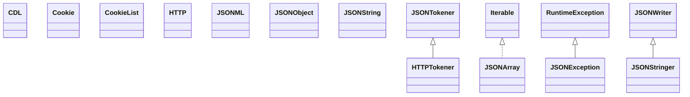

# json-20150729.jar

[Group index](README.md) | [All archives](../README.md)

## Scope and provenance

- **Donor:** `SQX_145_REFERENCE_ROOT/internal/libs/json-20150729.jar`.
- **SHA-256:** `38c21b9c3d6d24919cd15d027d20afab0a019ac9205f7ed9083b32bdd42a2353`; accessed 2026-10-06; captured `2026-10-06T18:54:51.906614+00:00`.
- **Classes:** 18 raw entries; 18 unique entry names. Duplicate occurrence indices are zero-based.
- **Inspection:** read-only ZIP hashing and class-file structural parsing; signatures/descriptors, modifiers, hierarchy and references only. Bytecode bodies are hashed, not published.
- **Allocation:** proposed `FEAT-HOST-JSON`, P02; [roadmap](../../sqx-full-application-roadmap.md). Domain README registration remains required.
- **Repository:** `01067f00031428613c6394064ca1bcadc1ba00ee`; review state unreviewed. Download label 145-dev1; installed build/activation and runtime equivalence unverified.
- **Limit:** every class/member is inventoried; declaration coverage does not establish consumed calls, defaults, formulas, failure semantics or algorithm parity.
- **Archive/resource index:** [065.json](../../../evidence/sqx145/archives/145/065.json).

## Complete member declarations

Member shards contain exact JVM names/descriptors, access flags, generic signatures, throws types, declared fields/methods, superclass/interfaces and referenced class names. All classes, nested/synthetic members and overloads are retained. Code length/hash is structural evidence, not a normalized algorithm comparison.

- [001.json](../../../evidence/sqx145/members/065/001.json) — SHA-256 `f98a1f76cbad9172d0c95ac178fe80acb4e5a7e80d446e743338b039e60fe9e2`.

## Focused structural diagram

Up to twelve non-nested classes; arrows show declared inheritance/interfaces only. External type names are not evidence of an available body or an executed dependency.

## Class inventory

| Archive entry | Occurrence | Class SHA-256 | Fields | Methods |
| --- | ---: | --- | ---: | ---: |
| `org/json/CDL.class` | 0 | `c97d016f30f0a7c7033fabdf33bad340122132cf7ff54d4ed74ca19be520fd06` | 0 | 11 |
| `org/json/Cookie.class` | 0 | `971c83b065b6e97d4f74a82b6dd3fdb5429f40d2742a24c85b12c057cc4ad155` | 0 | 5 |
| `org/json/CookieList.class` | 0 | `ac13f473376cc56a29c704c45d290194ee750448da385a8161444877104c50c3` | 0 | 3 |
| `org/json/HTTP.class` | 0 | `f9815a8166eb57662df6dff8bab3d8c4ec49642ce7445974af96144de733c9be` | 1 | 3 |
| `org/json/HTTPTokener.class` | 0 | `8e6202a6d338f56161083c20258f9f4148f0103f2741238b8bbadb5039f98d57` | 0 | 2 |
| `org/json/JSONArray.class` | 0 | `d55abdfd2ff9e55a98588356d0ffc50a5ac9c0cb2d3bc7c865a19bde9e0fc22f` | 1 | 58 |
| `org/json/JSONException.class` | 0 | `5a65422db9837458667d6a3b4479e9b8a5c277eef54850594f6b9407400ab089` | 2 | 3 |
| `org/json/JSONML.class` | 0 | `2651e9731bd3536ad9363f8952cda53166b4fd513ae4b4d15a6048040c504ebc` | 0 | 8 |
| `org/json/JSONObject$1.class` | 0 | `03940249a07e07c1f7413e34dcaec4b294350d3b6f6b83b7a814c6071ed9e978` | 0 | 0 |
| `org/json/JSONObject$Null.class` | 0 | `2e6bda684c377a9a6d20eeeb2257a4175223095a24ce008f0adcc2f794e665db` | 0 | 5 |
| `org/json/JSONObject.class` | 0 | `aa689272b058821b9c8d9dd52d03de72484876477f7efdf383626839ac16bd28` | 2 | 75 |
| `org/json/JSONString.class` | 0 | `2bf18f8028554a8dc09bf53caa4902350ddbb8ed1b4b29c65dcd3983ba6c15b8` | 0 | 1 |
| `org/json/JSONStringer.class` | 0 | `042868b2a3cfe66577cc838f1f38b6c496e4c9acbf90089a84a36ce0776ad30a` | 0 | 2 |
| `org/json/JSONTokener.class` | 0 | `2ed657345c1e9c5ae47cddb9e47e354b4d1173b5e4a465efe189fb69fef29faf` | 7 | 18 |
| `org/json/JSONWriter.class` | 0 | `55a1175ca0013a926ebd6ff63b3f227db322efc9495a608faaccbfcb02364741` | 6 | 14 |
| `org/json/Property.class` | 0 | `f0ce9854eb9cf796c24f01efa792e4405aa2b2a33fd6ba9378be87b410001629` | 0 | 3 |
| `org/json/XML.class` | 0 | `3435a9715a9a89205b01c0c069c6bcfa675ede0e000e45623bed17f3c10ef780` | 9 | 9 |
| `org/json/XMLTokener.class` | 0 | `b87fba960312ff54e68a788c24947a6b3cf438ac6b89dc1a76a4074e20e0db82` | 1 | 8 |
