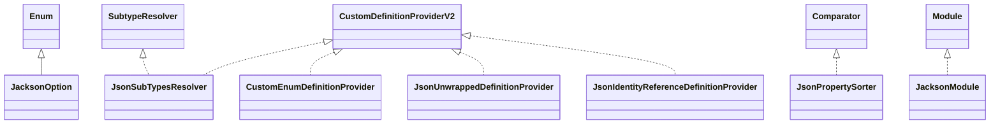

# jsonschema-module-jackson-4.38.0.jar

[Group index](README.md) | [All archives](../README.md)

## Scope and provenance

- **Donor:** `SQX_145_REFERENCE_ROOT/internal/libs/jsonschema-module-jackson-4.38.0.jar`.
- **SHA-256:** `36fbd3f1c27379c3ba8420ac2cb0b42411f7bc3b3df8bdd11d8d7e024a1c28ca`; accessed 2026-10-06; captured `2026-10-06T18:54:51.906614+00:00`.
- **Classes:** 10 raw entries; 10 unique entry names. Duplicate occurrence indices are zero-based.
- **Inspection:** read-only ZIP hashing and class-file structural parsing; signatures/descriptors, modifiers, hierarchy and references only. Bytecode bodies are hashed, not published.
- **Allocation:** proposed `FEAT-HOST-JSONSCHEMA-MODULE-JACKSON`, P02; [roadmap](../../sqx-full-application-roadmap.md). Domain README registration remains required.
- **Repository:** `01067f00031428613c6394064ca1bcadc1ba00ee`; review state unreviewed. Download label 145-dev1; installed build/activation and runtime equivalence unverified.
- **Limit:** every class/member is inventoried; declaration coverage does not establish consumed calls, defaults, formulas, failure semantics or algorithm parity.
- **Archive/resource index:** [068.json](../../../evidence/sqx145/archives/145/068.json).

## Complete member declarations

Member shards contain exact JVM names/descriptors, access flags, generic signatures, throws types, declared fields/methods, superclass/interfaces and referenced class names. All classes, nested/synthetic members and overloads are retained. Code length/hash is structural evidence, not a normalized algorithm comparison.

- [001.json](../../../evidence/sqx145/members/068/001.json) — SHA-256 `1fa74b58e8b50e9be36ce7b8404a72fba4f30085b34f58c3bbf9ded4079bf6f2`.

## Focused structural diagram

Up to twelve non-nested classes; arrows show declared inheritance/interfaces only. External type names are not evidence of an available body or an executed dependency.

## Class inventory

| Archive entry | Occurrence | Class SHA-256 | Fields | Methods |
| --- | ---: | --- | ---: | ---: |
| `com/github/victools/jsonschema/module/jackson/JacksonOption.class` | 0 | `5e59fdd7a2622c830b1f82aaeeb0caead28b39f9a4044f8e93d96dbc8b0996ef` | 12 | 4 |
| `com/github/victools/jsonschema/module/jackson/JsonSubTypesResolver.class` | 0 | `717b84ba2d9f565c4a63376ea8c9a40c0e9acd37cb4287e007b4bccd11183eb4` | 3 | 30 |
| `com/github/victools/jsonschema/module/jackson/CustomEnumDefinitionProvider.class` | 0 | `89e3f5e69ee0de45759e55ad78b173980fc1ecb98919cdf675611341e33948e7` | 2 | 7 |
| `com/github/victools/jsonschema/module/jackson/JsonUnwrappedDefinitionProvider.class` | 0 | `1a509344ce7036259df0c88cbb728f962207ecd9f3fca17e28eadb355bf5bf35` | 0 | 8 |
| `com/github/victools/jsonschema/module/jackson/JsonIdentityReferenceDefinitionProvider.class` | 0 | `7608e3b6a2a00051d81244a0f914b19811cca6ab715f4ab7843a73fc3f7d627c` | 0 | 7 |
| `com/github/victools/jsonschema/module/jackson/JsonPropertySorter.class` | 0 | `2e94e46db189845ea0fa277d8b07f3f654800b377c6c8f09464f7ccb3fd27f16` | 3 | 9 |
| `com/github/victools/jsonschema/module/jackson/JsonSubTypesResolver$1.class` | 0 | `762560f1d174541d89d04288ed2ee4f6f7ab44cb5fb864efa8f63c5f93f212c3` | 2 | 1 |
| `com/github/victools/jsonschema/module/jackson/JsonSubTypesResolver$SubtypeDefinitionDetails.class` | 0 | `4dcad0d1b3732ee458402ed052fc41adda8d956fedd317bb086f40511e6e14dd` | 5 | 7 |
| `com/github/victools/jsonschema/module/jackson/JacksonModule.class` | 0 | `f3e7a0615eb8d9f701f9d136d3578e2b20416725ece2d19e0b2e25b2394dffd8` | 5 | 21 |
| `META-INF/versions/9/module-info.class` | 0 | `995314dc59dd8cbb29ff8c1a0f9820404c651260249f3fb2d24066887e422e6d` | 0 | 0 |
