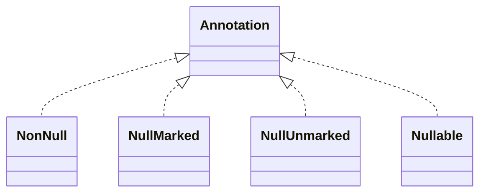

# jspecify-1.0.0.jar

[Group index](README.md) | [All archives](../README.md)

## Scope and provenance

- **Donor:** `SQX_145_REFERENCE_ROOT/internal/libs/jspecify-1.0.0.jar`.
- **SHA-256:** `1fad6e6be7557781e4d33729d49ae1cdc8fdda6fe477bb0cc68ce351eafdfbab`; accessed 2026-10-06; captured `2026-10-06T18:54:51.906614+00:00`.
- **Classes:** 5 raw entries; 5 unique entry names. Duplicate occurrence indices are zero-based.
- **Inspection:** read-only ZIP hashing and class-file structural parsing; signatures/descriptors, modifiers, hierarchy and references only. Bytecode bodies are hashed, not published.
- **Allocation:** proposed `FEAT-HOST-JSPECIFY`, P01; [roadmap](../../sqx-full-application-roadmap.md). Domain README registration remains required.
- **Repository:** `01067f00031428613c6394064ca1bcadc1ba00ee`; review state unreviewed. Download label 145-dev1; installed build/activation and runtime equivalence unverified.
- **Limit:** every class/member is inventoried; declaration coverage does not establish consumed calls, defaults, formulas, failure semantics or algorithm parity.
- **Archive/resource index:** [069.json](../../../evidence/sqx145/archives/145/069.json).

## Complete member declarations

Member shards contain exact JVM names/descriptors, access flags, generic signatures, throws types, declared fields/methods, superclass/interfaces and referenced class names. All classes, nested/synthetic members and overloads are retained. Code length/hash is structural evidence, not a normalized algorithm comparison.

- [001.json](../../../evidence/sqx145/members/069/001.json) — SHA-256 `462bf1f3ee39fa591592c235527f1b19e80fd0f74a12103c95702cc6177694dd`.

## Focused structural diagram

Up to twelve non-nested classes; arrows show declared inheritance/interfaces only. External type names are not evidence of an available body or an executed dependency.

## Class inventory

| Archive entry | Occurrence | Class SHA-256 | Fields | Methods |
| --- | ---: | --- | ---: | ---: |
| `META-INF/versions/9/module-info.class` | 0 | `d260d54cdecf9e11a379f7f7f421fc7135955f1fee427a2fb5766017829ac812` | 0 | 0 |
| `org/jspecify/annotations/NonNull.class` | 0 | `9c4a63b0000eef41284dfa595ab8a41bdd1005f88bc95dba806e51012621044b` | 0 | 0 |
| `org/jspecify/annotations/NullMarked.class` | 0 | `fb7da3d28ee589dcbda99bf8cb2b4f127b2369ff37f4f3e7e34c1befeaa5052f` | 0 | 0 |
| `org/jspecify/annotations/NullUnmarked.class` | 0 | `7f74eca18810f250dbba79dddb923b2aa1d12799ac738bc280a37f6df1fe5704` | 0 | 0 |
| `org/jspecify/annotations/Nullable.class` | 0 | `a4aa4d53cc80f8392df4e23f4480aaba63d6dbc50f933f6183dac753057cee98` | 0 | 0 |
