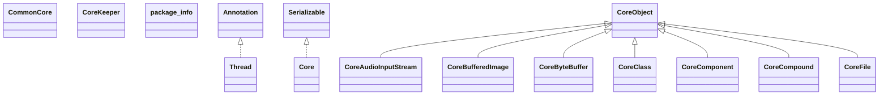

# jspf.core.jar

[Group index](README.md) | [All archives](../README.md)

## Scope and provenance

- **Donor:** `SQX_145_REFERENCE_ROOT/internal/libs/jspf.core.jar`.
- **SHA-256:** `94f287909bc8fb0970819f165cf091b08f1787053c9875824b6deb9a12ea0185`; accessed 2026-10-06; captured `2026-10-06T18:54:51.906614+00:00`.
- **Classes:** 295 raw entries; 295 unique entry names. Duplicate occurrence indices are zero-based.
- **Inspection:** read-only ZIP hashing and class-file structural parsing; signatures/descriptors, modifiers, hierarchy and references only. Bytecode bodies are hashed, not published.
- **Allocation:** proposed `FEAT-HOST-JSPF-CORE`, P02; [roadmap](../../sqx-full-application-roadmap.md). Domain README registration remains required.
- **Repository:** `01067f00031428613c6394064ca1bcadc1ba00ee`; review state unreviewed. Download label 145-dev1; installed build/activation and runtime equivalence unverified.
- **Limit:** every class/member is inventoried; declaration coverage does not establish consumed calls, defaults, formulas, failure semantics or algorithm parity.
- **Archive/resource index:** [070.json](../../../evidence/sqx145/archives/145/070.json).

## Complete member declarations

Member shards contain exact JVM names/descriptors, access flags, generic signatures, throws types, declared fields/methods, superclass/interfaces and referenced class names. All classes, nested/synthetic members and overloads are retained. Code length/hash is structural evidence, not a normalized algorithm comparison.

- [001.json](../../../evidence/sqx145/members/070/001.json) — SHA-256 `b56bd234156845619fa7857d2bbb2f26da24e08a5b300b05d6bc63a44352259a`.
- [002.json](../../../evidence/sqx145/members/070/002.json) — SHA-256 `331e7ea39dcbc6ff249f7274158dcf907a39796dff9989c6b50e123f976a5e1d`.
- [003.json](../../../evidence/sqx145/members/070/003.json) — SHA-256 `958704dc7dbad0db0b980ae9d1089c807456f3c7dc833f1cf33e77ee91fcb3cb`.
- [004.json](../../../evidence/sqx145/members/070/004.json) — SHA-256 `3378cf2726e3bb48ce822875934ac53bc2ade4c1f22d74b9d308c23e4b34eca7`.

## Focused structural diagram

Up to twelve non-nested classes; arrows show declared inheritance/interfaces only. External type names are not evidence of an available body or an executed dependency.

## Class inventory

| Archive entry | Occurrence | Class SHA-256 | Fields | Methods |
| --- | ---: | --- | ---: | ---: |
| `net/jcores/CommonCore$1.class` | 0 | `cb8ba47c93c16cf85f8c3f89089b42fdcfeb8a81cfd8d5046330e41002493106` | 1 | 2 |
| `net/jcores/CommonCore$2$1.class` | 0 | `777f9af4b9d331e14ff88260f0087f1884d213c25fee70ff04d891828046cc9e` | 2 | 2 |
| `net/jcores/CommonCore$2.class` | 0 | `694c01e4d32f5ba464fe5261bb653f0767a411af5d9e2b33a0752662543f480e` | 1 | 2 |
| `net/jcores/CommonCore$3.class` | 0 | `cd7a5942d9360aa4156175aab9f118a842b671b5e1b1f96879a3d34c3b49b803` | 2 | 2 |
| `net/jcores/CommonCore$4.class` | 0 | `299295840cf8c8bf5f0fab6df4e36cc66d7951142a1b8a6d8617070440576994` | 2 | 2 |
| `net/jcores/CommonCore$5.class` | 0 | `ac8b6f8a19d7a4d5907971935bad324f2492d2141cdc655d47fb4d1044f6cf71` | 2 | 2 |
| `net/jcores/CommonCore.class` | 0 | `eb3cebb22d7becff561e3bea673d0df96ee60ac27d7d223887730140c8a32fed` | 5 | 23 |
| `net/jcores/CoreKeeper.class` | 0 | `b2c4bf73d68f46a26a338529b10cfced387b48791d83a265558a909110867390` | 1 | 19 |
| `net/jcores/annotations/Thread.class` | 0 | `7d0537e5a5797d3f21bb14bba8123e901bcdce1b3f37adee203e85a7c34f8760` | 0 | 0 |
| `net/jcores/annotations/package-info.class` | 0 | `0db0c56d2c2d2b93d8c81e813be6b6778b03b0eb06c02e6c55d561c8f4f0699e` | 0 | 0 |
| `net/jcores/cores/Core$1.class` | 0 | `c9c6980620b0dfd38273555989c8e3484b9c26f5e10c49d53159164870845d17` | 7 | 2 |
| `net/jcores/cores/Core$2.class` | 0 | `16538fc90aa0993d3036c08fa9b24faa1b718247366ab2fa17fbe1af418729ae` | 7 | 2 |
| `net/jcores/cores/Core.class` | 0 | `ea8452b555477f9b18aae68b4d2c6d4e0279d85f7adfa729b7014bcc3f6bd47d` | 2 | 4 |
| `net/jcores/cores/CoreAudioInputStream$1.class` | 0 | `1fe918c43171d5491ab84682de70d016c28d42debd29d9d0d50a9c86341253f1` | 1 | 3 |
| `net/jcores/cores/CoreAudioInputStream.class` | 0 | `c477dc5cc2df20fb4fb75183b92148e8f35bfb7feb2d41ebacc18df33769466e` | 1 | 2 |
| `net/jcores/cores/CoreBufferedImage$1.class` | 0 | `aa22a6592677fafa9128fd6c9729f42af32c4a581e171edd9912f0a8363fe8d6` | 1 | 3 |
| `net/jcores/cores/CoreBufferedImage$2.class` | 0 | `7593a0b25fcbc64dffe8adaeb58a40d68583838f688f51cee5d10cbe10f49140` | 2 | 3 |
| `net/jcores/cores/CoreBufferedImage$3.class` | 0 | `e6733af015f0a384f14c094bb683b400c8725f1f64da28127854d714aaa63a06` | 3 | 3 |
| `net/jcores/cores/CoreBufferedImage.class` | 0 | `518a43199e97f9c864d4a69d3978ba38f461a0cbf34c1f3b2f7bd1f3fb6f3093` | 1 | 5 |
| `net/jcores/cores/CoreByteBuffer$1.class` | 0 | `08e5ed208a9574a07ca38130f95ed76d7df2a99e1c0f722e84d9b2a5ae06c7a4` | 2 | 3 |
| `net/jcores/cores/CoreByteBuffer.class` | 0 | `e6afb3591908fb4fe19ba6f68b3804b23494279ed78a13932b03fc9ae3b18b01` | 1 | 2 |
| `net/jcores/cores/CoreClass$1.class` | 0 | `b89ac04a2e32305dea6e70dc05880791cd04fe9711a2b11051c6004198159789` | 1 | 3 |
| `net/jcores/cores/CoreClass$2$1.class` | 0 | `285b4111a4b96569d9e9ba61ad0b8b5badd23823ae5a34d362e6e47ce5c9f764` | 1 | 3 |
| `net/jcores/cores/CoreClass$2.class` | 0 | `1fa3b6d6778ff82db37a4bf721b7adf1d78b3fa0629935b6352a4966f072b73c` | 2 | 3 |
| `net/jcores/cores/CoreClass.class` | 0 | `0795f6b46fabca27848421fe59d1cdde1b5bc2bc9886ea74bbe5ac05e30a8b50` | 3 | 5 |
| `net/jcores/cores/CoreComponent$1.class` | 0 | `1f81d7c4b190285d2c617e19ee841592655ff18df640f1556ad9f615ac1e3e0b` | 3 | 4 |
| `net/jcores/cores/CoreComponent.class` | 0 | `040902a6ba29b4c52c0b9f7813f071db910cc3b5a2c853efba74a6fd21fdeda2` | 1 | 2 |
| `net/jcores/cores/CoreCompound$1.class` | 0 | `0694080116b78ef95bf516e06c38b7960f9de505e2fb392b75893aaf621b35f7` | 2 | 3 |
| `net/jcores/cores/CoreCompound.class` | 0 | `6df018d15abb4526f4d4ea00300de441f2c5d746088cfd4d406bcb24fe35c2c2` | 1 | 2 |
| `net/jcores/cores/CoreFile$1.class` | 0 | `7c9c5a69d913ddc94881f2a35eeccfadc7f93e933187fafe9e8598fa48eb5d8a` | 2 | 3 |
| `net/jcores/cores/CoreFile$10.class` | 0 | `1ec9c1b6ede823953c0d7bf1080b250d2822600e87b59719b763ea032995e3ee` | 1 | 3 |
| `net/jcores/cores/CoreFile$11.class` | 0 | `ed9a1b986fd2ceb52f76b94dab860b9d2aa7ab72d0d9250068dbe55e8fabc3d7` | 1 | 3 |
| `net/jcores/cores/CoreFile$12.class` | 0 | `d6b0b790af24b40a02628c0d1671aeb2108af29a022cc62a797aa8b4e3e19acd` | 1 | 3 |
| `net/jcores/cores/CoreFile$2.class` | 0 | `cca8fdc46d79c22abd009718248bebe13ec35b25f81ae7ebecf2e0a02508b88d` | 1 | 3 |
| `net/jcores/cores/CoreFile$3.class` | 0 | `d99952020c64cf2de72967a0326d5b136917067ef25bc229125f683a5feb7e40` | 2 | 3 |
| `net/jcores/cores/CoreFile$4.class` | 0 | `295b9d750862ad64545ee83b474841607930a4475ad9ec50e6cfec4f4b85f102` | 1 | 3 |
| `net/jcores/cores/CoreFile$5.class` | 0 | `8855ea6aec601bda6de44d649260ab31648db4c350c240c97acf647f9c44d128` | 1 | 3 |
| `net/jcores/cores/CoreFile$6.class` | 0 | `abae81ea338f0b99e280e3e8588b4a661a6989faa82fe6d45e786224f0181730` | 2 | 3 |
| `net/jcores/cores/CoreFile$7.class` | 0 | `830d21a52971b0f05123e8c382422372fecfac7e5d3d183abe3dff918d846582` | 1 | 3 |
| `net/jcores/cores/CoreFile$8.class` | 0 | `7a41275593e5fe5b7581e5b5563f323b57bdce220a7df766d5759dedbf039ca1` | 2 | 3 |
| `net/jcores/cores/CoreFile$9.class` | 0 | `ac7cf9a1cf7b87f5d274bbb1ecfba0fad0f9582cff65ed97481cd0d97eefa4f9` | 1 | 3 |
| `net/jcores/cores/CoreFile.class` | 0 | `e155e58a41540a2f8e15c4baed951be26e194bb24c3b732ebc10704431d66761` | 1 | 16 |
| `net/jcores/cores/CoreInputStream$1.class` | 0 | `e783848585be835bc3273c9d9fa636fe263d14b17f21cf6b3df132c69f66c794` | 1 | 3 |
| `net/jcores/cores/CoreInputStream$2.class` | 0 | `e754663293e201a8854b8eccc26b4060300e534694fc5ad4d922aa55249f1ba6` | 2 | 3 |
| `net/jcores/cores/CoreInputStream$3.class` | 0 | `4e152b669f60eda8113199119d66663a07e57b5e46ac1e8da0531651e2c681ab` | 1 | 3 |
| `net/jcores/cores/CoreInputStream$4.class` | 0 | `d821539cd83f1c6fcc6df515cbcdc74a3eeb4cc2c3d7e28610a8dd1a56bfe181` | 1 | 3 |
| `net/jcores/cores/CoreInputStream$5.class` | 0 | `49e73c8d503a6372454f5afa7aaabf8bf57465ae7d7693fb8dbea6959c1c6864` | 2 | 3 |
| `net/jcores/cores/CoreInputStream$6.class` | 0 | `6fec26ad0a6830e14b2c793af78beca7ab11e561e5e512a20048475cd5b43830` | 1 | 3 |
| `net/jcores/cores/CoreInputStream.class` | 0 | `5e69300c9c18a80878599e2478d92bf4f7d9d8d3074a57a76280d991a98ae7d1` | 1 | 9 |
| `net/jcores/cores/CoreJComponent$1.class` | 0 | `8fbfdc121aeb87d92f7cbb1876125d51080fc3894b7c465b7ece971f48691122` | 3 | 2 |
| `net/jcores/cores/CoreJComponent.class` | 0 | `9721a53db4afd38b7ec0673178e1c6f3f71869914f1066f906a9db3658deb21f` | 1 | 2 |
| `net/jcores/cores/CoreMap.class` | 0 | `be8936c49eaf62cb2af2ca1fc2cc361ca584c2be52c4ae53c61c0d2638671af9` | 2 | 2 |
| `net/jcores/cores/CoreNumber$1.class` | 0 | `938aa8175d16cedf8c186e772dcc0c0e4c811dfbf8bc6859f1512eea6e95e0e7` | 1 | 3 |
| `net/jcores/cores/CoreNumber$2.class` | 0 | `602c78c982b81ec1b4090d032c0bac9f1598901ce59b47a26f1a0f09738e3a47` | 1 | 3 |
| `net/jcores/cores/CoreNumber.class` | 0 | `c19e9b7c34fb878d3d06fcbee0fb3c01d63d9924178efa74e4d5bc1ebf608912` | 1 | 9 |
| `net/jcores/cores/CoreObject$1.class` | 0 | `e4d0b703c7715678ec70d912d0d960517732711ffcefc4e212aff35ee0e4a243` | 4 | 2 |
| `net/jcores/cores/CoreObject$10.class` | 0 | `74fc2ebec9d4d2c45390e7b07df99882e27d3bdcc285432909ba5118bac715af` | 2 | 2 |
| `net/jcores/cores/CoreObject$2.class` | 0 | `1e76da793aa3b55605f8ffd7461b6067106849a052f5da8cb08b93a154626789` | 2 | 2 |
| `net/jcores/cores/CoreObject$3.class` | 0 | `560f365adb8882143bd6c62f1a7e8b1dd28b57944c19a0f53d14655b588d15ef` | 1 | 3 |
| `net/jcores/cores/CoreObject$4.class` | 0 | `f2a2396aaa099dfd8f507a71243091fdfef81c3def21c9672338e542c48e5451` | 3 | 2 |
| `net/jcores/cores/CoreObject$5$1.class` | 0 | `320877204893e453f192d0faa3e317d49e1838b1bf0b7fe9f56dfb8925bb2847` | 3 | 2 |
| `net/jcores/cores/CoreObject$5.class` | 0 | `9ed06abd2af667404c648aeb305531060351c6170840be87736fea0ac84e3be6` | 2 | 2 |
| `net/jcores/cores/CoreObject$6.class` | 0 | `57882d4c581988d0eb13a027ed3e69d6c64e846f2c7337771a5f87e7f750fa49` | 3 | 2 |
| `net/jcores/cores/CoreObject$7.class` | 0 | `21f216a83d83af7b5c3e65539722ac5b29abcbd705dd6dc3e6bda8a2e73641d1` | 2 | 2 |
| `net/jcores/cores/CoreObject$8.class` | 0 | `53dec9e1f644d5006007e099a699431b39876fc62ee4895b4db5b6f46c7869e7` | 3 | 2 |
| `net/jcores/cores/CoreObject$9.class` | 0 | `77da73b9a6eaa61166ef835d91dc851dc228ea2c119c47f9ad34b158a839c284` | 1 | 3 |
| `net/jcores/cores/CoreObject.class` | 0 | `c47855bddcbcd5b9c2019c932ab8a6f37e6b4e13837390cf241600c864b617c8` | 2 | 59 |
| `net/jcores/cores/CoreString$1.class` | 0 | `7bb7f4dd6793ee8543fdecd8c43c24ce83986a30745552d64f4bebe17cbbf6a8` | 1 | 3 |
| `net/jcores/cores/CoreString$10.class` | 0 | `4d0ae87c0b227d4a0033bf0fa59c6f81e94383537b703a10328e02902ecc112d` | 2 | 3 |
| `net/jcores/cores/CoreString$11.class` | 0 | `e95972ec00bd3b4e51083123a1a1fe5cb8de68e163342160c416e2946f3e401d` | 1 | 3 |
| `net/jcores/cores/CoreString$12.class` | 0 | `5bac2fe1bedfcf71ab8f8c2a001b446fcb625e58abd4377116d1ad7803169257` | 3 | 3 |
| `net/jcores/cores/CoreString$13.class` | 0 | `a8e5126fb3c33676618ed2518759e744c575d8161cddb1b917f6755602472865` | 1 | 3 |
| `net/jcores/cores/CoreString$14.class` | 0 | `3667bc1cc5954648a28487d1571504c00940eb40627e57ad1b42e0da932bc81f` | 1 | 3 |
| `net/jcores/cores/CoreString$2.class` | 0 | `90137a7fe4dfe0d3d9354eaeb2bca0d2dfe96405a7ef47782e3924c4cd818a57` | 1 | 3 |
| `net/jcores/cores/CoreString$3.class` | 0 | `17a746454f47408fe4aff18199d5000cd22f9fe35eac19efc34ea4443d62fadf` | 1 | 3 |
| `net/jcores/cores/CoreString$4.class` | 0 | `5180fb6ae1e9d5848a130a5fc2b0c6cac338f8a5007f9d74539d7b9bc0389c52` | 1 | 3 |
| `net/jcores/cores/CoreString$5.class` | 0 | `c85f298de5f9dc891e96f349c6e7b0482dd9b94d24fa788eb8d248a520fed631` | 2 | 3 |
| `net/jcores/cores/CoreString$6.class` | 0 | `fb370d9d4a0d26013fe77042ff38377eb9a355414a15e3925f9dfcebf1aca137` | 1 | 3 |
| `net/jcores/cores/CoreString$7.class` | 0 | `bd59d31d1b1423add579719c3567a27e9253991d0b03b2df23d076188dca546f` | 2 | 3 |
| `net/jcores/cores/CoreString$8.class` | 0 | `bf7b96a80246d5100917e58e136ff672b561a6ffe9aaaa7264603b01003b48ff` | 3 | 3 |
| `net/jcores/cores/CoreString$9.class` | 0 | `fc4e97bd2d392a3b313317c0c6711955f2aaf17b82dd72c4a9c7e5ba6ed39117` | 2 | 3 |
| `net/jcores/cores/CoreString.class` | 0 | `4901ed9af1ace469d257997b7f0068265a480398df62cde8494995ad28a571b3` | 1 | 22 |
| `net/jcores/cores/CoreURI$1.class` | 0 | `a276aa2ba3fad78d70b68b41cfc6b00b65a3b4c2884e01e7742f33b10fc8d833` | 1 | 3 |
| `net/jcores/cores/CoreURI$2.class` | 0 | `54aae9fa5b725686dc75865e8df7a084254b714bd5fbcb9314943fa64860cce5` | 1 | 3 |
| `net/jcores/cores/CoreURI$3.class` | 0 | `fc11369a353cdc76f94c75702b3b4ee4727eb99c47539cfa3a4743a8fa323267` | 2 | 3 |
| `net/jcores/cores/CoreURI$4.class` | 0 | `5b240e9d497531bbacd28b310234f2e1f78360db344174afa55a4d1c97b43534` | 1 | 3 |
| `net/jcores/cores/CoreURI.class` | 0 | `ba2e42f9edd4e612f028cb5d05a29c028c63ddb81657dcba28bcbe4755524c9a` | 1 | 5 |
| `net/jcores/cores/CoreZipInputStream$1.class` | 0 | `7cf4cb74b47913ba7ccc04d352b98ff6ba4dc7b01de19b2ea209b5f56550b222` | 2 | 3 |
| `net/jcores/cores/CoreZipInputStream$2.class` | 0 | `1ab34a769bcf79970fc21944b240585f49c6a388c9953bf3bc52d9d0474d0f53` | 1 | 3 |
| `net/jcores/cores/CoreZipInputStream$3.class` | 0 | `b2dbc382e3d5f45ae0e7db6d0702900b42d59feb3bbfb6db554645c857aa32a1` | 2 | 2 |
| `net/jcores/cores/CoreZipInputStream.class` | 0 | `4842e1b15f034b6226f29a53c41b0ea487b8633e3622f2dd600582425c2220c7` | 2 | 4 |
| `net/jcores/cores/package-info.class` | 0 | `942a83ac66e6c6abac6c9d3abbb9548aa7677daaa0a073ce246629e122d4f409` | 0 | 0 |
| `net/jcores/interfaces/functions/F0.class` | 0 | `e0f7037760913f994fdfc4ff4b89e3d389ba815c38f98236d844a7ead03e32e0` | 0 | 1 |
| `net/jcores/interfaces/functions/F1.class` | 0 | `95cba0ca119e28315333b55ab3e5f1307b00d3ca9cac9f98b11aad5ebb0f96aa` | 0 | 1 |
| `net/jcores/interfaces/functions/F1Object2Bool.class` | 0 | `632cc3226d18cba7fe2d492923a5e93424928f9005ecab703dab727a8405b5ac` | 0 | 1 |
| `net/jcores/interfaces/functions/F2DeltaObjects.class` | 0 | `3b242d3e2b1bdb5975fd872f3aa159bd9e1425b9411f3782313f9c6391ba0924` | 0 | 1 |
| `net/jcores/interfaces/functions/F2ReduceObjects.class` | 0 | `fe2768d80ed3dc1b9c78f3fd57d0c9e14cb1614dd1229c7f241bcd6cfb3136b8` | 0 | 1 |
| `net/jcores/interfaces/functions/Fn.class` | 0 | `885a03798b67aa17be44c34587079fc95e1b4efdb4a414f3bf90e68907b5ac76` | 0 | 1 |
| `net/jcores/interfaces/functions/package-info.class` | 0 | `6ef9b3690de86a3776f38f0a82f6cfe16cfe95f3d9b54dc137df0fb81da8fde7` | 0 | 0 |
| `net/jcores/interfaces/internal/logging/LoggingHandler.class` | 0 | `7a97240513da1685198540a8ba73383eaaf13076bca26c5d1df4c0302473b57f` | 0 | 1 |
| `net/jcores/interfaces/java/KeyStroke.class` | 0 | `8a18d1e19f08478d740c70b40c54cbd28e92243bd6127ea88b26385b053faa6d` | 0 | 1 |
| `net/jcores/interfaces/java/package-info.class` | 0 | `ccdbd857d82c7d1647b2006312d9ef87408944ac28abfa6ded34d9d871a842d9` | 0 | 0 |
| `net/jcores/managers/Manager.class` | 0 | `a69e50f2d0234e0790f6bcc12585c96a521e70ac5425da089866e6a496d96c15` | 0 | 1 |
| `net/jcores/managers/ManagerClass$1.class` | 0 | `795050445644c27b6fbdd03a036b4783ca2be9710e52c0f67a73f1cbe37561ba` | 2 | 3 |
| `net/jcores/managers/ManagerClass$Container.class` | 0 | `bd72431efdad9cc85666c1e39ce9980240cef85f15e45dd74716d89436022cf0` | 3 | 1 |
| `net/jcores/managers/ManagerClass.class` | 0 | `10c9e5a7b81d3c0e4abcb8c474d73b844d8d9abc144bf97a0d21006daa3b3cdc` | 2 | 5 |
| `net/jcores/managers/ManagerDebugGUI.class` | 0 | `a92c2813a2ca832be917012159afbca476f7e41f58946229fdd9b7dfda9d5e45` | 0 | 2 |
| `net/jcores/managers/ManagerDeveloperFeedback.class` | 0 | `710c09221bc68c0f50cde5a00f6808bd4b8e6363e23b524b879ddeae14b26628` | 1 | 4 |
| `net/jcores/managers/ManagerLogging$1.class` | 0 | `cf0c2a3f5f0ae7ad88f8ead3d44f3b94d10641e04daabdbc0d42ef4ab1a23351` | 2 | 2 |
| `net/jcores/managers/ManagerLogging.class` | 0 | `1b5ffc491068f8613cf16c48f0fd03280bc05cec9ce5ed097fa027b415def330` | 1 | 3 |
| `net/jcores/managers/package-info.class` | 0 | `1e962ecb291c8e47302dc6d4a5c58103db2350c1e0503c4a19998bb6ffb11219` | 0 | 0 |
| `net/jcores/options/MessageType.class` | 0 | `dba21b7acffe754874152f43eec1844fcd9d43046fc6f2bee00ae3335edb7ea7` | 4 | 4 |
| `net/jcores/options/Option.class` | 0 | `7a8ee987530973b9146df6b03c9304dc800282b8e2ac58b7f429466d6c67d1c2` | 5 | 5 |
| `net/jcores/options/OptionDebug.class` | 0 | `6424b03a02c6aec27d5b8baa00dee34315d71166e418e1a82014a3135c771fb9` | 0 | 1 |
| `net/jcores/options/OptionDropType.class` | 0 | `db3b75940de8bb43c6af70c57089c21b63ecb8990604546509e526d3f6f3689d` | 0 | 1 |
| `net/jcores/options/OptionDropTypeFiles.class` | 0 | `498cb3b1c628c71318aa0ca20d855e8561be438a8e9bb08dc1a480d050706553` | 0 | 1 |
| `net/jcores/options/OptionHash.class` | 0 | `c46b2cb108e9fdee32ce263bbcfa2b1b26134851a71754249ef7d03539ee075a` | 1 | 2 |
| `net/jcores/options/OptionHashMD5.class` | 0 | `5057d3dcce997d1e89d4cf772992503f29ae295d342ffef890b19cc426bd802f` | 0 | 1 |
| `net/jcores/options/OptionIndexer.class` | 0 | `2e3e3fbe30eb6b842f0184415701f02f77b8d7756941f6fc168e68bac95f351c` | 1 | 3 |
| `net/jcores/options/OptionInvertSelection.class` | 0 | `450bf1d015be3957a7c9f412e0634c7d6ff650f4178862fc4b8d1fb2c445c950` | 0 | 1 |
| `net/jcores/options/OptionListDirectories.class` | 0 | `943f30bf8ae35d5787e34125dd50d79e68f62154533bce9032936171b90cc89a` | 0 | 1 |
| `net/jcores/options/OptionMapType.class` | 0 | `da3bae7fa0b638aa03d6781dc00766dc4ae65a274570e9fb6f1e5a7a7d881de1` | 1 | 2 |
| `net/jcores/options/OptionRegEx.class` | 0 | `e3b79d1b1b1acce24c54e2e9fb4f9726fa1a4a85cc2a3ac98179f6fb032229fa` | 1 | 2 |
| `net/jcores/options/package-info.class` | 0 | `67712a066a2e118dc466ee28fa7b1f956187b407587ce834d1e8b652b516c9c1` | 0 | 0 |
| `net/jcores/package-info.class` | 0 | `9182ac0d822ebf159c9386fdc6262509a30f7c46c77e12b2839fa28d003b7bd7` | 0 | 0 |
| `net/jcores/utils/Compound.class` | 0 | `ba83717cdac28fe81e08db246eb866b8c507ec930fccda4ea5b124757fc45456` | 1 | 11 |
| `net/jcores/utils/Staple.class` | 0 | `cfb51a4fbe8f1a0d4c294dc150cde954ed8beb92ad534dfb95811a6aa57ebe90` | 2 | 3 |
| `net/jcores/utils/internal/Folder.class` | 0 | `35ec8cd691432024ece74184d4cbd0ed85b161a729d54b40382abab8f92bd5d2` | 0 | 2 |
| `net/jcores/utils/internal/Handler.class` | 0 | `d2841d3a19a8a2d45366d62464b766ecb54feef9bbcf52aef5c3bd64bbd63370` | 2 | 4 |
| `net/jcores/utils/internal/Mapper$MapOptions.class` | 0 | `141001a8a35eee0c69e41b5034ba5af7db99b6a66d07424bddcc80c06014854d` | 3 | 1 |
| `net/jcores/utils/internal/Mapper.class` | 0 | `225650c91d5c0112145e17ac8baa74c7d98c925d60f24580633aaf512abdea2b` | 1 | 2 |
| `net/jcores/utils/internal/Reporter.class` | 0 | `968e1e853dadcc1a1f7515ca7d4cd98c2419328f0bbffa7e4bae18be2243a315` | 1 | 3 |
| `net/jcores/utils/internal/Wrapper.class` | 0 | `6944658700b250cbcc3113002e90c6fb08d632d1441424c6b8fbfc5fd28a4392` | 0 | 3 |
| `net/jcores/utils/internal/io/DataUtils.class` | 0 | `f87e04309bc586d6f166e06e56034674f0353034010c0b48ec6b698d71a59a38` | 0 | 2 |
| `net/jcores/utils/internal/io/FileUtils.class` | 0 | `ee8bf75bb1d99bde20f775e9a05ae0d104e84e5e646242cff658f8500b5f2128` | 0 | 5 |
| `net/jcores/utils/internal/io/InputStreamWrapper.class` | 0 | `5d507a4f9119691333e29311fc1f25f9a0809e1f9735beaa8fde6a7a0aa815ae` | 1 | 13 |
| `net/jcores/utils/internal/io/StreamUtils.class` | 0 | `b7da46140e644e4dcf3d54feba38e2ecdcda75c746e17682d639a7dfefdef147` | 0 | 10 |
| `net/jcores/utils/internal/io/URIUtils.class` | 0 | `a04036681829f5d10bb353d39ad86e3f530f65a4cd3ac633a2d65f41e084a36c` | 0 | 2 |
| `net/jcores/utils/internal/io/package-info.class` | 0 | `cd27dad453150810558658b8527063eb004cc8a11901f3a3e0e3853f5707d355` | 0 | 0 |
| `net/jcores/utils/internal/lang/ObjectUtils.class` | 0 | `dcb964785b2c596dd26275b1a8929fa038290a104c825a9d315cd2bc2ee9d411` | 0 | 2 |
| `net/jcores/utils/internal/lang/package-info.class` | 0 | `3a52a85e1a4ca8fd5b410df463881615e3ea7cd8553a654c473be18c999963b7` | 0 | 0 |
| `net/jcores/utils/internal/package-info.class` | 0 | `5ed004963a28c2e8e1a1604ae30ec6c5e06594a240366733b70495b03b7e9874` | 0 | 0 |
| `net/jcores/utils/internal/sound/SoundUtils.class` | 0 | `6fe77f4a058d335bc2427f043817a58dc7e312b647392a06f9363cef7dd23fb3` | 1 | 4 |
| `net/jcores/utils/internal/sound/package-info.class` | 0 | `7693a3a35096f8ff2050ad7762477f05c6869fff1dc11844de23278d770e77ae` | 0 | 0 |
| `net/jcores/utils/internal/system/ProfileInformation.class` | 0 | `b3ad0cf35f96b538f178bf6f1ae2ed7ea4f1057b3d3b5796bca42c121943a3a8` | 1 | 1 |
| `net/jcores/utils/internal/ui/SimpleTransferHandler.class` | 0 | `10e7aabac0eb21c501273eface05af2e03d4aa0498e99cb551bba74ab5a7c3d2` | 1 | 4 |
| `net/jcores/utils/internal/ui/package-info.class` | 0 | `9816e1e9be7abfdd241afe168d4cb63efdaa8b824b864c072c2e83b51e3ca01f` | 0 | 0 |
| `net/jcores/utils/package-info.class` | 0 | `15453f73fa2ad2d4154a109082945494e506327baf74a634f38772f3ad0e2d70` | 0 | 0 |
| `net/xeoh/plugins/base/Option.class` | 0 | `6e5f6008e0070b8c3c4575f60931b1a05af7e2015a561cf8cdfcb21c526e3703` | 0 | 0 |
| `net/xeoh/plugins/base/Plugin.class` | 0 | `e01f09eb5add581d3e8039fe4bea57f1530874c30f90d7bc48201dba559014b2` | 0 | 0 |
| `net/xeoh/plugins/base/PluginConfiguration.class` | 0 | `87167769f723be1edbe8f24d81d59c6e33e29707da303b1c67b38c6b0a687ea0` | 0 | 2 |
| `net/xeoh/plugins/base/PluginInformation$Information.class` | 0 | `78b0020c242036e39d7fc3439e1856a11d63a6d1e799897eff01838898c3bdbf` | 6 | 4 |
| `net/xeoh/plugins/base/PluginInformation.class` | 0 | `f61e1aec26d2e8c84ea57c79c5c39e4f645938f8d4f21b8e4e18a5497d78fcb7` | 0 | 1 |
| `net/xeoh/plugins/base/PluginManager.class` | 0 | `9bb08dd59aac3344964ffdcbfae8dcd900c9f23722684fe0b897c1541ace669d` | 0 | 3 |
| `net/xeoh/plugins/base/annotations/Capabilities.class` | 0 | `acd2da50e774927e4a6a9254bc954fb8a0d234049d1fa944da7fc62c4d81eb3d` | 0 | 0 |
| `net/xeoh/plugins/base/annotations/PluginImplementation.class` | 0 | `33b87de951b65a7e362ca50d9f7dc83f62ec3cca40a56e3ec16cea79d949f27c` | 0 | 0 |
| `net/xeoh/plugins/base/annotations/Thread.class` | 0 | `0e6ca487fc59e54a81eec0eceefe8188661ffc2b7b5365084f5ba892c3e2a0c5` | 0 | 1 |
| `net/xeoh/plugins/base/annotations/Timer$TimerType.class` | 0 | `08da1692eff5763e57d2201812ba16382d89a357791c26ecc4c8cda1ed5687f2` | 3 | 4 |
| `net/xeoh/plugins/base/annotations/Timer.class` | 0 | `c0300361fd9258dd0a4d24b1ec203c79459fa104961687ba0853fa8aa30c783e` | 0 | 3 |
| `net/xeoh/plugins/base/annotations/configuration/ConfigurationFile.class` | 0 | `b160188a308d7ee3056957e1700f1aec10b5e7bbac24ba69a6c4df949b87ca57` | 0 | 1 |
| `net/xeoh/plugins/base/annotations/configuration/IsDisabled.class` | 0 | `435bd24492faa55f4487887857a791f8568e74f5cc32c766f07eba2f5ef0a7ec` | 0 | 0 |
| `net/xeoh/plugins/base/annotations/events/Init.class` | 0 | `7be8b33284613b4becf426f0c840f914b61bf36be093a76667b9f8d9cb584b37` | 0 | 0 |
| `net/xeoh/plugins/base/annotations/events/PluginLoaded.class` | 0 | `0f61a8dbad6f5239d5154e6794d73681b4eb74dedd83147799074287181462ae` | 0 | 0 |
| `net/xeoh/plugins/base/annotations/events/Shutdown.class` | 0 | `dda7a9b604a2bf532072ad5d651e276d5705b17545cb7d665e6b1df8b53c01b9` | 0 | 0 |
| `net/xeoh/plugins/base/annotations/injections/InjectPlugin.class` | 0 | `007262e675d5ca33d0feb69941936b47801d03934066a7f47eb59a49c5b1ce21` | 0 | 2 |
| `net/xeoh/plugins/base/annotations/meta/Author.class` | 0 | `951b03015e1ddd6b741fba3c4356e5ef98b4779d8e645b6b447c426aa6ff15cc` | 0 | 1 |
| `net/xeoh/plugins/base/annotations/meta/RecognizesOption.class` | 0 | `38881bde115f80bd0964a302b4df4695303bd62e0d967a5f4b610767db39b3bc` | 0 | 1 |
| `net/xeoh/plugins/base/annotations/meta/Stateless.class` | 0 | `e63269186f977d19500b498dc1a6ef74564c9a5370d272126f63fc6a0d26631f` | 0 | 0 |
| `net/xeoh/plugins/base/annotations/meta/Version.class` | 0 | `ea5b9c484977959bbb1839e76e9c85ed3e7b383514d5ad3bb0e43cd5d9f4929d` | 3 | 1 |
| `net/xeoh/plugins/base/diagnosis/channels/tracing/ClassPathTracer.class` | 0 | `19c1a9f54128493af488e2828b9375505db8dbfe5fe7550247b09c4a465bf187` | 0 | 3 |
| `net/xeoh/plugins/base/diagnosis/channels/tracing/PluginManagerTracer.class` | 0 | `c906c825779980cf69e05c2ecec472cfd365e9a915a09781488e373999dff041` | 0 | 3 |
| `net/xeoh/plugins/base/diagnosis/channels/tracing/SpawnerTracer.class` | 0 | `f4fe51cec5b730da88a8031ae81533a78cb80bd183cfd5de7a79e4c104aac4ee` | 0 | 3 |
| `net/xeoh/plugins/base/impl/PluginConfigurationImpl.class` | 0 | `3e93e4c8db7557eafe5e156e7cf60ef24b7e8c91f867182a391447fe1a410c4c` | 2 | 4 |
| `net/xeoh/plugins/base/impl/PluginInformationImpl$1.class` | 0 | `2a2e0992542ff5874e7e6d68f385e33d2f90f3d22f7567f8cfdfc20d5f77a389` | 1 | 1 |
| `net/xeoh/plugins/base/impl/PluginInformationImpl.class` | 0 | `cd49b896e7fa4e156c0ad6cdfcadaff87a379e04c88091434c78bb18815ae567` | 2 | 3 |
| `net/xeoh/plugins/base/impl/PluginManagerFactory.class` | 0 | `063cfcee0639bd67cdabb193f5e339f2620e7224941a3ef587ec2b63f3f4adb1` | 0 | 4 |
| `net/xeoh/plugins/base/impl/PluginManagerImpl$1.class` | 0 | `5a385680b23e1123e1ce893fee14dbe979f74ac61d0c01790c90ca9784a5f75d` | 2 | 2 |
| `net/xeoh/plugins/base/impl/PluginManagerImpl.class` | 0 | `d69a9e8455bb5996cef01f6b7dc1da6bf86a3f65d7ce1379abdc8be2dfeb846b` | 7 | 12 |
| `net/xeoh/plugins/base/impl/classpath/ClassPathManager$1.class` | 0 | `12128d308840ddfe08b4f649696d2085414251332fe2b3e4cdc46b7ae90b09ba` | 1 | 2 |
| `net/xeoh/plugins/base/impl/classpath/ClassPathManager.class` | 0 | `8458f5fe8904d4ee78ed3148215f67f57c585d812cdb5ed36810959e0db8bcc3` | 7 | 9 |
| `net/xeoh/plugins/base/impl/classpath/cache/JARCache$JARInformation.class` | 0 | `4eed2515c3f969b5ab1bbefb9688ad537c1f3bc65e0fdd140a77e1f1735d3e36` | 6 | 1 |
| `net/xeoh/plugins/base/impl/classpath/cache/JARCache.class` | 0 | `e5d53af58346deb41bb6ed70df0aef9dd1e91a0dbb3af01847639e4a806f2016` | 6 | 9 |
| `net/xeoh/plugins/base/impl/classpath/loader/AbstractLoader.class` | 0 | `7f85e6dc0e9c7365d1be1f43212d6fbcb9d294dc9aa37fcc338d508426b92c38` | 2 | 5 |
| `net/xeoh/plugins/base/impl/classpath/loader/FileLoader.class` | 0 | `dd1608d27276d920bba58fbccc4695c9ad748771d0c51bcfaa4c053bd232529f` | 0 | 4 |
| `net/xeoh/plugins/base/impl/classpath/loader/HTTPLoader.class` | 0 | `c1d69ca428ad7b3abdac2ff22b1e1cfd9e72150e98054a063504afe44e483fe6` | 0 | 3 |
| `net/xeoh/plugins/base/impl/classpath/loader/InternalClasspathLoader.class` | 0 | `b2bf75523fe2655d91a0f9fe39722143ec3b982d8e301e10e03b4dfd3dc755c9` | 0 | 5 |
| `net/xeoh/plugins/base/impl/classpath/locator/AbstractClassPathLocation$LocationType.class` | 0 | `b0dc3cd5aeb4e6342ed37bdf5416a42501784fecb0cf7b15eda8ceabfdecfe64` | 4 | 4 |
| `net/xeoh/plugins/base/impl/classpath/locator/AbstractClassPathLocation.class` | 0 | `1e16ada8362c691fbaa3f9e4176a2ffc8d828a832537e3f83263bcb2bdd0c9a9` | 5 | 9 |
| `net/xeoh/plugins/base/impl/classpath/locator/ClassPathLocator$1.class` | 0 | `d1823860429dc2897b66aaddc3a7108e178ab519aefc7ccb23374629e6d35baf` | 2 | 3 |
| `net/xeoh/plugins/base/impl/classpath/locator/ClassPathLocator.class` | 0 | `1eb0e8c8b0278b026f028a0790c3b65c6cc78b66ba69ff7b8025bd495e3f958a` | 2 | 4 |
| `net/xeoh/plugins/base/impl/classpath/locator/locations/FileClasspathLocation.class` | 0 | `996724eb48f6836c6f2ac934f477785a7b46212ff3a6d29e0c8640291747155a` | 0 | 6 |
| `net/xeoh/plugins/base/impl/classpath/locator/locations/JARClasspathLocation.class` | 0 | `3e65739ee60ed399df88908a66a441105ececd1d06ae0e2ca6f8e7809592066f` | 0 | 9 |
| `net/xeoh/plugins/base/impl/classpath/locator/locations/MultiPluginClasspathLocation.class` | 0 | `37da5e761f5c08892ed18d832be91216907a039a1ed04c0696cfe15212c7d7ac` | 2 | 6 |
| `net/xeoh/plugins/base/impl/jmx/MBeansDiagnosisProvider.class` | 0 | `42fc1c95a0de1b48ec678245815e67187c6311de8cb0b8b6dedc64e268ca8a29` | 0 | 9 |
| `net/xeoh/plugins/base/impl/registry/PluginClassMetaInformation$Dependency.class` | 0 | `40b0ba7430bafb458a98c626789c39a6e0ca78fb1a7f79d66173fd8bf3025f49` | 3 | 1 |
| `net/xeoh/plugins/base/impl/registry/PluginClassMetaInformation$PluginClassStatus.class` | 0 | `3269247a45315904b35901ab58f24bc14619dbfb230a174a053c876aae12457e` | 9 | 4 |
| `net/xeoh/plugins/base/impl/registry/PluginClassMetaInformation.class` | 0 | `fb674ee0f36d0a283ecbca15ab9ae0883b16563626ca135bbf1ea50659f99475` | 3 | 1 |
| `net/xeoh/plugins/base/impl/registry/PluginMetaInformation$PluginLoadedInformation.class` | 0 | `a8647d80c5395da9460bf5945710d72de51f3848139fafce821607e816582c8d` | 3 | 1 |
| `net/xeoh/plugins/base/impl/registry/PluginMetaInformation$PluginStatus.class` | 0 | `3d6aa39ab32fb5c139e5a23bf4e721534061784062355a7fb0db0d557142efd1` | 7 | 4 |
| `net/xeoh/plugins/base/impl/registry/PluginMetaInformation.class` | 0 | `a9477ad823e2d3a2b8d6fd1f0d84cc23eb5b3e8126839478bd574ab6d0f42f28` | 7 | 1 |
| `net/xeoh/plugins/base/impl/registry/PluginRegistry$1.class` | 0 | `6d27962629f1a4c21f36d830314f47d66bde314f853122ecc1577764d3e51eac` | 1 | 3 |
| `net/xeoh/plugins/base/impl/registry/PluginRegistry.class` | 0 | `7f1407c6535fef7963b5914b29a266fbb1a98bc64beba6328c32f988142eb2fb` | 2 | 9 |
| `net/xeoh/plugins/base/impl/spawning/SpawnResult.class` | 0 | `a47f42db119e812318a94a29203c45cc22c27f98ddd37cc2ca7d1131f63d6d25` | 2 | 1 |
| `net/xeoh/plugins/base/impl/spawning/Spawner$1.class` | 0 | `139de1d873b2afafaac59048b1012ac5f6e3645bd46d14109363204b9067c5a4` | 2 | 2 |
| `net/xeoh/plugins/base/impl/spawning/Spawner$2.class` | 0 | `cee1f6bdf21b72ffc793e5d6b725d5a0764f004237cddd0e39a6cc6a9c394754` | 3 | 2 |
| `net/xeoh/plugins/base/impl/spawning/Spawner$3.class` | 0 | `f33ecb021853c8fde04dcfa6a6932353fd284ef26e8de415e717eee0aca7d4fc` | 4 | 2 |
| `net/xeoh/plugins/base/impl/spawning/Spawner.class` | 0 | `8d1ea2984b45e18e3c517ce41d6e4d7c191bce51090edf3b834ad67f4ad4170f` | 2 | 13 |
| `net/xeoh/plugins/base/impl/spawning/handler/AbstractHandler.class` | 0 | `c3567e798e18fba6d45504f3881e30a6bd060b5a1440955864b7f6008d548e46` | 2 | 3 |
| `net/xeoh/plugins/base/impl/spawning/handler/InjectHandler.class` | 0 | `53d0e6d821794c2b2cd0126342a49e2ab009f92f81326856a4bd8a9b492a3cef` | 0 | 6 |
| `net/xeoh/plugins/base/impl/util/Benchmarker.class` | 0 | `812043608c3b6f59cb98fff0baedea31f17d0efe3fa8466b5678aed23d7890d0` | 1 | 4 |
| `net/xeoh/plugins/base/options/AddPluginsFromOption.class` | 0 | `440929a2269a9de8b3ae912ece2aabef5a05d89121ee0d7c8f85a1becd913391` | 0 | 0 |
| `net/xeoh/plugins/base/options/GetPluginOption.class` | 0 | `e11fc4c5057839a185fa80a97580c8078d1151cb45959936bf0ff493a9a48569` | 0 | 0 |
| `net/xeoh/plugins/base/options/addpluginsfrom/OptionReportAfter.class` | 0 | `8148f495cb7286be2df25951417718f004cc2c4b07634cb88a99707503538d95` | 1 | 1 |
| `net/xeoh/plugins/base/options/getplugin/OptionCapabilities.class` | 0 | `eb66925fc190723e3fa53d10fb62a7ba0c6cc047bfb35b2c2c1271bd5fa949ef` | 2 | 2 |
| `net/xeoh/plugins/base/options/getplugin/OptionPluginSelector.class` | 0 | `238a8ef58f4bffeac2f595270dfe22d95a9c9ec66b60b034bc72b1c24a5043c6` | 2 | 2 |
| `net/xeoh/plugins/base/options/getplugin/PluginSelector.class` | 0 | `d91ce971003d700a7691c55b9f2a87a971dd8d72a991df1c39d938e014850b4c` | 0 | 1 |
| `net/xeoh/plugins/base/util/JSPFProperties.class` | 0 | `cfc0fe8a3614d6f6f607e2597870cfbbecf13f8f3750fbd279dc069eb3a7957f` | 1 | 3 |
| `net/xeoh/plugins/base/util/OptionHandler.class` | 0 | `a496ad5d931f8b3667a492dbc1df3f8713f97a3b5a1847d6cb302e6e56c73a40` | 0 | 1 |
| `net/xeoh/plugins/base/util/OptionUtils.class` | 0 | `61386bda8ba134582cb1b9043a2b664f8bbe4cecf475b05427941b9c4e2cb213` | 0 | 6 |
| `net/xeoh/plugins/base/util/PluginConfigurationUtil.class` | 0 | `c27ff998a9e0d953e447e811033a9f0a4283095022f2e9b8d3fd135cefcecb75` | 1 | 8 |
| `net/xeoh/plugins/base/util/PluginManagerUtil$1.class` | 0 | `0a74d31ce9bcd6b78d4df3993c3dab3226821e8d02857481632775d58233b8d1` | 1 | 2 |
| `net/xeoh/plugins/base/util/PluginManagerUtil$2.class` | 0 | `4f9c1466f6bc0ad3efdb52b2943c7221d0d9f95b6141816090c2bcc14fc3e1e5` | 3 | 2 |
| `net/xeoh/plugins/base/util/PluginManagerUtil.class` | 0 | `a47146d78aec8ad2f632486b7562bd34dfce7f9906633fbed7c8504062effbf9` | 0 | 7 |
| `net/xeoh/plugins/base/util/PluginUtil.class` | 0 | `8ca3b5b91ade8faa035a700a9e557f10e293c55097b57d745121294f502ddb6d` | 0 | 4 |
| `net/xeoh/plugins/base/util/VanillaPluginUtil.class` | 0 | `db712c2eb502bd4638aab40215d30a137472c59f56e7303afd63317216bbf688` | 0 | 1 |
| `net/xeoh/plugins/base/util/VanillaUtil.class` | 0 | `ddbc1442efee45f1715d16a9edfe92572eb45c3164399bfc7d8bd11cc200073a` | 1 | 2 |
| `net/xeoh/plugins/base/util/uri/ClassURI.class` | 0 | `f5fa9ddc26c8aaaeec42f21d5fba6f54544e98827a35068200508535d6b30cfb` | 2 | 5 |
| `net/xeoh/plugins/base/util/uri/URIUtil.class` | 0 | `6ccd135915aee58165d730ff18b879adb638a33f5fc642a94097d3942cd789d6` | 0 | 2 |
| `net/xeoh/plugins/diagnosis/local/Diagnosis.class` | 0 | `b3d2bbc948685a3f140da2b5afb4f829e17d4351bdea734cc62b05592fa11236` | 0 | 3 |
| `net/xeoh/plugins/diagnosis/local/DiagnosisChannel.class` | 0 | `a530d20f2fe007042d9c9ecca185d494b704926c244ab15a13e090d35fbe683f` | 0 | 1 |
| `net/xeoh/plugins/diagnosis/local/DiagnosisChannelID.class` | 0 | `745078da93fa21553af6df98aaa5d7bc82d4b1af898ca0de81fa40b1d537dc98` | 0 | 2 |
| `net/xeoh/plugins/diagnosis/local/DiagnosisMonitor.class` | 0 | `1b723cd5f38e53fbca52bbefe0cceb67ce95fa85efc6a603a9592e4786a1dae1` | 0 | 1 |
| `net/xeoh/plugins/diagnosis/local/DiagnosisStatus.class` | 0 | `7be95c0c57d72af30e8fb480fa00b6298dbe02e54f5357e1257172bd449b7f59` | 0 | 5 |
| `net/xeoh/plugins/diagnosis/local/impl/DiagnosisChannelDummyImpl.class` | 0 | `49fd3983ae6e89eb71339c8863a14ebfd448943f69582bb70825fe8cf86ec31f` | 0 | 2 |
| `net/xeoh/plugins/diagnosis/local/impl/DiagnosisChannelImpl.class` | 0 | `aed5698a049c012c9d9eb2ddc06d03fc2455964b4ec1eb090773b418ad787b26` | 2 | 2 |
| `net/xeoh/plugins/diagnosis/local/impl/DiagnosisImpl$1.class` | 0 | `efd0d0d9c93d8c5f7724658cd23bc7da49695f4727406944ce7e6b53b6f0180e` | 2 | 2 |
| `net/xeoh/plugins/diagnosis/local/impl/DiagnosisImpl$KeyEntry.class` | 0 | `cc8e22cb32432d664040182e4687839dec3373144535147372e8deb73e8d5676` | 4 | 1 |
| `net/xeoh/plugins/diagnosis/local/impl/DiagnosisImpl.class` | 0 | `b1f37c9364e9c81c3bd4d71bd392cc0b361044dd5102d0cfd89071bdc374f866` | 9 | 9 |
| `net/xeoh/plugins/diagnosis/local/impl/DiagnosisStatusImpl.class` | 0 | `479944ecaf05ceee3d055ac2d3662d95021ec5a7c1b64a6ae0c2f4acc5cf9395` | 5 | 7 |
| `net/xeoh/plugins/diagnosis/local/impl/serialization/java/Entry.class` | 0 | `c76853edd84e1eca3e31b21f5e97b3d1ae837091f1ef36b67049366ae45273c5` | 8 | 3 |
| `net/xeoh/plugins/diagnosis/local/impl/serialization/java/EntryCallback.class` | 0 | `a0d4dbefd3a8ce0813ca07553e4c6f8a730112745692c80bc1adb26b8ec192f0` | 0 | 1 |
| `net/xeoh/plugins/diagnosis/local/impl/serialization/java/LogFileReader$1.class` | 0 | `20329f2c2454282da52251d559316b4a6cd2165d7975fe9e8e810718b5a783a9` | 0 | 2 |
| `net/xeoh/plugins/diagnosis/local/impl/serialization/java/LogFileReader.class` | 0 | `5042aadf500ecfccefc4677fe2891d43176a888f657510372eca631d8398d20b` | 1 | 3 |
| `net/xeoh/plugins/diagnosis/local/impl/serialization/java/LogFileWriter$1.class` | 0 | `b47a71efe4ab5ea1c78f4295b0ebf67bc1864cd7cc44e898d2302a0e75985358` | 1 | 2 |
| `net/xeoh/plugins/diagnosis/local/impl/serialization/java/LogFileWriter$2.class` | 0 | `29ee841c14b0b3c5b982e736cee69a3f7061050dcd4df26bc02d3771fb765555` | 1 | 2 |
| `net/xeoh/plugins/diagnosis/local/impl/serialization/java/LogFileWriter.class` | 0 | `2736f9af6e5cd303ae72af58ebe3eafee09d3d5c0f518e224c255faecaa41206` | 4 | 3 |
| `net/xeoh/plugins/diagnosis/local/options/ChannelOption.class` | 0 | `b1a203096156a941eab29b95039e2c43d361153a3c6cc13012f314b232b9885b` | 0 | 0 |
| `net/xeoh/plugins/diagnosis/local/options/RegisterConditionOption.class` | 0 | `7aca44089a3c2c2326fb3648d6d4a6baa3d66eaaa54ec85f36c1b5f21d102d3a` | 0 | 0 |
| `net/xeoh/plugins/diagnosis/local/options/StatusOption.class` | 0 | `06bcc772b215ec0d9a337c88100f65d2072a0f9a53d1f44b43e0e824d85f5f93` | 0 | 0 |
| `net/xeoh/plugins/diagnosis/local/options/status/OptionAtomic.class` | 0 | `c56f5027cfb61450e7ccb0f7ef243c3f3b50ec137a2475236f8425174fe564b4` | 1 | 1 |
| `net/xeoh/plugins/diagnosis/local/options/status/OptionComment.class` | 0 | `84f1486f40693e6de45777c121d752fcd045e3c9e5f50120cfcf37956af79375` | 1 | 1 |
| `net/xeoh/plugins/diagnosis/local/options/status/OptionInfo.class` | 0 | `8dbcc11e566b6da81536a21af57c63952678e2df752d2549a36c427420613fbf` | 3 | 3 |
| `net/xeoh/plugins/diagnosis/local/util/DiagnosisChannelUtil$1.class` | 0 | `b6c56d133dff46647e6be34cc42199d4ec78932b4c543e9dc45a48d33d8c1db6` | 1 | 3 |
| `net/xeoh/plugins/diagnosis/local/util/DiagnosisChannelUtil.class` | 0 | `7eb9bd6400a87a67256e122eb600246b06dc011ab9226b01b47d0df6ee74859a` | 0 | 3 |
| `net/xeoh/plugins/diagnosis/local/util/DiagnosisUtil.class` | 0 | `3d50020d88b3494bab0a38918b97c8d604a5e54eae01a1d81e373b965059aaca` | 0 | 7 |
| `net/xeoh/plugins/diagnosis/local/util/conditions/Condition.class` | 0 | `25f952c5976cfb0a3da7aab945ad7d91f3a5ff75c315a4f489bc988d21613f2e` | 1 | 3 |
| `net/xeoh/plugins/diagnosis/local/util/conditions/TwoStateCondition$STATE.class` | 0 | `b494725a9b5737707c494fc0cdbd7930a5ed1fa77732b62e689f1171650f4ac8` | 3 | 4 |
| `net/xeoh/plugins/diagnosis/local/util/conditions/TwoStateCondition.class` | 0 | `74009017058246ff4a474ef54f7a208f6036190b9f5cea62c17abf4cbc59f664` | 1 | 4 |
| `net/xeoh/plugins/diagnosis/local/util/conditions/TwoStateMatcher.class` | 0 | `c3444b0278851ae22855e1034dde314b90db04861997c342bb643d5f4e7aede8` | 3 | 4 |
| `net/xeoh/plugins/diagnosis/local/util/conditions/TwoStateMatcherAND.class` | 0 | `70c1995454a4b7eb33bec5069c394f6afbedddde69af1edd4d1d8c0bf35e3739` | 0 | 2 |
| `net/xeoh/plugins/diagnosis/local/util/conditions/matcher/Contains.class` | 0 | `3ca46b51c020d54d84d2cb28e5ef8743fe0748d2434ddd9bb80b94760a30e811` | 1 | 2 |
| `net/xeoh/plugins/diagnosis/local/util/conditions/matcher/Is.class` | 0 | `032e255be4d313859194e9d6b4ef1db4d21dd035d8f4d37add1edab7fc76beea` | 1 | 2 |
| `net/xeoh/plugins/diagnosis/local/util/conditions/matcher/Matcher.class` | 0 | `de9113d957aaf076531d1ffa2d0515fdecd841abf11ff8f4eb8cefa6c94df4d8` | 0 | 2 |
| `net/xeoh/plugins/informationbroker/InformationBroker.class` | 0 | `51b915899145982ed0609531e6407854b639040df28ea90a390663254cb0942b` | 0 | 3 |
| `net/xeoh/plugins/informationbroker/InformationItem.class` | 0 | `bdc63853f260a235686223fee48b1fc0064671a519f65b7ea4406874ae600abb` | 0 | 0 |
| `net/xeoh/plugins/informationbroker/InformationListener.class` | 0 | `8c9648b1aadfd59c18dcb90923b94c777a1ae19ebb6c2022b37546dc91de0f4e` | 0 | 1 |
| `net/xeoh/plugins/informationbroker/impl/InformationBrokerImpl$KeyEntry.class` | 0 | `efb299e1af67e684adb33a0ff3c0f6a45bb659f8e1f36572d880719b99a3b424` | 4 | 1 |
| `net/xeoh/plugins/informationbroker/impl/InformationBrokerImpl.class` | 0 | `01a99faac56b75c3bb57e00068a1a5d2f03bc842f4557a5cdd984d89678b80d7` | 3 | 5 |
| `net/xeoh/plugins/informationbroker/options/PublishOption.class` | 0 | `555d911f0c13e5c076f41f2b639735209c7d255bbf89afe49f5ff23158cdf1d0` | 0 | 0 |
| `net/xeoh/plugins/informationbroker/options/SubscribeOption.class` | 0 | `fc7de101d1edb5f188c8544fc145274b2519642a7f75ab4a05b5d1f9ecedfe79` | 0 | 0 |
| `net/xeoh/plugins/informationbroker/options/publish/OptionSilentPublish.class` | 0 | `4a570a2589307b69e35ae38d94bc70ced7b1aff7d7aec68220eab5ddc38acc7e` | 1 | 1 |
| `net/xeoh/plugins/informationbroker/options/subscribe/OptionInstantRequest.class` | 0 | `17c5d1d0db66b4849897c31cb873e6dd7cac554438cb98059a1dec76262d2f66` | 1 | 1 |
| `net/xeoh/plugins/informationbroker/util/InformationBrokerUtil$1.class` | 0 | `231085f2ecab3cc69327aa105e359f48335f67ad49e2f3f5cc0a0d030b13b444` | 2 | 2 |
| `net/xeoh/plugins/informationbroker/util/InformationBrokerUtil$2.class` | 0 | `b29b153754263811b60d76bb3d83d02839cbad84610f73f9bc3363d149d9788b` | 5 | 2 |
| `net/xeoh/plugins/informationbroker/util/InformationBrokerUtil.class` | 0 | `3205c13a6774802c662d6f097fc9eb7688aef3df0a56bddbb732febb6c066347` | 0 | 6 |
| `org/codehaus/classworlds/ClassRealm.class` | 0 | `6ca4636b8f6ab6c329eeba85f6acfebee8cdb463df8f2cb16cc32b33b9632cb4` | 0 | 9 |
| `org/codehaus/classworlds/ClassWorld$1.class` | 0 | `1d463697becad99ef749f6c7a42ea1f3bf84a88bdcf91a064a56f4453a4cb3f0` | 3 | 3 |
| `org/codehaus/classworlds/ClassWorld.class` | 0 | `418f2d3eab18ee8d4eead68f8a6119f311861504c59b3be66ff2595412ba01c1` | 1 | 7 |
| `org/codehaus/classworlds/ClassWorldException.class` | 0 | `5292ee19fec7bea3a0eda66a5205b3aafbe12f0d8c1beb1f9b448e35c2e4313b` | 1 | 3 |
| `org/codehaus/classworlds/ConfigurationException.class` | 0 | `9c84c7195d4b3ee575cee709be0bcc39e260f03d3d55348d0611019be5a85e71` | 0 | 2 |
| `org/codehaus/classworlds/Configurator$1.class` | 0 | `42d24b6dd20c0eac783fca0f7082e20832ca9a2640707fd490e13f2624bbc7fd` | 1 | 2 |
| `org/codehaus/classworlds/Configurator$2.class` | 0 | `af75cda6941a06754f4e36559bf44995ad961ebddc63ebef80227ddd904eb885` | 3 | 2 |
| `org/codehaus/classworlds/Configurator.class` | 0 | `90785c8aedbf51a8a9638323b3782c7b383eacb028e9e3482ff85f02c6fc3175` | 5 | 6 |
| `org/codehaus/classworlds/DefaultClassRealm.class` | 0 | `355e50b7606dd07e692953551ffeb59236b90f083d39df00cda66e8fec5ca67c` | 5 | 15 |
| `org/codehaus/classworlds/DuplicateRealmException.class` | 0 | `1da2dc51667b5ad44274c6cd635dc59909b06e865ea3ee676a14f0fa0000e229` | 1 | 2 |
| `org/codehaus/classworlds/Entry.class` | 0 | `5d4d46f14cdcfd65dacc4fe390a6f6f88fc804cbd42ed8f2b557321439c5a778` | 2 | 7 |
| `org/codehaus/classworlds/Launcher.class` | 0 | `6444280741d06ef139acfbe477afb99caa8d3f137f0c512866fba900621d2a11` | 5 | 15 |
| `org/codehaus/classworlds/NoSuchRealmException.class` | 0 | `c12917ab25c1c04f4ee1b633b29f5b644a52766596ff27fd3fd511791c67fa46` | 1 | 2 |
| `org/codehaus/classworlds/RealmClassLoader.class` | 0 | `d072537c22c04f96f79f178de2b48a9e8622bf8d49659518b0006a05b1995c35` | 1 | 8 |
| `org/codehaus/classworlds/UberJarRealmClassLoader.class` | 0 | `e020bb1c78cbf1dad71ae0454afa6649a1dba443d0711e8b290ab6b9809b8fed` | 3 | 13 |
| `org/codehaus/classworlds/UrlUtils.class` | 0 | `bd5cd9faee1226b81865615fc8b8142834e82700bf1aad3048cb5ecbe2c922f4` | 0 | 2 |
| `org/codehaus/classworlds/uberjar/boot/Bootstrapper.class` | 0 | `b2cb2969a085da583d42d3e71b573eb953a76d2f8675e56c1135c4894670b078` | 3 | 4 |
| `org/codehaus/classworlds/uberjar/boot/InitialClassLoader.class` | 0 | `3338b5a086b46019a3df6207629b74a98a459077da61672a8c8089c73e5c0c4b` | 2 | 2 |
| `org/codehaus/classworlds/uberjar/protocol/jar/Handler.class` | 0 | `a77e12dc87c5b528c4070a39b7df363bb58bf18837d450ce0ccb2b9bbea9fd19` | 1 | 5 |
| `org/codehaus/classworlds/uberjar/protocol/jar/JarUrlConnection.class` | 0 | `0e1c3173c43f0b7f66c65ca9d3c80a07e5d973b0f4dec956e55df4b2bf83812e` | 3 | 10 |
