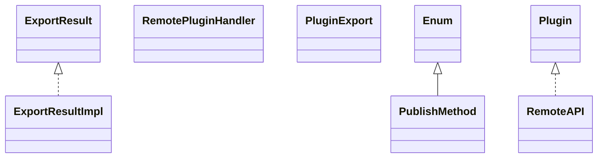

# jspf.remote.jar

[Group index](README.md) | [All archives](../README.md)

## Scope and provenance

- **Donor:** `SQX_145_REFERENCE_ROOT/internal/libs/jspf.remote.jar`.
- **SHA-256:** `9987cca1d084129a024a5c7132e561a039c9ec933cc8ebe8697bf89e79412652`; accessed 2026-10-06; captured `2026-10-06T18:54:51.906614+00:00`.
- **Classes:** 6 raw entries; 6 unique entry names. Duplicate occurrence indices are zero-based.
- **Inspection:** read-only ZIP hashing and class-file structural parsing; signatures/descriptors, modifiers, hierarchy and references only. Bytecode bodies are hashed, not published.
- **Allocation:** proposed `FEAT-COMPUTE-JSPF-REMOTE`, P14; [roadmap](../../sqx-full-application-roadmap.md). Domain README registration remains required.
- **Repository:** `01067f00031428613c6394064ca1bcadc1ba00ee`; review state unreviewed. Download label 145-dev1; installed build/activation and runtime equivalence unverified.
- **Limit:** every class/member is inventoried; declaration coverage does not establish consumed calls, defaults, formulas, failure semantics or algorithm parity.
- **Archive/resource index:** [071.json](../../../evidence/sqx145/archives/145/071.json).

## Complete member declarations

Member shards contain exact JVM names/descriptors, access flags, generic signatures, throws types, declared fields/methods, superclass/interfaces and referenced class names. All classes, nested/synthetic members and overloads are retained. Code length/hash is structural evidence, not a normalized algorithm comparison.

- [001.json](../../../evidence/sqx145/members/071/001.json) — SHA-256 `9b8984071fa6e2c196d6ea8f8a94d2f439304d842827afc447afa758b602e5b4`.

## Focused structural diagram

Up to twelve non-nested classes; arrows show declared inheritance/interfaces only. External type names are not evidence of an available body or an executed dependency.

## Class inventory

| Archive entry | Occurrence | Class SHA-256 | Fields | Methods |
| --- | ---: | --- | ---: | ---: |
| `net/xeoh/plugins/remote/ExportResult.class` | 0 | `c3af98e2639742ed65e993291d4b692c82bf950592a12ad580461efe1729c4fc` | 0 | 1 |
| `net/xeoh/plugins/remote/PublishMethod.class` | 0 | `256d297de341dffbc4f64c7cfeae7b6faba2e18f9cdea05771c6c6e5783de3df` | 8 | 4 |
| `net/xeoh/plugins/remote/RemoteAPI.class` | 0 | `897467bffcf80650fbb70422f355b83380fbf38c36f255f7774ee75d1ab51eca` | 0 | 4 |
| `net/xeoh/plugins/remote/RemotePluginHandler.class` | 0 | `5984997593037844dd5bc7fb83e6753c87fbe9896514fea1c53fbb62d28e15ab` | 0 | 2 |
| `net/xeoh/plugins/remote/util/internal/PluginExport.class` | 0 | `7a158970c40d9d707028ad47c78f6f20a2d0e303ffa71616fa6aff33f49b326a` | 0 | 3 |
| `net/xeoh/plugins/remote/util/vanilla/ExportResultImpl.class` | 0 | `f534456f6bc03343cda1c878b8669dc2adb20ce9fd576b101371916abeb3daca` | 1 | 2 |
