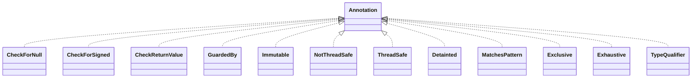

# jsr305-3.0.2.jar

[Group index](README.md) | [All archives](../README.md)

## Scope and provenance

- **Donor:** `SQX_145_REFERENCE_ROOT/internal/libs/jsr305-3.0.2.jar`.
- **SHA-256:** `766ad2a0783f2687962c8ad74ceecc38a28b9f72a2d085ee438b7813e928d0c7`; accessed 2026-10-06; captured `2026-10-06T18:54:51.906614+00:00`.
- **Classes:** 35 raw entries; 35 unique entry names. Duplicate occurrence indices are zero-based.
- **Inspection:** read-only ZIP hashing and class-file structural parsing; signatures/descriptors, modifiers, hierarchy and references only. Bytecode bodies are hashed, not published.
- **Allocation:** proposed `FEAT-HOST-JSR305`, P01; [roadmap](../../sqx-full-application-roadmap.md). Domain README registration remains required.
- **Repository:** `01067f00031428613c6394064ca1bcadc1ba00ee`; review state unreviewed. Download label 145-dev1; installed build/activation and runtime equivalence unverified.
- **Limit:** every class/member is inventoried; declaration coverage does not establish consumed calls, defaults, formulas, failure semantics or algorithm parity.
- **Archive/resource index:** [072.json](../../../evidence/sqx145/archives/145/072.json).

## Complete member declarations

Member shards contain exact JVM names/descriptors, access flags, generic signatures, throws types, declared fields/methods, superclass/interfaces and referenced class names. All classes, nested/synthetic members and overloads are retained. Code length/hash is structural evidence, not a normalized algorithm comparison.

- [001.json](../../../evidence/sqx145/members/072/001.json) — SHA-256 `50a72c5f08fb9b0e2c8860e42d8db31e24c4e6541d017ab3702121a77c0d030f`.

## Focused structural diagram

Up to twelve non-nested classes; arrows show declared inheritance/interfaces only. External type names are not evidence of an available body or an executed dependency.

## Class inventory

| Archive entry | Occurrence | Class SHA-256 | Fields | Methods |
| --- | ---: | --- | ---: | ---: |
| `javax/annotation/CheckForNull.class` | 0 | `5fa59b59f215cba12a540ca090fcb3f962e513c12cf01c868d1927916ca63af4` | 0 | 0 |
| `javax/annotation/CheckForSigned.class` | 0 | `d8a347f815d20158998dd5be8280459fd0babf792ada6656ad5872b82da1802b` | 0 | 0 |
| `javax/annotation/CheckReturnValue.class` | 0 | `2b6d2054baadaf5db7fcc6df157b83abb0e16fa9a2067a97aeb8018d142e9bb6` | 0 | 1 |
| `javax/annotation/concurrent/GuardedBy.class` | 0 | `c60ab8afab8f6597f3b48807c5d7b17090067ba9d8d77b1c1ae44c7931527fdf` | 0 | 1 |
| `javax/annotation/concurrent/Immutable.class` | 0 | `35ac11c7bbc605bc81763310ae2646ebdd61e97f0e841f022f4707ee5552482f` | 0 | 0 |
| `javax/annotation/concurrent/NotThreadSafe.class` | 0 | `8da8a5626599f3357c117fc105c8f693e6cb50de88ad92200850374916ae677b` | 0 | 0 |
| `javax/annotation/concurrent/ThreadSafe.class` | 0 | `5473ba9cba72d2560e7f311026cbcf0bf8d971b8e705bc2cf6c3a201a94f1e95` | 0 | 0 |
| `javax/annotation/Detainted.class` | 0 | `dbff06a53974a4aab588e70c00eccf5ba8ad633942ab23cfeb8faca9a1f6c8ac` | 0 | 0 |
| `javax/annotation/MatchesPattern$Checker.class` | 0 | `1d0903d9b801dbc95ac5929cc7bc78ba78dadf8c8b48ba4bd54831f401a3bd39` | 0 | 3 |
| `javax/annotation/MatchesPattern.class` | 0 | `80a8ca877069ed4b96c332dcf72d23125e026a7fb7d1fd4aceea963cf85e110f` | 0 | 2 |
| `javax/annotation/meta/Exclusive.class` | 0 | `582f4687e28058857069d15aab567c56db8c8b21e4533f05cee7a77c0366290c` | 0 | 0 |
| `javax/annotation/meta/Exhaustive.class` | 0 | `52fa2ba25b5c13c98b334bf913003870979c45961b57c33d55142eb7d97ae76c` | 0 | 0 |
| `javax/annotation/meta/TypeQualifier.class` | 0 | `65c01688d5002219c9dcb8a0defc5871e9587a1fdc23f9fe4ca3d0d129effb34` | 0 | 1 |
| `javax/annotation/meta/TypeQualifierDefault.class` | 0 | `246eef37fc67c2b37cbb9d97944e897fec1100e5aad3e3c240ee87e6c09e7d81` | 0 | 1 |
| `javax/annotation/meta/TypeQualifierNickname.class` | 0 | `60756aa9e427037f5d14c6b88716c62383acf6bb73b2f4579118b73391a087c3` | 0 | 0 |
| `javax/annotation/meta/TypeQualifierValidator.class` | 0 | `b955f075af35f689055ed007eaf80446e460d61e2c78e99c7674a7236b1666d5` | 0 | 1 |
| `javax/annotation/meta/When.class` | 0 | `2a8f8892c3c3bf72c1ba8b0bfe9fd09fe0ad68558954aa36f7aaf8f20eba5104` | 5 | 4 |
| `javax/annotation/Nonnegative$Checker.class` | 0 | `11130af801137746c018270467cba6764d1fa1f507d39edaa2007bd35d7f062b` | 0 | 3 |
| `javax/annotation/Nonnegative.class` | 0 | `50b23189867f2129fa7f6e68e0285106dd1a98a611a4974b668ca5329a3f8b89` | 0 | 1 |
| `javax/annotation/Nonnull$Checker.class` | 0 | `a179bdcda05127d700befba901422bf8170b28d3136921fa7f19ff3cea7a3b4e` | 0 | 3 |
| `javax/annotation/Nonnull.class` | 0 | `c0572d5c061ece17c11160bfeaed18ed7845d738fb76e0262ff19d4192f60178` | 0 | 1 |
| `javax/annotation/Nullable.class` | 0 | `ec67e16bda9e00f06bbb6dca85e39ee88239db8c6ea410bc322839af67373ded` | 0 | 0 |
| `javax/annotation/OverridingMethodsMustInvokeSuper.class` | 0 | `acb4b3e96eb9045ae3ae8c43be71870cdac6b5b958bc2df1510a166cf422cdc8` | 0 | 0 |
| `javax/annotation/ParametersAreNonnullByDefault.class` | 0 | `730fe9f413e529cc10e98f624c5552834ca07343f1b9451903c4027f964be4d0` | 0 | 0 |
| `javax/annotation/ParametersAreNullableByDefault.class` | 0 | `e986fcd305a1b512ddca018d194e2c3709e12a374c5399e0e4ee7b6ef7b77de4` | 0 | 0 |
| `javax/annotation/PropertyKey.class` | 0 | `e4e5548e071a2f0b5e6e191bdfaa98e80b7053b3bd3566913973b9684badf31d` | 0 | 1 |
| `javax/annotation/RegEx$Checker.class` | 0 | `2b2cad66ce6254c4a7117aa5eabff360077c3aaa46eb43f06472ef0f5c49c806` | 0 | 3 |
| `javax/annotation/RegEx.class` | 0 | `dd4449a4d6cb80594d1a1d0523daed49fd2008c2e54a5aa4f7507d0de7d4dfa6` | 0 | 1 |
| `javax/annotation/Signed.class` | 0 | `3235c957f0d766a7f72955875c663f078fb33eb3e2ba6c0f3ff494cb63c48c6a` | 0 | 0 |
| `javax/annotation/Syntax.class` | 0 | `1179a64e0c0556d7f0040caaa4219c4f7c0e9b26e8f4ace9d764b01a23f0ca54` | 0 | 2 |
| `javax/annotation/Tainted.class` | 0 | `2aaf8d9de64111525186d8019835ec19e6c25a2735e2e2c34be80a2ca5370ec7` | 0 | 0 |
| `javax/annotation/Untainted.class` | 0 | `b1d1e05dffd012fc3541002955db5acb653c7d5497b12d3866d7b67769730209` | 0 | 1 |
| `javax/annotation/WillClose.class` | 0 | `599ca8acb5ed1bec57ab6d2b2eb4674327de774cc37d68f5b1cfb20a2a15f3ca` | 0 | 0 |
| `javax/annotation/WillCloseWhenClosed.class` | 0 | `7eb5c0b358f08f56c927a9676630852e438c5474eb044a6d85b51d6de7a87017` | 0 | 0 |
| `javax/annotation/WillNotClose.class` | 0 | `dc518608313b1d11a78cd378bc9a40cc1e9b977e5136d1ee7e412009ef9e8793` | 0 | 0 |
