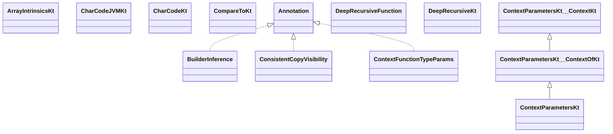

# kotlin-stdlib-2.2.21.jar

[Group index](README.md) | [All archives](../README.md)

## Scope and provenance

- **Donor:** `SQX_145_REFERENCE_ROOT/internal/libs/kotlin-stdlib-2.2.21.jar`.
- **SHA-256:** `6558a3d233da56a20934b32159f9db5f86ed5816ef098f78a2c223dc6abb79dd`; accessed 2026-10-06; captured `2026-10-06T18:54:51.906614+00:00`.
- **Classes:** 974 raw entries; 974 unique entry names. Duplicate occurrence indices are zero-based.
- **Inspection:** read-only ZIP hashing and class-file structural parsing; signatures/descriptors, modifiers, hierarchy and references only. Bytecode bodies are hashed, not published.
- **Allocation:** proposed `FEAT-HOST-KOTLIN-STDLIB`, P02; [roadmap](../../sqx-full-application-roadmap.md). Domain README registration remains required.
- **Repository:** `01067f00031428613c6394064ca1bcadc1ba00ee`; review state unreviewed. Download label 145-dev1; installed build/activation and runtime equivalence unverified.
- **Limit:** every class/member is inventoried; declaration coverage does not establish consumed calls, defaults, formulas, failure semantics or algorithm parity.
- **Archive/resource index:** [073.json](../../../evidence/sqx145/archives/145/073.json).

## Complete member declarations

Member shards contain exact JVM names/descriptors, access flags, generic signatures, throws types, declared fields/methods, superclass/interfaces and referenced class names. All classes, nested/synthetic members and overloads are retained. Code length/hash is structural evidence, not a normalized algorithm comparison.

- [001.json](../../../evidence/sqx145/members/073/001.json) — SHA-256 `14f491abf8021398f2396bb5364473b0856cd49e85e01cb06c19fb85b1b12caf`.
- [002.json](../../../evidence/sqx145/members/073/002.json) — SHA-256 `3dd0b87441bdc158e133a0f11a5548d3fa9dd670f0356cde068e6b3df3a90088`.
- [003.json](../../../evidence/sqx145/members/073/003.json) — SHA-256 `73553c06291ced5c9d5e522e389da6a7b2b1de5c1995d96e421aa0b83a336695`.
- [004.json](../../../evidence/sqx145/members/073/004.json) — SHA-256 `b6e3c3e08e8f26450241510dfdcd403f59b3aa458debf68e7c5effdef8e81a9c`.
- [005.json](../../../evidence/sqx145/members/073/005.json) — SHA-256 `c2045ff11f30e09651ab2aaf6c54e899f8a9fd3bf41447ed67c9943b75e27ede`.
- [006.json](../../../evidence/sqx145/members/073/006.json) — SHA-256 `5734d1ca50bf6864f9c2688403cb22e11bfb079e59e7042748d893365112baae`.
- [007.json](../../../evidence/sqx145/members/073/007.json) — SHA-256 `2973cdd8f8be49650c23c81886a215468ffc1351b62da1a258270ec6cff43df3`.
- [008.json](../../../evidence/sqx145/members/073/008.json) — SHA-256 `77be417c9b110b7cd86bc64c652cde7884d92f0377ba2cfa60be94f8624657a5`.
- [009.json](../../../evidence/sqx145/members/073/009.json) — SHA-256 `7cb4f3854ec28ea5409ef4c6246f4eb4b0f290b86e07df3df73ee33198c2ee92`.
- [010.json](../../../evidence/sqx145/members/073/010.json) — SHA-256 `c3f868c1ee1b1930406b6049821f87469ea126fa32f39d512e89443ae8b7e5a5`.
- [011.json](../../../evidence/sqx145/members/073/011.json) — SHA-256 `441d2b1d0763f0ee3e1901bc9101f1ac0878a999d16555fd8ff1c3723c25099d`.
- [012.json](../../../evidence/sqx145/members/073/012.json) — SHA-256 `fc032e8662d54a18b1992948b0bd2c2a834c0af1feb955e00eb77214fec4c70b`.
- [013.json](../../../evidence/sqx145/members/073/013.json) — SHA-256 `6c749da1c7a654d77d5a7567c3382f1b9bbb208762f0a0a9fd9cf7cafb721a87`.

## Focused structural diagram

Up to twelve non-nested classes; arrows show declared inheritance/interfaces only. External type names are not evidence of an available body or an executed dependency.

## Class inventory

| Archive entry | Occurrence | Class SHA-256 | Fields | Methods |
| --- | ---: | --- | ---: | ---: |
| `kotlin/ArrayIntrinsicsKt.class` | 0 | `181cd2e3719d4cd6c06d406fe2b1fd4a5c1399c3a6df8099875663a8c7bca9c3` | 0 | 1 |
| `kotlin/BuilderInference.class` | 0 | `b1220ae39198d2c440ddc9bce8f869e30a9f2832f7cbc5cdab02a4985ff888bd` | 0 | 0 |
| `kotlin/CharCodeJVMKt.class` | 0 | `ca11840658b0ce15242807eb73edd49aba4d6228586d5c81ecfe052b4bf38c3f` | 0 | 1 |
| `kotlin/CharCodeKt.class` | 0 | `6ff2802d5f684fc380c1ef514b5d898d5c55373443c815f18a151d70520997ad` | 0 | 3 |
| `kotlin/CompareToKt.class` | 0 | `9102aad55cb8dd0c135d39bc34edb87167d48243f7941c48d7c10459ae226ad3` | 0 | 1 |
| `kotlin/ConsistentCopyVisibility.class` | 0 | `d5e255e462bbc188b0416d0d03b96dbaceea357f29936ef9725b6db1ab8af866` | 0 | 0 |
| `kotlin/ContextFunctionTypeParams.class` | 0 | `d13fc1ef47fbfec254418dad761b2503dcd9c61dbae1f82e131e31d34fd9e66f` | 0 | 1 |
| `kotlin/ContextParametersKt.class` | 0 | `44be56a7a25c733ba9befe53c4fd7bf45b8997de26b534632fbf0a68886cfb77` | 0 | 1 |
| `kotlin/ContextParametersKt__ContextKt.class` | 0 | `cab022f5fa6cd52e4f3eae61151ca935c69bd4d1cac050f92158c132aaa353cd` | 0 | 23 |
| `kotlin/ContextParametersKt__ContextOfKt.class` | 0 | `53c30f9fc3a1861b3a31912097e41c6303f665ee3d5492593ce5b81b278a5d18` | 0 | 2 |
| `kotlin/DeepRecursiveFunction.class` | 0 | `3b51984b809005b7c53505e78fca2a7686741182ee75cbcfbd137ea18fa9ad06` | 1 | 2 |
| `kotlin/DeepRecursiveKt.class` | 0 | `1afef8047bded493c73e76f0e382b48f45de5ef5b89566848b2904e34a631908` | 1 | 3 |
| `kotlin/DeepRecursiveScope.class` | 0 | `deaa6855b930b1829273c1506ffbb5817d82331b60cca0a0f4c7443d81e73a68` | 0 | 5 |
| `kotlin/DeepRecursiveScopeImpl$crossFunctionCompletion$$inlined$Continuation$1.class` | 0 | `dcf0829608a498f527a040ece8e00e1a968ac5cd08eef3ddef0acd1ba74c34b7` | 4 | 3 |
| `kotlin/DeepRecursiveScopeImpl.class` | 0 | `232207b643a27b0a4dcd2ec57a7e1557398e08094625510a5a596ceee92f1b8a` | 4 | 10 |
| `kotlin/Deprecated.class` | 0 | `8f9543be31bde0b0df21151b461dfde6c030df4e433980339c6fa759be572cfb` | 0 | 3 |
| `kotlin/DeprecatedSinceKotlin.class` | 0 | `604f823d2cd837d5cf50cceaf494dfb6670e5cf70fc687c601e9e6b27ed1eb9f` | 0 | 3 |
| `kotlin/DeprecationLevel.class` | 0 | `ac00f0b572a3140fcbe14d365bdf37c63fb04487d7b46d2a28d658c51ff07714` | 5 | 6 |
| `kotlin/DslMarker.class` | 0 | `2d5b2cbc6322288e519bb56b40192afc36e0322d94ad7d11dd6da326040b5add` | 0 | 0 |
| `kotlin/ExceptionsKt.class` | 0 | `89b2416880c26d5931cc9257ec2e2c3c62698aa3fd5d2b6aef7bd24fbc7dbbe0` | 0 | 1 |
| `kotlin/ExceptionsKt__ExceptionsKt.class` | 0 | `7e7b980fe002fd5c2d016db817ced47b4c9eae29f5cd5a35e5e59a74e80f2f48` | 0 | 10 |
| `kotlin/ExperimentalContextParameters.class` | 0 | `4fbc81887c3b869808eedaa562bb6d8341c691c2273aa9bb675f668496e5aee9` | 0 | 0 |
| `kotlin/ExperimentalMultiplatform.class` | 0 | `502673b3b5e0331d6eae0ee514c2c76c1e306e236f57f9a506b8e90005615d21` | 0 | 0 |
| `kotlin/ExperimentalStdlibApi.class` | 0 | `1779f1af48a6d80c93c34605b9bf4195928943e5ff333cf631e19f98223bc84f` | 0 | 0 |
| `kotlin/ExperimentalSubclassOptIn.class` | 0 | `5f222b6aedfe55caa554363abd8b06316dd08454fc2f830067b47a4575a53fdd` | 0 | 0 |
| `kotlin/ExperimentalUnsignedTypes.class` | 0 | `2c9252ac75315ae50c84262f5acfb267ab81c4db48f6230a5e0a259a92ece89b` | 0 | 0 |
| `kotlin/ExposedCopyVisibility.class` | 0 | `fcc7bb576a3417565efb6814b63bb597bf399be7c3f5013437113ed95a901837` | 0 | 0 |
| `kotlin/ExtensionFunctionType.class` | 0 | `9e273d1c67c5005649a8dc8442297acdfa2ef5438b3bd017145cfc0aca28abb4` | 0 | 0 |
| `kotlin/Function.class` | 0 | `cdc030d01b0bdeabb3fde4119158ee95f1c080ef8f803f6bb27b18b6a6ae29d3` | 0 | 0 |
| `kotlin/HashCodeKt.class` | 0 | `202e82b710f4705d332837f736e21f0b35cb70418bf9de59cc03a3eaeab5ec47` | 0 | 1 |
| `kotlin/IgnorableReturnValue.class` | 0 | `e9c006e1a2e4c25107d4cc2b14ed22c8c84d84befa6beb3a3717061961ca7e22` | 0 | 0 |
| `kotlin/InitializedLazyImpl.class` | 0 | `fd36153e5743507e6372e5a6cccb7a362a1e7757c531e2f7f30d5944d2a6833c` | 1 | 4 |
| `kotlin/KotlinNothingValueException.class` | 0 | `274ae7cfcb7f0950eb2526db76ff6c5a06b87b3c190a9297d52f89dd0e6ffc16` | 0 | 4 |
| `kotlin/KotlinNullPointerException.class` | 0 | `3585837e0d34eb42a8d248687d7786ae9c9ae2de80dedd2de3de775fcc03251b` | 0 | 2 |
| `kotlin/KotlinVersion$Companion.class` | 0 | `ad882b97201827b2bc273844a6ca808dbc87c340874431cc106db80cc858d972` | 0 | 2 |
| `kotlin/KotlinVersion.class` | 0 | `a33fe09cb48379705d77efd53caf3986f41b6fbbe48199c01087fa068ce04128` | 7 | 14 |
| `kotlin/KotlinVersionCurrentValue.class` | 0 | `e14907675d02c5707cdc453c45aa847c4f746b91256b5a08fdd011834b09a7e6` | 1 | 3 |
| `kotlin/LateinitKt.class` | 0 | `9bf715c3f279f37dd8043af69e67fed434555ddc24562d37572d10bb06ae5b49` | 0 | 2 |
| `kotlin/Lazy.class` | 0 | `e42d11416d5df04ca5edaf56c7473cdfec2754b2b312e3cb7a5efeab958399ba` | 0 | 2 |
| `kotlin/LazyKt.class` | 0 | `8bccd4d50f8a0097744b645330b346a745d9778cfcc5f3bed047f2ad1bb02bd9` | 0 | 1 |
| `kotlin/LazyKt__LazyJVMKt$WhenMappings.class` | 0 | `fa549923484646d4904ce264ac7b855a5834335c52fc002a2308712225a7bd93` | 1 | 1 |
| `kotlin/LazyKt__LazyJVMKt.class` | 0 | `098898e0cb4e4b39371f7a5d569a450602ac18baae9b5634f2672d5a75cf2c5d` | 0 | 4 |
| `kotlin/LazyKt__LazyKt.class` | 0 | `540d940edd76226267149085745703cc5b63fe1d3df5939bfa16fb54c4b52811` | 0 | 3 |
| `kotlin/LazyThreadSafetyMode.class` | 0 | `4b401312c1cbcd53d78415afc95eadf75603dc02d12c30202d101e085ede2ad0` | 5 | 6 |
| `kotlin/Metadata$DefaultImpls.class` | 0 | `3965416e465259342889b7fa137837dbb04a79590c0cd2dc3f1b820e73331ae1` | 0 | 3 |
| `kotlin/Metadata.class` | 0 | `6e738050a75d0cc6529cc425323f517bc0c710d705f239b791a24e12733d5b49` | 0 | 8 |
| `kotlin/MustUseReturnValue.class` | 0 | `85df042a2f5785b44651585e8b84c63067c1b3a48d7e9bbb4eb6c39acbd033e9` | 0 | 0 |
| `kotlin/NoWhenBranchMatchedException.class` | 0 | `a40b8c19851d83166f2eaec0980b41c8a42f26d3d7ce1bd40ca01b1556d79f8e` | 0 | 4 |
| `kotlin/NotImplementedError.class` | 0 | `2bae1882df67590128254d8284934b101142bd8c29ddbd58797abea8c79ded56` | 0 | 3 |
| `kotlin/NumbersKt.class` | 0 | `555e79f03d8e4c041dc6f1ceee61ed091476765f5c75c29e90e6209c54138dd8` | 0 | 1 |
| `kotlin/NumbersKt__BigDecimalsKt.class` | 0 | `99932cd785c30b52694e5ccee179d0b723b7e7e37db52d5c284487b70cd232fd` | 0 | 17 |
| `kotlin/NumbersKt__BigIntegersKt.class` | 0 | `b7ee1abfa4594823c77f392f095c4446692e6212b01491cd3837fbdb318c6862` | 0 | 20 |
| `kotlin/NumbersKt__FloorDivModKt.class` | 0 | `5b18636ff8a41afca5648b062634fe915b15f3f4566f5b62b63c4fbdfea9e5b2` | 0 | 37 |
| `kotlin/NumbersKt__NumbersJVMKt.class` | 0 | `7db3ff82f19520d84eb40d88264ec5630e9e95b2af57da9729310bd74a81863a` | 0 | 27 |
| `kotlin/NumbersKt__NumbersKt.class` | 0 | `dfe9719758b6e2a06bdd506ac4d199af37d1be10b5c8992f345616ae3f9dfd12` | 0 | 15 |
| `kotlin/OptIn.class` | 0 | `8b92cc778cb2a3746fd89ccf39618e647d7475ab9b6670cb3f1e5a7e41567195` | 0 | 1 |
| `kotlin/OptionalExpectation.class` | 0 | `f602276da65873691d8b28df8101e3993617f00059f3f467acb9cb1a99fbc68c` | 0 | 0 |
| `kotlin/OverloadResolutionByLambdaReturnType.class` | 0 | `037243507021bceba223edd521db5ea428864cf0fb849ca49565633928d8085a` | 0 | 0 |
| `kotlin/Pair.class` | 0 | `6d9913787423a01687717e8e8086638c0ef7ed39121e00c161f7bf8ed1526a4d` | 2 | 10 |
| `kotlin/ParameterName.class` | 0 | `05e2ed92b076c618a4d3880a5956c44d523dc349be75ebe264d37ccee45e5ae5` | 0 | 1 |
| `kotlin/PreconditionsKt.class` | 0 | `1d83243f956b2c3b87cce19cf3d7e9e2a178cb709e6fc55170110e8b0b856288` | 0 | 1 |
| `kotlin/PreconditionsKt__AssertionsJVMKt.class` | 0 | `a4be14a64f82b8c0649287cf0c97ac18f814e1882c544626e9daa1dba5163017` | 0 | 3 |
| `kotlin/PreconditionsKt__PreconditionsKt.class` | 0 | `ac365d71bab5d21976f8d785305b404506b7213fc7c020835fdff3e3c13c4f03` | 0 | 10 |
| `kotlin/PropertyReferenceDelegatesKt.class` | 0 | `c347043d026ea5dcbb55a21f096079e41fbc60bd7da9a50945d07f55bde196f9` | 0 | 4 |
| `kotlin/PublishedApi.class` | 0 | `45de1081462e2866cc0598071bfb92a3205b9a2c429c6a8aa538690cdf96b696` | 0 | 0 |
| `kotlin/ReplaceWith.class` | 0 | `07f18c462954220cbc2da9317fd8bd0ab01dca863add11462ee4188d5cca808f` | 0 | 2 |
| `kotlin/RequiresOptIn$Level.class` | 0 | `71c9fe2728f585c55941fd4282ab867b9281600f7c51ada5589ac387c70bc094` | 4 | 6 |
| `kotlin/RequiresOptIn.class` | 0 | `7317f19161f6448a1b70f22dfb0e400ca8597c866b225f5556c44a839315dcd7` | 0 | 2 |
| `kotlin/Result$Companion.class` | 0 | `59ac7d99f0fe4e90bedfc0b79a004e654945a031127be4380a4ea480b57afbdb` | 0 | 4 |
| `kotlin/Result$Failure.class` | 0 | `eb348a8896b15146251278412a58db768c09a01ee3b40439d62ff1c0df3b76cd` | 1 | 4 |
| `kotlin/Result.class` | 0 | `2a40aa8459a8aeb15b375f62382a91b44b9f44b7fb5c078207175d90b085a89c` | 2 | 17 |
| `kotlin/ResultKt.class` | 0 | `6b5bf14a071c038cd7aaea8bf84899628b3a973c64c14e019357d2eed96a9bf1` | 0 | 14 |
| `kotlin/SafePublicationLazyImpl$Companion.class` | 0 | `a9b610125bba8efdf5d1da8d73909b6695b90b4a0e1bdaa2a497254bceef365a` | 0 | 2 |
| `kotlin/SafePublicationLazyImpl.class` | 0 | `15246ab7759a02b8ba06f6725e95b6f3add17ec086f214c1598b6c7e09d0a1ef` | 5 | 8 |
| `kotlin/SinceKotlin.class` | 0 | `df68acb6acc6d2f6ce57bf9b2adc3e9fd13e75caefc2492c1e0ceff5ec3b8e20` | 0 | 1 |
| `kotlin/StandardKt.class` | 0 | `a5752e8b13546b16595d651a6eaff95a249a420196ba18da91c6513c789c7586` | 0 | 1 |
| `kotlin/StandardKt__StandardKt.class` | 0 | `bf0a0bf9c239441d3988b7274ba3c64bcb4d1cdfa54554dc57e80353d096c1a6` | 0 | 12 |
| `kotlin/StandardKt__SynchronizedKt.class` | 0 | `69c5fc8303c93d39cd6b879334bc327cc898e6984d4f97efe368578097609a0c` | 0 | 2 |
| `kotlin/SubclassOptInRequired.class` | 0 | `67756f9001a67b591a05cf6d9e47786b1a27657046b8df981f2d06e032f522ec` | 0 | 1 |
| `kotlin/Suppress.class` | 0 | `1f3947fcb0a4d164d8ece08cc6419f3e8aa7e70b7af83ce57088130cbbfbe15b` | 0 | 1 |
| `kotlin/SuspendKt.class` | 0 | `66daa5eb3acfaf91e06dd0ef1047e722170e616d28225dbf01ccb1b2a832d30a` | 0 | 1 |
| `kotlin/SynchronizedLazyImpl.class` | 0 | `ed84525304a4e0fc606a73e087df0b05ed44d48af71af722b4a3ee4512996348` | 3 | 6 |
| `kotlin/ThrowsKt.class` | 0 | `84bbec6440d5fb01d663aac345ce9211155e697f244a0bd74c2238c7055b57ea` | 0 | 1 |
| `kotlin/Triple.class` | 0 | `90b434b14ea307bee87607fd07ae0d24b1062d41578890622af9e6d10ebd9676` | 3 | 12 |
| `kotlin/TuplesKt.class` | 0 | `7b416da7ca0ad455dd8573b939cc221ab91cc7115fc0c4e328bd2fe98a7fb203` | 0 | 3 |
| `kotlin/TypeAliasesKt.class` | 0 | `410d5a2a0baab2c42797a452736748256a12ded5c4de44beaf7939781a6853e3` | 0 | 15 |
| `kotlin/TypeCastException.class` | 0 | `6c438b6ab1ac6fbe081637b704b73ac3dca4fb9d039632d7746e773a3ac76f56` | 0 | 2 |
| `kotlin/UByte$Companion.class` | 0 | `6c1ca2d73f07e9dcbe23d8ec8d188a6372c3fc8bf4818ec0b1b6f9d003b41e06` | 0 | 2 |
| `kotlin/UByte.class` | 0 | `fbc7f46ef62683164a181b5240fdc0b06a736b087cf7689c31e220f28392e00a` | 6 | 65 |
| `kotlin/UByteArray$Iterator.class` | 0 | `f346d9e1faf55d473e0e62bd15ddcdb1af89ed783cc25be7b550fc7e7fbf4b35` | 2 | 5 |
| `kotlin/UByteArray.class` | 0 | `95052212d30ea88805386efce765a42a35942320524bb4803ec25f9f8db4d9d4` | 1 | 36 |
| `kotlin/UByteArrayKt.class` | 0 | `39f1e1b10e7da939162e7d2e0664a662cc256b24d6dd9550bad41bf4b83bb934` | 0 | 2 |
| `kotlin/UByteKt.class` | 0 | `549395a6cfd586ccdc1f6db9c03cf4b1585997bf76dd399541af87469cdcb23f` | 0 | 4 |
| `kotlin/UInt$Companion.class` | 0 | `1a7438ccbc4d224a34fcf997e2c6a9fcdf900bc4a6e7bd59f0cae94d6b8fa196` | 0 | 2 |
| `kotlin/UInt.class` | 0 | `23223db24ea121c2ec682385a72ef7a8bd1f9370aa0cdc896a5d9a4d0f03814b` | 6 | 67 |
| `kotlin/UIntArray$Iterator.class` | 0 | `12f364f57df7ff540a6ec0d45690a967d7508d9781a0816e7929ca6493742dfc` | 2 | 5 |
| `kotlin/UIntArray.class` | 0 | `8b6c8fb157269bcaf0c45ae061401b29ecd09c0d1fc07adec8676ad5e516c6de` | 1 | 36 |
| `kotlin/UIntArrayKt.class` | 0 | `334b63e4f12c8561a353dc668e03ed4e8f80c22647a48f3ebd08b91eb7034f54` | 0 | 2 |
| `kotlin/UIntKt.class` | 0 | `92899a893579ac01ee457ada0eee287fc5e41897de8f81e291186d317fd2c17c` | 0 | 6 |
| `kotlin/ULong$Companion.class` | 0 | `e138bdda85c163c2fdea43a725c2cd5c33f5527b7c8c71ee6f7c9dca9ff897fa` | 0 | 2 |
| `kotlin/ULong.class` | 0 | `50c42fa79abcb67fef80aaabb189687c7f0a1b9b9459a703380abcd065c0951b` | 6 | 67 |
| `kotlin/ULongArray$Iterator.class` | 0 | `4368eb4a6973c88e8ba8f35bf1aff6527acb6a25d7443ad9f539ccbe30bc2e5d` | 2 | 5 |
| `kotlin/ULongArray.class` | 0 | `a979900bc1106bbd2fb8083024ff58a192200a479364b0346c0163002bb32a6b` | 1 | 36 |
| `kotlin/ULongArrayKt.class` | 0 | `14b13c514d5ae3e575318e459cb2c3568af3588bf4659b49ce861a21e639954e` | 0 | 2 |
| `kotlin/ULongKt.class` | 0 | `cd363804f418e9ebe6d3f76fa126459459da76decc5d0373bcf7546b72db2e66` | 0 | 6 |
| `kotlin/UNINITIALIZED_VALUE.class` | 0 | `11d576bb87b947b940c1406f38d40429f25321818e40e3ce475774559efe7189` | 1 | 2 |
| `kotlin/UNumbersKt.class` | 0 | `69a02b856b1d45ea8f91193088daa6051cc9c5db8aef37099a37d66d7d289cf6` | 0 | 28 |
| `kotlin/UShort$Companion.class` | 0 | `89bde21b5decf510a1df8cc1819b77ec39c2ab818a74819541cf747f84d13947` | 0 | 2 |
| `kotlin/UShort.class` | 0 | `0f679995312c8d0b653e5cf08dd00c52797d0a95f6dc25f63c711083e0b44fb5` | 6 | 65 |
| `kotlin/UShortArray$Iterator.class` | 0 | `b5323edd9192d887471611dd0850854d849cca9eb60f4a1090d8f0f725ee4d00` | 2 | 5 |
| `kotlin/UShortArray.class` | 0 | `f02605e073130949c8700c430c8faf66db77ff0fd4272219726d58135dc91fae` | 1 | 36 |
| `kotlin/UShortArrayKt.class` | 0 | `2e4a936803d88ea95f2e677052b122ef226a11c59a99a42bf02ed79bfa928281` | 0 | 2 |
| `kotlin/UShortKt.class` | 0 | `07151c199e1ce955368535d52b781fa06310922805ef3eb878392bacff0395f3` | 0 | 4 |
| `kotlin/UninitializedPropertyAccessException.class` | 0 | `c84b9b52d69574a9d92a21abb79d30cdf7ac3351a2fc835ef12d9b1c9ae3bae5` | 0 | 4 |
| `kotlin/Unit.class` | 0 | `85ee08a22e0de6196ee5ae04bec47353ffd651131609fa3bf9b5be34524b3786` | 1 | 3 |
| `kotlin/UnsafeLazyImpl.class` | 0 | `ee502a24de59f5bcd62c36499819a24c516bd8a400f64642a1956d1c6f330124` | 2 | 6 |
| `kotlin/UnsafeVariance.class` | 0 | `363eafd0df06b561dad83d89deca8d0a6ca4b7c3f459e07282a6c36fa187b958` | 0 | 0 |
| `kotlin/UnsignedKt.class` | 0 | `4ddad7d1e441ad9f68fe0f54fe33077410bc45466f7a3405d2b956ff9d1cd6ef` | 0 | 20 |
| `kotlin/WasExperimental.class` | 0 | `0b2f28124b5d7dcfaf1471b44d873138b46249366924751381f1de15597e9b6e` | 0 | 1 |
| `kotlin/_Assertions.class` | 0 | `efc688ad5c7f6748eafd067a9b65545f487cf93f44ca3096c73d33cbbecfefda` | 2 | 3 |
| `kotlin/annotation/AnnotationRetention.class` | 0 | `f4f0b2b2e7ce4510fd9d44e4f71d11b5ca589c0595fe6a35575deac259a54cc2` | 5 | 6 |
| `kotlin/annotation/AnnotationTarget.class` | 0 | `d105d4f09419b505ba28829b782648aba60fc035d284c84717b1f749cd46dbf3` | 17 | 6 |
| `kotlin/annotation/MustBeDocumented.class` | 0 | `cb189950591e04f40372b82f45a87498cd49aeb39775c7cd46dea883378b436a` | 0 | 0 |
| `kotlin/annotation/Repeatable.class` | 0 | `ff3d7dfacfd7dc4f9d5a7c786651311a316e76ecd597bf72f8936e681130caa4` | 0 | 0 |
| `kotlin/annotation/Retention.class` | 0 | `a88d3c3814ba0b3b288a13fbb024465c5d120883230933cc8133069751c77020` | 0 | 1 |
| `kotlin/annotation/Target.class` | 0 | `9ab4ffc9af862e9b80822e2cd7235ed2bd62539147cca7723c5edbedad47f8e3` | 0 | 1 |
| `kotlin/collections/AbstractCollection.class` | 0 | `28636a91f0b6e8e1f47986ebf795ac93d68119ae7bad831694f9bbce71b24a6c` | 0 | 17 |
| `kotlin/collections/AbstractIterator.class` | 0 | `33aa7210394d416c8cfdf5528962b9547fdeaeb134d85b476b60e2ee572d78f0` | 2 | 8 |
| `kotlin/collections/AbstractList$Companion.class` | 0 | `bf0028b0988dc952fbb82f3567fa06d072ba6f9e886976ae1382807583b0a43f` | 0 | 9 |
| `kotlin/collections/AbstractList$IteratorImpl.class` | 0 | `12592c4f14648ec767d9977f9b001d2f19bf5ad1a1a0476d31e72bf7702a8082` | 2 | 6 |
| `kotlin/collections/AbstractList$ListIteratorImpl.class` | 0 | `500dd031aee02c40ff5881121e930db51cf5af2ea6b8127657779dda73b2b440` | 1 | 7 |
| `kotlin/collections/AbstractList$SubList.class` | 0 | `7d5d9121af45e4f33dffd421e013654e7b944538eb6e54f92a4b9d321540ec21` | 3 | 4 |
| `kotlin/collections/AbstractList.class` | 0 | `2e637de829b7f8da62a9ae10a4379d28840f8bf235d60e9f61ee64ba61cd9dac` | 2 | 16 |
| `kotlin/collections/AbstractMap$Companion.class` | 0 | `870f4e86ad9dccc0e8f9a5fa86b45eb10e3159ad4f6115eb123ff3804c24b157` | 0 | 5 |
| `kotlin/collections/AbstractMap$keys$1$iterator$1.class` | 0 | `efbd9803ead56a5f03edd458f69a26f9cf37bf957412184927a15c8fb60d9fd5` | 1 | 4 |
| `kotlin/collections/AbstractMap$keys$1.class` | 0 | `c91cfc192e78d6193ab6d6972cf0a2e12a4cc177fcd59243abed7c3ba108635d` | 1 | 4 |
| `kotlin/collections/AbstractMap$values$1$iterator$1.class` | 0 | `16ebf83d1d31a36ea45080f2ae2a94dbe361b239388b140b1e0fe0ba8a0c8610` | 1 | 4 |
| `kotlin/collections/AbstractMap$values$1.class` | 0 | `3e16d0547cb8241cd46d802cde4f554bdb07fdb57556a8769d1bd38031e79468` | 1 | 4 |
| `kotlin/collections/AbstractMap.class` | 0 | `308dd0dc4d4832e6f438970bc5aff7a7ac7fb0e097a2807b56509fe4bcbc4e52` | 3 | 26 |
| `kotlin/collections/AbstractMutableCollection.class` | 0 | `e5d87e53c84a348e568f24fcdeab84cb5578bc85513106eadd1c00ef92f83f71` | 0 | 4 |
| `kotlin/collections/AbstractMutableList.class` | 0 | `ad997652892dae873aea175e2303b2be9b0e2fa7bc95a5558436704a35756d35` | 0 | 7 |
| `kotlin/collections/AbstractMutableMap.class` | 0 | `4fd5c0e7e91add36b6c9cb894f84c7eddca2fc0f10247875f60f9952edcbf960` | 0 | 10 |
| `kotlin/collections/AbstractMutableSet.class` | 0 | `a37b0b4c901aa7e70eea6149c610a77fc595299cb5a404391ddb1755b1d0c12c` | 0 | 4 |
| `kotlin/collections/AbstractSet$Companion.class` | 0 | `59407f3d0911a1705209e1ab35d95abbd6d7952cdc7cd130697a543e02149c5e` | 0 | 4 |
| `kotlin/collections/AbstractSet.class` | 0 | `6074ef239529d3fd5ff8990efb1bed4dca60fc8af832ae53df13eb5fd79b4b55` | 1 | 5 |
| `kotlin/collections/ArrayAsCollection.class` | 0 | `d8a661dc2f576e656eb3910d06ac2f3f590ac143fbcf8faddc20e62c3503b1d8` | 2 | 17 |
| `kotlin/collections/ArrayDeque$Companion.class` | 0 | `a34826d3f643a1d26728415bf34548a7d05137f45f36dd2c5d52316731bcf6cf` | 0 | 2 |
| `kotlin/collections/ArrayDeque.class` | 0 | `33e961261ce14d4402e89dc3197bcae36d688e72ee6a443296f02bb16e89ed39` | 6 | 51 |
| `kotlin/collections/ArraysKt.class` | 0 | `a1fdd5dfcf86b594a6047c81fdee60236d27fa701d11e0d60120769984c8533d` | 0 | 1 |
| `kotlin/collections/ArraysKt__ArraysJVMKt.class` | 0 | `ca3d2ea86cad42eb9745e34640f0ebd8f95eff0171b303ffbd37f8040d067b01` | 0 | 7 |
| `kotlin/collections/ArraysKt__ArraysKt.class` | 0 | `a3bba2421c195e7f2f8fab8de97480eb362b94831fe64e4784df625b04cbdd3c` | 0 | 8 |
| `kotlin/collections/ArraysKt___ArraysJvmKt$asList$1.class` | 0 | `07a2453b6dcdba89c0be38f5dbce25b69ace436944bafd2937d276811136b5eb` | 1 | 11 |
| `kotlin/collections/ArraysKt___ArraysJvmKt$asList$2.class` | 0 | `214551b13ed5e6f2baf39dd94099f8638c5293e0135b07ec7b7a1e803c160b11` | 1 | 11 |
| `kotlin/collections/ArraysKt___ArraysJvmKt$asList$3.class` | 0 | `07840b1edb26b71290e9559ba7c8b54230a87a06c27acd18e207fd590f077736` | 1 | 11 |
| `kotlin/collections/ArraysKt___ArraysJvmKt$asList$4.class` | 0 | `023cfe15ad1d8a3eef547ac1979e9ee14f16a14c76451204b41dddbc2f0a297e` | 1 | 11 |
| `kotlin/collections/ArraysKt___ArraysJvmKt$asList$5.class` | 0 | `efc454cc71a7adac469cf16570f0b8cd64744f9e6280d9359a33793ca1f20fe3` | 1 | 11 |
| `kotlin/collections/ArraysKt___ArraysJvmKt$asList$6.class` | 0 | `1f9ca3d559933c3c9601062e49692ff98a79efed361a0dd2c5ba2ca393e17344` | 1 | 11 |
| `kotlin/collections/ArraysKt___ArraysJvmKt$asList$7.class` | 0 | `fdc466f8c0a7e66f81733a1be08ada3b767c8a199eed985fb00fe24e7352d087` | 1 | 11 |
| `kotlin/collections/ArraysKt___ArraysJvmKt$asList$8.class` | 0 | `7cb3160db9721c2fd1ae18dac3ef86fec9cef3f78cb60af9f18e04ad48e2509f` | 1 | 11 |
| `kotlin/collections/ArraysKt___ArraysJvmKt.class` | 0 | `a6219f07765a1ab1ca68a93e214778c3b372f2522f6c688f65e64536c23d0265` | 0 | 294 |
| `kotlin/collections/ArraysKt___ArraysKt$asIterable$$inlined$Iterable$1.class` | 0 | `c04b283dce6feef1d38dac81bc92ce96122caa58e63895016dc4e336e451324b` | 1 | 2 |
| `kotlin/collections/ArraysKt___ArraysKt$asIterable$$inlined$Iterable$2.class` | 0 | `b57650d166980688666878adf626d6f44e3b929888250f064cfbba3b83563395` | 1 | 2 |
| `kotlin/collections/ArraysKt___ArraysKt$asIterable$$inlined$Iterable$3.class` | 0 | `716f079a479639cd09dec9543410b7ce616a0c8e1925aed195b29c75a85c7ce8` | 1 | 2 |
| `kotlin/collections/ArraysKt___ArraysKt$asIterable$$inlined$Iterable$4.class` | 0 | `7aedaead3d84696b99c4a09c86f07db380143f3d66b797d49c89d65538337f6c` | 1 | 2 |
| `kotlin/collections/ArraysKt___ArraysKt$asIterable$$inlined$Iterable$5.class` | 0 | `ef46a77c24fa14058313b90eb40fc985c1f0323bdff0f9b2ff0db115af795e02` | 1 | 2 |
| `kotlin/collections/ArraysKt___ArraysKt$asIterable$$inlined$Iterable$6.class` | 0 | `8f427f7af46dac85658af9e1804b333f6a028f6cf70f358f11e15f0bca0d944a` | 1 | 2 |
| `kotlin/collections/ArraysKt___ArraysKt$asIterable$$inlined$Iterable$7.class` | 0 | `4cb407b7a6f30e4cce9dcc4cc660df2f6b844b82f60b99d60a2dfe118c6eb962` | 1 | 2 |
| `kotlin/collections/ArraysKt___ArraysKt$asIterable$$inlined$Iterable$8.class` | 0 | `fc0a62d3327c5ebeeddf8402524d418cb66d411316f752a41bf1718e2a1430f7` | 1 | 2 |
| `kotlin/collections/ArraysKt___ArraysKt$asIterable$$inlined$Iterable$9.class` | 0 | `662d12327ffe7e3ecbe430b3a2da6a05d50fbb2cda346385e9996328a1e00aa5` | 1 | 2 |
| `kotlin/collections/ArraysKt___ArraysKt$asSequence$$inlined$Sequence$1.class` | 0 | `b040a0108c529ea8867e26b349a74bab307565ca7e5db9199afc90812fa6f7db` | 1 | 2 |
| `kotlin/collections/ArraysKt___ArraysKt$asSequence$$inlined$Sequence$2.class` | 0 | `04f4a849d825ac3b948b5080883c08bc3c249bceaaa985f33471bb86c0f948cd` | 1 | 2 |
| `kotlin/collections/ArraysKt___ArraysKt$asSequence$$inlined$Sequence$3.class` | 0 | `67728f92791d912dcd9a248d0ce8f09e6569eb752aba66b6fc6842e3108ca59b` | 1 | 2 |
| `kotlin/collections/ArraysKt___ArraysKt$asSequence$$inlined$Sequence$4.class` | 0 | `e73eebc9a4e084dbc18e5f3ad69afba00db56b86eff58c263a8551e729b87658` | 1 | 2 |
| `kotlin/collections/ArraysKt___ArraysKt$asSequence$$inlined$Sequence$5.class` | 0 | `de48639efa90a9ab15a2eec848f65122f089c55adef5cc1a97c59e8710473252` | 1 | 2 |
| `kotlin/collections/ArraysKt___ArraysKt$asSequence$$inlined$Sequence$6.class` | 0 | `dbad92eb5e023a9244bb2eb6c7b9f0a5ce5816cf5bfbd72fdc4ebb4501b80fca` | 1 | 2 |
| `kotlin/collections/ArraysKt___ArraysKt$asSequence$$inlined$Sequence$7.class` | 0 | `a45bc6b6ab3eb455f790949886286c67a2925dd97ebf3586bc86505325c8b61b` | 1 | 2 |
| `kotlin/collections/ArraysKt___ArraysKt$asSequence$$inlined$Sequence$8.class` | 0 | `214b3c4878db4183710c2c33b4fdd7e8e5e61fe53f3150b264a027a396409806` | 1 | 2 |
| `kotlin/collections/ArraysKt___ArraysKt$asSequence$$inlined$Sequence$9.class` | 0 | `ec59283db3ac673643a10fa896ff179f9aa4ce7556290caac6b203fa0e1a6a6d` | 1 | 2 |
| `kotlin/collections/ArraysKt___ArraysKt$groupingBy$1.class` | 0 | `9c3ec99d43df2b97ceb5baa7be00f83950956d580a6c221a37c6852179692102` | 2 | 3 |
| `kotlin/collections/ArraysKt___ArraysKt.class` | 0 | `0057119ef3e8cd00120f9110b8135a575ee3c2674ef428b5701d6df5f75a176f` | 0 | 1668 |
| `kotlin/collections/BooleanIterator.class` | 0 | `48c38dae6b3c714091683a91f7ac9cba89407a47c7363fb66764349baf5c9167` | 0 | 5 |
| `kotlin/collections/ByteIterator.class` | 0 | `c9d10c2e45f5cee88e58f7dd82ebb56f82792cea958abeabb125b7462cbb39af` | 0 | 5 |
| `kotlin/collections/CharIterator.class` | 0 | `53fd4dd3c35bd6f9e901e084a345b771c4bfd3301ab84d7b001366b81e58998f` | 0 | 5 |
| `kotlin/collections/CollectionsKt.class` | 0 | `6578182dfd888fa7d37d1885d826ab416e17a766690a32a7ffa0906746be231b` | 0 | 1 |
| `kotlin/collections/CollectionsKt__CollectionsJVMKt.class` | 0 | `aff0a355d8d7ec6474ab5003cb0c21b4d44a6b07f74b3c35cd39cae9609d5152` | 0 | 17 |
| `kotlin/collections/CollectionsKt__CollectionsKt$binarySearchBy$1.class` | 0 | `8344a8e5c5d7bc468d69f6e8a44c34d4b1100b8647d251bbd027285ba56825f0` | 2 | 3 |
| `kotlin/collections/CollectionsKt__CollectionsKt.class` | 0 | `c7749ae3b9b14274cb1ef82fb28483380f3f80e3fc2e0105e066efbad795c827` | 0 | 39 |
| `kotlin/collections/CollectionsKt__IterablesKt$Iterable$1.class` | 0 | `08a769ee939e2f69d957a8f37a8ee97578f8762827245f2a6e5ad324e29acfe8` | 1 | 2 |
| `kotlin/collections/CollectionsKt__IterablesKt.class` | 0 | `476da1cbb41ffedb026df8fba9db95e8cc564832da6f1f866bc785dd1470c801` | 0 | 6 |
| `kotlin/collections/CollectionsKt__IteratorsJVMKt$iterator$1.class` | 0 | `3f7bff3f93972def954923b1c0b925e90ca919aea6b857c376b8273d42c05d24` | 1 | 4 |
| `kotlin/collections/CollectionsKt__IteratorsJVMKt.class` | 0 | `c907a86c234e5f3f3f378e4176ae2d6483ccd5c11e4ba1f5ae24afd6646f1f3a` | 0 | 2 |
| `kotlin/collections/CollectionsKt__IteratorsKt.class` | 0 | `45f20cc3c849858031e9b7dca242a8ea795b47c07631d1a2a123d826ecca3f72` | 0 | 4 |
| `kotlin/collections/CollectionsKt__MutableCollectionsJVMKt.class` | 0 | `e3121f78c7abdb1c28b0f828343f44bec14408d49d709adde18f358df78d862a` | 0 | 8 |
| `kotlin/collections/CollectionsKt__MutableCollectionsKt.class` | 0 | `6d99c9d7932a8736e2e9154a394007010f65684f3763a7c7f0d96ef1f465f83e` | 0 | 34 |
| `kotlin/collections/CollectionsKt__ReversedViewsKt.class` | 0 | `0471e6f5afd83a3f7261fbe7ecce1af4b92898a94d8cb3a17d8abbd9a4c7d434` | 0 | 9 |
| `kotlin/collections/CollectionsKt___CollectionsJvmKt.class` | 0 | `88bb1cfa5b656caa7d0739b206f2ba72cfb2233199a0e367edd58a0e6c9861d8` | 0 | 18 |
| `kotlin/collections/CollectionsKt___CollectionsKt$asSequence$$inlined$Sequence$1.class` | 0 | `7750c85552551f500593d3899dbcc7c5262ea5abc503a1964052e0f60467def7` | 1 | 2 |
| `kotlin/collections/CollectionsKt___CollectionsKt$groupingBy$1.class` | 0 | `ccef91b6b5b14455b9311c97af743478e2c9d256b1831a329bf67fd53aa55e77` | 2 | 3 |
| `kotlin/collections/CollectionsKt___CollectionsKt.class` | 0 | `43bb7250b9fe6c3a4ce1bd4341475f9d1f298e6fc35756418acfcb8224938555` | 0 | 255 |
| `kotlin/collections/DoubleIterator.class` | 0 | `f72dc415e45c521145b557c924b2ba7dab653ad0c53e8b00596cc829f17ac849` | 0 | 5 |
| `kotlin/collections/EmptyIterator.class` | 0 | `e6e104f93596d3b0463ffe17ab0883527622819fee54b5fccf2154326f6f1e13` | 1 | 15 |
| `kotlin/collections/EmptyList.class` | 0 | `384eb3abf667e00d2678e81d51a943ee6b1fd8ea730a24dc00edf619a0ae8500` | 2 | 38 |
| `kotlin/collections/EmptyMap.class` | 0 | `493b68b470394e19b4945032a3ff63a047a662d26aaa12b6ed3bfcbe69ccf011` | 2 | 27 |
| `kotlin/collections/EmptySet.class` | 0 | `d0b630f1c5f6392537a1007031cd6a377c55aa9f40f63a86c732ef41f958ae35` | 2 | 22 |
| `kotlin/collections/FloatIterator.class` | 0 | `8167658c3a94a70cba2f2abdbeb6682802ea3a844a3f67cdefd4113808cceea8` | 0 | 5 |
| `kotlin/collections/Grouping.class` | 0 | `a92fd522f449513d1e203da8975817fa64a7120e11c8f4e6eb2fe2a1b1e2e9e9` | 0 | 2 |
| `kotlin/collections/GroupingKt.class` | 0 | `2dfe012c1f2fcadbf668f5b73f9c892bdc6f0f40d590fda972d91eef8dd7bfdc` | 0 | 1 |
| `kotlin/collections/GroupingKt__GroupingJVMKt.class` | 0 | `8ef11b6fe43431eb15624cbf129033fdc58ac45aba77c7d257eb6f5373856616` | 0 | 3 |
| `kotlin/collections/GroupingKt__GroupingKt.class` | 0 | `2c9225c216b7b407afeabf0cda4fe723b86680af44e221f184038a0e8eb42f91` | 0 | 10 |
| `kotlin/collections/IndexedValue.class` | 0 | `37dc50695fe4a5f09b9218fcf7b97b306dbf385b4ae3231c52097311ac51388f` | 2 | 10 |
| `kotlin/collections/IndexingIterable.class` | 0 | `06cd042e767603be0aec03e68af99899b187628024f2d8f31c9b04e92a955dd9` | 1 | 2 |
| `kotlin/collections/IndexingIterator.class` | 0 | `21fd2df80e44d2635c3cd45b5182329af92248dcdac9a32e8e9a99eb226e207e` | 2 | 5 |
| `kotlin/collections/IntIterator.class` | 0 | `e2ad5ee49abb726d6683fcb9a391476cf3c5f65cd9f7a5e525fd4c8d452a31f4` | 0 | 5 |
| `kotlin/collections/LongIterator.class` | 0 | `d69571607d26cba8f28c6a1b53ed7f5c7b8d8fa036842b45e3892258f2df0289` | 0 | 5 |
| `kotlin/collections/MapAccessorsKt.class` | 0 | `0c2b52170a08f6b8efa1fdcdfd5bdad03a5a1d43aaa19844faacf645c0d1017e` | 0 | 3 |
| `kotlin/collections/MapWithDefault.class` | 0 | `9f347fe77e1aa69df5df1591fe431568e50ca78c455b61d7d56d9c2798ad18af` | 0 | 2 |
| `kotlin/collections/MapWithDefaultImpl.class` | 0 | `6d64698254e2275fab8eac567a708939f475f4b9e3413eeb94eb3cb2e5232214` | 2 | 23 |
| `kotlin/collections/MapsKt.class` | 0 | `12c5750d4603d01e1f1c3c5b921dbdc471ce64a43dbfbc17fb1b55d633c7aef2` | 0 | 1 |
| `kotlin/collections/MapsKt__MapWithDefaultKt.class` | 0 | `f14e9c4211af9399b3c74ebfc766cd2d8eee58607d0a01128f802177504db360` | 0 | 4 |
| `kotlin/collections/MapsKt__MapsJVMKt.class` | 0 | `2d2d5c406c27e4e9ca92e069473f704fc394e06312dd430f83e7bbfb7b197aef` | 1 | 16 |
| `kotlin/collections/MapsKt__MapsKt.class` | 0 | `6c62f4e728a8e74051401a944cce6c24c63f94ca632013e9c08b27b747cf95dd` | 0 | 72 |
| `kotlin/collections/MapsKt___MapsJvmKt.class` | 0 | `62a3d69a2082d50e6b3a3db5bdc4044a4d48a82853d2d241cf8a78f471654ac3` | 0 | 5 |
| `kotlin/collections/MapsKt___MapsKt.class` | 0 | `2256d0bb5f3ae48163d3170bf9842020a7378b13db09535e4e14e714e17e9166` | 0 | 48 |
| `kotlin/collections/MovingSubList.class` | 0 | `e9fd779ee074361cda4e1428cb1203fb1adf2a207857e5275f04607e635ff1aa` | 3 | 4 |
| `kotlin/collections/MutableMapWithDefault.class` | 0 | `7c476b6b9d0baf80553094eea6f02714b81daac3eb641e6a6cc6f721bd2ce5fd` | 0 | 1 |
| `kotlin/collections/MutableMapWithDefaultImpl.class` | 0 | `898a56ec762bb1e7b97adfeb1bcdea4ac6f80acd1d61807af552c69af8da5631` | 2 | 22 |
| `kotlin/collections/ReversedList$listIterator$1.class` | 0 | `671ad5d2c510c9385a224942a1087b504a9a0dbfd0c6b6db5a4b74293794f4e9` | 2 | 11 |
| `kotlin/collections/ReversedList.class` | 0 | `ffd441ceaa9c446bf6c98839f022699443606c1e52a5e9c42f0956d567446bb5` | 1 | 11 |
| `kotlin/collections/ReversedListReadOnly$listIterator$1.class` | 0 | `a7bc6cf3505fe35c890ef8099fed7a24e66981462e266b2dd0c8bd838d5e847c` | 2 | 11 |
| `kotlin/collections/ReversedListReadOnly.class` | 0 | `d3651d363c291a00bd7f6571f3a9f8ace84dbddd39d7e4fe158f4ec84c2dfdb0` | 1 | 7 |
| `kotlin/collections/RingBuffer$iterator$1.class` | 0 | `713b6b0a7b9800342d82bd0f2d062542808711e636ac05510c862639e71eec3c` | 3 | 2 |
| `kotlin/collections/RingBuffer.class` | 0 | `5a8ed2ecc4eb37f8adbf162cefac18571f537ecbf7c9b5062a3c2e9c358c43b0` | 4 | 15 |
| `kotlin/collections/SetsKt.class` | 0 | `35b1e34e51ae01526b555e9d219f6c3264835cfd15398ffd92aa319ff35d0f65` | 0 | 1 |
| `kotlin/collections/SetsKt__SetsJVMKt.class` | 0 | `971fd6461f9b1dad676e6b2bf867176c3b352c3652676426f544334852fc7f6d` | 0 | 9 |
| `kotlin/collections/SetsKt__SetsKt.class` | 0 | `04e6dc4b4d194f5ef3a583a8d9ac3ba931d8ca872afe2351359b975429713e6d` | 0 | 16 |
| `kotlin/collections/SetsKt___SetsKt.class` | 0 | `ce1c4f6c4889e6aacd2864b61ecdd424808f8c12cea4838766f3e8cf025da797` | 0 | 11 |
| `kotlin/collections/ShortIterator.class` | 0 | `62c18360848009e0d151b68cfacc520efb645ca944cf83d0452a5a2f7e4aa30a` | 0 | 5 |
| `kotlin/collections/SlidingWindowKt$windowedIterator$1.class` | 0 | `b3ff87848da3660421c6a3baec14dfe051a07a5a5f15d3817308e1ad80f9b26e` | 13 | 5 |
| `kotlin/collections/SlidingWindowKt$windowedSequence$$inlined$Sequence$1.class` | 0 | `07f577b10a9c66fbcc83bb46d15573171509cc5a004c081cc294e6bcf6272e40` | 5 | 2 |
| `kotlin/collections/SlidingWindowKt.class` | 0 | `fa40b215679f8f4031c43426becdb17078dc30114434af25bf0e1280f4745272` | 0 | 3 |
| `kotlin/collections/State.class` | 0 | `d85a044e7c5e1bffa9f32145ec7f2ab708dbe5c3a0571dfc7da68d50a0a0f669` | 5 | 2 |
| `kotlin/collections/TypeAliasesKt.class` | 0 | `59361165f65ac6ffcdc65065d818af1702e59e98f5d7b40cf0f44fb646f60812` | 0 | 6 |
| `kotlin/collections/UArraySortingKt.class` | 0 | `b1c577fa59ac39df0b4e69dac6c2e32157b17e96ac727528d00e64f73d3236fe` | 0 | 12 |
| `kotlin/collections/UCollectionsKt.class` | 0 | `aa73f8072622bf2e312f032de8ad9ec92e2a47f226ecf99d88f739d2baec0a13` | 0 | 1 |
| `kotlin/collections/UCollectionsKt___UCollectionsKt.class` | 0 | `0716b8da72a566c886e5fa9935fac1e072236a347fbda5785c4e590231c34e7b` | 0 | 9 |
| `kotlin/collections/builders/AbstractMapBuilderEntrySet.class` | 0 | `c7dfce0e344877d2754b72803c31e8be83246f1c96b54fdcad0ab182bf551759` | 0 | 6 |
| `kotlin/collections/builders/ListBuilder$BuilderSubList$Itr.class` | 0 | `8a8e31e480c59330bd49a5a77a23ce91942c5ca1058fa75cf868bf3c9864f723` | 4 | 11 |
| `kotlin/collections/builders/ListBuilder$BuilderSubList.class` | 0 | `f9f9396224235c9c33f9e0ed6616de914755d3ad215cef95c91d020ff5c48a54` | 5 | 42 |
| `kotlin/collections/builders/ListBuilder$Companion.class` | 0 | `53948bc77f10584c95e7426b0b9b730129f55eec4cec49e1f75aaefc805329c9` | 0 | 2 |
| `kotlin/collections/builders/ListBuilder$Itr.class` | 0 | `6db1bb3bc398021b023d8772559ad573ae1e30b2874b92b99099722edf02dd9a` | 4 | 11 |
| `kotlin/collections/builders/ListBuilder.class` | 0 | `da2709d5c95519fdeb1ac26adc97573793ad3478b64f4fa4df8376fc093cf44b` | 5 | 50 |
| `kotlin/collections/builders/ListBuilderKt.class` | 0 | `6fdf2545edbfbb3a48e796c97c270acfca410e7b65b29d6101064f1fa212a9de` | 0 | 10 |
| `kotlin/collections/builders/MapBuilder$Companion.class` | 0 | `02fe03588d3ef269c01004270bc94d082fd189d54b63d16bba78d2b62484f616` | 0 | 7 |
| `kotlin/collections/builders/MapBuilder$EntriesItr.class` | 0 | `c38382978abe323abd8792413ee4a9cf2d59cabf03aec2b443358742dd2e964c` | 0 | 5 |
| `kotlin/collections/builders/MapBuilder$EntryRef.class` | 0 | `7df1adbd606c14a96a91584ddabb293db54bf6f7fce8c532d54ad3390f3ae2d1` | 3 | 8 |
| `kotlin/collections/builders/MapBuilder$Itr.class` | 0 | `704e66c48a3de3d2867a573673e8b7cd56725ad1c4a1e65b538b5e8ee2d49ccd` | 4 | 10 |
| `kotlin/collections/builders/MapBuilder$KeysItr.class` | 0 | `eea789a1e14b42e186297e29151e4f7b610bde034e3e47eb16007187d97f9191` | 0 | 2 |
| `kotlin/collections/builders/MapBuilder$ValuesItr.class` | 0 | `630256aa7c5c479b8624449a8f892df134138a9cc4b42534e97fae3539d64136` | 0 | 2 |
| `kotlin/collections/builders/MapBuilder.class` | 0 | `2b5e357f99bde4032e035b6f9f429a60e65db904c83ccb0552325f500c4440a9` | 19 | 63 |
| `kotlin/collections/builders/MapBuilderEntries.class` | 0 | `7d0d249a16c3021f2c93148180d19477082fbc6329684c62214ed19f1514218e` | 1 | 14 |
| `kotlin/collections/builders/MapBuilderKeys.class` | 0 | `cbdbe782c128fe316b1be8ed0caff08451ffb95ca3c91dcb2f8b391a7064a4fe` | 1 | 11 |
| `kotlin/collections/builders/MapBuilderValues.class` | 0 | `8c7fb06eba232ead6bdc2c3e8a74a73f99d567d6c36aba7ef15186cc1dbd3277` | 1 | 12 |
| `kotlin/collections/builders/SerializedCollection$Companion.class` | 0 | `22035dd4241e95d19a99b31604bd42a14cb7b293646761874a4ee1c7c10ee021` | 0 | 2 |
| `kotlin/collections/builders/SerializedCollection.class` | 0 | `9233e23cb859a98477c08f50214944f11ee73051f95a313998d3b0937e512801` | 6 | 6 |
| `kotlin/collections/builders/SerializedMap$Companion.class` | 0 | `7e988806d678b99b0e21e615b31abb2685c795cc3aac9b35f76d86b3fdeb7731` | 0 | 2 |
| `kotlin/collections/builders/SerializedMap.class` | 0 | `c82a2cba8efa857bb5c5fefc98b2ec924d4b5ec6eb15c4b958f082a7a2a92af4` | 3 | 6 |
| `kotlin/collections/builders/SetBuilder$Companion.class` | 0 | `3f91e79415a6d6c87417b63a901e677904fd178966671cac619b9462a4afd935` | 0 | 2 |
| `kotlin/collections/builders/SetBuilder.class` | 0 | `16f0667c35ceeed613cb460f8d93dc26abe6a416d9cff783d97a13fce9315059` | 3 | 17 |
| `kotlin/collections/unsigned/UArraysKt.class` | 0 | `6cff027797e4b234c40bb0a3a9cc5a12c372a4dba3979aa150964fc23f1f7495` | 0 | 1 |
| `kotlin/collections/unsigned/UArraysKt___UArraysJvmKt$asList$1.class` | 0 | `fca0ae9f34be7eef942340263b6b46a3df1fcca06a356897b3cccfb3b7452e6d` | 1 | 11 |
| `kotlin/collections/unsigned/UArraysKt___UArraysJvmKt$asList$2.class` | 0 | `54dc6511b8abc62797efca01f8633fe43293e1c66b8263e575b9907175237d0e` | 1 | 11 |
| `kotlin/collections/unsigned/UArraysKt___UArraysJvmKt$asList$3.class` | 0 | `d068e42796f359deac20ec4f29cbb76f575afc34bdb3eefc0ee4075bab39ad8b` | 1 | 11 |
| `kotlin/collections/unsigned/UArraysKt___UArraysJvmKt$asList$4.class` | 0 | `58699d93f8a91723df8ca3071416fd2907fb8bebc8bd8ad4949367e50819b936` | 1 | 11 |
| `kotlin/collections/unsigned/UArraysKt___UArraysJvmKt.class` | 0 | `4b1828faa902eabf882b5b179248c902834371d35795db7d9bb83f00dddd2530` | 0 | 49 |
| `kotlin/collections/unsigned/UArraysKt___UArraysKt.class` | 0 | `b19d43746f87033afbf5438d3b3f44f0a936bd59491fa22b026fad6fcc01f0b4` | 0 | 701 |
| `kotlin/comparisons/ComparisonsKt.class` | 0 | `df6343d8f8ee2f9154d96a2c786a002df7982d09a1bf1d6209b55890b995f185` | 0 | 1 |
| `kotlin/comparisons/ComparisonsKt__ComparisonsKt$compareBy$2.class` | 0 | `53a2e01bc33428df6bb7cf1760550b5418b2bd1f9652e3461201434ea5d5ad00` | 1 | 2 |
| `kotlin/comparisons/ComparisonsKt__ComparisonsKt$compareBy$3.class` | 0 | `9f573a117b6ca7ba0ccd6551c8fc82a506f2b6bd9823c85a9dca1e8a1b01009b` | 2 | 2 |
| `kotlin/comparisons/ComparisonsKt__ComparisonsKt$compareByDescending$1.class` | 0 | `727d7565b472c4f619c89e96b5b43a28cd0b47c387fe2d888fa838de5fa90a37` | 1 | 2 |
| `kotlin/comparisons/ComparisonsKt__ComparisonsKt$compareByDescending$2.class` | 0 | `d8c5d9fc22b1f300245dff59e89d385f42ff5d68a64fd90f718a4203bc064102` | 2 | 2 |
| `kotlin/comparisons/ComparisonsKt__ComparisonsKt$thenBy$1.class` | 0 | `c3fb68d5b073c40307b08c363f73d0961fb8d5e23e723ee010a8a4434c7158c5` | 2 | 2 |
| `kotlin/comparisons/ComparisonsKt__ComparisonsKt$thenBy$2.class` | 0 | `6dc43e4f558274e628d49836ff4e4f1fb71bcde1ed8f9fd3c304fab4a69cc789` | 3 | 2 |
| `kotlin/comparisons/ComparisonsKt__ComparisonsKt$thenByDescending$1.class` | 0 | `8e1199fca8c3d38d5c096c7360c03d22a145bbdcddea90a6b2b8c25b651ec8be` | 2 | 2 |
| `kotlin/comparisons/ComparisonsKt__ComparisonsKt$thenByDescending$2.class` | 0 | `6633b6b76327bec160a5e02bcfc25ed98216f943692a47243b4e84947326aab8` | 3 | 2 |
| `kotlin/comparisons/ComparisonsKt__ComparisonsKt$thenComparator$1.class` | 0 | `612e02a72da8eedbd19a1c009c171f5671e68a6e32b9a2d6f2eb8a8d2f0fd818` | 2 | 2 |
| `kotlin/comparisons/ComparisonsKt__ComparisonsKt.class` | 0 | `46c2972d2669f6e2bb301a6f8952588e82904bd1b168b6da950c84287036f218` | 0 | 30 |
| `kotlin/comparisons/ComparisonsKt___ComparisonsJvmKt.class` | 0 | `c3ef4c75856180179aecb059f87a1a15f04d9dbf0dacddb878a9d5a4bdc3ddb0` | 0 | 43 |
| `kotlin/comparisons/ComparisonsKt___ComparisonsKt.class` | 0 | `905adb1e7de8b2120cac25633867e2a23533d7f9cc3c96798b42494882033412` | 0 | 7 |
| `kotlin/comparisons/NaturalOrderComparator.class` | 0 | `0a013d75b9bc8f9872decd97ef60afcf5b65ac987e092cc951f1b3ed79b3706f` | 1 | 5 |
| `kotlin/comparisons/ReverseOrderComparator.class` | 0 | `d41c342c545ef8fd18e792e4c4fc23997795c75fcf2dcb902405012614185e25` | 1 | 5 |
| `kotlin/comparisons/ReversedComparator.class` | 0 | `d6fc2a08acc77b111d998e7302d13a30c575ead0d3458b1b66385bce1641dcaa` | 1 | 4 |
| `kotlin/comparisons/UComparisonsKt.class` | 0 | `cd9cb5a4dc587c5190ce2e2c54b474854f8a2492e079fd59bcb9d1d44a81246a` | 0 | 1 |
| `kotlin/comparisons/UComparisonsKt___UComparisonsKt.class` | 0 | `942a43c9356d75db6145bb9d01251836ec31fc2f21d082c333723ab7ee6f86c3` | 0 | 25 |
| `kotlin/concurrent/LocksKt.class` | 0 | `3d49756055c2152b9f0ea581a16c793463f7bffaaabab2f4500ba9303d947489` | 0 | 3 |
| `kotlin/concurrent/ThreadsKt$thread$thread$1.class` | 0 | `6e8db7dd9321fcb44dca7741459f8763f069663ebe43c686ab5b18fa106ffdc6` | 1 | 2 |
| `kotlin/concurrent/ThreadsKt.class` | 0 | `9cffc9c377a098254864ede18edc9bc71cf0714d634f83e8bed49f4054e28fc2` | 0 | 3 |
| `kotlin/concurrent/TimersKt$timerTask$1.class` | 0 | `447d8786bbb0dedbf5b62351c5b4abedeb1a19b0e25bde8b3d1a835f939b67ac` | 1 | 2 |
| `kotlin/concurrent/TimersKt.class` | 0 | `7ac3a23882890a988637fccacd1eaf6d5005165d4c3c3049754cd413a97f0d82` | 0 | 16 |
| `kotlin/concurrent/VolatileKt.class` | 0 | `14d5812eb04d02db50b80d3f3f7c9e1b808b1b9e4ee015b410deda0124e47be4` | 0 | 1 |
| `kotlin/concurrent/atomics/AtomicArraysKt.class` | 0 | `4a53de8011c8bdfa32bb468590f2747bdb1d1bfd7efd8a395bd1d64d98b2e651` | 0 | 1 |
| `kotlin/concurrent/atomics/AtomicArraysKt__AtomicArrays_commonKt.class` | 0 | `dddcc899b6d946e4e7dbe81bd4157f2a8817fdfcc5756c3568859cd313ad9c1c` | 0 | 13 |
| `kotlin/concurrent/atomics/AtomicArraysKt__AtomicArrays_jvmKt.class` | 0 | `77e1af14698301ee91b31aeae0724b51e30a798facff00b755b490814cc0f56d` | 0 | 16 |
| `kotlin/concurrent/atomics/AtomicsKt.class` | 0 | `4d5f141b05d4902a04af258f36241fb457489a36b3028673bc38ac7a02b3ddb9` | 0 | 1 |
| `kotlin/concurrent/atomics/AtomicsKt__Atomics_commonKt.class` | 0 | `09cb94e276056b84785662e134da871672204df74877b31692c9572cc8758a5e` | 0 | 13 |
| `kotlin/concurrent/atomics/AtomicsKt__Atomics_jvmKt.class` | 0 | `d92247c99a6ee3e967f9aebe97ef16c84ff68723c2285c38e7e57672c3050159` | 0 | 18 |
| `kotlin/concurrent/atomics/ExperimentalAtomicApi.class` | 0 | `7ee27aa02a1d7b65bc132d1e0724fff8f14fc5513c34b2ee7c3e97aa07c1648c` | 0 | 0 |
| `kotlin/concurrent/internal/AtomicIntrinsicsKt.class` | 0 | `e4576232cfa0d9c9d1ebc53e5403cc1e40e589b098cf39a541abe32f3899fe30` | 0 | 7 |
| `kotlin/contracts/CallsInPlace.class` | 0 | `5402ada7ad037ed0f7521da291720a035526e3794385908c99905082685722c1` | 0 | 0 |
| `kotlin/contracts/ConditionalEffect.class` | 0 | `d29aa34bd4d95b8190d568d1e22b1ea66a1984a56303ca65cd6a5f6b46b29b87` | 0 | 0 |
| `kotlin/contracts/ContractBuilder$DefaultImpls.class` | 0 | `7c176eee8ba2808a0ae4803f9d3f12efdc96d8b5ec3a2adc6f1e8eec076b1581` | 0 | 1 |
| `kotlin/contracts/ContractBuilder.class` | 0 | `e3a4c5ef1c423ea708e12bdb1665efcc92598e0e01583cd1516d00f2eb8e6cd9` | 0 | 6 |
| `kotlin/contracts/ContractBuilderKt.class` | 0 | `6a717696facc11da8eb1a70c46bc2df8a2406eff895875c57163e11a49a6eef6` | 0 | 1 |
| `kotlin/contracts/Effect.class` | 0 | `15919c57931c516454abedbd8c45db8078debd35d85f2ff0c412098802089d45` | 0 | 0 |
| `kotlin/contracts/ExperimentalContracts.class` | 0 | `87e19f3799110cb677b0d962dbdf0fb0170991647b48130e457a21182801b664` | 0 | 0 |
| `kotlin/contracts/ExperimentalExtendedContracts.class` | 0 | `1257550c1960fb6101c3d6febbf880a56fb1ce3392f4b6a7e53a0d7184222142` | 0 | 0 |
| `kotlin/contracts/HoldsIn.class` | 0 | `e909ad3aafec60f3c54e0f6b793b2f3c2bb0c363fc97450c107e84c44d51f541` | 0 | 0 |
| `kotlin/contracts/InvocationKind.class` | 0 | `a690f43f61f7ee22ec321cad8ab1088ce172bcf3c6361ff9c5867436c09991ee` | 6 | 6 |
| `kotlin/contracts/Returns.class` | 0 | `1d6c9fe2b4abb7d02ca2d5398e6c705cbfebc7fdfa4481ae3f686240654567b7` | 0 | 0 |
| `kotlin/contracts/ReturnsNotNull.class` | 0 | `b642329bf8398c7523aeb8515d7edbb036ae88b1fbce0cc2b3550a6375ea3775` | 0 | 0 |
| `kotlin/contracts/SimpleEffect.class` | 0 | `9456c82d56f423ecc58879afefc84ec02a7933a48f14b09ed497b31db387321e` | 0 | 1 |
| `kotlin/coroutines/AbstractCoroutineContextElement.class` | 0 | `1fd3b7b072508dd0a83859cd64daa3f67e1beac1441ca094f84fc11060a9c676` | 1 | 6 |
| `kotlin/coroutines/AbstractCoroutineContextKey.class` | 0 | `24e445f754863aac49a8ad169aac16b8bd46a11b853cc7ac2528a1b9dc3552b3` | 2 | 3 |
| `kotlin/coroutines/CombinedContext$Serialized$Companion.class` | 0 | `5aec74cd318347c0d449fecf54994c93e56cd99348b66cd953e3f9c9b01e4550` | 0 | 2 |
| `kotlin/coroutines/CombinedContext$Serialized.class` | 0 | `bf70184152259a5758e44acd97af836b6759cd5dce812286a761e7c90c82857b` | 3 | 4 |
| `kotlin/coroutines/CombinedContext.class` | 0 | `3c6db5a267dc297c02aa99a823dced84ae5f9078891e7d5d87cec04d81f90339` | 2 | 15 |
| `kotlin/coroutines/Continuation.class` | 0 | `78c6a089f912dff3317adc66ed56be22f5e70f18d723c446f642d8a408a91f4e` | 0 | 2 |
| `kotlin/coroutines/ContinuationInterceptor$DefaultImpls.class` | 0 | `4404dd766396796f2bebfa49e093f48985e69794a6e2e726107cab3f086b5c88` | 0 | 5 |
| `kotlin/coroutines/ContinuationInterceptor$Key.class` | 0 | `a8174ea58574ea29e58d301654577006b7fa1d1df73c6067169cce02518e9e73` | 1 | 2 |
| `kotlin/coroutines/ContinuationInterceptor.class` | 0 | `3d49de10343bbfd989522d1e921d213eacda0dc7c386b6e4ab8784debc5bf353` | 1 | 5 |
| `kotlin/coroutines/ContinuationKt$Continuation$1.class` | 0 | `65c3d92b8a526359a4271e8a8cad07578cfc8d04c7753bdfef17761dc56e8224` | 2 | 3 |
| `kotlin/coroutines/ContinuationKt.class` | 0 | `68d4174dde2bfd003847772a894c18a4732a6a5fa3fde93fb8ea2c46489d08f6` | 0 | 10 |
| `kotlin/coroutines/CoroutineContext$DefaultImpls.class` | 0 | `a2ed2d955897a65fe5c765a73e68bb6a62213d93c9af7f715ad51ce6b08a72a1` | 0 | 2 |
| `kotlin/coroutines/CoroutineContext$Element$DefaultImpls.class` | 0 | `3a566b0196aaedebfb02597f61a4eef49b609a380c19ad1f00481ca20e20ac17` | 0 | 4 |
| `kotlin/coroutines/CoroutineContext$Element.class` | 0 | `5c580c805666a866696c2448333879f1a7191d718e2bdff1102a4cca13700258` | 0 | 4 |
| `kotlin/coroutines/CoroutineContext$Key.class` | 0 | `b1fdb878a9ac84ee54c0efafc031f7e952bbf0b6dd5d491362a05bf54a037356` | 0 | 0 |
| `kotlin/coroutines/CoroutineContext.class` | 0 | `4af380a3f1c8431a1797151029d8d040154f54ce791d3b04d49fd933fb73c04a` | 0 | 4 |
| `kotlin/coroutines/CoroutineContextImplKt.class` | 0 | `11ea8a13fbcde5044e17f4a91b3beb31805aacf61a9e5dfb9a934f06c017a7a7` | 0 | 2 |
| `kotlin/coroutines/EmptyCoroutineContext.class` | 0 | `6e7baa1cf818043974b5592d99b58086455da04a8e01426ff18617fcccdea9e9` | 2 | 9 |
| `kotlin/coroutines/RestrictsSuspension.class` | 0 | `532744eb15127db843c7626159c4bb837e93b6deabfeee3af998c33a632ab08b` | 0 | 0 |
| `kotlin/coroutines/SafeContinuation$Companion.class` | 0 | `dc33f91b754b5b5cf92e06adcdd18f6cf31cd4f4d493fa097792b8887fcebd57` | 0 | 3 |
| `kotlin/coroutines/SafeContinuation.class` | 0 | `5f99643967b745539a26221895a2fc4be765f8683ef1924e3bbcd4fa92a65829` | 4 | 9 |
| `kotlin/coroutines/cancellation/CancellationExceptionKt.class` | 0 | `98953256e2ad53e7af9126460e398ac51940b768971ce1adaa823d84b85336f6` | 0 | 3 |
| `kotlin/coroutines/intrinsics/CoroutineSingletons.class` | 0 | `61984fcb105bec3cb24666ca45220df3b051875edbe1c0a7016f54da11835ecd` | 5 | 6 |
| `kotlin/coroutines/intrinsics/IntrinsicsKt.class` | 0 | `038064bc090b3a9965473c1e1bfb8080cd480bef8bc78911f606a3752dabc93b` | 0 | 1 |
| `kotlin/coroutines/intrinsics/IntrinsicsKt__IntrinsicsJvmKt$createCoroutineFromSuspendFunction$1.class` | 0 | `2c008679d6d70580ca887fcfea099f95ec9fff3b3a01677126a1fc0e8d46de04` | 2 | 2 |
| `kotlin/coroutines/intrinsics/IntrinsicsKt__IntrinsicsJvmKt$createCoroutineFromSuspendFunction$2.class` | 0 | `0cabc158b036d405bd92bd9670e180b79c499571bfc035bc5b7621e891b5a82b` | 2 | 2 |
| `kotlin/coroutines/intrinsics/IntrinsicsKt__IntrinsicsJvmKt$createCoroutineUnintercepted$$inlined$createCoroutineFromSuspendFunction$IntrinsicsKt__IntrinsicsJvmKt$1.class` | 0 | `692b97442196a3e2a1837fe5e5905f0196d12950080d309d0e101d05fcc27200` | 2 | 2 |
| `kotlin/coroutines/intrinsics/IntrinsicsKt__IntrinsicsJvmKt$createCoroutineUnintercepted$$inlined$createCoroutineFromSuspendFunction$IntrinsicsKt__IntrinsicsJvmKt$2.class` | 0 | `db6a938b9ed400a37cafca858952ef35d76195e3502bebe2f4bce8ec2f75dd99` | 2 | 2 |
| `kotlin/coroutines/intrinsics/IntrinsicsKt__IntrinsicsJvmKt$createCoroutineUnintercepted$$inlined$createCoroutineFromSuspendFunction$IntrinsicsKt__IntrinsicsJvmKt$3.class` | 0 | `2cc4babe3b5b216a2c9b2492539979440db893cb1c9181da7baa0af443fbbb3b` | 3 | 2 |
| `kotlin/coroutines/intrinsics/IntrinsicsKt__IntrinsicsJvmKt$createCoroutineUnintercepted$$inlined$createCoroutineFromSuspendFunction$IntrinsicsKt__IntrinsicsJvmKt$4.class` | 0 | `e5a637935bc70e82d2d08836bc7abe2ac49a00b46225db41d14e03829a196fab` | 3 | 2 |
| `kotlin/coroutines/intrinsics/IntrinsicsKt__IntrinsicsJvmKt$createSimpleCoroutineForSuspendFunction$1.class` | 0 | `4cdd697c200a38ecb1482b6a9074a7dbcdfc2f220ece368e60de00a6dd1fa570` | 0 | 2 |
| `kotlin/coroutines/intrinsics/IntrinsicsKt__IntrinsicsJvmKt$createSimpleCoroutineForSuspendFunction$2.class` | 0 | `ac88290909ed29a295fee78c7b156a4f7096ec5b417d46aed26769b011697641` | 0 | 2 |
| `kotlin/coroutines/intrinsics/IntrinsicsKt__IntrinsicsJvmKt.class` | 0 | `100f431a0c60822b3cbd2b87f35dc88bba2dc08edf1bd8dbe14278d0eb0b2097` | 0 | 12 |
| `kotlin/coroutines/intrinsics/IntrinsicsKt__IntrinsicsKt.class` | 0 | `cdf43584222a2659eaddcd5fef30c21c84492d3243530b760079c945af8d3021` | 0 | 4 |
| `kotlin/coroutines/jvm/internal/BaseContinuationImpl.class` | 0 | `b1cd0927c9ae3dfb240d6799ce531e7bfd4e34e467bddc7d0f3bdaf28cd6147f` | 1 | 10 |
| `kotlin/coroutines/jvm/internal/Boxing.class` | 0 | `748bb47c6f6ef9f4fe5e9497ea34c0656e36f252693628e52a3a5729ba190ca8` | 0 | 8 |
| `kotlin/coroutines/jvm/internal/CompletedContinuation.class` | 0 | `672f94fbf444b63bc91a761c7e413b78196c72e423fddecc8c5c4873bfcfc811` | 1 | 5 |
| `kotlin/coroutines/jvm/internal/ContinuationImpl.class` | 0 | `a60c9072797dbae3e65a6058f7df5fa3aadf2fd0aaad3f9b93e641cf4cf50d0d` | 2 | 5 |
| `kotlin/coroutines/jvm/internal/CoroutineStackFrame.class` | 0 | `c69fdc80d84d49f58f3c5bb9d3f49caf92d8482c3ed81cee8a80973dd8a58fcc` | 0 | 2 |
| `kotlin/coroutines/jvm/internal/DebugMetadata$DefaultImpls.class` | 0 | `48a6097d4e85a56619fbd443096ea179fb195d21eca3d40b53f53165a1b97db2` | 0 | 1 |
| `kotlin/coroutines/jvm/internal/DebugMetadata.class` | 0 | `8470773970c956dc027149fd89b85bc52eae8011d22acf56c03ea2e89c2e347a` | 0 | 9 |
| `kotlin/coroutines/jvm/internal/DebugMetadataKt.class` | 0 | `1359da5d5e7e4bee84f1a4d4fa55e7d70a90d0cbc5f030a3d807287c3bdf4765` | 2 | 5 |
| `kotlin/coroutines/jvm/internal/DebugProbesKt.class` | 0 | `cf0f5170f8bcd8d16a2ea952dd2f44df670e683b92a8ca0610fb5a35509bf268` | 0 | 3 |
| `kotlin/coroutines/jvm/internal/GeneratedCodeMarkers.class` | 0 | `23b8e05fd5ec595f29a22dd294a639599d02cbecc8ddd507c880d78a6d6b31bb` | 0 | 6 |
| `kotlin/coroutines/jvm/internal/ModuleNameRetriever$Cache.class` | 0 | `daf9cb763f64317aab84af455d8c6a5c21e744634081e10d7dcf4d6a6cb685e1` | 3 | 1 |
| `kotlin/coroutines/jvm/internal/ModuleNameRetriever.class` | 0 | `236d197f575ff333b9b608e96df6a263e7046bc11e30f291a55041e23080d83c` | 3 | 4 |
| `kotlin/coroutines/jvm/internal/RestrictedContinuationImpl.class` | 0 | `7ca30627f2247f09ee429f950fbfcdd7a92ac771a5ff3fbb826fb1b9005e87c8` | 0 | 2 |
| `kotlin/coroutines/jvm/internal/RestrictedSuspendLambda.class` | 0 | `483f807a36cf8958cbddf093e4215dd2feca1c755adf8f6767d3933e87f14c84` | 1 | 4 |
| `kotlin/coroutines/jvm/internal/RunSuspend.class` | 0 | `05cbfc19bf95a043582e11aaccc923e1655cd84a860e126eba2c62518c6d840b` | 1 | 6 |
| `kotlin/coroutines/jvm/internal/RunSuspendKt.class` | 0 | `469bc2f3c7c3c112d3134de87be7abb7279ce322a5dcd08c5cc916c24e9ac811` | 0 | 1 |
| `kotlin/coroutines/jvm/internal/SpillingKt.class` | 0 | `778efa912c044041d0a51fd6db359cef386566684a10d5bf6cf5de6e0cb57677` | 0 | 1 |
| `kotlin/coroutines/jvm/internal/SuspendFunction.class` | 0 | `3805db2ff7b7761e956e688137285636d3ef232c0b4bb593d242cf43843ea28f` | 0 | 0 |
| `kotlin/coroutines/jvm/internal/SuspendLambda.class` | 0 | `da1e7c27c3ea1b2281d953cd775ba1a20637181f6c5016499dbdce70d4017df2` | 1 | 4 |
| `kotlin/enums/EnumEntries.class` | 0 | `b14d836f2db1f054f80c057c62283b287dbc5f3549e1d774ce49cf6b02f5f768` | 0 | 0 |
| `kotlin/enums/EnumEntriesJVMKt.class` | 0 | `eda9cec61e763f33ca349de6fc8e52e2c88d766884dc3928b61ddc7ad9879fc9` | 0 | 1 |
| `kotlin/enums/EnumEntriesKt.class` | 0 | `0082a58fbfd90ebe01f31b930a5e040c073559816a8ef52a7ac56d950bcb1d7a` | 0 | 3 |
| `kotlin/enums/EnumEntriesList.class` | 0 | `9d5112d1128fc63c5f8082b1365db2a30dfc482f63cc48a7f5df803bed52ce52` | 1 | 12 |
| `kotlin/enums/EnumEntriesSerializationProxy$Companion.class` | 0 | `dbe8576c50701b2a691663033eee3bc4f1e4556f4a8f0fc8363c892dd84d629f` | 0 | 2 |
| `kotlin/enums/EnumEntriesSerializationProxy.class` | 0 | `00df032e53c306465d964cbf9d379fa3778bf7c58fd56f46933d462635dbe3e7` | 3 | 3 |
| `kotlin/experimental/BitwiseOperationsKt.class` | 0 | `c7619fb3efc00dfbe2be6af2c209959338aa96ffc5930552416e750502298b09` | 0 | 8 |
| `kotlin/experimental/ExpectRefinement.class` | 0 | `b463fd43cff4b93c25378315c14fbc5d67435915b5fde13f31637e0db305a11c` | 0 | 0 |
| `kotlin/experimental/ExperimentalNativeApi.class` | 0 | `10b7b39871d7d8d3d2aeb781a72d5af08de7ea84c52a31b45796197e73f2ef8e` | 0 | 0 |
| `kotlin/experimental/ExperimentalObjCName.class` | 0 | `991dd11b2352daa5fd704e75159399a0d94507c729e92f9964390d54cb9b69e8` | 0 | 0 |
| `kotlin/experimental/ExperimentalObjCRefinement.class` | 0 | `f17f50b0e317ecce494427e35627de4889f787ab37507108f59ae3bb52dbef3d` | 0 | 0 |
| `kotlin/experimental/ExperimentalTypeInference.class` | 0 | `df3f0074a3bebd8b2605d46887ff5ec7a1f884a17f4f2409d4fc4d0941195d12` | 0 | 0 |
| `kotlin/internal/AccessibleLateinitPropertyLiteral.class` | 0 | `6abb26b3039a94aa202e1ddcc4fb73d21b69a6951e9d9a9b826318088a440001` | 0 | 0 |
| `kotlin/internal/ContractsDsl.class` | 0 | `15adad6ce2236c9b8d10c17bfdeb2a2ad82fc0727b973da984cd7ea59bd65d8e` | 0 | 0 |
| `kotlin/internal/DynamicExtension.class` | 0 | `7b30b9761d0f8cd8ca3ccbfe9a347596cdac697b7559483d3b785a41dfcba5a7` | 0 | 0 |
| `kotlin/internal/Exact.class` | 0 | `adbca4bb7f3e328b3f083b492149d9e2826b9f0e3a0c1faa8d905b4f66d2e94a` | 0 | 0 |
| `kotlin/internal/HidesMembers.class` | 0 | `11c52f066bb3b4569deae902b4db3fd8bc5d8e3b915c348e66792165796de113` | 0 | 0 |
| `kotlin/internal/InlineOnly.class` | 0 | `77d4d87a13962da8669ef5f13d8db1c39cd966322a6fa0cb28a051ad215ec751` | 0 | 0 |
| `kotlin/internal/IntrinsicConstEvaluation.class` | 0 | `5e305c888c60148068f2f32c28e2d4a78951c80415b703bfef51adf316fcbe53` | 0 | 0 |
| `kotlin/internal/JvmBuiltin.class` | 0 | `dc027d634d2c9bf70db881c8e3b3dd042e4e97368ed952240afc53733ac839da` | 0 | 0 |
| `kotlin/internal/LowPriorityInOverloadResolution.class` | 0 | `dc5cc0f1aca1e1165dba5254de170c921611cd5aca4e93341ceb7539b3054782` | 0 | 0 |
| `kotlin/internal/NoInfer.class` | 0 | `661b2a8162b5c2dce43c0b178e5dcc8ee2a2a94e21d58ae663468ff84a9e7996` | 0 | 0 |
| `kotlin/internal/OnlyInputTypes.class` | 0 | `441a8117628583ed87078d7387549883986247b9083e04ed489e12d51eac9262` | 0 | 0 |
| `kotlin/internal/PlatformDependent.class` | 0 | `ee8375ab6d70336fec584a8fd5c5739eb5163abd37adf9fc53e9385d2d8d7548` | 0 | 0 |
| `kotlin/internal/PlatformImplementations$ReflectThrowable.class` | 0 | `26ef5f8cc426a5a25d1c10bf73e3c3c6bce54223f5183d72bf9dff776d07dd88` | 3 | 2 |
| `kotlin/internal/PlatformImplementations.class` | 0 | `8e332ee108f86be67e5f9ff7fcfcd0d64b9d2927cb3b8a4d793f80be83c16635` | 0 | 6 |
| `kotlin/internal/PlatformImplementationsKt.class` | 0 | `68dfc7cb545673e3913fcab910d6d31d7834bfc968e817dfadd35de942f3e278` | 1 | 3 |
| `kotlin/internal/ProgressionUtilKt.class` | 0 | `2bd4c5d91c422e8b2c01c3e826313e4ae45a17a580ddf9a1d734656744a64178` | 0 | 6 |
| `kotlin/internal/PureReifiable.class` | 0 | `a08f81725020a315bbc376e46278872440dbb3d39eec34139096f2fb02a01398` | 0 | 0 |
| `kotlin/internal/RequireKotlin$Container.class` | 0 | `ae0d9fe181fd4b57e78c8c71f01b38d39e4ec4af530edd8e7b672bdd685e5fbf` | 0 | 1 |
| `kotlin/internal/RequireKotlin.class` | 0 | `33ef972b87fadaaac52c6d9b0dbc03d78160fbc2506a59e0939f840c56debcaf` | 0 | 5 |
| `kotlin/internal/RequireKotlinVersionKind.class` | 0 | `f9b4067ca58808dd0aeb201fee4aaece1d134b6927fade7a01b5a7a137ca44fd` | 5 | 6 |
| `kotlin/internal/SerializationUtilKt.class` | 0 | `229f90421d45186d9202b618a4b1657cd61b435647c5a93b9c122c6d7833db4d` | 0 | 2 |
| `kotlin/internal/SuppressBytecodeGeneration.class` | 0 | `e487f9feb1810f565810c36800e7a2110452d76db0ebd4eab5c1f8745516e9e2` | 0 | 0 |
| `kotlin/internal/UProgressionUtilKt.class` | 0 | `09effd13fee896da87d500fde9d962003d0174c9f3b08f2b34c8e4dedd1bc26a` | 0 | 4 |
| `kotlin/io/AccessDeniedException.class` | 0 | `ed3e3c4d5e517be0b66a17da8df85949b02eff83370cd588172106ef8070eaab` | 0 | 2 |
| `kotlin/io/ByteStreamsKt$iterator$1.class` | 0 | `43d260095626871c3e8509b0cfa4826949677788a0c8c31b9b83ea3f0473c78c` | 4 | 10 |
| `kotlin/io/ByteStreamsKt.class` | 0 | `75b50318fa27c15e44eab3a36deb78ed92d05fbbe9bf6b3457d6d491e6213176` | 0 | 22 |
| `kotlin/io/CloseableKt.class` | 0 | `01b65b06e9c950b16d27c99802b8ebc447384b0d061a9d550819d3a32d299809` | 0 | 2 |
| `kotlin/io/ConsoleKt.class` | 0 | `a2bfcec1af13fa2b4f1934283c159bb55ca753948081af32bad33a5634b9887b` | 0 | 24 |
| `kotlin/io/ConstantsKt.class` | 0 | `b61dcbef688a4926c634ee4d630716d90fe29c42f7f3f16105d0b8a2564d5568` | 3 | 0 |
| `kotlin/io/ExceptionsKt.class` | 0 | `4b6bb0e6c0538d75f3740c7c499a921b9da730b2011625df497ecd7fba4edc7c` | 0 | 2 |
| `kotlin/io/ExposingBufferByteArrayOutputStream.class` | 0 | `363074f75bbb9c7448ab5b17375fcfcddfbea331494f1c85b6aabbb6275aef8e` | 0 | 2 |
| `kotlin/io/FileAlreadyExistsException.class` | 0 | `46f4dd07ff1555fa0c6a1ce00103489e0554e4e073139b995c1e5abe26924320` | 0 | 2 |
| `kotlin/io/FilePathComponents.class` | 0 | `0db63ac5deedd052449a6e7c7737f8050749d334601d1b8190202ebff97e14a6` | 2 | 14 |
| `kotlin/io/FileSystemException.class` | 0 | `b7c8e3a8464d170172a27e8d928454667504e54162a93c16cc3bef365fe8e8e0` | 3 | 5 |
| `kotlin/io/FileTreeWalk$DirectoryState.class` | 0 | `8b9e01f529da89fd0a94fc0c0d689b8c799b847ff69e67916e71bddb18c40dbf` | 0 | 1 |
| `kotlin/io/FileTreeWalk$FileTreeWalkIterator$BottomUpDirectoryState.class` | 0 | `8b556346a01ca00a7bd69783efbf5582d206fbc0c9095e3dda2411ac56673dd5` | 5 | 2 |
| `kotlin/io/FileTreeWalk$FileTreeWalkIterator$SingleFileState.class` | 0 | `2d047c9e2378b3516a5a4430cc949b094bc79197aa3b2a96bc0070f84fc543d8` | 2 | 2 |
| `kotlin/io/FileTreeWalk$FileTreeWalkIterator$TopDownDirectoryState.class` | 0 | `cbfd07ceb45193052b815879700dca4b5bebcfee0d638dcfd39be9bb1506eab6` | 4 | 2 |
| `kotlin/io/FileTreeWalk$FileTreeWalkIterator$WhenMappings.class` | 0 | `5b4e1675e33a6178ebb5dcfb6a8aef80c5d273499cf4b325942d6e510b32af39` | 1 | 1 |
| `kotlin/io/FileTreeWalk$FileTreeWalkIterator.class` | 0 | `f952da86b4e2ff507a8c8a4bc2c442a1b0818d36291897fcec0cea03d765910b` | 2 | 4 |
| `kotlin/io/FileTreeWalk$WalkState.class` | 0 | `3892b6effb35f1096e0bc1245584d9a1520d5e71deb5ff7ef5fd9193ee189537` | 1 | 3 |
| `kotlin/io/FileTreeWalk.class` | 0 | `e053da87bb7ad531ec19744a6429e1d2420fb0f3c0dce8fb828d80afabe908bd` | 6 | 15 |
| `kotlin/io/FileWalkDirection.class` | 0 | `730744fa12b70cfded225b31cfc5c99dfc1326251995c7c34ed9c54852242b56` | 4 | 6 |
| `kotlin/io/FilesKt.class` | 0 | `01594a6acc873f9e72a24fbeebcb981b73b375d6b7357512d23de27b3591004a` | 0 | 1 |
| `kotlin/io/FilesKt__FilePathComponentsKt.class` | 0 | `48c76bfc91894c43d773970032e4d63067a564e7d3720063b80cebee28a74a68` | 0 | 7 |
| `kotlin/io/FilesKt__FileReadWriteKt.class` | 0 | `18675446b84bdc7f66c9934faf1a6759917f4ec2a9a5260e91e4f1b245dfc303` | 0 | 34 |
| `kotlin/io/FilesKt__FileTreeWalkKt.class` | 0 | `32d882d755d879c3dfcd100f279013c010dc52a828966ee8f28c7b86787386cc` | 0 | 5 |
| `kotlin/io/FilesKt__UtilsKt$copyRecursively$1.class` | 0 | `c1d680084dfdf859d5d0a97ec0f319ffb0072272df06282bd15359aee2fd4891` | 1 | 4 |
| `kotlin/io/FilesKt__UtilsKt.class` | 0 | `8e36055fb4b5eee7d79c8374b5207beb634b54b3f20419dea633e8ba2305eca3` | 0 | 30 |
| `kotlin/io/LineReader.class` | 0 | `8b09fb93b320384e8e2405a18364e8ae5d97617b28c1bfa5d9303a8a5ec40e21` | 9 | 9 |
| `kotlin/io/LinesSequence$iterator$1.class` | 0 | `41e947a2421bf74daa2e153bbca164e77e455a4ccbf13d4c266ecacc6f3edad2` | 3 | 5 |
| `kotlin/io/LinesSequence.class` | 0 | `fd9d24d8c906ef6e3f873e835bf8d054e39924185e102769f2165fe4f394840a` | 1 | 3 |
| `kotlin/io/NoSuchFileException.class` | 0 | `3fbf46a48f3ab0dd9ae37868958bcc15a63a650f958d80eeccbce8be9e718ce8` | 0 | 2 |
| `kotlin/io/OnErrorAction.class` | 0 | `3895864bf1e95195460162faa8c1cf87d0023627fea2b9675a20b1c726bdbeef` | 4 | 6 |
| `kotlin/io/ReadAfterEOFException.class` | 0 | `fa30ca196870f696bf50a04f99ad5aa32e2908326cc431424f4fbb17c513b7f7` | 0 | 1 |
| `kotlin/io/SerializableKt.class` | 0 | `5ba9cb446394227e4462259e23b07a15874c3558cf94180328e3936d2f5ef590` | 0 | 1 |
| `kotlin/io/TerminateException.class` | 0 | `1da557fe2816911af1c433cc6f4043c6df2708c07ac4b1870928c81193e31d6d` | 0 | 1 |
| `kotlin/io/TextStreamsKt.class` | 0 | `1d9ae47deffd4f7c87ab78c886ea3219d902fcbc4f1b639edb32412a2f06fb10` | 0 | 16 |
| `kotlin/io/encoding/Base64$Default.class` | 0 | `3e408bcbf0b5c6a37689b7fd21d54326801bac43a1ead09b6dccdd01b3256845` | 0 | 6 |
| `kotlin/io/encoding/Base64$PaddingOption.class` | 0 | `20517bec0731935db86ebea5c617fe936692b1f7561c04da4a6844e37a7ba208` | 6 | 6 |
| `kotlin/io/encoding/Base64.class` | 0 | `7b42e1a9f27788790a87ad1cbd402e8a2894630775a8b7cabd569fec2185c296` | 17 | 41 |
| `kotlin/io/encoding/Base64JVMKt.class` | 0 | `c68d69bca8f0f7764ad74fa188e137b87d97bcef6bec798985c9a863354160c6` | 0 | 4 |
| `kotlin/io/encoding/Base64Kt.class` | 0 | `d6e2585a1da7d2b33c526b19e4cc397bca45a8e615bf3dc427ae3b9a1a229473` | 4 | 6 |
| `kotlin/io/encoding/DecodeInputStream.class` | 0 | `7528719872565d7d20649d348b31b814776cf6c5c5d02c6eff1f613f0c043ee8` | 9 | 11 |
| `kotlin/io/encoding/EncodeOutputStream.class` | 0 | `3a89fa13d97aa5e4ac26399be2c40064f165f869176bd716c01a60278b31c50e` | 7 | 9 |
| `kotlin/io/encoding/ExperimentalEncodingApi.class` | 0 | `8b7c8337bff71caaf61d92d75aaffd2b7110b829d5e1aa46036c9f4d2642aa55` | 0 | 0 |
| `kotlin/io/encoding/StreamEncodingKt.class` | 0 | `5c11a47ebd1ea946930ac7a5d3b36f834f0a8e4218344376e2346b6a5b277f61` | 0 | 1 |
| `kotlin/io/encoding/StreamEncodingKt__Base64IOStreamKt.class` | 0 | `685884204437505b63e23a200d3f9dcc7a404ab9715361901dbd9e412618e3ea` | 0 | 3 |
| `kotlin/jdk7/AutoCloseableKt$AutoCloseable$1.class` | 0 | `88eeb2518787cf2a1bacd32cd486e57b43b913cd681e6990244c4332ece0078f` | 1 | 2 |
| `kotlin/jdk7/AutoCloseableKt.class` | 0 | `d4e5fb67c1584d1821fed7fe1e91c9c440d0a5fe158c0e167a5e6c7e8f2e88d8` | 0 | 4 |
| `kotlin/js/ExperimentalJsCollectionsApi.class` | 0 | `afc8cf53e98794808af00728b94a626e0fbea9a3b62fed5ac068c1cbca9673f7` | 0 | 0 |
| `kotlin/js/ExperimentalJsExport.class` | 0 | `3a7012bd92fa52e2da7bb248e79aecb9e14ec7521bd8a00f0fee5705e457d3d3` | 0 | 0 |
| `kotlin/js/ExperimentalJsFileName.class` | 0 | `c59f2234bad0e8837daf994e75ef9378d5ec86981cefac93c0a8664ca8d091ef` | 0 | 0 |
| `kotlin/js/ExperimentalJsReflectionCreateInstance.class` | 0 | `2d7c70d0eba7e023d86922ecd3ef8e49ce1232a6430897fdb9f79e2afd0cc1a8` | 0 | 0 |
| `kotlin/js/ExperimentalJsStatic.class` | 0 | `37d7c64146680abcf885064f093fe9471bb6221b894ed6c8af565d06791941ee` | 0 | 0 |
| `kotlin/jvm/ImplicitlyActualizedByJvmDeclaration.class` | 0 | `39245f9ab90094f913d880b2029118803d1d6665f0ef4b043c8891718af9723f` | 0 | 0 |
| `kotlin/jvm/JvmClassMappingKt.class` | 0 | `a1484f11ec2f790cb497b4ca07ca52bc67f2dc69ea921ba95d2b6115cf0bf59a` | 0 | 12 |
| `kotlin/jvm/JvmDefault.class` | 0 | `0666c32820e7997608bde3349fbcde00bbcb657d5ddab43ee8369683b1efd890` | 0 | 0 |
| `kotlin/jvm/JvmDefaultWithCompatibility.class` | 0 | `18eb29947e62cccb88c53f16ea6632d94a661be49a205448c899a730edfff874` | 0 | 0 |
| `kotlin/jvm/JvmDefaultWithoutCompatibility.class` | 0 | `6df3df6556230a25d48fcf14b56bf1faf9198640aad9bf3094c94461eac49c12` | 0 | 0 |
| `kotlin/jvm/JvmExposeBoxed.class` | 0 | `42058fa8426928ae3be261d87f16ff436fe1e237a2ff1aef1e6e4374cb60cea7` | 0 | 1 |
| `kotlin/jvm/JvmField.class` | 0 | `5912ebb8c4b93a6274351fcb1da90828837263d7836a4e5ff6784e12ffee58dd` | 0 | 0 |
| `kotlin/jvm/JvmInline.class` | 0 | `efb0c9c9969f7ec6b9ce0cbc4209ab2f6825bd109cc09c2295d4436cf26c279e` | 0 | 0 |
| `kotlin/jvm/JvmMultifileClass.class` | 0 | `4dc55303a4f9e5bd931c5212789332f840a13aa8bc886307508b241043eecef4` | 0 | 0 |
| `kotlin/jvm/JvmName.class` | 0 | `07789f6379f3e6df8b12f5b9dbdb6c3bc22ec344c64fd5903c9bc1137552e2b1` | 0 | 1 |
| `kotlin/jvm/JvmOverloads.class` | 0 | `9f3b611121241c3e9e225620e7d8ddb0efd42a63994e13c3da7d659839ce7b48` | 0 | 0 |
| `kotlin/jvm/JvmPackageName.class` | 0 | `be748ec0ec6a222619bc0c1e94dede3564895865daf34ca38879926c55624385` | 0 | 1 |
| `kotlin/jvm/JvmRecord.class` | 0 | `03f246439c574aa0bc7c862dd1c9c35dc2c7dc02ab7a94816cfc5b8de3bfbeb3` | 0 | 0 |
| `kotlin/jvm/JvmSerializableLambda.class` | 0 | `1d3e571114d6272e8542ad4f829552e1bb936d17effd4e75f79ac0ab36dfc326` | 0 | 0 |
| `kotlin/jvm/JvmStatic.class` | 0 | `5399732a182b3f164bc2c6fc7d582a8fa8caa02053c67648f2f26471865b8242` | 0 | 0 |
| `kotlin/jvm/JvmSuppressWildcards.class` | 0 | `0eac3c4891b8fe0877c4c910030dc577b39d25cf787c6d260a7f3c931d086dc5` | 0 | 1 |
| `kotlin/jvm/JvmSynthetic.class` | 0 | `8054460d86ef4bfe39a20bb327cd5a386286a1eb4a002fdb07dffbd3986f260c` | 0 | 0 |
| `kotlin/jvm/JvmWildcard.class` | 0 | `fe012dffbbeb6fdf465510ad040535abd8ba0e9a283423e6b50630a40ca033b6` | 0 | 0 |
| `kotlin/jvm/KotlinReflectionNotSupportedError.class` | 0 | `f35743719039631608c92529a16ecb3470ad691b9f19bc079ad56140bad1ed4c` | 0 | 4 |
| `kotlin/jvm/PurelyImplements.class` | 0 | `baae90c2954e3d855cd75afba61fabeeecdc2bf4325d0e609cb496e74a2674ca` | 0 | 1 |
| `kotlin/jvm/Strictfp.class` | 0 | `a32807de77c6f3d0a155de334c2fbdd594fe862f4d3786406fe87ba173eccf10` | 0 | 0 |
| `kotlin/jvm/Synchronized.class` | 0 | `c1cba64bfca42817fa4a399f69baa9ad8f761666c8c32f6f34df9ecea81aaade` | 0 | 0 |
| `kotlin/jvm/Throws.class` | 0 | `9fd55ddfbabfde7f9d8e397e1a3a43ce8ef13f6c15bb496ad53bb69b968ee37a` | 0 | 1 |
| `kotlin/jvm/Transient.class` | 0 | `3797cba31b7dd7ce7912a9ca3b6fe5a0da85ec2eed50a865122dcdc52363feff` | 0 | 0 |
| `kotlin/jvm/Volatile.class` | 0 | `5ee443090700478859dbd53618ecfd606cb290dc58b41511016a2730c7e0a77a` | 0 | 0 |
| `kotlin/jvm/functions/Function0.class` | 0 | `1d5639f2901bb51aaa697f013d32ec3fe55b3ea7e8109503983fbcfa8d102b46` | 0 | 1 |
| `kotlin/jvm/functions/Function1.class` | 0 | `1ce6e381a476f7f77ed152fe233cf4d9994a3975b5d725b59200fe2beb04337d` | 0 | 1 |
| `kotlin/jvm/functions/Function10.class` | 0 | `ddf9b31eb2287be60ca8c3b25d182e7c46d5df1cf5577af88c8d0815223194cb` | 0 | 1 |
| `kotlin/jvm/functions/Function11.class` | 0 | `4d904c93441a410e952b9b818e62e152e40c994f7c9e078b90872b295e7a7e72` | 0 | 1 |
| `kotlin/jvm/functions/Function12.class` | 0 | `1503ed4e9d2ce0b703ecdec939be2224777c7bfa2e5e9ef7c349f541e67a3add` | 0 | 1 |
| `kotlin/jvm/functions/Function13.class` | 0 | `dc5cffd470c1805eaf8d1e20701de2a89a5504b96dcd754235ae123efd071e0c` | 0 | 1 |
| `kotlin/jvm/functions/Function14.class` | 0 | `0dc9f58f4ce29c826beb3013d99677811e2be8f2922a61acef7527fd3c309464` | 0 | 1 |
| `kotlin/jvm/functions/Function15.class` | 0 | `4454be411445f46570892648d0d35254f9c747428efa3656d183dc517df9e2ea` | 0 | 1 |
| `kotlin/jvm/functions/Function16.class` | 0 | `08e7b4c1cfc3e72392fabed7aab7d0695dd69cfc7e4b3fc25c5e1aa44925b430` | 0 | 1 |
| `kotlin/jvm/functions/Function17.class` | 0 | `535ea9c313ea23300af5609fe930bbad79fc0b0ca720ac1cb5245acc0985bfec` | 0 | 1 |
| `kotlin/jvm/functions/Function18.class` | 0 | `57af61afcf3d889586f2d883350295830601d8e03c8ed19ec981ffa62033d010` | 0 | 1 |
| `kotlin/jvm/functions/Function19.class` | 0 | `623b880441b4ad8975a69630bb187d484db8ec824ecbf9e332dbbd5c3c02ac70` | 0 | 1 |
| `kotlin/jvm/functions/Function2.class` | 0 | `262dbc260ff676788ae9358fd5a437e63026354b1290407b849b9643843298d5` | 0 | 1 |
| `kotlin/jvm/functions/Function20.class` | 0 | `f2c191eb1574b15f4e8b89394f7272419afd9fdb5042ca182fb0d1a1ffbc0c19` | 0 | 1 |
| `kotlin/jvm/functions/Function21.class` | 0 | `d6bec8594f4d0d36ec39c8cea2ff52cec0bdd7fc0778ba8fe4970d03a15a1f0b` | 0 | 1 |
| `kotlin/jvm/functions/Function22.class` | 0 | `f8f96a6a98716eca48b2606c736e8d85cdcec1c6d4d2ab0653eff7fc857a74e6` | 0 | 1 |
| `kotlin/jvm/functions/Function3.class` | 0 | `c77d21160b42688ef67e2f1d421bca2fab6cb43d7c6432154f9e3e0b8477f63b` | 0 | 1 |
| `kotlin/jvm/functions/Function4.class` | 0 | `d9a35e49c216fccbdba97f701b34648d0cc07e853e3d1814d77cb69f93786a30` | 0 | 1 |
| `kotlin/jvm/functions/Function5.class` | 0 | `5506898f250e577ba2ad26bb9ceedf233696f971c179a576658d21fb08230777` | 0 | 1 |
| `kotlin/jvm/functions/Function6.class` | 0 | `acaf72b8ccb74b2fe19379e1221872360a78d6103dd99fa64f877a42f4eb2eb9` | 0 | 1 |
| `kotlin/jvm/functions/Function7.class` | 0 | `3f158d47095b2e0ff79b978861f322662bdb7d3ca430206606b18cde6f082316` | 0 | 1 |
| `kotlin/jvm/functions/Function8.class` | 0 | `54fce7a12dc75989a16d99bcba901bc20950a752e889aee6cf882535305eaaa7` | 0 | 1 |
| `kotlin/jvm/functions/Function9.class` | 0 | `384d4987e14a0bb756056eabf9e8e7435905ffec07a244a2f53a103603dd47a6` | 0 | 1 |
| `kotlin/jvm/functions/FunctionN.class` | 0 | `d82e334c6875f473d435a7b1cb2290c1bba4d75739e391c903c2380a0e7d4e5f` | 0 | 2 |
| `kotlin/jvm/internal/ArrayBooleanIterator.class` | 0 | `784f5e0825a024c4961249c6cb3f04dd9df9cb6e34de636d149ed65f26ed97b5` | 2 | 3 |
| `kotlin/jvm/internal/ArrayByteIterator.class` | 0 | `29b124f4945b8e235458442dd991dbf8b171e427dd11430093b8b4fd499a4841` | 2 | 3 |
| `kotlin/jvm/internal/ArrayCharIterator.class` | 0 | `305532b08c7509efe70ba988276290490d2240d8e29090ef8387af2bf0f65efd` | 2 | 3 |
| `kotlin/jvm/internal/ArrayDoubleIterator.class` | 0 | `fa752f3cc18856c5b59c305ea78fab69e09013998bfffe9a7bdee39df8ae4e65` | 2 | 3 |
| `kotlin/jvm/internal/ArrayFloatIterator.class` | 0 | `214ca5a50fd09319720d1d43f47d7fe41e92dba299ae9aca598779a752c550e4` | 2 | 3 |
| `kotlin/jvm/internal/ArrayIntIterator.class` | 0 | `62e4fa78440f2c33b02c23168176a8ca54a03c7993fba2bff629e3b99fd9272d` | 2 | 3 |
| `kotlin/jvm/internal/ArrayIterator.class` | 0 | `1dc596b01fe6509dc096c388faf1f6ec56bc57a65c2c87cc26569078974dfba3` | 2 | 5 |
| `kotlin/jvm/internal/ArrayIteratorKt.class` | 0 | `1f53f3bb46df90298b4be12dda10ec61972d2dbefb699c6fdd860d0928dea032` | 0 | 1 |
| `kotlin/jvm/internal/ArrayIteratorsKt.class` | 0 | `56977a1800232d385b71a6506f958f391cf5d87142a4f0e88fd66ee5f66a4725` | 0 | 8 |
| `kotlin/jvm/internal/ArrayLongIterator.class` | 0 | `dd75aed4ebab85a1db987449333eaf28874fc21fb7f4a0224128fa478d20cd6e` | 2 | 3 |
| `kotlin/jvm/internal/ArrayShortIterator.class` | 0 | `0df6d2ca41d8fc4c24e2a80e9c5850b840b8f5c362921c42795296b7985facdb` | 2 | 3 |
| `kotlin/jvm/internal/BooleanCompanionObject.class` | 0 | `5df0e3b4a1b56bb17e76448dd25b0fd4ef7dcd7670fba2998ef01bd969d97ff3` | 1 | 2 |
| `kotlin/jvm/internal/BooleanSpreadBuilder.class` | 0 | `1ee4c021b5fd0fac95a758e794a8d439260508b5e788c8e10749d7bf6f393b53` | 1 | 5 |
| `kotlin/jvm/internal/BoxingConstructorMarker.class` | 0 | `0bea9345d5bfcb06ba86b20ed5e04008f288f18ecb15d269973647e52556657d` | 0 | 1 |
| `kotlin/jvm/internal/ByteCompanionObject.class` | 0 | `0d68a6bdbb5c61266f7d8984d687914c5faa6e20552fdd7f6f42f761ddcef00f` | 5 | 4 |
| `kotlin/jvm/internal/ByteSpreadBuilder.class` | 0 | `c02ffed9cc654b930bec87e0a69146162397b8bed65c156be779d1674bf03102` | 1 | 5 |
| `kotlin/jvm/internal/CharCompanionObject.class` | 0 | `4d429bc326f616f23b4f88aaba4c6ebdb6df5e5ac4a63a381dd892910bce2c18` | 11 | 6 |
| `kotlin/jvm/internal/CharSpreadBuilder.class` | 0 | `91f599d5026b73d32e47ab22bc8f125c06a91a46dd83be1c7cab4f2fa7c210e4` | 1 | 5 |
| `kotlin/jvm/internal/ClassBasedDeclarationContainer.class` | 0 | `18c2628ddb91e16a4bbd7876bf78c71d2fab347bc151be967537d825611a310a` | 0 | 1 |
| `kotlin/jvm/internal/ClassReference$Companion.class` | 0 | `4e9a93a33a740f5821a2b5d2979967f21df0f4f3e61aee521ebd0ba8b5d63f34` | 0 | 7 |
| `kotlin/jvm/internal/ClassReference.class` | 0 | `84a86fcfb4e8b36989f663beaeb0150a54b4468d08c358aba2a2bbead1f443a6` | 3 | 42 |
| `kotlin/jvm/internal/CollectionToArray.class` | 0 | `dfb9ce738e77528e7569172fee6164c2fee7643ce5a182a0abcb430021279e72` | 2 | 4 |
| `kotlin/jvm/internal/DoubleCompanionObject.class` | 0 | `bc5bd500426b0cf38db8acb4bdc62e2bb9dc470dda9788b98f8e9bdb6b707a45` | 8 | 14 |
| `kotlin/jvm/internal/DoubleSpreadBuilder.class` | 0 | `6a98ecb43c0eaaddf689687bbff41f40373e9f8179810cf4027d1ca4e8f100f9` | 1 | 5 |
| `kotlin/jvm/internal/EnumCompanionObject.class` | 0 | `3e64367fb709f1a23e33ef8972c93be998b40b65138cac0ef1a5d5a1a73d7982` | 1 | 2 |
| `kotlin/jvm/internal/FloatCompanionObject.class` | 0 | `05955ff8740bb66384fcf3c002476ebc86d339234d0a3a0bbed32d0a861129e5` | 8 | 14 |
| `kotlin/jvm/internal/FloatSpreadBuilder.class` | 0 | `c8e7a7e7b6f20227f24002071831106343d97b8e3f33019a0884e87d6accc3b6` | 1 | 5 |
| `kotlin/jvm/internal/FunctionBase.class` | 0 | `2e7d1fd02bc20aabec1a4619609914e5e7f7f5106463ad877f34fa41735eb902` | 0 | 1 |
| `kotlin/jvm/internal/IntCompanionObject.class` | 0 | `b072b7c5edd2d500bae43165f23e3c929c4d1e43d12de2c25334d3354138e8b4` | 5 | 4 |
| `kotlin/jvm/internal/IntSpreadBuilder.class` | 0 | `084816218d66a3de4e75d10ff12dcc6a26da5eeac2e2f7356ed7dabc1ed3742b` | 1 | 5 |
| `kotlin/jvm/internal/KTypeBase.class` | 0 | `d76a3efbcff64f333c0cd165128fd11652b535630c13e594a631bc07e990e317` | 0 | 1 |
| `kotlin/jvm/internal/Lambda.class` | 0 | `06400cfeddcd4cfe1c7ffef1b8fcb69e940a1e99b6c026e5fa7b98a5d8ae6eac` | 1 | 3 |
| `kotlin/jvm/internal/LocalVariableReference.class` | 0 | `6e78a1e722635c744b481eb1c5e523a1c64ec06da83d27ea2331e67201d3bfea` | 0 | 3 |
| `kotlin/jvm/internal/LocalVariableReferencesKt.class` | 0 | `135b44a8100f378110d75a1d6d25a8177ac8b6c8f34c89f7671219fa97cbb4ff` | 0 | 2 |
| `kotlin/jvm/internal/LongCompanionObject.class` | 0 | `6da72bbfc0fb5a0f1be8c52abcd892d158ca344a83f62cda8ebcb40c5da03861` | 5 | 4 |
| `kotlin/jvm/internal/LongSpreadBuilder.class` | 0 | `45706e61a91aefa093cc276dca6fee7e6f44d840cc74115315521d9d55e894aa` | 1 | 5 |
| `kotlin/jvm/internal/MutableLocalVariableReference.class` | 0 | `91ac2fb83773aa427949dacb2e78c9c41cd090326be7d6636d628ce917b51ffb` | 0 | 4 |
| `kotlin/jvm/internal/PackageReference.class` | 0 | `9e2fe945667293674fd5697e298b356bf02f2f891bb752958a165ede9a881bf1` | 2 | 6 |
| `kotlin/jvm/internal/PrimitiveSpreadBuilder.class` | 0 | `c22e761815e0cae15b8433dcb3e9995de6afbac1960c1b2f24def561e9b1254e` | 3 | 8 |
| `kotlin/jvm/internal/SerializedIr.class` | 0 | `a97b5179a24f415fa4e190349a80ecd9e5c6ce11327421b5928b2658aa7c3225` | 0 | 1 |
| `kotlin/jvm/internal/ShortCompanionObject.class` | 0 | `e48dfc91acca0ba7ae9d36d63f8bead358e362ac99569f1db440c88d3f53887c` | 5 | 4 |
| `kotlin/jvm/internal/ShortSpreadBuilder.class` | 0 | `57e46d2c497c94d80387cad80fe588ff27f96a70008f912a96e9d437993ff267` | 1 | 5 |
| `kotlin/jvm/internal/SourceDebugExtension.class` | 0 | `8c860cf30b80fd5ba7ccd5db1f054ea23505dc14b01bf851a94ead45f03113ab` | 0 | 1 |
| `kotlin/jvm/internal/StringCompanionObject.class` | 0 | `905e21e79edcfbde8d73f133f83137892c92f2eb93e25e02b6fc44620e06d497` | 1 | 2 |
| `kotlin/jvm/internal/TypeParameterReference$Companion$WhenMappings.class` | 0 | `e8dbed2a95aaa02e61ee85e12648bbede62165611c990b159a7c46af4e1da726` | 1 | 1 |
| `kotlin/jvm/internal/TypeParameterReference$Companion.class` | 0 | `27c3763328fa71c7d7829038378f25188cdb4d8bb3dc1a27ec5c41e84d7f9602` | 0 | 3 |
| `kotlin/jvm/internal/TypeParameterReference.class` | 0 | `bcbadae8238fe4a5a6d703e58bbf40010261dad6817989f3f3dc463dd57df069` | 6 | 11 |
| `kotlin/jvm/internal/TypeReference$Companion.class` | 0 | `14cc2f0a9e88340127cfaac6d8f73d51626a01217a8bde813ee092a70390eafc` | 0 | 2 |
| `kotlin/jvm/internal/TypeReference$WhenMappings.class` | 0 | `d6c7260bcf927e2433ed4d3edfe9ea6c6e8398b0ed4cbdb337c29daa59371bab` | 1 | 1 |
| `kotlin/jvm/internal/TypeReference.class` | 0 | `a26f79bf0992aabad51cda028ae3958df91496e10009e9d0454748baa600aa30` | 8 | 18 |
| `kotlin/jvm/internal/markers/KMappedMarker.class` | 0 | `0cfe42f1505752b566c2228187ec69ce40c048c2c517c672d4644bf915cb31ac` | 0 | 0 |
| `kotlin/jvm/internal/markers/KMutableCollection.class` | 0 | `e53f0257ae4e22f64d2d3152cb2291305883f1482d4911188b29db3b2f25171b` | 0 | 0 |
| `kotlin/jvm/internal/markers/KMutableIterable.class` | 0 | `3a4a6c4592fb8727421689480407176094b3982cfc715be1d7724632a36e00d9` | 0 | 0 |
| `kotlin/jvm/internal/markers/KMutableIterator.class` | 0 | `de2e48bd97f1049b335de0f58a2bef3ef9e9fb1dbb08fa3ab602d66481774da4` | 0 | 0 |
| `kotlin/jvm/internal/markers/KMutableList.class` | 0 | `76b3932fed9983f6441c646cf7727e8e306bbc00bc2ef7914d9a5253ef1473f4` | 0 | 0 |
| `kotlin/jvm/internal/markers/KMutableListIterator.class` | 0 | `2f72abff63df05d9494ad43d243c65f8859a0736b5ff75a981bdb73cea448701` | 0 | 0 |
| `kotlin/jvm/internal/markers/KMutableMap$Entry.class` | 0 | `a852c10e73bdbc795243ca209a2cb561ac66f4d79eb6d5b28e07f83f5b34ebf3` | 0 | 0 |
| `kotlin/jvm/internal/markers/KMutableMap.class` | 0 | `ec4e321d628c444f0a6b57bfec24c695b5e66e016ebf66a58eebfa366a66cafd` | 0 | 0 |
| `kotlin/jvm/internal/markers/KMutableSet.class` | 0 | `8c17fe026a3e38065e6a89acc1cafc7f6ceaa50d390257035201bb7de9714218` | 0 | 0 |
| `kotlin/jvm/internal/unsafe/MonitorKt.class` | 0 | `ff17dd3c4f2cd034bd23106da2429e57a0c9c6f9521f8054b57ed2a635dce6e2` | 0 | 2 |
| `kotlin/math/Constants.class` | 0 | `4b630199804041b5561f91c3cd1076469ec87fb96f7594291b9817fa99b3d579` | 7 | 2 |
| `kotlin/math/MathKt.class` | 0 | `dfcb0544bfd94611eec009994dfb1930f38c916af2d77fbc5ad1142dccbffd1b` | 2 | 1 |
| `kotlin/math/MathKt__MathHKt.class` | 0 | `bdb4f372ed779effdf62fd35d66404907680802017e2a7f79459c4cdc19b8aa3` | 0 | 3 |
| `kotlin/math/MathKt__MathJVMKt.class` | 0 | `4cef17cad193031cac3f1967c6386e8d601fc22e8a853feaf44a2559066787c0` | 0 | 109 |
| `kotlin/math/UMathKt.class` | 0 | `7c460f3ac3e8bf19db5418f1b480799d83794e44d14be232d685cea0bb3446b3` | 0 | 4 |
| `kotlin/properties/Delegates$observable$1.class` | 0 | `ceefe4f9222d0bc1373b1d3f87281f7e46f766f21d0bcbd2c32db3c9d1709fc4` | 1 | 2 |
| `kotlin/properties/Delegates$vetoable$1.class` | 0 | `b9c2cb82a8f66eb21d2739e254ab8a75107c66c22a7e92e08a05f72ee308f605` | 1 | 2 |
| `kotlin/properties/Delegates.class` | 0 | `e1f3a2e733870d2f6f5f696064a43155a0bb63176c9cc9539ddabd968779e92e` | 1 | 5 |
| `kotlin/properties/NotNullVar.class` | 0 | `6e0a3c940bae0fbb7e351dc83ffb380c3ca9adb9b55082397d7cd7f0826552bf` | 1 | 4 |
| `kotlin/properties/ObservableProperty.class` | 0 | `18c7fd7b962fb4eda6af1afb041532c725cd8b69eb9eb5c4039cbf92cf64525c` | 1 | 6 |
| `kotlin/properties/PropertyDelegateProvider.class` | 0 | `417d4ed952f2f1302e13176a1e0cc8885c363713e969dba7eb2e6987da17d480` | 0 | 1 |
| `kotlin/properties/ReadOnlyProperty.class` | 0 | `3f0e55f78ea5c8085905756c481fe4d4a961907b9911ec9f03c66b1b46d1ad58` | 0 | 1 |
| `kotlin/properties/ReadWriteProperty.class` | 0 | `ef14414eb8278990f81a71f71425796a3c018e3e11be162fee29ed51c81bfa51` | 0 | 2 |
| `kotlin/random/AbstractPlatformRandom.class` | 0 | `be47af67731143fa96aed36a6a890dd97482a97185eefea3d04603c3c6fa791f` | 0 | 10 |
| `kotlin/random/FallbackThreadLocalRandom$implStorage$1.class` | 0 | `41cfdcf239342286c7cacc7bedfada91513984d10aa38c4e3742a2698ce4eacc` | 0 | 3 |
| `kotlin/random/FallbackThreadLocalRandom.class` | 0 | `db0d0590b8db33fac1bb4fa74783882c68f6a1d06d1c4b249f2803000fa3c42a` | 1 | 2 |
| `kotlin/random/KotlinRandom$Companion.class` | 0 | `3384b33857346f91bd5b2e3f52dee4842fb530ca25d15b9a6c0904344af9b759` | 0 | 2 |
| `kotlin/random/KotlinRandom.class` | 0 | `1eac281ad6870a3b73bf2e17e4bb416c216ed656d46e22f540f0e003d7e41802` | 4 | 12 |
| `kotlin/random/PlatformRandom$Companion.class` | 0 | `6acaac13f4011e7d292f3d670a5dd07f09dc5b387c7aeff18f5ef17ddb3fcd7f` | 0 | 2 |
| `kotlin/random/PlatformRandom.class` | 0 | `be227eea708ad1a487d3f907cd28584be7c0c0b2c0b2606da71c6eca1b1bd7e5` | 3 | 3 |
| `kotlin/random/PlatformRandomKt.class` | 0 | `142b978a224ee797d9ca5b4841f58398dbae07068a844adc05edd9779cd9aadf` | 0 | 4 |
| `kotlin/random/Random$Default$Serialized.class` | 0 | `342c161a0f3e79d42b357bc10a2ed0cf121f0e6d4224c99af40b3572b2343b6b` | 2 | 3 |
| `kotlin/random/Random$Default.class` | 0 | `bb7c1c36538fd27ac0959e956bc1efc1874eca99cf83a33798d220c6eacdcd48` | 0 | 19 |
| `kotlin/random/Random.class` | 0 | `773fd0c84de01694683aa1c1be490a6b8b2388d543bc71516c489d29dbf99aa2` | 2 | 19 |
| `kotlin/random/RandomKt.class` | 0 | `0a03fdf89bde2878e1eab21dda806a84f54b576b1b4dcd7ce68e06e068a693d7` | 0 | 10 |
| `kotlin/random/URandomKt.class` | 0 | `50badc834f2811ea3fa18baf95e2bf3a6930bd38db6a83cb7a74f7cd1c21ebc4` | 0 | 14 |
| `kotlin/random/XorWowRandom$Companion.class` | 0 | `6d7b5a5b8057812e36026a4d1c5df186e307dde17691933b86630f1109ffbcd2` | 0 | 2 |
| `kotlin/random/XorWowRandom.class` | 0 | `a566fc0ac51fe789c30dcaeb21caafe826a0651b477fdc9a9ad872777ab8783c` | 8 | 7 |
| `kotlin/ranges/CharProgression$Companion.class` | 0 | `528845d2cac2651e11282015f0b3ae8e91eb35ea727dd129985003fe4a2e85f3` | 0 | 3 |
| `kotlin/ranges/CharProgression.class` | 0 | `6d0815e100195ba2832950d20695e94657877435f7e9c742b2841d8526e3b6fa` | 4 | 11 |
| `kotlin/ranges/CharProgressionIterator.class` | 0 | `c70b8a5bb8d98b8b6c1148c1b61e9b257f91330a1ebc6f981a8cb71e2034acfe` | 4 | 4 |
| `kotlin/ranges/CharRange$Companion.class` | 0 | `a3211e429cab123135881af5fd4aa22851dca1ebdd3874a0f6f0219fda5a5389` | 0 | 3 |
| `kotlin/ranges/CharRange.class` | 0 | `f0a3434626d2249e6404ae1f792b32489eedd2b880f385eb62c538a1a85266c4` | 2 | 16 |
| `kotlin/ranges/ClosedDoubleRange.class` | 0 | `4893f4edbabfa827195717764c60e7ebc380ffcf8c93be57c7707b840288748c` | 2 | 13 |
| `kotlin/ranges/ClosedFloatRange.class` | 0 | `6875175830c256637455bae0a47c48d2c28de2eeeadf914296e99ab7a799012a` | 2 | 13 |
| `kotlin/ranges/ClosedFloatingPointRange$DefaultImpls.class` | 0 | `e8a6cbe97a78f3f7a526dd7305cf4372605de889b87f31d4ec260c5be18923f6` | 0 | 2 |
| `kotlin/ranges/ClosedFloatingPointRange.class` | 0 | `78657b81836bdd4b090757cce16ad066006dcc7ec1345aaddc1830df08487898` | 0 | 3 |
| `kotlin/ranges/ClosedRange$DefaultImpls.class` | 0 | `42daf619bf9303c1284d1e351845ce3d784698800c567163c0111680e0959ea8` | 0 | 2 |
| `kotlin/ranges/ClosedRange.class` | 0 | `3b6db5670ed0f8db1c35a7563821212f95ed5f71d2aaadf676c00f36beb51cc7` | 0 | 4 |
| `kotlin/ranges/ComparableOpenEndRange.class` | 0 | `a9a43030b0a81d85e58513a9c4b8a3ca5de2334d1a3088020d15f6b858dcc759` | 2 | 8 |
| `kotlin/ranges/ComparableRange.class` | 0 | `ad6fdfe7d6464e5ed32cf4116e386ec1279ae92fc4a4a8f874396cc9bf308a59` | 2 | 8 |
| `kotlin/ranges/IntProgression$Companion.class` | 0 | `0eecde57aaf704f012acfeee7ea02db17aa5775188a213d924f39b1f1a5cb6d1` | 0 | 3 |
| `kotlin/ranges/IntProgression.class` | 0 | `bb7ce794ba38fa0cb42a882726b8e22a4dcbebbd059e67af09fadd7114e4ac2c` | 4 | 11 |
| `kotlin/ranges/IntProgressionIterator.class` | 0 | `5fd30c081c0269a8c1fa2a1c93e9fc38bfbad4d10f4677ad4cd6260c1f58afc4` | 4 | 4 |
| `kotlin/ranges/IntRange$Companion.class` | 0 | `b56e5cc048148b4a0fb3cf08d19375fb482f782df4920bac8cb28fc79b364833` | 0 | 3 |
| `kotlin/ranges/IntRange.class` | 0 | `a0d1d3eea5465be75fa477e79601191db95f7813d3ce89e75f706f61263c4cd8` | 2 | 16 |
| `kotlin/ranges/LongProgression$Companion.class` | 0 | `f52155d874d4b97b5953d76808a953ebe4941a45f147f1e59c46ee410a459515` | 0 | 3 |
| `kotlin/ranges/LongProgression.class` | 0 | `56b71e503e1b1adf0d2e3f5cb26e9017f773166abe12c02b16f3179ca1b391a3` | 4 | 11 |
| `kotlin/ranges/LongProgressionIterator.class` | 0 | `aca7d02eacceea3b7b65b5c96845ca8d9a91dd3d663a171dc019cf87d6d62b70` | 4 | 4 |
| `kotlin/ranges/LongRange$Companion.class` | 0 | `b02a77981f1ac75832cef31741010892b6b0d4d5bdb9d5fb319e88c7cec3740d` | 0 | 3 |
| `kotlin/ranges/LongRange.class` | 0 | `fa96c7e48b072d09a4bdc877c6081d80cd2984f4d73f668721ae12801f606ede` | 2 | 16 |
| `kotlin/ranges/OpenEndDoubleRange.class` | 0 | `19b80baec9b4287bbaf88c1ebdff30c661fd7f36ce5bf3ad01005328add974b9` | 2 | 12 |
| `kotlin/ranges/OpenEndFloatRange.class` | 0 | `28ed5d3f62452af3d60437149af636d96840ea5e841c6990c6dcaf4c0be28708` | 2 | 12 |
| `kotlin/ranges/OpenEndRange$DefaultImpls.class` | 0 | `172a0a1c5083d96b85d71b71cb60910001e1a639a8411560111e1b451720ec61` | 0 | 2 |
| `kotlin/ranges/OpenEndRange.class` | 0 | `6146b7a439e3015701dce9d342d54dcc2a11e6ae3141dc5c954b9134528ced76` | 0 | 4 |
| `kotlin/ranges/RangesKt.class` | 0 | `871c12af063fd99b3fcf927931d698048af7d1d0a430b4c6e3e115c8920b211a` | 0 | 1 |
| `kotlin/ranges/RangesKt__RangesKt.class` | 0 | `b3403b489547cd06bf8bd12d1ed7b7cfdc87b9e9bc5fe0ffaef08928547e6f94` | 0 | 10 |
| `kotlin/ranges/RangesKt___RangesKt.class` | 0 | `e4f77682a48eee31d8479d814428c621cf50badb49b5a6f5daf43f53955066c3` | 0 | 156 |
| `kotlin/ranges/UIntProgression$Companion.class` | 0 | `2472cb7ee5c051cf56a2971a04636acc7f033faaf0fda6898572c249da88217a` | 0 | 3 |
| `kotlin/ranges/UIntProgression.class` | 0 | `a46ff6a3ff04b2e133594d5ef55667ee7c34054b805cc1e158051f5e87b3c52c` | 4 | 11 |
| `kotlin/ranges/UIntProgressionIterator.class` | 0 | `95cda9b8069b27b5f5caab54f2237e8a968d2c70ea16407ac4f799b763c11005` | 4 | 6 |
| `kotlin/ranges/UIntRange$Companion.class` | 0 | `2c2dcc0b389f7e3ccdbe8c16b0141801912d4a97f578abec5e9df430a03a9942` | 0 | 3 |
| `kotlin/ranges/UIntRange.class` | 0 | `cf5a2e5682ec73ea3d4804101cc5a498e480182791060bbe655807a8262b70c4` | 2 | 17 |
| `kotlin/ranges/ULongProgression$Companion.class` | 0 | `07917ddcd804551c831a95e41ffccd210c58356364c590496b967731e0e10ab9` | 0 | 3 |
| `kotlin/ranges/ULongProgression.class` | 0 | `b0dd1d0f6618a8ee9d9e86186da3d306e1bcac7972a65c12ad9f1ac6177c556c` | 4 | 11 |
| `kotlin/ranges/ULongProgressionIterator.class` | 0 | `91e628f02b38189d4e32cd1f610497dfdd5c37e51935c991b715c31bc096eebc` | 4 | 6 |
| `kotlin/ranges/ULongRange$Companion.class` | 0 | `7b576a100504b7bee47ea61c33b6ee055fb542b87e8a1a7a8d2801ab64cbacb4` | 0 | 3 |
| `kotlin/ranges/ULongRange.class` | 0 | `7d8f90055436b81d789b5aca200e3fcea9cbd76f93b9aaec6dfdf4a2cca846a1` | 2 | 17 |
| `kotlin/ranges/URangesKt.class` | 0 | `83bd777878a24c72fdb6530f769da289f6fb925a6dcfb9c7306d3dff288c3ff4` | 0 | 1 |
| `kotlin/ranges/URangesKt___URangesKt.class` | 0 | `3a122732b22524c585939a864a586947235111d51adfce1b46a46b9e09585922` | 0 | 51 |
| `kotlin/reflect/GenericArrayTypeImpl.class` | 0 | `8eccf2555e6aa5d5c846cd9e34b02ce09b7daecc90ef88fccdef79ef1cdbf70f` | 1 | 6 |
| `kotlin/reflect/KAnnotatedElement.class` | 0 | `d1ff050bc46a8f1df0316f0ef0af75f00f5238246a924004c4e4073e992b820f` | 0 | 1 |
| `kotlin/reflect/KCallable$DefaultImpls.class` | 0 | `954e8b49a39ca94e8c3476183717d568bd4d81907caa10fc9e52d08756ed0f9f` | 0 | 7 |
| `kotlin/reflect/KCallable.class` | 0 | `bb147883fd17525e4a2c85fd37d8c70abb261b394794472f0821fdf1723abf40` | 0 | 11 |
| `kotlin/reflect/KClass$DefaultImpls.class` | 0 | `d01e37db3bc55e3dc910ec5464b03fcca7d4ee0aea493ffc1c725369d28202cf` | 0 | 13 |
| `kotlin/reflect/KClass.class` | 0 | `1239e11c68ed81cd78cdf1ba924915d0318a5d1e0c7ba1ad7ed81d9e13f0bc4b` | 0 | 22 |
| `kotlin/reflect/KClasses.class` | 0 | `1427cad7d26e34069ac1902c806f5f4e5703af24901cad98449635106e9b29c8` | 0 | 2 |
| `kotlin/reflect/KClassesImplKt.class` | 0 | `ad491b452c5cae855153828f31fec73ff7e3dfe648ac44f584071d5af6a0ce3a` | 0 | 1 |
| `kotlin/reflect/KClassifier.class` | 0 | `5230b949d0fda1911e865eddc046a1cc80299adee753c74dd485ec9883afea3a` | 0 | 0 |
| `kotlin/reflect/KDeclarationContainer.class` | 0 | `b5a9169de2b84bbbe961cf43b43a5ff9d6542bf4bd82d5f6c504f5855874d270` | 0 | 1 |
| `kotlin/reflect/KFunction$DefaultImpls.class` | 0 | `d3a3cd5af1ebf8ba4716447b4aaa3381589883b31133ad0bb6d69431cd837b0f` | 0 | 5 |
| `kotlin/reflect/KFunction.class` | 0 | `d049004b89a5e2681f634d4f1ba7c3f6099e7c105a99ac03b4d5bbeaf41f770b` | 0 | 5 |
| `kotlin/reflect/KMutableProperty$Setter.class` | 0 | `73106867284682c5ad28306077ac0888343337734352fee609d91fa7ccb14b36` | 0 | 0 |
| `kotlin/reflect/KMutableProperty.class` | 0 | `b8bb3a63ff8d603340b234813d0e5107244fcea5506c651a0c6723729f5196b3` | 0 | 1 |
| `kotlin/reflect/KMutableProperty0$Setter.class` | 0 | `46adffe203563421e2ceda9cf11426174d288c242c50b94a9d5a8feeede7ba6f` | 0 | 0 |
| `kotlin/reflect/KMutableProperty0.class` | 0 | `144c10f11e44e94ace5aa42504d4abdf3413bb5dd7ba212a36bbb4835ee6881c` | 0 | 2 |
| `kotlin/reflect/KMutableProperty1$Setter.class` | 0 | `9b4768320954918acfc53626db908206be3ffc2a92d27e27cd1fbb2f0bb82d41` | 0 | 0 |
| `kotlin/reflect/KMutableProperty1.class` | 0 | `fb1085ffefaa7f3371113b53edf2640b67cb530666e5739b8e491fc891f1278b` | 0 | 2 |
| `kotlin/reflect/KMutableProperty2$Setter.class` | 0 | `083e68956aa737e7ac4fe7bf656b00dbe70887847559c14f299d551d4fc89c85` | 0 | 0 |
| `kotlin/reflect/KMutableProperty2.class` | 0 | `61a290a4069c383d9b621329c041497bff90362f28fcbb8f5f55c448ba0a1fb3` | 0 | 2 |
| `kotlin/reflect/KParameter$DefaultImpls.class` | 0 | `1911012dd391fe98fab31d6ed350ea6373842dd8b3f6f2b01423ee68c219129c` | 0 | 1 |
| `kotlin/reflect/KParameter$Kind.class` | 0 | `c627ec7a7b547c562606b65b636150ed1e654a436ac4313c5bf574e0e2360b51` | 6 | 6 |
| `kotlin/reflect/KParameter.class` | 0 | `2b56112af8959ec0383c3cf472f47e98cbe610228b77f2188b51d68b4b5df252` | 0 | 6 |
| `kotlin/reflect/KProperty$Accessor.class` | 0 | `fe661e0cedb07417c0c2a1720d7631ba9eecb164208d7e4243b709dcf9f5c804` | 0 | 1 |
| `kotlin/reflect/KProperty$DefaultImpls.class` | 0 | `3a59099fdb32a5d7c8e4645aa7d19ad223de1208c62853137d1a1d1f1ce555ed` | 0 | 2 |
| `kotlin/reflect/KProperty$Getter.class` | 0 | `45f4adf85343ef45c67ab0a893034a71e9ae5abf26445220f8152f2f2dde00a1` | 0 | 0 |
| `kotlin/reflect/KProperty.class` | 0 | `b751fe3bdabb2c2478b60541aa5dbf688f0fbe7974e1dff4b2253e6bf6f4a20b` | 0 | 3 |
| `kotlin/reflect/KProperty0$Getter.class` | 0 | `db040ea6722d358ed2bad99dc3762dbb3c36c16aeb5b074486a5ae2aad10918e` | 0 | 0 |
| `kotlin/reflect/KProperty0.class` | 0 | `e33ea6f3f8271171939fa2d7cd34e4d0d79a8dd2dcfb20f61f01e985f5d7fb1f` | 0 | 3 |
| `kotlin/reflect/KProperty1$Getter.class` | 0 | `e9a92f03837344ebac95e5a1368903812b272ca55e4ad623c0b41b09d066c34a` | 0 | 0 |
| `kotlin/reflect/KProperty1.class` | 0 | `36cc70b7188e9ae82d65a11df76cb1c33473c12ad7481e07ec7d4bfd663e4878` | 0 | 3 |
| `kotlin/reflect/KProperty2$Getter.class` | 0 | `f401233f27a08cd292e3403dd75357e49727e91bd1ebe7418fe2ee29eef176b6` | 0 | 0 |
| `kotlin/reflect/KProperty2.class` | 0 | `e9e236d461387e38f99454a7b40dfd3a4204a5de51aa88f9175a9c45e2b3eba0` | 0 | 3 |
| `kotlin/reflect/KType$DefaultImpls.class` | 0 | `d149074d377b5a8fa76bfe95f67eb58301f4dc35e95e1ae4104c4c84c5769109` | 0 | 2 |
| `kotlin/reflect/KType.class` | 0 | `13d77982109f7ebc31b61b159125e0b9ea2bcec2c1f102bc59337dac5979744c` | 0 | 3 |
| `kotlin/reflect/KTypeParameter.class` | 0 | `3f6b02d45a40a3163f188fb784345d57b26fee5e961bc4b9acf449d9907ff922` | 0 | 4 |
| `kotlin/reflect/KTypeProjection$Companion.class` | 0 | `f73f40af62550a472b5af28ba0992d5565e1792f55fd9c873c1b77763a3c82b1` | 0 | 7 |
| `kotlin/reflect/KTypeProjection$WhenMappings.class` | 0 | `fd712dd0901caae27fb8f9870d83f9411b32399aba56f215ad14997d3ca0a373` | 1 | 1 |
| `kotlin/reflect/KTypeProjection.class` | 0 | `1ee399c81d43d2297eee102441a24a8664e6f6af296700fdd436fbcc4b47bae5` | 4 | 14 |
| `kotlin/reflect/KVariance.class` | 0 | `095df7d718d58d3374d705d7aa6c1c9575f3f00df979814dd0fbb70ec7803976` | 5 | 6 |
| `kotlin/reflect/KVisibility.class` | 0 | `0837bd5e53a3856fe2eddd6df5b588cec1a8ab5046b739cda6d5a8675bad78c2` | 6 | 6 |
| `kotlin/reflect/ParameterizedTypeImpl$getTypeName$1$1.class` | 0 | `cdbce0a0dcd04ad46966af308425ee657ca492bf46c871050e5b2fcdbb62c0b5` | 1 | 4 |
| `kotlin/reflect/ParameterizedTypeImpl.class` | 0 | `0f77f3b6d71a23b560769e2c4ad31f92008b6231a54a0c8fc09865e7b565fedc` | 3 | 8 |
| `kotlin/reflect/TypeImpl.class` | 0 | `b7d585c280ab45b7a6d5c05ad1c7c7fd76cd804ab529e683b344121a569788e5` | 0 | 1 |
| `kotlin/reflect/TypeOfKt.class` | 0 | `a86b5b9c70b3eafed9868123b4a83c6be639de8b29213409c3a6988efad34d5f` | 0 | 1 |
| `kotlin/reflect/TypeVariableImpl.class` | 0 | `d3e835c0813cf388576514780a67c297c0ecb52fdc3a5c0189e0a2f4b77c6f1b` | 1 | 11 |
| `kotlin/reflect/TypesJVMKt$WhenMappings.class` | 0 | `72a62fff4b676338f4935122d2c9703cd3766353d0dab48a3adf57be1b270e41` | 1 | 1 |
| `kotlin/reflect/TypesJVMKt$typeToString$unwrap$1.class` | 0 | `8efc7e26d9cbfc09aeae412ddbd8f9c1495dd4bcc6a038b704e3441f76e5324a` | 1 | 4 |
| `kotlin/reflect/TypesJVMKt.class` | 0 | `be109db37b93ab24ba97240f763cc4ddc6c38275c532d048f9ce7878845f9572` | 0 | 10 |
| `kotlin/reflect/WildcardTypeImpl$Companion.class` | 0 | `5341088ce204d5939c61414fdd9581f172300835f616e9491c568fba42646eb9` | 0 | 3 |
| `kotlin/reflect/WildcardTypeImpl.class` | 0 | `b77273059130cf7daa5118a809986df67e70e6d88d63dc47e2e16ddd509c9102` | 4 | 9 |
| `kotlin/sequences/ConstrainedOnceSequence.class` | 0 | `aa9b536046dca7fa08b9ac20300d3b9558dce9ad14c10342aea9075ecb8a50ba` | 1 | 2 |
| `kotlin/sequences/DistinctIterator.class` | 0 | `b7ded1dc2968eb753bcfb5eb7ce49694fc3204f6639c94a273a3c27e385273a6` | 3 | 2 |
| `kotlin/sequences/DistinctSequence.class` | 0 | `2d5f54faaee7e5705033e15272c95c09b2fc64f933847dc754923690a0f57cb5` | 2 | 2 |
| `kotlin/sequences/DropSequence$iterator$1.class` | 0 | `27b63b1cca2bb67208c41abc7b5fc2ae6528dbf782a1e74dbc5d9b8d2f5508c3` | 2 | 8 |
| `kotlin/sequences/DropSequence.class` | 0 | `993521cd32d2f30655b61ae4a874741a91ba4644ac2eb31922f4a76cd6f81ea9` | 2 | 6 |
| `kotlin/sequences/DropTakeSequence.class` | 0 | `e4179c2f2db2a3c0dcab761d98d3465685ad303c778249a1cf212e7b0a81c459` | 0 | 2 |
| `kotlin/sequences/DropWhileSequence$iterator$1.class` | 0 | `16aa13c4c9c04d963610b4ef70ddeab551efc4301bbf668d6d0635b73ab84c04` | 4 | 10 |
| `kotlin/sequences/DropWhileSequence.class` | 0 | `f090781a6d70e88aa7289ef8b671d9b571f4ea3b595a6922c877aa625ce6ef68` | 2 | 4 |
| `kotlin/sequences/EmptySequence.class` | 0 | `e0c41d780f3cc89ce0286b743d11f20e619ce34bf12209d97da6662265a91065` | 1 | 7 |
| `kotlin/sequences/FilteringSequence$iterator$1.class` | 0 | `49fd10032e36f08a2ec23324bf1c018a770ea7c3fc0a1f49dfe1da759bd0d930` | 4 | 10 |
| `kotlin/sequences/FilteringSequence.class` | 0 | `3ffa263e46bb32a69355b55035b369e985b2b962af67f42465a1c077119e6be4` | 3 | 6 |
| `kotlin/sequences/FlatteningSequence$State.class` | 0 | `e48e7f361c05b1e1fd025f318862e6074477193b0266dec97ffae4d78a38181f` | 4 | 2 |
| `kotlin/sequences/FlatteningSequence$iterator$1.class` | 0 | `cbb894e6d2f2d3d1ecbf06fcfdfde548fc4074d976dd6f821a8400c776f4f626` | 4 | 10 |
| `kotlin/sequences/FlatteningSequence.class` | 0 | `8df7c40be605de7004a653b770dbcb9327f692a441a2663e2708c3ca38f88552` | 3 | 5 |
| `kotlin/sequences/GeneratorSequence$iterator$1.class` | 0 | `10f87dbcb007cb7897a316a1f17d1dc7cf6bdf5c05d41bf89664b12daf2250d0` | 3 | 9 |
| `kotlin/sequences/GeneratorSequence.class` | 0 | `4de22d42f29dc49a37f777ab550adcae0736f6a9c786cf734ae8aef81be1edba` | 2 | 4 |
| `kotlin/sequences/IndexingSequence$iterator$1.class` | 0 | `434b9e084de0b7cb45015fa46d03eac35583021f946bc70cf996e88f3f3f7bca` | 2 | 8 |
| `kotlin/sequences/IndexingSequence.class` | 0 | `038c439f6711451cc2f69ff8676130ed30ecdc600d49ed85af441aa1b01b0432` | 1 | 3 |
| `kotlin/sequences/MergingSequence$iterator$1.class` | 0 | `a230a64b0c385e091ea0b9ee85fef1e6d35aeb92cd9181a668240bb3bc31f109` | 3 | 6 |
| `kotlin/sequences/MergingSequence.class` | 0 | `85d9439ad8c5a597391626d783d3a47df8e1d39bbdddcc9cae4a36506f19d959` | 3 | 5 |
| `kotlin/sequences/Sequence.class` | 0 | `ded017b6bfbc4cacdd322378aeca0706e712460efb05ba1a026a3a17727050ed` | 0 | 1 |
| `kotlin/sequences/SequenceBuilderIterator.class` | 0 | `8f3c982435259d70060083e8ede9d968bd20f7179a06aab7adf8655ffff82659` | 4 | 12 |
| `kotlin/sequences/SequenceScope.class` | 0 | `6302cd4e12c5760b085fcdabfa8a6bb66058daf76e3b544abeaa5c7d43d5b768` | 0 | 5 |
| `kotlin/sequences/SequencesKt.class` | 0 | `5819a0febbb609b65bb11b52b3840d798a9890c122d9b6a7a1a44c1e7b428b58` | 0 | 1 |
| `kotlin/sequences/SequencesKt__SequenceBuilderKt$sequence$$inlined$Sequence$1.class` | 0 | `680e3af1b1f7190679d8e1535526eb918f5179d9318e0fd2dd479807226eba0b` | 1 | 2 |
| `kotlin/sequences/SequencesKt__SequenceBuilderKt.class` | 0 | `911530af972253f08a06cfaa3f024f9e020394690d12b681bca7244e673b5a45` | 6 | 3 |
| `kotlin/sequences/SequencesKt__SequencesJVMKt.class` | 0 | `bf7209802182281c1dbe644dda9caf93521d4f4c5e6d9d03b45473e3d33405f4` | 0 | 2 |
| `kotlin/sequences/SequencesKt__SequencesKt$Sequence$1.class` | 0 | `74dc4312ccdb090c9e2a5a80797050cc4b2e27e5ae7fd0115b6b5eec1f806a11` | 1 | 2 |
| `kotlin/sequences/SequencesKt__SequencesKt$asSequence$$inlined$Sequence$1.class` | 0 | `fa68865dbccf465f794a8bf26a25334bd5fbf8efa7339c1f74ccd54174f8cf00` | 1 | 2 |
| `kotlin/sequences/SequencesKt__SequencesKt$flatMapIndexed$1.class` | 0 | `f40e44e12d495ad80ad4127636adf6178768995ec1ee80f96fcafc70376754cf` | 9 | 5 |
| `kotlin/sequences/SequencesKt__SequencesKt$ifEmpty$1.class` | 0 | `256afeef0db7b5ba9ad08f1e95656685f3f00e6ae3814228f31381194c923b71` | 5 | 5 |
| `kotlin/sequences/SequencesKt__SequencesKt$sequenceOf$$inlined$Sequence$1.class` | 0 | `b90c285fc11f7916b060286f2c670bcc491e7e09cb576efc1c5db0a014c00fc7` | 1 | 2 |
| `kotlin/sequences/SequencesKt__SequencesKt$sequenceOf$1$1.class` | 0 | `def548ad1981f2f0ec2ad6a0900065b22b95d3a40d1a930463630253f138ff5a` | 2 | 4 |
| `kotlin/sequences/SequencesKt__SequencesKt$shuffled$1.class` | 0 | `c2d2986bd3839a3939471fd83f64c33dec370f8d4b83cccea143350f68401e21` | 8 | 5 |
| `kotlin/sequences/SequencesKt__SequencesKt.class` | 0 | `bb3cfd0e728a21b967dc3c4666424adb22223824aba7c20d5745c6cb077c5873` | 0 | 25 |
| `kotlin/sequences/SequencesKt___SequencesJvmKt.class` | 0 | `a48e07ef2a5ec883d45dc2a0925d31435274a3d9bb99e10f6095ef1e28a6d31b` | 0 | 18 |
| `kotlin/sequences/SequencesKt___SequencesKt$asIterable$$inlined$Iterable$1.class` | 0 | `ec1a865edaeac22d8450d0c238dba2d2cd144604585fbb3ede315c5d1e25d7a6` | 1 | 2 |
| `kotlin/sequences/SequencesKt___SequencesKt$filterIsInstance$1.class` | 0 | `384c8b5ff4f4fb78fd63a12e756a11ce1efaa7247ab0e65f61a6da5a417c3111` | 1 | 4 |
| `kotlin/sequences/SequencesKt___SequencesKt$flatMap$1.class` | 0 | `d64170d29a602afeca3cbf534a01dde7da900e30629f14f09b6bbb47e007e84b` | 1 | 4 |
| `kotlin/sequences/SequencesKt___SequencesKt$flatMap$2.class` | 0 | `f58af280dd3bacadc1744af51fd062d8221d3394077ee47218cda075875c93e9` | 1 | 4 |
| `kotlin/sequences/SequencesKt___SequencesKt$flatMapIndexed$1.class` | 0 | `f0c114034c16b0e0f5e820521eb73ce916db47615644d903a24404f8760e541c` | 1 | 4 |
| `kotlin/sequences/SequencesKt___SequencesKt$flatMapIndexed$2.class` | 0 | `e0cebdd9c40ca73e5021779fcf02a18cee549862f6b12eea9e4bd1eda9bbe8b9` | 1 | 4 |
| `kotlin/sequences/SequencesKt___SequencesKt$groupingBy$1.class` | 0 | `383285b5bbbe70852c6f19f74f15a1d791cb2ba38c40977c05bad8625cf26458` | 2 | 3 |
| `kotlin/sequences/SequencesKt___SequencesKt$minus$1.class` | 0 | `f7b29e1648406575ed3d1029b408ac39a12f52ae980a3b49a40a28f873b8b14d` | 2 | 3 |
| `kotlin/sequences/SequencesKt___SequencesKt$minus$2.class` | 0 | `57b650e4ece95977d56d6f2bcf31582862bfc30fc7c6ba51b895094132ec89ae` | 2 | 3 |
| `kotlin/sequences/SequencesKt___SequencesKt$minus$3.class` | 0 | `893fba27b5fb43f9d16c005bce93f62638a8b6a4eb079f3250f511bd6bfe0734` | 2 | 3 |
| `kotlin/sequences/SequencesKt___SequencesKt$minus$4.class` | 0 | `c3a493852cdbed35945af6973c4e15356fbc75f09fc76b6642f2284e64807aeb` | 2 | 3 |
| `kotlin/sequences/SequencesKt___SequencesKt$runningFold$1.class` | 0 | `c01e59ae94bd1ebba3bdae1a1e2c37982f53ef92215590d6139d2950abe9ce17` | 8 | 5 |
| `kotlin/sequences/SequencesKt___SequencesKt$runningFoldIndexed$1.class` | 0 | `38756520fefcf1541a77a92a5cefb5ff39c89014be977faaa800248bb1f30be8` | 9 | 5 |
| `kotlin/sequences/SequencesKt___SequencesKt$runningReduce$1.class` | 0 | `4f70c05a18d059fb8274606a62a6f16d624ad67941f8524d404be322d213e25c` | 6 | 5 |
| `kotlin/sequences/SequencesKt___SequencesKt$runningReduceIndexed$1.class` | 0 | `48faa365a8a3aed02aa3c16b1e93c19b471d4fc1c900b315449fec6200d2cbdd` | 7 | 5 |
| `kotlin/sequences/SequencesKt___SequencesKt$sorted$1.class` | 0 | `d8406a9bcf96c73d1fc2fbac3490a5441108aa1b84ec8b51626c22530705d511` | 1 | 2 |
| `kotlin/sequences/SequencesKt___SequencesKt$sortedWith$1.class` | 0 | `14b9ccbdee1230e85d537647cb412524cad3861164dcca63c0c8a93ec03e7e10` | 2 | 2 |
| `kotlin/sequences/SequencesKt___SequencesKt$zipWithNext$2.class` | 0 | `a7f006db39064d6bd65bd65a3aeeda8958e542cc5fad11a7bad08c20a731e074` | 7 | 5 |
| `kotlin/sequences/SequencesKt___SequencesKt.class` | 0 | `d106d8158b536e7620f37ffdb0233e5ed4891b4f590650bad6dfabd5be91df0d` | 0 | 198 |
| `kotlin/sequences/SubSequence$iterator$1.class` | 0 | `c862916ba9d664770e5ef445d77ecfea83a74f82aa95bb9bee6be208b4dd2026` | 3 | 8 |
| `kotlin/sequences/SubSequence.class` | 0 | `653eb71b7f37ec431470db5950b8c911e5ff533335a16fd54ff2cde5f6192360` | 3 | 8 |
| `kotlin/sequences/TakeSequence$iterator$1.class` | 0 | `8d2f48a64529845c1f460458737596e354f8e4ed529988f24ae217a633c4debd` | 2 | 7 |
| `kotlin/sequences/TakeSequence.class` | 0 | `06018e7f650fd7ae9d6a95372b09eef8fa503e33fd80efa7e22f881f0a4682d7` | 2 | 6 |
| `kotlin/sequences/TakeWhileSequence$iterator$1.class` | 0 | `2910e3f9a96b02dfdf113bb142961fe8b06bbef0c6af6bd2ef44bbf6825173ee` | 4 | 10 |
| `kotlin/sequences/TakeWhileSequence.class` | 0 | `79f2f5ca74ed41af56154d1976fbb1ddeae8595df2c1c5818370ef04cb194279` | 2 | 4 |
| `kotlin/sequences/TransformingIndexedSequence$iterator$1.class` | 0 | `1eabb9e3f212da922a9120366c7690c4db66183f343bc56748dac7c0f11d2b31` | 3 | 7 |
| `kotlin/sequences/TransformingIndexedSequence.class` | 0 | `1f4519d4f48040be73cbc42d6d064ebc92a6cb6b6ffbb2492597fc0338ef485f` | 2 | 4 |
| `kotlin/sequences/TransformingSequence$iterator$1.class` | 0 | `5993de90d29ca3b26af558b615b052b28c708641fffd0c9e5daa28babb8a2289` | 2 | 5 |
| `kotlin/sequences/TransformingSequence.class` | 0 | `c5fef05869e0c693e189d709ddadd56234c85fdde50863b5b9033382418f8bf7` | 2 | 5 |
| `kotlin/sequences/USequencesKt.class` | 0 | `962c23629cf965f0913a257d7166ba470ca8a590bb3954b91b6193a9a1b90413` | 0 | 1 |
| `kotlin/sequences/USequencesKt___USequencesKt.class` | 0 | `5489ed02b993268775d2a75b38aafb7d852cd233838380bf39bc0b6dadf28ead` | 0 | 5 |
| `kotlin/system/ProcessKt.class` | 0 | `8b8aeb8a415e7fabc2090c7aa142a7620071ef21f9283aa746bf3e39a65181be` | 0 | 1 |
| `kotlin/system/TimingKt.class` | 0 | `37920763e83ca4705513614e21a0428faf7e0218f740f038651cd26488cf92a8` | 0 | 2 |
| `kotlin/text/CharCategory$Companion.class` | 0 | `4bdb3f2f9ab4a92ade39fdf5e7e847b546e2c32190895e1926f684c05ea3b578` | 0 | 3 |
| `kotlin/text/CharCategory.class` | 0 | `aee66f8e1e5b4eedcfcb1dc34253e1b831b211db41a64255041f2949832313a6` | 35 | 9 |
| `kotlin/text/CharDirectionality$Companion.class` | 0 | `8668f34f0e8937b5299420f316aa1fde942b341a726fb4748bb0e68be1db97b4` | 0 | 4 |
| `kotlin/text/CharDirectionality.class` | 0 | `5e28055efa7f30b2bf1083b233f84429cb88ba0fc0b3373023cded6b1975805a` | 25 | 9 |
| `kotlin/text/CharsKt.class` | 0 | `670511992f1558420c52ccfea5f2bc021fd512d1ad732816ae407c6041505770` | 0 | 1 |
| `kotlin/text/CharsKt__CharJVMKt.class` | 0 | `fe6a6e9ecca960a046502a4e6470e3b7f7344bd8b31271d6381fd6886d53dec8` | 0 | 30 |
| `kotlin/text/CharsKt__CharKt.class` | 0 | `32b21e6e97e305e1d43fc8896e4ce08c8bc5a9e305df1135f26cb1c91158314e` | 0 | 12 |
| `kotlin/text/Charsets.class` | 0 | `869ff4de340665e8fc4b468389f20d0b62f9c258fe0c2799b668090364e72754` | 10 | 5 |
| `kotlin/text/CharsetsKt.class` | 0 | `0cbf4ffe14bfa5a7d82480f71276a1afce1b865cb9d33db2c045bbe34f47f816` | 0 | 1 |
| `kotlin/text/DelimitedRangesSequence$iterator$1.class` | 0 | `4867af11109b0bcc759581534f4c35f3865d1b42fd0727a2c76fb4a593213fd5` | 6 | 16 |
| `kotlin/text/DelimitedRangesSequence.class` | 0 | `d6d44104f330b7437416eecbc0ff4d34b7e79b7c6e968df897854bbbf311bbf9` | 4 | 6 |
| `kotlin/text/FlagEnum.class` | 0 | `ee717cad2345aaa552b9d6a7d669a7360bb33a6e27826974fe6d665f9f9bfd3b` | 0 | 2 |
| `kotlin/text/HexExtensionsKt.class` | 0 | `aea17f18f38e77e2868d9940ef862cd9440169c202b4c71fd9f0b28aa74b9c5b` | 6 | 68 |
| `kotlin/text/HexFormat$Builder.class` | 0 | `f99f4b21cee875259a00f84c6d9b4537a9df4feb0d7f6a74d71b59f3ab0a37a8` | 3 | 8 |
| `kotlin/text/HexFormat$BytesHexFormat$Builder.class` | 0 | `62b7d767835e5b22783af135f0d91275f64c4d4a1304e816795bb6fd113a7e18` | 6 | 14 |
| `kotlin/text/HexFormat$BytesHexFormat$Companion.class` | 0 | `820386ac1ceab39e7005035cc88ec8bd9402bca21c563ecfc2aa0a9702aa90a8` | 0 | 3 |
| `kotlin/text/HexFormat$BytesHexFormat.class` | 0 | `49249afa4294289a5fea221622de526e77ce87e321190f51bc4f17c4cab1d45c` | 11 | 14 |
| `kotlin/text/HexFormat$Companion.class` | 0 | `edd83050dfc83089e2fc7d4245069fd0fc72673f2b8d258cbb01e56defbd2a33` | 0 | 4 |
| `kotlin/text/HexFormat$NumberHexFormat$Builder.class` | 0 | `33a10aab2f9740d3309fc29e9388fbe5498570ade41b98f28377f88a905094d3` | 4 | 11 |
| `kotlin/text/HexFormat$NumberHexFormat$Companion.class` | 0 | `5b6a2f68e7783fb6629461c41caf4c2d792378b06565fa8d56943ac0efbf8475` | 0 | 3 |
| `kotlin/text/HexFormat$NumberHexFormat.class` | 0 | `b406d72e1a95f91397260713f145da40acd9c24d899d712ad7be8f54b5bb9937` | 9 | 13 |
| `kotlin/text/HexFormat.class` | 0 | `bacd34c09830508cd102e9058dde1bcf36cdd2b213837ff710f52d427996a1c4` | 6 | 8 |
| `kotlin/text/HexFormatKt.class` | 0 | `667e043a27ed9e32faa0b246dd1c0246f77b3112e89f4245b6c74a2a113be70b` | 0 | 3 |
| `kotlin/text/LinesIterator$State.class` | 0 | `2f9cdc743327777df52d7246f2f0270c1e383dc80e8ff4ccef476fcebbb36f89` | 0 | 2 |
| `kotlin/text/LinesIterator.class` | 0 | `0adcb425284f35d8b9462b299605e2beb17aa9b4c04033e81a6f3edfffae20e9` | 9 | 6 |
| `kotlin/text/MatchGroup.class` | 0 | `7fff9467134fe7dbd7afb4ee23ab15aa1fffdf645fa156096b10fe2a779a182e` | 2 | 10 |
| `kotlin/text/MatchGroupCollection.class` | 0 | `ad95f0531913e2e4bcde35966fc0e886a9fcf68b167c3b8652bf12a93d05527c` | 0 | 1 |
| `kotlin/text/MatchNamedGroupCollection.class` | 0 | `79e610c2020418590c41984aaf8c282ccf8282e0229134800b85bb3cc8b61f1f` | 0 | 1 |
| `kotlin/text/MatchResult$DefaultImpls.class` | 0 | `e971a98c96cc587425dc8fe836428303acd5af782dd98857d60bc07de6e86768` | 0 | 1 |
| `kotlin/text/MatchResult$Destructured.class` | 0 | `13be7a2d5551547783c09f22102562462c8fbd817f729e063252f9bc23fe7fca` | 1 | 13 |
| `kotlin/text/MatchResult.class` | 0 | `9e5d6138eff4bb3fde143d794005460bfa1be76602a7c086d455d1d3fd2dd631` | 0 | 6 |
| `kotlin/text/MatcherMatchResult$groupValues$1.class` | 0 | `55c9f035025c4cb172263d4f7fa786a1abde26c3d0da3da25f2df5e9d55f2f68` | 1 | 10 |
| `kotlin/text/MatcherMatchResult$groups$1.class` | 0 | `94b02f09664b7e125d7ff0546ce07fa3de1414464435c30cb631ea93b378e5c7` | 1 | 9 |
| `kotlin/text/MatcherMatchResult.class` | 0 | `ac86b2bd4186e5f7f52ee4a8ab09b17ffc068d25275f6a80835fcede945b83ce` | 4 | 9 |
| `kotlin/text/Regex$Companion.class` | 0 | `0cca3ec4f205510f273075168f66c2d6b3e08464533aa3d39e98223437749eef` | 0 | 7 |
| `kotlin/text/Regex$Serialized$Companion.class` | 0 | `4de414cde285bcaee28bb4aa9f78e18bca8f7d5f6167d6715b676387a57f6d5d` | 0 | 2 |
| `kotlin/text/Regex$Serialized.class` | 0 | `a11cb5833200cb9899b9bbfa3064482f3f2ed07dc23ab10a682bf92bcf78a3f1` | 4 | 5 |
| `kotlin/text/Regex$findAll$2.class` | 0 | `b961215a9aedb52a182ea0c510929499e645abe12813f6c24ef822ce69f1817e` | 1 | 4 |
| `kotlin/text/Regex$special$$inlined$fromInt$1.class` | 0 | `4a1f966672a560386ba61fec9b39420cf456f67a10c45c6cb22d7d04e20066fd` | 1 | 3 |
| `kotlin/text/Regex$splitToSequence$1.class` | 0 | `f4807fe7368949d312b99a7164bef3d476fa794d051e9d75e5c5713070edab9f` | 8 | 5 |
| `kotlin/text/Regex.class` | 0 | `ae288113785e196642391f6041a97c4726518d00df1bd03cce4e147bb6c0ff7a` | 3 | 29 |
| `kotlin/text/RegexKt$fromInt$1$1.class` | 0 | `735c8909d0cb19f398eedf569127f77fc78c7ee55bb83c11ede3ad49a73ad5e3` | 1 | 3 |
| `kotlin/text/RegexKt.class` | 0 | `ce6a201fa2029d18b7e22d09fef9a4ea20ba60e91610ce44f25c32e4bc4f9fc1` | 0 | 11 |
| `kotlin/text/RegexOption.class` | 0 | `6581ec141dad873d66abcf514ba4ff5bd87e942a24e08ecfad6e384d89f6116f` | 11 | 9 |
| `kotlin/text/StringsKt.class` | 0 | `725250f05ca31aeeb2f2a28931ba469bed31feea7a5512bc7dede349db34e8b1` | 0 | 1 |
| `kotlin/text/StringsKt__AppendableKt.class` | 0 | `72897c26ec67f7eace7a9627adb20302c1d46b44c5b856d5580eb8e89b199989` | 0 | 7 |
| `kotlin/text/StringsKt__IndentKt.class` | 0 | `ea844a8454468c54bbffdf7acdbd735b62395fdf0c4901057c22030c31b3e687` | 0 | 16 |
| `kotlin/text/StringsKt__RegexExtensionsJVMKt.class` | 0 | `7d7daf558d6a179bb638e0c90fdb59c80cd6c8128c7612a3e4cee7dcd376440f` | 0 | 2 |
| `kotlin/text/StringsKt__RegexExtensionsKt.class` | 0 | `bc91484e2695393fa2dcc37df3d5ad1c56a46a335a3269f03e88fbd39ca444b4` | 0 | 4 |
| `kotlin/text/StringsKt__StringBuilderJVMKt.class` | 0 | `42fb4291f1dbb7d2bd8a221fb3344afc443a647fd26ba2d6280edb9436e840ee` | 0 | 42 |
| `kotlin/text/StringsKt__StringBuilderKt.class` | 0 | `efe9fdc17f594b32b5587cc998b3c39e04699ba78d12f4e37852e6e538c3cb0b` | 0 | 14 |
| `kotlin/text/StringsKt__StringNumberConversionsJVMKt.class` | 0 | `a003931bef20d535e2432a9ca29ab2d15a38049db3a553a9e3ac1e420ef6a347` | 0 | 35 |
| `kotlin/text/StringsKt__StringNumberConversionsKt.class` | 0 | `3c7a1ebb06a65917e64c87c2d4807577ee1b4d52251de504353428ec436ae8f6` | 0 | 10 |
| `kotlin/text/StringsKt__StringsJVMKt.class` | 0 | `d95cb4bbfac106884dee4bde9d9aa3f1d7a927de890c605c834eda5996bd5809` | 0 | 85 |
| `kotlin/text/StringsKt__StringsKt$iterator$1.class` | 0 | `15f5a5108dd6a940bfa00802f7cab44817d5a14b3df5fe16fb85a345f9636dcd` | 2 | 3 |
| `kotlin/text/StringsKt__StringsKt$lineSequence$$inlined$Sequence$1.class` | 0 | `c20a74a3584af52d382ef8a6475cc64f8c83dce7ad1ddcbf9ce7ae748c241cf5` | 1 | 2 |
| `kotlin/text/StringsKt__StringsKt.class` | 0 | `033d515b47402705eb7cfb0b7fb83ca6cbe962b7d4d18189cd223676272e49ef` | 0 | 171 |
| `kotlin/text/StringsKt___StringsJvmKt.class` | 0 | `accc7067fe41874315cb79d9e308e117fe9d401973b95146ddb5af3fe29dda29` | 0 | 11 |
| `kotlin/text/StringsKt___StringsKt$asIterable$$inlined$Iterable$1.class` | 0 | `6a245f5a5235fb18188094b5cf4643f162af5d9958f2ee4c621e687736ae2113` | 1 | 2 |
| `kotlin/text/StringsKt___StringsKt$asSequence$$inlined$Sequence$1.class` | 0 | `ce676f3da2700169c4987147916acecb01451361453bdcb39b9c2097ceae8e71` | 1 | 2 |
| `kotlin/text/StringsKt___StringsKt$groupingBy$1.class` | 0 | `f1b062325e07a5a7de1234be56859c22dbfac72281897c7ea9f24d546f3007a6` | 2 | 4 |
| `kotlin/text/StringsKt___StringsKt.class` | 0 | `a181fd90a80555d560eda149353768607168935148192b113f0bfa7525cc0a06` | 0 | 178 |
| `kotlin/text/SystemProperties.class` | 0 | `5e372400aa0eb98d7137269d1f39305e5cad4a6b50d9d66ac019cfcee9409b51` | 2 | 2 |
| `kotlin/text/TypeAliasesKt.class` | 0 | `35f8bf544a9989a025688004923750a45b0dd6ee566391bfc32fb37d35b70b1b` | 0 | 3 |
| `kotlin/text/Typography.class` | 0 | `e40bbc5fde4a3612de1dbc00c3d65d746290696e70df07ff6ff93892cd0f815b` | 42 | 6 |
| `kotlin/text/UHexExtensionsKt.class` | 0 | `d0e0c6d9c1184ae9e94b49098e8cd6e5c38720629556d52030c205961d339f1c` | 0 | 22 |
| `kotlin/text/UStringsKt.class` | 0 | `895821b4f327ff6be19b72192e07995924dc8ce72ada1edec2287f95f6b26a9d` | 0 | 20 |
| `kotlin/text/_OneToManyTitlecaseMappingsKt.class` | 0 | `e4dc5eed078891019c0292352a3b893036abd63fe380583e53271f42d6c722e6` | 0 | 1 |
| `kotlin/text/jdk8/RegexExtensionsJDK8Kt.class` | 0 | `6eaba5105694f5e9c24589d8c1af7563d58261661d97202b41523be58bfa7d42` | 0 | 1 |
| `kotlin/time/AbstractDoubleTimeSource$DoubleTimeMark.class` | 0 | `5e5cdad1cb33c51266400022f051095315c6009e8689ae574bb785e5e0a3c0d0` | 3 | 15 |
| `kotlin/time/AbstractDoubleTimeSource.class` | 0 | `0d0e992c1a1af411e2ff4682447494fea01883fe00fbe2eb955f4404c23cc20f` | 1 | 5 |
| `kotlin/time/AbstractLongTimeSource$LongTimeMark.class` | 0 | `d18f78b0330d6bf3e7375a34be99ac51fb065ae53803a3e8b72b1e4a874c77cd` | 3 | 15 |
| `kotlin/time/AbstractLongTimeSource.class` | 0 | `5eb2373ac444be3c0be5a56d4e92675ecb3d9d6612a1956a58adb93151b119a8` | 2 | 9 |
| `kotlin/time/AdjustedTimeMark.class` | 0 | `48397b9b18435df747ad767108dc2c1cbbdf3025868fefd64fd4e4946f9fd7b0` | 2 | 9 |
| `kotlin/time/Clock$Companion.class` | 0 | `bd9beb8e116326809af62bea5906ea5069eeef40d9019644dca9304b5f8999ea` | 1 | 2 |
| `kotlin/time/Clock$System.class` | 0 | `e706f081225fc197ac1079142034423905d08188ae0435c919494b33497bdcf5` | 1 | 3 |
| `kotlin/time/Clock.class` | 0 | `83b4229d6c12f57964c9c3538ce26156fc6d02e0e17c061862013a1abf5bfa0d` | 1 | 2 |
| `kotlin/time/ClocksKt$asClock$1.class` | 0 | `6763a24e58845fc08275ece14f85c7eddaaf5defde3c8b13b145f2e54e5b5c48` | 2 | 2 |
| `kotlin/time/ClocksKt.class` | 0 | `7de6774a33fbefdc0871d9f5736840db6882dd730150f0bd7fb762b4aabb17e8` | 0 | 1 |
| `kotlin/time/ComparableTimeMark$DefaultImpls.class` | 0 | `c8387c239046e5805bf7626341d7535f60f081457f41afdace7b55911f506b34` | 0 | 4 |
| `kotlin/time/ComparableTimeMark.class` | 0 | `d72f527748539ed58cc774ba0d7040c7db330675aca3f8cdda9317baf30a59e7` | 0 | 6 |
| `kotlin/time/Duration$Companion.class` | 0 | `344cb32e878f09c04419e7dd5e814dc8bbf1245d02140ca5cb2bb1860ccc7bbd` | 0 | 52 |
| `kotlin/time/Duration.class` | 0 | `b3f2c796a5564c6537ea778c1db50858657b3721689480445c9b6b6552ee7c5c` | 5 | 64 |
| `kotlin/time/DurationJvmKt.class` | 0 | `f4554e33b29cea2a1cc0cc67be17b2cce74ed46e3b63089f47a83a179b8df453` | 2 | 4 |
| `kotlin/time/DurationKt.class` | 0 | `51c639c5b25bf2f42134d9eb1d448f6ce02ab9154a8c84575947bc8d43e35bdc` | 4 | 24 |
| `kotlin/time/DurationUnit.class` | 0 | `dc7288ebdc0edcefe79e6357975bd2660744ae8f8a28e8af2ea1a4d06f316468` | 10 | 7 |
| `kotlin/time/DurationUnitKt.class` | 0 | `9d17d5cc5b23d4a627568fd1225eb4af71babda84200b9c1528ec9c3a39c7fc7` | 0 | 1 |
| `kotlin/time/DurationUnitKt__DurationUnitJvmKt$WhenMappings.class` | 0 | `58a874aad84aeed11bfe44f6b1bf09f06a7bd8983a5c94ab64c5b76cb123dddf` | 1 | 1 |
| `kotlin/time/DurationUnitKt__DurationUnitJvmKt.class` | 0 | `8c6a2b036c8e07509a4840642e00a89bc71f495bd1df6a933b13cec030fb6eab` | 0 | 6 |
| `kotlin/time/DurationUnitKt__DurationUnitKt$WhenMappings.class` | 0 | `8bb92019d1f05eaa86bdeba475dfe6ebd3834332472edabd4421aa22920caa01` | 1 | 1 |
| `kotlin/time/DurationUnitKt__DurationUnitKt.class` | 0 | `5011d7a59ba4108c69ec3b74cdd27e677f3939e4edcd7df7f5d02643e1257e0d` | 0 | 4 |
| `kotlin/time/ExperimentalTime.class` | 0 | `d2e2f66df32b664df0cf44ca97a99b60f569cbbaabe17ab98aaee605a7e0a37d` | 0 | 0 |
| `kotlin/time/Instant$Companion.class` | 0 | `df1d1a0e5a2ee1108c6c6a8c1512f26d30db4a0b21afe85a3eaa55d43b9e02fa` | 0 | 13 |
| `kotlin/time/Instant.class` | 0 | `7679518ca0be5e720a1cd57f39f39d6effe152b2933f5d195b7af76400ad431d` | 5 | 17 |
| `kotlin/time/InstantFormatException.class` | 0 | `3731f81f6cc57bf03f534cc23a52d0cc8ffea7c561e32c9daa81e702f22dbff2` | 0 | 1 |
| `kotlin/time/InstantJvmKt.class` | 0 | `44ca6fd15c341d88ebf45c5b733a83c0f5471e8c3d6a56a7dc2dc369875f7704` | 1 | 4 |
| `kotlin/time/InstantKt.class` | 0 | `67a96a67dd7a866a6a9c98491267f682e7745044e9158292de850cd90a1056d2` | 17 | 25 |
| `kotlin/time/InstantParseResult$Failure.class` | 0 | `9073a28a6854281448cc78139f0271cf58261a63f751211864bcd2e8a81da7f1` | 2 | 5 |
| `kotlin/time/InstantParseResult$Success.class` | 0 | `1b5b0b22661b20a17fbded89916badb3ed994a4aa207d7f1b232ca4259f33b81` | 2 | 5 |
| `kotlin/time/InstantParseResult.class` | 0 | `1b284b7442d50be5eb3d4cbdff8643daa6fc0b95f395ea066dffd29b40b32349` | 0 | 2 |
| `kotlin/time/InstantSerialized$Companion.class` | 0 | `371569f1bef5bfefea3ce0dc1505b43b41bde6917a2c32e718f2aff2293de534` | 0 | 2 |
| `kotlin/time/InstantSerialized.class` | 0 | `28f28bc9b9c9f035ea90da5bdc7fe13b58e0e2fa2002bb554bbd657c9c8ceeb7` | 4 | 10 |
| `kotlin/time/LongSaturatedMathKt.class` | 0 | `77f28a0703f54ef8f48e53c0cdd167f7ab54d2a775db7760be6d3c601f375f8d` | 0 | 8 |
| `kotlin/time/MeasureTimeKt.class` | 0 | `e0519bd6b9efd501b64b68d43378eb76c0739a9cd71cadc2b816bec803ccdff1` | 0 | 6 |
| `kotlin/time/MonoTimeSourceKt.class` | 0 | `5c5b10933ef93e50c6917fea53cbe46c007bbd32a19b16a52c22d4fbb5157606` | 0 | 1 |
| `kotlin/time/MonotonicTimeSource.class` | 0 | `050142a9befde6140568792f2ddc390348f51e03905553af2fda473364126958` | 2 | 10 |
| `kotlin/time/TestTimeSource.class` | 0 | `66c34c4572bcaa45b5c284c3485eda6aa6377afa506af009d4834b5ec6c8af12` | 1 | 4 |
| `kotlin/time/TimeMark$DefaultImpls.class` | 0 | `7fabf25445d35fcf875bc64e3197b2fb72df45fe0ffbf859ab9321b7269433f8` | 0 | 4 |
| `kotlin/time/TimeMark.class` | 0 | `dd7333be05cb54f99943d56e38bf4b98207261ade5a7b8c84b11a451a552f853` | 0 | 5 |
| `kotlin/time/TimeSource$Companion.class` | 0 | `f6e8ddfb35bb61cbb23a6b48262b0bea99013764fc49dc8a3ba8574e6d3e09b3` | 1 | 2 |
| `kotlin/time/TimeSource$Monotonic$ValueTimeMark.class` | 0 | `f2cf0304871d068faae1dd229b44dc724f5b2d79fdbbd19624bc160c724617f7` | 1 | 32 |
| `kotlin/time/TimeSource$Monotonic.class` | 0 | `6d97974680bd391f31c65b8c43e2ba9570474481d6cb1e00624f00e381b322a4` | 1 | 6 |
| `kotlin/time/TimeSource$WithComparableMarks.class` | 0 | `10138e98d82b8f885b63d92cdceaaf1ab4f09d8e9045e0d96b9b31e1b86b66bb` | 0 | 1 |
| `kotlin/time/TimeSource.class` | 0 | `84a454781206f2abcd0b15a0f6849b9b2d430069ac58b66dd6144212480820d3` | 1 | 2 |
| `kotlin/time/TimedValue.class` | 0 | `b5cbdac75c91c4788f56a95c26cdd62d212383c7c4768a63136a7c9c11ee1f6c` | 2 | 11 |
| `kotlin/time/UnboundLocalDateTime$Companion.class` | 0 | `e552bc82cc6f9463e81c0e5e124f4db44f025af3baf5cc5bb1c13986bc0e6c7a` | 0 | 3 |
| `kotlin/time/UnboundLocalDateTime.class` | 0 | `364bc4541bd5e0e11db1e493bbef63d1c5d545b8d19ae14c47dbe373a97d4b4c` | 8 | 11 |
| `kotlin/uuid/ExperimentalUuidApi.class` | 0 | `986271d281cbad753432d5c75f6c769c2124e0fef0d9e76f8902e5e6cebdbe19` | 0 | 0 |
| `kotlin/uuid/SecureRandomHolder.class` | 0 | `988fbb8b3c3b3bfb580d1d746e27813823a35b0507d13a3dcb477ded2edb1534` | 2 | 3 |
| `kotlin/uuid/Uuid$Companion.class` | 0 | `f12fbf26d8db822b791c4cdf7bf382d29e4eb3c26edd77b9a7f9248bdb94fc9d` | 0 | 13 |
| `kotlin/uuid/Uuid.class` | 0 | `cfc9b6f4773f92778fcabc5970c124822fac074f7792f83bb1003d30aefec47a` | 6 | 21 |
| `kotlin/uuid/UuidKt.class` | 0 | `7878980e5a784d6ec35ffcb82d98cbd5fe792f7bff2969429a31e7ae899f52e0` | 0 | 1 |
| `kotlin/uuid/UuidKt__UuidJVMKt.class` | 0 | `7e991af8af9f381aff8000f1c2db507368fba1066d6a2e6362732a052ed0a87b` | 0 | 15 |
| `kotlin/uuid/UuidKt__UuidKt.class` | 0 | `0019887eb06050db82ee739d75624ba3c1d4198ef305154a788f5f77efd50f66` | 0 | 12 |
| `kotlin/uuid/UuidSerialized$Companion.class` | 0 | `cf11e3724bb088d21058dd4763e21989b3ada916837f8d8c25a2052d585d361c` | 0 | 2 |
| `kotlin/uuid/UuidSerialized.class` | 0 | `282486e53774923d3d8cc4185253ac012dba6534439fe88aa3132a9a2c36feea` | 4 | 10 |
| `kotlin/collections/ArraysUtilJVM.class` | 0 | `e77d73a588507edb74494536a6ed321e9a291a9aba24704106da1ca5c70dc6d4` | 0 | 2 |
| `kotlin/jvm/internal/AdaptedFunctionReference.class` | 0 | `2863f422ae1acea08e368e3a1f15774005add240dbe3c97714481b2983cc8de1` | 7 | 7 |
| `kotlin/jvm/internal/CallableReference$NoReceiver.class` | 0 | `5d478c018d30b437f8ff06dc336f0bce4f8ed94638d3006c9b3bddcbce3af933` | 1 | 4 |
| `kotlin/jvm/internal/CallableReference.class` | 0 | `3c03c1835cccb904add561ed348191f06b883cc480396c6bea61565c6f609120` | 7 | 22 |
| `kotlin/jvm/internal/DefaultConstructorMarker.class` | 0 | `12c282758e3fb9ed5f4ccf7dc36dd844ee93c4c641e2c6837d9003f6fc2bf3f7` | 0 | 1 |
| `kotlin/jvm/internal/FunInterfaceConstructorReference.class` | 0 | `390d4bc49f9e6c69187e07fa2d907ff58145b726b6a0e934d293adad5a485540` | 1 | 6 |
| `kotlin/jvm/internal/FunctionAdapter.class` | 0 | `a7fc3c9316a394b5a72d3e08941cc962b4c2275206a2ab6e7517750ae7e4a3e5` | 0 | 1 |
| `kotlin/jvm/internal/FunctionImpl.class` | 0 | `c467b624bcf624a1b15e1165e4e7b83f78b6d4aea0379017147bab118f5b5102` | 0 | 28 |
| `kotlin/jvm/internal/FunctionReference.class` | 0 | `e1a45e4fcf2025918d0a68a2e78c598cbb2c67204ecdc0e8ab2ae772774a50ee` | 2 | 15 |
| `kotlin/jvm/internal/FunctionReferenceImpl.class` | 0 | `53d9c8902c174898f63f531bf293b84748a7cb9b305083867ca148c4b0bf1b9b` | 0 | 3 |
| `kotlin/jvm/internal/InlineMarker.class` | 0 | `6741b52c0d3c29452ccabd7f74f9404ee4650626d2caa747c75226edd87c822b` | 0 | 7 |
| `kotlin/jvm/internal/Intrinsics$Kotlin.class` | 0 | `fb6ce263f123d708cde973eb5534992dfd524f4dc389bc36f534e804ffa7bc62` | 0 | 1 |
| `kotlin/jvm/internal/Intrinsics.class` | 0 | `e058fcae003bbd8cccf1bdd0c23c7ec7a2a28d4574792416b410257bcd823488` | 0 | 46 |
| `kotlin/jvm/internal/MagicApiIntrinsics.class` | 0 | `875a3dde53dcda4902218f7a45c575e1667b34f6912509d5d916ec15f8e1c750` | 0 | 15 |
| `kotlin/jvm/internal/MutablePropertyReference.class` | 0 | `a40e3becbe29cf51ba6bfaf5f4d8ce6276c5c49836e8d3480f981f1278b24626` | 0 | 3 |
| `kotlin/jvm/internal/MutablePropertyReference0.class` | 0 | `322ad9b5e6184996b6c2f1cd51f4b0ea18adde8f0bdb10273a5e9400aa7a0476` | 0 | 10 |
| `kotlin/jvm/internal/MutablePropertyReference0Impl.class` | 0 | `c6dd466613107e8f768a547996ff433d279caba67819d29141a801a1564a1149` | 0 | 5 |
| `kotlin/jvm/internal/MutablePropertyReference1.class` | 0 | `62b03f25a6b8fce53ff1fa4f4a30cdc12c293ee4247d75f213b0013b1f4d9dc8` | 0 | 10 |
| `kotlin/jvm/internal/MutablePropertyReference1Impl.class` | 0 | `73786c3165c2eebe09437ecb0f9aadc38d5a771a61a0d82754059350ca8c31b6` | 0 | 5 |
| `kotlin/jvm/internal/MutablePropertyReference2.class` | 0 | `956dd496077185a8d21afd10988fa8751c827bc9fb6e461d5fa3e49f62ac0f49` | 0 | 9 |
| `kotlin/jvm/internal/MutablePropertyReference2Impl.class` | 0 | `49060705b4ecfaa8156e0c4b8f5d811eeb2dfbf051a705d61343610cc3150178` | 0 | 4 |
| `kotlin/jvm/internal/PropertyReference.class` | 0 | `e1aa86b99513ee7d502d434530cc7414d601b425a69f12f555a2a67bd6a2f84b` | 1 | 11 |
| `kotlin/jvm/internal/PropertyReference0.class` | 0 | `a0591cc209baf29630ab72fecf853bbd855cd14238f54eb95bf078dab83e9aed` | 0 | 8 |
| `kotlin/jvm/internal/PropertyReference0Impl.class` | 0 | `af7290dfc8590567b3d1f0fb6104a7ecf621a8780aadf65b097ce606cbc67f4e` | 0 | 4 |
| `kotlin/jvm/internal/PropertyReference1.class` | 0 | `f692df81cc95e643731ce6b8b1c23c28ac5463c16297a80501cd453047c3c2b0` | 0 | 8 |
| `kotlin/jvm/internal/PropertyReference1Impl.class` | 0 | `400e669089d68a56ff5186fb08cffd8569c0c93eb07ef858d8b521c3d5a9e3d6` | 0 | 4 |
| `kotlin/jvm/internal/PropertyReference2.class` | 0 | `a86c29046778cd74fb73bf73d797315f7b1a77004d5d5d5d2b493035b8b8fe5c` | 0 | 7 |
| `kotlin/jvm/internal/PropertyReference2Impl.class` | 0 | `21520941075977d9f0629bf275f0bcfb07ccfb8c047aaf98407f1c37edde3c6d` | 0 | 3 |
| `kotlin/jvm/internal/Ref$BooleanRef.class` | 0 | `38648815cba1a8f7bc213cc8e6658ed5b1dea487d95f991789859895d48f4413` | 1 | 2 |
| `kotlin/jvm/internal/Ref$ByteRef.class` | 0 | `c2ceff85bb6c9f3122e80c18baede360c3c74961dd0709f729fab1a28b7900ef` | 1 | 2 |
| `kotlin/jvm/internal/Ref$CharRef.class` | 0 | `c2a9135cab21dc6e337ef8df96a3945a4c29b3c5f0d5cdc569d4412be3a983fc` | 1 | 2 |
| `kotlin/jvm/internal/Ref$DoubleRef.class` | 0 | `261e77d94f7574822a8f1f5d7dbef4e8a53d19d2a82ccdc0bfe2e49e10beb185` | 1 | 2 |
| `kotlin/jvm/internal/Ref$FloatRef.class` | 0 | `60997d23c59d0db6d6aaad82b69335ff533e56fbd6425a9b83a6aa3363007b95` | 1 | 2 |
| `kotlin/jvm/internal/Ref$IntRef.class` | 0 | `9ab3d6940da6e9aaf6f6031496200e7c12c754b5840663c162ad7f01330c22dd` | 1 | 2 |
| `kotlin/jvm/internal/Ref$LongRef.class` | 0 | `880d50b95f8c5cba2bd46303d9fe1b815c4d20cf95469bd65f52589dbea444dd` | 1 | 2 |
| `kotlin/jvm/internal/Ref$ObjectRef.class` | 0 | `35456b7601f3f100496c64d5a99423c2f309322b018c9d893f342c4764ed0dc4` | 1 | 2 |
| `kotlin/jvm/internal/Ref$ShortRef.class` | 0 | `4fab40ce4bb4cd221927fc422fb7af1e64ad9ed17e85774af2af5c16e720e3ac` | 1 | 2 |
| `kotlin/jvm/internal/Ref.class` | 0 | `efb4a0ffa6f672ed0480fa617b0c50b0bb1b3cd8ec8293099a4ba687699ece17` | 0 | 1 |
| `kotlin/jvm/internal/Reflection.class` | 0 | `cd0ef870cece645f04d73469cb63181ea775d31dbd928f8125cc6a8eaf3e6447` | 3 | 34 |
| `kotlin/jvm/internal/ReflectionFactory.class` | 0 | `4e0c32fb110d16d0569f0fa9d5f6dfb21f212a55d20f0d718dd220b843ea981c` | 1 | 21 |
| `kotlin/jvm/internal/RepeatableContainer.class` | 0 | `64a3d5e0e4039d8779d02a471a49cc524086ce0091719fb533203e07a1f264e6` | 0 | 0 |
| `kotlin/jvm/internal/SpreadBuilder.class` | 0 | `fdde1e0c9aafb8746098e6bb3b5b03d2e39e383508fc022a1c0dab0046731925` | 1 | 5 |
| `kotlin/jvm/internal/TypeIntrinsics.class` | 0 | `ff08d71287ba7c51814a5f111370bdf7f6d18a2c68885006fb05d6d16c2a0dea` | 0 | 41 |
| `kotlin/internal/jdk7/JDK7PlatformImplementations$ReflectSdkVersion.class` | 0 | `f9a0eeb348c2d417e4181d0cad94b6cdcd261f807a856863c649081a577468c7` | 2 | 2 |
| `kotlin/internal/jdk7/JDK7PlatformImplementations.class` | 0 | `20ae1aaadfb09178c3c0278a7ba9ce3f985cee714355df0d477537389b641c6a` | 0 | 4 |
| `kotlin/io/path/CopyActionContext.class` | 0 | `df5883ebed745bbb7e64f70f80284ea40ac2c0bb93c1afe4473e1d0c8ab46dd6` | 0 | 1 |
| `kotlin/io/path/CopyActionResult.class` | 0 | `99b51c3ef593f2f8837eba530371d9208c8e1cca7743a175a27d30bc2f32d7af` | 5 | 6 |
| `kotlin/io/path/DefaultCopyActionContext.class` | 0 | `7589c50346aac3884590beb78d5a4f3843db7a2d9f953ccde1d13ca443b60930` | 1 | 3 |
| `kotlin/io/path/DirectoryEntriesReader.class` | 0 | `528085f86e673d1c9b2bc7e23387c11a055d36d36e0a3d2b9fa4dda6edf58699` | 3 | 7 |
| `kotlin/io/path/ExceptionsCollector.class` | 0 | `f35bf460a340aa4322aea52e4d450f7553565fc599474c3ce7d7e7ed5f2afea3` | 4 | 10 |
| `kotlin/io/path/ExperimentalPathApi.class` | 0 | `0785a3b2facb94935c120c01e01a9476aa14db259dbf73f41b843e6cac332a37` | 0 | 0 |
| `kotlin/io/path/FileVisitorBuilder.class` | 0 | `817d4e570405a5670a518cf9e8ec71d0940753fa3a2f71b7df9d0111dc55bb97` | 0 | 4 |
| `kotlin/io/path/FileVisitorBuilderImpl.class` | 0 | `fd0371209ef1432aa440ded71d871b62ee4bb023b8ce6fe57058d5dbec6df34d` | 5 | 8 |
| `kotlin/io/path/FileVisitorImpl.class` | 0 | `7e798cba70476e88b13806870675b124859035922427c17d5bdc5200953988b3` | 4 | 9 |
| `kotlin/io/path/IllegalFileNameException.class` | 0 | `15700c0f061c0853e9293f96e333bf29cb2fbdd55d191e07d1be4f012adb1c6c` | 0 | 2 |
| `kotlin/io/path/LinkFollowing.class` | 0 | `e1a36ccbc8b7669c824bcabbe433626cb0b89993b19a8387ab089ac8399de412` | 5 | 4 |
| `kotlin/io/path/OnErrorResult.class` | 0 | `16423d024d49f3c9d6e6c2e7dd281d9b65192e1705a014755829a7a2ec3c2dfd` | 4 | 6 |
| `kotlin/io/path/PathNode.class` | 0 | `8f3951eb560d483a2942c871cb36be26e59ff6e8b631b6c3ac7bcd8a1e3b9fc9` | 4 | 6 |
| `kotlin/io/path/PathRelativizer.class` | 0 | `56ba49890e266f64f0da1848a61bcdb272114bab266caab259b9fc9654346fe8` | 3 | 3 |
| `kotlin/io/path/PathTreeWalk$bfsIterator$1.class` | 0 | `e6b47627114320d65f2fd3a15362ed1b79d1d70efbd2b86311b530d501f91d12` | 12 | 5 |
| `kotlin/io/path/PathTreeWalk$dfsIterator$1.class` | 0 | `a15d8f975bcfac8a65e0c1ca26d1c878cf5a88a648fd10df33a88bffc0f1b07f` | 15 | 5 |
| `kotlin/io/path/PathTreeWalk.class` | 0 | `8eb33dc1cc5539723b00e33a38f7044c66c2d97fbfde4d430cb34b562ff85e44` | 2 | 13 |
| `kotlin/io/path/PathTreeWalkKt.class` | 0 | `edf9b5014306ec2720e25ae38c55e060303738b1990562681ed984379b6e0f48` | 0 | 4 |
| `kotlin/io/path/PathWalkOption.class` | 0 | `b8b0212ae9da99b32790ea9f5759fc44ab9ea22155dad252e475add10a79ff98` | 5 | 6 |
| `kotlin/io/path/PathsKt.class` | 0 | `cd0a4607c18ebc9b2e017791d83e9df23693585eb1229c1aa1b8156b7e9711f5` | 0 | 1 |
| `kotlin/io/path/PathsKt__PathReadWriteKt.class` | 0 | `31bab382da5d3822c27d7d48ff3f4f73468b90a4dac5112e04671089a1ddb91f` | 0 | 34 |
| `kotlin/io/path/PathsKt__PathRecursiveFunctionsKt$WhenMappings.class` | 0 | `953ec26f199d3784c3fcd4df2c007d1b4ffca5e5b1cb6dd743a53bd7e91be244` | 2 | 1 |
| `kotlin/io/path/PathsKt__PathRecursiveFunctionsKt$copyToRecursively$1.class` | 0 | `6742eaef29364196606f26caf0c5d47ba5f63a9612fa0110743d74b985b13b41` | 1 | 4 |
| `kotlin/io/path/PathsKt__PathRecursiveFunctionsKt$copyToRecursively$3.class` | 0 | `8ccdf80138180f3fd1b7581a007ced1736137b72ae2c7316022c64513c8e378b` | 1 | 4 |
| `kotlin/io/path/PathsKt__PathRecursiveFunctionsKt$copyToRecursively$5$2.class` | 0 | `6fb39ef8741f136726a822086a7f7ebe402ebf87b5ae526a425d77a2fe9249dc` | 6 | 3 |
| `kotlin/io/path/PathsKt__PathRecursiveFunctionsKt$copyToRecursively$5$3.class` | 0 | `ac2bcc7a5f3d103335c44cc646dd10e20e1dbfd8a4ebda28f35da124f7c4dd0d` | 4 | 3 |
| `kotlin/io/path/PathsKt__PathRecursiveFunctionsKt.class` | 0 | `e50c06f6502c3dd2ae54f1aa8635c2a4c94ac4e56bb7e09b18d4c2f1b98b92ff` | 0 | 28 |
| `kotlin/io/path/PathsKt__PathUtilsKt.class` | 0 | `709d263219cc16dbb03f1aad0fbc5e43190c870c4e172dc04bbb7197a274ff21` | 0 | 83 |
| `kotlin/collections/jdk8/CollectionsJDK8Kt.class` | 0 | `2bccc7ef1beea0b993808b566aa1e8b05c2be7cca297e10aeb3fd004ffb90796` | 0 | 2 |
| `kotlin/internal/jdk8/JDK8PlatformImplementations$ReflectSdkVersion.class` | 0 | `d772e3b00cc831c1ad93a22370d44cd29865d3d40ef65406c0b2565eafb31e2f` | 2 | 2 |
| `kotlin/internal/jdk8/JDK8PlatformImplementations$getSystemClock$1.class` | 0 | `ba74cdb195385e5471a9c5b68e0f5aacdbab85e9fe4d9b88e0c53cd8d66dc36c` | 0 | 2 |
| `kotlin/internal/jdk8/JDK8PlatformImplementations$getSystemClock$2.class` | 0 | `052910d4e5e7072654725c0ebe1cee3a18d38c0fe6b0f64e639122259d4b6fd9` | 0 | 2 |
| `kotlin/internal/jdk8/JDK8PlatformImplementations.class` | 0 | `41059e749be57518c9291660a2eff629a757e8a64061ec1bcb88335d41c86c27` | 0 | 5 |
| `kotlin/jvm/jdk8/JvmRepeatableKt.class` | 0 | `30d54a901318a96457ee6fad593e055b526a161267702f70bbdf3d3b051247ac` | 0 | 1 |
| `kotlin/jvm/optionals/OptionalsKt.class` | 0 | `7b042616b9bb958365aeb0658c746fcef4dabc6f1f5d713ecf76aa82427d6a14` | 0 | 7 |
| `kotlin/random/jdk8/PlatformThreadLocalRandom.class` | 0 | `32fb8978ba88ad9bc2b0c570004aba3137fc783e83f82823c6ba8db867584e45` | 0 | 6 |
| `kotlin/streams/jdk8/StreamsKt$asSequence$$inlined$Sequence$1.class` | 0 | `f0a2d8bf03fa460f8cd07d8317598c88c886332c5048590f790915cb513b18ad` | 1 | 2 |
| `kotlin/streams/jdk8/StreamsKt$asSequence$$inlined$Sequence$2.class` | 0 | `9ce578a879b6a691f7588b49c5a3c814ce3220aa2089919115ce24e13f510e5b` | 1 | 2 |
| `kotlin/streams/jdk8/StreamsKt$asSequence$$inlined$Sequence$3.class` | 0 | `7fdf8549c457ddc174c107efcaa9dae8e89647e40ce54c8d5a145da9ed16954c` | 1 | 2 |
| `kotlin/streams/jdk8/StreamsKt$asSequence$$inlined$Sequence$4.class` | 0 | `3d1a9e0efa5bff8dfc44ba8315ab27dbf45bd4a9f8fda3328e13c164dd39635a` | 1 | 2 |
| `kotlin/streams/jdk8/StreamsKt.class` | 0 | `f70ece13caf251b03aac6c08c219bc6486162b1825cdbcfe580ab5a260d3ed1b` | 0 | 10 |
| `kotlin/time/jdk8/DurationConversionsJDK8Kt.class` | 0 | `b876013bb9a82456bdd33781314f5bca154946f991d7ce77d8f2f22a555df80e` | 0 | 2 |
| `kotlin/time/jdk8/InstantConversionsJDK8Kt.class` | 0 | `b4fc1206bd43f1c4e46a0b797d9ef3e6a4cae2c7d036bef4d0bf4f4beb0f4a78` | 0 | 2 |
| `META-INF/versions/9/module-info.class` | 0 | `8257d07ba70e75b72f3b59516eef78c2c97bb609901f67c561c773273d491a24` | 0 | 0 |
