# logback-classic-1.4.14.jar

[Group index](README.md) | [All archives](../README.md)

## Scope and provenance

- **Donor:** `SQX_145_REFERENCE_ROOT/internal/libs/logback-classic-1.4.14.jar`.
- **SHA-256:** `8e832f7263ca606ae36dabb2d8b24c2f43d82cf634e81dad9d1640fa6ee3c596`; accessed 2026-10-06; captured `2026-10-06T18:54:51.906614+00:00`.
- **Classes:** 178 raw entries; 178 unique entry names. Duplicate occurrence indices are zero-based.
- **Inspection:** read-only ZIP hashing and class-file structural parsing; signatures/descriptors, modifiers, hierarchy and references only. Bytecode bodies are hashed, not published.
- **Allocation:** proposed `FEAT-HOST-LOGBACK-CLASSIC`, P01; [roadmap](../../sqx-full-application-roadmap.md). Domain README registration remains required.
- **Repository:** `01067f00031428613c6394064ca1bcadc1ba00ee`; review state unreviewed. Download label 145-dev1; installed build/activation and runtime equivalence unverified.
- **Limit:** every class/member is inventoried; declaration coverage does not establish consumed calls, defaults, formulas, failure semantics or algorithm parity.
- **Archive/resource index:** [074.json](../../../evidence/sqx145/archives/145/074.json).

## Complete member declarations

Member shards contain exact JVM names/descriptors, access flags, generic signatures, throws types, declared fields/methods, superclass/interfaces and referenced class names. All classes, nested/synthetic members and overloads are retained. Code length/hash is structural evidence, not a normalized algorithm comparison.

- [001.json](../../../evidence/sqx145/members/074/001.json) — SHA-256 `69bcebd4f11524d015ec9b4e0802765c3466ec0cd4df2913542e13f6e96d6874`.
- [002.json](../../../evidence/sqx145/members/074/002.json) — SHA-256 `518609be4b24ffd733deb9703fa5b605bcb7c1eddb6343f5967c12707e09d3e8`.
- [003.json](../../../evidence/sqx145/members/074/003.json) — SHA-256 `634afa64e3bf8e1225c500fc6d9794dfce23f5aae1fff45c1b29fa1ba50a345e`.

## Focused structural diagram

Up to twelve non-nested classes; arrows show declared inheritance/interfaces only. External type names are not evidence of an available body or an executed dependency.

```mermaid
classDiagram
    class C0["AsyncAppender"]
    class C1["BasicConfigurator"]
    class C2["ClassicConstants"]
    class C3["Level"]
    class C4["Logger"]
    class C5["LoggerContext"]
    class C6["PatternLayout"]
    class C7["ViewStatusMessagesServlet"]
    class C8["IEvaluator"]
    class C9["JaninoEventEvaluator"]
    class C10["OnErrorEvaluator"]
    class C11["OnMarkerEvaluator"]
    class E0["AsyncAppenderBase"]
    E0 <|-- C0
    class E1["ContextAwareBase"]
    E1 <|-- C1
    class E2["Configurator"]
    E2 <|.. C1
    class E3["Serializable"]
    E3 <|.. C3
    class E4["Logger"]
    E4 <|.. C4
    class E5["LocationAwareLogger"]
    E5 <|.. C4
    class E6["LoggingEventAware"]
    E6 <|.. C4
    class E7["AppenderAttachable"]
    E7 <|.. C4
    E3 <|.. C4
    class E8["ContextBase"]
    E8 <|-- C5
    class E9["ILoggerFactory"]
    E9 <|.. C5
    class E10["LifeCycle"]
    E10 <|.. C5
    class E11["PatternLayoutBase"]
    E11 <|-- C6
    class E12["ViewStatusMessagesServletBase"]
    E12 <|-- C7
    class E13["JaninoEventEvaluatorBase"]
    E13 <|-- C9
    class E14["EventEvaluatorBase"]
    E14 <|-- C10
    E14 <|-- C11
```

## Class inventory

| Archive entry | Occurrence | Class SHA-256 | Fields | Methods |
| --- | ---: | --- | ---: | ---: |
| `ch/qos/logback/classic/AsyncAppender.class` | 0 | `50578936161e0cab13e421860d86927777eaf7732e605338adece48d5d66f75a` | 1 | 7 |
| `ch/qos/logback/classic/BasicConfigurator.class` | 0 | `b9b7e613acfa49d6b0e6340ba7a31173001beffc7fa33ce2c28c9019d72b934f` | 0 | 2 |
| `ch/qos/logback/classic/ClassicConstants.class` | 0 | `f9d655af0b885d846c80fe4c2bf4a7e16d8a6fe7efd1037058567849114aa7d9` | 20 | 2 |
| `ch/qos/logback/classic/Level.class` | 0 | `5912f7ff972ef0512065147b84d8012bd3e22fb1c8ebed7f8a40b1006581496f` | 24 | 15 |
| `ch/qos/logback/classic/Logger.class` | 0 | `d76288819579f0992f2c689657e39324d7390ff53e2f533e513ad82abc04e90d` | 10 | 99 |
| `ch/qos/logback/classic/LoggerContext.class` | 0 | `db83c9ded8dca98e09b658d2f2a36c0f729997d5db0a390f4de3b2d38a758ad6` | 14 | 44 |
| `ch/qos/logback/classic/PatternLayout.class` | 0 | `22d64907c75787ea555c64439f975a958c5b5b1a7ab465fd8865fbef7a8c9fce` | 4 | 6 |
| `ch/qos/logback/classic/ViewStatusMessagesServlet.class` | 0 | `431e66e3e894b040f7d2cfe8dcfa7ff7a343bf3da0c0cd58b89fb709c5048326` | 1 | 3 |
| `ch/qos/logback/classic/boolex/IEvaluator.class` | 0 | `26b71c034361dfa2d03b52e1c3e2927d720d34cd39f3163f363cc70a0ea76b95` | 0 | 1 |
| `ch/qos/logback/classic/boolex/JaninoEventEvaluator.class` | 0 | `8d4b00f1bacfb9af3ad89e31c0e31e9674d70a41aa548bcc71f5c96494df3be1` | 3 | 7 |
| `ch/qos/logback/classic/boolex/OnErrorEvaluator.class` | 0 | `70617818466b9711a8b1dc6ec68acdfc90302805125472984611b504a41dedcb` | 0 | 3 |
| `ch/qos/logback/classic/boolex/OnMarkerEvaluator.class` | 0 | `b9eb06c96869ff6ed6b2a2a1e3446f9208cab4201d3de4bcf863cbbed95f2567` | 1 | 4 |
| `ch/qos/logback/classic/encoder/JsonEncoder.class` | 0 | `7125321b696f32fc95794f602558ab9ce74b73a47793270842ab3f75070a122e` | 40 | 21 |
| `ch/qos/logback/classic/encoder/PatternLayoutEncoder.class` | 0 | `e6c13eaf66ee5983abc9398227698c370de3b0109dea88445b0f10fe1c599b37` | 0 | 2 |
| `ch/qos/logback/classic/filter/LevelFilter.class` | 0 | `1263f357ace63ff3c7553f8d82bc650f9e1e75c03175978902b9547e91a31672` | 1 | 5 |
| `ch/qos/logback/classic/filter/ThresholdFilter.class` | 0 | `b2c1a41ea2a58fc79d251700f094f6d50b31c350fd641979d4d9594699116a15` | 1 | 5 |
| `ch/qos/logback/classic/helpers/MDCInsertingServletFilter.class` | 0 | `085b13b8b78c07f1d8566d38644e369eaff167d8105b628b998e5ec7ac10edf1` | 0 | 6 |
| `ch/qos/logback/classic/helpers/WithLayoutListAppender.class` | 0 | `52db676bacc5b4d31d91fd16d5f3c0b55695ef6d37079b8a5072b41ac1cd7397` | 3 | 6 |
| `ch/qos/logback/classic/html/DefaultCssBuilder.class` | 0 | `1a0179e999b4c47a3b2ce5adfe9d4bf72e11815372f51bb41499504e7e9b4c9d` | 0 | 2 |
| `ch/qos/logback/classic/html/DefaultThrowableRenderer.class` | 0 | `5495fb5e4f4cab59ceed20c10adbd379a5eb6c5c8094e7c58f9a3d4d4a355501` | 1 | 5 |
| `ch/qos/logback/classic/html/HTMLLayout.class` | 0 | `83c00a7018b1dd69be1952817df296dea57c18a4bfa654bbba5576e34cb8c8f5` | 2 | 9 |
| `ch/qos/logback/classic/html/UrlCssBuilder.class` | 0 | `b9fbfb24bf1ba51b0bba0655647d1bf0ac0916941b1e8f1789f9f717ef4db752` | 1 | 4 |
| `ch/qos/logback/classic/joran/JoranConfigurator.class` | 0 | `e00a49a104b880f23ea1fb39929b452cc2aa0e77552678fe40c8515aba6dec0e` | 0 | 19 |
| `ch/qos/logback/classic/joran/ModelClassToModelHandlerLinker.class` | 0 | `255017fd462bb8c8d1b49eb21d43964460c7fd764cd978cb9d09c4f97ef4f73a` | 1 | 8 |
| `ch/qos/logback/classic/joran/ReconfigureOnChangeTask.class` | 0 | `e6280a84e25f3dc1f1aafd41d415df9bfe4831247565a73733be1bebce472077` | 6 | 7 |
| `ch/qos/logback/classic/joran/ReconfigureOnChangeTaskListener.class` | 0 | `6706659b03ba70ab88b931dfcd3913946782d3bc50fa78733337b02a45eeb7ec` | 0 | 4 |
| `ch/qos/logback/classic/joran/SerializedModelConfigurator.class` | 0 | `c39c94dd71de02c9aa980d2e64b2aa3cdb91db5b15bb10f2b8cd0369e3bb7172` | 3 | 9 |
| `ch/qos/logback/classic/joran/action/ClassicEvaluatorAction.class` | 0 | `3a8c23f08855f207ab2768c5e780bc14b2b7cbe060b1f78e3f2ed29dfa5f1e8e` | 0 | 2 |
| `ch/qos/logback/classic/joran/action/ConfigurationAction.class` | 0 | `7884bade1e62463326a6f6bacd07f9bde580680a262b197645dcfd26854de6c9` | 4 | 2 |
| `ch/qos/logback/classic/joran/action/ConsolePluginAction.class` | 0 | `54630e8b4fba25e2c16d438970cd7f9cacf9bcce231b00e12dc3ddc6375d3b66` | 2 | 4 |
| `ch/qos/logback/classic/joran/action/ContextNameAction.class` | 0 | `8edae888c835647660aacc9ca2be7c5847685a4db352f0b59dfdf12a93df85e8` | 0 | 2 |
| `ch/qos/logback/classic/joran/action/InsertFromJNDIAction.class` | 0 | `773f342bd07df295e55063610ee9823883ba5ae16514dfb119baed39a267b6af` | 2 | 3 |
| `ch/qos/logback/classic/joran/action/LevelAction.class` | 0 | `2c553032073d8007d20123c7122b56e96c4ef69783c4539d88c3ff5deff5b250` | 0 | 3 |
| `ch/qos/logback/classic/joran/action/LoggerAction.class` | 0 | `0d035519cb1427539a2361abe3fa1f54577c8afd1c5339f386ae8197175e8a40` | 0 | 3 |
| `ch/qos/logback/classic/joran/action/LoggerContextListenerAction.class` | 0 | `f11071efe65f1239cd87c74749bb8a0a5ffbfdec974a77e54e5b289cb2ef50ed` | 2 | 3 |
| `ch/qos/logback/classic/joran/action/ReceiverAction.class` | 0 | `4568928a6fdc1b7f5f261dff65ab692aa8e84f7c85f9edb0fec0ff3e9e7b4a9a` | 0 | 3 |
| `ch/qos/logback/classic/joran/action/RootLoggerAction.class` | 0 | `b17bb0352b558fa5930a26f10d81bfa01a21ee3c13a68b9e1b0dccdca88c7496` | 2 | 3 |
| `ch/qos/logback/classic/joran/sanity/IfNestedWithinSecondPhaseElementSC.class` | 0 | `33b5538e64fa345043216216a43fac09350eade70f10956ca79747295f9f9c7f` | 1 | 3 |
| `ch/qos/logback/classic/joran/serializedModel/HardenedModelInputStream.class` | 0 | `9e4a54453e541fe0ff8512b796e2598c0d0fb429d294d9d9f141fac79a2c8506` | 0 | 2 |
| `ch/qos/logback/classic/jul/JULHelper.class` | 0 | `55b0f4928ab2e0b139f4605550bdc7019ebd45f20d51b127d84a81977a01762a` | 0 | 7 |
| `ch/qos/logback/classic/jul/LevelChangePropagator.class` | 0 | `c46ad2124f8ce1f1aa6fd24ae792bb6372f51f0f835406c44848fce080278607` | 3 | 13 |
| `ch/qos/logback/classic/layout/TTLLLayout.class` | 0 | `9a53aafdc7b33be45fd24e1c9e3b9050427215c3de76026663d245ac2b053346` | 3 | 5 |
| `ch/qos/logback/classic/log4j/XMLLayout.class` | 0 | `88e69a69d202c408a8fff3e622dd56688e46b08341a661f6b9fee70fb996815a` | 5 | 9 |
| `ch/qos/logback/classic/model/ConfigurationModel.class` | 0 | `8eb519e9092216875c7fdaf4cc9714c3f0a4a629ec05ff0fb314d948cddec406` | 5 | 14 |
| `ch/qos/logback/classic/model/ContextNameModel.class` | 0 | `7563fdadca25a1b982f462c05196b4ef0465cc7e0f3ae93793b5929d4da45c1f` | 1 | 4 |
| `ch/qos/logback/classic/model/LevelModel.class` | 0 | `30ed51b38a5a47995bc5c675a069889dac1c39916f9db155b88239050ce9d889` | 2 | 8 |
| `ch/qos/logback/classic/model/LoggerContextListenerModel.class` | 0 | `0027f3a3e670bbec1a1f1e90b4ec1f7fc91f804dabe9e2f49058d5935f168956` | 1 | 4 |
| `ch/qos/logback/classic/model/LoggerModel.class` | 0 | `bc42ef34b4c49731a4116e318343f4985bad0e0f5c99d1bdc2277b983dc2a976` | 4 | 13 |
| `ch/qos/logback/classic/model/ReceiverModel.class` | 0 | `1268feae6b9611fa6bcacf863cb1b6ee7ffe2ba8b2245ba29cfde3d42d6939bb` | 1 | 4 |
| `ch/qos/logback/classic/model/RootLoggerModel.class` | 0 | `673b5ac0cd8e2c3a0f2cc65970e46b71fa08c9d9ffc66427d6af1c6638404f72` | 2 | 8 |
| `ch/qos/logback/classic/model/processor/ConfigurationModelHandler.class` | 0 | `60fb495f3305ecffcd4523152989a134226bd0059789a8860cfd735cadba1e06` | 1 | 6 |
| `ch/qos/logback/classic/model/processor/ConfigurationModelHandlerFull.class` | 0 | `e69aa0cca7eb9567bbddb71c87dda71f8e9ee51e5b6e32c23708877950c1116e` | 0 | 4 |
| `ch/qos/logback/classic/model/processor/ContextNameModelHandler.class` | 0 | `59ecca30d582898a076719bea42e3a445cb8368f5311a7f93ecdba9ef8698ffb` | 0 | 4 |
| `ch/qos/logback/classic/model/processor/LevelModelHandler.class` | 0 | `38751226049116310d0db608007db9243260caa25fce73412e0bf592d60a6ec5` | 1 | 4 |
| `ch/qos/logback/classic/model/processor/LogbackClassicDefaultNestedComponentRules.class` | 0 | `6ce948baa169e95f334984a96ddf8c32e61a2dce8570b212a8ad80a47e4c8866` | 1 | 4 |
| `ch/qos/logback/classic/model/processor/LoggerContextListenerModelHandler.class` | 0 | `9e0e4be410daa04ed45be8788910743fa71e225bcb3e16ef7b00eccbb8f2e401` | 2 | 5 |
| `ch/qos/logback/classic/model/processor/LoggerModelHandler.class` | 0 | `e5f96918060957fd54c0a481097b1363dccf808500d581f5e78c0fcc12387d55` | 2 | 5 |
| `ch/qos/logback/classic/model/processor/ReceiverModelHandler.class` | 0 | `314aeed23374201d8db828c2bcae5f3d1772ca4cfac397a2c7130ba09ef8bb18` | 2 | 5 |
| `ch/qos/logback/classic/model/processor/RootLoggerModelHandler.class` | 0 | `97fdaf7681f137d59f8eccf37f7dd7ae6a86beae8c7ed9b82561db8a47fd800f` | 2 | 5 |
| `ch/qos/logback/classic/model/util/DefaultClassNameHelper.class` | 0 | `9aff27962e3badb441ed68a59b9b17d7ec90a656f4c41e86c20eecaa53c7f246` | 1 | 3 |
| `ch/qos/logback/classic/net/LoggingEventPreSerializationTransformer.class` | 0 | `ad44ea348526d099e3962948dc94b0e79838eecfd56c3cb314a4fc193927cb56` | 0 | 3 |
| `ch/qos/logback/classic/net/ReceiverBase.class` | 0 | `dfaa856a55a63ecf1107f804d677d3ce30d472c5a032545eb52a13e9f5718625` | 1 | 7 |
| `ch/qos/logback/classic/net/SMTPAppender.class` | 0 | `0cf4918ec2440e600ab6febfb7f8e0894c541e1b8408e93cec17bda388b9b55b` | 2 | 14 |
| `ch/qos/logback/classic/net/SSLSocketAppender.class` | 0 | `8661e0123f82c3fbef1986d061eb3ec5c4c1fcd66cb026efa913983344e22bb1` | 2 | 5 |
| `ch/qos/logback/classic/net/SSLSocketReceiver.class` | 0 | `56a7bfe77d19c50b27d6055da3dc304b09eb2e1c0e6076dbfb653980ea9fe996` | 2 | 5 |
| `ch/qos/logback/classic/net/SimpleSSLSocketServer.class` | 0 | `64ff74c3f7823eaba179098ceae46aef143b1df939eea7caac970d10fad55450` | 1 | 4 |
| `ch/qos/logback/classic/net/SimpleSocketServer.class` | 0 | `51bac73f7737e7bec75944f148de60cfb1bfd9b85d349afefdabb763ab1cdee5` | 7 | 16 |
| `ch/qos/logback/classic/net/SocketAcceptor.class` | 0 | `f4549df4d552a07a90570f1a4582e296dbafd882e2a9b323e3e986f2d20b3663` | 0 | 2 |
| `ch/qos/logback/classic/net/SocketAppender.class` | 0 | `a41abe6fda7b60ba03baf6955118a4a8968f82c83e8f4cb7836de8517b1b22fd` | 2 | 6 |
| `ch/qos/logback/classic/net/SocketNode.class` | 0 | `1b51a6352f7b11ea33b5eb8a9e1d8a06b311f0bac6a9608b9a9a36d9e8e12d05` | 7 | 4 |
| `ch/qos/logback/classic/net/SocketReceiver.class` | 0 | `3a9f24d9140e89918473327b59b4cb55a19303d0c6f4fd723af35587c71b85ed` | 9 | 16 |
| `ch/qos/logback/classic/net/SyslogAppender.class` | 0 | `ca577e55efafe6ba8a9a1e9d4599192de88d65338175a1556691958c6a557cc2` | 5 | 14 |
| `ch/qos/logback/classic/net/server/HardenedLoggingEventInputStream.class` | 0 | `cf409b9025f7d7f5cdf4a3de0f4f6e2713e849e6bad21e2ceb235ed18cb7a3cf` | 1 | 3 |
| `ch/qos/logback/classic/net/server/RemoteAppenderClient.class` | 0 | `771d5f151b7ebee9c117cca0db46400b29f824da9fc3fa918b3c1dc88254f085` | 0 | 1 |
| `ch/qos/logback/classic/net/server/RemoteAppenderServerListener.class` | 0 | `dd4bcaff03fb0cd0f6d8bf9439c7bca413016c59319eb178c32ea6307f0a1fa0` | 0 | 3 |
| `ch/qos/logback/classic/net/server/RemoteAppenderServerRunner.class` | 0 | `bb4822469d7ee553369f2552d209167d83cfa50cd5c85e4d91f8a2f5066edc25` | 0 | 3 |
| `ch/qos/logback/classic/net/server/RemoteAppenderStreamClient.class` | 0 | `39c2881b2f3fa38038a6cd66da344556d87efb7205802c84921ec30c3a7db78b` | 5 | 7 |
| `ch/qos/logback/classic/net/server/SSLServerSocketAppender.class` | 0 | `d8a5180c3eec9ba78450e4bdc91bb9f1fcd2451de6f3ac07fff20b9a0e109bf7` | 2 | 7 |
| `ch/qos/logback/classic/net/server/SSLServerSocketReceiver.class` | 0 | `7fa618a2c81e625af478b247f3a86fddc47f56e13d09add3babfcb66af429f3e` | 2 | 4 |
| `ch/qos/logback/classic/net/server/ServerSocketAppender.class` | 0 | `4579e38d343e0f2cf526caa79678c73e340ad5e972d810b1e5eba9576cdf919a` | 2 | 7 |
| `ch/qos/logback/classic/net/server/ServerSocketReceiver.class` | 0 | `bd569cec38c9d0e89fe3a85069830f00ce511345e029c036cf4a0643e7eb268e` | 6 | 14 |
| `ch/qos/logback/classic/pattern/Abbreviator.class` | 0 | `32a430e675fd74fc357fe10f368e49b4e0944912311514db385d02d3c2d79016` | 0 | 1 |
| `ch/qos/logback/classic/pattern/CallerDataConverter.class` | 0 | `ba055938a0c93580b3565262c1aa70972172e2b6581bd93afee8ebd3ed5868bd` | 7 | 10 |
| `ch/qos/logback/classic/pattern/ClassNameOnlyAbbreviator.class` | 0 | `314f45384e8461f4a42ff4897ea55dd1b446d963cc44dbd482d4a5808d29cd29` | 0 | 2 |
| `ch/qos/logback/classic/pattern/ClassOfCallerConverter.class` | 0 | `10fcb6dbe896ab2716ddc43e5476737fecb7be62ef1e32f8d8ccc9b67480746b` | 0 | 2 |
| `ch/qos/logback/classic/pattern/ClassicConverter.class` | 0 | `6b4833070ea5c6a99f1a35f7a913f181ceff2251f2611f485882b1e116b057b9` | 0 | 1 |
| `ch/qos/logback/classic/pattern/ContextNameConverter.class` | 0 | `41881ed48669e2f79046fa6f902725cbf3d1ed02d0ea3b335a09bf7d996bbdfb` | 0 | 3 |
| `ch/qos/logback/classic/pattern/DateConverter.class` | 0 | `2fa564b4d8911f5a6194619488cb09d9c30680d5236d3bf87f51900c42f8b414` | 3 | 4 |
| `ch/qos/logback/classic/pattern/EnsureExceptionHandling.class` | 0 | `61d783674abf7ff290494a5cb16ba158a3277057db96a0704dc1e590b329a5ab` | 0 | 4 |
| `ch/qos/logback/classic/pattern/ExtendedThrowableProxyConverter.class` | 0 | `d7b36d16e8a3c2bf9ea4fae586458906a6c31268fe80a6036e43e2ab86ae63ff` | 0 | 3 |
| `ch/qos/logback/classic/pattern/FileOfCallerConverter.class` | 0 | `567587165f0442c936b4fb934587abc47f32c38c439122fd66614d227325307b` | 0 | 3 |
| `ch/qos/logback/classic/pattern/KeyValuePairConverter$ValueQuoteSpecification.class` | 0 | `c445ea9484ffb72229613e53fd2697f4b2ce881529253634f425be3dcaad4f79` | 4 | 6 |
| `ch/qos/logback/classic/pattern/KeyValuePairConverter.class` | 0 | `c68bba81d3a7938ed010141fe8594cde8d0bf775b4d81cc36b9d7c8fa3df2cac` | 4 | 5 |
| `ch/qos/logback/classic/pattern/LevelConverter.class` | 0 | `f2586c6efddd8be635a2e4ea446f0a25366dbd3b3a7218e8e16d41124a802533` | 0 | 3 |
| `ch/qos/logback/classic/pattern/LineOfCallerConverter.class` | 0 | `bea5e7a1ca1be1caa56dd6a5c7c8ee2c67025d22102b6fb787f68545c359a2f0` | 0 | 3 |
| `ch/qos/logback/classic/pattern/LineSeparatorConverter.class` | 0 | `aa26a2ed7abc638417045dc224b386ce2e09b016cd94adbd9b238c2689786c97` | 0 | 3 |
| `ch/qos/logback/classic/pattern/LocalSequenceNumberConverter.class` | 0 | `ed8906cd13e8b4515a0daccdf8ced59dec7b2e429e72f0a0ab48b65cf7d96d13` | 1 | 3 |
| `ch/qos/logback/classic/pattern/LoggerConverter.class` | 0 | `3f45ad546cbbcbc55d966fa56a3c20214eb24a3538d388fc83e37c86ebcc9980` | 0 | 2 |
| `ch/qos/logback/classic/pattern/MDCConverter.class` | 0 | `d6ce8abfddbf453e7d0f8395b1f92f293b40aee877be9ef3be25dfe72b2251d4` | 2 | 7 |
| `ch/qos/logback/classic/pattern/MarkerConverter.class` | 0 | `06f6d607e452f3b0e7fb5c58faef60d82d66d5f97dab38edf9f851e5354eb243` | 1 | 4 |
| `ch/qos/logback/classic/pattern/MessageConverter.class` | 0 | `3264b87986a430eae26b75321b5684ae922609892f941a9550c97fbad439f29e` | 0 | 3 |
| `ch/qos/logback/classic/pattern/MethodOfCallerConverter.class` | 0 | `b37e557a40f126ec678ac17da2b7de95eddf4f064481d147a4346960d3c2be7a` | 0 | 3 |
| `ch/qos/logback/classic/pattern/MicrosecondConverter.class` | 0 | `d6475be86323c6da1f474e802325b0ae06d0d283f6482c006353567299e483d5` | 0 | 3 |
| `ch/qos/logback/classic/pattern/NamedConverter$CacheMissCalculator.class` | 0 | `36dd6cc7d4678c349d4173b646832c9f2a6444e9b219402549170f4b366b3549` | 3 | 3 |
| `ch/qos/logback/classic/pattern/NamedConverter$NameCache.class` | 0 | `d89de12ac9fd548c30164a0ad41d248d07161b2e45e5126361cbbe37be0e9eb8` | 4 | 3 |
| `ch/qos/logback/classic/pattern/NamedConverter.class` | 0 | `9d437e4a855cf1bb076d6a3e516ece56f1687aa6b4a9d8749a560d4267c2884d` | 12 | 9 |
| `ch/qos/logback/classic/pattern/NopThrowableInformationConverter.class` | 0 | `f11f2150bfa6e5aa8b964911136cb7fdadec58c9880c5a9853065bdbff67ae8b` | 0 | 3 |
| `ch/qos/logback/classic/pattern/PrefixCompositeConverter.class` | 0 | `4ef7b374a9a55f2e453a938f8f8909433bc7d7e44cd1c7f29c209874e9e6f0ec` | 0 | 5 |
| `ch/qos/logback/classic/pattern/PropertyConverter.class` | 0 | `52fde49418cbfd668fc98e7611eaf24cf1b35b6677c55761f0c5f7e32b49e208` | 1 | 5 |
| `ch/qos/logback/classic/pattern/RelativeTimeConverter.class` | 0 | `4a393e5b44108c9bc14eca297666ed735aa6b1dabfb0ab33f29c016d2281bd82` | 2 | 3 |
| `ch/qos/logback/classic/pattern/RootCauseFirstThrowableProxyConverter.class` | 0 | `45e72dbdb1e1e696ea6b426a4b21941a4b11489ea693e8b3a5015a7723ac51ee` | 0 | 3 |
| `ch/qos/logback/classic/pattern/SequenceNumberConverter.class` | 0 | `df5ac309db36bf617e2c989c0a6948d18fda39a5ed322b68dbe51567519b98b4` | 0 | 4 |
| `ch/qos/logback/classic/pattern/SyslogStartConverter.class` | 0 | `0553d3c24e58cebb0ad51c6df677af616c73e624b0993c3f4e389a1acde7d4d7` | 7 | 6 |
| `ch/qos/logback/classic/pattern/TargetLengthBasedClassNameAbbreviator.class` | 0 | `593a0ea174ed4c4e971976830216e1d7b9d4f994406e08b53d823f48f135a963` | 1 | 2 |
| `ch/qos/logback/classic/pattern/TargetLengthBasedClassNameAbbreviator2.class` | 0 | `6f931f0ef6b438a6765efcbcf903e227274f473c57afbd6dbcf322e2a13794d1` | 1 | 5 |
| `ch/qos/logback/classic/pattern/ThreadConverter.class` | 0 | `2ad527b0e9eabc759d2523e153a2c1a96ac553c9ccb449b4ef3d62511203b163` | 0 | 3 |
| `ch/qos/logback/classic/pattern/ThrowableHandlingConverter.class` | 0 | `e9fd8f62f08ea7abac17b3059efa5d59d6a273758344b0ba3fd3e2f10e0a90e7` | 0 | 2 |
| `ch/qos/logback/classic/pattern/ThrowableProxyConverter.class` | 0 | `9d3a87e1d036c8534876e3ce935457e07bc546eb6327dea2a9aa05fe24abbc75` | 5 | 16 |
| `ch/qos/logback/classic/pattern/Util.class` | 0 | `e05c124aba11d37f122a0b2be31257f1384bb7650528c74b85f4f950881b4be1` | 1 | 3 |
| `ch/qos/logback/classic/pattern/color/HighlightingCompositeConverter.class` | 0 | `f7f4cd26574915ba47a8c9cfab1fc6b4026ece5049ff645e1e3f746daeeaa361` | 0 | 3 |
| `ch/qos/logback/classic/selector/ContextJNDISelector.class` | 0 | `ceb00045108eacc9ab3008e41f61902fcb213689efc04cc81865817eecd314e9` | 3 | 14 |
| `ch/qos/logback/classic/selector/ContextSelector.class` | 0 | `2617963836d09a25f2618023c0cbf44ba70024ce721d4aa6f17931915d7f76a2` | 0 | 5 |
| `ch/qos/logback/classic/selector/DefaultContextSelector.class` | 0 | `5924f3e0f54c7fb2adedb43a0fe5feeb43fae21573343ff372480b14a8a34680` | 1 | 6 |
| `ch/qos/logback/classic/selector/servlet/ContextDetachingSCL.class` | 0 | `d0325b45230bcdfb7e0af5023f9743c6d9e43cb1b2c45887c89fa1b2b65f15f4` | 0 | 3 |
| `ch/qos/logback/classic/selector/servlet/LoggerContextFilter.class` | 0 | `78d91a86a6a422bf21731b822fd8a4f41a44cc53accc142249ba2dccb02eff8e` | 0 | 4 |
| `ch/qos/logback/classic/servlet/LogbackServletContainerInitializer.class` | 0 | `72165a1c417cefe41d40107f6c74d4305eef66ef4911f30e6ff897f2d70d9eff` | 0 | 3 |
| `ch/qos/logback/classic/servlet/LogbackServletContextListener.class` | 0 | `3e44b4f46dd035ccd8fe1d26afc5635c651c3ef3a32b25a9854642abb0a988ec` | 1 | 3 |
| `ch/qos/logback/classic/sift/ContextBasedDiscriminator.class` | 0 | `b080b1017a040a76fffe39d456084f139396a96236792fc826074afd3446ad66` | 2 | 7 |
| `ch/qos/logback/classic/sift/JNDIBasedContextDiscriminator.class` | 0 | `7875f3756f00066b65facf0427ccf310156d61771b9f1af2dace20e82a3535c4` | 2 | 7 |
| `ch/qos/logback/classic/sift/MDCBasedDiscriminator.class` | 0 | `a83b0e4d6b7e9a9177a1906b21e1a1d488a6eed43e7db4d6cfac7daf720fb5ab` | 2 | 8 |
| `ch/qos/logback/classic/sift/SiftingAppender.class` | 0 | `7f59bf59addcdc0618d1982cc73302a9a79045b2a2766ed4f8d62abeba10663c` | 0 | 6 |
| `ch/qos/logback/classic/spi/CallerData.class` | 0 | `c4c7d442302514d51b5899cfcf3c058d919172192a4200a01f2538cdbeed1181` | 5 | 6 |
| `ch/qos/logback/classic/spi/ClassPackagingData.class` | 0 | `d98f8e0758f2f92e3001f74254068dab7c5b4451ae42fad315e96d2a585a8573` | 4 | 11 |
| `ch/qos/logback/classic/spi/Configurator$ExecutionStatus.class` | 0 | `8d98d9326b767de410631ce1b670a5d64cbbbd1f547b793d7ab12f1cccacebb8` | 4 | 5 |
| `ch/qos/logback/classic/spi/Configurator.class` | 0 | `214419624a7cc90bff8b57e604a9e76cba4de535367652795f4b540c22f4aef2` | 0 | 1 |
| `ch/qos/logback/classic/spi/ConfiguratorRank.class` | 0 | `95417d840e75b76fdddce6c93844bcca621ee9e785fece4d251a2660555f941d` | 8 | 1 |
| `ch/qos/logback/classic/spi/EventArgUtil.class` | 0 | `50c9ffb1d7d3177fd5d266ba02450d56b83bb59b476cf3d4f9a1ff808802dc8a` | 0 | 5 |
| `ch/qos/logback/classic/spi/ILoggingEvent.class` | 0 | `4c37e6698e6ae3b2a3c9354895c0d91c0e0f5b6caea31327d0ac89d38c843de2` | 0 | 20 |
| `ch/qos/logback/classic/spi/IThrowableProxy.class` | 0 | `eca8ece73c99640dd3ab1eeec67afba8fe4576cab125f65402b932e444b8d499` | 0 | 7 |
| `ch/qos/logback/classic/spi/LogbackServiceProvider.class` | 0 | `7e87c1a25ede508feb51db306bd6710d74cb58ee6e2d297a4dd9293059791527` | 5 | 8 |
| `ch/qos/logback/classic/spi/LoggerComparator.class` | 0 | `e4df70c4f3e4228686f0f07eea713ba98b800f6621278797240a7d4cadd9aa7b` | 0 | 3 |
| `ch/qos/logback/classic/spi/LoggerContextAware.class` | 0 | `abeb8f996255418606f3f36728c3cd0cb8a71f0b2f7ceced59ec7dff97ff1978` | 0 | 1 |
| `ch/qos/logback/classic/spi/LoggerContextAwareBase.class` | 0 | `01379ca31cef1a15b1e52cd2578c4b8f0debfec560a8232ededb6504bd56206c` | 0 | 4 |
| `ch/qos/logback/classic/spi/LoggerContextListener.class` | 0 | `6f736f9151ccb1b79090b428bad6eb73b7f55cccc1609bcfd354f52ee780a3af` | 0 | 5 |
| `ch/qos/logback/classic/spi/LoggerContextVO.class` | 0 | `f0aec3406893e660a29b8d0f057cf46a575d02671f922e4566481ae26e11bce1` | 4 | 8 |
| `ch/qos/logback/classic/spi/LoggerRemoteView.class` | 0 | `1b2c0056ea0303775089488d6fb84d655ce360723a8c1bddd7049bdec4f22449` | 4 | 4 |
| `ch/qos/logback/classic/spi/LoggingEvent.class` | 0 | `d4dd6d2001dd80f0cffce52cd6818982eb28205d1a30493ba19a16f5f78a25a0` | 18 | 42 |
| `ch/qos/logback/classic/spi/LoggingEventVO.class` | 0 | `0361f79ef4193648a3d36cb3bce6eeaaec0bcdc8862a82b5159a78ba139eefad` | 19 | 26 |
| `ch/qos/logback/classic/spi/PackagingDataCalculator.class` | 0 | `5dbcf56ef1b3e40737957c04800e73a995ad805a9a0d7ee8334f7c1f5950b229` | 3 | 13 |
| `ch/qos/logback/classic/spi/PlatformInfo.class` | 0 | `76d6d59a364e2845961f40db7f3a76bd0960340c301326008aa0cdde917be217` | 2 | 3 |
| `ch/qos/logback/classic/spi/STEUtil.class` | 0 | `a143b2ff7f11085c416e66d20704eb0a7f9b5016775c064ebd0f612d30685daa` | 0 | 3 |
| `ch/qos/logback/classic/spi/StackTraceElementProxy.class` | 0 | `1c4001ce98a6cb7de609d77322fb595bce6c4969e2999c7427b46572e082a6e3` | 4 | 8 |
| `ch/qos/logback/classic/spi/ThrowableProxy.class` | 0 | `9fa3a76ca03ef7c9aa6c41b725bbb9d31c8a03a1e5a7e0005685d01023b5be7f` | 12 | 15 |
| `ch/qos/logback/classic/spi/ThrowableProxyUtil.class` | 0 | `a183fb449d8591404085a5867d4951ef8fb6477ce244a80f8445c8db70322a9d` | 3 | 15 |
| `ch/qos/logback/classic/spi/ThrowableProxyVO.class` | 0 | `b3e5a69dd2b85c4d874bec9b3ba0b3d7e5fe833b2f80c6b1fd34b3e014556f7a` | 8 | 11 |
| `ch/qos/logback/classic/spi/TurboFilterList.class` | 0 | `a415fbeb620a64df51de00efc7f60de03a76fb56b698d557ca0bcff317119516` | 1 | 2 |
| `ch/qos/logback/classic/turbo/DuplicateMessageFilter.class` | 0 | `7314d798691d82c9b81c5ca163352af7508a95004bff9d200c598b56486dff96` | 5 | 8 |
| `ch/qos/logback/classic/turbo/DynamicThresholdFilter.class` | 0 | `0be15e1a7ce6ecc48bb6e88c6395ddd4e7ba0fddbfafc1fa598de68035db92ae` | 5 | 12 |
| `ch/qos/logback/classic/turbo/LRUMessageCache.class` | 0 | `2a09720651b6dc6b7ad24348cfe8fa25e8ed1844543b310eaf22878b6be6876f` | 2 | 4 |
| `ch/qos/logback/classic/turbo/MDCFilter.class` | 0 | `08272ce6a7f86ecb67d891cf6eeb1b88989be4f999b812634eac6ff7b2b2a2b4` | 2 | 5 |
| `ch/qos/logback/classic/turbo/MDCValueLevelPair.class` | 0 | `e9bca506deb92a5a283fb5915bc7651b1d67d4469d5fb651e3439540899adecd` | 2 | 5 |
| `ch/qos/logback/classic/turbo/MarkerFilter.class` | 0 | `eec69f5e7be761af81cd5777fe86afae1256b81cbb0e1682f54c2d52359454fb` | 1 | 4 |
| `ch/qos/logback/classic/turbo/MatchingFilter.class` | 0 | `046b1bba06d4e0abeeb8a67dc5bf109472c1f2c6c33b5a8030f8965959f93572` | 2 | 3 |
| `ch/qos/logback/classic/turbo/ReconfigureOnChangeFilter$ReconfiguringThread.class` | 0 | `3dcd4729a963737ff4a44c0811617254d5fd6f67a314d4596352cb4245aedbac` | 1 | 4 |
| `ch/qos/logback/classic/turbo/ReconfigureOnChangeFilter.class` | 0 | `1b94d974a76bc5e8c1994f31f9ea2a7450638b23156533cc525d916de38e8a0a` | 11 | 18 |
| `ch/qos/logback/classic/turbo/TurboFilter.class` | 0 | `f4a357565a1164941ee3dd02e3f87a17f94a7809358e025a8c63614bc575e891` | 2 | 7 |
| `ch/qos/logback/classic/util/ClassicEnvUtil.class` | 0 | `a4d8f9bc4d666a1824b951a372c0c645eb18522e8fcf8412b956fd2ddf0e88ea` | 0 | 3 |
| `ch/qos/logback/classic/util/ContextInitializer$1.class` | 0 | `b923f5a4690ec8af303d14ae5b235c003aaad67770146a07477e7c0e435fcf6c` | 1 | 3 |
| `ch/qos/logback/classic/util/ContextInitializer.class` | 0 | `78ee273c419b064b4e85772186ccc2fdeb3c9a17261dbb35bc5f0ea1e84b307b` | 7 | 9 |
| `ch/qos/logback/classic/util/ContextSelectorStaticBinder.class` | 0 | `7dc417c14b88a18c735574d9d62917e46687a296a2621336a760745ef299af4a` | 3 | 6 |
| `ch/qos/logback/classic/util/CopyOnInheritThreadLocal.class` | 0 | `5105ae92891f6b1cca8bfc10e368336a6274f4acb409956853673dd366ccf484` | 0 | 3 |
| `ch/qos/logback/classic/util/DefaultJoranConfigurator.class` | 0 | `51d4850a37609f5adbcf5c329cc0ec5cc1b59834f8daa24bdc7d5611e4f37c90` | 0 | 9 |
| `ch/qos/logback/classic/util/LevelToSyslogSeverity.class` | 0 | `804d86c20268e3535293ddc2785165271d47adbe8b721d8d23c55e8e14be63e8` | 0 | 2 |
| `ch/qos/logback/classic/util/LogbackMDCAdapter.class` | 0 | `279d4ad1490ac0eac93c176392924e12a06c92e70c21b8a4dac3f5c3fd5a405f` | 3 | 14 |
| `ch/qos/logback/classic/util/LogbackMDCAdapterSimple.class` | 0 | `5b29d4440456dacf344b309e4e9fdab00020d21eaf0c70797fdc3fe8d8effdcd` | 2 | 15 |
| `ch/qos/logback/classic/util/LoggerNameUtil.class` | 0 | `f270ffbaf78b9bd1d67866b381a5f9fa4433dbdad74c4b25af6d5cccb46e42bb` | 0 | 4 |
| `ch/qos/logback/classic/util/StatusViaSLF4JLoggerFactory.class` | 0 | `7cfe7f016a7d52b46a79e244bd597467da3cfa7a03e3b68d7f656da7aa568803` | 0 | 5 |
| `module-info.class` | 0 | `57b0dac221e15310d4dc2e5c23ff59ac075e13e331c9c15e3d8c9525e979d82d` | 0 | 0 |
