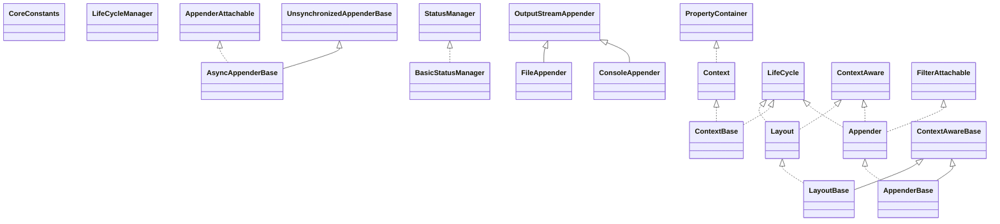

# logback-core-1.4.14.jar

[Group index](README.md) | [All archives](../README.md)

## Scope and provenance

- **Donor:** `SQX_145_REFERENCE_ROOT/internal/libs/logback-core-1.4.14.jar`.
- **SHA-256:** `f8c2f05f42530b1852739507c1792f0080167850ed8f396444c6913d6617a293`; accessed 2026-10-06; captured `2026-10-06T18:54:51.906614+00:00`.
- **Classes:** 454 raw entries; 454 unique entry names. Duplicate occurrence indices are zero-based.
- **Inspection:** read-only ZIP hashing and class-file structural parsing; signatures/descriptors, modifiers, hierarchy and references only. Bytecode bodies are hashed, not published.
- **Allocation:** proposed `FEAT-HOST-LOGBACK-CORE`, P01; [roadmap](../../sqx-full-application-roadmap.md). Domain README registration remains required.
- **Repository:** `01067f00031428613c6394064ca1bcadc1ba00ee`; review state unreviewed. Download label 145-dev1; installed build/activation and runtime equivalence unverified.
- **Limit:** every class/member is inventoried; declaration coverage does not establish consumed calls, defaults, formulas, failure semantics or algorithm parity.
- **Archive/resource index:** [075.json](../../../evidence/sqx145/archives/145/075.json).

## Complete member declarations

Member shards contain exact JVM names/descriptors, access flags, generic signatures, throws types, declared fields/methods, superclass/interfaces and referenced class names. All classes, nested/synthetic members and overloads are retained. Code length/hash is structural evidence, not a normalized algorithm comparison.

- [001.json](../../../evidence/sqx145/members/075/001.json) — SHA-256 `0f92470b07aeeeae21fe9fb0a2e60b98d4b4a905a98108168a609a6c973c6e8e`.
- [002.json](../../../evidence/sqx145/members/075/002.json) — SHA-256 `687972b513fa0434f27f9e6e5eae7379a8b58e9937f834481b163942cee23cbc`.
- [003.json](../../../evidence/sqx145/members/075/003.json) — SHA-256 `2742831cd3db89d8a9e3803a76dec75f85680e4ce5e7f42f07692fe82bb509cf`.
- [004.json](../../../evidence/sqx145/members/075/004.json) — SHA-256 `c9a909020bb49c5f0d254d9b96c377c0f7f1af9860a1bf973af51f7e57d9d260`.
- [005.json](../../../evidence/sqx145/members/075/005.json) — SHA-256 `598bc0f23fab1ad7949b961d2a5a5eeb1a950a3b20f60f7a99ddab0a2ceadeff`.
- [006.json](../../../evidence/sqx145/members/075/006.json) — SHA-256 `14ef9d6cd34102520f988fdddbbdbcd1f437b29e90e729f4f653b8ecc5d770af`.

## Focused structural diagram

Up to twelve non-nested classes; arrows show declared inheritance/interfaces only. External type names are not evidence of an available body or an executed dependency.

## Class inventory

| Archive entry | Occurrence | Class SHA-256 | Fields | Methods |
| --- | ---: | --- | ---: | ---: |
| `ch/qos/logback/core/Appender.class` | 0 | `757b06540679a446ee97247c7599ad5cb317c423f4c847bd22538dd319de2962` | 0 | 3 |
| `ch/qos/logback/core/AppenderBase.class` | 0 | `5afdeee6b4359254db2d0e68b08a4815dfe844a500e183bf1bc79cd8068bebc8` | 7 | 13 |
| `ch/qos/logback/core/AsyncAppenderBase$Worker.class` | 0 | `76e8447103ea69b3a156327dca50dc70e2e176e561fd4d0a71ad02ebb4547d67` | 1 | 2 |
| `ch/qos/logback/core/AsyncAppenderBase.class` | 0 | `255dd5cb89f89f535a475c8804e1e469279ad3fc70a853ab89e07f9db6ea6bfe` | 11 | 26 |
| `ch/qos/logback/core/BasicStatusManager.class` | 0 | `d8b85e10ede303a03232672de713623bf2cdc0d37da1e3bf3568b78cfb8dc210` | 9 | 11 |
| `ch/qos/logback/core/ConsoleAppender.class` | 0 | `d318afcda93eed07370a6e701e5585fce2e62a44c99fc926334268b7078f61eb` | 8 | 14 |
| `ch/qos/logback/core/Context.class` | 0 | `f7bdd1996184bc7fddaefcc1912a32c653ef4b043bc885710fcc4cfde1fb11c8` | 0 | 19 |
| `ch/qos/logback/core/ContextBase.class` | 0 | `6536a1d22fabfeff9d5cf59c4f39fe93f30076b0bff90b5508cb6087ae75b609` | 14 | 36 |
| `ch/qos/logback/core/CoreConstants.class` | 0 | `f24c38c20d1fdf24470e4b1401c6a40007c088066fd7c2674b60d5f235da509d` | 81 | 2 |
| `ch/qos/logback/core/FileAppender.class` | 0 | `ee9325791ad912c65d427d2f731414b20e6f7ae75a87b30fa62a8ce5d05acfde` | 6 | 19 |
| `ch/qos/logback/core/Layout.class` | 0 | `2fbab926c0c4bfd5104a4e5e56524ab4545bf0598f79d68f88e9d99e065ab414` | 0 | 6 |
| `ch/qos/logback/core/LayoutBase.class` | 0 | `56f57110bec2a39851b7d3f700af5c3b3026638ac22ac68466eae1c39122bfd1` | 5 | 15 |
| `ch/qos/logback/core/LifeCycleManager.class` | 0 | `f45755b02d530e716ddbbb8b905e34a096246202a0468a3cf10e104ad45fb796` | 1 | 3 |
| `ch/qos/logback/core/LogbackException.class` | 0 | `121153fbb747b8aab225c30a67f6df14f84ed3d573b6c4f508e545940043d3e1` | 1 | 2 |
| `ch/qos/logback/core/OutputStreamAppender.class` | 0 | `b8a57534957fbdff16aa9ef4fe3def72718024056733a6c5352da05ca0eab22f` | 4 | 18 |
| `ch/qos/logback/core/PropertyDefinerBase.class` | 0 | `2ebb2d2945b318d73fe877af77dfc6403049a8a79b1665b5cfac4e2d7d478873` | 0 | 2 |
| `ch/qos/logback/core/UnsynchronizedAppenderBase.class` | 0 | `5f16ed19ec29adab2fbda6b29e8ec1661e8439781700023572873cd38c86e4ef` | 7 | 13 |
| `ch/qos/logback/core/boolex/EvaluationException.class` | 0 | `bbee1900141db2e32a920679ee7fcc07ac0b54f5d5402e6c07f36221da6d5de2` | 1 | 3 |
| `ch/qos/logback/core/boolex/EventEvaluator.class` | 0 | `6e8546b3097084eaab8d470415426ed4b3a03481fae3f4411144eb5106f15be5` | 0 | 3 |
| `ch/qos/logback/core/boolex/EventEvaluatorBase.class` | 0 | `b0fba9fea21f9d20f9638fbc763e558b4e951567ddd2def75e9aad64fccefb44` | 2 | 6 |
| `ch/qos/logback/core/boolex/JaninoEventEvaluatorBase.class` | 0 | `63c8fa886197bca63cf89e92ce6c6380c5c5a7a9314c6a0f035747ab9d78371e` | 8 | 12 |
| `ch/qos/logback/core/boolex/Matcher.class` | 0 | `5d4b95c2f30b02dd9b2c652dbb26d187a821126b15a26426728b977d36c34c0f` | 7 | 15 |
| `ch/qos/logback/core/encoder/ByteArrayUtil.class` | 0 | `512b5df24eef0059b07a871998c9b401e5c64fed85c26234dc0e3754636aa389` | 0 | 6 |
| `ch/qos/logback/core/encoder/EchoEncoder.class` | 0 | `49b5fdc521cdcde0443d878a07ff39c2eac2c8894323362e63016618956d300c` | 2 | 4 |
| `ch/qos/logback/core/encoder/Encoder.class` | 0 | `37ebd4e606a4c60a74e5442ea3abd2c7e02f64571ea5eee3c3af2b20aab7284c` | 0 | 3 |
| `ch/qos/logback/core/encoder/EncoderBase.class` | 0 | `513fa1a0e8decd1c44cecfbd129b5c9f073045e4e1052e7ced309c4c7249a7d1` | 1 | 4 |
| `ch/qos/logback/core/encoder/JsonEscapeUtil.class` | 0 | `d901fe6f6a7e5db883a7adf8905f7b18942c28cf7a5766fc44b5d418278fab12` | 3 | 5 |
| `ch/qos/logback/core/encoder/LayoutWrappingEncoder.class` | 0 | `32e8a25a57d747d69591f6cc598d0db9dbdea930b7e79329766d9a187f3c2c26` | 4 | 15 |
| `ch/qos/logback/core/encoder/NonClosableInputStream.class` | 0 | `50ba9c82d1d023d1b785c8cdaa5df597407c419deaac145f1a4879f4f6a37fc1` | 0 | 3 |
| `ch/qos/logback/core/filter/AbstractMatcherFilter.class` | 0 | `0ef6c4adf8832f5865438785e2e08d3412846d139339f50e7da04789ffd68cba` | 2 | 5 |
| `ch/qos/logback/core/filter/EvaluatorFilter.class` | 0 | `b0541216d141493ccb9ba9f333b63735c4805d03e7acef787c546df3ebc9ff85` | 1 | 5 |
| `ch/qos/logback/core/filter/Filter.class` | 0 | `cfd4e84a7b8dbdcaf6d5a2275d8108006fb35337136d1f3ea3cd9625e020fa37` | 2 | 7 |
| `ch/qos/logback/core/helpers/CyclicBuffer.class` | 0 | `221d386041f5dd4b6b834e3babc6fecb5fb31642937be540213bf4ea5ce1941e` | 5 | 11 |
| `ch/qos/logback/core/helpers/NOPAppender.class` | 0 | `0975c222a107f614da22a85707b3d37207b666e68c1454bc892749236a38d50d` | 0 | 2 |
| `ch/qos/logback/core/helpers/ThrowableToStringArray.class` | 0 | `3f3ccb76ad48209383f1f2f8e3c2bc0834821222f587ba4d88cba752d4a43d85` | 0 | 5 |
| `ch/qos/logback/core/helpers/Transform.class` | 0 | `fb6c650e8388d379497819de7a5f3a5472f95d979d042e2b6cad7919fd671c74` | 6 | 5 |
| `ch/qos/logback/core/hook/DefaultShutdownHook.class` | 0 | `287e51d2f529928bf9ce0a0a5d1ffb8f324931a4cdc4319086f37c6d0741a58d` | 2 | 5 |
| `ch/qos/logback/core/hook/ShutdownHook.class` | 0 | `85fc859433ca1b6e8eaa3495eadf6224c1592916b9940bc14f0455fd53ba403e` | 0 | 0 |
| `ch/qos/logback/core/hook/ShutdownHookBase.class` | 0 | `5f09fb7e6b6b0efaca6c3a2f8c161e23ec65426e24d3f3f1799bc121b97e052f` | 0 | 2 |
| `ch/qos/logback/core/html/CssBuilder.class` | 0 | `4f7110e13db6cff10c44d9f5633dae897447b771404abedca130faa32cadbd54` | 0 | 1 |
| `ch/qos/logback/core/html/HTMLLayoutBase.class` | 0 | `911119bd6ac4aa329d3e427756fdde66ba2ce7d15a65dbd83c585cac7c121525` | 5 | 18 |
| `ch/qos/logback/core/html/IThrowableRenderer.class` | 0 | `d0c7ad74fa591167643001a609e71b7a4853c166a5a230410a4e24bec556d356` | 0 | 1 |
| `ch/qos/logback/core/html/NOPThrowableRenderer.class` | 0 | `141c4ff565e8c36c773ca43de47e28c67f2e5b2d7ef83f9173d921129ac0d3f9` | 0 | 2 |
| `ch/qos/logback/core/joran/GenericXMLConfigurator.class` | 0 | `c98c3ccd1888dd8e416f537a5c50c3296bf4aaea9ad226ccb6b822ea540184a9` | 2 | 23 |
| `ch/qos/logback/core/joran/JoranConfiguratorBase.class` | 0 | `eb65f9f2c6d41d3bd36fb5d2d59f8b82a94aa1728db442f73f7ac2ba01819d16` | 0 | 8 |
| `ch/qos/logback/core/joran/JoranConstants.class` | 0 | `c151e21ee3148bada0e7c5fa8552fe943ccb48b7fac132e37045922f8c01fb68` | 16 | 2 |
| `ch/qos/logback/core/joran/ModelClassToModelHandlerLinkerBase.class` | 0 | `1754527f97bf0d69daf6e4ccf911a6b09dd5dd4dbcbde396bfa3aceb08e46364` | 1 | 3 |
| `ch/qos/logback/core/joran/ParamModelHandler.class` | 0 | `23dcb3c8c1b5522633d8a0d547b86e8e83419a0fb26c1fcf5fbfd7a5493ea04e` | 1 | 4 |
| `ch/qos/logback/core/joran/action/Action.class` | 0 | `0b897d7e6395bd1c7ce3acd049fe414c7060047e9f6952b457254cb63ae0d9b3` | 8 | 10 |
| `ch/qos/logback/core/joran/action/ActionUtil$Scope.class` | 0 | `cdcaeffc972454047d523201df96b03fd2bd3acf0d27ecd197a8828d0ae1459f` | 4 | 5 |
| `ch/qos/logback/core/joran/action/ActionUtil.class` | 0 | `cb3480e5c900e6bedc45fcec3a83d2dd613fa772e38c283272be468e1c51e021` | 0 | 3 |
| `ch/qos/logback/core/joran/action/AppenderAction.class` | 0 | `92d753320e7c7316c853dda3f8c77d6b10549a8bdf65b781153c89273b9806d4` | 0 | 3 |
| `ch/qos/logback/core/joran/action/AppenderRefAction.class` | 0 | `2b252559b02f76086f6b9c6d55a35452ee8affc5ad2318dd6d194bb2fdeaf316` | 0 | 3 |
| `ch/qos/logback/core/joran/action/BaseModelAction.class` | 0 | `53a0e1f4b86baddb446f25563472d13b6f9c3201882319752b7292a29ce6a727` | 3 | 6 |
| `ch/qos/logback/core/joran/action/ContextPropertyAction.class` | 0 | `d95704d93a1906e6fc70c7aba93a20a6a9994f0b4dae9755d1fff01b11578205` | 0 | 3 |
| `ch/qos/logback/core/joran/action/ConversionRuleAction.class` | 0 | `79f7b5215911ef02af3673192c463f5371c1048c12c8cc918fa4abc2c081bea1` | 1 | 4 |
| `ch/qos/logback/core/joran/action/DefinePropertyAction.class` | 0 | `9b348fe02d79e45f095d810c6e0956833cc7e6378209fcadd856e46f70d32d44` | 0 | 3 |
| `ch/qos/logback/core/joran/action/EventEvaluatorAction.class` | 0 | `441e12f8f59cda30470a69d93d64e1f8d606e253af1c788415b14048bee9a50c` | 0 | 3 |
| `ch/qos/logback/core/joran/action/ImcplicitActionDataForBasicProperty.class` | 0 | `dee6be2b8f79b32357fa966adac8b37f890ef5e1cb258511cf249cb412ecf6c9` | 0 | 1 |
| `ch/qos/logback/core/joran/action/ImplicitModelAction.class` | 0 | `0a3f6872c675ee55330f87e6a231c09acdec676cb1bc654d48e2c5d15d0ac2f5` | 1 | 4 |
| `ch/qos/logback/core/joran/action/ImplicitModelData.class` | 0 | `3800e4ccf30bf7ed9e9f33593709e4bf87e9348af356b3d336480ee80486f9a3` | 4 | 2 |
| `ch/qos/logback/core/joran/action/ImplicitModelDataForComplexProperty.class` | 0 | `058f3d625a8eeb7f3cabfd303c011e73f75e0b9fab5669404623fc98ebf557b7` | 1 | 3 |
| `ch/qos/logback/core/joran/action/ImportAction.class` | 0 | `0b2661ad5ae25562eb816362ce3e61120c93c786e04210ff8b3b2becae83672e` | 0 | 3 |
| `ch/qos/logback/core/joran/action/IncludeAction.class` | 0 | `0ff06266fd057006a9847907d69111f239b8a6da1da2c0377cd299f853e9e530` | 9 | 16 |
| `ch/qos/logback/core/joran/action/NOPAction.class` | 0 | `fca6fb3f4f3058c08f607db19b4d36000cb2582cfa112c65b1806f517cdfeb62` | 0 | 3 |
| `ch/qos/logback/core/joran/action/NewRuleAction.class` | 0 | `b65dd707c5f3254894c79dadf886cf05823cdc83b60a1d292240babe4e0c2fc3` | 1 | 4 |
| `ch/qos/logback/core/joran/action/ParamAction.class` | 0 | `c23f1ec3dce53d571dcf58ffb591fe516252e0fee8a62bc709f8bf311f7c560a` | 0 | 3 |
| `ch/qos/logback/core/joran/action/PreconditionValidator.class` | 0 | `fe32a0a6f7e3db6654132355ffdd0e09248ae774a5720f4785fd3f297874b813` | 4 | 8 |
| `ch/qos/logback/core/joran/action/PropertyAction.class` | 0 | `10756099b112d95ae1e4a0ebe1a707845baed845a1089120ca19d12e22b1e066` | 1 | 3 |
| `ch/qos/logback/core/joran/action/SequenceNumberGeneratorAction.class` | 0 | `f167b4dc9bfb9ba1bf9ccdefdf2dfedad5b9c947199019ec0c1dc2f263a918a8` | 0 | 3 |
| `ch/qos/logback/core/joran/action/SerializeModelAction.class` | 0 | `505230764098d4617da21c7039543b6bfec4677c74b19eb8bd1a10480265b8f6` | 0 | 2 |
| `ch/qos/logback/core/joran/action/ShutdownHookAction.class` | 0 | `5307ffc34c9e8faf1e9415141f9f57809badbbcdd1f0bc8dd271c08e2e1da06e` | 0 | 3 |
| `ch/qos/logback/core/joran/action/SiftAction.class` | 0 | `b419b65c7c8dafae16abb01b4dd72d4757d76919ec4c6a65104c1573238ca0a1` | 0 | 3 |
| `ch/qos/logback/core/joran/action/StatusListenerAction.class` | 0 | `f9d90f85eb4a5e8d63dc3ad4e97bd97a5c17c971dcf686e65d6057f853b59a5e` | 3 | 3 |
| `ch/qos/logback/core/joran/action/TimestampAction.class` | 0 | `1bc358dd87566fc983a2e39ddfc59b363261dc62a8581479096da1a94f2122cc` | 2 | 3 |
| `ch/qos/logback/core/joran/conditional/Condition.class` | 0 | `9eef093ab8824c31837cde1859075155ad712bbd21c9749ce0ebad7673a52d31` | 0 | 1 |
| `ch/qos/logback/core/joran/conditional/ElseAction.class` | 0 | `a8f1227fd4bdc5e3c0f4741f232891c8f199cc634059430591d328ea19cd4cbc` | 0 | 3 |
| `ch/qos/logback/core/joran/conditional/IfAction.class` | 0 | `b1b5c7c5766202b2985526c7661d4f3d0127695837c25c9f04550d7c50053867` | 1 | 3 |
| `ch/qos/logback/core/joran/conditional/PropertyEvalScriptBuilder.class` | 0 | `70063db24ef9c94b338abed74dae7c97240f48d5d57ae38f60acdb1b06bee915` | 4 | 3 |
| `ch/qos/logback/core/joran/conditional/PropertyWrapperForScripts.class` | 0 | `7fda326cf15efcde7b5973434ec8506f67c56f273187767c2f315db84791cc3c` | 2 | 6 |
| `ch/qos/logback/core/joran/conditional/ThenAction.class` | 0 | `39a8b86fc7afcc0befa45a726c11d1837136955998dd7e09b774308275157d0d` | 0 | 3 |
| `ch/qos/logback/core/joran/event/BodyEvent.class` | 0 | `8da279004d2ada4c7bbcbb6f449395311ce607f66b76f02b6233f4201982b0e5` | 1 | 4 |
| `ch/qos/logback/core/joran/event/EndEvent.class` | 0 | `6f980807fd06d0476273141c46ec28c4bd8f39a8fde1afec5444e97f7061ea30` | 0 | 2 |
| `ch/qos/logback/core/joran/event/SaxEvent.class` | 0 | `25fdfb3ab8bb4e0fbfadcb7a89cc29b74854b40371d2f83cab139fbf6f201197` | 4 | 5 |
| `ch/qos/logback/core/joran/event/SaxEventRecorder.class` | 0 | `53d2f8ce6a858270579550237418ad75ac708e71751fdb77576a6d47d6508c5e` | 4 | 29 |
| `ch/qos/logback/core/joran/event/StartEvent.class` | 0 | `9d37461946f2bb6e3f043056927d1d9d734976f5eb47a973ce779bb6709758c5` | 2 | 3 |
| `ch/qos/logback/core/joran/event/stax/BodyEvent.class` | 0 | `ba57e2cde2c2e8b431d45dfd8d5cebc27f758c3ed465ac73f492a7db53f93061` | 1 | 4 |
| `ch/qos/logback/core/joran/event/stax/EndEvent.class` | 0 | `130665ffe8b1c0ef504c6850a68fc75e1ae83ee1aa0ffa669b00e2226b35b139` | 0 | 2 |
| `ch/qos/logback/core/joran/event/stax/StartEvent.class` | 0 | `ced5552c37aa08896a3ff63b40eb9b7b8b75cd71ec61c4c65cffce254c2707a0` | 2 | 6 |
| `ch/qos/logback/core/joran/event/stax/StaxEvent.class` | 0 | `52e61207545fe025c4984e6b690c98076f5673a2506c950c21008edd1874c663` | 2 | 3 |
| `ch/qos/logback/core/joran/event/stax/StaxEventRecorder.class` | 0 | `120a342f47f2fe35329ee0bc39b14586c320b7eaebfcc6f2a07f27d374892224` | 2 | 8 |
| `ch/qos/logback/core/joran/node/ComponentNode.class` | 0 | `b4b8ce05f24096c518ba23f9b28d2a7dcf87d5224a3e84904f95561fdfbe515d` | 1 | 1 |
| `ch/qos/logback/core/joran/sanity/AppenderWithinAppenderSanityChecker.class` | 0 | `04e9d01fa3289a671d81c749b79868e38f88dda70e7f5500bf41023ea54fb869` | 1 | 5 |
| `ch/qos/logback/core/joran/sanity/Pair.class` | 0 | `7c1fcabddc0a0033ed921f1dc6a8a5e15e5e97ba550efd5897831029923e7808` | 2 | 1 |
| `ch/qos/logback/core/joran/sanity/SanityChecker.class` | 0 | `ac3f708250c29d1ee6cc8d512edf2dd9518e62e2086ac3b9037676b3303fc860` | 0 | 5 |
| `ch/qos/logback/core/joran/spi/ActionException.class` | 0 | `e6a18032e9f206a6dd19e89ffebe4f88bf38a36a32bc500a29eeae77b259b681` | 1 | 3 |
| `ch/qos/logback/core/joran/spi/CAI_WithLocatorSupport.class` | 0 | `18fbba19e812c54a0885c8f8b51d39dcdb573df0153bb29320717c258dc9c806` | 0 | 2 |
| `ch/qos/logback/core/joran/spi/ConfigurationWatchList.class` | 0 | `0e70d24bcd469d220f6cadf4afb5b467b55d0f6bf5012e7562ae1adbd8ed7ab8` | 3 | 10 |
| `ch/qos/logback/core/joran/spi/ConsoleTarget$1.class` | 0 | `d92c33a0f58dffd9e34ed3aa9b3cf6ec0e524f3aec3e891b283ce50c2e44924a` | 0 | 5 |
| `ch/qos/logback/core/joran/spi/ConsoleTarget$2.class` | 0 | `6b7c851a71f8e89e4ac64720a88bfcb3d891ed6fc7b6ebbd842ef9478591dd64` | 0 | 5 |
| `ch/qos/logback/core/joran/spi/ConsoleTarget.class` | 0 | `6fc20b7ae168fbe85e64b818304fe377f9f67f52aeb5f4dc148ad042b36e827f` | 5 | 9 |
| `ch/qos/logback/core/joran/spi/DefaultClass.class` | 0 | `1c3c9c3ffefb1694aee39f9f88ecd87489f1637b683bd73e44929e19ed98a53c` | 0 | 1 |
| `ch/qos/logback/core/joran/spi/DefaultNestedComponentRegistry.class` | 0 | `84262a1775b4f636e7cf19b32d53002ee0cb557dab7a717389d33795f869ea93` | 2 | 6 |
| `ch/qos/logback/core/joran/spi/ElementPath.class` | 0 | `4e5641ae3bf4ff659835a3ed99c018082eb8f70a70fa484a5bb0e690b4f906db` | 1 | 14 |
| `ch/qos/logback/core/joran/spi/ElementSelector.class` | 0 | `796d8e2790f2ee821aec2f3094517bf8536da39eda15cee20bd94f90ffda1781` | 0 | 10 |
| `ch/qos/logback/core/joran/spi/EventPlayer.class` | 0 | `2d948bc2a9078dff640818e6fb2d7c8c4a4b544f6136130c7ac4721fb1896074` | 3 | 4 |
| `ch/qos/logback/core/joran/spi/HostClassAndPropertyDouble.class` | 0 | `f60337536c02735bf9a354c96508e8b9dc16a14da6f1d2bf551dd00d208aab32` | 2 | 5 |
| `ch/qos/logback/core/joran/spi/JoranException.class` | 0 | `a2a259b50ba2b8f174322259c72a480790f49f26a668d95a52325b0f5a6a43c1` | 1 | 2 |
| `ch/qos/logback/core/joran/spi/NewRuleProvider.class` | 0 | `c6d37ad3906c8d997e0ca06ca719369ab84f7b2d0872fc4af089752f8d12d952` | 0 | 3 |
| `ch/qos/logback/core/joran/spi/NoAutoStart.class` | 0 | `89ef562a36d712aed9c044eeb8e0d5326a1f96ea49445348d8307b6472b6c941` | 0 | 0 |
| `ch/qos/logback/core/joran/spi/NoAutoStartUtil.class` | 0 | `10b893e834804114779be3284e03114f0871a1e81ac6049d45d69d38046c8e9d` | 0 | 2 |
| `ch/qos/logback/core/joran/spi/RuleStore.class` | 0 | `11780fb630f6af8d6347968968345b5cffd9bc6f7d5cf4aefa5da4b2ccbd5a4f` | 0 | 4 |
| `ch/qos/logback/core/joran/spi/SaxEventInterpretationContext.class` | 0 | `1ba94389d6e15ef6447fee1c09f457f1eddef0f56fc41fe09e023744bc3ea522` | 2 | 10 |
| `ch/qos/logback/core/joran/spi/SaxEventInterpreter.class` | 0 | `3051d68fd4c5bf054d01cb6cdb385435b01f9c5ba757502501a9338f518907ad` | 11 | 21 |
| `ch/qos/logback/core/joran/spi/SimpleRuleStore.class` | 0 | `b7afc28a9d8cde10001e3cfd89c6330870242486d71d14375818ef5a3a1a39e2` | 3 | 16 |
| `ch/qos/logback/core/joran/spi/XMLUtil.class` | 0 | `efa5148ed54abcb063f9d190b85d5b658c37def21a3a45313fc9740e433a20cc` | 2 | 2 |
| `ch/qos/logback/core/joran/util/ConfigurationWatchListUtil.class` | 0 | `5293c8dc75be7ab5414d26d61ec7c5c007e6d456d6a4d099b65307f6ad308c72` | 1 | 10 |
| `ch/qos/logback/core/joran/util/ParentTag_Tag_Class_Tuple.class` | 0 | `189e42a544ba651e32a6cc3a751f877a2ca8d0dac14088184160fb72c0836f13` | 3 | 2 |
| `ch/qos/logback/core/joran/util/PropertySetter$1.class` | 0 | `891281368411e615e15baa4c5ba12682427a0b54ed5896c966304fcff42c3856` | 1 | 1 |
| `ch/qos/logback/core/joran/util/PropertySetter.class` | 0 | `c37483375c3c0f5b6c02229517bd2f71563df5414fec3d280938764f208bef7a` | 3 | 22 |
| `ch/qos/logback/core/joran/util/StringToObjectConverter.class` | 0 | `c2cc3957da70eb4d7ac701733b220484f436c8bb3efbfa897870ff702a245311` | 1 | 11 |
| `ch/qos/logback/core/joran/util/beans/BeanDescription.class` | 0 | `fa26f0d86774d8f0b1d387f0d36d2a76da658434eb36bdf061bef42545f21b85` | 4 | 8 |
| `ch/qos/logback/core/joran/util/beans/BeanDescriptionCache.class` | 0 | `dddd4600430b89742fb1f58e545c6f3481d5cf688e3a248fab103e021dff467e` | 2 | 3 |
| `ch/qos/logback/core/joran/util/beans/BeanDescriptionFactory.class` | 0 | `2adeeee84e46cbea7a305972eca46af0aff0e1de0399eca410845671a76afb7c` | 0 | 2 |
| `ch/qos/logback/core/joran/util/beans/BeanUtil.class` | 0 | `9db3b3f138631d253f84dfd1a964dda924ebb893d2316c581edb7f0f42c73177` | 4 | 8 |
| `ch/qos/logback/core/layout/EchoLayout.class` | 0 | `7298ff35f7e4e70081c87eb6df12cc0d8305ac8eed3fc61d08bbe971e142f6d8` | 0 | 2 |
| `ch/qos/logback/core/model/AppenderModel.class` | 0 | `4da289c093927004b3ae9cb3217bb7d7ee7c847807a128d066b2d08633699f9c` | 1 | 5 |
| `ch/qos/logback/core/model/AppenderRefModel.class` | 0 | `16ae0d7761874644ff996d87807d371664e7a1e877c1cc74678945242c0fc2c2` | 2 | 8 |
| `ch/qos/logback/core/model/ComponentModel.class` | 0 | `b2cedbdb4ed507c5f7f82d8d4e6308fa2dc55241ea8f7d78c36232ad6253a013` | 2 | 9 |
| `ch/qos/logback/core/model/DefineModel.class` | 0 | `91ed9403b56dfb24b5d524f7a3d903b109a7931de771f049a9c343b6ec883b60` | 2 | 10 |
| `ch/qos/logback/core/model/EventEvaluatorModel.class` | 0 | `950285d551bebea7a2e23670f0c22ac10813bbbe645686a19b78f644309b05ef` | 1 | 5 |
| `ch/qos/logback/core/model/INamedModel.class` | 0 | `7fac603c06f301957bb14c79da7e493adfe0284b4360bdfe417f14e702f5abd7` | 0 | 2 |
| `ch/qos/logback/core/model/ImplicitModel.class` | 0 | `bd2628506b4a73b4f362079cbe23888fcab39e973e425ae479c0cd2adf09d8d8` | 1 | 4 |
| `ch/qos/logback/core/model/ImportModel.class` | 0 | `cfec4b44555acc30f3c2886039eedb19cc46796c9634ca85b21430b1ca652831` | 2 | 6 |
| `ch/qos/logback/core/model/IncludeModel.class` | 0 | `fefe8fe2b7c625139fa1ae4f9ec6b6123f104d63e1cd3dc377d3ff0c9977ed79` | 6 | 9 |
| `ch/qos/logback/core/model/InsertFromJNDIModel.class` | 0 | `29671ae70865bd32169124a4f18fd0c93587925af9c5a6f448dfb119af8c5af7` | 6 | 12 |
| `ch/qos/logback/core/model/Model.class` | 0 | `caed864f7c13ccee7eb0f6fdef07fbc19d88cbcec93acc76c85f32578dbd7867` | 7 | 23 |
| `ch/qos/logback/core/model/ModelConstants.class` | 0 | `f903b864c950acd14f601e4830bc7126f9ae71b2892d1ff0403db01bfef88010` | 2 | 1 |
| `ch/qos/logback/core/model/ModelHandlerFactoryMethod.class` | 0 | `3da55c49ae30f71f1c0b7f32c45a26518017b80a26a9b907b7141be82de8e9a9` | 0 | 1 |
| `ch/qos/logback/core/model/ModelUtil$1.class` | 0 | `181245cff85270965bd73377a0231f2d3233cd6f995ff41bc27c686160607c5d` | 1 | 1 |
| `ch/qos/logback/core/model/ModelUtil.class` | 0 | `7c3147d7d744a589a0114cf17c76aa65fbaeb69aad785a966e787d6ec736f16e` | 0 | 4 |
| `ch/qos/logback/core/model/NamedComponentModel.class` | 0 | `90a3c94c27714153ab045a038e4fc37432f49d2f257e1cf6747cf867633f76d1` | 2 | 10 |
| `ch/qos/logback/core/model/NamedModel.class` | 0 | `995c8fe884331af8c17d45929f1e9e33cd7a5b55dab1292232ac5b62ea049dea` | 2 | 8 |
| `ch/qos/logback/core/model/ParamModel.class` | 0 | `bdaba093e70588ea805e99af16e2a28005aa49c757d7021d460d6ea29a9793c5` | 2 | 9 |
| `ch/qos/logback/core/model/PropertyModel.class` | 0 | `9f54a46dcd49a1c162bde340358931ffb32c9c7d09a037cdbc50c280120f67e6` | 5 | 15 |
| `ch/qos/logback/core/model/SequenceNumberGeneratorModel.class` | 0 | `494cf49acbf2e8052b6baed0f5bac5f6fdec9a32e4f2670aeda5fe6aa0b1ba19` | 1 | 4 |
| `ch/qos/logback/core/model/SerializeModelModel.class` | 0 | `aab9fff5fc469076f4d4ddba1f19349636c3809aa2d176a9654517417eb1341a` | 2 | 7 |
| `ch/qos/logback/core/model/ShutdownHookModel.class` | 0 | `fbf38f7546b88a0e3d17d9f84db5cc057c69716a2faed2f12a5a4940417719c5` | 1 | 4 |
| `ch/qos/logback/core/model/SiftModel.class` | 0 | `8356d1a5ac59698ec6f9b2c633ab49c209c583eb28690af4bac3313efc5a6dc0` | 1 | 3 |
| `ch/qos/logback/core/model/StatusListenerModel.class` | 0 | `93fb381973f8110ff09ed854ad8cc8d54db5ed5517d46a8bb2ecaa97b5968f67` | 1 | 4 |
| `ch/qos/logback/core/model/TimestampModel.class` | 0 | `ac4885a48fa65b98f6eca20ce9b7f5513010098c863672394b47a3f7b64b2f0c` | 5 | 15 |
| `ch/qos/logback/core/model/conditional/ElseModel.class` | 0 | `698e807f053b4de9efc9e86164f620d7f3e728959beb68c6b6fbabcde78d06ae` | 1 | 3 |
| `ch/qos/logback/core/model/conditional/IfModel$BranchState.class` | 0 | `228ac56a313ab62988094ce2ee8552bb3372e33cf3ed183a87bf7ebf7e6cdd62` | 4 | 5 |
| `ch/qos/logback/core/model/conditional/IfModel.class` | 0 | `c1d2c667680fe6d4c675db996535ed7469ed47a7d0d21c795da7a5506a2b5e94` | 3 | 13 |
| `ch/qos/logback/core/model/conditional/ThenModel.class` | 0 | `85d9659fa89eb472a1413961f18b7ffa0ef4e63f778d1c9caee34fcb9722da33` | 1 | 3 |
| `ch/qos/logback/core/model/processor/AllowAllModelFilter.class` | 0 | `55caa9c40a7f8f5b08050cb4ff3d996b54b1852ddcedde541ca186ea7d30142c` | 0 | 2 |
| `ch/qos/logback/core/model/processor/AllowModelFilter.class` | 0 | `17402c5c72cc1a5c40de0ccf2dfe5011675a9705c170b1d81b00755367fdc1d9` | 1 | 2 |
| `ch/qos/logback/core/model/processor/AppenderModelHandler.class` | 0 | `4b980828a9a465e1e701a51325b2f254becb0860861415b43c2989b8ceae8fb7` | 4 | 4 |
| `ch/qos/logback/core/model/processor/AppenderRefDependencyAnalyser.class` | 0 | `2a7286b1f18499bad7dec2305d9b6eeb4a501131d9a3f66112ce83062572edea` | 0 | 3 |
| `ch/qos/logback/core/model/processor/AppenderRefModelHandler.class` | 0 | `111a8fa1382a4178441c8c9055e7ca95841e92d4a6b61c4b3824785d764e86d1` | 1 | 5 |
| `ch/qos/logback/core/model/processor/ChainedModelFilter$1.class` | 0 | `4c770557f3013a4676528ba5d62a5a4a02b3271abe7866d20a2b131a0e060882` | 1 | 1 |
| `ch/qos/logback/core/model/processor/ChainedModelFilter.class` | 0 | `0ffaf6787fa0b2dafff99cdd40fb25b5b58d48368f6012516d2a5eaa04f74343` | 1 | 7 |
| `ch/qos/logback/core/model/processor/DefaultProcessor$1.class` | 0 | `dd229671bad0f058e9ae4859b656df980f9e7c5c7338a709a20f5050401a8d29` | 1 | 1 |
| `ch/qos/logback/core/model/processor/DefaultProcessor$TraverseMethod.class` | 0 | `ef114293bf2baa06e619da279aa7f273688f65c7213530e7257fd5501b719a53` | 0 | 1 |
| `ch/qos/logback/core/model/processor/DefaultProcessor.class` | 0 | `1e5701af7832eec6f173e28baaa437a3674fc4f3bd777df1cc0571b451ccee9f` | 6 | 21 |
| `ch/qos/logback/core/model/processor/DefineModelHandler.class` | 0 | `2916e5599dcdfc78856a876c1bca8c4b0bb094c97419fb5122a8b8b47109d59d` | 4 | 5 |
| `ch/qos/logback/core/model/processor/DenyAllModelFilter.class` | 0 | `d5ad315b8af59133793cdc079959a446fc2b3af6dd6484058f8b8fd0b8c9124f` | 0 | 2 |
| `ch/qos/logback/core/model/processor/DenyModelFilter.class` | 0 | `b46a572e718ead3766ad8c367d77301bd785966adfeda690b69d22f46034ec79` | 1 | 2 |
| `ch/qos/logback/core/model/processor/DependencyDefinition.class` | 0 | `9c8f84c801ce0b6b96ec4100ab83020db624fed374bf9ffe93ebba51aed1d0c2` | 2 | 3 |
| `ch/qos/logback/core/model/processor/EventEvaluatorModelHandler.class` | 0 | `6bf0da657a814c2e03585dd0620eee6f4b482f25f64f7c05e9b3660a8930743e` | 2 | 6 |
| `ch/qos/logback/core/model/processor/ImplicitModelHandler$1.class` | 0 | `83f179195522b42cc42f39938c0f95139a1bb6468ac534ebc94d60ad0c8c3d05` | 1 | 1 |
| `ch/qos/logback/core/model/processor/ImplicitModelHandler.class` | 0 | `1e55d253baa911b5d0b4cdc770486e869fd73d212bd2712aa4f314eebd39feba` | 5 | 8 |
| `ch/qos/logback/core/model/processor/ImportModelHandler.class` | 0 | `a59cb173e8bc7f4f1e6d8752eef59028d8f85fe48974cf3708f078ddccb85b48` | 0 | 5 |
| `ch/qos/logback/core/model/processor/InsertFromJNDIModelHandler.class` | 0 | `de058a7adf620e0be5245063ddf781796156594bf3fc0600193e68a9b4af04b1` | 0 | 4 |
| `ch/qos/logback/core/model/processor/ModelFilter.class` | 0 | `9f695ceaa1cbe0b1a6e759ad2a16b9d602b2fd74005298bbf2ba3b772b0a2186` | 0 | 1 |
| `ch/qos/logback/core/model/processor/ModelHandlerBase.class` | 0 | `f356e5e92ef6e5eeab51cbc1db22eb0c115db2d770eb535b85cfc278f68a1955` | 0 | 6 |
| `ch/qos/logback/core/model/processor/ModelHandlerException.class` | 0 | `1e4101a6c70e4841b23b48fdd8982122dc0cc4e0b19b97334ee92793336818ce` | 1 | 2 |
| `ch/qos/logback/core/model/processor/ModelInterpretationContext.class` | 0 | `f3927ec4aab2436fb68df24e61f893492f48fd91626fae3523ff62ce423fde33` | 11 | 35 |
| `ch/qos/logback/core/model/processor/NOPModelHandler.class` | 0 | `babd35e8362d15cd99ccd73288354ddd8edbe5b2f818a5ad58ffedadd3d66678` | 0 | 3 |
| `ch/qos/logback/core/model/processor/PhaseIndicator.class` | 0 | `c483729666b51bc3855387f0ec500cfc2e79aaac2f0b7464b4d70d87177589da` | 0 | 1 |
| `ch/qos/logback/core/model/processor/ProcessingPhase.class` | 0 | `b3106c095d0e112b5d7e45a176d5eaa3729090ea418faa2e9bc527647f1e4fb8` | 4 | 5 |
| `ch/qos/logback/core/model/processor/ProcessorException.class` | 0 | `e32bb8cf5006a0ec104457c97d087e9c056442a74e3cd401b1164a370421f84f` | 1 | 2 |
| `ch/qos/logback/core/model/processor/PropertyModelHandler.class` | 0 | `e6c2d0e1e21d06ea929208fb7b52d00f44890c402cc634004ec2389ab9b55912` | 1 | 8 |
| `ch/qos/logback/core/model/processor/RefContainerDependencyAnalyser.class` | 0 | `f47e4e7c15e57b48d01c13613984dea10c0a5ba18e48e04f8f47325f02627864` | 1 | 4 |
| `ch/qos/logback/core/model/processor/SequenceNumberGeneratorModelHandler.class` | 0 | `98f61b5069e57e671b89edc0d9994e77e3e4d958ccd7e62f1ac08f1358eb0216` | 2 | 5 |
| `ch/qos/logback/core/model/processor/SerializeModelModelHandler.class` | 0 | `139cf97c4227d150123d742ddb2745a849b563f365d3172a57961417688d72f1` | 0 | 4 |
| `ch/qos/logback/core/model/processor/ShutdownHookModelHandler.class` | 0 | `cad61eec43e05ff0782b9cb0702f42930e931e30e3079c08c93dbbf00cb8a1f4` | 5 | 6 |
| `ch/qos/logback/core/model/processor/StatusListenerModelHandler.class` | 0 | `a4ed7cef17cba056eab8edf142ddd5329999b7a7c883d33d1017ae928bce1fcc` | 3 | 6 |
| `ch/qos/logback/core/model/processor/TimestampModelHandler.class` | 0 | `c8949926433748f30e0dee7e093ceb87fd1d675859a055efcbe227e340044fca` | 1 | 4 |
| `ch/qos/logback/core/model/processor/conditional/ElseModelHandler.class` | 0 | `51d01757e730a55348ad03c78c38a50e77f3aa6adf21c13797a194ae595ae99d` | 0 | 4 |
| `ch/qos/logback/core/model/processor/conditional/IfModelHandler$Branch.class` | 0 | `a941c27d55d0ef50650a56923a2bae8bd5f8673b6656ba5cd1a787ad0bca9735` | 3 | 5 |
| `ch/qos/logback/core/model/processor/conditional/IfModelHandler.class` | 0 | `876d15c1dd5578dc3dd6060490085e34046906f9129c0cef5ec51501edee22ec` | 3 | 5 |
| `ch/qos/logback/core/model/processor/conditional/ThenModelHandler.class` | 0 | `4461ecc1d1696e5554118f1b562cf69ab758ab7dc783a49db15d723507eae09d` | 0 | 4 |
| `ch/qos/logback/core/model/util/TagUtil.class` | 0 | `54b51e536320272358ca30416acf75d4c22d687878a871d1ee9a4467184b231b` | 0 | 2 |
| `ch/qos/logback/core/net/AbstractSSLSocketAppender.class` | 0 | `77c8fc1237b8a3bc924b54736a177e9aac0524d2ea4742af57046e62a0a65dfa` | 2 | 5 |
| `ch/qos/logback/core/net/AbstractSocketAppender$1.class` | 0 | `178f2212e2b3e1a0653adeec7c9fa793f128d856fec1f1629b5c9bd04cdeb6d5` | 1 | 2 |
| `ch/qos/logback/core/net/AbstractSocketAppender.class` | 0 | `b81f168dc3c0b9a0b66aa3746b1828283997e11eb07ffe6e624f60caaf50a83b` | 19 | 27 |
| `ch/qos/logback/core/net/AutoFlushingObjectWriter.class` | 0 | `fc2661b6495092075479cf1dd055ef9bd189eaf4c0dedb64c68b4d8a3a363758` | 3 | 3 |
| `ch/qos/logback/core/net/DefaultSocketConnector$ConsoleExceptionHandler.class` | 0 | `df802714534e764deb77c1dd9b8d70f02db97c2958083bcac3e953b877b59a4e` | 0 | 2 |
| `ch/qos/logback/core/net/DefaultSocketConnector.class` | 0 | `649cb6f7fb27d8c7b7d4c60211100735bb3d5f1e8a1218606ab859bf39ad526d` | 5 | 8 |
| `ch/qos/logback/core/net/HardenedObjectInputStream.class` | 0 | `044d6bae3e57bee2dbe664b8e0c961c25cfabc159b3619a65bf62280a6808e63` | 4 | 7 |
| `ch/qos/logback/core/net/LoginAuthenticator.class` | 0 | `186e1ef5587893db5536bafb5ee424160a6e4531224abf911b0c1c3d56df1b04` | 2 | 2 |
| `ch/qos/logback/core/net/ObjectWriter.class` | 0 | `08209ed600e310ad59cf44ee58d622d70c6bdd334fb601d15cc73275ff89803d` | 0 | 1 |
| `ch/qos/logback/core/net/ObjectWriterFactory.class` | 0 | `67b790bff75ed163ec8361a244643bd15fc9d2c8505998a98627ca7f29bb03d5` | 0 | 2 |
| `ch/qos/logback/core/net/QueueFactory.class` | 0 | `3efc4a7a7fd40313a106db81dba2aa60c129fd3885ae590a5cb4fa80733a413d` | 0 | 2 |
| `ch/qos/logback/core/net/SMTPAppenderBase$SenderRunnable.class` | 0 | `3ab479886b2f9e3c33ff23fd1217cad0670a917f04559cbcdb99604c5ff25d62` | 3 | 2 |
| `ch/qos/logback/core/net/SMTPAppenderBase.class` | 0 | `c63aec4b2b5e0e4cec1495a0c69b938135132b2a888d6cfb02ff158eef30a73f` | 26 | 57 |
| `ch/qos/logback/core/net/SocketConnector$ExceptionHandler.class` | 0 | `f5e3959caab8274224c0331fd89949284490ffe9661c5b3aa56c395809c7992e` | 0 | 1 |
| `ch/qos/logback/core/net/SocketConnector.class` | 0 | `541da495537e4073fc7645109972cff2c1ca39cfdf77792e365e7cf16dc8a460` | 0 | 4 |
| `ch/qos/logback/core/net/SyslogAppenderBase.class` | 0 | `38d152c16954a2f6ca71e2718fd161caef79d9b6e68446816198a89a356fdc85` | 10 | 23 |
| `ch/qos/logback/core/net/SyslogConstants.class` | 0 | `7dd1b07fd701bd83c6d071ab6558c204479d0dca17d3817a6c856b98fbfd733c` | 33 | 1 |
| `ch/qos/logback/core/net/SyslogOutputStream.class` | 0 | `e96e1a94df29df2b9a59ae1eb177b6d0773d76b5664d40395a6cda33e33dcce7` | 5 | 7 |
| `ch/qos/logback/core/net/server/AbstractServerSocketAppender$1.class` | 0 | `164fb84bcb49c4260067ef46a97a7311ceb1d7ce07071ce136318addb0ddad25` | 2 | 3 |
| `ch/qos/logback/core/net/server/AbstractServerSocketAppender.class` | 0 | `9797f8bfa7822dbb751ad351ee1e85430e26f20c536eeb6096eb55ce54b1f870` | 7 | 18 |
| `ch/qos/logback/core/net/server/Client.class` | 0 | `6e5f06bf17bd247943605cb01b8c849512b3fe24be3c31b806eed17a90ccccc6` | 0 | 1 |
| `ch/qos/logback/core/net/server/ClientVisitor.class` | 0 | `961d24fe70bb290101e22117cf39c92f3a2c5e18d0bb03e696d6f19a4a191aa3` | 0 | 1 |
| `ch/qos/logback/core/net/server/ConcurrentServerRunner$1.class` | 0 | `722fc7f9a8c50ebb8f1bf6969a9c062a2ac26d218154e85b9414d6498446e468` | 1 | 2 |
| `ch/qos/logback/core/net/server/ConcurrentServerRunner$ClientWrapper.class` | 0 | `8e72c2baeb324ab034c5839c5925c269e6d78a753e92c95facee40638c2577ba` | 2 | 3 |
| `ch/qos/logback/core/net/server/ConcurrentServerRunner.class` | 0 | `64dc227d4fc1e320835101e4b8605ff0e775d96ccaf1f69819920de24a1143f3` | 5 | 10 |
| `ch/qos/logback/core/net/server/RemoteReceiverClient.class` | 0 | `d89af10519441a93ff41ccd576096d15f915bbc1b183a3e8a12b8ecba50c2f69` | 0 | 2 |
| `ch/qos/logback/core/net/server/RemoteReceiverServerListener.class` | 0 | `3a6a7acf3e6a8b11a97c86ca958e4d64aa9960394b8b0865fe81d549c67352bd` | 0 | 3 |
| `ch/qos/logback/core/net/server/RemoteReceiverServerRunner.class` | 0 | `42185ad30064ce1d58a1a4fcc5a006bf2a1db1396574b3b3945f418339db4ffd` | 1 | 3 |
| `ch/qos/logback/core/net/server/RemoteReceiverStreamClient.class` | 0 | `2a517e24992e528f8fba7d04a18b2d264473e1523972c574342d590537bf7639` | 4 | 7 |
| `ch/qos/logback/core/net/server/SSLServerSocketAppenderBase.class` | 0 | `b7651f2b21616cd31522006a701c59b8491ee4186d5acdf8dee3d0a3b631d7bc` | 2 | 5 |
| `ch/qos/logback/core/net/server/ServerListener.class` | 0 | `18bf002f73a56f18cd8a46717dc4edbe925645a3ee3e9491eaa82f7cfc290eed` | 0 | 2 |
| `ch/qos/logback/core/net/server/ServerRunner.class` | 0 | `dfc319eac689ad2411cb9d52be6bfe09556c2001926242abf7db43d057e9b113` | 0 | 3 |
| `ch/qos/logback/core/net/server/ServerSocketListener.class` | 0 | `769fe55608bc0987f04db3b8ef09a19d22c199a69c359b560fcb746df4f67b54` | 1 | 6 |
| `ch/qos/logback/core/net/ssl/ConfigurableSSLServerSocketFactory.class` | 0 | `db6813c8dc1770c6c93172d21e0e6ad486a9b6380ac83be0990eaa3ba7f3ce21` | 2 | 4 |
| `ch/qos/logback/core/net/ssl/ConfigurableSSLSocketFactory.class` | 0 | `85ca54cb580276f8763d8af4ad012501d1f00bfa5b42daad9b52450cf49e3fba` | 2 | 5 |
| `ch/qos/logback/core/net/ssl/KeyManagerFactoryFactoryBean.class` | 0 | `dd3a6a3f1a91bd4b2372846da639845adcae5f8e1cc1feb14ed1be112b47fe49` | 2 | 6 |
| `ch/qos/logback/core/net/ssl/KeyStoreFactoryBean.class` | 0 | `cb7ee9bf6cddaff18e02ec0f0e7bca8de88e49cdd88d45a25135fe089f9571b5` | 4 | 11 |
| `ch/qos/logback/core/net/ssl/SSL.class` | 0 | `cf262a278e275bdcb132bd01db442c3b6996da1e4f62f04b0e223500d9d1057d` | 4 | 0 |
| `ch/qos/logback/core/net/ssl/SSLComponent.class` | 0 | `b93aa288a7294c6e61b3acae9dab421f8c928125c906265b3381a54b26d0b6f8` | 0 | 2 |
| `ch/qos/logback/core/net/ssl/SSLConfigurable.class` | 0 | `a3df88968a3dd32f40e28153e90eead045d07cd5f514be7c03944fb289bb1a35` | 0 | 9 |
| `ch/qos/logback/core/net/ssl/SSLConfigurableServerSocket.class` | 0 | `14479ff8d4584c89596445f47d1e79e1e6528ecf4307119b1f7a31486ebdb627` | 1 | 10 |
| `ch/qos/logback/core/net/ssl/SSLConfigurableSocket.class` | 0 | `134fe350bdf0234a23e8811b3f3198060b3fc95c49a87bf5e3e7e0e898a9b9da` | 1 | 10 |
| `ch/qos/logback/core/net/ssl/SSLConfiguration.class` | 0 | `9e570a282083f4c508c0d1c3f4e9de8af43c3ebcb3ec34feb978175915cc44b5` | 1 | 3 |
| `ch/qos/logback/core/net/ssl/SSLContextFactoryBean.class` | 0 | `42f6d880e9fb18a3678d9710f8708b10f583f26ea5bb07d826aa46f5ab571ba4` | 9 | 21 |
| `ch/qos/logback/core/net/ssl/SSLNestedComponentRegistryRules.class` | 0 | `9a919fdda074705d3b49395aaa0b66db482922583a0a9603e3b6897fa522ac52` | 0 | 2 |
| `ch/qos/logback/core/net/ssl/SSLParametersConfiguration.class` | 0 | `14bbbdbb9bb2e960bb978b044310867746548460574a0f31cf4f8f5e7634ebba` | 9 | 20 |
| `ch/qos/logback/core/net/ssl/SecureRandomFactoryBean.class` | 0 | `fdd2a79a9d6f95dd933e9a591bbbac066b99150004f961d86ef1c3f62d7fff60` | 2 | 6 |
| `ch/qos/logback/core/net/ssl/TrustManagerFactoryFactoryBean.class` | 0 | `8143e6fe442357d3b3839e61d2694f7124727687654040ce33169171259ceec4` | 2 | 6 |
| `ch/qos/logback/core/pattern/CompositeConverter.class` | 0 | `93af7d3983e8688176547c8801a8143ef4c7b3c391d643fd1dbf08d3c41b910c` | 1 | 6 |
| `ch/qos/logback/core/pattern/Converter.class` | 0 | `d35cd698be7f7c16c8946c17b43d927a5323390d900fbebbd0e8c5b656cba8a0` | 1 | 5 |
| `ch/qos/logback/core/pattern/ConverterUtil.class` | 0 | `f79a76ff1301d732ad203181b90d0bf5a8aef03eaf61ec8df46e1f7b42d25e8b` | 0 | 4 |
| `ch/qos/logback/core/pattern/DynamicConverter.class` | 0 | `80b5543e49cdc9e1429d083012a5d7faed43b4447f2421f885fd7695bd3977db` | 3 | 16 |
| `ch/qos/logback/core/pattern/FormatInfo.class` | 0 | `1d1ae7713b4fd2da1d879271ad727c166e6be98403bdd27a50aaa5b4d16d167d` | 4 | 15 |
| `ch/qos/logback/core/pattern/FormattingConverter.class` | 0 | `393a6318bd0bd74374c766d8c35871cf047e5ee4e69c4738db3eb603028baf0b` | 3 | 4 |
| `ch/qos/logback/core/pattern/IdentityCompositeConverter.class` | 0 | `8731cb0a52d9b1966740b8ee9eea5b7ad31e90f20bea7ba5be0b8db1202fb00e` | 0 | 2 |
| `ch/qos/logback/core/pattern/LiteralConverter.class` | 0 | `b7fcb122317241d764a5d54a7322b6510a7f9296f245e82436391e0862d9c51e` | 1 | 2 |
| `ch/qos/logback/core/pattern/PatternLayoutBase.class` | 0 | `5e4bd8caf86ca6a0f23740402d801f5dc023a8557669c8a7feb767146f1239a7` | 6 | 15 |
| `ch/qos/logback/core/pattern/PatternLayoutEncoderBase.class` | 0 | `7c3d0fab87ba59f035a4022fb1f6f91fea04f8ac420f4c0cd2bab25a03253ec1` | 2 | 8 |
| `ch/qos/logback/core/pattern/PostCompileProcessor.class` | 0 | `c0b5869be24e2a6cae7ea87339e8c065231c8ec18142479766cc8b89d0a468a4` | 0 | 1 |
| `ch/qos/logback/core/pattern/ReplacingCompositeConverter.class` | 0 | `350ac92fd3803d5d2afb373196368d4fa4a6a284ecdcd11516349bf9aa611f98` | 3 | 3 |
| `ch/qos/logback/core/pattern/SpacePadder.class` | 0 | `5927e744a1a96ae0666ad05883f0331c3fb8a6f38d3d18b395e494f440e7e50a` | 1 | 5 |
| `ch/qos/logback/core/pattern/color/ANSIConstants.class` | 0 | `9302d184b596292bb76008e836e2e2899bdf732f4f71665b2b1c7f551a652ec3` | 13 | 1 |
| `ch/qos/logback/core/pattern/color/BlackCompositeConverter.class` | 0 | `2a1a5096ac07585401314656e449608af33084c628a706112927dd73ef531e29` | 0 | 2 |
| `ch/qos/logback/core/pattern/color/BlueCompositeConverter.class` | 0 | `f862310918ae459657861d005e7210faa47fe90607db70c46f5226ce845e98c5` | 0 | 2 |
| `ch/qos/logback/core/pattern/color/BoldBlueCompositeConverter.class` | 0 | `a3b8a9418a99f046a3b3f4b3ac3fe4fe2426d8f288c406885110f61c431808fa` | 0 | 2 |
| `ch/qos/logback/core/pattern/color/BoldCyanCompositeConverter.class` | 0 | `153785654558467b6abded2c7ffa10d78100cc034ccf7baee8c134685ea92805` | 0 | 2 |
| `ch/qos/logback/core/pattern/color/BoldGreenCompositeConverter.class` | 0 | `f6474252dd2d1d012aa472574853483c4a1b3a066383dccc72a8557cdf5aa0a9` | 0 | 2 |
| `ch/qos/logback/core/pattern/color/BoldMagentaCompositeConverter.class` | 0 | `211aa3f35b6d5f3d89472ac5866656a547ef85e19e6e125db3ea2fad78637ed6` | 0 | 2 |
| `ch/qos/logback/core/pattern/color/BoldRedCompositeConverter.class` | 0 | `869ce1bed14af3a16c929508f593b3921a0866d565a7059ab6c4d769aefd16ea` | 0 | 2 |
| `ch/qos/logback/core/pattern/color/BoldWhiteCompositeConverter.class` | 0 | `6b18ab60f2c53c1631cbec2d255a76bb02f5ef337d64b31015b2c0af571c9509` | 0 | 2 |
| `ch/qos/logback/core/pattern/color/BoldYellowCompositeConverter.class` | 0 | `7ab758389539ff68a3ff9f16d0c94240b1abdf4bc25ba533c87b153bfa6e4ead` | 0 | 2 |
| `ch/qos/logback/core/pattern/color/CyanCompositeConverter.class` | 0 | `d3e98b18a5489f52eefd1fed7cd3900404397c0ec830de70cbac63fb59ed2e6a` | 0 | 2 |
| `ch/qos/logback/core/pattern/color/ForegroundCompositeConverterBase.class` | 0 | `970007bf6bc2af9fdbc8dfaea63d47f6c4300e46247c58305be0ccba451dda5e` | 1 | 3 |
| `ch/qos/logback/core/pattern/color/GrayCompositeConverter.class` | 0 | `5382e4825c91b1afd9357557a6d05327a2bb047bb8d9f71e5e9ef932240d64bd` | 0 | 2 |
| `ch/qos/logback/core/pattern/color/GreenCompositeConverter.class` | 0 | `ab9d165d2d869c4c074e2f6f89931184af09bacf490f04d138707e1e5736f240` | 0 | 2 |
| `ch/qos/logback/core/pattern/color/MagentaCompositeConverter.class` | 0 | `8330a5cf2979ce5eb2f382d7efa72fa8e05823b5b6fa29fcccbb85e1fbba3e8f` | 0 | 2 |
| `ch/qos/logback/core/pattern/color/RedCompositeConverter.class` | 0 | `586dbf2572f48d1d0dfa298ec06148e2b1422a65b9535aa1fec22ea54f781896` | 0 | 2 |
| `ch/qos/logback/core/pattern/color/WhiteCompositeConverter.class` | 0 | `927ead7eb500b5e7fc9bb9c08d9a0cdc4f8fedd975485b6ff5f6bfb9f10f5655` | 0 | 2 |
| `ch/qos/logback/core/pattern/color/YellowCompositeConverter.class` | 0 | `6f0a2c53ef25d538586799577baa43a59ddbc20be563d48a4f5dd40981a1bbe5` | 0 | 2 |
| `ch/qos/logback/core/pattern/parser/Compiler.class` | 0 | `2b6d3fc94b678448cd848006f61b0a931f4dd7c50c3a2acd7d3b8712fe70c366` | 4 | 5 |
| `ch/qos/logback/core/pattern/parser/CompositeNode.class` | 0 | `0c8ca73477cff37adb775d9ab4fd9562642ab2f08bc9b1f580ef06acc953028f` | 1 | 6 |
| `ch/qos/logback/core/pattern/parser/FormattingNode.class` | 0 | `66a8e38b7fc57fc26dfe9b4ee5a3565558fa2dae06cb0f0d7062899107228dcd` | 1 | 6 |
| `ch/qos/logback/core/pattern/parser/Node.class` | 0 | `70b4e9537e35df4f43c9d48e13d6df15708f5283e05efeacb71221b9f6a464a7` | 6 | 10 |
| `ch/qos/logback/core/pattern/parser/OptionTokenizer.class` | 0 | `8af05cb86279e282e6bc4dd95ff824998be1d0e166d6c0a1ca2a209d80824521` | 9 | 5 |
| `ch/qos/logback/core/pattern/parser/Parser.class` | 0 | `bb2c9fbad08c9c0906bb79731784d613a4cc3b99623542de38d5f6df6157bde3` | 5 | 16 |
| `ch/qos/logback/core/pattern/parser/SimpleKeywordNode.class` | 0 | `b7544f2453355a4368ff8063b7a5225391689f0ab26b8ac78bc7c306f4b596b8` | 1 | 7 |
| `ch/qos/logback/core/pattern/parser/Token.class` | 0 | `a5d7fc779356f67092565e71c6276f8cf032c872d04ec4ec0d9fd08f85348a08` | 19 | 11 |
| `ch/qos/logback/core/pattern/parser/TokenStream$TokenizerState.class` | 0 | `959f086a87a779a4bf3400d099ba73796e1db0717b8ab7ba418f93b0b6070b15` | 6 | 5 |
| `ch/qos/logback/core/pattern/parser/TokenStream.class` | 0 | `4b9b0eeb6d69ae96aa5a4d997be028930387ae619c27cda57b2d440bd3325731` | 6 | 11 |
| `ch/qos/logback/core/pattern/util/AlmostAsIsEscapeUtil.class` | 0 | `bb2b024ceedbb80f7c98ce8c7579209fb44953f246da241cc69998367e640021` | 0 | 2 |
| `ch/qos/logback/core/pattern/util/AsIsEscapeUtil.class` | 0 | `77788339a7bd7ad0c63c9e04e913a688d10d4bb86a6a206ac694246c7f2ae749` | 0 | 2 |
| `ch/qos/logback/core/pattern/util/IEscapeUtil.class` | 0 | `f088f9f011495663a169736b5944317f1a8ff5e5d1a2c945f82f73add7cba2da` | 0 | 1 |
| `ch/qos/logback/core/pattern/util/RegularEscapeUtil.class` | 0 | `c4527c501a1f5b75fbb7b75d40b3874827e5d7a28aeec0dcc11bf32dcdcc371a` | 0 | 4 |
| `ch/qos/logback/core/pattern/util/RestrictedEscapeUtil.class` | 0 | `bd1b50a738574d393502a80ee0e265ae0c3db66fa62982a77fd2146974312207` | 0 | 2 |
| `ch/qos/logback/core/property/CanonicalHostNamePropertyDefiner.class` | 0 | `5429d5f5b0f540f4e2ac9d30e931f01b4966f29a4624cb69edeb22872d7bac51` | 0 | 2 |
| `ch/qos/logback/core/property/FileExistsPropertyDefiner.class` | 0 | `2d56e8353320741043babbe88161d9e540dfec87663259e9eb7cd439a0b7742d` | 1 | 4 |
| `ch/qos/logback/core/property/ResourceExistsPropertyDefiner.class` | 0 | `93b698188356e3e418d73d04806d9b2a32e2c7c7dbcf43550de0340c234c0bad` | 1 | 4 |
| `ch/qos/logback/core/read/CyclicBufferAppender.class` | 0 | `4826caa8d926ace68b969111e1ff788d30636881e663090428323f8b534c37f6` | 2 | 9 |
| `ch/qos/logback/core/read/ListAppender.class` | 0 | `cbbe1595174ebcdc8e2df6c842274bc565a379ed3cd4548ac886adecd8e5d871` | 1 | 2 |
| `ch/qos/logback/core/recovery/RecoveryCoordinator.class` | 0 | `bbfda80c7b247d97d612db037659996820d392d61e6c4f7666a37e24a97e99e7` | 7 | 7 |
| `ch/qos/logback/core/recovery/RecoveryListener.class` | 0 | `ee14cff354994a3da2604c7c487865c2228307c402271fa7ad3560cd2ef92f6e` | 0 | 2 |
| `ch/qos/logback/core/recovery/ResilientFileOutputStream.class` | 0 | `7ae6d722f48560430b3e56af5666ede8a10ed45bf731b5ad63514c0fe1411591` | 2 | 6 |
| `ch/qos/logback/core/recovery/ResilientOutputStreamBase.class` | 0 | `4a9c41cf6ce368e1362599517e2b79273c18a1c4ec1f531b929fc5eab4211cf7` | 8 | 19 |
| `ch/qos/logback/core/recovery/ResilientSyslogOutputStream.class` | 0 | `de9f25103a6b8619aacdb625bd69082ca8bec622f0d5696a3b4fd5d34bee5a87` | 2 | 4 |
| `ch/qos/logback/core/rolling/DefaultTimeBasedFileNamingAndTriggeringPolicy.class` | 0 | `b057112feff27a8d1e9844d5fce477e32c00acbb0c3ef23edfab6e44a21911b2` | 0 | 4 |
| `ch/qos/logback/core/rolling/FixedWindowRollingPolicy$1.class` | 0 | `9ce9cfa6d4c34fafb8607138653fa8b5dd733ed7b6a5549bb51564d609ce48bb` | 1 | 1 |
| `ch/qos/logback/core/rolling/FixedWindowRollingPolicy.class` | 0 | `68c8969c47ba741302fb91e6309f2dcb15e3e0b3ba2b25bb90016cd51140b11c` | 9 | 11 |
| `ch/qos/logback/core/rolling/RollingFileAppender.class` | 0 | `f375c362755774452374c603cb47b9a4d1864d6745bf0dfc5bfe4f1e23b19f9f` | 8 | 17 |
| `ch/qos/logback/core/rolling/RollingPolicy.class` | 0 | `035f6d662c8d6dd604c795c3ac382dcae6fe0c78fde41fa934a939f946e510e4` | 0 | 4 |
| `ch/qos/logback/core/rolling/RollingPolicyBase.class` | 0 | `a2ce00076c2b811cd1a8d739e08264cd071d545607656137d83c1caff2402b4f` | 6 | 11 |
| `ch/qos/logback/core/rolling/RolloverFailure.class` | 0 | `a736a842085db096d62106a3a64cfc131cbafd51be384c6cff7b10932e214d73` | 1 | 2 |
| `ch/qos/logback/core/rolling/SizeAndTimeBasedFNATP$Usage.class` | 0 | `b497086eebd8aad3eec6fab3736c6f374f30cc534feb7ad01136e9dec1b4e9bf` | 3 | 5 |
| `ch/qos/logback/core/rolling/SizeAndTimeBasedFNATP.class` | 0 | `3173d0e1d75ef7f46a52990f2044c06bdad319e22d9d56652c52f51da361a47b` | 7 | 13 |
| `ch/qos/logback/core/rolling/SizeAndTimeBasedRollingPolicy.class` | 0 | `def7c9afc968b6325a738c3ff059c4ae358f74f1f1d23f00642b74588369faa9` | 1 | 4 |
| `ch/qos/logback/core/rolling/SizeBasedTriggeringPolicy.class` | 0 | `1155bd904db4bc690036c5c597b8709185b72e1b296f74fcff9caaebb0ff483c` | 5 | 7 |
| `ch/qos/logback/core/rolling/TimeBasedFileNamingAndTriggeringPolicy.class` | 0 | `d4ae628dfccf309199da56ab92972f6280b6cf47f0a9e7d0f12aa3d2e0f8f5c7` | 0 | 6 |
| `ch/qos/logback/core/rolling/TimeBasedFileNamingAndTriggeringPolicyBase.class` | 0 | `18632816e1ca0b0efea46c06f77dd1a9ed8995942d788c3e6f6cf89811d5f527` | 10 | 15 |
| `ch/qos/logback/core/rolling/TimeBasedRollingPolicy.class` | 0 | `5efbbdbead4156c24db953830adaee68a42ab4cc995cf76fd20c09f30a2418db` | 11 | 18 |
| `ch/qos/logback/core/rolling/TriggeringPolicy.class` | 0 | `11dfe4a303a4c6e7c1d36e600fe471e568a56a5d9540153b0f0c1a048adb31f6` | 0 | 1 |
| `ch/qos/logback/core/rolling/TriggeringPolicyBase.class` | 0 | `608658816c6d5eab4c48b76bf47d2159df63f24466c79c90c680923f9b7bf826` | 1 | 4 |
| `ch/qos/logback/core/rolling/helper/ArchiveRemover.class` | 0 | `bd50edee2213905e4e08ce5d247417f5a2efea4298fd7dfec8bed7848b150f9a` | 0 | 4 |
| `ch/qos/logback/core/rolling/helper/CompressionMode.class` | 0 | `5b6a660fc618a5f7a9605daa77932cba3b3f13a9ec968ad67f4c289a9ef6b575` | 4 | 5 |
| `ch/qos/logback/core/rolling/helper/Compressor$1.class` | 0 | `d02e74017f6dff7bcc616cdf031fef37a3cd91ccc5b1c3298bc9e4b5673c6540` | 1 | 1 |
| `ch/qos/logback/core/rolling/helper/Compressor$CompressionRunnable.class` | 0 | `eb42e289b8b1b2a7b2fb2f04c2bb7d957355416da17cb4db8aabb0ce56ebea13` | 4 | 2 |
| `ch/qos/logback/core/rolling/helper/Compressor.class` | 0 | `1d84fd350f0dbc0f21eed59cc36d7f85019f5df628f0ed11e26532f07bc6e50d` | 2 | 10 |
| `ch/qos/logback/core/rolling/helper/DateTokenConverter.class` | 0 | `6c932a6593b001d352c4db0212fa71ca664b6189a15f2241000896a4c9903d35` | 7 | 10 |
| `ch/qos/logback/core/rolling/helper/FileFilterUtil$1.class` | 0 | `40d95631c65937dcbece5577d4b507ac3ac1d470baebfc404cbc88564392d994` | 0 | 3 |
| `ch/qos/logback/core/rolling/helper/FileFilterUtil$2.class` | 0 | `0fbad1bf2bb02fde8d92b9ae240e01ca19a9612216da7c984fa21f6069debf95` | 0 | 3 |
| `ch/qos/logback/core/rolling/helper/FileFilterUtil.class` | 0 | `87f07568e82bd0d12f23e0affcd3ebe7082a95174862add286609fca458f93a4` | 0 | 11 |
| `ch/qos/logback/core/rolling/helper/FileNamePattern.class` | 0 | `45acaeac0e1052939327bee1dd6baf1a97581d75ecd25e1c7d270f10cc9f4fb2` | 3 | 18 |
| `ch/qos/logback/core/rolling/helper/FileStoreUtil.class` | 0 | `abc65769fba92dcd6fb90fdae90256da271f95dc6b98986b55d728dd7eba27e4` | 2 | 2 |
| `ch/qos/logback/core/rolling/helper/IntegerTokenConverter.class` | 0 | `60d4d9a92f3789c7fd2eb89937c058e84b687c25e51ad35e0d0a4f61135f134f` | 1 | 4 |
| `ch/qos/logback/core/rolling/helper/MonoTypedConverter.class` | 0 | `7ba001ad053029cb735ff61fdf49a9de8bc5298640c37992595ef33ca73a865e` | 0 | 1 |
| `ch/qos/logback/core/rolling/helper/PeriodicityType.class` | 0 | `bd5291974f69e7fc5ff331d0b6d4e421c31b6fe5469cfd50e6e433455dbd603a` | 11 | 5 |
| `ch/qos/logback/core/rolling/helper/RenameUtil.class` | 0 | `95c0ec15bed134cf3fce3a278ebe906c5449b43bf1678ff5fe6cbf02027929c0` | 1 | 7 |
| `ch/qos/logback/core/rolling/helper/RollingCalendar$1.class` | 0 | `262515349c1d59285a150dcfdd274538a782a89be665965f37a914f3bba26068` | 1 | 1 |
| `ch/qos/logback/core/rolling/helper/RollingCalendar.class` | 0 | `a2c79bae25d4e6f7183ab60273b159846a9243d54855fa3dcf015ccbba9ab5ab` | 4 | 15 |
| `ch/qos/logback/core/rolling/helper/SizeAndTimeBasedArchiveRemover$1.class` | 0 | `2e247dabcec0dfe7aea5f1af2a465ec62e5e75fac84ecf0e8095953b1a8ecf71` | 2 | 4 |
| `ch/qos/logback/core/rolling/helper/SizeAndTimeBasedArchiveRemover.class` | 0 | `5b5ff32f9dc33754bdea80fa8b23640abdc810d8f54a0e1fb70246bb573bf1ab` | 1 | 4 |
| `ch/qos/logback/core/rolling/helper/TimeBasedArchiveRemover$ArhiveRemoverRunnable.class` | 0 | `7f0249278d424ecb8aa02fc8399ec1a44f33089d577e4288ba08e68ded2fb9f8` | 2 | 2 |
| `ch/qos/logback/core/rolling/helper/TimeBasedArchiveRemover.class` | 0 | `43d9841785732b5ce1c2455a741f417a104ca31db650474dd0ac6a113fbb95cd` | 10 | 18 |
| `ch/qos/logback/core/rolling/helper/TokenConverter.class` | 0 | `ec3f3dd41db43a87ffefd8324829bf3dd7be1486da3c366033e2d5cbe0e3c4f8` | 5 | 5 |
| `ch/qos/logback/core/sift/AbstractDiscriminator.class` | 0 | `21d637d2e67368ebc20c0df7d653e636c8d67683c8a094bd71a1aea96ea75fab` | 1 | 4 |
| `ch/qos/logback/core/sift/AppenderFactory.class` | 0 | `2be57024ded84bbf52b32b84de2acbefa82b2052a596c3dd1762bc304fd54ec9` | 0 | 1 |
| `ch/qos/logback/core/sift/AppenderFactoryUsingSiftModel$1.class` | 0 | `4babd3e83b15659cf3c32e0fe92c3794a1c9da3a6e9e7aad01a88b4bdf610ac9` | 1 | 2 |
| `ch/qos/logback/core/sift/AppenderFactoryUsingSiftModel.class` | 0 | `0d5f4d4fec5a520c715164f1bf47829dc92161b4c4e108fa73e03b00384ecc3e` | 5 | 4 |
| `ch/qos/logback/core/sift/AppenderTracker.class` | 0 | `fa6e06c86a050ac909ae564e81fa609af5fd181c8937fb728c65bb3b41ad6f12` | 4 | 8 |
| `ch/qos/logback/core/sift/DefaultDiscriminator.class` | 0 | `29dd2df1e0ccb95eb7600aa1af8be7aaee73241ea279ea5f9a31d4cc066ed14b` | 1 | 3 |
| `ch/qos/logback/core/sift/Discriminator.class` | 0 | `5266c65d3f8924a0b58ded8b556a82d751677fd44c8938ed5ab7d9375fff77c0` | 0 | 2 |
| `ch/qos/logback/core/sift/NOPSiftModelHandler.class` | 0 | `19880a4cdf2c85c4a19d64ffcc3705651347681a2f3c1b0a0f998f0c1f7aaa32` | 0 | 4 |
| `ch/qos/logback/core/sift/SiftModelHandler.class` | 0 | `b900b733839fc184b0971d54d9d0a900a566968fce9388bedb7f5111bfd4f7d4` | 1 | 6 |
| `ch/qos/logback/core/sift/SiftProcessor.class` | 0 | `f358c6d2cb04fefc08f699a4b6d1ce8e988dc9e87525c473e1126cf4e615ad54` | 0 | 2 |
| `ch/qos/logback/core/sift/SiftingAppenderBase.class` | 0 | `3bafd8f4e58eee95df820d7ac41b44cab352f1fd3922c0c680ecde864fd27e67` | 6 | 17 |
| `ch/qos/logback/core/spi/AbstractComponentTracker$1.class` | 0 | `3054e5a43cb546e42d67fee68ec43b484ba9805857472b9a8ad0155a1046f426` | 1 | 2 |
| `ch/qos/logback/core/spi/AbstractComponentTracker$2.class` | 0 | `d3cc5b975fca50fcbd54d2a1dc41c0b509aefb8ac7cab7a05408bf3b59caa009` | 1 | 2 |
| `ch/qos/logback/core/spi/AbstractComponentTracker$3.class` | 0 | `b0fa0faa9b685f15363272d3dbebd976b6f015c674a07d89d2e764f88abb8585` | 1 | 2 |
| `ch/qos/logback/core/spi/AbstractComponentTracker$Entry.class` | 0 | `4cd7be51c364f0fdf53404b46057108b679f683b38885648bc002ac5f4ca25cd` | 3 | 5 |
| `ch/qos/logback/core/spi/AbstractComponentTracker$RemovalPredicator.class` | 0 | `efb487578b766c47d8a256964c408bd84b18a59ad547d59be5aaec5b026b6c78` | 0 | 1 |
| `ch/qos/logback/core/spi/AbstractComponentTracker.class` | 0 | `0228d78a39573792cbaf9a0c34909c75cb7360bc9a42ecb861f5d550dfaad31d` | 11 | 23 |
| `ch/qos/logback/core/spi/AppenderAttachable.class` | 0 | `302cf3b7deb8f0249f8b52021b7dc795527be959b66355b989d71d2a615ed824` | 0 | 7 |
| `ch/qos/logback/core/spi/AppenderAttachableImpl.class` | 0 | `2766c2e527ad2a7102b1dee012f061048915d01ccfc0c8540e3a8ea8959ae8b9` | 1 | 9 |
| `ch/qos/logback/core/spi/BasicSequenceNumberGenerator.class` | 0 | `333892b86e05b90d02ef3a6787c05fcb5fbb8c76c552d87e4781f271f7379fba` | 1 | 2 |
| `ch/qos/logback/core/spi/ComponentTracker.class` | 0 | `cd2f2b7fd213338a32b695e0ce7dea3d4439e52007e81e4c020d87c0e06bc21d` | 2 | 7 |
| `ch/qos/logback/core/spi/ConfigurationEvent$EventType.class` | 0 | `efd60779ee309668aded4957eb701e9ede48e45d417142b510a77918103f6ec8` | 6 | 5 |
| `ch/qos/logback/core/spi/ConfigurationEvent.class` | 0 | `2edbc896e0097dca143171339512c61e36e4625f911221487970b1e1a67245c7` | 2 | 9 |
| `ch/qos/logback/core/spi/ConfigurationEventListener.class` | 0 | `0c51ad576a79096c6274d7afbd0a8cd14d75ba4f084e466d0ccc012502244020` | 0 | 1 |
| `ch/qos/logback/core/spi/ContextAware.class` | 0 | `d4bf3ba7cde434bfb8ead3fdef41916411ca67168c2dd9f31eee5ef16b8e2282` | 0 | 9 |
| `ch/qos/logback/core/spi/ContextAwareBase.class` | 0 | `4c7386bea54c7590f166107ce90aefb1192355b2857475ca7baab27660a5803e` | 3 | 13 |
| `ch/qos/logback/core/spi/ContextAwareImpl.class` | 0 | `158af27461a5b52a66b53e0cfdee02dc80c7eef496a7fe02e8bd2581edb5c6af` | 3 | 12 |
| `ch/qos/logback/core/spi/CyclicBufferTracker.class` | 0 | `ba2cf18aab1ca6271911766ae6a80955f66cbf31c38d19eb6b648e47d5900940` | 3 | 11 |
| `ch/qos/logback/core/spi/DeferredProcessingAware.class` | 0 | `c42e25a1e77608e3d1c9f60f77a2b332699a10817095c9b0c727ebc7942b7bff` | 0 | 1 |
| `ch/qos/logback/core/spi/ErrorCodes.class` | 0 | `9f56ceee2553bffa33381ff5ed5e96a4e6becd4bbcaa3e767aae757e00b2a6d3` | 5 | 1 |
| `ch/qos/logback/core/spi/FilterAttachable.class` | 0 | `6ab62cd9dc4f6a109fad249002e55efa6458ab337f2c2104237b6fa6bdc7a2e7` | 0 | 4 |
| `ch/qos/logback/core/spi/FilterAttachableImpl.class` | 0 | `35e1cacb41a3d6565a1b73071eb91c56e42f9d2056728da0d524ae394a126ecc` | 1 | 5 |
| `ch/qos/logback/core/spi/FilterReply.class` | 0 | `a40c98ceede61d6f8b0dbd5f9797d117e29fb3a4cd036aa903d33cd98a7cc711` | 4 | 5 |
| `ch/qos/logback/core/spi/LifeCycle.class` | 0 | `4b1e4da6ffcff2241754aca6597e035de5b3051b7c5c8d474f1e02fea66f0d9a` | 0 | 3 |
| `ch/qos/logback/core/spi/LogbackLock.class` | 0 | `fde20a4d8f0afa2735f9539b6293e3832119bd294675d442062feabe4fb84aec` | 0 | 1 |
| `ch/qos/logback/core/spi/PreSerializationTransformer.class` | 0 | `272ea0cdadbc590c1f7b7bc2ba5164838a2da5e6ab112728c7b7c30e8a1777fa` | 0 | 1 |
| `ch/qos/logback/core/spi/PropertyContainer.class` | 0 | `7082521581b927756e46666a0cc41848ba3daacafa1e61ce29401439032629eb` | 0 | 2 |
| `ch/qos/logback/core/spi/PropertyDefiner.class` | 0 | `54d2088cce624102bc6bb8389e01c8b605cd8ddbddb8291860e66f5181f063ac` | 0 | 1 |
| `ch/qos/logback/core/spi/ScanException.class` | 0 | `b129f87300aff4e58fef6d5f2de42a6f8ed882d162d53a9f5fd7d3debdb34f80` | 2 | 3 |
| `ch/qos/logback/core/spi/SequenceNumberGenerator.class` | 0 | `4677790131a1a2983f245317071fc732bac81b0579b218d02cb0b2f0d54c0d10` | 0 | 1 |
| `ch/qos/logback/core/status/ErrorStatus.class` | 0 | `19a0bb612494b6d06e6b0d29a7e25791d197a4ccee8e3bd9739cfde8af307881` | 0 | 2 |
| `ch/qos/logback/core/status/InfoStatus.class` | 0 | `b65b26db5bf5116b3d40879d8cfbc3df1a6d5e586d61254906937457ea6692fb` | 0 | 2 |
| `ch/qos/logback/core/status/NopStatusListener.class` | 0 | `577d5379506d8630242bd9fe67f16f264ac9460ce66cb2842b73c24b0a2dbe73` | 0 | 2 |
| `ch/qos/logback/core/status/OnConsoleStatusListener.class` | 0 | `7042ece42a0efffa77076629439e8967aec0d57a7a47f21a5aad02355544dfb4` | 0 | 2 |
| `ch/qos/logback/core/status/OnErrorConsoleStatusListener.class` | 0 | `1c35c65b69fe4b5e8e6322dc74736df24dc3da90de306e9c57305146c9fe2a7c` | 0 | 2 |
| `ch/qos/logback/core/status/OnFileStatusListener.class` | 0 | `bc7c5d54f401d323673d10eda7e8cce4f6e57ad9e084a65e5f0417c672013599` | 2 | 6 |
| `ch/qos/logback/core/status/OnPrintStreamStatusListenerBase.class` | 0 | `3fd8441143f8fccef4ce58b0341971c8fe5da11b32f434f0694fad56dd022b92` | 5 | 15 |
| `ch/qos/logback/core/status/Status.class` | 0 | `2f4ac8b1e3c3666a434e9ecac783712b37e12c36e755d8080ad7d87826b81c96` | 3 | 11 |
| `ch/qos/logback/core/status/StatusBase.class` | 0 | `3c81bffcaa70b2eddbd910f74fb13ccc1ec23c02c2a9a706c2758c1e137a4dfe` | 7 | 16 |
| `ch/qos/logback/core/status/StatusListener.class` | 0 | `66d67a33183d6e85576be8d55a6db8f85b16b71a6effa14fa21714b83bf13a40` | 0 | 2 |
| `ch/qos/logback/core/status/StatusListenerAsList.class` | 0 | `5f56487be65e07662d3580e0094a3010a2995efdb81b27adb0bc8809fbf2af46` | 1 | 3 |
| `ch/qos/logback/core/status/StatusManager.class` | 0 | `b335b5c31fbdd8fa0e257edcee6ebbf8d0533fd27a16e25ae15d605dd3c181ce` | 0 | 7 |
| `ch/qos/logback/core/status/StatusUtil.class` | 0 | `3f9d371eb5ec8ab02b0bda95a42183dc914a2fc7002fd80401778a276264b186` | 1 | 23 |
| `ch/qos/logback/core/status/ViewStatusMessagesServletBase.class` | 0 | `cbce3acc92c0f74fa48200fa6435dadc120be2151461d219aec8bc0ac686f85e` | 5 | 12 |
| `ch/qos/logback/core/status/WarnStatus.class` | 0 | `ab6b638e6aa58ed38e8428af849b3ab370e80f78a915ca8220ebbc41aeecd599` | 0 | 2 |
| `ch/qos/logback/core/subst/Node$Type.class` | 0 | `f45500006e0cd8e122c834bfaa86ca0845363a4d4b6223b2cf7bddccde443913` | 3 | 5 |
| `ch/qos/logback/core/subst/Node.class` | 0 | `920f88081699e912ea6c0085264e8bcb0fae4f1ab072dec427f11153f36c4d73` | 4 | 9 |
| `ch/qos/logback/core/subst/NodeToStringTransformer$1.class` | 0 | `876f4d84fe78b03b8077f466fcec5e8e306f49029d01481cef1efaac7ef4d4a3` | 1 | 1 |
| `ch/qos/logback/core/subst/NodeToStringTransformer.class` | 0 | `9e0b416f1e8b1c57c1172a8912b3344649d7053843b962071f261be210195797` | 4 | 13 |
| `ch/qos/logback/core/subst/Parser$1.class` | 0 | `2f4597b45d317332245ed8edd9f32aaf18e3d4a8336cab66f942543207d0ba57` | 1 | 1 |
| `ch/qos/logback/core/subst/Parser.class` | 0 | `536917f658dbbc2d721a1018d8d6bab7cb05ee58c826d8a3663c1f2375bff6fb` | 3 | 13 |
| `ch/qos/logback/core/subst/Token$Type.class` | 0 | `639cfd620e72cf90a711ab37de840b645e87f90004d0970acdf4890095567c1f` | 6 | 5 |
| `ch/qos/logback/core/subst/Token.class` | 0 | `b58ad7ade5df2c161d3c95990ba5133e131fc15b3c66cb740a6d221233e8f9a9` | 6 | 5 |
| `ch/qos/logback/core/subst/Tokenizer$TokenizerState.class` | 0 | `3aa87069a5d69a660ffba032dbf957d9643fd65eca142f5bc0d4a9d92782ecf8` | 4 | 5 |
| `ch/qos/logback/core/subst/Tokenizer.class` | 0 | `fc80067475501243e2c06b6bafb62856b387aa8ee856b6e185b922a58cb3dae7` | 4 | 6 |
| `ch/qos/logback/core/testUtil/CoreTestConstants.class` | 0 | `7ed1a90c937e4e3464d051146226fc7da7e5eb32e63582e8cdfcb302d814dad1` | 11 | 1 |
| `ch/qos/logback/core/testUtil/DelayingListAppender.class` | 0 | `f0de840773e2c1cbf019e89db57818aa65956c6161c13a5ddabb47e15e1b7e10` | 2 | 3 |
| `ch/qos/logback/core/testUtil/DummyEncoder.class` | 0 | `272139127f8ed9310951a55dc7161472d9bb2786f39952010690dbd3b4fcc0dc` | 5 | 15 |
| `ch/qos/logback/core/testUtil/EnvUtilForTests.class` | 0 | `b7fda988bd96029cb79b143b8668d67b1cc2398bae579ebeb74303f4812ac8a7` | 2 | 10 |
| `ch/qos/logback/core/testUtil/FileTestUtil.class` | 0 | `969ffae46774d48ca158afb4e6b0d085a0066d40a9233afcb8d19e1722a641ad` | 0 | 2 |
| `ch/qos/logback/core/testUtil/FileToBufferUtil.class` | 0 | `8428e2a5eae3fdf8a05e3213b4198adbf3d63b11a9ced54280625ff58128f43e` | 0 | 6 |
| `ch/qos/logback/core/testUtil/MockInitialContext.class` | 0 | `fb853daac5288e3abaa243cb44af4538770f1a0ceffdcfb6ed25375ef5dbe1bf` | 1 | 2 |
| `ch/qos/logback/core/testUtil/MockInitialContextFactory.class` | 0 | `e78ab484ed67bd4f8244cf32577f18ae278d0018b148be764d8a235874bb3795` | 1 | 5 |
| `ch/qos/logback/core/testUtil/NPEAppender.class` | 0 | `5ed180d99910fdd23b5c4ba82a02e16d0ba550db82f2654d60c5fa6c00d1bb50` | 0 | 2 |
| `ch/qos/logback/core/testUtil/RandomUtil.class` | 0 | `2b9799ed5433a1e440dbff19a1c990b3d7cc6476fdca5492d8d59ea694a63a5c` | 1 | 4 |
| `ch/qos/logback/core/testUtil/StringListAppender.class` | 0 | `c55054e1dfed91cd146a39871e9f7dfa8bc17a7fe5f17115952ca7b6eb6c8ca9` | 2 | 6 |
| `ch/qos/logback/core/testUtil/TeeOutputStream.class` | 0 | `c6dfcf941be16a3feebdb53a8980be959eea572bf5ea8b9d0e55d34b57dd8087` | 2 | 4 |
| `ch/qos/logback/core/testUtil/TrivialStatusListener.class` | 0 | `13da0b25f9dda0862e17b0b70cb4800aba5698e33a8f3eece5de6b2d9402c317` | 2 | 5 |
| `ch/qos/logback/core/testUtil/XTeeOutputStream.class` | 0 | `c27994b54c7c63173fc6715eef5f2d37ea44cac01512df1d717af716b738a5dd` | 1 | 3 |
| `ch/qos/logback/core/util/AggregationType.class` | 0 | `af61656bcb2ac99e6da206748ca9ba9164d8e5826beb49eca6f0004c64779b14` | 6 | 5 |
| `ch/qos/logback/core/util/COWArrayList.class` | 0 | `bf53fd1cc2c6c94635857f74ad401b71fea2a199376054d041594c0c46293a0e` | 4 | 30 |
| `ch/qos/logback/core/util/CachingDateFormatter$CacheTuple.class` | 0 | `de2861d8f2d88a687f571fc40e1c196fa0f909dfc8f7a4642f7b70d58d62b6ec` | 2 | 1 |
| `ch/qos/logback/core/util/CachingDateFormatter.class` | 0 | `6ae31183c6af0f911c9c4c547247a2a08a5224b26e3f86be725da8901f268749` | 3 | 4 |
| `ch/qos/logback/core/util/CharSequenceState.class` | 0 | `58367ceebf5f2f80a0c1e7d2215ff519707c932157764e62e6d734cadd32f545` | 2 | 2 |
| `ch/qos/logback/core/util/CharSequenceToRegexMapper.class` | 0 | `2b72794d32a40d55416da9ec1ba888136099d39177b1d3c0da4d5be143fec1f2` | 1 | 10 |
| `ch/qos/logback/core/util/CloseUtil.class` | 0 | `a4e7bc7fa686fff2d18409f48301653c7406fb1360ce6118deceb3883777a859` | 0 | 4 |
| `ch/qos/logback/core/util/ContentTypeUtil.class` | 0 | `12fad1d1cb19bfcd67138006d508f8aaaa61a2187fac78ae476ec05bcc3baeee` | 0 | 3 |
| `ch/qos/logback/core/util/ContextUtil.class` | 0 | `735936009352f998ac63c92cf557510d2289a0c1e1f21adf0529eb128655f313` | 1 | 6 |
| `ch/qos/logback/core/util/DatePatternToRegexUtil.class` | 0 | `b0e049dabd9d0673118f06c7c43ac7ff4f99a6eca66ec0480aec3b85121ce634` | 3 | 3 |
| `ch/qos/logback/core/util/DefaultInvocationGate.class` | 0 | `04069f8e1b809a73953ee1bea908502b60882bda369df904d94df56781436c96` | 11 | 8 |
| `ch/qos/logback/core/util/DelayStrategy.class` | 0 | `80e41a120bb567e2959bf27482cd3b18e9aa9ef5a7a1663aaee9ed49e17bed82` | 0 | 1 |
| `ch/qos/logback/core/util/DirectJson.class` | 0 | `e10f8f9b60d4a8b73586cbc95f6b5050ed236def7694def065e3e6c83a98385c` | 17 | 25 |
| `ch/qos/logback/core/util/Duration.class` | 0 | `17866a784b8f3884124067eb67d9637c406af9aaf3c45dadf8cd7d7978f4ad6c` | 10 | 11 |
| `ch/qos/logback/core/util/DynamicClassLoadingException.class` | 0 | `4b9927b1ec386d937ed0b9f7f1c409c9e8bb0f31b3e3d8d7c693addb2674b37a` | 1 | 1 |
| `ch/qos/logback/core/util/EnvUtil.class` | 0 | `acc570a9df8b2d7a86069302035fa472f22d0d9536b488056ebe484b11590bfc` | 0 | 14 |
| `ch/qos/logback/core/util/ExecutorServiceUtil$1.class` | 0 | `8c31d38b3df81e433ab381ef102c754a63a0a53ee539df43feb38be19b8a1d5e` | 2 | 3 |
| `ch/qos/logback/core/util/ExecutorServiceUtil.class` | 0 | `2258807526b6d8136872efa5328c9a7a9635761e367ec90197ae5d819879993f` | 2 | 7 |
| `ch/qos/logback/core/util/FileSize.class` | 0 | `433e0a7a302f03a4bdd3f01aade5516982f7434c46e74889df8898854210dbb0` | 9 | 5 |
| `ch/qos/logback/core/util/FileUtil.class` | 0 | `e3c7153fded49cab185de2ab7ce718a8815a6ad2891a1a550896ac0d1af08b6a` | 1 | 5 |
| `ch/qos/logback/core/util/FixedDelay.class` | 0 | `756fd3fed5d592201f5974a31efc55762c43e60ef20a32a54e92eb6ffb127a57` | 2 | 3 |
| `ch/qos/logback/core/util/IncompatibleClassException.class` | 0 | `94132a35046d23da931adc2b7b86897c71be946b0cec1b0c26e5de93ee1c1d53` | 3 | 1 |
| `ch/qos/logback/core/util/InterruptUtil.class` | 0 | `4232363644224d1600d318b758d423166bc2436bf65fe787a211bbb1b72e3802` | 1 | 3 |
| `ch/qos/logback/core/util/InvocationGate.class` | 0 | `c912d697ce803296fe4777448fdfad7935a99256d0e017615d71c44a656965a5` | 1 | 1 |
| `ch/qos/logback/core/util/JNDIUtil.class` | 0 | `63218d52ab75018769d71e5fb8a0b3bc26fd78f5968e56ae31a597313d060a93` | 1 | 6 |
| `ch/qos/logback/core/util/Loader$1.class` | 0 | `954e244a6bede03a394d61c2036d44be07e8f1eb4ba0d88f75353a67f9a2e7fc` | 0 | 3 |
| `ch/qos/logback/core/util/Loader$2.class` | 0 | `4e48b5496f7855ae1219a33ab6d10a29f97415ddcd1c18d2cd0a06d6db00b722` | 1 | 3 |
| `ch/qos/logback/core/util/Loader.class` | 0 | `26c178e4c755f54c77cb17cc67cb113377479691afee710109341953604c63ed` | 4 | 12 |
| `ch/qos/logback/core/util/LocationUtil.class` | 0 | `3f09009d61167b85b58f42024ec20b547a38bc89ee3f109ed42646de66a20c9a` | 2 | 2 |
| `ch/qos/logback/core/util/NetworkAddressUtil.class` | 0 | `bf981be43b12a6a5a2565aeace043c69d71e9e752af2937f4bfe401410ef1883` | 0 | 7 |
| `ch/qos/logback/core/util/OptionHelper.class` | 0 | `c6bbb12a526c98569ec95e34a32930f18a86529172936ad5c6dd44bf293dc8a4` | 7 | 20 |
| `ch/qos/logback/core/util/PropertySetterException.class` | 0 | `90280f8ea035be5eae93168fb5310a97e471bffe2a4432fdb7b06c80aa56e2f1` | 1 | 3 |
| `ch/qos/logback/core/util/SimpleInvocationGate.class` | 0 | `491798ec672a5ad9986ef5b71e6719415740d3801c25c8ff94dacc07ea8b6d8b` | 3 | 4 |
| `ch/qos/logback/core/util/StatusListenerConfigHelper.class` | 0 | `61bbe7e98b3c3bfecebd52bb00cac9a7069063d4bcacf0b111b73af42da7cd29` | 0 | 6 |
| `ch/qos/logback/core/util/StatusPrinter.class` | 0 | `1299b7119ef483b794ecfa16443d47d34a1dab00168a0bd4ca90391804090af7` | 2 | 14 |
| `ch/qos/logback/core/util/StringCollectionUtil.class` | 0 | `06c4cc2f60d68acf27f08a6cad8f112b8cb2b72a19bf136a0e1d665a439e5957` | 0 | 5 |
| `ch/qos/logback/core/util/SystemInfo.class` | 0 | `548b08c8853b966316e2d2f95cc4260fdf4b4755481dcd225ce1f757ba00c2b6` | 0 | 2 |
| `ch/qos/logback/core/util/TimeUtil.class` | 0 | `9f8abe4d6dee4fa0e90796aea8228c179e8f7b406ee8cfcb0fb1f7829105bd1b` | 0 | 7 |
| `module-info.class` | 0 | `c37bbf9bc7ebc12bf72e624f3efb972c24ee4f46c9f8f78a6cb2e9dde7b6285d` | 0 | 0 |
