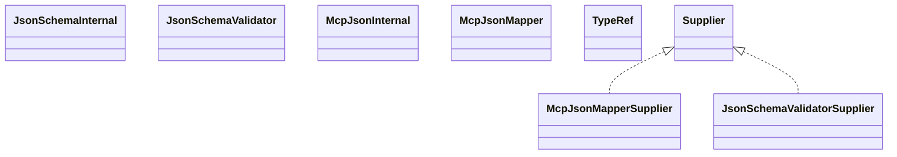

# mcp-json-0.17.2.jar

[Group index](README.md) | [All archives](../README.md)

## Scope and provenance

- **Donor:** `SQX_145_REFERENCE_ROOT/internal/libs/mcp-json-0.17.2.jar`.
- **SHA-256:** `6df99ef400836bd213d63895684eb066d36e1a9b759bd38342c32a6b9b0b6e4f`; accessed 2026-10-06; captured `2026-10-06T18:54:51.906614+00:00`.
- **Classes:** 8 raw entries; 8 unique entry names. Duplicate occurrence indices are zero-based.
- **Inspection:** read-only ZIP hashing and class-file structural parsing; signatures/descriptors, modifiers, hierarchy and references only. Bytecode bodies are hashed, not published.
- **Allocation:** proposed `FEAT-HOST-MCP-JSON`, P02; [roadmap](../../sqx-full-application-roadmap.md). Domain README registration remains required.
- **Repository:** `01067f00031428613c6394064ca1bcadc1ba00ee`; review state unreviewed. Download label 145-dev1; installed build/activation and runtime equivalence unverified.
- **Limit:** every class/member is inventoried; declaration coverage does not establish consumed calls, defaults, formulas, failure semantics or algorithm parity.
- **Archive/resource index:** [079.json](../../../evidence/sqx145/archives/145/079.json).

## Complete member declarations

Member shards contain exact JVM names/descriptors, access flags, generic signatures, throws types, declared fields/methods, superclass/interfaces and referenced class names. All classes, nested/synthetic members and overloads are retained. Code length/hash is structural evidence, not a normalized algorithm comparison.

- [001.json](../../../evidence/sqx145/members/079/001.json) — SHA-256 `6495419c980e154de7db89ebd055557e1b0e53529a606b4d556c8e381085f806`.

## Focused structural diagram

Up to twelve non-nested classes; arrows show declared inheritance/interfaces only. External type names are not evidence of an available body or an executed dependency.

## Class inventory

| Archive entry | Occurrence | Class SHA-256 | Fields | Methods |
| --- | ---: | --- | ---: | ---: |
| `io/modelcontextprotocol/json/McpJsonMapperSupplier.class` | 0 | `fa578ef33837fcbc9a9033cc8e6c0de74e96902a9e75a7f6993285efb568ae0d` | 0 | 0 |
| `io/modelcontextprotocol/json/schema/JsonSchemaInternal.class` | 0 | `d9056e4a2b4ad96430149b782e3a16624defb682d02b8f11216eb7c79657035e` | 1 | 9 |
| `io/modelcontextprotocol/json/schema/JsonSchemaValidator.class` | 0 | `b4ab17b4a858e4168edba948c37b9e9aa1fdeab7aca117cee2c44e3c47f6a1e0` | 0 | 3 |
| `io/modelcontextprotocol/json/schema/JsonSchemaValidator$ValidationResponse.class` | 0 | `d3df0a5b44b147d76a31c94f0b787df5c82ae489fcb84f106993a7648d8ab7a3` | 3 | 9 |
| `io/modelcontextprotocol/json/schema/JsonSchemaValidatorSupplier.class` | 0 | `657d9a5def6f2ccaf259ee948c6e06b6e8aa270f95f54ce385f5617a022ff008` | 0 | 0 |
| `io/modelcontextprotocol/json/McpJsonInternal.class` | 0 | `eaf94b264f865e6cc6c120e9b09eca3709ebbe83c64a1aa8607f455b462341f8` | 1 | 9 |
| `io/modelcontextprotocol/json/McpJsonMapper.class` | 0 | `e625202251154d75cb493ea23967896b780dff8e8013de996b700fa06081ab90` | 0 | 10 |
| `io/modelcontextprotocol/json/TypeRef.class` | 0 | `2fc4f10fbc5669f6bec86bf05cd144ddc02c0365afff850a0d5c7a7572a4fa1c` | 1 | 2 |
