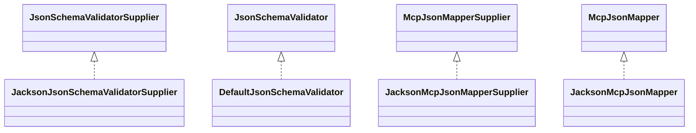

# mcp-json-jackson2-0.17.2.jar

[Group index](README.md) | [All archives](../README.md)

## Scope and provenance

- **Donor:** `SQX_145_REFERENCE_ROOT/internal/libs/mcp-json-jackson2-0.17.2.jar`.
- **SHA-256:** `dbe542c16244de30872ce5edcf1795ef4101acd4ac400e8c8081b0048feac0a7`; accessed 2026-10-06; captured `2026-10-06T18:54:51.906614+00:00`.
- **Classes:** 5 raw entries; 5 unique entry names. Duplicate occurrence indices are zero-based.
- **Inspection:** read-only ZIP hashing and class-file structural parsing; signatures/descriptors, modifiers, hierarchy and references only. Bytecode bodies are hashed, not published.
- **Allocation:** proposed `FEAT-PRODUCT-MCP-JSON-JACKSON2-145`, P17; [roadmap](../../sqx-full-application-roadmap.md). Domain README registration remains required.
- **Repository:** `01067f00031428613c6394064ca1bcadc1ba00ee`; review state unreviewed. Download label 145-dev1; installed build/activation and runtime equivalence unverified.
- **Limit:** every class/member is inventoried; declaration coverage does not establish consumed calls, defaults, formulas, failure semantics or algorithm parity.
- **Archive/resource index:** [080.json](../../../evidence/sqx145/archives/145/080.json).

## Complete member declarations

Member shards contain exact JVM names/descriptors, access flags, generic signatures, throws types, declared fields/methods, superclass/interfaces and referenced class names. All classes, nested/synthetic members and overloads are retained. Code length/hash is structural evidence, not a normalized algorithm comparison.

- [001.json](../../../evidence/sqx145/members/080/001.json) — SHA-256 `cb00b31a2b4a79828abb5fb066f1d70c7fc019eb72f5ffde4c1ffa20b4a45628`.

## Focused structural diagram

Up to twelve non-nested classes; arrows show declared inheritance/interfaces only. External type names are not evidence of an available body or an executed dependency.

## Class inventory

| Archive entry | Occurrence | Class SHA-256 | Fields | Methods |
| --- | ---: | --- | ---: | ---: |
| `io/modelcontextprotocol/json/schema/jackson/JacksonJsonSchemaValidatorSupplier.class` | 0 | `31ca6fd4f919bf8a819be885d4cd6f395d95424eab4043b67ffb452ad9fc7628` | 0 | 3 |
| `io/modelcontextprotocol/json/schema/jackson/DefaultJsonSchemaValidator$1.class` | 0 | `382fe7bf61f74d05cafbf316524cb6b394cd24c665c9d3ceff3c070a0c3637bc` | 1 | 1 |
| `io/modelcontextprotocol/json/schema/jackson/DefaultJsonSchemaValidator.class` | 0 | `67404101a6736e431c5cf61ff3337e8987ae51fe0a6794beccf6ac2d55584c42` | 4 | 9 |
| `io/modelcontextprotocol/json/jackson/JacksonMcpJsonMapperSupplier.class` | 0 | `02ca74e62ec03430cfcd5c8ba1c17027779b3ad1f7a0d92686561ab54deb8d6e` | 0 | 3 |
| `io/modelcontextprotocol/json/jackson/JacksonMcpJsonMapper.class` | 0 | `40387b14013114b6c4041425ec9ef4c44e44221c38068144645f5d67f126da5e` | 1 | 10 |
