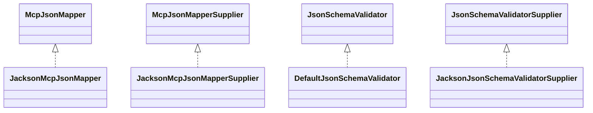

# mcp-json-jackson2.jar

[Group index](README.md) | [All archives](../README.md)

## Scope and provenance

- **Donor:** `SQX_145_REFERENCE_ROOT/internal/libs/mcp-json-jackson2.jar`.
- **SHA-256:** `eda0173d9183e272576cc5581ae58ff437bdadd9e6d0c3410045f86e3de10c8a`; accessed 2026-10-06; captured `2026-10-06T18:54:51.906614+00:00`.
- **Classes:** 5 raw entries; 5 unique entry names. Duplicate occurrence indices are zero-based.
- **Inspection:** read-only ZIP hashing and class-file structural parsing; signatures/descriptors, modifiers, hierarchy and references only. Bytecode bodies are hashed, not published.
- **Allocation:** proposed `FEAT-PRODUCT-MCP-JSON-JACKSON2`, P17; [roadmap](../../sqx-full-application-roadmap.md). Domain README registration remains required.
- **Repository:** `01067f00031428613c6394064ca1bcadc1ba00ee`; review state unreviewed. Download label 145-dev1; installed build/activation and runtime equivalence unverified.
- **Limit:** every class/member is inventoried; declaration coverage does not establish consumed calls, defaults, formulas, failure semantics or algorithm parity.
- **Archive/resource index:** [081.json](../../../evidence/sqx145/archives/145/081.json).

## Complete member declarations

Member shards contain exact JVM names/descriptors, access flags, generic signatures, throws types, declared fields/methods, superclass/interfaces and referenced class names. All classes, nested/synthetic members and overloads are retained. Code length/hash is structural evidence, not a normalized algorithm comparison.

- [001.json](../../../evidence/sqx145/members/081/001.json) — SHA-256 `b425652e6178c2c3da4f156d5b36d55d215bb063f28bde4221d1008473e9ad12`.

## Focused structural diagram

Up to twelve non-nested classes; arrows show declared inheritance/interfaces only. External type names are not evidence of an available body or an executed dependency.

## Class inventory

| Archive entry | Occurrence | Class SHA-256 | Fields | Methods |
| --- | ---: | --- | ---: | ---: |
| `io/modelcontextprotocol/json/jackson2/JacksonMcpJsonMapper.class` | 0 | `4b06a96afa8d4efa7bf0805f8a5f0cc998543d912864c440bc984fda5cbbdee3` | 1 | 10 |
| `io/modelcontextprotocol/json/jackson2/JacksonMcpJsonMapperSupplier.class` | 0 | `85992aa4b6522f6982d9463712222aa8b8a77af7b72dc99419c3dd8b5fed538d` | 0 | 3 |
| `io/modelcontextprotocol/json/schema/jackson2/DefaultJsonSchemaValidator$1.class` | 0 | `1a50e3ea7ec312da3f007e66fde328ad938ee9a2d0e5ccee42e19e06a8115b98` | 1 | 1 |
| `io/modelcontextprotocol/json/schema/jackson2/DefaultJsonSchemaValidator.class` | 0 | `0bc3954c601e89958bbb81e55c643cd084547b17af9f0b2bf845fae87b732ef2` | 4 | 9 |
| `io/modelcontextprotocol/json/schema/jackson2/JacksonJsonSchemaValidatorSupplier.class` | 0 | `053a23abc72ed05a24386491cb0faf2d5df126f8e65bd2c594f96fbfa37558b1` | 0 | 3 |
