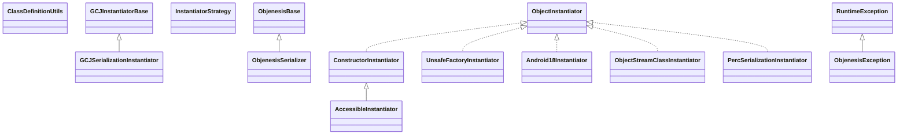

# objenesis-2.5.1.jar

[Group index](README.md) | [All archives](../README.md)

## Scope and provenance

- **Donor:** `SQX_145_REFERENCE_ROOT/internal/libs/objenesis-2.5.1.jar`.
- **SHA-256:** `b043f03e466752f7f03e2326a3b13a49b7c649f8f2a2dc87715827e24f73d9c6`; accessed 2026-10-06; captured `2026-10-06T18:54:51.906614+00:00`.
- **Classes:** 43 raw entries; 43 unique entry names. Duplicate occurrence indices are zero-based.
- **Inspection:** read-only ZIP hashing and class-file structural parsing; signatures/descriptors, modifiers, hierarchy and references only. Bytecode bodies are hashed, not published.
- **Allocation:** proposed `FEAT-HOST-OBJENESIS`, P02; [roadmap](../../sqx-full-application-roadmap.md). Domain README registration remains required.
- **Repository:** `01067f00031428613c6394064ca1bcadc1ba00ee`; review state unreviewed. Download label 145-dev1; installed build/activation and runtime equivalence unverified.
- **Limit:** every class/member is inventoried; declaration coverage does not establish consumed calls, defaults, formulas, failure semantics or algorithm parity.
- **Archive/resource index:** [083.json](../../../evidence/sqx145/archives/145/083.json).

## Complete member declarations

Member shards contain exact JVM names/descriptors, access flags, generic signatures, throws types, declared fields/methods, superclass/interfaces and referenced class names. All classes, nested/synthetic members and overloads are retained. Code length/hash is structural evidence, not a normalized algorithm comparison.

- [001.json](../../../evidence/sqx145/members/083/001.json) — SHA-256 `91325e1c14a28a5a61849a99500fe4fec464ebf0766a9454dd0cada61601fbe2`.

## Focused structural diagram

Up to twelve non-nested classes; arrows show declared inheritance/interfaces only. External type names are not evidence of an available body or an executed dependency.

## Class inventory

| Archive entry | Occurrence | Class SHA-256 | Fields | Methods |
| --- | ---: | --- | ---: | ---: |
| `org/objenesis/instantiator/basic/AccessibleInstantiator.class` | 0 | `0f8a80552ce2ecdb3661448291beea5499c872073b93475aa1528e029e72245c` | 0 | 1 |
| `org/objenesis/instantiator/basic/ClassDefinitionUtils$1.class` | 0 | `3c65ac2b648abe708eadda34518fae75fcde4ce73db025f9003f7f5cd1fb392a` | 0 | 3 |
| `org/objenesis/instantiator/basic/ClassDefinitionUtils$2.class` | 0 | `6e1c2fc33d048166525cc82434648ac0835ec9880a96c0d13841a096e2ffadde` | 0 | 2 |
| `org/objenesis/instantiator/basic/ClassDefinitionUtils.class` | 0 | `62d0e26002acc1fec3819928825c499e19708ab1d3cbac92074b501bee22edbf` | 32 | 10 |
| `org/objenesis/instantiator/gcj/GCJSerializationInstantiator.class` | 0 | `6cf980c189fb1e24dbb2e9f863d82ff02e141bc7a01424c253971bcff03e1ad6` | 1 | 2 |
| `org/objenesis/ObjenesisSerializer.class` | 0 | `78b2f7de0b3d1df31a63a716a569330ea4e17eea961bc6ddb91ae80e2504296d` | 0 | 2 |
| `org/objenesis/instantiator/basic/ConstructorInstantiator.class` | 0 | `ec2465a06db588e9f8c26b95c762023f6b1a4016956ac283a46656be2246cf23` | 1 | 2 |
| `org/objenesis/instantiator/basic/ObjectInputStreamInstantiator$MockStream.class` | 0 | `46620d9a817878b938cf6dffaf277d0e1f593f0d468686c9249c2258821db988` | 8 | 7 |
| `org/objenesis/instantiator/ObjectInstantiator.class` | 0 | `cf802a3dc1696d0d1fedcfff2bf0f5d99b4f6a437c3af9c3164e20378ed9289d` | 0 | 1 |
| `org/objenesis/instantiator/sun/UnsafeFactoryInstantiator.class` | 0 | `e44dbb47f49ecc0e4cd5c0373cb7f16de35854e3fcd2d0749eab5d7d37837466` | 2 | 2 |
| `org/objenesis/strategy/InstantiatorStrategy.class` | 0 | `ea3e2cd9285283a83d30619c6f60d7217d4dcbb80adb129f8acb15d5c7f13fcc` | 0 | 1 |
| `org/objenesis/instantiator/android/Android18Instantiator.class` | 0 | `0ccdc30da0fd26c31a217ac323cd4d7bb262fc5f8814a677fd1275123b56f9c4` | 3 | 4 |
| `org/objenesis/instantiator/basic/ObjectStreamClassInstantiator.class` | 0 | `5f00e1ff74b433a788a561cfd2492ca9b58270260c3ca582ae83d6e8404c8f86` | 2 | 3 |
| `org/objenesis/instantiator/perc/PercSerializationInstantiator.class` | 0 | `631503ada814e68d3393619125b4cbf00fcc9776555bf1eb11f54c3d4fccb5a6` | 2 | 2 |
| `org/objenesis/ObjenesisException.class` | 0 | `39de71b23a1f9ce933d6c9dcc40c7ea567d87c77c395eee6defd92fa581ccbf0` | 1 | 3 |
| `org/objenesis/strategy/SingleInstantiatorStrategy.class` | 0 | `369f7ccae6b4d7f430aebcb978f34d126da9ff8690ec00c9be70044192cf05da` | 1 | 2 |
| `org/objenesis/instantiator/annotations/Instantiator.class` | 0 | `74368d0439c3ea40a13e51e92a3374b15bc81c6c65f050d7dd2e331633ba7003` | 0 | 1 |
| `org/objenesis/instantiator/basic/FailingInstantiator.class` | 0 | `ce69ac664e828a654f9b0f6d36a38d78154b999f9764b52906ac042a12097a43` | 0 | 2 |
| `org/objenesis/instantiator/basic/ProxyingInstantiator.class` | 0 | `fd658da636547d3c6d1aed48a6be640d5d3c1ff02719efd8ca066160f550edfd` | 14 | 4 |
| `org/objenesis/Objenesis.class` | 0 | `734aa7eaf10e5e9e46d63b882455d281b4369d8efb57c29f8393a3fe9fdf9180` | 0 | 2 |
| `org/objenesis/strategy/PlatformDescription.class` | 0 | `9e25ea579edee5dca42f4dface12a88b9952b8990156cc847dad660a3bcf7535` | 16 | 11 |
| `org/objenesis/strategy/StdInstantiatorStrategy.class` | 0 | `ffdbf2875a6cda3e89cb1606ae9f14bd1898d5bcfd074491a0ec06f622d652a5` | 0 | 2 |
| `org/objenesis/instantiator/android/AndroidSerializationInstantiator.class` | 0 | `43679bd990bcddf72b7636a0431442a8975cb9696a14f5b36d413de469b1624d` | 3 | 3 |
| `org/objenesis/instantiator/basic/NewInstanceInstantiator.class` | 0 | `a9722f125c5391c1850132b1ef714dd9766afe3a400133379e2b6167b9dada41` | 1 | 2 |
| `org/objenesis/instantiator/gcj/GCJInstantiatorBase$DummyStream.class` | 0 | `7832d3734f1651ca597da5b444222d1248a7a0bf6903c3ddf95ed4aad29e196f` | 0 | 1 |
| `org/objenesis/instantiator/sun/SunReflectionFactoryHelper.class` | 0 | `653a9427491f61311c76775b6eecd2c1077bd3202628c5b715a1aa573b541a48` | 0 | 5 |
| `org/objenesis/instantiator/sun/SunReflectionFactorySerializationInstantiator.class` | 0 | `7ec4ab547baa6aadd434a8e18430b2bc6486eb4c7c9e228eaba1bda81140c35e` | 1 | 2 |
| `org/objenesis/strategy/BaseInstantiatorStrategy.class` | 0 | `2c19f1196b62f064409ab12b66e7099011349014bac4c4e21119a1a28a32c116` | 0 | 1 |
| `org/objenesis/instantiator/android/Android17Instantiator.class` | 0 | `fae6b70b35557fab8f2efcde69c5ec560a213ab0dcf4f1779df3250dfae6979c` | 3 | 4 |
| `org/objenesis/instantiator/basic/NullInstantiator.class` | 0 | `f184d4d9a36202c2f8617a74e4893e378a9876571dcab5989b002f4bbf308ace` | 0 | 2 |
| `org/objenesis/instantiator/gcj/GCJInstantiatorBase.class` | 0 | `996edf45e0f1f99a38189a665188577ddb71f1f8c1e2ebee67c6d98fe7b124f1` | 3 | 4 |
| `org/objenesis/instantiator/sun/SunReflectionFactoryInstantiator.class` | 0 | `e6f36d19335cf29822b73285b704b87d56f60e5090b4babf49d2d33cd642de90` | 1 | 3 |
| `org/objenesis/ObjenesisStd.class` | 0 | `aaf8432fdad5b4845c22767d920e5dc49d1c9926e78c369d791a64410aa0a55d` | 0 | 2 |
| `org/objenesis/instantiator/android/Android10Instantiator.class` | 0 | `28174d32a3e47a3f19b4c5309b4aef8adf2bbabc715a47b94a3b0c2736426b6d` | 2 | 3 |
| `org/objenesis/instantiator/gcj/GCJInstantiator.class` | 0 | `17074af8ae092a0b8b426a1f7448af11dc116a35c370728a2441195ed13cc1c4` | 0 | 2 |
| `org/objenesis/instantiator/sun/MagicInstantiator.class` | 0 | `c3db960f32338bad7f6c184ab3942902f582ab80f136f344c3691625d75158de` | 25 | 6 |
| `org/objenesis/strategy/SerializingInstantiatorStrategy.class` | 0 | `e10f05710c10e12934ded4581ad6f8ac868c51fc3c499145478130727e1c8c3e` | 0 | 2 |
| `org/objenesis/instantiator/annotations/Typology.class` | 0 | `847a10da073b9846c15c3c728ea4cc337526f8bb2f09cdb70a09807df8873853` | 5 | 4 |
| `org/objenesis/instantiator/basic/ObjectInputStreamInstantiator.class` | 0 | `e24a03ca6085b83b837d9ee5bc5a6ddc33e80ab4d461e9f58df7a925cd96514d` | 1 | 2 |
| `org/objenesis/instantiator/perc/PercInstantiator.class` | 0 | `c4ea68c190c6735b124e62d8b84d3dbe8441094531631b0494bc4d1664651fd2` | 2 | 2 |
| `org/objenesis/instantiator/SerializationInstantiatorHelper.class` | 0 | `5675505c63b287117409443372ec88f04da2f3e3d355cea3f143d525bd4ed2d5` | 0 | 2 |
| `org/objenesis/ObjenesisBase.class` | 0 | `3ad4c7d80a5ee79f9ee7dc38ae68da674b9acd54225788405ea5e1a742398721` | 2 | 5 |
| `org/objenesis/ObjenesisHelper.class` | 0 | `26cfe73cb9833cc03ec00bc0d8a435bb27faf3b3d5b11ae70107348462532d8d` | 2 | 6 |
